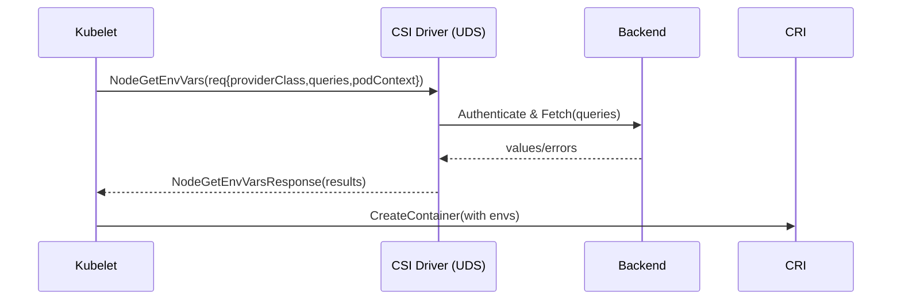
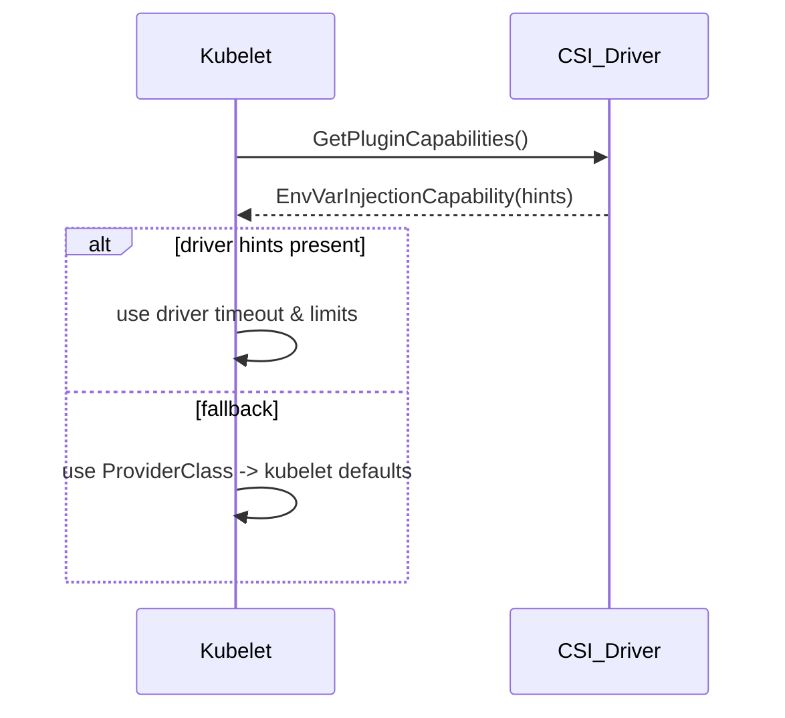
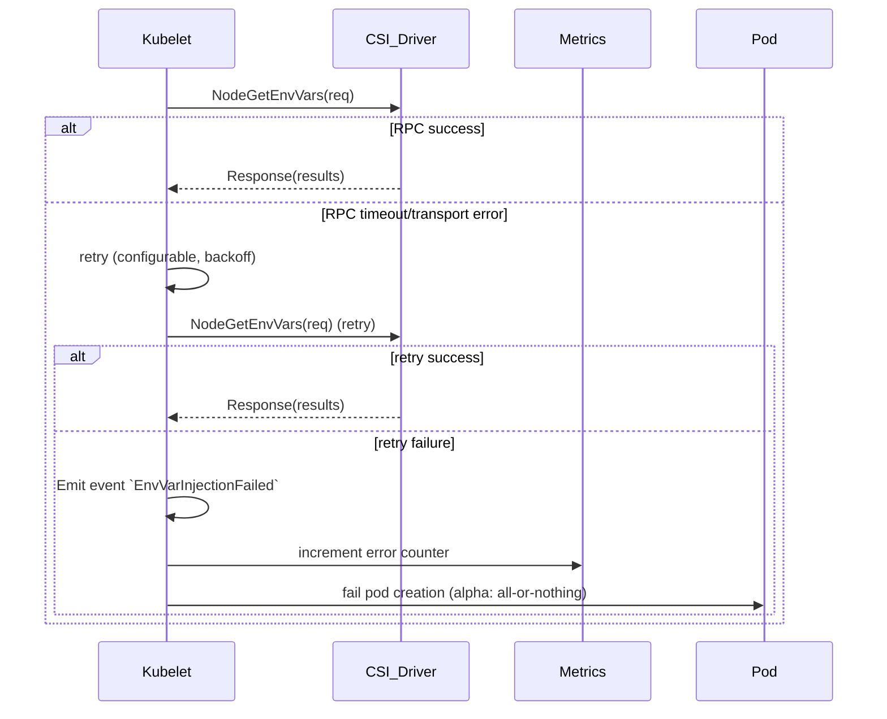

# KEP-NNNN: CSI Direct In-Memory Environment Variable Injection

<!-- toc -->
- [Release Signoff Checklist](#release-signoff-checklist)
- [Summary](#summary)
- [Motivation](#motivation)
  - [Goals](#goals)
  - [Non-Goals](#non-goals)
- [Proposal](#proposal)
  - [User Stories](#user-stories)
  - [Risks and Mitigations](#risks-and-mitigations)
- [Design Details](#design-details)
  - [CSI Node RPC: NodeGetEnvVars](#csi-node-rpc-nodegetenvvars)
  - [API Changes](#api-changes)
  - [Kubelet Integration](#kubelet-integration)
  - [Security Model](#security-model)
  - [Test Plan](#test-plan)
  - [Graduation Criteria](#graduation-criteria)
  - [Upgrade / Downgrade Strategy](#upgrade--downgrade-strategy)
  - [Version Skew Strategy](#version-skew-strategy)
- [Production Readiness Review Questionnaire](#production-readiness-review-questionnaire)
  - [Feature Enablement and Rollback](#feature-enablement-and-rollback)
  - [Rollout, Upgrade and Rollback Planning](#rollout-upgrade-and-rollback-planning)
  - [Monitoring Requirements](#monitoring-requirements)
  - [Dependencies](#dependencies)
  - [Scalability](#scalability)
  - [Troubleshooting](#troubleshooting)
- [Implementation History](#implementation-history)
- [Drawbacks](#drawbacks)
- [Alternatives](#alternatives)
- [Infrastructure Needed](#infrastructure-needed)
<!-- /toc -->

## Release Signoff Checklist

Items marked with (R) are required *prior to targeting to a milestone / release*.

- [ ] (R) Enhancement issue in release milestone, which links to KEP dir in [kubernetes/enhancements] (not the initial KEP PR)
- [ ] (R) KEP approvers have approved the KEP status as `implementable`
- [ ] (R) Design details are appropriately documented
- [ ] (R) Test plan is in place, giving consideration to SIG Architecture and SIG Testing input (including test refactors)
  - [ ] e2e Tests for all Beta API Operations (endpoints)
  - [ ] (R) Ensure GA e2e tests for meet requirements for [Conformance Tests](https://github.com/kubernetes/community/blob/master/contributors/devel/sig-architecture/conformance-tests.md) 
  - [ ] (R) Minimum Two Week Window for GA e2e tests to prove flake free
- [ ] (R) Graduation criteria is in place
  - [ ] (R) [all GA Endpoints](https://github.com/kubernetes/community/pull/1806) must be hit by [Conformance Tests](https://github.com/kubernetes/community/blob/master/contributors/devel/sig-architecture/conformance-tests.md) 
- [ ] (R) Production readiness review completed
- [ ] (R) Production readiness review approved
- [ ] (R) Security checklist completed (audit logging, driver identity validation tests, documented mitigations)
- [ ] "Implementation History" section is up-to-date for milestone
- [ ] User-facing documentation has been created in [kubernetes/website], for publication to [kubernetes.io]
- [ ] Supporting documentation—e.g., additional design documents, links to mailing list discussions/SIG meetings, relevant PRs/issues, release notes

[kubernetes.io]: https://kubernetes.io/
[kubernetes/enhancements]: https://git.k8s.io/enhancements
[kubernetes/kubernetes]: https://git.k8s.io/kubernetes
[kubernetes/website]: https://git.k8s.io/website

## Summary

This KEP proposes extending the Container Storage Interface (CSI) specification with an optional `NodeGetEnvVars` RPC in the Node service. The kubelet calls this RPC over a local Unix Domain Socket during pod/container setup, receives in-memory key-value pairs from the CSI driver, and injects them directly into the container's process environment via the CRI before the container starts.

**Novelty**: This proposal is original—no existing KEP, CSI specification feature, or production driver implements direct environment variable injection via CSI as of February 2026. Current alternatives rely on:
- CSI volume mounts with Kubernetes Secrets sync (Secrets Store CSI Driver)
- Init containers with file-based environment variable loading (KEP-3721)
- Manual DaemonSets or privileged containers for metadata access
- Direct application-level IMDS polling or file reads from mounted volumes

**No existing implementation matches the direct CRI injection user stories.** All current patterns are file-mount workarounds requiring sync to etcd, init containers, or application code changes.

This mechanism is **intentionally generic and extensible**, enabling diverse use cases through CSI driver implementations:

**Current Examples (Non-Exhaustive)**:
- **Secret management**: External providers (Vault, AWS Secrets Manager, Azure Key Vault)
- **Cloud provider metadata**: Instance IDs, availability zones, node attributes
- **Operating system information**: Hostname, kernel version, hardware details
- **Storage system integration**: SAN array identifiers, volume metadata, performance tiers
- **Object storage**: Bucket endpoints, access patterns, lifecycle policies
- **Network infrastructure**: Switch ports, VLAN IDs, network topology data
- **Edge/IoT**: Device identifiers, sensor data, MQTT ACL queries
- **FinOps**: Spot instance cost data, resource tagging
- **Custom platform services**: Service mesh endpoints, feature flags, canary routing

The CSI extension point allows **any provider** that can deliver key-value data to implement environment variable injection—the mechanism is deliberately open-ended to support current and future integration needs.

Values are delivered in-memory with no disk or etcd persistence, providing superior security, isolation, and performance compared to current patterns.

**Implementation prioritization:** Prototype work will focus on extending the Secrets Store CSI Driver as the initial implementation target (Vault, AWS Secrets Manager, Azure Key Vault, GCP Secret Manager). This leverages an existing, mature plugin ecosystem and addresses the highest-impact use case (external secrets) without reinventing provider authentication, caching, and identity flows. The prototype (Q2 2026, Week 1) will demo at least Vault and AWS plugins and will document plugin-specific validation patterns (for example, `vaultRole` checks) in the Security Model and driver author guide.

## Motivation

### Background

Kubernetes workloads frequently require values from external systems, delivered as environment variables. Existing approaches either persist secrets in **etcd**, write to **disk** (files/volumes or env-from-file), run custom **init containers**, or deploy privileged **DaemonSets** for metadata access. None provide **direct CRI-level injection** from external sources under centralized administrative control.

Kubernetes workloads frequently require external information injected as environment variables from multiple sources:

**Secrets Management:**
- External secret stores (Vault, AWS Secrets Manager, Azure Key Vault, Google Secret Manager)
- Current approaches have significant trade-offs

**Cloud Provider Metadata:**
- Instance identifiers, availability zones, regions
- Spot instance status, node lifecycle information
- Currently requires custom DaemonSets, init containers, or IMDS polling

**Operating System Information:**
- Hostname, kernel version, hardware capabilities
- Node-specific attributes and labels
- Typically requires privileged access or host mounts

### Current Limitations

**For Secrets:**
- Native Kubernetes Secrets → stored in etcd (risk if control plane is compromised)
- Secrets Store CSI Driver (file mount) → excellent for volumes, but environment variables require optional sync to native Secrets (etcd exposure) or application-level file reads (added complexity, no native CRI injection)
- Init containers fetching secrets → introduce startup latency, extra resource usage, shared namespaces (potential leakage), and developer-written logic
- Mutating admission webhooks (e.g., sidecar injection) → more generic, larger attack/audit surface, harder to lock down compared to CRI-level injection
- KEP-3721 (environment variable files via init container + fileKeyRef) → allows indirect passing via shared `emptyDir` volume + kubelet file parsing; still relies on developer-written init containers, uses temporary disk, and is less specialized ([KEP-3721](https://github.com/kubernetes/enhancements/issues/3721)).

**For Cloud Metadata:**
- DaemonSets with hostPath mounts → requires privileged access, cluster-wide deployment overhead
- Init containers polling IMDS → latency, retry logic complexity, credential management
- Downward API → limited to Kubernetes-known fields, not extensible to cloud-specific data
- Custom solutions → fragmentation, maintenance burden, security concerns

**For OS Information:**
- Direct host access → requires privileged containers or hostPath volumes
- Manual mounting of `/proc`, `/sys` → security risk, violates least privilege
- Node labels → static at node registration, doesn't capture dynamic state

**Edge/IoT Scenarios:**
- Device identifiers, sensor metadata, ACL policies
- Requires specialized data sources not available via Downward API

**FinOps/Cost Management:**
- Spot instance pricing, reservation status
- Resource tagging for cost allocation

**Gap Analysis**: Current user stories all use **indirect patterns**:
- Admins create `SecretProviderClass` → CSI mounts files → optional sync to `Secret` → devs use `secretKeyRef`
- Pods `curl 169.254.169.254` (IMDS) inside init containers or application code
- Downward API provides limited fields like `metadata.name` via `fieldRef`

**None provide direct CRI-level injection from external sources with centralized admin control.**

### Goals

- Unified, provider-agnostic interface for injecting external data as environment variables
- **Zero etcd** exposure and **zero disk** writes for sensitive values
- **CRI-level injection** before process start for strong isolation
- **Low latency** via a single local UDS call with **batched** keys
- **Centralized admin control** with `ProviderClass` objects and **RBAC/allowlist** enforcement
- **Reduce** the number of **init containers** and **DaemonSets** required for metadata/secret fetching

### Non-Goals

- Replacing CSI volume-based delivery (files)
- Built-in secret rotation without Pod restart (env vars are immutable post-start)
- Non-local CSI calls (UDS-only for security)
- Real-time streaming updates (future work)

## Proposal

### User Stories

See detailed user stories in the Design Details section below.

### Risks and Mitigations

**Risk: CSI driver compromise**
- Mitigation: Same trust model as volume drivers; RBAC on ProviderClass; admission controls

**Risk: Performance impact on pod startup**
- Mitigation: Local UDS calls only; batched RPC; driver timeout enforcement; capability checks

**Risk: Debugging difficulty**
- Mitigation: Enhanced kubectl describe; audit logging; driver status reporting

**Risk: Secret sprawl**
- Mitigation: ProviderClass allowlist; namespace restrictions; audit trails

**Risk: CSI spec ratification delays**
- Mitigation: If CSI spec ratification takes longer than expected, proceed with an experimental, opt-in implementation behind the `CSIDirectEnvInjection` feature gate in Alpha/Beta to validate real-world usage and driver behavior while continuing to iterate on the proto with `kubernetes-csi/spec` maintainers. Early outreach to CSI maintainers (open an issue and ping maintainers after KEP assignment) is recommended so the proto can be iterated on in parallel with the Kubernetes prototype.

**ProviderClass misconfiguration: comparison to existing CSI patterns**

The following table compares the operational impact, detection channels, and mitigations for ProviderClass misconfigurations (this KEP) with analogous misconfigurations in existing CSI volume workflows.

| Scenario | Impact | Detection | Mitigation |
|---------|--------|-----------|------------|
| Existing CSI (volume misconfig) | Pod may fail to mount volumes or start; missing files or mountpoints | kubelet events (Attach/Detach failures), `kubectl describe pod` shows mount errors, node and driver logs | Admission validation for storage classes, RBAC, clear driver events; retries and operator alerts |
| ProviderClass misconfig (env injection) | Pod may fail to start or start without required env vars; failures can be less visible without events | Kubelet events (`EnvVarInjectionFailed` / `EnvVarInjectionSuccess`), ProviderClass admission webhook errors, kubelet logs, metrics (`kubelet_csi_env_injection_errors_total`) | Admission webhook validation for ProviderClass, RBAC enforcement, ProviderClass immutability for security-sensitive fields, explicit kubelet events and documentation/runbooks for operators |

This comparison highlights that many failure modes are analogous and can be mitigated by similar operational controls (admission validation, RBAC, logging, and events).

## Design Details

### CSI Node RPC: NodeGetEnvVars

**CSI Specification Proposal**: This RPC will be proposed to [kubernetes-csi/spec](https://github.com/container-storage-interface/spec) targeting v1.10+. The proposal PR will be linked here once submitted to the CSI community.

**Complete Proto Definition** (extends `csi.proto`):

```protobuf
// Proposed addition to CSI Node Service in csi.proto v1.10+
service Node {
  // Existing RPCs...
  rpc NodePublishVolume(NodePublishVolumeRequest) returns (NodePublishVolumeResponse) {}
  rpc NodeUnpublishVolume(NodeUnpublishVolumeRequest) returns (NodeUnpublishVolumeResponse) {}
  
  // NEW: Environment variable injection RPC
  rpc NodeGetEnvVars(NodeGetEnvVarsRequest) returns (NodeGetEnvVarsResponse) {}
}

message NodeGetEnvVarsRequest {
  // REQUIRED: Name of the ProviderClass resource that configures this driver
  string provider_class_name = 1;
  
  // REQUIRED: Parameters from ProviderClass.spec.parameters
  // Driver uses these for configuration (e.g., vault address, allowed namespaces)
  map<string, string> class_parameters = 2;
  
  // REQUIRED: List of environment variables to fetch
  repeated EnvVarQuery queries = 3;
  
  // REQUIRED: Pod metadata for authorization and validation
  map<string, string> pod_context = 4;  // namespace, serviceAccount, podName, podUID
  
  // OPTIONAL: CSI driver version for compatibility checks
  string version = 5;
}

message EnvVarQuery {
  // REQUIRED: Environment variable name as it will appear in the container
  // Example: "DB_PASSWORD", "AWS_REGION"
  string name = 1;
  
  // REQUIRED: Provider-specific key to fetch
  // Semantics depend on driver implementation:
  //   - Secrets: "secret/data/db-creds", "aws-secret/prod/mysql"
  //   - Cloud metadata: "placement/availability-zone", "instance-id"
  //   - OS info: "os/basic/hostname", "os/kernel/version"
  string key = 2;
  
  // OPTIONAL: Per-variable parameters for this specific query
  // Example: {"version": "2", "field": "password"}
  map<string, string> query_parameters = 3;
  
  // OPTIONAL (Beta): If true, pod can start even if this variable fails to fetch
  // Default: false (all variables required)
  bool optional = 4;
}

message NodeGetEnvVarsResponse {
  // REQUIRED: Results for each requested environment variable
  // Must have one result per query, in the same order as the request
  repeated EnvVarResult results = 1;
}

message EnvVarResult {
  // REQUIRED: Matches EnvVarQuery.name from the request
  string name = 1;
  
  // REQUIRED if successful: The actual value to inject into the container environment
  // MUST be empty if error is set
  string value = 2;
  
  // OPTIONAL: Error message if this specific variable failed to fetch
  // If set, value MUST be empty
  // Example: "key 'secret/data/invalid' not found"
  string error = 3;
}

// New capability for GetPluginCapabilities
message NodeServiceCapability {
  message RPC {
    enum Type {
      UNKNOWN = 0;
      STAGE_UNSTAGE_VOLUME = 1;
      GET_VOLUME_STATS = 2;
      EXPAND_VOLUME = 3;
      VOLUME_CONDITION = 4;
      VOLUME_MOUNT_GROUP = 5;
      // ... existing types
      
      // NEW: Indicates driver supports NodeGetEnvVars RPC
      ENV_VAR_INJECTION = 10;
    }
    Type type = 1;
  }
  
  oneof type {
    RPC rpc = 1;
  }
}
```

**Call Flow** (detailed):

```
┌─────────────┐                ┌──────────────┐                ┌─────────────┐
│   Kubelet   │                │  CSI Driver  │                │   Backend   │
│             │                │  (via UDS)   │                │   (Vault)   │
└──────┬──────┘                └──────┬───────┘                └──────┬──────┘
       │                              │                               │
       │ 1. Create container          │                               │
       │    with csiSecretRef         │                               │
       ├──────────────────────────────┤                               │
       │ 2. Batch all env var queries │                               │
       │                              │                               │
       │ 3. NodeGetEnvVars(           │                               │
       │      provider_class_name,    │                               │
       │      class_parameters,       │                               │
       │      queries[],              │                               │
       │      pod_context)            │                               │
       ├─────────────────────────────>│                               │
       │                              │ 4. Validate pod_context       │
       │                              │    (namespace, SA, allowlist) │
       │                              │                               │
       │                              │ 5. Fetch from backend         │
       │                              ├──────────────────────────────>│
       │                              │                               │
       │                              │ 6. Return values              │
       │                              │<──────────────────────────────┤
       │                              │                               │
       │ 7. NodeGetEnvVarsResponse(  │                               │
       │      results[])              │                               │
       │<─────────────────────────────┤                               │
       │                              │                               │
       │ 8. Inject into container env │                               │
       │    via CRI CreateContainer   │                               │
       │                              │                               │
```

**Example RPC Exchange**:

Request:
```json
{
  "provider_class_name": "vault-secrets",
  "class_parameters": {
    "vaultAddr": "https://vault.example.com",
    "vaultRole": "myapp-role",
    "allowedNamespaces": "production",
    "allowedFields": "secret/data/*"
  },
  "queries": [
    {
      "name": "DB_PASSWORD",
      "key": "secret/data/db-creds",
      "query_parameters": {"field": "password"}
    },
    {
      "name": "DB_USERNAME",
      "key": "secret/data/db-creds",
      "query_parameters": {"field": "username"}
    }
  ],
  "pod_context": {
    "namespace": "production",
    "serviceAccount": "myapp",
    "podName": "myapp-7d4f5c8b9-xk2lp",
    "podUID": "a1b2c3d4-e5f6-7g8h-9i0j-k1l2m3n4o5p6"
  }
}
```

Response (success):
```json
{
  "results": [
    {
      "name": "DB_PASSWORD",
      "value": "sup3rs3cr3t",
      "error": ""
    },
    {
      "name": "DB_USERNAME",
      "value": "admin",
      "error": ""
    }
  ]
}
```

Response (partial failure - Alpha behavior: entire RPC fails):
```json
{
  "error": {
    "code": "InvalidArgument",
    "message": "Key 'secret/data/db-creds' not in allowedFields pattern 'secret/data/app/*'"
  }
}
```

**No disk writes. No etcd sync. Direct CRI injection.**

### Sequence Diagrams

Below are three Mermaid sequence diagrams illustrating common flows. They are intended for reviewers and implementers to disambiguate time ordering and decision points.

#### End-to-end flow



#### Capability negotiation & timeout decision



#### Error handling and retry flow



These diagrams can be converted to images for the KEP PR (e.g., using mermaid CLI) and included in the enhancement PR assets. See `assets/diagrams/README.md` for instructions to render Mermaid diagrams locally (requires installing a Chromium binary for Puppeteer).

### Limits & behavior

- **Driver-advertised limits and kubelet fallbacks**: 
  - Kubelet **prefers** driver-advertised limits and hints (when available) exposed via driver capabilities or a `NodeGetEnvVars` capability metadata (e.g., max payload, per-variable max, preferred RPC timeout, max in-flight). Drivers SHOULD advertise these values when appropriate.
  - If a driver does not advertise limits, kubelet **falls back** to conservative defaults (RPC timeout: 5s; max total payload: 64KB; max per-variable length: 16KB; per-driver max in-flight: 100).
  - Fallback defaults are configurable via kubelet flags (names and exact semantics to be coordinated with SIG-Node); these flags are **fallbacks only** and are not authoritative when a driver provides its own limits.
- **Max total payload per RPC**: 65536 bytes (64KB). Rejections are counted in metrics (`kubelet_csi_env_injection_errors_total{error_type="oversize"}`).
- **Error mapping**: Drivers SHOULD map common failure modes to gRPC statuses as follows: NotFound → NotFound, Unauthorized → PermissionDenied, InvalidArgument → InvalidArgument (e.g., oversize), backend errors → Internal.
- **Idempotency & restarts**: The kubelet guarantees NodeGetEnvVars completes and values are injected before the CRI CreateContainer completes; if the kubelet restarts during injection it will retry the RPC and drivers MUST implement idempotent behavior.
- **Response ordering**: `NodeGetEnvVarsResponse.results` MUST correspond to the request `queries` order. In Alpha the RPC is all-or-nothing; per-variable `error` fields for partial failures are supported in Beta when `optional` semantics are implemented.

### Caching & Invalidation

Drivers MAY implement caching for fetched values to reduce backend load and improve pod startup latency. Cache semantics (per-key TTL versus a global TTL) are driver-specific and MUST be documented by the driver; operators should prefer short TTLs for sensitive secrets and longer TTLs for static metadata. When secrets are rotated, explicit refresh mechanisms depend on the driver—common patterns are (a) TTL expiry, (b) driver-specific invalidation APIs or signaling, and (c) requiring a pod restart to pick up new values. Kubelet will not persist cached values to disk; cache lifetimes and invalidation are the driver's responsibility and should be included in driver docs and e2e tests.

### Error Handling & Retry Logic

This subsection documents kubelet-side behavior for common failure modes and the expected driver semantics.

Decision summary:

- RPC timeout (default 5s): kubelet records timeout metric and will retry **once** by default with a small exponential backoff (configurable via kubelet flag); if retry fails, kubelet emits `EnvVarInjectionFailed` event, increments `kubelet_csi_env_injection_errors_total{error_type="timeout"}`, and fails pod creation in Alpha (all-or-nothing). In Beta, if `optional: true` is used for some queries, kubelet may proceed if only optional variables failed (partial success).
- NotFound / InvalidArgument: treated as terminal - no retry; kubelet emits an event and fails pod creation in Alpha. In Beta, optional variables that are NotFound can be omitted if `optional: true`.
- PermissionDenied / Unauthorized: treated as terminal - kubelet emits `EnvVarInjectionFailed` with reason `unauthorized` and fails pod creation.
- Backend/Internal errors: retry once (transient), then fail with `backend_error` metric if still failing.

Configurable behavior:
- `--csi-env-injection-rpc-timeout` (default: 5s)
- `--csi-env-injection-rpc-retries` (default: 1)
- `--csi-env-injection-retry-backoff` (default: exponential, base 100ms)

Operator guidance:
- Tune retries conservatively (more retries may increase pod startup latency under widespread backend failure).
- Drivers MUST document which error codes are retriable vs. terminal.

Upgrade notes (Alpha → Beta):
- Alpha: all-or-nothing semantics. Any error causes pod creation to fail.
- Beta: supports `optional: true` on individual `EnvVarQuery` entries. Optional failures do not block pod creation; non-optional failures do.
- Operators should test migration by enabling Beta flags in staging and verifying behavior for optional keys.

These behaviors are captured in unit and e2e tests (see Test Plan) to ensure consistent behavior across driver implementations.

### API Changes

**1. PodSpec Enhancement:**

```yaml
apiVersion: v1
kind: Pod
metadata:
  name: app
spec:
  containers:
  - name: app
    image: myapp
    env:
    - name: DB_PASSWORD
      valueFrom:
        csiSecretRef:
          driver: secrets.csi.example.com
          providerClassName: vault-secrets
          key: secret/data/db-creds
          parameters:
            vaultRole: myapp-role
```

**2. New CRD: ProviderClass (cluster-scoped)**

```yaml
apiVersion: storage.k8s.io/v1
kind: ProviderClass
metadata:
  name: vault-secrets
  annotations:
    storage.k8s.io/immutable-fields: "spec.parameters.allowedFields,spec.parameters.allowedNamespaces"
spec:
  driver: secrets.csi.example.com
  parameters:
    vaultAddr: "https://vault.example.com"
    vaultRole: "myapp-role"
    allowedNamespaces: "default,production"
    allowedFields: "secret/data/*,config/app/*"
```

**ProviderClass serves as:**
- Admin-controlled configuration (like StorageClass)
- RBAC enforcement point
- Field allowlist for security
- Driver parameter template
- Example: annotate ProviderClass with `storage.k8s.io/immutable-fields` to indicate security-sensitive fields that should be enforced immutable by the validating webhook (e.g., `spec.parameters.allowedFields`, `spec.parameters.allowedNamespaces`).

### Kubelet Integration

**Container Creation Path** (detailed implementation):

```go
// Location: pkg/kubelet/kuberuntime/kuberuntime_container.go

func (m *kubeGenericRuntimeManager) startContainer(
    ctx context.Context,
    podSandboxID string,
    podSandboxConfig *runtimeapi.PodSandboxConfig,
    spec *startSpec,
    pod *v1.Pod,
    podStatus *kubecontainer.PodStatus,
    pullSecrets []v1.Secret,
    podIP string,
    podIPs []string,
) (string, error) {
    container := spec.container
    
    // ... existing code for image pull, etc. ...
    
    // NEW: Fetch CSI-provided environment variables if feature gate enabled
    var csiEnvVars []kubecontainer.EnvVar
    if utilfeature.DefaultFeatureGate.Enabled(features.CSIDirectEnvInjection) {
        var err error
        csiEnvVars, err = m.fetchCSIEnvVars(ctx, pod, container, podSandboxConfig)
        if err != nil {
            return "", fmt.Errorf("failed to fetch CSI environment variables: %w", err)
        }
        klog.V(4).InfoS("Fetched CSI environment variables",
            "pod", klog.KObj(pod),
            "container", container.Name,
            "count", len(csiEnvVars))
    }
    
    // Merge all environment variables (existing + CSI-provided)
    envs := make([]kubecontainer.EnvVar, 0, len(container.Env)+len(csiEnvVars))
    
    // Add standard env vars (secretKeyRef, configMapKeyRef, fieldRef, etc.)
    for _, envVar := range container.Env {
        // ... existing env var processing ...
    }
    
    // Add CSI-provided env vars (already resolved to values)
    envs = append(envs, csiEnvVars...)
    
    // Convert to CRI format and create container
    containerConfig := &runtimeapi.ContainerConfig{
        // ... other config ...
        Envs: envs,
    }
    
    containerID, err := m.runtimeService.CreateContainer(ctx, podSandboxID, containerConfig, podSandboxConfig)
    if err != nil {
        return "", fmt.Errorf("CreateContainer failed: %w", err)
    }
    
    return containerID, nil
}

// NEW: Fetch environment variables from CSI drivers
func (m *kubeGenericRuntimeManager) fetchCSIEnvVars(
    ctx context.Context,
    pod *v1.Pod,
    container *v1.Container,
    podSandboxConfig *runtimeapi.PodSandboxConfig,
) ([]kubecontainer.EnvVar, error) {
    
    // Group queries by ProviderClass for batching (container-level)
    // Batching is performed at the container level to preserve container isolation
    // and to keep authorization checks scoped to the container's service account.
    // This reduces blast radius and simplifies RBAC checks when containers in
    // the same pod use different identities or ProviderClass configurations.
    // A pod-level optimization (grouping across containers that share the same
    // ProviderClass and service account) may be considered in the future to
    // reduce RPCs when safe to do so.
    queriesByClass := make(map[string][]csiEnvVarQuery)
    
    for _, envVar := range container.Env {
        if envVar.ValueFrom == nil || envVar.ValueFrom.CSISecretRef == nil {
            continue // Not a CSI env var
        }
        
        ref := envVar.ValueFrom.CSISecretRef
        
        // Validate ProviderClass exists and user has RBAC permission
        providerClass, err := m.providerClassLister.Get(ref.ProviderClassName)
        if err != nil {
            return nil, fmt.Errorf("ProviderClass %q not found: %w", ref.ProviderClassName, err)
        }
        
        // Check if user's ServiceAccount has permission to use this ProviderClass
        // (via RBAC rules on the ProviderClass resource)
        if err := m.validateProviderClassAccess(pod, providerClass); err != nil {
            return nil, fmt.Errorf("access denied to ProviderClass %q: %w", ref.ProviderClassName, err)
        }
        
        query := csiEnvVarQuery{
            envName: envVar.Name,
            key:     ref.Key,
            params:  ref.Parameters,
        }
        
        queriesByClass[ref.ProviderClassName] = append(queriesByClass[ref.ProviderClassName], query)
    }
    
    if len(queriesByClass) == 0 {
        return nil, nil // No CSI env vars in this container
    }
    
    // Fetch from each ProviderClass (typically only 1-2 per container)
    var allEnvVars []kubecontainer.EnvVar
    var errs []error
    
    for providerClassName, queries := range queriesByClass {
        providerClass, _ := m.providerClassLister.Get(providerClassName)
        
        // Get CSI driver client
        driverName := providerClass.Spec.Driver
        csiClient, err := m.getCSIDriverClient(driverName)
        if err != nil {
            errs = append(errs, fmt.Errorf("CSI driver %q not available: %w", driverName, err))
            continue
        }
        
        // Check if driver supports ENV_VAR_INJECTION capability
        capabilities, err := csiClient.NodeGetCapabilities(ctx)
        if err != nil {
            errs = append(errs, fmt.Errorf("failed to get capabilities from driver %q: %w", driverName, err))
            continue
        }
        
        if !hasCapability(capabilities, csi.NodeServiceCapability_RPC_ENV_VAR_INJECTION) {
            errs = append(errs, fmt.Errorf("CSI driver %q does not support ENV_VAR_INJECTION capability", driverName))
            continue
        }
        
        // Prepare request with pod context for authorization
        req := &csi.NodeGetEnvVarsRequest{
            ProviderClassName: providerClassName,
            ClassParameters:   providerClass.Spec.Parameters,
            Queries:           make([]*csi.EnvVarQuery, 0, len(queries)),
            PodContext: map[string]string{
                "namespace":      pod.Namespace,
                "serviceAccount": pod.Spec.ServiceAccountName,
                "podName":        pod.Name,
                "podUID":         string(pod.UID),
                "nodeName":       pod.Spec.NodeName,
            },
        }
        
        for _, q := range queries {
            req.Queries = append(req.Queries, &csi.EnvVarQuery{
                Name:            q.envName,
                Key:             q.key,
                QueryParameters: q.params,
            })
        }
        
        // Make single batched RPC call with timeout. Prefer driver-advertised timeout if available,
        // otherwise use kubelet fallback default. Implementations SHOULD obtain driver hints via
        // GetPluginCapabilities or an equivalent capability metadata endpoint.
        rpcTimeout := m.getEnvInjectionTimeout(driverName) // resolves driver hint -> ProviderClass param -> kubelet default
        rpcCtx, cancel := context.WithTimeout(ctx, rpcTimeout)
        defer cancel()

        startTime := time.Now()
        resp, err := csiClient.NodeGetEnvVars(rpcCtx, req)
        duration := time.Since(startTime)
        
        // Record metrics
        metrics.CSIEnvInjectionDuration.WithLabelValues(driverName, providerClassName).Observe(duration.Seconds())
        
        if err != nil {
            metrics.CSIEnvInjectionErrors.WithLabelValues(driverName, "rpc_error").Inc()
            errs = append(errs, fmt.Errorf("NodeGetEnvVars RPC failed for driver %q: %w", driverName, err))
            continue
        }
        
        // Process results
        for _, result := range resp.Results {
            if result.Error != "" {
                metrics.CSIEnvInjectionErrors.WithLabelValues(driverName, "backend_error").Inc()
                errs = append(errs, fmt.Errorf("failed to fetch env var %q: %s", result.Name, result.Error))
                continue
            }
            
            allEnvVars = append(allEnvVars, kubecontainer.EnvVar{
                Name:  result.Name,
                Value: result.Value,
            })
        }
        
        metrics.CSIEnvInjectionRequests.WithLabelValues(driverName, providerClassName, "success").Inc()
    }
    
    // In Alpha: fail-fast if ANY env var failed (all-or-nothing semantics)
    if len(errs) > 0 {
        return nil, utilerrors.NewAggregate(errs)
    }
    
    return allEnvVars, nil
}

// Helper: Get CSI driver client via Unix Domain Socket
func (m *kubeGenericRuntimeManager) getCSIDriverClient(driverName string) (csi.NodeClient, error) {
    // Discover driver socket path (typically /var/lib/kubelet/plugins/<driver>/csi.sock)
    socketPath := filepath.Join(m.csiSocketDir, driverName, "csi.sock")
    
    if _, err := os.Stat(socketPath); err != nil {
        return nil, fmt.Errorf("CSI driver socket not found at %s: %w", socketPath, err)
    }
    
    // Establish gRPC connection over UDS
    conn, err := grpc.Dial(
        "unix://"+socketPath,
        grpc.WithInsecure(),
        grpc.WithBlock(),
        grpc.WithTimeout(2*time.Second),
    )
    if err != nil {
        return nil, fmt.Errorf("failed to connect to CSI driver at %s: %w", socketPath, err)
    }
    
    return csi.NewNodeClient(conn), nil
}

// Helper: Validate ServiceAccount has access to ProviderClass via RBAC
func (m *kubeGenericRuntimeManager) validateProviderClassAccess(
    pod *v1.Pod,
    providerClass *storagev1.ProviderClass,
) error {
    // This would integrate with the existing RBAC checker
    // to verify the pod's ServiceAccount has "get" permission on the ProviderClass
    // Implementation details depend on existing kubelet RBAC integration
    return nil // Placeholder - actual RBAC check goes here
}

// Helper: resolve NodeGetEnvVars RPC timeout for a given driver
// Priority: driver-advertised hint (if available) -> ProviderClass parameters -> kubelet fallback default
func (m *kubeGenericRuntimeManager) getEnvInjectionTimeout(driverName string) time.Duration {
    // TODO: implement lookup of driver-advertised capability or ProviderClass hint.
    // For now, return kubelet fallback default (5s).
    return 5 * time.Second
}

type csiEnvVarQuery struct {
    envName string
    key     string
    params  map[string]string
}
```

**Feature Gate:**
```go
// Location: pkg/features/kube_features.go

const (
    // ...existing feature gates...
    
    // CSIDirectEnvInjection enables environment variable injection via CSI drivers
    // using the NodeGetEnvVars RPC. When enabled, containers can use csiSecretRef
    // in their environment variable definitions to fetch values from external
    // sources (secrets, cloud metadata, OS information) without disk or etcd writes.
    //
    // owner: @sig-storage
    // alpha: v1.36
    // beta: v1.37
    CSIDirectEnvInjection featuregate.Feature = "CSIDirectEnvInjection"
)

var defaultKubernetesFeatureGates = map[featuregate.Feature]featuregate.FeatureSpec{
    // ...existing gates...
    
    CSIDirectEnvInjection: {Default: false, PreRelease: featuregate.Alpha},
}
```

**API Validation:**
```go
// Location: pkg/apis/core/validation/validation.go

func ValidateContainer(ctr *core.Container, ...) field.ErrorList {
    allErrs := field.ErrorList{}
    
    // ...existing validation...
    
    // Validate environment variables
    for i, env := range ctr.Env {
        // ...existing env validation...
        
        if env.ValueFrom != nil && env.ValueFrom.CSISecretRef != nil {
            // Check feature gate is enabled
            if !utilfeature.DefaultFeatureGate.Enabled(features.CSIDirectEnvInjection) {
                allErrs = append(allErrs, field.Forbidden(
                    envPath.Child("valueFrom").Child("csiSecretRef"),
                    "CSIDirectEnvInjection feature gate is not enabled",
                ))
                continue
            }
            
            ref := env.ValueFrom.CSISecretRef
            
            // Validate required fields
            if ref.Driver == "" {
                allErrs = append(allErrs, field.Required(
                    envPath.Child("valueFrom").Child("csiSecretRef").Child("driver"),
                    "driver name is required",
                ))
            }
            
            if ref.ProviderClassName == "" {
                allErrs = append(allErrs, field.Required(
                    envPath.Child("valueFrom").Child("csiSecretRef").Child("providerClassName"),
                    "providerClassName is required",
                ))
            }
            
            if ref.Key == "" {
                allErrs = append(allErrs, field.Required(
                    envPath.Child("valueFrom").Child("csiSecretRef").Child("key"),
                    "key is required",
                ))
            }
        }
    }
    
    return allErrs
}
```

### Security Model

**1. Trust Boundary:**
- CSI drivers are trusted at the same level as volume drivers (they can return values used to populate a container process environment).
- ProviderClass is the admin control point (cluster-scoped, RBAC-protected).
- Kubelet validates driver capability before RPC and communicates with drivers over local UDS only (no outbound network calls).

### Windows Support & CSI Proxy

Windows requires special handling due to the lack of Unix Domain Sockets and differing process/environment semantics. Key points:

- **Transport**: On Windows, CSI drivers communicate via named pipes through the CSI Proxy (or appropriate IPC shim). The kubelet on Windows will use the platform-appropriate transport (named pipe) to call `NodeGetEnvVars`.
- **CSI Proxy integration**: Drivers targeting Windows MUST implement a named-pipe endpoint or rely on CSI Proxy adapters. The driver capability discovery and EnvVarInjectionCapability hints are still applicable and should be exposed via the same mechanism adapted to Windows.
- **Environment injection semantics**: The CRI on Windows (containerd/CRI-O) has platform-specific environment behavior (e.g., variable expansion, ACL behavior). Kubelet must follow platform semantics when converting `EnvVarResult` into the container config.
- **Security considerations**: Windows ACLs and token handling differ from POSIX file permissions. Drivers and kubelet must avoid exposing secrets via logs and must follow Windows-specific hardening guidelines (e.g., limit named pipe access to local system accounts).
- **Compatibility matrix (non-exhaustive)**:
  - Windows Server 2019 / Server 2022: container runtimes supporting CSI Proxy (containerd >= 1.5; subject to testing) — confirm during Beta
  - CSI Proxy component versions and driver adapters must be listed in driver docs

**Testing & validation**:
- Add Windows-specific e2e tests validating named-pipe transport, driver capability discovery, and env var injection semantics via the Windows CSI Proxy.
- Document known limitations and platform prerequisites in the driver author guide.

This appendix ensures Windows platforms are planned for and tested; details will be expanded during Beta when CSI Proxy and driver implementations are available for validation.

**2. Threat Model & Mitigations:**
- **Compromised driver**: a malicious driver could return secrets for arbitrary pods. Mitigation: ProviderClass allowlists, RBAC restrictions (`use` verb), and admission webhook enforcement; audit logging and fast revocation (delete ProviderClass) help contain exposure.
- **Compromised kubelet**: an attacker that compromises kubelet can intercept the RPC; mitigate by node hardening and least-privilege on nodes; drivers SHOULD not return plaintext secrets in logs.
- **Backend compromise**: ensure driver implements backend auth and minimal privileges (e.g., Vault roles).

**3. ProviderClass RBAC and Management:**
- Recommended practice: Use a dedicated `ClusterRole` and `ClusterRoleBinding` for ProviderClass management (granular `create`, `update`, `delete` privileges only for admins).
- ProviderClass objects are **stable/immutable** for fields that affect security (e.g., `allowedFields`, `allowedNamespaces`)—changes should require recreation to avoid silent privilege escalations.
- Admission webhooks can validate ProviderClass fields and enforce organizational policies.

**Admission Webhook Architecture (summary)**
- Recommended: a dedicated `ProviderClass` validating webhook (high-availability deployment via Helm) to validate ProviderClass on create/update and reject invalid configs.
- Optional: a Pod validating webhook to check `csiSecretRef` usage against ProviderClass policies (namespace membership, allowed fields). Admins may elect to enable fail-open or fail-closed policies for pod-time checks.

Example (minimal) ValidatingWebhookConfiguration (illustrative):

```yaml
apiVersion: admissionregistration.k8s.io/v1
kind: ValidatingWebhookConfiguration
metadata:
  name: providerclass-validation.example.com
webhooks:
  - name: validate-providerclass.example.com
    rules:
      - apiGroups: ["storage.k8s.io"]
        apiVersions: ["v1"]
        operations: ["CREATE", "UPDATE"]
        resources: ["providerclasses"]
    clientConfig:
      service:
        name: providerclass-webhook
        namespace: kube-system
        path: "/validate"
      caBundle: <base64-CA-PEM>
    admissionReviewVersions: ["v1"]
    failurePolicy: Fail
```

The webhook should reject updates that change fields listed in the `storage.k8s.io/immutable-fields` annotation and enforce organizational policies (for example, `allowedNamespaces` format or `allowedFields` glob patterns).

**4. Driver Identity & Validation:**
- Drivers SHOULD validate the calling pod identity (service account) via token exchange (TokenReview) or similar mechanisms; document recommended validation flows (e.g., verify service account name, namespace, and expected role/claim).
- Drivers MUST implement idempotent behavior for repeated requests (see Limits & behavior) and avoid side effects beyond reads.

**5. Audit & Logging Guidance:**
- **Do not log secret values** in any component (kubelet, driver, backend connectors).
- Emit auditable events when injections fail or are rejected (include driver name, ProviderClass, pod name/namespace, and error reason, but not values).
- Kubelet should expose metrics for failure modes (timeouts, oversize, unauthorized) to aid detection and alerting.

**6. Defense in Depth:**
- ProviderClass immutability for security-sensitive fields; use RBAC for management.
- Driver-level allowlists for fields and namespaces.
- Admission-time validation via webhook for organizational policies.
- Regular security reviews and a documented incident response playbook for driver compromise scenarios.

**Multi-Tenancy Considerations:**
- Drivers SHOULD implement per-namespace or per-pod rate limiting to mitigate noisy neighbor scenarios where a single tenant's high-volume env var requests degrade node or driver responsiveness. Kubelet's per-driver max in-flight limit (default 100, configurable) provides basic node-level protection; drivers SHOULD consider additional request queuing, prioritization (for example, by pod QoS class), or per-namespace quotas for stronger isolation and fair usage.

**Risk Comparison to existing CSI patterns**

| Risk | Existing CSI (volumes) | This KEP (env injection) |
|------|------------------------|--------------------------|
| Misconfigured ProviderClass | Volume mount failures or mount denial; pod may fail to start | Pod may fail to start with similar semantics; admission validation and kubelet events aid debugging |
| Driver compromise | May expose mounted secrets on disk or via volume access | May return secrets in-memory; mitigations: RBAC, immutability, audit, event visibility |
| Backend auth misconfiguration | Mounts fail or secret files unreadable | Injection fails with clear events and kubelet logs; admission/webhook validation reduces risk |

This table clarifies that many failure modes are analogous to existing CSI volume failure modes and can be mitigated by similar operational controls (admission validation, RBAC, logging, events).

### Test Plan

### Test Plan

**Unit Tests:**
- API validation (csiSecretRef schema)
- Kubelet batching logic
- Error handling (driver timeout, malformed response)
- ProviderClass RBAC checks
- Config/driver hint preference tests: unit tests that simulate a driver advertising EnvVarInjection capability metadata, ProviderClass parameters, and kubelet flags; verify kubelet uses values in priority order (driver-advertised -> ProviderClass -> kubelet fallback) and that a fallback increments `kubelet_csi_env_injection_fallbacks_total` with appropriate `fallback_reason` label when used.

**Integration Tests:**
- Mock CSI driver returning test values
- Container receives correct environment variables
- Feature gate disabled → admission rejection
- Driver capability check

**E2E Tests:**
- Deploy test CSI driver (mock backend)
- Create ProviderClass with allowlist
- Pod with csiSecretRef → container env vars populated
- Update ProviderClass → new pods use new config
- Delete ProviderClass → pods fail admission
- Cross-namespace access denied
- Glob pattern validation
- Emit and verify `EnvVarInjectionSuccess` and `EnvVarInjectionFailed` pod events on success/failure

**Performance Tests:**
- Baseline: Pod startup time without CSI env vars
- With CSI: 10 env vars → latency increase < 100ms
- Batch efficiency: 1 RPC call regardless of env var count
- Driver timeout enforced (5s default)

**Upgrade/Downgrade Tests:**
- Upgrade: Old pods (secretKeyRef) continue working
- New pods can use csiSecretRef
- Downgrade: Disable feature gate → existing pods unaffected
- New pods with csiSecretRef rejected

### Graduation Criteria

**Alpha (v1.36):**
- Feature gate disabled by default
- Basic API types
- Kubelet integration
- Mock CSI driver example
- Unit + integration tests

**Beta (v1.37):**
- At least 2 production CSI drivers (Secrets Store fork + cloud metadata)
- E2E test coverage >80%
- Performance benchmarks published
- Security audit completed
- Windows support
- Migration tooling: a migration tool proof-of-concept (PoC) and recommended operational guidance for migrating from Secrets Store sync patterns to `csiSecretRef`-based usage should be produced (ownership: SIG-Storage and community contributors; target: prior to GA).

**GA (v1.38-39):**
- Production usage at 3+ companies
- No critical bugs for 2 releases
- Documentation complete
- CSI spec ratified (v1.10+)
- Migration guide from Secrets Store CSI sync pattern

### Upgrade / Downgrade Strategy

**Upgrade:**
- Feature gate disabled by default in alpha
- Existing pods continue using current secret mechanisms
- New pods can opt-in via `csiSecretRef` syntax
- Gradual migration: start with non-critical workloads

**Downgrade:**
- Disable feature gate
- Pods with `csiSecretRef` fail admission validation
- Requires migration back to native Secrets or CSI volumes
- Document migration tools/scripts

### Version Skew Strategy

- Kubelet and CSI driver must both support the feature
- Older kubelets ignore `csiSecretRef` (admission fails with clear error)
- Newer kubelets with older CSI drivers: capability check prevents RPC attempt
- API server validation ensures feature gate alignment

## Production Readiness Review Questionnaire

### Feature Enablement and Rollback

**How can this feature be enabled / disabled?**

- Feature gate: `CSIDirectEnvInjection`
- Enabled at kubelet and API server
- Requires CSI driver deployment

**Does enabling the feature change any default behavior?**

No. Feature is opt-in via `csiSecretRef` syntax.

**Can the feature be disabled once enabled?**

Yes. Disable feature gate. Existing pods with `csiSecretRef` continue running but new pods fail admission.

**What happens if a node has the feature enabled but the CSI driver doesn't support it?**

Kubelet checks driver capabilities via `GetPluginCapabilities`. If driver lacks `NODE_GET_ENV_VARS` capability, pod fails with clear error.

**Are there any missing metrics that would be useful?**

See Monitoring Requirements section.

### Rollout, Upgrade and Rollback Planning

**How can a rollout fail? Can it impact existing workloads?**

- CSI driver bugs could block pod startup
- Does not impact existing workloads (opt-in only)
- Mitigation: Staged rollout, namespace restrictions, monitoring

**What specific metrics should inform a rollback?**

- `kubelet_csi_env_injection_duration_seconds` (latency)
- `kubelet_csi_env_injection_errors_total` (error rate)
- `pod_startup_duration_seconds` increase

**Were upgrade and rollback tested?**

Yes. See Test Plan.

**Is the rollout safe to do?**

Yes. Feature is opt-in and fails closed (admission rejection if feature gate disabled).

### Monitoring Requirements

**How can an operator determine if the feature is in use?**

- Metric: `kubelet_csi_env_injection_requests_total{driver="...",provider_class="..."}`
- Pod events: "CSI env vars injected successfully"

**What are the key metrics?**

| Metric | Type | Labels | Purpose |
|--------|------|--------|---------|
| `kubelet_csi_env_injection_requests_total` | Counter | `driver`, `provider_class`, `result` | Success/failure rate |
| `kubelet_csi_env_injection_duration_seconds` | Histogram | `driver`, `provider_class` | Latency distribution |
| `kubelet_csi_env_injection_errors_total` | Counter | `driver`, `error_type` | Error categorization |
| `csi_driver_env_backend_duration_seconds` | Histogram | `backend_type` | Backend-specific latency |
| `kubelet_csi_env_injection_fallbacks_total` | Counter | `driver`, `provider_class`, `fallback_reason` | Counts times kubelet used a fallback value (driver hint absent); useful to detect drivers that do not advertise capability metadata |

**What are the SLIs/SLOs?**

- SLI: P99 latency for `NodeGetEnvVars` RPC
- SLO: <100ms for local backends, <500ms for remote APIs
- SLI: Error rate
- SLO: <1% error rate under normal conditions

**Alerting examples (Prometheus rules)**

- High inflight requests (throttle)

```yaml
alert: CSIEnvInjectionHighInflight
expr: kubelet_csi_env_injection_inflight_requests > 100
for: 1m
labels:
  severity: page
annotations:
  summary: "High in-flight NodeGetEnvVars requests for a driver"
  description: "{{ $labels.driver }} has >100 in-flight NodeGetEnvVars requests for >1m. This may indicate a backend or driver slowdown."
```

- Oversize payloads spike

```yaml
alert: CSIEnvInjectionOversizeSpike
expr: increase(kubelet_csi_env_injection_errors_total{error_type="oversize"}[5m]) > 5
for: 5m
labels:
  severity: ticket
annotations:
  summary: "Spike in oversize NodeGetEnvVars requests"
  description: "Detected >5 oversize request errors in 5m. Check requester pods and ProviderClass configurations."
```

- High latency p99 breach

```yaml
alert: CSIEnvInjectionHighLatency
expr: histogram_quantile(0.99, sum(rate(kubelet_csi_env_injection_duration_seconds_bucket[5m])) by (le, driver, provider_class)) > 0.1
for: 5m
labels:
  severity: ticket
annotations:
  summary: "High p99 latency for NodeGetEnvVars"
  description: "P99 latency >100ms for NodeGetEnvVars over 5m for {{ $labels.driver }} ({{ $labels.provider_class }})."
```


**Are there any known failure modes?**

1. **CSI driver timeout**
   - Detection: `kubelet_csi_env_injection_errors_total{error_type="timeout"}`
   - Mitigation: Configure driver timeout, implement retries
   - Diagnostics: Kubelet logs show timeout errors

2. **Backend unavailable**
   - Detection: `csi_driver_env_backend_errors_total`
   - Mitigation: Driver implements caching, fail-fast
   - Diagnostics: CSI driver logs show backend errors

3. **Authorization failure**
   - Detection: `kubelet_csi_env_injection_errors_total{error_type="unauthorized"}`
   - Mitigation: Fix ProviderClass configuration
   - Diagnostics: Pod events show auth errors

### Dependencies

**Does this feature depend on any specific services running in the cluster?**

Yes. Requires CSI driver DaemonSet on nodes.

**How does this feature respond to degraded services?**

- If CSI driver crashes: Pods fail to start with clear error
- If backend unavailable: Depends on driver implementation (should fail-fast or use cache)
- No cascading failures—only affects new pods

### Scalability

**Will enabling this feature increase resource usage?**

- Minimal: One gRPC call per container creation
- Memory: Cached ProviderClass objects (cluster-scoped, typically <100)
- CPU: Negligible (local UDS call)

**Can enabling this feature cause instability?**

- Poorly written CSI drivers could block pod startup
- Mitigation: Mandatory timeout enforcement, capability checks

**What are the scalability limits?**

- No hard limits on number of env vars per pod
- Recommended: <50 env vars per container (standard practice)
- Batch RPC design means O(1) calls regardless of env var count

### Troubleshooting

**How does this feature react to version skew?**

See Version Skew Strategy section.

**What are common error messages?**

- "CSI driver does not support NodeGetEnvVars capability"
- "ProviderClass 'vault-secrets' not found"
- "CSI env injection timeout after 5s"
- "Unauthorized: namespace not in allowedNamespaces"

**What steps should be taken if SLOs are not being met?**

1. Check CSI driver logs for backend latency
2. Review ProviderClass configuration
3. Inspect driver metrics for error patterns
4. Reduce number of env vars per pod
5. Consider caching in CSI driver
6. Check ProviderClass status via admission webhook errors or kubelet logs; inspect pod events (`EnvVarInjectionFailed` / `EnvVarInjectionSuccess`) for diagnostic details

## Implementation History

- 2026-02-02: KEP proposed (Alpha target v1.36)
- TBD: Alpha implementation
- TBD: Beta graduation
- TBD: GA graduation

## Drawbacks

**Note**: For detailed comparison with alternative approaches, see [ALTERNATIVES.md](ALTERNATIVES.md).

- **Implementation complexity**: Requires coordinated changes across kubelet, CRI implementations (containerd, CRI-O), and API server
- **CSI spec update**: Needs kubernetes-csi community approval and specification ratification (targeting CSI v1.10+)
- **New API surface**: Additional maintenance burden for the Kubernetes project
- **Trust model**: Cluster administrators must trust CSI drivers with environment variable injection capability
  - Same trust level as volume drivers (can mount files into containers)
  - However, environment variables are more "invisible" than volumes in troubleshooting
  - Requires careful RBAC configuration on ProviderClass resources
- **Learning curve**: New concept for users familiar with traditional Secrets and ConfigMaps
- **Debugging complexity**: Environment variable sources less visible than volume mounts (`kubectl describe pod` shows volumes but not detailed env var sources)
- **Governance challenge**: Open-ended extensibility means cluster admins must vet and approve CSI drivers
  - No built-in constraints on what drivers can inject
  - Requires organizational policies for driver approval
  - Potential for supply chain risks if using third-party drivers
- **Performance variability**: Latency depends on backend provider (local OS vs. remote API)
  - Could block pod startup if backend is slow/unavailable
  - Requires driver best practices (timeouts, caching, fail-fast)
- **Immutability limitation**: Env vars cannot be rotated without pod restart (by design; see Beta roadmap for annotation-based refresh)

## Alternatives

See separate `ALTERNATIVES.md` file.

## Infrastructure Needed

- CI infrastructure for CSI driver testing
- Test cluster with mock CSI drivers
- Documentation website updates
- Example implementations (Vault, AWS metadata, OS info drivers)
