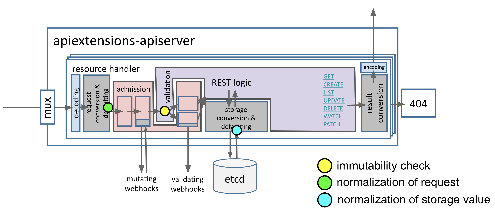

# Immutable fields

## Table of Contents

<!-- toc -->
- [Release Signoff Checklist](#release-signoff-checklist)
- [Summary](#summary)
- [Motivation](#motivation)
  - [Goals](#goals)
  - [Non-Goals](#non-goals)
- [Proposal](#proposal)
  - [OpenAPI extension <code>x-kubernetes-immutable</code>](#openapi-extension-x-kubernetes-immutable)
  - [OpenAPI extension <code>x-kubernetes-immutable-keys</code>](#openapi-extension-x-kubernetes-immutable-keys)
  - [Publishing](#publishing)
  - [Suggested marker syntax](#suggested-marker-syntax)
  - [Future outline sketch: native resources](#future-outline-sketch-native-resources)
  - [Future outline: protobuf](#future-outline-protobuf)
  - [Mutating admission chain](#mutating-admission-chain)
  - [Where does this happen](#where-does-this-happen)
  - [Risks and Mitigations](#risks-and-mitigations)
- [Design Details](#design-details)
  - [Test Plan](#test-plan)
  - [Graduation Criteria](#graduation-criteria)
- [Implementation History](#implementation-history)
- [Alternative Considered](#alternative-considered)
<!-- /toc -->

## Release Signoff Checklist

- [ ] kubernetes/enhancements issue in release milestone, which links to KEP (this should be a link to the KEP location in kubernetes/enhancements, not the initial KEP PR)
- [ ] KEP approvers have set the KEP status to `implementable`
- [ ] Design details are appropriately documented
- [ ] Test plan is in place, giving consideration to SIG Architecture and SIG Testing input
- [ ] Graduation criteria is in place
- [ ] "Implementation History" section is up-to-date for milestone
- [ ] User-facing documentation has been created in [kubernetes/website], for publication to [kubernetes.io]
- [ ] Supporting documentation e.g., additional design documents, links to mailing list discussions/SIG meetings, relevant PRs/issues, release notes

## Summary

A lot of fields in APIs tend to be "immutable", they can't be changed after
creation. This is true for example for many of the fields in pods. There is
currently no way to declaratively specify that fields are immutable, and one
has to rely on either built-in validation for core types, or have to build a
validating webhooks for CRDs.

Providing a new `// +immutable` marker would help 
- to make the API more descriptive to users
- to help API developers by verifying these assertions automatically
- and to publish this information via OpenAPI.

## Motivation

There are resources in Kubernetes which have immutable fields by design,
i.e. after creation of an object, those fields cannot be mutated anymore. E.g. a
pod's specification is mostly unchangeable once it is created. To change the
pod, it must be deleted, recreated and rescheduled. Users want to implement the
same kind of read-only semantics for CustomResources, for example:
https://github.com/kubernetes/kubernetes/issues/65973. Today this is only possible
with the unreasonable development overhead of a webhook.

### Goals

- extend the CRD API to be able to specify immutability for fields.
- publish the immutability field of CRDs via OpenAPI as vendor extension.
- verify immutability on CR update and patch requests.
- propose a source code marker to be consumed by kubebuilder and openapi-gen.
- the semantics of immutability must be driven by:
  - we do not break/change old CRD persistence semantics.
  - the user-observed equality used for immutability checks must match the equality on
    persisted objects. I.e. if `StorageRoundtrip(object)` is the object returned by a
    create or update call, then we want that `StorageRoundtrip(a) == StorageRoundtrip(b)`
    is the equality used for comparing `a` and `b` **only modulo the order in `x-kubernetes-list-type: set` arrays**. If that check fails, a request
    is rejected because of immutability conflict.
- the mechanism must extend to
  - the addition of protobuf or other encodings which unify values like empty, null and undefined.
  - the use for existing native types in order to replace complex validation code with a simple declarative marker on the types.
  - the restriction of the equality to only map keys, but not their values.
  - the allowance of addition and/or deletion of map keys.
  - the allowance of addition and/or deletion of keys in array of list-type `map`.  

### Non-Goals

- The mechanism must be extensible to native types, but its implementation is optional.
- The mechanism must be extensible to future normalization behaviours which will be
  required to support protobuf for CRs. But this KEP does not aim at defining these
  and hence defining a custom equality which is compatible with normalization.
- The mechanism is not supposed to allow different orders in lists to be considered equal.

## Proposal

We propose

1. adding boolean vendor extensions to CRD OpenAPI schemas named `x-kubernetes-immutable` and `x-kubernetes-immutable-keys` with `true` as the only valid value.
2. do **strict deep-equal** comparison of those fields marked as immutable during
   update validation in the request pipeline, with these exceptions:
   - for fields with `x-kubernetes-immutable-keys: true` only the keys of the map or array (specified via `x-kubernetes-list-map-keys`) are compared.
   - for fields with `x-kubernetes-list-type: set` the order is ignored.
   
   If that comparison fails, the request is rejected as 400 "Bad Request".
   
We create another KEP to define custom normalization steps for CRs done during 
deserialization from etcd and when receiving a request (just after pruning and defaulting).

### OpenAPI extension `x-kubernetes-immutable`

The `x-kubernetes-immutable` vendor extension is set in the spec of fields,
arrays and objects. It recursively applies to the whole subtree:

```yaml
properties:
  foo:
    type: array
    items:
      x-kubernetes-immutable: true
      type: string
```

means that the `foo` array itself is mutable, but the items are not. This means that
items can be deleted and added, but at each existing index the string values are
immutable.

```yaml
properties:
  foo:
    type: object
    x-kubernetes-immutable: true
```

means that the whole `.foo` object is immutable. It cannot be removed or set.

If one wants to make only field immutable, but allow to delete an existing object
or set it if unset, the following is used:

```yaml
properties:
  foo:
    type: object
    properties:
      "x":
        type: string
        x-kubernetes-immutable: true
      "y":
        type: string
        x-kubernetes-immutable: true
```

for all fields `x` and `y` of `foo`.

```yaml
properties:
  foo:
    type: object
    x-kubernetes-immutable: true
    properties:
      bar:
        type: object
        x-kubernetes-immutable: true
```

can be simplified to 

```yaml
properties:
  foo:
    type: object
    x-kubernetes-immutable: true
    properties:
      bar:
        type: object
```

At the root-level and inside `.metadata` of an object, `x-kubernetes-immutable` is forbidden.

### OpenAPI extension `x-kubernetes-immutable-keys`

The topology of arrays is specified via `x-kubernetes-list-type` and `x-kubernetes-list-map-keys`. We currently support the `atomic`, `set` and `map` types. These interact with immutability in the following way:

- **Non-recursive** immutability: For an array or a map, one can not remove or add new items/values, but existing items/values can be modified. 

  - For maps this means that the the keys stay the same, but values might change:
    ```yaml
    properties:
      someMap:
        type: object
        x-kubernetes-immutable-keys: true # allowed with additionalProperties
        additionalProperties:
          type: string
    ```
    with `x-kubernetes-immutable-keys` allowed due to `additionalProperties` and mutually
    exclusive with `x-kubernetes-immutable` on the same node.
    
  - For arrays of list-type `map` (associative lists) we get the same behaviour, but enforce that the map-keys
    are immutable as well (via CRD validation):
    
    ```yaml
    properties:
      someArray:
        type: array
        x-kubernetes-list-type: map
        x-kubernetes-list-map-keys: ["name"]
        x-kubernetes-immutable-keys: true # allowed with `x-kubernetes-list-type: map`
        items:
          properties:
            name:
              type: string
              x-kubernetes-immutable: true # enforced
            x:
              type: string
            y:
              type: integer
     ```
     with `x-kubernetes-immutable-keys` allowed due to `x-kubernetes-list-type: map`.
     
  In any other context, without the concept of keys, we do not allow `x-kubernetes-immutable-keys` to be set. Especially for `x-kubernetes-list-type: set`, by definition the whole list items behave as keys and therefore `x-kubernetes-immutable: true` and `x-kubernetes-immutable-keys: true` coincide. We choose to only allow `x-kubernetes-immutable: true` in that case.
  
- **Allowed addition and deletion**: New/deleted keys in maps are tolerated.

  - For maps, this can be expressed by marking the values immutable,
    but not the map:
    ```yaml
    properties:
      someMap:
        type: object
        additionalProperties:
          type: string
          x-kubernetes-immutable: true
    ```
  - For arrays an identifier field is required, e.g. `.name`. We support this by reusing `x-kubernetes-list-type: map` and `x-kubernetes-list-map-keys` specifying the keys:
    ```yaml
    properties:
      someArray:
        type: array
        x-kubernetes-list-type: map
        x-kubernetes-list-map-keys: ["name"]
        items:
          x-kubernetes-immutable: true
          properties:
            name:
              type: string
            x:
              type: string
            y:
              type: integer
    ```
- **Immutable sets**: For arrays of list-type `set` the equality ignores the order:

    ```yaml
    properties:
      someSet:
        type: array
        x-kubernetes-list-type: set
        x-kubernetes-immutable: true
        items:
          type: object
          properties:
            x:
              type: string
            y:
              type: integer
    ```
    such that `{"someSet":[{"x":"abc"},{"x":"def","y":1}]}` and `{"someSet":[{"x":"def","y":1},{"x":"abc"}]}` are considered equally and not mutated.
    
- (Possible future extension) **Addition only/Deletion only**: Maps and arrays of list-type `map` and `set` can be addition-only and deletion-only by setting either `x-kubernetes-addition-only: true` or `x-kubernetes-deletion-only: true`, both mutually exclusive with `x-kubernetes-immutable` and `x-kubernetes-immutable-keys`.
  
  - For maps:
    ```yaml
    properties:
      someMap:
        type: object
        x-kubernetes-addition-only: true # allowed with additionalProperties
        additionalProperties:
          type: string
    ```
    and similarly for `x-kubernetes-deletion-only: true`.
      
  - For arrays of list-type `map` we get the same behaviour, but enforce that the map-keys
    are immutable as well (via CRD validation):
      
    ```yaml
    properties:
      someArray:
        type: array
        x-kubernetes-list-type: map
        x-kubernetes-list-map-keys: ["name"]
        x-kubernetes-addition-only: true # allowed with `x-kubernetes-list-type: map`
        items:
          properties:
            name:
              type: string
              x-kubernetes-immutable: true # enforced
            x:
              type: string
            y:
              type: integer
    ```
    and similarly for `x-kubernetes-deletion-only: true`.
      
  - For arrays of list-type `set` get:
  
    ```yaml
    properties:
      someSet:
        type: array
        x-kubernetes-list-type: set
        x-kubernetes-addition-only: true # allowed with `x-kubernetes-list-type: set`
        items:
          type: object
          properties:
            x:
              type: string
            y:
              type: integer
    ```
    and similarly for `x-kubernetes-deletion-only: true`.
    
For list type `atomic` we disallow `x-kubernetes-immutable-keys`.

Note: it is planned to add `x-kubernetes-map-type` as the equivalent vendor extensions for map to distinguish between classical and atomic maps with the values `map` and `atomic`. The `map` case is the same as the one without any specified map type, and for atomic maps we disallow `x-kubernetes-immutable-keys` again.
    
### Publishing

The `x-kubernetes-immutable` and `x-kubernetes-immutable-keys` vendor extensions are published via `/openapi/v2` as is.

### Suggested marker syntax

In analogy to `+required`, `+optional` we propose to add a marker to kubebuilder's
controller-gen named `+immutable`, which covers the whole subtree of the object 
(compare field-selection section for extension).

```
// The name can not be changed after creation.
// +immutable
Name string

// The list of containers can not change AT ALL after creation.
// No single field in existing containers can be changed, added or deleted,
// no new containers can be added, no existing container can be removed.
// +immutable
Containers []Containers
```

The `x-kubernetes-immutable-keys: true` vendor extension is expressed via `// +immutable=keys` in Golang types:

### Future outline sketch: native resources

For native resources we add a pre-immutability-check normalization step for objects 
decoded from JSON which have normalizations defined:

1. versioned JSON blob comes in a request
2. unmarshalled into versioned Golang struct
3. defaulting
4. conversion to internal
5. if immutability is enabled for the resource:
   1. marshalling into JSON in-memory
   2. normalization creating a copy with shared data-structures
   3. strict immutability check against the old object, coming from proto assuming it is normalized.

### Future outline: protobuf

Protobuf encoding unifies unset, empty and null values for slices and maps. Those three cases 
cannot be differentiated an lead to the same on-the-wire value. In native types
we use a semantic equality to factor those differences out if JSON is used on the wire, but
protobuf is used for storage. In CRs decoding and encoding is always faithful with the 
traditional JSON format used on-the-wire and for storage.

When adding protobuf encoding to CRDs in the future, we have to (without major, non-standard
efforts) identify unset, empty and null for CRs as well. This leads to the idea to use a less
strict equality in the immutabiltiy checks with that case in mind. But protobuf encoding in
native types also has a normalization effect, namely posted JSON object are normalized through
the encoding to protobuf when writing to etcd. 

Hence, it looks sensible to split normalization from immutability equality, and keep a strict 
deep-equal equality even for protobuf, and potentially native types (if we decide to implement 
immutability for those).

With the container example we get this, with a sketch of a `+normalize` marker which
normalizes empty and null to undefined:

```
// The list of containers can not change AT ALL after creation, modulo
// empty, null and undefined.
// No single field in existing containers can be changed, added or deleted,
// no new containers can be added, no existing container can be removed.
// +immutable
// +normalize=undefined
Containers []Container `json:containers,omitempty` `protobuf:"bytes,2,opt,name=containers"
```

For fields which carry no `omitempty`, we could allow more advanced normalization
modes which replicate the Golang serialization behaviour. Tooling like openapi-gen
and the CRD validation could verify that the normalization specification matches 
that of Golang.

### Mutating admission chain

Mutating admission chain would have the exact same effects as user changes,
meaning that they wouldn't be able to change an object after creation. This is
very similar to what is done today since validation for updates is run AFTER all
mutations.

### Where does this happen

This process is meant to happen right before the update validation and after
mutating, but before validating webhooks, and only run on updates. This will allow us to
keep the exact same behavior while removing the validation code that checks the
immutability of fields.



### Risks and Mitigations

- immutable metadata would break API machinery. We forbid the `x-kubernetes-immutable`
  at the root of the object and inside `.metadata`. `kind` and `apiVersion` are
  immutable implicitly. We might publish immutable though for some of these fields.

## Design Details

### Test Plan

- exhaustive unit tests are added in apiextensions-apiserver for
  - CRD validation
    - for `x-kubernetes-immutable: true` and `x-kubernetes-immutable-keys: true` at the root and in `metadata`
    - for `x-kubernetes-immutable-keys: true` for list-type `map` and forbidden otherwise
    - for `x-kubernetes-immutable: true` on the list-keys of `x-kubernetes-immutable-keys: true` maps.
    - for `x-kubernetes-immutable: true` and `x-kubernetes-immutable-keys: true` only for v1 CRDs, or during ratcheting updates.
  - immutability checking with all variants of `x-kubernetes-immutable`, `x-kubernetes-immutable-keys` and `x-kubernetes-list-type`.
- integration tests are added for
  - creation, updates, patches and server-side-apply of partially immutable CRs 
  - interaction of server-side-apply list-types and immutability
  - OpenAPI publishing of the vendor extensions
  - CRD updates of the immutability extensions and that the new immutability
    schemas are followed.
  - rejection of `x-kubernetes-immutable: true` and `x-kubernetes-immutable-keys: true` for non-v1 CRDs
- e2e and conformance tests that
  - immutability is followed during updates, patches and server-side-apply. 
   
### Graduation Criteria

Because of the very limited risk of the additional immutability check and our
experience with defaulting getting no additional soak time by the community
we propose to start directly as beta.

For beta:

- performance does not suffer for CRDs **which do not use** immutability vendor extensions.

For GA:

- performance is benchmarked with an upper bound overhead of 15% on CRDs with schemas.

## Implementation History

N/A

## Alternative Considered

- OpenAPI has a notion of `readOnly`. This is meant to restrict fields to be set
  only in responses, not in a request payload. This does not match our 
  `never-change-after-creation` semantics.
- Allowing `false` as value for `x-kubernetes-immutable: false` was considered to
  disable immutability imposed by a parent node. This complicates the semantics
  considerably and can be expressed with a combination of `x-kubernetes-immutable-keys` 
  and `x-kubernetes-immutable` on the complementing fields.
