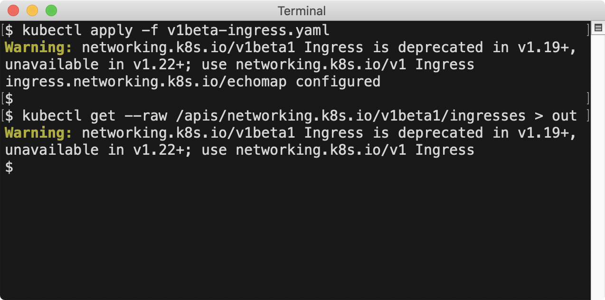
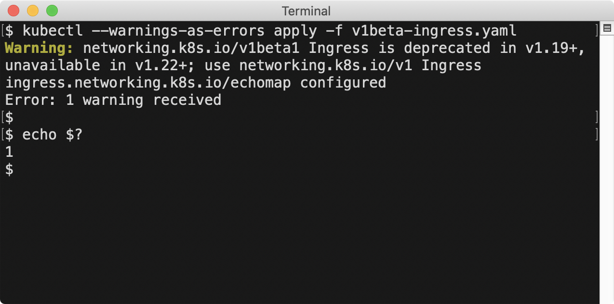

# KEP-1693: Warning mechanism for use of deprecated APIs

<!-- toc -->
- [Release Signoff Checklist](#release-signoff-checklist)
- [Summary](#summary)
- [Motivation](#motivation)
  - [Goals](#goals)
- [Proposal](#proposal)
  - [Server-side changes](#server-side-changes)
  - [Client-side changes](#client-side-changes)
- [Design Details](#design-details)
  - [Server-side](#server-side)
  - [Client-side](#client-side)
  - [Test Plan](#test-plan)
  - [Risks and Mitigations](#risks-and-mitigations)
  - [Graduation Criteria](#graduation-criteria)
    - [Beta](#beta)
    - [GA](#ga)
  - [Upgrade / Downgrade Strategy](#upgrade--downgrade-strategy)
  - [Version Skew Strategy](#version-skew-strategy)
- [Production Readiness Review Questionnaire](#production-readiness-review-questionnaire)
  - [Feature Enablement and Rollback](#feature-enablement-and-rollback)
  - [Rollout, Upgrade and Rollback Planning](#rollout-upgrade-and-rollback-planning)
  - [Monitoring Requirements](#monitoring-requirements)
  - [Dependencies](#dependencies)
  - [Scalability](#scalability)
  - [Troubleshooting](#troubleshooting)
- [References](#references)
- [Implementation History](#implementation-history)
<!-- /toc -->

## Release Signoff Checklist

<!--
**ACTION REQUIRED:** In order to merge code into a release, there must be an
issue in [kubernetes/enhancements] referencing this KEP and targeting a release
milestone **before the [Enhancement Freeze](https://git.k8s.io/sig-release/releases)
of the targeted release**.

For enhancements that make changes to code or processes/procedures in core
Kubernetes i.e., [kubernetes/kubernetes], we require the following Release
Signoff checklist to be completed.

Check these off as they are completed for the Release Team to track. These
checklist items _must_ be updated for the enhancement to be released.
-->

- [x] Enhancement issue in release milestone, which links to KEP dir in [kubernetes/enhancements] (not the initial KEP PR)
- [x] Design details are appropriately documented
- [x] Test plan is in place, giving consideration to SIG Architecture and SIG Testing input
- [x] Graduation criteria is in place
- [x] Supporting documentation e.g., additional design documents, links to mailing list discussions/SIG meetings, relevant PRs/issues, release notes
- [x] KEP approvers have approved the KEP status as `implementable`
- [x] "Implementation History" section is up-to-date for milestone
- [x] User-facing documentation has been created in [kubernetes/website], for publication to [kubernetes.io]

<!--
**Note:** This checklist is iterative and should be reviewed and updated every time this enhancement is being considered for a milestone.
-->

[kubernetes.io]: https://kubernetes.io/
[kubernetes/enhancements]: https://git.k8s.io/enhancements
[kubernetes/kubernetes]: https://git.k8s.io/kubernetes
[kubernetes/website]: https://git.k8s.io/website

## Summary

This enhancement makes it easier for users and cluster administrators
to recognize and remedy problematic API use, including use of deprecated APIs.
Users are presented with informative warnings at time of use.
Administrators are given metrics that show deprecated API use,
and audit annotations that can be used to identify particular API clients.

## Motivation

Kubernetes has many deprecations in flight at any given moment, in various stages, with various time horizons.
Keeping track of all of them is difficult, and has historically required careful reading of release notes,
and manually sweeping for use of deprecated features.

Gaps in API validation which allow problematic API data have also been discovered post-release
([see examples](https://github.com/kubernetes/kubernetes/issues/64841#issuecomment-395141013)).
Tightening validation to reject previously accepted API requests is generally avoided for backwards compatibility,
but surfacing warnings to clients submitting problematic data would help them discover problems earlier.

### Goals

* When a user makes a request to a deprecated API, present them with a warning
  that includes the target removal release and any replacement API
* Allow a cluster administrator to programatically determine if deprecated APIs are being used:
  * Filtered to particular APIs
  * Filtered to particular operations (e.g. get, list, create, update)
  * Filtered to APIs targeting removal in particular releases
* Allow a cluster administrator to programatically identify particular clients using deprecated APIs
* Allow in-process validation mechanisms (API validation, admission, etc) to contribute warnings
* Allow extension mechanisms (CustomResourceDefinitions, admission webhooks) to contribute warnings 

## Proposal

### Server-side changes

When a deprecated API is used:

1. Add a `Warning` header to the response
2. Set a `apiserver_requested_deprecated_apis` gauge metric to 1 with labels for the API group, version, resource, subresource, and target removal version
3. Record a `"k8s.io/deprecated": "true"` audit annotation indicating the request used a deprecated API

Allow custom resource definitions to indicate specific versions are deprecated

Allow admission webhooks to contribute warnings that are surfaced to the user

### Client-side changes

In client-go:

1. Parse `Warning` headers from server responses
2. Provide default warning handler implementations, e.g.:
   1. ignore warnings
   2. dedupe warnings
   3. log warnings with klog.Warn
3. Add a process-wide warning handler (defaulting to the klog.Warn handler)
4. Add a per-client warning handler (defaulting to the process-wide warning handler)

In kubectl, configure the per-process handler to:

1. dedupe warnings (only print a given warning once per invocation)
2. log to stderr with a `Warning:` prefix
3. color the `Warning:` prefix if the terminal is capable of displaying color
4. add a `--warnings-as-errors` option to exit with a non-zero exit code after executing the command if warnings were encountered

In kube-apiserver and kube-controller-manager, configure the process-wide handler to ignore warnings

Example `kubectl` user experience:





## Design Details

### Server-side

**Warning mechanism:**

* Add a handler chain filter that attaches a WarningRecorder implementation to the request context
* Add a WarningRecorder implementation that de-duplicates the warning message per request and writes a `Warning` header
  * the header structure is defined in [RFC2616#14.46](https://www.w3.org/Protocols/rfc2616/rfc2616-sec14.html#sec14.46)
  * warnings are written with code `299` and warn-agent of `-`
  * no more than 4K of warning messages are written to avoid exceeding client and proxy header size limits;
    if the total warning size exceeds that limit, individual warnings are truncated to 256 characters;
    if the total warning size still exceeds that limit, warnings are output in the order added until the limit is reached;
    for reference, the longest proposed deprecation warning generated by `kube-apiserver` would be ~170 characters,
    so ~24 warning messages of that length could be accommodated

**In-process deprecated API warnings:**

In the endpoint installer, decorate handlers for deprecated APIs:
  * add a warning header: `<group>/<version> <kind> is deprecated in v1.X+, unavailable in v1.Y+; use <replacementGroup>/<replacementVersion> <replacementKind>`
  * set the gauge metric for the deprecated group/version/resource/subresource to 1
  * add an audit annotation indicating the request was made to a deprecated API

**In-process validation and admission warnings:**

Enable adding warnings in validation, strategy, and admission handlers:
* Document when warnings should be surfaced (e.g. when a problematic value is present in a create request,
  or is introduced by an update request)
* Define a helper method for adding a field-specific warning that takes a `field.Path` and message

**CustomResourceDefinition version deprecation warnings:**

Add `deprecated bool` and `deprecationWarning string` fields to the `CustomResourceDefinitionVersion` type:

```go
type CustomResourceDefinitionVersion struct {
...
	// deprecated indicates this version of the custom resource API is deprecated.
	// When set to true, API requests to this version receive a warning header in the server response,
	// and an audit annotation indicating a deprecated API was used is added to the audit event for the request.
	// Defaults to false.
	// +optional
	Deprecated bool `json:"deprecated,omitempty"`
	// deprecationWarning overrides the default warning returned to API clients.
	// May only be set when `deprecated` is true.
	// The default warning indicates this version is deprecated and recommends use
	// of the newest served version of equal or greater stability, if one exists.
	// +optional
	DeprecationWarning string `json:"deprecationWarning,omitempty"`
	...
```

In the custom resource handler, decorate handlers for deprecated versions:
  * add the warning header
  * set the gauge metric for the deprecated group/version/resource/subresource to 1
  * add an audit annotation indicating the request was made to a deprecated API

**Admission webhook warnings:**

Add `warnings []string` to the `v1` `AdmissionResponse` type:

```go
type AdmissionResponse struct {
...
	// warnings is a list of warning messages to return to the API client.
	// Warning messages describe a problem the client making the API request should correct or be aware of.
	// Limit warnings to 120 characters if possible.
	// Longer warnings or large numbers of warnings may be truncated.
	// +optional
	Warnings []string `json:"warnings,omitempty"`
...
}
```

### Client-side

k8s.io/client-go:

* Parse `Warning` headers in server responses
* Ignore malformed warning headers, ensuring that this enhancement 
  will not cause any previously successful API request to fail
* Add the parsed warning headers to the `rest.Result` struct
* Pass parsed warnings through the per-client or per-process warning handler

### Test Plan

Warning mechanism unit tests:

- `Warning` header generation and encoding
- `Warning` header parsing (including tolerating/ignoring malformed headers)
- Per-process / per-client warning handler precedence is honored

Deprecated API integration tests:

- Warning headers are returned when making requests to deprecated APIs
- Gauge metrics for deprecated use are set to 1 when making requests to deprecated APIs
- Audit annotations are added when making requests to deprecated APIs

Extension mechanism integration tests:

- CustomResourceDefinition deprecated versions result in warning headers and audit annotations
- Admission webhook warnings are included in API responses to users

### Risks and Mitigations

**Metric cardinality**

In the past, we have had problems with unbounded metric labels increasing cardinality of 
metrics and causing significant memory/storage use. Limiting these metrics to bounded values
(API group, version, resource, subresource, target removal release) and omitting unbounded values
(resource instance name, client username, etc), metric cardinality is controlled.

Annotating audit events for the deprecated API requests allows an administrator to locate
the particular client making deprecated requests when metrics indicate an investigation is needed.

**Additional stderr / warning output**

Additional warning messages may be unexpected by kubectl or client-go consumers.
However, kubectl and client-go already output warning messages to stderr or via `klog.Warn`.
client-go consumers can programmatically modify or suppress the warning output at a per-process or per-client level.

**Header size**

The possibility of accumulating excessive numbers of warnings increases once extension mechanisms can contribute warnings.
This is mitigated by:
* Documented guidance on what types of issues should be surfaced as warnings
* Documented guidance on message length
* A warning recorder implementation that limits the individual and total length of warnings returned to a client

### Graduation Criteria

The structure of the `Warning` header is RFC-defined and unversioned.
The RFC defines the behavior of the `299` warning code as follows:

> The warning text can include arbitrary information to be presented to a human user or logged.
> A system receiving this warning MUST NOT take any automated action.

Because the server -> client warning format is fixed, and the warnings do not
drive automated action in clients, graduation criteria is primarily oriented
toward the stability level of the administrator metrics, and the ability to 
disable the server sending warnings during the beta period.

#### Beta

* Implement warning mechanism
* Implement in-process deprecated API warnings, metrics, audit annotations
* Complete test plan for implemented items
* API server output of `Warning` headers for deprecated API use is feature-gated and enabled by default
* The metric for deprecated API use is registered at [stability level `ALPHA`](https://github.com/kubernetes/enhancements/blob/master/keps/sig-instrumentation/1290-metrics-stability/kubernetes-control-plane-metrics-stability.md#stability-classes)
* Implement admission webhook warning contributions
* Implement custom resource version deprecation
* client-go logs warnings with code `299` by default
* kubectl outputs warnings with code `299` to stderr by default
* Custom resource and admission webhook documentation is extended to describe appropriate use of warnings

#### GA

* At least two releases after Beta
* Gather feedback on metric structure and use from multi-cluster admins
* Implement in-process helpers for field-level validation warnings and admission warnings
* Complete test plan for implemented items
* API server output of `Warning` headers for deprecated API use is unconditionally enabled
* Server metric for deprecated API use is registered at [stability level `STABLE`](https://github.com/kubernetes/enhancements/blob/master/keps/sig-instrumentation/1209-metrics-stability/kubernetes-control-plane-metrics-stability.md#stability-classes)

### Upgrade / Downgrade Strategy

client-go consumers wanting to suppress default warning messages would need to override the per-process warning handler.
Note that client-go already [logs warning messages](https://grep.app/search?q=klog.Warn&filter[repo][0]=kubernetes/client-go).

### Version Skew Strategy

Old clients making requests to a new API server ignore `Warning` headers.

New clients making requests to old API servers handle requests without `Warning` headers normally.

## Production Readiness Review Questionnaire

### Feature Enablement and Rollback

###### How can this feature be enabled / disabled in a live cluster?

- [X] Feature gate (also fill in values in `kep.yaml`)
  - Feature gate name: `WarningHeaders`
  - Components depending on the feature gate: `kube-apiserver`

###### Does enabling the feature change any default behavior?

Yes. API requests to deprecated APIs return `Warning` headers to API clients.

###### Can the feature be disabled once it has been enabled (i.e. can we roll back the enablement)?

Yes. When disabled, warning headers are no longer sent to API clients.

###### What happens if we reenable the feature if it was previously rolled back?

Warning headers are once again sent to API clients.

###### Are there any tests for feature enablement/disablement?

The code gated by the `WarningHeader` feature gate is stateless, so there are no enablement/disablement tests.

### Rollout, Upgrade and Rollback Planning

###### How can a rollout or rollback fail? Can it impact already running workloads?

No functional behavior changes are driven by the warnings returned from the server.

During a rollout, a client making substantially identical requests to skewed API servers
will receive warnings from servers with the feature enabled, and not receive warnings 
from the server with the feature disabled.

This might be slightly confusing but resolves once the cluster has the feature enabled
coherently across API servers, and does not impact any workloads or programmatic behavior.

Feature enablement/disablement has no impact on running workloads.

###### What specific metrics should inform a rollback?

It's hard to imagine a problem with this feature that would require a rollback,
but `apiserver_request_total` and `apiserver_request_duration_seconds`
are the most relevant metrics for the API request pipeline this feature touches.

###### Were upgrade and rollback tested? Was the upgrade->downgrade->upgrade path tested?

Upgrade/downgrade/upgrade was not tested because the returned warning headers are stateless.

New API servers returning warning headers to older clients was tested manually and confirmed
that the old API clients tolerated/ignored the warning headers.

###### Is the rollout accompanied by any deprecations and/or removals of features, APIs, fields of API types, flags, etc.?

This feature does not deprecate or remove any features/APIs/fields/flags/etc.

### Monitoring Requirements

###### How can an operator determine if the feature is in use by workloads?

This feature is not used by workloads.

###### How can someone using this feature know that it is working for their instance?

- [x] User-visible warnings are returned when making requests to deprecated APIs
- [x] `apiserver_requested_deprecated_apis` metrics returned by the API server are populated 
- [x] audit logs contain `"k8s.io/deprecated": "true"` annotations for requests to deprecated APIs

###### What are the reasonable SLOs (Service Level Objectives) for the enhancement?

Identical SLOs for API server request metrics are expected with this feature enabled.

###### What are the SLIs (Service Level Indicators) an operator can use to determine the health of the service?

As part of the kube-apiserver request pipeline, normal metrics for kube-apiserver request health 
indicate this feature (along with all other features in the request pipeline) is healthy.
For example:
- `apiserver_request_total`
- `apiserver_request_duration_seconds`

###### Are there any missing metrics that would be useful to have to improve observability of this feature?

No

### Dependencies

###### Does this feature depend on any specific services running in the cluster?

No

### Scalability

###### Will enabling / using this feature result in any new API calls?

No

###### Will enabling / using this feature result in introducing new API types?

No

###### Will enabling / using this feature result in any new calls to the cloud provider?

No

###### Will enabling / using this feature result in increasing size or count of the existing API objects?

CustomResourceDefinition objects have two new fields per version they define, increasing their size slightly:
- `deprecated bool`
- `deprecationWarning string` (bounded to 256 characters)

###### Will enabling / using this feature result in increasing time taken by any operations covered by existing SLIs/SLOs?

No

###### Will enabling / using this feature result in non-negligible increase of resource usage (CPU, RAM, disk, IO, ...) in any components?

No

### Troubleshooting

###### How does this feature react if the API server and/or etcd is unavailable?

This feature is part of the API server.

###### What are other known failure modes?

Discussed and mitigated in the (Risks and Mitigations)[#risks-and-mitigations] section

###### What steps should be taken if SLOs are not being met to determine the problem?

- Determine if warnings are being returend from the problematic API requests. If not, this feature is not involved.
- If many warnings are being returned, determine the source. The only source for large numbers of warnings is admission webhooks.

## References

* sig-cli discussion
  * [notes](https://docs.google.com/document/d/1r0YElcXt6G5mOWxwZiXgGu_X6he3F--wKwg-9UBc29I/edit#bookmark=id.e5451knpumhz)
  * [recording](https://www.youtube.com/watch?v=ZDSeDx9XbZg&list=PL69nYSiGNLP28HaTzSlFe6RJVxpFmbUvF&index=2&t=6m50s)
* sig-apimachinery discussion
  * [notes](https://docs.google.com/document/d/1x9RNaaysyO0gXHIr1y50QFbiL1x8OWnk2v3XnrdkT5Y/edit#bookmark=id.evxgyhkofnhl)
  * [recording](https://www.youtube.com/watch?v=-EZzIk-Ut6o&list=PL69nYSiGNLP21oW3hbLyjjj4XhrwKxH2R&index=2&t=0s)
* sig-architecture discussion
  * [notes](https://docs.google.com/document/d/1BlmHq5uPyBUDlppYqAAzslVbAO8hilgjqZUTaNXUhKM/edit#bookmark=id.yppt0g2tjwqw)
  * [recording](https://www.youtube.com/watch?v=VJo7PonPuGA&list=PL69nYSiGNLP2m6198LaLN6YahX7EEac5g&index=2&t=3m13s)
* sig-instrumentation discussion
  * [notes](https://docs.google.com/document/d/1FE4AQ8B49fYbKhfg4Tx0cui1V0eI4o3PxoqQPUwNEiU/edit#bookmark=id.c3qdrgp1fvnc)
  * [recording](https://www.youtube.com/watch?v=cOoDnSTkMc0&list=PL69nYSiGNLP1tue6RXLncPTGjfnBVHP-f&index=2&t=2m33s)
  * [mailing list thread](https://groups.google.com/d/msgid/kubernetes-sig-instrumentation/62bfc7c8-aab3-41c7-99cb-e69cf88a0749%40googlegroups.com)

## Implementation History

- 2020-04-16: KEP introduced
- 2020-04-27: Updated GA criteria, added extension mechanism warnings, kubectl warnings-as-errors option, size limits
- 2020-04-27: Moved to implementable
- 2020-08-26: Completed beta items for v1.19
