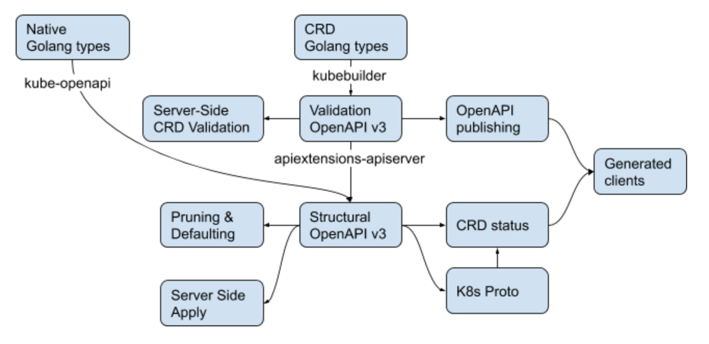

# Vanilla CRD OpenAPI subset: structural schemas

OpenAPI has the goal of describing every API possible. CRDs have the goal of presenting a consistent API to users of Kubernetes. This KEP proposes a restriction of permissible CRD OpenAPI validation schemas to match the later and to enable us add advanced CRD features like server-side pruning, defaulting, apply and potentially Protobuf support in the future.

## Table of Contents

<!-- toc -->
- [Summary](#summary)
- [Motivation](#motivation)
  - [Goals](#goals)
  - [Non-Goals](#non-goals)
  - [Context](#context)
    - [Consumers of the restricted OpenAPI Schema](#consumers-of-the-restricted-openapi-schema)
    - [Producers of the restricted OpenAPI Schema](#producers-of-the-restricted-openapi-schema)
  - [Criteria](#criteria)
- [Proposal](#proposal)
  - [Formal Definition](#formal-definition)
  - [Metadata](#metadata)
  - [Unfolding the Extensions](#unfolding-the-extensions)
  - [Litmus Test Examples](#litmus-test-examples)
- [Design Details](#design-details)
  - [Scope of necessary Changes](#scope-of-necessary-changes)
  - [API Compatibility Plan](#api-compatibility-plan)
  - [Implementation Plan](#implementation-plan)
  - [Test Plan](#test-plan)
  - [Graduation Criteria](#graduation-criteria)
  - [Upgrade / Downgrade Strategy](#upgrade--downgrade-strategy)
  - [Version Skew Strategy](#version-skew-strategy)
- [Implementation History](#implementation-history)
<!-- /toc -->

## Summary

The CRD validation schemas today support nearly the whole OpenAPI v3 schema language. Here, we propose to impose a restriction called _structural schema_ to that language, which will 
* significantly reduce difficulty in moving forward with advanced features like pruning, defaulting, server-side apply, read-only fields and protobuf in the near and medium term future
* while keeping needed expressivity to express Kubernetes-like APIs including powerful value validations.

Schema generators (like [crd-gen](https://github.com/kubernetes-sigs/controller-tools/tree/master/pkg/crd) and [openapi-gen](https://github.com/kubernetes/kube-openapi/tree/master/cmd/openapi-gen)) which recurse over API Golang types produce structural schemas naturally. Developers can enrich those structural schemas with nearly arbitrary value validation logic, usually using in-code `+kubebuilder`-like tags.

The restriction is an API change of the CustomResourceDefinition kind in the `apiextensions.k8s.io/v1beta1` API group, but in the sense that
* CRDs created via the `v1beta1` endpoints are not restricted such that existing CRDs keep working **as before**,
* but CRDs created or updated via the `v1beta1` endpoints have to conform to the new restrictions **if they want to make use of new features**.

In the `v1` CustomResourceDefinition API we will enforce structural schemas on creation and do ratcheting validation on update (allow updates with non-structural schemas if the original schema was non-structural already).

To communicate to the developer that a CRD does not follow the structural schema restriction and will therefore not benefit from future developments, we add a `NonStructuralSchema` condition to the CRD.

## Motivation

* OpenAPI has the goal of describing every API possible. We have the goal of presenting a consistent API to users of Kubernetes. OpenAPI therefore makes a fantastic output format able to describe anything, but a poor input format, because there's not "one correct way" to do a given thing. It is easy to accidentally (or intentionally) describe things in OpenAPI v3 that are not similar to other Kubernetes APIs and far outside of the [Kuberntes API conversions](https://github.com/kubernetes/community/blob/master/contributors/devel/sig-architecture/api-conventions.md).
* OpenAPI v3 is a very open and wide spec that can define crazy things using logical operators (`not(anyOf(oneof ...))`), leading to complicated semantics, making advanced CRD features difficult or even impossible to implement.

### Goals

* Restrict CRD validation OpenAPI v3 schemas to give one canonical way to express objects we intend to support as Kubernetes-like types.
* Simplify the semantics of CRD validation OpenAPI v3 schemas to make implementation of advanced feature like pruning, defaulting, server-side apply and read-only validation considerably less difficult.
* Support embedding of existing API types into a CRD via RawExtensions or via Golang type reuse (e.g. of PodSpecs).
* Allow a rich OpenAPI v3 validation schema for CustomResource validation, but allow us to programmatically derive the restricted spec for all other purposes.
* Prospective goal: have a canonical mapping from a restricted schema to Golang types and Protobuf v3.

### Non-Goals

* a human readable spec and convenience to write. We focus on machine readability and clear and simple semantics.
* model all kind of crazy JSON objects. We focus on Kubernetes-like objects with an OpenAPI schema derived via code generation (crd-gen) from Golang types.

### Context

We assume the following context of OpenAPI schemas in the Kubernetes architecture and ecosystem:

#### Consumers of the restricted OpenAPI Schema

* server side validation (consumes structural schema including value validation)
* OpenAPI publishing
  * client side validation
  * kubectl explain
  * client generators (https://github.com/kubernetes-client)
  * doc generator
  * kube-aggregator
  * IDEs like IntelliJ for input completion
* server side apply
* pruning
* defaulting
* possibly in the future:
  * server side read-only update validation
  * Protobuf publishing

#### Producers of the restricted OpenAPI Schema

* kube-openapi's **openapi-gen** mechanically producing go-openapi definitions for native types compiled into kube-apiserver
* **crd-gen/crd-schema-gen** in https://github.com/kubernetes-sigs/controller-tools mechanically producing CRD validation schemas from Golang types with tags
* a **developer** adding custom OpenAPI schemas for openapi-gen or crd-gen/crd-schema-gen.
* a **developer** manually writing complete CRD validation schemas.



### Criteria

To allow only a subset of features of OpenAPI v3, we need to have guidelines for what features we want to restrict and what features we need to permit. We would like to select a single canonical way in OpenAPI to represent these Kubernetes-like types:

* non-polymorphics types: primitive types, objects, strings maps, arrays.

  Examples:
  * string maps like labels and annotations, but also `map[string]int64`
  * IPv4 vs IPv6 strings: same fields with different formats
  * embedded PodSpec (a non-trivial object)
  
* discriminated union types (as described in [KEP: Union Types](https://github.com/kubernetes/enhancements/pull/926)).
  
  Examples:
  * VolumeSource, DeploymentStrategy, …

* a very restrictive, fixed set of polymorphic types.
 
  Examples:
  * IntOrString
  * RawExtensions, i.e. unconstrained, embedded toplevel types
  * arbitrary JSON
  
Note: we explicitly accept that polymorphic types (like IntOrString) are an anti-pattern for Kubernetes-like types and we do not want to encourage its use beyond IntOrString.

As a soft criterion to validate the direction, restricted CRD OpenAPI schemas should represent a model that can also be represented with other parts of the system: 

    Golang types <=> OpenAPI <=> Protobuf.

Each of these is to be restricted to lead to a canonical mapping.

## Proposal

We propose to define a subset of OpenAPI v3 called _structural schema_ which

* allows to algorithmically derive specified types and object field names
* without the need of semantical understanding of **all** OpenAPI v3 constructs.

Here is an example of what we want to avoid:

```yaml
properties:
  foo:
    type: string
  bar:
    minimum: 42
anyOf:
- properties:
    foo:
      pattern: abc
    bar:
      type: string
- properties:
    bar:
      type: integer
      minimum: 1
      maximum: 0
```
In this example, `.foo` is specified as string even without looking at the `anyOf` construct, but `.bar`'s type is unclear without deeper semantic knowledge of `anyOf` and of minimum and maximum.

We want to be able to mechanically extract specified object field names and types using only the information specified in `properties`, `items`, `additionalProperties` and `type`. Other constructs like logical junctors should be usable to express complex validations, but should not be essential for the specification of the type structure of JSON values.

We reach this goal in defining _structural schema_ by following this guiding principle:

**Structural Completeness**: all types and the possible object fields within a JSON object must be apparent from a structural schema without understanding the logical junctors `anyOf`, `allOf`, `oneOf` and `not`.

### Formal Definition

We define a _structural schema_ by choosing another data structure representation of [`JSONSchemaProps`](https://github.com/kubernetes/kubernetes/blob/d0c3b708026f681f7467d36dcf9696f89ccfcfab/staging/src/k8s.io/apiextensions-apiserver/pkg/apis/apiextensions/v1beta1/types_jsonschema.go#L20), while adding vendor extension fields for:
* `x-kubernetes-preserve-unknown-fields: true` – recursive version of `additionalProperties: true`, influencing pruning to not prune unknown fields (compare [pruning KEP](https://github.com/kubernetes/enhancements/pull/709) for more details).
* `x-kubernetes-embedded-resource: true` – marks a RawExtension field to embed a complete `runtime.Object` like object with `TypeMeta` and `ObjectMeta`.
* `x-kubernetes-unions: [...]` as defined in [KEP: Union Types](https://github.com/kubernetes/enhancements/pull/926)
* `x-kubernetes-int-or-string: true` – marks a `IntOrString` polymorphic type.

Observe that any validated `JSONSchemaProps` can be represented as `StructuralSchema`. Validation allows us to drop some unsupported fields (which are part of `JSONSchemaProps` but which we forbid in CRDs):

```go
type StructuralSchema struct {
	Items                *StructuralSchema
	Properties           map[string]StructuralSchema

	Generic
	Extensions
	
	*ValueValidation
}

type Extensions struct {
	// x-kubernetes-unions lists unions, i.e. sets of fields which are 
	// mutual exclusive.
	XUnions []Union
	
	// x-kubernetes-preserve-unknown-fields stops the API server
	// decoding step from pruning fields which are not specified
	// in the validation schema. This affects fields recursively,
	// but switches back to normal pruning behaviour if nested
	// properties or additionalProperties are specified in the schema.
	// This can either be true or null. False is forbidden.
        XPreserveUnknownFields *bool
        
	// x-kubernetes-embedded-resource defines that the value is an
	// embedded Kubernetes runtime.Object, with TypeMeta and
	// ObjectMeta. The type must be object. It is allowed to further
	// restrict the embedded object. kind, apiVersion and metadata
	// are validated automatically. x-kubernetes-preserve-unknown-fields
	// is allowed to be true, but does not have to be if the object
	// is fully specified (up to kind, apiVersion, metadata).
        XEmbeddedResource bool
        
	// x-kubernetes-int-or-string specifies that this value is
	// either an integer or a string. If this is true, an empty
	// type is allowed and type as child of anyOf is permitted
	// if following one of the following patterns:
	//
	// 1) anyOf:
	//    - type: integer
	//    - type: string
	// 2) allOf:
	//    - anyOf:
	//      - type: integer
	//      - type: string
	//    - ... zero or more
        XIntOrString bool
}

type Union struct {
	// discriminator is the name of the discriminator field.
	Discriminator string
	// fields lists the union field names with their discriminator value.
	// This must be undefined if discriminator is empty.
	Fields map[string]string
}

type Generic struct {
	// type specifies the type of a value.
	// It can be object, array, number, integer, boolean, string.
	// It is optional only if x-kubernetes-preserve-unknown-fields 
	// or x-kubernetes-int-or-string is true.
	Type        string
	AdditionalProperties *StructuralOrBool
	
	Description string
	Title       string
        Nullable    bool
	Default     *JSON
        ReadOnly    bool
}

type ValueValidation struct {
	Format               string
	Maximum              *float64
        ExclusiveMaximum     bool
        Minimum              *float64
        ExclusiveMinimum     bool
        MaxLength            *int64
        MinLength            *int64
        Pattern              string
        MaxItems             *int64
        MinItems             *int64
        UniqueItems          bool
        MultipleOf           *float64
        Enum                 []JSON
        MaxProperties        *int64
        MinProperties        *int64
        Required             []string
        AllOf                []NestedValueValidation
        OneOf                []NestedValueValidation
        AnyOf                []NestedValueValidation
        Not                  *NestedValueValidation
}

type NestedValueValidation struct {
	ValueValidation

	Items      *NestedValueValidation
        Properties map[string]NestedValueValidation
        
        // Anything set in the following will make the scheme 
        // non-structural, with the exception of these two patterns if 
        // x-kubernetes-int-or-string is true:
        //
        // 1) anyOf:
        //    - type: integer
        //    - type: string
        // 2) allOf:
        //    - anyOf:
        //      - type: integer
        //      - type: string
        //    - <NestedValueValidation>
        ForbiddenGenerics Generic
        ForbiddenExtensions Extensions
}
```

Note: we do not have to change the API types to this schema right away. Take it as hypothetical data structure for the sake of definition, potentially used though during validation.

We add the following additional validations for CRDs based on the representation as `StructuralSchema`:
 
1. **structurality:** both `ForbiddenGenerics` and `ForbiddenExtensions` only have zero values, with the two exceptions of (4).
2. **completeness:** the schema is _structurally complete_
3. **RawExtension:** for every schema with `x-kubernetes-embedded-resource: true`, `type: object` is set, and either properties are specified or `x-kubernetes-preserve-unknown-fields: true` is set.
4. **IntOrString:** for `x-kubernetes-int-or-string: true` either `type` is empty under `anyOf` and `allOf` or the schema structure is either
 
   ```yaml
   x-kubernetes-int-or-string: true
   anyOf:
   - type: integer
   - type: string
   ...
   ```
   or
   ```yaml
   x-kubernetes-int-or-string: true
   allOf:
   - anyOf:
     - type: integer
     - type: string
   - ...
   ...
   ```

Structurally complete means that any specified JSON path in a schema has a specified type outside of any logical junctors (`andOf`,`anyOf`,`oneOf`,`not`; compare the guiding principle above and its example). In other words, we validate that 

- every object field (`properties`), 
- every array value (`items`) and 
- every string map value (`additionalProperties`)

has a non-empty `type` outside of logical junctors, with the possible exceptions of
- `x-kubernetes-int-or-string: true` is set in the empty-type schema
- `x-kubernetes-preserve-unknown-fields: true` is set in the empty-type schema.

If such a `type` is empty, we report the following structural schema validation error (via the `NonStructuralSchema` condition messages, and via real API rejection according to the [API Compatibility Plan](#api-compatibility-plan)), e.g.:

```
.properties[foo].items.properties[bar].type must be non-empty
```

The additional validations have the following consequences:

1. `additionalProperties`, `description`, `title`, `nullable`, `default`, `readOnly` and `type` (with the two `x-kubernetes-int-or-string: true` exceptions) and the new `x-kubernetes-*` extensions cannot be used inside of logical junctors `allOf`, `anyOf`, `oneOf`, `not`
2. When setting `StructuralSchema.ValueValidation` recursively to nil in a schema, the schema becomes weaker.

The second consequence means that we can correctly validate types and the existence of fields without understanding value validations (i.e. without rejecting an object as invalid which is actually valid). This is crucial for knowingly incomplete schema algorithms as used in pruning, defaulting, apply and elsewhere.

### Metadata

The `metadata` field at the object root is implicitly specified and validated. In order to enforce that every CustomResource is a good citizen in the API Machinery of the API server, i.e. that features like owner references, finalizers, server-side apply etc. work as designed, we do not want that CRDs restrict `metadata` fields other than `name` and `generateName`.

Hence, we restrict

1. that `properties[metadata]` at the root of the schema does not specify anything else than `type:object` and the properties `name` and `generateName`, i.e. at most:
   ```yaml
   properties:
     metadata:
       type: object
       properties:
         name: <any-schema>
         generateName: <any-schema>
         # nothing else here
       # nothing else here
     ...
   ...
   ```
2. that `metadata` at the object root is not specified inside of `ValueValidation`, e.g.
   ```yaml
   anyOf:
     properties:
       metadata: <any-schema>
   ...
   ```
   is forbidden, but
   ```yaml
   anyOf:
     properties:
       embedded:
         x-kubernetes-embedded-resource: true
         properties:
           metadata: <any-schema>
   ...
   ```
   is allowed.
   
The restrictions do not apply to embedded resources (specified via `x-kubernetes-embedded-resource`) as these are not instances yet which interact with API machinery beyond pure validation.

Note, that it is discouraged to completely specify `metadata` for embedded resources, but only those restrictions which go beyond the implicit `metadata` validation induced by `x-kubernetes-embedded-resource`.

### Unfolding the Extensions

During publishing we unfold the new `x-kubernetes-*` extensions:

* `x-kubernetes-int-or-string: true` unfolds to
  ```yaml
  x-kubernetes-int-or-string: true
  anyOf:
  - type: integer
  - type: string
  ```
  if `ValueValidation.AnyOf` is unset, otherwise to: 
  ```yaml
  x-kubernetes-int-or-string: true
  allOf:
  - anyOf:
    - type: integer
    - type: string
  - <ValueValidation.AnyOf value>
  ```
* `x-kubernetes-embedded-resource: true` unfolds to
  ```yaml
  x-kubernetes-embedded-resource: true
  properties:
    apiVersion:
      type: string
      pattern: <some-apiVersion-regex>
    kind:
      type: string
    metadata:
      type: object
      <some-further-ObjectMeta-schema>
  required:
  - kind
  - apiVersion
  ```
  if the three properties are not already specified, or an analog `allOf` variant logically and'ing the existing and the unfolded schema.
* `x-kubernetes-unions: [{"discriminator":"type","fields":{"foo":"Foo", "bar":"Bar"}}]` unfolds to
  ```yaml
  x-kubernetes-unions:
  - discriminator: type
    fields:
      foo: Foo
      bar: Bar
  oneOf:
    - required: ["foo"]
    - required: ["bar"]
  properties:
    type:
      type: string
      enum:
      - Foo
      - Bar
  ```
  if no `oneOf` is specified, the analog and'ed variant with `allOf` otherwise.

These unfoldings are subject to change and explicitly not part of the API, but merely illustration and a rough sketch here. Code generators and other tools must not depend on the unfolding to happen in one way or another. It is guaranteed though that the `x-kubernetes-*` fields are preserved during publishing and hence can be used by tooling as an abstract hint for semantics which are complex to express in OpenAPI. 

The guiding principle is that we don't want OpenAPI-consuming tooling, e.g. client generators, to implement OpenAPI schema pattern heuristics to recover the original types like unions, RawExtensions or `IntOrString`. We support them with our abstract, officially supported vendor extensions for those cases.

### Litmus Test Examples

The structural schema with these extra validations is expressive enough for the litmus test of types given in the criteria section.

Note: the kubebuilder tags are partially just sketches because the tags in crd-gen are subject to change and are heavily extended right now.

1. discriminated union:
   ```go
   type DiscriminatedVolumeSource struct {
     // +discriminator
     Type string
     // +union
     EmptyDir *EmptyDir
     // +union
     HostPath *HostPath
     // +required
     SharedField string
   }
   
   type HostPath struct {
     // +kubebuilder:pattern:"/.*"
     // +required
     Path string
   }
   ```
   is specified by
   ```yaml
   type: object
   x-kubernetes-unions:
   - discriminator: type
     fields:
       emptyDir: EmptyDir
       hostPath: HostPath
   properties:
     type:
       type: string
       enum: ["EmptyDir","HostPath"]
     emptyDir:
       type: object
     hostPath:
       type: object
       properties:
         path:
           type: string
           pattern: "/.*"
         required: ["path"]
     sharedField:
       type: string
   required:
   - sharedField
   ```
   and published as OpenAPI v3 with the following additional schema fields (in OpenAPI v2 this cannot be expressed):
   ```yaml
   oneOf:
   - required: ["emptyDir"]
   - required: ["hostPath"]
   ```
   After dropping the value validation, we get:
   ```yaml
   type: object
   x-kubernetes-unions:
   - discriminator: type
     fields:
       emptyDir: EmptyDir
       hostPath: HostPath
   properties:
     type:
       type: string
     emptyDir:
       type: object
     hostPath:
       type: object
       properties:
         path:
           type: string
     sharedField:
       type: string
   ```
2. non-polymorphic type, polymorphic format for IPv4 and IPv6:
   ```go
   // +kubebuilder:anyOf:pattern="^(?:(?:25[0...$",pattern="^(([0-9a-fA-F]...$"
   type IPv4Orv6 string
   ```
   is specified by:
   ```yaml
   type: string
   anyOf:
   - pattern: "^(?:(?:25[0-5]|2[0-4][0-9]|[01]?[0-9][0-9]?)\.){3}...$"
   - pattern: "(([0-9a-fA-F]{1,4}:){7,7}[0-9a-fA-F]{1,4}|...$"
   ```
   and published the same way as OpenAPI v3 and as `type: string` in OpenAPI v2 (neither `anyOf` nor `pattern` exist in OpenAPI v2).
  
   After dropping the value validation, we get:
   ```yaml
   type: string
   ```

3. RawExtensions, i.e. unconstrained, embedded toplevel types 
   ```go
   type Foo struct {
     // +nullable
     // +kubebuilder:properties=apiVersion:pattern=v1
     X runtime.RawExtension
   }
   ```
   specified by:
   ```yaml
   type: object
   nullable: true
   x-kubernetes-embedded-resource: true
   x-kubernetes-preserve-unknown-fields: true
   properties:
     apiVersion:
       pattern: v1
   ```
   and published as OpenAPI v3 with the following additional schema fields:
   ```yaml
   properties:
     apiVersion:
       allOf:
       - type: string
         pattern: <some-apiVersion-regex>
       - pattern: v1
     kind:
       type: string
     metadata:
       type: object
       <some-further-ObjectMeta-schema>
   ```
   In OpenAPI v2 `pattern` does not exist and is dropped.
   
   After dropping the value validation, we get:
   ```yaml
   type: object
   nullable: true
   x-kubernetes-embedded-resource: true
   x-kubernetes-preserve-unknown-fields: true
   properties:
     apiVersion:
       type: string
     kind:
       type: string
     metadata:
       type: object
       <some-further-non-value-validation-ObjectMeta-schema>
   ```

4. embedded JSON, further specified by the user using tags:
   ```go
   type Foo struct {
     // +nullable
     // +kubebuilder:type=object
     Json JSON
   }
   ```
   specified by:
   ```yaml
   type: object
   properties:
     json:
       type: object
       x-kubernetes-preserve-unknown-fields: true
       nullable: true
   ```
   and published the same way as OpenAPI v3. For OpenAPI v2 we have to drop `type: object` and `nullable: true` as the latter does not exist in v2 and `type: object` is too restrictive (does not allow `null` as value).
    
   Dropping value validation does not change anything.

5. string maps:
   ```go
   // +kubebuilder:additionalProperties:minimum=42
   map[string]int
   ```
   specified by:
   ```yaml
   type: object
   additionalProperties:
     type: integer
     minimum: 42
   ```
   and published as OpenAPI v3 and v2 the same way.
   
   After dropping the value validation, we get:
   ```yaml
   type: object
   additionalProperties:
     type: integer
   ```
6. IntOrString:
   ```go
   type Foo struct {
     // +kubebuilder:pattern=abc
     // +kubebuilder:anyOf=minimum=42,maximum=50;minimum=52,maximum=60
     X *IntOrString
   }
   
   type IntOrString struct {
     Integer *int
     String *string
   } + marshallers
   ```
   specified by:
   ```yaml
   x-kubernetes-int-or-string: true
   pattern: abc
   anyOf:
   - minimum: 42
     maximum: 50
   - minimum: 52
     maximum: 60
   ```
   or alternatively by:
   ```yaml
   x-kubernetes-int-or-string: true
   allOf:
   - anyOf: // optionally provided and accepted
     - type: integer
     - type: string
   - pattern: abc
     anyOf:
     - minimum: 42
       maximum: 50
     - minimum: 52
       maximum: 60
   ```
   The latter is what is also published as OpenAPI v3, but as `x-kubernetes-int-or-string: true` in OpenAPI v2 (neither `anyOf`, nor `pattern` exists in v2).
   
   After dropping the value validation, we get:
   ```yaml
   x-kubernetes-int-or-string: true
   ```   

Note: the OpenAPI v2 output given above is the same we get from the [OpenAPI v2 filtering in Kubernetes 1.14](https://github.com/kubernetes/kubernetes/blob/master/staging/src/k8s.io/apiextensions-apiserver/pkg/controller/openapi/conversion.go#L30): that filtering in the CRD OpenAPI v2 publishing pipeline supports the unrestricted range of the CRD OpenAPI v3 language and turns it into a weaker variant understandable by kubectl 1.13 and 1.14. Hence, our changes above have no influence on the OpenAPI v2 publishing other than passing through of our new `x-kubernetes-*` vendor extensions.

Also note that structural schemas enforce types and properties outside of logical junctors. OpenAPI v2 publishing will preserve these and hence, structural schemas lead to a more complete OpenAPI v2 spec, client-side validation and `kubectl explain` output.

## Design Details

### Scope of necessary Changes

* To implement this KEP we won't have to modify CustomResource validation in any way. We can keep using the go-openapi based validation algorithm.
* To implement this KEP we won't have to modify kubectl in any way. We can though add support for the new `x-kubernetes-*` fields, though we will probably wait for OpenAPI v3 publishing and support in kubectl before doing that.
* We don't have to change the CRD API types as described above in the proposal (only add the vendor extensions), but we can implement the structural schema check via a number of additional CRD validations on-top of the existing CRD API types.

### API Compatibility Plan

* When creating `v1` CRDs, only structural schemas (with value-validation) are allowed.
* When updating `v1` CRDs, non-structural schemas are only allowed if the existing persisted object contained a non-structural schema already.
* Any new feature and any feature not promoted to beta yet, will be available for structural schemas only:
  * webhook conversion:
    * rejected at CRD validation time on create and on update which sets the webhook; user gets validation error
    * pre-existing webhooks on update will stay allowed
  * publishing
    * not published at publish time; the `NonStructuralSchema` condition is added to CRD status with a warning
  * pruning (which will be with explicit opt-in in `v1beta1`)
    * rejected at CRD validation time if pruning is enabled in the CRD; user gets validation error
  * defaulting
    * rejected at CRD validation time if defaults are set in the CRD; user gets validation error
  * `x-kubernetes-unions` field:
    * rejected at CRD validation time if this field is set; user gets validation error

  This should create natural motivation for the community to phase out old, non-structural schemas without breaking beta compatibility guarantees.
  
We add a condition `NonStructuralSchema` to the CRD objects to reflect that information to the user about a non-structural schema. This condition is only created in case its value is `True`. It is removed if it turns to `False` due to schema updates.
 
### Implementation Plan

**For Kubernetes 1.15, must haves:**

* Implement structural-schema API validation for 1.15, but don't reject non-structural objects, only set the NonStructuralSchema condition.
* Do not publish a CRD schema if NonStructuralSchema condition is true (pre-requisite of promoting publishing to beta).

**For Kubernetes 1.15, stretch goals:**

* Do not accept webhook conversion to be set if the schemas are not structural.

  Note: we intend to bring webhook conversion to beta in 1.15. Hence, we won't block webhook conversion on this item, but indent to make it conditional on structural schemas if we are confident enough about the structural schema validation.

**Totally uncommitted for 1.15, but possible as alpha:**

* pruning
* defaulting

### Test Plan

Next to unit tests, we will add integration tests with real CustomResourceDefinitions. Those will:

- create and update CRDs with 
  * structural
  * non-structural and
  * no schema, 
  with 
  * one version and
  * with multiple versions and different schema
  and check that the `NonStructuralSchema` condition is set correctly.
- add integration and/or e2e test-cases to CRD OpenAPI publishing which make sure that publishing is not done for structural schemas. Add tests using the new `x-kubernetes-*` vendor extension fields.
- add integration and/or e2e test-cases to CRD webhook conversion which make sure that webhooks are rejected on create and on update if a non-structural schema is set.

### Graduation Criteria

The structural schema feature will graduate with the features which have it as a pre-requisite:

* webhook conversion to beta will depend on a schema being structural. The feature itself does not depend on structural schemas. So promoting webhook conversion to beta with structural schema validation in place has low risk.
* defaulting/pruning heavily depend on structural schemas. They will be the main test bed of the structural schema code.

### Upgrade / Downgrade Strategy

On the API surface we add
* a `NonStructuralSchema` condition. This is binary compatible during upgrade and downgrade, i.e. no special migration steps are necessary for the cluster admin.
* a `x-kubernetes-*` vendor extensions to the CRD type. These will be dropped on write on downgrade, which is to be expected and accepted for new fields in beta resources.

### Version Skew Strategy

* kubectl 1.14 has to cope with published schemas created from unfolding of the `x-kubernetes-*` fields. The result of unfolding is a valid schema of today's CRD schema language and therefore supported by the OpenAPI v2 publishing algorithm. Hence, unfolding does not add anything new.
* the new condition is ignored by kubectl 1.14. 

## Implementation History

- PR to implement this KEP: https://github.com/kubernetes/kubernetes/pull/77207
- brain storming document with more detail and background: https://docs.google.com/document/d/1pcGlbmw-2Y0JJs9hsYnSBXamgG9TfWtHY6eh80zSTd8/edit?ts=5cbe0089#heading=h.l1xazlj9aw9f
- prototype of pruning: https://github.com/kubernetes/kubernetes/pull/64558
- prototype of defaulting: https://github.com/kubernetes/kubernetes/pull/63604
