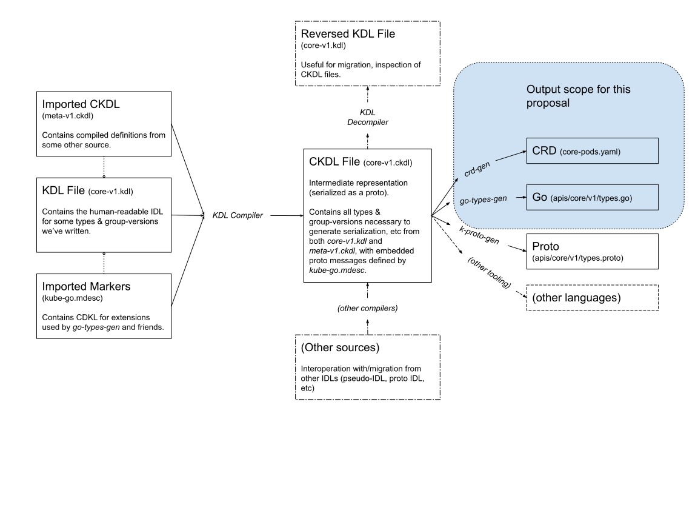

# KEP-2309: An IDL for Kubernetes

<!-- toc -->
- [Release Signoff Checklist](#release-signoff-checklist)
- [A bit of background](#a-bit-of-background)
- [Who interacts with our types?](#who-interacts-with-our-types)
- [What problems do we have now...](#what-problems-do-we-have-now)
  - [...as API Authors?](#as-api-authors)
    - [Pseudo-IDL is hard to write properly](#pseudo-idl-is-hard-to-write-properly)
    - [Pseudo-IDL is unfriendly to non-Go programmers](#pseudo-idl-is-unfriendly-to-non-go-programmers)
    - [Pseudo-IDL is not one-to-one with the k8s type system](#pseudo-idl-is-not-one-to-one-with-the-k8s-type-system)
  - [...as API consumers](#as-api-consumers)
    - [Generation of CRD YAML is unfriendly to non-Go environments](#generation-of-crd-yaml-is-unfriendly-to-non-go-environments)
    - [Wire formats are strongly tied to source formats](#wire-formats-are-strongly-tied-to-source-formats)
    - [Pseudo-IDL is hard to review](#pseudo-idl-is-hard-to-review)
  - [...as tooling maintainers?](#as-tooling-maintainers)
- [Goals](#goals)
- [Non-Goals](#non-goals)
- [Proposal](#proposal)
  - [Syntax](#syntax)
  - [Output Scope](#output-scope)
  - [Concrete KubeBuilder &amp; k/k Changes](#concrete-kubebuilder--kk-changes)
  - [Architecture](#architecture)
  - [Risks and Mitigations](#risks-and-mitigations)
  - [Compatibility](#compatibility)
- [Design Details](#design-details)
  - [Test Plan](#test-plan)
  - [Graduation Criteria](#graduation-criteria)
- [Implementation History](#implementation-history)
- [Alternatives](#alternatives)
  - [OpenAPI](#openapi)
  - [Proto](#proto)
  - [Others](#others)
- [Infrastructure Needed](#infrastructure-needed)
- [Addendum: Footnotes](#addendum-footnotes)
  - [1. core/v1 Mistakes](#1-corev1-mistakes)
<!-- /toc -->

## Release Signoff Checklist

Items marked with (R) are required *prior to targeting to a milestone / release*.

- [ ] (R) Enhancement issue in release milestone, which links to KEP dir in [kubernetes/enhancements] (not the initial KEP PR)
- [ ] (R) KEP approvers have approved the KEP status as `implementable`
- [ ] (R) Design details are appropriately documented
- [ ] (R) Test plan is in place, giving consideration to SIG Architecture and SIG Testing input
- [ ] (R) Graduation criteria is in place
- [ ] (R) Production readiness review completed
- [ ] (R) Production readiness review approved
- [ ] "Implementation History" section is up-to-date for milestone
- [ ] User-facing documentation has been created in [kubernetes/website], for publication to [kubernetes.io]
- [ ] Supporting documentation—e.g., additional design documents, links to mailing list discussions/SIG meetings, relevant PRs/issues, release notes

<!--
**Note:** This checklist is iterative and should be reviewed and updated every time this enhancement is being considered for a milestone.
-->

[kubernetes.io]: https://kubernetes.io/
[kubernetes/enhancements]: https://git.k8s.io/enhancements
[kubernetes/kubernetes]: https://git.k8s.io/kubernetes
[kubernetes/website]: https://git.k8s.io/website

## A bit of background

Through our API conventions & best practices, API mechanics, and implicit
contracts, Kubernetes defines a type system for its API.  This type system
includes a specific set of primitives (integers, quantity, string, etc),
as well as several forms of "algebraic" data types (kinds, structs,
list-maps, etc).  Some of these concepts commonly exist elsewhere, with
slight restrictions (e.g. struct), others (e.g. kind, list-map, quantity)
are largely specific to Kubernetes.

Historically, we've encoded these types via a combination of Go types,
conventions, special comments (sometimes called "comment tags" or
"markers"), Go struct tags, and hand-written bespoke validation
& defualting code (we'll refer to these things as the Go Pseudo-IDL, or
just pseudo-IDL for short).

The exact methods for making use of pseudo-IDL have varried between parts
of the Kubernetes ecosystem:

- "core" kubernetes/kubernetes uses [gengo][gengo]
  & [code-generator][code-generator]

- some SIG-sponsored projects, as well as the majority of the broader k8s
  ecosystem, use [controller-tools][controller-tools], part of the
  [KubeBuilder][kb] subproject of SIG API-Machinery.

- A few projects use their own toolchains due to specific
  constraints (e.g. Istio), but these are relatively rare.

Each of these projects uses slightly different "dialects" of the
pseudo-IDL, varying in the exact names an syntax of the marker comments
and such due to somewhat organic branching evolution.

[gengo]: https://git.k8s.io/gengo

[code-generator]: https://git.k8s.io/code-generator

[controller-tools]: https://sigs.k8s.io/controller-tools.

[kb]: https://book.kubebuilder.io

## Who interacts with our types?

* **API Authors** produce API definitions, commonly embedding other API
  types within their own (think PodTemplateSpec within a custom workloads
  controller).

  * **Kubernetes contributors** define built-in APIs for Kubernetes, as
    well as *reviewing* them for correctness.

  * **Go extension authors** write CRDs and custom controllers/operators
    in Go (often with [KubeBuilder][kb])

  * **Non-Go extension authors** write CRDs for systems in a variety of
    other languages, including both imperative programming languages (e.g.
    Python) and as abstractions over existing templatating systems (e.g.
    to port Helm charts to full operators).

* **API consumers** consume API definitions from elsewhere.  They write
  custom controllers that interact with core APIs and custom resources,
  using both Go and non-Go languages (e.g. Python, Java).

* **Tooling maintainers** maintain tooling that compiles or translates API
  definitions into other forms (CRD YAML, API docs, Go deepcopy code,
  etc).

## What problems do we have now...

### ...as API Authors?

#### Pseudo-IDL is hard to write properly

It's pretty easy to make mistakes when writing markers, JSON, and proto
tags.  Consider:

<details>
<summary>an example</summary>

```go
type MyType struct {
    ANumber int `json:"thenumber"`

    // +kubebuilder:validtion:Maximum=11

    // TODO: this should really be a pointer

    // Volume controls the volume
    Volume int `json:"Volume"`
}
```

There are three mistakes in the above example:

```go
type MyType struct {
    // - probably accidentally refactored and
    //   forgot to change the JSON tag

    ANumber int `json:"anumber"`

    // - markers should be in the second-closest comment
    //   block, or closer.  Probably added a TODO without
    //   realizing it would disrupt things
    // - "validation" was misspelled
    // - probably did a find-replace that was case-insensitive
    //   by accident, and therefor added an uppercase json field

    // +kubebuilder:validation:Maximum=11
    // TODO: this really should be a pointer

    // Volume controls the volume
    Volume int `json:"volume"`
}
```

</details>

The root issue in of each of these mistakes can be found in the following
causes, each of which can be seen in our own codebase
[<sup>1</sup>](#1-corev1-mistakes):

1. There are 3-4 different places & syntaxes that affect any given type or
   field (raw Go type information, JSON & proto struct tags, markers)

2. JSON & proto tags are largely redundant, yet must be specified,
   otherwise serialization won't work properly

3. It's easy to typo or misplace markers and struct tags in ways that
   don't get caught until much later.

4. These things are often simply copied from place to place without full
   understanding of them or the implications of getting them wrong, due to
   their complicated & redundant manner.

#### Pseudo-IDL is unfriendly to non-Go programmers

* Requiring a full Go toolchain for non-Go projects is cumbersome
  & potentially blocking for certain environments

* Non-Go programmers are often hesitant to learn an entirely separate
  programming language, but are comfortable with learning an IDL

#### Pseudo-IDL is not one-to-one with the k8s type system

* Go expresses concepts that we don't want or need in our "platonic" k8s
  IDL (e.g. interfaces, floats, aliasing string to int, complex maps)

  * This makes it harder to teach, since folks used to Go will reach for
    those things, and then become frustrated when they learn that those
    concepts aren't allowed.

* Go needs augmentation with comments to describe concepts that are
  fundamental to the type system (e.g. group-versions, kinds,
  enumerations, volumesource-esque things, ordered maps)

  * This makes it harder to teach because there's no direct representation
    for these concepts natively.

### ...as API consumers

#### Generation of CRD YAML is unfriendly to non-Go environments

* Writing Go code to generate CRDs makes little sense in environments
  without any pre-existing Go code

* Generation is in-binary, making custom extensions (even those in Go)
  more difficult to write without requiring duplicate parsing passes

#### Wire formats are strongly tied to source formats

Because we rely on Go types to serialize to JSON, experimenting with
different structures in Go is difficult (e.g. it might rely on
hand-writing custom JSON serialization)

While it's not *remotely* in scope for this proposal to change the Go
types representation, it has occasionally come up that it'd be nice to
experiment (e.g. types the preserve unknown fields round-trip, interfaces
instead of giant structs where you have to set only one field).

#### Pseudo-IDL is hard to review

* For many of the reasons pseudo-IDL is [hard to
  write](#pseudo-idl-is-hard-to-write-properly), it's also hard to review:
  reviewers have to look at many different pieces of information, commonly
  with slightly different values.  This results in issues like [bad struct
  tags][upper-field-name].

* Different parts of the pseudo-IDL are split across different files
  (types vs validation vs defaulting), making it more difficult to review
  holistically.

### ...as tooling maintainers?

* Duplicated efforts: [k8s.io/code-generator][code-generator] and
  [controller-gen][controller-tools] use different tooling to generate
  code & artifacts from markers.  This results in:

  * duplicated maintenance effort
  * slightly differing semantics
  * generation modules written in the less flexible k8s.io/code-generator
    cannot easily compatible with controller-gen

* Difficulty parsing:

  * a full Go parser & type-checker are required (due to aliasing over
    primitives, dot imports, etc), as well as a full Go standard library

  * Parsing is slow, since it requires traversing non-IDL resources in the
    same package (hacks can speed this up, but only so much, and at the
    expense of good error messages)

  * Properly parsing markers is clumsy & easy to mess up between different
    implementations, since it relies on wobbly definitions of which comments
    are associated with a given field or type

  * It's hard to distribute your pseudo-IDL without distributing the rest
    of your types package (this is a problem for orgs that have
    restrictions on which source code they can deliver to end users)

* Pseudo-IDL is hard to validate: since markers are just comment, and are
  explicitly defined, namespaced, etc, it's hard to know if
  a non-conforming or unknown marker is actually wrong, or just intended
  to be consumed by a different piece of tooling, or just happens to look
  like a marker.

## Goals

1. **Guide authors in the right direction**: it should be easy to write
   APIs that follow the Kubernetes API conventions and recommendations,
   and hard/impossible to write invalid APIs

2. **Be easy to consume by different pieces of tooling**: a serialized
   form (think proto descriptor files) should exist that’s easy to consume
   in the language of your choice.  This way, different tools/languages
   can do code generation, etc from their native environments

3. **Be a good code generation input**: it should be relatively
   straightforward to generate idiomatic types in Go.  While it’s
   a non-goal to actually implement output for other languages, it should
   be possible to do so and get idiomatic types (consider this "external
   work" from goal 5).

4. **Be a good OpenAPI generation input**: it should be relatively
   straightforward to compile our IDL into Kubernetes OpenAPI.

5. **Enable future/external work & experimentation**: there are many
   possible follow-up improvements or experiments that can be done with an
   IDL. While implementing these explicitly does not fall under the
   concrete success criteria for this proposal, the IDL pipeline should be
   flexible enough to support developing them as future work by us or
   external tooling by third-party projects.

## Non-Goals

1. **Be a custom serialization format**: unlike proto, we’re not
   interested in *directly* describing a serialization format.  Instead,
   we’re interested in being able to output types.go, proto IDL, code
   suitable for serializing in JSON, etc

2. **Support all features of OpenAPI**: the Kubernetes API guidelines
   suggest avoiding certain OpenAPI constructs, while the structural
   schema requirements explicitly reject others.  We’re interested in an
   IDL that guides people down the right path, and that doesn’t support
   constructs that aren’t allowed

3. **Deprecate/replace OpenAPI everywhere**: it’s not currently intended
   that this replace all uses of OpenAPI -- OpenAPI is still part of the
   CRD specification, will still be published by the API server, etc.

4. **Change k/k’s Go type representation**: the existing codebase is
   large and intricate.  For the sake of compatibility, initial efforts
   will focus around generating 1-1 compatible Go with the code that
   exists currently.

## Proposal

***Author's Note***: *Please* read [Alternatives](#alternatives) before
commenting "why not" or "have you considered" here.

### Syntax

See [the attached proposal][syntax] for grammar, syntax design, and
in-depth examples.

[syntax]: ./syntax.md

### Output Scope

The intial scope of this proposal is to generate two concrete artifacts:
**CRDs** (i.e. what we have in controller-tools today) and **Go types**
(i.e. generate types.go).

The format is intended to be flexible enough that we can eventually port
all of the generators in code-generator to make use of the IDL.  These are
considered follow-up work after the MVP.

### Concrete KubeBuilder & k/k Changes

* **All types in k/k are rewritten to use KDL**.  All Go types in k/k are
  generated.
   
  This guides core k/k towards KDL usage, and enables third-parties to
  interact with k/k types well from KDL.

* **The KubeBuilder project is updated to support KDL, and the pseudo-IDL
  frontend for controller-tools is deprecated.**  This guides community
  members towards using KDL and writing well-structured APIs.

  The internal representation for controller-tools will be updated to be
  CDKL.

  To avoid breaking existing workflows, the pseudo-IDL frontend will
  continue to be available-but-deprecated in controller-tools for an
  extended period of time (at minimum the equivalent period of time to
  deprecating and removing a stable feature from k/k).

* **Go-to-KDL migration tooling is made available** to assist both k/k and
  the community in migrating from pseudo-IDL to KDL.

  For k/k, it's expected that this will take place in 2 phases -- an
  automated migration that produces technically-correct-but-not-detailed
  KDL, followed small-scale updates to bring in the richer declarative
  features from KDL that currently exist only in imperative code (e.g.
  converting volumesource-esque things to be identified as such, bringing
  in declarative defaulting & validation).

### Architecture

* Humans write KDL files (see [the syntax overview][syntax]), which
  compile to CKDL files (which are machine-readable, serialized as proto
  blobs)

* CKDL files are consumed by generators to produce source code, CRD YAML,
  etc

* Tooling for CKDL files may define custom extensions (markers) in special
  KDL files, which then get serialized as proto Any messages to be picked
  up by downstream tooling (this gives each marker a concrete type and
  ensures that markers are explicitly imported so that all markers in
  a file are known to the parser).



### Risks and Mitigations

* **Learning curve**: any new setup has a potential learning curve.  That
  being said, the syntax should look at least familiar to folks who have
  worked with languages that use  `item: type` syntax (e.g. Rust,
  TypeScript, Python type hints).  Furthermore, tooling to convert between
  Go pseudo-IDL and KDL should allow easy comparison for existing API
  authors.

* **Tooling maintenance**: this introduces several new tools (KDL
  compiler, decompiler).  That being said, the intention is to supercede
  and simplify a variety of existing tools (code-generator/gengo,
  kubernetes-clients/gen, controller-tools), so this should eventually
  converge on a significantly defragmented set of tooling within the
  Kubernetes ecosystem

* **Code migration**: there’s a lot of types within the Kubernetes
  project.  However, it’s possible (and decently straightforward) to
  compile existing pseudo-IDL to CKDL, and then reverse the CKDL back to
  KDL, which means by-and-large the migration can be automated, with
  manual intervention solely to supplement existing type information or
  for aesthetic purposes.

* **Dev tooling**: unlike the existing pseudo-IDL, there will be no
  existing syntax highlighting/jump-to-definition/etc out of the box.

  * Basic syntax highlighting for several popular editors (VIM, VS
    Code/other textmate-grammar-based editors) is fairly achievable
    short-term (the [repository][repo] contains an implementation of VIM
    syntax highlighting).

  * Supplemental functionality via a language server implementation could
    restore the rest of this functionality in most popular editors, but
    this would involve significantly more work, and may not be worth it in
    the short term.

### Compatibility

As the output format (CKDL) is serialized as proto blobs, proper
discipline with changes to CDKL should mean we get the built-in
compatibility guarantees of protobuf.  This means that CKDL files compiled
with older compilers should work automatically with newer tooling, and
vice versa.

Likewise, since marker definitions are imported, it's possible to add new
markers to the language without changing the syntax or compiler.
Similarly, since marker defintions are effectively syntactic sugar over
proto message definitions, the markers *themselves* benefit from the same
guarantees as CKDL itself around compatibility.

This leaves the KDL syntax itself.  It's expected that the syntax itself
will not change frequently.  In the case of major syntax changes, the
CKDL-to-KDL converter may be used to migrate source files.

*If* major syntax changes are needed, a second version of the language may
be introduced, with an equivalent major version in the file extensions
(e.g. `file.kdl2`).

## Design Details

See the [directxman12/idl][repo] repository for a working implementation
of the compiler and generators, as well as additional documentation.

[repo]: https://github.com/directxman12/idl

### Test Plan

<!--
**Note:** *Not required until targeted at a release.*

Consider the following in developing a test plan for this enhancement:
- Will there be e2e and integration tests, in addition to unit tests?
- How will it be tested in isolation vs with other components?

No need to outline all of the test cases, just the general strategy. Anything
that would count as tricky in the implementation, and anything particularly
challenging to test, should be called out.

All code is expected to have adequate tests (eventually with coverage
expectations). Please adhere to the [Kubernetes testing guidelines][testing-guidelines]
when drafting this test plan.

[testing-guidelines]: https://git.k8s.io/community/contributors/devel/sig-testing/testing.md
-->

### Graduation Criteria

## Implementation History

## Alternatives

### OpenAPI

* **Hard to write by hand**: OpenAPI is a great output format for
  validation, but writing by hand is difficult.  For instance, in order to
  describe a volumesource-style constructs (a common construct in
  Kubernetes: consider horizontal pod autoscalers, the update strategy in
  workload controllers, etc) in Kubernetes-compatible OpenAPI,
  a complicated construct involving oneof, single-value enums, and
  property-count validation is necessary. 

* **Doesn’t describe all of the Kubernetes type system**: we already have
  a bunch of custom extensions on top of OpenAPI (e.g. x-int-or-string),
  which at least partially negates the benefit that comes from shared
  OpenAPI tooling.

* **Describes invalid types**: OpenAPI can easily describe constructs
  which are either invalid (e.g. certain combinations of oneof under
  structural rules) or not recommended (e.g. complex maps, floats).  Many
  of these are tools that users reach for instinctively, and as such
  OpenAPI guides users down the wrong path (see goal #1)

* **Not a particularly good code generation source**: for similar reasons
  to “hard to write by hand”, OpenAPI does not actually make
  a particularly good code generation source for type-safe APIs.  For
  instance:

  * Existing tooling is pretty good at generating “naive” types from
    OpenAPI, it’s hard to extract meaning on more complex types (e.g.
    volumesource-style things, enums).

  * It’s currently impossible to identify stringly-typed types more
    robustly in CRD OpenAPI due to type erasure.

    <details>
    <summary>stringly typed values...</summary>

    ... are values whose concrete type is string, but which have
    structured data inside the string.  Examples in k8s include Quantity,
    Time, and Duration.

    </details>

  * Extensions could improve these cases, but that means:

    * maintaining custom tooling to work with those custom extensions (not
      that different from maintaining tooling that ingests IDL IR)

    * Potentially waiting for API changes & API server version support
      (often up to 1y after release), unless you want to maintain an extra
      translation layer for older API servers.

### Proto

* Strongly tied to wire format: proto is strongly tied to our proto wire
  format, which could cause many of the same issues as we see today with
  the literal JSON representation being mirrored in Go code.

  For instance, one might think to represent something like the HPA's
  MetricType in proto as:

   ```protobuf
   message MetricType {
     oneof {
       ExternalMetric external = 1;
       PodMetric pod = 2;
     }
   }
   ```

  However, the current Kubernetes API guidelines require the use of
  a tag.  While it would be possible to compile to OpenAPI that described
  a tag, according to the way that our current proto serialization worked,
  we’d also need to translate to a separate proto IDL file that also
  included a tag for proto.  This seems confusing at best -- current users
  express confusion today over “which can’t I just embed this arbitrary
  struct into my pseudo-IDL, it’s all just Go code anyway”.

  This also restricts how we change the IDL in the future -- unless we
  have a separate pass to compile to proto, we’re restricted by not
  breaking serialization compatibility.

* **Describes invalid types**: for instance, proto has many integer types,
  yet only a few are supported by the kubernetes type system, and we have
  specific requirements around their proto representation (see “strongly
  tied to wire format”)

* **Mismatched semantics between proto keywords and Kubernetes**: for
  instance, proto2 has optional and default, proto3 has a less
  straightforward answer to those.  Furthermore, a field might be optional
  in proto serialization (all fields in proto3) but semantically required,
  meaning we’d need an custom extension to differentiate between
  “Kubernetes optional” and “proto optional” (see also “strongly tied to
  wire format”)

* **Mismatched terminology**: proto has a lot of terminology that makes
  sense when talking about a binary serialization format, but sounds
  strange in Kubernetes context (e.g. “message”, “repeated” being the word
  for list, 7 different types of integers)

* **No built-in support for documentation**: while the proto compiler can
  capture comments, it has no built-in support for distinguishing doc
  comments from other comments, and actually extracting comments is a bit
  of a clunky process.  This would likely lead to similar issues to what
  we see today with doc comments (misplaced comments, accidentally mixing
  comments and docs, etc)


For a comparison between Go, proto, and an earlier-but-similar revision of
the current syntax, see [the repository][repo-comparison].

[repo-comparison]: https://github.com/DirectXMan12/idl/tree/main/comparison

### Others

* **Cue**: easier to write than OpenAPI, but otherwise shares similar
  issues with OpenAPI.  Doesn't have good extension points.

## Infrastructure Needed

* **Repository**: `k8s.io/idl` (or similar) for the compiler toolchain,
  documentation, etc.

* **Site Hosting**: some place to put nicely-formatted tutorials and such,
  similar to the [KubeBuilder book][kb].

## Addendum: Why do we need to do this in k/k

While we could just do this as a self-contained part of the KubeBuilder
project (it would certainly be easier -- we wouldn't need a KEP!), such an
approach presents a significant downside:

Historically, a major source of frustration in using our existing
tooling has been the drift between k/k tooling and CRD tooling.  This
has largely taken three forms:

1. Differing ways of doing validation/defaulting/etc leading to validation
   being entirely absent in subsections of CRDs (think PodSpec embedded in
   a custom workload CRD).

2. k/k adding details that lead to unusuable type definitions (e.g.
   ["Default value not allowed for in
   x-kubernetes-list-map-keys"][unusable-types])

3. Type versioning being unwieldy to deal with due to Go versioning
   restrictions

While an IDL won't immediately solve issue 1 (although it can improve the
situation over time -- some is better than none!), it can certainly help
solve issues 2 and 3.

Stopping such drift between k/k and CRDs, and even reducing it, would be
a major win for the developer experience of writing CRDs for kubernetes.

[unusable-types]: https://github.com/kubernetes/kubernetes/issues/91395

## Addendum: Footnotes

### 1. core/v1 Mistakes

- We completely ignore the actual value of most proto tags data when
  generating (see [go-to-protobuf][ignored-proto]), leading to largely
  nonsensical proto tags in the actual codebase (e.g. [non-slice fields
  being marked as `rep`][proto-rep])

- We've published APIs with uppercase field names [because we missed
  a syntax error in code review][upper-field-name]

[ignored-proto]: https://github.com/kubernetes/code-generator/blob/8cc0d294774b931ef40bb2f1fb3a7bc06343ffa9/cmd/go-to-protobuf/protobuf/generator.go#L574

[proto-rep]: https://github.com/kubernetes/api/blob/master/core/v1/types.go#L35://github.com/kubernetes/api/blob/c873f2e8ab25481376d5b50b9d22719d6b2a1511/core/v1/types.go#L1597

[upper-field-name]: https://github.com/kubernetes/api/blob/c873f2e8ab25481376d5b50b9d22719d6b2a1511/core/v1/types.go#L1597
