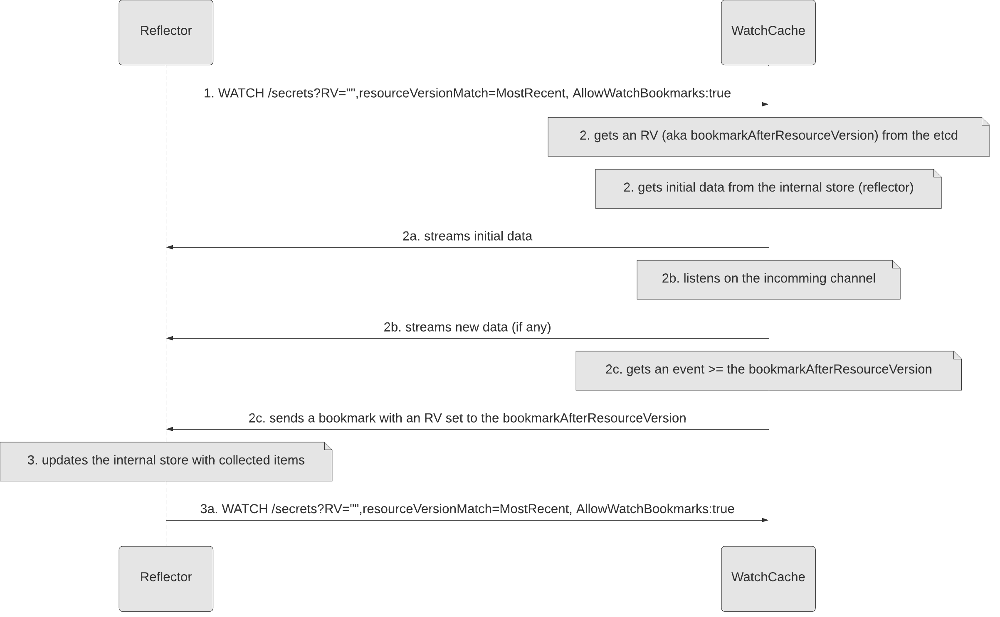
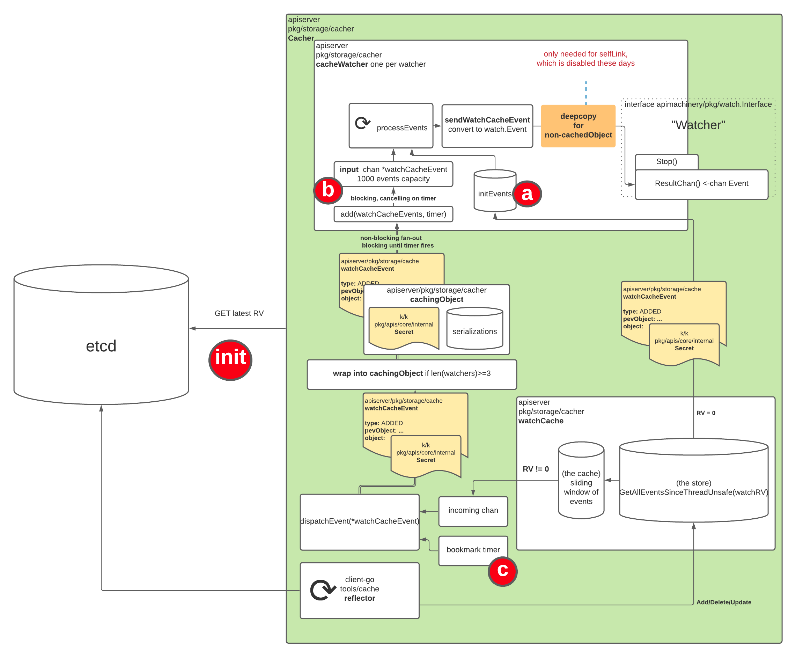
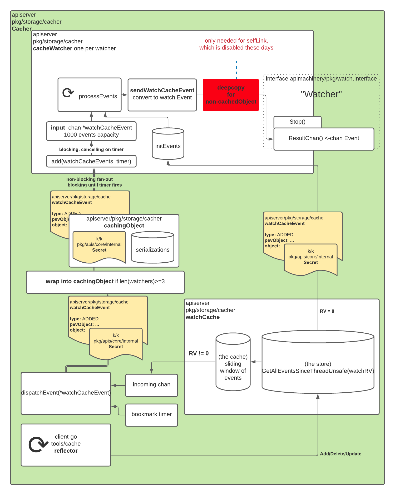
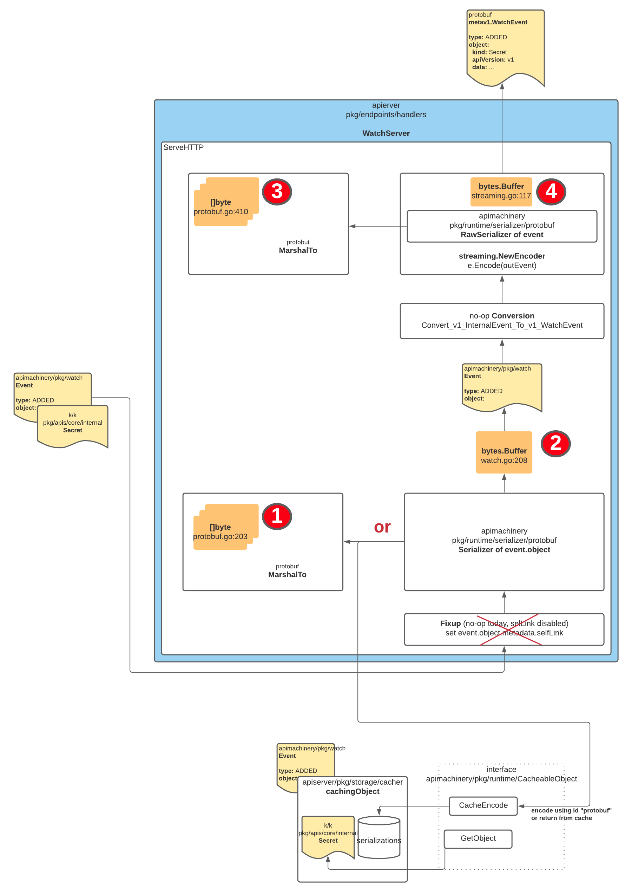

<!--
**Note:** When your KEP is complete, all of these comment blocks should be removed.

To get started with this template:

- [X] **Pick a hosting SIG.**
  Make sure that the problem space is something the SIG is interested in taking
  up. KEPs should not be checked in without a sponsoring SIG.
- [ ] **Create an issue in kubernetes/enhancements**
  When filing an enhancement tracking issue, please make sure to complete all
  fields in that template. One of the fields asks for a link to the KEP. You
  can leave that blank until this KEP is filed, and then go back to the
  enhancement and add the link.
- [ ] **Make a copy of this template directory.**
  Copy this template into the owning SIG's directory and name it
  `NNNN-short-descriptive-title`, where `NNNN` is the issue number (with no
  leading-zero padding) assigned to your enhancement above.
- [ ] **Fill out as much of the kep.yaml file as you can.**
  At minimum, you should fill in the "Title", "Authors", "Owning-sig",
  "Status", and date-related fields.
- [ ] **Fill out this file as best you can.**
  At minimum, you should fill in the "Summary" and "Motivation" sections.
  These should be easy if you've preflighted the idea of the KEP with the
  appropriate SIG(s).
- [ ] **Create a PR for this KEP.**
  Assign it to people in the SIG who are sponsoring this process.
- [ ] **Merge early and iterate.**
  Avoid getting hung up on specific details and instead aim to get the goals of
  the KEP clarified and merged quickly. The best way to do this is to just
  start with the high-level sections and fill out details incrementally in
  subsequent PRs.

Just because a KEP is merged does not mean it is complete or approved. Any KEP
marked as `provisional` is a working document and subject to change. You can
denote sections that are under active debate as follows:

```
<<[UNRESOLVED optional short context or usernames ]>>
Stuff that is being argued.
<<[/UNRESOLVED]>>
```

When editing KEPS, aim for tightly-scoped, single-topic PRs to keep discussions
focused. If you disagree with what is already in a document, open a new PR
with suggested changes.

One KEP corresponds to one "feature" or "enhancement" for its whole lifecycle.
You do not need a new KEP to move from beta to GA, for example. If
new details emerge that belong in the KEP, edit the KEP. Once a feature has become
"implemented", major changes should get new KEPs.

The canonical place for the latest set of instructions (and the likely source
of this file) is [here](/keps/NNNN-kep-template/README.md).

**Note:** Any PRs to move a KEP to `implementable`, or significant changes once
it is marked `implementable`, must be approved by each of the KEP approvers.
If none of those approvers are still appropriate, then changes to that list
should be approved by the remaining approvers and/or the owning SIG (or
SIG Architecture for cross-cutting KEPs).
-->
# KEP-3157: allow informers for getting a stream of data instead of chunking.

<!--
This is the title of your KEP. Keep it short, simple, and descriptive. A good
title can help communicate what the KEP is and should be considered as part of
any review.
-->

<!--
A table of contents is helpful for quickly jumping to sections of a KEP and for
highlighting any additional information provided beyond the standard KEP
template.

Ensure the TOC is wrapped with
  <code>&lt;!-- toc --&rt;&lt;!-- /toc --&rt;</code>
tags, and then generate with `hack/update-toc.sh`.
-->

<!-- toc -->
- [Release Signoff Checklist](#release-signoff-checklist)
- [Summary](#summary)
- [Motivation](#motivation)
  - [Goals](#goals)
  - [Non-Goals](#non-goals)
- [Proposal](#proposal)
  - [Risks and Mitigations](#risks-and-mitigations)
- [Design Details](#design-details)
  - [Required changes for a WATCH request with the RV=&quot;&quot; and the ResourceVersionMatch=MostRecent](#required-changes-for-a-watch-request-with-the-rv-and-the-resourceversionmatchmostrecent)
    - [API changes](#api-changes)
    - [Important optimisations](#important-optimisations)
    - [Manual testing without the changes in place](#manual-testing-without-the-changes-in-place)
    - [Results with WATCH-LIST](#results-with-watch-list)
  - [Required changes for a WATCH request with the RV set to the last observed value (RV &gt; 0)](#required-changes-for-a-watch-request-with-the-rv-set-to-the-last-observed-value-rv--0)
  - [Provide a fix for the long-standing issue <a href="https://github.com/kubernetes/kubernetes/issues/59848">https://github.com/kubernetes/kubernetes/issues/59848</a>](#provide-a-fix-for-the-long-standing-issue-httpsgithubcomkuberneteskubernetesissues59848)
  - [Test Plan](#test-plan)
  - [Graduation Criteria](#graduation-criteria)
  - [Upgrade / Downgrade Strategy](#upgrade--downgrade-strategy)
  - [Version Skew Strategy](#version-skew-strategy)
- [Production Readiness Review Questionnaire](#production-readiness-review-questionnaire)
  - [Feature Enablement and Rollback](#feature-enablement-and-rollback)
  - [Rollout, Upgrade and Rollback Planning](#rollout-upgrade-and-rollback-planning)
  - [Monitoring Requirements](#monitoring-requirements)
  - [Dependencies](#dependencies)
  - [Scalability](#scalability)
  - [Troubleshooting](#troubleshooting)
- [Implementation History](#implementation-history)
- [Drawbacks](#drawbacks)
- [Alternatives](#alternatives)
- [Appendix](#appendix)
  - [Sources of LIST request](#sources-of-list-request)
  - [Steps followed by informers](#steps-followed-by-informers)
- [Infrastructure Needed (Optional)](#infrastructure-needed-optional)
<!-- /toc -->

## Release Signoff Checklist

<!--
**ACTION REQUIRED:** In order to merge code into a release, there must be an
issue in [kubernetes/enhancements] referencing this KEP and targeting a release
milestone **before the [Enhancement Freeze](https://git.k8s.io/sig-release/releases)
of the targeted release**.

For enhancements that make changes to code or processes/procedures in core
Kubernetes—i.e., [kubernetes/kubernetes], we require the following Release
Signoff checklist to be completed.

Check these off as they are completed for the Release Team to track. These
checklist items _must_ be updated for the enhancement to be released.
-->

Items marked with (R) are required *prior to targeting to a milestone / release*.

- [ ] (R) Enhancement issue in release milestone, which links to KEP dir in [kubernetes/enhancements] (not the initial KEP PR)
- [ ] (R) KEP approvers have approved the KEP status as `implementable`
- [ ] (R) Design details are appropriately documented
- [ ] (R) Test plan is in place, giving consideration to SIG Architecture and SIG Testing input (including test refactors)
  - [ ] e2e Tests for all Beta API Operations (endpoints)
  - [ ] (R) Ensure GA e2e tests for meet requirements for [Conformance Tests](https://github.com/kubernetes/community/blob/master/contributors/devel/sig-architecture/conformance-tests.md) 
  - [ ] (R) Minimum Two Week Window for GA e2e tests to prove flake free
- [ ] (R) Graduation criteria is in place
  - [ ] (R) [all GA Endpoints](https://github.com/kubernetes/community/pull/1806) must be hit by [Conformance Tests](https://github.com/kubernetes/community/blob/master/contributors/devel/sig-architecture/conformance-tests.md) 
- [ ] (R) Production readiness review completed
- [ ] (R) Production readiness review approved
- [ ] "Implementation History" section is up-to-date for milestone
- [ ] User-facing documentation has been created in [kubernetes/website], for publication to [kubernetes.io]
- [ ] Supporting documentation—e.g., additional design documents, links to mailing list discussions/SIG meetings, relevant PRs/issues, release notes

<!--
**Note:** This checklist is iterative and should be reviewed and updated every time this enhancement is being considered for a milestone.
-->

[kubernetes.io]: https://kubernetes.io/
[kubernetes/enhancements]: https://git.k8s.io/enhancements
[kubernetes/kubernetes]: https://git.k8s.io/kubernetes
[kubernetes/website]: https://git.k8s.io/website

## Summary

<!--
This section is incredibly important for producing high-quality, user-focused
documentation such as release notes or a development roadmap. It should be
possible to collect this information before implementation begins, in order to
avoid requiring implementors to split their attention between writing release
notes and implementing the feature itself. KEP editors and SIG Docs
should help to ensure that the tone and content of the `Summary` section is
useful for a wide audience.

A good summary is probably at least a paragraph in length.

Both in this section and below, follow the guidelines of the [documentation
style guide]. In particular, wrap lines to a reasonable length, to make it
easier for reviewers to cite specific portions, and to minimize diff churn on
updates.

[documentation style guide]: https://github.com/kubernetes/community/blob/master/contributors/guide/style-guide.md
-->

The kube-apiserver is vulnerable to memory explosion.
The issue is apparent in larger clusters, where only a few LIST requests might cause serious disruption.
Uncontrolled and unbounded memory consumption of the servers does not only affect clusters that operate in an 
HA mode but also other programs that share the same machine.
In this KEP we propose a potential solution to this issue.

## Motivation

<!--
This section is for explicitly listing the motivation, goals, and non-goals of
this KEP.  Describe why the change is important and the benefits to users. The
motivation section can optionally provide links to [experience reports] to
demonstrate the interest in a KEP within the wider Kubernetes community.

[experience reports]: https://github.com/golang/go/wiki/ExperienceReports
-->

Today informers are the primary source of LIST requests.
The LIST is used to get a consistent snapshot of data to build up a client-side in-memory cache.
The primary issue with LIST requests is unpredictable memory consumption.
The actual usage depends on many factors like the page size, applied filters (e.g. label selectors), query parameters, and sizes of individual objects.
See the [Appendix](#appendix) section for more details on potential sources of LIST request and their impact on memory.

In extreme cases, the server can allocate hundreds of megabytes per request.
To better visualize the issue let's consider the above graph.
It shows the memory usage of an API server during a test (see [manual test](#manual-testing-without-the-changes-in-place) section for more details).
We can see that increasing the number of informers drastically increases the memory consumption of the server.
Moreover, around 16:40 we lost the server after running 16 informers. During an investigation, we realized that the server allocates a lot of memory for handling LIST requests.
In short, it needs to bring data from the database, unmarshal it, do some conversions and prepare the final response for the client.
The bottom line is around O(5*the_response_from_etcd) of temporary memory consumption.
Neither priority and fairness nor Golang garbage collection is able to protect the system from exhausting memory.

A situation like that is dangerous twofold.
First, as we saw it could slow down if not fully stop an API server that has received the requests.
Secondly, a sudden and uncontrolled spike in memory consumption will likely put pressure on the node itself.
This might lead to thrashing, starving, and finally losing other processes running on the same node, including kubelet.
Stopping kubelet has serious issues as it leads to workload disruption and a much bigger blast radius.
Note that in that scenario even clusters in an HA setup are affected.

Worse, in rare cases (see the [Appendix](#appendix) section for more) recovery of large clusters with therefore many kubelets and hence informers for pods, secrets, configmap can lead to a very expensive storm of LISTs.

### Goals

<!--
List the specific goals of the KEP. What is it trying to achieve? How will we
know that this has succeeded?
-->
- protect kube-apiserver and its node against list-based OOM attacks
- considerably reduce (temporary) memory footprint of LISTs, down from O(watchers\*page-size\*object-size\*5) to O(watchers\*constant), constant around 2 MB.
>  Example:
> 
>  512 watches of 400mb data: 512*500*2MB*5=2.5TB ↘ 2 GB
> 
>  racing with Golang GC to free this temporary memory before being OOM'ed.

- reduce etcd load by serving from watch cache
- get a replacement for paginated lists from watch-cache, which is not feasible without major investment
- enforce consistency in the sense of freshness of the returned list
- be backward compatible with new client -> old server
- fix the long-standing "stale reads from the cache" issue, https://github.com/kubernetes/kubernetes/issues/59848

### Non-Goals

<!--
What is out of scope for this KEP? Listing non-goals helps to focus discussion
and make progress.
-->

- get rid of list or list pagination
- rewrite the list storage stack to allow streaming, but rather use the existing streaming infrastructure (watches).

## Proposal

<!--
This is where we get down to the specifics of what the proposal actually is.
This should have enough detail that reviewers can understand exactly what
you're proposing, but should not include things like API designs or
implementation. What is the desired outcome and how do we measure success?.
The "Design Details" section below is for the real
nitty-gritty.
-->

In order to lower memory consumption while getting a list of data and make it more predictable, we propose to use consistent streaming from the watch-cache instead of paging from etcd.
Initially, the proposed changes will be applied to informers as they are usually the heaviest users of LIST requests (see [Appendix](#appendix) section for more details on how informers operate today).
The primary idea is to use standard WATCH request mechanics for getting a stream of individual objects, but to use it for LISTs.
This would allow us to keep memory allocations constant.
The server is bounded by the maximum allowed size of an object of 1.5 MB in etcd (note that the same object in memory can be much bigger, even by an order of magnitude)
plus a few additional allocations, that will be explained later in this document.
The rough idea/plan is as follows:

- step 1: change the informers to establish a WATCH request with a new query parameter instead of a LIST request.
- step 2: upon receiving the request from an informer, contact etcd to get the latest RV. It will be used to make sure the watch cache has seen objects up to the received RV. This step is necessary and ensures we will serve consistent data, even from the cache.
- step 2a: send all objects currently stored in memory for the given resource.
- step 2b: propagate any updates that might have happened meanwhile until the watch cache catches up to the latest RV received in step 2.
- step 2c: send a bookmark event to the informer with the given RV.
- step 3: listen for further events using the request from step 1.

Note: the proposed watch-list semantics (without bookmark event and without the consistency guarantee) kube-apiserver follows already in RV="0" watches.
The mode is not used in informers today but is supported by every kube-apiserver for legacy, compatibility reasons.
A watch started with RV="0" may return stale. It is possible for the watch to start at a much older resource version that the client has previously observed, particularly in high availability configurations, due to partitions or stale caches

Note 2: informers need consistent lists to avoid time-travel when switching to another HA instance of kube-apiserver with outdated/lagging watch cache.
See the following [issue](https://github.com/kubernetes/kubernetes/issues/59848) for more details.


<!--
What are the caveats to the proposal?
What are some important details that didn't come across above?
Go in to as much detail as necessary here.
This might be a good place to talk about core concepts and how they relate.
-->

### Risks and Mitigations

<!--
What are the risks of this proposal, and how do we mitigate? Think broadly.
For example, consider both security and how this will impact the larger
Kubernetes ecosystem.

How will security be reviewed, and by whom?

How will UX be reviewed, and by whom?

Consider including folks who also work outside the SIG or subproject.
-->

## Design Details

<!--
This section should contain enough information that the specifics of your
change are understandable. This may include API specs (though not always
required) or even code snippets. If there's any ambiguity about HOW your
proposal will be implemented, this is the place to discuss them.
-->

### Required changes for a WATCH request with the RV="" and the ResourceVersionMatch=MostRecent

The following sequence diagram depicts steps that are needed to complete the proposed feature.
A high-level overview of each was provided in a table that follows immediately the diagram.
Whereas further down in this section we provided a detailed description of each required step.


<table>
<tr>
  <th>Step</th>
  <th>Description</th>
</tr>
<tr>
  <th>1.</th>
  <th>The reflector establishes a WATCH request with the watch cache.</th>
 </tr>
<tr>
  <th>2.</th>
  <th>The watch cache contacts etcd for the most up-to-date ResourceVersion.</th>
</tr>
<tr>
  <th>2a.</th>
  <th>The watch cache starts streaming initial data. The data it already has in memory.</th>
</tr>
<tr>
  <th>2b.</th>
  <th>The watch cache waits until it has observed data up to the RV received in step 2. Streaming all new data (if any) to the reflector immediately.</th>
</tr>
<tr>
  <th>2c.</th>
  <th>The watch cache has observed the RV (from step 2) and sends a bookmark event with the given RV to the reflector.</th>
</tr>
<tr>
  <th>3.</th>
  <th>The reflector replaces its internal store with collected items, updates its internal resourceVersion to the one obtained from the bookmark event.</th>
</tr>
<tr>
  <th>3a.</th>
  <th>The reflector uses the WATCH request from step 1 for further progress notifications.</th>
</tr>
</table>

Step 1: On initialization the reflector gets a snapshot of data from the server by passing RV=”” (= unset value) and setting resourceVersionMatch=MostRecent (= ensure freshness).
We do that only during the initial ListAndWatch call.
Each event (ADD, UPDATE, DELETE) except the BOOKMARK event received from the server is collected.
Passing resourceVersionMatch=MostRecent tells the cacher it has to guarantee that the cache is at least up to date as a LIST executed at the same time.

Note: This ensures that returned data is consistent, served from etcd via a quorum read and prevents "going back in time".

Note 2: Unfortunately as of today, the watch cache is vulnerable to stale reads, see https://github.com/kubernetes/kubernetes/issues/59848 for more details.

Step 2: Right after receiving a request from the reflector, the cacher gets the current resourceVersion (aka bookmarkAfterResourceVersion) directly from the etcd.
It is used to make sure the cacher is up to date (has seen data stored in etcd) and to let the reflector know it has seen all initial data.
There are ways to do that cheaply, e.g. we could issue a count request against the datastore.
Next, the cacher creates a new cacheWatcher (implements watch.Interface) passing the given bookmarkAfterResourceVersion, and gets initial data from the watchCache.
After sending initial data the cacheWatcher starts listening on an incoming channel for new events, including a bookmark event.
At some point, the cacher will receive an event with the resourceVersion equal or greater to the bookmarkAfterResourceVersion.
It will be propagated to the cacheWatcher and then back to the reflector as a BOOKMARK event.



Step 2a: Where does the initial data come from?

During construction, the cacher creates the reflector and the watchCache.
Since the watchCache implements the Store interface it is used by the reflector to store all data it has received from etcd.

Step 2b: What happens when new events are received while the cacheWatcher is sending initial data?

The cacher maintains a list of all current watchers (cacheWatcher) and a separate goroutine (dispatchEvents) for delivering new events to the watchers.
New events are added via the cacheWatcher.nonblockingAdd method that adds an event to the cacheWatcher.incoming channel.
The cacheWatcher.incoming is a buffered channel and has a different size for different Resources (10 or 1000).
Since the cacheWatcher starts processing the cacheWatcher.incoming channel only after sending all initial events it might block once its buffered channel tips over.
In that case, it will be added to the list of blockedWatchers and will be given another chance to deliver an event after all nonblocking watchers have sent the event.
All watchers that have failed to deliver the event will be closed.

Closing the watchers would make the clients retry the requests and download the entire dataset again even though they might have received a complete list before.

For an alpha version, we will delay closing the watch request until all data is sent to the client.
We expect this to behave well even in heavily loaded clusters. 
To increase confidence in the approach, we will collect metrics for measuring how far the cache is behind the expected RV,
what's the average buffer size, and a counter for closed watch requests due to an overfull buffer.

For a beta version, we have further options if they turn out to be necessary:
1. comparing the bookmarkAfterResourceVersion (from Step 2) with the current RV the watchCache is on
and waiting until the difference between the RVs is < 1000 (the buffer size). We could do that even before sending the initial events.
If the difference is greater than that it seems there is no need to go on since the buffer could be filled before we will receive an event with the expected RV.
Assuming all updates would be for the resource the watch request was opened for (which seems unlikely).
In case the watchCache was unable to catch up to the bookmarkAfterResourceVersion for some timeout value hard-close (ends the current connection by tearing down the current TCP connection with the client) the current connection so that client re-connects to a different API server with most-up to date cache.
Taking into account the baseline etcd performance numbers waiting for 10 seconds will allow us to receive ~5K events, assuming ~500 QPS throughput (see https://etcd.io/docs/v3.4/op-guide/performance/)
Once we are past this step (we know the difference is smaller) and the buffer fills up we:
    - case-1: won’t close the connection immediately if the bookmark event with the expected RV exists in the buffer.
    In that case, we will deliver the initial events, any other events we have received which RVs are <= bookmarkAfterResourceVersion, and finally the bookmark event, and only then we will soft-close (simply ends the current connection without tearing down the TCP connection) the current connection.
    An informer will reconnect with the RV from the bookmark event.
    Note that any new event received was ignored since the buffer was full.

    - case-2: soft-close the connection if the bookmark event with the expected RV for some reason doesn't exist in the buffer.
          An informer will reconnect arriving at the step that compares the RVs first.
2. make the buffer dynamic - especially when the difference between RVs is > than 1000
3. inject new events directly to the initial list, i.e. to have the initial list loop consume the channel directly and avoid to wait for the whole initial list being processed before
4. cap the size (cannot allocate more than X MB of memory) of the buffer
5. maybe even apply some compression techniques to the buffer (for example by only storing a low-memory shallow reference and take the actual objects for the event from the store)

Note: The RV is effectively a global counter that is incremented every time an object is updated.
This imposes a global order of events. It is equivalent to a LIST followed by a WATCH request.

Note 2: Currently, there is a timeout for LIST requests of 60s.
That means a slow reflector might fail synchronization as well and would have to re-establish the connection.

Step 2c: How bookmarks are delivered to the cacheWatcher?

First of all, the primary purpose of bookmark events is to deliver the current resourceVersion to watchers, continuously even without regular events happening.
There are two sources of resourceVersions.
The first one is regular events that contain RVs besides objects.
The second one is a special type of etcd event called progressNotification delivering the most up-to-date revision with the given interval only to the kube-apiserver.
As already mentioned in 2a the watchCache is driven by the reflector.
Every event will be eventually propagated from the watchCache to the cacher.processEvent method.
For simplicity, we can assume that the processEvent method will simply update the resourceVersion maintained by the cacher.

At regular intervals, the cacher checks expired watchers and tries to deliver a bookmark event.
As of today, the interval is set to 1 second.
The bookmark event contains an empty object and the current resourceVersion.
By default, a cacheWatcher expires roughly every 1 minute.

The expiry interval initially will be decreased to 1 second in this feature's code-path.
This helps us deliver a bookmark event that is >= bookmarkAfterResourceVersion much faster.
After that, the interval will be put back to the previous value.

Note: Since we get a notification every 5 seconds from etcd and we try to deliver a bookmark every 1 second.
It seems the maximum delay time a reflector will have to wait after receiving initial data is 6 seconds (assuming small dataset).
It might be unlikely in practice since we might get bookmarkAfterResourceVersion even before handling initial data.
Also sending data itself takes some time as well.

Step 3: After receiving a BOOKMARK event the reflector is considered to be synchronized.
It replaces its internal store with the collected items (syncWith) and reuses the current connection for getting further events.

#### API changes

Extend the optional `ResourceVersionMatch` query parameter of `ListOptions` with the following enumeration value:

```
const (
    // ResourceVersionMatchMostRecent matches data at the most recent ResourceVersion.
    // The returned data is consistent, that is, served from etcd via a quorum read.
    // For watch calls, it begins with synthetic "Added" events of all resources up to the most recent ResourceVersion.
    // It ends with a synthetic "Bookmark" event containing the most recent ResourceVersion.
    // For list calls, it has the same semantics as leaving ResourceVersion and ResourceVersionMatch unset.
    ResourceVersionMatchMostRecent ResourceVersionMatch = "MostRecent"
)
```

#### Important optimisations

1. Avoid DeepCopying of initial data<br><br>
The watchCache has an important optimization of wrapping objects into a cachingObject.
Given that objects aren't usually modified (since selfLink has been disabled) and the fact that there might be multiple watchers interested in receiving an event.
Wrapping allows us for serializing an object only once.

The watchCache maintains two internal data structures. 
The first one is called the store and is driven by the reflector.
It essentially mirrors the content stored in etcd.
It is used to serve LIST requests.
The second one is called the cache, which represents a sliding window of recent events received from the reflector.
It is effectively used to serve WATCH requests from a given RV.<br><br>
By design cachingObjects are stored only in the cache.
As described in Step 2, the cacheWatcher gets initial data from the watchCacher.
The latter, in turn, gets data straight from the store.
That means initial data is not wrapped into cachingObject and hence not subject to this existing optimization.<br><br>
Before sending objects any further the cacheWatcher does a DeepCopy of every object that has not been wrapped into the cachingObject.
Making a copy of every object is both CPU and memory intensive. It is a serious issue that needs to be addressed.<br><br>

2. Reduce the number of allocations in the WatchServer<br><br>
The WatchServer is largely responsible for streaming data received from the storage layer (in our case from the cacher) back to clients.
It turns out that sending a single event per consumer requires 4 memory allocations, visualized in the following image.
Two of which deserve special attention, namely the allocations 1 and 3 because they won't reuse memory and rely on the GC for cleanup.
In other words, the more events we need to send, the more (temporary) memory will be used.
In contrast, the other two allocations are already optimizedas they reuse memory instead of creating new buffers for every single event.
For better utilization, a similar technique of reusing memory could be used to save precious RAM and scale the system even further.



#### Manual testing without the changes in place
For the past few years, we have seen many clusters suffering from the issue.
Sadly, our only possible recommendation was to ask customers to reduce the cluster in size.
Since adding more memory in most of the cases would not fix the issue.
Recall from the motivation section that just a few requests can allocate gigabytes of data in a fraction of a second<br><br>
In order to reproduce the issue, we executed the following manual test, it is the simplest and cheapest way of putting yourself into customers' shoes: the reproducer creates a namespace with 400 secrets, each containing 1 MB of data.
Next, it uses informers to get all secrets in the cluster.
The rough estimate is that a single informer will have to bring at least 400MB from the datastore to get all secrets.<br><br>
**The result**: 16 informers were able to take down the test cluster.

#### Results with WATCH-LIST
We have prepared the following PR https://github.com/kubernetes/kubernetes/pull/106477 which is almost identical to the proposed solution.
It just differs in a few details.
The following image depicts the results we obtained after running the synthetic test described in 4.

First of all, it is worth mentioning that the PR was deployed onto the same cluster so that we could ensure an identical setup (CPU, Memory) between the tests.
The graph tells us a few things.<br><br>
Firstly, the proposed solution is at least **100** times better than the current state.
Around 12:05 we started the test with 1024 informers, all eventually synced without any errors.
Moreover during that time the server was stable and responsive.
That particular test ended around 12:30. That means it needed ~25 minutes to bring ~400 GB of data across the network!
Impressive achievement.<br><br>
Secondly, it tells us that memory allocation is not proportional yet to the number of informers! Given the size of individual objects of 1MB and the actual number of informers, we should allocate roughly around 2GB of RAM.
We managed to get and analyze the memory profile that showed a few additional allocations inside the watch server.
At this point, it is worth mentioning that the results were achieved with only the first optimization applied.
We expect the system will scale even better with the second optimization as it will put significantly less pressure on the GC.

### Required changes for a WATCH request with the RV set to the last observed value (RV > 0)

In that case, no additional changes are required.
We stick to existing semantics.
That is we start a watch at an exact resource version.
The watch events are for all changes after the provided resource version.
This is safe because the client is assumed to already have the initial state at the starting resource version since the client provided the resource version.

### Provide a fix for the long-standing issue https://github.com/kubernetes/kubernetes/issues/59848

The issue is still open mainly because informers default to resourceVersion="0" for their initial LIST requests.
This is problematic because the initial LIST requests served from the watch cache might return data that are arbitrarily delayed.
This in turn could make clients connected to that server read old data and undo recent work that has been done.

To make consistent reads from cache for LIST requests and thus prevent "going back in time" we propose to use the same technique for ensuring the cache is not stale as described in the previous section.

In that case we are going to change informers to pass "resourceVersion="0" and resourceVersionMatch=MostRecent" for their initial LIST requests.
Then on the server side we:

1. get the current revision from etcd.
2. use the existing waitUntilFreshAndBlock function to wait for the watch to catch up to the revision requested in the previous step.
3. reject the request if waitUntilFreshAndBlock times out, thus forcing informers to retry.
4. otherwise, construct the final list and send back to a client.

### Test Plan
- unit tests for new code added to the watch cache were implemented.
- unit tests for new code added to the reflector were implemented.
- integration tests asserting fallback mechanism for reflector were added.
<!--
**Note:** *Not required until targeted at a release.*

Consider the following in developing a test plan for this enhancement:
- Will there be e2e and integration tests, in addition to unit tests?
- How will it be tested in isolation vs with other components?

No need to outline all of the test cases, just the general strategy. Anything
that would count as tricky in the implementation, and anything particularly
challenging to test, should be called out.

All code is expected to have adequate tests (eventually with coverage
expectations). Please adhere to the [Kubernetes testing guidelines][testing-guidelines]
when drafting this test plan.

[testing-guidelines]: https://git.k8s.io/community/contributors/devel/sig-testing/testing.md
-->

### Graduation Criteria

<!--
**Note:** *Not required until targeted at a release.*

Define graduation milestones.

These may be defined in terms of API maturity, or as something else. The KEP
should keep this high-level with a focus on what signals will be looked at to
determine graduation.

Consider the following in developing the graduation criteria for this enhancement:
- [Maturity levels (`alpha`, `beta`, `stable`)][maturity-levels]
- [Deprecation policy][deprecation-policy]

Clearly define what graduation means by either linking to the [API doc
definition](https://kubernetes.io/docs/concepts/overview/kubernetes-api/#api-versioning)
or by redefining what graduation means.

In general we try to use the same stages (alpha, beta, GA), regardless of how the
functionality is accessed.

[maturity-levels]: https://git.k8s.io/community/contributors/devel/sig-architecture/api_changes.md#alpha-beta-and-stable-versions
[deprecation-policy]: https://kubernetes.io/docs/reference/using-api/deprecation-policy/

Below are some examples to consider, in addition to the aforementioned [maturity levels][maturity-levels].

#### Alpha

- Feature implemented behind a feature flag
- Initial e2e tests completed and enabled

#### Beta

- Gather feedback from developers and surveys
- Complete features A, B, C
- Additional tests are in Testgrid and linked in KEP

#### GA

- N examples of real-world usage
- N installs
- More rigorous forms of testing—e.g., downgrade tests and scalability tests
- Allowing time for feedback

**Note:** Generally we also wait at least two releases between beta and
GA/stable, because there's no opportunity for user feedback, or even bug reports,
in back-to-back releases.

**For non-optional features moving to GA, the graduation criteria must include
[conformance tests].**

[conformance tests]: https://git.k8s.io/community/contributors/devel/sig-architecture/conformance-tests.md

#### Deprecation

- Announce deprecation and support policy of the existing flag
- Two versions passed since introducing the functionality that deprecates the flag (to address version skew)
- Address feedback on usage/changed behavior, provided on GitHub issues
- Deprecate the flag
-->

### Upgrade / Downgrade Strategy

<!--
If applicable, how will the component be upgraded and downgraded? Make sure
this is in the test plan.

Consider the following in developing an upgrade/downgrade strategy for this
enhancement:
- What changes (in invocations, configurations, API use, etc.) is an existing
  cluster required to make on upgrade, in order to maintain previous behavior?
- What changes (in invocations, configurations, API use, etc.) is an existing
  cluster required to make on upgrade, in order to make use of the enhancement?
-->

### Version Skew Strategy

<!--
If applicable, how will the component handle version skew with other
components? What are the guarantees? Make sure this is in the test plan.

Consider the following in developing a version skew strategy for this
enhancement:
- Does this enhancement involve coordinating behavior in the control plane and
  in the kubelet? How does an n-2 kubelet without this feature available behave
  when this feature is used?
- Will any other components on the node change? For example, changes to CSI,
  CRI or CNI may require updating that component before the kubelet.
-->
Our immediate idea to ensure backward compatibility between new clients and old servers would be to return a 401 response in old Kubernetes releases (via backports).
This approach however would limit the maximum skew version mismatch to just a few previous releases, and would also force customers to update to latest minor versions.<br><br>
Therefore we propose to make use of the already existing "resourceVersionMatch" LIST option.
WATCH requests with that option set will be immediately rejected with a 403 (Forbidden) response by previous servers.
In that case, new clients will fall back to the previous mode (ListAndWatch).
New servers will allow for WATCH requests to have "resourceVersionMatch=MostRecent" set.<br><br>
Existing clients will be forward and backward compatible and won't require any changes since the server will preserve the old behavior (ListAndWatch).

## Production Readiness Review Questionnaire

<!--

Production readiness reviews are intended to ensure that features merging into
Kubernetes are observable, scalable and supportable; can be safely operated in
production environments, and can be disabled or rolled back in the event they
cause increased failures in production. See more in the PRR KEP at
https://git.k8s.io/enhancements/keps/sig-architecture/1194-prod-readiness.

The production readiness review questionnaire must be completed and approved
for the KEP to move to `implementable` status and be included in the release.

In some cases, the questions below should also have answers in `kep.yaml`. This
is to enable automation to verify the presence of the review, and to reduce review
burden and latency.

The KEP must have a approver from the
[`prod-readiness-approvers`](http://git.k8s.io/enhancements/OWNERS_ALIASES)
team. Please reach out on the
[#prod-readiness](https://kubernetes.slack.com/archives/CPNHUMN74) channel if
you need any help or guidance.
-->

### Feature Enablement and Rollback

<!--
This section must be completed when targeting alpha to a release.
-->

###### How can this feature be enabled / disabled in a live cluster?

<!--
Pick one of these and delete the rest.
-->

- [x] Feature gate (also fill in values in `kep.yaml`)
  - Feature gate name: ConsistentWatchList
  - Components depending on the feature gate: the kube-apiserver
- [ ] Other
  - Describe the mechanism:
  - Will enabling / disabling the feature require downtime of the control
    plane?
  - Will enabling / disabling the feature require downtime or reprovisioning
    of a node? (Do not assume `Dynamic Kubelet Config` feature is enabled).

###### Does enabling the feature change any default behavior?
No.
<!--
Any change of default behavior may be surprising to users or break existing
automations, so be extremely careful here.
-->

###### Can the feature be disabled once it has been enabled (i.e. can we roll back the enablement)?
Yes, in that scenario the kube-apiserver will reject WATCH requests with the new query parameter forcing informers to fall back to the previous mode.
<!--
Describe the consequences on existing workloads (e.g., if this is a runtime
feature, can it break the existing applications?).

NOTE: Also set `disable-supported` to `true` or `false` in `kep.yaml`.
-->

###### What happens if we reenable the feature if it was previously rolled back?
The expected behavior of the feature will be restored.

###### Are there any tests for feature enablement/disablement?
No.
<!--
The e2e framework does not currently support enabling or disabling feature
gates. However, unit tests in each component dealing with managing data, created
with and without the feature, are necessary. At the very least, think about
conversion tests if API types are being modified.
-->

### Rollout, Upgrade and Rollback Planning

<!--
This section must be completed when targeting beta to a release.
-->
###### How can a rollout or rollback fail? Can it impact already running workloads?

<!--
Try to be as paranoid as possible - e.g., what if some components will restart
mid-rollout?

Be sure to consider highly-available clusters, where, for example,
feature flags will be enabled on some API servers and not others during the
rollout. Similarly, consider large clusters and how enablement/disablement
will rollout across nodes.
-->

###### What specific metrics should inform a rollback?

<!--
What signals should users be paying attention to when the feature is young
that might indicate a serious problem?
-->

###### Were upgrade and rollback tested? Was the upgrade->downgrade->upgrade path tested?

<!--
Describe manual testing that was done and the outcomes.
Longer term, we may want to require automated upgrade/rollback tests, but we
are missing a bunch of machinery and tooling and can't do that now.
-->

###### Is the rollout accompanied by any deprecations and/or removals of features, APIs, fields of API types, flags, etc.?

<!--
Even if applying deprecation policies, they may still surprise some users.
-->

### Monitoring Requirements

<!--
This section must be completed when targeting beta to a release.
-->

###### How can an operator determine if the feature is in use by workloads?

<!--
Ideally, this should be a metric. Operations against the Kubernetes API (e.g.,
checking if there are objects with field X set) may be a last resort. Avoid
logs or events for this purpose.
-->

###### How can someone using this feature know that it is working for their instance?

<!--
For instance, if this is a pod-related feature, it should be possible to determine if the feature is functioning properly
for each individual pod.
Pick one more of these and delete the rest.
Please describe all items visible to end users below with sufficient detail so that they can verify correct enablement
and operation of this feature.
Recall that end users cannot usually observe component logs or access metrics.
-->

- [ ] Events
  - Event Reason: 
- [ ] API .status
  - Condition name: 
  - Other field: 
- [ ] Other (treat as last resort)
  - Details:

###### What are the reasonable SLOs (Service Level Objectives) for the enhancement?

<!--
This is your opportunity to define what "normal" quality of service looks like
for a feature.

It's impossible to provide comprehensive guidance, but at the very
high level (needs more precise definitions) those may be things like:
  - per-day percentage of API calls finishing with 5XX errors <= 1%
  - 99% percentile over day of absolute value from (job creation time minus expected
    job creation time) for cron job <= 10%
  - 99.9% of /health requests per day finish with 200 code

These goals will help you determine what you need to measure (SLIs) in the next
question.
-->

###### What are the SLIs (Service Level Indicators) an operator can use to determine the health of the service?

<!--
Pick one more of these and delete the rest.
-->

- [ ] Metrics
  - Metric name: apiserver_cache_watcher_buffer_length (histogram, what was the buffer size)
  - Metric name: apiserver_watch_cache_lag (histogram, for how far the cache is behind the expected RV)
  - Metric name: apiserver_terminated_watchers_total (counter, already defined, needs to be updated (by an attribute) so that we count closed watch requests due to an overfull buffer in the new mode)
  - [Optional] Aggregation method:
  - Components exposing the metric:
- [ ] Other (treat as last resort)
  - Details:

###### Are there any missing metrics that would be useful to have to improve observability of this feature?

<!--
Describe the metrics themselves and the reasons why they weren't added (e.g., cost,
implementation difficulties, etc.).
-->

### Dependencies

<!--
This section must be completed when targeting beta to a release.
-->

###### Does this feature depend on any specific services running in the cluster?

<!--
Think about both cluster-level services (e.g. metrics-server) as well
as node-level agents (e.g. specific version of CRI). Focus on external or
optional services that are needed. For example, if this feature depends on
a cloud provider API, or upon an external software-defined storage or network
control plane.

For each of these, fill in the following—thinking about running existing user workloads
and creating new ones, as well as about cluster-level services (e.g. DNS):
  - [Dependency name]
    - Usage description:
      - Impact of its outage on the feature:
      - Impact of its degraded performance or high-error rates on the feature:
-->


### Scalability

<!--
For alpha, this section is encouraged: reviewers should consider these questions
and attempt to answer them.

For beta, this section is required: reviewers must answer these questions.

For GA, this section is required: approvers should be able to confirm the
previous answers based on experience in the field.
-->

###### Will enabling / using this feature result in any new API calls?
No. On the contrary. The number of requests originating from informers will be reduced by half from 2 (LIST/WATCH) to just 1 (WATCH)
<!--
Describe them, providing:
  - API call type (e.g. PATCH pods)
  - estimated throughput
  - originating component(s) (e.g. Kubelet, Feature-X-controller)
Focusing mostly on:
  - components listing and/or watching resources they didn't before
  - API calls that may be triggered by changes of some Kubernetes resources
    (e.g. update of object X triggers new updates of object Y)
  - periodic API calls to reconcile state (e.g. periodic fetching state,
    heartbeats, leader election, etc.)
-->

###### Will enabling / using this feature result in introducing new API types?
No.
<!--
Describe them, providing:
  - API type
  - Supported number of objects per cluster
  - Supported number of objects per namespace (for namespace-scoped objects)
-->

###### Will enabling / using this feature result in any new calls to the cloud provider?
No
<!--
Describe them, providing:
  - Which API(s):
  - Estimated increase:
-->

###### Will enabling / using this feature result in increasing size or count of the existing API objects?
No.
<!--
Describe them, providing:
  - API type(s):
  - Estimated increase in size: (e.g., new annotation of size 32B)
  - Estimated amount of new objects: (e.g., new Object X for every existing Pod)
-->

###### Will enabling / using this feature result in increasing time taken by any operations covered by existing SLIs/SLOs?
No.
<!--
Look at the [existing SLIs/SLOs].

Think about adding additional work or introducing new steps in between
(e.g. need to do X to start a container), etc. Please describe the details.

[existing SLIs/SLOs]: https://git.k8s.io/community/sig-scalability/slos/slos.md#kubernetes-slisslos
-->

###### Will enabling / using this feature result in non-negligible increase of resource usage (CPU, RAM, disk, IO, ...) in any components?
On the contrary. It will decrease the memory usage of kube-apiservers needed to handle "list" requests.
<!--
Things to keep in mind include: additional in-memory state, additional
non-trivial computations, excessive access to disks (including increased log
volume), significant amount of data sent and/or received over network, etc.
This through this both in small and large cases, again with respect to the
[supported limits].

[supported limits]: https://git.k8s.io/community//sig-scalability/configs-and-limits/thresholds.md
-->

### Troubleshooting

<!--
This section must be completed when targeting beta to a release.

The Troubleshooting section currently serves the `Playbook` role. We may consider
splitting it into a dedicated `Playbook` document (potentially with some monitoring
details). For now, we leave it here.
-->

###### How does this feature react if the API server and/or etcd is unavailable?

###### What are other known failure modes?

<!--
For each of them, fill in the following information by copying the below template:
  - [Failure mode brief description]
    - Detection: How can it be detected via metrics? Stated another way:
      how can an operator troubleshoot without logging into a master or worker node?
    - Mitigations: What can be done to stop the bleeding, especially for already
      running user workloads?
    - Diagnostics: What are the useful log messages and their required logging
      levels that could help debug the issue?
      Not required until feature graduated to beta.
    - Testing: Are there any tests for failure mode? If not, describe why.
-->

###### What steps should be taken if SLOs are not being met to determine the problem?

## Implementation History
The KEP was proposed on 2022-01-14
<!--
Major milestones in the lifecycle of a KEP should be tracked in this section.
Major milestones might include:
- the `Summary` and `Motivation` sections being merged, signaling SIG acceptance
- the `Proposal` section being merged, signaling agreement on a proposed design
- the date implementation started
- the first Kubernetes release where an initial version of the KEP was available
- the version of Kubernetes where the KEP graduated to general availability
- when the KEP was retired or superseded
-->

## Drawbacks
N/A
<!--
Why should this KEP _not_ be implemented?
-->

## Alternatives
1. We could tune the cost function used by the priority and fairness feature.
There are at least a few issues with this approach.
The first is that we would have to come up with a cost estimation function that can approximate the temporary memory consumption.
This might be challenging since we don't know the true cost of the entire list upfront as object sizes can vastly differ throughout the keyspace (imagine some namespaces with giant secrets, some with small secrets).
The second issue, assuming we could estimate it, would mean that we would have to throttle the server to handle just a few requests at a given time as the estimate would likely be uniform over resource type or other coarse dimensions
2. We could attempt to define a function that would prevent the server from allocating more memory than a given threshold.
A function like that would require measuring memory usage in real-time. Things we evaluated:
    - runtime.ReadMemStats gives us accurate measurement but at the same time is very expensive. It requires STW (stop-the-world) which is equivalent to stopping all running goroutines.  Running with 100ms frequency would block the runtime 10 times per second.
    - reading from proc would probably increase the CPU usage (polling) and would add some delay (propagation time from the kernel about current memory usage). Since the spike might be very sudden (milliseconds) it doesn’t seem to be a viable option.
    - there seems to be no other API provided by golang runtime that would allow for gathering memory stats in real-time other than runtime.ReadMemStats
    - using cgroup notification API is efficient (epoll) and near real-time but it seems to be limited in functionality. We could be notified about crossing previously defined memory thresholds but we would still need to calculate available(free) memory on a node.
3. We could allow for paginated LIST requests to be served directly from the watch cache.
This approach has a few advantages.
Primarily it doesn't require changing informers, no version skew issues.
At the same time, it also presents a few challenges.
The most concerning is that it would actually not solve the issue.
It seems it would also lead to  (temporary) memory consumption because we would need to allocate space for the entire response (LIST), keep it in memory until the whole response has been sent to the client (which can be up to 60s) and this could be O({2,3}*the-size-of-the-page).

<!--
What other approaches did you consider, and why did you rule them out? These do
not need to be as detailed as the proposal, but should include enough
information to express the idea and why it was not acceptable.
-->

## Appendix
### Sources of LIST request
A LIST request can be satisfied from two places, largely depending on used query parameters:
1. by default directly from etcd. In such cases, the memory demand might be extensive, exceeding the full response size from the data store many times.
2. from the watch cache if explicitly requested by setting ResourceVersion param of the list (e.g. ResourceVersion="0").
   This is actually how most client-go-based controllers actually prime their caches due to performance reasons.
   The memory usage will be much lower than in the first case.
   However, it is not perfect as we still need space to store serialized objects and to hold the full response until is sent.

### Steps followed by informers
The following steps depict a flow of how client-go-based informers work today.

1. **on startup**: informers issue a LIST RV="0" request with pagination, which due to performance reasons translates to a full (pagination is ignored) LIST from the watch cache.
2. **repeated until ResourceExpired 410**: establish a WATCH request with an RV from the previous step. Each received event updates the last-known RV. On disconnect, it repeats in this step until “IsResourceExpired” (410) error is returned.
3. **on resumption**: establish a new LIST request to the watch cache with RV="last-known-from-step2" (step1) and then another WATCH request.
4. **after compaction (410)**: we set RV=”” and get a snapshot via quorum read from etcd in chunks and go back to step2

In rare cases, an informer might connect to an API server whose watch cache hasn't been fully synchronized (after kube-apiserver restart). In that case its flow will be slightly different.

1. **on startup**: informers issue a LIST RV="0" request with pagination, which effectively equals a paginated LIST RV="", i.e. it gets a consistent snapshot of data directly from etcd (quorum read) in chunks (pagination).
2. **repeated until ResourceExpired 410**: they establish a WATCH request with an RV from the previous step. Each received event updates the last-known RV. On disconnect, it repeats in this step until “IsResourceExpired” (410) error is returned.
3. **on resumption**: establish a paginated LIST RV="last-known-from-step2" request (step1) and then another WATCH request. 
4. **after compaction (410)**: we set RV=”” and get a snapshot via quorum read from etcd in chunks and go back to step2


## Infrastructure Needed (Optional)
N/A
<!--
Use this section if you need things from the project/SIG. Examples include a
new subproject, repos requested, or GitHub details. Listing these here allows a
SIG to get the process for these resources started right away.
-->
