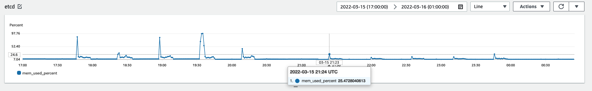
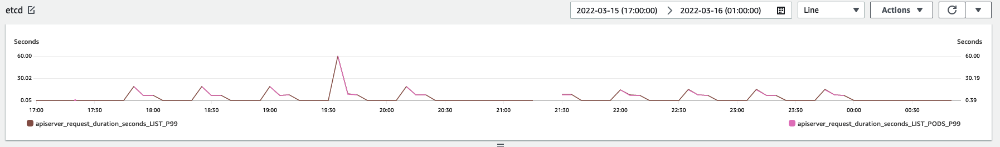

# KEP-3158: Optional maximum etcd page size on every list requests

<!-- toc -->
- [Release Signoff Checklist](#release-signoff-checklist)
- [Summary](#summary)
- [Motivation](#motivation)
  - [Goals](#goals)
  - [Non-Goals](#non-goals)
- [Proposal](#proposal)
  - [Desired outcome](#desired-outcome)
  - [How do we measure success](#how-do-we-measure-success)
  - [User Stories (Optional)](#user-stories-optional)
    - [Story 1](#story-1)
    - [Story 2](#story-2)
  - [Notes/Constraints/Caveats (Optional)](#notesconstraintscaveats-optional)
  - [Risks and Mitigations](#risks-and-mitigations)
- [Design Details](#design-details)
  - [Setting appropriate maximum limit](#setting-appropriate-maximum-limit)
  - [e2e testing](#e2e-testing)
    - [workload I (2k pods)](#workload-i-2k-pods)
    - [workload II (10k pods)](#workload-ii-10k-pods)
    - [workload III (100k pods)](#workload-iii-100k-pods)
  - [Test Plan](#test-plan)
  - [Graduation Criteria](#graduation-criteria)
    - [Alpha](#alpha)
  - [Upgrade / Downgrade Strategy](#upgrade--downgrade-strategy)
  - [Version Skew Strategy](#version-skew-strategy)
- [Production Readiness Review Questionnaire](#production-readiness-review-questionnaire)
  - [Feature Enablement and Rollback](#feature-enablement-and-rollback)
  - [Rollout, Upgrade and Rollback Planning](#rollout-upgrade-and-rollback-planning)
  - [Monitoring Requirements](#monitoring-requirements)
  - [Dependencies](#dependencies)
  - [Scalability](#scalability)
  - [Troubleshooting](#troubleshooting)
- [Implementation History](#implementation-history)
- [Drawbacks](#drawbacks)
- [Alternatives](#alternatives)
- [Infrastructure Needed (Optional)](#infrastructure-needed-optional)
<!-- /toc -->

## Release Signoff Checklist

<!--
**ACTION REQUIRED:** In order to merge code into a release, there must be an
issue in [kubernetes/enhancements] referencing this KEP and targeting a release
milestone **before the [Enhancement Freeze](https://git.k8s.io/sig-release/releases)
of the targeted release**.

For enhancements that make changes to code or processes/procedures in core
Kubernetes—i.e., [kubernetes/kubernetes], we require the following Release
Signoff checklist to be completed.

Check these off as they are completed for the Release Team to track. These
checklist items _must_ be updated for the enhancement to be released.
-->

Items marked with (R) are required *prior to targeting to a milestone / release*.

- [ ] (R) Enhancement issue in release milestone, which links to KEP dir in [kubernetes/enhancements] (not the initial KEP PR)
- [ ] (R) KEP approvers have approved the KEP status as `implementable`
- [ ] (R) Design details are appropriately documented
- [ ] (R) Test plan is in place, giving consideration to SIG Architecture and SIG Testing input (including test refactors)
  - [ ] e2e Tests for all Beta API Operations (endpoints)
  - [ ] (R) Ensure GA e2e tests for meet requirements for [Conformance Tests](https://github.com/kubernetes/community/blob/master/contributors/devel/sig-architecture/conformance-tests.md) 
  - [ ] (R) Minimum Two Week Window for GA e2e tests to prove flake free
- [ ] (R) Graduation criteria is in place
  - [ ] (R) [all GA Endpoints](https://github.com/kubernetes/community/pull/1806) must be hit by [Conformance Tests](https://github.com/kubernetes/community/blob/master/contributors/devel/sig-architecture/conformance-tests.md) 
- [ ] (R) Production readiness review completed
- [ ] (R) Production readiness review approved
- [ ] "Implementation History" section is up-to-date for milestone
- [ ] User-facing documentation has been created in [kubernetes/website], for publication to [kubernetes.io]
- [ ] Supporting documentation—e.g., additional design documents, links to mailing list discussions/SIG meetings, relevant PRs/issues, release notes

<!--
**Note:** This checklist is iterative and should be reviewed and updated every time this enhancement is being considered for a milestone.
-->

[kubernetes.io]: https://kubernetes.io/
[kubernetes/enhancements]: https://git.k8s.io/enhancements
[kubernetes/kubernetes]: https://git.k8s.io/kubernetes
[kubernetes/website]: https://git.k8s.io/website

## Summary

<!--
This section is incredibly important for producing high-quality, user-focused
documentation such as release notes or a development roadmap. It should be
possible to collect this information before implementation begins, in order to
avoid requiring implementors to split their attention between writing release
notes and implementing the feature itself. KEP editors and SIG Docs
should help to ensure that the tone and content of the `Summary` section is
useful for a wide audience.

A good summary is probably at least a paragraph in length.

Both in this section and below, follow the guidelines of the [documentation
style guide]. In particular, wrap lines to a reasonable length, to make it
easier for reviewers to cite specific portions, and to minimize diff churn on
updates.

[documentation style guide]: https://github.com/kubernetes/community/blob/master/contributors/guide/style-guide.md
-->
Performing API queries that return all of the objects of a given resource type (GET /api/v1/pods, GET /api/v1/secrets) without pagination can lead to significant variations in peak memory use on etcd. 

This proposal covers an approach where the kube-apiserver makes multiple paginated list calls to etcd instead of a single large unpaginated call to reduce the peak memory usage of etcd, thereby reducing its chances of Out-of-memory crashes. In setups where etcd is colocated with kube-apiserver on the same instance, it can buy more memory for kube-apiserver.

## Motivation

<!--
This section is for explicitly listing the motivation, goals, and non-goals of
this KEP.  Describe why the change is important and the benefits to users. The
motivation section can optionally provide links to [experience reports] to
demonstrate the interest in a KEP within the wider Kubernetes community.

[experience reports]: https://github.com/golang/go/wiki/ExperienceReports
-->

Protect etcd from out of memory crashing and prevent its cascading unpredictable failures. kube-apiserver and other downstream components recovering like re-creating gRPC connections to etcd, rebuilding all caches and resuming internal reconciler can be expensive. Lower etcd RAM consumption at peak time to allow autoscaler to increase their memory budget in time.

In Kubernetes, etcd only has a single client: kube-apiserver. It is feasible to control how requests are sent from kube-apiserver to etcd.

[APIListChunking](https://kubernetes.io/docs/reference/using-api/api-concepts/#retrieving-large-results-sets-in-chunks) should be in effect in most kube-apiserver set up, `client-go/tools/pager` and `client-go/informers` are good libraries to use and they follows the pagination rule of thumb to reduce server load.

However, there are still some native clients calling server without any limit to get a full list of resource. In addition, etcd buffers those request responses entirely in memory before sending the full set. It does not [stream the result](https://github.com/etcd-io/etcd/pull/12343#issuecomment-784008186) gracefully. This will create a lot of memory pressure on etcd.


### Goals

<!--
List the specific goals of the KEP. What is it trying to achieve? How will we
know that this has succeeded?
-->

- Reduce etcd memory consumption when kube clients list a large number of resources

### Non-Goals

<!--
What is out of scope for this KEP? Listing non-goals helps to focus discussion
and make progress.
-->

- Reduce kube-apiserver memory usage for unpaginated list calls
- Implement etcd server side streaming serves kube-apiserver List
- Implement etcd QoS
- Reduce list call load on etcd using priority & fairness settings on the kube-apiserver

## Proposal

<!--
This is where we get down to the specifics of what the proposal actually is.
This should have enough detail that reviewers can understand exactly what
you're proposing, but should not include things like API designs or
implementation. What is the desired outcome and how do we measure success?.
The "Design Details" section below is for the real
nitty-gritty.
-->

### Desired outcome
By default, this proposal is a no-op. 
If the relevant feature gate is enabled and the `max-list-etcd-limit` command line argument to kube-apiserver is set to `x`, where `x` >= 500, then:
- kube-apiserver splits requests to etcd into multiple pages. The max etcd page size is `x`. If user provided the limit `y` is smaller or equal to `x`, those requests are intact.
- The returned response is identical to the one without split. 

### How do we measure success
If the relevant feature gate is enabled and `max-list-etcd-limit` flag on kube-apiserver is set to `x` where `x` >= 500

- The number of etcd OOM-killed incidents is reduced. 
- etcd memory consumption is less than before. 
- Only a small set of user list requests are split by kube-apiserver.
- For impacted user list requests, added latency about apiserver_list_from_storage_duration_p50/p90/p99 is within 5s
- apiserver_list_duration_p99 is within defined scalability SLO


### User Stories (Optional)

<!--
Detail the things that people will be able to do if this KEP is implemented.
Include as much detail as possible so that people can understand the "how" of
the system. The goal here is to make this feel real for users without getting
bogged down.
-->

#### Story 1
A user deployed an application as daemonset that queries pods belonging to the node it is running. It translates to range query etcd from `/registry/pods/` to `/registry/pods0` and each such query payload is close to 200MiB. 
```json
{
    "level": "warn",
    "ts": "2022-03-31T23:00:06.771Z",
    "caller": "etcdserver/util.go:163",
    "msg": "apply request took too long",
    "took": "111.479086ms",
    "expected-duration": "100ms",
    "prefix": "read-only range ",
    "request": "key:\"/registry/pods/\" range_end:\"/registry/pods0\" ",
    "response": "range_response_count:27893 size:191330794"
}
```

```
I0331 23:00:06.844303      10 trace.go:205] Trace[484169231]: "List etcd3" key:/pods,resourceVersion:,resourceVersionMatch:,limit:0,continue: (31-Mar-2022 23:00:04.575) (total time: 2268ms):
Trace[484169231]: [2.268397203s] [2.268397203s] END

I0331 23:00:06.848003      10 trace.go:205] Trace[638277422]: "List" url:/api/v1/namespaces//pods,user-agent:OpenAPI-Generator/12.0.1/python,client:10.13.20.49 (31-Mar-2022 23:00:04.575) (total time: 2272ms):
Trace[638277422]: ---"Listing from storage done" 2268ms (23:00:00.844)
Trace[638277422]: [2.272115626s] [2.272115626s] END
```
10x clients issued such queries lead to etcd OOM-killed and failed other kube-apiserver requests hitting to that node.

With the approach and `max-list-etcd-limit = 500`, user should expect 
- kube-apiserver is healthy and serving requests because etcd cluster is healthy
- List etcd duration increases from 2 seconds around 3 seconds and this duration is available as a prometheus metric exposed in "/metrics" endpoint. 
#### Story 2

### Notes/Constraints/Caveats (Optional) 

<!--
What are the caveats to the proposal?
What are some important details that didn't come across above?
Go in to as much detail as necessary here.
This might be a good place to talk about core concepts and how they relate.
-->

- Setting the maximum limit too low will increase the total round-trip time between kube-apiserver and etcd to breach the default 1 minute request time. This will cause kube-apiserver cancelles the requests prematurely. Example https://github.com/kubernetes/kubernetes/pull/94303.

- Recommend users to paginate list calls to kube-apiserver to avoid running into the above situation in the first place.

### Risks and Mitigations

<!--
What are the risks of this proposal, and how do we mitigate? Think broadly.
For example, consider both security and how this will impact the larger
Kubernetes ecosystem.

How will security be reviewed, and by whom?

How will UX be reviewed, and by whom?

Consider including folks who also work outside the SIG or subproject.
-->

## Design Details

<!--
This section should contain enough information that the specifics of your
change are understandable. This may include API specs (though not always
required) or even code snippets. If there's any ambiguity about HOW your
proposal will be implemented, this is the place to discuss them.
-->

The new default behavior will continue to be the same as before when the flag is unspecified, i.e no max page-size will be imposed on the list calls to etcd

Modify [apiserver/blob/master/pkg/storage/etcd3/store.go](https://github.com/kubernetes/apiserver/blob/master/pkg/storage/etcd3/store.go#L565-L576) list to apply a maximum limit to every etcd range request and issue multiple range requests if necessary to satisfy the original list. Filtering and decoding on each etcd response before issuing the next range request. Using the ResourceVersion that comes back from the first range request from etcd (or the one user provided) on later requests to ensure a consistent snapshot of resource collections. The implementation should unify with [current pagination implementation](https://github.com/kubernetes/kubernetes/blob/master/staging/src/k8s.io/apiserver/pkg/storage/etcd3/store.go#L686)

### Setting appropriate maximum limit

Setting the limit is highly relevant to the cluster setup like etcd memory budget, resource object size, number of concurrent requests, etc. Theoretically etcd memory budget should be propotional to a combination of (M * maximum limit * object size * number of concurrent list requests) if it's a list dominating workload. M is a magic factor to be calculated based on the memory built up when serving multiple range pages and etcd Golang GC releasing memory to OS. The k8s control plane auto scaler should increase the maximum limit as the memory budget grows to reduce the etcd <-> kube-apiserver round trip time.

However, this may be over complicated and it would be good to verify a heuristic value like `500`. 

### e2e testing
The test was performed on a patched EKS 1.21 kube-apiserver. The changes are https://github.com/kubernetes/kubernetes/compare/v1.21.9...chaochn47:v1.21.9-test-apiserver-paging

Customized kube-apiserver command line arguments are
- `--default-maximum-list-etcd-limit` = `0`, `500`, `1000`
- `--request-timeout` = `5m` to measure kube-apiserver list latency on client side without context cancelled.

#### workload I (2k pods)
```
# 1.21 cluster
# 1 CPI with 96cpu, 384gb RAM
# 3 etcd with 2cpu, 8gb RAM

# workload
# 2032 pods, pod object size 44 kiB, each list pods payload is 86.6MiB 
# list concurrency 50
```
* max of etcd process mem_used_percent and mem_used_bytes
    * dropped from 97.76% to 26%, from 8gb to 2.08gb
    * 
    * left 5 waves is unlimited 5 times back to back testing, right 5 waves is setting --default-maximum-list-etcd-limit=500
* p99 of apiserver list duration
    * roughly the same
    * 


#### workload II (10k pods)
```
# 1.21 cluster
# 1 CPI with 96cpu, 384gb RAM
# 3 etcd with 2cpu, 8gb RAM

# workload
# 10k pods, total pod object size 11kiB, each list payload is 44kiB * 10k ~= 440MiB
# list concurrency 1
```

| 102k pods                                 | --default-maximum-list-etcd-limit=500 | --default-maximum-list-etcd-limit=1000 | --default-maximum-list-etcd-limit=0 |
|-------------------------------------------|---------------------------------------|----------------------------------------|-------------------------------------|
| etcd_mem_used_percent                     | 7.7%                                  | 9.2%                                   | 32.3%                               |
| etcd_mem_used_bytes                       | 0.91G                                 | 1.05G                                  | 2.82G                               |
| apiserver_list_etcd3_duration_avg         | 2.2s                                  | 2.1s                                   | 2.1s                                |
| apiserver_list_etcd3_duration_p90         | 2.4s                                  | 2.3s                                   | 2.3s                                |
| apiserver_list_etcd3_duration_p99         | 2.5s                                  | 2.4s                                   | 2.6s                                |
| apiserver_send_list_response_duration_avg | 27.4s                                 | 29.8s                                  | 28.4s                               |
| apiserver_send_list_response_duration_p90 | 29.2s                                 | 32.2s                                  | 29.8s                               |
| apiserver_send_list_response_duration_p99 | 29.9s                                 | 32.8s                                  | 31.3s                               |
| kube_client_list_duration_p50             | 36s                                   | 38s                                    | 37s                                 |
| kube_client_list_duration_p90             | 37s                                   | 40s                                    | 38s                                 |
| kube_client_list_duration_p99             | 38s                                   | 41s                                    | 38.5s                               |


#### workload III (100k pods)

```
# 1.21 cluster
# 1 CPI with 96cpu, 384gb RAM
# 3 etcd with 8cpu, 32gb RAM

# workload
# 102k pods, total pod object size 11kiB, each list payload is 11kiB * 102k ~= 1.2GiB
# list concurrency 1
```

| 102k pods                                 | --default-maximum-list-etcd-limit=500 | --default-maximum-list-etcd-limit=1000 | --default-maximum-list-etcd-limit=0 |
|-------------------------------------------|---------------------------------------|----------------------------------------|-------------------------------------|
| etcd_mem_used_percent                     | 2.2%                                  | 7.07%                                  | 26.1%                               |
| etcd_mem_used_bytes                       | 1.92GiB                               | 2.52GiB                                | 8.86GiB                             |
| apiserver_list_etcd3_duration_avg         | 12.3s                                 | 10.5s                                  | 7.5s                                |
| apiserver_list_etcd3_duration_p90         | 12.8s                                 | 10.9s                                  | 8.1s                                |
| apiserver_list_etcd3_duration_p99         | 13.5s                                 | 12.1s                                  | 8.5s                                |
| apiserver_send_list_response_duration_avg | 76.4s                                 | 71.8s                                  | 71.9s                               |
| apiserver_send_list_response_duration_p90 | 79.8s                                 | 76.2s                                  | 76.0s                               |
| apiserver_send_list_response_duration_p99 | 82.3s                                 | 78.1s                                  | 77.6s                               |
| kube_client_list_duration_p50             | 115s                                  | 109s                                   | 105s                                |
| kube_client_list_duration_p90             | 118s                                  | 112s                                   | 109s                                |
| kube_client_list_duration_p99             | 120s                                  | 114s                                   | 110s                                |


### Test Plan

<!--
**Note:** *Not required until targeted at a release.*

Consider the following in developing a test plan for this enhancement:
- Will there be e2e and integration tests, in addition to unit tests?
- How will it be tested in isolation vs with other components?

No need to outline all of the test cases, just the general strategy. Anything
that would count as tricky in the implementation, and anything particularly
challenging to test, should be called out.

All code is expected to have adequate tests (eventually with coverage
expectations). Please adhere to the [Kubernetes testing guidelines][testing-guidelines]
when drafting this test plan.

[testing-guidelines]: https://git.k8s.io/community/contributors/devel/sig-testing/testing.md
-->

<!-- https://github.com/awslabs/kubernetes-iteration-toolkit will be used as CI to verify the performance improvements with less compute resources.

It provides the following benefits.
* run in parallel: create multiple k8s control planes to test the changes with different impacting factors
* run continuously
* run with vanilla kube-apiserver container image -->

### Graduation Criteria

<!--
**Note:** *Not required until targeted at a release.*

Define graduation milestones.

These may be defined in terms of API maturity, [feature gate] graduations, or as
something else. The KEP should keep this high-level with a focus on what
signals will be looked at to determine graduation.

Consider the following in developing the graduation criteria for this enhancement:
- [Maturity levels (`alpha`, `beta`, `stable`)][maturity-levels]
- [Feature gate][feature gate] lifecycle
- [Deprecation policy][deprecation-policy]

Clearly define what graduation means by either linking to the [API doc
definition](https://kubernetes.io/docs/concepts/overview/kubernetes-api/#api-versioning)
or by redefining what graduation means.

In general we try to use the same stages (alpha, beta, GA), regardless of how the
functionality is accessed.

[feature gate]: https://git.k8s.io/community/contributors/devel/sig-architecture/feature-gates.md
[maturity-levels]: https://git.k8s.io/community/contributors/devel/sig-architecture/api_changes.md#alpha-beta-and-stable-versions
[deprecation-policy]: https://kubernetes.io/docs/reference/using-api/deprecation-policy/

Below are some examples to consider, in addition to the aforementioned [maturity levels][maturity-levels].

#### Alpha

- Feature implemented behind a feature flag
- Initial e2e tests completed and enabled

#### Beta

- Gather feedback from developers and surveys
- Complete features A, B, C
- Additional tests are in Testgrid and linked in KEP

#### GA

- N examples of real-world usage
- N installs
- More rigorous forms of testing—e.g., downgrade tests and scalability tests
- Allowing time for feedback

**Note:** Generally we also wait at least two releases between beta and
GA/stable, because there's no opportunity for user feedback, or even bug reports,
in back-to-back releases.

**For non-optional features moving to GA, the graduation criteria must include
[conformance tests].**

[conformance tests]: https://git.k8s.io/community/contributors/devel/sig-architecture/conformance-tests.md

#### Deprecation

- Announce deprecation and support policy of the existing flag
- Two versions passed since introducing the functionality that deprecates the flag (to address version skew)
- Address feedback on usage/changed behavior, provided on GitHub issues
- Deprecate the flag
-->

#### Alpha

- Feature implemented behind a feature flag
- Initial e2e tests completed and enabled

### Upgrade / Downgrade Strategy

<!--
If applicable, how will the component be upgraded and downgraded? Make sure
this is in the test plan.

Consider the following in developing an upgrade/downgrade strategy for this
enhancement:
- What changes (in invocations, configurations, API use, etc.) is an existing
  cluster required to make on upgrade, in order to maintain previous behavior?
- What changes (in invocations, configurations, API use, etc.) is an existing
  cluster required to make on upgrade, in order to make use of the enhancement?
-->

### Version Skew Strategy

<!--
If applicable, how will the component handle version skew with other
components? What are the guarantees? Make sure this is in the test plan.

Consider the following in developing a version skew strategy for this
enhancement:
- Does this enhancement involve coordinating behavior in the control plane and
  in the kubelet? How does an n-2 kubelet without this feature available behave
  when this feature is used?
- Will any other components on the node change? For example, changes to CSI,
  CRI or CNI may require updating that component before the kubelet.
-->

## Production Readiness Review Questionnaire

<!--

Production readiness reviews are intended to ensure that features merging into
Kubernetes are observable, scalable and supportable; can be safely operated in
production environments, and can be disabled or rolled back in the event they
cause increased failures in production. See more in the PRR KEP at
https://git.k8s.io/enhancements/keps/sig-architecture/1194-prod-readiness.

The production readiness review questionnaire must be completed and approved
for the KEP to move to `implementable` status and be included in the release.

In some cases, the questions below should also have answers in `kep.yaml`. This
is to enable automation to verify the presence of the review, and to reduce review
burden and latency.

The KEP must have a approver from the
[`prod-readiness-approvers`](http://git.k8s.io/enhancements/OWNERS_ALIASES)
team. Please reach out on the
[#prod-readiness](https://kubernetes.slack.com/archives/CPNHUMN74) channel if
you need any help or guidance.
-->

### Feature Enablement and Rollback

<!--
This section must be completed when targeting alpha to a release.
-->

###### How can this feature be enabled / disabled in a live cluster?

<!--
Pick one of these and delete the rest.

Documentation is available on [feature gate lifecycle] and expectations, as
well as the [existing list] of feature gates.

[feature gate lifecycle]: https://git.k8s.io/community/contributors/devel/sig-architecture/feature-gates.md
[existing list]: https://kubernetes.io/docs/reference/command-line-tools-reference/feature-gates/
-->

- [ ] Feature gate (also fill in values in `kep.yaml`)
  - Feature gate name: `MaximumListLimitOnEtcd`
  - Components depending on the feature gate: `kube-apiserver`
- [ ] Other
  - Describe the mechanism:
  - Will enabling / disabling the feature require downtime of the control
    plane?
    Yes, this requires restart of the apiserver instance. However, there shouldn't be a downtime in HA setups where there are at least one replica kept active at any given time during the update.
  - Will enabling / disabling the feature require downtime or reprovisioning
    of a node? (Do not assume `Dynamic Kubelet Config` feature is enabled).

###### Does enabling the feature change any default behavior?

<!--
Any change of default behavior may be surprising to users or break existing
automations, so be extremely careful here.
-->

###### Can the feature be disabled once it has been enabled (i.e. can we roll back the enablement)?

<!--
Describe the consequences on existing workloads (e.g., if this is a runtime
feature, can it break the existing applications?).

Feature gates are typically disabled by setting the flag to `false` and
restarting the component. No other changes should be necessary to disable the
feature.

NOTE: Also set `disable-supported` to `true` or `false` in `kep.yaml`.
-->

###### What happens if we reenable the feature if it was previously rolled back?

###### Are there any tests for feature enablement/disablement?

<!--
The e2e framework does not currently support enabling or disabling feature
gates. However, unit tests in each component dealing with managing data, created
with and without the feature, are necessary. At the very least, think about
conversion tests if API types are being modified.

Additionally, for features that are introducing a new API field, unit tests that
are exercising the `switch` of feature gate itself (what happens if I disable a
feature gate after having objects written with the new field) are also critical.
You can take a look at one potential example of such test in:
https://github.com/kubernetes/kubernetes/pull/97058/files#diff-7826f7adbc1996a05ab52e3f5f02429e94b68ce6bce0dc534d1be636154fded3R246-R282
-->

### Rollout, Upgrade and Rollback Planning

<!--
This section must be completed when targeting beta to a release.
-->

###### How can a rollout or rollback fail? Can it impact already running workloads?

<!--
Try to be as paranoid as possible - e.g., what if some components will restart
mid-rollout?

Be sure to consider highly-available clusters, where, for example,
feature flags will be enabled on some API servers and not others during the
rollout. Similarly, consider large clusters and how enablement/disablement
will rollout across nodes.
-->

###### What specific metrics should inform a rollback?

<!--
What signals should users be paying attention to when the feature is young
that might indicate a serious problem?
-->

###### Were upgrade and rollback tested? Was the upgrade->downgrade->upgrade path tested?

<!--
Describe manual testing that was done and the outcomes.
Longer term, we may want to require automated upgrade/rollback tests, but we
are missing a bunch of machinery and tooling and can't do that now.
-->

###### Is the rollout accompanied by any deprecations and/or removals of features, APIs, fields of API types, flags, etc.?

<!--
Even if applying deprecation policies, they may still surprise some users.
-->

### Monitoring Requirements

<!--
This section must be completed when targeting beta to a release.
-->

###### How can an operator determine if the feature is in use by workloads?

<!--
Ideally, this should be a metric. Operations against the Kubernetes API (e.g.,
checking if there are objects with field X set) may be a last resort. Avoid
logs or events for this purpose.
-->

###### How can someone using this feature know that it is working for their instance?

<!--
For instance, if this is a pod-related feature, it should be possible to determine if the feature is functioning properly
for each individual pod.
Pick one more of these and delete the rest.
Please describe all items visible to end users below with sufficient detail so that they can verify correct enablement
and operation of this feature.
Recall that end users cannot usually observe component logs or access metrics.
-->

- [ ] Events
  - Event Reason: 
- [ ] API .status
  - Condition name: 
  - Other field: 
- [ ] Other (treat as last resort)
  - Details:

###### What are the reasonable SLOs (Service Level Objectives) for the enhancement?

<!--
This is your opportunity to define what "normal" quality of service looks like
for a feature.

It's impossible to provide comprehensive guidance, but at the very
high level (needs more precise definitions) those may be things like:
  - per-day percentage of API calls finishing with 5XX errors <= 1%
  - 99% percentile over day of absolute value from (job creation time minus expected
    job creation time) for cron job <= 10%
  - 99.9% of /health requests per day finish with 200 code

These goals will help you determine what you need to measure (SLIs) in the next
question.
-->

###### What are the SLIs (Service Level Indicators) an operator can use to determine the health of the service?

<!--
Pick one more of these and delete the rest.
-->

- [ ] Metrics
  - Metric name:
  - [Optional] Aggregation method:
  - Components exposing the metric:
- [ ] Other (treat as last resort)
  - Details:

###### Are there any missing metrics that would be useful to have to improve observability of this feature?

<!--
Describe the metrics themselves and the reasons why they weren't added (e.g., cost,
implementation difficulties, etc.).
-->

### Dependencies

<!--
This section must be completed when targeting beta to a release.
-->

###### Does this feature depend on any specific services running in the cluster?

<!--
Think about both cluster-level services (e.g. metrics-server) as well
as node-level agents (e.g. specific version of CRI). Focus on external or
optional services that are needed. For example, if this feature depends on
a cloud provider API, or upon an external software-defined storage or network
control plane.

For each of these, fill in the following—thinking about running existing user workloads
and creating new ones, as well as about cluster-level services (e.g. DNS):
  - [Dependency name]
    - Usage description:
      - Impact of its outage on the feature:
      - Impact of its degraded performance or high-error rates on the feature:
-->

### Scalability

<!--
For alpha, this section is encouraged: reviewers should consider these questions
and attempt to answer them.

For beta, this section is required: reviewers must answer these questions.

For GA, this section is required: approvers should be able to confirm the
previous answers based on experience in the field.
-->

###### Will enabling / using this feature result in any new API calls?

<!--
Describe them, providing:
  - API call type (e.g. PATCH pods)
  - estimated throughput
  - originating component(s) (e.g. Kubelet, Feature-X-controller)
Focusing mostly on:
  - components listing and/or watching resources they didn't before
  - API calls that may be triggered by changes of some Kubernetes resources
    (e.g. update of object X triggers new updates of object Y)
  - periodic API calls to reconcile state (e.g. periodic fetching state,
    heartbeats, leader election, etc.)
-->

###### Will enabling / using this feature result in introducing new API types?

<!--
Describe them, providing:
  - API type
  - Supported number of objects per cluster
  - Supported number of objects per namespace (for namespace-scoped objects)
-->

###### Will enabling / using this feature result in any new calls to the cloud provider?

<!--
Describe them, providing:
  - Which API(s):
  - Estimated increase:
-->

###### Will enabling / using this feature result in increasing size or count of the existing API objects?

<!--
Describe them, providing:
  - API type(s):
  - Estimated increase in size: (e.g., new annotation of size 32B)
  - Estimated amount of new objects: (e.g., new Object X for every existing Pod)
-->

###### Will enabling / using this feature result in increasing time taken by any operations covered by existing SLIs/SLOs?

<!--
Look at the [existing SLIs/SLOs].

Think about adding additional work or introducing new steps in between
(e.g. need to do X to start a container), etc. Please describe the details.

[existing SLIs/SLOs]: https://git.k8s.io/community/sig-scalability/slos/slos.md#kubernetes-slisslos
-->

###### Will enabling / using this feature result in non-negligible increase of resource usage (CPU, RAM, disk, IO, ...) in any components?

<!--
Things to keep in mind include: additional in-memory state, additional
non-trivial computations, excessive access to disks (including increased log
volume), significant amount of data sent and/or received over network, etc.
This through this both in small and large cases, again with respect to the
[supported limits].

[supported limits]: https://git.k8s.io/community//sig-scalability/configs-and-limits/thresholds.md
-->

### Troubleshooting

<!--
This section must be completed when targeting beta to a release.

The Troubleshooting section currently serves the `Playbook` role. We may consider
splitting it into a dedicated `Playbook` document (potentially with some monitoring
details). For now, we leave it here.
-->

###### How does this feature react if the API server and/or etcd is unavailable?

###### What are other known failure modes?

<!--
For each of them, fill in the following information by copying the below template:
  - [Failure mode brief description]
    - Detection: How can it be detected via metrics? Stated another way:
      how can an operator troubleshoot without logging into a master or worker node?
    - Mitigations: What can be done to stop the bleeding, especially for already
      running user workloads?
    - Diagnostics: What are the useful log messages and their required logging
      levels that could help debug the issue?
      Not required until feature graduated to beta.
    - Testing: Are there any tests for failure mode? If not, describe why.
-->

###### What steps should be taken if SLOs are not being met to determine the problem?

## Implementation History

<!--
Major milestones in the lifecycle of a KEP should be tracked in this section.
Major milestones might include:
- the `Summary` and `Motivation` sections being merged, signaling SIG acceptance
- the `Proposal` section being merged, signaling agreement on a proposed design
- the date implementation started
- the first Kubernetes release where an initial version of the KEP was available
- the version of Kubernetes where the KEP graduated to general availability
- when the KEP was retired or superseded
-->

## Drawbacks

<!--
Why should this KEP _not_ be implemented?
-->

## Alternatives

<!--
What other approaches did you consider, and why did you rule them out? These do
not need to be as detailed as the proposal, but should include enough
information to express the idea and why it was not acceptable.
-->

## Infrastructure Needed (Optional)

<!--
Use this section if you need things from the project/SIG. Examples include a
new subproject, repos requested, or GitHub details. Listing these here allows a
SIG to get the process for these resources started right away.
-->
