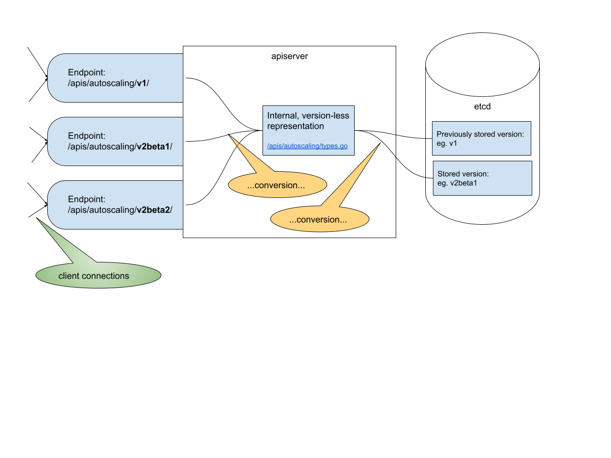

<!--
**Note:** When your KEP is complete, all of these comment blocks should be removed.

To get started with this template:

- [x] **Pick a hosting SIG.**
  Make sure that the problem space is something the SIG is interested in taking
  up. KEPs should not be checked in without a sponsoring SIG.
- [x] **Create an issue in kubernetes/enhancements**
  When filing an enhancement tracking issue, please make sure to complete all
  fields in that template. One of the fields asks for a link to the KEP. You
  can leave that blank until this KEP is filed, and then go back to the
  enhancement and add the link.
- [x] **Make a copy of this template directory.**
  Copy this template into the owning SIG's directory and name it
  `NNNN-short-descriptive-title`, where `NNNN` is the issue number (with no
  leading-zero padding) assigned to your enhancement above.
- [x] **Fill out as much of the kep.yaml file as you can.**
  At minimum, you should fill in the "Title", "Authors", "Owning-sig",
  "Status", and date-related fields.
- [ ] **Fill out this file as best you can.**
  At minimum, you should fill in the "Summary" and "Motivation" sections.
  These should be easy if you've preflighted the idea of the KEP with the
  appropriate SIG(s).
- [ ] **Create a PR for this KEP.**
  Assign it to people in the SIG who are sponsoring this process.
- [ ] **Merge early and iterate.**
  Avoid getting hung up on specific details and instead aim to get the goals of
  the KEP clarified and merged quickly. The best way to do this is to just
  start with the high-level sections and fill out details incrementally in
  subsequent PRs.

Just because a KEP is merged does not mean it is complete or approved. Any KEP
marked as `provisional` is a working document and subject to change. You can
denote sections that are under active debate as follows:

```
<<[UNRESOLVED optional short context or usernames ]>>
Stuff that is being argued.
<<[/UNRESOLVED]>>
```

When editing KEPS, aim for tightly-scoped, single-topic PRs to keep discussions
focused. If you disagree with what is already in a document, open a new PR
with suggested changes.

One KEP corresponds to one "feature" or "enhancement" for its whole lifecycle.
You do not need a new KEP to move from beta to GA, for example. If
new details emerge that belong in the KEP, edit the KEP. Once a feature has become
"implemented", major changes should get new KEPs.

The canonical place for the latest set of instructions (and the likely source
of this file) is [here](/keps/NNNN-kep-template/README.md).

**Note:** Any PRs to move a KEP to `implementable`, or significant changes once
it is marked `implementable`, must be approved by each of the KEP approvers.
If none of those approvers are still appropriate, then changes to that list
should be approved by the remaining approvers and/or the owning SIG (or
SIG Architecture for cross-cutting KEPs).
-->
# KEP-3166: Migrating storage on apiserver startup

<!--
Ensure the TOC is wrapped with
  <code>&lt;!-- toc --&rt;&lt;!-- /toc --&rt;</code>
tags, and then generate with `hack/update-toc.sh`.
-->

<!-- toc -->
- [Release Signoff Checklist](#release-signoff-checklist)
- [Summary](#summary)
- [Background](#background)
  - [Kubernetes object versions](#kubernetes-object-versions)
  - [Internal representation](#internal-representation)
  - [Storage versions](#storage-versions)
  - [Removing old versions](#removing-old-versions)
  - [Storage version migrator (SVM)](#storage-version-migrator-svm)
    - [SVM implementation](#svm-implementation)
    - [HA clusters](#ha-clusters)
    - [HA SVM implementation status](#ha-svm-implementation-status)
- [Motivation](#motivation)
  - [Goals](#goals)
  - [Non-Goals](#non-goals)
- [Proposal](#proposal)
  - [Observations](#observations)
  - [High-level overview](#high-level-overview)
  - [Notes/Constraints/Caveats](#notesconstraintscaveats)
  - [Risks and Mitigations](#risks-and-mitigations)
- [Detailed description](#detailed-description)
  - [Storage behaviors](#storage-behaviors)
  - [Update cycle](#update-cycle)
  - [Including storage behavior in deprecation policy](#including-storage-behavior-in-deprecation-policy)
  - [Custom Resource Definitions](#custom-resource-definitions)
  - [FAQ](#faq)
    - [Why should deprecated versions go through one release as &quot;supported&quot; instead of moving directly to &quot;actively-migrated&quot;?](#why-should-deprecated-versions-go-through-one-release-as-supported-instead-of-moving-directly-to-actively-migrated)
    - [How does this compare to Storage Version Migrator?](#how-does-this-compare-to-storage-version-migrator)
- [Design Details](#design-details)
  - [Test Plan](#test-plan)
  - [Graduation Criteria](#graduation-criteria)
  - [Upgrade / Downgrade Strategy](#upgrade--downgrade-strategy)
  - [Version Skew Strategy](#version-skew-strategy)
- [Production Readiness Review Questionnaire](#production-readiness-review-questionnaire)
  - [Feature Enablement and Rollback](#feature-enablement-and-rollback)
  - [Rollout, Upgrade and Rollback Planning](#rollout-upgrade-and-rollback-planning)
  - [Monitoring Requirements](#monitoring-requirements)
  - [Dependencies](#dependencies)
  - [Scalability](#scalability)
  - [Troubleshooting](#troubleshooting)
- [Implementation History](#implementation-history)
- [Drawbacks](#drawbacks)
- [Alternatives](#alternatives)
- [Infrastructure Needed (Optional)](#infrastructure-needed-optional)
<!-- /toc -->

## Release Signoff Checklist

<!--
**ACTION REQUIRED:** In order to merge code into a release, there must be an
issue in [kubernetes/enhancements] referencing this KEP and targeting a release
milestone **before the [Enhancement Freeze](https://git.k8s.io/sig-release/releases)
of the targeted release**.

For enhancements that make changes to code or processes/procedures in core
Kubernetes—i.e., [kubernetes/kubernetes], we require the following Release
Signoff checklist to be completed.

Check these off as they are completed for the Release Team to track. These
checklist items _must_ be updated for the enhancement to be released.
-->

Items marked with (R) are required *prior to targeting to a milestone / release*.

- [ ] (R) Enhancement issue in release milestone, which links to KEP dir in [kubernetes/enhancements] (not the initial KEP PR)
- [ ] (R) KEP approvers have approved the KEP status as `implementable`
- [ ] (R) Design details are appropriately documented
- [ ] (R) Test plan is in place, giving consideration to SIG Architecture and SIG Testing input (including test refactors)
  - [ ] e2e Tests for all Beta API Operations (endpoints)
  - [ ] (R) Ensure GA e2e tests for meet requirements for [Conformance Tests](https://github.com/kubernetes/community/blob/master/contributors/devel/sig-architecture/conformance-tests.md) 
  - [ ] (R) Minimum Two Week Window for GA e2e tests to prove flake free
- [ ] (R) Graduation criteria is in place
  - [ ] (R) [all GA Endpoints](https://github.com/kubernetes/community/pull/1806) must be hit by [Conformance Tests](https://github.com/kubernetes/community/blob/master/contributors/devel/sig-architecture/conformance-tests.md) 
- [ ] (R) Production readiness review completed
- [ ] (R) Production readiness review approved
- [ ] "Implementation History" section is up-to-date for milestone
- [ ] User-facing documentation has been created in [kubernetes/website], for publication to [kubernetes.io]
- [ ] Supporting documentation—e.g., additional design documents, links to mailing list discussions/SIG meetings, relevant PRs/issues, release notes

<!--
**Note:** This checklist is iterative and should be reviewed and updated every time this enhancement is being considered for a milestone.
-->

[kubernetes.io]: https://kubernetes.io/
[kubernetes/enhancements]: https://git.k8s.io/enhancements
[kubernetes/kubernetes]: https://git.k8s.io/kubernetes
[kubernetes/website]: https://git.k8s.io/website

## Summary

This KEP introduces a new approach to migrating and deprecating storage
versions, by using a loop on apiserver startup. It is aimed at replacing the
previously started approach (KEP 2342, KEP 2343, KEP 2339). It does not require
a separate component nor self-coordination in order to deal with HA clusters.

## Background

### Kubernetes object versions

Type schemas in Kubernetes API are immutable. Introducing changes requires
creating a new version. For example, the table below shows how fields were added
and removed from the object HorizontalPodAutoscalerSpec over several versions.

| HorizontalPodAutoscalerSpec v1 | HorizontalPodAutoscalerSpec v2beta1 | HorizontalPodAutoscalerSpec v2beta2 |
|--|--|--|
| maxReplicas<br>minReplicas<br>scaleTargetRef<br>**targetCPUUtilizationPercentage** | maxReplicas<br>**metrics**<br>minReplicas<br>scaleTargetRef | behavior<br>**maxReplicas**<br>metrics<br>minReplicas<br>scaleTargetRef |

The code for these types can be found in the
[kubernetes/api](https://github.com/kubernetes/api) repository, in the
respective types.go files (example
[autoscaling/v1](https://github.com/kubernetes/kubernetes/blob/master/staging/src/k8s.io/api/autoscaling/v1/types.go)).

Kubernetes apiserver exposes an endpoint for either supported version, but they
act as windows to the same storage: the same object can be queried with
different-versioned endpoints (eg. with kubectl get
horizontalpodautoscalers.v2beta2.autoscaling my-hpa or kubectl get
horizontalpodautoscalers.v1.autoscaling my-hpa).

### Internal representation

In order to simplify internal processing, Kubernetes-internal code does **not**
use versioned types, but an internal "version-less" representation, which can be
two-way converted to any version. Continuing with the autoscaling example, the
internal representation lives in
[//apis/autoscaling/types.go](https://github.com/kubernetes/kubernetes/blob/8a259641532d12f730d0fc6b237d36206d405e52/pkg/apis/autoscaling/types.go),
while the converters live in
[//apis/autoscaling/[version]/conversion.go](https://github.com/kubernetes/kubernetes/blob/8a259641532d12f730d0fc6b237d36206d405e52/pkg/apis/autoscaling/v1/conversion.go).

The internal representation is never exposed externally. This allows for easy
changes, as long as the converters are up to date.

### Storage versions

Kubernetes objects are stored in etcd, which also requires an immutable schema.
The version with which an object was stored ("storage version") is one of the
available set of versions, but can be different from the one with which it is
queried (thanks to the converters described above).



### Removing old versions

Removing an **endpoint** serving an old version can (and does) happen over time.

Removing an old version **from the codebase** can only happen once no more
objects with that version are stored in etcd. It is very hard to guarantee this
for all Kubernetes installations out there. Because of this, a
[moratorium](https://kubernetes.io/docs/reference/using-api/deprecation-policy/#:~:text=Until%20%2352185%20is%20resolved)
was established for removing versions if they ever were written to etcd.

### Storage version migrator (SVM)

SVM was introduced as a solution that will allow raising the moratorium on
removing old storage versions.

#### SVM implementation

SVM (introduced in KEP
[2343](https://github.com/kubernetes/enhancements/tree/master/keps/sig-api-machinery/2343-automated-storage-version-migration-with-storage-version-hash))
runs as a component within the Kubernetes cluster. It tracks storage version
hash (KEP
[2342](https://github.com/kubernetes/enhancements/tree/master/keps/sig-api-machinery/2342-exposing-hashed-storage-versions-via-the-discovery-API))
for all types in the cluster, and when it detects a change, it triggers a
read-write cycle to all objects of that type. This way, each object gets
converted and saved in the current [preferred/storage
version](https://kubernetes.io/docs/reference/using-api/deprecation-policy/#:~:text=API%20Versions-,Preferred/Storage,-Version).

#### HA clusters

The SVM implementation as described in KEP 2343 explicitly mentioned supporting
HA clusters as [future
work](https://github.com/kubernetes/enhancements/tree/master/keps/sig-api-machinery/2343-automated-storage-version-migration-with-storage-version-hash#future-work-ha-clusters).
The solution for HA clusters was introduced in KEP
[2339](https://github.com/kubernetes/enhancements/tree/master/keps/sig-api-machinery/2339-storageversion-api-for-ha-api-servers).
Compared to single-master SVM, it represented a substantial increase in
complexity:

*   New persisted API is introduced, which lets apiserver model the set of types
    they support, along with their versions.
*   The apiservers get the new responsibility of maintaining this data,
    including fixing & garbage-collecting after apiserver failures.
*   The data from the new API is used as the trigger for the SVM (replacing the
    previous storageVersionHash approach).

More generally: it represents an implementation of a set of apiservers
self-coordinating, that is: describing their collective state as a whole,
without involvement of an external controller. [The message proposing the
concept](https://groups.google.com/g/kubernetes-sig-api-machinery/c/gTS-rUuEVQY/m/9bUFVnYvAwAJ)
is worth reading, as it lists other benefits of this approach and was met with
enthusiastic reception from core Kubernetes contributors. 

#### HA SVM implementation status

The implementation of KEP
[2339](https://github.com/kubernetes/enhancements/tree/master/keps/sig-api-machinery/2339-storageversion-api-for-ha-api-servers)
was taken up in PRs [96403](https://github.com/kubernetes/kubernetes/pull/96403)
and
[85](https://github.com/kubernetes-sigs/kube-storage-version-migrator/pull/85),
but those PRs stopped receiving updates and were marked as stale in mid 2021.

## Motivation

Ability to remove no-longer-used resource versions from storage is necessary to
complete the lifecycle of resource types in Kubernetes. 

### Goals

This KEP describes the necessary code changes and proposes the process for
removing old resource versions, while avoiding database corruption.

Those techniques are introduced for both built-in types and CRDs.

### Non-Goals

This solution could become much simpler if all built-in types were migrated to
CRDs. A migration like that is an explicit non-goal for this KEP.

## Proposal

### Observations

The problem of stale storage versions is mostly a tech-debt problem: supporting legacy storage versions is a burden on Kubernetes contributors. Despite the amount of code being relatively small, we should not allow for indefinite accumulation of code as we progress through versions.

Still: the pain on the users is very small. It makes it hard to justify complex solutions or to prioritize the actual work on fixing it.

At the same time, the policy-based solution ([moratorium](https://kubernetes.io/docs/reference/using-api/deprecation-policy/#:~:text=Until%20%2352185%20is%20resolved)) proved remarkably successful from the users' standpoint, with no user-reported problems happening since its introduction.

### High-level overview

We propose a combination of: 

*   Policy with a generous deprecation times
*   Best-effort updates and...
*   Safe fallbacks 

...to replace the self-coordination-based approach. In addition, we propose
bundling the migration logic directly into the apiserver (to ensure awareness of
the apiserver capabilities).

### Notes/Constraints/Caveats

The generic problem with ensuring that an apiserver update won't disrupt storage
data is that apiserver does not control its own updates - this is done either by
some control plane (for K8s providers) or manually.

Those two cases have different needs: provider's control plane needs visibility
into the storage state (so that control can be established at scale), while
manual installations should be extremely likely to "just work".

The scope of "just work" depends on what we consider "reasonable action" by a
person updating a cluster manually. If we allow for arbitrary version jumps over
the same storage, we would never be able to raise the moratorium.

That's why this KEP makes the following assumptions:

  * All Kubernetes version upgrades (on the same storage) can be done by **at
    most** 4 minor versions up.
  * All Kubernetes version downgrades (on the same storage) can be done by **at
    most** 1 version down.

This does not limit the users in any way (nothing does), but is already much
more permissive than other documented policies.

### Risks and Mitigations

A successful migration is extremely likely, but there will be non-zero number of
cases where "forgotten" versions will stay in storage. This KEP proposes
ignoring this data, which will allow parties controlling the cluster to extract
those entries using direct storage reads.

## Design Details

### Storage behaviors

In a single apiserver version, each resource type can have multiple supported
versions, but only one [preferred/storage
version](https://kubernetes.io/docs/reference/using-api/deprecation-policy/#:~:text=API%20Versions-,Preferred/Storage,-Version).
Let's call these two approaches "storage behaviors", named "supported" and
"preferred/storage". Each ResourceType/version combination can only have one
storage behavior.

In addition, we will introduce two new storage behaviors. The table below
summarizes the current and new storage behaviors.

NOTE: storage behavior does not describe whether a given version is exposed to
clients in an API endpoint. API endpoints can be deprecated and switched off for
older versions independently from these versions' storage behaviors.

| Storage behavior | Exists now? | Description |
|--|--|--|
| Preferred/storage version | Y | Version used when writing to etcd. |
| Supported version | Y | Possible to parse when reading from etcd, but not actively migrated (however, when a client makes an explicit PUT call, apiserver will use the preferred/storage version when updating the etcd entry). |
| Actively migrated version | N | Possible to parse when reading from etcd. Automatically migrated to preferred/storage version upon apiserver startup. |
| Explicitly ignored version | N | Only present in the codebase as a single string. In case when reading from etcd returns data with an explicitly ignored version, it will be treated as if it does not exist. That is: (a) it will not be returned by the List calls (b) will return "not found" error in the Get calls |

### Update cycle

Upon apiserver startup, a run-to-completion goroutine will get started (enabled
with a flag), which will read all apiserver types and write them back in case
their storage version has **Actively migrated** storage behavior.

To avoid overloading the apiserver or etcd, this process will be throttled (with
throttling rate also controlled with a flag).

In case of a failed conversion, the error would be logged to apiserver's logs,
and the object would stay in etcd unupdated.

### Including storage behavior in deprecation policy

The Kubernetes API [deprecation
policy](https://kubernetes.io/docs/reference/using-api/deprecation-policy/)
recommends the following minimum durations depending on the release stage of a
given version:

*   GA: 12 months or 3 releases (whichever is longer)
*   Beta: 9 months or 3 releases (whichever is longer)
*   Alpha: 0 releases

Using the storage behaviors defined above, and assuming that resources have been
persisted to storage, we recommend the following minimum durations for
progressing through storage behaviors:

*   GA or Beta: 1 release as "Supported" followed by 3 releases as "Actively
    migrated" before switching to "Explicitly ignored"
*   Alpha: possible to switch directly to "Explicitly ignored"

### Custom Resource Definitions

For CRDs, the problem of avoiding database corruption is much simpler, because
apiserver is in control of a resource type lifecycle. Apiserver should return
error for CRD updates that try to delete a version still present in storage.

Optionally, the mechanism introduced here can be also extended to provide
automatic migration for CRDs (despite their differing lifecycle) with the
following changes:
  * when apiserver notices an update in `CRDSpec.versions.storage`, it kicks off the rewrite loop that updates all instances of that CR. When completed, it updates `CRDStatus.storedVersions` field to reflect that the migration was successful (similar to the mechanism from [KEP 2855](https://github.com/kubernetes/enhancements/blob/53cfb5d1fd31390c67914b1ce4f1298e77b447cb/keps/sig-api-machinery/2855-automated-stored-versions/README.md)). It will rely on KRM's optimistic concurrency to ensure that no changes the the CR Definition object happened in the meantime.
  * upon apiserver startup, the loop will be kicked off for CRDs with discrepancy between the information in `CRDSpec.versions.storage` and in `CRDStatus.storedVersions`.
  * removal of `CRDSpec.versions` will be guarded based on the information in `CRDStatus.storedVersions`.

### FAQ

#### Why should deprecated versions go through one release as "supported" instead of moving directly to "actively-migrated"?

It will promote updating resource storage versions along with already-present
API client calls. It is better than the bulk migration on apiserver startup in
two ways:

*   It does not change the load of apiserver or storage (the write operations
    are happening anyway)
*   In case any errors happen, they will be visible to the clients (rather than
    accumulated in apiserver logs, where they could be missed)

It will also decrease the possibility of a fight between two apiservers in an HA
cluster in a rolling update scenario.

#### How does this compare to Storage Version Migrator?

The proposed solution differs to the previous one on the following ways:

1. No need for new API describing types supported by each apiserver (+ops, error
   handling, garbage collection).
2. The rewrite cycle is a part of the same binary as apiserver, hence: it has
   authoritative knowledge on the set of supported type versions.
3. No need for a separate component (monitoring, release cycle, rollout,
   resources, versioning, dependency/security updates).
4. Much harder for operators to accidentally "skip" the new component.
5. No additional RBAC configuration.

### Test Plan

Apart from unit-testing the rewrite loop specifically, an integration/functional
test will be needed to control how this behavior interacts with the apiserver
bootstrap process. Example cases include:
  * enabled / disabled watch caches
  * failures when reading speccific resource type from storage (the conversion
    should not short-circuit)

### Graduation Criteria

#### Alpha

- Feature implemented behind a feature flag
- Initial e2e tests completed and enabled

#### Beta

- Gather feedback from developers and surveys
- TBD...

#### GA

- (possibly) [conformance
  tests](https://git.k8s.io/community/contributors/devel/sig-architecture/conformance-tests.md)
- TBD...


#### Deprecation

- Announce deprecation and support policy of the existing flag
- Two versions passed since introducing the functionality that deprecates the
  flag (to address version skew)
- Address feedback on usage/changed behavior, provided on GitHub issues
- Deprecate the flag
- Re-establish the moratorium

## Production Readiness Review Questionnaire

### Feature Enablement and Rollback

###### How can this feature be enabled / disabled in a live cluster?

- [x] Feature gate (also fill in values in `kep.yaml`)
  - Feature gate name: MigrateStorageOnStartup
  - Components depending on the feature gate: apiserver

###### Does enabling the feature change any default behavior?

It triggers additional read/write load on apiserver startup.

###### Can the feature be disabled once it has been enabled (i.e. can we roll back the enablement)?

This feature causes changes only on apiserver startup. Restarting apiserver with
the feature gate disabled via flag will disable the feature.

###### What happens if we reenable the feature if it was previously rolled back?

###### Are there any tests for feature enablement/disablement?

TBD

### Rollout, Upgrade and Rollback Planning

Pending...

###### How can a rollout or rollback fail? Can it impact already running workloads?

The design includes consideration for partial update in HA clusters as well as
downgrade.

In a case of apiserver failing to start, or getting shut down before the
migration can conclude - the subsequent apiserver runs will not need to start
from the beginning.

###### What specific metrics should inform a rollback?

Crashes or excessive write failures (neither of which is specific to this
feature).

###### Were upgrade and rollback tested? Was the upgrade->downgrade->upgrade path tested?

TBD

###### Is the rollout accompanied by any deprecations and/or removals of features, APIs, fields of API types, flags, etc.?

Upon graduating to GA, the storage version hash field (introduced in KEP 2342)
will be marked as deprecated.

### Monitoring Requirements

The following metrics will be introduced:
  * count of objects successfully converted
  * count of objects where conversion failed
  * count of failed read/list calls (could reuse the current metrics for that)

###### How can an operator determine if the feature is in use by workloads?

This is a startup behavior, so consulting feature gates will be enough.

###### How can someone using this feature know that it is working for their instance?

- [ ] Events
- [ ] API .status
- [x] Other (treat as last resort)
  - Details: In case of detecting objects requiring an active migration,
    additional information will be logged to klog.

###### What are the reasonable SLOs (Service Level Objectives) for the enhancement?

For individual cluster - no failed conversions (not providing the error budget becuase upgrades are out of apiserver's control)
For fleet of clusters: low incidence of failed conversions, especially on repeated attempts.

###### What are the SLIs (Service Level Indicators) an operator can use to determine the health of the service?

TBD

- [] Metrics
  - Metric name:
  - [Optional] Aggregation method:
  - Components exposing the metric:
- [ ] Other (treat as last resort)
  - Details:

###### Are there any missing metrics that would be useful to have to improve observability of this feature?

TBD

### Dependencies

No code dependencies.

###### Does this feature depend on any specific services running in the cluster?

No.

### Scalability

TBD

###### Will enabling / using this feature result in any new API calls?

No.

###### Will enabling / using this feature result in introducing new API types?

No.

###### Will enabling / using this feature result in any new calls to the cloud provider?

No.

###### Will enabling / using this feature result in increasing size or count of the existing API objects?

No.

###### Will enabling / using this feature result in increasing time taken by any operations covered by existing SLIs/SLOs?

No.

###### Will enabling / using this feature result in non-negligible increase of resource usage (CPU, RAM, disk, IO, ...) in any components?

The increase will be negligible (up to equivalent to the current watch cache
population).

### Troubleshooting

The behavior of the rewrite loop will be logged to klog.

###### How does this feature react if the API server and/or etcd is unavailable?

The feature runs on apiserver startup. Failed reads or writes to etcd will
result in failed conversions, but will not crash the apiserver nor the migration
process (crashing for one type will not short-circuit converting other types).

###### What are other known failure modes?

If some stored objects avoid being successfully converted over 4 Kubernetes
releases, the result from the API point of view will be data loss. The data will
be recoverable by consulting storage directly.

###### What steps should be taken if SLOs are not being met to determine the problem?

## Implementation History

...

## Drawbacks

This approach attempts to effectively control apiservers upgrade lifecycle from
within the apiserver. This is not possible to guarantee in all cases, so it
resorts to defence-in-depth.

## Alternatives

The previous approach (KEPs 2342, 2343, 2339) was already reviewed and accepted,
and the implementation started before it stalled. It will cause more complexity
for the cluster operators, and will be less likely to work correctly for manual
("the hard way") installations.

Another alternative is to leave the moratorium active, and rely on the runtime
behavior once built-in types are migrated to CRDs, but this will be against this
KEPs motivation.