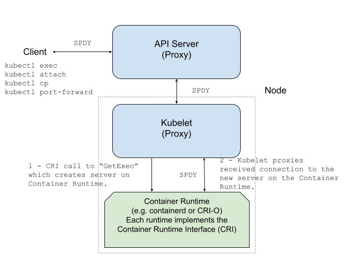
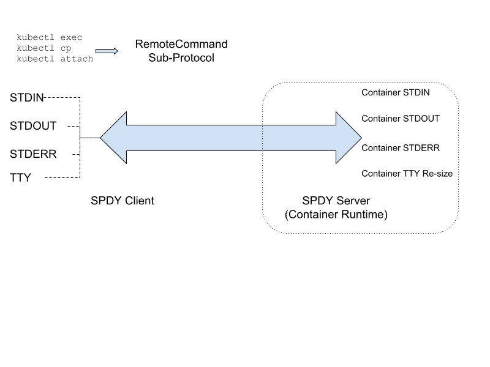
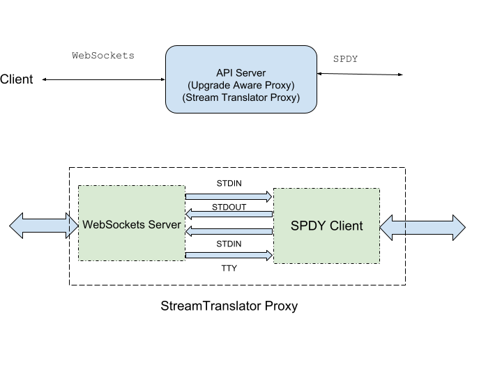

<!--
**Note:** When your KEP is complete, all of these comment blocks should be removed.

To get started with this template:

- [X] **Pick a hosting SIG.**
  Make sure that the problem space is something the SIG is interested in taking
  up. KEPs should not be checked in without a sponsoring SIG.
- [X] **Create an issue in kubernetes/enhancements**  (Issue #4006).
  When filing an enhancement tracking issue, please make sure to complete all
  fields in that template. One of the fields asks for a link to the KEP. You
  can leave that blank until this KEP is filed, and then go back to the
  enhancement and add the link.
- [X] **Make a copy of this template directory.**
  Copy this template into the owning SIG's directory and name it
  `NNNN-short-descriptive-title`, where `NNNN` is the issue number (with no
  leading-zero padding) assigned to your enhancement above.
- [X] **Fill out as much of the kep.yaml file as you can.**
  At minimum, you should fill in the "Title", "Authors", "Owning-sig",
  "Status", and date-related fields.
- [X] **Fill out this file as best you can.**
  At minimum, you should fill in the "Summary" and "Motivation" sections.
  These should be easy if you've preflighted the idea of the KEP with the
  appropriate SIG(s).
- [X] **Create a PR for this KEP.**
  Assign it to people in the SIG who are sponsoring this process.
- [X] **Merge early and iterate.**
  Avoid getting hung up on specific details and instead aim to get the goals of
  the KEP clarified and merged quickly. The best way to do this is to just
  start with the high-level sections and fill out details incrementally in
  subsequent PRs.

Just because a KEP is merged does not mean it is complete or approved. Any KEP
marked as `provisional` is a working document and subject to change. You can
denote sections that are under active debate as follows:

```
<<[UNRESOLVED optional short context or usernames ]>>
Stuff that is being argued.
<<[/UNRESOLVED]>>
```

When editing KEPS, aim for tightly-scoped, single-topic PRs to keep discussions
focused. If you disagree with what is already in a document, open a new PR
with suggested changes.

One KEP corresponds to one "feature" or "enhancement" for its whole lifecycle.
You do not need a new KEP to move from beta to GA, for example. If
new details emerge that belong in the KEP, edit the KEP. Once a feature has become
"implemented", major changes should get new KEPs.

The canonical place for the latest set of instructions (and the likely source
of this file) is [here](/keps/NNNN-kep-template/README.md).

**Note:** Any PRs to move a KEP to `implementable`, or significant changes once
it is marked `implementable`, must be approved by each of the KEP approvers.
If none of those approvers are still appropriate, then changes to that list
should be approved by the remaining approvers and/or the owning SIG (or
SIG Architecture for cross-cutting KEPs).
-->
# KEP-4006: Transition from SPDY to WebSockets

<!--
This is the title of your KEP. Keep it short, simple, and descriptive. A good
title can help communicate what the KEP is and should be considered as part of
any review.
-->

<!--
A table of contents is helpful for quickly jumping to sections of a KEP and for
highlighting any additional information provided beyond the standard KEP
template.

Ensure the TOC is wrapped with
  <code>&lt;!-- toc --&rt;&lt;!-- /toc --&rt;</code>
tags, and then generate with `hack/update-toc.sh`.
-->

<!-- toc -->
- [Release Signoff Checklist](#release-signoff-checklist)
- [Summary](#summary)
- [Motivation](#motivation)
  - [Goals](#goals)
  - [Non-Goals](#non-goals)
- [Proposal](#proposal)
  - [User Stories (Optional)](#user-stories-optional)
  - [Notes/Constraints/Caveats (Optional)](#notesconstraintscaveats-optional)
  - [Risks and Mitigations](#risks-and-mitigations)
- [Design Details](#design-details)
  - [Background: Streaming Protocol Basics](#background-streaming-protocol-basics)
  - [Background: <code>RemoteCommand</code> Subprotocol](#background-remotecommand-subprotocol)
  - [Background: API Server and Kubelet <code>UpgradeAwareProxy</code>](#background-api-server-and-kubelet-upgradeawareproxy)
  - [Proposal: <code>kubectl</code> WebSocket Executor and Fallback Executor](#proposal-kubectl-websocket-executor-and-fallback-executor)
  - [Proposal: New <code>RemoteCommand</code> Sub-Protocol Version - <code>v5.channel.k8s.io</code>](#proposal-new-remotecommand-sub-protocol-version---v5channelk8sio)
  - [Proposal: API Server RemoteCommand <code>StreamTranslatorProxy</code>](#proposal-api-server-remotecommand-streamtranslatorproxy)
  - [Background: <code>PortForward</code> Subprotocol](#background-portforward-subprotocol)
  - [Proposal: New <code>PortForward</code> Tunneling Subprotocol Version - <code>v2.portforward.k8s.io</code>](#proposal-new-portforward-tunneling-subprotocol-version---v2portforwardk8sio)
  - [Proposal: API Server PortForward -- Stream Tunnel Proxy](#proposal-api-server-portforward----stream-tunnel-proxy)
  - [Proposal: Synthetic RBAC CREATE Authorization Check](#proposal-synthetic-rbac-create-authorization-check)
  - [Proposal: Transitioning the API Server-to-Kubelet Connection](#proposal-transitioning-the-api-server-to-kubelet-connection)
  - [Test Plan](#test-plan)
      - [Prerequisite testing updates](#prerequisite-testing-updates)
      - [Unit tests](#unit-tests)
      - [Integration tests](#integration-tests)
      - [e2e tests](#e2e-tests)
  - [Graduation Criteria](#graduation-criteria)
    - [Alpha](#alpha)
      - [v1.29 RemoteCommand Subprotocol (exec, cp, and attach)](#v129-remotecommand-subprotocol-exec-cp-and-attach)
      - [v1.30 PortForward Subprotocol (port-forward)](#v130-portforward-subprotocol-port-forward)
    - [Beta](#beta)
      - [v1.30 RemoteCommand Subprotocol (exec, cp, and attach)](#v130-remotecommand-subprotocol-exec-cp-and-attach)
      - [v1.31 PortForward Subprotocol (port-forward)](#v131-portforward-subprotocol-port-forward)
      - [v1.35 Synthetic RBAC CREATE Authorization Check](#v135-synthetic-rbac-create-authorization-check)
    - [GA](#ga)
  - [Upgrade / Downgrade Strategy](#upgrade--downgrade-strategy)
  - [Version Skew Strategy](#version-skew-strategy)
    - [RemoteCommand Subprotocol](#remotecommand-subprotocol)
    - [PortForward Subprotocol](#portforward-subprotocol)
    - [Version Skew within the Control Plane and Nodes](#version-skew-within-the-control-plane-and-nodes)
- [Production Readiness Review Questionnaire](#production-readiness-review-questionnaire)
  - [Feature Enablement and Rollback](#feature-enablement-and-rollback)
  - [Rollout, Upgrade and Rollback Planning](#rollout-upgrade-and-rollback-planning)
  - [Monitoring Requirements](#monitoring-requirements)
  - [Dependencies](#dependencies)
  - [Scalability](#scalability)
  - [Troubleshooting](#troubleshooting)
- [Implementation History](#implementation-history)
- [Drawbacks](#drawbacks)
- [Alternatives](#alternatives)
- [Infrastructure Needed (Optional)](#infrastructure-needed-optional)
<!-- /toc -->

## Release Signoff Checklist

<!--
**ACTION REQUIRED:** In order to merge code into a release, there must be an
issue in [kubernetes/enhancements] referencing this KEP and targeting a release
milestone **before the [Enhancement Freeze](https://git.k8s.io/sig-release/releases)
of the targeted release**.

For enhancements that make changes to code or processes/procedures in core
Kubernetes—i.e., [kubernetes/kubernetes], we require the following Release
Signoff checklist to be completed.

Check these off as they are completed for the Release Team to track. These
checklist items _must_ be updated for the enhancement to be released.
-->

Items marked with (R) are required *prior to targeting to a milestone / release*.

- [X] (R) Enhancement issue in release milestone, which links to KEP dir in [kubernetes/enhancements] (not the initial KEP PR)
- [X] (R) KEP approvers have approved the KEP status as `implementable`
- [X] (R) Design details are appropriately documented
- [X] (R) Test plan is in place, giving consideration to SIG Architecture and SIG Testing input (including test refactors)
  - [ ] e2e Tests for all Beta API Operations (endpoints)
  - [ ] (R) Ensure GA e2e tests meet requirements for [Conformance Tests](https://github.com/kubernetes/community/blob/master/contributors/devel/sig-architecture/conformance-tests.md) 
  - [ ] (R) Minimum Two Week Window for GA e2e tests to prove flake free
- [X] (R) Graduation criteria is in place
  - [ ] (R) [all GA Endpoints](https://github.com/kubernetes/community/pull/1806) must be hit by [Conformance Tests](https://github.com/kubernetes/community/blob/master/contributors/devel/sig-architecture/conformance-tests.md) 
- [X] (R) Production readiness review completed
- [X] (R) Production readiness review approved
- [X] "Implementation History" section is up-to-date for milestone
- [ ] User-facing documentation has been created in [kubernetes/website], for publication to [kubernetes.io]
- [ ] Supporting documentation—e.g., additional design documents, links to mailing list discussions/SIG meetings, relevant PRs/issues, release notes

<!--
**Note:** This checklist is iterative and should be reviewed and updated every time this enhancement is being considered for a milestone.
-->

[kubernetes.io]: https://kubernetes.io/
[kubernetes/enhancements]: https://git.k8s.io/enhancements
[kubernetes/kubernetes]: https://git.k8s.io/kubernetes
[kubernetes/website]: https://git.k8s.io/website

## Summary

<!--
This section is incredibly important for producing high-quality, user-focused
documentation such as release notes or a development roadmap. It should be
possible to collect this information before implementation begins, in order to
avoid requiring implementors to split their attention between writing release
notes and implementing the feature itself. KEP editors and SIG Docs
should help to ensure that the tone and content of the `Summary` section is
useful for a wide audience.

A good summary is probably at least a paragraph in length.

Both in this section and below, follow the guidelines of the [documentation
style guide]. In particular, wrap lines to a reasonable length, to make it
easier for reviewers to cite specific portions, and to minimize diff churn on
updates.

[documentation style guide]: https://github.com/kubernetes/community/blob/master/contributors/guide/style-guide.md
-->

Some Kubernetes clients need to communicate with the API Server using a bi-directional
streaming protocol, instead of the standard HTTP request/response mechanism. A streaming
protocol provides the ability to read and write arbitrary data messages between the
client and server, instead of providing a single response to a client request.
For example, the commands `kubectl exec`, `kubectl attach`, and `kubectl port-forward`
both benefit from a bi-directional streaming protocol (`kubectl cp` is build on top
of `kubectl exec` primitives so it utilizes streaming as well). Currently,
the bi-directional streaming solution for these `kubectl` commands is SPDY/3.1. For
the communication leg between `kubectl` and the API Server, this enhancement transitions
the bi-directional streaming protocol to WebSockets from SPDY/3.1.

## Motivation

<!--
This section is for explicitly listing the motivation, goals, and non-goals of
this KEP.  Describe why the change is important and the benefits to users. The
motivation section can optionally provide links to [experience reports] to
demonstrate the interest in a KEP within the wider Kubernetes community.

[experience reports]: https://github.com/golang/go/wiki/ExperienceReports
-->

The SPDY streaming protocol has been deprecated since 2015, and by now
many proxies, gateways, and load-balancers do not support SPDY. Our effort to modernize
the streaming protocol between Kubernetes clients and the API Server using WebSockets
is necessary to enable the aforementioned intermediaries. WebSockets is a currently
supported standardized protocol (https://www.rfc-editor.org/rfc/rfc6455) that guarantees
compatibility and interoperability with the different components and programming
languages. Finally, WebSockets is preferrable to HTTP/2.0 because the updated HTTP
standard does not support streaming well. The decision to forego HTTP/2.0 is discussed
at greater length in the [Alternatives Section](##Alternatives).

### Goals

<!--
List the specific goals of the KEP. What is it trying to achieve? How will we
know that this has succeeded?
-->

1. Transition the bi-directional streaming protocol from SPDY/3.1 to WebSockets for
`kubectl exec`, `kubectl attach`, `kubectl cp`, and `kubectl port-forward` for the
communication leg between `kubectl` and the API Server.

2. Extend the WebSockets communication leg from the API Server to Kubelet. After this
extension, WebSockets streaming will occur between `kubectl` and Kubelet (proxied
through the API Server).

### Non-Goals

<!--
What is out of scope for this KEP? Listing non-goals helps to focus discussion
and make progress.
-->

1. We will not make *any* changes to current WebSocket based browser/javascript clients.

2. We will not transition the streaming protocol for the communication leg on the
Node between the Kubelet and the container runtime. This leg will continue to stream
the SPDY protocol.

## Proposal

<!--
This is where we get down to the specifics of what the proposal actually is.
This should have enough detail that reviewers can understand exactly what
you're proposing, but should not include things like API designs or
implementation. What is the desired outcome and how do we measure success?.
The "Design Details" section below is for the real
nitty-gritty.
-->

Currently, the bi-directional streaming protocols (either SPDY or WebSockets) are 
initiated from clients, proxied by the API Server and Kubelet, and terminated at
the Container Runtime (e.g. containerd or CRI-O). This enhancement proposes to 1)
modify `kubectl` to request a WebSocket based streaming connection, and to 2) modify
the current API Server proxy to translate or tunnel the `kubectl` WebSockets data stream to
a SPDY upstream connection. In this way, the cluster components upstream from the
API Server will not initially need to be changed. We intend to extend the communication
path for WebSockets streaming from `kubectl` to Kubelet once the the initial leg
is proven to work (i.e. that it goes GA).

### User Stories (Optional)

<!--
Detail the things that people will be able to do if this KEP is implemented.
Include as much detail as possible so that people can understand the "how" of
the system. The goal here is to make this feel real for users without getting
bogged down.
-->

The functionality of this KEP will allow `kubectl` users to leverage L7 proxies and
gateways that support WebSockets but not SPDY. Usually, the setup for these intermediaries
is specific to a cloud provider or cluster operator. For example, to use the
`Anthos Connect Gateway` to communicate with (some) Google clusters, users must
run `gcloud` specific commands which update the `kubeconfig` file to point to the
gateway. Afterwards, users can run streaming commands such as `kubectl exec ...`,
and the commands will transparently use the now supported WebSockets protocol.

### Notes/Constraints/Caveats (Optional)

<!--
What are the caveats to the proposal?
What are some important details that didn't come across above?
Go in to as much detail as necessary here.
This might be a good place to talk about core concepts and how they relate.
-->

N/A

### Risks and Mitigations

<!--
What are the risks of this proposal, and how do we mitigate? Think broadly.
For example, consider both security and how this will impact the larger
Kubernetes ecosystem.

How will security be reviewed, and by whom?

How will UX be reviewed, and by whom?

Consider including folks who also work outside the SIG or subproject.
-->

- Risk: Security

A possible security vulnerability might occur when a potential upgraded connection
is redirected to other API endpoints.

  - Mitigation: Upgraded connections are disallowed from redirecting.

- Risk: Performance

When transitioning from the SPDY streaming protocol to WebSockets, there may be a
performance degradation. In order to implement the WebSocket streaming functionality
that SPDY already implements, it is necessary for additional headers to be prepended
to the WebSocket data package.

  - Mitigation: Performance testing to ensure the WebSockets implementation is not
    noticeably slower than the current SPDY streaming implementation.

## Design Details

<!--
This section should contain enough information that the specifics of your
change are understandable. This may include API specs (though not always
required) or even code snippets. If there's any ambiguity about HOW your
proposal will be implemented, this is the place to discuss them.
-->

**Current SPDY Streaming Architectural Diagram**



### Background: Streaming Protocol Basics

`kubectl` bi-directional streaming connections are created by upgrading an
initial HTTP/1.1 request. By adding two headers (`Connection: Upgrade`, `Upgrade: SPDY/3.1`),
the request can initiate the streaming upgrade. And when the response returns status
`101 Switching Protocols` signalling success, the connection can then be kept open
for subsequent streaming. An example of an upgraded HTTP Request/Response for `kubectl exec`
could look like:

**HTTP Request**
```
GET /api/v1/…/pods/nginx/exec?command=<CMD>... HTTP/1.1
Connection: Upgrade
Upgrade: SPDY/3.1
X-Stream-Protocol-Version: v4.channel.k8s.io
X-Stream-Protocol-Version: v3.channel.k8s.io
X-Stream-Protocol-Version: v2.channel.k8s.io
X-Stream-Protocol-Version: v1.channel.k8s.io
```

**HTTP Response**
```
HTTP/1.1 101 Switching Protocols
Connection: Upgrade
Upgrade: SPDY/3.1
X-Stream-Protocol-Version: v4.channel.k8s.io
```

If the upgrade is successful, one of the requested subprotocol versions is chosen
and returned in the response. In this instance, the chosen version of the subprotocol
is: `v4.channel.k8s.io`.

### Background: `RemoteCommand` Subprotocol



Once the connection is upgraded to a bi-directional streaming connection, the
client and server can exchange data messages. These messages are interpreted with
agreed upon standards which are called subprotocols. The three `kubectl` commands
(`exec`, `attach`, and `cp`) communicate using the `RemoteCommand` subprotocol. Basically,
this subprotocol provides command line functionality from the client to a running
container in the cluster. By multiplexing `stdin`, `stdout`, `stderr`, and `tty`
resizing over a streaming connection, this subprotocol supports clients executing
and interacting with commands executed on a container in the cluster. An example of
`kubectl exec` running the `date` command on an `nginx` pod/container is:

```
$ kubectl exec nginx -- date
Tue May 16 03:34:04 PM PDT 2023
```

The `RemoteCommand` Subprotocol has iterated through four different versions, where the
transmitted data has changed. The second version of the subprotocol (`v2.channel.k8s.io`)
included `stdin`, `stdout`, and `stderr`, and the third version (`v3.channel.k8s.io`)
added support for terminal resizing with the `tty` stream. The fourth and most
current version, `v4.channel.k8s.io` added a structured error stream, which includes
the process exit code from the container. All of these streams are multiplexed over
a single connnection by prepending a stream identififer byte to the data message.
For example, a `stdout` data message sent over the connection will have the `stdout`
file descriptor (1) prepended to the data message.

### Background: API Server and Kubelet `UpgradeAwareProxy`

In order to route the data streamed between the client and the container, both the
API Server and Kubelet must proxy these data messages. Both the API Server and the
Kubelet provide this functionality with the `UpgradeAwareProxy`, which is a reverse
proxy that knows how to deal with the connection upgrade handshake.

### Proposal: `kubectl` WebSocket Executor and Fallback Executor

This enhancement proposes adding a `WebSocketExecutor` to `kubectl`, implementing
the WebSocket client using a new subprotocol version (`v5.channel.k8s.io`).
Additionally, we propose creating a `FallbackExecutor` to address client/server version
skew. The `FallbackExecutor` first attempts to upgrade the connection with the
`WebSocketExecutor`, then falls back to the legacy `SPDYExecutor`, if the upgrade is
unsuccessful. Note that this mechanism can require two request/response trips instead
of one. While the fallback mechanism may require an extra request/response if the
initial upgrade is not successful, we believe this possible extra roundtrip is
justified for the following reasons:

1. The upgrade handshake is implemented in low-level SPDY and WebSocket libraries,
and it is not easily exposed by these libraries. If it is even possible to modify
the upgrade handshake, the added complexity would not be worth the effort.
2. The streaming is already IO heavy, so another roundtrip will not substantially
affect the perceived performance.
3. As releases increment, the probablity of a WebSocket enabled `kubectl` communicating
with an older non-WebSocket enabled API Server decreases.

### Proposal: New `RemoteCommand` Sub-Protocol Version - `v5.channel.k8s.io`

The latest RemoteCommand version does not address an important protocol feature--a
stream `CLOSE` signal. In order to communicate to another endpoint that the current
stream of sending data is complete, a `CLOSE` signal is necessary. This problem
currently arises when sending data over the STDIN stream, and it is more fully described
in the following issue: [exec over web sockets protocol is flawed](https://github.com/kubernetes/kubernetes/issues/89899).
A new RemoteCommand version (`v5.channel.k8s.io`) adds this `CLOSE` signal.

### Proposal: API Server RemoteCommand `StreamTranslatorProxy`



Currently, the API Server role within client/container streaming is to proxy the
data stream using the `UpgradeAwareProxy`. This enhancement proposes to modify the
SPDY data stream between `kubectl` and the API Server by conditionally adding a
`StreamTranslatorProxy` at the API Server. If the request is for a WebSocket upgrade
with the protocol request for `RemoteCommand: v5.channel.k8s.io` , the handler will
delegate to the `StreamTranslatorProxy` instead of the `UpgradeAwareProxy`. This
translation proxy terminates the WebSocket connection, and it de-multiplexes the
various streams in order to pass the data on to a SPDY connection, which continues
upstream (to Kubelet and eventually the container runtime).

### Background: `PortForward` Subprotocol

The following steps articulate the difference betweeen a **request** for an
upgraded streaming connection, and the following **subrequests** which are made
over the upgraded connection.

1. `kubectl port-forward` makes a **request** to the server upgrading to a SPDY streaming
connection.
2. An arbitrary number of subsequent (and possibly concurrent) **subrequests** can be made over
this previously established connection. Example: `curl http://localhost:8080/index.html`.
3. Each of these **subrequests** creates two streams over the connection (a uni-directional
error stream and a bi-directional data stream) between the client and the container runtime.
4. The resources associated with the **subrequest** are reclaimed once the **subrequest**
is completed.

The `PortForward` subprotocol is used to implement `kubectl port-forward`, and it differs
from the `RemoteCommand` subprotocol in how the multiple streams within the single upgraded
connection are created. The `RemoteCommand` subprotocol statically creates streams (e.g
STDIN, STDOUT, etc.) when the connection is created. But the `PortForward` subprotocol
dynamically creates two streams (a bi-directional data stream and a unidirectional error
stream) for each subsequent portforward subrequest. These streams are removed when the subrequest
is complete. The connection, however, continues to exist until it is manually stopped
(with a signal). For example, the following portforward command creates the upgraded
connection, but without any streams, listening on the local port 8080:
```
$ kubectl port-forward nginx 8080:80
```
Once the upgraded, streaming connection is created, portforward subrequests are handled
by dynamically creating a data and error stream in another goroutine, forwarding the
data to the remote port on the target. In this example, the HTTP subrequest is forwarded
over the data stream from the local port 8080 to the nginx container listening on port
80:
```
$ curl http://localhost:8080/index.html
```
The nginx HTTP response is returned over the same data stream. Once the subrequest is
complete, both streams are closed and removed.

### Proposal: New `PortForward` Tunneling Subprotocol Version - `v2.portforward.k8s.io`

We propose a new PortForward version `v2.portforward.k8s.io`, which identifies upgrade
requests which require tunneling. PortForward tunneling transparently encodes and
decodes SPDY framed messages into (and out of) the payload of a WebSocket message.
This tunneling is implemented on the client by substituting a WebSocket connection
(which implements the `net.Conn` interface) into the constructor of a SPDY client.
The SPDY client reads and writes its messages into and out of this connection. These
SPDY messages are then encoded or decoded into and out of the WebSocket message payload.

### Proposal: API Server PortForward -- Stream Tunnel Proxy

At the API Server, tunneling is implemented by sending different parameters into the
`UpgradeAwareProxy`. If the new subprotocol version `v2.portforward.k8s.io` is requested,
the `UpgradeAwareProxy` is called with a new `tunnelingResponseWriter`. This `ResponseWriter`
contains a tunneling WebSocket connection, which is returned when the connection is
hijacked. And this tunneling WebSocket connection encodes and decodes SPDY messages
as the downstream connection within the dual concurrent `io.Copy` proxying goroutines.
The upstream connection is the same SPDY connection to the container (through the
Kubelet and CRI).

### Proposal: Synthetic RBAC CREATE Authorization Check

The transition to WebSockets requires changing the initial streaming upgrade request
from a POST to a GET, as the WebSocket protocol specification
([RFC 6455](https://www.rfc-editor.org/rfc/rfc6455#section-4.1)) mandates that the
opening handshake must be an HTTP GET request. This has an unintended security
consequence: RBAC policies that only grant the get verb, such as a typical read-only
"viewer" role, now unexpectedly allow users to run kubectl exec, attach, and port-forward.
To close this privilege escalation vector and restore the principle of least privilege,
this proposal introduces a secondary, synthetic authorization check performed within the
API Server. When a WebSocket upgrade request is received for the pods/exec, pods/attach,
or pods/portforward subresources, the handler will perform an additional check to ensure
the user also has the create verb permission for that specific subresource. This new
authorization check will be controlled by a feature gate,
`AuthorizePodWebsocketUpgradeCreatePermission`, which will be enabled by default to
ensure clusters are secure while allowing operators to temporarily disable it as
they update their RBAC policies.

### Proposal: Transitioning the API Server-to-Kubelet Connection

The long-term goal of this KEP is to replace SPDY with WebSockets for the entire
communication path from the client to the Kubelet. After the initial
kubectl-to-API-Server leg is stable, this proposal outlines the next phase:
transitioning the communication between the API Server and the Kubelet. This is
achieved by replicating the translation logic currently in the API Server—specifically
the `StreamTranslatorProxy` (for exec/attach) and the `StreamTunnelingProxy`
(for port-forward)—into the Kubelet's `UpgradeAwareProxy`. Once implemented, WebSocket
streaming will extend end-to-end from the client to the Node, with the Kubelet then
translating the stream to SPDY for the final, intra-node communication leg to the
container runtime.

### Test Plan

<!--
**Note:** *Not required until targeted at a release.*
The goal is to ensure that we don't accept enhancements with inadequate testing.

All code is expected to have adequate tests (eventually with coverage
expectations). Please adhere to the [Kubernetes testing guidelines][testing-guidelines]
when drafting this test plan.

[testing-guidelines]: https://git.k8s.io/community/contributors/devel/sig-testing/testing.md
-->

[X] I/we understand the owners of the involved components may require updates to
existing tests to make this code solid enough prior to committing the changes necessary
to implement this enhancement.

##### Prerequisite testing updates

<!--
Based on reviewers feedback describe what additional tests need to be added prior
implementing this enhancement to ensure the enhancements have also solid foundations.
-->

##### Unit tests

<!--
In principle every added code should have complete unit test coverage, so providing
the exact set of tests will not bring additional value.
However, if complete unit test coverage is not possible, explain the reason of it
together with explanation why this is acceptable.
-->

<!--
Additionally, for Alpha try to enumerate the core package you will be touching
to implement this enhancement and provide the current unit coverage for those
in the form of:
- <package>: <date> - <current test coverage>
The data can be easily read from:
https://testgrid.k8s.io/sig-testing-canaries#ci-kubernetes-coverage-unit

This can inform certain test coverage improvements that we want to do before
extending the production code to implement this enhancement.
-->

The following packages (including current test coverage) will be modified to implement
this SDPY to WebSockets migration.

- `k8s.io/kubernetes/staging/src/k8s.io/client-go/tools/portforward`: `2024-05-27` - `86.3%`
- `k8s.io/kubernetes/staging/src/k8s.io/client-go/tools/remotecommand`: `2023-05-31` - `57.3%`
- `k8s.io/kubernetes/staging/src/k8s.io/client-go/transport`: `2023-05-31` - `57.7%`
- `k8s.io/kubernetes/staging/src/k8s.io/apimachinery/pkg/util/httpstream`: `2023-05-31` - `76.7%`
- `k8s.io/kubernetes/staging/src/k8s.io/apimachinery/pkg/util/proxy`: `2023-05-31` - `59.1%`
- `k8s.io/kubernetes/staging/src/k8s.io/apiserver/pkg/util/proxy`: `2024-05-27` - `81.5%`
- `k8s.io/kubernetes/staging/src/k8s.io/kubectl/pkg/cmd/attach`: `2023-06-05` - `43.4%`
- `k8s.io/kubernetes/staging/src/k8s.io/kubectl/pkg/cmd/cp`: `2023-06-05` - `66.3%`
- `k8s.io/kubernetes/staging/src/k8s.io/kubectl/pkg/cmd/exec`: `2023-06-05` - `70.0%`
- `k8s.io/kubernetes/staging/src/k8s.io/kubectl/pkg/cmd/portforward`: `2024-05-27` - `74.7%`

An important set of tests for this migration will be **loopback** tests, which exercise the
WebSocket client and the StreamTranslator proxy. These tests create two test servers: a
proxy server handling the stream translation, and a fake SPDY server which sends received data
from one stream (e.g. stdin) back down another stream (e.g. stdout). These tests
send random data from the WebSocket client to the StreamTranslator proxy, which then
sends the data to the test SPDY server.

WebSocket client  <->  Proxy Server (StreamTranslator)  <->  SPDY Server

Once the data is received back at the WebSocket client on the separate stream, it
is compared to the data that was sent to ensure the data is the same. These **loopback**
tests have been implemented in a proof-of-concept PR, validating the various streams sent
over the WebSocket connection by the client through the StreamTranslator proxy.

##### Integration tests

<!--
Integration tests are contained in k8s.io/kubernetes/test/integration.
Integration tests allow control of the configuration parameters used to start the binaries under test.
This is different from e2e tests which do not allow configuration of parameters.
Doing this allows testing non-default options and multiple different and potentially conflicting command line options.
-->

<!--
This question should be filled when targeting a release.
For Alpha, describe what tests will be added to ensure proper quality of the enhancement.

For Beta and GA, add links to added tests together with links to k8s-triage for those tests:
https://storage.googleapis.com/k8s-triage/index.html

- `<test>: <link to test coverage>`

-->

`PortForward: https://github.com/kubernetes/kubernetes/blob/master/test/integration/apiserver/portforward/portforward_test.go`

##### e2e tests

<!--
This question should be filled when targeting a release.
For Alpha, describe what tests will be added to ensure proper quality of the enhancement.

For Beta and GA, add links to added tests together with links to k8s-triage for those tests:
https://storage.googleapis.com/k8s-triage/index.html

We expect no non-infra related flakes in the last month as a GA graduation criteria.

- `<test>: <link to test coverage>`
-->

While there are already numerous current e2e tests for `kubectl exec, cp, attach, and port-forward`,
we will enhance these tests with the permutations of the feature flags for `kubectl`
and the API Server. We will add e2e test coverage for flags and arguments that are
not already covered for these commands.

### Graduation Criteria

<!--
**Note:** *Not required until targeted at a release.*

Define graduation milestones.

These may be defined in terms of API maturity, [feature gate] graduations, or as
something else. The KEP should keep this high-level with a focus on what
signals will be looked at to determine graduation.

Consider the following in developing the graduation criteria for this enhancement:
- [Maturity levels (`alpha`, `beta`, `stable`)][maturity-levels]
- [Feature gate][feature gate] lifecycle
- [Deprecation policy][deprecation-policy]

Clearly define what graduation means by either linking to the [API doc
definition](https://kubernetes.io/docs/concepts/overview/kubernetes-api/#api-versioning)
or by redefining what graduation means.

In general we try to use the same stages (alpha, beta, GA), regardless of how the
functionality is accessed.

[feature gate]: https://git.k8s.io/community/contributors/devel/sig-architecture/feature-gates.md
[maturity-levels]: https://git.k8s.io/community/contributors/devel/sig-architecture/api_changes.md#alpha-beta-and-stable-versions
[deprecation-policy]: https://kubernetes.io/docs/reference/using-api/deprecation-policy/

Below are some examples to consider, in addition to the aforementioned [maturity levels][maturity-levels].

#### Alpha

- Feature implemented behind a feature flag
- Initial e2e tests completed and enabled

#### Beta

- Gather feedback from developers and surveys
- Complete features A, B, C
- Additional tests are in Testgrid and linked in KEP

#### GA

- N examples of real-world usage
- N installs
- More rigorous forms of testing—e.g., downgrade tests and scalability tests
- Allowing time for feedback

**Note:** Generally we also wait at least two releases between beta and
GA/stable, because there's no opportunity for user feedback, or even bug reports,
in back-to-back releases.

**For non-optional features moving to GA, the graduation criteria must include
[conformance tests].**

[conformance tests]: https://git.k8s.io/community/contributors/devel/sig-architecture/conformance-tests.md

#### Deprecation

- Announce deprecation and support policy of the existing flag
- Two versions passed since introducing the functionality that deprecates the flag (to address version skew)
- Address feedback on usage/changed behavior, provided on GitHub issues
- Deprecate the flag
-->

#### Alpha

##### v1.29 RemoteCommand Subprotocol (exec, cp, and attach)

- Implement the alpha version of the `RemoteCommand` subprotocol, and surface the new
  `kubectl exec`, `kubectl cp`, and `kubectl attach` behind a `kubectl` environment
  variable which is **OFF** by default.
- `WebSocketExecutor` and `FallbackExecutor` completed and functional behind the `kubectl`
  environment variable KUBECTL_REMOTE_COMMAND_WEBSOCKETS which is **OFF** by default.
- `StreamTranslatorProxy` successfully integrated into the `UpgradeAwareProxy`
  behind an API Server feature flag which is off by default.
- Initial `exec`, `cp`, and `attach` unit tests completed and enabled.
- Existing `exec`, `cp`, and `attach` integration tests continue to work.
- Existing `exec`, `cp`, and `attach` e2e tests continue to work.

##### v1.30 PortForward Subprotocol (port-forward)

- Implement the alpha version of the `PortForward` subprotocol, and surface the new
  `kubectl port-forward` behind the `kubectl`  environment variable KUBECTL_PORT_FORWARD_WEBSOCKETS
  which is **OFF** by default.
- FallbackDialer is completed and functional behind the `kubectl` environment variable
  KUBECTL_PORT_FORWARD which is **OFF** by default. The FallbackDialer executes legacy
  SPDY `port-forward` if the server does not support the new WebSockets functionality.
- PortForward `StreamTunnelingProxy` successfully added and integrated, living
  behind the API Server feature flag `PortForwardWebsockets` which is **OFF** by default.

#### Beta

##### v1.30 RemoteCommand Subprotocol (exec, cp, and attach)

- `kubectl` environment variable KUBECTL_REMOTE_COMMAND_WEBSOCKETS is **ON** by default.
- API Server feature flag `TranslateStreamCloseWebsocketRequests` is **ON** by default.
- Additional `exec`, `cp`, and `attach` unit tests completed and enabled.
- Additional `exec`, `cp`, and `attach` integration tests completed and enabled.
- Additional `exec`, `cp`, and `attach` e2e tests completed and enabled.

##### v1.31 PortForward Subprotocol (port-forward)

- `kubectl port-forward` is behind the `kubectl`  environment variable KUBECTL_PORT_FORWARD_WEBSOCKETS
  which is **ON** by default.
- FallbackDialer is completed and functional behind the `kubectl` environment variable
  KUBECTL_PORT_FORWARD which is **ON** by default. The FallbackDialer executes legacy
  SPDY `port-forward` if the server does not support the new WebSockets functionality.
- PortForward `StreamTunnelingProxy` successfully added and integrated, living
  behind the API Server feature flag `PortForwardWebsockets` which is **ON** by default.
- Additional `port-forward` unit tests completed and enabled.
- Additional `port-forward` integration tests completed and enabled.
- Additional `port-forward` e2e tests completed and enabled.

##### v1.35 Synthetic RBAC CREATE Authorization Check

- Force synthetic RBAC `CREATE` authorization check for WebSocket upgrades on the following
  subresources: `pods/exec`, `pods/attach`, and `pods/portforward`. This additional check
  will be gated by the API Server `AuthorizePodWebsocketUpgradeCreatePermission` feature flag,
  which defaults to **TRUE**.

#### GA

- `kubectl` environment variables and API Server feature gates are locked to on by default.
- Deprecate `kubectl` environment variables and API Server feature gates for future removal.
- Add WebSocket support for HTTPS proxies.
  - See (https://github.com/kubernetes/kubernetes/issues/126134)
- Conformance tests for `RemoteCommand` completed and enabled.
- Conformance tests for `RemoteCommand` have been stable and
  non-flaky for two weeks.
- Conformance tests for `PortForward` completed and enabled.
- Conformance tests for `PortForward` have been stable and
  non-flaky for two weeks.
- Extend the WebSockets communication leg from the API Server to Kubelet.

### Upgrade / Downgrade Strategy

<!--
If applicable, how will the component be upgraded and downgraded? Make sure
this is in the test plan.

Consider the following in developing an upgrade/downgrade strategy for this
enhancement:
- What changes (in invocations, configurations, API use, etc.) is an existing
  cluster required to make on upgrade, in order to maintain previous behavior?
- What changes (in invocations, configurations, API use, etc.) is an existing
  cluster required to make on upgrade, in order to make use of the enhancement?
-->

Upgrade requires both the kubectl environment variable and API Server feature flags
to be enabled. Downgrade requires one of the kubectl environment variable **or** API
Server feature flags to be disabled.

### Version Skew Strategy

<!--
If applicable, how will the component handle version skew with other
components? What are the guarantees? Make sure this is in the test plan.

Consider the following in developing a version skew strategy for this
enhancement:
- Does this enhancement involve coordinating behavior in the control plane and nodes?
- How does an n-3 kubelet or kube-proxy without this feature available behave when this feature is used?
- How does an n-1 kube-controller-manager or kube-scheduler without this feature available behave when this feature is used?
- Will any other components on the node change? For example, changes to CSI,
  CRI or CNI may require updating that component before the kubelet.
-->

This feature needs to take into account the following version skew scenarios:

#### RemoteCommand Subprotocol

1. A newer WebSockets enabled `kubectl` communicating with an older API Server that
does not support the newer `StreamTranslator` proxy.

In this case, the initial upgrade request for `WebSockets/RemoteCommand` will
fail, because the `WebSockets` upgrade request `v5.channel.k8s.io` will be proxied
to the current container runtime which only supports up to version `v4.channel.k8s.io`.
The `FallbackExecutor` will follow up with a subsequent legacy upgrade request for
`SDPY/RemoteCommand`. The streaming functionality in this case will work exactly
as it has for the last several years.

2. A legacy non-WebSockets enabled `kubectl` communicating with a newer API Server that
supports the newer `StreamTranslator` proxy.

The legacy `kubectl` will successfully request an upgrade for `SPDY/RemoteCommand - V4`,
just as it has for the last several years.

#### PortForward Subprotocol

1. A newer WebSockets enabled `kubectl` communicating with an older API Server that
does not support the newer PortForward `StreamTunneling` proxy.

In this case, the initial upgrade request for `PortForward` WebSockets will
fail, because the `WebSockets` upgrade request `v2.portforward.k8s.io` will be proxied
to the current container runtime which only supports version `v1.portforward.k8s.io`.
Upon receiving this upgrade failure, the portforward client will fallback to the
legacy SPDY `v1.portforward.k8s.io`. In this fallback case, the PortForward streaming
functionality in this case will work exactly as it has for the last several years.

2. A legacy non-WebSockets enabled `kubectl` communicating with a newer API Server that
supports the newer PortForward `StreamTunneling` proxy.

The `kubectl port-forward` will successfully request an upgrade for legacy
`SPDY/PortForward - V1`, just as it has for the last several years.

#### Version Skew within the Control Plane and Nodes

These proposals do not modify intra-cluster version skew behavior. The entire reason
for the current `StreamTranslatorProxy` and `StreamTunnelingProxy` design is to ensure no modifications
to communication within the Control Plane. The `StreamTranslatorProxy` or `StreamTunnelingProxy` can update
streaming between the client and the API Server, but it is designed to provide legacy
SPDY streaming from the API Server to the other components within the ControlPlane.
Once these `StreamTranslatorProxy` and `StreamTunnelingProxy` are moved to the kubelet, we will have to address
the possibility of intra-cluster version skew.

## Production Readiness Review Questionnaire

<!--

Production readiness reviews are intended to ensure that features merging into
Kubernetes are observable, scalable and supportable; can be safely operated in
production environments, and can be disabled or rolled back in the event they
cause increased failures in production. See more in the PRR KEP at
https://git.k8s.io/enhancements/keps/sig-architecture/1194-prod-readiness.

The production readiness review questionnaire must be completed and approved
for the KEP to move to `implementable` status and be included in the release.

In some cases, the questions below should also have answers in `kep.yaml`. This
is to enable automation to verify the presence of the review, and to reduce review
burden and latency.

The KEP must have a approver from the
[`prod-readiness-approvers`](http://git.k8s.io/enhancements/OWNERS_ALIASES)
team. Please reach out on the
[#prod-readiness](https://kubernetes.slack.com/archives/CPNHUMN74) channel if
you need any help or guidance.
-->

### Feature Enablement and Rollback

<!--
This section must be completed when targeting alpha to a release.
-->

###### How can this feature be enabled / disabled in a live cluster?

<!--
Pick one of these and delete the rest.

Documentation is available on [feature gate lifecycle] and expectations, as
well as the [existing list] of feature gates.

[feature gate lifecycle]: https://git.k8s.io/community/contributors/devel/sig-architecture/feature-gates.md
[existing list]: https://kubernetes.io/docs/reference/command-line-tools-reference/feature-gates/
-->

- [X] Feature gate (also fill in values in `kep.yaml`)
  - Feature gate name(s) for RemoteCommand Subprotocol:
  KUBECTL_REMOTE_COMMAND_WEBSOCKETS, TranslateStreamCloseWebsocketRequests
  - Feature gate name(s) for PortForward Subprotocol:
  KUBECTL_PORT_FORWARD_WEBSOCKETS, PortForwardWebsockets
  - Feature gate name(s) for subresource endpoints `pods/exec`, `pods/attach`,
  and `pods/portforward`: AuthorizePodWebsocketUpgradeCreatePermission
- Components depending on the feature gate: kubectl, API Server

###### Does enabling the feature change any default behavior?

<!--
Any change of default behavior may be surprising to users or break existing
automations, so be extremely careful here.
-->

For each of the two streaming subprotocols: `RemoteCommand` (such as `/exec` and
`/attach` APIs) and `PortForward` (for `/portforward`), enabling the respective
feature gate on the API Server will allow the streaming mechanism to be WebSockets
instead of SPDY for communication between `kubectl` and the API Server. Additionally,
the `kubectl` client must also have the KUBECTL_REMOTE_COMMAND_WEBSOCKETS environment
variable set to **ON** for `exec`, `cp`, and `attach` commands. While the
KUBECTL_PORT_FORWARD_WEBSOCKETS environment variable must be set to **ON** for
`port-forward` command. These modifications, however, will be transparent to the
user unless the `kubectl`/API Server communication is communicating through an
intermediary such as a proxy (which is the whole reason for the feature). The API Server
feature flag `AuthorizePodWebsocketUpgradeCreatePermission` forces a synthetic, secondary
RBAC check for the `CREATE` verb permission on WebSocket upgrade requests. When this
feature gate is **TRUE**, the additional permission check will apply to endpoints
`pods/exec`, `pods/attach`, and `pods/portforward`.

###### Can the feature be disabled once it has been enabled (i.e. can we roll back the enablement)?

<!--
Describe the consequences on existing workloads (e.g., if this is a runtime
feature, can it break the existing applications?).

Feature gates are typically disabled by setting the flag to `false` and
restarting the component. No other changes should be necessary to disable the
feature.

NOTE: Also set `disable-supported` to `true` or `false` in `kep.yaml`.
-->

The features can be disabled for a single user by setting the `kubectl` environment
variable associated with the feature to **OFF**. Or the features can be turned off
for all `kubectl` users communicating with a cluster by turning off the feature flags
for the API Server. A cluster operator can temporarily disable the more stringent permissions for
subresources `pods/exec`, `pods/attach`, and `pods/portforward` by setting the
`AuthorizePodWebsocketUpgradeCreatePermission` feature flag to **FALSE**.

###### What happens if we reenable the feature if it was previously rolled back?

The feature does not depend on state, and can be disabled/enabled at will.

###### Are there any tests for feature enablement/disablement?

<!--
The e2e framework does not currently support enabling or disabling feature
gates. However, unit tests in each component dealing with managing data, created
with and without the feature, are necessary. At the very least, think about
conversion tests if API types are being modified.

Additionally, for features that are introducing a new API field, unit tests that
are exercising the `switch` of feature gate itself (what happens if I disable a
feature gate after having objects written with the new field) are also critical.
You can take a look at one potential example of such test in:
https://github.com/kubernetes/kubernetes/pull/97058/files#diff-7826f7adbc1996a05ab52e3f5f02429e94b68ce6bce0dc534d1be636154fded3R246-R282
-->

- There will be unit tests for the `kubectl` environment variable KUBECTL_REMOTE_COMMAND_WEBSOCKETS.
- There are unit tests for the `kubectl` environment variable KUBECTL_PORT_FORWARD_WEBSOCKETS.
- There will be unit tests in the API Server which exercise the feature gate within
  the `UpgradeAwareProxy`, which conditionally delegates to the `StreamTranslator`
  proxy (depending on the feature gate and the upgrade parameters).
- There are unit tests in the API Server which exercise the feature gate within
  the `UpgradeAwareProxy`, which conditionally delegates to the `StreamTunneling`
  proxy for the PortForward subprotocol.
- There will be unit tests in the API Server to verify the feature gate
  forcing more stringent RBAC checks for `pods/exec`, `pods/attach`, and
  `pods/portforward`.

### Rollout, Upgrade and Rollback Planning

<!--
This section must be completed when targeting beta to a release.
-->

###### How can a rollout or rollback fail? Can it impact already running workloads?

<!--
Try to be as paranoid as possible - e.g., what if some components will restart
mid-rollout?

Be sure to consider highly-available clusters, where, for example,
feature flags will be enabled on some API servers and not others during the
rollout. Similarly, consider large clusters and how enablement/disablement
will rollout across nodes.
-->

For highly-available clusters with different versions of API Servers, there
should not be any impact on this feature. The bi-directional streaming protocol
(either SPDY or WebSockets) is only proxied through one instance of the API Server,
which does not change throughout the entirety of the `kubectl` command. And if an
API Server does not support the new WebSockets functionality, `kubectl` will fall
back to legacy SPDY streaming.

###### What specific metrics should inform a rollback?

<!--
What signals should users be paying attention to when the feature is young
that might indicate a serious problem?
-->

The most straightforward signal indicating a problem for the feature is failures
for `kubectl exec, cp, attach, and port-forward` commands.

###### Were upgrade and rollback tested? Was the upgrade->downgrade->upgrade path tested?

<!--
Describe manual testing that was done and the outcomes.
Longer term, we may want to require automated upgrade/rollback tests, but we
are missing a bunch of machinery and tooling and can't do that now.
-->

- For upgrade and rollback, both version skew scenarios were successfully tested. So
  if, during upgrade or rollback, one of the API servers does not support the new WebSockets
  functionality, the client will successfully fallback to the legacy SPDY streaming.

- The specified upgrade->downgrade->upgrade path was **not** tested, since there is no
  persisted state. For that reason, this particular scenario is **not applicable**.

###### Is the rollout accompanied by any deprecations and/or removals of features, APIs, fields of API types, flags, etc.?

<!--
Even if applying deprecation policies, they may still surprise some users.
-->

No.

### Monitoring Requirements

<!--
This section must be completed when targeting beta to a release.

For GA, this section is required: approvers should be able to confirm the
previous answers based on experience in the field.
-->

###### How can an operator determine if the feature is in use by workloads?

<!--
Ideally, this should be a metric. Operations against the Kubernetes API (e.g.,
checking if there are objects with field X set) may be a last resort. Avoid
logs or events for this purpose.
-->

- An operator can detect if the WebSocket functionality is enabled by checking
  either the `num_ws_remote_command_v5_total[success]` metric for `RemoteCommand` or
  the `num_ws_port_forward_v2_total[success]` metric for `PortForward`.

###### How can someone using this feature know that it is working for their instance?

<!--
For instance, if this is a pod-related feature, it should be possible to determine if the feature is functioning properly
for each individual pod.
Pick one more of these and delete the rest.
Please describe all items visible to end users below with sufficient detail so that they can verify correct enablement
and operation of this feature.
Recall that end users cannot usually observe component logs or access metrics.
-->

- [X] Other (treat as last resort)
  - Details:
    - RemoteCommand: `kubectl exec -v=7 <POD|CONTAINER> -- date`
	- RemoteCommand: One of the output log lines will be
	`...websocket.go:137] The subprotocol is v5.channel.k8s.io`
	if using the new WebSockets streaming.
	- PortForward: `kubectl port-forward -v=7 <SERVICE|DEPLOYMENT|POD> <LOCAL_PORT:REMOTE_PORT>`
	- PortForward: One of the output log lines will be
	`...websocket-dialer.go:91] negotiated protocol: v2.portforward.k8s.io`
	if websockets is enabled for port forwarding.

###### What are the reasonable SLOs (Service Level Objectives) for the enhancement?

<!--
This is your opportunity to define what "normal" quality of service looks like
for a feature.

It's impossible to provide comprehensive guidance, but at the very
high level (needs more precise definitions) those may be things like:
  - per-day percentage of API calls finishing with 5XX errors <= 1%
  - 99% percentile over day of absolute value from (job creation time minus expected
    job creation time) for cron job <= 10%
  - 99.9% of /health requests per day finish with 200 code

These goals will help you determine what you need to measure (SLIs) in the next
question.
-->

At a high level, we are aiming for an SLO which is the same as the current SPDY
streaming SLO. Turning on WebSockets streaming between the `kubectl` client and
the API Server should not noticeably degrade streaming performance compared to
the current SPDY implementation. But since we do not have numbers for our current
SPDY streaming implementation, these SLO's are necessarily educated estimates.

- 99.9% of initial HTTP connections eventually succeed in upgrading to a streaming
  connection (i.e. `101 Switching Protocols` as the HTTP response).

- 99.9% of streaming connections complete without writing to the error channel.
  Each of the streaming subprotocols, `RemoteCommand` and `PortForward`, create
  a separate error channel to communicate problems while streaming. But a normally
  successful streaming command should **NOT** need to use these channels.

###### What are the SLIs (Service Level Indicators) an operator can use to determine the health of the service?

<!--
Pick one more of these and delete the rest.
-->

- [X] Metrics
  - Metric name: `num_ws_remote_command_v5_total` with `type` dimension containing
    enum values `success` and `failure`. Counts the total number of times the API
	Server witnessed a WebSocket/V5 RemoteCommand connection upgrade attempt (either
	`success` or `failure`).
  - Components exposing the metric: API Server

  - Metric name: `num_ws_port_forward_v2_total` with `type` dimension containing
    enum values `success` and `failure`. Counts the total number of times the API
	Server witnessed a WebSocket/V2 PortForward connection upgrade attempt (either
	`success` or `failure`).
  - Components exposing the metric: API Server

###### Are there any missing metrics that would be useful to have to improve observability of this feature?

<!--
Describe the metrics themselves and the reasons why they weren't added (e.g., cost,
implementation difficulties, etc.).
-->

N/A

### Dependencies

<!--
This section must be completed when targeting beta to a release.
-->

- Gorilla/WebSockets library: The new WebSockets streaming functionality imports the
  Gorilla/WebSockets library.

###### Does this feature depend on any specific services running in the cluster?

<!--
Think about both cluster-level services (e.g. metrics-server) as well
as node-level agents (e.g. specific version of CRI). Focus on external or
optional services that are needed. For example, if this feature depends on
a cloud provider API, or upon an external software-defined storage or network
control plane.

For each of these, fill in the following—thinking about running existing user workloads
and creating new ones, as well as about cluster-level services (e.g. DNS):
  - [Dependency name]
    - Usage description:
      - Impact of its outage on the feature:
      - Impact of its degraded performance or high-error rates on the feature:
-->

No.

### Scalability

<!--
For alpha, this section is encouraged: reviewers should consider these questions
and attempt to answer them.

For beta, this section is required: reviewers must answer these questions.

For GA, this section is required: approvers should be able to confirm the
previous answers based on experience in the field.
-->

###### Will enabling / using this feature result in any new API calls?

<!--
Describe them, providing:
  - API call type (e.g. PATCH pods)
  - estimated throughput
  - originating component(s) (e.g. Kubelet, Feature-X-controller)
Focusing mostly on:
  - components listing and/or watching resources they didn't before
  - API calls that may be triggered by changes of some Kubernetes resources
    (e.g. update of object X triggers new updates of object Y)
  - periodic API calls to reconcile state (e.g. periodic fetching state,
    heartbeats, leader election, etc.)
-->

The proposed design envisions a fallback mechanism when a new `kubectl` communicates
with an older API Server. The client will initially request an upgrade to WebSockets,
but it will fallback to the legacy SPDY if it is not supported. In this version
skew scenario where the client implements the new functionality but the server does
not, there is an extra request/response. Since bi-directional streaming already is
very IO intensive, this extra request/response should not be significant. Additionally,
as releases are incremented, the probability of the version skew will continually
decrease.

The newer WebSockets streaming mechanism will also include heartbeat messages,
which will require network IO. But this heartbeat mechanism should contain no
more messages than the current SPDY heartbeat mechanism.

###### Will enabling / using this feature result in introducing new API types?

<!--
Describe them, providing:
  - API type
  - Supported number of objects per cluster
  - Supported number of objects per namespace (for namespace-scoped objects)
-->

No.

###### Will enabling / using this feature result in any new calls to the cloud provider?

<!--
Describe them, providing:
  - Which API(s):
  - Estimated increase:
-->

No.

###### Will enabling / using this feature result in increasing size or count of the existing API objects?

<!--
Describe them, providing:
  - API type(s):
  - Estimated increase in size: (e.g., new annotation of size 32B)
  - Estimated amount of new objects: (e.g., new Object X for every existing Pod)
-->

No.

###### Will enabling / using this feature result in increasing time taken by any operations covered by existing SLIs/SLOs?

<!--
Look at the [existing SLIs/SLOs].

Think about adding additional work or introducing new steps in between
(e.g. need to do X to start a container), etc. Please describe the details.

[existing SLIs/SLOs]: https://git.k8s.io/community/sig-scalability/slos/slos.md#kubernetes-slisslos
-->

No.

###### Will enabling / using this feature result in non-negligible increase of resource usage (CPU, RAM, disk, IO, ...) in any components?

<!--
Things to keep in mind include: additional in-memory state, additional
non-trivial computations, excessive access to disks (including increased log
volume), significant amount of data sent and/or received over network, etc.
This through this both in small and large cases, again with respect to the
[supported limits].

[supported limits]: https://git.k8s.io/community//sig-scalability/configs-and-limits/thresholds.md
-->

No.

###### Can enabling / using this feature result in resource exhaustion of some node resources (PIDs, sockets, inodes, etc.)?

<!--
Focus not just on happy cases, but primarily on more pathological cases
(e.g. probes taking a minute instead of milliseconds, failed pods consuming resources, etc.).
If any of the resources can be exhausted, how this is mitigated with the existing limits
(e.g. pods per node) or new limits added by this KEP?

Are there any tests that were run/should be run to understand performance characteristics better
and validate the declared limits?
-->

`kubectl exec, cp, attach, and port-forward` commands spawn container runtime processes,
so there is the danger of node resource exhaustion. This feature, however, does not
change the current legacy mechanism for how these container runtime processes execute or
communicate, except for the communication leg between `kubectl` and the API Server.
There should be no more risk of node resource exhaustion than already exists.

### Troubleshooting

<!--
This section must be completed when targeting beta to a release.

For GA, this section is required: approvers should be able to confirm the
previous answers based on experience in the field.

The Troubleshooting section currently serves the `Playbook` role. We may consider
splitting it into a dedicated `Playbook` document (potentially with some monitoring
details). For now, we leave it here.
-->

###### How does this feature react if the API server and/or etcd is unavailable?

- This feature fails when the API server is unavailable. The WebSocket streaming
  is proxied through the API server. If the API server is unavailable, streaming
  functionality does not work (this applies to the legacy SPDY streaming as well,
  so there is no detectable difference in this scenario).

###### What are other known failure modes?

<!--
For each of them, fill in the following information by copying the below template:
  - [Failure mode brief description]
    - Detection: How can it be detected via metrics? Stated another way:
      how can an operator troubleshoot without logging into a master or worker node?
    - Mitigations: What can be done to stop the bleeding, especially for already
      running user workloads?
    - Diagnostics: What are the useful log messages and their required logging
      levels that could help debug the issue?
      Not required until feature graduated to beta.
    - Testing: Are there any tests for failure mode? If not, describe why.
-->

- Failure Mode: Proxy or Gateway that does not support SPDY or WebSockets.
  SPDY had been deprecated for since 2015, and not all proxies support
  WebSockets. If the intermediary does not support either streaming protocol
  it will not be possible to run the `kubectl` streaming commands.
    - Detection: The `kubectl` streaming command will return a connection error.
	  The error returned to the client will be from the proxy or gateway; not from
	  the API Server (since the communication never reaches the API Server).
    - Mitigations: None
	- Diagnostics: N/A
    - Testing: N/A

- Failure Mode: Overloaded API Server from too many concurrent streaming commands.
    - Detection: The streaming commands will show increased latency and timeout errors.
	  The streaming commands could also hang after initiation on the client.
    - Mitigations: The mitigations for this phenomenon are described in detail in
	  the [Risks and Mitigations](#risks-and-mitigations) section. But a simple
	  way for a user to mitigate this problem would be to reduce the number of concurrent
	  streaming command from clients.
	- Diagnostics: API Server `/healthz` and `/metrics` monitoring.
    - Testing: Manual stress tests of `kubectl` streaming commands through shell
	  scripts which initiate numerous concurrent streaming commmands.

- Failure Mode: Increased network latency between the client and the API Server causes
  problems with streaming commands.
    - Detection: The client streaming commands will lag, timeout, and possibly block.
    - Mitigations: Mitigating this problem would require fixing the problematic network
	  connection.
    - Diagnostics: Adding extra logging from the `kubectl` streaming commands will
	  show the timings for individual streaming request/responses. For example:
	    `$ kubectl exec -v=7 ...`
      will produce logging which shows response times, like:
	    `... Response Status: 101 Switching Protocols in 20 milliseconds`
      Also, API Server `/healthz` and `/metrics` monitoring will produces output
	  demonstrating increased response times and increased timeouts.
    - Testing: Manual stress tests which simulate a bad network connection by
	  randomly dropping streamed packets.

- Failure Mode: API Server that does not support the new WebSockets functionality
  or the the feature flags are not enabled. If `kubectl` supports new WebSockets
  functionality, but the API Server does not, we automatically fall back to
  legacy SPDY streaming.
    - Detection: The fallback functionality is automatic. But if the user wanted
	  to see if this fallback was occurring, the user could add the `-v=7` flag
	  to the `kubectl` command. The output logging would display the initial
	  WebSockets connection upgrade attempt and failure, and the subsequent SPDY
	  completion of the command.
    - Mitigations: The mitigation (fallback to legacy SPDY) is automatic.
	- Diagnostics: We have suggested metrics to measure the number of fallbacks.
	  the metrics `num_ws_remote_command_v5_total[failure]` as well as
	  `num_ws_port_forward_v2_total[failure]` will measure the number of fallbacks.
    - Testing: We have implemented tests for both the `FallbackWebSocketExecutor`
	  (for `RemoteCommand`), and the `FallbackDialer` (for `PortForward`).

###### What steps should be taken if SLOs are not being met to determine the problem?

- Step 1: Turn off the `kubectl` feature gate, and check the SLO afterwards.

For `kubectl exec, kubectl cp, and kubectl attach`:

```
$ unset KUBECTL_REMOTE_COMMAND_WEBSOCKETS
# Run simple exec command with higher verbosity to see relevant logging.
# Look for successful connection upgrade with response 101 Switching Protocols.
# Example: $ kubectl exec -v=7 <TARGET> -- date
#
$ kubectl exec -v=7 nginx -- date
...
I0206 02:22:40.500200 3666799 round_trippers.go:463] POST https://127.0.0.1:37243/api/v1/namespaces/default/pods/nginx/exec?command=date&container=nginx&stderr=true&stdout=true
...
I0206 02:22:40.521184 3666799 round_trippers.go:574] Response Status: 101 Switching Protocols in 20 milliseconds
...
Tue Feb  6 02:22:40 UTC 2024
```

For `kubectl port-forward`:

```
$ unset KUBECTL_PORT_FORWARD_WEBSOCKETS
# Run simple port-forward command against webserving pod/deployment/service
# with higher verbosity to see relevant logging. Look for successful connection
# upgrade with response 101 Switching Protocols.
# Example: $ kubectl port-forward -v=7 <TARGET> <LOCAL_PORT>:<REMOTE_PORT>
#
$ kubectl port-forward -v=7 nginx 8080:80
...
I0206 02:28:04.352912 3669354 round_trippers.go:463] POST https://127.0.0.1:37243/api/v1/namespaces/default/pods/nginx/portforward
...
I0206 02:28:04.372175 3669354 round_trippers.go:574] Response Status: 101 Switching Protocols in 19 milliseconds
Forwarding from 127.0.0.1:8080 -> 80
Forwarding from [::1]:8080 -> 80
I0206 02:28:04.372540 3669354 portforward.go:309] Before listener.Accept()...
I0206 02:28:04.372586 3669354 portforward.go:309] Before listener.Accept()...
...

# In another terminal, print out index.html served from TARGET after request forwarded.
# Example: $ curl http://localhost:<LOCAL_PORT>/index.html
#
$ curl http://localhost:8080/index.html
<!DOCTYPE html>
<html>
<head>
<title>Welcome to nginx!</title>
...
```

- Step 2: For a more thorough possible fix, restart the API server with the
  cluster feature gate turned off. Check the SLO after restart.

While there are many ways to start a Kubernetes cluster, I will detail how to modify
the cluster feature flags for this WebSockets functionality using `kubeadm` or `kind`
and cluster configuration files.

Example:

```
$ kind create cluster --config cluster-config.yaml --name <NAME> --image <IMAGE>
```

or

```
$ kubeadm init --config cluster-config.yaml
```

where the `cluster-config.yaml` looks like:

```
kind: Cluster
apiVersion: kind.x-k8s.io/v1alpha4
featureGates:
  # Enables/Disables WebSockets for RemoteCommand (e.g. exec, cp, attach)
  "TranslateStreamCloseWebsocketRequests": false
  # Enables/Disables WebSockets for PortForwar (e.g. port-forward)
  "PortForwardWebsockets": true
...
```


## Implementation History

<!--
Major milestones in the lifecycle of a KEP should be tracked in this section.
Major milestones might include:
- the `Summary` and `Motivation` sections being merged, signaling SIG acceptance
- the `Proposal` section being merged, signaling agreement on a proposed design
- the date implementation started
- the first Kubernetes release where an initial version of the KEP was available
- the version of Kubernetes where the KEP graduated to general availability
- when the KEP was retired or superseded
-->

- First Kubernetes release with initial version of KEP available: v1.29
- RemoteCommand over WebSockets shipped as alpha: v1.29
- RemoteCommand over WebSockets shipped as beta: v1.30
- First Kubernetes release where PortForward over WebSockets described in KEP: v1.30
- PortForward over WebSockets shipped as alpha: v1.30
- PortForward over WebSockets shipped as beta: v1.31
- WebSocket HTTPS Proxy functionality shipped: v1.33
- Synthetic RBAC `CREATE` authz check for WebSocket upgrade requests: v1.35

## Drawbacks

<!--
Why should this KEP _not_ be implemented?
-->

The main motivation for taking the risk to change the streaming protocol from SPDY
to WebSockets is to support proxies or gateways in between Kubernetes clients and the
API Server. If we do not believe it is worth it to support these intermediaries
with a modern bi-directional streaming protocol, then we should re-consider this
effort.

## Alternatives

<!--
What other approaches did you consider, and why did you rule them out? These do
not need to be as detailed as the proposal, but should include enough
information to express the idea and why it was not acceptable.
-->

The only currently supported bi-directional streaming protocol is WebSockets.
When HTTP/2.0 was initially proposed, many believed it would provide streaming functionality;
this belief appears to have been misplaced. Ironically, HTTP/2.0 is based on SPDY.
But the upgraded HTTP/2.0 standard did not surface streaming functionality.
For example, HTTP/2.0 specifically does not support `Upgrade` requests to
create a streamable connection. In the golang standard library, HTTP/2.0 requests
with the `Upgrade` header return an error code.

## Infrastructure Needed (Optional)

<!--
Use this section if you need things from the project/SIG. Examples include a
new subproject, repos requested, or GitHub details. Listing these here allows a
SIG to get the process for these resources started right away.
-->

N/A
