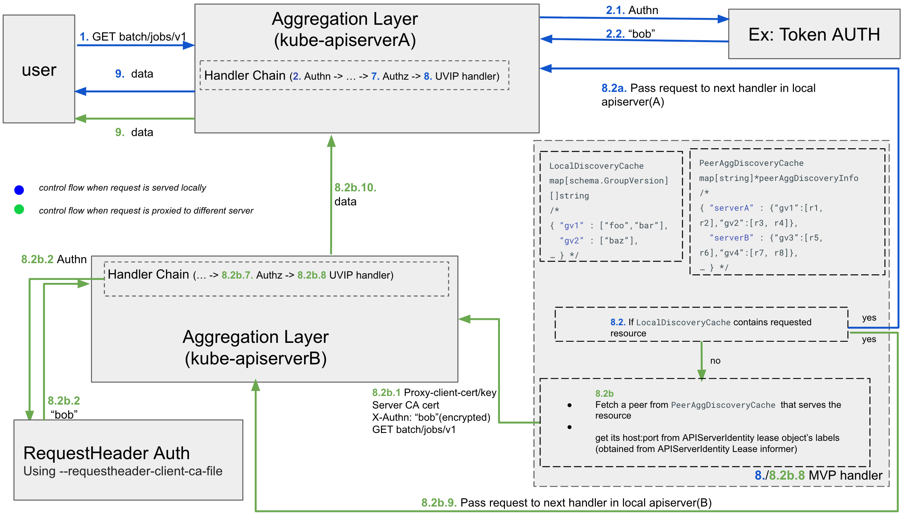

# KEP-4020: Unknown Version Interoperability Proxy

<!--
A table of contents is helpful for quickly jumping to sections of a KEP and for
highlighting any additional information provided beyond the standard KEP
template.

Ensure the TOC is wrapped with
  <code>&lt;!-- toc --&rt;&lt;!-- /toc --&rt;</code>
tags, and then generate with `hack/update-toc.sh`.
-->

<!-- toc -->
- [Release Signoff Checklist](#release-signoff-checklist)
- [Summary](#summary)
- [Motivation](#motivation)
  - [Goals](#goals)
  - [Non-Goals](#non-goals)
- [Proposal](#proposal)
  - [User Stories](#user-stories)
    - [Garbage Collector](#garbage-collector)
    - [Namespace Lifecycle Controller](#namespace-lifecycle-controller)
  - [Notes/Constraints/Caveats (Optional)](#notesconstraintscaveats-optional)
  - [Risks and Mitigations](#risks-and-mitigations)
- [Design Details](#design-details)
  - [Aggregation Layer](#aggregation-layer)
    - [Identifying destination apiserver's network location](#identifying-destination-apiservers-network-location)
    - [Proxy transport between apiservers and authn](#proxy-transport-between-apiservers-and-authn)
  - [Discovery Merging](#discovery-merging)
    - [Caching and consistency](#caching-and-consistency)
  - [Test Plan](#test-plan)
      - [Prerequisite testing updates](#prerequisite-testing-updates)
      - [Unit tests](#unit-tests)
      - [Integration tests](#integration-tests)
      - [e2e tests](#e2e-tests)
  - [Graduation Criteria](#graduation-criteria)
    - [Alpha](#alpha)
    - [Beta](#beta)
    - [GA](#ga)
  - [Upgrade / Downgrade Strategy](#upgrade--downgrade-strategy)
  - [Version Skew Strategy](#version-skew-strategy)
- [Production Readiness Review Questionnaire](#production-readiness-review-questionnaire)
  - [Feature Enablement and Rollback](#feature-enablement-and-rollback)
  - [Rollout, Upgrade and Rollback Planning](#rollout-upgrade-and-rollback-planning)
  - [Monitoring Requirements](#monitoring-requirements)
  - [Dependencies](#dependencies)
  - [Scalability](#scalability)
  - [Troubleshooting](#troubleshooting)
- [Implementation History](#implementation-history)
- [Drawbacks](#drawbacks)
- [Alternatives](#alternatives)
  - [Network location of apiservers](#network-location-of-apiservers)
- [Infrastructure Needed (Optional)](#infrastructure-needed-optional)
<!-- /toc -->

## Release Signoff Checklist

<!--
**ACTION REQUIRED:** In order to merge code into a release, there must be an
issue in [kubernetes/enhancements] referencing this KEP and targeting a release
milestone **before the [Enhancement Freeze](https://git.k8s.io/sig-release/releases)
of the targeted release**.

For enhancements that make changes to code or processes/procedures in core
Kubernetes—i.e., [kubernetes/kubernetes], we require the following Release
Signoff checklist to be completed.

Check these off as they are completed for the Release Team to track. These
checklist items _must_ be updated for the enhancement to be released.
-->

Items marked with (R) are required *prior to targeting to a milestone / release*.

- [x] (R) Enhancement issue in release milestone, which links to KEP dir in [kubernetes/enhancements]
(not the initial KEP PR)
- [x] (R) KEP approvers have approved the KEP status as `implementable`
- [x] (R) Design details are appropriately documented
- [x] (R) Test plan is in place, giving consideration to SIG Architecture and
SIG Testing input (including test refactors)
  - [ ] e2e Tests for all Beta API Operations (endpoints)
  - [ ] (R) Ensure GA e2e tests meet requirements for [Conformance Tests](https://github.com/kubernetes/community/blob/master/contributors/devel/sig-architecture/conformance-tests.md)
  - [ ] (R) Minimum Two Week Window for GA e2e tests to prove flake free
- [x] (R) Graduation criteria is in place
  - [ ] (R) [all GA Endpoints](https://github.com/kubernetes/community/pull/1806)
  must be hit by [Conformance Tests](https://github.com/kubernetes/community/blob/master/contributors/devel/sig-architecture/conformance-tests.md)
- [x] (R) Production readiness review completed
- [ ] (R) Production readiness review approved
- [x] "Implementation History" section is up-to-date for milestone
- [x] User-facing documentation has been created in [kubernetes/website], for
publication to [kubernetes.io]
- [x] Supporting documentation—e.g., additional design documents, links to mailing
list discussions/SIG meetings, relevant PRs/issues, release notes

<!--
**Note:** This checklist is iterative and should be reviewed and updated every time 
this enhancement is being considered for a milestone.
-->

[kubernetes.io]: https://kubernetes.io/
[kubernetes/enhancements]: https://git.k8s.io/enhancements
[kubernetes/website]: https://git.k8s.io/website

## Summary

This proposal introduces a Mixed Version Proxy (also earlier referred to as Unknown Version Interoperability Proxy in the original version of the proposal) to solve issues with version skew in Kubernetes clusters. During upgrades or downgrades, when API servers have different versions, this feature ensures that:

1. Client requests for a specific built-in resource are proxied to an API server capable of serving it, avoiding 404 Not Found errors
2. Clients receive a complete, cluster-wide discovery document (we'll call this the "peer-aggregated discovery"), by merging information from all peer API servers, preventing controllers from making incorrect decisions based on incomplete data

Peer-aggregated discovery is only supported for aggregated discovery endpoint, which requires clients to use the aggregated discovery Accept headers. Requests for un-aggregated (legacy) discovery will always return local-only data and do not participate in peer merging. All discovery changes are implemented at the existing aggregated discovery endpoint `/apis`, with no new discovery endpoints being introduced.

**Note:** Peer-aggregated discovery is not supported for the api endpoint (`/api`) that serves the `core/v1` group. Since Kubernetes v1.4, no new top-level types have been added to `core/v1` group; only subresources have been introduced:

- /api/v1/namespaces/{namespace}/pods/{name}/ephemeralcontainers
- /api/v1/namespaces/{namespace}/pods/{name}/resize
- /api/v1/namespaces/{namespace}/serviceaccounts/{name}/token

Given this history and the expectation that any future new types will be added to new groups rather than `core/v1`, we do not anticipate the need for peer-aggregating discovery for `/api`. This means that the set of top-level resource types in `core/v1` is now considered complete and will not change in future Kubernetes releases; only subresources may be introduced. No new top-level resources will be added to `core/v1` going forward.

**Note 2**:  Peer-aggregated discovery is also not supported for requests to `/apis/<group>` and `/apis/<group>/<version>` since those are also served by un-aggregated discovery handler.

## Motivation

When an upgrade or downgrade is performed on a cluster, for some period of time
the apiservers are at differing versions and are able to serve different sets of
built-in resources (different groups, versions, and resources are all possible).

In an ideal world, clients would be able to know about the entire set of
available resources and perform operations on those resources without regard to
which apiserver they happened to connect to. Currently this is not the case.

Today, these things potentially differ:

- Resources available somewhere in the cluster
- Resources known by a client (i.e. read from discovery from some apiserver)
- Resources that can be actuated by a client

This can have serious consequences, such as namespace deletion being blocked
incorrectly or objects being garbage collected mistakenly.

### Goals

- Ensure that a request for built-in resources is handled by an apiserver that is
capable of serving that resource (if one exists)
- In the failure case (e.g. network not routable between apiservers), ensure that
unreachable resources are served 503 and not 404.
- Ensure discovery reports the same set of resources everywhere (not just group
versions, as it does today)
- Ensure that every resource in discovery can be accessed successfully

### Non-Goals

- Lock particular clients to particular versions

## Proposal

We will use the existing [Aggregated Discovery](https://github.com/kubernetes/enhancements/blob/master/keps/sig-api-machinery/3352-aggregated-discovery/README.md)
mechanism to fetch which group, versions and resources an apiserver can serve.

API server change:

- A new handler is added to the stack:
If a request targets a group/version/resource the apiserver doesn't serve locally
(requiring a discovery request, which is optimized by caching the discovery document), the
apiserver will consult its cache of agg-discovery as reported by peer apiservers.
This cache is populated and updated by an informer on apiserver identity lease objects.
The informer's event handler makes discovery calls to each peer apiserver
when its lease object is added or updated, ensuring the cache reflects the current
state of each peer's served resources. The apiserver uses this cache to identify
which peer serves the requested resource.

- Once it figures out a suitable peer to route the request to, it will proxy the
request to that server. If that apiserver fails to respond, then we will return
a 503 (there is a small possibility of a race between the controller registering
the apiserver with the resources it can serve and receiving a request for a
resource that is not yet available on that apiserver).

- Discovery merging:

  - During upgrade or downgrade, it may be the case that no apiserver has a
    complete list of available resources. To fix the problems mentioned, it's
    necessary that discovery exactly matches the capability of the system.

Why so much work?

- Note that merely serving 503s at the right times does not solve the problem,
  for two reasons: controllers might get an incomplete discovery and therefore
  not ask about all the correct resources; and when they get 503 responses,
  although the controller can avoid doing something destructive, it also can't
  make progress and is stuck for the duration of the upgrade.
- Likewise proxying but not merging the discovery document, or merging the
  discovery document but serving 503s instead of proxying, doesn't fix the
  problem completely. We need both safety against destructive actions and the
  ability for controllers to proceed and not block.

### User Stories

#### Garbage Collector

The garbage collector makes decisions about deleting objects when all
referencing objects are deleted. A discovery gap / apiserver mismatch, as
described above, could result in GC seeing a 404 and assuming an object has been
deleted; this could result in it deleting a subsequent object that it should
not.

This proposal will cause the GC to see the complete list of resources in
discovery, and when it requests specific objects, see either the correct object
or get a 503 (which it handles safely).

#### Namespace Lifecycle Controller

This controller seeks to empty all objects from a namespace when it is deleted.
Discovery failures cause NLC to be unable to tell if objects of a given resource
are present in a namespace. It fails safe, meaning it refuses to delete the
namespace until it can verify it is empty: this causes slowness deleting
namespaces that is a common source of complaint.

Additionally, if the NLC knows about a resource that the apiserver it is talking
to does not, it may incorrectly get a 404, assume a collection is empty, and
delete the namespace too early, leaving garbage behind in etcd. This is a
correctness problem, the garbage will reappear if a namespace of the same name
is recreated.

This proposal addresses both problems.

### Notes/Constraints/Caveats (Optional)

<!--
What are the caveats to the proposal?
What are some important details that didn't come across above?
Go in to as much detail as necessary here.
This might be a good place to talk about core concepts and how they relate.
-->

### Risks and Mitigations

1. **Network connectivity isues between apiservers**

    Cluster admins might not read the release notes and realize they should
    enable network/firewall connectivity between apiservers.
    In this case clients will receive 503s instead of transparently being proxied.
    503 is still safer than today's behavior.
    We will clearly document the steps needed to enable the feature and also
    include steps to verify that the feature is
    working as intended. Looking at the following exposed metrics can help wth that
    1. `kubernetes_apiserver_rerouted_request_total` to monitor the number of (UVIP)
    proxied requests. This metric can tell
    us the number of requests that were successfully proxied and the ones that failed
    2. `apiserver_request_total` to check the success/error status of the requests

2. **Increase in egress bandwidth**

    Requests will consume egress bandwidth for 2 apiservers when proxied. We can
    cap the number if needed, but upgrades
    aren't that frequent and few resources are changed on releases, so these
    requests should not be common. We will count
    them with a metric.

3. **Increase in request traffic directed at destination kube-apiserver**

    There could be a large volume of requests for a specific resource which might
    result in the identified apiserver being
    unable to serve the proxied requests. This scenario should not occur too
    frequently, since resource types which have
    large request volume should not be added or removed during an upgrade - that
    would cause other problems, too.

4. **Indefinite rerouting of the request**

    We should ensure at most one proxy, rather than proxying the request over and
    over again (if the source apiserver has an
    incorrect understanding of what the destination apiserver can serve). To do
    this, we will add a new header such as
    `X-Kubernetes-APIServer-Rerouted:true` to the  request once it is determined
    that the request cannot be served by the
    local apiserver and should therefore be proxied.  
    We will remove this header after the request is received by the destination
    apiserver (i.e. after the proxy has happened
    once) at which point it will be served locally.

5. **Putting IP/endpoint and trust bundle control in user hands in REST APIs**

    To prevent server-side request forgeries we will not give control over
    information about apiserver IP/endpoint and the
    trust bundle (used to authenticate server while proxying) to users via REST APIs.

6. **Failure to Initialize Peer Discovery**

     If the `kube-apiserver` is not started with the necessary certificates and keys (`--proxy-client-key/cert` and `--peer-ca-file` and `--requestheader-client-ca-file`) required for peer-to-peer authentication, the peer discovery controller will fail to initialize. The peer-aggregated discovery handler is designed to fall back to serving the local, peer-unaggregated discovery response in this scenario, allowing the API server to remain operational without compromising the safety of the cluster.

7. **Temporary Staleness of Peer Aggregated Discovery Cache When a Peer Leaves**

    Peer-aggregated discovery is constructed from aggregate-discovery responses from peers. The existing peers in a cluster are fetched via an informer on apiserver identity lease objects. When a peer apiserver leaves, its apiserver identity lease remains for up to 1 hour ([reference](https://github.com/kubernetes/kubernetes/blob/release-1.34/pkg/controlplane/apiserver/server.go#L61)). During this period, the peer's discovery information may persist in the peer-aggregated discovery cache, causing it to be temporarily stale. To avoid this long duration of staleness, we will add a pre-shutdown hook for the apiserver to clean up its own identity lease upon graceful shutdown. To avoid the case of a lingering lease in case of a server crash, we will also proactively delete any stale leases found upon server startup, which should eventually be followed up by creation of a brand new lease object. This active clean up of stale leaes will ensure that the peer-aggregated discovery correctly reports discovery info from servers that actually exist in a cluster at a given time.

## Design Details

### Aggregation Layer

1. A new handler will be added to the [handler chain] of the aggregation layer.
This handler will maintain the following internal caches:
    1. LocalDiscovery cache: 
        * Stores the set of resources served by the local API server, organized by group-version
        * Populated via a discovery call using a loopback client
        * A post-start hook ensures this cache is fully populated before the API server begins serving requests
        * The cache is periodically refreshed (every 30 minutes) to ensure it remains up-to-date and the apiserver has a complete view of its served resources before processing any incoming requests
    2. PeerDiscovery cache: 
        * Stores the resources served by each peer API server in the cluster
        * Populated by a peer-discovery controller, which watches [apiserver identity Lease objects](https://github.com/kubernetes/enhancements/blob/master/keps/sig-api-machinery/1965-kube-apiserver-identity/README.md#proposal)
        * When a lease is created or updated (as a result of a change in [holderIdentity](https://github.com/kubernetes/kubernetes/blob/release-1.32/staging/src/k8s.io/api/coordination/v1/types.go#L58) e.g., due to a server restart), the controller makes a discovery request to the corresponding peer API server
        * This cache is essential for both - building the peer-aggregated discovery response and determining which peer can handle a proxied resource request

1. This handler will pass on the request to the next handler in the local aggregator
chain, if:
   1. It is a non resource request
   2. The LocalDiscovery cache or the apiserver identity lease informer hasn't synced
   yet. We will serve error 503 in this case
   3. The request has a header `X-Kubernetes-APIServer-Rerouted:true` that indicates
   that this request has been proxied once already. If for some reason the
   resource is not found locally, we will serve error 503
   4. The requested resource was listed in the LocalDiscovery cache
   5. No other peer apiservers were found to exist in the cluster

1. If the requested resource was not found in the LocalDiscovery cache, it will
try to fetch the resource from the PeerDiscovery cache. The request
will then be proxied to any peer apiserver, selected randomly, thats found to be
able to serve the resource as indicated in the PeerDiscovery cache.
    1. There is a possibility of a race condition regarding creation/update of an
   aggregated resource or a CRD and its registration in the LocalDiscovery cache.
   This transient state is mitigated by a periodic refresh of the local discovery cache every 30 minutes. In such cases, the request will be routed to the peer.

1. If there is no eligible apiserver found in the PeerDiscovery cache
for the requested resource, it will pass on the request to the next handler in the
handler chain. This will either

    - be eventually handled by the apiextensions-apiserver or the
    aggregated-apiserver if the request was for a custom resource or an
    aggregated resource which was created/updated after we established both the
    LocalDiscovery and the PeerDiscovery caches
    - be returned with a 404 Not Found error for cases when the resource doesn't exist
    in the cluster

1. If the proxy call fails for network issues or any reason, it will serve 503 with
error `Error while proxying request to destination apiserver`

1. We will add a poststarthook for the apiserver to ensure that it does not
start serving requests until
    * we have populated the LocalDiscovery cache
    * apiserver identity informer is synced

[handler chain]:https://github.com/kubernetes/kubernetes/blob/fc8f5a64106c30c50ee2bbcd1d35e6cd05f63b00/staging/src/k8s.io/apiserver/pkg/server/config.go#L639

#### Identifying destination apiserver's network location

We will be performing dual writes of the ip and port information of the apiservers
in:

1. A clone of the [endpoint reconciler's masterlease](https://github.com/kubernetes/kubernetes/blob/release-1.27/pkg/controlplane/reconcilers/lease.go)
which would be read by apiservers to proxy the request to a peer. We will use a
separate reconciler loop to do these writes
to avoid modifying the existing endpoint reconciler

2. [APIServerIdentity Lease object](https://github.com/kubernetes/kubernetes/blob/release-1.27/pkg/controlplane/instance.go#L559-L577)
for users to view this information for debugging

3. We will use an egress dialer for network connections made to peer kube-apiservers.
For this, will create a new type for
the network context to be used for peer kube-apiserver connections ([xref](https://github.com/kubernetes/kubernetes/blob/release-1.27/staging/src/k8s.io/apiserver/pkg/apis/apiserver/types.go#L56-L71))

#### Proxy transport between apiservers and authn

For the mTLS between source and destination apiservers, we will do the following

1. For server authentication by the client (source apiserver) : the client needs
to validate the [server certs](https://github.com/kubernetes/kubernetes/blob/release-1.27/staging/src/k8s.io/apiserver/pkg/server/options/serving.go#L59)
(presented by the destination apiserver), for which it will
   1. look at the CA bundle of the authority that signed those certs. We will
   introduce a new flag --peer-ca-file for the
   kube-apiserver that will be used to verify the presented server certs. If this
   flag is not specified, the requests will
   fail with error 503
   2. look at the ServerName `kubernetes.default.svc` for SNI to verify server
   certs against

2. The server (destination apiserver) will check the client (source apiserver)
certs to determine that the proxy request is
from an authenticated client. We will use requestheader authentication (and NOT
client cert authentication) for this. The
client (source apiserver) will provide the [proxy-client certfiles](https://github.com/kubernetes/kubernetes/blob/release-1.27/cmd/kube-apiserver/app/options/options.go#L222-L233)
to the server (destination apiserver) which will verify the presented certs using
the CA bundle provided in the [--requestheader-client-ca-file](<https://github.com/kubernetes/kubernetes/blob/release-1.27/staging/src/k8s.io/>
apiserver/pkg/server/options/authentication.go#L125-L128) passed to the apiserver
upon bootstrap

### Discovery Merging

A new handler is introduced to serve a consolidated discovery document, combining local and peer API server data. This handler extends the existing aggregated discovery endpoints (/apis and /api); no new endpoints are introduced.

This handler is responsible for the following actions:

* Document Generation: Merges local discovery data with PeerDiscovery cache to create a comprehensive view of all API groups and resources available in the cluster
* Client Negotiation: Interprets a new `profile` parameter in the Accept header
  * By default, serves the peer-aggregated discovery document
  * If `profile=nopeer` is specified, serves the local-only discovery response. This is used for PeerDiscovery cache population and for backward compatibility 
* Backward Compatibility: The handler ensures that local (non peer-aggregated) discovery requests continue to function as before. When a newer API server (with the feature enabled) needs to fetch discovery information from an older peer (which is unaware of the feature), it sends a discovery request with the Accept header:
  `application/json;g=apidiscovery.k8s.io;v=v2;as=APIGroupDiscoveryList;profile=nopeer, application/json;g=apidiscovery.k8s.io;v=v2;as=APIGroupDiscoveryList, application/json;...;q=0.9`. This header signals the preference for a local (non peer-aggregated) response. The older peer, which does not recognize the `profile=nopeer` parameter, simply falls back to its standard discovery behavior and returns its local discovery document. This guarantees that the request succeeds and allows the newer API server to collect the necessary unmerged data for its peer cache.
  
#### Caching and consistency

The peer-aggregated discovery response is cached in memory for performance.  This cache is automatically invalidated and refreshed under two conditions:

1. When the local API server’s discovery cache changes (e.g., due to resource additions or removals)
2. When peer API server discovery information changes (e.g., a peer joins or leaves, triggered by lease informer events)

This two-layer caching strategy provides a robust feedback loop:

Case 1: Peer API server change sequence
1. Peers Announce: API servers announce their presence(or absence) via identity leases
2. Caches Update: The informer on these leases triggers the repopulation of the peer discovery cache on each API server
3. Peer-aggregated discovery cache Invalidates: An update to the peer discovery cache automatically invalidates the peer-aggregated discovery cache
4. Recalculation: The next peer-aggregated discovery request triggers a single, optimized recalculation of the peer-aggregated discovery response, which is then cached for subsequent requests

Case 2: Local Discovery change sequence

1. Local Resource Change: The API server detects a change in its own resources (e.g., an API group or version is added, removed, or updated)
2. Local Discovery Cache Update: The local discovery cache is updated to reflect the new set of available resources
3. Peer-aggregated discovery cache Invalidates: Any update to the local discovery cache automatically invalidates the peer-aggregated discovery cache
4. Recalculation: The next peer-aggregated discovery request triggers a single, optimized recalculation of the peer-aggregated discovery response, which is then cached for subsequent requests

### Test Plan

<!--
**Note:** *Not required until targeted at a release.*
The goal is to ensure that we don't accept enhancements with inadequate testing.

All code is expected to have adequate tests (eventually with coverage
expectations). Please adhere to the [Kubernetes testing guidelines][testing-guidelines]
when drafting this test plan.

[testing-guidelines]: https://git.k8s.io/community/contributors/devel/sig-testing/testing.md
-->

[x] I/we understand the owners of the involved components may require updates to
existing tests to make this code solid enough prior to committing the changes necessary
to implement this enhancement.

##### Prerequisite testing updates

<!--
Based on reviewers feedback describe what additional tests need to be added prior
implementing this enhancement to ensure the enhancements have also solid foundations.
-->

##### Unit tests

<!--
In principle every added code should have complete unit test coverage, so providing
the exact set of tests will not bring additional value.
However, if complete unit test coverage is not possible, explain the reason of it
together with explanation why this is acceptable.
-->

<!--
Additionally, for Alpha try to enumerate the core package you will be touching
to implement this enhancement and provide the current unit coverage for those
in the form of:
- <package>: <date> - <current test coverage>
The data can be easily read from:
https://testgrid.k8s.io/sig-testing-canaries#ci-kubernetes-coverage-unit

This can inform certain test coverage improvements that we want to do before
extending the production code to implement this enhancement.
-->

- `pkg/controlplane/apiserver/options`: `07/18/2023` - `100%`
- `staging/src/k8s.io/apiserver/pkg/util/peerproxy`: `03/18/2025` - `100%`
- `staging/src/k8s.io/apiserver/pkg/reconcilers`: `07/18/2023` - `100%`
- `staging/src/k8s.io/apiserver/pkg/endpoints/discovery/aggregated`: `09/06/2025` - `100%`

##### Integration tests

<!--
This question should be filled when targeting a release.
For Alpha, describe what tests will be added to ensure proper quality of the enhancement.

For Beta and GA, add links to added tests together with links to k8s-triage for those tests:
https://storage.googleapis.com/k8s-triage/index.html
-->

In the first alpha phase, the integration tests are expected to be added for:

Resource request routing tests:

- The behavior with feature gate turned on/off
- Request is proxied to an apiserver that is able to handle it
- Validation that a request is proxied to the available peer if another eligible peer becomes unavailable

Peer-aggregated discovery tests:

- Validation that the peer-aggregated discovery endpoint correctly combines API groups and resources from multiple API servers with different served resources
- Validation of the Accept header negotiation, ensuring that by default we return the consolidated document, while `profile=nopeer` Accept header returns the local document

##### e2e tests

<!--
This question should be filled when targeting a release.
For Alpha, describe what tests will be added to ensure proper quality of the enhancement.

For Beta and GA, add links to added tests together with links to k8s-triage for those tests:
https://storage.googleapis.com/k8s-triage/index.html

We expect no non-infra related flakes in the last month as a GA graduation criteria.
-->

We will test the feature mostly in integration test and unit test. We may add
e2e test for spot check of the feature presence.

### Graduation Criteria

#### Alpha

- Proxying implemented (behind feature flag)
- mTLS or other secure system used for proxying
- Ensure proper tests are in place.

#### Beta

- Discovery document merging implemented
- Use egress dialer for network connections made to peer kube-apiservers

#### GA

- TODO: wait for beta to determine any further criteria

<!--
**Note:** *Not required until targeted at a release.*

Define graduation milestones.

These may be defined in terms of API maturity, [feature gate] graduations, or as
something else. The KEP should keep this high-level with a focus on what
signals will be looked at to determine graduation.

Consider the following in developing the graduation criteria for this enhancement:
- [Maturity levels (`alpha`, `beta`, `stable`)][maturity-levels]
- [Feature gate][feature gate] lifecycle
- [Deprecation policy][deprecation-policy]

Clearly define what graduation means by either linking to the [API doc
definition](https://kubernetes.io/docs/concepts/overview/kubernetes-api/#api-versioning)
or by redefining what graduation means.

In general we try to use the same stages (alpha, beta, GA), regardless of how the
functionality is accessed.

[feature gate]: https://git.k8s.io/community/contributors/devel/sig-architecture/feature-gates.md
[maturity-levels]: https://git.k8s.io/community/contributors/devel/sig-architecture/api_changes.md#alpha-beta-and-stable-versions
[deprecation-policy]: https://kubernetes.io/docs/reference/using-api/deprecation-policy/

Below are some examples to consider, in addition to the aforementioned [maturity levels][maturity-levels].

#### Alpha

- Feature implemented behind a feature flag
- Initial e2e tests completed and enabled

#### Beta

- Gather feedback from developers and surveys
- Complete features A, B, C
- Additional tests are in Testgrid and linked in KEP

#### GA

- N examples of real-world usage
- N installs
- More rigorous forms of testing—e.g., downgrade tests and scalability tests
- Allowing time for feedback

**Note:** Generally we also wait at least two releases between beta and
GA/stable, because there's no opportunity for user feedback, or even bug reports,
in back-to-back releases.

**For non-optional features moving to GA, the graduation criteria must include
[conformance tests].**

[conformance tests]: https://git.k8s.io/community/contributors/devel/sig-architecture/conformance-tests.md

#### Deprecation

- Announce deprecation and support policy of the existing flag
- Two versions passed since introducing the functionality that deprecates the flag (to address version skew)
- Address feedback on usage/changed behavior, provided on GitHub issues
- Deprecate the flag
-->

### Upgrade / Downgrade Strategy

<!--
If applicable, how will the component be upgraded and downgraded? Make sure
this is in the test plan.

Consider the following in developing an upgrade/downgrade strategy for this
enhancement:
- What changes (in invocations, configurations, API use, etc.) is an existing
  cluster required to make on upgrade, in order to maintain previous behavior?
- What changes (in invocations, configurations, API use, etc.) is an existing
  cluster required to make on upgrade, in order to make use of the enhancement?
-->

In alpha, no changes are required to maintain previous behavior. And the feature
gate can be turned on to make use of the enhancement.

### Version Skew Strategy

<!--
If applicable, how will the component handle version skew with other
components? What are the guarantees? Make sure this is in the test plan.

Consider the following in developing a version skew strategy for this
enhancement:
- Does this enhancement involve coordinating behavior in the control plane and
  in the kubelet? How does an n-2 kubelet without this feature available behave
  when this feature is used?
- Will any other components on the node change? For example, changes to CSI,
  CRI or CNI may require updating that component before the kubelet.
-->

## Production Readiness Review Questionnaire

<!--

Production readiness reviews are intended to ensure that features merging into
Kubernetes are observable, scalable and supportable; can be safely operated in
production environments, and can be disabled or rolled back in the event they
cause increased failures in production. See more in the PRR KEP at
https://git.k8s.io/enhancements/keps/sig-architecture/1194-prod-readiness.

The production readiness review questionnaire must be completed and approved
for the KEP to move to `implementable` status and be included in the release.

In some cases, the questions below should also have answers in `kep.yaml`. This
is to enable automation to verify the presence of the review, and to reduce review
burden and latency.

The KEP must have a approver from the
[`prod-readiness-approvers`](http://git.k8s.io/enhancements/OWNERS_ALIASES)
team. Please reach out on the
[#prod-readiness](https://kubernetes.slack.com/archives/CPNHUMN74) channel if
you need any help or guidance.
-->

### Feature Enablement and Rollback

<!--
This section must be completed when targeting alpha to a release.
-->

###### How can this feature be enabled / disabled in a live cluster?

<!--
Pick one of these and delete the rest.

Documentation is available on [feature gate lifecycle] and expectations, as
well as the [existing list] of feature gates.

[feature gate lifecycle]: https://git.k8s.io/community/contributors/devel/sig-architecture/feature-gates.md
[existing list]: https://kubernetes.io/docs/reference/command-line-tools-reference/feature-gates/
-->

- [x] Feature gate (also fill in values in `kep.yaml`)
  - Feature gate name: UnknownVersionInteroperabilityProxy
  - Components depending on the feature gate: kube-apiserver

###### Does enabling the feature change any default behavior?

<!--
Any change of default behavior may be surprising to users or break existing
automations, so be extremely careful here.
-->

Yes, requests for built-in resources at the time when a cluster is at mixed versions
will be served with a default 503 error instead of a 404 error, if the request
is unable to be served.

###### Can the feature be disabled once it has been enabled (i.e. can we roll back the enablement)?

<!--
Describe the consequences on existing workloads (e.g., if this is a runtime
feature, can it break the existing applications?).

Feature gates are typically disabled by setting the flag to `false` and
restarting the component. No other changes should be necessary to disable the
feature.

NOTE: Also set `disable-supported` to `true` or `false` in `kep.yaml`.
-->

Yes, disabling the feature will result in requests for built-in resources in a
cluster at mixed versions to be served with a
default 404 error in the case when the request is unable to be served locally.

###### What happens if we reenable the feature if it was previously rolled back?

The request for built-in resources will be proxied to the apiserver capable of
serving it, or else be served with 503 error.

###### Are there any tests for feature enablement/disablement?

<!--
The e2e framework does not currently support enabling or disabling feature
gates. However, unit tests in each component dealing with managing data, created
with and without the feature, are necessary. At the very least, think about
conversion tests if API types are being modified.

Additionally, for features that are introducing a new API field, unit tests that
are exercising the `switch` of feature gate itself (what happens if I disable a
feature gate after having objects written with the new field) are also critical.
You can take a look at one potential example of such test in:
https://github.com/kubernetes/kubernetes/pull/97058/files#diff-7826f7adbc1996a05ab52e3f5f02429e94b68ce6bce0dc534d1be636154fded3R246-R282
-->

Unit test and integration test will be introduced in alpha implementation.

### Rollout, Upgrade and Rollback Planning

<!--
This section must be completed when targeting beta to a release.
-->

###### How can a rollout or rollback fail? Can it impact already running workloads?

<!--
Try to be as paranoid as possible - e.g., what if some components will restart
mid-rollout?

Be sure to consider highly-available clusters, where, for example,
feature flags will be enabled on some API servers and not others during the
rollout. Similarly, consider large clusters and how enablement/disablement
will rollout across nodes.
-->

The proxy to remote apiserver can fail if there are network restrictions in place
that do not allow an apiserver to talk to
a remote apiserver. In this case, the request will fail with 503 error.

###### What specific metrics should inform a rollback?

<!--
What signals should users be paying attention to when the feature is young
that might indicate a serious problem?
-->

- apiserver_request_total metric that will tell us if there's a spike in the number
of errors seen meaning the feature is not
 working as expected

###### Were upgrade and rollback tested? Was the upgrade->downgrade->upgrade path tested?

<!--
Describe manual testing that was done and the outcomes.
Longer term, we may want to require automated upgrade/rollback tests, but we
are missing a bunch of machinery and tooling and can't do that now.
-->

Upgrade and rollback will be tested before the feature goes to Beta.

###### Is the rollout accompanied by any deprecations and/or removals of features

APIs, fields of API types, flags, etc.?

<!--
Even if applying deprecation policies, they may still surprise some users.
-->

No.

### Monitoring Requirements

<!--
This section must be completed when targeting beta to a release.

For GA, this section is required: approvers should be able to confirm the
previous answers based on experience in the field.
-->

###### How can an operator determine if the feature is in use by workloads?

<!--
Ideally, this should be a metric. Operations against the Kubernetes API (e.g.,
checking if there are objects with field X set) may be a last resort. Avoid
logs or events for this purpose.
-->

The following metrics could be used to see if the feature is in use:

- `apiserver_rerouted_request_total` which is incremented anytime a resource request is proxied to a peer apiserver
- `aggregator_discovery_peer_aggregated_cache_misses_total` which is incremented everytime we construct a peer-aggregated discovery response by merging resources served by a peer apiserver
- `aggregator_discovery_peer_aggregated_cache_hits_total` which is incremented everytime peer-aggregated discovery was served from the cache
- `aggregator_discovery_nopeer_requests_total` which is incremented everytime a no-peer discovery was requested

###### How can someone using this feature know that it is working for their instance?

<!--
For instance, if this is a pod-related feature, it should be possible to determine 
if the feature is functioning properly
for each individual pod.
Pick one more of these and delete the rest.
Please describe all items visible to end users below with sufficient detail so 
that they can verify correct enablement
and operation of this feature.
Recall that end users cannot usually observe component logs or access metrics.
-->

- Metrics like `apiserver_rerouted_request_total` can be used to check
how many resource requests were proxied to remote apiserver
- The `aggregator_discovery_peer_aggregated_cache_misses_total` and `aggregator_discovery_peer_aggregated_cache_hits_total` metrics will show activity when peer-aggregated discovery responses are constructed and served
- The `aggregator_discovery_nopeer_requests_total` metric will increment when local (non peer-aggregated) discovery is requested

###### What are the reasonable SLOs (Service Level Objectives) for the enhancement?

<!--
This is your opportunity to define what "normal" quality of service looks like
for a feature.

It's impossible to provide comprehensive guidance, but at the very
high level (needs more precise definitions) those may be things like:
  - per-day percentage of API calls finishing with 5XX errors <= 1%
  - 99% percentile over day of absolute value from (job creation time minus expected
    job creation time) for cron job <= 10%
  - 99.9% of /health requests per day finish with 200 code

These goals will help you determine what you need to measure (SLIs) in the next
question.
-->

- The peer-aggregated discovery endpoint should reliably return a complete and up-to-date set of resources available in the cluster, except for brief periods during peer lease expiration or network partition
- The percentage of proxied resource requests that result in a successful response (not 5XX) should be high (>99% under normal conditions)
- The system should minimize the duration of staleness in the peer-aggregated discovery cache (O(seconds) in the normal case, O(single digit minutes) in the worst case)
- The feature should not introduce significant latency or error rates for standard API operations
###### What are the SLIs (Service Level Indicators) an operator can use to determine the health of the service?

<!--
Pick one more of these and delete the rest.
-->

- [X] Metrics
  - Metric name: `apiserver_rerouted_request_total`
    - Components exposing the metric: kube-apiserver
  - Metric name: `aggregator_discovery_peer_aggregated_cache_hits_total`
    - Components exposing the metric: kube-apiserver
  - Metric name: `aggregator_discovery_peer_aggregated_cache_misses_total`
    - Components exposing the metric: kube-apiserver
  - Metric name: `aggregator_discovery_nopeer_requests_total`
    - Components exposing the metric: kube-apiserver

###### Are there any missing metrics that would be useful to have to improve observability of this feature?

<!--
Describe the metrics themselves and the reasons why they weren't added (e.g., cost,
implementation difficulties, etc.).
-->

No. We are open to input.

### Dependencies

<!--
This section must be completed when targeting beta to a release.
-->

###### Does this feature depend on any specific services running in the cluster?

No, but it does depend on

- `APIServerIdentity` feature in kube-apiserver that creates a lease object for APIServerIdentity
which we will use to store the network location of the remote apiserver for visibility/debugging

<!--
Think about both cluster-level services (e.g. metrics-server) as well
as node-level agents (e.g. specific version of CRI). Focus on external or
optional services that are needed. For example, if this feature depends on
a cloud provider API, or upon an external software-defined storage or network
control plane.

For each of these, fill in the following—thinking about running existing user workloads
and creating new ones, as well as about cluster-level services (e.g. DNS):
  - [Dependency name]
    - Usage description:
      - Impact of its outage on the feature:
      - Impact of its degraded performance or high-error rates on the feature:
-->

### Scalability

<!--
For alpha, this section is encouraged: reviewers should consider these questions
and attempt to answer them.

For beta, this section is required: reviewers must answer these questions.

For GA, this section is required: approvers should be able to confirm the
previous answers based on experience in the field.
-->

###### Will enabling / using this feature result in any new API calls?

<!--
Describe them, providing:
  - API call type (e.g. PATCH pods)
  - estimated throughput
  - originating component(s) (e.g. Kubelet, Feature-X-controller)
Focusing mostly on:
  - components listing and/or watching resources they didn't before
  - API calls that may be triggered by changes of some Kubernetes resources
    (e.g. update of object X triggers new updates of object Y)
  - periodic API calls to reconcile state (e.g. periodic fetching state,
    heartbeats, leader election, etc.)
-->

Yes, enabling this feature will result in new API calls.  Specifically:

- Discovery calls via a loopback client: The local apiserver will use a loopback
client to discover the resources it serves for each group-version. This should
only happen once upon server startup.
- Remote discovery calls to peer apiservers: The event handler for apiserver identity
lease informer will make remote discovery calls to each peer apiserver whose
    - identity lease is created
    - identity lease is updated as a result of change in [holderIdentity](https://github.com/kubernetes/kubernetes/blob/release-1.32/staging/src/k8s.io/api/coordination/v1/types.go#L58) implying a server restart

###### Will enabling / using this feature result in introducing new API types?

<!--
Describe them, providing:
  - API type
  - Supported number of objects per cluster
  - Supported number of objects per namespace (for namespace-scoped objects)
-->

No.

###### Will enabling / using this feature result in any new calls to the cloud provider?

<!--
Describe them, providing:
  - Which API(s):
  - Estimated increase:
-->

No.

###### Will enabling / using this feature result in increasing size or count of the existing API objects?

<!--
Describe them, providing:
  - API type(s):
  - Estimated increase in size: (e.g., new annotation of size 32B)
  - Estimated amount of new objects: (e.g., new Object X for every existing Pod)
-->

No.

###### Will enabling / using this feature result in increasing time taken by any operations covered by existing SLIs/SLOs?

<!--
Look at the [existing SLIs/SLOs].

Think about adding additional work or introducing new steps in between
(e.g. need to do X to start a container), etc. Please describe the details.

[existing SLIs/SLOs]: https://git.k8s.io/community/sig-scalability/slos/slos.md#kubernetes-slisslos
-->

The Local Discovery, Peer Discovery and Peer-aggregated Discovery caches should take care of not causing delays while
handling a request.

###### Will enabling / using this feature result in non-negligible increase of resource usage (CPU, RAM, disk, IO, ...) in any components?

<!--
Things to keep in mind include: additional in-memory state, additional
non-trivial computations, excessive access to disks (including increased log
volume), significant amount of data sent and/or received over network, etc.
This through this both in small and large cases, again with respect to the
[supported limits].

[supported limits]: https://git.k8s.io/community//sig-scalability/configs-and-limits/thresholds.md
-->

Requests will consume egress bandwidth for 2 apiservers when proxied. We can put
a limit on this value if needed.

###### Can enabling / using this feature result in resource exhaustion of some node resources (PIDs, sockets, inodes, etc.)?

<!--
Focus not just on happy cases, but primarily on more pathological cases
(e.g. probes taking a minute instead of milliseconds, failed pods consuming resources, etc.).
If any of the resources can be exhausted, how this is mitigated with the existing limits
(e.g. pods per node) or new limits added by this KEP?

Are there any tests that were run/should be run to understand performance characteristics better
and validate the declared limits?
-->

No.

### Troubleshooting

<!--
This section must be completed when targeting beta to a release.

For GA, this section is required: approvers should be able to confirm the
previous answers based on experience in the field.

The Troubleshooting section currently serves the `Playbook` role. We may consider
splitting it into a dedicated `Playbook` document (potentially with some monitoring
details). For now, we leave it here.
-->

###### How does this feature react if the API server and/or etcd is unavailable?

If the API server/etcd is unavailable the request will fail with 503 error.

###### What are other known failure modes?

<!--
For each of them, fill in the following information by copying the below template:
  - [Failure mode brief description]
    - Detection: How can it be detected via metrics? Stated another way:
      how can an operator troubleshoot without logging into a master or worker node?
    - Mitigations: What can be done to stop the bleeding, especially for already
      running user workloads?
    - Diagnostics: What are the useful log messages and their required logging
      levels that could help debug the issue?
      Not required until feature graduated to beta.
    - Testing: Are there any tests for failure mode? If not, describe why.
-->
None.

###### What steps should be taken if SLOs are not being met to determine the problem?

- The feature can be disabled by setting the feature-gate to false if the performance
impact of it is not tolerable.
- The peer-to-peer connection between API servers should be checked to ensure that
the remote API servers are reachable from
a given API server

## Implementation History

- v1.28: Mixed Version Proxy KEP merged and moved to alpha
- v1.33: Replaced StorageversionAPI with AggregatedDiscovery to fetch served resources by peer apiservers
- v1.35: Peer-aggregated Discovery implemented

## Drawbacks

<!--
Why should this KEP _not_ be implemented?
-->

## Alternatives

### Network location of apiservers

1. Use [endpoint reconciler's masterlease](https://github.com/kubernetes/kubernetes/blob/release-1.27/pkg/controlplane/reconcilers/lease.go)
    1. We will use the already existing IP in Endpoints.Subsets.Addresses of the
    masterlease by default
    2. For users with network configurations that would not allow
    Endpoints.Subsets.Addresses to be reachable from a
    kube-apiserver, we will introduce a new optional --bind-peer-ip flag to
    kube-apiserver. We will store its value as an
    annotation on the masterlease and use this to route the request to the right
    destination server
    3. We will also need to store the apiserver identity as an annotation in the
    masterlease so that we can map the identity
    of the apiserver to its IP
    4. We will also expose the IP and port information of the kube-apiservers as
    annotations in APIserver identity lease
    object for visibility/debugging purposes

- Pros
  1. Masterlease reconciler already stores kube-apiserver IPs currently
  2. This information is not exposed to users in an API that can be used maliciously
  3. Existing code to handle lifecycle of the masterleases is convenient

- Cons
  1. using masterlease will include making some changes to the legacy code that
  does the endpoint reconciliation which is
  known to be brittle

1. Use [coordination.v1.Lease](https://github.com/kubernetes/kubernetes/blob/release-1.27/staging/src/k8s.io/client-go/informers/coordination/v1/lease.go)
    1. By default, we can store the [External Address](https://github.com/kubernetes/kubernetes/blob/release-1.27/staging/src/k8s.io/apiserver/pkg/server/config.go#L149)
    of apiservers as labels in the [APIServerIdentity Lease](https://github.com/kubernetes/kubernetes/blob/release-1.27/pkg/controlplane/instance.go#L559-L577)
    objects.
    2. If `--peer-bind-address` flag is specified for the kube-apiserver, we will
    store its value in the APIServerIdentity
    Lease label
    3. We will retrieve this information in the new UVIP handler using an informer
    cache for these lease objects

- Pros
  1. Simpler solution, does not modify any legacy code that can cause unintended
  bugs
  2. Since in approach 1 we decided we want to store the apiserver IP, port in
  the APIServerIdentity lease object anyway for
  visibility to the user, we will be just making this change once in the
  APIServerIdentity lease instead of both here and in masterleases

- Cons
  1. If we take this approach, there is a risk of giving the user control of the
  apiserver IP, port information. This can
  lead to apiservers routing a request to a rogue IP:port specified in the lease
  object.

<!--
What other approaches did you consider, and why did you rule them out? These do
not need to be as detailed as the proposal, but should include enough
information to express the idea and why it was not acceptable.
-->

## Infrastructure Needed (Optional)

<!--
Use this section if you need things from the project/SIG. Examples include a
new subproject, repos requested, or GitHub details. Listing these here allows a
SIG to get the process for these resources started right away.
-->
