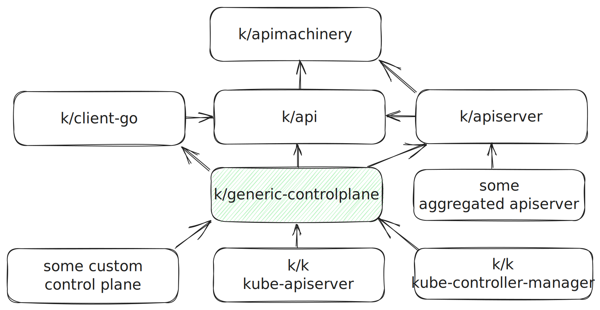

# KEP-4080: Add generic control plane staging repository(ies)

<!-- toc -->
- [Release Signoff Checklist](#release-signoff-checklist)
- [Summary](#summary)
- [Motivation](#motivation)
  - [Goals](#goals)
  - [Non-Goals](#non-goals)
- [Proposal](#proposal)
  - [User Stories (Optional)](#user-stories-optional)
    - [Story 1](#story-1)
    - [Story 2](#story-2)
  - [Notes/Constraints/Caveats (Optional)](#notesconstraintscaveats-optional)
  - [Risks and Mitigations](#risks-and-mitigations)
- [Design Details](#design-details)
  - [Test Plan](#test-plan)
      - [Prerequisite testing updates](#prerequisite-testing-updates)
      - [Unit tests](#unit-tests)
      - [Integration tests](#integration-tests)
      - [e2e tests](#e2e-tests)
  - [Graduation Criteria](#graduation-criteria)
  - [Upgrade / Downgrade Strategy](#upgrade--downgrade-strategy)
  - [Version Skew Strategy](#version-skew-strategy)
- [Production Readiness Review Questionnaire](#production-readiness-review-questionnaire)
  - [Feature Enablement and Rollback](#feature-enablement-and-rollback)
  - [Rollout, Upgrade and Rollback Planning](#rollout-upgrade-and-rollback-planning)
  - [Monitoring Requirements](#monitoring-requirements)
  - [Dependencies](#dependencies)
  - [Scalability](#scalability)
  - [Troubleshooting](#troubleshooting)
- [Implementation History](#implementation-history)
- [Drawbacks](#drawbacks)
- [Alternatives](#alternatives)
- [Infrastructure Needed (Optional)](#infrastructure-needed-optional)
<!-- /toc -->

## Release Signoff Checklist

<!--
**ACTION REQUIRED:** In order to merge code into a release, there must be an
issue in [kubernetes/enhancements] referencing this KEP and targeting a release
milestone **before the [Enhancement Freeze](https://git.k8s.io/sig-release/releases)
of the targeted release**.

For enhancements that make changes to code or processes/procedures in core
Kubernetes—i.e., [kubernetes/kubernetes], we require the following Release
Signoff checklist to be completed.

Check these off as they are completed for the Release Team to track. These
checklist items _must_ be updated for the enhancement to be released.
-->

Items marked with (R) are required *prior to targeting to a milestone / release*.

- [ ] (R) Enhancement issue in release milestone, which links to KEP dir in [kubernetes/enhancements] (not the initial KEP PR)
- [ ] (R) KEP approvers have approved the KEP status as `implementable`
- [ ] (R) Design details are appropriately documented
- [ ] (R) Test plan is in place, giving consideration to SIG Architecture and SIG Testing input (including test refactors)
  - [ ] e2e Tests for all Beta API Operations (endpoints)
  - [ ] (R) Ensure GA e2e tests meet requirements for [Conformance Tests](https://github.com/kubernetes/community/blob/master/contributors/devel/sig-architecture/conformance-tests.md) 
  - [ ] (R) Minimum Two Week Window for GA e2e tests to prove flake free
- [ ] (R) Graduation criteria is in place
  - [ ] (R) [all GA Endpoints](https://github.com/kubernetes/community/pull/1806) must be hit by [Conformance Tests](https://github.com/kubernetes/community/blob/master/contributors/devel/sig-architecture/conformance-tests.md) 
- [ ] (R) Production readiness review completed
- [ ] (R) Production readiness review approved
- [ ] "Implementation History" section is up-to-date for milestone
- [ ] User-facing documentation has been created in [kubernetes/website], for publication to [kubernetes.io]
- [ ] Supporting documentation—e.g., additional design documents, links to mailing list discussions/SIG meetings, relevant PRs/issues, release notes

<!--
**Note:** This checklist is iterative and should be reviewed and updated every time this enhancement is being considered for a milestone.
-->

[kubernetes.io]: https://kubernetes.io/
[kubernetes/enhancements]: https://git.k8s.io/enhancements
[kubernetes/kubernetes]: https://git.k8s.io/kubernetes
[kubernetes/website]: https://git.k8s.io/website

## Summary

This KEP proposes factoring *kube-apiserver* and *kube-controller-manager* to build
on one or multiple new staging repositories that consume `k/apiserver` but have a
bigger, carefully chosen subset of the functionality of *kube-apiserver* and 
*kube-controller-manager* such that it is reusable.

The factoring will be progressive: we will start with new repo(s) adding
nothing to `k/apiserver`, refactor in-place and then progressively move generic
functionality from *kube-apiserver* and *kube-controller-manager* to the new
repositories.

The suggested naming of the new repository(ies) is `k/generic-controlplane`
(`-apiserver/-controllers`; for simplicity we drop these suffixes in this document
until the names are finalized). Choosing the exact name(s) and split of 
packages will be part of the process of implementation. 

## Motivation

A working kube-based control plane is more than just an apiserver component
built on `k/apiserver`. It includes standard resources (depending on context
namespaces, CRDs, RBAC, secrets, configmaps), and standard controllers (think 
of garbage collection, namespace deletion, etc.). *kube-apiserver* today is a
bundle of those resources with container orchestration, *kube-controller-manager* 
equally for the corresponding controllers.

Separating the generic parts from container orchestration will allow new 
use-cases building upon `k/apimachinery` and `k/apiserver`, while keeping a 
unified codebase and ecosystem, and by improving the factoring of 
*kube-apiserver* for easier maintenance due to less complexity by clear layering.

### Goals

- As always: every PR transforms a working system into a working system, and 
  PRs are of manageable size.
- Improve factoring of *kube-apiserver* through layering on-top of 
  `k/generic-controlplane`, reducing complexity through more explicit structure
  and reduction of code in `k/k`.
- `k/generic-controlplane` will provide
  - a `sample-generic-controlplane` binary
  - a modular, further customizable (in code) library suitable to build a 
    working kube-based control plane without vendoring k/k.
- `k/generic-controlplane` will (optionally) include the ability to define 
  resources by CustomResourceDefinition objects.
- `k/generic-controlplane` will be able to (optionally) delegate handling of 
  some kinds of objects to another server, as directed by APIService objects.
- `k/generic-controlplane` will allow customization (in code) of which generic
  (native) resources like secrets, configmaps, admission webhooks, RBAC, etc. 
  are served.
- `k/generic-controlplane` will not include the definitions of the resources in 
  Kubernetes for the management of containerized workloads.  For example, the 
  excluded resources include: nodes, pods, daemonsets, ingresses, services, 
  persistentvolumes.
- `k/generic-controlplane` as a library will be agnostic to being used in separate 
  binaries or in an all-in-one binary, both in a *hyperkube*-like subcommand way, 
  and in an all-in-one *k3s* like way.

### Non-Goals

- provide and ship a de-facto standard, full-featured generic-controlplane binary:
  
  i.e. this is clearly a library approach and consumer projects will define a 
  feature set of a control plane. There is no new deliverable beyond a staging 
  repository with a library and a sample binary only, with clear limited scope 
  of demonstrating plumbing.
- change anything noticeable to the user for existing binaries.
- change compatibility guarantees of (server-side) staging repositories
- create `k/kube-apiserver` or anything similar, although this work can lead the
  path by defining package structures suitable for `k/kube-apiserver`.

## Proposal

The desired outcome is a useful new library, while of course keeping everything 
working during iterative development. Success will be measured by community 
members saying that the new library is useful to them.

### User Stories (Optional)

<!--
Detail the things that people will be able to do if this KEP is implemented.
Include as much detail as possible so that people can understand the "how" of
the system. The goal here is to make this feel real for users without getting
bogged down.
-->

#### Story 1

Project *kube-hyper-mini* wants to maintain a main program that bundles
1. the subset of *kube-apiserver* that is not concerned with the management of 
   containerized workloads, 
2. a single-member etcd cluster, and 
3. the subset of *kube-controller-manager* that is not concerned with the 
   management of containerized workloads. This makes a convenient platform for 
   hosting kube-style APIs defined by CRDs and/or resources served by their own 
   extension apiserver.  They use `k/generic-controlplane` to get part (1).

#### Story 2

Project *kube-core* recognizes that the three parts of kube-hyper-mini scale out
differently, and wants instead to maintain a main program that is just the 
desired subset of *kube-apiserver*.  Their main program is very little more than 
a use of `k/generic-controlplane`.

### Notes/Constraints/Caveats (Optional)

<!--
What are the caveats to the proposal?
What are some important details that didn't come across above?
Go in to as much detail as necessary here.
This might be a good place to talk about core concepts and how they relate.
-->

### Risks and Mitigations

- This KEP is about code refactoring introducing another layer to the staging 
  repositories that kube-apiserver and kube-controller-manager are built from.
  With every code refactoring there is risk of bugs. The mitigation are small,
  easy reviewable “obvious” PRs, iteratively moving from the old to the new 
  structure.

## Design Details

First steps are about splitting existing *kube-apiserver* and *kube-controller-manager*
packages in-place, aka inside of `k/k`. This includes:

- `cmd/kube-apiserver`
- `pkg/kubeapiserver`
- `pkg/controlplane`.

Early sketch of an end-state. By far, most changes towards this goal will be
code moves only:

- `k/generic-controlplane`
  - `pkg/apis`
  - `pkg/apiserver/options` 
  - `pkg/apiserver/server`
  - `pkg/apiserver/registry`
  - `pkg/apiserver/admission`
  - `pkg/controllers/garbagecollection`
  - `pkg/controllers/namespacedeletion`
  - `cmd/sample-generic-controlplane`

Potentially, we will split the apiserver and controller parts into two separate
repositories. This will be decided after the initial in-place steps have been done
and the best structure has become clearer how to host the new packages.

### Test Plan

<!--
**Note:** *Not required until targeted at a release.*
The goal is to ensure that we don't accept enhancements with inadequate testing.

All code is expected to have adequate tests (eventually with coverage
expectations). Please adhere to the [Kubernetes testing guidelines][testing-guidelines]
when drafting this test plan.

[testing-guidelines]: https://git.k8s.io/community/contributors/devel/sig-testing/testing.md
-->

[ ] I/we understand the owners of the involved components may require updates to
existing tests to make this code solid enough prior to committing the changes necessary
to implement this enhancement.

##### Prerequisite testing updates

<!--
Based on reviewers feedback describe what additional tests need to be added prior
implementing this enhancement to ensure the enhancements have also solid foundations.
-->

##### Unit tests

<!--
In principle every added code should have complete unit test coverage, so providing
the exact set of tests will not bring additional value.
However, if complete unit test coverage is not possible, explain the reason of it
together with explanation why this is acceptable.
-->

<!--
Additionally, for Alpha try to enumerate the core package you will be touching
to implement this enhancement and provide the current unit coverage for those
in the form of:
- <package>: <date> - <current test coverage>
The data can be easily read from:
https://testgrid.k8s.io/sig-testing-canaries#ci-kubernetes-coverage-unit

This can inform certain test coverage improvements that we want to do before
extending the production code to implement this enhancement.
-->

- `<package>`: `<date>` - `<test coverage>`

##### Integration tests

<!--
Integration tests are contained in k8s.io/kubernetes/test/integration.
Integration tests allow control of the configuration parameters used to start the binaries under test.
This is different from e2e tests which do not allow configuration of parameters.
Doing this allows testing non-default options and multiple different and potentially conflicting command line options.
-->

<!--
This question should be filled when targeting a release.
For Alpha, describe what tests will be added to ensure proper quality of the enhancement.

For Beta and GA, add links to added tests together with links to k8s-triage for those tests:
https://storage.googleapis.com/k8s-triage/index.html
-->

- <test>: <link to test coverage>

##### e2e tests

<!--
This question should be filled when targeting a release.
For Alpha, describe what tests will be added to ensure proper quality of the enhancement.

For Beta and GA, add links to added tests together with links to k8s-triage for those tests:
https://storage.googleapis.com/k8s-triage/index.html

We expect no non-infra related flakes in the last month as a GA graduation criteria.
-->

- <test>: <link to test coverage>

### Graduation Criteria

<!--
**Note:** *Not required until targeted at a release.*

Define graduation milestones.

These may be defined in terms of API maturity, [feature gate] graduations, or as
something else. The KEP should keep this high-level with a focus on what
signals will be looked at to determine graduation.

Consider the following in developing the graduation criteria for this enhancement:
- [Maturity levels (`alpha`, `beta`, `stable`)][maturity-levels]
- [Feature gate][feature gate] lifecycle
- [Deprecation policy][deprecation-policy]

Clearly define what graduation means by either linking to the [API doc
definition](https://kubernetes.io/docs/concepts/overview/kubernetes-api/#api-versioning)
or by redefining what graduation means.

In general we try to use the same stages (alpha, beta, GA), regardless of how the
functionality is accessed.

[feature gate]: https://git.k8s.io/community/contributors/devel/sig-architecture/feature-gates.md
[maturity-levels]: https://git.k8s.io/community/contributors/devel/sig-architecture/api_changes.md#alpha-beta-and-stable-versions
[deprecation-policy]: https://kubernetes.io/docs/reference/using-api/deprecation-policy/

Below are some examples to consider, in addition to the aforementioned [maturity levels][maturity-levels].

#### Alpha

- Feature implemented behind a feature flag
- Initial e2e tests completed and enabled

#### Beta

- Gather feedback from developers and surveys
- Complete features A, B, C
- Additional tests are in Testgrid and linked in KEP

#### GA

- N examples of real-world usage
- N installs
- More rigorous forms of testing—e.g., downgrade tests and scalability tests
- Allowing time for feedback

**Note:** Generally we also wait at least two releases between beta and
GA/stable, because there's no opportunity for user feedback, or even bug reports,
in back-to-back releases.

**For non-optional features moving to GA, the graduation criteria must include
[conformance tests].**

[conformance tests]: https://git.k8s.io/community/contributors/devel/sig-architecture/conformance-tests.md

#### Deprecation

- Announce deprecation and support policy of the existing flag
- Two versions passed since introducing the functionality that deprecates the flag (to address version skew)
- Address feedback on usage/changed behavior, provided on GitHub issues
- Deprecate the flag
-->

### Upgrade / Downgrade Strategy

<!--
If applicable, how will the component be upgraded and downgraded? Make sure
this is in the test plan.

Consider the following in developing an upgrade/downgrade strategy for this
enhancement:
- What changes (in invocations, configurations, API use, etc.) is an existing
  cluster required to make on upgrade, in order to maintain previous behavior?
- What changes (in invocations, configurations, API use, etc.) is an existing
  cluster required to make on upgrade, in order to make use of the enhancement?
-->

### Version Skew Strategy

<!--
If applicable, how will the component handle version skew with other
components? What are the guarantees? Make sure this is in the test plan.

Consider the following in developing a version skew strategy for this
enhancement:
- Does this enhancement involve coordinating behavior in the control plane and
  in the kubelet? How does an n-2 kubelet without this feature available behave
  when this feature is used?
- Will any other components on the node change? For example, changes to CSI,
  CRI or CNI may require updating that component before the kubelet.
-->

## Production Readiness Review Questionnaire

<!--

Production readiness reviews are intended to ensure that features merging into
Kubernetes are observable, scalable and supportable; can be safely operated in
production environments, and can be disabled or rolled back in the event they
cause increased failures in production. See more in the PRR KEP at
https://git.k8s.io/enhancements/keps/sig-architecture/1194-prod-readiness.

The production readiness review questionnaire must be completed and approved
for the KEP to move to `implementable` status and be included in the release.

In some cases, the questions below should also have answers in `kep.yaml`. This
is to enable automation to verify the presence of the review, and to reduce review
burden and latency.

The KEP must have a approver from the
[`prod-readiness-approvers`](http://git.k8s.io/enhancements/OWNERS_ALIASES)
team. Please reach out on the
[#prod-readiness](https://kubernetes.slack.com/archives/CPNHUMN74) channel if
you need any help or guidance.
-->

### Feature Enablement and Rollback

There will be no changes to system behavior. The typical alpha/beta/GA stages 
and requirements do not apply as this KEP proposed code moves of existing code, 
without changing its alpha/beta/GA status.

###### How can this feature be enabled / disabled in a live cluster?

<!--
Pick one of these and delete the rest.

Documentation is available on [feature gate lifecycle] and expectations, as
well as the [existing list] of feature gates.

[feature gate lifecycle]: https://git.k8s.io/community/contributors/devel/sig-architecture/feature-gates.md
[existing list]: https://kubernetes.io/docs/reference/command-line-tools-reference/feature-gates/
-->

- [ ] Feature gate (also fill in values in `kep.yaml`)
  - Feature gate name:
  - Components depending on the feature gate:
- [x] Other
  - Describe the mechanism: Does not apply. This is a code move of existing code
    without functional changes.

###### Does enabling the feature change any default behavior?

<!--
Any change of default behavior may be surprising to users or break existing
automations, so be extremely careful here.
-->

###### Can the feature be disabled once it has been enabled (i.e. can we roll back the enablement)?

<!--
Describe the consequences on existing workloads (e.g., if this is a runtime
feature, can it break the existing applications?).

Feature gates are typically disabled by setting the flag to `false` and
restarting the component. No other changes should be necessary to disable the
feature.

NOTE: Also set `disable-supported` to `true` or `false` in `kep.yaml`.
-->

###### What happens if we reenable the feature if it was previously rolled back?

###### Are there any tests for feature enablement/disablement?

<!--
The e2e framework does not currently support enabling or disabling feature
gates. However, unit tests in each component dealing with managing data, created
with and without the feature, are necessary. At the very least, think about
conversion tests if API types are being modified.

Additionally, for features that are introducing a new API field, unit tests that
are exercising the `switch` of feature gate itself (what happens if I disable a
feature gate after having objects written with the new field) are also critical.
You can take a look at one potential example of such test in:
https://github.com/kubernetes/kubernetes/pull/97058/files#diff-7826f7adbc1996a05ab52e3f5f02429e94b68ce6bce0dc534d1be636154fded3R246-R282
-->

### Rollout, Upgrade and Rollback Planning

<!--
This section must be completed when targeting beta to a release.
-->

###### How can a rollout or rollback fail? Can it impact already running workloads?

<!--
Try to be as paranoid as possible - e.g., what if some components will restart
mid-rollout?

Be sure to consider highly-available clusters, where, for example,
feature flags will be enabled on some API servers and not others during the
rollout. Similarly, consider large clusters and how enablement/disablement
will rollout across nodes.
-->

###### What specific metrics should inform a rollback?

<!--
What signals should users be paying attention to when the feature is young
that might indicate a serious problem?
-->

###### Were upgrade and rollback tested? Was the upgrade->downgrade->upgrade path tested?

<!--
Describe manual testing that was done and the outcomes.
Longer term, we may want to require automated upgrade/rollback tests, but we
are missing a bunch of machinery and tooling and can't do that now.
-->

###### Is the rollout accompanied by any deprecations and/or removals of features, APIs, fields of API types, flags, etc.?

<!--
Even if applying deprecation policies, they may still surprise some users.
-->

### Monitoring Requirements

<!--
This section must be completed when targeting beta to a release.

For GA, this section is required: approvers should be able to confirm the
previous answers based on experience in the field.
-->

###### How can an operator determine if the feature is in use by workloads?

<!--
Ideally, this should be a metric. Operations against the Kubernetes API (e.g.,
checking if there are objects with field X set) may be a last resort. Avoid
logs or events for this purpose.
-->

###### How can someone using this feature know that it is working for their instance?

<!--
For instance, if this is a pod-related feature, it should be possible to determine if the feature is functioning properly
for each individual pod.
Pick one more of these and delete the rest.
Please describe all items visible to end users below with sufficient detail so that they can verify correct enablement
and operation of this feature.
Recall that end users cannot usually observe component logs or access metrics.
-->

- [ ] Events
  - Event Reason: 
- [ ] API .status
  - Condition name: 
  - Other field: 
- [ ] Other (treat as last resort)
  - Details:

###### What are the reasonable SLOs (Service Level Objectives) for the enhancement?

<!--
This is your opportunity to define what "normal" quality of service looks like
for a feature.

It's impossible to provide comprehensive guidance, but at the very
high level (needs more precise definitions) those may be things like:
  - per-day percentage of API calls finishing with 5XX errors <= 1%
  - 99% percentile over day of absolute value from (job creation time minus expected
    job creation time) for cron job <= 10%
  - 99.9% of /health requests per day finish with 200 code

These goals will help you determine what you need to measure (SLIs) in the next
question.
-->

###### What are the SLIs (Service Level Indicators) an operator can use to determine the health of the service?

<!--
Pick one more of these and delete the rest.
-->

- [ ] Metrics
  - Metric name:
  - [Optional] Aggregation method:
  - Components exposing the metric:
- [ ] Other (treat as last resort)
  - Details:

###### Are there any missing metrics that would be useful to have to improve observability of this feature?

<!--
Describe the metrics themselves and the reasons why they weren't added (e.g., cost,
implementation difficulties, etc.).
-->

### Dependencies

<!--
This section must be completed when targeting beta to a release.
-->

###### Does this feature depend on any specific services running in the cluster?

<!--
Think about both cluster-level services (e.g. metrics-server) as well
as node-level agents (e.g. specific version of CRI). Focus on external or
optional services that are needed. For example, if this feature depends on
a cloud provider API, or upon an external software-defined storage or network
control plane.

For each of these, fill in the following—thinking about running existing user workloads
and creating new ones, as well as about cluster-level services (e.g. DNS):
  - [Dependency name]
    - Usage description:
      - Impact of its outage on the feature:
      - Impact of its degraded performance or high-error rates on the feature:
-->

### Scalability

<!--
For alpha, this section is encouraged: reviewers should consider these questions
and attempt to answer them.

For beta, this section is required: reviewers must answer these questions.

For GA, this section is required: approvers should be able to confirm the
previous answers based on experience in the field.
-->

###### Will enabling / using this feature result in any new API calls?

<!--
Describe them, providing:
  - API call type (e.g. PATCH pods)
  - estimated throughput
  - originating component(s) (e.g. Kubelet, Feature-X-controller)
Focusing mostly on:
  - components listing and/or watching resources they didn't before
  - API calls that may be triggered by changes of some Kubernetes resources
    (e.g. update of object X triggers new updates of object Y)
  - periodic API calls to reconcile state (e.g. periodic fetching state,
    heartbeats, leader election, etc.)
-->

###### Will enabling / using this feature result in introducing new API types?

<!--
Describe them, providing:
  - API type
  - Supported number of objects per cluster
  - Supported number of objects per namespace (for namespace-scoped objects)
-->

###### Will enabling / using this feature result in any new calls to the cloud provider?

<!--
Describe them, providing:
  - Which API(s):
  - Estimated increase:
-->

###### Will enabling / using this feature result in increasing size or count of the existing API objects?

<!--
Describe them, providing:
  - API type(s):
  - Estimated increase in size: (e.g., new annotation of size 32B)
  - Estimated amount of new objects: (e.g., new Object X for every existing Pod)
-->

###### Will enabling / using this feature result in increasing time taken by any operations covered by existing SLIs/SLOs?

<!--
Look at the [existing SLIs/SLOs].

Think about adding additional work or introducing new steps in between
(e.g. need to do X to start a container), etc. Please describe the details.

[existing SLIs/SLOs]: https://git.k8s.io/community/sig-scalability/slos/slos.md#kubernetes-slisslos
-->

###### Will enabling / using this feature result in non-negligible increase of resource usage (CPU, RAM, disk, IO, ...) in any components?

<!--
Things to keep in mind include: additional in-memory state, additional
non-trivial computations, excessive access to disks (including increased log
volume), significant amount of data sent and/or received over network, etc.
This through this both in small and large cases, again with respect to the
[supported limits].

[supported limits]: https://git.k8s.io/community//sig-scalability/configs-and-limits/thresholds.md
-->

###### Can enabling / using this feature result in resource exhaustion of some node resources (PIDs, sockets, inodes, etc.)?

<!--
Focus not just on happy cases, but primarily on more pathological cases
(e.g. probes taking a minute instead of milliseconds, failed pods consuming resources, etc.).
If any of the resources can be exhausted, how this is mitigated with the existing limits
(e.g. pods per node) or new limits added by this KEP?

Are there any tests that were run/should be run to understand performance characteristics better
and validate the declared limits?
-->

### Troubleshooting

<!--
This section must be completed when targeting beta to a release.

For GA, this section is required: approvers should be able to confirm the
previous answers based on experience in the field.

The Troubleshooting section currently serves the `Playbook` role. We may consider
splitting it into a dedicated `Playbook` document (potentially with some monitoring
details). For now, we leave it here.
-->

###### How does this feature react if the API server and/or etcd is unavailable?

###### What are other known failure modes?

<!--
For each of them, fill in the following information by copying the below template:
  - [Failure mode brief description]
    - Detection: How can it be detected via metrics? Stated another way:
      how can an operator troubleshoot without logging into a master or worker node?
    - Mitigations: What can be done to stop the bleeding, especially for already
      running user workloads?
    - Diagnostics: What are the useful log messages and their required logging
      levels that could help debug the issue?
      Not required until feature graduated to beta.
    - Testing: Are there any tests for failure mode? If not, describe why.
-->

###### What steps should be taken if SLOs are not being met to determine the problem?

## Implementation History

<!--
Major milestones in the lifecycle of a KEP should be tracked in this section.
Major milestones might include:
- the `Summary` and `Motivation` sections being merged, signaling SIG acceptance
- the `Proposal` section being merged, signaling agreement on a proposed design
- the date implementation started
- the first Kubernetes release where an initial version of the KEP was available
- the version of Kubernetes where the KEP graduated to general availability
- when the KEP was retired or superseded
-->

## Drawbacks

<!--
Why should this KEP _not_ be implemented?
-->

## Alternatives

<!--
What other approaches did you consider, and why did you rule them out? These do
not need to be as detailed as the proposal, but should include enough
information to express the idea and why it was not acceptable.
-->

## Infrastructure Needed (Optional)

<!--
Use this section if you need things from the project/SIG. Examples include a
new subproject, repos requested, or GitHub details. Listing these here allows a
SIG to get the process for these resources started right away.
-->
