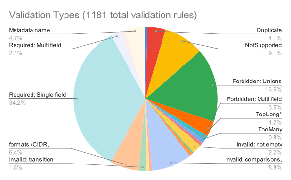
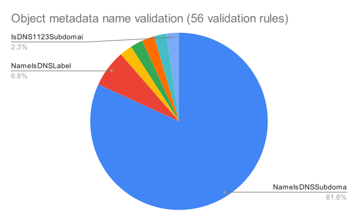
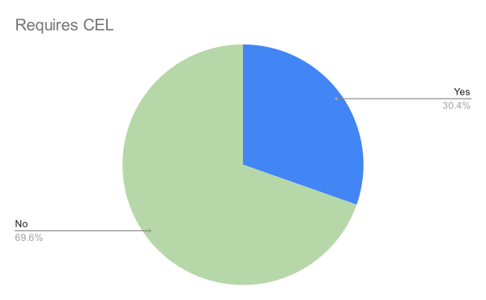

<!--
**Note:** When your KEP is complete, all of these comment blocks should be removed.

To get started with this template:

- [ ] **Pick a hosting SIG.**
  Make sure that the problem space is something the SIG is interested in taking
  up. KEPs should not be checked in without a sponsoring SIG.
- [ ] **Create an issue in kubernetes/enhancements**
  When filing an enhancement tracking issue, please make sure to complete all
  fields in that template. One of the fields asks for a link to the KEP. You
  can leave that blank until this KEP is filed, and then go back to the
  enhancement and add the link.
- [ ] **Make a copy of this template directory.**
  Copy this template into the owning SIG's directory and name it
  `NNNN-short-descriptive-title`, where `NNNN` is the issue number (with no
  leading-zero padding) assigned to your enhancement above.
- [ ] **Fill out as much of the kep.yaml file as you can.**
  At minimum, you should fill in the "Title", "Authors", "Owning-sig",
  "Status", and date-related fields.
- [ ] **Fill out this file as best you can.**
  At minimum, you should fill in the "Summary" and "Motivation" sections.
  These should be easy if you've preflighted the idea of the KEP with the
  appropriate SIG(s).
- [ ] **Create a PR for this KEP.**
  Assign it to people in the SIG who are sponsoring this process.
- [ ] **Merge early and iterate.**
  Avoid getting hung up on specific details and instead aim to get the goals of
  the KEP clarified and merged quickly. The best way to do this is to just
  start with the high-level sections and fill out details incrementally in
  subsequent PRs.

Just because a KEP is merged does not mean it is complete or approved. Any KEP
marked as `provisional` is a working document and subject to change. You can
denote sections that are under active debate as follows:

```
<<[UNRESOLVED optional short context or usernames ]>>
Stuff that is being argued.
<<[/UNRESOLVED]>>
```

When editing KEPS, aim for tightly-scoped, single-topic PRs to keep discussions
focused. If you disagree with what is already in a document, open a new PR
with suggested changes.

One KEP corresponds to one "feature" or "enhancement" for its whole lifecycle.
You do not need a new KEP to move from beta to GA, for example. If
new details emerge that belong in the KEP, edit the KEP. Once a feature has become
"implemented", major changes should get new KEPs.

The canonical place for the latest set of instructions (and the likely source
of this file) is [here](/keps/NNNN-kep-template/README.md).

**Note:** Any PRs to move a KEP to `implementable`, or significant changes once
it is marked `implementable`, must be approved by each of the KEP approvers.
If none of those approvers are still appropriate, then changes to that list
should be approved by the remaining approvers and/or the owning SIG (or
SIG Architecture for cross-cutting KEPs).
-->
# KEP-4153: Declarative Validation of Kubernetes Native Types

<!--
This is the title of your KEP. Keep it short, simple, and descriptive. A good
title can help communicate what the KEP is and should be considered as part of
any review.
-->

<!--
A table of contents is helpful for quickly jumping to sections of a KEP and for
highlighting any additional information provided beyond the standard KEP
template.

Ensure the TOC is wrapped with
  <code>&lt;!-- toc --&rt;&lt;!-- /toc --&rt;</code>
tags, and then generate with `hack/update-toc.sh`.
-->

<!-- toc -->
- [Release Signoff Checklist](#release-signoff-checklist)
- [Summary](#summary)
- [Motivation](#motivation)
  - [Goals](#goals)
  - [Non-Goals](#non-goals)
- [Proposal](#proposal)
  - [Unions](#unions)
  - [CEL Validation](#cel-validation)
  - [Formats](#formats)
  - [IDL tags](#idl-tags)
- [Analysis of existing validation rules](#analysis-of-existing-validation-rules)
  - [User Stories (Optional)](#user-stories-optional)
    - [Kubernetes developer wishes to add a field to a existing API version](#kubernetes-developer-wishes-to-add-a-field-to-a-existing-api-version)
    - [Kubernetes devekoper adds a v1beta2 version of an API](#kubernetes-devekoper-adds-a-v1beta2-version-of-an-api)
    - [User wishes to validate the YAML of a kubernetes native type as a Git pre-submit check](#user-wishes-to-validate-the-yaml-of-a-kubernetes-native-type-as-a-git-pre-submit-check)
    - [User wishes to use Kubebuilder to define a custom resource that embeds PodTemplate](#user-wishes-to-use-kubebuilder-to-define-a-custom-resource-that-embeds-podtemplate)
  - [Notes/Constraints/Caveats (Optional)](#notesconstraintscaveats-optional)
  - [Risks and Mitigations](#risks-and-mitigations)
    - [Risk: Migration to Declarative Validation introduce breaking change to API validation](#risk-migration-to-declarative-validation-introduce-breaking-change-to-api-validation)
      - [Mitigation: Ensure Invalid Objects Still Invalid](#mitigation-ensure-invalid-objects-still-invalid)
      - [Mitigation: Ensure Valid Old Objects Still Valid](#mitigation-ensure-valid-old-objects-still-valid)
    - [Risk: Reduced the fidelity of validation error messages](#risk-reduced-the-fidelity-of-validation-error-messages)
      - [Mitigation: Fallback to CEL](#mitigation-fallback-to-cel)
      - [Mitigation: Explore <code>x-kubernetes</code> extension for custom error messages](#mitigation-explore-x-kubernetes-extension-for-custom-error-messages)
    - [Risk: Added latency to API request handling.](#risk-added-latency-to-api-request-handling)
      - [Mitigation: Avoid Conversion to Internal Type](#mitigation-avoid-conversion-to-internal-type)
      - [Mitigation: Avoid Unstructured Conversion](#mitigation-avoid-unstructured-conversion)
      - [Mitigation: Use Value Validations Where Possible](#mitigation-use-value-validations-where-possible)
      - [Mitigation: Go fast paths for hot validation code paths](#mitigation-go-fast-paths-for-hot-validation-code-paths)
- [Design Details](#design-details)
  - [Improve Current Schema Quality](#improve-current-schema-quality)
    - [Publish Complex Validation Rules](#publish-complex-validation-rules)
    - [Publish Declarative Defaults in Schema](#publish-declarative-defaults-in-schema)
    - [Support Shared Template Schemas](#support-shared-template-schemas)
    - [Add missing <code>required</code> fields](#add-missing-required-fields)
    - [Zero-Valued Primitive Fields](#zero-valued-primitive-fields)
      - [Required Zero Fields](#required-zero-fields)
      - [Optional Zero Fields](#optional-zero-fields)
      - [Code Generator Solution](#code-generator-solution)
  - [Create a Library for Validation of Native Types](#create-a-library-for-validation-of-native-types)
  - [Enrichment of schemas](#enrichment-of-schemas)
    - [Unit Test Instrumentation](#unit-test-instrumentation)
      - [E2E Test Instrumentation](#e2e-test-instrumentation)
      - [Error Message Equivalence](#error-message-equivalence)
  - [Using Schemas for Validation](#using-schemas-for-validation)
    - [Request handling](#request-handling)
    - [Validation of Unstructured input or Deserialized Go Type](#validation-of-unstructured-input-or-deserialized-go-type)
  - [Deprecation of Legacy Validation](#deprecation-of-legacy-validation)
  - [Prototype Notes](#prototype-notes)
  - [Test Plan](#test-plan)
      - [Prerequisite testing updates](#prerequisite-testing-updates)
      - [Unit tests](#unit-tests)
      - [Runtime verification testing](#runtime-verification-testing)
      - [Integration tests](#integration-tests)
      - [e2e tests](#e2e-tests)
  - [Graduation Criteria](#graduation-criteria)
    - [Alpha](#alpha)
      - [<code>DeclarativeValidationExtensionsInOpenAPI</code>](#declarativevalidationextensionsinopenapi)
      - [<code>DeclarativeValidation</code>](#declarativevalidation)
    - [Beta](#beta)
      - [<code>DeclarativeValidationExtensionsInOpenAPI</code>](#declarativevalidationextensionsinopenapi-1)
      - [<code>DeclarativeValidation</code>](#declarativevalidation-1)
    - [GA](#ga)
  - [Upgrade / Downgrade Strategy](#upgrade--downgrade-strategy)
  - [Version Skew Strategy](#version-skew-strategy)
- [Production Readiness Review Questionnaire](#production-readiness-review-questionnaire)
  - [Feature Enablement and Rollback](#feature-enablement-and-rollback)
  - [Rollout, Upgrade and Rollback Planning](#rollout-upgrade-and-rollback-planning)
  - [Monitoring Requirements](#monitoring-requirements)
  - [Dependencies](#dependencies)
  - [Scalability](#scalability)
  - [Troubleshooting](#troubleshooting)
- [Implementation History](#implementation-history)
- [Drawbacks](#drawbacks)
- [Alternatives](#alternatives)
  - [Validate On Storage Type Rather than Request Type](#validate-on-storage-type-rather-than-request-type)
- [Infrastructure Needed (Optional)](#infrastructure-needed-optional)
<!-- /toc -->

## Release Signoff Checklist

<!--
**ACTION REQUIRED:** In order to merge code into a release, there must be an
issue in [kubernetes/enhancements] referencing this KEP and targeting a release
milestone **before the [Enhancement Freeze](https://git.k8s.io/sig-release/releases)
of the targeted release**.

For enhancements that make changes to code or processes/procedures in core
Kubernetes—i.e., [kubernetes/kubernetes], we require the following Release
Signoff checklist to be completed.

Check these off as they are completed for the Release Team to track. These
checklist items _must_ be updated for the enhancement to be released.
-->

Items marked with (R) are required *prior to targeting to a milestone / release*.

- [x] (R) Enhancement issue in release milestone, which links to KEP dir in [kubernetes/enhancements] (not the initial KEP PR)
- [x] (R) KEP approvers have approved the KEP status as `implementable`
- [x] (R) Design details are appropriately documented
- [x] (R) Test plan is in place, giving consideration to SIG Architecture and SIG Testing input (including test refactors)
  - [ ] e2e Tests for all Beta API Operations (endpoints)
  - [ ] (R) Ensure GA e2e tests meet requirements for [Conformance Tests](https://github.com/kubernetes/community/blob/master/contributors/devel/sig-architecture/conformance-tests.md) 
  - [ ] (R) Minimum Two Week Window for GA e2e tests to prove flake free
- [x] (R) Graduation criteria is in place
  - [ ] (R) [all GA Endpoints](https://github.com/kubernetes/community/pull/1806) must be hit by [Conformance Tests](https://github.com/kubernetes/community/blob/master/contributors/devel/sig-architecture/conformance-tests.md) 
- [x] (R) Production readiness review completed
- [x] (R) Production readiness review approved
- [ ] "Implementation History" section is up-to-date for milestone
- [ ] User-facing documentation has been created in [kubernetes/website], for publication to [kubernetes.io]
- [ ] Supporting documentation—e.g., additional design documents, links to mailing list discussions/SIG meetings, relevant PRs/issues, release notes

<!--
**Note:** This checklist is iterative and should be reviewed and updated every time this enhancement is being considered for a milestone.
-->

[kubernetes.io]: https://kubernetes.io/
[kubernetes/enhancements]: https://git.k8s.io/enhancements
[kubernetes/kubernetes]: https://git.k8s.io/kubernetes
[kubernetes/website]: https://git.k8s.io/website

## Summary

With this enhancement, Kubernetes Developers will declare validation rules using
IDL tags in the `types.go` files that to define the Kubernetes native API types.
For example:

```go
// staging/src/k8s.io/api/core/v1/types.go

// +validationRule="!self.hostNetwork || self.containers.all(c, c.containerPort.all(cp, cp.hostPort == cp.containerPort))"
type PodSpec struct {
  Containers []Container `json:...`
}

type Container struct {
  // ...

  Ports []ContainerPort `json:...`

  // ...
}

type ContainerPort struct {
  // ...

  // ...
  //
  // +minimum=1
  // +maximum=65535
  HostPort int32 `json:...`

  // ...
  //
  // +minimum=1
  // +maximum=65535
  ContainerPort int32 `json:...`

  // ...
}
```

In this example, both `+validationRule`, `+minimum` and `+maximum` are IDL tags.

The declarative validation rules will be used by the kube-apiserver to
validate API requests.

The declarative validation rules will also be included in the published OpenAPI:

```json
// Pod Spec
"openAPIV3Schema": {
  "type": "object",
  "x-kubernetes-validations": [
    {
      "rule": "!self.hostNetwork || self.containers.all(c, c.containerPort.all(cp, cp.hostPort == cp.containerPort))"
    }
  ],
}

...

// Container Port
"openAPIV3Schema": {
  "type": "object",
  "properties": {
    "hostPort": {
      "minimum": 1,
      "maximum": 65535
      ...
    }
    "containerPort": {
      "minimum": 1,
      "maximum": 65535
      ...
    }
  }
}
```

It is important to note that the declarative validation will use the same set of
validation options available today for CRDs. namely:

- [JSON Schema value validations](https://datatracker.ietf.org/doc/html/draft-bhutton-json-schema-validation-00) (e.g. `format`, `maxItems`)
- [CEL Validation Rules](https://kubernetes.io/docs/tasks/extend-kubernetes/custom-resources/custom-resource-definitions/#validation-rules) (e.g. `self.replicas <= self.maxReplicas`)
- Relevant [merge strategy declarations](https://kubernetes.io/docs/reference/using-api/server-side-apply/#merge-strategy) (e.g. `listType=set`)

## Motivation

Kubernetes API validation rules are currently written by hand, which makes them
difficult for users to access directly, review, maintain, and test.

Declarative validation will benefit Kubernetes maintainers:

- It will make it easier to develop, maintain and review APIs.
- It will make it easier programatically inspect and analyze the API, enabling
  new tools and improved documentation.
- It will enable improvements to the API machinery. For example, a feature like
  ratcheting validation will become more tractable to implement because the
  feature can be implemented once in the declarative validation subsystem
  rather than piecemeal across the 15k lines of hand written validation code.

Declarative validation will also benefit Kubernetes users:

- It will give users direct access to the most actual API validation rules, which
  are currently only available to developers willing and able to find and read
  the hand written validation rules.
- It will enable clients to perform validation of native types earlier in
  development worflows ("shift-left"), such as at with a Git pre-submit linter.
- It will improve API composition. In particular CRDs that embed native types
  (such as PodTemplate), which gain validation of the native type automatically.
  This has the potential to simplify controller development and improve end
  user experiences when using CRDs.
- Validation is performed on versioned type, so error message and attributed field
  path is more likely to be relevant to the user. (Though no known cases of misattributed field errors have yet occurred)

Please feel free to try out the
[prototype](https://github.com/jpbetz/kubernetes/blob/cel-for-native/staging/src/k8s.io/sample-apiserver/pkg/apis/wardle/validation/README.md)
to get hands on experience with this proposed enhancement.

### Goals

- Vast majority (95%+) of hand written validation are replaced with declarative
validation. The remaining hand written rules will primarily be rules that _should
not_ be published as part of the API, usually because server side state is
involved in the validation decision.

- `types.go` files become the de-facto IDL of Kubernetes for native types.
It is worthing noting that `+enum` support, `+default` support and similar
enhancements all moved our API development forward in this direction. This
enhancement is an attempt to continue that story arc.

- API Validations and Defaults are readable and manageable. The IDL should be
a joy to use for API authors, reviewers and maintainers. Common Complex 
relationships have simple-to-express idioms in the IDL.

- CRDs and native types are validated and published in OpenAPI in a consistent
and uniform way. Improvement we make to CEL to enable declarative validation of
native types will be made available to CRD authors and vis-versa.

- No change to error message structure for clients. Difference to clients is 
limited to minimal changes to error detail strings.

### Non-Goals

- It is not a goal for _all_ validation rules to be published to OpenAPI. There
  exist complex, stateful rules that should not be published in OpenAPI. These
  will remain "server side only" validation rules.
- It is not a goal to require that _all_ validation rules be written in CEL. We
  will continue to support hand written validation rules indefinitely for use
  cases that are a poor fit using the existing validation mechanism (or
  something very similar).


## Proposal

Declarative validation will be performed against versioned APIs. This differs from the hand
written validation, which is evaluated against internal types.

Go IDL tags will be added to support the following declarative validation rules:

| Type of valiation      | Go IDL tag                                                       | OpenAPI validation field                                                           | Reason Type      |
| ---------------------- | ---------------------------------------------------------------- | ---------------------------------------------------------------------------------- | ---------------- |
| string format          | `+format={format name}`                                          | `format`                                                                           | Invalid          |
| size limits            | `+min{Length,Properties,Items}`, `+max{Length,Properties,Items}` | `min{Length,Properties,Items}`, `max{Length,Properties,Items}`                     | TooMany, TooLong |
| numeric limits         | `+minimum`, `+maximum`, `+exclusiveMinimum`, `+exclusiveMaximum` | `minimum`, `maximum`, `exclusiveMinimum`, `exclusiveMaximum`                       | Invalid          |
| required fields        | `+optional` (exists today)                                       | `required`                                                                         | Required         |
| enum values            | `+enum` (exists today)                                           | `enum`                                                                             | NotSupported     |
| uniqueness             | `listType=set` (sets and map keys)                               | `x-kubernetes-list-type`                                                           | Duplicate        |
| regex matches          | `+pattern`                                                       | `pattern`                                                                          | Invalid          |
| cross field validation | `validationRule="{CEL expression}"`                              | `x-kubernetes-validations`                                                         | user specified   |
| [transition rules][1]  | `validationRule="{CEL expression using oldSelf}"`                | `x-kubernetes-validations`                                                         | user specified   |
| special case: name format | `+nameFormat={format name}`                                   | `x-kubernetes-validations` (see "format" section below for details)                | Invalid          |

Specific reason types can be customized for `x-kubernetes-validations` to 
any [supported field.Error reason](https://github.com/kubernetes/kubernetes/blob/c5a8015bbae1e1095813d8e0719f017477dc7112/staging/src/k8s.io/apimachinery/pkg/util/validation/field/errors.go#L105-L140).

xref: [Kubernetes mapping of OpenAPI value validations to response code](https://github.com/kubernetes/kubernetes/blob/7adcb3cb37084750ab572a179ba01b9878b8de5f/staging/src/k8s.io/apiextensions-apiserver/pkg/apiserver/validation/validation.go#L60)

> During development we may add syntax sugar for common idioms we identify 
> such as +immutable or +mutally_exclusive, +contextual (for unions) that desugar 
> into equivalent CEL

### Unions

Unions are informally defined but common in built-in types.

We will convert most union validation to CEL expressions. For example:

```go
// staging/src/k8s.io/api/apps/v1/types.go

type DeploymentSpec struct {
  // ...
  //
  // +minimum=0
  Replicas string `json...`
  
  // ...
  // 
  // +validationRule="!(self.type == 'Recreate') || !has(self.rollingUpdate)",message="may not be specified when strategy `type` is Recreate",reason=Forbidden,field="rollingUpdate"
  // +validationRule="!(self.type == 'RollingUpdate') || has(self.rollingUpdate)",message="this should be defaulted and never be nil",reason=Required,field="rollingUpdate"
  Strategy DeploymentStrategy `json:...`
  
  // ...
}
```

For backward compatibility with existing validations, `reason` and `field` will
be added to make it possible to declare a validation rule in CEL that matches
not just the logic of the hand written validation it replaces, but also the
exact field path and reason type.

> There has been a past KEP to add support for Unions directly to OpenAPI, but it has since been dropped ([xref](https://github.com/kubernetes/enhancements/tree/master/keps/sig-api-machinery/1027-api-unions))

### CEL Validation

CEL will play a major role in declarative validation by offering a way to
declare validation rules for use cases that are too complex to be declared using
JSON Schema value validations. Using CEL to validate APIs has been successfully
demonstrated by CRD Validation Rules, which are on track for GA in 1.28.

CEL rules will typically be placed on struct or field declarations and access
multiple fields nested below the level of the type or field where the CEL
expression is declared, e.g.:

```go
  
  //+validationRule="!self.widgetType == 'Component' || !['badname2', 'badname2'].exists(notAllowed, self.componentName.contains(notAllowed))",reason=Forbidden
  type FizzBuzzSpec struct {
    Type WidgetType `json...`
    ComponentName string `json...`
  }
```

Note that the `+validationRule` IDL tags supports multiple optional fields after the expression string. The supported fields are:

- `message`: A vailidation failure message string.
- `messageExpression`: A CEL expression that evalutes to a validation failure message string. Takes precedence over message.
- `reason`: Must be one of [Required, Forbidden, Invalid, RequestEntityTooLarge].
- `field`: A JSONPath to the sub-field that a validation failure should be attributed to.

We will need to extend our CEL libraries to make it possible to migrate all the
validation rules that exist in the Kubernetes API today.

- `isFormat() <bool>` and `validateFormat() <list<string>>` will be added to allow formats to be checked in CEL
  expression and for format violations to be reported using `messageExpression: "self.validateFormat('ipv6')"`
- IP and CIDR library:
  - `isIP(string) bool`
  - `ip(string) IP`
  - `IP.is4() bool`
  - `IP.is6() bool`
  - `IP.isLoopback() bool`
  - `isCIDR(string) bool`
  - `cidr(string) CIDR`
  - `CIDR.overlaps(CIDR) bool`
  - `CIDR.containsIP(IP) bool`
- UTF8 Library (for CRD validation, ManagedFields)
  - IsValid
  - IsPrint
  - IsControl
- Selectors
  - `Matches(LabelSelector)`

### Formats

A significant portion of all validation rules in the API check that a field
value conforms to a particular "format". A prominent example is `metadata.name`
and `metadata.generateName` validation.

We will extend the [available list of
formats](https://github.com/kubernetes/kube-openapi/blob/7fbd8d59e5b89f2ca43a5dcececbffc0bb186c37/pkg/validation/strfmt/default.go#L128)
to cover formats heavily used by the Kubernetes API, namely:

| Format                       | Primary validate uses              |
| ---------------------------- | ---------------------------------- |
| 'dns1123subdomain'           | metadata name and generateName     |
| 'dns1123label'               | metadata name and generateName     |
| 'dns1035label'               | Scoped names and keys              |

We will add all of these to the supported list of formats in kube-openapi.
We will also document all supported formats on the Kubernetes website.

Other candidate format types are:

- `APIVersion` (GroupVersion)
- [Quantity](https://github.com/kubernetes/kubernetes/blob/c5a8015bbae1e1095813d8e0719f017477dc7112/staging/src/k8s.io/apimachinery/pkg/api/resource/quantity.go#L31-L111)
- [Qualified name](https://github.com/kubernetes/kubernetes/blob/12dc19d46fb97cbbfeb1e12b8a10ff7ae73d9515/pkg/apis/core/validation/validation.go#L138-L145)
- [Fully qualified name](https://github.com/kubernetes/kubernetes/blob/c5a8015bbae1e1095813d8e0719f017477dc7112/staging/src/k8s.io/apimachinery/pkg/util/validation/validation.go#L73-L91)
- [Fully qualified domain name](https://github.com/kubernetes/kubernetes/blob/c5a8015bbae1e1095813d8e0719f017477dc7112/staging/src/k8s.io/apimachinery/pkg/util/validation/validation.go#L93-L116)
- [Label Value](https://github.com/kubernetes/kubernetes/blob/c5a8015bbae1e1095813d8e0719f017477dc7112/staging/src/k8s.io/apimachinery/pkg/util/validation/validation.go#L164-L176)
- Integer (as opposed to any floating point)

> Until CRD Validation Ratcheting is stable, these formats will be translated into an inline schema containing either the regex pattern or the CEL expression for the format.
> Related Note: k8s also supports unused formats that should be removed over time: https://github.com/kubernetes/kubernetes/issues/97733

### IDL tags

IDL tags may be used directly on type declarations and indirectly on field and
type aliases. For example:

```go
type Widget struct {
  // +validationRule="self.matches('[a-z][1-9]+')"
  Component PartId `json...`
}

// +maxLength=20
type PartId = Identifier

// +format=dns1123label
type Identifier string

type Contraption struct {
  Component Identifier `json...`
}
```

In the above example, the `widget.component` field is validated against all three
IDL tags. But `contraption.component` is only validated against `+format=dns1123label`.

Shared types present a challenge. For example, different Kubernetes resources
have different validation rules for `metadata.name` and `metadata.generateName`.
But all resources share the `ObjectMeta` type.

We can support these uses cases with CEL validation rules:

```go
type ExampleSpec struct {

  // +validationRule="!has(self.name) || self.name.isFormat('dns1123subdomain')",field="name"
  // +validationRule="!has(self.generateName) || self.generateName.replace('-$', 'a').isFormat('dns1123subdomain')",field="generateName"
  metav1.ObjectMeta `json...`
}
```

Because the above use case is so common, we plan to offer a special tag to make
declaring the above rules convenient:

```go
// +nameFormat='dns1123subdomain'
metav1.ObjectMeta `json...`
```

Another example: Pod `container` and `initContainer` fields share the same
`Container` type but have different validation rules. The rules that are the
same for both can be declared on `Container` but any rules that are different
can be declared on the `container` and `initContainer` fields using CEL. E.g.:

```go
// +validationRule="!has(self.RestartPolicy)"
Containers []Container `json...`
```

## Analysis of existing validation rules

At the time of writing this document, there are 1181 validation rules written in about
15k lines of go code in [kubernetes/kubernetes/pkg/apis](https://github.com/kubernetes/kubernetes/commit/0c62b122c02bff9131b6db960042150a3638d3f3).

Roughly 30% of validation rules may require CEL expressions. 15% of these are
forbidden rules which primarily check which fields are allowed when a union
discriminator is set. 10% are object name validations, and the remaining 10% are
cross field validation checks, mainly mutual exclusion and some "transition
rules" (e.g. immutability checks).

The remaining 70% of validation rules can be represented using JSON Schema value
validations. `optional`, `format` and `enum` will the the most frequently used.







### User Stories (Optional)

<!--
Detail the things that people will be able to do if this KEP is implemented.
Include as much detail as possible so that people can understand the "how" of
the system. The goal here is to make this feel real for users without getting
bogged down.
-->

#### Kubernetes developer wishes to add a field to a existing API version

1. Developer add the field to the Go struct
2. Developer adds needed IDL tags to Go struct
3. Developer adds validation_test.go cases (same as today)
4. API reviewers review IDL tags along with Go struct change

#### Kubernetes devekoper adds a v1beta2 version of an API

1. Develop copies over v1beta1 API and creates v1beta2
2. Linter verifies that IDL tags match for both version of API (unless
   exceptions are put in exception file)
3. API reviewer can review change knowing that validation is consistent unless
   there are lines added to exception file

#### User wishes to validate the YAML of a kubernetes native type as a Git pre-submit check

1. OpenAPI of native types is downloaded from kube-apiserver
2. Tool that checks YAML against OpenAPI schema is used to validate YAML in a
   Git pre-submit (there are tools being written now that will also handle
   x-kubernetes-validations)

#### User wishes to use Kubebuilder to define a custom resource that embeds PodTemplate

1. Go struct that declares custom resource references the go struct of v1.PodTemplate.
2. Kubebuilder recognizes the Go IDL tags introduced by this KEP (Note that
   Kubebuidler already has IDL tags:
   https://book.kubebuilder.io/reference/markers/crd-validation.html, but they
   are different than what we propose here)
3. Kubebuilder generates appropriate OpenAPI for the CRD resulting in full
   validation of the PodTemplate

### Notes/Constraints/Caveats (Optional)

<!--
What are the caveats to the proposal?
What are some important details that didn't come across above?
Go in to as much detail as necessary here.
This might be a good place to talk about core concepts and how they relate.
-->

### Risks and Mitigations

#### Risk: Migration to Declarative Validation introduce breaking change to API validation
##### Mitigation: Ensure Invalid Objects Still Invalid

Objects which previously did not pass validation must still not pass validation.
This can be restated simply as: all currently handwritten validations must be
included in the schema. If all validations are in the schema, it follows that the
schema will reject the same set of objects as before.

We can mitigate this by:

1. All Validation Tests Have 100% Coverage
2. All Validation Tests Succeed against native and schema-based validation backends

To accomplish this, we will:

1. New Presubmit Verify Script to Ensure 100% for future tests
2. A General Validation Test Framework - Most tests are already written declaratively,
we will refactor them to all use a general framework for validation tests. The
framework will evaluate the validation test case first on native types, then convert
the case to each supported version of the kind to ensure the error arises also
from schema-based validation. The framework will have a way to make exceptions 
for certain errors which are version-specific.
3. Refactor all `validation_tests.go` unit tests to have 100% coverage of their 
respective `validation.go` files as well as make use of the validation test framework.

##### Mitigation: Ensure Valid Old Objects Still Valid

Objects which previously passed validation must still pass validation. For our
purposes this can be thought of as ensuring the schema-based validation does not
raise new errors which previously did not exist.

It is not possible to be 100% sure of this property, in fact, there may be
new validations added to patch bugs in existing ones. But we can mitigate this 
risk:

1. Catch and fix any significant differences in schema validations
  
  During alpha and beta phases, we will run both validation systems in parallel
  and return the errors from the old system to the user. We will report in logs
  and metrics the differences. Over time we will reduce the number of reported
  differences to zero as these issues are caught.

  To help catch these errors faster, we will also refactor all e2e tests to 
  enable this feature and check for validation error differences.

2. Minimize the impact of any new changes introduced

  As a precondition of this KEP graduating to GA, the feature 
  `CRD Validation Ratcheting` must also reach GA. Validation Ratcheting would
  reduce impact to users by allowing any new schema validations errors due to
  this feature to be ignored for unchanged portions of an object.


#### Risk: Reduced the fidelity of validation error messages
  
OpenAPI value validations do not offer a way to specify an exact message or
a reason type. It is also possible some of the more general api errors have error 
messages that contain context not found in OpenAPI Error.

##### Mitigation: Fallback to CEL

For cases where the potentially lost error message context must be retained,
we can instead encode the rule as a CEL rule which allows for arbitrary error
strings.

##### Mitigation: Explore `x-kubernetes` extension for custom error messages

An option to consider to all custom error messages to schema-based value 
validations if we see that we really need it is to introduce a new extension:
`x-kubernetes-validation-errors` which maps schema validation fields to
a custom error message for failing that field's validation:

```yaml
minLength: 0
x-kubernetes-validation-errors:
  minLength:
    message: "this custom error message shows when violating minLength rather than default message"
    reason: Invalid
```

#### Risk: Added latency to API request handling.

The design decision to declaratively validate API versions has performance
implications.

Today, the apiserver's request handler decodes incoming versioned API requests
to the versioned type and then immediately performs an "unsafe" conversion to
the internal type when possible. All subsequent request processing uses the
internal type as the "hub" type. Validation is written for the internal
type and so are per-resource strategies.

With this change, the internal type will no longer be responsible for
validation.

If we were to convert from the internal back to the version of the API request
for validation, we would introduce one additional conversion. If we make this
an "unsafe" conversion, than is will be low cost for the vast majority of requests.

We will benchmark this approach and plan to use it for alpha.

Long term, we could do better:

Since the internal type will no longer be used for validation, it becomes a lot
less important. It is still important to have a hub type. But why not pick one
of the versioned types to be the hub type? The vast majority of APIs only have
one version anyway. The obvious candidate version to choose for the hub version
would the perferred storage version.

Switching to a versioned type for the hub type would have a few implications:

- We would eliminate the need for internal versions.
- We would reduce the need for "unsafe" conversions (a small security win) since
  most APIs only have a single v1 version and so the entire request handling process
  would simply use that version.
- We would introduce more conversion when API request version differs from the
  hub version. But beta APIs are off-by-default and we expect a lot less mixed
  version API usage than in the past.

This "hub version" change feels like something that could be made somewhat
independent of this KEP.


##### Mitigation: Avoid Conversion to Internal Type

Requests are received as the versioned type, so it should be feasible to avoid
extra conversions for resources that have no need of handwritten validations.

##### Mitigation: Avoid Unstructured Conversion

SMD's [value](https://github.com/kubernetes-sigs/structured-merge-diff/tree/master/value)
wrappers have already been benchmarked and shown to have low overhead.

##### Mitigation: Use Value Validations Where Possible

Most validations will be possible to evaluate with simple value validations
in native OpenAPI (required checks, enum value checks, etc). The rest are
CEL expressions which are expected to account for 30% of all validation rule.

CEL evaluation is relatively efficient we will gather detailed benchmarks baselined against native types to demonstrate this.

##### Mitigation: Go fast paths for hot validation code paths

If CEL becomes a bottleneck, we may explore possibilities to run Go rather than
interpreted CEL behind the scenes for certain hot code paths:
  - Generate Go code from CEL expressions.
  - Hand write validation code for select validations and call those
    directly (or from CEL).

## Design Details

### Improve Current Schema Quality

1. Add declarative defaulting support to OpenAPI code generator
1. OpenAPI Gen Enhancements
  - Add IDL tags for all possible types of validations. Similar to [kubebuilder crd markers](https://kubebuilder.io/reference/markers/crd-validation)
  - Overridable defaults and validations of a reusable type
  - Populate defaults for types defaulted to implicit zero
  - Populate non-empty constraints for required fields
  - Declarative Defaults to Constants
  - IDL tags for common complex relationships we deem worthy (+immutable, +mutually_exclusive, +contextual)
1. Introduce Feature Flag: `DeclarativeValidationExtensionsInOpenAPI` to expose
  new extensions added to the schema.
  - `x-kubernetes-validations`. This field is published already for CRDs, so 
    most clients should already be aware of handling it.
      - Must support multi-line expression entry, and multiple lines for reason, 
        code, fieldpath of a single rule. Retaining whitespace is NOT a requirement.
        May use `"""` or possibly explore Go-style multiline string literal.
   - `x-kubernetes-errors`: Mapping of OpenAPI V3 schema fields to custom error 
   messages
   - `x-kubernetes-strip-zero`: Informs consumers of the schema that the object
   should be considered strip-zero if it takes on the given value
2. Introduce new [CEL libraries](#cel-validation) that will be needed to verify native schemas.

#### Publish Complex Validation Rules

Until now most validation rules have not been included in the schema, since
they are not expressible using OpenAPI's format.

Now that Kubernetes has GA support for CEL in CRDs, it makes sense to use the
same feature to express rules for native types.

#### Publish Declarative Defaults in Schema

A consumer of a schema cannot fully take advantage of the schema for validation
or linting purposes unless the can ably populate defaults. Many of our defaults
are stored in constants. 

We will add features to our code generation tools to refer to symbolic constants
from `+default` annotations, and populate OpenAPI with a higher proportion of our
defaults.

A list of existing differences between handwritten and schema-populated defaults 
can be found [here](https://github.com/kubernetes/kubernetes/issues/119766).

#### Support Shared Template Schemas

Reusable template types pose a challenging problem since depending
upon their usage they may have different defaults or validation constraints
for multiple fields. This is not supported by our OpenAPI code generators.

One example is `core.v1.PersistentVolume.Spec.Capacity`. When used in a
regular `PersistentVolume` this field is required and cannot be empty. 
However, when used `inline` as a template, `Capacity` is no longer required.

To address this we will need additional marker comments

We will need to add the ability for fields that re-use a type to specify a
field-level for its nested fields. Kube-openapi gen will inline the custom 
definition.

#### Add missing `required` fields

Our `kube-openapi` code generator adds to the schema's required fields
any field that is not labelled with `+optional` or `omitempty` JSON tag:

```go
type Container struct {
	// Name of the container specified as a DNS_LABEL.
	// Each container in a pod must have a unique name (DNS_LABEL).
	// Cannot be updated.
	Name string `json:"name" protobuf:"bytes,1,opt,name=name"`
  ...
}
```

```json
  "io.k8s.api.core.v1.Container": {
    "type": "object",
    "description": "A single application container that you want to run within a pod.",
    "required": [
      "name"
    ],
    "properties": {
      ....
      "name": {
        "default": "",
        "description": "Name of the container specified as a DNS_LABEL. Each container in a pod must have a unique name (DNS_LABEL). Cannot be updated.",
        "type": "string"
      },
      ....
    },
  }
```

But there are examples in our API where a required field is `omitempty`:

```go
type Rule struct {
	// APIGroups is the API groups the resources belong to. '*' is all groups.
	// If '*' is present, the length of the slice must be one.
	// Required.
	// +listType=atomic
	APIGroups []string `json:"apiGroups,omitempty" protobuf:"bytes,1,rep,name=apiGroups"`

  ...
}
```

These fields are not included in the `required` list.  To fix this, we can simply
add a `+required` field. All fields without `+required` or `+optional` explicitly
will use `omitempty` to infer default behavior as it does today.

#### Zero-Valued Primitive Fields

Serialization to Go can impact declarative validation, which interprets the 
resource as an untyped JSON object, respecting go tags. Specifically zero is
often considered to be the same as `unspecified`.

Unless the fact that zero values are considered to be unset is captured in the 
schema:

1. We won't be able to accurately capture the Go validations into CEL or 
JSONSchema, or they will be buggy
2. CRDs and native types with the same schema will not have the same validation
behavior. Downstream clients of the schema such as kubectl-validate and 
ValidatingAdmissionPolicy will trip over this.

##### Required Zero Fields

For `required` fields that are not labelled as a pointer, we check them by
checking if their value is the empty value:

`v1.Container.Name` is such an example:

```go
	namePath := path.Child("name")
	if len(ctr.Name) == 0 {
		allErrs = append(allErrs, field.Required(namePath, ""))
	} else {
		allErrs = append(allErrs, ValidateDNS1123Label(ctr.Name, namePath)...)
	}
```

`apiregistration/v1.RuleWithOperations.APIGroups` is such an example:

```go
	if len(rule.APIGroups) == 0 {
		allErrors = append(allErrors, field.Required(fldPath.Child("apiGroups"), ""))
	}
```

This makes not only `unspecified` throw a required field error, but `""` strings, `[]` 
slices, and `{}` maps.  The schema for all required fields must be 
updated to reflect that zero is considered unspecified.

| Type   | Annotation                                         |
|--------|----------------------------------------------------|
| string | `x-kubernetes-strip-zero: true`                    |
| int    | `x-kubernetes-strip-zero: true`                    |
| float   | `x-kubernetes-strip-zero: true`                    |
| slice  | `x-kubernetes-strip-zero: true`                    |
| map    | `x-kubernetes-strip-zero: true`                    |
| pointer| N/A (codegen forces optional)                      |
| struct | N/A (codegen forces optional with `default: {}`)   |


One alternative approach would be to set `minimum`, `minLength`, etc. on necessary
types. That approach has the drawback that the error messages will no longer say 
the field was required but instead that the minimum was not met. Additionally,
`x-kubernetes-strip-zero: true` more directly expresses that empty is 
considered unset, and is also needed to solve a similar problem for `omitempty`
fields.

##### Optional Zero Fields

Consider the following omitempty non-pointer field from `DeploymentSpec`:

```go
type DeploymentSpec struct {
  ...

  Paused bool `json:"paused,omitempty"`

  ...
}
```

K8s 1.28 and below represents this field with the spec:

```json
{
  ...
  "properties": {
    ...
    "paused": {
      "type": "boolean"
    }
    ...
  }
}
```

`Paused` implicitly defaults in Go to `false`.

This would surface as:
1. `has(self.paused)` in CEL on the Container object always returns `false` if
that value is `false`. But a CRD with identical schema would return `true`.
A proof of concept example of how this bug could bite users of ValidatingAdmissionPolicy 
is [here](https://github.com/kubernetes/kubernetes/pull/120244).
2. CEL and JSONSchema Validations of the field if they exist also will not run.
This is a concern if empty values do not match the schema.

For optional fields this can be solved by annotating all non-pointer fields with 
`x-kubernetes-strip-zero: true`.

Optional fields for which the implicit default is treated as a set value should
add a `+default=` annotation to their empty value. This will give better 
ergonomics in CEL for fields like `Paused`

An exhaustive list of all 730 omit-empty non-pointer is [found here](https://gist.github.com/alexzielenski/05f594f3974aec9b3e74620b8dc7dde1). Struct types already have their
defaults populated with the go zero value, so they are excluded from this list.

##### Code Generator Solution

A conservative change we can apply to the code generator would be to automatically
annotate `x-kubernetes-strip-zero: true` to all non-pointer fields.

Fields for which the implicit default is considered a set value can also add a 
`+default` marker to express it explicitly over time, but it is not required to 
correct the difference in native types vs CRDs. Defaulting should occur after 
zero values are stripped, so fields with both should have zero and nulls defaulted
correctly.

### Create a Library for Validation of Native Types

We will need a library that provides a function similar to `Validate(schema, object, oldObject) error`.

One might suggest to use the existing CRD validation logic for native types.
There are quite a few reasons not to:

1. `spec.Schema` uses refs, and is possibly (self and/or mutually) recursive (e.g.: JSON, JSONSchemaProps). Not all native schemas are convertible to the structural schema 
type used by CRD validation code path. 

2. Native types are validated directly, and CRDs are validated as unstructured.
We'd like to avoid losing too much performance to declarative validation. It
would be very expensive to convert every object to unstructured for validation.

3. CEL validations in existing CRD validations do not work under quantifiers
such as `allOf`, `anyOf`, `oneOf`. This restriction is to avoid modifying the
existing schema validation logic to support CEL validation. This can be worked
around for now with CEL rules higher in the schema, but it would be a nice win 
for users if they could intermingle CEL with schema validations in the JSONSchema structure.

4. The `kube-openapi` openapi validation code is full of questionable third party
code which is not ideal to depend on for the future. It is difficult to extend such as for [KEP-4008: CRD Validation Ratcheting](https://kep.k8s.io/4008). To change it
to work for types other than `unstructured` without changing its behavior does 
not seem trivial.

To avoid duplicating code, we would like the validation system used for native
types to be used also by CRDs. If not immediately, then it should be possible
eventually.

To that end, given the constraints above, we will:

1. Adapt existing CRD validation code to be performed against a common schema 
and value interface. We will re-use the one already employed by CEL for the same purpose of unifying native and CRD schema code.
2. Create a version of the `kube-openapi` swagger validator that operates on
`structured-merge-diff`'s benchmarked `value.Value` interface used by Server-Side-Apply
`value.Value` can be constructed from both native types and `unstructured`. In the best case we can re-use the same instance and perform validation with 0 conversions.

After doing so, we are able to use the same code to efficiently validate both
CRDs and native types.

### Enrichment of schemas
 
Before enriching schemas, we must create a framework for validation tests 
that runs both native and schema validators and compares the results.

Once we have a framework we will publish a tracking issue with an example of a group-version being annotated and instrumented with the framework. The issue
will also include a guide for contributors to:
1. Add declarative validation rules using [Go IDL tags](#proposal).
1. Instrument validation_test.go unit tests to ensure declarative
  and handwritten validation produce the same errors, and have
  complete coverage of handwritten validation code.
1. Instrument e2e testing to catch errors in declarative validation errors
1. Report issues if they come up

#### Unit Test Instrumentation

To gain confidence that all existing validations are performed within the schema,
we will add:

1. A verify script that ensures `validation_test.go` code coverage of 
  `validation.go` for all resources is equal to a value specified in a file 
  committed to the repository so we may ratched coverage upwards over time.
2. A resource testing framework general enough to be used for all resource's
validation tests, as well as make possible exceptions for errors which only
occur in specific versions of a type. The framework will validate the test case
against all versions and both handwritten and schema backends.

Over time we will instrument all resources to use the framework and increase 
coverage to as close to 100% as possible for all resources.

##### E2E Test Instrumentation

To assist in finding discrepencies in errors faster, we will add method of running
all e2e tests with Declarative Validation enabled to flag discrepencies in errors
triggered by the e2e testing suite.

##### Error Message Equivalence

Some error messages will be phrased differently but preserve the same semantic
meaning when converted to the declarative validation system. For our testing to
check if errors are changed we have two options:

1. Write trusted regexes to match equivalence that work pretty well but have no guarantee of being complete. 
  
    We may choose to do this for cases where the probability of false equivalence
is near-zero. e.g. `field.Required(fldPath, "")` might have a slightly difference 
error from the standard openapi `required`, but they should be seen as equivalent.
2. For any other API field that might have a changed error message, we note the 
pairing in an exception file somewhere reachable from the comparison code.

### Using Schemas for Validation

Once a critical mass of original resources have been annotated, and we have
confidence in our tool, we will begin to use the schemas for validation:
1. New Feature Flag `DeclarativeValidation`
  - Enables validation through schemas generated from the IDL tags
  - Enables populating defaults from their values in the schemas
  - Logs differences between native and schema-validation in an easily accessible way
  - Only applies to resources (or groupversions, TBD) marked as supporting declarative validation
2. Instrumentation of e2e tests - Instrument e2e tests with a method to run with
declarative-validation enabled, and track all errors raised. This will help us
ensure that support is complete before moving forward.

#### Request handling

Write requests are decoded, converted to internal, processed by any mutating admission
plugins, processed before any create handlers, validated, then converted to the storage
version and stored.

Our plan:

- Early Alphas:  If feature flag is set, convert from internal back to versioned
  type (via unsafe where possible) for declarative validation. Because all CEL
  evaluation is currently written for unstructured values, we will convert to
  unstructured before declarative validation.
- Before graduation to Beta: Benchmark performance. Decide if we should invest
  in the "Switch hub version to be an API version" idea proposed in the
  performance risk section of this KEP. Also decide if we should invest in using
  using SMD value wrappers to avoid conversion to unstructured.

#### Validation of Unstructured input or Deserialized Go Type

Rather than validate directly on the unstructured JSON/YAML input, before validation we must deserialize the object into its Go type first.

We must validate after declarative and handwritten defaults, mutating admission, 
and other mutations are performed on a request object by the APIServer before 
the object is validated. It would be a large refactor to remove all Go type 
serialization from the APIServer request path. To do so is a non-goal of this KEP.

Declarative Validation will be performed upon an unstructured representation or 
view into the deserialized Go type, and not directly on user input.

### Deprecation of Legacy Validation

1. After DeclarativeValidation reaches GA and becomes default
3. Deprecation of Legacy Validation is Announced
4. ...Deprecation wait period passes...
5. Legacy validation code that is being validated declaratively can safely be deleted

### Prototype Notes

The core changes proposed here can be implemented with only a small set of code
changes. A working
[prototype](https://github.com/jpbetz/kubernetes/blob/cel-for-native/staging/src/k8s.io/sample-apiserver/pkg/apis/wardle/validation/README.md)
was built quite quickly by leveraging code that was merged recently as part of
other CEL work. The main changes were:

- Extend kube-openapi to add the needed Go tag support (Draft PR:
  https://github.com/kubernetes/kube-openapi/pull/381)
- Reuse the same validator as used today for CRDs, but generalize it to work with native types
  - This was be done by leveraging
    https://github.com/kubernetes/kubernetes/pull/113312 and
    https://github.com/kubernetes/kubernetes/pull/116267 to handle the
    resolution and conversion of native type schemas

### Test Plan

<!--
**Note:** *Not required until targeted at a release.*
The goal is to ensure that we don't accept enhancements with inadequate testing.

All code is expected to have adequate tests (eventually with coverage
expectations). Please adhere to the [Kubernetes testing guidelines][testing-guidelines]
when drafting this test plan.

[testing-guidelines]: https://git.k8s.io/community/contributors/devel/sig-testing/testing.md
-->

[x] I/we understand the owners of the involved components may require updates to
existing tests to make this code solid enough prior to committing the changes necessary
to implement this enhancement.

##### Prerequisite testing updates

<!--
Based on reviewers feedback describe what additional tests need to be added prior
implementing this enhancement to ensure the enhancements have also solid foundations.
-->
None

##### Unit tests

<!--
In principle every added code should have complete unit test coverage, so providing
the exact set of tests will not bring additional value.
However, if complete unit test coverage is not possible, explain the reason of it
together with explanation why this is acceptable.
-->

<!--
Additionally, for Alpha try to enumerate the core package you will be touching
to implement this enhancement and provide the current unit coverage for those
in the form of:
- <package>: <date> - <current test coverage>
The data can be easily read from:
https://testgrid.k8s.io/sig-testing-canaries#ci-kubernetes-coverage-unit

This can inform certain test coverage improvements that we want to do before
extending the production code to implement this enhancement.
-->

See [Unit Test Instrumentation](#unit-test-instrumentation) for unit testing plan.

- `k8s.io/apiserver/pkg/cel/openapi`: `10/02/2023` - `84.8`
- `k8s.io/apiserver/pkg/cel/library`: `10/02/2023` - `69`
- `k8s.io/apiextensions-apiserver/pkg/apiserver/schema/cel/model`: `10/02/2023` - `83.3`

##### Runtime verification testing

In addition to unit and fuzz tests, we will offer a means of running declarative validation in a "shadow mode"
such that the presence of mismatches between declarative validation and hand written validation can
be safely checked against production workloads.

When a `DeclarativeValidationShadowMetrics` feature gate is enabled, the following will be collected for each validation operation:

A. Errors from running all hand written validation
B. Errors from running only hand written validation for non-converted validations (using validation opts)
C. Errors from running declarative validation

This data will be used to check if A-B == C. That is, the declarative validation errors should be equivalent to the errors that hand written validation produces for all validation that has been converted to declarative.

If the errors do not match, a 'declarative-validation-mismatch' metric will be incremented and information
about the mismatch will be written to the apiserver's logs.

This can then be used to minimize risk when rolling out Declarative Validation in production, by following these steps:
- Enable `DeclarativeValidationShadowMetrics`
- Soak for a desired duration across some number of clusters
- Check the metrics to ensure no mismatches have been found

##### Integration tests

<!--
This question should be filled when targeting a release.
For Alpha, describe what tests will be added to ensure proper quality of the enhancement.

For Beta and GA, add links to added tests together with links to k8s-triage for those tests:
https://storage.googleapis.com/k8s-triage/index.html
-->
We will have tests to ensure that a validator can be successfully created for 
each resource type's schema, and a valid object can be successfully validated
for each resource type against its schema.

<!-- - <test>: <link to test coverage> -->

##### e2e tests

<!--
This question should be filled when targeting a release.
For Alpha, describe what tests will be added to ensure proper quality of the enhancement.

For Beta and GA, add links to added tests together with links to k8s-triage for those tests:
https://storage.googleapis.com/k8s-triage/index.html

We expect no non-infra related flakes in the last month as a GA graduation criteria.
-->

We will instrument as many e2e tests as possible to be able to use the feature
gating, cross checking and logging of declarative validation and legacy 
validation. Any differences should result in a test failure. We may be able to 
produce a report via k8s CI after running all e2e tests with the feature 
enabled showing validation differences.

### Graduation Criteria

<!--
**Note:** *Not required until targeted at a release.*

Define graduation milestones.

These may be defined in terms of API maturity, [feature gate] graduations, or as
something else. The KEP should keep this high-level with a focus on what
signals will be looked at to determine graduation.

Consider the following in developing the graduation criteria for this enhancement:
- [Maturity levels (`alpha`, `beta`, `stable`)][maturity-levels]
- [Feature gate][feature gate] lifecycle
- [Deprecation policy][deprecation-policy]

Clearly define what graduation means by either linking to the [API doc
definition](https://kubernetes.io/docs/concepts/overview/kubernetes-api/#api-versioning)
or by redefining what graduation means.

In general we try to use the same stages (alpha, beta, GA), regardless of how the
functionality is accessed.

[feature gate]: https://git.k8s.io/community/contributors/devel/sig-architecture/feature-gates.md
[maturity-levels]: https://git.k8s.io/community/contributors/devel/sig-architecture/api_changes.md#alpha-beta-and-stable-versions
[deprecation-policy]: https://kubernetes.io/docs/reference/using-api/deprecation-policy/

Below are some examples to consider, in addition to the aforementioned [maturity levels][maturity-levels].

#### Alpha

- Feature implemented behind a feature flag
- Initial e2e tests completed and enabled

#### Beta

- Gather feedback from developers and surveys
- Complete features A, B, C
- Additional tests are in Testgrid and linked in KEP

#### GA

- N examples of real-world usage
- N installs
- More rigorous forms of testing—e.g., downgrade tests and scalability tests
- Allowing time for feedback

**Note:** Generally we also wait at least two releases between beta and
GA/stable, because there's no opportunity for user feedback, or even bug reports,
in back-to-back releases.

**For non-optional features moving to GA, the graduation criteria must include
[conformance tests].**

[conformance tests]: https://git.k8s.io/community/contributors/devel/sig-architecture/conformance-tests.md

#### Deprecation

- Announce deprecation and support policy of the existing flag
- Two versions passed since introducing the functionality that deprecates the flag (to address version skew)
- Address feedback on usage/changed behavior, provided on GitHub issues
- Deprecate the flag
-->
#### Alpha

##### `DeclarativeValidationExtensionsInOpenAPI` 

- Code generator supports OpenAPI IDL tags
- `x-kubernetes-validations` populated by openapi-gen from IDL tag
- x-kubernetes-validations stripped if flag not enabled
- Unit tests
- Enablement/Disablement tests

##### `DeclarativeValidation`

- Validation of Native Objects is performed for enabled resources and differences are logged
- Validation Library based on `common.Schema`
- Validation Library Unit tests
- Enablement/Disablement tests
- Initial e2e tests completed and enabled

#### Beta

##### `DeclarativeValidationExtensionsInOpenAPI` 
- `x-kubernetes-strip-zero` and `x-kubernetes-errors` support added, or solution to
problems they intend to solve found.

##### `DeclarativeValidation`
- Have annotated and enabled declarative validation for all native groupversions
- Have instrumented annotated resources validation unit tests to run against versioned schema.

#### GA

- Have instrumented all annotated resources validation unit tests to run against versioned schema.
- All Unit and Integration tests pass with no errors or only well-understood 
  exceptional errors sourced from a file in the repository

### Upgrade / Downgrade Strategy

<!--
If applicable, how will the component be upgraded and downgraded? Make sure
this is in the test plan.

Consider the following in developing an upgrade/downgrade strategy for this
enhancement:
- What changes (in invocations, configurations, API use, etc.) is an existing
  cluster required to make on upgrade, in order to maintain previous behavior?
- What changes (in invocations, configurations, API use, etc.) is an existing
  cluster required to make on upgrade, in order to make use of the enhancement?
-->

For the introduction of new formats in CRDs:

Today, [supported formats](https://github.com/kubernetes/kubernetes/blob/master/staging/src/k8s.io/apiextensions-apiserver/pkg/apiserver/validation/formats.go) is used strip out unsupported
formats when used in older version of the kube-apiserver. We will extend this to have
two lists:  `supported` and `storage`.  All new formats will be added to `storage` for
at least one minor release of Kubernetes before the format is added to `supported` so
that any usages of the new formats written to CRDs downgrade safely.

### Version Skew Strategy

<!--
If applicable, how will the component handle version skew with other
components? What are the guarantees? Make sure this is in the test plan.

Consider the following in developing a version skew strategy for this
enhancement:
- Does this enhancement involve coordinating behavior in the control plane and
  in the kubelet? How does an n-2 kubelet without this feature available behave
  when this feature is used?
- Will any other components on the node change? For example, changes to CSI,
  CRI or CNI may require updating that component before the kubelet.
-->
This change does not affect any communications going out of the apiserver.
This change may affect the validation codepath used for mutating client requests.

Due to this change we may choose to support additional `format` strings in schemas.
To mitigate risk from this and possible other new validations added we 
will implement validation ratcheting on the validation of the native types, 
similar as is done for CRDS in [KEP-4008](https://kep.k8s.io/4008). This would
ensure old values that fail new validation strategies will remain validating. 

New values written passing the new validation system should be expected also to
pass the old validation: we do not expect to loosen any validation rules, though
a few may be tightened.

## Production Readiness Review Questionnaire

<!--

Production readiness reviews are intended to ensure that features merging into
Kubernetes are observable, scalable and supportable; can be safely operated in
production environments, and can be disabled or rolled back in the event they
cause increased failures in production. See more in the PRR KEP at
https://git.k8s.io/enhancements/keps/sig-architecture/1194-prod-readiness.

The production readiness review questionnaire must be completed and approved
for the KEP to move to `implementable` status and be included in the release.

In some cases, the questions below should also have answers in `kep.yaml`. This
is to enable automation to verify the presence of the review, and to reduce review
burden and latency.

The KEP must have a approver from the
[`prod-readiness-approvers`](http://git.k8s.io/enhancements/OWNERS_ALIASES)
team. Please reach out on the
[#prod-readiness](https://kubernetes.slack.com/archives/CPNHUMN74) channel if
you need any help or guidance.
-->

### Feature Enablement and Rollback

<!--
This section must be completed when targeting alpha to a release.
-->

###### How can this feature be enabled / disabled in a live cluster?

<!--
Pick one of these and delete the rest.

Documentation is available on [feature gate lifecycle] and expectations, as
well as the [existing list] of feature gates.

[feature gate lifecycle]: https://git.k8s.io/community/contributors/devel/sig-architecture/feature-gates.md
[existing list]: https://kubernetes.io/docs/reference/command-line-tools-reference/feature-gates/
-->

- [x] Feature gate (also fill in values in `kep.yaml`)
  - Feature gate name: DeclarativeValidation, DeclarativeValidationExtensionsInOpenAPI
  - Components depending on the feature gate: kube-apiserver
- [ ] Other
  - Describe the mechanism:
  - Will enabling / disabling the feature require downtime of the control
    plane?
  - Will enabling / disabling the feature require downtime or reprovisioning
    of a node? (Do not assume `Dynamic Kubelet Config` feature is enabled).

###### Does enabling the feature change any default behavior?

<!--
Any change of default behavior may be surprising to users or break existing
automations, so be extremely careful here.
-->

- `DeclarativeValidationExtensionsInOpenAPI`
  
  Exposes new `x-kubernetes` extensions proposed by this KEP in the OpenAPI schema
  for native types.

- `DeclarativeValidation`
  - Alpha: Runs both declarative and native validation. Returns native 
    validations to user. Report differences in validations in logs and metrics
  - Alpha: Runs both declarative and native validation. Returns native 
    validations to user. Report differences in validations in logs and metrics
  - GA: Uses schema based validation for user errors. Legacy validations removed over time.

###### Can the feature be disabled once it has been enabled (i.e. can we roll back the enablement)?

<!--
Describe the consequences on existing workloads (e.g., if this is a runtime
feature, can it break the existing applications?).

Feature gates are typically disabled by setting the flag to `false` and
restarting the component. No other changes should be necessary to disable the
feature.

NOTE: Also set `disable-supported` to `true` or `false` in `kep.yaml`.
-->

- DeclarativeValidationExtensionsInOpenAPI: Yes, this feature only changes
    published OpenAPI schema and does not affect rollbacks.
- DeclarativeValidation: 
  - Alpha: Native Validations are still used to decide whether objects are 
    persisted to storage
  - Beta & GA: Since validation is used to persist objects to storage, if there was a
    mistake and it permits objects that should not be persisted, rollback
    may be impacted by preventing updates on that object until the error is fixed.

###### What happens if we reenable the feature if it was previously rolled back?

- DeclarativeValidationExtensionsInOpenAPI: Yes, this feature only changes
    published OpenAPI schema and does not affect rollbacks.
- DeclarativeValidation: If the port to declarative validation is not accurate,
    during an update, old parts of an object may be seen as invalid and need
    to be ratcheted.

###### Are there any tests for feature enablement/disablement?

<!--
The e2e framework does not currently support enabling or disabling feature
gates. However, unit tests in each component dealing with managing data, created
with and without the feature, are necessary. At the very least, think about
conversion tests if API types are being modified.

Additionally, for features that are introducing a new API field, unit tests that
are exercising the `switch` of feature gate itself (what happens if I disable a
feature gate after having objects written with the new field) are also critical.
You can take a look at one potential example of such test in:
https://github.com/kubernetes/kubernetes/pull/97058/files#diff-7826f7adbc1996a05ab52e3f5f02429e94b68ce6bce0dc534d1be636154fded3R246-R282
-->
Before targeting to beta, this enhancement will have tests for:

1. Ensuring x-kubernetes-validations is present if the feature is enabled
1. Ensuring x-kubernetes-validations is not present if the feature is disabled
2. Ensuring schema validation errors are used/logged if the feature is enabled
2. Ensuring schema validation errors are not used/logged if the feature is disabled

### Rollout, Upgrade and Rollback Planning

> This section must be completed when targeting beta to a release.

###### How can a rollout or rollback fail? Can it impact already running workloads?

<!--
Try to be as paranoid as possible - e.g., what if some components will restart
mid-rollout?

Be sure to consider highly-available clusters, where, for example,
feature flags will be enabled on some API servers and not others during the
rollout. Similarly, consider large clusters and how enablement/disablement
will rollout across nodes.
-->

Beta & GA:

A rollout can fail by being too strict with updates. If the ported declarative
validations are stricter than native validations then workloads may not be able 
to execute their update operations.

A rollback can fail if our declarative validations are too loose. Workloads wont
be able to update objects with an invalid field until the object is corrected.

###### What specific metrics should inform a rollback?

<!--
What signals should users be paying attention to when the feature is young
that might indicate a serious problem?
-->

###### Were upgrade and rollback tested? Was the upgrade->downgrade->upgrade path tested?

<!--
Describe manual testing that was done and the outcomes.
Longer term, we may want to require automated upgrade/rollback tests, but we
are missing a bunch of machinery and tooling and can't do that now.
-->

###### Is the rollout accompanied by any deprecations and/or removals of features, APIs, fields of API types, flags, etc.?

<!--
Even if applying deprecation policies, they may still surprise some users.
-->
No.

### Monitoring Requirements

> This section must be completed when targeting beta to a release.
> 
> For GA, this section is required: approvers should be able to confirm the
> previous answers based on experience in the field.

###### How can an operator determine if the feature is in use by workloads?

<!--
Ideally, this should be a metric. Operations against the Kubernetes API (e.g.,
checking if there are objects with field X set) may be a last resort. Avoid
logs or events for this purpose.
-->

`apiserver_declarative_validation_difference_total > 0` 

###### How can someone using this feature know that it is working for their instance?

<!--
For instance, if this is a pod-related feature, it should be possible to determine if the feature is functioning properly
for each individual pod.
Pick one more of these and delete the rest.
Please describe all items visible to end users below with sufficient detail so that they can verify correct enablement
and operation of this feature.
Recall that end users cannot usually observe component logs or access metrics.
-->

- [ ] Events
  - Event Reason: 
- [ ] API .status
  - Condition name: 
  - Other field: 
- [ ] Other (treat as last resort)
  - Details:

###### What are the reasonable SLOs (Service Level Objectives) for the enhancement?

<!--
This is your opportunity to define what "normal" quality of service looks like
for a feature.

It's impossible to provide comprehensive guidance, but at the very
high level (needs more precise definitions) those may be things like:
  - per-day percentage of API calls finishing with 5XX errors <= 1%
  - 99% percentile over day of absolute value from (job creation time minus expected
    job creation time) for cron job <= 10%
  - 99.9% of /health requests per day finish with 200 code

These goals will help you determine what you need to measure (SLIs) in the next
question.
-->

###### What are the SLIs (Service Level Indicators) an operator can use to determine the health of the service?

<!--
Pick one more of these and delete the rest.
-->

- [x] Metrics
  - Metric name: apiserver_declarative_validation_difference_total (counter) 
    - (only in Alpha and Beta releases, GA will not execute both validation backends)
  - Metric name: apiserver_declarative_validation_difference_seconds (histogram) 
    - (only in Alpha and Beta releases, GA will not execute both validation backends)
  - Metric name: apiserver_declarative_validation_seconds (histogram)
  - Components exposing the metric: kube-apiserver

###### Are there any missing metrics that would be useful to have to improve observability of this feature?

<!--
Describe the metrics themselves and the reasons why they weren't added (e.g., cost,
implementation difficulties, etc.).
-->

### Dependencies

> This section must be completed when targeting beta to a release.

###### Does this feature depend on any specific services running in the cluster?

<!--
Think about both cluster-level services (e.g. metrics-server) as well
as node-level agents (e.g. specific version of CRI). Focus on external or
optional services that are needed. For example, if this feature depends on
a cloud provider API, or upon an external software-defined storage or network
control plane.

For each of these, fill in the following—thinking about running existing user workloads
and creating new ones, as well as about cluster-level services (e.g. DNS):
  - [Dependency name]
    - Usage description:
      - Impact of its outage on the feature:
      - Impact of its degraded performance or high-error rates on the feature:
-->

### Scalability

>  For alpha, this section is encouraged: reviewers should consider these questions
and attempt to answer them.
>
> For beta, this section is required: reviewers must answer these questions.
> 
> For GA, this section is required: approvers should be able to confirm the
> previous answers based on experience in the field.

###### Will enabling / using this feature result in any new API calls?

<!--
Describe them, providing:
  - API call type (e.g. PATCH pods)
  - estimated throughput
  - originating component(s) (e.g. Kubelet, Feature-X-controller)
Focusing mostly on:
  - components listing and/or watching resources they didn't before
  - API calls that may be triggered by changes of some Kubernetes resources
    (e.g. update of object X triggers new updates of object Y)
  - periodic API calls to reconcile state (e.g. periodic fetching state,
    heartbeats, leader election, etc.)
-->
No

###### Will enabling / using this feature result in introducing new API types?

<!--
Describe them, providing:
  - API type
  - Supported number of objects per cluster
  - Supported number of objects per namespace (for namespace-scoped objects)
-->
No

###### Will enabling / using this feature result in any new calls to the cloud provider?

<!--
Describe them, providing:
  - Which API(s):
  - Estimated increase:
-->
No

###### Will enabling / using this feature result in increasing size or count of the existing API objects?

<!--
Describe them, providing:
  - API type(s):
  - Estimated increase in size: (e.g., new annotation of size 32B)
  - Estimated amount of new objects: (e.g., new Object X for every existing Pod)
-->
No

###### Will enabling / using this feature result in increasing time taken by any operations covered by existing SLIs/SLOs?

<!--
Look at the [existing SLIs/SLOs].

Think about adding additional work or introducing new steps in between
(e.g. need to do X to start a container), etc. Please describe the details.

[existing SLIs/SLOs]: https://git.k8s.io/community/sig-scalability/slos/slos.md#kubernetes-slisslos
-->

DeclarativeValidationsInOpenAPI: No.

DeclarativeValidation: Yes, when enabled feature may impact validation time. Benchmarks will be
taken to measure impact.

###### Will enabling / using this feature result in non-negligible increase of resource usage (CPU, RAM, disk, IO, ...) in any components?

<!--
Things to keep in mind include: additional in-memory state, additional
non-trivial computations, excessive access to disks (including increased log
volume), significant amount of data sent and/or received over network, etc.
This through this both in small and large cases, again with respect to the
[supported limits].

[supported limits]: https://git.k8s.io/community//sig-scalability/configs-and-limits/thresholds.md
-->


DeclarativeValidationsInOpenAPI: No.

DeclarativeValidation: Yes, when enabled feature may impact validation CPU and 
RAM usage. Benchmarks will be taken to measure impact.

###### Can enabling / using this feature result in resource exhaustion of some node resources (PIDs, sockets, inodes, etc.)?

<!--
Focus not just on happy cases, but primarily on more pathological cases
(e.g. probes taking a minute instead of milliseconds, failed pods consuming resources, etc.).
If any of the resources can be exhausted, how this is mitigated with the existing limits
(e.g. pods per node) or new limits added by this KEP?

Are there any tests that were run/should be run to understand performance characteristics better
and validate the declared limits?
-->
No

### Troubleshooting

> This section must be completed when targeting beta to a release.
>
> For GA, this section is required: approvers should be able to confirm the
> previous answers based on experience in the field.

<!--
The Troubleshooting section currently serves the `Playbook` role. We may consider
splitting it into a dedicated `Playbook` document (potentially with some monitoring
details). For now, we leave it here.
-->

###### How does this feature react if the API server and/or etcd is unavailable?

No change in behavior.

###### What are other known failure modes?

<!--
For each of them, fill in the following information by copying the below template:
  - [Failure mode brief description]
    - Detection: How can it be detected via metrics? Stated another way:
      how can an operator troubleshoot without logging into a master or worker node?
    - Mitigations: What can be done to stop the bleeding, especially for already
      running user workloads?
    - Diagnostics: What are the useful log messages and their required logging
      levels that could help debug the issue?
      Not required until feature graduated to beta.
    - Testing: Are there any tests for failure mode? If not, describe why.
-->
- Fail to create validator due to invalid generated schema on native type:
  - Detection: API server crashes on startup due to error creating validator
  - Mitigations: Update Kubernetes (in unlikely event we ever ship a release where this occurs)
  - Diagnostics: Errors in log about failure to create validator and why
  - Testing: We have an integration test in the testing plan to ensure that
  all builtin resources can successfully create a validator and validate a
  stub object

###### What steps should be taken if SLOs are not being met to determine the problem?

## Implementation History

<!--
Major milestones in the lifecycle of a KEP should be tracked in this section.
Major milestones might include:
- the `Summary` and `Motivation` sections being merged, signaling SIG acceptance
- the `Proposal` section being merged, signaling agreement on a proposed design
- the date implementation started
- the first Kubernetes release where an initial version of the KEP was available
- the version of Kubernetes where the KEP graduated to general availability
- when the KEP was retired or superseded
-->

## Drawbacks

<!--
Why should this KEP _not_ be implemented?
-->

## Alternatives

<!--
What other approaches did you consider, and why did you rule them out? These do
not need to be as detailed as the proposal, but should include enough
information to express the idea and why it was not acceptable.
-->
### Validate On Storage Type Rather than Request Type


## Infrastructure Needed (Optional)

<!--
Use this section if you need things from the project/SIG. Examples include a
new subproject, repos requested, or GitHub details. Listing these here allows a
SIG to get the process for these resources started right away.
-->

* [1]: https://kubernetes.io/docs/tasks/extend-kubernetes/custom-resources/custom-resource-definitions/#transition-rules
