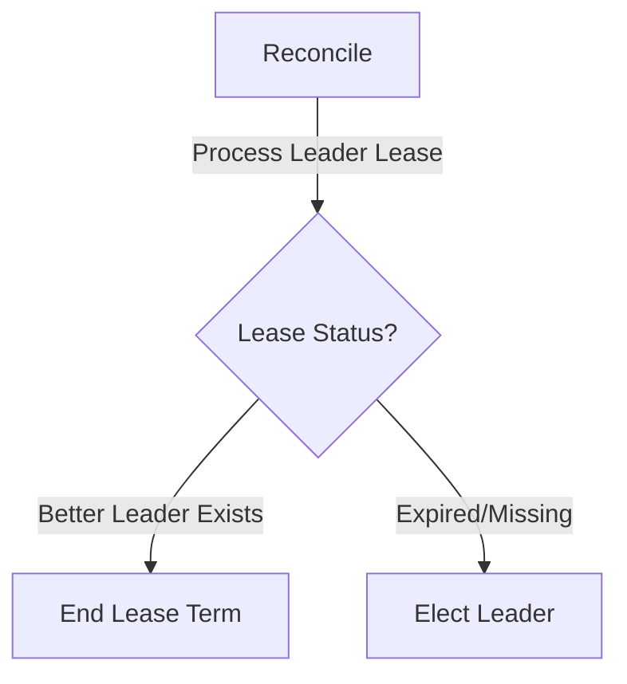
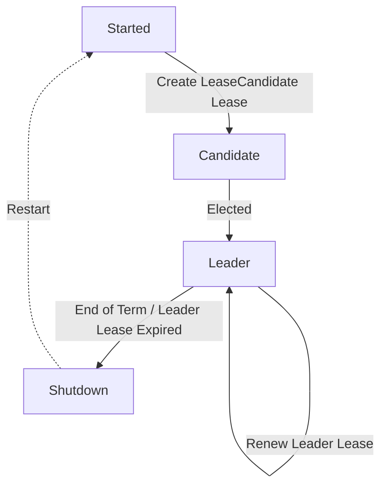

<!--
**Note:** When your KEP is complete, all of these comment blocks should be removed.

To get started with this template:

- [ ] **Pick a hosting SIG.**
  Make sure that the problem space is something the SIG is interested in taking
  up. KEPs should not be checked in without a sponsoring SIG.
- [ ] **Create an issue in kubernetes/enhancements**
  When filing an enhancement tracking issue, please make sure to complete all
  fields in that template. One of the fields asks for a link to the KEP. You
  can leave that blank until this KEP is filed, and then go back to the
  enhancement and add the link.
- [ ] **Make a copy of this template directory.**
  Copy this template into the owning SIG's directory and name it
  `NNNN-short-descriptive-title`, where `NNNN` is the issue number (with no
  leading-zero padding) assigned to your enhancement above.
- [ ] **Fill out as much of the kep.yaml file as you can.**
  At minimum, you should fill in the "Title", "Authors", "Owning-sig",
  "Status", and date-related fields.
- [ ] **Fill out this file as best you can.**
  At minimum, you should fill in the "Summary" and "Motivation" sections.
  These should be easy if you've preflighted the idea of the KEP with the
  appropriate SIG(s).
- [ ] **Create a PR for this KEP.**
  Assign it to people in the SIG who are sponsoring this process.
- [ ] **Merge early and iterate.**
  Avoid getting hung up on specific details and instead aim to get the goals of
  the KEP clarified and merged quickly. The best way to do this is to just
  start with the high-level sections and fill out details incrementally in
  subsequent PRs.

Just because a KEP is merged does not mean it is complete or approved. Any KEP
marked as `provisional` is a working document and subject to change. You can
denote sections that are under active debate as follows:

```
<<[UNRESOLVED optional short context or usernames ]>>
Stuff that is being argued.
<<[/UNRESOLVED]>>
```

When editing KEPS, aim for tightly-scoped, single-topic PRs to keep discussions
focused. If you disagree with what is already in a document, open a new PR
with suggested changes.

One KEP corresponds to one "feature" or "enhancement" for its whole lifecycle.
You do not need a new KEP to move from beta to GA, for example. If
new details emerge that belong in the KEP, edit the KEP. Once a feature has become
"implemented", major changes should get new KEPs.

The canonical place for the latest set of instructions (and the likely source
of this file) is [here](/keps/NNNN-kep-template/README.md).

**Note:** Any PRs to move a KEP to `implementable`, or significant changes once
it is marked `implementable`, must be approved by each of the KEP approvers.
If none of those approvers are still appropriate, then changes to that list
should be approved by the remaining approvers and/or the owning SIG (or
SIG Architecture for cross-cutting KEPs).
-->
# KEP-4355: Coordinated Leader Election

<!-- toc -->
- [Release Signoff Checklist](#release-signoff-checklist)
- [Summary](#summary)
- [Motivation](#motivation)
  - [Goals](#goals)
  - [Non-Goals](#non-goals)
- [Proposal](#proposal)
  - [Component Lease Candidates](#component-lease-candidates)
  - [Coordinated Election Controller](#coordinated-election-controller)
  - [Coordinated Lease Lock](#coordinated-lease-lock)
  - [Renewal Interval and Performance](#renewal-interval-and-performance)
  - [Strategy](#strategy)
    - [Alternative for Strategy](#alternative-for-strategy)
      - [Creating a new LeaseConfiguration resource](#creating-a-new-leaseconfiguration-resource)
      - [YAML/CLI configuration on the kube-apiserver](#yamlcli-configuration-on-the-kube-apiserver)
      - [Strategy propagated from LeaseCandidate](#strategy-propagated-from-leasecandidate)
  - [Enabling on a component](#enabling-on-a-component)
  - [Migrations](#migrations)
  - [API](#api)
  - [Comparison of leader election](#comparison-of-leader-election)
  - [User Stories (Optional)](#user-stories-optional)
    - [Story 1](#story-1)
    - [Story 2](#story-2)
    - [Story 3](#story-3)
  - [Notes/Constraints/Caveats (Optional)](#notesconstraintscaveats-optional)
  - [Risks and Mitigations](#risks-and-mitigations)
    - [Risk: Amount of writes performed by leader election increases substantially](#risk-amount-of-writes-performed-by-leader-election-increases-substantially)
    - [Risk: lease candidate watches increase apiserver load substantially](#risk-lease-candidate-watches-increase-apiserver-load-substantially)
    - [Risk: We have to &quot;start over&quot; and build confidence in a new leader election algorithm](#risk-we-have-to-start-over-and-build-confidence-in-a-new-leader-election-algorithm)
    - [Risk: How is the election controller elected?](#risk-how-is-the-election-controller-elected)
    - [Risk: What if the election controller fails to elect a leader?](#risk-what-if-the-election-controller-fails-to-elect-a-leader)
- [Design Details](#design-details)
  - [Test Plan](#test-plan)
      - [Prerequisite testing updates](#prerequisite-testing-updates)
      - [Unit tests](#unit-tests)
      - [Integration tests](#integration-tests)
      - [e2e tests](#e2e-tests)
  - [Graduation Criteria](#graduation-criteria)
    - [Alpha](#alpha)
  - [Upgrade / Downgrade Strategy](#upgrade--downgrade-strategy)
  - [Version Skew Strategy](#version-skew-strategy)
- [Production Readiness Review Questionnaire](#production-readiness-review-questionnaire)
  - [Feature Enablement and Rollback](#feature-enablement-and-rollback)
  - [Rollout, Upgrade and Rollback Planning](#rollout-upgrade-and-rollback-planning)
  - [Monitoring Requirements](#monitoring-requirements)
  - [Dependencies](#dependencies)
  - [Scalability](#scalability)
  - [Troubleshooting](#troubleshooting)
- [Implementation History](#implementation-history)
- [Drawbacks](#drawbacks)
- [Alternatives](#alternatives)
  - [Similar approaches involving the leader election controller](#similar-approaches-involving-the-leader-election-controller)
    - [Running the leader election controller in HA on every apiserver](#running-the-leader-election-controller-in-ha-on-every-apiserver)
    - [Running the coordinated leader election controller in KCM](#running-the-coordinated-leader-election-controller-in-kcm)
    - [Running the coordinated leader election controller in a new container](#running-the-coordinated-leader-election-controller-in-a-new-container)
  - [Component instances pick a leader without a coordinator](#component-instances-pick-a-leader-without-a-coordinator)
  - [Component instances pick a leader without lease candidates or a coordinator](#component-instances-pick-a-leader-without-lease-candidates-or-a-coordinator)
  - [Algorithm configurability](#algorithm-configurability)
- [Future Work](#future-work)
- [Infrastructure Needed (Optional)](#infrastructure-needed-optional)
<!-- /toc -->

## Release Signoff Checklist

<!--
**ACTION REQUIRED:** In order to merge code into a release, there must be an
issue in [kubernetes/enhancements] referencing this KEP and targeting a release
milestone **before the [Enhancement Freeze](https://git.k8s.io/sig-release/releases)
of the targeted release**.

For enhancements that make changes to code or processes/procedures in core
Kubernetes—i.e., [kubernetes/kubernetes], we require the following Release
Signoff checklist to be completed.

Check these off as they are completed for the Release Team to track. These
checklist items _must_ be updated for the enhancement to be released.
-->

Items marked with (R) are required *prior to targeting to a milestone /
release*.

- [x] (R) Enhancement issue in release milestone, which links to KEP dir in
  [kubernetes/enhancements] (not the initial KEP PR)
- [x] (R) KEP approvers have approved the KEP status as `implementable`
- [x] (R) Design details are appropriately documented
- [x] (R) Test plan is in place, giving consideration to SIG Architecture and
  SIG Testing input (including test refactors)
  - [ ] e2e Tests for all Beta API Operations (endpoints)
  - [ ] (R) Ensure GA e2e tests meet requirements for [Conformance
    Tests](https://github.com/kubernetes/community/blob/master/contributors/devel/sig-architecture/conformance-tests.md) 
  - [ ] (R) Minimum Two Week Window for GA e2e tests to prove flake free
- [ ] (R) Graduation criteria is in place
  - [ ] (R) [all GA
    Endpoints](https://github.com/kubernetes/community/pull/1806) must be hit by
    [Conformance
    Tests](https://github.com/kubernetes/community/blob/master/contributors/devel/sig-architecture/conformance-tests.md) 
- [x] (R) Production readiness review completed
- [x] (R) Production readiness review approved
- [ ] "Implementation History" section is up-to-date for milestone
- [ ] User-facing documentation has been created in [kubernetes/website], for
  publication to [kubernetes.io]
- [ ] Supporting documentation—e.g., additional design documents, links to
  mailing list discussions/SIG meetings, relevant PRs/issues, release notes

<!--
**Note:** This checklist is iterative and should be reviewed and updated every time this enhancement is being considered for a milestone.
-->

[kubernetes.io]: https://kubernetes.io/
[kubernetes/enhancements]: https://git.k8s.io/enhancements
[kubernetes/kubernetes]: https://git.k8s.io/kubernetes
[kubernetes/website]: https://git.k8s.io/website

## Summary

This proposes a component leader election mechanism that is safer for upgrades
and rollbacks.

This leader election approach continues to use leases, but with two key
modifications:

- Instead of a race by component instances to claim the lease, component
  instances declare candidacy for a lease and a election coordinator claims the
  lease for the best available candidate. This allows the election coordinator
  to pick a candidate with the lowest version to ensure that skew rules are not
  violated.
- The election coordinator can mark a lease as "end of term" to signal to the
  current leader to stop renewing the lease. This allows the election
  coordinator to preempt the current leader and replace it with a better one.

## Motivation

The most common upgrade approach used for Kubernetes control plane components is
a node-by-node approach where all the component of a control plane node are
terminated together and then restarted at the new version. This process is
performed node-by-node across a high availability configuration. 

Systems using node-by-node upgrades:

- Cluster API
- kubeadm
- KIND

To respect the [Kubernetes skew
policy](https://kubernetes.io/releases/version-skew-policy/):

- Upgrades should keep controller managers and schedulers at the *old* version
  until all apiservers are upgraded.
- Rollbacks should rollback controller managers and schedulers at the *old*
  version before any apiservers are rolledback.

But a node-by-node upgrade or rollback does not achieve this today.

- For 3 node control plane upgrade, there is about a 25% chance of a new version
  of the controller running while old versions of the apiserver are active,
  resulting in a skew violation. (Consider case where the 2nd node upgraded has
  the lease)
- For rollback, it is almost a certainty that skew will be violated.

There is also the possiblity that the lease will be lost by a leader during an
upgrade or rollback resulting in the version of the controller flip-flopping
between old and new.

### Goals

During HA upgrades/rollbacks/downgrades, 

Leader elected components:

- Change versions at predictable times
- Do not violate version skew, even during node-by-node rollbacks

The control plane:

- Can safely canary components and nodes at the new version for an extended
  period of time, or to pause an upgrade at any step during an upgrade. This
  enhancement, combined with
  [UVIP](../4020-unknown-version-interoperability-proxy) helps achieve this.
  

### Non-Goals

- Change the default leader election for components.

## Proposal

- Offer an opt-in leader election mechanism to:
  - Elect the candidate with the oldest version available.
  - Provide a way to preempt the current leader on the upcoming expiry of the term.
  - Reuse the existing lease mechanism as much as possible.

### Component Lease Candidates

Components will create lease candidates similar to those used by apiserver
identity. Some key differences are certain fields like `LeaseTransitions` and `HolderIdentity` are removed.
See the API section for the full API.

 e.g.:

```yaml
apiVersion: coordination.k8s.io/v1
kind: LeaseCandidate
metadata:
  labels:
    binary-version: "1.29"
    compatibility-version: "1.29"
  name: some-custom-controller-0001A
  namespace: kube-system
spec:
  canLeadLease: kube-system/some-custom-controller
  leaseDurationSeconds: 300
  renewTime: "2023-12-05T02:33:08.685777Z"
```

A component "lease candidate" announces candidacy for leadership by specifying
`spec.canLeadLease` in its lease candidate lease. If the LeaseCandidate object expires, the
component is considered unavailable for leader election purposes. "Expires" is defined more clearly in the Renewal Interval section.

### Coordinated Election Controller

A new Coordinated Election Controller will reconcile component leader `Lease`s
(primary resource) and Lease Candidate Leases (secondary resource, changes trigger
reconciliation of related leader leases).

Coordinated Election Controller reconciliation loop:

- If no leader lease exists for a components:
  - Elect leader from candidates by preparing a freshly renewed `Lease` with:
    - `spec.holderIdentity` set to the identity of the elected leader
    - `coordination.k8s.io/elected-by: leader-election-controller` (to make
      lease types easy to disambiguate)
- If there is a better candidate than current leader:
  - Sets `endofterm: true` on the leader `Lease`, signaling
    that the leader should stop renewing the lease and yield leadership



Example of a lease created by Coordinated Election Controller:

```yaml
apiVersion: coordination.k8s.io/v1
kind: Lease
metadata:
  annotations:
    coordination.k8s.io/elected-by: coordinated-election-controller
  name: some-custom-controller
  namespace: kube-system
spec:
  holderIdentity: controller-a
  leaseDurationSeconds: 10
  leaseTransitions: 0
  renewTime: "2023-12-05T18:58:31.295467Z"
```

The Coordinated Election Controller will run in the kube-apiserver.

In an HA configuration, the Coordinated Leader Election Controller will have its
own lease similar to how other leader elected controllers behaves today. It will
be responsible for renewing its own lease and gracefully shutdown if the lease
is expired. Only one instance of the coordinated leader election controller will
be active at a time, and this prevents instances of the coordinated leader
election controller from interfering with each other. Unlike in KCM, the
coordinated leader election controller must gracefully shutdown and restart as
it will be running in the kube-apiserver and calling `os.Exit()` is not an
option.

### Coordinated Lease Lock

A new `resourceLock` type of `coordinatedleases`, and `CoordinatedLeaseLock`
implementation of `resourcelock.Interface` will be added to client-go that:

- Creates LeaseCandidate Lease when ready to be Leader
- Renews LeaseCandidate lease infrequently (once every 300 seconds)
- Watches its LeaseCandidate lease for the `coordination.k8s.io/pending-ack` annotation and updates to remove it. When the annotation is removed, the `renewTime` is subsequently updated.

- Watches Leader Lease, waiting to be elected leader by the Coordinated Election
  Controller
- When it becomes leader:
  - Perform role of active component instance
  - Renew leader lease periodically
  - Stop renewing if lease is marked `spec.endOfTerm: true`
- If leader lease expires:
  - Shutdown (yielding leadership) and restart as a candidate component instance



### Renewal Interval and Performance
The leader lease will have renewal interval and duration (2s and 15s). This is similar to the renewal interval of the current leader lease.

For component leases, keeping a short renewal interval will add many unnecessary writes to the apiserver.
The component leases renewal interval will default to 5 mins.

When the leader lease is marked as end of term or available, the coordinated leader election controller will
add an annotation to all component lease candidate objects (`coordination.k8s.io/pending-ack`) and wait up to 5 seconds.
During that time, components must update their component lease to remove the annotation.
The leader election controller will then pick the leader based on its criteria from the set of component leases that have ack'd the request.

### Strategy

There are cases where a user may want to change the leader election algorithm
and this can be done via the `spec.Strategy` field in a Lease.

The `Strategy` field signals to the coordinated leader election controller the
appropriate algorithm to use when selecting leaders.

We will allow the Coordinated Leader Election controller to create a Lease
without a holder. The `Lease` may be updated by a third party to the desired
`spec.Strategy`. The strategy will always default to
`MinimumCompatibilityVersion`. 

#### Alternative for Strategy

##### Creating a new LeaseConfiguration resource

We can create a new resource `LeaseConfiguration` to set up the defaults for
`Strategy` and other configurations extensible in the future. This is a very
clean approach that allows users to change the strategy at will without needing
to recompile/restart anything. The main drawback is the introduction of a new
resource and more complexity in leader election logic and watching.

```yaml
kind: LeaseConfiguration
spec:
  targetLease: "kube-system/kube-controller-manager"
  strategy: "MinimumCompatibilityVersion"
```

##### YAML/CLI configuration on the kube-apiserver

We can also populate the default by directly setting up the CLE controller to ingest the proper defaults.
For instance, ingesting a YAML configuration in the form of a list of KV pairs of `lease:strategy` pairs will allow the CLE controller to directly determine the `Strategy` used for each component. This has the added benefit of requiring no API changes as it is optional whether to include the strategy in the `Lease` object.

The drawback of this method is that elevated permissions are needed to configure the kube-apiserver. In addition, an apiserver restart may be needed when the `Strategy` needs to be changed.

##### Strategy propagated from LeaseCandidate

One other alternative is that Strategy could be an option specified by a
`LeaseCandidate` object, in most cases the controller responsible renewing the
`LeaseCandidate` lease. The value for the strategy between different
`LeaseCandidate` objects leading the same `Lease` should be the same, but during
mixed version states, there is a possibility that they may differ. We will use a
consensus protocol that favors the algorithm with the highest priority. The
priority is a fixed list that is predetermined. For now, this is
`NoCoordination` > `MinimumCompatibilityVersion`. For example, if three
`LeaseCandidate` objects exist and two objects select
`MinimumCompatibilityVersion` while the third selects `NoCoordination`,
`NoCoordination` will take precedent and the coordinated leader election
controller will use `NoCoordination` as the election strategy. The final
strategy used will be written to the `Lease` object when the CLE controller
creates the `Lease` for a suitable leader. This has the benefit of providing
better debugging information and allows short circuiting of an election if the
set of candidates and selected strategy is the same as before.

The obvious drawback is the need for a consensus protocol and extra information
in the `LeaseCandidate` object that may be unnecessary.

### Enabling on a component

Components with a `--leader-elect-resource-lock` flag (kube-controller-manager,
 kube-scheduler) will accept `coordinatedleases` as a resource lock type.

### Migrations

So long as the API server is running a coordinated election controller, it is
safe to directly migrate a component from Lease Based Leader Election to
Coordinated Leader Election (or vis-versa).

During the upgrade, a mix of components will be running both election
approaches. When the leader lease expires, there are a couple possibilities:

- A controller instance using `Lease`-based leader election claims the leader
  lease
- The coordinated election controller picks a leader, from the components that
  have written LeaseCandidate leases, and claims the lease on the leader's behalf

Both possibilities have acceptable outcomes during the migration: a component
is elected leader, and once elected, remains leader so long as it keeps the
lease renewed. The elected leader might not be the leader that Coordinated
Leader Election would pick, but this is no worse than how leader election works
before the upgrade, and once the upgrade is complete, Coordinated Leader
Election works as intended.

There is one thing that could make migrations slightly cleaner: If Coordinated
Leader Election adds a `coordination.k8s.io/elected-by:
leader-election-controller` annotation to any leases that it claims. It can also
check for this annotation and only mark leases as "end-of-term" if that
annotation is present. Lease Based Leader Election would ignore "end-of-term"
annotations anyway, so this isn't strictly needed, but it would reduce writes
from the coordinated election controller to leases that were claimed by
component instances not using Coordinated Leader Election

### API

The lease lock API will be extended with a new field for election preference, denoted as an enum for strategies for Coordinated Leader Election.

```go

type CoordinatedLeaseStrategy string

// CoordinatedLeaseStrategy defines the strategy for picking the leader for coordinated leader election.
const (
  OldestCompatibilityVersion CoordinatedStrategy = "OldestCompatibilityVersion"
  NoCoordination CoordinatedStrategy = "NoCoordination"
)

type LeaseSpec struct {
	// Strategy indicates the strategy for picking the leader for coordinated leader election
  // This is filled in from LeaseCandidate.Spec.Strategy or defaulted to NoCoordinationStrategy
  // if the leader was not elected by the CLE controller.
	Strategy CoordinatedLeaseStrategy `json:"strategy,omitempty" protobuf:"string,6,opt,name=strategy"`

	// EndofTerm signals to a lease holder that the lease should not be
	// renewed because a better candidate is available.
	EndOfTerm bool `json:"endOfTerm,omitempty" protobuf:"boolean,7,opt,name=endOfTerm"`

	// EXISTING FIELDS BELOW

	// holderIdentity contains the identity of the holder of a current lease.
	// +optional
	HolderIdentity *string `json:"holderIdentity,omitempty" protobuf:"bytes,1,opt,name=holderIdentity"`
	// leaseDurationSeconds is a duration that candidates for a lease need
	// to wait to force acquire it. This is measure against time of last
	// observed renewTime.
	// +optional
	LeaseDurationSeconds *int32 `json:"leaseDurationSeconds,omitempty" protobuf:"varint,2,opt,name=leaseDurationSeconds"`
	// acquireTime is a time when the current lease was acquired.
	// +optional
	AcquireTime *metav1.MicroTime `json:"acquireTime,omitempty" protobuf:"bytes,3,opt,name=acquireTime"`
	// renewTime is a time when the current holder of a lease has last
	// updated the lease.
	// +optional
	RenewTime *metav1.MicroTime `json:"renewTime,omitempty" protobuf:"bytes,4,opt,name=renewTime"`
	// leaseTransitions is the number of transitions of a lease between
	// holders.
	// +optional
	LeaseTransitions *int32 `json:"leaseTransitions,omitempty" protobuf:"varint,5,opt,name=leaseTransitions"`
}
```

For the LeaseCandidate leases, a new lease will be created

```go
type LeaseCandidateSpec struct {
  // The fields BinaryVersion and CompatibilityVersion will be mandatory labels instead of fields in the spec

	// CanLeadLease is in the format <namespace>/<name>, indicating the namespace and name of the lease that the candidate may lead
	CanLeadLease string

	// Strategy indicates the preferred strategy for the coordinated leader election controller to use.
	Strategy CoordinatedLeaseStrategy `json:"strategy,omitempty" protobuf:"string,6,opt,name=strategy"`

	// FIELDS DUPLICATED FROM LEASE

	// leaseDurationSeconds is a duration that candidates for a lease need
	// to wait to force acquire it. This is measure against time of last
	// observed renewTime.
	// +optional
	LeaseDurationSeconds *int32 `json:"leaseDurationSeconds,omitempty" protobuf:"varint,2,opt,name=leaseDurationSeconds"`
	// renewTime is a time when the current holder of a lease has last
	// updated the lease.
	// +optional
	RenewTime *metav1.MicroTime `json:"renewTime,omitempty" protobuf:"bytes,4,opt,name=renewTime"`
}
```

Each LeaseCandidate lease may only lead one lock. If the same component wishes to lead many leases,
a separate LeaseCandidate lease will be required for each lock.

If the `LeaseCandidate` objects do not agree on a value for the Strategy, we will have an ordering priority.
For instance, we define `NewestCompatibilityVersion` > `OldestCompatibilityVersion`. This means that if
a subset of candidates have `OldestCompatibilityVersion` and and subset have `NewestCompatibilityVersion`,
coordinated leader election will pick `NewestCompatibilityVersion`. In order for `OldestCompatibilityVersion` to be used,
all `LeaseCandidate` objects must publish the same `Strategy`.

### Comparison of leader election

|                 | Lease Based Leader Election      | Coordinated Leader Election                                                    |
| --------------- | -------------------------------- | ------------------------------------------------------------------------------ |
| Lock Type       | Lease                            | Lease                                                                          |
| Claimed by      | Component instance               | Election Coordinator. (Lease is claimed for to the elected component instance) |
| Renewed by      | Component instance               | Component instance                                                             |
| Leader Criteria | First component to claim lease   | Best leader from available candidates at time of election                      |
| Preemptable     | No                               | Yes, Collaboratively. (Coordinator marks lease as "end of term". Component instance voluntarily stops renewing) |

### User Stories (Optional)

#### Story 1

A cluster administrator upgrades a cluster's control plane node-by-node,
expecting version skew to be respected.

- When the first and second nodes are upgraded, any components that were leaders
  will typically lose the lease during the node downtime
  - If one happens to retain its lease, it will be preempted by the coordinated
    election controller after it updates its LeaseCandidate lease with new version
    information
- When the third node is upgraded, all components will be at the new version and
  one will be elected

#### Story 2

A cluster administrator rolls back a cluster's control plane node-by-node,
expecting version skew to be respected.

- When the first node is rolled back, any components that were leaders will
  typically loose the lease during the node downtime
- Once one of the components updates its LeaseCandidate lease with new version
  information, the coordinated election controller will preempt the current
  leader so that this lower version component becomes leader.
- When the remaining two nodes can rollback, the first node will typically
  remain leader, but if a new election occurs, the available older version
  components will be elected.

#### Story 3

A cluster administrator may want more fine grain control over a control plane's upgrade.

- When one node is upgraded they may wish to canary the components on that
  node and switch the leader to the new compatibility version immediately.
- This can be accomplished by changing the `Strategy` field in a lease object.

### Notes/Constraints/Caveats (Optional)

<!--
What are the caveats to the proposal?
What are some important details that didn't come across above?
Go in to as much detail as necessary here.
This might be a good place to talk about core concepts and how they relate.
-->

### Risks and Mitigations

#### Risk: Amount of writes performed by leader election increases substantially

This enhancement introduces a LeaseCandidate lease for each instance of each
component.

Example:

- HA cluster with 3 control plane nodes
- 3 elected components (kube-controller-manager, schedule,
  cloud-controller-manager) per control plane node
- 9 LeaseCandidate leases are created and renewed by the components

Introducing this feature is roughtly equivalent to adding the same lease load as
adding 9 nodes to a kubernetes cluster.

The [API Server Identity enhancement](../1965-kube-apiserver-identity) also
introduces similar leases. For comparison, in a HA cluster with 3 control plane
nodes, API Server Identity adds 3 leases.

This risk can be migitated by scale testing and, if needed, extending the lease
duration and renewal times to reduce writes/s.

#### Risk: lease candidate watches increase apiserver load substantially

The [Unknown Version Interoperability Proxy (UVIP)
enhancement](../4020-unknown-version-interoperability-proxy) also adds lease
watches on [API Server Identity](../1965-kube-apiserver-identity) leases in the
kube-system namespace. This enhancement does not touch the number of lease resources
being watched, but adds 3 resources being watched for `LeaseCandidate` per component.

#### Risk: We have to "start over" and build confidence in a new leader election algorithm

We've built confidence in the existing leasing algorithm, through an investment
of engineering effort, and in core hours testing it and running it in
production.

Changing the algorithm "resets the clock" and forces us to rebuild confidence on
the new algorithm.

The goal of this proposal is to minimize this risk by reusing as much of the
existing lease algorithm as possible:

- Renew leases in exactly the same way as before
- Leases can never be claimed by another leader until a lease expires

#### Risk: How is the election controller elected?

The leader election controller will be selected by the first apiserver that
claims the leader election lease lock. This is the same as how kube controller
manager and other components are elected today. The leader selected is not
deterministic during an update, but we do not see many changes to the leader
election controller.

#### Risk: What if the election controller fails to elect a leader?

Fallback to letting component instances claim the lease directly, after a longer
delay, to give the coordinated election controller an opportunity to elect
before resorting to the fallback.

## Design Details

### Test Plan

<!--
**Note:** *Not required until targeted at a release.*
The goal is to ensure that we don't accept enhancements with inadequate testing.

All code is expected to have adequate tests (eventually with coverage
expectations). Please adhere to the [Kubernetes testing guidelines][testing-guidelines]
when drafting this test plan.

[testing-guidelines]: https://git.k8s.io/community/contributors/devel/sig-testing/testing.md
-->

[x] I/we understand the owners of the involved components may require updates to
existing tests to make this code solid enough prior to committing the changes
necessary to implement this enhancement.

##### Prerequisite testing updates

<!--
Based on reviewers feedback describe what additional tests need to be added prior
implementing this enhancement to ensure the enhancements have also solid foundations.
-->

##### Unit tests

<!--
In principle every added code should have complete unit test coverage, so providing
the exact set of tests will not bring additional value.
However, if complete unit test coverage is not possible, explain the reason of it
together with explanation why this is acceptable.
-->

<!--
Additionally, for Alpha try to enumerate the core package you will be touching
to implement this enhancement and provide the current unit coverage for those
in the form of:
- <package>: <date> - <current test coverage>
The data can be easily read from:
https://testgrid.k8s.io/sig-testing-canaries#ci-kubernetes-coverage-unit

This can inform certain test coverage improvements that we want to do before
extending the production code to implement this enhancement.
-->

- `staging/src/k8s.io/client-go/tools/leaderelection`: 76.8
- `pkg/controller/leaderelection`: `TODO` - `new controller tests`

##### Integration tests

<!--
Integration tests are contained in k8s.io/kubernetes/test/integration.
Integration tests allow control of the configuration parameters used to start the binaries under test.
This is different from e2e tests which do not allow configuration of parameters.
Doing this allows testing non-default options and multiple different and potentially conflicting command line options.
-->

<!--
This question should be filled when targeting a release.
For Alpha, describe what tests will be added to ensure proper quality of the enhancement.

For Beta and GA, add links to added tests together with links to k8s-triage for those tests:
https://storage.googleapis.com/k8s-triage/index.html
-->

- `test/integration/apiserver/coordinatedleaderelection`: New file

##### e2e tests

<!--
This question should be filled when targeting a release.
For Alpha, describe what tests will be added to ensure proper quality of the enhancement.

For Beta and GA, add links to added tests together with links to k8s-triage for those tests:
https://storage.googleapis.com/k8s-triage/index.html

We expect no non-infra related flakes in the last month as a GA graduation criteria.
-->

- `test/e2e/apimachinery/coordinatedleaderelection.go`: New file

### Graduation Criteria

<!--
**Note:** *Not required until targeted at a release.*

Define graduation milestones.

These may be defined in terms of API maturity, [feature gate] graduations, or as
something else. The KEP should keep this high-level with a focus on what
signals will be looked at to determine graduation.

Consider the following in developing the graduation criteria for this enhancement:
- [Maturity levels (`alpha`, `beta`, `stable`)][maturity-levels]
- [Feature gate][feature gate] lifecycle
- [Deprecation policy][deprecation-policy]

Clearly define what graduation means by either linking to the [API doc
definition](https://kubernetes.io/docs/concepts/overview/kubernetes-api/#api-versioning)
or by redefining what graduation means.

In general we try to use the same stages (alpha, beta, GA), regardless of how the
functionality is accessed.

[feature gate]: https://git.k8s.io/community/contributors/devel/sig-architecture/feature-gates.md
[maturity-levels]: https://git.k8s.io/community/contributors/devel/sig-architecture/api_changes.md#alpha-beta-and-stable-versions
[deprecation-policy]: https://kubernetes.io/docs/reference/using-api/deprecation-policy/

Below are some examples to consider, in addition to the aforementioned [maturity levels][maturity-levels].

#### Alpha

- Feature implemented behind a feature flag
- Initial e2e tests completed and enabled

#### Beta

- Gather feedback from developers and surveys
- Complete features A, B, C
- Additional tests are in Testgrid and linked in KEP

#### GA

- N examples of real-world usage
- N installs
- More rigorous forms of testing—e.g., downgrade tests and scalability tests
- Allowing time for feedback

**Note:** Generally we also wait at least two releases between beta and
GA/stable, because there's no opportunity for user feedback, or even bug reports,
in back-to-back releases.

**For non-optional features moving to GA, the graduation criteria must include
[conformance tests].**

[conformance tests]: https://git.k8s.io/community/contributors/devel/sig-architecture/conformance-tests.md

#### Deprecation

- Announce deprecation and support policy of the existing flag
- Two versions passed since introducing the functionality that deprecates the flag (to address version skew)
- Address feedback on usage/changed behavior, provided on GitHub issues
- Deprecate the flag
-->

#### Alpha
- Feature implemented behind a feature flag
- The strategy `MinimumCompatibilityVersionStrategy` is implemented

### Upgrade / Downgrade Strategy

If the `--leader-elect-resource-lock=coordinatedleases` flag is set and a
component is downgraded from beta to alpha, it will need to either remove the
flag or enable the alpha feature. All other upgrades and downgrades are safe.

<!--
If applicable, how will the component be upgraded and downgraded? Make sure
this is in the test plan.

Consider the following in developing an upgrade/downgrade strategy for this
enhancement:
- What changes (in invocations, configurations, API use, etc.) is an existing
  cluster required to make on upgrade, in order to maintain previous behavior?
- What changes (in invocations, configurations, API use, etc.) is an existing
  cluster required to make on upgrade, in order to make use of the enhancement?
-->

### Version Skew Strategy

The feature uses leases in a standard way, so if some components instances are
configured to use the old direct leases and others are configured to use this
enhancement's coordinated leases, the component instances may still safely share
the same lease, and leaders will be safely elected.

<!--
If applicable, how will the component handle version skew with other
components? What are the guarantees? Make sure this is in the test plan.

Consider the following in developing a version skew strategy for this
enhancement:
- Does this enhancement involve coordinating behavior in the control plane and nodes?
- How does an n-3 kubelet or kube-proxy without this feature available behave when this feature is used?
- How does an n-1 kube-controller-manager or kube-scheduler without this feature available behave when this feature is used?
- Will any other components on the node change? For example, changes to CSI,
  CRI or CNI may require updating that component before the kubelet.
-->

## Production Readiness Review Questionnaire

<!--

Production readiness reviews are intended to ensure that features merging into
Kubernetes are observable, scalable and supportable; can be safely operated in
production environments, and can be disabled or rolled back in the event they
cause increased failures in production. See more in the PRR KEP at
https://git.k8s.io/enhancements/keps/sig-architecture/1194-prod-readiness.

The production readiness review questionnaire must be completed and approved
for the KEP to move to `implementable` status and be included in the release.

In some cases, the questions below should also have answers in `kep.yaml`. This
is to enable automation to verify the presence of the review, and to reduce review
burden and latency.

The KEP must have a approver from the
[`prod-readiness-approvers`](http://git.k8s.io/enhancements/OWNERS_ALIASES)
team. Please reach out on the
[#prod-readiness](https://kubernetes.slack.com/archives/CPNHUMN74) channel if
you need any help or guidance.
-->

### Feature Enablement and Rollback

<!--
This section must be completed when targeting alpha to a release.
-->

###### How can this feature be enabled / disabled in a live cluster?

<!--
Pick one of these and delete the rest.

Documentation is available on [feature gate lifecycle] and expectations, as
well as the [existing list] of feature gates.

[feature gate lifecycle]: https://git.k8s.io/community/contributors/devel/sig-architecture/feature-gates.md
[existing list]: https://kubernetes.io/docs/reference/command-line-tools-reference/feature-gates/
-->

- [x] Feature gate (also fill in values in `kep.yaml`)
  - Feature gate name: CoordinatedLeaderElection
  - Components depending on the feature gate:
    - kube-apiserver
    - kube-controller-manager
    - kube-scheduler
- [ ] Other
  - Describe the mechanism:
  - Will enabling / disabling the feature require downtime of the control plane?
  - Will enabling / disabling the feature require downtime or reprovisioning of
    a node?

###### Does enabling the feature change any default behavior?

No, even when the feature is enabled, a component must be configured with
`--leader-elect-resource-lock=coordinatedleases` to use the feature.

###### Can the feature be disabled once it has been enabled (i.e. can we roll back the enablement)?

Yes, the feature uses leases in a standard way, so if some components are
configured to use direct leases and others are configured to use coordinated
leases, elections will still happen. Also, coordinated leader election falls
back to direct leasing of the election coordinator does not elect leader within
a reasonable period of time, making it safe to disable this feature in HA
clusters.

###### What happens if we reenable the feature if it was previously rolled back?

This is safe. Leader elections would transition back to coordinated leader
elections. Any elected leaders would continue to renew their leases.

###### Are there any tests for feature enablement/disablement?

Yes, this will be tested, including tests where the are a mix of components with
the feature enabled and disabled.

<!--
The e2e framework does not currently support enabling or disabling feature
gates. However, unit tests in each component dealing with managing data, created
with and without the feature, are necessary. At the very least, think about
conversion tests if API types are being modified.

Additionally, for features that are introducing a new API field, unit tests that
are exercising the `switch` of feature gate itself (what happens if I disable a
feature gate after having objects written with the new field) are also critical.
You can take a look at one potential example of such test in:
https://github.com/kubernetes/kubernetes/pull/97058/files#diff-7826f7adbc1996a05ab52e3f5f02429e94b68ce6bce0dc534d1be636154fded3R246-R282
-->

### Rollout, Upgrade and Rollback Planning

<!--
This section must be completed when targeting beta to a release.
-->

###### How can a rollout or rollback fail? Can it impact already running workloads?

<!--
Try to be as paranoid as possible - e.g., what if some components will restart
mid-rollout?

Be sure to consider highly-available clusters, where, for example,
feature flags will be enabled on some API servers and not others during the
rollout. Similarly, consider large clusters and how enablement/disablement
will rollout across nodes.
-->

###### What specific metrics should inform a rollback?

<!--
What signals should users be paying attention to when the feature is young
that might indicate a serious problem?
-->

###### Were upgrade and rollback tested? Was the upgrade->downgrade->upgrade path tested?

<!--
Describe manual testing that was done and the outcomes.
Longer term, we may want to require automated upgrade/rollback tests, but we
are missing a bunch of machinery and tooling and can't do that now.
-->

###### Is the rollout accompanied by any deprecations and/or removals of features, APIs, fields of API types, flags, etc.?

<!--
Even if applying deprecation policies, they may still surprise some users.
-->

### Monitoring Requirements

<!--
This section must be completed when targeting beta to a release.

For GA, this section is required: approvers should be able to confirm the
previous answers based on experience in the field.
-->

###### How can an operator determine if the feature is in use by workloads?

<!--
Ideally, this should be a metric. Operations against the Kubernetes API (e.g.,
checking if there are objects with field X set) may be a last resort. Avoid
logs or events for this purpose.
-->

###### How can someone using this feature know that it is working for their instance?

<!--
For instance, if this is a pod-related feature, it should be possible to determine if the feature is functioning properly
for each individual pod.
Pick one more of these and delete the rest.
Please describe all items visible to end users below with sufficient detail so that they can verify correct enablement
and operation of this feature.
Recall that end users cannot usually observe component logs or access metrics.
-->

- [ ] Events
  - Event Reason: 
- [ ] API .status
  - Condition name: 
  - Other field: 
- [ ] Other (treat as last resort)
  - Details:

###### What are the reasonable SLOs (Service Level Objectives) for the enhancement?

<!--
This is your opportunity to define what "normal" quality of service looks like
for a feature.

It's impossible to provide comprehensive guidance, but at the very
high level (needs more precise definitions) those may be things like:
  - per-day percentage of API calls finishing with 5XX errors <= 1%
  - 99% percentile over day of absolute value from (job creation time minus expected
    job creation time) for cron job <= 10%
  - 99.9% of /health requests per day finish with 200 code

These goals will help you determine what you need to measure (SLIs) in the next
question.
-->

###### What are the SLIs (Service Level Indicators) an operator can use to determine the health of the service?

<!--
Pick one more of these and delete the rest.
-->

- [ ] Metrics
  - Metric name:
  - [Optional] Aggregation method:
  - Components exposing the metric:
- [ ] Other (treat as last resort)
  - Details:

###### Are there any missing metrics that would be useful to have to improve observability of this feature?

<!--
Describe the metrics themselves and the reasons why they weren't added (e.g., cost,
implementation difficulties, etc.).
-->

### Dependencies

<!--
This section must be completed when targeting beta to a release.
-->

###### Does this feature depend on any specific services running in the cluster?

<!--
Think about both cluster-level services (e.g. metrics-server) as well
as node-level agents (e.g. specific version of CRI). Focus on external or
optional services that are needed. For example, if this feature depends on
a cloud provider API, or upon an external software-defined storage or network
control plane.

For each of these, fill in the following—thinking about running existing user workloads
and creating new ones, as well as about cluster-level services (e.g. DNS):
  - [Dependency name]
    - Usage description:
      - Impact of its outage on the feature:
      - Impact of its degraded performance or high-error rates on the feature:
-->

### Scalability

<!--
For alpha, this section is encouraged: reviewers should consider these questions
and attempt to answer them.

For beta, this section is required: reviewers must answer these questions.

For GA, this section is required: approvers should be able to confirm the
previous answers based on experience in the field.
-->

###### Will enabling / using this feature result in any new API calls?

<!--
Describe them, providing:
  - API call type (e.g. PATCH pods)
  - estimated throughput
  - originating component(s) (e.g. Kubelet, Feature-X-controller)
Focusing mostly on:
  - components listing and/or watching resources they didn't before
  - API calls that may be triggered by changes of some Kubernetes resources
    (e.g. update of object X triggers new updates of object Y)
  - periodic API calls to reconcile state (e.g. periodic fetching state,
    heartbeats, leader election, etc.)
-->

###### Will enabling / using this feature result in introducing new API types?

<!--
Describe them, providing:
  - API type
  - Supported number of objects per cluster
  - Supported number of objects per namespace (for namespace-scoped objects)
-->

###### Will enabling / using this feature result in any new calls to the cloud provider?

<!--
Describe them, providing:
  - Which API(s):
  - Estimated increase:
-->

###### Will enabling / using this feature result in increasing size or count of the existing API objects?

<!--
Describe them, providing:
  - API type(s):
  - Estimated increase in size: (e.g., new annotation of size 32B)
  - Estimated amount of new objects: (e.g., new Object X for every existing Pod)
-->

###### Will enabling / using this feature result in increasing time taken by any operations covered by existing SLIs/SLOs?

<!--
Look at the [existing SLIs/SLOs].

Think about adding additional work or introducing new steps in between
(e.g. need to do X to start a container), etc. Please describe the details.

[existing SLIs/SLOs]: https://git.k8s.io/community/sig-scalability/slos/slos.md#kubernetes-slisslos
-->

###### Will enabling / using this feature result in non-negligible increase of resource usage (CPU, RAM, disk, IO, ...) in any components?

<!--
Things to keep in mind include: additional in-memory state, additional
non-trivial computations, excessive access to disks (including increased log
volume), significant amount of data sent and/or received over network, etc.
This through this both in small and large cases, again with respect to the
[supported limits].

[supported limits]: https://git.k8s.io/community//sig-scalability/configs-and-limits/thresholds.md
-->

###### Can enabling / using this feature result in resource exhaustion of some node resources (PIDs, sockets, inodes, etc.)?

<!--
Focus not just on happy cases, but primarily on more pathological cases
(e.g. probes taking a minute instead of milliseconds, failed pods consuming resources, etc.).
If any of the resources can be exhausted, how this is mitigated with the existing limits
(e.g. pods per node) or new limits added by this KEP?

Are there any tests that were run/should be run to understand performance characteristics better
and validate the declared limits?
-->

### Troubleshooting

<!--
This section must be completed when targeting beta to a release.

For GA, this section is required: approvers should be able to confirm the
previous answers based on experience in the field.

The Troubleshooting section currently serves the `Playbook` role. We may consider
splitting it into a dedicated `Playbook` document (potentially with some monitoring
details). For now, we leave it here.
-->

###### How does this feature react if the API server and/or etcd is unavailable?

###### What are other known failure modes?

<!--
For each of them, fill in the following information by copying the below template:
  - [Failure mode brief description]
    - Detection: How can it be detected via metrics? Stated another way:
      how can an operator troubleshoot without logging into a master or worker node?
    - Mitigations: What can be done to stop the bleeding, especially for already
      running user workloads?
    - Diagnostics: What are the useful log messages and their required logging
      levels that could help debug the issue?
      Not required until feature graduated to beta.
    - Testing: Are there any tests for failure mode? If not, describe why.
-->

###### What steps should be taken if SLOs are not being met to determine the problem?

## Implementation History

<!--
Major milestones in the lifecycle of a KEP should be tracked in this section.
Major milestones might include:
- the `Summary` and `Motivation` sections being merged, signaling SIG acceptance
- the `Proposal` section being merged, signaling agreement on a proposed design
- the date implementation started
- the first Kubernetes release where an initial version of the KEP was available
- the version of Kubernetes where the KEP graduated to general availability
- when the KEP was retired or superseded
-->

## Drawbacks

<!--
Why should this KEP _not_ be implemented?
-->

## Alternatives

When evaluating alternatives, note that if we decide in the future to improve
the algorithm, fix a bug in the algorithm, or change the criteria for how
leaders are elected, our decision on where to put the code has a huge impact our
how the change is rolled out.

For example, it will be much easier change in a controller in the kube-apiserver
than in client-go library code distributed to elected controllers, because once
it is distributed into controllers, especially 3rd party controllers, any change
requires updating client-go and then updating all controllers to that version of
client-go.

### Similar approaches involving the leader election controller

#### Running the leader election controller in HA on every apiserver

The apiserver runs very few controllers, and they are not elected, but instead
all run concurrently in HA configurations.  
Requires the election controller make careful use concurrency control primitives
to ensure multiple instances collaborate, not fight.

When the Coordinated Leader Election controller runs in the apiserver, it is
possible that two instances of the controller will have different views of the
candidate list. This happens when one controller has fallen behind on a watch
(which can happen for many underlying reasons).

When two controllers have differnet candidate lists, they might "fight". One
likely way they would fight is:

- controller A thinks X is the best leader
- controller B thinks Y is the best leader (because it has stale data from a
  point in time when this was true)
- controller A elects X
- controller B marks the leader lease as ""End of term" since it believes Y
  should be leader
- controller B elects Y as leader
- controller A marks the leader lease as ""End of term" since it believes X
  should be leader
- ...

This can be avoided by tracking resourceVersion or generation numbers of
resources used to make a decision in the lease being reconciled and authoring
the controllers to not to write to a lease when the data used is stale compared
to the already tracked resourceVersion or generation numbers.

One drawback to this approach is that updating the leader election controller
can cause undefined behavior when multiple instances of the leader election
controller are "collaborating". It is difficult to test and prove edge cases
when an update to the leader election controller code is necessary and could
fight with the previous version during an mixed version state.

#### Running the coordinated leader election controller in KCM

Since the coordinated leader election controller is a controller that is
elected, it would also make sense to run in KCM. However, a major drawback is
that KCM forcefully shuts down when it loses the leader lock and it is possible
that the leader election controller on the same KCM instance is the leader at
that time. This causes the coordinated leader election controller to change
leaders which could cause disruptions.

Two ways to solve this are to gracefully shutdown the KCM and fork the process
such that the coordinated leader election controller is unaffected. Gracefully
shutting down the KCM is difficult as controllers are used to the KCM forcefully
shutting them, and we have no guarantee that third party controllers do not rely
on this "feature". Forking the process causes additional overhead that we'd like
to avoid.

#### Running the coordinated leader election controller in a new container

Instead of running in KCM, the coordinated leader election controller could be
run in a new container (eg: `kube-coordinated-leader-election`). There will be a
slightly larger memory footprint with this approach and adding a new component to the
control plane changes our Kubernetes control plane topology in an undesirable way.

### Component instances pick a leader without a coordinator

- A candidates is picked at random to be an election coordinator, and the
   coordinator picks the leader:
  - Components race to claim the lease
  - If a component claims the lease, the first thing it does is check the
    lease candidates to see if there is a better leader
  - If it finds a better lease, it assigns the lease to that component instead
    of itself

Pros: 
  - No coordinated election controller

Cons: 
  - All leader elected components must have the code to decide which component is the best
    leader

### Component instances pick a leader without lease candidates or a coordinator

- The candidates communicate through the lease to agree on the leader
  - Leases have "Election" and "Term" states
  - Leases are first created in the "election" state.
  - While in the "election" state, candidates self-nominate by updating the
    lease with their identity and version information.  Candidates only need to
    self nominate if they are a better candidate than candidate information
    already written to the lease.
  - When "Election" timeout expires, the best candidate becomes the leader
  - The leader sets the state to "term" and starts renewing the lease
  - If the lease expires, it goes back to the "election" state

Pros:

- No coordinated election controller
- No lease candidates

Cons:

- Complex election algorithm is distributed as a client-go library. A bug in the
  algorithm cannot not be fixed by only upgrading kubernetes..  all controllers
  in the ecosystem with the bug must upgrade client-go and release to be fixed.
- More difficult to change/customize the criteria for which candidate is best. 

### Algorithm configurability

We've opted for a static fixed algorithm that looks at three things, continuing
down the list of comparisons if there is a tiebreaker.

- min(binary version)
- min(compatibility version)
- min(lease candidate name)

The goal of the KEP is to make the leader predictable during a cluster upgrade where
leader elected components and apiservers may have mixed versions. This will make
all states of a Kubernetes control plane upgrade adhere to the version skew policy.

An alternative is to make the leader election algorithm configurable either via flags
or a configuration file.

## Future Work

- Controller sharding could leverage coordinated leader election to load balance
  controllers against apiservers.
- Optimizations for graceful and performant failover can be built on this
  enhancement.

## Infrastructure Needed (Optional)

<!--
Use this section if you need things from the project/SIG. Examples include a
new subproject, repos requested, or GitHub details. Listing these here allows a
SIG to get the process for these resources started right away.
-->
