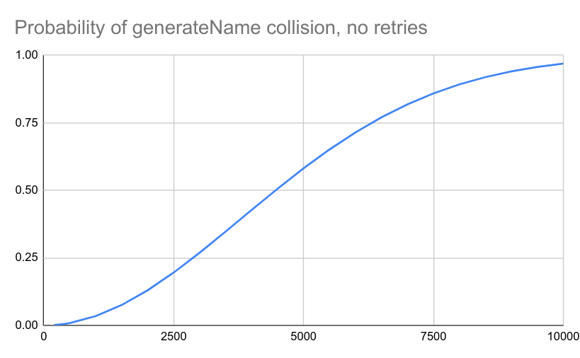
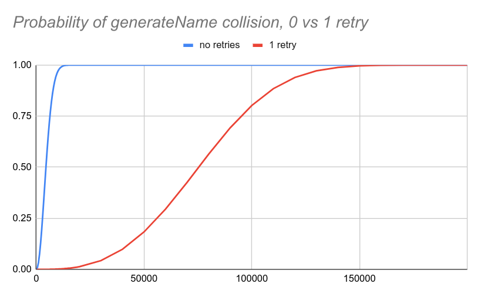
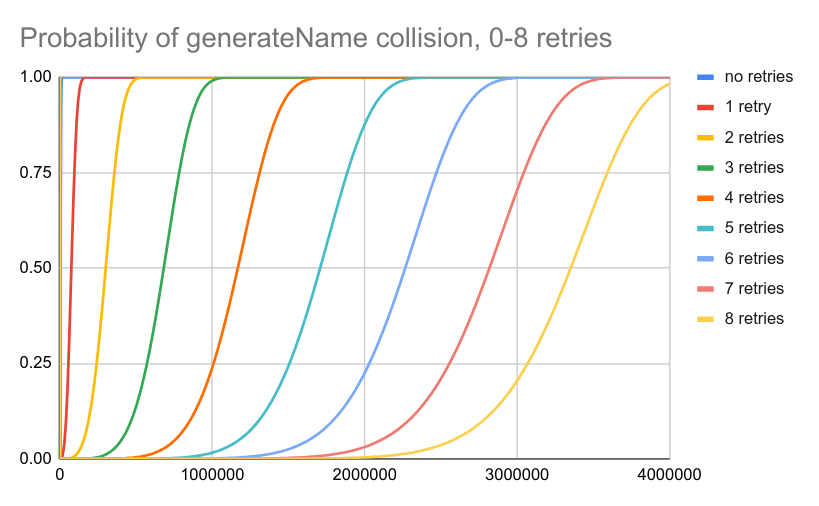

<!--
**Note:** When your KEP is complete, all of these comment blocks should be removed.

To get started with this template:

- [ ] **Pick a hosting SIG.**
  Make sure that the problem space is something the SIG is interested in taking
  up. KEPs should not be checked in without a sponsoring SIG.
- [ ] **Create an issue in kubernetes/enhancements**
  When filing an enhancement tracking issue, please make sure to complete all
  fields in that template. One of the fields asks for a link to the KEP. You
  can leave that blank until this KEP is filed, and then go back to the
  enhancement and add the link.
- [ ] **Make a copy of this template directory.**
  Copy this template into the owning SIG's directory and name it
  `NNNN-short-descriptive-title`, where `NNNN` is the issue number (with no
  leading-zero padding) assigned to your enhancement above.
- [ ] **Fill out as much of the kep.yaml file as you can.**
  At minimum, you should fill in the "Title", "Authors", "Owning-sig",
  "Status", and date-related fields.
- [ ] **Fill out this file as best you can.**
  At minimum, you should fill in the "Summary" and "Motivation" sections.
  These should be easy if you've preflighted the idea of the KEP with the
  appropriate SIG(s).
- [ ] **Create a PR for this KEP.**
  Assign it to people in the SIG who are sponsoring this process.
- [ ] **Merge early and iterate.**
  Avoid getting hung up on specific details and instead aim to get the goals of
  the KEP clarified and merged quickly. The best way to do this is to just
  start with the high-level sections and fill out details incrementally in
  subsequent PRs.

Just because a KEP is merged does not mean it is complete or approved. Any KEP
marked as `provisional` is a working document and subject to change. You can
denote sections that are under active debate as follows:

```
<<[UNRESOLVED optional short context or usernames ]>>
Stuff that is being argued.
<<[/UNRESOLVED]>>
```

When editing KEPS, aim for tightly-scoped, single-topic PRs to keep discussions
focused. If you disagree with what is already in a document, open a new PR
with suggested changes.

One KEP corresponds to one "feature" or "enhancement" for its whole lifecycle.
You do not need a new KEP to move from beta to GA, for example. If
new details emerge that belong in the KEP, edit the KEP. Once a feature has become
"implemented", major changes should get new KEPs.

The canonical place for the latest set of instructions (and the likely source
of this file) is [here](/keps/NNNN-kep-template/README.md).

**Note:** Any PRs to move a KEP to `implementable`, or significant changes once
it is marked `implementable`, must be approved by each of the KEP approvers.
If none of those approvers are still appropriate, then changes to that list
should be approved by the remaining approvers and/or the owning SIG (or
SIG Architecture for cross-cutting KEPs).
-->
# KEP-4420: Retry Generate Name

<!-- toc -->
- [Release Signoff Checklist](#release-signoff-checklist)
- [Summary](#summary)
- [Motivation](#motivation)
  - [Goals](#goals)
  - [Non-Goals](#non-goals)
- [Proposal](#proposal)
  - [Risks and Mitigations](#risks-and-mitigations)
- [Design Details](#design-details)
  - [Test Plan](#test-plan)
      - [Prerequisite testing updates](#prerequisite-testing-updates)
      - [Unit tests](#unit-tests)
      - [Integration tests](#integration-tests)
      - [e2e tests](#e2e-tests)
  - [Graduation Criteria](#graduation-criteria)
    - [Alpha](#alpha)
    - [Beta](#beta)
    - [GA](#ga)
  - [Upgrade / Downgrade Strategy](#upgrade--downgrade-strategy)
  - [Version Skew Strategy](#version-skew-strategy)
- [Production Readiness Review Questionnaire](#production-readiness-review-questionnaire)
  - [Feature Enablement and Rollback](#feature-enablement-and-rollback)
  - [Rollout, Upgrade and Rollback Planning](#rollout-upgrade-and-rollback-planning)
  - [Monitoring Requirements](#monitoring-requirements)
  - [Dependencies](#dependencies)
  - [Scalability](#scalability)
  - [Troubleshooting](#troubleshooting)
- [Implementation History](#implementation-history)
- [Drawbacks](#drawbacks)
- [Alternatives](#alternatives)
- [Infrastructure Needed (Optional)](#infrastructure-needed-optional)
<!-- /toc -->

## Release Signoff Checklist

<!--
**ACTION REQUIRED:** In order to merge code into a release, there must be an
issue in [kubernetes/enhancements] referencing this KEP and targeting a release
milestone **before the [Enhancement Freeze](https://git.k8s.io/sig-release/releases)
of the targeted release**.

For enhancements that make changes to code or processes/procedures in core
Kubernetes—i.e., [kubernetes/kubernetes], we require the following Release
Signoff checklist to be completed.

Check these off as they are completed for the Release Team to track. These
checklist items _must_ be updated for the enhancement to be released.
-->

Items marked with (R) are required *prior to targeting to a milestone / release*.

- [ ] (R) Enhancement issue in release milestone, which links to KEP dir in [kubernetes/enhancements] (not the initial KEP PR)
- [ ] (R) KEP approvers have approved the KEP status as `implementable`
- [ ] (R) Design details are appropriately documented
- [ ] (R) Test plan is in place, giving consideration to SIG Architecture and SIG Testing input (including test refactors)
  - [ ] e2e Tests for all Beta API Operations (endpoints)
  - [ ] (R) Ensure GA e2e tests meet requirements for [Conformance Tests](https://github.com/kubernetes/community/blob/master/contributors/devel/sig-architecture/conformance-tests.md) 
  - [ ] (R) Minimum Two Week Window for GA e2e tests to prove flake free
- [ ] (R) Graduation criteria is in place
  - [ ] (R) [all GA Endpoints](https://github.com/kubernetes/community/pull/1806) must be hit by [Conformance Tests](https://github.com/kubernetes/community/blob/master/contributors/devel/sig-architecture/conformance-tests.md) 
- [ ] (R) Production readiness review completed
- [ ] (R) Production readiness review approved
- [ ] "Implementation History" section is up-to-date for milestone
- [ ] User-facing documentation has been created in [kubernetes/website], for publication to [kubernetes.io]
- [ ] Supporting documentation—e.g., additional design documents, links to mailing list discussions/SIG meetings, relevant PRs/issues, release notes

<!--
**Note:** This checklist is iterative and should be reviewed and updated every time this enhancement is being considered for a milestone.
-->

[kubernetes.io]: https://kubernetes.io/
[kubernetes/enhancements]: https://git.k8s.io/enhancements
[kubernetes/kubernetes]: https://git.k8s.io/kubernetes
[kubernetes/website]: https://git.k8s.io/website

## Summary

This enhancement proposes that create requests using `generateName` are retried automatically by the API server when the generated name conflicts with an existing resource name.

## Motivation

Kubernetes [generateName](https://dev-k8sref-io.web.app/docs/common-definitions/objectmeta-/) [generates](https://github.com/jpbetz/kubernetes/blob/4b5ee802e847a3ea8243946aeae588906bd6f79f/staging/src/k8s.io/apiserver/pkg/storage/names/generate.go#L49) a 5 char random suffix that is appended to a prefix
typically specified as `.metadata.generateName`

Each char in the sequence is from the ["bcdfghjklmnpqrstvwxz2456789" range](https://github.com/jpbetz/kubernetes/blob/4b5ee802e847a3ea8243946aeae588906bd6f79f/staging/src/k8s.io/apimachinery/pkg/util/rand/rand.go#L83C15-L83C42).

This leads to $`27^5 = 14,348,907`$ possible names per generateName prefix. For
context, we have seen clusters store 100,000..1,000,000 custom resources, so the total
number of names that can be generated is not currently a problem.

But there is a problem with name conflicts. There is a 50% chance of hitting a
conflict before generating even 5000 names, and a 0.1% chance at only 500
names!

Today a HTTP 409 respose returned to the client if a name conflict happens.  It is
possible for clients to detect the error and retry, but we've seen that most
clients don't realize to do this and hit this problem in production.

### Goals

- Reduce probability of generated name conflicts to below 0.1% for up to 1
  million generated names per `generateName` prefix.

### Non-Goals

- Change the length of the random suffix. This is a breaking change:
  - There is a 63 char name length limit. to guarantee a 5 char random suffix
    length, `generateName` is trimmed if its length is >58 chars. If the random
    suffix length were to be increased, `generateName` would need to trimmed to a
    shorter length, breaking users that depend on 58 chars of `generateName` being
    preserved. (Increasing the max length of `name` would also be a breaking
    change).
  - There are major downstream projects that use regular expressions with a `{5}` exact match
    count that is intended to match the random suffix.
- Eliminate the possibility of generated name conflicts entirely. This is
  much harder problem given that `generateName` does create names in a reserved
  identifier space, and so any mechanism to pick names is prone to conflicts.

## Proposal

Modify the apiserver to retry name generation. When performing the create
operation at the storage layer of the kube-apiserver, if the create fails
with a "name conflict" error, generate a new name and retry.

If we retry up to 7 times, we can generate up to 1 million names before reaching a 0.1% chance of a collision. This is roughly the same probability of collision we would get if we were to increased the number of chars per random generateName suffix to 11.

While this doesn't eliminate the possibility of name conflicts when very large
numbers of resources are generated with the same `generateName` prefix, it does
effectively eliminate name conflicts for more typical use cases. When generating
<=100,000 resources with a single `generateName` prefix, there is a 1 in
$`1.6x10^{13}`$ chance of ever encountering a name conflict.

### Risks and Mitigations

This approach results in reinvocation of validating admission for each
generated name attempted. This can impact request latency when validating
webhooks are involved.

We do not believe this is a problem in practice because we expect this to be
very rare. For example, for a validating webhook that takes 1 second to respond,
and requires the maximum number of retries (7). This still results in only 7
second of additional latency. In practice most webhooks respond much faster and
the number of retries is expected to be lower.

Note also that the alternative to retrying the create from the apiserver is to
return an error to the client. And even if the client realizes to retry the
request, it will take even longer from the client to perform the retry.

## Design Details

That the probability of a name conflict follows normal hash collision probabiblities:



The probability decreases dramatically if we retry when a generated name
conflicts with an existing name. We can calculate the probability when retries
are performed iteratively with:

$`C_n=C_{n-1}+(1-C_{n-1})(n-1/N)^t`$

Where $`C_n`$ is the probablity of a name conflicts when creating $`n`$ names,
$`N`$ is the total number of names, $`t`$ is the number of tries performed to
find a non-conflicting name before the attempt is considered a conflict.

Graphing this out for $`t=2`$ highlights how much better this is than what we have today:



And the more retry attempts we allow, the lower the probability of collisions:



After 7 attempts, the probability of a conflict for 1 million entries drops below 0.1%.

For comparison, the probability of a conflict if we were instead to increase the number of chars are:

| number of chars | # of possible names | 50% probability of conflict when # of names added | 0.1% probability of conflict when # of names added |
| --------------- | -------------- | ------ | ----- |
| 5               | 14348907       | 5000   | 500   |
| 6               | 387420489      | 25000  | 900   |
| 7               | 10460353203    | 120000 | 5000  |
| 8               | 282429536481   | 650000 | 8000  |
| 9               | 7625597484987  | 3300000 | 120000 |
| 10              | 205891132094649 | 17000000 | 600000 |
| 11              | 5559060566555523 | 24000000 | 3400000 | 

(based on https://kevingal.com/apps/collision.html)

Here, we can see that we need 11 chars to for the "0.1% probability of conflict when # of names added" to exceed 1 million. The gives us a way to compare approaches.

This is how we concluded that 7 retries provides roughly the same probability of conflict that we would get if we were to increased the number of chars per hash to 11.

### Test Plan

[x] I/we understand the owners of the involved components may require updates to
existing tests to make this code solid enough prior to committing the changes necessary
to implement this enhancement.

##### Prerequisite testing updates

##### Unit tests

- staging/src/k8s.io/apiserver/pkg/registry/generic/registry/store_test.go
  - Mock out name generator to use monotonically-increasing integers
  - Verify that a resource is generated with the max retries when conflicting names
    exist
  - Verify that if max retries is exceeded that a already exists error is returned
  - Verify that retries are not attempted when feature is disabled

##### Integration tests

<!--
Integration tests are contained in k8s.io/kubernetes/test/integration.
Integration tests allow control of the configuration parameters used to start the binaries under test.
This is different from e2e tests which do not allow configuration of parameters.
Doing this allows testing non-default options and multiple different and potentially conflicting command line options.
-->

<!--
This question should be filled when targeting a release.
For Alpha, describe what tests will be added to ensure proper quality of the enhancement.

For Beta and GA, add links to added tests together with links to k8s-triage for those tests:
https://storage.googleapis.com/k8s-triage/index.html
-->

- Verify that retries are not attempted when feature is disabled
- Verify that up to max retries are attempted when conflicting names exist
- Verify that if max retries is exceeded that a already exists error is returned

##### e2e tests

This feature is not e2e testable. There is no predictable way to
trigger name collisions.

### Graduation Criteria

#### Alpha

- Feature implemented behind a feature flag
- Unit tests added. The `generic/registry/store_test.go` suite covers this functionality remarkably well.

#### Beta

- Gather feedback from developers and surveys
- Add integration tests
- Additional tests are in Testgrid and linked in KEP
- Benchmark worst case: Max retries are attempted for all create requests.

#### GA

- Add `generate_name_retries: {count}` label to `apiserver_request_duration_seconds`
  metric.

### Upgrade / Downgrade Strategy

N/A. This only reduces the probability of name conflicts when a request is
served by an apiserver with this feature enabled.

### Version Skew Strategy

N/A. This only reduces the probability of name conflicts when a request is
served by an apiserver with this feature enabled.

## Production Readiness Review Questionnaire

### Feature Enablement and Rollback

###### How can this feature be enabled / disabled in a live cluster?

- [x] Feature gate (also fill in values in `kep.yaml`)
  - Feature gate name: RetryGenerateName
  - Components depending on the feature gate: kube-apiserver


###### Does enabling the feature change any default behavior?

No. It only reduces the probability of a error that can occur randomly.

###### Can the feature be disabled once it has been enabled (i.e. can we roll back the enablement)?

Yes.

###### What happens if we reenable the feature if it was previously rolled back?

This is safe. The feature becomes enabled again.

###### Are there any tests for feature enablement/disablement?

Yes.

### Rollout, Upgrade and Rollback Planning

<!--
This section must be completed when targeting beta to a release.
-->

###### How can a rollout or rollback fail? Can it impact already running workloads?

N/A

###### What specific metrics should inform a rollback?

`apiserver_request_duration_seconds` for create requests.  If this metric
increases significantly when this feature is enabled, it may indicate
an issue with this feature.

We also plan to add a `generate_name_retries: {count}` label to this metric
to make it easy to inspect the latency of create requests where retries
occurred.

###### Were upgrade and rollback tested? Was the upgrade->downgrade->upgrade path tested?

N/A

###### Is the rollout accompanied by any deprecations and/or removals of features, APIs, fields of API types, flags, etc.?

No

### Monitoring Requirements

<!--
This section must be completed when targeting beta to a release.

For GA, this section is required: approvers should be able to confirm the
previous answers based on experience in the field.
-->

###### How can an operator determine if the feature is in use by workloads?

Presence of the `generate_name_retries: {count}` label on the `apiserver_request_duration_seconds` metric
with a count greater than 1 would indicate this feature has been used.

###### How can someone using this feature know that it is working for their instance?

- [x] Other
  - Details: The lack of name conflict errors when using `generateName` is the only user visible behavior, but it
    is non-deterministic.

###### What are the reasonable SLOs (Service Level Objectives) for the enhancement?

Create latency should remain unchanged because retries should be very rare under normal
operating conditions. I.e. `apiserver_request_duration_seconds` should not change.

###### What are the SLIs (Service Level Indicators) an operator can use to determine the health of the service?

<!--
Pick one more of these and delete the rest.
-->

- [x] Metrics
  - Metric name: `apiserver_request_duration_seconds` for creates


###### Are there any missing metrics that would be useful to have to improve observability of this feature?

No

### Dependencies

###### Does this feature depend on any specific services running in the cluster?

No

### Scalability

###### Will enabling / using this feature result in any new API calls?

Yes, if the resource being created with generateName has validating webhooks registered,
the validating webhooks will be called for each retry.

###### Will enabling / using this feature result in introducing new API types?

No

###### Will enabling / using this feature result in any new calls to the cloud provider?

No

###### Will enabling / using this feature result in increasing size or count of the existing API objects?

No

###### Will enabling / using this feature result in increasing time taken by any operations covered by existing SLIs/SLOs?

This can happen.

When a retry does occur, if the resource being created with `generateName` has
validating webhooks registered, the validating webhooks will be called for each
retry. For slow webhooks this could result in a significant increase to request
latency for the create requests using `generateName`.

We expect retries to be very rare, even for large numbers of resources
(100k-1M), but if a cluster were somehow able to generate a very large number of
resources for a `generateName`, say 2M or higher, then retries could become more
common. 

###### Will enabling / using this feature result in non-negligible increase of resource usage (CPU, RAM, disk, IO, ...) in any components?

No, at least not in all but the most pathological of situations.

If a cluster was receiving a high load of create requests for generateName
resources with a large number (millions) of existing resources already generated
with the same `generateName` prefix, this could cause up to a 7x increase in CPU.
But we do not expect this to actually happen, primarily because etcd cannot
support these volumes of resources.

###### Can enabling / using this feature result in resource exhaustion of some node resources (PIDs, sockets, inodes, etc.)?

No

### Troubleshooting

###### How does this feature react if the API server and/or etcd is unavailable?

###### What are other known failure modes?

The only know failure modes are pathological. E.g. A runaway system creating
unbounded resources using generateName could eventually trigger amplified load
on webhooks with this feature.

###### What steps should be taken if SLOs are not being met to determine the problem?

Look at the number of resources (using kube-state-metrics or similar). If there
exists a very large number of resources (millions) of a particular resource kind
and they all share the same `generateName` prefix, this might be triggering
high retry load.

## Implementation History

<!--
Major milestones in the lifecycle of a KEP should be tracked in this section.
Major milestones might include:
- the `Summary` and `Motivation` sections being merged, signaling SIG acceptance
- the `Proposal` section being merged, signaling agreement on a proposed design
- the date implementation started
- the first Kubernetes release where an initial version of the KEP was available
- the version of Kubernetes where the KEP graduated to general availability
- when the KEP was retired or superseded
-->

## Drawbacks

This code is in a critical system codepath, if anything is wrong with it, it could cause
severe problems, up to and including data corruption and loss.

## Alternatives

There are many alternatives that we considered including:

- Increasing the length of the random suffix appended to `generateName` when generating
  a name. This would be a breaking change in two ways:
  - There is a 63 char `name` length limit. To guarantee a 5 char random suffix
    length, `generateName` is trimmed if its length is >58 chars. If the random
    suffix length were to be increased, `generateName` would need to trimmed to a
    shorter length, breaking users that depend on 58 chars of `generateName` being
    preserved. (Increasing the max length of `name` would also be a breaking
    change).
  - There are major downstream projects that use "{5}" regexes to match the
    random suffix.
  - Note that the selected design is statistically as good as increasing the
    characters appended from 5 to 11.
- After generating a name, check if the name exists in etcd and, if it does,
  generate another name.  See https://github.com/kubernetes/kubernetes/compare/master...jpbetz:kubernetes:retry-generate-name
  The downside to this approach is that it adds a round-trip to etcd for
  all create requests that use `generateName`.
- Add a "retry filter" to the apiserver's filter chain to retry the entire
  request. This would reinvoke the entire admission chain and increase
  the latency of request handling more significantly than the other approaches
  considered.
- Introduce automatic retry logic into the client.
- Continue to require clients to explicitly check for the error and retry.

## Infrastructure Needed (Optional)

<!--
Use this section if you need things from the project/SIG. Examples include a
new subproject, repos requested, or GitHub details. Listing these here allows a
SIG to get the process for these resources started right away.
-->
