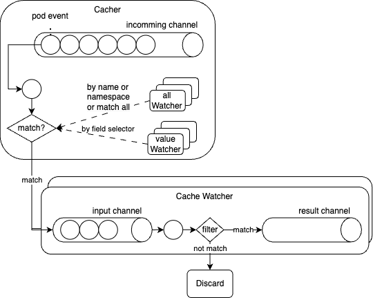

<!--
**Note:** When your KEP is complete, all of these comment blocks should be removed.

To get started with this template:

- [ ] **Pick a hosting SIG.**
  Make sure that the problem space is something the SIG is interested in taking
  up. KEPs should not be checked in without a sponsoring SIG.
- [ ] **Create an issue in kubernetes/enhancements**
  When filing an enhancement tracking issue, please make sure to complete all
  fields in that template. One of the fields asks for a link to the KEP. You
  can leave that blank until this KEP is filed, and then go back to the
  enhancement and add the link.
- [ ] **Make a copy of this template directory.**
  Copy this template into the owning SIG's directory and name it
  `NNNN-short-descriptive-title`, where `NNNN` is the issue number (with no
  leading-zero padding) assigned to your enhancement above.
- [ ] **Fill out as much of the kep.yaml file as you can.**
  At minimum, you should fill in the "Title", "Authors", "Owning-sig",
  "Status", and date-related fields.
- [ ] **Fill out this file as best you can.**
  At minimum, you should fill in the "Summary" and "Motivation" sections.
  These should be easy if you've preflighted the idea of the KEP with the
  appropriate SIG(s).
- [ ] **Create a PR for this KEP.**
  Assign it to people in the SIG who are sponsoring this process.
- [ ] **Merge early and iterate.**
  Avoid getting hung up on specific details and instead aim to get the goals of
  the KEP clarified and merged quickly. The best way to do this is to just
  start with the high-level sections and fill out details incrementally in
  subsequent PRs.

Just because a KEP is merged does not mean it is complete or approved. Any KEP
marked as `provisional` is a working document and subject to change. You can
denote sections that are under active debate as follows:

```
<<[UNRESOLVED optional short context or usernames ]>>
Stuff that is being argued.
<<[/UNRESOLVED]>>
```

When editing KEPS, aim for tightly-scoped, single-topic PRs to keep discussions
focused. If you disagree with what is already in a document, open a new PR
with suggested changes.

One KEP corresponds to one "feature" or "enhancement" for its whole lifecycle.
You do not need a new KEP to move from beta to GA, for example. If
new details emerge that belong in the KEP, edit the KEP. Once a feature has become
"implemented", major changes should get new KEPs.

The canonical place for the latest set of instructions (and the likely source
of this file) is [here](/keps/NNNN-kep-template/README.md).

**Note:** Any PRs to move a KEP to `implementable`, or significant changes once
it is marked `implementable`, must be approved by each of the KEP approvers.
If none of those approvers are still appropriate, then changes to that list
should be approved by the remaining approvers and/or the owning SIG (or
SIG Architecture for cross-cutting KEPs).
-->
# KEP-4933: Support adding label based indexes to apiserver cache

<!--
This is the title of your KEP. Keep it short, simple, and descriptive. A good
title can help communicate what the KEP is and should be considered as part of
any review.
-->

<!--
A table of contents is helpful for quickly jumping to sections of a KEP and for
highlighting any additional information provided beyond the standard KEP
template.

Ensure the TOC is wrapped with
  <code>&lt;!-- toc --&rt;&lt;!-- /toc --&rt;</code>
tags, and then generate with `hack/update-toc.sh`.
-->

<!-- toc -->
- [Release Signoff Checklist](#release-signoff-checklist)
- [Summary](#summary)
- [Motivation](#motivation)
  - [Background 1](#background-1)
  - [Goals](#goals)
  - [Non-Goals](#non-goals)
- [Proposal](#proposal)
  - [User Stories (Optional)](#user-stories-optional)
    - [Story 1](#story-1)
    - [Story 2](#story-2)
  - [Notes/Constraints/Caveats (Optional)](#notesconstraintscaveats-optional)
  - [Risks and Mitigations](#risks-and-mitigations)
- [Design Details](#design-details)
  - [Commandline changes](#commandline-changes)
  - [Changes of register trigger index and cache index to resource storage](#changes-of-register-trigger-index-and-cache-index-to-resource-storage)
  - [improve list performance by using multiple label indexes and field indexes](#improve-list-performance-by-using-multiple-label-indexes-and-field-indexes)
  - [Major struct and field changes in cacher](#major-struct-and-field-changes-in-cacher)
  - [Watch registration](#watch-registration)
  - [Search for indexes](#search-for-indexes)
  - [Metrics](#metrics)
  - [Test Plan](#test-plan)
      - [Prerequisite testing updates](#prerequisite-testing-updates)
      - [Unit tests](#unit-tests)
      - [Integration tests](#integration-tests)
      - [e2e tests](#e2e-tests)
  - [Graduation Criteria](#graduation-criteria)
  - [Upgrade / Downgrade Strategy](#upgrade--downgrade-strategy)
    - [What changes is an existing cluster required to make on upgrade, in order to maintain previous behavior?](#what-changes-is-an-existing-cluster-required-to-make-on-upgrade-in-order-to-maintain-previous-behavior)
    - [What changes is an existing cluster required to make on upgrade, in order to make use of the enhancement?](#what-changes-is-an-existing-cluster-required-to-make-on-upgrade-in-order-to-make-use-of-the-enhancement)
  - [Version Skew Strategy](#version-skew-strategy)
- [Production Readiness Review Questionnaire](#production-readiness-review-questionnaire)
  - [Feature Enablement and Rollback](#feature-enablement-and-rollback)
  - [Rollout, Upgrade and Rollback Planning](#rollout-upgrade-and-rollback-planning)
  - [Monitoring Requirements](#monitoring-requirements)
  - [Dependencies](#dependencies)
  - [Scalability](#scalability)
  - [Troubleshooting](#troubleshooting)
- [Implementation History](#implementation-history)
- [Drawbacks](#drawbacks)
- [Alternatives](#alternatives)
<!-- /toc -->

## Release Signoff Checklist

<!--
**ACTION REQUIRED:** In order to merge code into a release, there must be an
issue in [kubernetes/enhancements] referencing this KEP and targeting a release
milestone **before the [Enhancement Freeze](https://git.k8s.io/sig-release/releases)
of the targeted release**.

For enhancements that make changes to code or processes/procedures in core
Kubernetes—i.e., [kubernetes/kubernetes], we require the following Release
Signoff checklist to be completed.

Check these off as they are completed for the Release Team to track. These
checklist items _must_ be updated for the enhancement to be released.
-->

Items marked with (R) are required *prior to targeting to a milestone / release*.

- [ ] (R) Enhancement issue in release milestone, which links to KEP dir in [kubernetes/enhancements] (not the initial KEP PR)
- [ ] (R) KEP approvers have approved the KEP status as `implementable`
- [ ] (R) Design details are appropriately documented
- [ ] (R) Test plan is in place, giving consideration to SIG Architecture and SIG Testing input (including test refactors)
  - [ ] e2e Tests for all Beta API Operations (endpoints)
  - [ ] (R) Ensure GA e2e tests meet requirements for [Conformance Tests](https://github.com/kubernetes/community/blob/master/contributors/devel/sig-architecture/conformance-tests.md) 
  - [ ] (R) Minimum Two Week Window for GA e2e tests to prove flake free
- [ ] (R) Graduation criteria is in place
  - [ ] (R) [all GA Endpoints](https://github.com/kubernetes/community/pull/1806) must be hit by [Conformance Tests](https://github.com/kubernetes/community/blob/master/contributors/devel/sig-architecture/conformance-tests.md) 
- [ ] (R) Production readiness review completed
- [ ] (R) Production readiness review approved
- [ ] "Implementation History" section is up-to-date for milestone
- [ ] User-facing documentation has been created in [kubernetes/website], for publication to [kubernetes.io]
- [ ] Supporting documentation—e.g., additional design documents, links to mailing list discussions/SIG meetings, relevant PRs/issues, release notes

<!--
**Note:** This checklist is iterative and should be reviewed and updated every time this enhancement is being considered for a milestone.
-->

[kubernetes.io]: https://kubernetes.io/
[kubernetes/enhancements]: https://git.k8s.io/enhancements
[kubernetes/kubernetes]: https://git.k8s.io/kubernetes
[kubernetes/website]: https://git.k8s.io/website

## Summary

When using kubernetes to run big data jobs such as Spark and Flink, the Driver(JobManager for Flink) pod of each job will list and watch all subtasks of this job (background 1). When there are hundreds of jobs running in the cluster, the apiserver will face lots of pressure pushing pod add, update, delete events to them. When there are thousands, it may not be able to push the pod creation events to the scheduler in time, causing the pod scheduling speed to lag behind the creation speed, resulting in the cluster's pods not being able to be scheduled in time and the cluster utilization rate being reduced. This KEP proposes a general solution that allows cluster administrators to declare custom label indices in the apiserver cache, which will greatly improve the efficiency of processing pod's and other resource's watch events.

## Motivation



The current event processing flow in the cacher of apiserver is shown in the figure above:

1. phase 1: The pod change events sent by etcd to the apiserver are stored in the cacher's input channel after some processes
2. phase 2: The cache watcher is a data structure maintained by the cacher for each client of the watch request. The cacher divides all cache watchers into two categories, allWatchers and valueWatchers. Each of the latter is a cache watcher that watches based on the field selector which matches the cacher [trigger index](https://github.com/kubernetes/kubernetes/blob/v1.31.2/staging/src/k8s.io/apiserver/pkg/storage/cacher/cacher.go#L293). After the `dispatchEvents` goroutine obtains a pod event from the incomming channel, it determines which allWatchers and valueWatchers match based on some fields of the pod, and then writes the pod change event to the input channel of matched cacheWatchers.
3. phase 3: After the cache watcher's `processInterval` goroutine takes the pod event from the input channel, it calls a `filter` function again to determine whether the pod matches the cache watcher's label selector and field selector and other filtering conditions. If it matches, the pod event is put into the result channel, otherwise it is directly discarded.

The matching and filtering in phase 2 and phase 3 are to determine whether a pod change is a change that a cacheWatcher is concerned about. The reason why it is divided into two phases is to optimize the performance of event processing as much as possible, with coarse-grained filtering in phase 2 and precise matching in phase 3. Since the current cacher only supports one trigger index for event processing of the incomming channel, only filtering according to a hard-coded field selector is supported, which is the hard-coded [`spec.nodeName`](https://github.com/kubernetes/kubernetes/blob/v1.31.2/pkg/registry/core/pod/storage/storage.go#L91) for pods. For the optimization effect in phase 2, please refer to [Implement first version of indexing in cacher](https://github.com/kubernetes/kubernetes/pull/27277)

In a k8s cluster that mainly runs online applications, most of the watch requests are initiated by kubelet and daemonset programs, most of which watch via field selector `spec.nodeName`, so setting the pod's trigger index to `spec.nodeName` is efficient enough. But in a k8s cluster that mainly runs big data tasks, the situation is different.

In a production k8s cluster, the num of running spark or flink jobs may be roughly the same size as the number of nodes, or even higher. Each job will start a manager pod to create/list/watch/delete its worker pods that will introduce a lot of pressure to the apiserver. In extreme cases, the number of pod add events sent by the apiserver to the scheduler per second will not keep up with the speed of pod creation per second, resulting in the scheduling speed not keeping up with the speed of pod creation, causing resource waste.

Because a Spark or a Flink job only lists and watches the pod change events of itself by applicationId label, and the number of list and watch requests from these jobs is also comparable to the number of that from daemonsets in a considerable cluster. If we can have a label index as a cache index and trigger index, we can improve apiserver performance for running Spark and Flink jobs a lot.

Although [PR#115918](https://github.com/kubernetes/kubernetes/pull/115918) has added namespace indexes to the apiserver cacher, this is not so useful in scenarios where a large number of jobs are running in a small number of namespaces. Most events are still sent to each cacheWatcher through the cacher first and then filtered, causing high CPU usage on the apiserver and delays in event delivery.

### Background 1

Each job of the big data computing engine Spark/Flink will start a Driver/JobManager pod to create/list/watch/delete its worker pods.

Spark:
- list: https://github.com/apache/spark/blob/branch-3.5/resource-managers/kubernetes/core/src/main/scala/org/apache/spark/scheduler/cluster/k8s/ExecutorPodsPollingSnapshotSource.scala#L77-L92
- watch: https://github.com/apache/spark/blob/branch-3.5/resource-managers/kubernetes/core/src/main/scala/org/apache/spark/scheduler/cluster/k8s/ExecutorPodsWatchSnapshotSource.scala#L63-L67

Flink:
- list: https://github.com/apache/flink/blob/master/flink-kubernetes/src/main/java/org/apache/flink/kubernetes/kubeclient/Fabric8FlinkKubeClient.java#L207-L215
- watch: https://github.com/apache/flink/blob/master/flink-kubernetes/src/main/java/org/apache/flink/kubernetes/kubeclient/Fabric8FlinkKubeClient.java#L251-L257

### Goals

- Improve the efficiency of processing pod events of watch requests in apiserver when running Spark and Flink jobs.
- Improve the processing efficiency of list requests with label selectors by adding label indexes.
- Reduce the CPU usage of apiserver when running Spark and Flink jobs.
- Indirectly improve cluster scheduling performance when cluster load is high when running Spark and Flink jobs.

The same improvements may apply to any other workloads as well if they also list and watch resources by labels.

### Non-Goals

- Improve the efficiency of processing pod events with none label selectors. With custom label indexes by this KEP and apiserver built-in field indexes, such as ```spec.nodeName``` for pod, we might consider support declaring custom field selectors if these are not enough.
- Improve the memory usage of apiserver. Since we add more indexes to apiserver, it expects to increase the memory usage.
- Improve the efficiency of processing CRD objects in apiserver. Only built-in types are supported and CRDs are not supported by this KEP.

## Proposal

Since the apiserver already maintains a watch index on ```spec.nodeName``` within the pod storage cacher, we propose to introduce a custom, configurable label index. Given that the relevant label name varies across scenarios, for example, metadata.labels.app for Flink or metadata.labels.spark-app-selector for Spark, this KEP suggests adding indexes to the apiserver cacher based on specified configurable labels. This will allow the pod events for each job to be precisely matched with the correct watchers in the cacher's dispatchEvent process, thereby eliminating the need to broadcast the event to a large number of unmatched cacheWatchers that must then filter it out.

### User Stories (Optional)

<!--
Detail the things that people will be able to do if this KEP is implemented.
Include as much detail as possible so that people can understand the "how" of
the system. The goal here is to make this feel real for users without getting
bogged down.
-->

#### Story 1

#### Story 2

### Notes/Constraints/Caveats (Optional)

<!--
What are the caveats to the proposal?
What are some important details that didn't come across above?
Go in to as much detail as necessary here.
This might be a good place to talk about core concepts and how they relate.
-->

### Risks and Mitigations

<!--
What are the risks of this proposal, and how do we mitigate? Think broadly.
For example, consider both security and how this will impact the larger
Kubernetes ecosystem.

How will security be reviewed, and by whom?

How will UX be reviewed, and by whom?

Consider including folks who also work outside the SIG or subproject.
-->

## Design Details

Since this feature is relatively large, the entire feature will be controlled by a feature gate `CacherLabelIndex` in the early stage.

Considering that daemonset and spark applications coexist in a cluster, and they watch based on `spec.nodeName` and `applicationId` label respectively, we will support both usage at the same time.

In reality, a single filter condition, such as nodeName or applicationId, can already accurately match cacheWatcher, this feature still considers supporting only one triggerIndex for a watch request. At the same time, since the following prerequisites guarantee that OR operations are not supported, filtering events with a single triggerIndex can ensure correctness
- Label selectors and field selectors in a watch request are AND operations.
- Multiple requirements in label selector are also AND operations.
- Through a [`RequiresExactMatch`](https://github.com/kubernetes/kubernetes/blob/v1.31.2/staging/src/k8s.io/apiserver/pkg/storage/cacher/cacher.go#L574) check, a set-based label selector or field selector that supports OR operations on multiple values is considered not matching trigger indexes in cacher.

### Commandline changes

Considering that label names may be different in different scenarios, such as app label name in Flink and spark-app-selector label name in Spark, this feature will add a commandline parameter to the apiserver, allowing different label names to be configured as the trigger index of the apiserver cacher.

```
--index-labels. Index labels settings for some resources (pods, nodes, etc.), comma separated. The individual setting format: resource[.group]#labelName, where resource is lowercase plural (no version), group is omitted for resources of apiVersion v1 (the legacy core API) and included for others, and labelName is a string. It takes effect when watch-cache is enabled. In addition to built-in indexes such as pod.spec.nodeName, apiserver cacher will create additional indexes for these labels to speed up list and watch requests.

# e.g. for spark
--index-labels=pods#spark-app-selector
# e.g. for spark and flink
--index-labels=pods#spark-app-selector,pods#app
# e.g. for pod label indexes for spark and flink and node label index
--index-labels=pods#spark-app-selector,pods#app,nodes#zone
```

### Changes of register trigger index and cache index to resource storage

In order to passing the commandline label indexes parameters into resource storage and cacher, we'll add a `IndexLabels []string` field into `Config` struct in file staging/src/k8s.io/apiserver/pkg/storage/storagebackend/config.go

We will parse the commandline label indexes parameters in `Store.CompleteWithOptions` and register them into `Indexers` and `TriggerFunc` of `StoreOptions`.

### improve list performance by using multiple label indexes and field indexes

We already do [support multiple indexes for store in list](https://github.com/kubernetes/kubernetes/blob/5d9144ca2ef9ffa0fe88e011cdecf8182eaad22d/staging/src/k8s.io/apiserver/pkg/storage/cacher/watch_cache.go#L566-L574). Since index labels are registered into `Indexers` in `Store.CompleteWithOptions`,  we will implement that TODO, i.e. match label selector and field selector of list requests with all indexes, return the one with the fewest items, so as to do as much filtering as possible.

### Major struct and field changes in cacher

Currently `indexedTrigger *indexedTriggerFunc` is a single function field in cacher to support field index. It is assigned to the `spec.nodeName` function for pod resource.

We will update it to `indexedTriggers map[string]storage.IndexerFunc` to support multiple field indexes and multiple label indexes and the combination of them.

Then we will add a `triggerIndex` struct and change `valueWatchers map[string]watchersMap` of `indexedWatchers` struct to `valueWatchers map[triggerIndex]watchersMap` so we can add `app`, `k8s-app`, `spark-app-selector` or any other label names as trigger functions. 

```golang
type triggerIndex struct {
	indexName string
	value     string
}
```

### Watch registration

When a watch comes, [only a single field is registered as index](https://github.com/kubernetes/kubernetes/blob/v1.33.1/staging/src/k8s.io/apiserver/pkg/storage/cacher/cacher.go#L531-L540). It will be updated to register N times independently in `valueWatchers` for every index supported. For example, if a watch request watches by label `label-A=1,label-B=true` and `label-A` and `label-B` are possible index labels, we register it in `valueWatchers` map for both `triggerIndex{indexName: "label-A", value: "1"}` and `triggerIndex{indexName: "label-B", value: "true"}` as duplicated keys. This is also true for field indexes or combination of field and label indexes.

### Search for indexes

For an object event to come, currently [only the unique field triggerIndex is judged](https://github.com/kubernetes/kubernetes/blob/v1.33.1/staging/src/k8s.io/apiserver/pkg/storage/cacher/cacher.go#L832-L840).
We will try to match all registered field and label triggerIndexes. For all matching indexes we will find the one that has the lower number of relevant watchers and choose that one, sending event these watchers.

### Metrics

For better observation, two metrics are added
- `watcher_counter`, records the number of watch requests matching different indexes, resource and index labels. The more watch requests with index!="", the more efficient the event processing
- `watch_dispatch_event_num_watchers`, a Histogram indicator that records the number of cacheWatchers matched by each watch event in the coarse-grained filtering in phase 2. If most events are sent to only a few cacheWatchers, it proves that the filtering in this step is efficient.

### Test Plan

<!--
**Note:** *Not required until targeted at a release.*
The goal is to ensure that we don't accept enhancements with inadequate testing.

All code is expected to have adequate tests (eventually with coverage
expectations). Please adhere to the [Kubernetes testing guidelines][testing-guidelines]
when drafting this test plan.

[testing-guidelines]: https://git.k8s.io/community/contributors/devel/sig-testing/testing.md
-->

[X] I/we understand the owners of the involved components may require updates to
existing tests to make this code solid enough prior to committing the changes necessary
to implement this enhancement.

##### Prerequisite testing updates

<!--
Based on reviewers feedback describe what additional tests need to be added prior
implementing this enhancement to ensure the enhancements have also solid foundations.
-->

##### Unit tests

<!--
In principle every added code should have complete unit test coverage, so providing
the exact set of tests will not bring additional value.
However, if complete unit test coverage is not possible, explain the reason of it
together with explanation why this is acceptable.
-->

<!--
Additionally, for Alpha try to enumerate the core package you will be touching
to implement this enhancement and provide the current unit coverage for those
in the form of:
- <package>: <date> - <current test coverage>
The data can be easily read from:
https://testgrid.k8s.io/sig-testing-canaries#ci-kubernetes-coverage-unit

This can inform certain test coverage improvements that we want to do before
extending the production code to implement this enhancement.
-->

- `<package>`: `<date>` - `<test coverage>`
- k8s.io/apiserver/pkg/storage/cacher
- k8s.io/apiserver/pkg/storage/etcd3
- k8s.io/apiserver/pkg/server/options

##### Integration tests

<!--
Integration tests are contained in k8s.io/kubernetes/test/integration.
Integration tests allow control of the configuration parameters used to start the binaries under test.
This is different from e2e tests which do not allow configuration of parameters.
Doing this allows testing non-default options and multiple different and potentially conflicting command line options.
-->

<!--
This question should be filled when targeting a release.
For Alpha, describe what tests will be added to ensure proper quality of the enhancement.

For Beta and GA, add links to added tests together with links to k8s-triage for those tests:
https://storage.googleapis.com/k8s-triage/index.html
-->

- <test>: <link to test coverage>

##### e2e tests

<!--
This question should be filled when targeting a release.
For Alpha, describe what tests will be added to ensure proper quality of the enhancement.

For Beta and GA, add links to added tests together with links to k8s-triage for those tests:
https://storage.googleapis.com/k8s-triage/index.html

We expect no non-infra related flakes in the last month as a GA graduation criteria.
-->

- <test>: <link to test coverage>

### Graduation Criteria

<!--
**Note:** *Not required until targeted at a release.*

Define graduation milestones.

These may be defined in terms of API maturity, [feature gate] graduations, or as
something else. The KEP should keep this high-level with a focus on what
signals will be looked at to determine graduation.

Consider the following in developing the graduation criteria for this enhancement:
- [Maturity levels (`alpha`, `beta`, `stable`)][maturity-levels]
- [Feature gate][feature gate] lifecycle
- [Deprecation policy][deprecation-policy]

Clearly define what graduation means by either linking to the [API doc
definition](https://kubernetes.io/docs/concepts/overview/kubernetes-api/#api-versioning)
or by redefining what graduation means.

In general we try to use the same stages (alpha, beta, GA), regardless of how the
functionality is accessed.

[feature gate]: https://git.k8s.io/community/contributors/devel/sig-architecture/feature-gates.md
[maturity-levels]: https://git.k8s.io/community/contributors/devel/sig-architecture/api_changes.md#alpha-beta-and-stable-versions
[deprecation-policy]: https://kubernetes.io/docs/reference/using-api/deprecation-policy/

Below are some examples to consider, in addition to the aforementioned [maturity levels][maturity-levels].

#### Alpha

- Feature implemented behind a feature flag
- Initial e2e tests completed and enabled

#### Beta

- Gather feedback from developers and surveys
- Complete features A, B, C
- Additional tests are in Testgrid and linked in KEP

#### GA

- N examples of real-world usage
- N installs
- More rigorous forms of testing—e.g., downgrade tests and scalability tests
- Allowing time for feedback

**Note:** Generally we also wait at least two releases between beta and
GA/stable, because there's no opportunity for user feedback, or even bug reports,
in back-to-back releases.

**For non-optional features moving to GA, the graduation criteria must include
[conformance tests].**

[conformance tests]: https://git.k8s.io/community/contributors/devel/sig-architecture/conformance-tests.md

#### Deprecation

- Announce deprecation and support policy of the existing flag
- Two versions passed since introducing the functionality that deprecates the flag (to address version skew)
- Address feedback on usage/changed behavior, provided on GitHub issues
- Deprecate the flag
-->

### Upgrade / Downgrade Strategy

<!--
If applicable, how will the component be upgraded and downgraded? Make sure
this is in the test plan.

Consider the following in developing an upgrade/downgrade strategy for this
enhancement:
- What changes (in invocations, configurations, API use, etc.) is an existing
  cluster required to make on upgrade, in order to maintain previous behavior?
- What changes (in invocations, configurations, API use, etc.) is an existing
  cluster required to make on upgrade, in order to make use of the enhancement?
-->

#### What changes is an existing cluster required to make on upgrade, in order to maintain previous behavior?

The feature is off by default, nothing needs to be done.

#### What changes is an existing cluster required to make on upgrade, in order to make use of the enhancement?

Turn on feature gate `CacherLabelIndex` of apiserver and add `--index-labels=pods#label-Name1;label-Name2` command line options for apiserver to make use of the enhancement.


### Version Skew Strategy

<!--
If applicable, how will the component handle version skew with other
components? What are the guarantees? Make sure this is in the test plan.

Consider the following in developing a version skew strategy for this
enhancement:
- Does this enhancement involve coordinating behavior in the control plane and nodes?
- How does an n-3 kubelet or kube-proxy without this feature available behave when this feature is used?
- How does an n-1 kube-controller-manager or kube-scheduler without this feature available behave when this feature is used?
- Will any other components on the node change? For example, changes to CSI,
  CRI or CNI may require updating that component before the kubelet.
-->

This enhancement won't introduce any version skew problem.

## Production Readiness Review Questionnaire

<!--

Production readiness reviews are intended to ensure that features merging into
Kubernetes are observable, scalable and supportable; can be safely operated in
production environments, and can be disabled or rolled back in the event they
cause increased failures in production. See more in the PRR KEP at
https://git.k8s.io/enhancements/keps/sig-architecture/1194-prod-readiness.

The production readiness review questionnaire must be completed and approved
for the KEP to move to `implementable` status and be included in the release.

In some cases, the questions below should also have answers in `kep.yaml`. This
is to enable automation to verify the presence of the review, and to reduce review
burden and latency.

The KEP must have a approver from the
[`prod-readiness-approvers`](http://git.k8s.io/enhancements/OWNERS_ALIASES)
team. Please reach out on the
[#prod-readiness](https://kubernetes.slack.com/archives/CPNHUMN74) channel if
you need any help or guidance.
-->

### Feature Enablement and Rollback

<!--
This section must be completed when targeting alpha to a release.
-->

###### How can this feature be enabled / disabled in a live cluster?

<!--
Pick one of these and delete the rest.

Documentation is available on [feature gate lifecycle] and expectations, as
well as the [existing list] of feature gates.

[feature gate lifecycle]: https://git.k8s.io/community/contributors/devel/sig-architecture/feature-gates.md
[existing list]: https://kubernetes.io/docs/reference/command-line-tools-reference/feature-gates/
-->

- [X] Feature gate (also fill in values in `kep.yaml`)
  - Feature gate name: CacherLabelIndex
  - Components depending on the feature gate:
    - kube-apiserver
- [ ] Other
  - Describe the mechanism:
  - Will enabling / disabling the feature require downtime of the control
    plane?
  - Will enabling / disabling the feature require downtime or reprovisioning
    of a node?

###### Does enabling the feature change any default behavior?

No. It's purely a performance improving feature. 
<!--
Any change of default behavior may be surprising to users or break existing
automations, so be extremely careful here.
-->

###### Can the feature be disabled once it has been enabled (i.e. can we roll back the enablement)?

Yes, by disabling `CacherLabelIndex` FeatureGate for `kube-apiserver` and removing commandline options `--index-labels`.
<!--
Describe the consequences on existing workloads (e.g., if this is a runtime
feature, can it break the existing applications?).

Feature gates are typically disabled by setting the flag to `false` and
restarting the component. No other changes should be necessary to disable the
feature.

NOTE: Also set `disable-supported` to `true` or `false` in `kep.yaml`.
-->

###### What happens if we reenable the feature if it was previously rolled back?

The expected behavior of the feature will be restored.

###### Are there any tests for feature enablement/disablement?

Yes. There are [tests in cacher_test.go](https://github.com/kubernetes/kubernetes/pull/126284) that verifies the list and watch results when interacting with apiserver that has the `CacherLabelIndex` feature enabled/disabled.

<!--
The e2e framework does not currently support enabling or disabling feature
gates. However, unit tests in each component dealing with managing data, created
with and without the feature, are necessary. At the very least, think about
conversion tests if API types are being modified.

Additionally, for features that are introducing a new API field, unit tests that
are exercising the `switch` of feature gate itself (what happens if I disable a
feature gate after having objects written with the new field) are also critical.
You can take a look at one potential example of such test in:
https://github.com/kubernetes/kubernetes/pull/97058/files#diff-7826f7adbc1996a05ab52e3f5f02429e94b68ce6bce0dc534d1be636154fded3R246-R282
-->

### Rollout, Upgrade and Rollback Planning

<!--
This section must be completed when targeting beta to a release.
-->

###### How can a rollout or rollback fail? Can it impact already running workloads?

<!--
Try to be as paranoid as possible - e.g., what if some components will restart
mid-rollout?

Be sure to consider highly-available clusters, where, for example,
feature flags will be enabled on some API servers and not others during the
rollout. Similarly, consider large clusters and how enablement/disablement
will rollout across nodes.
-->

Feature does not have a direct impact on rollout/rollback.

###### What specific metrics should inform a rollback?

<!--
What signals should users be paying attention to when the feature is young
that might indicate a serious problem?
-->

###### Were upgrade and rollback tested? Was the upgrade->downgrade->upgrade path tested?

<!--
Describe manual testing that was done and the outcomes.
Longer term, we may want to require automated upgrade/rollback tests, but we
are missing a bunch of machinery and tooling and can't do that now.
-->
Not yet.

###### Is the rollout accompanied by any deprecations and/or removals of features, APIs, fields of API types, flags, etc.?

<!--
Even if applying deprecation policies, they may still surprise some users.
-->

No.

### Monitoring Requirements

<!--
This section must be completed when targeting beta to a release.

For GA, this section is required: approvers should be able to confirm the
previous answers based on experience in the field.
-->

###### How can an operator determine if the feature is in use by workloads?

<!--
Ideally, this should be a metric. Operations against the Kubernetes API (e.g.,
checking if there are objects with field X set) may be a last resort. Avoid
logs or events for this purpose.
-->
```
apiserver_watch_cache_watcher_counter{index="spark-app-selector", resource="*core.Pod"} 2
apiserver_watch_cache_watcher_counter{index="spec.nodeName", resource="*core.Pod"} 10
```
By enabling the feature and running workloads to watch by `spark-app-selector` label, an operator can find the above metrics of apiserver telling the feature is enabled.

###### How can someone using this feature know that it is working for their instance?

<!--
For instance, if this is a pod-related feature, it should be possible to determine if the feature is functioning properly
for each individual pod.
Pick one more of these and delete the rest.
Please describe all items visible to end users below with sufficient detail so that they can verify correct enablement
and operation of this feature.
Recall that end users cannot usually observe component logs or access metrics.
-->

This is an internal improvements of apiserver that the end users may find the list requests matching label indexes are processed a bit faster than before.

Speeking of improvements to handle watch requests, the users may not notice any performance difference if there aren't many watch requests.
I notice a watch performance issue under stress tests of:
- above 800 pod/s creating requests
- thousands of concurrent watch requests.
The qps of client receiving pod event by watch may not catch up with creating qps without this feature.


- [ ] Events
  - Event Reason: 
- [ ] API .status
  - Condition name: 
  - Other field: 
- [ ] Other (treat as last resort)
  - Details:

###### What are the reasonable SLOs (Service Level Objectives) for the enhancement?

<!--
This is your opportunity to define what "normal" quality of service looks like
for a feature.

It's impossible to provide comprehensive guidance, but at the very
high level (needs more precise definitions) those may be things like:
  - per-day percentage of API calls finishing with 5XX errors <= 1%
  - 99% percentile over day of absolute value from (job creation time minus expected
    job creation time) for cron job <= 10%
  - 99.9% of /health requests per day finish with 200 code

These goals will help you determine what you need to measure (SLIs) in the next
question.
-->

None have been defined yet.

###### What are the SLIs (Service Level Indicators) an operator can use to determine the health of the service?

<!--
Pick one more of these and delete the rest.
-->

- [ ] Metrics
  - Metric name: apiserver_watch_cache_watcher_counter(counter, if watch by label-Name1 index is ok, we can see the counter with label `index="label-Name1"` is increased, and if the watcher terminates, we can see the counter decrease`)
  - [Optional] Aggregation method:
  - Components exposing the metric: apiserver
- [ ] Other (treat as last resort)
  - Details:

###### Are there any missing metrics that would be useful to have to improve observability of this feature?

<!--
Describe the metrics themselves and the reasons why they weren't added (e.g., cost,
implementation difficulties, etc.).
-->
No.

### Dependencies

<!--
This section must be completed when targeting beta to a release.
-->

###### Does this feature depend on any specific services running in the cluster?

<!--
Think about both cluster-level services (e.g. metrics-server) as well
as node-level agents (e.g. specific version of CRI). Focus on external or
optional services that are needed. For example, if this feature depends on
a cloud provider API, or upon an external software-defined storage or network
control plane.

For each of these, fill in the following—thinking about running existing user workloads
and creating new ones, as well as about cluster-level services (e.g. DNS):
  - [Dependency name]
    - Usage description:
      - Impact of its outage on the feature:
      - Impact of its degraded performance or high-error rates on the feature:
-->

### Scalability

<!--
For alpha, this section is encouraged: reviewers should consider these questions
and attempt to answer them.

For beta, this section is required: reviewers must answer these questions.

For GA, this section is required: approvers should be able to confirm the
previous answers based on experience in the field.
-->

###### Will enabling / using this feature result in any new API calls?

<!--
Describe them, providing:
  - API call type (e.g. PATCH pods)
  - estimated throughput
  - originating component(s) (e.g. Kubelet, Feature-X-controller)
Focusing mostly on:
  - components listing and/or watching resources they didn't before
  - API calls that may be triggered by changes of some Kubernetes resources
    (e.g. update of object X triggers new updates of object Y)
  - periodic API calls to reconcile state (e.g. periodic fetching state,
    heartbeats, leader election, etc.)
-->
No.

###### Will enabling / using this feature result in introducing new API types?

<!--
Describe them, providing:
  - API type
  - Supported number of objects per cluster
  - Supported number of objects per namespace (for namespace-scoped objects)
-->
No.

###### Will enabling / using this feature result in any new calls to the cloud provider?

<!--
Describe them, providing:
  - Which API(s):
  - Estimated increase:
-->
No.

###### Will enabling / using this feature result in increasing size or count of the existing API objects?

<!--
Describe them, providing:
  - API type(s):
  - Estimated increase in size: (e.g., new annotation of size 32B)
  - Estimated amount of new objects: (e.g., new Object X for every existing Pod)
-->
No.

###### Will enabling / using this feature result in increasing time taken by any operations covered by existing SLIs/SLOs?

<!--
Look at the [existing SLIs/SLOs].

Think about adding additional work or introducing new steps in between
(e.g. need to do X to start a container), etc. Please describe the details.

[existing SLIs/SLOs]: https://git.k8s.io/community/sig-scalability/slos/slos.md#kubernetes-slisslos
-->
No. This KEP is to decrease the time taken for list requests and event processing time of watch requests.

###### Will enabling / using this feature result in non-negligible increase of resource usage (CPU, RAM, disk, IO, ...) in any components?

<!--
Things to keep in mind include: additional in-memory state, additional
non-trivial computations, excessive access to disks (including increased log
volume), significant amount of data sent and/or received over network, etc.
This through this both in small and large cases, again with respect to the
[supported limits].

[supported limits]: https://git.k8s.io/community//sig-scalability/configs-and-limits/thresholds.md
-->
By adding more indexes to apiserver cacher, it increases RAM usage. But we are doing this for decreasing the CPU usage and processing time of list and watch requests. For the effect of decreasing the CPU usage, I think we can refer to [Implement first version of indexing in cacher](https://github.com/kubernetes/kubernetes/pull/27277)

The more RAM usage is roughly as large as `map[string]Set[string]` for a single label index. The key of map is the applicationId of Spark job and the value of set is the pod `ObjectName{Namespace: "", Name: ""}`.

###### Can enabling / using this feature result in resource exhaustion of some node resources (PIDs, sockets, inodes, etc.)?

<!--
Focus not just on happy cases, but primarily on more pathological cases
(e.g. probes taking a minute instead of milliseconds, failed pods consuming resources, etc.).
If any of the resources can be exhausted, how this is mitigated with the existing limits
(e.g. pods per node) or new limits added by this KEP?

Are there any tests that were run/should be run to understand performance characteristics better
and validate the declared limits?
-->
It depends. If users configure too many label indexes, it may exhaust memory resource of apiserver. If only a few label indexes are configured, I think it's unlikely to happen.

### Troubleshooting

<!--
This section must be completed when targeting beta to a release.

For GA, this section is required: approvers should be able to confirm the
previous answers based on experience in the field.

The Troubleshooting section currently serves the `Playbook` role. We may consider
splitting it into a dedicated `Playbook` document (potentially with some monitoring
details). For now, we leave it here.
-->

###### How does this feature react if the API server and/or etcd is unavailable?

When the kube-apiserver is unavailable then this feature will also be unavailable.

When etcd is unavailable, requests attempting to retrieve the most recent state of the cluster will fail.

###### What are other known failure modes?

<!--
For each of them, fill in the following information by copying the below template:
  - [Failure mode brief description]
    - Detection: How can it be detected via metrics? Stated another way:
      how can an operator troubleshoot without logging into a master or worker node?
    - Mitigations: What can be done to stop the bleeding, especially for already
      running user workloads?
    - Diagnostics: What are the useful log messages and their required logging
      levels that could help debug the issue?
      Not required until feature graduated to beta.
    - Testing: Are there any tests for failure mode? If not, describe why.
-->

###### What steps should be taken if SLOs are not being met to determine the problem?

## Implementation History

<!--
Major milestones in the lifecycle of a KEP should be tracked in this section.
Major milestones might include:
- the `Summary` and `Motivation` sections being merged, signaling SIG acceptance
- the `Proposal` section being merged, signaling agreement on a proposed design
- the date implementation started
- the first Kubernetes release where an initial version of the KEP was available
- the version of Kubernetes where the KEP graduated to general availability
- when the KEP was retired or superseded
-->

## Drawbacks

<!--
Why should this KEP _not_ be implemented?
-->

## Alternatives

<!--
What other approaches did you consider, and why did you rule them out? These do
not need to be as detailed as the proposal, but should include enough
information to express the idea and why it was not acceptable.
-->
