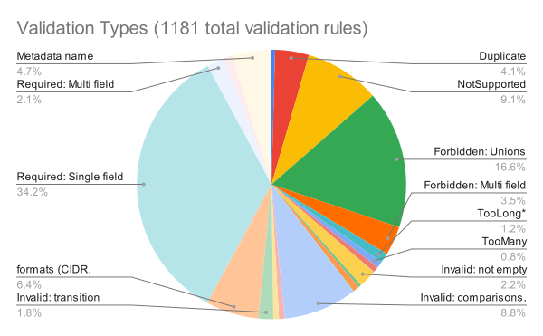
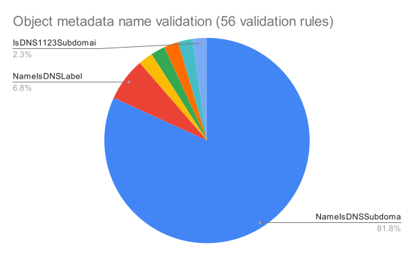

# KEP-5073: Declarative Validation of Kubernetes Native Types With validation-gen
<!-- toc -->
- [Release Signoff Checklist](#release-signoff-checklist)
- [Summary](#summary)
- [Motivation](#motivation)
  - [Goals](#goals)
  - [Non-Goals](#non-goals)
- [Proposal](#proposal)
  - [Overview](#overview)
  - [Introduce <code>validation-gen</code>](#introduce-validation-gen)
    - [<code>validation-gen</code>'s Approach to Dedicated Tags and Escape Hatch Tags](#validation-gens-approach-to-dedicated-tags-and-escape-hatch-tags)
    - [IDL Tag Authoring DevEx and User Error Messaging](#idl-tag-authoring-devex-and-user-error-messaging)
  - [Introduce new validation tests and test framework](#introduce-new-validation-tests-and-test-framework)
    - [New Validations Vs Migrating Validations](#new-validations-vs-migrating-validations)
    - [New Validation Tests](#new-validation-tests)
    - [Ensuring Validation Equivalence With Testing](#ensuring-validation-equivalence-with-testing)
  - [Introduce Feature Gates: <code>DeclarativeValidation</code> &amp; <code>DeclarativeValidationTakeover</code>](#introduce-feature-gates-declarativevalidation--declarativevalidationtakeover)
    - [<code>DeclarativeValidation</code> &amp; <code>DeclarativeValidationTakeover</code> Graduation](#declarativevalidation--declarativevalidationtakeover-graduation)
  - [Linter](#linter)
  - [Documentation Generation](#documentation-generation)
- [DV-Only Graduation Plan](#dv-only-graduation-plan)
  - [Requirements for DV-Only Usage](#requirements-for-dv-only-usage)
  - [Graduation Criteria for DV Tags and Features](#graduation-criteria-for-dv-tags-and-features)
  - [Tag Stability Levels](#tag-stability-levels)
    - [Alpha](#alpha)
    - [Beta](#beta)
    - [Stable](#stable)
  - [DV-Only Implementation Strategy for v1.35](#dv-only-implementation-strategy-for-v135)
  - [DV-Only Implementation Details](#dv-only-implementation-details)
  - [DV-Only Rollout Timeline](#dv-only-rollout-timeline)
  - [Supporting Declarative only validations](#supporting-declarative-only-validations)
    - [The <code>+k8s:declarativeValidationNative</code> Tag](#the-k8sdeclarativevalidationnative-tag)
    - [Generator Behavior and Error Marking](#generator-behavior-and-error-marking)
    - [Stability Enforcement](#stability-enforcement)
    - [Exception for Alpha and Beta APIs](#exception-for-alpha-and-beta-apis)
    - [Behavior for Mixed Validation Scenarios](#behavior-for-mixed-validation-scenarios)
    - [Testing Strategy for Hybrid Types](#testing-strategy-for-hybrid-types)
- [Analysis of existing validation rules](#analysis-of-existing-validation-rules)
  - [User Stories (Optional)](#user-stories-optional)
    - [Kubernetes developer wishes to add a field to an existing API version](#kubernetes-developer-wishes-to-add-a-field-to-an-existing-api-version)
    - [Kubernetes developer adds a new version (v1beta2) of an API](#kubernetes-developer-adds-a-new-version-v1beta2-of-an-api)
    - [Kubernetes Developer Using an Aggregated API and/or KRM Server Is Adding a New Field To Their Custom  API Type](#kubernetes-developer-using-an-aggregated-api-andor-krm-server-is-adding-a-new-field-to-their-custom--api-type)
    - [Kubernetes API reviewer is reviewing API changes for a PR for a new Kubernetes Native Type](#kubernetes-api-reviewer-is-reviewing-api-changes-for-a-pr-for-a-new-kubernetes-native-type)
  - [Notes/Constraints/Caveats (Optional)](#notesconstraintscaveats-optional)
  - [Risks and Mitigations](#risks-and-mitigations)
    - [Risk: The Migration Project Loses Steam And Work Is Abandoned](#risk-the-migration-project-loses-steam-and-work-is-abandoned)
      - [Mitigation: Roll Back All Migrated Fields](#mitigation-roll-back-all-migrated-fields)
    - [Risk: we get hundreds of PRs from people migrating fields and can't review them all.](#risk-we-get-hundreds-of-prs-from-people-migrating-fields-and-cant-review-them-all)
      - [Mitigation: These are not urgent and we will have patterns which can be reviewed by more people.](#mitigation-these-are-not-urgent-and-we-will-have-patterns-which-can-be-reviewed-by-more-people)
    - [Risk: Versioned validation drifts between versions.](#risk-versioned-validation-drifts-between-versions)
      - [Mitigation: round-trip testing + fuzzing + equivalence tests + linting.](#mitigation-round-trip-testing--fuzzing--equivalence-tests--linting)
    - [Risk: Migration to Declarative Validation introduces breaking change to API validation](#risk-migration-to-declarative-validation-introduces-breaking-change-to-api-validation)
      - [Mitigation: Ensure Invalid Objects Still Invalid](#mitigation-ensure-invalid-objects-still-invalid)
      - [Mitigation: Ensure Valid Old Objects Still Valid](#mitigation-ensure-valid-old-objects-still-valid)
    - [Risk: Added latency to API request handling.](#risk-added-latency-to-api-request-handling)
      - [Mitigation: Resolve Known &quot;Low Hanging Fruit&quot; of Performance Improvements In Current Validation Code](#mitigation-resolve-known-low-hanging-fruit-of-performance-improvements-in-current-validation-code)
      - [Mitigation: Avoid Conversion to Internal Type](#mitigation-avoid-conversion-to-internal-type)
    - [Risk: Committing to DV Only Makes Future Reversals More Costly](#risk-committing-to-dv-only-makes-future-reversals-more-costly)
      - [Mitigation: Incremental Adoption and Calculated Risk](#mitigation-incremental-adoption-and-calculated-risk)
    - [Risk: Altered Feature Gate Semantics for Mixed Validation Types](#risk-altered-feature-gate-semantics-for-mixed-validation-types)
    - [Risk: Panics in Mixed Validation Scenarios Cause Validation to &quot;Fail-Closed&quot;](#risk-panics-in-mixed-validation-scenarios-cause-validation-to-fail-closed)
      - [Mitigation: Controlled Scope, Initial Code Review, and Comprehensive Testing](#mitigation-controlled-scope-initial-code-review-and-comprehensive-testing)
- [Design Details](#design-details)
  - [Summary of Declarative Validation Components](#summary-of-declarative-validation-components)
  - [<code>validation-gen</code> Implementation Plan](#validation-gen-implementation-plan)
  - [Catalog of Supported Validation Rules &amp; Associated IDL Tags](#catalog-of-supported-validation-rules--associated-idl-tags)
  - [Supporting Declarative Validation IDL tags On Shared Struct Fields](#supporting-declarative-validation-idl-tags-on-shared-struct-fields)
    - [<code>subfield</code> IDL Tag](#subfield-idl-tag)
    - [<code>validation-gen</code> One-deep typedef Issue And Solution](#validation-gen-one-deep-typedef-issue-and-solution)
      - [Solution](#solution)
  - [Migration Plan](#migration-plan)
    - [Phase1: Initialization (Responsibility of Contributors Implementing the KEP)](#phase1-initialization-responsibility-of-contributors-implementing-the-kep)
    - [Phase2: Scaling the Migration (Responsibility of Contributors Implementing the KEP and broader community)](#phase2-scaling-the-migration-responsibility-of-contributors-implementing-the-kep-and-broader-community)
    - [Phase3: Finalization and GA (Core Team and community)](#phase3-finalization-and-ga-core-team-and-community)
  - [Tagging and Validating Against Versioned Types](#tagging-and-validating-against-versioned-types)
  - [Handling Zero Values in Declarative Validation](#handling-zero-values-in-declarative-validation)
    - [Difficulties with <code>+k8s:required</code> and <code>+k8s:default</code>](#difficulties-with-k8srequired-and-k8sdefault)
    - [Proposed Solutions](#proposed-solutions)
    - [Addressing the Problem with Valid Zero Values Using the Linter](#addressing-the-problem-with-valid-zero-values-using-the-linter)
  - [Immutability Validation](#immutability-validation)
    - [Core Concepts](#core-concepts)
      - [Lifecycle Operations](#lifecycle-operations)
      - [Field Type Lifecycle Behaviors](#field-type-lifecycle-behaviors)
      - [Lifecycle Operations by Field Type](#lifecycle-operations-by-field-type)
      - [Parent Lifecycle Scope Principle](#parent-lifecycle-scope-principle)
      - [List AddItem and RemoveItem “Item” Equality Semantics For Each listType](#list-additem-and-removeitem-item-equality-semantics-for-each-listtype)
      - [Item-Level Constraints](#item-level-constraints)
      - [Validation Tags That Interact With CREATE, and/or UPDATE semantics](#validation-tags-that-interact-with-create-andor-update-semantics)
    - [Immutability Validation Tags](#immutability-validation-tags)
      - [+k8s:update](#k8supdate)
      - [+k8s:immutable](#k8simmutable)
      - [Chainable Tag Semantics](#chainable-tag-semantics)
    - [Common Patterns Reference Enabled By Existing + New Tags: Non-Lists/Maps](#common-patterns-reference-enabled-by-existing--new-tags-non-listsmaps)
    - [Common Patterns Reference Enabled By Existing + New Tags: Lists/Maps](#common-patterns-reference-enabled-by-existing--new-tags-listsmaps)
    - [Common Patterns Reference Enabled By Existing + New Tags: List Items](#common-patterns-reference-enabled-by-existing--new-tags-list-items)
      - [Immutability Patterns and Tags Demonstrated](#immutability-patterns-and-tags-demonstrated)
  - [Cross-Field Validation](#cross-field-validation)
    - [Handling Ratcheting In Cross-Field Validation Tags](#handling-ratcheting-in-cross-field-validation-tags)
  - [Referencing Fields in Validation-Gen For Cross-Field Validation Rules](#referencing-fields-in-validation-gen-for-cross-field-validation-rules)
    - [Field Reference Strategies](#field-reference-strategies)
      - [Field Path Strategy](#field-path-strategy)
      - [Virtual Field Strategy](#virtual-field-strategy)
    - [Choosing Between Field Paths and Virtual Fields](#choosing-between-field-paths-and-virtual-fields)
    - [Tag Placement and Hoisting](#tag-placement-and-hoisting)
    - [Comprehensive Example:](#comprehensive-example)
  - [Subresources](#subresources)
    - [Status-Type Subresources](#status-type-subresources)
    - [Scale-Type Subresources](#scale-type-subresources)
    - [Streaming Subresources](#streaming-subresources)
  - [Ratcheting](#ratcheting)
    - [Core Principles](#core-principles)
    - [Default Ratcheting Behavior](#default-ratcheting-behavior)
      - [Definition of Semantic Equivalence](#definition-of-semantic-equivalence)
    - [Policy on Order-Sensitive List Validation](#policy-on-order-sensitive-list-validation)
    - [Ratcheting and Cross-Field Validation](#ratcheting-and-cross-field-validation)
  - [Test Plan](#test-plan)
      - [Prerequisite testing updates](#prerequisite-testing-updates)
      - [Unit tests](#unit-tests)
      - [Runtime verification testing](#runtime-verification-testing)
      - [Integration tests](#integration-tests)
      - [e2e tests](#e2e-tests)
  - [Graduation Criteria](#graduation-criteria)
    - [<code>DeclarativeValidation</code> Feature Gate](#declarativevalidation-feature-gate)
    - [<code>DeclarativeValidationTakeover</code> Feature Gate](#declarativevalidationtakeover-feature-gate)
    - [Complex Tags](#complex-tags)
    - [Straightforward Tags](#straightforward-tags)
  - [Upgrade / Downgrade Strategy](#upgrade--downgrade-strategy)
  - [Version Skew Strategy](#version-skew-strategy)
- [Production Readiness Review Questionnaire](#production-readiness-review-questionnaire)
  - [Feature Enablement and Rollback](#feature-enablement-and-rollback)
  - [Rollout, Upgrade and Rollback Planning](#rollout-upgrade-and-rollback-planning)
  - [Monitoring Requirements](#monitoring-requirements)
  - [Dependencies](#dependencies)
  - [Scalability](#scalability)
  - [Troubleshooting](#troubleshooting)
- [Implementation History](#implementation-history)
- [Drawbacks](#drawbacks)
- [Alternatives](#alternatives)
  - [Use CEL and OpenAPI libraries directly for K8s Native Types (<a href="https://github.com/kubernetes/enhancements/tree/master/keps/sig-api-machinery/4153-declarative-validation">KEP-4153</a>)](#use-cel-and-openapi-libraries-directly-for-k8s-native-types-kep-4153)
- [Infrastructure Needed (Optional)](#infrastructure-needed-optional)
- [Future Work](#future-work)
  - [&quot;New K8s Native APIs&quot; Design Partner For Declarative Validation in 1.34](#new-k8s-native-apis-design-partner-for-declarative-validation-in-134)
<!-- /toc -->


## Release Signoff Checklist

<!--
**ACTION REQUIRED:** In order to merge code into a release, there must be an
issue in [kubernetes/enhancements] referencing this KEP and targeting a release
milestone **before the [Enhancement Freeze](https://git.k8s.io/sig-release/releases)
of the targeted release**.

For enhancements that make changes to code or processes/procedures in core
Kubernetes—i.e., [kubernetes/kubernetes], we require the following Release
Signoff checklist to be completed.

Check these off as they are completed for the Release Team to track. These
checklist items _must_ be updated for the enhancement to be released.
-->

Items marked with (R) are required *prior to targeting to a milestone / release*.

- [x] (R) Enhancement issue in release milestone, which links to KEP dir in [kubernetes/enhancements] (not the initial KEP PR)
- [x] (R) KEP approvers have approved the KEP status as `implementable`
- [x] (R) Design details are appropriately documented
- [x] (R) Test plan is in place, giving consideration to SIG Architecture and SIG Testing input (including test refactors)
  - [ ] e2e Tests for all Beta API Operations (endpoints)
  - [ ] (R) Ensure GA e2e tests meet requirements for [Conformance Tests](https://github.com/kubernetes/community/blob/master/contributors/devel/sig-architecture/conformance-tests.md) 
  - [ ] (R) Minimum Two Week Window for GA e2e tests to prove flake free
- [x] (R) Graduation criteria is in place
  - [ ] (R) [all GA Endpoints](https://github.com/kubernetes/community/pull/1806) must be hit by [Conformance Tests](https://github.com/kubernetes/community/blob/master/contributors/devel/sig-architecture/conformance-tests.md) 
- [x] (R) Production readiness review completed
- [x] (R) Production readiness review approved
- [ ] "Implementation History" section is up-to-date for milestone
- [x] User-facing documentation has been created in [kubernetes/website], for publication to [kubernetes.io]
- [ ] Supporting documentation—e.g., additional design documents, links to mailing list discussions/SIG meetings, relevant PRs/issues, release notes

<!--
**Note:** This checklist is iterative and should be reviewed and updated every time this enhancement is being considered for a milestone.
-->

## Summary

With this enhancement, Kubernetes Developers will declare validation rules using Interface Definition Language (IDL) tags in the `types.go` files that define the Kubernetes native API types. For example:

```go
// staging/src/k8s.io/api/core/v1/types.go

// ReplicationControllerSpec is the specification of a replication controller.
type ReplicationControllerSpec struct {
        // +k8s:optional
        // +k8s:minimum=0
        Replicas *int32 `json:"replicas,omitempty" protobuf:"varint,1,opt,name=replicas"`

        // +k8s:optional
        // +k8s:minimum=0
        MinReadySeconds int32 `json:"minReadySeconds,omitempty" protobuf:"varint,4,opt,name=minReadySeconds"`
...
}
```

In this example `+k8s:optional`, and `+k8s:minimum` are IDL tags.

The declarative validation IDL tags will be used to generate code via a new code generator - `validation-gen`.  For the above IDL tags the generated code will look something like the snippet below (full file [here](https://gist.github.com/aaron-prindle/39302ba5685d072d02ce0bdb25c2c76c))

```go
func Validate_ReplicationControllerSpec(opCtx operation.Context, obj, oldObj *corev1.ReplicationControllerSpec, fldPath *field.Path) (errs field.ErrorList) {
        // field corev1.ReplicationControllerSpec.Replicas
        errs = append(errs,
                func(obj, oldObj *int32, fldPath *field.Path) (errs field.ErrorList) {
                        if e := validate.RequiredPointer(opCtx, fldPath, obj, oldObj); len(e) != 0 {
                                errs = append(errs, e...)
                                return // do not proceed
                        }
                        errs = append(errs, validate.Minimum(opCtx, fldPath, obj, oldObj, 0)...)
                        return
                }(obj.Replicas, safe.Field(oldObj, func(oldObj  *corev1.ReplicationControllerSpec) *int32 { return oldObj.Replicas }), fldPath.Child("replicas"))...)
        // field corev1.ReplicationControllerSpec.MinReadySeconds
        errs = append(errs,
                func(obj, oldObj *int32, fldPath *field.Path) (errs field.ErrorList) {
                        errs = append(errs, validate.Minimum(opCtx, fldPath, obj, oldObj, 0)...)
                        return
                }(&obj.MinReadySeconds, safe.Field(oldObj, func(oldObj *corev1.ReplicationControllerSpec) *int32 { return &oldObj.MinReadySeconds }), fldPath.Child("minReadySeconds"))...)
        return errs
}
```

This generated code will then be used in the kube-apiserver to validate API requests.

After three releases (v1.33-v1.35) of proven stability via mismatch metrics, the focus is transitioning to GA of the core machinery in v1.36.

## Motivation

Kubernetes API validation rules are currently written by hand, which makes them difficult for users to access directly, review, maintain, and test.

Declarative validation will benefit Kubernetes maintainers:

*   It will make it easier to develop, maintain and review APIs.
*   It will make it easier programmatically inspect and analyze the API, enabling new tools and improved documentation.
*   It will enable improvements to the API machinery. For example, a feature like ratcheting validation will become more tractable to implement because the feature can be implemented once in the declarative validation subsystem rather than piecemeal across the 15k lines of hand written validation code.

Declarative validation will also benefit Kubernetes users:

*   Adding new fields and associated validation rules becomes a simpler process of adding IDL tags to the field definition, rather than writing and maintaining validation functions. This reduces potential inconsistencies and bugs.  Testing is also streamlined as centralized rules and frameworks enable the use of test fixtures across k8s types making creating tests simpler and faster to implement for contributors.
*   Creating k8s APIs becomes faster as developers can focus on the API’s structure and behavior, leaving the validation boilerplate to be generated automatically. This speeds up development and encourages experimentation with new APIs.
*   Validation is performed on versioned types (assuming recommended approach is used from design below), so error message and attributed field path is more likely to be relevant to the user. (ex: some fields in autoscaling/v2 will be mis-identified with current approach but resolved w/ Declarative Validation + versioned types)

Additionally Declarative Validation can be built upon to support features such as:

*   Makes it possible to explore giving users direct access to the actual API validation rules (via publishing OpenAPI rules for native types), which are currently only available to developers willing and able to find and read the hand written validation rules.
*   Makes it possible to explore API composition. In particular CRDs that embed native types (such as PodTemplate), which gain validation of the native type automatically. This has the potential to simplify controller development and improve end user experiences when using CRDs.
*   Makes it possible to explore (eventually) bringing CRD validation and built-in validation together with the same set of server-side validations.
*   Makes it possible to explore client-side validation ("shift-left")

Please feel free to try out the [prototype](https://github.com/jpbetz/kubernetes/tree/validation-gen) to get hands-on experience with this proposed enhancement.

### Goals

*   Eliminate 90% of net-new hand-written validation within 5 kube releases (target start: v1.33)
*   Convert 50% of existing hand-written validation within 5 kube releases (target start: v1.33)
*   Migrate in such a way that if contributors lose steam and abandon this, we can roll it back relatively easily.
*   `types.go` files become the de-facto IDL of Kubernetes for native types. It is worth noting that `+enum` support, `+default` support and similar enhancements all moved our API development forward in this direction. This enhancement is an attempt to continue that story arc.
*   API Validations are readable and manageable. The IDL should be a joy to use for API authors, reviewers and maintainers. Common complex relationships have simple-to-express idioms in the IDL.
    *   Reduce API development costs for API authors and reviewers. Reduce long term maintainer costs. Reclaiming time from core project contributors.
    *   Reduce risk of incorrect validation rules reaching production via API development approach that is easier to get right and harder to get wrong.
*   No change to error message structure for clients. Difference to clients is limited to minimal changes to error detail strings.  The goal is to preserve the `v1.Status` validation error message’s `field` and `reason`, etc. but we reserve the ability to change the `details` which are allowed to be modified over time from k8s guarantees.
*   Enable development of linters for API definition and other API tool chains that use API validation rules and metadata. Further reducing development effort and risk of incorrect validation rules.
*   Retain native (or nearly native) performance.
*   Improve testing rigor by being vastly easier to test.
*   Allow for client-side validation experiments.
*   Establish a low-risk, data-driven path for new APIs to adopt declarative validation natively ("DV-Only") without requiring a handwritten fallback, simplifying API development and review.

### Non-Goals

*   Eliminate 100% of existing hand-written validation.  The goal is to drastically reduce the # of hand-written validation cases only to those that are extra-ordinary but not replace all hand-written validation.
*   To convert validation into a full-featured scripted language
*   It is not a goal of this KEP directly to publish validation rules to OpenAPI
*   It is not a goal of this KEP to expose unenforced validation markers in CR schemas in CR openapi.
*   It is not a goal of this KEP directly to have declarative defaults, only declarative validation rules.  That is the goal of a TBD complementary KEP

## Proposal

### Overview

*   Introduce `validation-gen`
    *   Generates code that is very similar to hand written code (de-risks performance)
    *   Introduce a +tags system that is pluggable and extensible
        *   easy to write custom validators in go (de-risks migration problems that could be caused by a long tail of complex validation rules)
        *   allows fine grained opt-in generation: per group/type/+tag enablement (de-risks adoption)
        *   Can run declarative validation AND hand written generation code during migration (de-risk adoption)
*   Introduce new validation tests, test framework and migration test utilities
    * No field can go thru migration without a robust test for the field in question and maintainer review scrutiny which proves that it is validated correctly before the change and after.
    *   Create migration test pattern and utilities which support testing equivalence between hand-written validation and declarative validation (de-risks migration problems)
*   Introduce featuregate: `DeclarativeValidation` and `DeclarativeValidationTakeover`
    *   Combined allow for safety mechanism in case a mistake is made so that we can safely compare validation errors but have the handwritten validations still be authoritative along the request path.  Additionally users can turn off Declarative Validation and get back to a healthy validation state if necessary.  (de-risks migration problems)
*   Introduce runtime verification testing which emit
    * `declarative_validation_mismatch_total` metric allowing for tests and users to identify any mismatching validation logic between hand-written and declarative validations.
    * `declarative_validation_panic_total` metric which counts the number of panics (recovered) that occur in declarative validation code as an extra precaution.
*   Migration
    *   Migrate schema from one type of a core API group to prove the viability of the approach, in a single PR.
        *   PR will leverage `validation-gen` test framework to demonstrate 100% validation equivalence across hand-written and declarative validation for migrated field(s).
    *   For migrating core API groups the work will be:
        *   Highly incremental.
        *   Easy to review and test.
        *   Easy to distribute.
            *    Leveraging the broader community to speedup migration is key to the success of the project.
    *   Net-new APIs will not be permitted to use declarative validation in the 1.33 release. This decision will be revisited for the 1.34 release.
*   Build linters, documentation-generators, and other tools to make k8s development and API review easier and safer
    *   Example:  Lint rule that verifies that all required/optional field information is correct

### Introduce `validation-gen `

`validation-gen` will parse structured comments (IDL tags) within Kubernetes API type definitions (types.go files) and generate corresponding Go validation functions. `validation-gen` will be built as an extensible framework allowing new "Validators" to be added by describing what IDL tags they parse, the constraints on the IDL tags (for UX error messaging), the format of the IDL tag + how it is used (for documentation), and what actual validation logic will be for the generated code given the tagged field and associated args. The generators validators will be registered with the scheme in a similar way to generated conversion and defaulting.

#### `validation-gen`'s Approach to Dedicated Tags and Escape Hatch Tags 
The development and use of an "escape hatch" tag (CEL expression based tag, etc.) is to only be attempted after a rigorous attempt to use, enhance, or propose a dedicated tag. The goal is to use dedicated IDL tags for the vast majority of validations, ensuring that CEL is reserved for exceptional cases if used at all. Over time, if CEL appears necessary for a validation, additional discussion will occur to prioritize creating a dedicated CEL expression tag.  Currently the aim is to get as far as possible with no CEL for declarative validation tags. This principal mitigates concerns about the potential for overuse of a CEL escape hatch tag and the associated review complexity for common validation rules.

#### IDL Tag Authoring DevEx and User Error Messaging

In order to properly support the User Stories for “Kubernetes developer wishes to add a field to an existing API version” and “Kubernetes developer adds a new version an API” it is important that `validation-gen` and the associated tooling for IDL tags have robust UX that immediately notifies users when tags are not used properly.  To support this `validation-gen` will have options for validators subject to when they register so that validation authors can express how their associated IDL tag should be used and the framework will error if a user uses an IDL tag incorrectly.  See this related WIP PR [here](https://github.com/jpbetz/kubernetes/pull/89) adding such functionality to the prototype for an example of what this might look like.

The goal is that when a user makes a mistake in authoring IDL tags we give a meaningful error.  Users are not expected to know the underlying system or be an insider on the project to successfully use Declarative Validation.

### Introduce new validation tests and test framework

New validation tests will be created as part of the migration process for contributors migrating fields using `validation-gen`.  Additionally, a test framework and associated migration test utilities will be created as part of `validation-gen` to leverage the new centralized validation rules and to ensure validation consistency across hand-written and declarative validation rules.  See the [Test Plan](?tab=t.0#bookmark=id.a86sekfgbuen) section for more details.

#### New Validations Vs Migrating Validations
**New validations** refer to validation rules added to fields or types that did not previously have any validation, or to entirely new API fields or types being introduced. 

**Migrating validations** refer to the process of converting existing handwritten validation logic in `validation.go` files to the new declarative approach using IDL tags. 

The difference is that new validations are implemented directly using IDL tags from the outset, while migrating validations involve a transition from existing handwritten code to IDL tags. Both types of validations will undergo thorough testing. However, migrating validations require additional equivalence testing. This ensures that the behavior of the new declarative validation is identical to that of the original handwritten validation. As a safeguard, until the GA stage, all newly generated validations will be used in conjunction with the existing handwritten validation code. This dual implementation allows for a smooth rollback if needed.


#### New Validation Tests
As part of the process for migrating fields, contributors will scrutinize and improve as needed the current validation tests.  No field can go thru migration without a robust test for the field being migrated, which proves that it is validated correctly before the change and after. Many existing tests are not sufficient to verify 100% equivalency and need retooling.  This allows us to de-risk migration problems by scrutinizing the current tests and enhancing them.

#### Ensuring Validation Equivalence With Testing

For testing the migration and ensuring that the validation is identical across current hand-written validation and declarative validations, an equivalence test will be added to all migrated fields, schemas, etc. in the respective validation_test.go.  This will verify that the outputs for validation_test.go are identical across enabling and disabling the featuregate - `DeclarativeValidation`.

Verifying that a field/type that is migrated is appropriately tested with proper changes to validation_test.go, equivalence testing, etc. will be human-driven enforced in PR review for the related community migration PR.

Additionally, to aid in ensuring that the validation is identical across current hand-written validation and declarative validations, we will create a runtime check controlled by the `DeclarativeValidation` and `DeclarativeValidationTakeover` feature gates. When `DeclarativeValidation` is enabled, both hand-written and declarative validation will be run.  Any mismatches will be logged and a `declarative_validation_mismatch_total` metric will be incremented.  The `DeclarativeValidationTakeover` gate controls which result (imperative or declarative) is returned to the user.
### Introduce Feature Gates: `DeclarativeValidation` & `DeclarativeValidationTakeover`

Two feature gates were introduced to manage the rollout:

*   **`DeclarativeValidation`**: This gate controls whether declarative validation is *enabled* for a given resource or field. After reaching GA in v1.36, it ensures the core machinery is always available.
*   **`DeclarativeValidationTakeover`**: This gate determines *which* validation result (imperative or declarative) is returned to the user when `DeclarativeValidation` is also enabled.

#### `DeclarativeValidation` & `DeclarativeValidationTakeover` Graduation

*   **Beta to GA (v1.36)**:
    *   `DeclarativeValidation` reaches GA in v1.36.
    *   Three release cycles with no `declarative_validation_mismatch_total` or `declarative_validation_panic_total` failures in production (achieved v1.33-v1.35).

### Linter

As we transition from handwritten validation to a declarative approach using validation tags, a linter becomes essential to ensure the correct and consistent use of these tags. It will maintain the integrity of the validation process during and after the migration. It will also enforce the rules around using validation tags, preventing common mistakes (e.g. see Tri-state mutual exclusive option for handling zero values) and ensuring that the generated validation logic behaves as intended.

We will integrate the linter functionality directly into `validation-gen` and control it using a command-line flag, `--lint. `When `--lint `is added the command won’t generate code, but only prints out the linting result. The `--lint` would run in the presubmit to block the code change with invalid tags. Some pros of this method include:

*   **Leveraging Existing Infrastructure:** The linter can leverage the existing code in `validation-gen` for parsing Go source files, extracting validation tags, and traversing the type tree.
*   **Integration with Code Generation:** The linter can be integrated into the code generation workflow, ensuring that validation tags are checked before code is generated. For example, we could add a `--lint` flag.
*   **CI Integration:** It's easy to integrate the linter into CI pipelines as part of the build and test process. We could run `validation-gen` with `--lint` flag and fail the build if any linting errors are found.

### Documentation Generation

By having all validators, associated IDL tags, their descriptions, etc.  defined in code it is possible to automatically generate the documentation necessary for IDL tags which k8s developers can reference. This allows for: 

*   Publishing documentation on all tags including how they work, their intended usage, examples, etc.
*   Building a system to auto-gen docs from this

## DV-Only Graduation Plan

### Requirements for DV-Only Usage
For any validation tag or feature to be used in a DV-Only context, it must meet the following requirements:
* Guaranteed GA Semantics: All horizontal features/semantics used by DV-Only tags must be GA and cannot be disabled. This ensures consistent behavior across clusters and versions. All tags in DV-Only usage must be GA.
* Proven Stability: The tag/feature must have been proven stable through on-by-default usage for at least one release cycle with no metric failures observed in production.
* No Backwards-Incompatible Changes: The validation semantics must not change in backwards-incompatible ways between versions.

### Graduation Criteria for DV Tags and Features
Horizontal Features Must be GA before any DV-Only usage.  An example of such features include ratcheting, subresource support, and update correlation  Individual validation tags must also graduate to GA/stable before any DV-Only usage.   GA/stable is proven by the features and tags meeting the below criteria:
* One full release cycle (~3-4 months) of production usage with no declarative_validation_mismatch_total or declarative_validation_panic_total metric failures
* Declarative Validation Workgroup confirmation that the feature is considered GA/stable

### Tag Stability Levels

Each Declarative Validation tag is assigned one of three stability levels: Alpha, Beta, or Stable. A validation is considered "non-stable" if it uses any non-stable tags in its definition.

#### Alpha

*   **Description**: Alpha tags are experimental, intended for early development and testing, and are subject to backward-incompatible changes.
*   **Guarantees**: Backward-incompatible changes are allowed. All in-tree tag usage will be updated to adapt to the change, but out-of-tree tag usage may break.
*   **Usage**: When used in the Kubernetes repository, Alpha tags must be mirrored with a handwritten implementation.

#### Beta

*   **Description**: Beta tags are more mature, have been tested, and are not expected to change in backward-incompatible ways.
*   **Guarantees**: All modifications to Beta tags must be backward-compatible.
*   **Usage**: Beta tags may be used in Kubernetes features/APIs that are in the Alpha or Beta stage of their lifecycle. Beta tags may be defined as 'DV-Only' validations i.e., on fields marked with `+k8s:declarativeValidationNative`) when used with Alpha or Beta features/APIs. Stable Kubernetes features/APIs may only use Beta tags when mirrored with hand written validation.

#### Stable

*   **Description**: Stable tags are production-ready and have undergone rigorous testing.
*   **Guarantees**: All modifications must be backward-compatible.
*   **Usage**: Stable tags may be used with all features/APIs. Stable tags may be defined as 'DV-Only' validations (i.e., on fields marked with `+k8s:declarativeValidationNative`).

### DV-Only Implementation Strategy for v1.35
No DV-Only usage will be permitted in v1.35. Instead, the v1.35 release will focus on:

* Data Collection: Use v1.33,  v1.34 and v1.35 to gather stability metrics for:
  * Ratcheting behavior
  * Declarative Validation tags used and “on-by-default” in these releases
* Dual Implementation Requirement: New API fields must implement both declarative validation tags AND handwritten validation code.
* Simplified Migration Path: To ease the dual implementation requirement and prepare for v1.36 DV-Only we plan on providing a library of validation methods corresponding to DV tags.  This way users can more easily onboard onto declarative tags and in the future allows for more easily migrating fully to declarative validation.

### DV-Only Implementation Details

The implementation of DV-Only support will enable new API fields to be validated using only Declarative Validation (DV) tags without requiring parallel handwritten Go code.

Execution of Declarative Validations: For any API type that includes at least one "DV-Only" validation rule, the generated declarative validation code will always be executed. This ensures that the DV-Only rules are always enforced. As noted in the KEP risks, "The declarative validation code path for these types will always run, regardless of the feature gate's setting, to ensure the authoritative 'DV-Only' rules are enforced".

Error Differentiation: A mechanism will be implemented within the validation runtime to distinguish between errors arising from "DV-Only" rules and those from "Migrated" DV rules (which are still under dual implementation with handwritten code).

"DV-Only" Errors Always Enforced: Validation errors identified as originating from "DV-Only" rules will always be included in the final set of errors returned to the user. Their enforcement is not controlled by the feature gates.

Feature Gate Scope Limited to Migrated Rules: The behavior of the DeclarativeValidation and DeclarativeValidationTakeover feature gates will be limited to the "Migrated" portions of the validation logic. These gates will control whether the handwritten or declarative version of a migrated rule is authoritative and if comparisons are done, but they will not affect the enforcement of "DV-Only" rules.

Panic Handling ("Fail-Closed"): In API types that combine DV-Only and migrated rules, any panic occurring within the declarative validation execution path will cause the entire validation to fail, and an error will be returned. This "fail-closed" behavior is necessary because it's not possible to isolate the source of the panic to a specific rule type, and DV-Only rules must always be enforced to ensure the integrity of new API fields. Rigorous testing, as outlined in the "Mitigation" section of the KEP, will be crucial to prevent panics.

This implementation strategy allows new fields to natively adopt Declarative Validation, streamlining development, while coexisting with the ongoing migration of existing handwritten validations.
### DV-Only Rollout Timeline
v1.33 - v1.34 (completed):

* ReplicationController migration with +k8s:minimum, +k8s:optional and default ratcheting
* CSR migration with +k8s:item, +k8s:zeroOrOneOfMember, +k8s:listType=map, +k8s:listMapKey, and list ratcheting
* Begin collecting stability metrics

v1.35 (current plan):

* No DV-Only usage permitted
* Continue migrations and net new API field validation logic with dual implementation (DV + hand-written) requirement
* Expand tag coverage for data collection
* Implement validation library for simplified dual implementation
* CSR migration adds: +k8s:item, +k8s:zeroOrOneOfMember, list ratcheting

v1.36 (target):

* Enable DV-Only for GA-graduated tags (pending v1.34/v1.35 metrics validation)
* Initial set limited to “low-risk” tags with proven stability
* Maintain dual implementation for non-GA tags
* Decision point: Review metrics and determine final GA tag set for v1.36

v1.37+:
* Enable DV-Only for expanding set of GA-graduated tags and features (pending v1.36+ metrics validation)

### Supporting Declarative only validations
To support declarative only validations rules for new APIs and validations, a new `+k8s:declarativeValidationNative` marker tag will be adopted.

#### The `+k8s:declarativeValidationNative` Tag

This field-level tag asserts that the field's validation is handled exclusively by other stable `+k8s:` validation tags on the same field.

#### Generator Behavior and Error Marking

The `validation-gen` tool will recognize this tag and wrap generated validation errors with the `.MarkDeclarativeOnly()` method. This allows programmatic identification of native declarative validations.

#### Stability Enforcement

`validation-gen` will enforce that only stable validation tags are used with `+k8s:declarativeValidationNative`. If a field is marked with this tag but uses an Alpha or Beta validation tag, the code generator will fail.

#### Exception for Alpha and Beta APIs

Alpha and Beta APIs may permitted the use of Alpha and Beta validation tags. This non stable validations must be mirrored by handwritten validations to graduate the API. This enforcement will be done by the code generator, It will fail to generate validation code for non stable types for graduated API's.

#### Behavior for Mixed Validation Scenarios

For types with declarative-only validations, the `DeclarativeValidation` feature gate is ineffective. All declarative validations will always run, and errors coming from declarative only validations will be filtered and returned.

#### Testing Strategy for Hybrid Types

Specific tests for hybrid types will verify that:
1.  "DV-Only" validations are always enforced.
2.  Feature gates only affect migrated rules.
3.  Errors are correctly aggregated.
4.  Execution is panic-proof.

## Analysis of existing validation rules

At the time of writing this document, there are ~1181 validation rules written in about 15k lines of go code in [kubernetes/kubernetes/pkg/apis](https://github.com/kubernetes/kubernetes/commit/0c62b122c02bff9131b6db960042150a3638d3f3).

~15% of the ~1181 validation rules are `forbidden` rules which primarily check which fields are allowed when a union discriminator is set, ~10% are object name validations, and ~10% are cross field validation checks, mainly mutual exclusion and some "transition rules" (e.g. immutability checks).  The remaining 65% of validation rules can be represented using JSON Schema value validations. `optional`, `format` and `enum` will be the most frequently used.  

Based on this analysis we believe that the proposed `validation-gen` design can meet our final goals of 50% of the current hand-written validation logic via IDL tags with declarative validation replacement logic within the next five kube-releases and 90% of net-new validations within the next five kube-releases.  




### User Stories (Optional)

#### Kubernetes developer wishes to add a field to an existing API version

1. Developer adds the field to the Go struct
2. Developer adds needed validation IDL tags to the Go struct
    *   In the case the developer incorrectly uses an IDL tag, `validation-gen` promptly gives a detailed error message identifying to the user which tag needs to be fixed.
3. Developer adds validation_test.go cases (same as today)
4. API reviewers review IDL tags along with Go struct change

#### Kubernetes developer adds a new version (v1beta2) of an API

1. Developer copies over v1beta1 API and creates v1beta2
2. Linter verifies that IDL tags match for both version of API (unless exceptions are put in exception file for the linter)
3. API reviewer can review change knowing that validation is consistent

#### Kubernetes Developer Using an Aggregated API and/or KRM Server Is Adding a New Field To Their Custom  API Type

1. Developer defines validation rules declaratively on the field using the same IDL tags (+k8s:minimum, +k8s:format, etc.) as Kubernetes native types directly in their types.go files.
2. Developer leverages the published validation-gen code generator from Kubernetes to automatically generate updated Go validation functions for their custom API type.
	
#### Kubernetes API reviewer is reviewing API changes for a PR for a new Kubernetes Native Type

1. Reviewer directly examines validation IDL tags on the APIs in the new types.go file (next to the API definitions).
    *    Reviewer grasps validation intent of each field as IDL tags provide a concise and declarative way to understand the validation rules at a glance
3. CI linter job automatically verifies the consistency and proper usage of the specified IDL tags (eg: field doesn’t have both +k8s:required and +k8s:optional, etc.)
4. Reviewer reviews PR focusing on the overall API design and ensuring the PR’s validation rules effectively support the API's intended behavior.

### Notes/Constraints/Caveats (Optional)

### Risks and Mitigations

#### Risk: The Migration Project Loses Steam And Work Is Abandoned

##### Mitigation: Roll Back All Migrated Fields

In the case that the workstream loses steam over time and the migration project is abandoned, users can still roll back to the previous hand-written validation by disabling the `DeclarativeValidation` feature gate.

#### Risk: we get hundreds of PRs from people migrating fields and can't review them all. 

##### Mitigation: These are not urgent and we will have patterns which can be reviewed by more people.

The migration to declarative validation is not time-sensitive. We can proceed at a comfortable pace, and the process will be broken down into small, manageable PRs. This allows for a wider pool of reviewers to participate, including those who may not be deeply familiar with the intricacies of API validation. The use of standardized IDL tags and generated code will establish clear patterns, making it easier for reviewers to understand and assess the changes.

#### Risk: Versioned validation drifts between versions.

##### Mitigation: round-trip testing + fuzzing + equivalence tests + linting.

In order to prevent issues with versioned validation drifting between versions, we plan on using round-trip testing, fuzz testing, equivalence testing (including runtime equivalence testing with `declarative_validation_mismatch_total`) and lint rules which ensure that rules that should be synced across versions are.

#### Risk: Migration to Declarative Validation introduces breaking change to API validation

##### Mitigation: Ensure Invalid Objects Still Invalid

Objects which previously did not pass validation must still not pass validation. This can be restated simply as: all currently handwritten validations must be included in the schema. If all validations are in the schema, it follows that the schema will reject the same set of objects as before.

We can mitigate this by:

1. All Validation Tests Have 100% Coverage
2. All Validation Tests Succeed against native and schema-based validation backends

To accomplish this, we will implement the test framework and test utilities mentioned in "Test Plan”

##### Mitigation: Ensure Valid Old Objects Still Valid

Objects which previously passed validation must still pass validation. For our purposes this can be thought of as ensuring the schema-based validation does not raise new errors which previously did not exist.

It is not possible to be 100% sure of this property, in fact, there may be new validations added to patch bugs in existing ones. But we can mitigate this risk:

0. PREREQUISITE - No field can go thru migration without a robust test for the field in question, which proves that it is validated correctly before the change and after. 

Many existing validation tests do not account for all required valdiation cases.  It is possible that if there is unintentionally a change some small aspect of it (making validation for an existing field weaker or stronger) there could be errors in the migration. The only real solution is to scrutinize and retool tests.

1. Catch and fix any significant differences in schema validations

To help catch these errors faster, we will also refactor all e2e tests to enable this feature and check for validation error differences.

2. Minimize the impact of any new changes introduced

As mentioned in the section - “Ratcheting” `validation-gen` is capable of supporting any desired ratcheting behaviour.  Validation Ratcheting would reduce impact to users by allowing any new schema validations errors due to this feature to be ignored for unchanged portions of an object.

#### Risk: Added latency to API request handling.

**NOTE:** The validation path has NEVER been a target for efficiency optimizations, it is likely there is currently low-hanging fruit with respect to optimizing.  Currently the code does such things as deep-copies, use reflect, build maps of 3 items, etc.  

The design decision to declaratively validate API versions has performance implications.

Today, the apiserver's request handler decodes incoming versioned API requests to the versioned type and then immediately performs an "unsafe" conversion to the internal type when possible. All subsequent request processing uses the internal type as the "hub" type. Validation is written for the internal type and so are per-resource strategies.

Assuming we use the recommended plan of declarative validation operating on versioned types, the internal type will no longer be responsible for validation.

We will convert from the internal back to the version of the API request for validation introducing one additional conversion. If we make this an "unsafe" conversion, then it will be low cost for the vast majority of requests.

We will benchmark this approach and plan to use it for beta.

**NOTE**: Long term, it is possible that we could make one of versioned types be the hub type:

Since the internal type will no longer be used for validation, it becomes a lot less important. It is still important to have a hub type. But why not pick one of the versioned types to be the hub type? The vast majority of APIs only have one version anyway. The obvious candidate version to choose for the hub version would be the preferred storage version.

Switching to a versioned type for the hub type would have a few implications:

*   We would eliminate the need for internal versions.
*   We would introduce more conversion when API request version differs from the hub version. But beta APIs are off-by-default and we expect a lot less mixed version API usage than in the past.
*   Would require rewriting in tree admission plugins.

This "hub version" change is something that could be made independent of this KEP, just noting the idea here.

##### Mitigation: Resolve Known "Low Hanging Fruit" of Performance Improvements In Current Validation Code

From analyzing the validation code there is "SO MUCH low-hanging fruit" - @thockin with respect to performance improvements.  As such it is likely Declarative Validation can cover any perf deficit by improving validation performance generally. One example of this that already came up is related to the algorithm used for `listmap` (see prototype for more information)

##### Mitigation: Avoid Conversion to Internal Type

**NOTE** This would be a SIGNIFICANT undertaking to prove defaulting and admission is equivalent. 

Requests are received as the versioned type, so it should be feasible to avoid extra conversions for resources that have no need of handwritten validations.  This is likely not necessary given the known "low hanging fruit" of performance improvements but mentioned for completeness.

#### Risk: Committing to DV Only Makes Future Reversals More Costly
By allowing new APIs to be developed with "DV-Only" rules (w/ no handwritten fallback), we are establishing DV as an authoritative component for those APIs. If a future decision were made to back out of the Declarative Validation initiative entirely, it would become significantly more work. We would need to perform a reverse migration to generate handwritten validation code from the DV tags for these new APIs before removing the DV tooling.
##### Mitigation: Incremental Adoption and Calculated Risk
This is a calculated risk that reflects growing confidence in the Declarative Validation project. The "DV-Only" approach is limited to net-new validations on new fields, which provides a clear and contained path for adoption. All new validations will be on new fields, which are always feature gated.  It does not affect the rollback strategy for existing types that are being migrated. This incremental step allows us to prove the value of DV for new development while the broader migration of legacy code continues under the safety of the existing feature gate mechanism.
#### Risk: Altered Feature Gate Semantics for Mixed Validation Types
"DV-Only" rules changes the initial behavior of the DeclarativeValidation feature gate for any API type that adopts them. For the "migrated validation only" cases (w/ no "DV-Only') setting DeclarativeValidation=false acts as a complete off-switch, preventing the execution of any generated declarative validation code.

For new API types that mix "DV-Only" and migrated validations, this is no longer the case. The declarative validation code path for these types will always run, regardless of the feature gate's setting, to ensure the authoritative "DV-Only" rules are enforced. The DeclarativeValidation gate's role is reduced to only controlling whether the system performs a comparison against handwritten rules for the migrated portion of the validation (w/ DeclarativeValidation controlling nothing in these cases and DeclarativeValidationTakeover controlling if handwritten or declarative validation is the authoritative validator). This creates a dual-behavior system for the feature gates, which could be confusing for operators and violates the expectation that a feature gate can fully disable a feature's code path.
##### Mitigation: Controlled Scope and Communication
This is a calculated trade-off to enable progress and native adoption of Declarative Validation for new APIs. The mitigation strategy relies on clear distinctions of the implementation patterns and communication:

* **Controlled Scope and Low-Risk Adoption:** The initial scope for "DV-Only" is strictly limited. We will manage risk by targeting:
    * **Low-Risk Validations:** We will not use the "DV-Only" approach for new, highly complex validation rules. The focus is on clear, straightforward rules.
    * **Low-Risk Fields:** "DV-Only" validations will only be added to net-new fields, which are independently controlled by their own feature gates. This prevents any impact on the stability of existing, stable API fields.

* **Documentation and Communication:** Documentation will clearly describe this dual-mode behavior, explaining when and why the declarative validation code always runs for certain types. This ensures cluster administrators understand the behaviour of the declarative validation feature gates.
#### Risk: Panics in Mixed Validation Scenarios Cause Validation to "Fail-Closed"
For API types that mix "DV-Only" rules with migrated DV rules, the behavior in the event of a panic changes significantly. In the existing migration-only case (eg: ReplicationController, CSR, etc.), if a panic occurs in the declarative validation code while DeclarativeValidationTakeover is false, the panic is recovered and ignored. The system "fails open" by falling back to the trusted handwritten validation result.

However, in a mixed validation scenario, the system cannot distinguish whether a panic originated from a "DV-Only" rule or a feature-gated migrated rule. To ensure new APIs are not left with unenforceable validation, any panic in the declarative validation path will cause the entire validation to fail, returning an error to the user. This "fail-closed" behavior is safer for new APIs but means a bug in a migrated rule—which would have previously been safely ignored—could now block the creation or update of new API types that are adopting DV natively.
##### Mitigation: Controlled Scope, Initial Code Review, and Comprehensive Testing
* **Controlled Scope and Low-Risk Adoption:** The initial scope for "DV-Only" is strictly limited. We will manage risk by targeting:
    * **Low-Risk Validations:** We will not use the "DV-Only" approach for “risky” or complex validation rules. The focus is on clear, straightforward rules.
    * **Low-Risk Fields:** "DV-Only" validations will only be added to net-new fields (& their validation), which are independently controlled by their own feature gates. This prevents any impact on the stability of existing, stable API fields.
* **Code Review:** The generated declarative validation code is checked into the repository. This makes the code fully reviewable as we start DV-Only, allowing reviewers to catch potential issues before they are merged.  Once DV-Only is established the generated code can be glimpsed/assumed-correct similar to other k8s generated code.
* **Comprehensive Unit and Fuzz Testing:** The generated validation logic for these new types will undergo unit and fuzz testing. The primary goal of this testing is to ensure the code is error-proof and, most importantly, panic-proof, directly addressing the "fail-closed" concern.

## Design Details

### Summary of Declarative Validation Components

*   validation-gen - new code generator which parses declarative validation IDL tags and outputs validation go code
    *   Validators
    *   Test fixture
    *   Linter
    *   Documentation generator
*   Feature gates - `DeclarativeValidation`& `DeclarativeValidationTakeover`
*   Metrics - `declarative_validation_mismatch_total` & `declarative_validation_panic_total`
*   Testing
    *   Equivalency tests (verifyVersionedValidationEquivalence in prototype)
        *   validation_test.go
    *   Fuzz Testing (TestVersionedValidationByFuzzing in prototype)

### `validation-gen` Implementation Plan

validation-gen will be a code generator (similar to defaulter-gen, conversion-gen, protobuf-gen, etc.) and integrated into the current k8s code generation framework similarly.  It can be invoked similar to other code generators (see command below) and will be plumbed through similar to other generators:
```bash
$ hack/update-codegen.sh validation
```

Validators are plugged into the `validation-gen` framework (new).  To implement a `Validator` (like the `enumValidator` below), users implement a Validator interface which in the prototype consists of:

*   Init
*   TagName
*   ValidScopes
*   GetValidations
*   Docs

Below is a snippet from the enumValidator detailing the core logic of `GetValidations `and registration:
```go
var enumValidator = types.Name{Package: validationPkg, Name: "Enum"}

func (etv *enumTagValidator) GetValidations(context Context, _ []string, payload string) (Validations, error) {
        if context.Type != types.String {
                return Validations{}, fmt.Errorf("can only be used on string types")
        }

        var result Validations

        if enum, ok := etv.enumContext.EnumType(context.Parent); ok {
                supportVarName := PrivateVar{Name: "SymbolsFor" + context.Parent.Name.Name, Package: "local"}
                supportVar := Variable(supportVarName, GenericFunction(enumTagName, DefaultFlags, setsNew, []types.Name{enum.Name}, enum.ValueArgs()...))
                result.AddVariable(supportVar)
                fn := Function("enum", DefaultFlags, enumValidator, supportVarName)
                result.AddFunction(fn)
        }

        return result, nil
}

func init() {
    AddToRegistry(EnumValidator) // Registers +k8s:enum
}
```

validation-gen processes types.go files, searching for tags. For example:

```go
type DeploymentStrategy struct {
    Type DeploymentStrategyType
    …
}
// +k8s:enum // <---- THIS IS A validation-gen TAG
type DeploymentStrategyType string
const (
    RecreateDeploymentStrategyType DeploymentStrategyType = "Recreate"
    RollingUpdateDeploymentStrategyType DeploymentStrategyType = "RollingUpdate"
)
```

When a tag is found by validation-gen.  validation-gen uses the plugins to generate the appropriate code:

```go
// generated
var symbolsForDeploymentStrategy = sets.New[E1](v1.Recreate, v1.RollingUpdate)

func Validate_DeploymentStrategy(in *v1.DeploymentStrategy, 
        fldPath *field.Path) (errs field.ErrorList) {
    errs = append(errs, validation.ValidateEnum(
        fldPath.Child("type"), in.Type, symbolsForDeploymentStrategy)...)
    return errs
}
```

The generator will also auto register all validations in the runtime.Scheme.

Once validation is generated, it will be easy to opt-in (see below snippet).

**NOTE:** This does not actually do anything until the tags are used on types/fields, and all tags are net-new. None of the existing tags cause any validation code to be generated as designed by having our own bespoke tags (eg: `+k8s:required`(new w/ `validation-gen`) vs `+required`(old), etc.)

```go
// +k8s:validation-gen=TypeMeta
// +k8s:validation-gen-input=k8s.io/api/apps/v1
```

### Catalog of Supported Validation Rules & Associated IDL Tags
A number of the rules in the below sections are not implemented but will be trivial to implement once we are are aligned on the right pattern/syntax for the given validator. Implementing a validator “just-in-time” means we don't add more without real fields using them. We estimate that in the limit we may have 30-40 validators, but today we have less than 10.  

The below rules are currently implemented or are very similar to an existing validator in the [valdation-gen prototype](https://github.com/jpbetz/kubernetes/tree/validation-gen)


| **Type of validation** | **IDL tag** | **Relative OpenAPI validation field** | **Stability Level (in 1.35 release) ** |
| :--- | :--- | :--- | :--- |
| string format | `+k8s:format={format name}` | `format` | Beta |
| size limits | `+k8s:min{Length,Items}`, `+k8s:max{Length,Items}` | `min{Length,Items}`, `max{Length,Items}` | Beta |
| numeric limits | `+k8s:minimum`, `+k8s:maximum`, `+k8s:exclusiveMinimum`, `+k8s:exclusiveMaximum` | `minimum`, `maximum`, `exclusiveMinimum`, `exclusiveMaximum` | Beta |
| required fields | `+k8s:optional`, `+k8s:required` | `required` | Beta |
| enum values | `+k8s:enum` | `enum` | Beta |
| Union values | `+k8s:unionMember`, `+k8s:unionDiscriminator` | `oneOf,anyOf,allOf` | Alpha |
| forbidden values | `+k8s:forbidden` | | Alpha |
| item | `+k8s:item` | | Alpha |
| zeroOrOneOfMember | `+k8s:zeroOrOneOfMember` | | Alpha |
| listType | `+k8s:listType=map`, `+k8s:listType=set`, `+k8s:listType=atomic` | `x-kubernetes-list-type` | Beta |
| listMapKey | `+k8s:listMapKey` | `x-kubernetes-list-map-keys` | Beta |
| Conditional (feature gate) | `+k8s:ifOptionEnabled(FeatureX)=<validator-tag>` | N/A | Alpha |
| Conditional (feature gate) | `+k8s:ifOptionDisabled(FeatureX)=<validator-tag>` | N/A | Alpha |
| Iterate and validate map keys | `+k8s:eachKey=<validator-tag>` | N/A | Alpha |
| Iterate and validate map/slice values | `+k8s:eachVal=<validator-tag>` | N/A | Alpha |
| Sub-field validation | `+k8s:subfield(field)=<validator-tag>` | N/A | Alpha |
| Immutability | `+k8s:immutable` | N/A | Alpha |
| UPDATE transition control (granular immutability) | `+k8s:update=[NoSet,NoModify,NoClear]` | N/A | Alpha |
| List map item (virtual field) | `+k8s:item(key: value)` | N/A | Alpha |

### Supporting Declarative Validation IDL tags On Shared Struct Fields

IDL tags may be used directly on type declarations and indirectly on field and type aliases. For example:

```go

type ObjectMeta struct {
	// ISSUE: we can't add both IDL tags to the shared struct field directly
    // +k8s-format=dns-label
    // +k8s-format=ip
	Name string
}

type Foo struct {
    // Foo.Name should be a DNS label
  metav1.ObjectMeta
}

// Foo wants Foo.Name to be ...
type Bar struct {
  // Bar.Name should be an IP address
  metav1.ObjectMeta
}

```

Shared types present a challenge. For example, different Kubernetes resources have different validation rules for `metadata.name` and `metadata.generateName`. But all resources share the `ObjectMeta` type.

#### `subfield` IDL Tag

To handle this case, we provide an IDL tag - `k8s:subfield(&lt;field-json-name>)` which can be used to specify a `subfield` validation to add to parent which validates against the the `subfield` value:

```go
type Struct struct {
  // +k8s:subfield(name)=+k8s:format=dns-label
  metav1.ObjectMeta
}
```

This will also support chaining of subfield calls with other validators (including subfield) which allows for setting subfield validations on arbitrarily deep nested fields of shared structs.  An exaggerated example showcasing this is below: \

```go
// +k8s:subfield(sliceField)=+k8s:eachVal=+k8s:subfield(stringField)=+k8s:<desired-validaton-rule>
```


#### `validation-gen` One-deep typedef Issue And Solution

In `validation-gen` simple one-deep typedefs work, but not two-deep.  

Given:
```go
// +k8s:minLength=4
type Foo string

// +k8s:maxLength=16
type Bar Foo

type Struct struct {
    // +k8s:format=dns-label
    FooField Foo

    // +k8s:format=dns-label
    FooField Bar
}
```

In the above example, FooField would be validated as a DNS label and require at least 4 characters which is expected.  What might also be expected though is that BarField would be validated as a DNS label, require at least 4 characters, and require having no more than 16 characters. INCORRECT!  Due to Go's type system, the relationship of type Foo -> string is represented, but type Bar -> type Foo -> string is flattened to type Bar -> string.  This leads to a currently open question around the severity of this potential UX issue as well potential solutions on how this could be mitigated if needed.

##### Solution

**NOTE**: The solution below does not target the v1.33 timeline but v1.34+ when this functionality is more relevant as more users utilize Declarative Validation.

To mitigate this issue for users we will implement the chain of typedefs logic and use this to lint IDL tags such that we issue warnings/errors to alert users of the behaviour of n-deep nested typedefs cases.  This way there is better UX for users as they are notified not to use IDL tags that might lead to unintended outcomes when adding IDL tags (vs only documenting this)

As we get feedback from our design partners, if there is a necessity to extend the above AST logic that is used for linting to instead allow for full support of n-deep nested typedefs we will implement re-discovering the chain of typedefs and implement nested typedef for IDL tags.

### Migration Plan

This plan outlines the steps involved in migrating Kubernetes API validation from handwritten code to a declarative approach using validation tags and code generation. The process of migration will be incremental and community-driven. 

We should be able to start the migration when:

*   `validation-gen` is functional with the required set of tags implemented from the list above for Beta and then GA
*   `DeclarativeValidation` feature gate is introduced.
*   A linter is available (`validation-gen --lint`).

#### Phase1: Initialization (Responsibility of Contributors Implementing the KEP)

1. Implement the test plan: [Validation Test Framework](https://docs.google.com/document/d/143KUaYcrEnxEWwPWrQH5P0MsF_V2Yrr8bsXJY76g86I/edit?resourcekey=0-K-n-yyITXtHbKVZnT9kAtw&tab=t.0#heading=h.hkbvgeat5xy8)
2. Prototype and Initial API Selection (Core Team)
*   Select a small set of representative Kubernetes API resources. (core/v1/replicationcontroller)
*   Implement a working prototype by applying the entire process (adding IDL tags, generating code, updating tests) to these selected resources.
3. Documentation and Contribution Guide (Core Team):
*   Write documentation explaining how to:
    *   Add validation tags (IDL tags).
    *   Run validation-gen.
    *   Update unit and E2E tests.
*   Publish a contribution guide for the declarative validation migration.

#### Phase2: Scaling the Migration (Responsibility of Contributors Implementing the KEP and broader community)

1. Tracking Issue and Progress Management:
*   Create a central tracking issue on GitHub.
*   Break down the migration into smaller, manageable tasks. There are couple of options:
    *   Per validation rule (recommended): Migrate a single validation rule for a specific field. E.g., `+k8s:minimum=0` for field `ReplicationControllerSpec.Replicas`
    *   Per Field (recommended): Migrate all validation rules for a single field.
    *   Per Type: Migrate all validation rules for a single API. e.g. all validation rules of `ReplicationControllerSpec`.
    *   Per Group (not recommended): Migrate the entire API group/version.
*   Label tasks appropriately.
2. Community-Driven API Migration:
*   Community:
    *   Analyze existing handwritten validation.
    *   Add appropriate IDL tags to API type definitions.
    *   Run `validation-gen` to generate validation code.
    *   Update unit tests to use the generated validation and ensure coverage.
    *   Update E2E tests to verify behavior with declarative validation.
    *   Submit pull requests (PRs) with the changes.
*   Core Team:
    *   Provide technical guidance and support to community contributors.
    *   Review PRs.
    *   Monitor the tracking issue and adjust the plan as needed.
    *   Add/extend validators to enable further progress into non-trivial cases
3. Using Schemas for Validation (Joint Effort):
*   Core Team:
    *   Enable validation through generated schemas for migrated resources (controlled by DeclarativeValidation feature gate).
    *   Implement logic to populate default values from schemas.
*   Community:
    *   Run E2E tests with declarative validation enabled.

#### 	Phase3: Finalization and GA (Core Team and community)

1. After DeclarativeValidation reaches GA
    *   The granularity of control for enabling/disabling declarative validation (group, version, type, or field) will be determined based on the experience gained during the Beta phase. The feature gate `DeclarativeValidation` may be retained for a period of time, gradually shifting more validation to the declarative approach, and allowing for a phased rollout and rollback if needed.
2. Deprecation of Legacy Validation is Announced
    *   A formal deprecation notice will be issued for the remaining hand-written validation functions. This notice will specify a timeline for the complete removal of the legacy validation code.
3. Deprecation wait period passes (period adhering to community policy)
    *   The community will have a defined period to adjust to the full migration to declarative validation. During this time, both hand-written and declarative validation may be used, depending on the feature gate's configuration.
4. Legacy validation code that is being validated declaratively can safely be deleted
    *   After the deprecation period, and once the feature gate is removed, the hand-written validation code which has been validated by the generated code will be removed from the codebase.


### Tagging and Validating Against Versioned Types

In Kubernetes there are internal schema representations and versioned schema representations for k8s types. The IDL tags can be added to either set of types (and plumbed to validate against that type).  After analyzing the pros and cons of validating either the versioned or internal types for `validation-gen` the consensus is to use the versioned types for validation.  The pros of this approach include making validation rules explicit for each API version, naturally accommodating field-path variations between versions, and aligning with the existing use of tags on versioned types.  The cons to this approach include that with this approach (vs internal) tags will need to be synced across versions and that there are performance implications of doing additional one additional internal conversion during request handling (internal -> versioned).  To mitigate the issues with syncing tags across versions, we plan to have tests and linting to enforce syncing and for mitigating the performance implications see mitigations in the section - "Risk: Added latency to API request handling".

### Handling Zero Values in Declarative Validation

Declarative validation has challenges dealing with zero values in Go types. The core issue stems from the fact that zero values can be treated both as valid inputs and equivalent to unspecified or unset values.. This creates discrepancies between how Go code handles validation and how declarative validation, based on the schema, would interpret the same data.  Ex: `ReplicationControllerSpec.MinReadySeconds` might legitimately be set to `0`, indicating that a pod is considered available immediately. This challenges the general assumption in some contexts that zero values for optional fields are inherently invalid, as Kubernetes can treat in some cases as set values or defaults.

#### Difficulties with `+k8s:required` and `+k8s:default`

The straightforward approach of using the `+k8s:required` tag to enforce the presence of a field fails when the zero value is valid. Applying `+k8s:required` can incorrectly reject legitimate zero values. Similarly, using `+k8s:default` to explicitly document the default value (even if it's the zero value) creates problems because `+k8s:default` implies requiredness on the server side.

#### Proposed Solutions

1. <strong>Tri-State mutually exclusive options: `+k8s:optional`, `+k8s:default`, `+k8s:required`:</strong>
    *   Treat `+k8s:optional`, `+k8s:default`, and `+k8s:required` as mutually exclusive options.
    *   Fields that allow valid zero values and have defaults would be explicitly tagged with neither `+k8s:optional` nor `+k8s:required`.
    *   Validation logic would need to be aware of this and handle zero values appropriately for such fields.
    *   <strong>Drawback:</strong> This approach requires a linter to enforce the tri-state rule and prevent invalid combinations.
    *   <strong>Benefit:</strong> Simplifies the mental model by making the relationship between optionality, defaults, and requiredness explicit.
2. <strong>`optional-default: zero-allowed` Tag:</strong>
    *   A new tag could be introduced to signify that a zero value is permissible, even with a default.
    *   <strong>Drawback:</strong> Adds complexity by introducing another tag and complicates the mental model.
3. <strong>Compile-Time or Runtime Default Value Check:</strong>
    *   <strong>Compile-Time Check:</strong> During code generation, the `+k8s:default` tag could be parsed, and if it refers to a zero value, validation logic could be adjusted accordingly.
    *   <strong>Drawback:</strong> Complex implementation, requires more information to be available during code generation.
    *   <strong>Runtime Check:</strong> Validation logic could check if the provided default value is a zero value and skip certain checks.
    *   <strong>Drawback:</strong> Considered overly-complicated ("gross") and potentially impacts performance.
    *   <strong>Benefit:</strong> Closest to correct.
4. <strong>Make `+k8s:optional` on non-pointer fields be advisory:</strong>
    * If we find an optional string field, the optional tag can be used as documentation, but the actual validation will rely on the format-checking (e.g. dns-label). To an end user this means that what used to be a "field is required" error now becomes a "not a dns-label" error. Only slightly worse.

#### Addressing the Problem with Valid Zero Values Using the Linter

The linter, as previously described, will enforce rules to address valid zero-value challenges. Specifically, it will:

*   Enforce the chosen zero-value handling strategy
    *   Tri-state solution: Ensure `+k8s:optional`, `+k8s:required`, and `+k8s:default` are mutually exclusive.
    *   `optional-default: zero-allowed solution`: Verify correct usage of this tag.
*   Validate `+k8s:default` values
    *   Check compatibility of `+k8s:default` values with field type and other validation rules (where applicable).
    *   Perform checks on other tag values based on any `+k8s:default` tag value (where applicable).

The linter will flag any violations of these rules, ensuring consistent zero-value handling and preventing related errors. This automated enforcement is crucial for catching issues early in the development process.

### Immutability Validation

Kubernetes API fields have various immutability requirements based on their lifecycle patterns. This section defines the immutability validation tags and their semantics within the declarative validation framework.

#### Core Concepts

##### Lifecycle Operations

**CREATE**

*   **Create Definition**: `CREATE`: Parent object/struct is created
*   **Create Field States**:
    *   `Unset`: Field has no value (nil for pointers, zero value for non-pointers, empty for slices/maps)
    *   `Set`: Field has a value (including explicit zero values)

**UPDATE**

*   **Update Transitions**:
    *   `UPDATE(set)`: Field transitions from unset to set. For lists this means empty to non-empty. Scope: Optional Fields.
    *   `UPDATE(modify)`: Field value changes, NOT lists/maps, List/Map Items.
    *   `UPDATE(clear)`: Field transitions from set to unset. Scope: Optional Fields w/ no default, NOT lists/maps.
    *   `UPDATE(addItem)`: Items added to collection. Scope: Lists/Maps.
    *   `UPDATE(removeItem)`: Items removed from collection. Scope: Lists/Maps, List/Map Items.

##### Field Type Lifecycle Behaviors

Different field types have fundamentally different lifecycle characteristics:

| Field Type | Can Be Omitted in API? | "Unset" Representation (Go value) |
| :--- | :--- | :--- |
| Whole resources (structs) | | Always exists |
| Struct fields (non-pointer) | No | Always exists |
| Primitive (non-pointer) | Yes (with +optional) | Zero value |
| Pointer | Yes (with +optional) | nil |
| Compound Fields (List/Map) | Yes (with +optional) | nil or empty |
| Compound Field values (list and map values ) | Yes | Nil or empty (or not in the list/map?) |
| Map Keys | Yes | Nil or empty (or not in the list/map?) |

##### Lifecycle Operations by Field Type

*   **Whole resources (structs)**
    *   `CREATE`: when a new object is created in the API (via POST, PUT, or PATCH)
    *   `UPDATE(set)`: N/A (always set)
    *   `UPDATE(unset)`: N/A (never unset)
    *   `UPDATE(modify)`: when an object is updated (pia PUT or PATCH)
    *   `DELETE`: when an object is deleted in the API
*   **Primitive Fields (non-pointer)**
    *   `CREATE`: when the parent struct is created or set
    *   `UPDATE(set)`: when the content changes from the zero-value to any other value
    *   `UPDATE(unset)`: when the content changes from any non-zero-value to the zero-value
    *   `UPDATE(modify)`: when the content changes from any non-zero-value to any other non-zero-value
    *   `DELETE`: when the parent struct is deleted or unset
*   **Struct Fields (non-pointer)**
    *   `CREATE`: when the parent struct is created or set
    *   `UPDATE(set)`: N/A (is always set)
    *   `UPDATE(unset)`: N/A (is always set)
    *   `UPDATE(modify)`: when the content changes from any value to any other value
    *   `DELETE`: when the parent struct is deleted or unset
*   **Pointer Fields**
    *   `CREATE`: when the parent struct is created or set
    *   `UPDATE(set)`: when the content changes from nil to any non-nil value
    *   `UPDATE(unset)`: when the content changes from any non-nil value to nil
    *   `UPDATE(modify)`: when the dereferenced content changes from any value to any other value
    *   `DELETE`: when the parent struct is deleted or unset
*   **Compound Fields (Lists/Maps)**
    *   `CREATE`: when the parent struct is created or set
    *   `UPDATE(set)`: when the content changes from zero items to non-zero items
    *   `UPDATE(unset)`: when the content changes from non-zero items to zero items
    *   `UPDATE(modify)`: when the content changes from while having non-zero items before and after
    *   `UPDATE(addItem)`: when the number of items increases
    *   `UPDATE(removeItem)`: when the number of items decreases
    *   `DELETE`: when the parent struct is deleted or unset
*   **Compound field values (list and map items)**
    *   `CREATE`: when added to the parent
    *   `UPDATE(set)`: N/A (is always set)
    *   `UPDATE(unset)`: N/A (is always set)
    *   `UPDATE(modify)`: when the content changes from any value to any other value
    *   `DELETE`: when removed from the parent
*   **Map Keys**
    *   `CREATE`: when added to the parent
    *   `UPDATE(set)`: N/A (is always set)
    *   `UPDATE(unset)`: N/A (is always set)
    *   `UPDATE(modify)`: N/A (is never modified)
    *   `DELETE`: when removed from the parent

##### Parent Lifecycle Scope Principle

All constraints are scoped to the parent instance lifecycle. Replacing an optional parent creates a new lifecycle scope:

```go
type DeploymentSpec struct {
    // +k8s:optional
    Strategy *DeploymentStrategy
}
type DeploymentStrategy struct {
    // === Immutable within this strategy instance ===
    // +k8s:update=NoSet
    // +k8s:update=NoModify
    // +k8s:update=NoClear
    Type string
}

// CREATE: No strategy
deployment.Spec.Strategy = nil                      ✅
// UPDATE: Add strategy (new parent instance)
deployment.Spec.Strategy = &DeploymentStrategy{
    Type: "RollingUpdate",                          ✅
}
// UPDATE: Cannot modify immutable field
deployment.Spec.Strategy.Type = "Recreate"          ❌
// UPDATE: Replace entire strategy (new parent instance = new lifecycle)
deployment.Spec.Strategy = &DeploymentStrategy{
    Type: "Recreate",                               ✅
}
```

##### List AddItem and RemoveItem “Item” Equality Semantics For Each listType

*   `listType=map`: The items are identified by a unique key specified by `+k8s:listMapKey=...`.
    *   `AddItem` refers to adding an entry with a new key (keyed via `listMapKey=...`)
    *   `RemoveItem` means removing an entry by its key. (keyed via `listMapKey=...`)
*   `listType=atomic, unique=map`: Similar to `listType=map`.
    *   `AddItem` refers to adding an entry with a new key (keyed via `listMapKey=...`)
    *   `RemoveItem` means removing an entry by its key.(keyed via `listMapKey=...`)
*   `listType=set`: Items are identified by their full content.
    *   `AddItem` refers to adding a new entry (“keyed” via full content)
    *   `RemoveItem` means removing a new entry (“keyed” via full content)
*   `listType=atomic, unique=set`: Similar to `listType=set`.
    *   `AddItem` refers to adding a new entry (“keyed” via full content)
    *   `RemoveItem` means removing a new entry (“keyed” via full content)
*   `listType=atomic` (non-unique): Not possible to define what `AddItem` or `RemoveItem` means for a specific entry. The only operation is a full replacement of the list.
    *   `AddItem` - NOT ALLOWED, we error if this is attempted ❌
    *   `RemoveItem` NOT ALLOWED, we error if this is attempted ❌

##### Item-Level Constraints

For list items clearing (nil-ing) a list is represented as unsetting all items. This means that item-level constraints can prevent list becoming nil:

```go
type CertificateSigningRequestStatus struct {
    // List is optional, but certain items are permanent once added
    // +k8s:optional
    // +k8s:listType=map
    // +k8s:listMapKey=type
    // +k8s:item(type: "Approved")=+k8s:update=NoSet
    // +k8s:item(type: "Approved")=+k8s:update=NoModify
    // +k8s:item(type: "Approved")=+k8s:update=NoClear
    Conditions []Condition
}

// With immutable items present:
csr.Conditions = [{Type: "Approved", Status: "True"}]
// ❌ csr.Conditions = nil  // Would remove immutable item

// Without immutable items:
csr.Conditions = [{Type: "InProgress", Status: "True"}]
// ✅ csr.Conditions = nil  // Can clear - no protected items
```
##### Validation Tags That Interact With CREATE, and/or UPDATE semantics

*   **+k8s:optional**
    *   Description: Field may or may not have a value
    *   Operation:
        *   CREATE: Can be set or unset
        *   UPDATE*: ✅
*   **+k8s:required**
    *   Description: Field must always have a value
    *   Operation:
        *   CREATE: Must be set (or have default)
        *   UPDATE(set): N/A (cannot be in unset state)
        *   UPDATE(modify): ✅
        *   UPDATE(clear): ❌
*   **+k8s:forbidden**
    *   Description: Field must never have a value
    *   Operation:
        *   CREATE: Must be unset
        *   UPDATE(set): ❌
        *   UPDATE(modify): N/A (never set)
        *   UPDATE(clear): N/A (never set)

#### Immutability Validation Tags

##### +k8s:update

*   **Description**: Fine-grained control over UPDATE operations
*   **Scope**: NO typedefs (only fields)
*   **Payload Arguments**:
    *   `NoSet`: Cannot transition unset->set (NOT list/maps)
    *   `NoModify`: Cannot change value
    *   `NoClear`: Cannot transition set->unset (NOT list/maps)
    *   On compound field (list/map) directly:
        *   `NoAddItem`: Cannot add to list/map (Scope: list/maps)
        *   `NoRemoveItem`: Cannot remove from list/map (Scope: list/maps)

##### +k8s:immutable

*   **Scope**: NO typedefs (only fields)
*   **Description**: Convenience tag wrapping the operation of `+k8s:update` tag logic and the exact “alias” differs based on the field type the tag is placed on. `+k8s:immutable` is functionally equivalent to:

```go
// For non-lists/maps
// +k8s:immutable
// OR
// +k8s:update=NoSet
// +k8s:update=NoModify
// +k8s:update=NoClear

// For lists/maps
// +k8s:immutable
// OR
// +k8s:update=NoSet
// +k8s:update=NoAddItem
// +k8s:update=NoRemoveItem
// +k8s:eachVal=+k8s:immutable
```

##### Chainable Tag Semantics

*   **+k8s:each[Key|Val]**
    ```go
    // +k8s:optional
    // +k8s:eachVal=+k8s:update=NoSet,NoClear
    Items []Item `json:"item,omitempty"
    ```
*   **+k8s:subfield**
    ```go
    type PersistentVolume struct {
        // +k8s:optional
        // +k8s:subfield(name)=+k8s:update=NoSet
        // +k8s:subfield(name)=+k8s:update=NoModify
        // +k8s:subfield(name)=+k8s:update=NoClear 
        metav1.ObjectMeta
    }
    ```
*   **+k8s:item** - selects a specific `listType=map` item selected by unique key from `listMapKey=..`. The chained validation does not run if the item being selected doesn’t exist.

#### Common Patterns Reference Enabled By Existing + New Tags: Non-Lists/Maps

| Pattern | Tags | CREATE | UPDATE: Set (unset->set) | UPDATE: Modify (value->value) | UPDATE: Unset (set->unset) |
| :--- | :--- | :--- | :--- | :--- | :--- |
| Optional | `+k8s:optional` | ✅ Can set<br>✅ Can omit | ✅ | ✅ | ✅ |
| Optional with Default | `+k8s:optional`<br>`+default=X` | ✅ Can omit (gets default) | ❌¹ | ✅ | ❌¹ |
| Required | `+k8s:required` | ✅ Must set | ❌¹ | ✅ | ❌¹ |
| Never Allowed | `+k8s:forbidden` | ❌ | ❌ | ❌² | ❌² |
| Required Immutable | `+k8s:required`<br>`+k8s:update=NoModify,NoClear` | ✅ Must set | ❌¹ | ❌ | ❌¹ |
| Required Immutable x2 | `+k8s:required`<br>`+k8s:immutable` | ✅ Must set | ❌¹ | ❌ | ❌¹ |
| Optional Immutable | `+k8s:optional`<br>`+k8s:update=NoModify,NoClear` | ✅ Can set<br>✅ Can omit | ✅ | ❌ | ❌ |
| Optional Immutable x2 | `+k8s:optional`<br>`+k8s:immutable` | ✅ Can set<br>✅ Can omit | ✅ | ❌ | ❌ |
| Defaulted Immutable | `+k8s:optional`<br>`+default=X`<br>`+k8s:update=NoModify,NoClear` | ✅ Can omit (gets default) | ❌¹ | ❌ | ❌¹ |
| Defaulted Immutable x2 | `+k8s:optional`<br>`+default=X`<br>`+k8s:immutable` | ✅ Can omit (gets default) | ❌¹ | ❌ | ❌¹ |
| Set Once | `+k8s:optional`<br>`+k8s:update=NoModify,NoClear` | ✅ Can set<br>✅ Can omit | ✅ | ❌ | ❌ |
| Required Once Set | `+k8s:optional`<br>`+k8s:update=NoClear` | ✅ Can set<br>✅ Can omit | ✅ | ✅ | ❌ |
| Defaulted Once Set | `+k8s:optional`<br>`+default=X`<br>`+k8s:update=NoClear` | ✅ Can omit (gets default) | ❌¹ | ✅ | ❌¹ |

¹ = Enforced by `validate.Required` which is added to fields with `+k8s:required` OR `+k8s:optional` + `+default` (field effectively required)
² = Must remain at zero value (`+k8s:forbidden` validation logic)

#### Common Patterns Reference Enabled By Existing + New Tags: Lists/Maps

| Pattern | Tags | CREATE | UPDATE: Set (unset->set) | UPDATE: AddItem | UPDATE: RemoveItem | Mutability of List Elements (ModifyItems) |
| :--- | :--- | :--- | :--- | :--- | :--- | :--- |
| Optional List/Map | `+k8s:optional` | ✅ Can initialize<br>✅ Can omit | ✅ | ✅ | ✅ | ✅ |
| Required List/Map | `+k8s:required` | ✅ Must have at least one item | ❌¹ | ✅ | ✅* | ✅ |
| Forbidden List/Map | `+k8s:forbidden` | ❌ | ❌² | ❌ | ❌² | ❌² |
| Required Immutable List/Map | `+k8s:required`<br>`+k8s:update=NoAddItem,NoRemoveItem`<br>`+k8s:eachVal=+k8s:immutable` | ✅ Must have at least one item | ❌ | ❌ | ❌ | ❌ |
| Required Immutable List/Map x 2 | `+k8s:required`<br>`+k8s:immutable` | ✅ Must have at least one item | ❌ | ❌ | ❌ | ❌ |
| Optional Immutable List/Map | `+k8s:optional`<br>`+k8s:update=NoAddItem,NoRemoveItem`<br>`+k8s:eachVal=+k8s:immutable` | ✅ Can initialize<br>✅ Can omit | ✅ | ❌ | ❌ | ❌ |
| Optional Immutable List/Map x 2 | `+k8s:optional`<br>`+k8s:immutable` | ✅ Can initialize<br>✅ Can omit | ✅ | ❌ | ❌ | ❌ |
| Defaulted Immutable List/Map | `+k8s:optional`<br>`+default=[...]`<br>`+k8s:update=NoAddItem,NoRemoveItem`<br>`+k8s:eachVal=+k8s:immutable` | ✅ Can omit (gets default) | ❌ | ❌ | ✅ (gets re-defaulted) | ❌ |
| Append-Only List/Map | `+k8s:optional`<br>`+k8s:update=NoRemoveItem` | ✅ Can initialize<br>✅ Can omit | ✅ | ✅ | ❌ | ✅ |

* = Cannot remove last item
¹ = `+k8s:required` prevents the initial unset state
² = Must remain at zero value (`+k8s:forbidden` validation logic)

#### Common Patterns Reference Enabled By Existing + New Tags: List Items

| Pattern | Tags | CREATE | UPDATE: Set (unset->set) | UPDATE: AddItem | UPDATE: RemoveItem | Mutability of List Elements (ModifyItems) |
| :--- | :--- | :--- | :--- | :--- | :--- | :--- |
| Forbidden List/Map Item | `+k8s:item(key:value)=+k8s:forbidden` | ✅ Can add this item to list BUT can only be at zero value | ❌² | ❌ | ❌² | ❌² |
| Immutable List/Map Item | `+k8s:item(key:value)=+k8s:update=NoModify,NoRemoveItem` | ✅ Can add this item to list<br>✅ Can initialize<br>✅ Can omit | ✅ | ❌ | ❌ | ❌ |
| Immutable List/Map Item x2 | `+k8s:item(key:value)=+k8s:immutable` | ✅ Can add this item to list<br>✅ Can initialize<br>✅ Can omit | ✅ | ❌ | ❌ | ❌ |
| Disallow a Specific Item | `+k8s:eachVal=+k8s:neq=”disallowed-value”` | ❌ | ❌ | ❌ | ❌ | ❌ |

² = Must remain at zero value (`+k8s:forbidden` validation logic)

##### Immutability Patterns and Tags Demonstrated

```go
type DeploymentSpec struct {
    // Pattern: Required
    // +k8s:required
    // Operation:
    Replicas *int32

    // ✅ CREATE: replicas = 3
    // ✅ UPDATE(modify): replicas = 5
    // ❌ UPDATE(clear): replicas = nil
}

type PersistentVolumeStatus struct {
    // Pattern: RequiredOnceSet (Optional, but cannot be cleared once set)
    // +k8s:optional
    // +k8s:update=NoClear
    Phase *PersistentVolumePhase

    // Operation:
    // ✅ CREATE: phase = nil             (volume created)
    // ✅ UPDATE(set): phase = "Available" (set once)
    // ✅ UPDATE(modify): phase = "Bound"  (modify allowed)
    // ❌ UPDATE(clear): phase = nil       (cannot clear due to NoClear)
}

type PersistentVolumeClaimSpec struct {
    // Pattern: Set Once (Optional, can be set at create or update, then immutable)
    // +k8s:optional
    // +k8s:update=NoModify
    // +k8s:update=NoClear
    VolumeName string

    // Operation:
    // ✅ CREATE: volumeName = ""
    // ✅ UPDATE(set): volumeName = "pv-123" (set once by PV controller)
    // ❌ UPDATE(modify): volumeName = "pv-456" (cannot change binding)
    // ❌ UPDATE(clear): volumeName = "" (cannot unbind)
}

type PersistentVolumeSpec struct {
    // Pattern: Required at creation, then immutable
    // +k8s:required
    // +k8s:immutable
    Capacity ResourceList

    // Operation:
    // ✅ CREATE: capacity = {"storage": "10Gi"}
    // ❌ UPDATE(modify): capacity = {"storage": "20Gi"}
}

type PodSpec struct {
    // Pattern: Immutable (State decided at creation, cannot transition set/unset or modify)
    // +k8s:optional
    // +k8s:immutable // functionally equivalent to NoSet,NoModify,NoClear
    HostNetwork bool
    
    // Operation scenario 1:
    // ✅ CREATE: hostNetwork = true
    // ❌ UPDATE(modify): hostNetwork = false
    // Operation scenario 2:
    // ✅ CREATE: hostNetwork = false (or unset)
    // ❌ UPDATE(set/modify): hostNetwork = true
}
```


### Cross-Field Validation

A cross-field validation refers to any validation rule whose outcome depends on the value of more than one field within a given Kubernetes API object, potentially including fields from the previous version of the object (`oldSelf`) or external options (namely feature gates).  
This differs from single-field validation which only considers the value of the field where the validation tag is placed.

These types of validations often have more complex logic and can be more difficult UX-wise to create a dedicated tag for as there are more options for representing them (tag directly on N fields, tag on one of the fields with args for the other fields, on the parent struct with args for all fields, etc.).  
From an analysis of current validation logic in `kubernetes/kubernetes` across native types in `pkg/apis`, a number of validation categories were identified:

*   Conditional Requirement/Validation
*   Non-Discriminated Unions
*   Discriminated Unions
*   List/Map Integrity
*   Comparison
*   Status Condition Validation
*   Format/Value Dependencies
    *   Rules where the validity or format of one field depends directly on the value of another field (or a value calculated from other fields). Includes: Checking if a generated string (like hostname + index) forms a valid DNS label, validating a field based on a prefix derived from another (like metadata name), or validating a field against a calculated aggregate value (like commonEncodingVersion).
*   Transition Rules (Immutability, Ratcheting, etc.)
*   At least "oneOf" Required
*   Co-occurrence Requirements
    *   Rules defining relationships where fields must appear together, be consistent if both present, or satisfy a bi-directional implication (A if and only if B).
*   Complex/Custom Logic

From this list of categories, the goal for Declarative Validation is to create dedicated tags capable of handling these categories similarly/identically to the current validation logic. 
The table in "Catalog of Supported Validation Rules & Associated IDL Tags" includes a number of these cross-field validation tags targeting the above categories including:

*   Non-Discriminated & Discriminated Unions: `+k8s:union[Member|Discriminator]`
*   Comparison: `+k8s:[minimum|maximum]` w/ field ref support
*   Transition Rules - Immutability: `+k8s:immutable`.


#### Handling Ratcheting In Cross-Field Validation Tags
For cross-field validations, the validation logic is evaluated at the common ancestor of the fields involved. 
This approach is necessary for supporting ratcheting. While validation tags (eg: +k8s:maximum=siblingField, +k8s:unionMember , etc.) may be placed on an individual field for clarity, the tag and its associated validation logic will be "hoisted" to the parent struct during code generation. 
This "hoisting" means the validation is treated as if it were defined on the common ancestor.  
By anchoring the cross-field validation logic at the common ancestor, regardless of tag placement, the ratcheting design can more reliably determine how to perform equality checks across the relevant type nodes and decide if re-validation is necessary.

As noted in the "Ratcheting and Cross-Field Validation" section there is an additional challenge that arises if a cross-field validation rule (e.g. X < Y) is defined on a common ancestor struct/field, and an unrelated field (e.g. Z) within that same ancestor is modified (see section for more information). 
In practice this means that the validation rules (or validation-gen generally) need to be more explicit where each validation rule explains “I only use these fields as inputs" for ratcheting.  
This means that in the initial implementation of the cross-field dedicated tags referenced in the document (+k8s:unionMember, etc.), they will handle ratcheting of the fields they operate on directly.

### Referencing Fields in Validation-Gen For Cross-Field Validation Rules

Cross-field validation refers to validation rules that depend on the values of multiple fields within a struct or across nested structs. Cross-field validations require a method for referencing additional fields from validation-gen IDL tags.

#### Field Reference Strategies

`validation-gen` supports two strategies for referencing fields in cross-field validations:

1. **Field Paths** - Direct references using dot notation
1. **Virtual Fields** - Identifier-based references for relationships

##### Field Path Strategy

Field paths use JSON field names with dot notation to reference other fields. 

**When tags are placed on fields:**

-  Field paths are relative to the parent typedef (allowing sibling access)
-  No special `self` or `parent` keywords allowed
-  Example: `siblingField` or `siblingStruct.childField`

```go
type Config struct {
    MinValue int32 `json:"minValue"`
    MaxValue int32 `json:"maxValue"`
    
    // +k8s:minimum(constraint: minValue)
    // +k8s:maximum(constraint: maxValue)
    Current int32 `json:"current"`
}
```

**When tags are placed on the common ancestor typedef:**

-  All references are to child fields

```go
// NOTE: this is illustrative - minimum/maximum tags do not support "target"
// +k8s:minimum(target: current, constraint: minValue)
// +k8s:maximum(target: current, constraint: maxValue)
type Config struct {
    MinValue int32 `json:"minValue"`
    MaxValue int32 `json:"maxValue"`
    Current int32 `json:"current"`
}
```

##### Virtual Field Strategy

Virtual fields provide identifier-based references for cross-field relationships. They are scoped to a GVK (GroupVersionKind) namespace.

**Virtual Field Reference Tags:**

-  `+k8s:memberOf(group: <groupname>)` - Adds field to a group for union/mutual exclusion validation
-  `+k8s:listMapItem(pairs: [[key,value],...])` - References specific items by key value in listType=map lists where the key(s) must include all of the list maps's keys

```go
type Config struct {
    // +k8s:listType=map
    // +k8s:listMapKey=type
    // +k8s:union(union: terminalStatus)
    // +k8s:listMapItem(type: "Succeeded")=+k8s:memberOf(group: terminalStatus)
    // +k8s:listMapItem(type: "Failed")=+k8s:memberOf(group: terminalStatus)
    Conditions []Condition `json:"conditions"`
}

type Condition struct {
    Type               string `json:"type"`
    Status             string `json:"status"`
}
```

**Virtual Field Scope:**

-  Virtual fields are scoped to the given GVK. The logical namespace for virtual fields is their GVK. For example, the virtual field names in apps/v1/Deployment are internally namespaced as apps/v1/Deployment:minReplicas, apps/v1/Deployment:maxReplicas, etc. However, within the same GVK, these can be referenced using just their simple names (minReplicas, maxReplicas) without the namespace prefix.
-  **Cross-GVK references are NOT supported**
    -  This mainly impacts any ObjectMeta name and generateName validation, which MUST be done using subfield and/or field-paths, not with virtual field references.

#### Choosing Between Field Paths and Virtual Fields

**Use Field Paths when:**

-  Making simple references to sibling or child fields
-  All referenced fields are accessible via dot notation

**Use Virtual Fields when:**

-  Implementing group-based rules (union validations, etc.)
-  Referencing specific items in listType=map

#### Tag Placement and Hoisting

Cross-field validation tags can be placed on either tag location depending on what the tag supports:

1. **On fields directly** - More intuitive but requires implicit hoisting to common ancestor
1. **On common ancestor typedef** - Explicit placement where validation actually occurs

All cross-field validations are ultimately hoisted to execute at the common ancestor level to ensure proper access to all referenced fields during validation.

#### Comprehensive Example:

```go
type Config struct {
    MinValue int `json:"minValue"`
    MaxCpu int `json:"maxCpu"`
    MaxThreshold int `json:"maxThreshold"`
    
    // +k8s:minimum(constraint: minValue)
    // +k8s:maximum(constraint: limits.maxValue)
    Current int `json:"current"`
    
    Limits LimitConfig `json:"limits"`
    
    Settings SettingsConfig `json:"settings"`
    
    // +k8s:eachVal=+k8s:maximum(constraint: maxThreshold)
    Thresholds []int `json:"thresholds"`
    
    // +k8s:listType=map
    // +k8s:listMapKey=type
    // +k8s:union(union: terminalStatus)
    // +k8s:listMapItem(type: "Succeeded")=+k8s:memberOf(group: terminalStatus)
    // +k8s:listMapItem(type: "Failed")=+k8s:memberOf(group: terminalStatus)
    Conditions []Condition `json:"conditions"`
}

type LimitConfig struct {
    MaxValue int `json:"maxValue"`
}

type SettingsConfig struct {
    Resources ResourceConfig `json:"resources"`
}

type ResourceConfig struct {
    Cpu int `json:"cpu"`
}

type Condition struct {
    Type               string `json:"type"`
    Status             string `json:"status"`
}
```


### Subresources

#### Status-Type Subresources

These subresources have the following characteristics:

* They operate on the same underlying storage object as the primary resource (i.e., same `kind`, same object in etcd).
* Updates via these subresources are typically scoped to specific fields within the object. Changes to field values not in scope are typically reset, or "wiped", before validation.
* They cannot be created directly. They exist once the primary resource is created and only support PUT and PATCH operations.
* In some cases, they permit updates to fields that cannot be changed via the primary resource.

**Examples:**

* `pods/status`: Allows updates only to the `metadata` and `status` stanzas, prohibiting changes to the `spec`.
* `resourceclaims/status`: Allows updates only to the `status` stanza, prohibiting changes to `metadata` or `spec`.
* `pods/resize`: Allows updates to `spec.container[*].resources` fields, which are normally immutable after Pod creation via the primary `pods` resource.
* `certificatesigningrequests/approval`: Allows adding, removing, or modifying Approve/Deny conditions within the `status`, which is not allowed via the
   primary `certificatesigningrequests` resource nor by the `certificatesigningrequests/status` resource.

**Validation Process:**

1.  **Field Wiping (Pre-Validation):** Declarative Validation *does not* scope which fields a subresource operation can write. Instead, this responsibility lies with the resource's strategy implementation. The strategy modifies the incoming object *before* validation, "wiping" or resetting any fields the specific subresource operation is not allowed to change. Once wiped, the ratcheting mechanism (below) will skip validation of these fields, since wiping ensures that they are unchanged.
2.  **Full Resource Validation:** The *entire*, modified resource object is validated against the primary resource's versioned type. That is, *same* set of declarative validation rules applied to the primary resource and to status-type subresources.
3.  **Conditional Validation:** Provided by dedicated `+k8s:ifSubresource('/status')` and `+k8s:ifNotSubresource('status')` tags.
4.  **Ratcheting:** Declarative Validation uses ratcheting, meaning validation does not fail for fields that have not changed from the existing stored object. Combined with field wiping, this scopes validation to only the subset of fields that the subresource operation is intended and permitted to modify.

**Validation Examples:**

* An update via `pods/status` first has its `spec` field changes wiped by the Pod strategy. Then, the entire Pod object is validated using the standard Pod validation rules. Ratcheting skips checks on unchanged `metadata` or `status` fields.
* An update via `pods/resize` is validated using the standard Pod rules. However, a rule on `spec.container[*].resources` might look like `+k8s:ifNotSubresource("/resize"')=+k8s:immutable`, effectively enforcing immutability *unless* the update comes via the `resize` subresource.

**Support required:**

* Conditional validation, provided by dedicated `+k8s:ifSubresource` and `+k8s:ifNotSubresource` tags.

#### Scale-Type Subresources

These subresources have the following characteristics:

* They often represent a different API `kind` (e.g., `autoscaling/v1.Scale`) than the resource they modify (e.g., `apps/v1.Deployment`).
* Despite being a different `kind`, updates to the subresource modify fields within the underlying storage object (same object in etcd) as the *primary* resource.
* They cannot be created directly. They exist once the primary resource is created and only support PUT and PATCH operations.

**Examples:**

* An update to `deployments/scale` modifies the `spec.replicas` field within the primary `deployments` resource.
* Creating a `Binding` object via `pods/binding` sets the `spec.nodeName` field on the primary `pods` resource.

**Validation Process:**

1.  **Subresource Validation:** The incoming subresource object itself (e.g., the `autoscaling/v1.Scale` object) is validated using *its own* declarative rules.
2.  **Storage Layer Application:** The resource's storage layer logic translates the validated subresource update into changes on the primary resource's fields (e.g., mapping the `Scale` object's `spec.replicas` to the `Deployment` object's `spec.replicas`).
3.  **Primary Resource Validation:** The *modified primary resource* (e.g., `Deployment`) is then validated using *its* standard declarative validation rules. The subresources paramater is available for use in conditional validation (e.g. `+k8s:ifSubresource('/scale')`)
4.  **Ratcheting:** Ratcheting is applied during the both subresource and primary resource validation, skipping checks on fields that were not affected by the subresource update.

**Support required:**

* Declarative validation will need to provide a easy way for a storage layer to map the internal type of a subresource to the
  requested versioned type of that resource.  For primary resource validation, the information is present in the requestInfo of
  the context, but for these validations, the storage layer typically [manages a mapping](https://github.com/kubernetes/kubernetes/blob/30469e180361d7da07b0fee6d47c776fa2cf3e86/pkg/registry/core/replicationcontroller/storage/storage.go#L170-L177) which will need to
  be used. https://github.com/jpbetz/kubernetes/pull/141 provides an example of migrating a `/scale` subresource and 
  introduces utilities for managing the subresource mapping.
* Conditional validation, provided by dedicated `+k8s:ifSubresource` and `+k8s:ifNotSubresource` tags. This will be available both
  for the subresource validation (useful, for example, with a subresource that has both a spec and a status) and for primary
  resource validation.

#### Streaming Subresources

Subresources such as `pods/exec`, `pods/attach`, and `pods/portforward` often have "options" as structured resource data. Declarative
validation will support validation of such resources using the same mechanisms as scale-type subresources, only since the resource
is not stored, the use case is much simpler and only requires the "Subresource Validation" step.

The streamed data does not require declarative validation, as it is not structured resource data.

### Ratcheting

As Kubernetes APIs evolve, validation rules change. To minimize disruption for users with existing objects created under older rules, declarative validation will incorporate **Validation Ratcheting**. This mechanism aims to selectively bypass new or changed validation rules during object updates (`UPDATE`, `PATCH`, `APPLY`) for fields that have not been modified from their previously persisted state.

#### Core Principles

The design adheres to the following core principles:

1.  **Stored data is considered valid:** Any object successfully persisted was once considered valid. Subsequent apiservers must not retroactively invalidate stored objects. (Implication: fixing validation bugs post-release is challenging).
2.  **Unchanged fields do not cause update rejections:** An `UPDATE` operation must not fail validation due to fields that were not modified in that operation. (Rationale: HTTP 4xx errors imply a client request problem).
3.  **Semantic deep-equal is always sufficient to elide re-validation:** Kubernetes API objects adhere to canonical semantic equivalence rules (`equality.Semantic.DeepEqual`). If a deserialized object satisfies that equivalence with its prior state, re-validation can be bypassed.
    * **Subtle:** List elements might individually bypass re-validation, but the list itself might still be re-validated (e.g., if reordered).

Ratcheting is the **default behavior** during `UPDATE` operations.

#### Default Ratcheting Behavior

The default mechanism handles common cases by skipping re-validation if a field hasn't changed based on semantic equivalence.

##### Definition of Semantic Equivalence

"Semantic equivalence" builds on `k8s.io/apimachinery/pkg/api/equality.Semantic.DeepEqual` (similar to `reflect.DeepEqual` but `nil` and empty slices/maps are equivalent). The table below outlines the behavior:

| Value type                          | Semantic Equivalence                                           | Ratcheting                                                                     | CRD Comparison (KEP-4008)                                                                                           |
| :---------------------------------- | :------------------------------------------------------------- | :----------------------------------------------------------------------------- | :------------------------------------------------------------------------------------------------------------------ |
| Scalars (int, string, etc.)         | direct equality of the value                                   | revalidate the value if changed                                                | same                                                                                                                |
| Pointers                            | equivalence of the pointee                                     | revalidate the value if changed                                                | same                                                                                                                |
| Struct                              | all fields are equivalent                                      | revalidate the struct if any field changed                                     | same                                                                                                                |
| Struct fields<br/>`structType=granular` | -                                                              | revalidate changed fields                                                      | same                                                                                                                |
| Struct fields<br/>`structType=atomic`  | -                                                              | revalidate changed fields                                                      | [Issue #131566](https://github.com/kubernetes/kubernetes/issues/131566) (Alignment needed)                     |
| Slices                              | all elements are equivalent and the is order unchanged         | revalidate the slice if any element changed or order changed                   | `listType=map`: no validate when re-order<br/>`listType=set`: re-validate when re-order<br/>`listType=atomic`: re-validate when re-order |
| Slice values<br/>`listType=atomic`   | -                                                              | validate items which are not found (by value) in the old slice                 | Validate all elements (CRDs ratcheting may be expanded to match in-tree ratcheting)                                  |
| Slice values<br/>`listType=map`      | -                                                              | (re)validate items which are not found (by key) in the old slice or are changed | same                                                                                                                |
| Slice values<br/>`listType=set`      | -                                                              | validate items which are not found (by value) in the old slice                 | Validate all elements (CRDs ratcheting may be expanded to match in-tree ratcheting)                                  |
| Maps                                | all elements are equivalent                                    | revalidate the map if any element changed                                      | same                                                                                                                |
| Map values<br/>`mapType=granular`    | -                                                              | (re)validate items which are not found (by key) in the old map or are changed                | same                                                                                                                |
| Map values<br/>`mapType=atomic`      | -                                                              | (re)validate items which are not found (by key) in the old map or are changed                | [Issue #131566](https://github.com/kubernetes/kubernetes/issues/131566) (Alignment needed)                     |

**Note on Atomic Types:** The behavior for `structType=atomic` and `mapType=atomic` intentionally deviates from strict atomic re-validation. Only the specific sub-fields or key-value pairs *that were actually modified* are re-validated. This prioritizes user experience but requires alignment with CRD behavior (tracked in Issue #131566).

#### Policy on Order-Sensitive List Validation

The handling of `listtype=map` requires specific clarification. While its name implies order is irrelevant, the validation mechanism for native types re-validates a list if its elements are reordered.

To ensure predictable behavior, the following rule applies: **all new declarative validation rules for list-type=map must be order-insensitive**.

This requirement is enforced through vigilant code review  to reject any proposed rule that violates this principle.

#### Ratcheting and Cross-Field Validation

A challenge arises if a cross-field validation rule (e.g. `X < Y`) is defined on a common ancestor struct, and an unrelated field (e.g. `Z`) within that same ancestor is modified. This change to `Z` makes the common ancestor “changed” overall, triggering re-validation of the `X < Y` rule. If this rule was recently evolved (e.g., made stricter), it might now fail even if `X` and `Y` themselves are not modified by the user’s update. This could violate the principle “Unchanged fields do not cause update rejections.”

For the initial implementation, this behavior will be documented. Furthermore, cross-field validation rules themselves must incorporate internal ratcheting logic. For instance, generated code for dedicated cross-field tags (like `+k8s:unionMember`) will be designed to only act upon changes to the specific fields they govern and were designed to validate.

### Test Plan

    [x] I/we understand the owners of the involved components may require updates to existing tests to make this code solid enough prior to committing the changes necessary to implement this enhancement.

##### Prerequisite testing updates

 None

##### Unit tests

###### `validation-gen` Framework And Validator Tests

For the `validation-gen` code generator and framework, unit testing will be done for all core functionality and validators in `validation-gen`.  An example of the extensive units test for `validation-gen`’s validators can be seen here in the `output_tests` directory in the current prototype:

https://github.com/jpbetz/kubernetes/tree/validation-gen/staging/src/k8s.io/code-generator/cmd/validation-gen/output_tests \
 \
`validation-gen` validators will also use test fixtures for validator testing which allows for additional test coverage.  Example of such a generated test (`zz_generated.validations_test.go`) from the prototype is here:  \
https://github.com/jpbetz/kubernetes/blob/validation-gen/staging/src/k8s.io/code-generator/cmd/validation-gen/output_tests/pointers/zz_generated.[validations_test.go](https://github.com/jpbetz/kubernetes/blob/validation-gen/staging/src/k8s.io/code-generator/cmd/validation-gen/output_tests/pointers/zz_generated.validations_test.go)

##### Runtime verification testing

In addition to unit and fuzz tests, we will offer a means of running declarative validation in a "mismatch mode"
such that the presence of mismatches between declarative validation and hand-written validation can
be safely checked against production workloads.

When the `DeclarativeValidation` feature gate is enabled, both imperative and declarative validation are executed. The results are compared.

If the errors do not match, a 'declarative_validation_mismatch_total' metric will be incremented and information
about the mismatch will be written to the apiserver's logs.

The `DeclarativeValidationTakeover` feature gate controls *which* set of validation errors (imperative or declarative) are returned to the user.  When `DeclarativeValidationTakeover` is true, the declarative errors are returned; otherwise, the imperative errors are returned.

This can then be used to minimize risk when rolling out Declarative Validation in production, by following these steps:
- Enable `DeclarativeValidation` (with `DeclarativeValidationTakeover` *disabled*).
- Soak for a desired duration across some number of clusters.
- Check the metrics to ensure no mismatches have been found.
- Enable `DeclarativeValidationTakeover`.
##### Integration tests

###### 	Migration Equivalency Tests

When migrating to Declarative Validation each migrated schema will be plumbed through for an equivalency test against the current unit tests (for the handwritten-validation) in the associated `validation_test.go` file.  These tests will be modified to have additional logic to run against the replacement declarative validation logic and verify equivalence of outputs for the same test logic.  The current prototype of this works by running the relevant hand-written test logic with the featuregate `DeclarativeValidation` enabled/disabled and then verifying the logic and associated expected validation, errors, etc. are identical.  Below is a snippet of how this would work for successCases (errorCases are similarly added as well just not in the snippet).  A full diff of the changes made against `validation_test.go`  can be found in the prototype PR here. \

PR: https://github.com/jpbetz/kubernetes/pull/61 \
Github gist of changes: https://gist.github.com/aaron-prindle/b106b24f74770218b3e84005ddeb1bca

```go
        for _, tc := range successCases { // <--- errorCases done similarly
                for _, gateVal := range []bool{false, true} {
                        gate := features.DeclarativeValidation
                        featuregatetesting.SetFeatureGateDuringTest(t, utilfeature.DefaultFeatureGate, gate, gateVal)

                        errs := ValidateReplicationController(&tc, PodValidationOptions{})
                        if utilfeature.DefaultFeatureGate.Enabled(gate) {
                                // If declarative validation is enabled, it's the union of
                                // managed and declarative validation that we are testing.
                                versioned := v1.ReplicationController{}
                                if err := v1util.Convert_core_ReplicationController_To_v1_ReplicationController(&tc, &versioned, nil); err != nil {
                                        t.Fatalf("failed to convert to v1: %v", err)
                                }
                                ctx := request.WithRequestInfo(context.Background(), &request.RequestInfo{
                                        APIGroup:   "",
                                        APIVersion: "v1",
                                })
                                errs = append(errs, rest.ValidateDeclaratively(ctx, nil, legacyscheme.Scheme, &versioned)...)
                        }
                        if len(errs) != 0 {
                                t.Errorf("expected success: %v", errs)
                        }
                }

                verifyVersionedValidationEquivalence(t, &tc, nil)

```

###### Fuzz testing

The current `validation_test.go` tests may have gaps such that using the current `validaton_test.go` tests for 1:1 functional equivalence is not always guaranteed.  For example, in the current Declarative Validation prototype migration experiment attempting to migrate ReplicationSpec ([here](https://github.com/jpbetz/kubernetes/pull/61)) it was discovered that the current tests did not validate all the validation logic of all fields properly.  In order to enhance the equivalency checks being done there will also be new fuzz tests added to `validation_test.go` with similar equivalency validations to those mentioned above.  This way we enhance the coverage of our equivalency testing and be more confident in our assumption that the hand-written vs declarative validation is logically identical.  An example of what this might look like can be seen in the snippet below:

```go
func TestVersionedValidationByFuzzing(t *testing.T) {
        for i := 0; i < *roundtrip.FuzzIters; i++ {
                gv := schema.GroupVersion{Group: "", Version: "v1"}
                f := fuzzer.FuzzerFor(apitest.FuzzerFuncs, rand.NewSource(rand.Int63()), legacyscheme.Codecs)
                for kind := range legacyscheme.Scheme.KnownTypes(gv) {
                        obj, err := legacyscheme.Scheme.New(gv.WithKind(kind))
                        if err != nil {
                                t.Fatalf("could not create a %v: %s", kind, err)
                        }
                        f.Fuzz(obj)
                        verifyVersionedValidationEquivalence(t, obj, nil)

                        old, err := legacyscheme.Scheme.New(gv.WithKind(kind))
                        if err != nil {
                                t.Fatalf("could not create a %v: %s", kind, err)
                        }
                        f.Fuzz(old)
                        verifyVersionedValidationEquivalence(t, obj, old)
                }
        }
}
```

###### strategy_test.go vs validation_test.go
Currently, validation logic and associated tests are logically split across `validation.go` and `strategy.go`. The hand-written validation functions and associated tests reside in `validation.go` and `validation_test.go`  while `strategy.go` determines when to invoke these functions during API object creation and updates. With the introduction of declarative validation (controlled by the `DeclarativeValidation` feature gate)  the current logic split is worth considering moving from `validation_test.go` to `strategy_test.go` as the current logic split in the test is unfavorable for the migration as it requires additional plumbing work.

The current approach in the prototype experiment to migrate ReplicationController involves directly injecting declarative validation and equivalency tests into `validation_test.go`. This is achieved by conditionally appending calls to `rest.ValidateDeclaratively` within the existing test cases, based on the `DeclarativeValidation` feature gate's status. This allows for a direct comparison of the outputs between hand-written and declarative validation within the same test framework.  For v1.33 we plan on using this method for the initial small migration where we land the core pieces of `validation-gen`

For v1.34 we plan on  - **moving the feature gate check and declarative validation logic to `strategy_test.go`**.  Doing this has the following benefits:
*   **Reduced Test Duplication:** `validation_test.go` could be simplified, as it would no longer need to handle both hand-written and declarative validation paths.
*   **Clearer Separation of Concerns:** `strategy.go` would be responsible for determining _when_ to validate, while `validation.go` would handle _how_ to validate.
*   **Easier Migration:**  Transitioning to a fully declarative model would be smoother, as the core validation logic would already be invoked through the strategy.

Doing this requires an additional PR to moving existing hand-written validation logic from `validation.go` to `strategy.go` would but it would be straightforward (only moving files). This would be done **in a PR after the initial migration PR in v1.34 but before any additional migration work is done.**

Given the low complexity of moving this code prior to the changes, the enhanced logic split of moving the code, and the reduced work for the migration that moving this code would have currently the plan for Declarative Validation is that the current `validation_test.go` tests are moved to `strategy_test.go`.

###### Error Message Equivalence

Some error messages will be phrased differently but preserve the same semantic meaning when converted to the declarative validation system. For our testing to check if errors are changed we have two options:

1. Write trusted regexes to match equivalence that work pretty well but have no guarantee of being complete.
    * We may choose to do this for cases where the probability of false equivalence is near-zero. e.g. `field.Required(fldPath, "")` might have a slightly different error from the standard openapi `required`, but they should be seen as equivalent.

2. For any other API field that might have a changed error message, we note the pairing in an exception file somewhere reachable from the comparison code.

##### e2e tests

We will instrument as many e2e tests as necessary  comparing enablement/disablement of the `DeclarativeValidation` feature gate across, identical test inputs, and identical fuzz test inputs.  Any differences will result in a test failure. These tests will be integrated into the current testing infrastructure such that k8s CI will be able to notify and prevent any validation differences over time.

###### Benchmark Tests

To ensure that Declarative Validation and some of the identified potential performance differences (eg: additional conversion for validation) do not meaningfully impact performance, an E2E benchmark test will be created to evaluate the performance of declarative validation.  This way we will be able to ensure that declarative validation meets the performance criteria necessary for GA.

### Graduation Criteria

#### `DeclarativeValidation` Feature Gate
*   **Beta to GA (v1.36)**:
    *   Three release cycles with no `declarative_validation_mismatch_total` or `declarative_validation_panic_total` failures in production (achieved v1.33-v1.35).

The promotion of a tag from one stability level to the next follows a defined set of criteria to ensure quality and reliability.

#### Complex Tags

This track is for tags with complex validation logic and ratcheting. These tags begin at the **Alpha** stability level.

This track is for tags that are always used in combination with other tags or that have complex ratcheting logic. All cross-field validations belong in this category. Additionally, for most of these tags, there is no clear alternative in the OpenAPI schema.

**Alpha to Beta Graduation Criteria:**

*   **Implementation Complete**: The validation logic is fully implemented and rigorously tested.
*   **Leadership Confidence**: Declarative validation subproject leads are confident in the implementation.

**Beta to Stable Graduation Criteria:**

*   **One Release Soak**: The tag has been used in the Beta stage for at least one release cycle with no panics.
*   **Leads Approval**: Graduation is approved by Declarative validation subproject leads.

#### Straightforward Tags

This track is for tags with simple, well-understood semantics, often mirroring OpenAPI validations. These tags can start at the **Beta** stability level.

**Beta to Stable Graduation Criteria:**

*   **One Release Soak**: The tag has been in the Beta stage for at least one release cycle.
*   **Sufficient Usage**: The tag demonstrates sufficient usage in production.
*   **Leads Approval**: Graduation is approved by Declarative validation subproject leads.


### Upgrade / Downgrade Strategy

N/A. This feature replaces the implementation of validation and validation equivalence can be directly tested and guaranteed prior to rollout.

### Version Skew Strategy

N/A. This change does not affect any communications going out of the apiserver. This feature replaces the implementation of validation and validation equivalence can be directly tested and guaranteed prior to rollout.

## Production Readiness Review Questionnaire

### Feature Enablement and Rollback

###### How can this feature be enabled / disabled in a live cluster?

1. Feature gate (also fill in values in `kep.yaml`)
    *   Feature gate name: DeclarativeValidation
    *   Components depending on the feature gate: kube-apiserver
    *   Feature gate name: DeclarativeValidationTakeover
    *   Components depending on the feature gate: kube-apiserver
2. Other
    *   Describe the mechanism:
    *   Will enabling / disabling the feature require downtime of the control plane?
    *   Will enabling / disabling the feature require downtime or reprovisioning of a node? (Do not assume `Dynamic Kubelet Config` feature is enabled).

###### Does enabling the feature change any default behavior?

*   `DeclarativeValidation`
    *   Beta: Enables running both imperative and declarative validation. Mismatches are logged and reported via metrics. Imperative validation errors are returned to users.
    *   GA: Enables running both imperative and declarative validation. Mismatches are logged and reported via metrics. Imperative validation errors are returned to users.
*   `DeclarativeValidationTakeover`
    *   Beta: When `DeclarativeValidation` is also enabled, returns declarative validation errors to users.  Has no effect if `DeclarativeValidation` is disabled.
    *   GA: When `DeclarativeValidation` is also enabled, returns declarative validation errors to users.  Has no effect if `DeclarativeValidation` is disabled.

###### Can the feature be disabled once it has been enabled (i.e. can we roll back the enablement)?

*   `DeclarativeValidation`:
    *   Since validation is used to persist objects to storage, if there was a mistake and the feature permits objects that should not be persisted, rolling back (eg: via disabling the `DeclarativeValidation` featuregate) may be impacted by preventing updates on that object until the error is fixed.
        *   In the case this occurs, the broken resource instance will need either correction or direct etcd deletion to resolve issues with preventing updates on the object.  If the resource is in a bad state but updates are not prevented, it may be possible to re-apply a version of the object or delete the object using the kubernetes API directly (kubectl, etc.).  In the case that updates are prevented, it may be necessary to modify or delete the resource in etcd directly (etcdctl, etc.). Be sure to backup the resource before attempting any modifications.

###### What happens if we reenable the feature if it was previously rolled back?

*   `DeclarativeValidation`:
    *   The possible errors related to `Declarative` validation that would most likely cause a user to initially roll the feature back include:
       *   Declarative validation rule for a resource is more permissive than hand-written validation rule it replaces -> objects can be written in states then shouldn't be in
       *   Declarative validation rule for a resource is less permissive than the hand-written validation rule it replaces -> resources that should be created/updated are blocked from being created/updated
    *   ^ For the above cases, if a user previously rolled back `DeclarativeValidation` and then reenabled the feature the same set of validations would be run that were run prior to being rolled back.  As such if there were initial issues with `DeclarativeValidation` it indicates a bug with the feature at that time and it likely should not be reenabled.  For information on how to resolve issues with resources that were caused related to validation rule mismatches when enabling `DeclarativeValidation`, see the above section: "Can the feature be disabled once it has been enabled (i.e. can we roll back the enablement)?"

###### Are there any tests for feature enablement/disablement?

For targeting beta, this enhancement will have tests for:

*   Yes, this enhancement specifically tests that all of the current validation tests have no differences when with `DeclarativeValidation` enabled or disabled.  In this way we can be confident that when `DeclarativeValidation` is enabled there is no functional difference in how objects are validated.

### Rollout, Upgrade and Rollback Planning

        This section must be completed when targeting beta to a release.

###### How can a rollout or rollback fail? Can it impact already running workloads?

Beta & GA:

A rollout can fail by being too strict with updates. If the ported declarative validations are stricter than native validations then workloads may not be able to execute their update operations.

A rollback can fail if our declarative validations are too loose. Workloads wont be able to update objects with an invalid field until the object is corrected.

###### What specific metrics should inform a rollback?

###### Were upgrade and rollback tested? Was the upgrade->downgrade->upgrade path tested?

###### Is the rollout accompanied by any deprecations and/or removals of features, APIs, fields of API types, flags, etc.?

No.

### Monitoring Requirements

        This section must be completed when targeting beta to a release.

        For GA, this section is required: approvers should be able to confirm the previous answers based on experience in the field.

###### How can an operator determine if the feature is in use by workloads?

```bash
    $ kubectl get --raw /metrics | grep DeclarativeValidation
    # look for if the featuregate is enabled from /metrics
kubernetes_feature_enabled{name="DeclarativeValidation",stage=""} 1
```

###### How can someone using this feature know that it is working for their instance?

This is not a user controllable feature

###### What are the reasonable SLOs (Service Level Objectives) for the enhancement?

We expect to hit the same performance numbers for API requests as we have with just handwritten validation.  This will be benchmarked by looking at `apiserver_request_duration_seconds`.  In the case that declarative validation has meaningful performance impact, we believe there are performance improvements for validation generally that can be done to mitigate this.  For more information see the section - "Risk: Added latency to API request handling."

###### What are the SLIs (Service Level Indicators) an operator can use to determine the health of the service?

4. Metrics
    *   Metric name: `apiserver_request_duration_seconds`
    *   Metric name: `declarative_validation_mismatch`

###### Are there any missing metrics that would be useful to have to improve observability of this feature?

A useful metric for improving observability of this feature exists - apiserver_request_duration_seconds.  This metric allows us to compare how long requests take w/ and w/o `DeclarativeValidation` set which allows us to benchmark our implementation and understand any performance implications and allow us to mitigate them.  

A missing metric that would potentially be useful would be more granular metrics of duration across of each part of the apiserver handler chain, in our case something like: `apiserver_request_validation_duration_seconds` would be even more helpful in comparing the performance of hand-written validaton vs declarative validation as the project progresses.

### Dependencies

        This section must be completed when targeting beta to a release.

###### Does this feature depend on any specific services running in the cluster?

No

### Scalability

        For alpha, this section is encouraged: reviewers should consider these questions and attempt to answer them.

        For beta, this section is required: reviewers must answer these questions.

        For GA, this section is required: approvers should be able to confirm the previous answers based on experience in the field.

###### Will enabling / using this feature result in any new API calls?

No

###### Will enabling / using this feature result in introducing new API types?

No

###### Will enabling / using this feature result in any new calls to the cloud provider?

No

###### Will enabling / using this feature result in increasing size or count of the existing API objects?

No

###### Will enabling / using this feature result in increasing time taken by any operations covered by existing SLIs/SLOs?

DeclarativeValidation: Yes, when enabled the feature may impact validation time. Benchmarks will be taken to measure impact.

###### Will enabling / using this feature result in non-negligible increase of resource usage (CPU, RAM, disk, IO, ...) in any components?

DeclarativeValidation: Yes, when enabled the feature may impact validation CPU and RAM usage. Benchmarks will be taken to measure impact.

###### Can enabling / using this feature result in resource exhaustion of some node resources (PIDs, sockets, inodes, etc.)?

No

### Troubleshooting

        This section must be completed when targeting beta to a release.

        For GA, this section is required: approvers should be able to confirm the previous answers based on experience in the field.

###### How does this feature react if the API server and/or etcd is unavailable?

No change in behavior.

###### What are other known failure modes?

*   Since validation is used to persist objects to storage, if there was a mistake and it permits denies objects that should be persisted a cluster might end up in an unusable state.  As mentioned above we have test mitigations present to prevent this s.t. the validations are identical

###### What steps should be taken if SLOs are not being met to determine the problem?

If the API server is failing to meet SLOs (latency, validation error-rate, etc.) and Declarative Validation is suspected as a cause, operators can diagnose issues by following these steps:

1. **Gather Request-Level Details**
    *   Identify the failing/high-latency HTTP requests. This typically involves looking at API server logs.
        *   Record the verb (`CREATE` etc.), the resource type (e.g., `ReplicationController`), the namespace/name if applicable, and any relevant request parameters. 
       *   ^ Be sure to submit this information when filing an issue (see step 5)
    *   Idenify the existing-resource/new-object that is causing issues. If not already known from usage, try to map/reconstruct the suspect resource from the API server logs
       *   ^ Be sure to submit this information when filing an issue (see step 5)
2. **Check Relevant Metrics**
    *   Use the `apiserver_request_duration_seconds` metric to check for differences in latency. Comparing `apiserver_request_duration_seconds` when `DeclarativeValidation` is enabled vs. disabled can reveal whether validation code generation or logic is causing performance regressions.
    *   If you encounter logs related to mismatches, monitor the `declarative_validation_mismatch` metric. Any increments in that metric indicate a situation where the new declarative validation results differ from the legacy hand-written validation for the same request.
3. **Inspect APIServer Logs**
    *   You can check the API server logs for entries on mismatched validation outcomes. These logs will include details about the request (the resource, version, kind, namespace/name, and user) and which fields triggered the mismatch.
    *   If the logs show repeated mismatches or errors for certain resource types, compare the declarative validation tags in `types.go` with the original hand-written logic to identify gaps or typos
        *   ^ Be sure to submit this information when filing an issue (see step 5)
4. **Compare Feature Gate Settings**
    *   Verify whether `DeclarativeValidation` is enabled for all API servers in an HA environment. Partial enablement can sometimes lead to inconsistent behavior or unexpected rejections.
    *   Temporarily disabling `DeclarativeValidation` can help isolate if new validation logic is the root cause. Bear in mind that rolling back may block updates on objects that were only valid under declarative validation rules if there is a bug related to this, so review “Can the feature be disabled once it has been enabled?” in this KEP in this case.
5. **File or Triage Issues**
    *   If you confirm that Declarative Validation logic is producing incorrect results or performance regressions, open a Github issue in the kubernetes/kubernetes repository. Include:
        *   The exact failing resource object or field that triggers errors.
        *   Logs, relevant metric snapshots (e.g., from `/metrics`), and your cluster’s configuration (feature gate state, etc.).
6.  [optional] **Roll back** (only if absolutely necessary)
    * Roll back (only if absolutely necessary) after confirming the downstream impact (see “Can the feature be disabled once it has been enabled?”).

## Implementation History

v1.35: Dual implementation (DV + hand-written) requirement enforced, no DV-Only usage, tag/feature stability data collection and stability codified, validation library for dual implementation

v1.36: Graduate `DeclarativeValidation` to GA.

## Drawbacks

## Alternatives

### Use CEL and OpenAPI libraries directly for K8s Native Types ([KEP-4153](https://github.com/kubernetes/enhancements/tree/master/keps/sig-api-machinery/4153-declarative-validation))

## Infrastructure Needed (Optional)

## Future Work
### "New K8s Native APIs" Design Partner For Declarative Validation in 1.34   
For 1.34 the Declarative Validation working group is looking for a design partner to collaborate with aid in the UX, "validator" creation, and developer process of using Declarative Validation. The partnership would be focused around the new k8s native API creation context of declarative validation (vs the migrating of current k8s native APIs).
