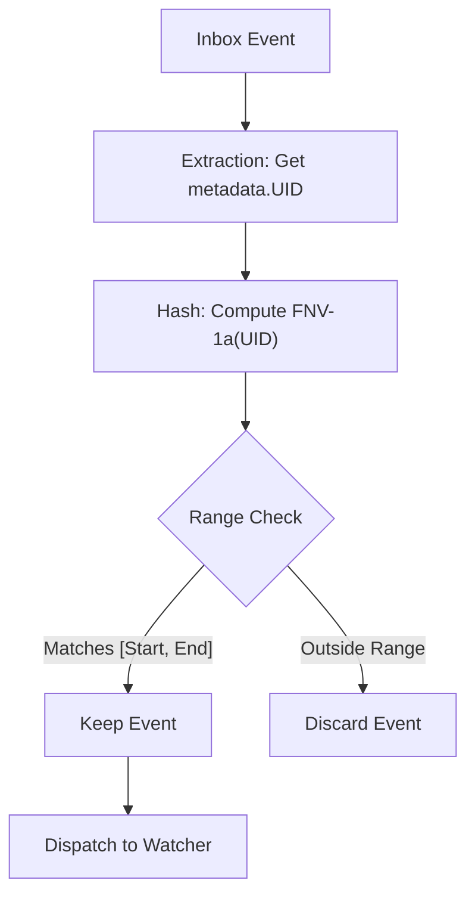

<!--
**Note:** When your KEP is complete, all of these comment blocks should be removed.

Follow the guidelines of the [documentation style guide].
In particular, wrap lines to a reasonable length, to make it
easier for reviewers to cite specific portions, and to minimize diff churn on
updates.

[documentation style guide]: https://github.com/kubernetes/community/blob/master/contributors/guide/style-guide.md

To get started with this template:

- [ ] **Pick a hosting SIG.**
  Make sure that the problem space is something the SIG is interested in taking
  up. KEPs should not be checked in without a sponsoring SIG.
- [ ] **Create an issue in kubernetes/enhancements**
  When filing an enhancement tracking issue, please make sure to complete all
  fields in that template. One of the fields asks for a link to the KEP. You
  can leave that blank until this KEP is filed, and then go back to the
  enhancement and add the link.
- [ ] **Make a copy of this template directory.**
  Copy this template into the owning SIG's directory and name it
  `NNNN-short-descriptive-title`, where `NNNN` is the issue number (with no
  leading-zero padding) assigned to your enhancement above.
- [ ] **Fill out as much of the kep.yaml file as you can.**
  At minimum, you should fill in the "Title", "Authors", "Owning-sig",
  "Status", and date-related fields.
- [ ] **Fill out this file as best you can.**
  At minimum, you should fill in the "Summary" and "Motivation" sections.
  These should be easy if you've preflighted the idea of the KEP with the
  appropriate SIG(s).
- [ ] **Create a PR for this KEP.**
  Assign it to people in the SIG who are sponsoring this process.
- [ ] **Merge early and iterate.**
  Avoid getting hung up on specific details and instead aim to get the goals of
  the KEP clarified and merged quickly. The best way to do this is to just
  start with the high-level sections and fill out details incrementally in
  subsequent PRs.

Just because a KEP is merged does not mean it is complete or approved. Any KEP
marked as `provisional` is a working document and subject to change. You can
denote sections that are under active debate as follows:

```
<<[UNRESOLVED optional short context or usernames ]>>
Stuff that is being argued.
<<[/UNRESOLVED]>>
```

When editing KEPS, aim for tightly-scoped, single-topic PRs to keep discussions
focused. If you disagree with what is already in a document, open a new PR
with suggested changes.

One KEP corresponds to one "feature" or "enhancement" for its whole lifecycle.
You do not need a new KEP to move from beta to GA, for example. If
new details emerge that belong in the KEP, edit the KEP. Once a feature has become
"implemented", major changes should get new KEPs.

The canonical place for the latest set of instructions (and the likely source
of this file) is [here](/keps/NNNN-kep-template/README.md).

**Note:** Any PRs to move a KEP to `implementable`, or significant changes once
it is marked `implementable`, must be approved by each of the KEP approvers.
If none of those approvers are still appropriate, then changes to that list
should be approved by the remaining approvers and/or the owning SIG (or
SIG Architecture for cross-cutting KEPs).
-->
# KEP-5866: Server-side Sharded List and Watch

<!-- toc -->
- [Release Signoff Checklist](#release-signoff-checklist)
- [Summary](#summary)
- [Motivation](#motivation)
  - [Goals](#goals)
  - [Non-Goals](#non-goals)
- [Proposal](#proposal)
  - [User Stories (Optional)](#user-stories-optional)
    - [Story 1: Horizontal Scaling of Controllers](#story-1-horizontal-scaling-of-controllers)
    - [Story 2 (Optional)](#story-2-optional)
  - [Notes/Constraints/Caveats (Optional)](#notesconstraintscaveats-optional)
  - [Risks and Mitigations](#risks-and-mitigations)
- [Design Details](#design-details)
  - [API Extensibility: Sharding Parameters](#api-extensibility-sharding-parameters)
  - [Shard Key](#shard-key)
  - [Consistent Hashing (Key Range)](#consistent-hashing-key-range)
  - [Client Request](#client-request)
  - [Server Design](#server-design)
  - [Hashing Implementation](#hashing-implementation)
  - [Test Plan](#test-plan)
      - [Prerequisite testing updates](#prerequisite-testing-updates)
      - [Unit tests](#unit-tests)
      - [Integration tests](#integration-tests)
      - [e2e tests](#e2e-tests)
  - [Graduation Criteria](#graduation-criteria)
    - [Alpha](#alpha)
    - [Beta](#beta)
    - [Deprecation](#deprecation)
  - [Upgrade / Downgrade Strategy](#upgrade--downgrade-strategy)
  - [Version Skew Strategy](#version-skew-strategy)
- [Production Readiness Review Questionnaire](#production-readiness-review-questionnaire)
  - [Feature Enablement and Rollback](#feature-enablement-and-rollback)
  - [Rollout, Upgrade and Rollback Planning](#rollout-upgrade-and-rollback-planning)
  - [Monitoring Requirements](#monitoring-requirements)
  - [Dependencies](#dependencies)
  - [Scalability](#scalability)
  - [Troubleshooting](#troubleshooting)
- [Implementation History](#implementation-history)
- [Drawbacks](#drawbacks)
- [Alternatives](#alternatives)
  - [Virtual Buckets](#virtual-buckets)
  - [Client-side Filtering](#client-side-filtering)
  - [Label-Based Sharding](#label-based-sharding)
  - [Explicit Query Parameters](#explicit-query-parameters)
  - [Lightweight Functional Grammar (e.g. <code>selector=...</code>)](#lightweight-functional-grammar-eg-selector)
  - [Extended Field Selectors](#extended-field-selectors)
- [Infrastructure Needed (Optional)](#infrastructure-needed-optional)
<!-- /toc -->

## Release Signoff Checklist

<!--
**ACTION REQUIRED:** In order to merge code into a release, there must be an
issue in [kubernetes/enhancements] referencing this KEP and targeting a release
milestone **before the [Enhancement Freeze](https://git.k8s.io/sig-release/releases)
of the targeted release**.

For enhancements that make changes to code or processes/procedures in core
Kubernetes—i.e., [kubernetes/kubernetes], we require the following Release
Signoff checklist to be completed.

Check these off as they are completed for the Release Team to track. These
checklist items _must_ be updated for the enhancement to be released.
-->

Items marked with (R) are required *prior to targeting to a milestone / release*.

- [ ] (R) Enhancement issue in release milestone, which links to KEP dir in [kubernetes/enhancements] (not the initial KEP PR)
- [ ] (R) KEP approvers have approved the KEP status as `implementable`
- [ ] (R) Design details are appropriately documented
- [ ] (R) Test plan is in place, giving consideration to SIG Architecture and SIG Testing input (including test refactors)
  - [ ] e2e Tests for all Beta API Operations (endpoints)
  - [ ] (R) Ensure GA e2e tests meet requirements for [Conformance Tests](https://github.com/kubernetes/community/blob/master/contributors/devel/sig-architecture/conformance-tests.md)
  - [ ] (R) Minimum Two Week Window for GA e2e tests to prove flake free
- [ ] (R) Graduation criteria is in place
  - [ ] (R) [all GA Endpoints](https://github.com/kubernetes/community/pull/1806) must be hit by [Conformance Tests](https://github.com/kubernetes/community/blob/master/contributors/devel/sig-architecture/conformance-tests.md) within one minor version of promotion to GA
- [ ] (R) Production readiness review completed
- [ ] (R) Production readiness review approved
- [ ] "Implementation History" section is up-to-date for milestone
- [ ] User-facing documentation has been created in [kubernetes/website], for publication to [kubernetes.io]
- [ ] Supporting documentation—e.g., additional design documents, links to mailing list discussions/SIG meetings, relevant PRs/issues, release notes

<!--
**Note:** This checklist is iterative and should be reviewed and updated every time this enhancement is being considered for a milestone.
-->

[kubernetes.io]: https://kubernetes.io/
[kubernetes/enhancements]: https://git.k8s.io/enhancements
[kubernetes/kubernetes]: https://git.k8s.io/kubernetes
[kubernetes/website]: https://git.k8s.io/website

## Summary

This proposal introduces server-side sharded LIST and WATCH to the Kubernetes API Server. By allowing
clients to specify a sharding strategy and range in their LIST and WATCH requests, the API Server
can filter events at the source, ensuring that horizontally scalable controllers (like
kube-state-metrics) only receive the traffic and data they are responsible for.

## Motivation

As Kubernetes clusters grow, the volume of events for core resources like `Pods` increases
significantly due to high churn. Many controllers need to scale to handle this load.

Historically, most controllers choose to scale vertically (e.g., `kube-controller-manager`), as
there is no native support for sharding or partitioning the watch stream. Some specialized controllers (e.g.,
`kube-state-metrics`) have implemented their own client-side horizontal sharding to distribute
work.

However, client-side sharding has a critical limitation: it does not reduce the incoming event
volume per replica. Every replica still receives the full stream of events, paying the CPU and
network cost to deserialize everything, only to discard items not belonging to their shard.
Functionally, this makes horizontal scaling of the watch stream impossible. This results in:

- Wasted network bandwidth and overhead (N replicas * Full Stream).
- Wasted CPU and Memory on clients for processing irrelevant events.

The goal of this proposal is to address this bottleneck. By moving filtering to the API server, we
provide the primitive needed to:
1. Allow vertically scaled controllers to eventually adopt sharded architectures.
2. Enable existing horizontally scalable controllers to scale efficiently without the "full stream"
   penalty.

We propose moving the filtering logic "upstream" to the Kubernetes API Server. By filtering events
at the source, we ensure that each controller replica receives only the data it is responsible
for.

### Goals

- **Reduce Network Traffic**: Clients only receive events for their assigned shard.
- **Reduce Client Resouce Usage**: Clients do not need to deserialize or process irrelevant events.
- **Extensible Framework**: Support future sharding keys beyond the initial implementation.

### Non-Goals

- **Coordination**: This proposal does not implement the coordination logic for clients. Clients
  are still responsible for determining their shard ranges.
- **Resharding**: The API server does not manage shard rebalancing strategies; By providing the raw
  hash ranges, clients can implement their own consistent hashing strategies if needed. This is future
  work that we are interested in, but is out of scope for this KEP.
- **Sharding KCM**: Sharding KCM is a complex topic that is outside the scope of this KEP. We are
  working on the fundamental building blocks that can enable sharding for KCM in the future. We want
  to eventually move towards a full sharding system, and this KEP acts as the initial step.

## Proposal

<!--
This is where we get down to the specifics of what the proposal actually is.
This should have enough detail that reviewers can understand exactly what
you're proposing, but should not include things like API designs or
implementation. What is the desired outcome and how do we measure success?.
The "Design Details" section below is for the real
nitty-gritty.
-->

We propose enhancements to the Kubernetes API to support **Server-Side Watch Sharding**.
This allows clients to request a filtered stream of events based on a consistent hashing strategy
determined by the client.
Clients specify a new `selector` parameter utilizing specific grammar (e.g., `selector=shardRange(object.metadata.uid, start, end)`) in
their `ListOptions`.
The API server computes the hash of the target field for each object and only dispatches events
that fall within the requested range.
This enables efficient horizontal scaling of controllers by ensuring each replica only processes
the data it owns, reducing network ingress and deserialization overhead.

### User Stories (Optional)

<!--
Detail the things that people will be able to do if this KEP is implemented.
Include as much detail as possible so that people can understand the "how" of
the system. The goal here is to make this feel real for users without getting
bogged down.
-->

#### Story 1: Horizontal Scaling of Controllers

A user wants to deploy a sharded controller (e.g., `kube-state-metrics`) that monitors `Pods`
across a large cluster. Instead of each replica watching all `Pods` and filtering client-side—which
consumes excessive bandwidth and CPU—the user configures each replica to watch a specific range of
UIDs (e.g., Replica 0 watches `00`-`7f`, Replica 1 watches `80`-`ff`). The API server only sends
events matching these ranges, allowing the monitoring system to scale linearly with the number of
shards.

#### Story 2 (Optional)

### Notes/Constraints/Caveats (Optional)

<!--
What are the caveats to the proposal?
What are some important details that didn't come across above?
Go in to as much detail as necessary here.
This might be a good place to talk about core concepts and how they relate.
-->

### Risks and Mitigations

<!--
What are the risks of this proposal, and how do we mitigate? Think broadly.
For example, consider both security and how this will impact the larger
Kubernetes ecosystem.

How will security be reviewed, and by whom?

How will UX be reviewed, and by whom?

Consider including folks who also work outside the SIG or subproject.
-->

## Design Details

<!--
This section should contain enough information that the specifics of your
change are understandable. This may include API specs (though not always
required) or even code snippets. If there's any ambiguity about HOW your
proposal will be implemented, this is the place to discuss them.
-->

### API Extensibility: Sharding Parameters

Clients will request shards via query parameters in their `LIST` and `WATCH` requests. 
The request must contain the field used to shard, as well as the start and end of the hash range.

Given that some Kubernetes features (like pagination) use individual, explicit query parameters,
while others (like label selectors) provide a lightweight grammar for filter expressions, the exact
syntax is currently under discussion. We will work with API Review to decide between two primary approaches:

1. **Explicit Query Parameters**: Adding individual fields directly to `meta/v1.ListOptions`.
   - Example: `?shardKey=object.metadata.namespace&shardRange=0,100`

2. **Lightweight Grammar**: Introducing a new `selector` expression parameter.
   - Example: `?selector=range(object.metadata.namespace, 0, 100)`
   - If this path is chosen, it could be implemented as a strict subset of CEL or a simple
     functional grammar.

Regardless of the syntax chosen, the parameters will be strongly typed internally on both the client side
(for syntactic correctness in `client-go`) and the server side (for validation and execution).

### Shard Key

While several attributes such as (UID, Namespace, and OwnerReference) are viable candidates for
sharding keys, we will start with support for **UID** and **Namespace** for the initial implementation.

kube-state-metrics is already using UID-based partitioning, and it is a perfect candidate for
this feature as it current does client side filtering.
Based on feedback from users, we will then expand the fraemwork to support configurable sharding
across other fields (e.g., Namespace, NodeName).

### Consistent Hashing (Key Range)

To support seamless scaling, we avoid binding objects directly to specific shards. Instead of
using fixed virtual buckets, we partition the keyspace directly using prefix-based ranges.

The total keyspace is treated as a continuous ring or line. We assign ownership by defining start
and end prefixes for the hash output.
Each shard is configured to watch a specific lexicographical range of the hash output.

In a 2 shard example:
- Shard 1 covers range `0` to `7`.
- Shard 2 covers range `8` to `f`.

This has the benefit that only a small fraction of buckets are moved between replicas when a
reshard occurs.

### Client Request

Clients will append new parameters to their LIST and WATCH requests to subscribe to a specific
slice of the stream.

**Example Request:**
`GET /api/v1/pods?watch=true&selector=shardRange(object.metadata.uid, 0, 8)`

- `selector`: Introduces a new query parameter to encapsulate expression-based selection logic.
- `shardRange(...)`: A function within the selector grammar that specifies the field to hash (e.g., `object.metadata.uid`) and the start and end range (`start <= x < end`) of hash values this client desires. This provides a future-proof foundation without bloating `ListOptions` with multiple individual parameter fields.

### Server Design

Currently, the Cacher broadcasts events to all watchers that match a simple Label/Field selector.
We will extend this pipeline to support Hash-Based Filtering.

We enhance the `SelectionPredicate` to carry a new sharding configuration, and introduce a new
filter function.



### Hashing Implementation

For speed and efficiency, we will use the **FNV-1a** hash algorithm.
- Input: Selected field value (string).
- Output: 64-bit integer (represented as hex/string for range comparison).
- **Note on Randomness**: Kubernetes UUIDs (uuidv4) are already uniformly distributed, but
  explicit hashing ensures distribution uniformity even if inputs become sequential (e.g., uuidv7
  in the future).

### Test Plan

<!--
**Note:** *Not required until targeted at a release.*
The goal is to ensure that we don't accept enhancements with inadequate testing.

All code is expected to have adequate tests (eventually with coverage
expectations). Please adhere to the [Kubernetes testing guidelines][testing-guidelines]
when drafting this test plan.

[testing-guidelines]: https://git.k8s.io/community/contributors/devel/sig-testing/testing.md
-->

[x] I/we understand the owners of the involved components may require updates to
existing tests to make this code solid enough prior to committing the changes necessary
to implement this enhancement.

##### Prerequisite testing updates

n/a

##### Unit tests

<!--
In principle every added code should have complete unit test coverage, so providing
the exact set of tests will not bring additional value.
However, if complete unit test coverage is not possible, explain the reason of it
together with explanation why this is acceptable.
-->

<!--
Additionally, for Alpha try to enumerate the core package you will be touching
to implement this enhancement and provide the current unit coverage for those
in the form of:
- <package>: <date> - <current test coverage>
The data can be easily read from:
https://testgrid.k8s.io/sig-testing-canaries#ci-kubernetes-coverage-unit

This can inform certain test coverage improvements that we want to do before
extending the production code to implement this enhancement.
-->

- `k8s.io/apimachinery/pkg/apis/meta/v1`: `2026-02-01` - `TBD` (Validation logic)
- `k8s.io/apiserver/pkg/storage`: `2026-02-01` - `TBD` (Filtering logic)

##### Integration tests

<!--
Integration tests are contained in https://git.k8s.io/kubernetes/test/integration.
Integration tests allow control of the configuration parameters used to start the binaries under test.
This is different from e2e tests which do not allow configuration of parameters.
Doing this allows testing non-default options and multiple different and potentially conflicting command line options.
For more details, see https://github.com/kubernetes/community/blob/master/contributors/devel/sig-testing/testing-strategy.md

If integration tests are not necessary or useful, explain why.
-->

<!--
This question should be filled when targeting a release.
For Alpha, describe what tests will be added to ensure proper quality of the enhancement.

For Beta and GA, document that tests have been written,
have been executed regularly, and have been stable.
This can be done with:
- permalinks to the GitHub source code
- links to the periodic job (typically https://testgrid.k8s.io/sig-release-master-blocking#integration-master), filtered by the test name
- a search in the Kubernetes bug triage tool (https://storage.googleapis.com/k8s-triage/index.html)
-->

- **Watch Sharding Test**: Ensure that sharded watches with different ranges function.

##### e2e tests

<!--
This question should be filled when targeting a release.
For Alpha, describe what tests will be added to ensure proper quality of the enhancement.

For Beta and GA, document that tests have been written,
have been executed regularly, and have been stable.
This can be done with:
- permalinks to the GitHub source code
- links to the periodic job (typically a job owned by the SIG responsible for the feature), filtered by the test name
- a search in the Kubernetes bug triage tool (https://storage.googleapis.com/k8s-triage/index.html)

We expect no non-infra related flakes in the last month as a GA graduation criteria.
If e2e tests are not necessary or useful, explain why.
-->

- [test name](https://github.com/kubernetes/kubernetes/blob/2334b8469e1983c525c0c6382125710093a25883/test/e2e/...): [SIG ...](https://testgrid.k8s.io/sig-...?include-filter-by-regex=MyCoolFeature), [triage search](https://storage.googleapis.com/k8s-triage/index.html?test=MyCoolFeature)

### Graduation Criteria

<!--
**Note:** *Not required until targeted at a release.*

Define graduation milestones.

These may be defined in terms of API maturity, [feature gate] graduations, or as
something else. The KEP should keep this high-level with a focus on what
signals will be looked at to determine graduation.

Consider the following in developing the graduation criteria for this enhancement:
- [Maturity levels (`alpha`, `beta`, `stable`)][maturity-levels]
- [Feature gate][feature gate] lifecycle
- [Deprecation policy][deprecation-policy]

Clearly define what graduation means by either linking to the [API doc
definition](https://kubernetes.io/docs/concepts/overview/kubernetes-api/#api-versioning)
or by redefining what graduation means.

In general we try to use the same stages (alpha, beta, GA), regardless of how the
functionality is accessed.

[feature gate]: https://git.k8s.io/community/contributors/devel/sig-architecture/feature-gates.md
[maturity-levels]: https://git.k8s.io/community/contributors/devel/sig-architecture/api_changes.md#alpha-beta-and-stable-versions
[deprecation-policy]: https://kubernetes.io/docs/reference/using-api/deprecation-policy/
-->

#### Alpha

- Feature implemented behind `ShardableWatch` feature gate.
- Basic unit and integration tests passing.

#### Beta

- Benchmarks showing performance improvements for sharded clients.
- Scalability tests verifying no regression in API server throughput.
- Informer and reflector framework will be updated to support sharded watches.

<!--
#### GA

TBD

**Note:** GA criteria must not include any functional, security, monitoring, or testing requirements.  Those must be beta requirements.

**Note:** Generally we also wait at least two releases between beta and
GA/stable, because there's no opportunity for user feedback, or even bug reports,
in back-to-back releases.

**For non-optional features moving to GA, the graduation criteria must include
[conformance tests].**

[conformance tests]: https://git.k8s.io/community/contributors/devel/sig-architecture/conformance-tests.md
-->

#### Deprecation

<!--
- Announce deprecation and support policy of the existing flag
- Two versions passed since introducing the functionality that deprecates the flag (to address version skew)
- Address feedback on usage/changed behavior, provided on GitHub issues
- Deprecate the flag
-->

### Upgrade / Downgrade Strategy

<!--
If applicable, how will the component be upgraded and downgraded? Make sure
this is in the test plan.

Consider the following in developing an upgrade/downgrade strategy for this
enhancement:
- What changes (in invocations, configurations, API use, etc.) is an existing
  cluster required to make on upgrade, in order to maintain previous behavior?
- What changes (in invocations, configurations, API use, etc.) is an existing
  cluster required to make on upgrade, in order to make use of the enhancement?
-->

### Version Skew Strategy

<!--
If applicable, how will the component handle version skew with other
components? What are the guarantees? Make sure this is in the test plan.

Consider the following in developing a version skew strategy for this
enhancement:
- Does this enhancement involve coordinating behavior in the control plane and nodes?
- How does an n-3 kubelet or kube-proxy without this feature available behave when this feature is used?
- How does an n-1 kube-controller-manager or kube-scheduler without this feature available behave when this feature is used?
- Will any other components on the node change? For example, changes to CSI,
  CRI or CNI may require updating that component before the kubelet.
-->
- Clients must be updated to send the new parameters.
- If a client sends sharding parameters to an old API server, the old server will ignore the unknown query parameters and send the full, un-sharded stream.
- To allow clients to safely distinguish between a filtered stream and a full stream, the API Server will inject a new `Sharded: true` flag into the `ListMeta` of the initial `LIST` response (and the initial sync of a `WATCH`). 
  - If a client requests a shard and observes `Sharded: true`, it can safely process all incoming events.
  - If the flag is missing or false, the client knows the server ignored the parameter and must perform client-side filtering (or fail) to drop objects outside its shard range.
- Clients can also deterministically check for server-side sharding support by querying the OpenAPI v3 discovery document for the presence of the sharding query parameters. 
- To enable safe client-side fallback, the hash algorithm and range evaluation logic will be placed in a common library (`k8s.io/apimachinery`).

## Production Readiness Review Questionnaire

<!--

Production readiness reviews are intended to ensure that features merging into
Kubernetes are observable, scalable and supportable; can be safely operated in
production environments, and can be disabled or rolled back in the event they
cause increased failures in production. See more in the PRR KEP at
https://git.k8s.io/enhancements/keps/sig-architecture/1194-prod-readiness.

The production readiness review questionnaire must be completed and approved
for the KEP to move to `implementable` status and be included in the release.

In some cases, the questions below should also have answers in `kep.yaml`. This
is to enable automation to verify the presence of the review, and to reduce review
burden and latency.

The KEP must have a approver from the
[`prod-readiness-approvers`](http://git.k8s.io/enhancements/OWNERS_ALIASES)
team. Please reach out on the
[#prod-readiness](https://kubernetes.slack.com/archives/CPNHUMN74) channel if
you need any help or guidance.
-->

### Feature Enablement and Rollback

<!--
This section must be completed when targeting alpha to a release.
-->

###### How can this feature be enabled / disabled in a live cluster?

- [x] Feature gate (also fill in values in `kep.yaml`)
  - Feature gate name: `ShardableWatch`
  - Components depending on the feature gate: `kube-apiserver`

###### Does enabling the feature change any default behavior?

No. Default behavior (no sharding parameters) remains unchanged.

###### Can the feature be disabled once it has been enabled (i.e. can we roll back the enablement)?

<!--
Describe the consequences on existing workloads (e.g., if this is a runtime
feature, can it break the existing applications?).

Feature gates are typically disabled by setting the flag to `false` and
restarting the component. No other changes should be necessary to disable the
feature.

NOTE: Also set `disable-supported` to `true` or `false` in `kep.yaml`.
-->

###### What happens if we reenable the feature if it was previously rolled back?

Clients can resume sending sharding parameters. The API server will immediately start respecting
them again. No state is persisted, so re-enablement is instantaneous.

###### Are there any tests for feature enablement/disablement?

<!--
The e2e framework does not currently support enabling or disabling feature
gates. However, unit tests in each component dealing with managing data, created
with and without the feature, are necessary. At the very least, think about
conversion tests if API types are being modified.

Additionally, for features that are introducing a new API field, unit tests that
are exercising the `switch` of feature gate itself (what happens if I disable a
feature gate after having objects written with the new field) are also critical.
You can take a look at one potential example of such test in:
https://github.com/kubernetes/kubernetes/pull/97058/files#diff-7826f7adbc1996a05ab52e3f5f02429e94b68ce6bce0dc534d1be636154fded3R246-R282
-->

Yes. Disabling the feature gate will cause the API server to stop honoring sharding parameters
(processing them as unknown/ignored field or erroring depending on validation). Clients will
revert to receiving full streams (if falling back) or error.

### Rollout, Upgrade and Rollback Planning

<!--
This section must be completed when targeting beta to a release.
-->

###### How can a rollout or rollback fail? Can it impact already running workloads?

<!--
Try to be as paranoid as possible - e.g., what if some components will restart
mid-rollout?

Be sure to consider highly-available clusters, where, for example,
feature flags will be enabled on some API servers and not others during the
rollout. Similarly, consider large clusters and how enablement/disablement
will rollout across nodes.
-->

###### What specific metrics should inform a rollback?

- Significant increase in `apiserver_request_duration_seconds` for LIST/WATCH requests using
  sharding (indicating expensive hashing/filtering).
- `apiserver_watch_filtered_events_total` remaining 0 despite active sharded watches (indicating
  feature malfunction).

###### Were upgrade and rollback tested? Was the upgrade->downgrade->upgrade path tested?

<!--
Describe manual testing that was done and the outcomes.
Longer term, we may want to require automated upgrade/rollback tests, but we
are missing a bunch of machinery and tooling and can't do that now.
-->

n/a

###### Is the rollout accompanied by any deprecations and/or removals of features, APIs, fields of API types, flags, etc.?

No

### Monitoring Requirements

<!--
This section must be completed when targeting beta to a release.

For GA, this section is required: approvers should be able to confirm the
previous answers based on experience in the field.
-->

###### How can an operator determine if the feature is in use by workloads?

By checking the `apiserver_watch_shards_total` metric. If > 0, sharded watches are active.

###### How can someone using this feature know that it is working for their instance?

<!--
For instance, if this is a pod-related feature, it should be possible to determine if the feature is functioning properly
for each individual pod.
Pick one more of these and delete the rest.
Please describe all items visible to end users below with sufficient detail so that they can verify correct enablement
and operation of this feature.
Recall that end users cannot usually observe component logs or access metrics.
-->

- [ ] Events
  - Event Reason: 
- [ ] API .status
  - Condition name: 
  - Other field: 
- [ ] Other (treat as last resort)
  - Details:

###### What are the reasonable SLOs (Service Level Objectives) for the enhancement?

<!--
This is your opportunity to define what "normal" quality of service looks like
for a feature.

It's impossible to provide comprehensive guidance, but at the very
high level (needs more precise definitions) those may be things like:
  - per-day percentage of API calls finishing with 5XX errors <= 1%
  - 99% percentile over day of absolute value from (job creation time minus expected
    job creation time) for cron job <= 10%
  - 99.9% of /health requests per day finish with 200 code

These goals will help you determine what you need to measure (SLIs) in the next
question.
-->

Latency for sharded watches should be comparable to standard watches.

###### What are the SLIs (Service Level Indicators) an operator can use to determine the health of the service?

- [x] Metrics
  - Metric name: `apiserver_watch_shards_total`
  - Components exposing the metric: `kube-apiserver`

###### Are there any missing metrics that would be useful to have to improve observability of this feature?

<!--
Describe the metrics themselves and the reasons why they weren't added (e.g., cost,
implementation difficulties, etc.).
-->

n/a

### Dependencies

<!--
This section must be completed when targeting beta to a release.
-->

###### Does this feature depend on any specific services running in the cluster?

No.

### Scalability

<!--
For alpha, this section is encouraged: reviewers should consider these questions
and attempt to answer them.

For beta, this section is required: reviewers must answer these questions.

For GA, this section is required: approvers should be able to confirm the
previous answers based on experience in the field.
-->

###### Will enabling / using this feature result in any new API calls?

No. It uses standard `LIST` and `WATCH` verbs with new query parameters.

###### Will enabling / using this feature result in introducing new API types?

No.

###### Will enabling / using this feature result in any new calls to the cloud provider?

No.

###### Will enabling / using this feature result in increasing size or count of the existing API objects?

No. `ListOptions` is not persisted.

###### Will enabling / using this feature result in increasing time taken by any operations covered by existing SLIs/SLOs?

Negligible. Hashing the UID is a very fast operation (nanoseconds). We already perform similar
list filtering for label and field selectors.

###### Will enabling / using this feature result in non-negligible increase of resource usage (CPU, RAM, disk, IO, ...) in any components?

- **API Server**: Slight increase in CPU for hashing. However, significant downstream savings in
  network I/O and serialization for filtered events.

###### Can enabling / using this feature result in resource exhaustion of some node resources (PIDs, sockets, inodes, etc.)?

No.

### Troubleshooting

<!--
This section must be completed when targeting beta to a release.

For GA, this section is required: approvers should be able to confirm the
previous answers based on experience in the field.

The Troubleshooting section currently serves the `Playbook` role. We may consider
splitting it into a dedicated `Playbook` document (potentially with some monitoring
details). For now, we leave it here.
-->

###### How does this feature react if the API server and/or etcd is unavailable?

It's an apiserver feature and will not function if apiserver is unavailable. 

###### What are other known failure modes?

- **Hot Shards**: If the hash distribution is uneven (unlikely with FNV-1a on UUIDs) or if the
  keyspace is partitioned unevenly by clients, some shards may receive significantly more
  traffic than others.
  - **Detection**: `apiserver_watch_filtered_events_total` showing uneven rates across shards.
  - **Mitigation**: Clients can adjust their shard ranges to balance the load.
  - **Diagnostics**: Metrics.

<!--
For each of them, fill in the following information by copying the below template:
  - [Failure mode brief description]
    - Detection: How can it be detected via metrics? Stated another way:
      how can an operator troubleshoot without logging into a master or worker node?
    - Mitigations: What can be done to stop the bleeding, especially for already
      running user workloads?
    - Diagnostics: What are the useful log messages and their required logging
      levels that could help debug the issue?
      Not required until feature graduated to beta.
    - Testing: Are there any tests for failure mode? If not, describe why.
-->

###### What steps should be taken if SLOs are not being met to determine the problem?

## Implementation History

<!--
Major milestones in the lifecycle of a KEP should be tracked in this section.
Major milestones might include:
- the `Summary` and `Motivation` sections being merged, signaling SIG acceptance
- the `Proposal` section being merged, signaling agreement on a proposed design
- the date implementation started
- the first Kubernetes release where an initial version of the KEP was available
- the version of Kubernetes where the KEP graduated to general availability
- when the KEP was retired or superseded
-->

## Drawbacks

- Complexity in API Server filtering logic.
- Clients need to implement ring logic to calculate ranges.

## Alternatives

<!--
What other approaches did you consider, and why did you rule them out? These do
not need to be as detailed as the proposal, but should include enough
information to express the idea and why it was not acceptable.
-->

### Virtual Buckets

Instead of arbitrary lexical ranges, we could partition the keyspace into a fixed number of "Virtual Buckets" (e.g., 1024).

- **Pros**: Easier for clients to reason about.
- **Cons**: Fixed granularity. Resizing is hard.

### Client-side Filtering

Clients are already able to filter events on their side. We could provide a library to help them
with the filtering logic but it doesn't solve the fundamental problem of too much churn in the
watch stream for controllers that need to watch resources like Pod.

- **Pros**: No API Server changes.
- **Cons**: Network and CPU waste.

### Label-Based Sharding

Clients could compute shard assignment themselves and label objects with their assigned shard
(e.g., `controller-shard: "0"`).

- **Pros**: Works with existing `LabelSelector`.
- **Cons**: Write amplification. Every time the number of shards changes, *every* object in the
  system might need to be relabeled. This generates massive write load on the API server and etcd.

### Explicit Query Parameters

Instead of a new `selector` grammar, we could expose explicit query parameters for sharding components, e.g., `?shardingKey=uid&shardRangeStart=0&shardRangeEnd=8`.

- **Pros**: Relies on standard query parameter parsing without requiring a custom grammar. The fields map cleanly to strongly typed properties in `ListOptions`, making validation straightforward.
- **Cons**: Increases the surface area of `meta/v1.ListOptions` with fields that are specific only to watch sharding. This introduces new combinations of parameters and increases the risk of test coverage gaps. It is also less flexible for future evolution.

### Lightweight Functional Grammar (e.g. `selector=...`)

Instead of explicit query parameters, we could introduce a generic `selector` parameter that uses an expression-based functional grammar (e.g., `selector=shardRange(object.metadata.uid, 0, 8)`). This avoids permanently bloating the core API with niche feature flags.

If this route is taken, we would deliberately start with a simple functional grammar `func(args...)` rather than full CEL. Whether this grammar would eventually support CEL is dependent on further testing to ensure the watch cache is not slowed down for complex expressions. 

Similar to labels and field selectors, the parameter itself would be passed as a string over the wire, but the representation would be strongly typed on the client side (syntactic correctness) and server side (validation and execution).

```golang
// example types.go
type ShardRangeRequirement struct {
    Key       string // e.g. "object.metadata.uid"
    Start     string // hex string
    End       string // hex string
}

// example client side usage
req := selectors.NewShardRangeRequirement("object.metadata.uid", "0", "8")
listOptions := metav1.ListOptions{
    // ... other options
    Selector: req.String(),
}
```

- **Pros**: Future-proof and extensible primitive applicable to more than just sharding. Matches the existing label/field selector patterns.
- **Cons**: Requires building and maintaining a new parser. The grammar definition must be carefully designed to prevent execution overhead on the watch cache.

### Extended Field Selectors

We considered extending the `fieldSelector` grammar to support functions or hash ranges, e.g.,
`fieldSelector=range(object.metadata.uid, 0, 100)`.

- **Pros**: Reuses the existing concept of field-based filtering without adding new `ListOptions` query parameters.
- **Cons**: The `fieldSelector` grammar has been around for a long time, relying heavily on exact matches and non-matches. Modifying it to support functional syntax (`range(...)`) can be fragile because the broader Kubernetes ecosystem may have built-in assumptions about this grammar. 

## Infrastructure Needed (Optional)

None.
