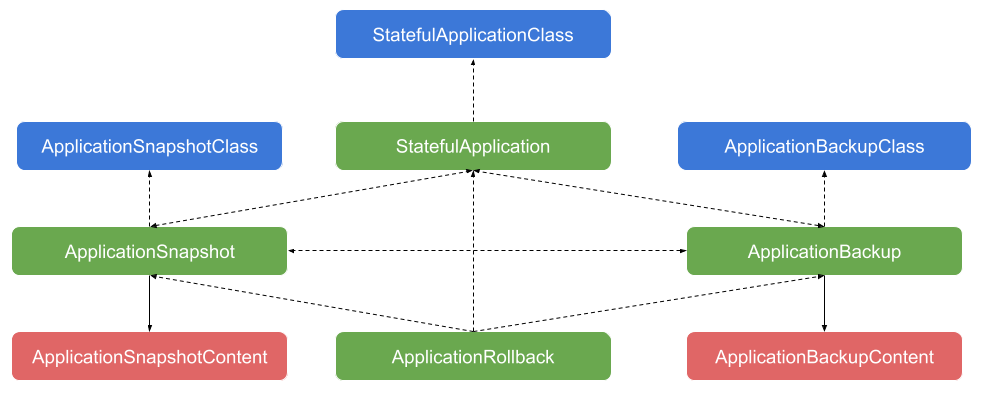

# Kubernetes Stateful Application Data Management API

## Table of Contents

* [Kubernetes Stateful Application Data Management API](#kubernetes-stateful-application-data-management-api)
  * [Table of Contents](#table-of-contents)
  * [Summary](#summary)
  * [Motivation](#motivation)
      * [Goals](#goals)
      * [Non-Goals](#non-goals)
  * [Proposal](#proposal)
      * [Terminologies](#terminologies)
      * [API Structure](#api-structure)
      * [Stateful Application](#stateful-application)
      * [Application Snapshot](#application-snapshot)
      * [Application Rollback](#application-rollback)
      * [User Workflows](#user-workflows)
        * [Describing a Stateful Application](#describing-a-stateful-application)
        * [Taking an Application Snapshot](#taking-an-application-snapshot)
        * [Restoring (or Cloning) an Application from a Snapshot](#restoring-or-cloning-an-application-from-a-snapshot)
        * [Rolling Back an Application to a Snapshot](#rolling-back-an-application-to-a-snapshot)
      * [Controller Workflows](#controller-workflows)
        * [Taking an Application Snapshot](#taking-an-application-snapshot-1)
        * [Restoring (or Cloning) an Application from a Snapshot](#restoring-or-cloning-an-application-from-a-snapshot-1)
  * [Implementation History](#implementation-history)

[Tools for generating]: https://github.com/ekalinin/github-markdown-toc

## Summary

This KEP proposes a Kubernetes Stateful Application Data Management API consisting of a set of [CustomResourceDefinitions (CRD)](https://kubernetes.io/docs/concepts/extend-kubernetes/api-extension/custom-resources/) that collectively define the notion of stateful applications, i.e., applications that maintain persistent state, and a set of data management semantics on stateful applications such as snapshot, backup, restoration, and clone. A snapshot of a stateful application is defined as a point-in-time capture of the state of the application, taken in an application-consistent manner. It captures both the application configurations (definitions of Kubernetes resources that make up the application, e.g., StatefulSets, Services, ConfigMaps, Secrets, etc.) and persistent data contained within the application (via persistent volumes). A snapshot can also include optional tags in the form of key-value pairs for extra information about itself.

## Motivation

The addition of the [VolumeSnapshot](https://kubernetes.io/docs/concepts/storage/volume-snapshots/) API in Kubernetes 1.12 enables backup and restoration support for persistent volumes. With the [VolumeSnapshot](https://kubernetes.io/docs/concepts/storage/volume-snapshots/) API, users can take a snapshot of a persistent volume or restore a volume fron a snapshot. When it comes to application snapshot and restoration semantics, however, more things need to be considered than just volume snapshots. As stated above, an application snapshot captures both its configurations and persistent data. The key is that an application snapshot contains sufficient information to completely create (from scratch) an instance of a stateful application as captured at a particular point in time. 

Specifically, an application snapshot contains both a copy of the definitions of Kubernetes resources that the application is comprised of and snapshots of persistent volumes used by the application. Particularly, the volume snapshots must be taken at the same time in an application consistent manner. To guarantee application consistency, there may be a need to quiesce the application before taking volume snapshots and unquiesce it after the volume snapshots are successfully taken. The [ExecutionHook](https://github.com/kubernetes/enhancements/blob/master/keps/sig-storage/20190120-execution-hook-design.md) proposal a general mechanism for users to request execution of arbitrary hook commands in application containers for use cases such as application quiescing and unquiescing.

With the [VolumeSnapshot](https://kubernetes.io/docs/concepts/storage/volume-snapshots/) API and [ExecutionHook](https://github.com/kubernetes/enhancements/blob/master/keps/sig-storage/20190120-execution-hook-design.md) API, we have some of the necessary building blocks to perform application-level snapshot and restoration operations. However, application-level data management operations require higher-level workflows and automation. For example, taking an application snapshot is a multi-step workflow that does more than orchestrating volume snapshots and hook executions. As of today, there's no API in Kubernetes for application data management truly at the application-level.

This proposal tries to close the gap by introducing a new Kubernetes API for supporting snapshot, backup, restoration, and clone semantics at the application-level in an application-consistent manner. This new API exposes application-level data management semantics through Kubernetes custom resources and provides a way to orchestrate volume-level snapshot operations and hook executions by automatically managing the lifecycle of `VolumeSnapshot` and `ExecutionHook` API objects as part of some higher-level workflows. By modeling application snapshots and backups as declarative custom resources, they can be used as data sources for application restoration and cloning. Similarly, connections between snapshots and backups can be expressed to support operations such as exporting snapshots as backups and importing of backups into snapshots.

### Goals

* Proposes a Kubernetes API for stateful application data management that supports application-level snapshot, backup, recovery, and clone semantics.

### Non-Goals

* Proposes a detailed controller implementation of the new API.

## Proposal

### Terminologies

* **Stateful Application**: a Kubernetes application that maintains persistent state, likely through persistent volumes, and to which data management semantics identified above are applicable.
* **Application Snapshot**: a point-in-time capture of the state of the application, taken in an application-consistent manner and stored locally in a Kubernetes cluster. It consists of two major components:
  * Snapshots of a group of relevant persistent volumes used by the application.
  * The configuration of the application and its sub-components, captured as a copy of the resource definitions of Kubernetes objects the application is comprised of.
* **Application Backup**: a capture of the state of an application (both configuration and data) that is stored outside of a Kubernetes cluster. This may be an export of a local application snapshot to a remote storage.

### API Structure

The diagram below illustrates the overall Kubernetes API structure. Dotted arrows mean association through object names or object references. Solid arrows mean a binding between the two resource types involved. Green colored resources are the user-facing ones, blue colored ones are expected to be created and managed by system administrators, and light red colored ones are normally created as a result of performing the requested operations.



With this API structure, users can take a snapshot or backup of a `StatefulApplication`, via an `ApplicationSnapshot` or `ApplicationBackup`, respectively. In the reverse direction, both `ApplicationSnapshot`s and `ApplicationBackup`s can be used as data sources in application restoration or clone. An `ApplicationSnapshot` can be exported outside of a cluster as an `ApplicationBackup`, and an `ApplicationBackup` can be imported into the cluster as an `ApplicationSnapshot`. This allows users to use all the stateful application data management semantics in a Kubernetes idiomatic manner. 

Although we introduced the concept of application backups and mentioned the `ApplicationBackup` CRD above, this KEP focuses on details of CRDs related to application snapshot and restoration/clone operations and introduces the following CRDs:
* `StatefulApplication` and `StatefulApplicationClass` for representation and description of stateful applications and for application restoration/clone support,
* and `ApplicationSnapshot`, `ApplicationSnapshotClass`, and `ApplicationSnapshotContent` for application snapshot support,
* and `ApplicationRollback` for application rollback support.

Details of CRDs related to application backups including `ApplicationBackup`, `ApplicationBackupClass`, and `ApplicationBackupContent` will be introduced in a subsequent KEP or an update to this KEP.

### Stateful Application

The API is centered around the notion of stateful applications modeled using a CRD named `StatefulApplication`. The `StatefulApplication` CRD leverages the [Application CRD](https://github.com/kubernetes-sigs/application) for  description and aggregation of components and status of an application. Additionally, it supports data management semantics such as snapshot, backup, restoration, and clone for the application it models. 

A `StatefulApplication` object mainly contains the following pieces of information:

* The name of an `Application` object, which describes an application and contains information to derive the list of Kubernetes resources that the application is comprised of. The `Application` object is assumed to exist in the same namespace.
* An optional data source that can either be a local snapshot of the application or a backup in a remote location, from where the application can be restored or cloned.
* The name of an optional `StatefulApplicationClass` that defines common parameters for a class of `StatefulApplication`s. The parameters are used by the handler when the application is provisioned, e.g., cloned or restored from a data source. See details about `StatefulApplicationClass` below.
* An optional list of `ValueSubstitutionRule`s that define how to substitute old values with new values for certain types of values in the application's Kubernetes resource definitions, when the application is provisioned.

The following data management operations can be performed on a `StatefulApplication`:

* Taking a local snapshot of the application and store the snapshot locally within the cluster.
* Taking a backup of the application to a remote location, e.g., a Google Cloud Storage (GCS) or S3 bucket.
* Restoring the application from either a local snapshot within the cluster or a backup in a remote location.
* Cloning the application from either a local snapshot within the cluster or a backup in a remote location.
* Rolling back the application state to that captured in either a local snapshot within the cluster or a backup in a remote location.

What operation gets triggered for a `StatefulApplication` depends on what values it contains in the two fields above, as the following table summarizes.

| | Has Data Source | Has no Data Source |
| ------ | ------ | ------ |
| References an Application | No action needed; it's just a wrapper around an `Application` resource. | No action needed; this is not a meaningful combination. |
| References no Application | Creates (clones or restores) the application from the given data source. | No action needed; this state is the result of creating an application from the given data source. |

The detailed definition of `StatefulApplication` is as follows.

```go
type StatefulApplicationSpec struct {
	// ApplicationClassName is the name of the StatefulApplicationClass to use creating the application,
	// e.g., restoring the application from a data source. If this is not specified, the default one of
	// the cluster is used.
	// +optional
	ApplicationClassName *string `json:"applicationClassName,omitempty"`
	
	// ApplicationName is the name of the Application (https://github.com/kubernetes-sigs/application)
	// object, which represents an application and gives the list of Kubernetes resources that make up the
	// application in its status. When doing an application restoration, this is the name of the Application
	// resource to be created if set. The name of this StatefulApplication resource will be used if this is
	// not set. It’s assumed that the Application resource is in the same namespace of it exists.
	// +optional
	ApplicationName *string `json:"applicationName,omitempty"`
  
	// Source specifies an optional data source from which the application and its data state is restored.
	// +optional
	Source *DataSource `json:"source,omitempty"`

	// ValueSubstitutionRules is a set of rules for value substitution when the application is restored
	// from a data source.
	// +optional
	ValueSubstitutionRules []ValueSubstitutionRule `json:"valueSubstitutionRules,omitempty"`
}

type StatefulApplicationStatus struct {
	// Conditions show the current condition of this application.
	Conditions []Condition `json:"conditions,omitempty"`

	// Source is a reference to the source from which the application was most recently restored or rolled back from.
	Source *corev1.TypedLocalObjectReference `json:"source,omitempty"`
}

// ValueSubstitutionRuleType is the type of ValueSubstitutionRules.
type ValueSubstitutionRuleType string

// Set of valid values of ValueSubstitutionRuleType.
const (
	ValueSubstitutionRuleTypeName       ValueSubstitutionRuleType = "Name"
	ValueSubstitutionRuleTypeLabel      ValueSubstitutionRuleType = "Label"
	ValueSubstitutionRuleTypeAnnotation ValueSubstitutionRuleType = "Annotation"
	ValueSubstitutionRuleTypeEnvVar     ValueSubstitutionRuleType = "EnvVar"
)

// ValueSubstitutionRule defines a rule for value substitution.
type ValueSubstitutionRule struct {
	// Type is the type of this ValueSubstitutionRule.
	Type ValueSubstitutionRuleType `json:"type"`

	// Key is an optional key this rule applies to. For example, when the type is Label, this can be used to
	// specify the label this rule applies to. Similarly, when the type is Annotation or EnvVar, this can be
	// used to specify the annotation or environment variable this rule applies to.
	// +optional
	Key *string `json:"key,omitempty"`

	// OldValue is the old value to be substituted in the given type of values.
	// This may be a pattern in the values.
	OldValue string `json:"oldValue"`

	// NewValue is the new value that will be used in place of each occurrence of the OldValue.
	// If NewValue is empty, it is considered an intention to remove the key with the OldValue.
	NewValue string `json:"newValue"`

	// Selector is an optional label selector for filtering Kubernetes resources to which this rule applies.
	// +optional
	Selector *metav1.LabelSelector `json:"selector,omitempty"`
}

// DataSourceType specifies the type of the data source from which the application and its data state is restored.
type DataSourceType string

// Set of valid values of DataSourceType.
const (
	// Restoring an application from a local snapshot.
	DataSourceSnapshot DataSourceType = "Snapshot"
	// Restoring an application from a remote backup.
	DataSourceBackup DataSourceType = "Backup"
)

// DataSource defines a source from which a StatefulApplication and its data state can be restored.
type DataSource struct {
	// Type specifies the type of the data source.
	Type DataSourceType `json:"type"`
  
	// SnapshotRef specifies a reference to an ApplicationSnapshot as the data source for cases of
	// restoring an application from a snapshot. This is required when Type is "Snapshot".
	// +optional
	SnapshotRef *corev1.ObjectReference `json:"snapshotRef,omitempty"`
  
	// BackupRef specifies a reference to an ApplicationBackup as the data source for cases of
	// restoring an application from a backup. This is required when Type is "Backup".
	// +optional
	BackupRef *corev1.ObjectReference `json:"backupRef,omitempty"`
}

type ConditionType string

// Condition defines a condition of a StatefulApplication or an operation on the StatefulApplication
// , e.g., an ApplicationSnapshot or an ApplicationRollback.
type Condition struct {
	// Type is the type of the condition.
	Type ConditionType `json:"type,omitempty"`

	// Message is a human readable message indicating details about the condition’s last transition.
	Message string `json:"message,omitempty"`

	// Reason is the reason for the condition's last transition.
	Reason string `json:"reason,omitempty"`

	// Status is the status of this condition.
	// +kubebuilder:validation:Enum=True,False,Unknown
	Status corev1.ConditionStatus `json:"status,omitempty"`

	// LastTransitionTime is the last time the condition transitioned from one status to another.
	LastTransitionTime *metav1.Time `json:"lastTransitionTime,omitempty"`

	// LastUpdateTime is the last time the condition was updated.
	LastUpdateTime *metav1.Time `json:"lastUpdateTime,omitempty"`
}

type StatefulApplication struct {
	metav1.TypeMeta   `json:",inline"`
	metav1.ObjectMeta `json:"metadata,omitempty"`

	Spec   StatefulApplicationSpec   `json:"spec,omitempty"`
	Status StatefulApplicationStatus `json:"status,omitempty"`
}
```

A `StatefulApplication` object can optionally reference a `StatefulApplicationClass` object by its name. `StatefulApplicationClass` is a cluster-scope CRD that defines the handler and common parameters for a class of `StatefulApplication`s. Below is the definition of `StatefulApplicationClass`.

```go
type StatefulApplicationClass struct {
	metav1.TypeMeta   `json:",inline"`
	metav1.ObjectMeta `json:"metadata,omitempty"`

	// Handler is the name of the controller that should be invoked when a
	// StatefulApplication of this class is to be provisioned.
	Handler string `json:"handler"`

	// Parameters are opaque parameters to the snapshotter.
	// +optional
	Parameters map[string]string `json:"parameters,omitempty"`

	// StorageClassMapping is a mapping of source to target StorageClass names.
	// This mapping is used to get the target StorageClasses for PVCs when an
	// application of this class is restored from a snapshot or backup.
	// Specifically, when an application is restored in cluster B from a snapshot
	// taken in cluster A, the StorageClasses in cluster B may be different than
	// the ones in cluster A, so a StorageClass used by a class of PVCs in cluster
	// A may not exist in cluster B. In this case, there may be an equivalent
	// StorageClass in cluster B that can be used instead. This mapping defines
	// what alternative StorageClasses to use when a source StorageClass is not
	// found.
	// +optional
	StorageClassMapping map[string]string `json:"storageClassMapping,omitempty"`
}
```

### Application Snapshot

The API has three snapshot-related CRDs, namely, `ApplicationSnapshot`, `ApplicationSnapshotClass`, and `ApplicationSnapshotContent`. `ApplicationSnapshot` is a namespace-scoped CRD for taking a local snapshot of a `StatefulApplication` or importing an `ApplicationBackup` into a local snapshot that can later be used for restoring or cloning an application. The definition of `ApplicationSnapshot` looks like the following.

```go
type ApplicationSnapshotSpec struct {
	// SnapshotClassName is the name of the ApplicationSnapshotClass object to use for snapshot-related operations.
	SnapshotClassName string `json:"snapshotClassName"`

	// Source specifies the source from which the snapshot is created.
	Source SnapshotSource `json:"source"`

	// Tags are user-specified free texts to attach to the snapshot.
	// +optional
	Tags map[string]string `json:"tags,omitempty"`

	// PersistentVolumeClaimFilter is a filter for selecting PersistentVolumeClaims of the application to include
	// when taking the application snapshot.
	// +optional
	PersistentVolumeClaimFilter *metav1.LabelSelector `json:"persistentVolumeClaimFilter,omitempty"`

	// Name of the ApplicationSnapshotContent this ApplicationSnapshot is bound to. An auto-generated name is used
	// for the new ApplicationSnapshotContent resource create when taking a snapshot, if not specified.
	// +optional
	SnapshotContentName *string `json:"snapshotContentName,omitempty"`

	// VolumeSnapshotTimeoutSeconds is the timeout in seconds for VolumeSnapshots.
	// If not all VolumeSnapshots become ready before the timeout happens, the snapshot process proceeds with
	// execution of post-hooks (if any) to unfreeze the application. The Phase is set to Failed in this case.
	VolumeSnapshotTimeoutSeconds *int64 `json:"volumeSnapshotTimeoutSeconds,omitempty"`
  
	// Time to live (TTL) of this resource after the snapshotting completed or failed. The ApplicationSnapshot 
	// resource will be deleted after the given duration, if this is set.
	// +optional
	TTL *metav1.Duration `json:"ttl,omitempty"`
}

type ApplicationSnapshotStatus struct {
	// Conditions lists the current conditions of the snapshot.
	Conditions []Condition `json:"conditions,omitempty"`

	// Error gives detailed information about the error that caused the failure if the snapshot process failed.
	Error *SnapshotError `json:"error,omitempty"`
}

// SnapshotSourceType specifies the type of the snapshot source from which the snapshot is created.
type SnapshotSourceType string

// Set of valid values of SnapshotSourceType.
const (
	// Taking a local snapshot of an application.
	SnapshotSourceApplication SnapshotSourceType = "Application"
	// Importing a backup into a local snapshot.
	SnapshotSourceBackup SnapshotSourceType = "Backup"
)

// SnapshotSource specifies the source where the snapshot is created from.
type SnapshotSource struct {
	// Type specifies the type of the snapshot source.
	// When this is empty, it can represent an intention to bind the ApplicationSnapshot to an existing 
	// ApplicationSnapshotContent object.
	Type SnapshotSourceType `json:"type"`

	// ApplicationName specifies the name of a StatefulApplication as the source of the snapshot for cases of taking
	// a snapshot of an application. This is required when Type is "Application".
	// +optional
	ApplicationName *string `json:"applicationName,omitempty"`

	// BackupName specifies the name of an ApplicationBackup as the source of the snapshot for cases of importing a
	// snapshot from a backup. This is required when Type is "Backup".
	// +optional
	BackupName *string `json:"backupName,omitempty"`
}

const (
	// A condition indicating that application metadata has been successfully snapshotted.
	MetadataSnapshotCompleted ConditionType = "MetadataSnapshotCompleted"
	// A condition indicating that execution of pre-hooks (if any) has completed.
	PreHookExecutionCompleted ConditionType = "PreHookExecutionCompleted"
	// A condition indicating that all VolumeSnapshots (if any) have become ready.
	VolumeSnapshotCompleted ConditionType = "VolumeSnapshotCompleted"
	// A condition indicating that execution of post-hooks (if any) has completed.
	PostHookExecutionCompleted ConditionType = "PostHookExecutionCompleted"
	// A condition indicating that the snapshot failed to be taken.
	// Details about the error that caused the failure is recorded in Error.
	SnapshotFailed ConditionType = "SnapshotFailed"
	// A condition indicating that the snapshot has been successfully taken and is ready to use.
	SnapshotReady ConditionType = "SnapshotReady"
)

// SnapshotError gives detailed information about an error of a snapshot operation.
type SnapshotError struct {
	// Time is the time the error occurred.
	Time *metav1.Time `json:"time,omitempty"`
	// Reason is the reason of the error.
	Reason string `json:"reason,omitempty"`
	// Message is the detailed message of the error.
	Message string `json:"message,omitempty"`
}

type ApplicationSnapshot struct {
	metav1.TypeMeta   `json:",inline"`
	metav1.ObjectMeta `json:"metadata,omitempty"`

	Spec   ApplicationSnapshotSpec   `json:"spec,omitempty"`
	Status ApplicationSnapshotStatus `json:"status,omitempty"`
}
```

`ApplicationSnapshotClass` is a cluster-scoped CRD that defines the snapshotter and common parameters for a class of `StatefulApplication`s. An `ApplicationSnapshot` object must specify the name of an `ApplicationSnapshotClass` object, which identifies the snapshotter and provide needed parameters to the snapshotter. The `ApplicationSnapshotClass` object also defines hooks for quiescing and unquiescing the application. Below is the definition of `ApplicationSnapshotClass`.

```go
type ApplicationSnapshotClass struct {
	metav1.TypeMeta   `json:",inline"`
	metav1.ObjectMeta `json:"metadata,omitempty"`

	// Snapshotter is the name of the snapshot controller that should be invoked.
	Snapshotter string `json:"snapshotter"`

	// VolumeSnapshotClassNames is mapping from StorageClass names to the names of the corresponding
	// VolumeSnapshotClasses that should be used when creating VolumeSnapshots. The assumption is that
	// snapshot of persistent volumes of the same StorageClass is handled by the same snapshotter
	// designated by a VolumeSnapshotClass. The default VolumeSnapshotClass is used for PVCs with no
	// StorageClass specified and for PVCs with a StorageClass not found in the mapping.
	// +optional
	VolumeSnapshotClassNames map[string]string `json:"volumeSnapshotClassNames,omitempty"`

	// Parameters are opaque parameters to the snapsohtter.
	// +optional
	Parameters map[string]string `json:"parameters,omitempty"`

	// PreHooks are an optional list of hooks to run to do application quiescing/flushing before
	// taking an application snapshot. Each hook in the list is for a specific container of the 
	// application, and one container can have no more than one pre-hook. At runtime, an 
	// ExecutionHook object will be created for each pre-hook based on information in the HookSpec.
	// The ExecutionHook resource type is proposed in https://github.com/kubernetes/enhancements/blob/master/keps/sig-storage/20190120-execution-hook-design.md#implementation-history.
	// +optional
	PreHooks []HookSpec `json:"preHooks,omitempty"`

	// PostHooks are an optional list of hooks  to run to do application unquiescing after taking
	// an application snapshot. Each hook in the list is for a specific container of the application,
	// and one container of the application can have no more than one post-hook. At runtime, an 
	// ExecutionHook object will be created for each post-hook based on information in the HookSpec.
	// +optional
	PostHooks []HookSpec `json:"postHooks,omitempty"`

	// DeletionPolicy is the policy on what happens to an ApplicationSnapshotContent resource and the
	// local application snapshot it represents when the ApplicationSnapshot resource it is bound to
	// is deleted.
	// DeletionPolicy set in individual ApplicationSnapshotContent resources takes precedence over this.
	// +optional
	// +kubebuilder:validation:Enum=Delete,Retain
	DeletionPolicy *DeletionPolicy `json:"deletionPolicy,omitempty"`
}

// HookSpec defines a hook for quiescing or unquiescing an application.
type HookSpec struct {
	// Name is the name of the hook. This name will be used to construct the name of the ExecutionHook 
	// object for this hook.
	Name string `json:"name"`

	// PodFilter is an optional label selector for filtering the pods to execute the hook in.
	// +optional
	PodFilter *metav1.LabelSelector `json:"podFilter,omitempty"`

	// Container specifies the name of the container to execute the hook in. If not specified, the first
	// container is selected.
	// +optional
	Container *string `json:"container,omitempty"`
	
	// ActionName specifies the name of the HookAction that defines the action to take for this hook. 
	// The HookAction resource type is proposed in https://github.com/kubernetes/enhancements/blob/master/keps/sig-storage/20190120-execution-hook-design.md#implementation-history.
	ActionName string `json:"actionName,omitempty"`
}

// DeletionPolicy defines the policy on what happens to an ApplicationSnapshotContent resource and the
// local application snapshot it represents when the ApplicationSnapshot resource it is bound to is deleted.
type DeletionPolicy string

// Set of DeletionPolicy values.
const (
	DeletionPolicyDelete DeletionPolicy = "Delete"
	DeletionPolicyRetain DeletionPolicy = "Retain"
)
```

`ApplicationSnapshotContent` is a cluster-scoped CRD that describes the details about a local application snapshot. An `ApplicationSnapshotContent` object is created as the result of successfully processing an `ApplicationSnapshot`. The relationship between an `ApplicationSnapshot` object and an `ApplicationSnapshotContent` object is like the relationship between a `VolumeSnapshot` object and a `VolumeSnapshotContent` object. Below is the definition of `ApplicationSnapshotContent`.

```go
type ApplicationSnapshotContentSpec struct {
	// SnapshotClassName is the name of the ApplicationSnapshotClass object to use for snapshot-related operations.
	SnapshotClassName string `json:"snapshotClassName"`

	// SnapshotRef is an reference to the ApplicationSnapshot resource this ApplicationSnapshotContent resource is
	// bound to. When specified, this creates a bi-directional binding between an ApplicationSnapshot resource and
	// this ApplicationSnapshotContent resource.
	// +optional
	SnapshotRef *corev1.ObjectReference `json:"snapshotRef,omitempty"`

	// VolumeSnapshotRefs is mapping from PVC names to references to the corresponding VolumeSnapshot objects created
	// for taking snapshots of individual persistent volumes mounted by the application when the snapshot source is
	// a StatefulApplication.
	// +optional
	VolumeSnapshotRefs map[string]corev1.ObjectReference `json:"volumeSnapshotRefs,omitempty"`

	// Tags are user-specified free texts to attach to the snapshot. This combines user-specified tags in the
	// ApplicationSnapshot and tags returned by pre-hooks.
	// +optional
	Tags map[string]string `json:"tags,omitempty"`

	// MetadataHandle is the handle to persisted application metadata. It contains information needed to read the
	// metadata back.
	// +optional
	MetadataHandle *MetadataHandle `json:"metadataHandle,omitempty"`

	// DeletionPolicy is the policy on what happens to an ApplicationSnapshotContent resource and the
	// local application snapshot it represents when the ApplicationSnapshot resource it is bound to
	// is deleted.
	// DeletionPolicy set here takes precedence over the one (if set) in ApplicationSnapshotClass, if set.
	// +optional
	// +kubebuilder:validation:Enum=Delete,Retain
	DeletionPolicy *DeletionPolicy `json:"deletionPolicy,omitempty"`
}

// MetadataHandleType is the type of the application metadata handle.
type MetadataHandleType string

// Set of valid MetadataHandleType values.
const (
	MetadataHandleOnDisk = "OnDisk"
)

// MetadataHandle is a handle to persisted application metadata, which includes
// specs of Kubernetes resources that make up an application.
// TODO: complete this when extending the storage options of application metadata.
type MetadataHandle struct {
	// Type is the type of the MetadataHandle.
	Type MetadataHandleType `json:"type"`

	// OnDisk is a type of application metadata handles that store metadata on disk.
	OnDisk *OnDiskHandle `json:"onDisk,omitempty"`
}

// OnDiskHandle is a type of application metadata handles that store metadata on disk.
type OnDiskHandle struct {
	Directory string `json:"directory"`
}

type ApplicationSnapshotContent struct {
	metav1.TypeMeta   `json:",inline"`
	metav1.ObjectMeta `json:"metadata,omitempty"`

	Spec   ApplicationSnapshotContentSpec   `json:"spec,omitempty"`
}
```

### Application Rollback

To support application rollback, we propose a namespace-scoped CRD named `ApplicationRollback` that allows uers to rollback an existing `StatefulApplication` to a previous state captured in an `ApplicationSnapshot` or `ApplicationBackup`. Unlike restoration or clone operations, both of which create a new application from scratch, rollback operations update an existing application. Instead of reusing the `StatefulApplication` CRD, we come up with this dedicated CRD because of this difference. More specifically, although we could treat a `StatefulApplication` with both the `applicationName` field set to point to an existing `Application` object and the `source` field set to reference a valid data source as a indication of a user intention to rollback the application, the same could also be the result state after the application was successfully restored or cloned. In the latter case, an `Application` object named after `applicationName` was created as the result of the restoration or clone. So to avoid such confusion, a dedicated CRD is used for rollback operations. Below is the definition of `ApplicationRollback`.

```go
// ApplicationRollbackSpec defines the desired state of ApplicationRollback
type ApplicationRollbackSpec struct {
	// SnapshotClassName is the name of the ApplicationSnapshotClass object to use for snapshot-related operations.
	SnapshotClassName string `json:"snapshotClassName"`
  
	// ApplicationName is the name of the StatefulApplication object that represents the application to rollback.
	ApplicationName string `json:"applicationName"`

	// Source specifies an optional data source that contains application metadata and persistent data that
	// the application is rolled back to.
	Source DataSource `json:"source"`
}

// ApplicationRollbackStatus defines the observed state of ApplicationRollback
type ApplicationRollbackStatus struct {
	// Conditions lists the current conditions of the rollback.
	Conditions []Condition `json:"conditions,omitempty"`

	// Error gives detailed information about the error that caused the failure if the rollback process failed.
	Error *RollbackError `json:"error,omitempty"`
}

// RollbackError gives detailed information about an error of a rollback operation.
type RollbackError SnapshotError

type ApplicationRollback struct {
	metav1.TypeMeta   `json:",inline"`
	metav1.ObjectMeta `json:"metadata,omitempty"`

	Spec   ApplicationRollbackSpec   `json:"spec,omitempty"`
	Status ApplicationRollbackStatus `json:"status,omitempty"`
}
```

### User Workflows

This section talks about how users use the API to perform application snapshot, restoration, clone, and rollback operations, with an example application based on [MongoDB](https://www.mongodb.com/).

#### Describing a Stateful Application

A stateful application is modeled using a `StatefulApplication` object that references an `Application` object by its name. The `Application` object describes the metadata and topology information about the application, e.g., the groups and kinds of Kubernetes resources the application is comprised of. The `StatefulApplication` object enables data management semantics for the application described by the `Application` object. Below is an example showing the `StatefulApplication` and `Application` definitions for a simple MongoDB application.

```yaml
apiVersion: app.k8s.io/v1beta1
kind: Application
metadata:
  name: mongo
  namespace: default
  labels:
    app.kubernetes.io/name: "mongo"
spec:
  selector:
    matchLabels:
      app.kubernetes.io/name: "mongo"
  componentKinds:
  - group: ""
    kind: Service
  - group: apps
    kind: StatefulSet
---
apiVersion: app.k8s.io/v1alpha1
kind: StatefulApplication
metadata:
  name: mongo
  namespace: default
spec:
  applicationName: mongo # name of the Application object
```

#### Taking an Application Snapshot

Before a snapshot can be taken for a `StatefulApplication`, an `ApplicationSnapshotClass` object must exist for the class the `StatefulApplication` belongs to. Below is an example `ApplicationSnapshotClass` for applications that use MongoDB. Note that this object is cluster-scoped so doesn't have `namespace` specified.

```yaml
apiVersion: apps.k8s.io/v1alpha1
kind: ApplicationSnapshotClass
metadata:
  name: mongo-class
snapshotter: generic-app-snapshotter
deletionPolicy: Delete
preHooks:
- name: lock
  actionName: mongo-pre-action
postHooks:
- name: unlock
  actionName: mongo-post-action
```

And below are the definitions of the pre and post [HookActions](https://github.com/kubernetes/enhancements/blob/master/keps/sig-storage/20190120-execution-hook-design.md#proposal) referenced by `mongo-class`, which define commands to lock and unblock a MongoDB database, respectively.

```yaml
apiVersion: apps.k8s.io/v1alpha1
kind: HookAction
metadata:
  name: mongo-pre-action
spec:
  action:
    exec:
      command:
      - "mongo"
      - "--eval"
      - '"printjson(db.fsyncLock())"'
---
apiVersion: apps.k8s.io/v1alpha1
kind: HookAction
metadata:
  name: mongo-post-action
spec:
  action:
    exec:
      command:
      - "mongo"
      - "--eval"
      - '"printjson(db.fsyncUnlock())"'
```

To take a snapshot of a `StatefulApplication`, a user creates an `ApplicationSnapshot` resource that references the `StatefulApplication` object above in the `source` field, and expects the creation of both a set of `VolumeSnapshot` objects and an `ApplicationSnapshotContent` resource.

```yaml  
apiVersion: apps.k8s.io/v1alpha1
kind: ApplicationSnapshot
metadata:
  name: mongo-snapshot
  namespace: default
spec:
  snapshotClassName: mongo-class
  snapshotContentName: mongo-snapshot-content
  tags:
    "mongo-version": "4.0"
  source:
    type: Application
    applicationName: mongo # name of the StatefulApplication object
  volumeSnapshotTimeoutSeconds: 300
```

#### Restoring (or Cloning) an Application from a Snapshot

To restore (or clone) an application from a snapshot, a user creates a new `StatefulApplication` resource with optionally the name of the restored application (which will become the name of the `Application` resource of the restored application) and a source pointing to an `ApplicationSnapshot` resource. The user expects the creation of the Kubernetes resources (including `PersistentVolumeClaims` if any) that make up the application and an `Application` resource.

```yaml
apiVersion: apps.k8s.io/v1alpha1
kind: StatefulApplication
metadata:
 name: mongo-restore
 namespace: ns2 # target namespace of the restored application
spec:
 applicationName: mongo-clone # name of the Application object
 source:
   type: Snapshot
   snapshotRef:
     name: mongo-snapshot
     namespace: ns1
 valueSubstitutionRules:
 - type: Name
   oldValue: mongo
   newValue: mongo-clone
 - type: Label
   key: "app.kubernetes.io/name"
   oldValue: mongo
   newValue: mongo-clone
```

Note that the definition above specifies two `ValueSubstitutionRules` that replaces `mongo` in names and values of label `app.kubernetes.io/name` in the application's Kubernetes resources with `mongo-clone`. Note that all appearances of label `app.kubernetes.io/name` are considered, including those in label selectors of certain resources, e.g., StatefulSets and Services.

An application may be restored or cloned into a namespace that is different than the one it used to run and in which the snapshot or backup used for restoration or clone was taken. This requires support for cross-namespace transfer of `VolumeSnapshot`s, which is proposed in this [KEP](https://github.com/kubernetes/enhancements/pull/643).

#### Binding an ApplicationSnapshot to an Existing ApplicationSnapshotContent

To bind an `ApplicationSnapshot` object to an existing `ApplicationSnapshotContent` object that is currently not bound (`snapshotRef` not set), a user specifies the name of the `ApplicationSnapshotContent` in the `ApplicationSnapshot` object and leaves the `source` field empty, as the following example demonstrates.

```yaml  
apiVersion: apps.k8s.io/v1alpha1
kind: ApplicationSnapshot
metadata:
  name: mongo-snapshot
  namespace: default
spec:
  snapshotClassName: mongo-class
  snapshotContentName: mongo-snapshot-content
  tags:
    "mongo-version": "4.0"
  source: {}
```

Note that the binding will fail if the `ApplicationSnapshotClass` referenced in the `ApplicationSnapshot` is different from the one referenced in the `ApplicationSnapshotContent`.

#### Rolling Back an Application to a Snapshot

To rollback a `StatefulApplication` to a previous state captured in an `ApplicationSnapshot`, a user creates an `ApplicationRollback` object with the name of the `StatefulApplication` to rollback and a reference to the `ApplicationSnapshot` object in the `source` field.

```yaml
apiVersion: apps.k8s.io/v1alpha1
kind: ApplicationRollback
metadata:
  name: mongo-rollback
  namespace: default
spec:
  applicationName: mongo # name of the StatefulApplication object
  snapshotClassName: mongo-class
  source:
    type: Snapshot
    snapshotRef:
      name: mongo-snapshot
      namespace: default
```

This operation rolls back both the configuration and persistent data of the application to the state captured in the `ApplicationSnapshot`. Specifically, it rolls back the relevant persistent volumes to their previous states captured in the `VolumeSnapshot`s that are parts of the snapshot artifacts. It also updates the the application's Kubernetes resource specifications to the ones captured in the `ApplicationSnapshot`.

### Controller Workflows

Although this KEP does not try to propose a detailed controller implementation for the new API, it's worth talking about the controller workflows at a high-level for the various data management operations introduced above. Note that properly rolling back a `StatefulApplication` to a previous state captured by an `ApplicationSnapshot` requires volume-level rollback support, which is not available yet. So we will not cover the high-level controller workflow for application rollback operation in this KEP.

#### Taking an Application Snapshot

At a high-level, taking an `ApplicationSnapshot` of a `StatefulApplication` consists of the following steps:

1. Identifies the set of Kubernetes resources the application is comprised of, e.g., StatefulSets, Services, ConfigMaps, etc., and the set of `PersistentVolumeClaim`s (PVC) used by the application.
2. Reads and snapshots the definitions of the resources and PVCs identified in step 1.
3. Creates an `ExecutionHook` object for each of the pre-hooks defined in the `ApplicationSnapshotClass` to trigger execution of the pre-hook sequentially.
4. Waits for the execution of the pre-hooks to complete.
5. Creates a `VolumeSnapshot` object for each relevant PVC used by the application.
6. Waits for the `VolumeSnapshot`s to become ready to be used.
7. Creates an `ExecutionHook` object for each of the post-hooks defined in the `ApplicationSnapshotClass` to trigger execution of the post-hook sequentially.
8. Waits for the execution of the post-hooks to complete.
9. Creates an `ApplicationSnapshotContent` object and binds it to the `ApplicationSnapshot` object.

#### Restoring (or Cloning) an Application from a Snapshot

Restoring (or cloning) a `StatefulApplication` from an `ApplicationSnapshot` consists of the following steps:

1. Retrieves the definitions of Kubernetes resources and PVCs of the application stored as part of the snapshot, based on information about the storage of this metadata in the `ApplicationSnapshotContent` object.
2. Creates the set of new PVCs based on the PVC definitions retrieved in step 1. The new PVCs are given data sources that point to the `VolumeSnapshot`s referenced in the `ApplicationSnapshotContent` object.
3. Creates the Kubernetes resources of the restored/cloned application based on resource definitions retrieved from step 1.
4. Creates an `Application` object for the restored/cloned application, which groups Kubernetes resources of the application.

## Implementation History

TBD.