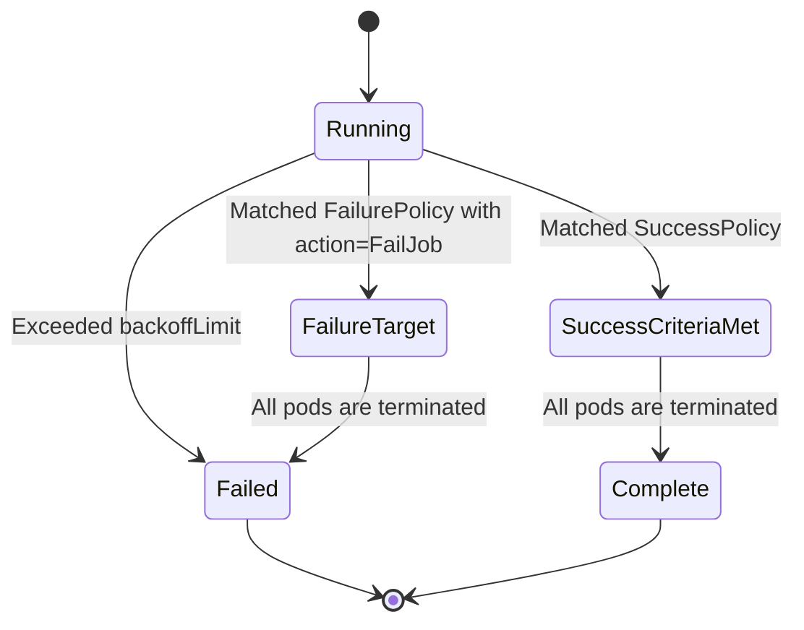
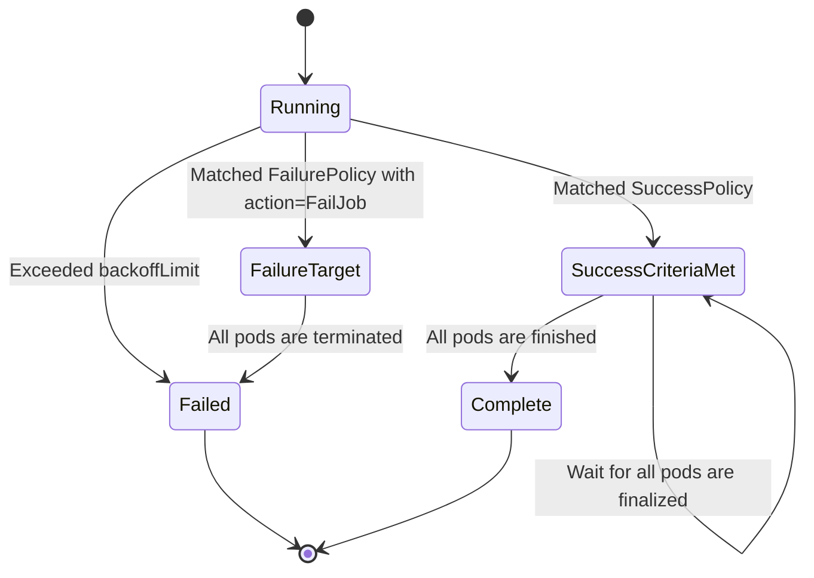

# KEP-3998: Job success/completion policy

<!-- toc -->
- [Release Signoff Checklist](#release-signoff-checklist)
- [Summary](#summary)
- [Motivation](#motivation)
  - [Goals](#goals)
  - [Non-Goals](#non-goals)
- [Proposal](#proposal)
  - [User Stories (Optional)](#user-stories-optional)
    - [Story 1](#story-1)
    - [Story 2](#story-2)
  - [Notes/Constraints/Caveats (Optional)](#notesconstraintscaveats-optional)
    - [No support JobSuccessPolicy for the NonIndexed Job](#no-support-jobsuccesspolicy-for-the-nonindexed-job)
    - [Difference between &quot;complete&quot; and &quot;successCriteriaMet&quot;](#difference-between-complete-and-successcriteriamet)
    - [The CronJob concurrentPolicy is not affected by JobSuccessPolicy](#the-cronjob-concurrentpolicy-is-not-affected-by-jobsuccesspolicy)
    - [Status never switches from &quot;SuccessCriteriaMet&quot; to &quot;Failed&quot;](#status-never-switches-from-successcriteriamet-to-failed)
  - [Risks and Mitigations](#risks-and-mitigations)
- [Design Details](#design-details)
  - [Job API](#job-api)
  - [Evaluation](#evaluation)
  - [Transition of &quot;status.conditions&quot;](#transition-of-statusconditions)
    - [The situations where successPolicy conflicts other terminating policies](#the-situations-where-successpolicy-conflicts-other-terminating-policies)
  - [Test Plan](#test-plan)
      - [Prerequisite testing updates](#prerequisite-testing-updates)
      - [Unit tests](#unit-tests)
      - [Integration tests](#integration-tests)
      - [e2e tests](#e2e-tests)
  - [Graduation Criteria](#graduation-criteria)
    - [Alpha](#alpha)
    - [Optional Second Alpha](#optional-second-alpha)
    - [Beta](#beta)
    - [GA](#ga)
  - [Upgrade / Downgrade Strategy](#upgrade--downgrade-strategy)
  - [Version Skew Strategy](#version-skew-strategy)
- [Production Readiness Review Questionnaire](#production-readiness-review-questionnaire)
  - [Feature Enablement and Rollback](#feature-enablement-and-rollback)
  - [Rollout, Upgrade and Rollback Planning](#rollout-upgrade-and-rollback-planning)
  - [Monitoring Requirements](#monitoring-requirements)
  - [Dependencies](#dependencies)
  - [Scalability](#scalability)
  - [Troubleshooting](#troubleshooting)
- [Implementation History](#implementation-history)
- [Drawbacks](#drawbacks)
- [Alternatives](#alternatives)
  - [Relax a validation for the &quot;completions&quot; of the indexed job](#relax-a-validation-for-the-completions-of-the-indexed-job)
  - [Hold succeededIndexes as []int typed in successPolicy](#hold-succeededindexes-as-int-typed-in-successpolicy)
  - [Acceptable percentage of total succeeded indexes in the succeededCount field](#acceptable-percentage-of-total-succeeded-indexes-in-the-succeededcount-field)
  - [Match succeededIndexes using CEL](#match-succeededindexes-using-cel)
  - [Use JobSet instead of Indexes Job](#use-jobset-instead-of-indexes-job)
  - [Possibility for the lingering pods to continue running after the job meets the successPolicy](#possibility-for-the-lingering-pods-to-continue-running-after-the-job-meets-the-successpolicy)
    - [Additional Story](#additional-story)
    - [Job API](#job-api-1)
    - [Evaluation](#evaluation-1)
    - [Transition of &quot;status.conditions&quot;](#transition-of-statusconditions-1)
  - [Possibility for introducing a new CronJob concurrentPolicy, &quot;ForbidUntilJobSuccessful&quot;](#possibility-for-introducing-a-new-cronjob-concurrentpolicy-forbiduntiljobsuccessful)
  - [Possibility for the configurable reason for the &quot;SuccessCriteriaMet&quot; condition](#possibility-for-the-configurable-reason-for-the-successcriteriamet-condition)
    - [Additional Story](#additional-story-1)
    - [Job API](#job-api-2)
      - [Set the entire reason](#set-the-entire-reason)
      - [Set the suffix of the reason](#set-the-suffix-of-the-reason)
<!-- /toc -->

## Release Signoff Checklist

Items marked with (R) are required *prior to targeting to a milestone / release*.

- [x] (R) Enhancement issue in release milestone, which links to KEP dir in [kubernetes/enhancements] (not the initial KEP PR)
- [x] (R) KEP approvers have approved the KEP status as `implementable`
- [x] (R) Design details are appropriately documented
- [x] (R) Test plan is in place, giving consideration to SIG Architecture and SIG Testing input (including test refactors)
  - [ ] e2e Tests for all Beta API Operations (endpoints)
  - [ ] (R) Ensure GA e2e tests meet requirements for [Conformance Tests](https://github.com/kubernetes/community/blob/master/contributors/devel/sig-architecture/conformance-tests.md) 
  - [ ] (R) Minimum Two Week Window for GA e2e tests to prove flake free
- [x] (R) Graduation criteria is in place
  - [ ] (R) [all GA Endpoints](https://github.com/kubernetes/community/pull/1806) must be hit by [Conformance Tests](https://github.com/kubernetes/community/blob/master/contributors/devel/sig-architecture/conformance-tests.md) 
- [ ] (R) Production readiness review completed
- [ ] (R) Production readiness review approved
- [ ] "Implementation History" section is up-to-date for milestone
- [ ] User-facing documentation has been created in [kubernetes/website], for publication to [kubernetes.io]
- [ ] Supporting documentation—e.g., additional design documents, links to mailing list discussions/SIG meetings, relevant PRs/issues, release notes

[kubernetes.io]: https://kubernetes.io/
[kubernetes/enhancements]: https://git.k8s.io/enhancements
[kubernetes/kubernetes]: https://git.k8s.io/kubernetes
[kubernetes/website]: https://git.k8s.io/website

## Summary

This KEP extends the Job API to allow setting conditions under which an Indexed Job can be declared as succeeded.

## Motivation

There are cases where a batch workload requires an indexed job that want to care 
only about leader indexes in determining the success or failure of a Job,
for example MPI and PyTorch etc. This is currently not possible because the indexed job 
is marked as Completed only if all indexes succeeded.

Some third-party frameworks have implemented success policy.

- [Kubeflow Training Operator](https://www.kubeflow.org/docs/components/training)
- [Flux Operator](https://flux-framework.org/flux-operator/)
- [JobSet](https://github.com/kubernetes-sigs/jobset/)

### Goals

- Allow to mark a job as a succeeded according to a declared policy.
- Once the job meets the successPolicy, the lingering pods are terminated.

### Non-Goals

- Change the existing behavior of Jobs without a SuccessPolicy.
- Support SuccessPolicy for the job with `NonIndexed` mode: The SuccessPolicy can be theoretically supported for the job with `NonIndexed` mode. 
However, we don't work on the job with `NonIndexed` mode in the first iteration since there aren't any effective use cases for the NonIndexed job.

## Proposal

We propose new policies under which a job can be declared as succeeded.
Those policies can be modeled in the following:

1. An indexed job completes if a set of [x, y, z...] indexes are successful.
2. An indexed job completes if x of indexes are successful.

Then, when the job meets one of the success policies, a new condition, `SuccessCriteriaMet,` is added.

### User Stories (Optional)

#### Story 1

As a machine-learning researcher, I run an indexed job which a leader is launched
as index=0 and workers are launched as index=1+.
I want to care about only the leaders when the result of job is evaluated.

In addition, we want to terminate the lingering pods if the leader index (index=0) is succeeded
because the workers often don't have any ways to terminate themselves due to launching daemon processes like ssh-server.

```yaml
apiVersion: batch/v1
kind: Job
spec:
  parallelism: 10
  completions: 10
  completionMode: Indexed
  successPolicy:
    criteria:
    - succeededIndexes: "0"
  template:
    spec:
      restartPolicy: Never
      containers:
      - name: job-container
        image: job-image
        command: ["./sample"]
```

#### Story 2

As a simulation researcher/engineer for fluid dynamics/biochemistry.
I want to mark the job as successful and terminate the lingering pods
when the job meets the one of following conditions:

1. The case of the leader index (index=0) is succeeded
2. The case of some worker indexes (index=1+) are succeeded

Because succeeded leader index means that the whole simulation is succeeded,
and succeeded some worker indexes means that the minimum required value is satisfied.

```yaml
apiVersion: batch/v1
kind: Job
spec:
  parallelism: 10
  completions: 10
  completionMode: Indexed
  successPolicy:
    criteria:
    - succeededIndexes: 0
    - succeededCount: 5
      succeededIndexes: "1-9"
  template:
    spec:
      restartPolicy: Never
      containers:
        - name: job-container
          image: job-image
          command: ["./sample"]
```

### Notes/Constraints/Caveats (Optional)

#### No support JobSuccessPolicy for the NonIndexed Job

As I described in [Non-Goals](#non-goals), we don't support the SuccessPolicy for the job with `NonIndexed` mode.

#### Difference between "complete" and "successCriteriaMet"
The similar job conditions, `Complete` and `SuccessCriteriaMet`, are different in the following ways:

- `Complete` means that all pods completed, not failed.
- `SuccessCriteriaMet` means that the job meets at least one of successPolicies.

So, the job could have both conditions, `Complete` and `SuccessCriteriaMet`.

#### The CronJob concurrentPolicy is not affected by JobSuccessPolicy
Even after introducing the JobSuccessPolicy, all CronJob concurrentPolicies work as before
since the JobSuccessPolicy doesn't change the semantics of the existing Job `Complete` condition 
and the Job declares succeeded by a new condition, `SuccessCriteriaMet`.

Specifically, the CronJob with `Forbid` concurrentPolicy created Jobs based on Job's `Complete` condition as before.

#### Status never switches from "SuccessCriteriaMet" to "Failed"
Switching the status from `SuccessCriteriaMet` to `Failed` would bring the confusions to the systems,
which depends on the Job API.

So, the status can never switch from `SucessCriterionMet` to `Failed`.
Additionally, once the job has `SuccessCriteriaMet=true` condition, the job definitely ends with `Complete=true` condition
even if the lingering pods could potentially meet the failure policies.

### Risks and Mitigations

- If the job object's size reaches to limit of the etcd and
the job controller can't store a correct value in `.status.completedIndexes`,
we probably can not evaluate the SuccessPolicy correctly.

- If we allow to set unlimited size of the value in `.spec.successPolicy.criteria.succeededIndexes`,
we have a risk similar to [KEP-3850: Backoff Limits Per Index For Indexed Jobs](https://github.com/kubernetes/enhancements/tree/76dcd4f342cc0388feb085e685d4cc018ebe1dc9/keps/sig-apps/3850-backoff-limits-per-index-for-indexed-jobs#risks-and-mitigations).
So, we limit the size of `succeededIndexes` to 64Ki.

## Design Details

### Job API

We extend the Job API to set different policies by which a Job can be declared as succeeded.

```golang
type JobSpec struct {
	...
	// SuccessPolicy specifies the policy when the job can be declared as succeeded.
	// If empty, the default behavior applies - the job is declared as succeeded
	// only when the number of succeeded pods equals to the completions.
	// Specified it must be immutable and works only for the Indexed jobs.
	// Once the job meets the successPolicy, the lingering pods are terminated. 
	//
	// This field is alpha-level. To use this field, you must enable the
	// `JobSuccessPolicy` feature gate (disable by default).
	// +optional
	// +listType=atomic
	SuccessPolicy *SuccessPolicy
}

// SuccessPolicy describes when a Job can be declared as succeeded based on the success of some indexes.
type SuccessPolicy struct {
	// Criteria represents the list of alternative criteria for declaring the jobs 
	// as successful before its completion. Once any of the criteria are met,
	// the "SuccessCriteriaMet" condition is added, and the lingering pods are removed.
	// The terminal state for such a job has the "Complete" condition.
	// Additionally, these criteria are evaluated in order; Once the job meets one of the criteria,
	// other criteria are ignored.
	//
	// +optional
	Criteria []SuccessPolicyCriterion
}

// SuccessPolicyCriteria describes a criterion for declaring a Job as succeeded.
// Each criterion must have at least one of the "succeededIndexes" or "succeededCount" specified.
type SuccessPolicyCriterion struct {
	// SucceededIndexes specifies the set of indexes 
	// which need to be contained in the actual set of succeeded indexes for the job.
	// The list of indexes must be within 0 to ".spec.completions-1" and
	// must not contain duplicates. At least one element is required. 
	// The indexes are represented as decimal integers
	// separated by commas. The numbers are listed in increasing order. Three or
	// more consecutive numbers are compressed and represented by the first and
	// last element of the series, separated by a hyphen.
	// For example, if the completed indexes are 1, 3, 4, 5 and 7, they are
	// represented as "1,3-5,7".
	// When this field is null, this field doesn't default to any value
	// and is never evaluated at any time.
	// 
	// +optional
	SucceededIndexes *string

	// SucceededCount specifies the minimal required size of the actual set of the succeeded indexes
	// for the job. When SucceededCount is used along with SucceededIndexes, the check is 
	// constrained only to the set of indexes specified by SucceededIndexes.
	// When this field is null, this field doesn't default to any value
	// and is never evaluated at any time.
	// When specified it needs to be a positive integer.
	//
	// +optional
	SucceededCount *int
}
...

// These are valid conditions of a job.
const (
	// JobSuccessCriteriaMet means the job has been succeeded.
	JobSucceessCriteriaMet JobConditionType = "SuccessCriteriaMet"
	...
)
```

Moreover, we validate the following constraints for the `criteria`:
- whether each criterion have at least one of the `succeededIndexes` or `succeededCount` specified.
- whether the specified indexes in the `succeededIndexes` and
  the number of indexes in the `succeededCount` don't exceed the value of `completions`.
- whether `Indexed` is specified in the `completionMode` field.
- whether the size of `succeededIndexes` is under 64Ki.
- whether the `succeededIndexes` field has a valid format.
- whether the `succeededCount` field has an absolute number.
- whether the criteria haven't changed.
- whether the successPolicies meet the `succeededCount <= |succeededIndexes|`, 
where `|succeededIndexes|` means the number of indexes in the `succeededIndexes`. 


### Evaluation

Every time the pod condition are updated, the job-controller evaluates the successPolicies following the rules in order:

- `succeededIndexes`: the job-controller evaluates `.status.completedIndexes` to see if a set of indexes is there.
- `succeededCount`: the job-controller evaluates `.status.succeeded` to see if the value is `succeededCount` or more.

After that, the job-controller adds a `SuccessCriteriaMet` condition instead of a `Failed` condition to `.status.conditions`
and the job-controller terminates the lingering pods. At that time, `JobSuccessPolicy` is set to the `status.reason` field.

Note that when the job meets one of successPolicies, other successPolicies are ignored.

Finally, once all pods have terminated, the job-controller adds a `Complete` condition to `.status.conditions`.
If any successPolicy isn't set, the job-controller adds an only `Complete` condition to the Job after the Job finished.

Furthermore, the behavior of `FailureTarget` and `SuccessCriteriaMet` is similar in that the Job with this condition triggers the termination of lingering pods;
after all pods are terminated, the terminal condition (`Failed` or `Complete`) is added:

- `FailureTarget` is added to the Job matched with FailurePolicy with `action=FailJob` and triggers the termination of the lingering pods.
Then, after the lingering pods are terminated, the `Failed` condition is added to the Job.
- `SuccessCriterionMet` is added to the Job matched with SuccessPolicy and triggers the termination of lingering pods. 
Then, after the lingering pods are terminated, the `Complete` condition is added to the Job.

### Transition of "status.conditions"

When the job with successPolicies is submitted, the job `status.conditions` transits in the following:
Note that the Job doesn't have an actual `Running` condition in the `status.conditions`.



It means that the job's `.status.conditions` follows the following rules:  

- The job could have both `SuccessCriteriaMet=true` and `Complete=true` conditions.
- The job can't have both `Failed=true` and `SuccessCriteriaMet=true` conditions.
- The job can't have both `Failed=true` and `Complete=true` conditions.

#### The situations where successPolicy conflicts other terminating policies

The successPolicy has potential conflicts with other terminating policies such as the [pod failure policy](https://kubernetes.io/docs/tasks/job/pod-failure-policy/)
, backoffLimit, and [backoffLimitPerIndex](https://kubernetes.io/docs/concepts/workloads/controllers/job/#backoff-limit-per-index)
in the following situations:

- when the job meets the successPolicy and some pod failure policies with the `FailJob` action.
- when the job meets the successPolicy and the number of failed pods exceeds `backoffLimit`.
- when the job meets the successPolicy and the number of failed pods per indexes exceeds `backoffLimitPerIndex` in all indexes.

To avoid the above conflicts, terminating policies are evaluated the first before successPolicies.
This means that the terminating policies are respected rather than the successPolicies,
if the Job doesn't have the `FailureTarget` or `SuccessCriteriaMet` conditions yet.

### Test Plan

[x] I/we understand the owners of the involved components may require updates to
existing tests to make this code solid enough prior to committing the changes necessary
to implement this enhancement.

##### Prerequisite testing updates

##### Unit tests

- Test cases:
  - tests for Defaulting and Validating
  - verify whether a job has a SuccessCriteriaMet condition if the job meets to successPolicy and some indexes fail.
  - verify whether a job has both complete and SuccessCriteriaMet conditions 
  if the job meets to successPolicy and all pods are terminated
  - verify whether a job has a failed condition if the job meets to both successPolicy and terminating policies
  in the same reconcile cycle

- `k8s.io/kubernetes/pkg/controller/job`: `2 February 2024` - `91.5%`
- `k8s.io/kubernetes/pkg/apis/batch/validation`: `2 February 2024` - `98.0%`

##### Integration tests

- Test scenarios:
  - enabling, disabling and re-enabling of the `JobSuccessPolicy` feature gate
  - handling of successPolicy when all indexes succeeded
  - handling of the `.spec.successPolicy.criteria.succeededIndexes` when some indexes remain pending
  - handling of the `.spec.successPolicy.criteria.succeededCount` when some indexes remain pending 
  - handling of successPolicy when some indexes of job with `backOffLimitPerIndex` fail

##### e2e tests

- Test scenarios:
  - handling of successPolicy when all indexes succeeded
  - handling of the `.spec.successPolicy.criteria.succeededIndexes` when some indexes remain pending
  - handling of the `.spec.successPolicy.criteria.succeededCount` when some indexes remain pending

### Graduation Criteria

#### Alpha

- Feature implemented behind the `JobSuccessPolicy` feature gate.
- Unit and integration tests passed as designed in [TestPlan](#test-plan).

#### Optional Second Alpha

- Decided whether we introduce a `whenCriterionAchived=continue` and `whenCriterionAchived=continueWithRecreations`.
Please see the [Possibility for the lingering pods to continue running after the job meets the successPolicy](#possibility-for-the-lingering-pods-to-continue-running-after-the-job-meets-the-successpolicy)
section for discussion points.
- Decided whether we introduce a new CronJob concurrentPolicy, `ForbidUntilJobSuccessful`.
Please see the [Possibility for introducing a new CronJob concurrentPolicy, "ForbidUntilJobSuccessful"](#possibility-for-introducing-a-new-cronjob-concurrentpolicy-forbiduntiljobsuccessful).
section for more details.

#### Beta

- E2E tests passed as designed in [TestPlan](#test-plan).
- Added a new reasons to the existing `job_finished_total` metric in [Monitoring Requirements](#monitoring-requirements).
- Feature is enabled by default.
- Address all issues reported by users.
- Decided whether we introduce a configurable reason for the `SuccessCriteriaMet` condition.
Please see the [Possibility for the configurable reason for the "SuccessCriteriaMet" condition](#possibility-for-the-configurable-reason-for-the-successcriteriamet-condition). 

#### GA

- No negative feedback.

### Upgrade / Downgrade Strategy

- Upgrade
  - If the feature gate is enabled, `JobSuccessPolicy` are allowed to use only.
  - If the feature gate is enabled without `JobSuccessPolicy`, 
  the default values will be applied to a job object.
  - Even if the feature gate is enabled, the Job controller doesn't update
  `.status.conditions` in already finished jobs.
- Downgrade
  - Previously configured values will be ignored, and the job will be marked
  as completed only when all indexes succeed.
  - the Job controller doesn't update `.status.conditions` in already finished jobs.

### Version Skew Strategy

The apiserver's version should be consistent with the kube-controller-manager version,
or this feature will not work.

This feature is limited to control plane.

Note that, the kube-apiserver can be in the N+1 skew version relative to the
kube-controller-manager as described [here](https://kubernetes.io/releases/version-skew-policy/#kube-controller-manager-kube-scheduler-and-cloud-controller-manager).
In that case, the Job controller operates on the version of the Job object that
already supports the new Job API.

## Production Readiness Review Questionnaire

### Feature Enablement and Rollback

###### How can this feature be enabled / disabled in a live cluster?

- [x] Feature gate (also fill in values in `kep.yaml`)
  - Feature gate name: JobSuccessPolicy
  - Components depending on the feature gate:
    - kube-apiserver
    - kube-controller-manager

###### Does enabling the feature change any default behavior?

No, the default behavior of a job and cronJob stays the same.
The newly added field is optional and has to be explicitly set by the user to use this new feature.

Regarding the CronJob, please see more details in [#The CronJob concurrentPolicy is not affected by JobSuccessPolicy](#the-cronjob-concurrentpolicy-is-not-affected-by-jobsuccesspolicy).

###### Can the feature be disabled once it has been enabled (i.e. can we roll back the enablement)?

Yes, we can disable the `JobSuccessPolicy` feature gate.
When the feature is disabled, the job controller stop evaluating the successPolicy even if
the `.spec.successPolicy` is set.

###### What happens if we reenable the feature if it was previously rolled back?

The Job controller considers the `.spec.successPolicy` when it updates `.status.conditions`
only for running Jobs and don't update `.status.conditions` for already finished jobs.

###### Are there any tests for feature enablement/disablement?

No, we'll add them during alpha.

### Rollout, Upgrade and Rollback Planning

###### How can a rollout or rollback fail? Can it impact already running workloads?

Even if the kube-controller-manager is rolled out or rollback fail, already running workloads aren't any impact.
The default behavior will be applied to running workloads.

###### What specific metrics should inform a rollback?

An increase in the `job_sync_duration_seconds` metrics can mean that finished jobs
are taking longer to evaluate.

The users should check whether the completed jobs have the appropriate condition,
specifically the reason.

###### Were upgrade and rollback tested? Was the upgrade->downgrade->upgrade path tested?

No.

###### Is the rollout accompanied by any deprecations and/or removals of features, APIs, fields of API types, flags, etc.?

No.

### Monitoring Requirements

###### How can an operator determine if the feature is in use by workloads?

`job_finished_total`: the new `JobSuccessPolicy` and `Completions` values for the `reason` label. 
  - `JobSuccessPolicy` indicates a job is declared as succeeded because the job meets `.spec.successPolicy`.
  - `Completions` indicates a job is declared as succeeded because the job meets `spec.completions`.

###### How can someone using this feature know that it is working for their instance?

- [x] Job API .status
  - The Job controller will add a condition with `JobSuccessPolicy` reason to `conditions`.

###### What are the reasonable SLOs (Service Level Objectives) for the enhancement?

99% percentile over day for Job syncs is <= 15s for a client-side 50 QPS limit.

###### What are the SLIs (Service Level Indicators) an operator can use to determine the health of the service?

- [x] Metrics
  - Metric name: `job_sync_duration_seconds` (existing): can be used to see how much the
    feature enablement increases the time spent in the sync job
  - Components exposing the metric:

###### Are there any missing metrics that would be useful to have to improve observability of this feature?

No.

### Dependencies

###### Does this feature depend on any specific services running in the cluster?

No.

### Scalability

No.

###### Will enabling / using this feature result in any new API calls?

No.

###### Will enabling / using this feature result in introducing new API types?

No.

###### Will enabling / using this feature result in any new calls to the cloud provider?

No.

###### Will enabling / using this feature result in increasing size or count of the existing API objects?

Yes, it will increase the size of existing API objects only when the `.spec.successPolicy` is set.

- API type(s): Job
- Estimated increase in size: `.spec.successPolicy.criteria.succeededIndexes` field are impacted.
In the worst case, the size of `succeededIndexes` can be estimated about 64KiB (see [Risks and Mitigations](#risks-and-mitigations)).

###### Will enabling / using this feature result in increasing time taken by any operations covered by existing SLIs/SLOs?

No.

###### Will enabling / using this feature result in non-negligible increase of resource usage (CPU, RAM, disk, IO, ...) in any components?

No.

###### Can enabling / using this feature result in resource exhaustion of some node resources (PIDs, sockets, inodes, etc.)?

No.

### Troubleshooting

###### How does this feature react if the API server and/or etcd is unavailable?

The job controller will declare that the job is "Succeeded" based on the `.status.completedIndexes`.
So, in this case, the job controller can not correctly evaluate the successPolicy 
because the `.status.completedIndexes` won't be updated.

###### What are other known failure modes?

None.

###### What steps should be taken if SLOs are not being met to determine the problem?

If a successPolicy isn't respected even though the job doesn't match other policies 
such as a [pod failure policy](https://kubernetes.io/docs/tasks/job/pod-failure-policy/) and backoffLimit:

- Check reachability between Kubernetes components.
- Consider increasing the logging level to trace when the issues occur.
- Check the job controller's `job_sync_duration_seconds` metric to check if the job controller's processing duration increases. 

If many requests are rejected, re-queued many times or increased the job controller's processing duration,
consider tuning the parameters for [APF](https://kubernetes.io/docs/concepts/cluster-administration/flow-control/).

## Implementation History
 
- 2023.06.06: This KEP is ready for review.
- 2023.06.09: API design is updated.
- 2023.10.03: API design is updated.
- 2024.02.07: API is finalized for the alpha stage.

## Drawbacks

Adds more complexity to the criteria to be terminated Job.

## Alternatives

### Relax a validation for the "completions" of the indexed job
Currently, the indexed job is restricted `.spec.completion!=nil`.
By relaxing the validation, the indexed job can be declared as succeeded when some indexes succeeded,
similar to NonIndexed jobs.

### Hold succeededIndexes as []int typed in successPolicy

We can hold the `succeededIndexes` as []int typed that a job can be declared as succeeded.

```golang
// SuccessPolicyOnSucceededPods describes a Job can be succeeded based on succeeded pods.
type SuccessPolicyCriterion struct {
	// Specifies a set of required indexes.
	// The job is declared as succeeded if a set of indexes are succeeded. 
	// The list of indexes must come within 0 to `.spec.completions` and
	// must not contain duplicates. At least one element is required. 
	// 
	// +optional
	SucceededIndexes []int
...
}
```

However, if we allow users to set all `succeededIndexes` (`0-10^5`) to `.spec.successPolicy.creteria.succeededIndexes`
and don't limit the number of list sizes, there are cases that the size of a job object is too big.

In the worst case, allowed all indexes (`0-10^5`) are added to `succeededIndexes`, and a `succeededIndexes` size
is `SUM[9*10^n*(n+1)]+2+6≈5.6656MiB`, where:
- `n` starts from `0` and goes up to `5`.
- `1` of `n+1` means a separator that indicates `,`.
- `2` is the sum of the index `0` and `,`.
- `6` is the size of indexes `10^5`.

So, if we select this alternative API design, we need to limit the size of `succeededIndexes`. 

### Acceptable percentage of total succeeded indexes in the succeededCount field

We can accept a percentage of total succeeded indexes in the `succeededCount` field for the job with autoscaling semantics.
However, there is no effective use case for typical stories using elastic horovod or PyTorch elastic training,
as all pods must be completed.

```golang
// SuccessPolicyCriterion describes a Job can be succeeded based on succeeded indexes.
type SuccessPolicyCriterion struct {
	...
	// Specifies the required number of indexes when .spec.completionMode =
	// "Indexed".
	// Value can be an absolute number (ex: 5) or an absolute percentage of total indexes
	// when the job can be declared as succeeded (ex: 50%).
	// The absolute number is calculated from the percentage by rounding up.
	// 
	// +optional
	SucceededCount *intstr.IntOrString
	...
}
```

### Match succeededIndexes using CEL

We can accept a set of required indexes represented by CEL in the `succeededIndexes` field. 
However, it is difficult to represent the set of indexes without regularity. 

```golang
// SuccessPolicyCriterion describes a Job can be succeeded based on succeeded indexes.
type SuccessPolicyCriterion struct {
	...
	// Specifies a set of required indexes using CEL.
	// For example, if the completed indexes are only the last index, they are
	// represented as (job.completions -1).
	//
	// +optional
	SucceededIndexesMatchExpression *string
	...
}
```

### Use JobSet instead of Indexes Job

The [JobSet](https://github.com/kubernetes-sigs/jobset) is a custom resource for managing a group of Job as a unit.

Some of the stories are better served using JobSet.
Specifically, cases that make assumptions about what an index represents could be mapped as jobs in JobSet,
with names representing the semantics of those different groups of pods.

However, both Job level and JobSet level successPolicies would be valuable
since there are some cases in which we want to launch a Job by a single podTemplate.

<<[UNRESOLVED @tenzen-y: Do we need to make configurable actions? ]>>
### Possibility for the lingering pods to continue running after the job meets the successPolicy

There are cases where a batch workload can be declared as succeeded, and continue the lingering pods if a number of pods succeed.
So, it is possible to introduce a new field, `whenCriterionAchieved` to make configurable the action for the lingering pods.

Note that if we introduce the `whenCriteriaChieved` field, we must have the second alpha stage.

#### Additional Story

As a simulation researcher/engineer for fluid dynamics/biochemistry.
I want to mark the job as successful and continue the lingering pods if some indexes succeed
because I set the minimum required value for sampling in the `.successPolicy.criteria.succeededCount` and
perform the same simulation in all indexes.

```yaml
apiVersion: batch/v1
kind: Job
spec:
  parallelism: 10
  completions: 10
  completionMode: Indexed
  successPolicy:
    criteria:
    - succeededCount: 5
      succeededIndexes: "1-9"
      whenCriterionAchieved: continue
  template:
    spec:
      restartPolicy: Never
      containers:
        - name: job-container
          image: job-image
          command: ["./sample"]
``` 

#### Job API

```golang
// SuccessPolicyCriteria describes a Job can be succeeded based on succeeded indexes.
type SuccessPolicyCriterion struct {
	...
	// Specifies the action to be taken on the not finished (successCriteriaMet or failed) pods 
	// when the job achieved the requirements.
	// Possible values are:
	// - Continue indicates that all pods wouldn't be terminated. 
	//   When the lingering pods failed, the pods would ignore the terminating policies (backoffLimit, 
	//   backoffLimitPerIndex, and podFailurePolicy, etc.) and the pods aren't re-created.
	// - ContinueWithRecreations indicates that all pods wouldn't be terminated.
	//   When the lingering pods failed, the pods would follow the terminating policies (backoffLimit, 
	//   backoffLimitPerIndex, and podFailurePolicy, etc.) and the pods are re-created.
	// - Terminate indicates that not finished pods would be terminated.
	//
	// Default value is Terminate.
	WhenCriterionAchieved WhenCriterionAchievedSuccessPolicy	
}

// WhenCriterionAchievedSuccessPolicy specifies the action to be taken on the pods
// when the job achieved the requirements.
// +enum
type WhenCriterionAchievedSuccessPolicy string

const (
	// All pods wouldn't be terminated when the job reached successPolicy.
	// When the lingering pods failed, the pods would ignore the terminating policies (backoffLimit,
	// backoffLimitPerIndex, and podFailurePolicy, etc.) and the pods aren't re-created.
	ContinueWhenCriterionAchievedSuccessPolicy WhenCriterionAchievedSuccessPolicy = "Continue"

	// All pods wouldn't be terminated when the job reached successPolicy.
	// When the lingering pods failed, the pods would follow the terminating policies (backoffLimit,
	// backoffLimitPerIndex, and podFailurePolicy, etc.) and the pods are re-created.
	ContinueWithRecreationsWhenCriterionAchievedSuccessPolicy WhenCriterionAchievedSuccessPolicy = "ContinueWithRecreations"

	// Not finished pods would be terminated when the job reached successPolicy.
	TerminateWhenCriterionAchievedSuccessPolicy WhenCriterionAchievedSuccessPolicy = "Terminate"
)
```

#### Evaluation

We need to have more discussions if we support the `continue` and `continueWithRecreatios` in the `whenCriterionAchieved`.
We have main discussion points here:

1. After the job meets any successPolicy with `whenCriterionAchieved=continue` and the job gets `SuccessCriteriaMet` condition,
   what we would expect to happen, when the lingering pods are failed.
   We may be able to select one of the actions in `a: Failed pods follow terminating policies like backoffLimit and podFailurePolicy`
   or `b: Failed pods are terminated immediately, and the terminating policies are ignored`.
   Moreover, as an alternative, we may be able to select the action `b` for the `whenCriterionAchieved=continue`,
   and then we may be possible to introduce a new `whenCriterionAchieved`, `continueWithRecreations`, for the action `a`.

   - `terminate`: The current supported behavior. All pods would be terminated by the job controller.
   - `continue`: This behavior isn't supported in the alpha stage.
      The lingering pods wouldn't be terminated when the job reached successPolicy.
      Additionally, when the lingering pods failed, the pods are re-created followed terminating policies.
   - `continueWithRecreations`: This behavior isn't supported in the alpha stage.
      The lingering pods wouldn't be terminated when the job reached successPolicy.
      Additionally, when the lingering pods failed, the pods are re-created followed terminating policies.

#### Transition of "status.conditions"

When the job with `whenCriterionAchieved=continue` is submitted, the job `status.conditions` transits in the following:
Note that the Job doesn't have an actual `Running` condition in the `status.conditions`.


<<[/UNRESOLVED]>>

<<[UNRESOLVED @tenzen-y: A new CronJob concurrentPolicy, "ForbidUntilSuccessful"]>>
### Possibility for introducing a new CronJob concurrentPolicy, "ForbidUntilJobSuccessful"

It is potentially possible to add a new CronJob concurrentPolicy, `ForbidUntilJobSuccessful`,
which the CronJob with `ForbidUntilJobSuccessful` creates Jobs based on Job's `SuccessCriteriaMet` condition.
If we add a new concurrentPolicy to CronJobs, we need to have a dedicated alpha featureGate separate from `JobSuccessPolicy`.
<<[/UNRESOLVED]>>

<<[UNRESOLVED @tenzen-y: Do we need to have the configurable reason?]>>
### Possibility for the configurable reason for the "SuccessCriteriaMet" condition

It is possible to add a configurable reason for the "SuccessCriteriaMet" condition.
The machine-readable reason would be useful when the external programs like custom controllers implements the mechanism
so that the CustomJob API can change the actions based on the reason.

If we add this new field, we need to have a dedicated alpha featureGate separate from `JobSuccessPolicy`.
Additionally, we can define the API scheme along with the [PodFailrePolicyReason (KEP-4443)](https://github.com/kubernetes/enhancements/pull/4479).

#### Additional Story

As a developer of CustomJob API built with Job API like JobSet, I want to implement the reconcile logic so that
the controller can change the actions based on the reason why the job has been succeeded.

So, it should be included in the `reason` field instead of `message` field since the reason field should be machine-readable.

```yaml
apiVersion: batch/v1
kind: Job
spec:
  parallelism: 10
  completions: 10
  completionMode: Indexed
  successPolicy:
    criteria:
    - succeededIndexes: "0"
      setSuccessCriteriaMetReason: "LeaderSucceeded"
    - succeededIndexes: "1-9"
      setSuccessCriteriaMetReason: "WorkersSucceeded"
  template:
    spec:
      restartPolicy: Never
      containers:
        - name: job-container
          image: job-image
          command: ["./sample"]
status:
  conditions:
  - type: "SuccessCriteriaMet"
    status: "True"
    reason: "LeaderSucceeded"
```

#### Job API

Selecting one of the following API designs is possible, but the first, `setSuccessCriteriaMetReason` was preferred 
during the JobSuccessPolicy alpha stage discussions. Because the second, `SuccessCriteriaMetReasonSuffix` would decrease the machine-readability 
since we need to parse the reason by the separation, `As`.

Furthermore, allowing the `reason` to have merging field responsibility wouldn't better and 
decreasing the machine-readability would decrease the valuable that we have this reason in the `status.reason` field instead of `status.message` field.

##### Set the entire reason

```golang
// SuccessPolicyCriteria describes a criterion for declaring a Job as succeeded.
// Each criterion must have at least one of the "succeededIndexes" or "succeededCount" specified.
type SuccessPolicyCriterion struct {
	// SetSuccessCriteriaMetReason specifies the CamelCase reason for the "SuccessCriteriaMet" condition.
	// Once the job meets this criterion, the specified reason is set to the "status.reason".
	// The default value is "JobSuccessPolicy".
	//
	// +optional
	SetSuccessCriteriaMetReason *string
}
```

##### Set the suffix of the reason

```golang
// SuccessPolicyCriteria describes a criterion for declaring a Job as succeeded.
// Each criterion must have at least one of the "succeededIndexes" or "succeededCount" specified.
type SuccessPolicyCriterion struct {
	// SuccessCriteriaMetReasonSuffix specifies the CamelCase suffix of the reason for the "SuccessCriteriaMet" condition.
	// Once the job meets this criterion, "JobSuccessPolicy" and the specified suffix is combined with "As".
	// For example, if specified suffix is "LeaderSucceeded", it is represented as "JobSuccessPolicyAsLeaderSucceeded".
	//
	// +optional
	SuccessCriteriaMetReasonSuffix *string
}
```
<</[UNRESOLVED]>>
