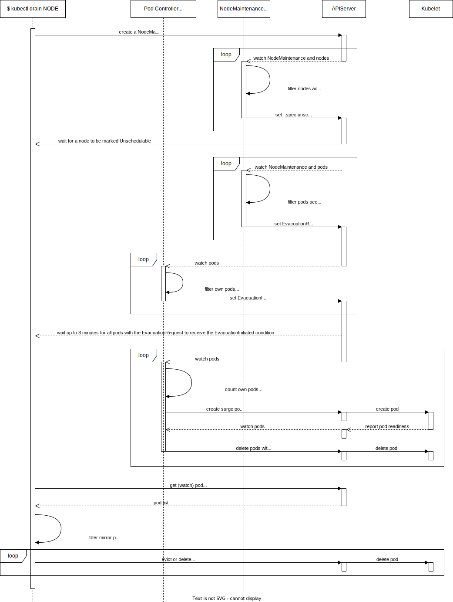

<!--
**Note:** When your KEP is complete, all of these comment blocks should be removed.

To get started with this template:

- [ ] **Pick a hosting SIG.**
  Make sure that the problem space is something the SIG is interested in taking
  up. KEPs should not be checked in without a sponsoring SIG.
- [ ] **Create an issue in kubernetes/enhancements**
  When filing an enhancement tracking issue, please make sure to complete all
  fields in that template. One of the fields asks for a link to the KEP. You
  can leave that blank until this KEP is filed, and then go back to the
  enhancement and add the link.
- [ ] **Make a copy of this template directory.**
  Copy this template into the owning SIG's directory and name it
  `NNNN-short-descriptive-title`, where `NNNN` is the issue number (with no
  leading-zero padding) assigned to your enhancement above.
- [ ] **Fill out as much of the kep.yaml file as you can.**
  At minimum, you should fill in the "Title", "Authors", "Owning-sig",
  "Status", and date-related fields.
- [ ] **Fill out this file as best you can.**
  At minimum, you should fill in the "Summary" and "Motivation" sections.
  These should be easy if you've preflighted the idea of the KEP with the
  appropriate SIG(s).
- [ ] **Create a PR for this KEP.**
  Assign it to people in the SIG who are sponsoring this process.
- [ ] **Merge early and iterate.**
  Avoid getting hung up on specific details and instead aim to get the goals of
  the KEP clarified and merged quickly. The best way to do this is to just
  start with the high-level sections and fill out details incrementally in
  subsequent PRs.

Just because a KEP is merged does not mean it is complete or approved. Any KEP
marked as `provisional` is a working document and subject to change. You can
denote sections that are under active debate as follows:

```
<<[UNRESOLVED optional short context or usernames ]>>
Stuff that is being argued.
<<[/UNRESOLVED]>>
```

When editing KEPS, aim for tightly-scoped, single-topic PRs to keep discussions
focused. If you disagree with what is already in a document, open a new PR
with suggested changes.

One KEP corresponds to one "feature" or "enhancement" for its whole lifecycle.
You do not need a new KEP to move from beta to GA, for example. If
new details emerge that belong in the KEP, edit the KEP. Once a feature has become
"implemented", major changes should get new KEPs.

The canonical place for the latest set of instructions (and the likely source
of this file) is [here](/keps/NNNN-kep-template/README.md).

**Note:** Any PRs to move a KEP to `implementable`, or significant changes once
it is marked `implementable`, must be approved by each of the KEP approvers.
If none of those approvers are still appropriate, then changes to that list
should be approved by the remaining approvers and/or the owning SIG (or
SIG Architecture for cross-cutting KEPs).
-->
# KEP-4212: Declarative Node Maintenance

<!--
This is the title of your KEP. Keep it short, simple, and descriptive. A good
title can help communicate what the KEP is and should be considered as part of
any review.
-->

<!--
A table of contents is helpful for quickly jumping to sections of a KEP and for
highlighting any additional information provided beyond the standard KEP
template.

Ensure the TOC is wrapped with
  <code>&lt;!-- toc --&rt;&lt;!-- /toc --&rt;</code>
tags, and then generate with `hack/update-toc.sh`.
-->

<!-- toc -->
- [Release Signoff Checklist](#release-signoff-checklist)
- [Summary](#summary)
- [Motivation](#motivation)
  - [Goals](#goals)
  - [Non-Goals](#non-goals)
- [Proposal](#proposal)
  - [User Stories (Optional)](#user-stories-optional)
    - [Story 1](#story-1)
    - [Story 2](#story-2)
    - [Story 3](#story-3)
    - [Story 4](#story-4)
  - [Notes/Constraints/Caveats (Optional)](#notesconstraintscaveats-optional)
    - [Cancelled Node Maintenance and Impact on Applications](#cancelled-node-maintenance-and-impact-on-applications)
  - [Risks and Mitigations](#risks-and-mitigations)
- [Design Details](#design-details)
  - [Kubectl](#kubectl)
  - [NodeMaintenance API](#nodemaintenance-api)
  - [Pod API](#pod-api)
  - [NodeMaintenance Controller](#nodemaintenance-controller)
    - [Idle](#idle)
  - [Finalizers and Deletion](#finalizers-and-deletion)
    - [Cordon](#cordon)
    - [Uncordon (Complete)](#uncordon-complete)
    - [Drain](#drain)
    - [Supported Stage Transitions](#supported-stage-transitions)
  - [Deployment and ReplicaSet Controllers](#deployment-and-replicaset-controllers)
  - [Node Drain Process: Before and After](#node-drain-process-before-and-after)
  - [Test Plan](#test-plan)
      - [Prerequisite testing updates](#prerequisite-testing-updates)
      - [Unit tests](#unit-tests)
      - [Integration tests](#integration-tests)
      - [e2e tests](#e2e-tests)
  - [Graduation Criteria](#graduation-criteria)
  - [Upgrade / Downgrade Strategy](#upgrade--downgrade-strategy)
  - [Version Skew Strategy](#version-skew-strategy)
- [Production Readiness Review Questionnaire](#production-readiness-review-questionnaire)
  - [Feature Enablement and Rollback](#feature-enablement-and-rollback)
  - [Rollout, Upgrade and Rollback Planning](#rollout-upgrade-and-rollback-planning)
  - [Monitoring Requirements](#monitoring-requirements)
  - [Dependencies](#dependencies)
  - [Scalability](#scalability)
  - [Troubleshooting](#troubleshooting)
- [Implementation History](#implementation-history)
- [Drawbacks](#drawbacks)
- [Future Improvements](#future-improvements)
  - [Disruption Controller: Eviction Protection and Observability](#disruption-controller-eviction-protection-and-observability)
- [Alternatives](#alternatives)
  - [Out-of-tree Implementation](#out-of-tree-implementation)
  - [Use a Node Object Instead of Introducing a New NodeMaintenance API](#use-a-node-object-instead-of-introducing-a-new-nodemaintenance-api)
  - [Use Taint Based Eviction for Node Maintenance](#use-taint-based-eviction-for-node-maintenance)
  - [Names considered for the new API](#names-considered-for-the-new-api)
- [Infrastructure Needed (Optional)](#infrastructure-needed-optional)
<!-- /toc -->

## Release Signoff Checklist

<!--
**ACTION REQUIRED:** In order to merge code into a release, there must be an
issue in [kubernetes/enhancements] referencing this KEP and targeting a release
milestone **before the [Enhancement Freeze](https://git.k8s.io/sig-release/releases)
of the targeted release**.

For enhancements that make changes to code or processes/procedures in core
Kubernetes—i.e., [kubernetes/kubernetes], we require the following Release
Signoff checklist to be completed.

Check these off as they are completed for the Release Team to track. These
checklist items _must_ be updated for the enhancement to be released.
-->

Items marked with (R) are required *prior to targeting to a milestone / release*.

- [ ] (R) Enhancement issue in release milestone, which links to KEP dir in [kubernetes/enhancements] (not the initial KEP PR)
- [ ] (R) KEP approvers have approved the KEP status as `implementable`
- [ ] (R) Design details are appropriately documented
- [ ] (R) Test plan is in place, giving consideration to SIG Architecture and SIG Testing input (including test refactors)
  - [ ] e2e Tests for all Beta API Operations (endpoints)
  - [ ] (R) Ensure GA e2e tests meet requirements for [Conformance Tests](https://github.com/kubernetes/community/blob/master/contributors/devel/sig-architecture/conformance-tests.md) 
  - [ ] (R) Minimum Two Week Window for GA e2e tests to prove flake free
- [ ] (R) Graduation criteria is in place
  - [ ] (R) [all GA Endpoints](https://github.com/kubernetes/community/pull/1806) must be hit by [Conformance Tests](https://github.com/kubernetes/community/blob/master/contributors/devel/sig-architecture/conformance-tests.md) 
- [ ] (R) Production readiness review completed
- [ ] (R) Production readiness review approved
- [ ] "Implementation History" section is up-to-date for milestone
- [ ] User-facing documentation has been created in [kubernetes/website], for publication to [kubernetes.io]
- [ ] Supporting documentation—e.g., additional design documents, links to mailing list discussions/SIG meetings, relevant PRs/issues, release notes

<!--
**Note:** This checklist is iterative and should be reviewed and updated every time this enhancement is being considered for a milestone.
-->

[kubernetes.io]: https://kubernetes.io/
[kubernetes/enhancements]: https://git.k8s.io/enhancements
[kubernetes/kubernetes]: https://git.k8s.io/kubernetes
[kubernetes/website]: https://git.k8s.io/website

## Summary

This KEP proposes adding a declarative API to manage a node maintenance. This API can be used to
implement additional capabilities around node draining.

## Motivation
The goal of this KEP is to analyze and improve node maintenance in Kubernetes.

Node maintenance is a request from a cluster administrator to remove all pods
from a node(s) so that it can be disconnected from the cluster to perform a
software upgrade (OS, Kubelet), hardware upgrade, or simply to remove the node
as it is no longer needed.

Kubernetes has existing support for this use case in the following way with `kubectl drain`:
1. There are running pods on node A, some of which are protected with PodDisruptionBudgets (PDB).
2. Set the node `Unschedulable` (cordon) to prevent new pods from being scheduled there.
3. Evict (default behavior) pods from node A by using the eviction API (see [kubectl drain worklflow](https://raw.githubusercontent.com/kubernetes/website/f2ef324ac22e5d9378f2824af463777182817ca6/static/images/docs/kubectl_drain.svg)).
4. Proceed with the maintenance and shut down the node.
5. Kubelet can try to delay the shutdown to allow the remaining pods to terminate gracefully
   ([graceful-node-shutdown](https://kubernetes.io/docs/concepts/architecture/nodes/#graceful-node-shutdown)). 
   The Kubelet also takes pod priority into account ([pod-priority-graceful-node-shutdown](https://kubernetes.io/docs/concepts/architecture/nodes/#pod-priority-graceful-node-shutdown))

The main problem is that the current approach tries to solve this in an application agnostic way
and just tries to get rid of all the pods on the node. Since this approach cannot be applied
generically to all pods, the Kubernetes project has defined special [drain filters](https://github.com/kubernetes/kubernetes/blob/56cc5e77a10ba156694309d9b6159d4cd42598e1/staging/src/k8s.io/kubectl/pkg/drain/filters.go#L153-L162)
that either skip groups of pods or an admin has to consent to override those groups to be either
skipped or deleted. This means that without knowledge of all the underlying applications on the
cluster, the admin has to make a potentially harmful decision.

From an application owner or developer perspective, the only standard tool they have is
a PodDisruptionBudget. This is sufficient in a basic scenario with a simple multi-replica
application. The edge case applications, where this does not work are very important to
the cluster admin, as they can block the node drain. And, in turn, very important to the
application owner, as the admin can then override the pod disruption budget and disrupt their
sensitive application anyway.

List of cases where the current solution is not optimal:

1. Without extra manual effort, an application running with a single replica has to settle for
   experiencing application downtime during the node drain. They cannot use PDBs with
   `minAvailable: 1` or `maxUnavailable: 0`, or they will block node maintenance. Not every user
   needs high availability either, due to a preference for a simpler deployment model, lack of
   application support for HA, or to minimize compute costs. Also, any automated solution needs
   to edit the PDB to account for the additional pod that needs to be spun to move the workload
   from one node to another. This has been discussed in issue [kubernetes/kubernetes#66811](https://github.com/kubernetes/kubernetes/issues/66811)
   and in issue [kubernetes/kubernetes#114877](https://github.com/kubernetes/kubernetes/issues/114877).
2. Similar to the first point, it is difficult to use PDBs for applications that can have a variable
   number of pods; for example applications with a configured horizontal pod autoscaler (HPA). These
   applications cannot be disrupted during a low load when they have only pod. However, it is
   possible to disrupt the pods during a high load without experiencing application downtime. If
   the minimum number of pods is 1, PDBs cannot be used without blocking the node drain. This has
   been discussed in issue [kubernetes/kubernetes#93476](https://github.com/kubernetes/kubernetes/issues/93476)
3. Graceful deletion of DaemonSet pods is currently only supported as part of (Linux) graceful node
   shutdown. The length of the shutdown is again not application specific and is set cluster-wide
   (optionally by priority) by the cluster admin. This does not take into account 
   `.spec.terminationGracePeriodSeconds` of each pod and may cause premature termination of
   the application. This has been discussed in issue [kubernetes/kubernetes#75482](https://github.com/kubernetes/kubernetes/issues/75482)
   and in issue [kubernetes-sigs/cluster-api#6158](https://github.com/kubernetes-sigs/cluster-api/issues/6158).
4. There are cases during a node shutdown, when data corruption can occur due to premature node
   shutdown. It would be great if applications could perform data migration and synchronization of 
   cached writes to the underlying storage before the pod deletion occurs. This is not easy to
   quantify even with pod's `.spec.shutdownGracePeriod`, as the time depends on the size of the data
   and the speed of the storage. This has been discussed in issue [kubernetes/kubernetes#116618](https://github.com/kubernetes/kubernetes/issues/116618)
   and in issue [kubernetes/kubernetes#115148](https://github.com/kubernetes/kubernetes/issues/115148).
5. There is not enough metadata about why the node drain was requested. This has been discussed in
   issue [kubernetes/kubernetes#30586](https://github.com/kubernetes/kubernetes/issues/30586).

Approaches and workarounds used by other projects to deal with these shortcomings:
- https://github.com/medik8s/node-maintenance-operator uses a declarative approach that tries to
  mimic `kubectl drain` (and uses kubectl implementation under the hood).
- https://github.com/kubereboot/kured performs automatic node reboots and relies on `kubectl drain`
  implementation to achieve that.
- https://github.com/strimzi/drain-cleaner prevents Kafka or ZooKeeper pods from being drained
  until they are fully synchronized. Implemented by intercepting eviction requests with a
  validating admission webhook. The synchronization is also protected by a PDB with the
  `.spec.maxUnavailable` field set to 0. See the experience reports for more information.
- https://github.com/kubevirt/kubevirt intercepts eviction requests with a validating admission
  webhook to block eviction and to start a virtual machine live migration from one node to another.
  Normally, the workload is also guarded by a PDB with the `.spec.minAvailable` field set to 1.
  During the migration the value is increased to 2.

Experience Reports:
- Federico Valeri, [Drain Cleaner: What's this?](https://strimzi.io/blog/2021/09/24/drain-cleaner/), Sep 24, 2021, description
  of the use case and implementation of drain cleaner
- Tommer Amber, [Solution!! Avoid Kubernetes/Openshift Node Drain Failure due to active PodDisruptionBudget](https://medium.com/@tamber/solution-avoid-kubernetes-openshift-node-drain-failure-due-to-active-poddisruptionbudget-df68efed2c4f), Apr 30, 2022 - user
  is unhappy about the manual intervention required to perform node maintenance and gives the
  unfortunate advice to cluster admins to simply override the PDBs. This can have negative
  consequences for user applications, including data loss. This also discourages the use of PDBs.
  We have also seen an interest in issue [kubernetes/kubernetes#83307](https://github.com/kubernetes/kubernetes/issues/83307)
  for overriding evictions, which led to the addition of the `--disable-eviction` flag to
  `kubectl drain`. There are other examples of this approach on the web .
- Kevin Reeuwijk, [How to handle blocking PodDisruptionBudgets on K8s with distributed storage](https://www.spectrocloud.com/blog/how-to-handle-blocking-poddisruptionbudgets-on-kubernetes-with-distributed-storage), June 6, 2022 - a simple
  shell script example on how to drain the node in a safer way. It does a normal eviction, then
  looks for a pet application (Rook-Ceph in this case) and does hard delete if it does not see it.
  This approach is not plagued by the loss of data resiliency, but it does require maintenaning a
  list of pet applications, which can be prone to mistakes. In the end, the cluster admin has to do
  a job of the application maintainer.
- Artur Rodrigues, [Impossible Kubernetes node drains](https://www.artur-rodrigues.com/tech/2023/03/30/impossible-kubectl-drains.html), 30 Mar, 2023 - discusses
  the problem with node drains and offers a workaround to restart the application without the
  application owner's consents, but acknowledges that this may be problematic without the knowledge
  of the application
- Jack Roper, [How to Delete Pods from a Kubernetes Node with Examples](https://spacelift.io/blog/kubectl-delete-pod), 05 Jul, 2023 - also
  discusses the problem of blocking PDBs and offers several workarounds. Similar to others also
  offers a force deletion, but also a less destructive method of scaling up the application.
  However, this also interferes with application deployment and has to be supported by the
  application.

To sum up. Some projects solve this by introducing validating admission webhooks. This has a couple
of disadvantages. The webhooks are not easily discoverable by cluster admins. And they can block
evictions for other applications if they are misconfigured or misbehave. It is not intended for the
eviction API to be extensible in this way. The webhook approach is therefore not recommended.

As seen in the experience reports and GitHub issues, some admins solve their problems by simply
ignoring PDBs which can cause unnecessary disruptions or data loss. Some solve this by playing
with the application deployment, but have to understand that the application supports this.

### Goals
- Kubectl drain should not evict and disrupt applications with evacuation capability and instead
  politely ask them to migrate their pods to another node or to remove them by creation of
  NodeMaintenance object.
- Introduce a node maintenance controller that will help controllers like deployment controller
  to migrate their pods.
- Deployment controller should use `.spec.strategy.rollingUpdate.maxSurge` to evacuate its pods
  from a node that is under maintenance.

### Non-Goals
- The PDB controller should detect and account for applications with evacuation capability when
  calculating PDB status.
- Introduce a field that could include non-critical daemon set pods
  (priority `system-cluster-critical` or `system-node-critical`) for node maintenance/drain request.
  The daemon set controller would then gracefully shut down these pods. Critical pods could be
  overridden by the priority list mentioned below.
- NodeMaintenance could include a plan of which pods to target first. Similar to graceful node
  shutdown, we could include a list of priorities to decide which pods should be terminated first.
  This list could optionally include pod timeouts, but could also wait for all the pods of a given
  priority class to finish first without a timeout. This could also be used to target daemon set
  pods of certain priorities (see point above). We could also introduce drain profiles based on
  these lists. The cluster admin could then choose or create such a profile based on his/her needs.
  The logic for processing the decision list would be contained in the node maintenance controller,
  which would set an intent to selected pods to shut down via the EvacuationRequested
  condition.
- Introduce a node maintenance period, nodeDrainTimeout (similar to [cluster-api](https://cluster-api.sigs.k8s.io/developer/architecture/controllers/control-plane)
  nodeDrainTimeout) or a TTL optional field as an upper bound on the duration of node maintenance.
  Then the node maintenance would be garbage collected and the node made schedulable again.

## Proposal
Most of these issues stem from missing a standardized way of detecting a start of the node drain.
This KEP proposes the introduction of a NodeMaintenance object that would signal an intent to
gracefully remove pods from given nodes. The application pods should then signal back that the pods
are being removed or migrated from the node. The implementation should also utilize existing node's
`.spec.unschedulable` field, which prevents new pods from being scheduled on such a node.

We will focus primarily on `kubectl drain` as a consumer of the NodeMaintenance API, but it can
also be used by other drain implementations (e.g. node autoscalers) or manually. We will first
introduce the API and then later modify the behavior of the Kubernetes system to fix all the node
drain issues we mentioned earlier.

To support workload migration, a new controller should be introduced to observe the NodeMaintenance
objects and then mark pods for migration or removal with a condition. The pods would be selected
according to the node at first (`nodeSelector`), but the selection mechanism can be extended later.
Controllers can then implement the migration. The advantage of this approach is that controllers do
not have to be aware of the NodeMaintenance object (no RBAC changes required). They only have to
observe pods they own and react by migrating them. The first candidate is a deployment controller,
since its workloads support surging to another node, which is the safest way to migrate. This would
help to eliminate downtime not only for single replica applications, but for HA applications as
well.


### User Stories (Optional)

#### Story 1

As a cluster admin I want to have a simple interface to initiate a node drain/maintenance without
any required manual interventions. I want to have an ability to manually switch between the
maintenance phases (Planning, Cordon, Drain, Drain Complete, Maintenance Complete). I also want to
observe the node drain via the API and check on its progress. I also want to be able to discover
workloads that are blocking the node drain.

#### Story 2

As an application owner, I want to run single replica applications without disruptions and have the
ability to easily migrate the workload pods from one node to another.

#### Story 3

Cluster or node autoscalers that take on the role of `kubectl drain` want to signal the intent to
drain a node using the same API and provide a similar experience to the CLI counterpart.

#### Story 4

I want to be able to use a similar approach for general descheduling of pods that happens outside
of node maintenance.

### Notes/Constraints/Caveats (Optional)

<!--
What are the caveats to the proposal?
What are some important details that didn't come across above?
Go in to as much detail as necessary here.
This might be a good place to talk about core concepts and how they relate.
-->


#### Cancelled Node Maintenance and Impact on Applications

When node maintenance is cancelled (reaches `Complete` stage without all of its pods terminating),
the node maintenance controller will remove `EvacuationRequested` conditions on the targeted pods.

1. Pods that have not yet initiated evacuation (no `EvacuationInitiated` condition) will
   continue to run unchanged.
2. Pods that have initiated evacuation have an option for their controller to either cancel the
   evacuation and remove the `EvacuationInitiated` condition, or keep the condition and finish the
   evacuation.


### Risks and Mitigations

<!--
What are the risks of this proposal, and how do we mitigate? Think broadly.
For example, consider both security and how this will impact the larger
Kubernetes ecosystem.

How will security be reviewed, and by whom?

How will UX be reviewed, and by whom?

Consider including folks who also work outside the SIG or subproject.
-->

## Design Details

### Kubectl

`kubectl drain` command will be changed to create a NodeMaintenance object instead of marking the
node unschedulable. We will also change the implementation to skip applications that support
workload migration. This will be detected by observing a `EvacuationRequested` condition on the pod
and the subsequent appearance of `EvacuationInitiated` condition within a reasonable timeframe (3m).
At first only deployments with `.spec.strategy.rollingUpdate.maxSurge` value are expected to
respond to this request. If the cluster doesn't support the NodeMaintenance API, kubectl will
perform the node drain in a backwards compatible way.

`kubectl cordon` and `kubectl uncordon` commands will be enhanced with a warning that will warn
the user if a node is made un/schedulable, and it collides with an existing NodeMaintenance object.
As a consequence the node maintenance controller will reconcile the node back to the old value.

### NodeMaintenance API

NodeMaintenance objects serve as an intent to remove or migrate pods from a set of nodes. We will
include Cordon and Drain toggles to support the following states/stages of the maintenance:
1. Planning: this is to let the users know that maintenance will be performed on a particular set
   of nodes in the future. Configured with `.spec.stage=Idle`.
   2. Cordon: stop accepting (scheduling) new pods. Configured with `.spec.stage=Cordon`.
3. Drain: gives an intent to drain all selected nodes by setting an `EvacuationRequested`
   condition with `Reason="NodeMaintenance"` on the node's pods. Configured with
   `.spec.stage=Drain`.
4. Drain Complete: all targeted pods have been drained from all the selected nodes. The nodes can
   be upgraded, restarted, or shut down. The configuration is still kept at `.spec.stage=Drain` and
   `Drained` condition is set to `"True"` on the node maintenance object.
5. Maintenance Complete: make the nodes schedulable again once the node maintenance is done.
   Configured with `.spec.stage=Complete`.

```golang

// +enum
type NodeMaintenanceStage string

const (
// Idle does not interact with the cluster.
Idle NodeMaintenanceStage = "Idle"
// Cordon cordons all selected nodes by making them unschedulable.
Cordon NodeMaintenanceStage = "Cordon"
// Drain:
// 1. Cordons all selected nodes by making them unschedulable.
// 2. Gives an intent to drain all selected nodes by setting an EvacuationRequested condition on the
//    node's pods.
Drain NodeMaintenanceStage = "Drain"
// Complete:
// 1. Removes EvacuationRequested on all the pods targeted by this NodeMaintenance.
// 2. Uncordons all selected nodes by making them schedulable again, unless there is not another
//    maintenance in progress.
Complete NodeMaintenanceStage = "Complete"
)

type NodeMaintenance struct {
    ...
    Spec NodeMaintenanceSpec
    Status NodeMaintenanceStatus
}

type NodeMaintenanceSpec struct {
    // +required
    NodeSelector *v1.NodeSelector

    // The order of the stages is Idle -> Cordon -> Drain -> Complete.
    //
    // - The Cordon or Drain stage can be skipped by setting the stage to Complete.
    // - The NodeMaintenance object is moved to the Complete stage on deletion unless the Idle stage has been set.
    //
    // The default value is Idle.
    Stage NodeMaintenanceStage

    // Reason for the maintenance.
    Reason string
}

type NodeMaintenanceStatus struct {
    // List of a maintenance statuses for all nodes targeted by this maintenance.
    NodeStatuses []NodeMaintenanceNodeStatus
    Conditions []metav1.Condition
}

type NodeReference struct {
    // Name of the node.
    Name string
}

type NodeMaintenanceNodeStatus struct {
    // NodeRef identifies a Node.
    NodeRef NodeReference
    // Number of pods this node maintenance is requesting to terminate on this node.
    PodsPendingEvacuation int32
    // Number of pods that have accepted the EvacuationRequested by reporting the EvacuationInitiated
    // pod condition and are therefore actively being evacuated or terminated.
    PodsEvacuating int32
}

const (
    // DrainedCondition is a condition set by the node-maintenance controller that signals
    // whether all pods pending termination have terminated on all target nodes when drain is
    // requested by the maintenance object.
    DrainedCondition = "Drained"
}
```

### Pod API

We will introduce two new condition types:
1. `EvacuationRequested` condition should be set by a node maintenance controller on the pod to
   signal a request to evacuate the pod from the node. A reason should be given to identify the
   requester, in our case `EvacuationByNodeMaintenance` (similar to how `DisruptionTarget`
   condition behaves). The requester has the ability to withdraw the request by removing the
   condition or setting the condition status to `False`. Other controllers can also use this
   condition to request evacuation. For example, a descheduler could set this condition to `True`
   and give a `EvacuationByDescheduler` reason. Such a controller should not overwrite an  existing
   request and should wait for either the pod deletion or removal of the evacuation request. The
   owning controller of the pod should observe the pod's conditions and respond to the
   `EvacuationRequested` by accepting it and setting an `EvacuationInitiated` condition to `True` in
   the pod conditions.
2. `EvacuationInitiated` condition should be set by the owning controller to signal that work is
   being done to either remove or evacuate/migrate the pod to another node. The draining
   process/controller should wait a reasonable amount of time (3 minutes) to observe the appearance
   of the condition or change of the condition status to `True`. The draining process should then
   skip such a pod and leave its management to the owning controller. If `EvacuationInitiated`
   condition does not appear after 3 minutes, the draining process will begin evicting or deleting
   the pod. If the owning controller is unable to remove or migrate the pod, it should set the
   `EvacuationInitiated` condition status back to `False` to give the eviction a chance to start.

```golang

type PodConditionType string

const (
    ...
    EvacuationRequested PodConditionType = "EvacuationRequested"
    EvacuationInitiated PodConditionType = "EvacuationInitiated"
)

const (
    ...
    PodReasonNodeMaintenance = "NodeMaintenance"
)

```
### NodeMaintenance Controller

Node maintenance controller will be introduced and added to `kube-controller-manager`. It will
observe NodeMaintenance objects and have the following main features:

#### Idle

The controller should not touch the pods or nodes in any way in the `Idle` stage.

### Finalizers and Deletion

When a stage is not `Idle`, `nodemaintenance.kubernetes.io/maintenance-completion` finalizer will be put on
the NodeMaintenance object to ensure uncordon and reset of EvacuationRequested conditions upon deletion.

When a deletion of the NodeMaintenance object is detected, its `.spec.stage` is set to `Complete`.
The finalizer is not removed until the `Complete` stage has been completed.

#### Cordon

When a `Cordon` or `Drain` stage is detected on the NodeMaintenance object, the controller
will set `.spec.Unschedulable` to `true` on all nodes that satisfy `.spec.nodeSelector`.


#### Uncordon (Complete)

When a `Complete` stage is detected on the NodeMaintenance object, the controller will:
- Set `.spec.Unschedulable` back to `false`  on all nodes that satisfy `.spec.nodeSelector`, unless
  there is no other maintenance in progress.
- Reset EvacuationRequested conditions on targeted pods (see Drain below for more details).


#### Drain

When a `Drain` stage is detected on the NodeMaintenance object, the
`EvacuationRequested` condition is set on selected pods. The condition should have
`Reason="NodeMaintenance$NAME"` and `Message="$REASON""`, where `NAME` is the name of the
NodeMaintenance object and `REASON` is equal to `.spec.reason`.
The pods would be selected according to the node (`.spec.nodeSelector`) and a subset of the default
kubectl [drain filters](https://github.com/kubernetes/kubernetes/blob/56cc5e77a10ba156694309d9b6159d4cd42598e1/staging/src/k8s.io/kubectl/pkg/drain/filters.go#L153-L162).

Used drain filters:
- `daemonSetFilter`, skips daemon sets to keep critical workloads alive.
- `mirrorPodFilter`, skips static mirror pods.

Omitted drain filters:
- `skipDeletedFilter`: updating the condition of already terminating pods should have no
  downside and will be informative for the user.
- `unreplicatedFilter`: actors who own pods without a controller owner reference should have the
  opportunity to evacuate their pods. It is a noop if the owner does not respond.
- `localStorageFilter`, we can leave the responsibility of whether to evacuate a pod with  local
  storage (having `EmptyDir` volumes) to the owning workload. For example, a controller of a
  deployment that has a `.spec.strategy.rollingUpdate.maxSurge` defined assumes that it is safe to
  remove the pod and the `EmptyDir` volume.

The selection process can be later enhanced to target daemon set pods according to the priority or
pod type.

Controllers that own these marked pods, would observe them and start a removal or migration from
the nodes upon detecting the `EvacuationRequested` condition. They will also indicate this by
setting the `EvacuationInitiated` condition on the pod.

The node maintenance controller would also remove the `EvacuationRequested` condition from the
targeted pods if the `.spec.stage` of the NodeMaintenance is set to `Complete`, unless there is no
other maintenance in progress. The condition will only be removed if the reason of the condition
is `NodeMaintenance$NAME`, where NAME is the name of the NodeMaintenance. If the reason has a
different value, then it is owned by another controller (e.g. descheduler) or by a different
NodeMaintenance object and we should keep the condition.

The controller can show progress by reconciling:
- `.status.nodes[0].PodsPendingEvacuation`, to show how many pods remain to be removed from
  the first node.
- `.status.nodes[0].PodsEvacuating`, to show how many pods have been accepted for the
  evacuation from the first node. These are the pods that have the `EvacuationInitiated`
  condition set to `True`.
- To keep track of the entire maintenance the controller will reconcile a `Drained` condition and
  set it to true if all pods pending evacuation/termination have terminated on all target nodes
  when drain is requested by the maintenance object.
- NodeMaintenance condition or annotation can be set on the node object to advertise the current
  phase of the maintenance.

#### Supported Stage Transitions

The following transitions should be validated by the API server.

- Idle -> _Deletion_
  - Planning a maintenance in the future and canceling/deleting it without any consequence.
- (Idle) -> Cordon -> (Complete) -> _Deletion_.
  - Make a set of nodes unschedulable and then schedulable again.
  - The complete stage will always be run even without specifying it.
- (Idle) -> (Cordon) -> Drain -> (Complete) -> _Deletion_.
  - Make a set of nodes unschedulable, drain them, and then make them schedulable again.
  - Cordon and Complete stages will always be run, even without specifying them.
- (Idle) -> Complete -> _Deletion_.
  -  Make a set of nodes schedulable.

### Deployment and ReplicaSet Controllers

The replica set controller will watch its pods and count the number of pods it observes with a
`EvacuationRequested` condition. It will then store this count in `.status.ReplicasToEvacuate`

The deployment controller will watch its ReplicaSets and react when it observes positive number of
pods in `.status.ReplicasToEvacuate`. If the owning object of the targeted pods is a Deployment with
a positive `.spec.strategy.rollingUpdate.maxSurge` value, the controller will create surge pods by
scaling up the ReplicaSet. The new pods will not be scheduled on the maintained node because the
`.spec.unschedulable` field would be set to true on that node. As soon as the surge pods become
available, the deployment controller will scale down the ReplicaSet. The replica set controller
will then in turn delete the pods with the `EvacuationRequested` condition.

For completeness, the deployment controller will also track the total number of targeted pods of
all its ReplicaSets under its `.status.ReplicasToEvacuate`.

If the node maintenance prematurely ends before the surge process has a chance to complete, the
deployment controller will scale down the ReplicaSet which will then remove the extra pods that
were created during the surge.

```golang
type ReplicaSetStatus struct {
    ...
    ReplicasToEvacuate int32
    ...
}
```

```golang
type DeploymentStatus struct {
    ...
    ReplicasToEvacuate int32
    ...
}
```

To support providing a response to the drain process that the evacuation has begun. The deployment
controller will annotate all replica sets that support the evacuation with the annotation
`deployment.kubernetes.io/evacuation-ready`. For now this will apply to replica sets of deployments
with `.spec.strategy.rollingUpdate.maxSurge`. When this annotation is present, the replication
controller will respond to all evacuation requests by setting the `EvacuationInitiated` condition
to all of its pods with the `EvacuationRequested` condition.


### Node Drain Process: Before and After

The following diagrams describe how the node drain process will change in respective to each
component.

Current state of node drain:


Proposed node drain:



### Test Plan

<!--
**Note:** *Not required until targeted at a release.*
The goal is to ensure that we don't accept enhancements with inadequate testing.

All code is expected to have adequate tests (eventually with coverage
expectations). Please adhere to the [Kubernetes testing guidelines][testing-guidelines]
when drafting this test plan.

[testing-guidelines]: https://git.k8s.io/community/contributors/devel/sig-testing/testing.md
-->

[ ] I/we understand the owners of the involved components may require updates to
existing tests to make this code solid enough prior to committing the changes necessary
to implement this enhancement.

##### Prerequisite testing updates

<!--
Based on reviewers feedback describe what additional tests need to be added prior
implementing this enhancement to ensure the enhancements have also solid foundations.
-->

##### Unit tests

<!--
In principle every added code should have complete unit test coverage, so providing
the exact set of tests will not bring additional value.
However, if complete unit test coverage is not possible, explain the reason of it
together with explanation why this is acceptable.
-->

<!--
Additionally, for Alpha try to enumerate the core package you will be touching
to implement this enhancement and provide the current unit coverage for those
in the form of:
- <package>: <date> - <current test coverage>
The data can be easily read from:
https://testgrid.k8s.io/sig-testing-canaries#ci-kubernetes-coverage-unit

This can inform certain test coverage improvements that we want to do before
extending the production code to implement this enhancement.
-->

- `<package>`: `<date>` - `<test coverage>`

##### Integration tests

<!--
Integration tests are contained in k8s.io/kubernetes/test/integration.
Integration tests allow control of the configuration parameters used to start the binaries under test.
This is different from e2e tests which do not allow configuration of parameters.
Doing this allows testing non-default options and multiple different and potentially conflicting command line options.
-->

<!--
This question should be filled when targeting a release.
For Alpha, describe what tests will be added to ensure proper quality of the enhancement.

For Beta and GA, add links to added tests together with links to k8s-triage for those tests:
https://storage.googleapis.com/k8s-triage/index.html
-->

- <test>: <link to test coverage>

##### e2e tests

<!--
This question should be filled when targeting a release.
For Alpha, describe what tests will be added to ensure proper quality of the enhancement.

For Beta and GA, add links to added tests together with links to k8s-triage for those tests:
https://storage.googleapis.com/k8s-triage/index.html

We expect no non-infra related flakes in the last month as a GA graduation criteria.
-->

- <test>: <link to test coverage>

### Graduation Criteria

<!--
**Note:** *Not required until targeted at a release.*

Define graduation milestones.

These may be defined in terms of API maturity, [feature gate] graduations, or as
something else. The KEP should keep this high-level with a focus on what
signals will be looked at to determine graduation.

Consider the following in developing the graduation criteria for this enhancement:
- [Maturity levels (`alpha`, `beta`, `stable`)][maturity-levels]
- [Feature gate][feature gate] lifecycle
- [Deprecation policy][deprecation-policy]

Clearly define what graduation means by either linking to the [API doc
definition](https://kubernetes.io/docs/concepts/overview/kubernetes-api/#api-versioning)
or by redefining what graduation means.

In general we try to use the same stages (alpha, beta, GA), regardless of how the
functionality is accessed.

[feature gate]: https://git.k8s.io/community/contributors/devel/sig-architecture/feature-gates.md
[maturity-levels]: https://git.k8s.io/community/contributors/devel/sig-architecture/api_changes.md#alpha-beta-and-stable-versions
[deprecation-policy]: https://kubernetes.io/docs/reference/using-api/deprecation-policy/

Below are some examples to consider, in addition to the aforementioned [maturity levels][maturity-levels].

#### Alpha

- Feature implemented behind a feature flag
- Initial e2e tests completed and enabled

#### Beta

- Gather feedback from developers and surveys
- Complete features A, B, C
- Additional tests are in Testgrid and linked in KEP

#### GA

- N examples of real-world usage
- N installs
- More rigorous forms of testing—e.g., downgrade tests and scalability tests
- Allowing time for feedback

**Note:** Generally we also wait at least two releases between beta and
GA/stable, because there's no opportunity for user feedback, or even bug reports,
in back-to-back releases.

**For non-optional features moving to GA, the graduation criteria must include
[conformance tests].**

[conformance tests]: https://git.k8s.io/community/contributors/devel/sig-architecture/conformance-tests.md

#### Deprecation

- Announce deprecation and support policy of the existing flag
- Two versions passed since introducing the functionality that deprecates the flag (to address version skew)
- Address feedback on usage/changed behavior, provided on GitHub issues
- Deprecate the flag
-->

### Upgrade / Downgrade Strategy

<!--
If applicable, how will the component be upgraded and downgraded? Make sure
this is in the test plan.

Consider the following in developing an upgrade/downgrade strategy for this
enhancement:
- What changes (in invocations, configurations, API use, etc.) is an existing
  cluster required to make on upgrade, in order to maintain previous behavior?
- What changes (in invocations, configurations, API use, etc.) is an existing
  cluster required to make on upgrade, in order to make use of the enhancement?
-->

### Version Skew Strategy

<!--
If applicable, how will the component handle version skew with other
components? What are the guarantees? Make sure this is in the test plan.

Consider the following in developing a version skew strategy for this
enhancement:
- Does this enhancement involve coordinating behavior in the control plane and
  in the kubelet? How does an n-2 kubelet without this feature available behave
  when this feature is used?
- Will any other components on the node change? For example, changes to CSI,
  CRI or CNI may require updating that component before the kubelet.
-->

## Production Readiness Review Questionnaire

<!--

Production readiness reviews are intended to ensure that features merging into
Kubernetes are observable, scalable and supportable; can be safely operated in
production environments, and can be disabled or rolled back in the event they
cause increased failures in production. See more in the PRR KEP at
https://git.k8s.io/enhancements/keps/sig-architecture/1194-prod-readiness.

The production readiness review questionnaire must be completed and approved
for the KEP to move to `implementable` status and be included in the release.

In some cases, the questions below should also have answers in `kep.yaml`. This
is to enable automation to verify the presence of the review, and to reduce review
burden and latency.

The KEP must have a approver from the
[`prod-readiness-approvers`](http://git.k8s.io/enhancements/OWNERS_ALIASES)
team. Please reach out on the
[#prod-readiness](https://kubernetes.slack.com/archives/CPNHUMN74) channel if
you need any help or guidance.
-->

### Feature Enablement and Rollback

<!--
This section must be completed when targeting alpha to a release.
-->

###### How can this feature be enabled / disabled in a live cluster?

- [x] Feature gate
  - Feature gate name: DeclarativeNodeMaintenance - this feature gate enables the NodeMaintenance API and node
    maintenance controller which sets `EvacuationRequested` condition on pods
  - Components depending on the feature gate: kube-apiserver, kube-controller-manager
  - Feature gate name: NodeMaintenanceAwareDeployments - this feature gate enables pod surging in deployment
    controller when `EvacuationRequested` condition appears.
  - Components depending on the feature gate: kube-apiserver, kube-controller-manager
- [x] Other
  - Describe the mechanism: changes to kubectl drain, kubectl cordon and kubectl uncordon will be behind
    an alpha env variable called `KUBECTL_ENABLE_DECLARATIVE_NODE_MAINTENANCE`
  - Will enabling / disabling the feature require downtime of the control
    plane? No
  - Will enabling / disabling the feature require downtime or reprovisioning
    of a node? No

###### Does enabling the feature change any default behavior?

<!--
Any change of default behavior may be surprising to users or break existing
automations, so be extremely careful here.
-->

###### Can the feature be disabled once it has been enabled (i.e. can we roll back the enablement)?

<!--
Describe the consequences on existing workloads (e.g., if this is a runtime
feature, can it break the existing applications?).

Feature gates are typically disabled by setting the flag to `false` and
restarting the component. No other changes should be necessary to disable the
feature.

NOTE: Also set `disable-supported` to `true` or `false` in `kep.yaml`.
-->

###### What happens if we reenable the feature if it was previously rolled back?

###### Are there any tests for feature enablement/disablement?

<!--
The e2e framework does not currently support enabling or disabling feature
gates. However, unit tests in each component dealing with managing data, created
with and without the feature, are necessary. At the very least, think about
conversion tests if API types are being modified.

Additionally, for features that are introducing a new API field, unit tests that
are exercising the `switch` of feature gate itself (what happens if I disable a
feature gate after having objects written with the new field) are also critical.
You can take a look at one potential example of such test in:
https://github.com/kubernetes/kubernetes/pull/97058/files#diff-7826f7adbc1996a05ab52e3f5f02429e94b68ce6bce0dc534d1be636154fded3R246-R282
-->

### Rollout, Upgrade and Rollback Planning

<!--
This section must be completed when targeting beta to a release.
-->

###### How can a rollout or rollback fail? Can it impact already running workloads?

<!--
Try to be as paranoid as possible - e.g., what if some components will restart
mid-rollout?

Be sure to consider highly-available clusters, where, for example,
feature flags will be enabled on some API servers and not others during the
rollout. Similarly, consider large clusters and how enablement/disablement
will rollout across nodes.
-->

###### What specific metrics should inform a rollback?

<!--
What signals should users be paying attention to when the feature is young
that might indicate a serious problem?
-->

###### Were upgrade and rollback tested? Was the upgrade->downgrade->upgrade path tested?

<!--
Describe manual testing that was done and the outcomes.
Longer term, we may want to require automated upgrade/rollback tests, but we
are missing a bunch of machinery and tooling and can't do that now.
-->

###### Is the rollout accompanied by any deprecations and/or removals of features, APIs, fields of API types, flags, etc.?

<!--
Even if applying deprecation policies, they may still surprise some users.
-->

### Monitoring Requirements

<!--
This section must be completed when targeting beta to a release.

For GA, this section is required: approvers should be able to confirm the
previous answers based on experience in the field.
-->

###### How can an operator determine if the feature is in use by workloads?

<!--
Ideally, this should be a metric. Operations against the Kubernetes API (e.g.,
checking if there are objects with field X set) may be a last resort. Avoid
logs or events for this purpose.
-->

###### How can someone using this feature know that it is working for their instance?

<!--
For instance, if this is a pod-related feature, it should be possible to determine if the feature is functioning properly
for each individual pod.
Pick one more of these and delete the rest.
Please describe all items visible to end users below with sufficient detail so that they can verify correct enablement
and operation of this feature.
Recall that end users cannot usually observe component logs or access metrics.
-->

- [ ] Events
  - Event Reason: 
- [ ] API .status
  - Condition name: 
  - Other field: 
- [ ] Other (treat as last resort)
  - Details:

###### What are the reasonable SLOs (Service Level Objectives) for the enhancement?

<!--
This is your opportunity to define what "normal" quality of service looks like
for a feature.

It's impossible to provide comprehensive guidance, but at the very
high level (needs more precise definitions) those may be things like:
  - per-day percentage of API calls finishing with 5XX errors <= 1%
  - 99% percentile over day of absolute value from (job creation time minus expected
    job creation time) for cron job <= 10%
  - 99.9% of /health requests per day finish with 200 code

These goals will help you determine what you need to measure (SLIs) in the next
question.
-->

###### What are the SLIs (Service Level Indicators) an operator can use to determine the health of the service?

<!--
Pick one more of these and delete the rest.
-->

- [ ] Metrics
  - Metric name:
  - [Optional] Aggregation method:
  - Components exposing the metric:
- [ ] Other (treat as last resort)
  - Details:

###### Are there any missing metrics that would be useful to have to improve observability of this feature?

<!--
Describe the metrics themselves and the reasons why they weren't added (e.g., cost,
implementation difficulties, etc.).
-->

### Dependencies

<!--
This section must be completed when targeting beta to a release.
-->

###### Does this feature depend on any specific services running in the cluster?

<!--
Think about both cluster-level services (e.g. metrics-server) as well
as node-level agents (e.g. specific version of CRI). Focus on external or
optional services that are needed. For example, if this feature depends on
a cloud provider API, or upon an external software-defined storage or network
control plane.

For each of these, fill in the following—thinking about running existing user workloads
and creating new ones, as well as about cluster-level services (e.g. DNS):
  - [Dependency name]
    - Usage description:
      - Impact of its outage on the feature:
      - Impact of its degraded performance or high-error rates on the feature:
-->

### Scalability

<!--
For alpha, this section is encouraged: reviewers should consider these questions
and attempt to answer them.

For beta, this section is required: reviewers must answer these questions.

For GA, this section is required: approvers should be able to confirm the
previous answers based on experience in the field.
-->

###### Will enabling / using this feature result in any new API calls?

<!--
Describe them, providing:
  - API call type (e.g. PATCH pods)
  - estimated throughput
  - originating component(s) (e.g. Kubelet, Feature-X-controller)
Focusing mostly on:
  - components listing and/or watching resources they didn't before
  - API calls that may be triggered by changes of some Kubernetes resources
    (e.g. update of object X triggers new updates of object Y)
  - periodic API calls to reconcile state (e.g. periodic fetching state,
    heartbeats, leader election, etc.)
-->

###### Will enabling / using this feature result in introducing new API types?

<!--
Describe them, providing:
  - API type
  - Supported number of objects per cluster
  - Supported number of objects per namespace (for namespace-scoped objects)
-->

###### Will enabling / using this feature result in any new calls to the cloud provider?

<!--
Describe them, providing:
  - Which API(s):
  - Estimated increase:
-->

###### Will enabling / using this feature result in increasing size or count of the existing API objects?

<!--
Describe them, providing:
  - API type(s):
  - Estimated increase in size: (e.g., new annotation of size 32B)
  - Estimated amount of new objects: (e.g., new Object X for every existing Pod)
-->

###### Will enabling / using this feature result in increasing time taken by any operations covered by existing SLIs/SLOs?

<!--
Look at the [existing SLIs/SLOs].

Think about adding additional work or introducing new steps in between
(e.g. need to do X to start a container), etc. Please describe the details.

[existing SLIs/SLOs]: https://git.k8s.io/community/sig-scalability/slos/slos.md#kubernetes-slisslos
-->

###### Will enabling / using this feature result in non-negligible increase of resource usage (CPU, RAM, disk, IO, ...) in any components?

<!--
Things to keep in mind include: additional in-memory state, additional
non-trivial computations, excessive access to disks (including increased log
volume), significant amount of data sent and/or received over network, etc.
This through this both in small and large cases, again with respect to the
[supported limits].

[supported limits]: https://git.k8s.io/community//sig-scalability/configs-and-limits/thresholds.md
-->

###### Can enabling / using this feature result in resource exhaustion of some node resources (PIDs, sockets, inodes, etc.)?

<!--
Focus not just on happy cases, but primarily on more pathological cases
(e.g. probes taking a minute instead of milliseconds, failed pods consuming resources, etc.).
If any of the resources can be exhausted, how this is mitigated with the existing limits
(e.g. pods per node) or new limits added by this KEP?

Are there any tests that were run/should be run to understand performance characteristics better
and validate the declared limits?
-->

### Troubleshooting

<!--
This section must be completed when targeting beta to a release.

For GA, this section is required: approvers should be able to confirm the
previous answers based on experience in the field.

The Troubleshooting section currently serves the `Playbook` role. We may consider
splitting it into a dedicated `Playbook` document (potentially with some monitoring
details). For now, we leave it here.
-->

###### How does this feature react if the API server and/or etcd is unavailable?

###### What are other known failure modes?

<!--
For each of them, fill in the following information by copying the below template:
  - [Failure mode brief description]
    - Detection: How can it be detected via metrics? Stated another way:
      how can an operator troubleshoot without logging into a master or worker node?
    - Mitigations: What can be done to stop the bleeding, especially for already
      running user workloads?
    - Diagnostics: What are the useful log messages and their required logging
      levels that could help debug the issue?
      Not required until feature graduated to beta.
    - Testing: Are there any tests for failure mode? If not, describe why.
-->

###### What steps should be taken if SLOs are not being met to determine the problem?

## Implementation History

<!--
Major milestones in the lifecycle of a KEP should be tracked in this section.
Major milestones might include:
- the `Summary` and `Motivation` sections being merged, signaling SIG acceptance
- the `Proposal` section being merged, signaling agreement on a proposed design
- the date implementation started
- the first Kubernetes release where an initial version of the KEP was available
- the version of Kubernetes where the KEP graduated to general availability
- when the KEP was retired or superseded
-->

## Drawbacks

<!--
Why should this KEP _not_ be implemented?
-->

## Future Improvements

### Disruption Controller: Eviction Protection and Observability

With the `.spec.MinAvailable` and `.spec.MaxUnavailable` options, PDB could unfortunately allow
surge pods to be evicted because `.status.CurrentHealthy` could become higher than
`.status.desiredHealthy`. This could disrupt ongoing migration of an application. To support
mission-critical applications, we might do one of the following:
- Consider pods with an `EvacuationInitiated` condition as disrupted and thus decreasing
  `.status.CurrentHealthy`.
- Or increase the `.status.desiredHealthy` by the number of pods with the `EvacuationInitiated`
  condition. This would keep the `.status.DisruptionsAllowed` value low enough not to disrupt the
  migration.

We can also count the evacuating pods in the status for observability, as this feature changes the
behavior of the PodDisruptionBudget status.


```golang
type PodDisruptionBudgetStatus struct {
    ...
    // total number of pods that are evacuating and expected to be terminated
    EvacuatingPods int32
    ...
}
```

## Alternatives

### Out-of-tree Implementation

We could implement NodeMainentance API out-of-tree first as a CRD with node maintenance controller.

One of the problems is that it would be difficult to get real word adoption and thus important
feedback on this feature. This is mainly due to the requirement that the feature be implemented
and integrated with multiple components to observe the benefits. And those components are both
admin and application developer facing.

There is a [Node Maintenance Operator](https://github.com/medik8s/node-maintenance-operator) project
that provides a similar API and has some adoption. But it is not at a level where applications could
depend on this API to be present in the cluster. So it doesn't make that much sense to implement
the app migration logic as it cannot be applied everywhere. As shown in the motivation part
of this KEP, there is a big appetite for having a unified and stable API that could be used by
everyone to implement the new capabilities.

### Use a Node Object Instead of Introducing a New NodeMaintenance API
As an alternative, it would be possible to signal the node maintenance by marking the node object
instead of introducing a new API. But it is probably better to decouple this from the node for
extensibility reasons. As we can see, the `kubectl drain` logic is a bit complex, and it may be
possible to move this logic to a controller in the future and make the node maintenance purely
declarative. 

Additional benefits of the NodeMaintenance API approach:
- It helps to decouple RBAC permissions from the node object.
- Two or more different actors may want to maintain the same node in two different overlapping time
  slots. Creating two different NodeMaintenance objects would help with tracking each maintenance
  together with the reason behind it.

### Use Taint Based Eviction for Node Maintenance

To signal the start of the eviction we could simply taint a node with the `NoExecute` taint. This
taint should be easily recognizable and have a standard name, such as
`node.kubernetes.io/maintenance`. Other actors could observe the creations of such a taint and
migrate or delete the pod. To ensure pods are not removed prematurely, application owners would
have to set a toleration on their pods for this maintenance taint. Such applications could also set
`.spec.tolerations[].tolerationSeconds`, which would give a deadline for the pods to be removed by
the NoExecuteTaintManager.

This approach has the following disadvantages:
- Taints and tolerations do not support PDBs, which is the main mechanism for preventing voluntary
  disruptions. People who want to avoid the disruptions caused by the maintenance taint would have
  to specify the toleration in the pod definition and ensure it is present at all times. This would
  also have an impact on the controllers, who would have to pollute the pod definitions with these
  tolerations, even though the users did not specify them in their pod template. The controllers
  could override users' tolerations, which the users might not be happy about. It is also hard to
  make such behaviors consistent across all the controllers.
- Taints are used as a mechanism for involuntary disruption; to get pods out of the node for some
  reason (e.g. node is not ready). Modifying the taint mechanism to be less harmful
  (e.g. by adding a PDB support) is not possible due to the original requirements.

### Names considered for the new API
These names are considered as an alternative to NodeMaintenance:

- NodeIsolation
- NodeDetachment
- NodeClearance
- NodeQuarantine
- NodeDisengagement
- NodeVacation


## Infrastructure Needed (Optional)

<!--
Use this section if you need things from the project/SIG. Examples include a
new subproject, repos requested, or GitHub details. Listing these here allows a
SIG to get the process for these resources started right away.
-->
