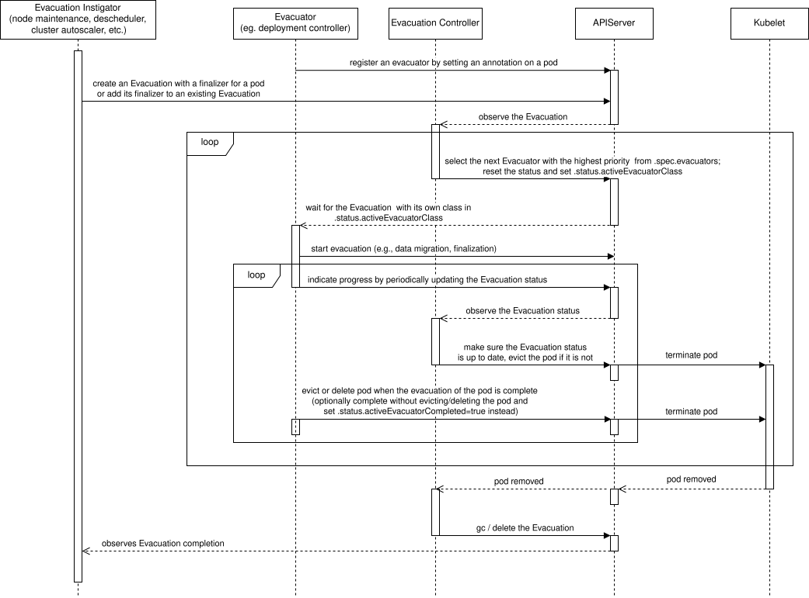

# KEP-4563: Evacuation API

<!-- toc -->
- [Release Signoff Checklist](#release-signoff-checklist)
- [Summary](#summary)
- [Motivation](#motivation)
  - [PodDisruptionBudget Standing Issues](#poddisruptionbudget-standing-issues)
  - [Goals](#goals)
  - [Non-Goals](#non-goals)
- [Proposal](#proposal)
  - [Evacuation Instigator](#evacuation-instigator)
  - [Evacuee and Evacuator](#evacuee-and-evacuator)
  - [Evacuation controller](#evacuation-controller)
  - [User Stories (Optional)](#user-stories-optional)
    - [Story 1](#story-1)
    - [Story 2](#story-2)
    - [Story 3](#story-3)
    - [Story 4](#story-4)
  - [Notes/Constraints/Caveats (Optional)](#notesconstraintscaveats-optional)
    - [Length Limitations for Pod Annotations and Evacuation Finalizers](#length-limitations-for-pod-annotations-and-evacuation-finalizers)
  - [Risks and Mitigations](#risks-and-mitigations)
    - [Disruptive Eviction](#disruptive-eviction)
- [Design Details](#design-details)
  - [Evacuation](#evacuation)
  - [Evacuation Instigator](#evacuation-instigator-1)
    - [Evacuation Instigator Finalizer](#evacuation-instigator-finalizer)
  - [Evacuator](#evacuator)
  - [Evacuation controller](#evacuation-controller-1)
    - [Evacuator Class Selection](#evacuator-class-selection)
    - [Eviction](#eviction)
    - [Garbage Collection](#garbage-collection)
  - [Evacuation API](#evacuation-api)
    - [Evacuation Validation and Admission](#evacuation-validation-and-admission)
      - [CREATE](#create)
      - [DELETE](#delete)
      - [CREATE, UPDATE, DELETE](#create-update-delete)
    - [Pod Admission](#pod-admission)
    - [Pod API](#pod-api)
    - [Immutability of Evacuation Spec Fields](#immutability-of-evacuation-spec-fields)
  - [Evacuation Process](#evacuation-process)
  - [Follow-up Design Details for Kubernetes Workloads](#follow-up-design-details-for-kubernetes-workloads)
    - [ReplicaSet Controller](#replicaset-controller)
    - [Deployment Controller](#deployment-controller)
    - [StatefulSet Controller](#statefulset-controller)
    - [DaemonSet and Static Pods](#daemonset-and-static-pods)
    - [HorizontalPodAutoscaler](#horizontalpodautoscaler)
  - [Test Plan](#test-plan)
      - [Prerequisite testing updates](#prerequisite-testing-updates)
      - [Unit tests](#unit-tests)
      - [Integration tests](#integration-tests)
      - [e2e tests](#e2e-tests)
  - [Graduation Criteria](#graduation-criteria)
    - [Alpha](#alpha)
    - [Beta](#beta)
    - [GA](#ga)
    - [Deprecation](#deprecation)
  - [Upgrade / Downgrade Strategy](#upgrade--downgrade-strategy)
  - [Version Skew Strategy](#version-skew-strategy)
- [Production Readiness Review Questionnaire](#production-readiness-review-questionnaire)
  - [Feature Enablement and Rollback](#feature-enablement-and-rollback)
  - [Rollout, Upgrade and Rollback Planning](#rollout-upgrade-and-rollback-planning)
  - [Monitoring Requirements](#monitoring-requirements)
  - [Dependencies](#dependencies)
  - [Scalability](#scalability)
  - [Troubleshooting](#troubleshooting)
- [Implementation History](#implementation-history)
- [Drawbacks](#drawbacks)
- [Alternatives](#alternatives)
  - [Evacuation or Eviction subresource](#evacuation-or-eviction-subresource)
  - [Pod API](#pod-api-1)
  - [Enhancing PodDisruptionBudgets](#enhancing-poddisruptionbudgets)
  - [Cancellation of Evacuation](#cancellation-of-evacuation)
  - [Changes to the Eviction API](#changes-to-the-eviction-api)
- [Infrastructure Needed (Optional)](#infrastructure-needed-optional)
<!-- /toc -->

## Release Signoff Checklist

<!--
**ACTION REQUIRED:** In order to merge code into a release, there must be an
issue in [kubernetes/enhancements] referencing this KEP and targeting a release
milestone **before the [Enhancement Freeze](https://git.k8s.io/sig-release/releases)
of the targeted release**.

For enhancements that make changes to code or processes/procedures in core
Kubernetes—i.e., [kubernetes/kubernetes], we require the following Release
Signoff checklist to be completed.

Check these off as they are completed for the Release Team to track. These
checklist items _must_ be updated for the enhancement to be released.
-->

Items marked with (R) are required *prior to targeting to a milestone / release*.

- [x] (R) Enhancement issue in release milestone, which links to KEP dir in [kubernetes/enhancements] (not the initial KEP PR)
- [ ] (R) KEP approvers have approved the KEP status as `implementable`
- [x] (R) Design details are appropriately documented
- [x] (R) Test plan is in place, giving consideration to SIG Architecture and SIG Testing input (including test refactors)
  - [ ] e2e Tests for all Beta API Operations (endpoints)
  - [ ] (R) Ensure GA e2e tests meet requirements for [Conformance Tests](https://github.com/kubernetes/community/blob/master/contributors/devel/sig-architecture/conformance-tests.md) 
  - [ ] (R) Minimum Two Week Window for GA e2e tests to prove flake free
- [x] (R) Graduation criteria is in place
  - [ ] (R) [all GA Endpoints](https://github.com/kubernetes/community/pull/1806) must be hit by [Conformance Tests](https://github.com/kubernetes/community/blob/master/contributors/devel/sig-architecture/conformance-tests.md) 
- [ ] (R) Production readiness review completed
- [ ] (R) Production readiness review approved
- [x] "Implementation History" section is up-to-date for milestone
- [ ] User-facing documentation has been created in [kubernetes/website], for publication to [kubernetes.io]
- [ ] Supporting documentation—e.g., additional design documents, links to mailing list discussions/SIG meetings, relevant PRs/issues, release notes

<!--
**Note:** This checklist is iterative and should be reviewed and updated every time this enhancement is being considered for a milestone.
-->

[kubernetes.io]: https://kubernetes.io/
[kubernetes/enhancements]: https://git.k8s.io/enhancements
[kubernetes/kubernetes]: https://git.k8s.io/kubernetes
[kubernetes/website]: https://git.k8s.io/website

## Summary

There are many issues with today's Eviction API and PodDisruptionBudgets that are of great concern
to cluster admins and application owners. These issue range from insufficient data safety or
application availability to node draining issues.

This KEP proposes to add a new declarative Evacuation API to manage the evacuation of pods. Its
mission is to allow for a cooperative evacuation (removal) of a pod, usually in order to run the
pod on another node. If the owner of the pod does not cooperate, the evacuation will try to resort
to a pod eviction (API initiated Eviction).

This new API can be used to implement additional capabilities around node draining, pod
descheduling, or as a general interface between applications and/or controllers. It would provide
additional safety and observability guarantees and prevent bad practices as opposed to just using
the current Eviction API endpoint and PodDisruptionBudgets.

## Motivation

Many of today's solutions rely on eviction (API-initiated Eviction) as the goto-safe way to remove
a pod from a node (kubectl drain, descheduler, cluster autoscaler, partially scheduler preemption).
Unfortunately, this is done in an application agnostic way and can cause many problems.

From an application owner or developer perspective, the only standard tool they have to protect
them against eviction is a PodDisruptionBudget. This is sufficient in a basic scenario with a simple
multi-replica application. The edge case applications, where this does not work are very important
to the cluster admin or controllers managing workload distribution on nodes, as they can for
example block the node drain. And, in turn, very important to the application owner, as the admin
can then override the pod disruption budget and disrupt their sensitive application anyway.

The major issues are:

1. Without extra manual effort, an application running with a single replica has to settle for
   experiencing application downtime during the node drain. They cannot use PDBs with
   `minAvailable: 1` or `maxUnavailable: 0`, or they will block node maintenance. Not every user
   needs high availability either, due to a preference for a simpler deployment model, lack of
   application support for HA, or to minimize compute costs. Also, any automated solution needs
   to edit the PDB to account for the additional pod that needs to be spun to move the workload
   from one node to another. This has been discussed in issue [kubernetes/kubernetes#66811](https://github.com/kubernetes/kubernetes/issues/66811)
   and in issue [kubernetes/kubernetes#114877](https://github.com/kubernetes/kubernetes/issues/114877).
2. Similar to the first point, it is difficult to use PDBs for applications that can have a variable
   number of pods; for example applications with a configured horizontal pod autoscaler (HPA). These
   applications cannot be disrupted during a low load when they have only pod. However, it is
   possible to disrupt the pods during a high load without experiencing application downtime. If
   the minimum number of pods is 1, PDBs cannot be used without blocking the node drain. This has
   been discussed in issue [kubernetes/kubernetes#93476](https://github.com/kubernetes/kubernetes/issues/93476).
3. Graceful deletion of DaemonSet pods is currently only supported as part of (Linux) graceful node
   shutdown. The length of the shutdown is again not application specific and is set cluster-wide
   (optionally by priority) by the cluster admin. This does not take into account
   `.spec.terminationGracePeriodSeconds` of each pod and may cause premature termination of
   the application. This has been discussed in issue [kubernetes/kubernetes#75482](https://github.com/kubernetes/kubernetes/issues/75482)
   and in issue [kubernetes-sigs/cluster-api#6158](https://github.com/kubernetes-sigs/cluster-api/issues/6158).
4. Different pod termination mechanisms are not synchronized with each other. So for example, the
   taint manager may prematurely terminate pods that are currently under Node Graceful Shutdown.
   This can also happen with other mechanism (e.g., different types of evictions). This has been
   discussed in the issue [kubernetes/kubernetes#124448](https://github.com/kubernetes/kubernetes/issues/124448)
   and in the issue [kubernetes/kubernetes#72129](https://github.com/kubernetes/kubernetes/issues/72129).
5. Descheduler does not allow postponing eviction for applications that are unable to be evicted
   immediately. This can result in descheduling of incorrect set of pods. This is outlined in the
   KEP [kubernetes-sigs/descheduler#1354](https://github.com/kubernetes-sigs/descheduler/pull/1354).
6. [Affinity Based Eviction](https://github.com/kubernetes/enhancements/issues/4328) is an upcoming
   feature that would like to introduce the `RequiredDuringSchedulingRequiredDuringExecution`
   nodeAffinity option to remove pods from nodes that do not match this affinity. The controller
   proposed by this feature would like to use the Evacuation API for the disruption safety and
   observability reasons. It can also leave the eviction logic and reconciliation to the evacuation
   controller and reducing the maintenance burden. Discussed in the KEP [kubernetes/enhancements#4329](https://github.com/kubernetes/enhancements/pull/4329).

This KEP is a prerequisite for the [Declarative Node Maintenance KEP](https://github.com/kubernetes/enhancements/pull/4213),
which describes other issues and consequences that would be solved by the Evacuation API.

Some applications solve the disruption problem by introducing validating admission webhooks.
This has some drawbacks. The webhooks are not easily discoverable by cluster admins. And they can
block evictions for other applications if they are misconfigured or misbehave. The eviction API is
not intended to be extensible in this way. The webhook approach is therefore not recommended.

Some drainers solve the node drain by depending on the kubectl logic, or by extending/rewriting it
with additional rules and logic.

As seen in the experience reports and GitHub issues ([Declarative Node Maintenance KEP](https://github.com/kubernetes/enhancements/pull/4213)),
some admins solve their problems by simply ignoring PDBs which can cause unnecessary disruptions or
data loss. Some solve this by playing with the application deployment, but have to understand that
the application supports this.


### PodDisruptionBudget Standing Issues

For completeness here is a complete list of upstream open PDB issues. Most are relevant to this KEP.

- [Mandatorliy specify how the application handle disruptions in the pod spec.](https://github.com/kubernetes/kubernetes/issues/124390)
- [Treat liveness probe-based restarts as voluntary disruptions gated by PodDisruptionBudgets](https://github.com/kubernetes/kubernetes/issues/123204)
- [Correct Keyword name for DisruptionsAllowed in PDB.](https://github.com/kubernetes/kubernetes/issues/121585)
- [maxSurge for node draining or how to meet availability requirements when draining nodes by adding pods](https://github.com/kubernetes/kubernetes/issues/114877)
- [Topology Aware Infrastructure Disruptions for Statefulsets](https://github.com/kubernetes/kubernetes/issues/114010)
- [Support PDBs for DS](https://github.com/kubernetes/kubernetes/issues/108124)
- [Allow scaling up to meet PDB constraints](https://github.com/kubernetes/kubernetes/issues/93476)
- [Priority-based preemption can easily violate PDBs even when unnecessary due to multiple issues with the implementation](https://github.com/kubernetes/kubernetes/issues/91492)
- [Disruption controller support configure workers' number](https://github.com/kubernetes/kubernetes/issues/82930)
- [Cannot drain node with pod with more than one Pod Disruption Budget](https://github.com/kubernetes/kubernetes/issues/75957)
- [Eviction should be able to request eviction asynchronously](https://github.com/kubernetes/kubernetes/issues/66811)
- [Reasonable defaults with eviction and PodDisruptionBudget](https://github.com/kubernetes/kubernetes/issues/35318)

### Goals

- Introduce new `evacuation.coordination.k8s.io` API and evacuation controller.
- Block eviction (Eviction API) of pods that support the evacuation process, unless the evacuation process fails.

### Non-Goals

- Implement evacuation capabilities in Kubernetes workloads (ReplicaSet, Deployment, etc.).
- Synchronizing of the evacuation status to the pod status.
- Introduce the evacuation concept for types other than pods.
- Synchronize all pod termination mechanisms (see #4 in the [Motivation](#motivation) section), so that they do
  not terminate pods under NodeMaintenance/Evacuation.

## Proposal

We will introduce a new term called evacuation. This is a contract between the evacuation instigator,
the evacuee, and the evacuator. The contract is enforced by the API and an evacuation controller.
We can think of evacuation as a managed and safer alternative to eviction.

### Evacuation Instigator

The evacuation instigator can be any entity in the system: node maintenance controller, descheduler,
cluster autoscaler, or any application/controller interfacing with the affected application/pods
(evacuee).

The instigator's responsibility is to communicate an intent to a pod that it should be evacuated,
according to the instigator's own internal rules. It should reconcile its intent in case the intent
is removed by a third party. And it should remove its intent when the evacuation is no longer necessary.

Example evacuation triggers:
- Node maintenance controller: node maintenance triggered by an admin.
- Descheduler: descheduling triggered by a descheduling rule.
- Cluster autoscaler: node downscaling triggered by a low node utilization.

It is understood that multiple evacuation instigators may request evacuation of the same pod at the
same time. The instigators should coordinate their intent and not remove the evacuation until all
instigators have dropped their intent.

### Evacuee and Evacuator

The evacuee can be any pod. There can be multiple evacuators for a single pod, and they should all
advertise which pods they are responsible for. Normally, the owner/controller of the pod is the main
evacuator. In a special case, the evacuee can be its own evacuator. The evacuator should decide what
action to take when it observes an evacuation intent directed at that evacuator:
1. It can reject the evacuation and wait for the pod to be evacuated by another evacuator or evicted
   by the evacuation controller.
2. It can do nothing and wait for the pod to be evacuated by another evacuator or evicted by the
   evacuation controller. This is discouraged because it is slower than a simple rejection.
3. It can start the evacuation and periodically respond to the evacuation intent to signal that the
   evacuation is in progress and not stuck. Evacuation is at the discretion of the evacuator and
   can take many forms:
   - Migration of data (both persistent and ephemeral) from one node to another.
   - Waiting for a cleanup and release of important resources held by the pod.
   - Waiting for important computations to complete.
   - Non-graceful deletion of the pod (`gracePeriodSeconds=0`).
   - Deletion of a pod that is covered by a blocking PodDisruptionBudget. The controller of the
     application should have additional logic to distinguish whether a disruption of a particular
     pod will disrupt the application as a whole.
   - After a partial cleanup (e.g. storage migrated, notification sent) and if the application is
     still in an available state, the eviction API can be used to respect PodDisruptionBudgets.

In the end, the evacuation should always end with a pod being deleted (evict or delete call) by one
of the evacuators or by an eviction triggered by the evacuation controller.

We should discourage the creation of preventive evacuations, so that they do not end up as
another PDB. So we should design the API appropriately and also not allow behaviors that do not
conform to the evacuation contract.

### Evacuation controller

In order to fully enforce the evacuation contract and prevent code duplication among evacuation
instigators, we will introduce a new controller called the evacuation controller.

Its responsibility is to observe evacuation requests from instigators and periodically check that
evacuators are making progress in evacuating evacuees. It is important to see a consistent effort
by the evacuators to reconcile the progress of the evacuation. This is important to prevent stuck
evacuations that could bring node maintenance to a halt. If the evacuation controller detects
that the evacuation progress updates have stopped, it will assign another evacuator. If there is
no other evacuator available, it will resort to pod eviction by calling the eviction API (taking
PodDisruptionBudgets into consideration).

It is also responsible for garbage collection/deletion of existing evacuations whose pods have
already been deleted.

### User Stories (Optional)

#### Story 1

As a cluster admin I want high-level components like node maintenance (planned replacement of
kubectl drain), scheduler, descheduler to use the Evacuation API to gracefully remove pods from a
set of nodes. I also want to see the progress of ongoing evacuations and be able to debug them if
something goes wrong. This means to:
- Easily identify pods that have accepted evacuation and are making progress. If possible to be
  able to see evacuation's ETA.
- Identify pods that should be evicted instead of evacuated and to distinguish pods that are
  failing eviction.
- See additional debug information from the active evacuator and be able to identify all the
  registered evacuators.

#### Story 2

As an application owner, I want to run single replica applications without disruptions and have the
ability to easily migrate the workload pods from one node to another. This also applies to
applications with larger number of replicas that prefer to surge (upscale) pods first instead of
downscaling.

#### Story 3

As an application owner, I want to have a custom logic tailored to my application for migration,
down-scaling, or removal of pods. I want to be able to easily override the default evacuation
process, including the eviction and PDBs, available to workloads. To achieve this, I also need to
be able to identify other evacuators and an order in which they will run.

#### Story 4

As an application owner I want my pods to be scheduled on correct nodes. I want to use the
descheduler or the upcoming Affinity Based Eviction feature to remove pods from incorrect nodes
and then have the pods scheduled on new ones. I want to do the rescheduling gracefully and be able
to control the disruption level of my application (even 0% application unavailability).

### Notes/Constraints/Caveats (Optional)

#### Length Limitations for Pod Annotations and Evacuation Finalizers

We use the following finalizers in Evacuation objects:
`evacuation.coordination.k8s.io/instigator_${EVACUATION_INSTIGATOR_SUBDOMAIN}`.

We use the following annotations in Pod objects:
`evacuation.coordination.k8s.io/priority_${EVACUATOR_CLASS}: ${PRIORITY}/${ROLE}`.

Key validation for both of these is subject to [IsQualifiedName](https://github.com/kubernetes/kubernetes/blob/cae35dba5a3060711a2a3f958537003bc74a59c0/staging/src/k8s.io/apimachinery/pkg/util/validation/validation.go#L42)
validation. The key consists of `prefix/name`. The maximum length of the name is 63 characters,
which may not always be enough for `EVACUATION_INSTIGATOR_SUBDOMAIN` and `EVACUATOR_CLASS` (also
DNS subdomain) after adding the length of `instigator_` and `priority_` respectively.

If the name component of the key is greater than 63 characters, it is recommended to use a unique
shortcut of your subdomain name.
For example, `deployment.apps.k8s.io` instead of `deployment.apps.kubernetes.io`.

We do not expect a large number of instigators and evacuators. If this becomes a larger problem in
the future, we can implement an additional scheme:

```yaml
annotations:
  evacuation.coordination.k8s.io/priority_${EVACUATOR_CLASS_HASH}: ${PRIORITY}/${ROLE}
  evacuation.coordination.k8s.io/hash_${EVACUATOR_CLASS_HASH}: ${EVACUATOR_CLASS}
```

which would result in

```yaml
annotations:
  evacuation.coordination.k8s.io/priority_7bb77f87dc: "11000/knowledgeable-app-specific"
  evacuation.coordination.k8s.io/hash_7bb77f87dc: "sensitive-workload-operator.tom-and-jerry-delicious-fruit-company.com"
```

`7bb77f87dc` value is a hash of `sensitive-workload-operator.tom-and-jerry-delicious-fruit-company.com`

### Risks and Mitigations

If there is no evacuator, and the application has insufficient availability and a blocking PDB or
blocking validating admission webhook, then the evacuation controller will enter into an eviction
cold loop. To mitigate this we will increment `.status.failedEvictionCounter` and
`evacuation_controller_evictions` metric.

An evacuator could reconcile the status properly without making any progress. It is thus
recommended to check `creationTimestamp` of the Evacuations and observe
`evacuation_controller_active_evacuator` metric to see how much it takes for an evacuator to
complete the evacuation. This metric can be also used to implement additional alerts.

#### Disruptive Eviction

When using kubectl drain, pods without owning controller and pods with local storage
(having `emptyDir` volumes) are not evicted by default. We have decided to evict most
of the pods (except DaemonSet and mirror pods) by default. In the motivation section of the
[Declarative Node Maintenance KEP](https://github.com/kubernetes/enhancements/pull/4213),
we can see many administrators override these default settings and many components evict all pods
indiscriminately. There are also many ways that users use to prevent the eviction;
PodDisruptionBudgets, validating admission webhooks, or just plain HA. Users who want to protect
their applications in today's clusters should already be aware that they should be able to handle
sudden evictions. Therefore, it should be okay for the evacuation controller to evict these pods.

To mitigate the sudden eviction problem, users should use PodDisruptionBudgets or HA.

## Design Details

### Evacuation

We will introduce a new type called `evacuation.coordination.k8s.io`  to enforce the contract
between the evacuation instigators and the evacuators. This type is a bit similar to
`leases.coordination.k8s.io` in that it requires multiple actors to synchronize the state. Which in
our case is the progress of the evacuation.

### Evacuation Instigator
[Evacuation Instigator](#evacuation-instigator) section provides a general overview.

There can be many evacuation instigators for a single Evacuation.

When an instigator decides that a pod needs to be evacuated, it should create an Evacuation:
- With a predictable and consistent name in the following format: `${POD_UID}-${POD_NAME_PREFIX}`.
  The pod name may be only partial as the maximum allowed length of `POD_NAME_PREFIX` is limited
  to 150 characters.
- `.spec.podRef` should be set to fully identify the pod. Similar to the name, the UID should be
  specified to ensure that we do not evacuate a pod with the same name that appears immediately
  after the previous pod is removed.
- `.spec.progressDeadlineSeconds` should be set to a reasonable value. It is recommended to leave
  it at the default value of 1800 (30m) to allow for potential evacuator disruptions.
- `.spec.evacuators` value will be resolved on the Evacuation admission from the pod and should
  ideally not be set by the instigator. This is done to maintain consistent `.spec.evacuators`
  field resolution across different instigators.

It should also add itself to the Evacuation finalizers upon creation. If the evacuation already
exists, the instigator should still add itself to the finalizers. The finalizers are used for:
- Tracking the instigators of this evacuation intent. This is used for observability and to handle
  concurrency for multiple instigators requesting the cancellation. The evacuation can be
  cancelled/deleted once all instigators have requested the cancellation.  
- Processing the evacuation result by the instigator once the evacuation is complete.

If the evacuation is no longer needed, the instigator should remove itself from the finalizers.
The evacuation will be then deleted by the evacuation controller. In case the evacuator has set
`.status.evacuationCancellationPolicy` to `Forbid`, the evacuation process cannot be cancelled, and
the evacuation controller will wait to delete the pod until the pod has been terminated and removed
from etcd.

#### Evacuation Instigator Finalizer
To distinguish between instigator and other finalizers, instigators should use finalizers in the
following format: `evacuation.coordination.k8s.io/instigator_${EVACUATION_INSTIGATOR_SUBDOMAIN}`.
For example, the node maintenance instigator would use the
`evacuation.coordination.k8s.io/instigator_nodemaintenance.k8s.io` finalizer.

Instigator finalizers with `evacuation.coordination.k8s.io/instigator_` prefix/qualified name prefix
are automatically removed upon pod removal by the evacuation controller. If the instigator needs to
perform additional final tasks before the Evacuation object is removed, it should create a second
finalizer without this well-known prefix.

The evacuation instigator should only add and remove its own finalizer and should not touch other
finalizers with the `evacuation.coordination.k8s.io/` prefix.

### Evacuator

[Evacuee and Evacuator](#evacuee-and-evacuator) section provides a general overview.

There can be multiple evacuators for a single pod, which can be given control of the evacuation by
the evacuation controller.

We can distinguish 4 different kinds of evacuators:
- `partial`: it handles only a part of the evacuation process (e.g. releasing one kind of resource).
  This evacuator should not terminate the pod.
- `knowledgeable`: has more knowledge (e.g. specific to the deployed application) about how to
  handle a more graceful evacuation than the controller of the pod (e.g. StatefulSet, Deployment).
  This can result in the termination of the pod.
- `controller`: handles full graceful evacuation in a generic way and should result in a pod
  termination. It can be preempted by a `knowledgeable` evacuator.
- `fallback`: can handle evacuation if all previous evacuators have failed. This means that
  `knowledgeable` or `controller` evacuators have either reported no progress, or are simply not
  implemented for the target pod.

The evacuator should first mark the pods it is interested in evacuating (either partially or fully)
with the `evacuation.coordination.k8s.io/priority_${EVACUATOR_CLASS}: ${PRIORITY}/${ROLE}`
annotation. This annotation is parsed into the `Evacuator` type in the [Evacuation API](#evacuation-api).

- `EVACUATOR_CLASS`: should be unique evacuator's DNS subdomain, the maximum length is 54
  characters (`63 - len("priority_")`)
- `PRIORITY` and `ROLE`
  - `controller` should always set a `PRIORITY=10000` and `ROLE=controller`
  - other evacuators should set `PRIORITY` according to their own needs (minimum value is 0,
    maximum value is 100000). They can use the `controller` evacuator as a reference point, if
    they want to be run before or after the `controller` evacuator. They can also observe pod
    annotations and detect what other evacuators have been registered for the evacuation process.
    `ROLE` is optional and can be used as a signal to other evacuators. The `controller` value is
    reserved for pod controllers, but otherwise there is no guidance on how the third party
    evacuators should name their role.

Example pod with evacuator annotations:

```yaml
apiVersion: v1
kind: Pod
metadata:
  annotations:
    evacuation.coordination.k8s.io/priority_fallback-evacuator.rescue-company.com: "2000"
    evacuation.coordination.k8s.io/priority_deployment.apps.k8s.io: "10000/controller"
    evacuation.coordination.k8s.io/priority_sensitive-workload-operator.fruit-company.com: "11000/knowledgeable-app-specific"
  labels:
    app: nginx
  name: sensitive-app
  namespace: blueberry
```

The evacuator should observe the evacuation objects that match the pods that the evacuator manages.
It should start the evacuation only if it observes `.status.activeEvacuatorClass` that matches the
`EVACUATOR_CLASS` it previously set in the annotation.

If the evacuator is not interested in evacuating the pod, it should set
`.status.activeEvacuatorCompleted=true`. If the evacuator is unable to respond to the evacuation,
the `.spec.progressDeadlineSeconds` will timeout and control of the evacuation process will
be passed to the next evacuator with the highest priority. If there is none, the pod will get
evicted by the evacuation controller.

If the evacuator is interested in evacuating the pod it should look at
`.spec.progressDeadlineSeconds` and make sure to update the status periodically in less than that
duration. For example, if `.spec.progressDeadlineSeconds` is set to the default value of 1800 (30m),
it may update the status every 3 minutes. The status updates should look as follows:
- Check that `.status.activeEvacuatorClass` still matches the `EVACUATOR_CLASS` previously set in
  the annotation and that `.status.activeEvacuatorCompleted` is still false. If one of these is not
  correct and the evacuation is still not complete, it should abort the evacuation or output an
  error (e.g. via an event).
- Set `.status.evacuationProgressTimestamp` to the present time to signal that the evacuation is
  not stuck.
- Update the `.status.evacuationCancellationPolicy` field if needed. This field might have been set
  by the previous evacuator. This field should be set to `Forbid` if the current evacuation process
  of the pod cannot be stopped/cancelled. This will block any DELETE requests on the Evacuation
  object. If the evacuator supports evacuation cancellation, it should make sure that this field is
  set to `Allow`, and it should be aware that the Evacuation object can be deleted at any time.
- Update `.status.expectedEvacuationFinishTime` if a reasonable estimation can be made of how long
  the evacuation will take. This can be modified later to change the estimate.
- Set `.status.message` to inform about the progress of the evacuation in human-readable form.
- Optionally, `.status.conditions` can be set for additional details about the evacuation.
- Optionally, an event can be emitted to inform about the start/progress of the evacuation. Or lack
  thereof, if the evacuation is blocked. The evacuator should ensure that an appropriate number of
  events is emitted. `event.involvedObject` should be set to the current Evacuation.

The end of the evacuation is communicated by the pod deletion (evict or delete call) or by setting
`.status.activeEvacuatorCompleted=true`.

The evacuator should prefer the eviction API call for the pod deletion to respect the PDBs, unless
the evacuation process is incompatible with the PDBs and the application has already been disrupted
(either by the evacuator or by external forces). Or the evacuator has a better insight into the
application availability than the PDB. In these cases, it is possible to skip the eviction call and
use the delete call directly.

Also, the evacuator should not block the evacuation by updating the
`.status.evacuationProgressTimestamp` when no work is being done on the evacuation. This should
be decided solely by the user deploying the application and resolved by creating a PDB. 

### Evacuation controller

[Evacuation controller](#evacuation-controller) section provides a general overview.


#### Evacuator Class Selection

The evacuator classes and their priorities are parsed from the pod annotations into the
`.spec.evacuators` on [Evacuation Admission](#evacuation-admission).

The evacuation controller reconciles Evacuations and picks the highest priority evacuator from
`.spec.evacuators` and sets its `evacuatorClass` to the `.status.activeEvacuatorClass`.
If `.status.activeEvacuatorCompleted` is true and the pod exists or `.spec.progressDeadlineSeconds`
has elapsed since `.status.evacuationProgressTimestamp`, then the evacuation controller sets
`status.activeEvacuatorClass` to the next highest priority evacuator from `.spec.evacuators`.
During the switch to the new evacuator, the evacuation controller will also
- Set `.status.activeEvacuatorCompleted` field to false.
- Update`.status.evacuationProgressTimestamp` to the present time.
- Set `.status.expectedEvacuationFinishTime` to nil.
- Set `.status.message` to indicate that the evacuators have been switched.

#### Eviction

The evacuation controller will observe pod evacuations and evict pods that cannot be evacuated by
calling the eviction API.

Pods that cannot be evacuated are:
- Evacuation's `.status.activeEvacuatorClass` field is empty.
- Evacuation's `.status.activeEvacuatorCompleted` field is true and there is no other evacuator to
  select.
- Evacuation's `.spec.progressDeadlineSeconds` has elapsed since
  `.status.evacuationProgressTimestamp` or from `.metadata.creationTimestamp` if
  `.status.evacuationProgressTimestamp` is nil.

Eviction of DaemonSet pods and mirror pods is not supported. However, the Evacuation can still be
used to evacuate them by other means. Terminating pods will not attempt eviction either.

If the pod eviction fails, e.g. due to a blocking PodDisruptionBudget, the
`.status.failedEvictionCounter` is incremented and the pod is added back to the queue with
exponential backoff (maximum approx. 15 minutes). If there is a positive progress update in the
`.status.evacuationProgressTimestamp` of the Evacuation, it will cancel the eviction.

#### Garbage Collection

See [Evacuation Instigator Finalizer](#evacuation-instigator-finalizer) for how to distinguish
between instigator and other finalizers.

The controller deletes the evacuation object if any of the following points is true:
- There are no instigator finalizers (instigators have canceled their intent to evacuate the pod) and
  `.status.evacuationCancellationPolicy` is set to `Allow`.
- The referenced pod no longer exists (has been deleted from etcd), signaling a successful evacuation.
  For convenience, we will also remove instigator finalizers with `evacuation.coordination.k8s.io/`
  prefix when the evacuation task is complete. Other finalizers will still block deletion.

### Evacuation API

```golang

// Evacuation defines an evacuation
type Evacuation struct {
	metav1.TypeMeta `json:",inline"`

	// Object's metadata.
	// .metadata.generateName is not supported.
	// .metadata.name of the pod is expected to be in the ${POD_UID}-${POD_NAME_PREFIX} format.
	// POD_UID is pod's .metadata.uid.
	// POD_NAME_PREFIX is a prefix of up to 150 characters of pod's .metadata.name. The full pod
	// name should be set if less than or equal to 150 characters.
	// The labels of the evacuation object will be merged with pod's .metadata.labels. The labels
	// of the pod have a preference.
	// More info: https://git.k8s.io/community/contributors/devel/sig-architecture/api-conventions.md#metadata
	// +optional
	metav1.ObjectMeta `json:"metadata,omitempty" protobuf:"bytes,1,opt,name=metadata"`

	// Spec defines the evacuation.
	// https://git.k8s.io/community/contributors/devel/sig-architecture/api-conventions.md#spec-and-status
	// +optional
	Spec EvacuationSpec `json:"spec,omitempty" protobuf:"bytes,2,opt,name=spec"`

	// Status represents the most recently observed status of the evacuation.
	// Populated by the current evacuator.
	// More info: https://git.k8s.io/community/contributors/devel/sig-architecture/api-conventions.md#spec-and-status
	// +optional
	Status EvacuationStatus `json:"status,omitempty" protobuf:"bytes,3,opt,name=status"`
}

// EvacuationSpec is a specification of an Evacuation.
type EvacuationSpec struct {
	// PodRef references a pod that is subject to evacuation.
	// This field is required and immutable.
	// +optional
	PodRef *LocalPodReference `json:"podRef,omitempty" protobuf:"bytes,1,opt,name=podRef"`

	// Evacuators reference evacuators that respond to this evacuation.
	// This field does not need to be set and is resolved when the Evacuation object is created
	// on admission.
	// If no evacuators are specified, the pod in PodRef is evicted using the Eviction API.
	// The maximum length of the evacuators list is 100.
	// This field is immutable.
	// +optional
	// +patchMergeKey=evacuatorClass
	// +patchStrategy=merge
	// +listType=map
	// +listMapKey=evacuatorClass
	Evacuators []Evacuator `json:"evacuators,omitempty"  patchStrategy:"merge" patchMergeKey:"evacuatorClass" protobuf:"bytes,2,rep,name=evacuators"`

	// ProgressDeadlineSeconds is a maximum amount of time an evacuator should take to report on an
	// evacuation progress by updating the .status.evacuationProgressTimestamp.
	// If the .status.evacuationProgressTimestamp is not updated within the duration of
	// ProgressDeadlineSeconds, the evacuation is passed over to the next evacuator with the
	// highest priority. If there is none, the pod is evicted using the Eviction API.
	//
	// The minimum value is 600 (10m) and the maximum value is 21600 (6h).
	// The default value is 1800 (30m).
	// This field is required and immutable.
	ProgressDeadlineSeconds int32 `json:"progressDeadlineSeconds" protobuf:"varint,3,opt,name=progressDeadlineSeconds"`
}

// LocalPodReference contains enough information to locate the referenced pod inside the same namespace.
type LocalPodReference struct {
	// Name of the pod.
	// This field is required.
	Name string `json:"name" protobuf:"bytes,1,opt,name=name"`
	// UID of the pod.
	// This field is required.
	UID string `json:"uid" protobuf:"bytes,2,opt,name=uid"`
}

// Evacuator information that allows you to identify the evacuator responding to this evacuation.
// Pods can be annotated with
// evacuation.coordination.k8s.io/priority_${EVACUATOR_CLASS}: ${PRIORITY}/${ROLE}
// evacuation.coordination.k8s.io/priority_deployment.apps.k8s.io: "10000/controller"
// annotations that can be parsed into the Evacuator struct when the Evacuation object is created
// on admission.
type Evacuator struct {
	// EvacuatorClass must be RFC-1123 DNS subdomain identifying the evacuator (e.g. foo.example.com).
	// +required
	EvacuatorClass string `json:"evacuatorClass" protobuf:"bytes,1,opt,name=evacuatorClass"`

	// Priority for this EvacuatorClass. Higher priorities are selected first by the evacuation
	// controller. The evacuator that is the managing controller should set the value of this field
	// to 10000 to allow both for preemption or evacuator fallback registration by other evacuators.
	// The minimum value is 0 and the maximum value is 100000.
	// +required
	Priority int32 `json:"priority" protobuf:"varint,2,opt,name=priority"`

	// Role of the evacuator. The "controller" value is reserved for the managing controller of the
	// pod. The role can send additional signal to other evacuators if they should preempt this
	// evacuator or not.
	// +optional
	Role *string `json:"role,omitempty" protobuf:"bytes,3,opt,name=role"`
}

// EvacuationStatus represents the last observed status of the evacuation.
type EvacuationStatus struct {
	// Evacuators of the ActiveEvacuatorClass can adopt this evacuation by updating the
	// EvacuationProgressTimestamp or orphan/complete it by setting ActiveEvacuatorCompleted to true.
	// +optional
	ActiveEvacuatorClass *string `json:"activeEvacuatorClass,omitempty" protobuf:"bytes,1,opt,name=activeEvacuatorClass"`

	// ActiveEvacuatorCompleted should be set to true when the evacuator of the
	// ActiveEvacuatorClass has completed its full or partial evacuation.
	// This field can also be set to true if no evacuator is available.
	// If this field is true, no additional evacuator is available, and the evacuated pod still
	// exists, it is evicted using the Eviction API.
	// +optional
	ActiveEvacuatorCompleted bool `json:"activeEvacuatorCompleted,omitempty" protobuf:"varint,2,opt,name=activeEvacuatorCompleted"`

	// EvacuationProgressTimestamp is the time at which the evacuation was reported to be in
	// progress by the evacuator.
	// Cannot be set to the future time (after taking time skew into account).
	// +optional
	EvacuationProgressTimestamp *metav1.Time `json:"evacuationProgressTimestamp,omitempty" protobuf:"bytes,3,opt,name=evacuationProgressTimestamp"`

	// ExpectedEvacuationFinishTime is the time at which the evacuation is expected to end for the
	// current evacuator and its class.
	// May be empty if no estimate can be made.
	// +optional
	ExpectedEvacuationFinishTime *metav1.Time `json:"expectedEvacuationFinishTime,omitempty" protobuf:"bytes,4,opt,name=expectedEvacuationFinishTime"`

	// EvacuationCancellationPolicy should be set to Forbid by the evacuator if it is not possible
	// to cancel (delete) the evacuation.
	// When this value is Forbid, DELETE requests of this Evacuation object will not be accepted
	// while the pod exists.
	// This field is not reset by the evacuation controller when selecting an evacuator.
	// Changes to this field should always be reconciled by the active evacuator.
	//
	// Valid policies are Allow and Forbid.
	// The default value is Allow.
	//
	// Allow policy allows cancellation of this evacuation.
	// The Evacuation can be deleted before the Pod is deleted and terminated.
	//
	// Forbid policy forbids cancellation of this evacuation.
	// The Evacuation can't be deleted until the Pod is deleted and terminated
	//
	// This field is required.
	EvacuationCancellationPolicy EvacuationCancellationPolicy `json:"evacuationCancellationPolicy" protobuf:"varint,5,opt,name=evacuationCancellationPolicy"`

	// The number of unsuccessful attempts to evict the referenced pod, e.g. due to a PDB.
	// This field is required.
	FailedEvictionCounter int32 `json:"failedEvictionCounter" protobuf:"varint,6,opt,name=failedEvictionCounter"`

	// Message is a human readable message indicating details about the evacuation.
	// This may be an empty string.
	// +required
	// +kubebuilder:validation:Required
	// +kubebuilder:validation:MaxLength=32768
	Message string `json:"message" protobuf:"bytes,7,opt,name=message"`

	// Conditions can be used by evacuators to share additional information about the evacuation.
	// +optional
	// +patchMergeKey=type
	// +patchStrategy=merge
	// +listType=map
	// +listMapKey=type
	Conditions []metav1.Condition `json:"conditions,omitempty" patchStrategy:"merge" patchMergeKey:"type" protobuf:"bytes,8,rep,name=conditions"`
}

// +enum
type EvacuationCancellationPolicy string

const (
// Allow policy allows cancellation of this evacuation.
// The Evacuation can be deleted before the Pod is deleted and terminated.
Allow EvacuationCancellationPolicy = "Allow"
// Forbid policy forbids cancellation of this evacuation.
// The Evacuation can't be deleted until the Pod is deleted and terminated
Forbid EvacuationCancellationPolicy = "Forbid"
)

```

#### Evacuation Validation and Admission

Special admission rules should be implemented as an admission plugin. An alternative would be to
use ValidatingAdmissionPolicy, but this is not possible because we need to list the pods during the
CREATE and DELETE requests and list Evacuations (.spec) during DELETE requests.

##### CREATE

Name of the Evacuation object must be unique and predictable for each pod to prevent the creation
of multiple Evacuations for the same pod. We do not expect the evacuators to support interaction
with multiple Evacuations for a pod.

`.metadata.generateName` is not supported.
`.metadata.name` of the pod is expected to be in the format `${POD_UID}-${POD_NAME_PREFIX}`.
 The `POD_UID` is there for uniqueness and the `POD_NAME_PREFIX` is there for a user convenience.

- The `POD_UID` (length [36 characters](https://pkg.go.dev/github.com/google/uuid#UUID.String))
  must be identical to `.spec.podRef.uid` or the request will be rejected.
- The maximum length of the `POD_NAME_PREFIX` is 150 characters. Even though, the maximum length of
  the name is 253 characters and the length of `POD_UID` is 36 characters, we leave 66 characters
  for a potential future extension. If the pod name is less than or equal to 150 characters, then
  the `POD_NAME_PREFIX` must be identical to `.spec.podRef.name`. If the pod name length is
  greater, then the `POD_NAME_PREFIX` must be a prefix of `.spec.podRef.name` and have a length of
  150 characters. If this is not met, the request will be rejected.


The Pod matching the `.spec.podRef.name` will be obtained from the admission plugin lister. If the
`.spec.podRef.uid` does not match with the pod's UID, the request will be rejected.

`.spec.evacuators` are set according to the pod's annotations (see [Evacuator](#evacuator) and
[Evacuation API](#evacuation-api)).

The pod labels are merged with the Evacuation labels (pod labels have a preference) to allow
for custom label selectors when observing the evacuations.

`.status.activeEvacuatorClass` should be empty on creation as its selection should be left on the
evacuation controller.

`.status.evacuationCancellationPolicy` should be `Allow` on creation, as its resolution should be
left to the evacuation controller.

`.status.FailedEvictionCounter` can be only incremented.

##### DELETE

Delete requests are forbidden for Evacuation objects that have the
`.status.evacuationCancellationPolicy` field set to `Forbid` and the pod still exists.

##### CREATE, UPDATE, DELETE

Principal making the request should be authorized for deleting pods that match the Evacuation's
`.spec.podRef`. 

#### Pod Admission

`evacuation.coordination.k8s.io/priority_${EVACUATOR_CLASS}: ${PRIORITY}/${ROLE}` annotations
should be checked on pod admission:
- `PRIORITY` should be an integer with a min value `0` and a max value `100000`.
- `ROLE` is optional.
- Only one annotation of this format can have a `ROLE=controller`.
- The `controller` role should have a priority of `10000`. Other role or empty role cannot have a
  value of `10000`.
- The number of these annotations is limited to 100. 1 slot is always reserved for the
  `ROLE=controller`. If there is a need for a larger number of evacuators, the current use case
  should be re-evaluated. Limiting the number of evacuators ensures that the eviction cannot be
  blocked indefinitely by setting abnormally large number of these annotations on a pod.

#### Pod API

Evacuation name depends on the pod UID to have a relatively short length (36 characters). We can put the
following comment above the pod's meta to express this dependency

```go
// Pod is a collection of containers that can run on a host. This resource is created
// by clients and scheduled onto hosts.
type Pod struct {
	metav1.TypeMeta `json:",inline"`
	// Standard object's metadata.
	// .metadata.uid has a xxxxxxxx-xxxx-xxxx-xxxx-xxxxxxxxxxxx form.
	// More info: https://git.k8s.io/community/contributors/devel/sig-architecture/api-conventions.md#metadata
	// +optional
	metav1.ObjectMeta `json:"metadata,omitempty" protobuf:"bytes,1,opt,name=metadata"`
	...
```

#### Immutability of Evacuation Spec Fields

`.spec.podRef` does not make sense to make mutable, the Evacuation is always scoped to a specific
instance of a pod. If the pod is immediately recreated with the same name, but a different UID, a
new Evacuation object should be created

`.spec.evacuators` is set only by the Evacuation Instigator and during the Evacuation object create
admission. We do not allow subsequent changes to this field to ensure predictability of the
evacuation process. Also, late registration of the evacuator could go unnoticed and be preempted by
the evacuation controller, resulting in eviction of the pod.

`.spec.progressDeadlineSeconds` could be made mutable, but we choose not to do that to make the
integration easier on the evacuator side. That is, if the evacuator observes the deadline it can
rely on it in its evacuation process. It would be much harder to ensure correct update behavior if
the deadline is mutable.

The disadvantage of the immutability is that once the Evacuation is created, the evacuator
instigator cannot change its decision. The deadline cannot be changed even when the Evacuation
changes its instigator, e.g. from node maintenance controller to descheduler. We must either use
similar deadline values in all instigator components, or be okay with different deadlines set by
other components in the same Evacuation instance.

It would be also possible, not to have these fields at all and just declare a global deadline that
the clients have to meet. But it would be hard to ever change these values in the future. Compared
to updating a smaller number of Evacuation instigators, when a better deadline value is agreed upon.
The validation also ensures that the interval of values that can be set is reasonable.

### Evacuation Process

The following diagrams describe what the evacuation process will look like for each actor:




### Follow-up Design Details for Kubernetes Workloads

Kubernetes Workloads should be made aware of the Evacuation API to properly support the evacuation
process.

- ReplicaSet and ReplicationController partial support is considered. The full evacuation logic
  should be implemented by a higher level workload such as Deployments. ReplicaSets are intended to
  be a simple primitive without any sophisticated scaling logic.
- Deployment support is considered.
- StatefulSet support is considered.
- DaemonSet support is considered, but will be explored as a part of the 
  [Declarative Node Maintenance KEP](https://github.com/kubernetes/enhancements/pull/4213), as its
  pods should not be disrupted/evacuated during normal operation.
- Jobs/CronJobs are not yet considered, because jobs should not normally run critical workloads
  that require evacuation and should therefore leave the node quickly and not block its drain.
  If required, custom Evacuators can be implemented to support custom evacuation for specialized
  types of jobs.

#### ReplicaSet Controller

Active response to Evacuation objects cannot be implemented without first analyzing a pod's owner
and its capabilities. For example, not all deployment strategy configurations can simply be
evacuated. This is also true for other owners. Therefore, it does not make sense to impose such a
responsibility on the replication controller (e.g., by introducing new fields). Instead,
deployments and other controllers should advertise the evacuation capabilities on ReplicaSet pods
and implement/perform the evacuation.

To facilitate the evacuation of high-level workloads and to take advantage of the Evacuation
feature passively, the replicaset controller can prefer the deletion of pods with corresponding
Evacuation objects during a ReplicaSet scale down.

#### Deployment Controller

The deployment controller must first decide whether a particular Deployment supports the evacuation
according to the deployment strategy.
- `Recreate` strategy deletes all the pods at once during rollouts, and supporting the evacuation
  provides no benefit over eviction.
- `Rolling` update strategy with `MaxSurge` should always support evacuation.
- `Rolling` update strategy with `MaxUnavailable` evacuation support can have certain advantages
  and disadvantages. It can reduce the pod disruption when the number of evacuated pods is greater
  than the `MaxUnavailable` field. Unfortunately, in some cases the pods may be covered by PDBs and
  the pod disruptions may exceed the expected number. Therefore, we would need to introduce a new
  field (e.g. `.spec.evacuationStrategy`) that would provide the ability to opt into this behavior.

If the controller evaluates that there is a support for the Evacuation it should make sure that its 
pods are annotated with
`evacuation.coordination.k8s.io/priority_deployment.apps.k8s.io: "10000/controller"`.

The controller should observe the Evacuation objects that correspond to the pods that the
controller manages. It should start the evacuation when it observes that the
`.status.activeEvacuatorClass` field of the Evacuation is equal to `deployment.apps.k8s.io`.

It should check to see that the Deployment object still supports evacuation, and if not, it should
set `.status.activeEvacuatorCompleted=true`.

The evacuation should then proceed by periodically updating all assigned Evacuation object with
progress, as described in the [Evacuator](#evacuator) section.

It should also block Evacuation object deletion by setting an
`evacuation.coordination.k8s.io/instigator_deployment.apps.k8s.io` finalizer to properly support
Evacuation cancellation.

The evacuation is strategy specific. 

If the Deployment has a `.spec.strategy.rollingUpdate.maxSurge` value, the controller will create
surge pods by scaling up the ReplicaSet(s). If the node is under the maintenance, the new pods will
not be scheduled on that node because the `.spec.unschedulable` node field would be set to true.
As soon as the surge pods become available, the deployment controller will scale down the
ReplicaSet(s). The replica set controller will then in turn delete the pods with matching
Evacuation objects.

If the evacuation ends and is prematurely deleted before the surge process has a chance to complete,
the deployment controller will scale down the ReplicaSet which will then remove the extra pods that
were created during the surge. Once the scale down is complete, the deployment controller will
remove its finalizer from the canceled Evacuations.

Regardless of the Deployment strategy, if the Deployment is scaled down during an evacuation, the
ReplicaSet is scaled down and the pods with matching Evacuations can be terminated immediately by
the replicaset controller.

For observability, we could add the `.status.ReplicasToEvacuate` field to Deployments to signal how
many replicas are in a need of evacuation. If this field has a positive value, it could also
indicate that an evacuator other than the deployment controller has taken the responsibility for
the evacuation and there is no work for the deployment controller to do. It could also mean that
pods are being evicted by the evacuation controller if the deployment controller has not responded.
We could also add a new condition called `EvacuationInProgress` that would become `True` if there
is at least one pod that is being evacuated by the deployment controller or by another evacuator.
If there is no evacuator and the pods are being evicted, the value of the condition should be
`False`.

#### StatefulSet Controller

The statefulset controller must first decide whether a particular StatefulSet supports the
evacuation according to the stateful set update strategy.
- `OnDelete` strategy is a legacy behavior that does not delete pods and waits for a manual
  deletion. We cannot provide an evacuation strategy for these.
- `RollingUpdate` update strategy with `MaxUnavailable` evacuation support can have certain
  advantages and disadvantages. It can reduce the pod disruption if the number of evacuated pods
  is greater than the `MaxUnavailable` field. Unfortunately, in some cases the stateful set pods
  may be covered by PDBs, and the pod disruptions might exceed the expected maximum number of
  disruptions. Therefore, we would need to introduce a new field (e.g., `.spec.evacuationStrategy`)
  that would provide the ability to opt into this behavior.

The evacuation is similar to that of the [Deployment Controller](#deployment-controller). Except
that it is conditioned by the presence of the `.spec.updateStrategy.rollingUpdate.MaxUnavailable`
field and the `.spec.evacuationStrategy` field. Instead of the pod surge, we will delete pods from
the highest index to the lowest according to the `MaxUnavailable` field. Then we wait for the new
pods to become available, before deleting the next batch of pods until there is no Evacuation
object.

One alternative is to implement the `MaxSurge` feature for StatefulSets. For example a surge number
of high index pods and PVCs could be provisioned until the lower index pods can be recreated. Once
the lower index pods are migrated, the higher index pods could be scaled down and removed.

Another alternative is for the application to implement its own evacuator and register it as a
high-priority evacuator on the application pods. It can then intercept the Evacuation objects and
ensure graceful pod removal without any application disruption.


#### DaemonSet and Static Pods

DaemonSet pods and mirror/static pods can potentially be evacuated, but cannot be evicted because
they can run critical services.
- The daemonset controller can be made Evacuation aware and graceful terminate pods on nodes under
  NodeMaintenance (proposed feature in [Declarative Node Maintenance KEP](https://github.com/kubernetes/enhancements/pull/4213)).
  The NodeMaintenance would be used by the daemonset controller as a scheduling hint to not
  restart the pods on a node.
- An application with access to a node's filesystem could observe the Evacuation of a mirror pod
  and remove the static pod manifest from the node, resulting in static pod termination.
- Kubelet could be made aware of the static pods Evacuations and allow their termination in
  certain scenarios (e.g., during the final phase of node maintenance).

#### HorizontalPodAutoscaler

A new feature could be added to HPA, to temporarily increase the amount of pods during a disruption.

Upon detecting an evacuation of pods under the HPA workload, the HPA would increase the number of
replicas by the number of evacuations. It would become an evacuator and reconcile the Evacuation
status until these new pods become ready. Then it would set `.status.activeEvacuatorCompleted` to
`true` to allow the evacuation controller to evict these pods. After the evacuated pods terminate
and the Evacuation objects are garbage collected, HPA can decrease the number of pods required by
the workload to the original number.

This has the following benefits:
- 1 replica applications can run on the cluster without losing any availability during a disruption.
  This allows running applications in scenarios where HA is not possible or necessary.
- No PDB is required anymore to ensure a minimum availability. No 3rd part PDB spec reconciliation
  is necessary. HPA applications will never lose any availability due to Evacuations. The
  availability can still be lost by other means. We expect that all components will eventually move
  to the Evacuation API instead of using a raw eviction API.

HPA could get into the conflict with the pod controller (e.g. Deployment). Different controllers
have different scaling approaches to HPA. This could be resolved with an opt-in behavior, by
setting the evacuation priority to each HPA object.The HPA controller would then annotate the
workload pods with its evacuator class and a priority.

- By default, we could set a lower priority than controllers, which have a default priority of
  `10000`. We would prefer the controller's behaviour. For example, Deployment's `.spec.maxSurge`
  would be preferred over HPA. Otherwise, HPA might scale less or more than `.spec.maxSurge`.
- If the HPA scaling logic is preferred, a user could set a higher priority on the HPA object.

### Test Plan

[x] I/we understand the owners of the involved components may require updates to
existing tests to make this code solid enough prior to committing the changes necessary
to implement this enhancement.

##### Prerequisite testing updates

N/A

##### Unit tests

- `pkg/apis/core/validation`: `2024-06-03` - `84.1%`

##### Integration tests

<!--
Integration tests are contained in k8s.io/kubernetes/test/integration.
Integration tests allow control of the configuration parameters used to start the binaries under test.
This is different from e2e tests which do not allow configuration of parameters.
Doing this allows testing non-default options and multiple different and potentially conflicting command line options.
-->

<!--
This question should be filled when targeting a release.
For Alpha, describe what tests will be added to ensure proper quality of the enhancement.

For Beta and GA, add links to added tests together with links to k8s-triage for those tests:
https://storage.googleapis.com/k8s-triage/index.html

- <test>: <link to test coverage>
-->

- Switching on and off the gate should enable/disable the feature and increase pod validation.
- Test all the interactions between the evacuation controller and the evacuator.
- Test the eviction of the pod if there is no evacuator or the evacuator stops responding.
- Test switching between different evacuators/classes and resetting the Evacuation status.
- Test the Evacuation object garbage collection and instigator finalizers.

##### e2e tests

<!--
This question should be filled when targeting a release.
For Alpha, describe what tests will be added to ensure proper quality of the enhancement.

For Beta and GA, add links to added tests together with links to k8s-triage for those tests:
https://storage.googleapis.com/k8s-triage/index.html

We expect no non-infra related flakes in the last month as a GA graduation criteria.

- <test>: <link to test coverage>
-->

- Test the full evacuation flow with multiple evacuators.
- Test the eviction backoff if the eviction is blocked by a PDB. Check that the eviction terminates
  the pod once PDB stops blocking the disruption

### Graduation Criteria

#### Alpha

- Feature implemented behind a feature flag.
- Unit, integration and e2e tests implemented and passing.

#### Beta

- Feature gate enabled by default.
- Unit, integration and e2e tests passing.
- Manual test for upgrade->downgrade->upgrade path will be performed.
- Asses the state of the [NodeMaintenance feature](https://github.com/kubernetes/enhancements/issues/4212)
  and other components interested in using the Evacuation API.
- Re-evaluate whether adding additional metrics and events would be helpful. And update the KEP
  with existing ones.

#### GA

- Every bug report is fixed.
- E2E tests should be graduated to conformance.
- Re-evaluate whether adding additional metrics would be helpful.
- At least one Kubernetes workload (e.g., Deployment) should support evacuation to fully test the
  new API and flow.
- Adoption: look at all the consumers of the API, especially the instigators and evacuators. Look
  at how the API is being used and see if there are any pain points that we could address.
- Evaluate whether we can make changes to the eviction API to increase the safety for applications
  and help with Evacuation API adoption. See [Changes to the Eviction API](#changes-to-the-eviction-api)
  for more details.

#### Deprecation

- Remove the feature-gate in GA+2.

### Upgrade / Downgrade Strategy

The feature is gated and no changes are required for an existing cluster to use the enhancement.

### Version Skew Strategy

A version skew between the kube-controller-manager and the kube-apiserver is not supported as the
feature will not work properly. The feature should be used after a full upgrade has completed.

If kube-apiserver is behind, the Evacuation API will not be served.

If kube-controller is behind, the evacuation controller will not run and reconcile the Evacuations.
Thus, there will be no selection of evacuators, eviction of pods, or garbage collection.

## Production Readiness Review Questionnaire

### Feature Enablement and Rollback

###### How can this feature be enabled / disabled in a live cluster?

- [x] Feature gate (also fill in values in `kep.yaml`)
  - Feature gate name: EvacuationAPI
  - Components depending on the feature gate: kube-apiserver, kube-controller-manager

###### Does enabling the feature change any default behavior?

Pod annotations with `evacuation.coordination.k8s.io/priority_` prefix will be validated.
Since this is an unused k8s domain prefix, it should not cause any harm.

###### Can the feature be disabled once it has been enabled (i.e. can we roll back the enablement)?

Yes it can be rolled backed by disabling the feature gate, but it will cancel any pending
evacuations. This means that pods that have been requested to be evicted, will continue to run.
Also, any component that depends on the Evacuation API (e.g. evacuation instigator, evacuator) will
also stop working or will not operate correctly. 

It is not advisable to disable this feature, as it may leave the pods in the cluster in an
undefined state. This may be especially harmful for applications that are in the middle of data
migration.

Cluster admin should take the following precautions, before disabling this feature.
- Ensure that no evacuations are in progress and no new evacuations will occur during the
  disablement.
- Ensure that all dependent components (evacuation instigators, evacuators) in the cluster support
  disabling the feature.

###### What happens if we reenable the feature if it was previously rolled back?

The evacuation controller will start working again. And the pending evacuations will begin to
migrate or evict pods from nodes.

###### Are there any tests for feature enablement/disablement?

<!--
The e2e framework does not currently support enabling or disabling feature
gates. However, unit tests in each component dealing with managing data, created
with and without the feature, are necessary. At the very least, think about
conversion tests if API types are being modified.

Additionally, for features that are introducing a new API field, unit tests that
are exercising the `switch` of feature gate itself (what happens if I disable a
feature gate after having objects written with the new field) are also critical.
You can take a look at one potential example of such test in:
https://github.com/kubernetes/kubernetes/pull/97058/files#diff-7826f7adbc1996a05ab52e3f5f02429e94b68ce6bce0dc534d1be636154fded3R246-R282
-->

The tests will be added in alpha.

### Rollout, Upgrade and Rollback Planning

###### How can a rollout or rollback fail? Can it impact already running workloads?

During a rollout a bug could occur, resulting in a high load on the apiserver. Also, it is not
recommended to use the Evacuation API during a rollout, as mentioned in the
[Version Skew Strategy](#version-skew-strategy)

As mentioned in [Feature Enablement and Rollback](#feature-enablement-and-rollback), it is not
recommended to disable this feature. Cluster admin should take special precautions before disabling
the feature.

###### What specific metrics should inform a rollback?

- If there is an unreasonably large number of evictions reported by a
  `evacuation_controller_evictions` metric.
- Large values of the `workqueue_depth` and `workqueue_work_duration_seconds` metrics may indicate
  a problem.

###### Were upgrade and rollback tested? Was the upgrade->downgrade->upgrade path tested?

A manual test will be performed, as follows:

1. Create a cluster in 1.30.
2. Upgrade to 1.31.
3. Create an Evacuation A and pod A. Observe that the Evacuation evicts the pod and terminates it.
   Observe that the Evacuation gets garbage collected at the end.
4. Create an Evacuation B, pod B and PDB B targeting the pod B with `maxUnavailable=0`. Observe
   that the Evacuation increases the `.status.failedEvictionCounter`, but does not evict the pod.
5. Downgrade to 1.30.
6. Delete PDB B. Observe that the pod B keeps running without any termination.
7. Upgrade to 1.31.
8. Observe that the Evacuation B evicts pod B and terminates it. Observe that the Evacuation B
   gets garbage collected at the end.

###### Is the rollout accompanied by any deprecations and/or removals of features, APIs, fields of API types, flags, etc.?

No.

### Monitoring Requirements

###### How can an operator determine if the feature is in use by workloads?

By observing the `evacuation_controller_evictions`, `evacuation_controller_active_evacuator`,
`evacuation_controller_pod_evacuators` and `workqueue` metrics.

Cluster state can also be checked:
- It is possible to create Evacuation objects.
- Evacuation status is reconciled and a pod referenced in the Evacuation is eventually terminated.

###### How can someone using this feature know that it is working for their instance?

- [x] Events
  - Event Reason: TBD (will be added in Beta) 
- [x] Evacuation API .status
  - Other field: all the status fields are correctly reconciled
- [x] Other (treat as last resort)
  - Details: After creating the Evacuation, the referenced pods should eventually be terminated.

###### What are the reasonable SLOs (Service Level Objectives) for the enhancement?

No new SLOs are added.

This feature should comply with the existing SLO about processing mutating API calls.

###### What are the SLIs (Service Level Indicators) an operator can use to determine the health of the service?

- [x] Metrics
  - Metric name: `evacuation_controller_evictions` (number of evictions per Evacuation and Pod)
    - Components exposing the metric: kube-controller-manager (new)
  - Metric name: `evacuation_controller_active_evacuator` (active evacuator per Evacuation and Pod)
    - Components exposing the metric: kube-controller-manager (new)
  - Metric name: `evacuation_controller_active_instigator` (active evacuator per Evacuation and Pod)
      - Components exposing the metric: kube-controller-manager (new)
  - Metric name: `evacuation_controller_pod_evacuators` (available evacuators per Pod)
      - Components exposing the metric: kube-controller-manager (new)
  - Metric name: `workqueue_depth`, `workqueue_adds_total`, `workqueue_queue_duration_seconds`, `workqueue_work_duration_seconds`, `workqueue_unfinished_work_seconds`, `workqueue_retries_total`
    - [Optional] Aggregation method: name=evacuations
    - Components exposing the metric: kube-controller-manager (new)

###### Are there any missing metrics that would be useful to have to improve observability of this feature?

We will reevaluate whether adding additional metrics would be helpful at Beta and GA graduation.

### Dependencies

###### Does this feature depend on any specific services running in the cluster?

No.

### Scalability

###### Will enabling / using this feature result in any new API calls?

New API calls by the kube-controller-manager:
- List and watch for Evacuations.
- Update calls to reconcile Evacuation status. This is also done by an active 3rd party evacuator.
- At least one `/eviction` call for each Evacuation. And possibly more with a backoff. This should
  not dramatically increase the apiserver usage, as these calls should be made in similar
  situations as today. Instead of repeating the eviction call manually with a components/cli
  (e.g. kubectl drain), it will be done by a controller.


###### Will enabling / using this feature result in introducing new API types?

- API type: Evacuation
- Supported number of objects per cluster: 150000 (same as pods)
- Supported number of objects per namespace 3000 (same as pods)

###### Will enabling / using this feature result in any new calls to the cloud provider?

No.

###### Will enabling / using this feature result in increasing size or count of the existing API objects?

No.

###### Will enabling / using this feature result in increasing time taken by any operations covered by existing SLIs/SLOs?

No.

We will add an admission plugin, but it should not significantly increase the time for operations.

###### Will enabling / using this feature result in non-negligible increase of resource usage (CPU, RAM, disk, IO, ...) in any components?

Small RAM increase in kube-apiserver and kube-controller-manager to accommodate for caching the new
API Evacuation type.

Small CPU increase in kube-controller-manager to run additional controller.

###### Can enabling / using this feature result in resource exhaustion of some node resources (PIDs, sockets, inodes, etc.)?

No.

### Troubleshooting

###### How does this feature react if the API server and/or etcd is unavailable?

- It is not possible to communicate evacuation intent via the Evacuation API.
- Evacuated pods are not evicted/terminated.
- Migration operations done by evacuators may still happen in the background, but the
  observability will be limited.

###### What are other known failure modes?

N/A

###### What steps should be taken if SLOs are not being met to determine the problem?

Apart from checking the metrics, events and Evacuation API status, kube-controller-manager and
kube-apiserver logs should be checked.

If the apiserver is flooded with requests (eviction, etc.), the feature gate should be turned off.
Before the feature gate is turned off, special precautions should be taken as mentioned in
[Feature Enablement and Rollback](#feature-enablement-and-rollback).

## Implementation History

- 2023-03-28: Evacuation API KEP was spun off from [Declarative NodeMaintenance](https://github.com/kubernetes/enhancements/issues/4212) KEP.

## Drawbacks

## Alternatives

### Evacuation or Eviction subresource

Creating a pod subresource similar to the eviction one for the evacuation, or modifying the
eviction subresource is not really feasible because we need to persist the evacuation information.
Evacuations can take a long time, and we cannot block a single request until it is done or allow
polling.

There are multiple entities (Evacuation Instigators, Evacuators, evacuation controller) that need
to communicate their intent to evacuate a pod, report on the progress of the evacuation, manage the
lifecycle of the evacuation, and to handle the change of ownership between instigators and between
evacuators. This is better done through a standalone API resource object.

### Pod API

The original proposal in the [Declarative Node Maintenance KEP](https://github.com/kubernetes/enhancements/pull/4213)
was to use pod conditions to communicate the intent of Evacuation between the evacuation
instigator and the evacuator.

Two new condition types would be introduced:
1. `EvacuationRequested` condition should be set by a controller (e.g. node maintenance controller)
   on the pod to signal a request to evacuate the pod from the node. A reason should be given to
   identify the requester, in our case `EvacuationByNodeMaintenance` (similar to how `DisruptionTarget`
   condition behaves). The requester has the ability to withdraw the request by removing the
   condition or setting the condition status to `False`. Other controllers can also use this
   condition to request evacuation. For example, a descheduler could set this condition to `True`
   and give a `EvacuationByDescheduler` reason. Such a controller should not overwrite an  existing
   request and should wait for either the pod deletion or removal of the evacuation request. The
   owning controller of the pod should observe the pod's conditions and respond to the
   `EvacuationRequested` by accepting it and setting an `EvacuationInitiated` condition to `True` in
   the pod conditions.
2. `EvacuationInitiated` condition should be set by the owning controller to signal that work is
   being done to either remove or evacuate/migrate the pod to another node. The draining
   process/controller should wait a reasonable amount of time (3 minutes) to observe the appearance
   of the condition or change of the condition status to `True`. The draining process should then
   skip such a pod and leave its management to the owning controller. If `EvacuationInitiated`
   condition does not appear after 3 minutes, the draining process will begin evicting or deleting
   the pod. If the owning controller is unable to remove or migrate the pod, it should set the
   `EvacuationInitiated` condition status back to `False` to give the eviction a chance to start.

```golang

type PodConditionType string

const (
	...
	EvacuationRequested PodConditionType = "EvacuationRequested"
	EvacuationInitiated PodConditionType = "EvacuationInitiated"
)

const (
	...
	PodReasonNodeMaintenance = "NodeMaintenance"
)

```

There are multiple issues with this approach:
- Multiple evacuations instigators can try to evacuate a pod at the same time and there is no
  simple way to track this in a single condition. It is much easier to handle concurrency on a
  standalone resource.
- The observability of the evacuation progress, evacuator reference and other useful information
  is lacking as we can see requested in the [User Stories](#user-stories-optional).


### Enhancing PodDisruptionBudgets

The main function of today's PDBs is to count how many pods the application has via the selector.
And how many of those pods are healthy and therefore how many can be disrupted.

We would like to extend this API with the following functionality
- Request the eviction/evacuation of a pod.
- Observe which pods are in the progress of being evicted.

As a cluster admin it should be possible to request the eviction/evacuation of any pod. Even the
one that is guarded by a PDB. Currently, applications can set `maxUnavailable: 0` on a PDB and thus
forbid any eviction. Among the reasons mentioned in the [Evacuation or Eviction subresource](#evacuation-or-eviction-subresource)
section, it is also not possible to change the default eviction behavior for safety reasons. So an
opt-in behavior would not be sufficient, as we need to solve this for all pods.

We could track these requests in the PDB object itself. A PDB can track multiple pods with its
selector. The pods do not have to be from the same application, even though they usually are. These
pods may run in various locations and may have various reasons for their disruption. It would be
difficult to synchronize the PDB object for applications with a large number of pods. This could result
in inconsistent updates and conflicts as many components would race for the PDB updates.

The updates to the PDB could be done solely by the eviction endpoint, but this is disqualified
because many components override this endpoint with validating admission webhooks. And so we would
not be sure that we are tracking all the eviction requests correctly.

To decouple this, we could track the evacuation requests in the Pod. Unfortunately there is also
a race for the pod by different actors ([Pod API](#pod-api-1)), so the eviction/evacuation request
is better served as a standalone API that implements the synchronization.

To implement better observability of the eviction/evacuation request, we would either have to ask
each evacuator to update the PDB status which would also cause the synchronization issues.

The PDB controller could also request the evacuation/eviction status as it does with the scale
endpoint. The main difference is that the scale check is done per application and not per pod. So
we would run into scalability issues here as well. Such a pod status endpoint would be hard to
enforce and also difficult to implement for the user.

Tracking the eviction/evacuation status in a pod would be feasible, but it would be hard to
coordinate between the actors as mentioned. So it would be better to decouple the
eviction/evacuation process from the pod as well.

### Cancellation of Evacuation

The current implementation requires Evacuation Instigators to set a finalizer on the Evacuation
object to prevent the immediate garbage collection by the evacuation controller and for tracking
purposes. Evacuators have to set the finalizer as well if they wish to prevent Evacuation
cancellation (object removal).

One disadvantage of this approach is the added complexity. However, this shouldn't be too much of a
problem, as Instigators and Evacuators are expected to reconcile the Evacuation object anyway. 

Instigators are advised to reconcile the Evacuation object to ensure that the Evacuation is
present, but they are not required to do so. The evacuation controller will remove their finalizer
as soon as the pod is removed. We do not expect a large number of Instigators, so the finalizer
logic only needs to be implemented in a handful of places.

Evacuators are expected to reconcile the Evacuation status to advertise the progress of the
evacuation. It should not be a big hurdle to add the finalizer to the Evacuation if needed.
 
To avoid this added complexity we could alternatively forbid deletion of Evacuations on admission,
unless the pod has already disappeared. The main drawback is, that there are many applications
today that block the node drain (either via a PDB or via a validating admission webhook).
Evacuation and NodeMaintenance can be compared to the kubectl drain. If we forbid deletion of
evacuations, the cluster administrator has no way of reverting the node drain decision. With the
kubectl drain, this can easily be done by simply stopping the process. If the evacuation controller
fails to evict multiple pods in a loop (even with a backoff), many requests to the apiserver could
degrade cluster performance. By deleting the NodeMaintenance and associated Evacuations, the
administrator can break the loop and buy time to understand which applications are blocking the
node drain and asses whether they can be safely deleted.

### Changes to the Eviction API

We could forbid direct eviction for any pod that supports Evacuation (has at least one
`evacuation.coordination.k8s.io/priority_${EVACUATOR_CLASS}` annotation). The annotations are
validated on [Pod Admission](#pod-admission).

At this point, we know that there is a more graceful deletion of the pod available than just a PDB.
We could ask the users making the eviction requests to create an Evacuation object instead.

If the evacuation fails because the evacuator(s) do not respond, then the evacuation controller
will proceed with the eviction. To support this, the eviction could only be allowed only at this
point. That is, if there is a matching Evacuation object and the eviction conditions are met
according to the [Eviction](#eviction) section.

Eviction of these annotated pods would act as a PDB with a fallback to eviction if things do not go
according to plan.

This would break the eviction assumption, that eviction can proceed quickly when no PDB exists or is
non-blocking, but it would greatly increase the safety and availability for applications.

This would reduce the need to override the eviction endpoint with validating admission webhooks, as
we can see in many projects today. They would only need a single controller responding to
Evacuation objects.

Disadvantages:
- A person deploying the application completely loses the ability to enforce PDBs on evacuators
  that support it, because the evacuator controller cannot use the eviction API. The controller
  either has to use delete calls or take the PDB into consideration, which is prone to
  implementation mistakes and races.
- There are many in-tree and out-of-tree components that use the eviction API. Initially, this
  would break many use cases when going into beta. For example, a node drain which has many
  implementations. Even though an alternative would exist in the form of the Evacuation API, it
  would take a long time for all the components and systems to migrate to this new API.

We may consider introducing blocking eviction requests in the future, after communicating the
deprecation and significant adoption of the Evacuation API.

## Infrastructure Needed (Optional)
