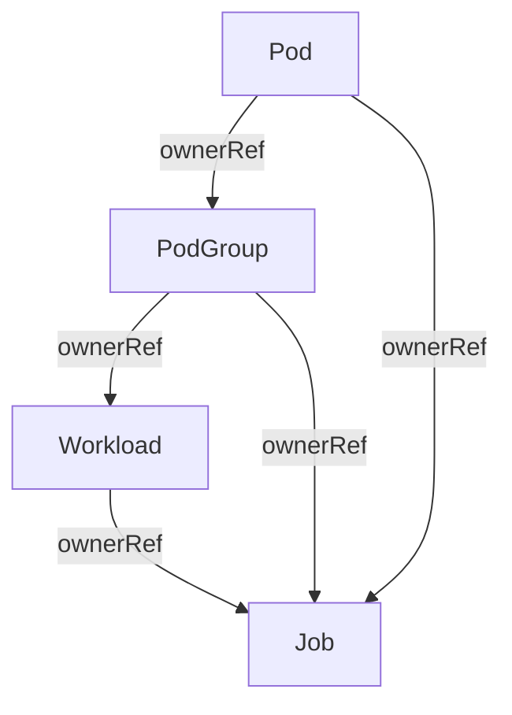

# KEP-5547: Integrate Workload APIs with Job Controller

<!-- toc -->
- [Release Signoff Checklist](#release-signoff-checklist)
- [Summary](#summary)
- [Motivation](#motivation)
  - [Goals](#goals)
  - [Non-Goals](#non-goals)
- [Proposal](#proposal)
  - [User Stories](#user-stories)
    - [ML Training Job with Gang Scheduling](#ml-training-job-with-gang-scheduling)
    - [Standard Batch Job with Workload Tracking](#standard-batch-job-with-workload-tracking)
  - [Notes/Constraints/Caveats](#notesconstraintscaveats)
    - [Alpha Constraints](#alpha-constraints)
  - [Risks and Mitigations](#risks-and-mitigations)
- [Design Details](#design-details)
  - [Job Controller Changes](#job-controller-changes)
    - [Workload and PodGroup Discovery](#workload-and-podgroup-discovery)
    - [Controller Workflow](#controller-workflow)
    - [OwnerReferences Relationship](#ownerreferences-relationship)
    - [Object Creation Order](#object-creation-order)
  - [Validation for Parallelism Changes](#validation-for-parallelism-changes)
  - [Naming Conventions](#naming-conventions)
  - [Test Plan](#test-plan)
      - [Prerequisite testing updates](#prerequisite-testing-updates)
      - [Unit tests](#unit-tests)
      - [Integration tests](#integration-tests)
      - [e2e tests](#e2e-tests)
  - [Graduation Criteria](#graduation-criteria)
    - [Alpha (v1.36)](#alpha-v136)
    - [Beta](#beta)
    - [GA](#ga)
    - [Deprecation](#deprecation)
  - [Upgrade / Downgrade Strategy](#upgrade--downgrade-strategy)
  - [Version Skew Strategy](#version-skew-strategy)
- [Production Readiness Review Questionnaire](#production-readiness-review-questionnaire)
  - [Feature Enablement and Rollback](#feature-enablement-and-rollback)
  - [Rollout, Upgrade and Rollback Planning](#rollout-upgrade-and-rollback-planning)
  - [Monitoring Requirements](#monitoring-requirements)
  - [Dependencies](#dependencies)
  - [Scalability](#scalability)
  - [Troubleshooting](#troubleshooting)
- [Implementation History](#implementation-history)
- [Drawbacks](#drawbacks)
- [Alternatives](#alternatives)
- [Infrastructure Needed (Optional)](#infrastructure-needed-optional)
<!-- /toc -->

## Release Signoff Checklist

Items marked with (R) are required *prior to targeting to a milestone / release*.

- [x] (R) Enhancement issue in release milestone, which links to KEP dir in [kubernetes/enhancements] (not the initial KEP PR)
- [x] (R) KEP approvers have approved the KEP status as `implementable`
- [x] (R) Design details are appropriately documented
- [x] (R) Test plan is in place, giving consideration to SIG Architecture and SIG Testing input (including test refactors)
  - [ ] e2e Tests for all Beta API Operations (endpoints)
  - [ ] (R) Ensure GA e2e tests meet requirements for [Conformance Tests](https://github.com/kubernetes/community/blob/master/contributors/devel/sig-architecture/conformance-tests.md)
  - [ ] (R) Minimum Two Week Window for GA e2e tests to prove flake free
- [ ] (R) Graduation criteria is in place
  - [ ] (R) [all GA Endpoints](https://github.com/kubernetes/community/pull/1806) must be hit by [Conformance Tests](https://github.com/kubernetes/community/blob/master/contributors/devel/sig-architecture/conformance-tests.md) within one minor version of promotion to GA
- [ ] (R) Production readiness review completed
- [ ] (R) Production readiness review approved
- [x] "Implementation History" section is up-to-date for milestone
- [ ] User-facing documentation has been created in [kubernetes/website], for publication to [kubernetes.io]
- [ ] Supporting documentation—e.g., additional design documents, links to mailing list discussions/SIG meetings, relevant PRs/issues, release notes

## Summary

This KEP introduces native integration between the Job controller and the gang scheduling[^1] APIs ([Workload](https://github.com/kubernetes/kubernetes/blob/release-1.35/pkg/apis/scheduling/types.go#L97) and [PodGroup](https://github.com/kubernetes/enhancements/pull/5833)).

The Job controller will automatically create `Workload` and `PodGroup` objects before creating pods for parallel Jobs, enabling native gang scheduling support in Kubernetes. 

## Motivation

The Kubernetes Job Controller currently creates pods independently without workload-aware scheduling constraints. This creates challenges for parallel applications (i.e., AI/ML training workloads, MPI jobs) that require all pods to be scheduled and run together or none(gang scheduling[^1]). Since there is now a native mechanism to express gang scheduling requirements now via `Workload` and `PodGroup` APIs, this KEP brings gang scheduling feature to Job Controller by integrating these APIs directly into the Job controller lifecycle.

### Goals

- Job controller automatically creates `Workload` and `PodGroup` objects for Jobs that require gang scheduling
- Support opt-out mechanism to define when Job controller skips creating `Workload` and `PodGroup` objects
- Use`GangSchedulingPolicy` with `minCount = parallelism` for Jobs with `parallelism > 1`, `completionMode: Indexed`, and `parallelism = completions`.
- Jobs that don't qualify for gang scheduling will not have `Workload` and `PodGroup` objects created.
- Ensure proper ordering of `Workload` and `PodGroup` creation before pods creation
- Existing Jobs without gang scheduling continue to work normally

### Non-Goals

- Supporting dynamic changes to `minCount` or gang membership at runtime
- Complex workload structures with multiple nested PodGroups are not supported in alpha.
- Support for scaling up/down gang scheduling Jobs is not supported in alpha.

## Proposal
> This KEP depends on:
> - [KEP-4671: Gang Scheduling using Workload Object](https://github.com/kubernetes/enhancements/tree/master/keps/sig-scheduling/4671-gang-scheduling)
> - [KEP-5832: Decouple PodGroup API from Workload API](https://github.com/kubernetes/enhancements/pull/5833)

The Job controller will be extended to create `Workload` and `PodGroup` objects as part of its pod management lifecycle. 
This integration ensures that pods belonging to a Job are scheduled according to the appropriate scheduling policy (gang or basic) before they are created. If `Job.spec.template.spec.schedulingGroup` is set, the Job controller does not create or update `Workload`/`PodGroup` (opt-out due to preexisting or parent-managed controller).

For the alpha release, this feature is optimized for static batch workloads with a flat API structure where 
`minCount` is immutable. The key design principles are:
- One `Job` creates one `Workload` with one `PodGroup` representing a single homogeneous group of pods.
- The automatic policy selection is based on `Job` Type
  - Jobs with `parallelism > 1` , `completionMode: Indexed` and `parallelism = completions` use gang scheduling policy where `minCount` equals the Job's parallelism.
  - Other Jobs  cases will not have `Workload` and `PodGroup` objects created and will keep scheduling as is (pod-by-pod scheduling).
- Elastic Jobs (changing parallelism at runtime) are not supported when gang scheduling is active.
- The Job controller does not create `Workload`/`PodGroup` when `Job.spec.template.spec.schedulingGroup` is set. Higher-level controllers that want to own the `Workload` and `PodGroup` (i.e., JobSet) set this field when they create the Job.
- Jobs created by CronJob do not have `schedulingGroup` set, the Job controller creates one `Workload` and one `PodGroup` per Job for them if they match the gang scheduling criteria.

An example of the Job and the corresponding `Workload`/`PodGroup` creation:

```yaml
apiVersion: batch/v1
kind: Job
metadata:
  name: <job-name>
  namespace: training
spec:
  parallelism: 8
  completions: 8
  completionMode: Indexed
  template:
    spec:
      containers:
      - name: trainer
        image: training-image:latest
        resources:
          limits:
            nvidia.com/gpu: 1
---
apiVersion: scheduling.k8s.io/v1alpha1
kind: Workload
metadata:
  name: <job-name>-<hash>
  namespace: training
  ownerReferences:
  - apiVersion: batch/v1
    kind: Job
    name: <job-name>
    uid: <job-uid>
    controller: true
spec:
  controllerRef:
    apiVersion: batch/v1
    kind: Job
    name: <job-name>
  podGroupTemplate:
  - name: pg-w-distributed-training
    schedulingPolicy:
      gang:
        minCount: 8  # Equal to Job.spec.parallelism
---
apiVersion: scheduling.k8s.io/v1alpha1
kind: PodGroup
metadata:
  name: <workload-name>-<podGroup-template-name>-<hash>
  namespace: training
  ownerReferences:
  - apiVersion: batch/v1
    kind: Job
    name: <job-name>
    uid: <job-uid>
    controller: true
  - apiVersion: scheduling.k8s.io/v1alpha1
    kind: Workload
    name: <workload-name>
    uid: <workload-uid>
spec:
  podGroupTemplateRef:
    workloadName: <workload-name>
    podGroupTemplateName: <podGroup-template-name>
  schedulingPolicy:
    gang:
      minCount: 8  # Equal to Job.spec.parallelism
```
Then, the Job Controller will create the corresponding pods and set the `schedulingGroup` field:

```yaml
apiVersion: v1
kind: Pod
metadata:
  name: <job-name>-<random-suffix>
  namespace: training
  ownerReferences:
  - apiVersion: batch/v1
    kind: Job
    name: <job-name>
    uid: <job-uid>
    controller: true
  - apiVersion: scheduling.k8s.io/v1alpha1
    kind: PodGroup
    name: <podGroup-name>
    uid: <podGroup-uid>
spec:
  schedulingGroup:
    podGroupName: <workload-name>-<podGroup-template-name>-<hash>
  containers:
  - name: ...
```

### User Stories

#### ML Training Job with Gang Scheduling

As a machine learning engineer, I want to run a distributed training job with 8 workers that must all be scheduled together. 
If only 7 workers can be scheduled, I don't want any pods to start because partial training would waste resources.

#### Standard Batch Job with Workload Tracking

As a data engineer, I want to run a batch processing job that processes files sequentially without gang scheduling requirements.

### Notes/Constraints/Caveats

#### Alpha Constraints

- The alpha release targets simple, static batch workloads where the workload requirements are known at creation time.
- Each Job maps to one `PodGroup`. All pods in the Job are identical from a scheduling policy perspective.
- The `minCount` field in the Workload's `GangSchedulingPolicy` mirrors the Job's parallelism.
- The opt-out mechanism is supported by setting `Job.spec.template.spec.schedulingGroup` to reference an existing `Workload`. In this case, the Job controller will not create `Workload`/`PodGroup` objects.
- When gang scheduling is active (`GangSchedulingPolicy`), changes to `spec.parallelism` (scaling up/down) 
are rejected via conditional validation depends on feature enablement. This is because this would require changing 
`minCount` in the `Workload` object, which is immutable. This will disable [Elastic Indexed Jobs](https://kubernetes.io/docs/concepts/workloads/controllers/job/#elastic-indexed-jobs).

### Risks and Mitigations

- `JobSet` or other higher-level controllers will create `Workload`/`PodGroup` objects for their `Workload`, the Job 
controller will duplicate or update the objects and create a conflict. We can mitigate this by ensuring the Job
controller will not create `Workload`/`PodGroup` objects if the Job has `spec.template.spec.schedulingGroup` indicating it is managed by higher-level controller.

- When the feature is enabled, Jobs that identify as gang scheduling cannot have `spec.parallelism` changed. That
effectively disables [Elastic Indexed Jobs](https://kubernetes.io/docs/concepts/workloads/controllers/job/#elastic-indexed-jobs) for those Jobs. This is accepted 
for alpha with clear documentation and a committed path to beta to not break Elastic Indexed Jobs.

- Suspended Jobs and resource release rely only on GC, which does not address releasing resources (DRA) while a Job is 
suspended. This behavior is acceptable for alpha. Future work may require the controller to delete `PodGroup`/`Workload` on suspend and recreate on resume.

## Design Details

### Job Controller Changes

The Job controller reconciliation loop that processes each Job will be extended to ensure `Workload` and `PodGroup` objects exist before creating pods. 

#### Workload and PodGroup Discovery

Discovery of those objects is based on references (`workload.spec.controllerRef` and `podGroup.spec.podGroupTemplateRef`), not on ownership. 
`ownerReference` is used only for controller-created objects so that they are garbage-collected when the Job is 
deleted. Workloads which are created by user or higher-level controller may not be given ownerReferences to the Job, so they are not deleted when the Job is deleted.

A `Workload` is considered the Workload for this Job object if:
- The `Workload` is in the Job’s namespace
- It has `workload.spec.controllerRef` field that is associated with this Job

Similarly, a `PodGroup` is considered the `PodGroup` for this Job if:
- The `PodGroup` is in the Job’s namespace
- Its `spec.podGroupTemplateReference.workloadName` equals the name of the `Workload` for this Job. 

#### Controller Workflow

The Job controller attempts to create `Workload` and `PodGroup` only when the Job has no pods associated with it 
(no active or terminal pods owned by the Job). If the Job already has one or more pods, the controller only 
discovers and uses existing `Workload`/`PodGroup` if any and does not create new ones. This rule is important for 
correctness when the controller restarts or is upgraded in the middle of the workflow (i.e., after creating 
`Workload` but before creating `PodGroup` or pods). On the next sync, the controller will find the existing objects 
via informers/listers and continue.

The controller discovers or creates `Workload` and `PodGroup` as follows:

1.  If the Job already has pods (pods owned by this Job), skip creation.
2. Look up existing `Workload`(s) in Job’s namespace whose `spec.ControllerRef` points to this Job. If the `Workload` was created by the Job controller, it also has a controller `ownerReference` pointing to this Job (`controller: true`)
  - If none found, create a `Workload` with `ownerReference` and `spec.ControllerRef` pointing to this Job
  - If more than one, treat as ambiguous and fall back (update a condition or trigger an event)
  - If exactly one, that’s the `Workload` for this Job. No changes to its `ownerReference`

3. When creating a new `Workload`, determine the appropriate scheduling policy and create the `Workload` object with the determined policy based on Job configuration:
  - `GangSchedulingPolicy` with `minCount=parallelism`: when `parallelism > 1` and `completionMode: Indexed` and `parallelism = completions`
  - For alpha, all other cases will not have `Workload` and `PodGroup` objects created, this includes:
    - `parallelism = 1`
    - `completions` not equal to `parallelism`
    - `completionMode` is not `Indexed` (non-indexed Jobs)

4. Look up `PodGroup`(s) in Job’s namespace whose `podGroup.spec.podGroupTemplateRef` is associated with the `Workload` for this Job. If the `PodGroup` was created by the Job controller, it has two ownerReferences; the Job controller and the `Workload` object
  - If none found, create a `PodGroup` with ownerReference to `Job` with `controller: true` and another ownerReference to the `Workload`
  - If exactly one, that’s the `PodGroup` for this Job. No changes to its `ownerReference`
  - If multiple PodGroups, fall back as it's not supported in alpha

5. Execute existing pod management logic to create pods, include `schedulingGroup.podGroupName` in the pod spec to associate pods with the `PodGroup`.

Note that the controller will not update the `Workload` or `PodGroup` objects if they already exist.

The controller will require additional informers and listers for `Workload` and `PodGroup` objects. Both `Workload` and `PodGroup` are automatically garbage collected if they were created by the job-controller and the corresponding Job is deleted.

If the `Workload` was created by another actor (i.e. JobSet, User creates a `Workload` with `BasicSchedulingPolicy` 
to opt-out of gang scheduling), the Job controller respects and uses it and its associated PodGroups if any. It does 
not treat that as an opt-out. The Job controller uses the discovered `Workload` and PodGroup (if any) when creating pods.
The Job controller falls back (ignore the discovered `Workload` and `PodGroup`) when the discovered `Workload` 
has an unsupported structure (for alpha, when the number of `PodGroupTemplates != 1`). In that case, a condition 
or event should be triggered to inform the user.

#### OwnerReferences Relationship

The ownerReferences relationship between `Job`, `Workload`, `PodGroup`, and `Pod` is as follows:



- The `Workload` object has an ownerReference to the `Job` object with `controller: true` in case it was created by the Job controller
- The `PodGroup` object has an ownerReference to the `Job` object with `controller: true` in case it was created by the Job controller and another ownerReference to the `Workload` object
- The `Pod` object has an ownerReference to the `Job` object with `controller: true` and another ownerReference to the `PodGroup` object

By this ownerReferences relationship, garbage collection will remove objects accordingly that avoids orphaned Pods with a stale PodGroup reference.

#### Object Creation Order

The Job controller creates objects in the following order so that references point to existing objects and to satisfy any API validation that `Workload` exists before `PodGroup` is created. The order is as follows:
1. `Workload` object which will reference the `Job`
2. `PodGroup` object which will reference the `Workload` and the `Job`
3. `Pod` objects which will reference `PodGroup`

The kube-scheduler waits for `PodGroup` when Pods have `schedulingGroup`, so scheduling does not depend on this order, the order is for consistency and API validity.

### Validation for Parallelism Changes

The Job API Validation rejects updates that change `spec.parallelism` when the feature gate is enabled and the Job uses gang scheduling. Since changing this field would require changing `minCount` in the `Workload` object, which is immutable.

Job API validation uses the same conditions the Job controller uses to create a Workload with gang scheduling. 
When the feature gate is enabled, validation rejects updates that change `spec.parallelism` if the Job, after the update, 
satisfies `spec.parallelism > 1`, `spec.completionMode == Indexed`, and `spec.parallelism == spec.completions`. If the controller’s 
criteria for applying gang scheduling change in the future, this validation logic must be updated to match.

This additional validation will be removed in beta since Elastic Indexed Jobs must be supported.

### Naming Conventions

We will not use naming for discovery due to limitations related to naming. Naming is for human readability 
and logical linking between Job, `Workload`, and `PodGroup`. Because discovery does not depend on it, the 
naming pattern can be changed in later releases if needed. 

Following prior-art in [Deployment](https://github.com/kubernetes/kubernetes/blob/f42571572d241a2cdeffa3962c0ccf1f59180113/pkg/controller/deployment/sync.go#L560-L568), the naming convention can be as follows:

**1. Workload**
  - Pattern: `<(truncated-if-needed)job-name>-<hash>`
  - Truncation of the Job name is applied when necessary to respect object name length limits.
  - The hash is used for collision avoidance (implementation may use a generated suffix or a hash of relevant identity).
  - Object type (`Workload` vs `PodGroup`) is identified by other metadata (`ownerReferences[].kind`), not by the name pattern.

**2. PodGroup**
  - Pattern: `<(truncated-if-needed)workload-name>-<(truncated-if-needed)podGroup-template-name>-<hash>`
  - Truncation of workload name and podGroup name is applied when necessary to respect name length limits.
  - The hash allows multiple PodGroups within a `Workload` and `PodGroupTemplate` to have distinct names. For alpha, the controller creates a single `PodGroup` per Job, however, the pattern still supports future multi-PodGroup cases.

  ### Deletion and Garbage Collection

  The Job controller does not explicitly delete `Workload` or `PodGroup`. However, in the case of the controller 
  creating them, it sets `ownerReferences` so that garbage collection removes them when the Job is deleted. 
  No additional controller logic is required for deletion in the current design.
  
  The Job controller does not add or adopt ownerReferences on objects it did not create (user-created or higher-level controller-created objects). Users or other controllers may create Workloads/PodGroups with the same ownerReferences as the Job controller would use.

  To distinguish controller-created objects from user-created ones that may have the same ownerReferences, 
  the Job controller may set a `managed-by` annotation or equivalent metadata on `Workload` and `PodGroup` objects it creates. 
  This allows the controller to know which objects it created and is responsible for its lifecycle, 
  including GC. Similarly, for PodGroups, which is especially important as they may have multiple ownerReferences (Job and `Workload`).

### Test Plan

[x] I/we understand the owners of the involved components may require updates to
existing tests to make this code solid enough prior to committing the changes necessary
to implement this enhancement.

##### Prerequisite testing updates

##### Unit tests

- `k8s.io/kubernetes/pkg/controller/job_controller`: `2026-01-29` - `89.1%`
- `k8s.io/kubernetes/pkg/apis/batch/validation`:
- `k8s.io/kubernetes/pkg/registry/batch/job`: 
- Add test that verifies 
  - SchedulingPolicy for various Job configurations
  - `Workload` and `PodGroup` creation for gang-scheduled Jobs only (for alpha, all other Jobs will not have `Workload` and `PodGroup` objects created)
  - pod creation includes correct `schedulingGroup`
  - Parallelism change is blocked for gang-scheduled Jobs and allowed for all otherJobs
  - Job deletion cascades to `Workload` and `PodGroup` deletion
  - Feature gate disabled: Jobs work without `Workload`/`PodGroup` creation
  - Jobs with ownerReferences (managed by higher-level controllers) do not create `Workload`/`PodGroup`
  - ownerReferences on controller-created `Workload` and `PodGroup` match the expected structure:
    - `Workload` has controller ownerRef to Job
    - `PodGroup` has controller ownerRef to Job and non-controller ownerRef to `Workload`
    - Test naming abbreviations for `Workload` and `PodGroup`

##### Integration tests

We will add the following integration tests to the Job controller `https://github.com/kubernetes/kubernetes/blob/v1.35.0/test/integration/job/job_test.go`:
- Gang Scheduling Lifecycle Test (create, update, delete Job, verify `Workload` and `PodGroup` creation, verify pods have `schedulingGroup`, verify Job deletion cascades to `Workload` and `PodGroup` deletion)
- Failure Recovery Test (create Job with `Workload` API unavailable, verify Job controller retries, verify `Workload` is eventually created)
- Feature gate disable/enable (Jobs work without `Workload`/`PodGroup` creation (Jobs with ownerReferences managed by higher-level controllers do not create `Workload`/`PodGroup`))
- Jobs created by CronJob get one `Workload` and one `PodGroup` per Job:
  - CronJob does not set `schedulingGroup` on the pod template
  - Verify `Workload`/`PodGroup` creation and GC when the CronJob-created Job completes or is deleted
- When a Job is suspended, pods are deleted but `Workload` and `PodGroup` remain. For alpha, check that on resume, the same `Workload`/`PodGroup` are used and pods are recreated with correct `schedulingGroup`
- For a Job using gang scheduling, verify that parallelism change is rejected and all other Jobs are still allowed
- Verify controller-created `Workload`/`PodGroup` has the correct owner references

##### e2e tests

- End-to-end gang scheduling, all pods scheduled together or none
- Mixed workloads, gang and basic Jobs coexist
- Failure scenarios, i.e., insufficient resources for gang, partial failures

### Graduation Criteria

#### Alpha (v1.36)

- Feature is implemented behind feature gate `EnableWorkloadWithJob` (default: disabled)
- Job controller creates `Workload` and `PodGroup` objects for Jobs when feature gate is enabled
- Gang scheduling policy applied to indexed parallel Jobs (`parallelism > 1`, `completions = parallelism`, `completionMode: Indexed`)
- non-gang scheduling Jobs will not have `Workload` and `PodGroup` objects created
- Jobs managed by higher-level controllers skip `Workload`/`PodGroup` creation
- API validation rejects updates that change `spec.parallelism` for gang scheduling Jobs
- Unit tests for all new Job controller logic
- Integration tests for `Workload`/`PodGroup` creation flow
- Documentation for enabling and using the feature

#### Beta

- Before beta, the Job API must clearly define: 
  - How users opt-in or opt-out of gang scheduling. Disable gang scheduling must not rely on turning off the feature gate
  - When and how `Workload` and `PodGroup` are created/updated (i.e., only at creation vs. also when scaling)
  - Define the scaling up/down mechanism for gang scheduling Jobs (elastic indexed jobs are not supported)
- Evaluate whether the Job controller’s [current batch-create](https://github.com/kubernetes/kubernetes/blob/2023f445eca52e6baa72139e56c6e4e01be0ee97/pkg/controller/job/job_controller.go#L1780-L1838) pods should be changed when gang scheduling is active (it slows down the pod creations), and document the decision.
- Elastic Indexed Jobs must be supported (beta blocker)
- The controller needs a mechanism to delete `PodGroup`/`Workload` in the case of suspended Jobs and recreate on resume.
- Create `Workload` and `PodGroup` objects for all non-gang scheduling Jobs with `BasicSchedulingPolicy`
- Feature gate `EnableWorkloadWithJob` is enabled by default
- Address feedback from alpha
- E2e tests covering gang scheduling scenarios
- Metrics for monitoring `Workload`/`PodGroup` creation and scheduling outcomes
- Performance testing to validate no significant impact on Job creation latency

#### GA

TBD after beta release

#### Deprecation

N/A for alpha release

### Upgrade / Downgrade Strategy

- **Upgrade:**
  1. Upgrade kube-apiserver
  2. Enable feature gate and upgrade kube-controller-manager
  3. New Jobs automatically get `Workload`/`PodGroup` objects
  4. Existing Jobs continue to work (no `Workload` created for them)

- **Downgrade:**
  1. Disable feature gate and downgrade kube-controller-manager
  2. New Jobs no longer get `Workload`/`PodGroup` objects
  3. Existing `Workload` and `PodGroup` objects remain
  4. Jobs with `schedulingGroup.podGroupName` on pods continue to run (field ignored)
  5. New Pods for Jobs will not have `schedulingGroup.podGroupName` set

- **Migration for Existing Jobs:**
  - Existing Jobs before upgrade do not automatically get `Workload` objects
  - To add gang scheduling to existing Jobs, delete and recreate them
  - Jobs who do not have pods running yet get `Workload`/`PodGroup` objects created for them.

- **Controller restarts and upgrades:** 
  - The Job controller only creates `Workload`/`PodGroup` when the Job has no pods
  - If the controller restarts or is upgraded after creating `Workload` but before creating `PodGroup` or pods, on 
  the next sync it will discover the existing `Workload` (and `PodGroup` if present) via informers/listers and continue without creating duplicates. 
  - No special handling is required for in-flight Jobs during controller upgrade or restart.

### Version Skew Strategy

Gang scheduling only occurs when:
- The API server can serve the `Workload` and `PodGroup` APIs
- The Job controller is able to create `Workload`/`PodGroup` and sets `schedulingGroup` on pods
- The scheduler supports `Workload`/`PodGroup`

Therefore, for a safe rollout:
- kube-apiserver must be upgraded first so it can serve the `Workload` and `PodGroup` APIs.
- kube-controller-manager can be upgraded before or after the scheduler
- kube-scheduler should be upgraded before or together with kube-controller-manager. Gang semantics will not apply until the scheduler is upgraded.

There are different Skew scenarios involving the kube-scheduler:
- kube-controller-manager new, kube-scheduler old: The controller creates `Workload` and `PodGroup` and sets `schedulingGroup` on pods but the scheduler does not understand these objects and ignores `schedulingGroup`. In this case, pods are scheduled normally (pod-by-pod) with no gang scheduling benefit until the scheduler is upgraded.
- kube-controller-manager old, kube-scheduler new: The controller does not create `Workload`/`PodGroup` and does not set `schedulingGroup` on pods. The scheduler has no workload information for those Jobs. Pods are scheduled normally with no gang scheduling benefit.

## Production Readiness Review Questionnaire

### Feature Enablement and Rollback

###### How can this feature be enabled / disabled in a live cluster?

- [x] Feature gate (also fill in values in `kep.yaml`)
  - Feature gate name: `EnableWorkloadWithJob`
  - Components depending on the feature gate:
    - kube-controller-manager
    - kube-apiserver
- [ ] Other
  - Describe the mechanism:
  - Will enabling / disabling the feature require downtime of the control
    plane?
  - Will enabling / disabling the feature require downtime or reprovisioning
    of a node?

###### Does enabling the feature change any default behavior?
Yes. When the feature gate is enabled:

1. The Job controller creates `Workload` and `PodGroup` objects for all qualified gang scheduling Jobs (`parallelism > 1`, `completions = parallelism`, `completionMode: Indexed`) before creating pods.
2. Jobs that match the gang scheduling criteria (`parallelism > 1`, `completions = parallelism`, `completionMode: Indexed`) use gang scheduling, meaning all pods must be scheduled together or none are scheduled.
3. Updates to `Job.spec.parallelism` are rejected for Jobs using gang scheduling.
4. The binding of pods referencing a `PodGroup` is delayed until the `PodGroup` object exists.

###### Can the feature be disabled once it has been enabled (i.e. can we roll back the enablement)?

Yes. The feature can be disabled (`EnableWorkloadWithJob: false`).

###### What happens if we reenable the feature if it was previously rolled back?

When the feature is re-enabled:
- New Jobs will have `Workload` and `PodGroup` objects created
- Existing Jobs that don't have running pods will have `Workload` and `PodGroup` objects created on their next reconciliation cycle
- Jobs that were running without gang scheduling will be evaluated again, if they match gang scheduling criteria and have no running pods, a `Workload` with gang policy will be created.
- Jobs that have running pods are not affected since gang scheduling only applies to newly created Jobs/Pods

###### Are there any tests for feature enablement/disablement?

Yes. We will add unit tests and integration tests for feature enablement/disablement.

### Rollout, Upgrade and Rollback Planning


###### How can a rollout or rollback fail? Can it impact already running workloads?

- If the API server doesn't support `Workload` and `PodGroup` APIs, the Job controller will fail to create Jobs (error creating `Workload`). Jobs will be requeued until the API server is upgraded.
- If the scheduler doesn't have gang scheduling feature enabled, pods are scheduled normally in pod-by-pod manner.
- Already running Jobs are not affected by enabling the feature. Pods that are already scheduled and running continue to run. New Jobs or Jobs being reconciled will be affected.
- For the rollback, disabling the feature gate allows Jobs to work without `Workload` and `PodGroup` creation. `Workload` and `PodGroup` objects don't cause issues; they're ignored when the feature is disabled

###### What specific metrics should inform a rollback?

The following metrics should be monitored:

- `job_sync_duration_seconds`: If Job sync duration increases significantly, it may indicate issues with `Workload`/`PodGroup` creation
- `job_pods_creation_total`: A drop in pod creation rate may indicate a problem in the Job controller’s `Workload`/`PodGroup` flow 

###### Were upgrade and rollback tested? Was the upgrade->downgrade->upgrade path tested?

This will be tested manually as part of alpha release.

###### Is the rollout accompanied by any deprecations and/or removals of features, APIs, fields of API types, flags, etc.?

No.

### Monitoring Requirements

###### How can an operator determine if the feature is in use by workloads?

- `kubectl get workloads -A` will show `Workload` objects created by the Job controller
- `kubectl get podgroups -A` will show `PodGroup` objects created by the Job controller

###### How can someone using this feature know that it is working for their instance?

- [x] Events
  - Event Reason: `WorkloadCreated` - Emitted when `Workload` object is created for a Job
  - Event Reason: `PodGroupCreated` - Emitted when `PodGroup` object is created for a Job
- [ ] API .status
  - Condition name: 
  - Other field: 
- [ ] Other (treat as last resort)
  - Details:

###### What are the reasonable SLOs (Service Level Objectives) for the enhancement?
 To be discussed after alpha release.

###### What are the SLIs (Service Level Indicators) an operator can use to determine the health of the service?

 To be discussed after alpha release.

- [] Metrics
  - Metric name:
  - [Optional] Aggregation method:
  - Components exposing the metric:
- [ ] Other (treat as last resort)
  - Details:

###### Are there any missing metrics that would be useful to have to improve observability of this feature?

### Dependencies


###### Does this feature depend on any specific services running in the cluster?

- `scheduling.k8s.io/v1alpha1` for `Workload` and `PodGroup` APIs
- `kube-scheduler` with gang scheduling feature enabled

### Scalability


###### Will enabling / using this feature result in any new API calls?

Yes. The Job controller uses informers and listers for `Workload` and `PodGroup` for lookups and watches. The following additional API calls are made when this feature is enabled:
- `CREATE Workload` - 1 per Job creation
- `CREATE PodGroup` - 1 per Job creation

###### Will enabling / using this feature result in introducing new API types?

No.

###### Will enabling / using this feature result in any new calls to the cloud provider?

No.

###### Will enabling / using this feature result in increasing size or count of the existing API objects?

Yes. Jobs that match the gang scheduling criteria create 1 `Workload`(~500 bytes) and 1 `PodGroup`(~500 bytes) object. In addition to Each Pod gains a `schedulingGroup` field (~100 bytes).

For a cluster with 10,000 gang scheduling Jobs, this adds approximately:
- 10,000 `Workload` objects
- 10,000 `PodGroup` objects
- ~10MB additional etcd storage

###### Will enabling / using this feature result in increasing time taken by any operations covered by existing SLIs/SLOs?

There is an expected increase in job sync duration due to creating `Workload` and `PodGroup` objects for each Job and for scheduler waiting time. We will measure the impact once we have an implementation.

###### Will enabling / using this feature result in non-negligible increase of resource usage (CPU, RAM, disk, IO, ...) in any components?

Yes.
- Kube-controller-manager: Additional memory for `Workload` and `PodGroup` informers. Estimated ~50MB for 10,000 objects.
- Kube-scheduler: Additional memory for `Workload` and `PodGroup` caches. Estimated ~50MB for 10,000 objects.
- etcd: Additional storage for `Workload` and `PodGroup` objects. Estimated ~10MB for 10,000 Jobs.
- kube-apiserver: Additional watches for `Workload` and `PodGroup` resources. Minimal CPU impact.

###### Can enabling / using this feature result in resource exhaustion of some node resources (PIDs, sockets, inodes, etc.)?

No. This feature is purely control-plane and does not affect node resources.

### Troubleshooting


###### How does this feature react if the API server and/or etcd is unavailable?

- Job Controller cannot create Workloads/PodGroups
- Retry with exponential backoff when kube-apiserver recovers
- Existing Jobs with Workloads continue to run

###### What are other known failure modes?


###### What steps should be taken if SLOs are not being met to determine the problem?

- Verify `EnableWorkloadWithJob` is enabled on all control plane components
- Check controller-manager logs for errors related to `Workload`/`PodGroup` creation
- Review existing metrics `job_sync_duration_seconds`, `workload_creation_duration_seconds`
- Check resource constraints since gang scheduling may fail if cluster doesn't have sufficient resources

## Implementation History
- 2026-01-29: KEP created
- 2026-02-10: KEP updated according to final API design for `Workload` and `PodGroup`

## Drawbacks

## Alternatives


## Infrastructure Needed (Optional)

[^1]: The Kubernetes community uses the term "gang scheduling" to mean "all-or-nothing scheduling of a set of pods" [1,2,3,4,5,6,7,8,9,10,11,12,13]. In the Kubernetes context, it does not imply time-multiplexing (in contrast to prior academic work such as [Feitelson and Rudolph](https://doi.org/10.1016/0743-7315(92)90014-E), and in contrast to [Slurm Gang Scheduling](https://slurm.schedmd.com/gang_scheduling.html). ↩
