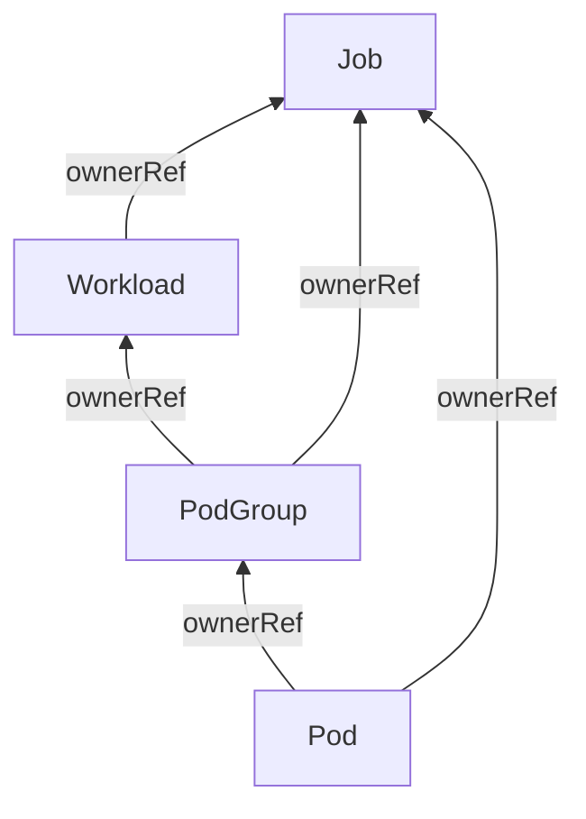

# KEP-5547: Integrate Workload APIs with Job Controller

<!-- toc -->
- [Release Signoff Checklist](#release-signoff-checklist)
- [Summary](#summary)
- [Motivation](#motivation)
  - [Goals](#goals)
  - [Non-Goals](#non-goals)
- [Proposal](#proposal)
  - [Job Integration - API Usage Examples](#job-integration---api-usage-examples)
    - [Example 1: Gang scheduling with zone topology and atomic disruption](#example-1-gang-scheduling-with-zone-topology-and-atomic-disruption)
    - [Example 2: Backward Compatibility and Defaulting (Implicit Opt-Out)](#example-2-backward-compatibility-and-defaulting-implicit-opt-out)
    - [Example 3: CronJob with Gang Scheduling](#example-3-cronjob-with-gang-scheduling)
  - [User Stories](#user-stories)
    - [ML Training Job with Gang Scheduling](#ml-training-job-with-gang-scheduling)
    - [Backward-Compatible Standard Batch Job](#backward-compatible-standard-batch-job)
  - [Notes/Constraints/Caveats](#notesconstraintscaveats)
    - [Alpha Constraints](#alpha-constraints)
  - [Risks and Mitigations](#risks-and-mitigations)
- [Design Details](#design-details)
  - [Core Principles &amp; Assumptions](#core-principles--assumptions)
  - [Job API Changes](#job-api-changes)
    - [Go Package Placement &amp; Graduation](#go-package-placement--graduation)
  - [Integration with the workloadbuilder Library](#integration-with-the-workloadbuilder-library)
    - [Library Dependency and Packaging](#library-dependency-and-packaging)
    - [Building the Logical Tree and Compiling the <code>Workload</code>](#building-the-logical-tree-and-compiling-the-workload)
    - [API Validation via the <code>workloadbuilder</code> Library](#api-validation-via-the-workloadbuilder-library)
    - [Instantiating the runtime <code>PodGroup</code>](#instantiating-the-runtime-podgroup)
    - [Reconcile Integration and Error Handling](#reconcile-integration-and-error-handling)
  - [Job Controller Changes](#job-controller-changes)
    - [Workload and PodGroup Discovery](#workload-and-podgroup-discovery)
    - [Controller Workflow](#controller-workflow)
    - [OwnerReferences Relationship](#ownerreferences-relationship)
    - [Defaulting Rules](#defaulting-rules)
    - [Object Creation Order](#object-creation-order)
    - [Handling Updates and Mutability](#handling-updates-and-mutability)
    - [Reconciliation Flow upon Updates](#reconciliation-flow-upon-updates)
  - [Interaction with BYO Workload/PodGroup](#interaction-with-byo-workloadpodgroup)
  - [Naming Conventions](#naming-conventions)
  - [Deletion and Garbage Collection](#deletion-and-garbage-collection)
  - [Test Plan](#test-plan)
      - [Prerequisite testing updates](#prerequisite-testing-updates)
      - [Unit tests](#unit-tests)
      - [Integration tests](#integration-tests)
      - [e2e tests](#e2e-tests)
  - [Graduation Criteria](#graduation-criteria)
    - [Alpha (v1.36)](#alpha-v136)
    - [Alpha (v1.37)](#alpha-v137)
    - [Beta](#beta)
    - [GA](#ga)
    - [Deprecation](#deprecation)
  - [Upgrade / Downgrade Strategy](#upgrade--downgrade-strategy)
  - [Version Skew Strategy](#version-skew-strategy)
- [Production Readiness Review Questionnaire](#production-readiness-review-questionnaire)
  - [Feature Enablement and Rollback](#feature-enablement-and-rollback)
  - [Rollout, Upgrade and Rollback Planning](#rollout-upgrade-and-rollback-planning)
  - [Monitoring Requirements](#monitoring-requirements)
  - [Dependencies](#dependencies)
  - [Scalability](#scalability)
  - [Troubleshooting](#troubleshooting)
- [Implementation History](#implementation-history)
- [Drawbacks](#drawbacks)
- [Alternatives](#alternatives)
- [Infrastructure Needed (Optional)](#infrastructure-needed-optional)
<!-- /toc -->

## Release Signoff Checklist

Items marked with (R) are required *prior to targeting to a milestone / release*.

- [x] (R) Enhancement issue in release milestone, which links to KEP dir in [kubernetes/enhancements] (not the initial KEP PR)
- [x] (R) KEP approvers have approved the KEP status as `implementable`
- [x] (R) Design details are appropriately documented
- [x] (R) Test plan is in place, giving consideration to SIG Architecture and SIG Testing input (including test refactors)
  - [ ] e2e Tests for all Beta API Operations (endpoints)
  - [ ] (R) Ensure GA e2e tests meet requirements for [Conformance Tests](https://github.com/kubernetes/community/blob/master/contributors/devel/sig-architecture/conformance-tests.md)
  - [ ] (R) Minimum Two Week Window for GA e2e tests to prove flake free
- [ ] (R) Graduation criteria is in place
  - [ ] (R) [all GA Endpoints](https://github.com/kubernetes/community/pull/1806) must be hit by [Conformance Tests](https://github.com/kubernetes/community/blob/master/contributors/devel/sig-architecture/conformance-tests.md) within one minor version of promotion to GA
- [x] (R) Production readiness review completed
- [x] (R) Production readiness review approved
- [x] "Implementation History" section is up-to-date for milestone
- [ ] User-facing documentation has been created in [kubernetes/website], for publication to [kubernetes.io]
- [ ] Supporting documentation—e.g., additional design documents, links to mailing list discussions/SIG meetings, relevant PRs/issues, release notes

## Summary

This KEP integrates the Workload-aware Scheduling (WAS) APIs (`Workload` and `PodGroup`) into the
`batch/v1` Job by adding a user-facing `spec.scheduling` field, allowing users to express explicit
scheduling intent such as gang scheduling[^1], topology co-location, and disruption policies.

The first alpha, introduced in v1.36, intentionally bypassed this user-facing API: the controller inferred a
hardcoded `Gang` policy from the Job's type (parallel Jobs with indexed completion mode), with `minCount`
fixed to `parallelism`. This revision replaces that automatic, controller-inferred model with an
explicit, user-driven design that separates scheduling *policy* (expressed by the user) from
workload *structure* (owned by the Job API). It is built on the reusable scheduling building blocks
and the shared `workloadbuilder` translation library defined in [KEP-6089], keeping the Job
integration consistent with the rest of the ecosystem rather than reinventing bespoke logic.

The Job controller acts as a translator, compiling `spec.scheduling` into the underlying
`Workload`/`PodGroup` objects. When `spec.scheduling` is omitted, it defaults to `Basic` 
scheduling, so the scheduling outcome of existing Jobs is preserved. The Job
integration remains in Alpha for the v1.37 cycle, allowing the user-facing API to be validated
before graduation.

## Motivation

The Kubernetes Job Controller historically created pods independently without workload-aware
scheduling constraints. This is a challenge for parallel applications (i.e., AI/ML training
workloads, MPI jobs) that require all pods to be scheduled and run together or none (gang
scheduling[^1]). The v1.36 alpha brought gang scheduling to the Job controller, but it did so by
inferring a hardcoded `Gang` policy from the Job's type rather than from explicit user intent.

Users have diverse use cases and require the ability to express explicit intent, such as opting
in or out of gang scheduling, requesting specific topologies, or configuring disruption policies
for their workloads. [KEP-6089] standardizes the reusable scheduling building blocks
(`scheduling.k8s.io/v1alpha3`) and a shared `workloadbuilder` translation library so that workload
controllers can expose these features consistently. This KEP integrates those building blocks into
the core `Job` API, "blazing the path" for the rest of the ecosystem while resolving the usability
gaps of the initial alpha.

### Goals

- Add a user-facing `spec.scheduling` (`JobSchedulingConfiguration`) field to the `batch/v1` Job,
  embedding the `scheduling.k8s.io/v1alpha3` building blocks (`policy`, `constraints`,
  `disruptionMode`, `resourceClaims`) so users can express explicit scheduling intent.
- Default to `Basic` scheduling when `spec.scheduling` is omitted, so the observable scheduling 
  outcome of existing Jobs is preserved (no all-or-nothing gate, and any number of schedulable 
  pods proceed to binding). Following the [KEP-6089], the controller still materializes a `Basic`
  `Workload`/`PodGroup`, which routes these pods through the Workload Scheduling Cycle 
  (batched scheduling and workload-aware preemption) without enforcing minCount.
- Let users opt in to `Gang` scheduling, with `minCount` defaulting to `parallelism` when omitted.
- Compile `spec.scheduling` into `Workload`/`PodGroup` objects via the shared `workloadbuilder`
  library instead of bespoke controller logic.
- Support mutable `spec.scheduling.policy.gang.minCount` for elastic scaling, while keeping all
  other `spec.scheduling` fields immutable after creation. This relies on [KEP-4671] that makes 
  `minCount` in `PodGroup`/`PodGroupTemplate` mutable in v1.37 to support workload scaling.
- When the Job is not the root of the workload tree (the `OwnerReference` refers to a parent
  controller that compiles and owns the `Workload`), defer `Workload` management to that parent,
  preserving the root-controller-as-compiler principle. A parent may own the `Workload` while still
  delegating `PodGroup` management to the Job (e.g., a `Job` running under a `TrainJob` that does not
  know about Jobs). The parent signals this split via [KEP-6089]'s downward-mapping annotations, so 
  a non-root controller can still create and manage the `PodGroup` for its own pods.
- Ensure proper ordering of `Workload` → `PodGroup` → `Pod` creation.

### Non-Goals

- Multi-level / nested composite (`CompositePodGroup`) structures, since this KEP covers 
single-level, flat `Job` workloads only.
- Implementing the integration in composite controllers (`JobSet`, `LWS`, `TrainJob`). Those 
  are pursued independently in their own repositories.
- Defining the `scheduling.k8s.io` building-block API or the `workloadbuilder` library 
  itself (owned by [KEP-6089] and consumed here).

## Proposal

This proposal builds on the recently introduced Workload-aware Scheduling enhancements. We assume
the reader is acquainted with the following KEPs:

- [KEP-4671]: Gang Scheduling.
- [KEP-5710]: Workload-aware preemption.
- [KEP-5732]: Topology-aware workload scheduling.
- [KEP-6089]: WAS Controller APIs.

The Job controller is extended to compile the user's scheduling intent into `Workload` and
`PodGroup` objects as part of its pod-management lifecycle, so that pods belonging to a Job are
scheduled according to the requested policy before they are created. The intent is expressed
through a new `spec.scheduling` field.

The key design principles for this alpha are:

- One `Job` maps to one `PodGroup` representing a single group of pods. The `PodGroup` 
always links to a `Workload` via a `PodGroupTemplate`:
  * For a root Job the controller compiles the `Workload` itself
  * For a non-root Job the `PodGroup` links to the parent-owned `Workload`
  * The `PodGroup` links to a parent `CompositePodGroup` instance only when the parent 
  supplies the `scheduling.k8s.io/parent-composite-podgroup` annotation
- The scheduling policy comes from the user's `spec.scheduling`, not from the Job's type. When
  `spec.scheduling` is omitted, the controller defaults to the `Basic` policy.
- Following the [KEP-6089], the controller always materializes scheduling objects (a `Workload`
  and/or `PodGroup`) for an *eligible* Job — a Job the controller is responsible for when the gate is
  on: a standalone/root Job, or a non-root Job whose parent delegates the `PodGroup` (a Job whose
  parent owns both objects is skipped). This holds even for the `Basic` scheduling policy.
- For `Gang`, an omitted `minCount` defaults to the Job's `parallelism`. `minCount` is mutable to support elastic scaling; all other
  `spec.scheduling` fields are immutable after creation.
- The Job controller does not create a `Workload` when the Job carries an `OwnerReference` to a
  parent controller that compiles and owns the `Workload` (e.g., `JobSet`). Such controllers set
  this `OwnerReference` when they create the Job. Whether the Job controller also skips `PodGroup`
  creation depends on what the parent delegates: if the parent injects the annotation 
  ([KEP-6089]), the Job controller still creates and manages the runtime `PodGroup` for its own 
  pods, mapping them to the parent's named `PodGroupTemplate` and attaching to the parent instance. 
  If no such annotation is present, the parent owns both objects and the Job controller skips both.
- Jobs created by `CronJob` are standalone (no parent-workload `OwnerReference`); the Job controller
  creates one `Workload` and one `PodGroup` per Job for them based on each Job's `spec.scheduling`.

### Job Integration - API Usage Examples

#### Example 1: Gang scheduling with zone topology and atomic disruption

A distributed training `Job` whose 4 pods must schedule together (all-or-nothing), co-locate within
the same availability zone, and be disrupted together (if one pod is preempted, the whole group is):

```yaml
apiVersion: batch/v1
kind: Job
metadata:
  name: <job-name>
  namespace: training
spec:
  parallelism: 4
  completions: 4
  completionMode: Indexed
  scheduling:               # New API field - scheduling intent
    policy:
      gang: {}              # minCount omitted -> defaults to parallelism (4)
    constraints:
      topology:
        - level: "topology.kubernetes.io/zone"
    disruptionMode:
      all: {}               # entire group must be disrupted together
  template:
    spec:
      containers:
      - name: trainer
        image: training-image:latest
        resources:
          limits:
            nvidia.com/gpu: 1
```

The Job controller compiles this intent into a `Workload` and its runtime `PodGroup`:

```yaml
apiVersion: scheduling.k8s.io/v1alpha3
kind: Workload
metadata:
  name: <job-name>-<hash>
  namespace: training
  ownerReferences:
  - apiVersion: batch/v1
    kind: Job
    name: <job-name>
    uid: <job-uid>
    controller: true
spec:
  controllerRef:
    apiVersion: batch/v1
    kind: Job
    name: <job-name>
  podGroupTemplates:
  - name: <podGroupTemplateName>
    schedulingPolicy:
      gang:
        minCount: 4         # defaulted from Job.spec.parallelism
    constraints:
      topology:
        - level: "topology.kubernetes.io/zone"
    disruptionMode:
      all: {}
---
apiVersion: scheduling.k8s.io/v1alpha3
kind: PodGroup
metadata:
  name: <workload-name>-<podGroup-template-name>-<hash>
  namespace: training
  ownerReferences:
  - apiVersion: batch/v1
    kind: Job
    name: <job-name>
    uid: <job-uid>
    controller: true
  - apiVersion: scheduling.k8s.io/v1alpha3
    kind: Workload
    name: <workload-name>
    uid: <workload-uid>
spec:
  podGroupTemplateRef:
    workload:
      workloadName: <workload-name>
      podGroupTemplateName: <podGroup-template-name>
  schedulingPolicy:
    gang:
      minCount: 4
```

#### Example 2: Backward Compatibility and Defaulting (Implicit Opt-Out)

A standard Job that omits the `scheduling` block. It defaults to `Basic` scheduling. Per 
the [KEP-6089], the controller does not impose all-or-nothing, so the scheduling 
outcome matches a standard Job (batched scheduling cycle, no minCount enforcement):

```yaml
apiVersion: batch/v1
kind: Job
metadata:
  name: <job-name>
  namespace: batch
spec:
  parallelism: 10
  completions: 10
  # The scheduling block is omitted, which defaults to Basic scheduling. 
  # This acts as an implicit opt-out from gang scheduling.
  template:
    spec:
      containers:
      - name: processor
        image: processor-image:v1
```

This compiles into a `Basic` scheduling policy:

```yaml
apiVersion: scheduling.k8s.io/v1alpha3
kind: Workload
metadata:
  name: <job-name>-<hash>
  namespace: batch
  ownerReferences:
  - apiVersion: batch/v1
    kind: Job
    name: <job-name>
    uid: <job-uid>
    controller: true
spec:
  controllerRef:
    apiVersion: batch/v1
    kind: Job
    name: <job-name>
  podGroupTemplates:
  - name: <podGroup-template-name>
    schedulingPolicy:
      basic: {}
---
apiVersion: scheduling.k8s.io/v1alpha3
kind: PodGroup
metadata:
  name: <workload-name>-<podGroup-template-name>-<hash>
  namespace: batch
  ownerReferences:
  - apiVersion: batch/v1
    kind: Job
    name: <job-name>
    uid: <job-uid>
    controller: true
  - apiVersion: scheduling.k8s.io/v1alpha3
    kind: Workload
    name: <workload-name>
    uid: <workload-uid>
spec:
  podGroupTemplateRef:
    workload:
      workloadName: <workload-name>
      podGroupTemplateName: <podGroup-template-name>
  schedulingPolicy:
    basic: {}
```

#### Example 3: CronJob with Gang Scheduling

A `CronJob` that periodically runs a gang-scheduled training Job. Each `Job` created by the
`CronJob` is treated as standalone. `CronJob` does not create or manage `Workload` objects,
the Job controller creates a separate `Workload` and `PodGroup` per `Job`. These objects are
garbage-collected when each `Job` completes or is deleted.

```yaml
apiVersion: batch/v1
kind: CronJob
metadata:
  name: periodic-training
  namespace: training
spec:
  schedule: "0 */6 * * *"
  jobTemplate:
    spec:
      parallelism: 4
      completions: 4
      completionMode: Indexed
      scheduling:
        policy:
          gang: {}            # minCount defaults to parallelism (4) per Job
      template:
        spec:
          containers:
          - name: trainer
            image: training-image:latest
            resources:
              limits:
                nvidia.com/gpu: 1
```

Each `Job` created by this `CronJob` produces its own `Workload` and `PodGroup`, compiled from
the Job's `spec.scheduling`.
If the `CronJob`'s `jobTemplate` omits the `scheduling` block, each `Job` defaults to `Basic`.

In all cases, the Job controller then creates the pods and sets the `schedulingGroup` field so the
scheduler can associate each pod with its `PodGroup`:

```yaml
apiVersion: v1
kind: Pod
metadata:
  name: <job-name>-<random-suffix>
  namespace: <namespace>
  ownerReferences:
  - apiVersion: batch/v1
    kind: Job
    name: <job-name>
    uid: <job-uid>
    controller: true
  - apiVersion: scheduling.k8s.io/v1alpha3
    kind: PodGroup
    name: <podGroup-name>
    uid: <podGroup-uid>
spec:
  schedulingGroup:
    podGroupName: <workload-name>-<podGroup-template-name>-<hash>
  containers:
  - name: ...
```

### User Stories

#### ML Training Job with Gang Scheduling

As a machine learning engineer, I want to run a distributed training job with 8 workers that must
all be scheduled together. I set `spec.scheduling.policy.gang` on the Job (optionally with a
topology constraint to co-locate the workers), so that if only 7 workers can be scheduled, no pods
start and no resources are wasted. I do not have to set `parallelism` and `completions`
in a specific way to "qualify" for gang scheduling; I declare my intent explicitly.

#### Backward-Compatible Standard Batch Job

As a data engineer, I want to run a batch processing job that processes files independently without
gang scheduling requirements. I omit `spec.scheduling` entirely (or set `spec.scheduling.policy.basic`
explicitly for the same effect), so the Job defaults to `Basic` scheduling. The observable scheduling
outcome matches a standard Job, while a `Basic` `Workload`/`PodGroup` is still materialized, giving me consistent objects to observe its scheduling state.

### Notes/Constraints/Caveats

#### Alpha Constraints

- The alpha targets single-level `Job` workloads: one `Job` maps to one `PodGroup`, and all pods in
  the `Job` share a single scheduling policy. Elastic scaling is supported through the mutable `gang.minCount`.
- `spec.scheduling.policy.gang.minCount` is mutable to support elastic scaling ([KEP-4671]); all 
  other `spec.scheduling` fields are immutable after creation.
- The Job controller creates `Workload`/`PodGroup` objects for every eligible Job, including  
`Basic` scheduling, the only way to avoid the objects entirely is to disable the feature gate. 
What is opt-in is the scheduling behavior (gang-scheduling, topology constraints, disruption 
modes, etc.) are requested explicitly via `spec.scheduling`. By default, an end user gets 
the original scheduling outcome even though a `Basic` `Workload`/`PodGroup` is still created.

### Risks and Mitigations

- **Split-brain configuration.** A composite wrapper controller (such as `JobSet` or `TrainJob`)
  may expose its own scheduling fields while the child `Job` now also has native `spec.scheduling`
  fields, letting a user configure scheduling in two conflicting places. 
  * *Mitigation:* the parent controller remains the sole compiler of the workload tree and can map 
  its own fields onto the compiled `Workload`, strip/ignore the child's nested scheduling fields, 
  or reject requests that populate both. The Job controller cooperates by deferring `Workload`
  ownership whenever the Job carries an `OwnerReference` to a registered parent workload (replacing
  the v1.36 `spec.template.spec.schedulingGroup`-based opt-out). The parent then decides whether 
  the Job also defers `PodGroup` creation or manages its own `PodGroup` mapped to the parent's 
  `PodGroupTemplate`.

- **Increased object count.** Because the controller now materializes a `Workload`/`PodGroup` for
  every eligible Job, the number of scheduling objects grows relative to
  the v1.36 alpha, which only created objects for inferred gang Jobs. 
  * *Mitigation:* objects are small and garbage-collected with the Job; the Scalability section 
  quantifies the impact, and the feature stays behind the `WorkloadWithJob` feature gate for alpha.

- **Behavior change between alphas.** Jobs that were automatically gang-scheduled in v1.36 default
  to `Basic` in v1.37 unless the user sets `spec.scheduling.policy.gang`. 
  * *Mitigation:* gang is now an explicit opt-in; this is documented in the 
  [Upgrade / Downgrade Strategy](#upgrade--downgrade-strategy) and release notes.

- **Suspended Jobs and resource release.** In alpha the controller relies only on GC, which does not
  release resources (e.g., DRA claims) while a Job is suspended. This is acceptable for alpha.
  * *Mitigation:* it is a committed [Beta requirement](#beta) for the controller to delete
  `PodGroup`/`Workload` on suspend and recreate them on resume, so that resources are released and
  the scheduler can make fresh placement decisions.

## Design Details

### Core Principles & Assumptions

The integration follows the Workload-aware Scheduling design principles from [KEP-6089] for the 
single-level `Job`:

- **The Root Controller is the Compiler.** For a standalone `Job`, the Job controller is the
  root-most controller and is responsible for compiling, creating, and managing the
  scheduler-facing `Workload`. When a `Job` instead carries an `OwnerReference` to a parent 
  controller that compiles the `Workload` (e.g., `JobSet`), the Job controller observes 
  that linkage and *bypasses* compiling the `Workload`, so the parent remains the single 
  source of truth for workload structure and policy. Ownership of the runtime `PodGroup` 
  is decided separately and is not necessarily transferred with the `Workload`. Only in 
  the delegated case the Job controller creates and manages the `PodGroup` for its own 
  pods even though it does not own the `Workload`.
- **Universal Representation.** Standard pod-by-pod scheduling is a first-class policy (`Basic`).
  The controller always emits a `Workload`/`PodGroup` for an eligible Job, using `Basic` as the 
  backward-compatible default. `Basic` keeps the standard scheduling outcome, 
  while still participating in the Workload Scheduling Cycle, without enforcing minCount.
- **Sane Defaults and Escape Hatches.** A `Job` defaults to `Basic`.

### Job API Changes

To deliver native, typed Workload-aware Scheduling on core Kubernetes, we add a new `Scheduling`
field to `JobSpec`. This integration is the foundational, single-level implementation that
demonstrates the building blocks before out-of-tree controllers adopt them.

We introduce a new optional `Scheduling` field in `JobSpec` that embeds a curated composition of
the standardized building blocks:

```go
// API Group: batch/v1

// JobSpec defines the desired state of a Job.
type JobSpec struct {
    // ... existing fields ...

    // Scheduling defines the Workload-aware Scheduling configuration for this Job.
    // This field is alpha-gated by the WorkloadWithJob feature gate.
    // +optional
    Scheduling *JobSchedulingConfiguration `json:"scheduling,omitempty"`
}

// JobSchedulingConfiguration composes the reusable WAS building blocks.
type JobSchedulingConfiguration struct {
    // Policy defines the gang or basic scheduling rules for this Job.
    // +optional
    Policy *schedulingv1alpha3.WorkloadPodGroupSchedulingPolicy `json:"policy,omitempty"`

    // Constraints defines topology co-location constraints for the Job's pods.
    // +optional
    Constraints *schedulingv1alpha3.WorkloadPodGroupSchedulingConstraints `json:"constraints,omitempty"`

    // DisruptionMode specifies how the pods in this Job should be disrupted (Single vs All).
    // +optional
    DisruptionMode *schedulingv1alpha3.WorkloadPodGroupDisruptionMode `json:"disruptionMode,omitempty"`

    // ResourceClaims specifies dynamic resource claims shared across the Job's pods.
    // +optional
    ResourceClaims []schedulingv1alpha3.WorkloadPodGroupResourceClaim `json:"resourceClaims,omitempty"`
}
```

The `Scheduling` field is gated by the existing `WorkloadWithJob` feature gate. Standard alpha
field-gating semantics apply: when the gate is disabled, the API server clears `spec.scheduling` on
create and ignores it on update (preserving an already-set value on the stored object), and the
field's validation and the controller's compilation (including its compile-time resolution of unset
fields; the api-server does not default `spec.scheduling`) only run when the gate is enabled.

This typed, user-facing field replaces the v1.36 alpha's implicit mechanisms: the type-based
automatic policy inference and the `spec.template.spec.schedulingGroup`-based opt-out are no longer
how users express or suppress scheduling intent.

#### Go Package Placement & Graduation

Embedding a pre-stable `scheduling.k8s.io/v1alpha3` type inside the GA `batch/v1.JobSpec` is
permitted while the `Scheduling` field itself remains alpha-gated. Following the transition pattern
described in [KEP-6089], when the field graduates to default-enabled the building blocks graduate
straight into the stable `scheduling.k8s.io/v1` package, the `batch/v1.JobSpec` field is updated to
reference the `v1` type, and Go type aliases are left in the `v1alpha3` package so third-party
controllers that still import the alpha package continue to compile.

### Integration with the workloadbuilder Library

The Job controller compiles `spec.scheduling` into a `Workload` using the `workloadbuilder` library.

#### Library Dependency and Packaging

The `scheduling.k8s.io/v1alpha3` building-block types live in the API staging repo
(`k8s.io/api/scheduling/v1alpha3`). The `workloadbuilder` library lives separately in
`k8s.io/component-helpers`, so it can be vendored by both in-tree controllers and out-of-tree 
controllers. The Job controller consumes its `NewBuilder`/`Build`, `WorkloadNode`, and 
`MapPodGroupConfig`. If the library API shifts before it stabilizes, the Job integration 
tracks those changes through the shared dependency rather than maintaining its own copy.

#### Building the Logical Tree and Compiling the `Workload`

The controller's `generateWorkload` helper performs four steps: 
  1. Set the Job's default configuration to `Basic`.
  2. Map the user-facing `spec.scheduling` block into the library IR via `MapPodGroupConfig`.
  3. Assemble a single-node `WorkloadNode`, supplying `DefaultGangMinCount` from `spec.parallelism` 
    as the fallback gang size.
  4. Invoke `Build`, passing the Job's identity and a controller `OwnerReference` so the emitted
    `Workload` is owned by the Job and garbage-collected with it.


#### API Validation via the `workloadbuilder` Library

`spec.scheduling` is validated in two layers with distinct responsibilities:

1. **api-server validation** owns the structural and *mutability* rules. It runs on every 
  create/update and must be self-contained (no dependency on cluster state or other 
  live objects). It checks:
   * exactly one scheduling policy is set (`basic` xor `gang`).
   * `gang.minCount`, when set, is `>= 1` and does not exceed `spec.parallelism`. A gang 
   larger than the pod count can never be satisfied and the Job would stall indefinitely 
   with pending pods, so this faulty state is rejected at admission rather than left to 
   surface only at runtime. An elastic scale-up that sets `spec.parallelism` and 
   `gang.minCount` in the same request is validated against the final state.
   * topology constraints, disruption mode, and resourceClaims are individually well-formed;
   * on update, every `spec.scheduling` field is immutable **except** `gang.minCount`.
2. **`workloadbuilder` semantic validation** owns the *consistency* rules. The API server calls the
   library's `Validate` entrypoint, which performs the same configuration resolution and policy
   validation that `Build` runs and returns aggregated field errors. This
   guarantees that any configuration the API server accepts is one the controller can compile into a
   valid `Workload`, rejecting combinations that are structurally legal but semantically invalid
   (e.g. an unsupported disruption mode, or a policy/constraint pairing the builder cannot translate)
   uniformly across all integrating controllers. Because resolution reads only the incoming object
   and never cluster state, it is safe to call from the registry layer; it complements, and does not
   replace, the structural and immutability checks in the api-server validation.

#### Instantiating the runtime `PodGroup`

`Build` returns only the `Workload` (the scheduling template); it does not create the runtime
`PodGroup`. After the `Workload` exists on the API server, the Job controller instantiates the
`PodGroup` from the `Workload`'s single `PodGroupTemplate`. For a Job there is exactly one template,
so the controller creates one `PodGroup` that references the template and carries two
ownerReferences — a controller ref to the `Job` (so it is GC'd with the Job) and a non-controller
ref to the `Workload`:


Pods are then created by the existing Job pod-management logic with
`pod.Spec.SchedulingGroup.PodGroupName` set to the `PodGroup`'s name, which is what the scheduler
keys on for gang/topology behavior.

#### Reconcile Integration and Error Handling

`generateWorkload`/`instantiatePodGroup` are invoked from the Job reconcile loop, gated on the
  `WorkloadWithJob` feature gate and only when the Job has no pods yet. The integration is 
  designed to be idempotent and crash-safe:

- **Discovery first:** the controller looks up an existing `Workload`/`PodGroup` (via
  `spec.controllerRef` / `spec.podGroupTemplateRef`) before compiling, so a restart between
  creating the `Workload` and the `PodGroup` does not produce duplicates.
- **Ordering:** `Workload` is created (or found) before the `PodGroup`, and both before pods, so
  references always resolve.
- **Errors are retryable:** a validation error returned by `Build` is terminal for that spec and is
  surfaced as a Job condition/event (the user must fix `spec.scheduling`); an API error creating the
  `Workload`/`PodGroup` requeues the Job with backoff and blocks pod creation until it succeeds.
- **Updates:** on a `gang.minCount` (or `parallelism`-driven) change the controller re-runs
  `generateWorkload` to produce a fresh `Workload` spec and applies it to the existing object, then
  propagates the size to the runtime `PodGroup`. Re-running the builder rather than 
  hand-patching keeps the merge/validation path identical between create and update.

### Job Controller Changes

The Job controller reconciliation loop that processes each Job will be extended to ensure `Workload`
and `PodGroup` objects exist before creating pods.

Because a standalone `Job` is a single-level workload, the Job controller is solely responsible for
both objects: it creates and owns the `Workload` and its corresponding runtime `PodGroup`, and 
garbage-collects them when the `Job` is deleted.

#### Workload and PodGroup Discovery

Discovery of those objects is based on references (`workload.spec.controllerRef` and `podGroup.spec.podGroupTemplateRef`), not on ownership. 
`ownerReference` is used only for controller-created objects so that they are garbage-collected when the Job is 
deleted. Workloads which are created by user or higher-level controller may not be given ownerReferences to the Job, so they are not deleted when the Job is deleted.

A `Workload` is considered the Workload for this Job object if:
- The `Workload` is in the Job’s namespace
- It has `workload.spec.controllerRef` field that is associated with this Job

Similarly, a `PodGroup` is considered the `PodGroup` for this Job if:
- The `PodGroup` is in the Job’s namespace
- Its `spec.podGroupTemplateRef.workload.workloadName` equals the name of the `Workload` for this Job. 

#### Controller Workflow

The Job controller attempts to create `Workload` and `PodGroup` only when the Job has no pods associated with it 
(no active or terminal pods owned by the `Job`). If the Job already has one or more pods, the controller only 
discovers and uses existing `Workload`/`PodGroup` if any and does not create new ones. This rule is important for 
correctness when the controller restarts or is upgraded in the middle of the workflow (i.e., after creating 
`Workload` but before creating `PodGroup` or pods). On the next sync, the controller will find the existing objects 
via informers/listers and continue.

The controller discovers or creates `Workload` and `PodGroup` as follows:

1. If the Job carries an `OwnerReference` to a parent controller that owns the `Workload` 
(i.e., `JobSet`), the Job controller does not create a `Workload` (skip step 3 and step 4). 
It then branches on whether the parent delegates `PodGroup` management, detected via the 
`scheduling.k8s.io/podgroup-template` annotation on the Job:
   - **Annotation present (PodGroup delegated):** the parent owns the `Workload` but expects the Job
     to manage its own runtime `PodGroup`. Proceed to step 5, creating the `PodGroup` linked to the
     parent-owned `Workload` via the parent's named `PodGroupTemplate` (the annotation value) and when
     the annotation is also present, additionally link it to that parent 
     `CompositePodGroup` instance. The `PodGroup` gets a controller `ownerReference` to the Job.
   - **Annotation absent (both delegated):** the parent owns both the `Workload` and the `PodGroup`.
     The Job controller skips creation entirely, discovers any existing objects, and uses them when
     creating pods.
2. If the Job already has pods (active or terminal pods owned by this Job), skip creation and only
   discover existing objects.
3. Look up existing `Workload`(s) in the Job's namespace whose `spec.controllerRef` points to this
   Job. If the `Workload` was created by the Job controller, it also has a controller
   `ownerReference` pointing to this Job (`controller: true`).
  - If none found, compile a `Workload` from the Job's `spec.scheduling` and create it with an 
  `ownerReference` and `spec.controllerRef` pointing to this Job.
  - If more than one, treat as ambiguous and fall back (update a condition or trigger an event).
  - If exactly one, that is the `Workload` for this Job; no changes to its `ownerReference`.
4. When creating a new `Workload`, the controller derives the scheduling policy from the Job's
   `spec.scheduling` rather than from the Job's type. It maps `spec.scheduling` into the
   `workloadbuilder` library, which applies the defaulting rules (defaulting to `Basic`, defaulting
   `Gang.minCount` to `parallelism`) and compiles the `Workload`. This happens for every eligible Job, including those that default to `Basic`.
5. Look up `PodGroup`(s) in the Job's namespace whose `podGroup.spec.podGroupTemplateRef` is
   associated with the target `PodGroupTemplate` for this Job. For a root Job that template lives in
   the Job-owned `Workload` while a delegated non-root Job (step 1, annotation present) it is the
   parent's `PodGroupTemplate`.
  - If none found, create a `PodGroup` with a controller `ownerReference` to the `Job`. 
  The Job-owned `Workload` for a root Job, the parent-owned `Workload` for a delegated Job. 
  When the annotation is present, link it to that parent `CompositePodGroup` instance.
  - If exactly one, that is the `PodGroup` for this Job; no changes to its `ownerReference`.
  - If multiple PodGroups, fall back as that is not supported in alpha.
6. Execute the existing pod-management logic to create pods, including `schedulingGroup.podGroupName`
   in the pod spec to associate pods with the `PodGroup`.

Note that the controller does not update the `Workload` or `PodGroup` objects at this point if they
already exist.

The controller will require additional informers and listers for `Workload` and `PodGroup` objects.
Both `Workload` and `PodGroup` are automatically garbage collected when they were created by the Job
controller and the corresponding Job is deleted.

If the `Workload` was created by another actor (e.g., a higher-level controller or a user who
pre-creates a `Workload`), the Job controller respects and uses it and its associated PodGroups when
creating pods. The Job controller falls back (ignores the discovered `Workload`/`PodGroup`) when the
discovered `Workload` has an unsupported structure (for alpha, when the number of `PodGroupTemplates`
is not 1). In that case, a condition or event should be triggered to inform the user. See
[Interaction with BYO `Workload`/`PodGroup`](#interaction-with-byo-workloadpodgroup) for how
`spec.scheduling` behaves in this case and why such objects are never mutated by the controller.

#### OwnerReferences Relationship

The ownerReferences relationship between `Job`, `Workload`, `PodGroup`, and `Pod` is as follows:


```mermaid
flowchart BT
    Pod[Pod]
    PodGroup[PodGroup]
    Workload[Workload]
    Job[Job]

    Workload -->|ownerRef| Job
    PodGroup -->|ownerRef| Job
    Pod -->|ownerRef| Job

    PodGroup -->|ownerRef| Workload
    Pod -->|ownerRef| PodGroup
```

- The `Workload` object has an ownerReference to the `Job` object with `controller: true` in case 
  it was created by the Job controller.
- The `PodGroup` object has an ownerReference to the `Job` object with `controller: true` in case 
  it was created by the Job controller and another ownerReference to the `Workload` object.
- The `Pod` object has an ownerReference to the `Job` object with `controller: true` and another 
  ownerReference to the `PodGroup` object

By this ownerReferences relationship, garbage collection will remove objects accordingly that avoids orphaned Pods with a stale PodGroup reference.

#### Defaulting Rules

These rules are applied by the controller when it compiles the
`Workload`/`PodGroup`; they are not api-server field defaulting. 
This is a controller-side resolution that is required to resolve the unset case anyway.

- **`Scheduling` unset → `Basic`.** Existing and non-WAS Jobs carry no `spec.scheduling`, the
  controller resolves the absent policy to `Basic`, preserving their behavior.
- **`Scheduling` set but `Policy` nil → `Basic`.** `WorkloadPodGroupSchedulingPolicy` is a 
  discriminated union for which the compiled `PodGroup` must carry exactly one concrete policy, so a
  nil `Policy` is resolved to `Basic`.
- **`Gang` with `MinCount` unset → `MinCount = parallelism`.** a context-aware sane gang size supplied via `DefaultGangMinCount`.

Optional modifiers (`DisruptionMode`, `Constraints`, `ResourceClaims`) are deliberately not
defaulted. Unlike `Policy`, these are optional fields whose absence is a defined state. A nil `DisruptionMode` resolves to standard per-pod (`Single`) disruption, a nil `Constraints`
means no topology co-location, and a nil `ResourceClaims` means no shared claims.

#### Object Creation Order

The Job controller creates objects in the following order so that references point to existing objects and to satisfy any API validation that `Workload` exists before `PodGroup` is created. The order is as follows:
1. `Workload` object which will reference the `Job`.
2. `PodGroup` object which will reference the `Workload` and the `Job`.
3. `Pod` objects which will reference `PodGroup`.

The kube-scheduler waits for `PodGroup` when Pods have `schedulingGroup`, so scheduling does not depend on this order, the order is for consistency and API validity.

#### Handling Updates and Mutability

To support dynamic scaling of gang-scheduled workloads (Elastic Jobs), the Job API allows in-flight
updates to `spec.scheduling.policy.gang.minCount`; all other `spec.scheduling` fields are immutable
after Job creation, and updates that change them are rejected by API validation. This replaces the
v1.36 validation that rejected `spec.parallelism` updates for gang Jobs: because the gang size is
now driven by the mutable `minCount` ([KEP-4671]), `spec.parallelism` is no longer frozen for gang
Jobs, restoring support for [Elastic Indexed
Jobs](https://kubernetes.io/docs/concepts/workloads/controllers/job/#elastic-indexed-jobs). API
validation reuses the `workloadbuilder` library where possible so the accepted configurations stay
consistent with what the controller actually compiles. The update-validation rules change as follows:

  * `spec.parallelism` becomes *mutable* again: the v1.36 rule that rejected `spec.parallelism`
  updates for gang Jobs is removed, restoring Elastic Indexed Jobs.
  * `spec.scheduling.policy.gang.minCount` is *mutable* in-flight: on change the controller
  recompiles the `Workload` and re-syncs the `PodGroup` size.
  * All other `spec.scheduling` fields remain *immutable* after creation, enforced by api-server
  validation, since changing the policy, topology, disruption mode, or resourceClaims would require
  recreating the `Workload`/`PodGroup`.

When `minCount` is omitted it follows `spec.parallelism`, so a `parallelism` update is a valid way to
scale the gang without ever touching `spec.scheduling`.

#### Reconciliation Flow upon Updates

A user can change the target gang size in one of two ways:

- by setting `spec.scheduling.policy.gang.minCount` directly, when it is set explicitly
- by setting `spec.parallelism`, when `minCount` is unset.

In either case, the Job controller reconciles the change as follows:

1. **Detection:** the Job controller's reconcile loop detects the change and fetches the existing
   `Workload` resource from the API server.
2. **Workload Compilation:** it builds a fresh single-node `WorkloadNode` tree from the updated
   `spec.parallelism`/`minCount` and passes it to the `workloadbuilder` library to compile a fresh
   `Workload` object.
3. **Workload Update:** the controller applies the newly compiled `Workload` spec to the existing
   resource on the API server.
4. **PodGroup Sync:** the controller propagates the updated size to the runtime `PodGroup` so the
   scheduler targets the newly scaled size.

`minCount` is enforced only during scheduling: per [KEP-4671], updates do not affect
already-scheduled pods and apply only to pods evaluated in future scheduling cycles. The scheduler
also operates on an eventually consistent view, so an update may not take effect until the next
scheduling cycle.

### Interaction with BYO Workload/PodGroup

The reconciliation above applies only to a `Workload`/`PodGroup` that the Job controller created
and owns. There is another case where the `Workload` and/or `PodGroup` is pre-created by a user or a
higher-level controller:

- **BYO `Workload`:** the user pre-creates a `Workload` whose `spec.controllerRef` points to 
the `Job` and still expects the `Job` controller to create the runtime `PodGroup`(s) from 
that `Workload` template.
- **BYO `PodGroup`:** the user manages the `PodGroup` themselves and wires pods to it by setting
  `pod.spec.schedulingGroup.podGroupName` directly via the `PodTemplate`. Here the controller does
  not create or own the `PodGroup` at all.

In both cases the `Job` controller treats the discovered object as the source of truth and does not
take ownership of it and it adds no controller `ownerReference`, never mutates it on `Job` spec 
changes, and does not delete it.

How the new `spec.scheduling` fields interact with BYO objects:

- When an authoritative BYO `Workload`/`PodGroup` is present for the `Job`, the controller uses it 
as-is and does not translate `spec.scheduling` into it or reconcile the two. This avoids a split-brain where the controller would fight the object's owner or over reconcile the two.
- `minCount` is not synced into a BYO `PodGroup` [KEP-4671].
- If a discovered `Workload` has an unsupported shape for alpha, the controller ignores it and 
surfaces a condition or event.

### Naming Conventions

We will not use naming for discovery due to limitations related to naming. Naming is for human readability 
and logical linking between Job, `Workload`, and `PodGroup`. Because discovery does not depend on it, the 
naming pattern can be changed in later releases if needed. 

Following prior-art in [Deployment](https://github.com/kubernetes/kubernetes/blob/f42571572d241a2cdeffa3962c0ccf1f59180113/pkg/controller/deployment/sync.go#L560-L568), the naming convention can be as follows:

**1. Workload**
  - Pattern: `<(truncated-if-needed)job-name>-<hash>`
  - Truncation of the Job name is applied when necessary to respect object name length limits.
  - The hash is used for collision avoidance (implementation may use a generated suffix or a hash of relevant identity).
  - Object type (`Workload` vs `PodGroup`) is identified by other metadata (`ownerReferences[].kind`), not by the name pattern.

**2. PodGroup**
  - Pattern: `<(truncated-if-needed)workload-name>-<(truncated-if-needed)podGroup-template-name>-<hash>`
  - Truncation of workload name and podGroup name is applied when necessary to respect name length limits.
  - The hash allows multiple PodGroups within a `Workload` and `PodGroupTemplate` to have distinct names. For alpha, the controller creates a single `PodGroup` per Job, however, the pattern still supports future multi-PodGroup cases.

### Deletion and Garbage Collection

The Job controller does not explicitly delete `Workload` or `PodGroup`. However, in the case of the controller
creating them, it sets `ownerReferences` so that garbage collection removes them when the Job is deleted.
No additional controller logic is required for deletion in the current design.

The Job controller does not add or adopt ownerReferences on objects it did not create (user-created or higher-level controller-created objects). Users or other controllers may create Workloads/PodGroups with the same ownerReferences as the Job controller would use.

To distinguish controller-created objects from user-created ones that may have the same ownerReferences,
the Job controller may set a `managed-by` annotation or equivalent metadata on `Workload` and `PodGroup` objects it creates.
This allows the controller to know which objects it created and is responsible for its lifecycle,
including GC. Similarly, for PodGroups, which is especially important as they may have multiple ownerReferences (Job and `Workload`).

### Test Plan

[x] I/we understand the owners of the involved components may require updates to
existing tests to make this code solid enough prior to committing the changes necessary
to implement this enhancement.

##### Prerequisite testing updates

##### Unit tests

- `k8s.io/kubernetes/pkg/controller/job`: `2026-06-03` - `88.3%`
- `k8s.io/kubernetes/pkg/apis/batch/validation`: `2026-06-03` - `86.8%`
- `k8s.io/kubernetes/pkg/registry/batch/job`: `2026-06-03` - `92.2%`
- Add tests that verify:
  - An omitted `spec.scheduling` is resolved by the controller to the `Basic` 
  policy, and a `Gang` policy with a nil `MinCount` is resolved to `MinCount = parallelism` 
  without the api-server writing these values back into the Job's `spec.scheduling`.
  - `workloadbuilder` compilation: `Basic` vs `Gang` policy, and that topology constraints,
    disruption mode (single/all), and resourceClaims are mapped into the generated `Workload`/
    `PodGroup`; that a `Job` builds a flat single-node tree via `MapPodGroupConfig`.
  - A `Basic` `Workload`/`PodGroup` is created for a Job with `spec.scheduling` omitted.
  - pod creation includes the correct `schedulingGroup`.
  - Mutability/validation: updates to `spec.scheduling.policy.gang.minCount` are allowed; updates to
    any other `spec.scheduling` field are rejected.
  - `gang.minCount > spec.parallelism` is rejected on both create and update. A single 
  request that raises `spec.parallelism` and `gang.minCount` together is accepted.
  - Feature gate disabled: `spec.scheduling` is dropped on create and no `Workload`/`PodGroup` is
    created.
  - Parent-owned `Workload`, both delegated: a Job with an `OwnerReference` to a parent workload and
    no annotation creates neither `Workload` nor `PodGroup`.
  - Parent-owned `Workload`, `PodGroup` delegated: a Job with an `OwnerReference` to a parent
    workload and the annotation present does not create a `Workload`, but does create a `PodGroup` 
    linked to the parent-owned `Workload`.
  - Job deletion cascades to `Workload` and `PodGroup` deletion.
  - ownerReferences on controller-created objects match the expected structure:
    - Root Job: `Workload` has a controller ownerRef to the Job; `PodGroup` has a controller ownerRef
      to the Job and a non-controller ownerRef to the `Workload`.
    - Delegated Job: `PodGroup` has a controller ownerRef to the Job and links to the parent-owned 
    `Workload`/`CompositePodGroup` (no Job-owned `Workload` exists).
  - Naming abbreviations for `Workload` and `PodGroup`.

##### Integration tests

We will add the following integration tests to the Job controller (`test/integration/job/job_test.go`):
- Lifecycle test for both `Basic` and `Gang` Jobs (create, update, delete Job; verify `Workload`
  and `PodGroup` are materialized, pods have `schedulingGroup`, and Job deletion cascades to
  `Workload`/`PodGroup` deletion).
- Elastic scaling: updating `spec.scheduling.policy.gang.minCount` (or `spec.parallelism` when
  `minCount` is unset) updates the `Workload` and the runtime `PodGroup`.
- Passthrough: topology constraints, disruption mode, and resourceClaims declared in
  `spec.scheduling` appear in the compiled `Workload`/`PodGroup`.
- Failure Recovery test (create a Job while the `Workload` API is unavailable, verify the controller
  retries and the `Workload` is eventually created).
- Feature gate disable/enable (Jobs work without `Workload`/`PodGroup` creation).
- A Job owned by a parent workload skips `Workload` creation and skips `PodGroup`
  creation when no annotation is set, but creates a `PodGroup`
  mapped to the parent's `PodGroupTemplate` when the annotation is present.
- The controller discovers and uses a pre-created `Workload`/`PodGroup`,
  does not take ownership, and does not mutate it on Job spec changes — in particular, updating
  `spec.scheduling.policy.gang.minCount` leaves a BYO `PodGroup`'s `minCount` untouched, and 
  the BYO object is not GC'd when the Job is deleted.
- Jobs created by CronJob get one `Workload` and one `PodGroup` per Job, and these are GC'd when the
  Job completes or is deleted.
- When a Job is suspended, pods are deleted but `Workload`/`PodGroup` remain; on resume the same
  `Workload`/`PodGroup` are used and pods are recreated with the correct `schedulingGroup`.
- Verify controller-created `Workload`/`PodGroup` have the correct owner references.

##### e2e tests

- End-to-end gang scheduling: all pods are scheduled together or none.
- `Basic` scheduling policy: pods are scheduled through the same Workload Scheduling Cycle as gang 
scheduling, without enforcing minCount.
- Elastic gang resize via `minCount` update.
- Mixed workloads: gang and basic Jobs coexist.
- Failure scenarios, e.g., insufficient resources for a gang, partial failures.
- CronJob with gang scheduling: each Job created by the CronJob gets its own `Workload`/`PodGroup` 
and completed Jobs clean up their scheduling objects via GC.

### Graduation Criteria

#### Alpha (v1.36)

The first alpha (the automatic, type-based model) delivered:
- Feature implemented behind the `WorkloadWithJob` feature gate (default: disabled).
- Job controller creates `Workload`/`PodGroup` objects when the feature gate is enabled.
- Gang scheduling policy applied to indexed parallel Jobs (`parallelism > 1`, `completions = parallelism`, `completionMode: Indexed`).
- Non-gang scheduling Jobs do not have `Workload`/`PodGroup` objects created.
- Jobs managed by higher-level controllers skip `Workload`/`PodGroup` creation.
- API validation rejects updates that change `spec.parallelism` for gang scheduling Jobs.
- Unit and integration tests for the `Workload`/`PodGroup` creation flow.

#### Alpha (v1.37)

This second alpha replaces the automatic model with the user-facing API:
- New `spec.scheduling` (`JobSchedulingConfiguration`) field added to `batch/v1`, gated by the
  existing `WorkloadWithJob` feature gate (still default-disabled).
- The Job controller compiles `spec.scheduling` into `Workload`/`PodGroup` via the shared
  `workloadbuilder` library, defaulting to `Basic` and materializing a `Workload`/`PodGroup` for
  every eligible Job.
- `Gang` opt-in with `minCount` defaulting to `parallelism`, plus support for mutable `minCount`
  (elastic scaling) and passthrough of topology constraints, disruption mode, and resourceClaims.
- API validation makes `spec.scheduling` fields immutable except `gang.minCount`; the v1.36
  `spec.parallelism`-rejection validation is removed.
- Jobs owned by a higher-level controller (via `OwnerReference`) defer `Workload` ownership to the
  parent; they manage their own `PodGroup` when the parent delegates it via the annotation, and skip both objects otherwise.
- Unit and integration tests for the new API, defaulting, mutability, and `workloadbuilder`
  compilation; user-facing documentation for the new API.

#### Beta

- Promote the `WorkloadWithJob` feature gate to enabled by default.
- Evaluate whether the Job controller's [current batch-create](https://github.com/kubernetes/kubernetes/blob/2023f445eca52e6baa72139e56c6e4e01be0ee97/pkg/controller/job/job_controller.go#L1780-L1838) of pods should change when gang scheduling is active (it slows pod creation), and document the decision.
- Decide which objects (`PodGroup` and/or `Workload`) the controller should delete when a Job is
  suspended and recreate on resume, so that resources are properly released and the scheduler 
  can make fresh placement decisions.
- Revisit the handling of ambiguous/malformed discovery (more than one `Workload`, or more than one
  `PodGroup`, associated with a Job). In alpha the controller falls back and surfaces a condition/event;
  for Beta, decide on stronger handling and define the condition type/reason. This applies to both 
  `Workload` and `PodGroup`.
- Address feedback from alpha and confirm the `spec.scheduling` API shape and defaulting are stable.
- E2e tests covering gang, topology, disruption, and elastic-scaling scenarios.
- Metrics for monitoring `Workload`/`PodGroup` creation and scheduling outcomes.
- Performance testing to validate no significant impact on Job creation latency.

#### GA

TBD after beta release

#### Deprecation

N/A for alpha release

### Upgrade / Downgrade Strategy

- **Upgrade:**
  1. Upgrade kube-apiserver first, so it can serve `scheduling.k8s.io/v1alpha3` and accept 
    the new `spec.scheduling` field.
  2. Enable the `WorkloadWithJob` feature gate and upgrade kube-controller-manager.
  3. New or reconciled Jobs get a `Workload`/`PodGroup` compiled from their `spec.scheduling`,
     defaulting to `Basic` when the field is omitted.

- **Downgrade:**
  Disable the feature gate on both kube-controller-manager and kube-apiserver. With the gate 
  disabled on kube-apiserver, it clears `spec.scheduling` on create and ignores it on update. 
  With the gate disabled on kube-controller-manager, the controller stops compiling 
  `Workload`/`PodGroup`. If the gate is left enabled on kube-apiserver, 
  `spec.scheduling` is still served and accepted even though no controller acts on it.
  
  Existing `Workload` and `PodGroup` objects remain and Jobs with 
  `schedulingGroup.podGroupName` on their pods continue to run and new pods will not 
  have `schedulingGroup.podGroupName` set.

- **Behavior change between alphas:** in v1.36, indexed fully-parallel Jobs were automatically
  gang-scheduled; in v1.37 those same Jobs default to `Basic` unless the user sets
  `spec.scheduling.policy.gang`. Gang scheduling is now an explicit opt-in. Operators upgrading
  between alphas should be aware that previously auto-gang'd Jobs will schedule pod-by-pod unless
  updated.

- **Migration for Existing Jobs:**
  - Existing Jobs created before the upgrade get a `Workload`/`PodGroup` (defaulting to `Basic`) on
    their next reconciliation if they do not yet have running pods.
  - To request gang or topology for an existing Job, set `spec.scheduling`. Note that all
    `spec.scheduling` fields except `gang.minCount` are immutable, so changing them on an existing
    Job requires recreating it.

- **Controller restarts and upgrades:**
  - The Job controller only creates `Workload`/`PodGroup` when the Job has no pods.
  - If the controller restarts or is upgraded after creating the `Workload` but before creating the
    `PodGroup` or pods, on the next sync it discovers the existing objects via informers/listers and
    continues without creating duplicates.
  - No special handling is required for in-flight Jobs during controller upgrade or restart.

### Version Skew Strategy

Workload-aware scheduling for a Job only takes effect when:
- The API server can serve the `Workload`/`PodGroup` APIs and accept `spec.scheduling`.
- The Job controller compiles `Workload`/`PodGroup` and sets `schedulingGroup` on pods.
- The scheduler supports `Workload`/`PodGroup`.

Therefore, for a safe rollout:
- kube-apiserver must be upgraded first so it includes the v1.37 `batch/v1` Job API changes and can
  accept and persist the new `spec.scheduling` field.
- kube-controller-manager and kube-scheduler can be upgraded in either order relative to each other;
  both orders are safe. Gang/topology semantics simply do not take effect until *both* are upgraded:
  until the scheduler is upgraded it ignores `schedulingGroup`, and until the controller is upgraded
  no `Workload`/`PodGroup` is compiled for the scheduler to act on.

Skew scenarios:
- **kube-controller-manager new, kube-scheduler old:** the controller compiles `Workload` 
  and `PodGroup` and sets `schedulingGroup` on pods, but the scheduler ignores them, 
  so pods schedule pod-by-pod with no gang/topology benefit until the scheduler is upgraded.
- **kube-controller-manager old, kube-scheduler new:** the controller does not compile `Workload` 
  or `PodGroup` and does not set `schedulingGroup`, so the scheduler has no workload information 
  information and pods schedule pod-by-pod.
- **kube-apiserver ahead of kube-controller-manager:** the API server may persist `spec.scheduling`
  on a Job, but an older controller that does not understand the field simply ignores it (no
  `Workload` or `PodGroup` is compiled) until the controller is upgraded.

## Production Readiness Review Questionnaire

### Feature Enablement and Rollback

###### How can this feature be enabled / disabled in a live cluster?

- [x] Feature gate (also fill in values in `kep.yaml`)
  - Feature gate name: `WorkloadWithJob`
  - Components depending on the feature gate:
    - kube-controller-manager
    - kube-apiserver
- [ ] Other
  - Describe the mechanism:
  - Will enabling / disabling the feature require downtime of the control
    plane?
  - Will enabling / disabling the feature require downtime or reprovisioning
    of a node?

###### Does enabling the feature change any default behavior?
Yes. The core change is that `Workload`/`PodGroup` objects are now created and managed for 
each eligible Job, including `Basic` (default) Jobs.

Note this differs from the v1.36 alpha, where indexed fully-parallel Jobs were gang-scheduled
automatically. In v1.37 gang scheduling is an explicit opt-in via `spec.scheduling`; absent the
field, Jobs default to `Basic`.

###### Can the feature be disabled once it has been enabled (i.e. can we roll back the enablement)?

Yes. With the gate disabled on kube-apiserver, it clears `spec.scheduling` on creations; with the 
gate disabled on kube-controller-manager, the controller stops compiling `Workload` and `PodGroup`.

###### What happens if we reenable the feature if it was previously rolled back?

When the feature is re-enabled:
- New and reconciled Jobs without running pods get `Workload` and `PodGroup` compiled from their
  `spec.scheduling` (defaulting to `Basic`) on their next reconciliation cycle.
- Jobs that already have a `Workload`/`PodGroup` from before the rollback are not recreated or
  recompiled: on reconcile the controller discovers the existing objects and reuses them. If only a
  partial set exists — e.g., a `Workload` but no `PodGroup`, left by a controller that was disabled
  mid-creation, the controller completes the missing object on its next sync, provided the Job has
  no pods yet.
- Jobs that already have running pods are not affected, their existing `Workload`/`PodGroup` remain in
  use, and scheduling policy only applies to pods evaluated in future scheduling cycles.
- A previously stored `spec.scheduling` value on a Job is honored again once the gate is on.

###### Are there any tests for feature enablement/disablement?

Yes. We will add unit tests and integration tests for feature enablement/disablement.

### Rollout, Upgrade and Rollback Planning


###### How can a rollout or rollback fail? Can it impact already running workloads?

- If the API server doesn't serve the `Workload` and `PodGroup` APIs, the Job controller fails 
  to compile the `Workload` and requeues the Job until the API server is upgraded.
- If the scheduler does not support `Workload` and `PodGroup`, pods are scheduled pod-by-pod 
  with no gang/topology benefit.
- Already running Jobs are not affected by enabling the feature; pods already scheduled and 
  running continue to run. New Jobs or Jobs being reconciled are affected.
- On rollback, disabling the feature gate stops the Job controller from compiling new
  `Workload`/`PodGroup` objects and from setting `schedulingGroup.podGroupName` on newly created 
  pods. It does not disable gang-scheduling in the scheduler. Existing `Workload`/`PodGroup` 
  objects therefore remain active, and pods that already reference a `PodGroup` continue to be 
  gang-scheduled.

###### What specific metrics should inform a rollback?

The following metrics should be monitored:

- `job_sync_duration_seconds`: If Job sync duration increases significantly, it may indicate 
  issues with `Workload` and `PodGroup` creation.
- `job_pods_creation_total`: A drop in pod creation rate may indicate a problem in the Job 
  controller’s `Workload` and `PodGroup` flow.

###### Were upgrade and rollback tested? Was the upgrade->downgrade->upgrade path tested?

This will be tested manually as part of alpha release.

###### Is the rollout accompanied by any deprecations and/or removals of features, APIs, fields of API types, flags, etc.?

No.

### Monitoring Requirements

###### How can an operator determine if the feature is in use by workloads?

- `kubectl get workloads -A` will show `Workload` objects created by the Job controller
- `kubectl get podgroups -A` will show `PodGroup` objects created by the Job controller

###### How can someone using this feature know that it is working for their instance?

- [x] Events
  - Event Reason: `WorkloadCreated` - Emitted when `Workload` object is created for a Job
  - Event Reason: `PodGroupCreated` - Emitted when `PodGroup` object is created for a Job
- [ ] API .status
  - Condition name: 
  - Other field: 
- [ ] Other (treat as last resort)
  - Details:

###### What are the reasonable SLOs (Service Level Objectives) for the enhancement?
 To be discussed after alpha release.

###### What are the SLIs (Service Level Indicators) an operator can use to determine the health of the service?

 To be discussed after alpha release.

- [] Metrics
  - Metric name:
  - [Optional] Aggregation method:
  - Components exposing the metric:
- [ ] Other (treat as last resort)
  - Details:

###### Are there any missing metrics that would be useful to have to improve observability of this feature?

### Dependencies

###### Does this feature depend on any specific services running in the cluster?

No.

### Scalability

###### Will enabling / using this feature result in any new API calls?

Yes. The Job controller uses informers and listers for `Workload` and `PodGroup` for lookups 
and watches. The following additional API calls are made when this feature is enabled, for 
every root Job (one that owns its `Workload`), including `Basic` Jobs:
- `CREATE Workload` - 1 per Job creation
- `CREATE PodGroup` - 1 per Job creation
- `UPDATE Workload`/`PodGroup` - on `gang.minCount` (or `parallelism`-driven) elastic resize

A non-root Job whose parent owns the `Workload` but delegates the `PodGroup` makes only 
the `CREATE PodGroup` call (no `Workload`). A non-root Job where the parent owns both 
objects makes none of these calls.

###### Will enabling / using this feature result in introducing new API types?

No.

###### Will enabling / using this feature result in any new calls to the cloud provider?

No.

###### Will enabling / using this feature result in increasing size or count of the existing API objects?

Yes. Because of Universal Representation, every root Job (both `Gang` and `Basic`) creates 1 
`Workload` (~500 bytes) and 1 `PodGroup` (~500 bytes), and each Pod gains a `schedulingGroup` 
field (~100 bytes). A delegated non-root Job adds only a `PodGroup`, and a fully-delegated Job
(parent owns both objects) adds neither.

For a cluster with 10,000 root Jobs, this adds approximately:
- 10,000 `Workload` objects
- 10,000 `PodGroup` objects
- ~10MB additional etcd storage

###### Will enabling / using this feature result in increasing time taken by any operations covered by existing SLIs/SLOs?

There is an expected increase in job sync duration due to creating `Workload` and `PodGroup` objects for each Job and for scheduler waiting time. We will measure the impact once we have an implementation.

###### Will enabling / using this feature result in non-negligible increase of resource usage (CPU, RAM, disk, IO, ...) in any components?

Yes.
- Kube-controller-manager: Additional memory for `Workload` and `PodGroup` informers. Estimated ~50MB for 10,000 objects.
- Kube-scheduler: Additional memory for `Workload` and `PodGroup` caches. Estimated ~50MB for 10,000 objects.
- etcd: Additional storage for `Workload` and `PodGroup` objects. Estimated ~10MB for 10,000 Jobs.
- kube-apiserver: Additional watches for `Workload` and `PodGroup` resources. Minimal CPU impact.

###### Can enabling / using this feature result in resource exhaustion of some node resources (PIDs, sockets, inodes, etc.)?

No. This feature is purely control-plane and does not affect node resources.

### Troubleshooting


###### How does this feature react if the API server and/or etcd is unavailable?

- Job Controller cannot create Workloads/PodGroups
- Retry with exponential backoff when kube-apiserver recovers
- Existing Jobs with Workloads continue to run

###### What are other known failure modes?


###### What steps should be taken if SLOs are not being met to determine the problem?

- Verify `WorkloadWithJob` is enabled on all control plane components
- Check controller-manager logs for errors related to `Workload`/`PodGroup` creation
- Review existing metrics `job_sync_duration_seconds`, `workload_creation_duration_seconds`
- Check resource constraints since gang scheduling may fail if cluster doesn't have sufficient resources

## Implementation History
- 2026-01-29: KEP created
- 2026-02-10: KEP updated according to final API design for `Workload` and `PodGroup`
- 2026-06-03: KEP reworked for a second alpha (v1.37) to replace the automatic, type-based gang
  selection with the explicit user-facing `spec.scheduling` API from [KEP-6089], adopting the
  shared `workloadbuilder` library, Universal Representation, and mutable `gang.minCount` for
  elastic scaling.

## Drawbacks

## Alternatives

## Infrastructure Needed (Optional)

[^1]: The Kubernetes community uses the term "gang scheduling" to mean "all-or-nothing 
scheduling of a set of pods" [1,2,3,4,5,6,7,8,9,10,11,12,13]. In the Kubernetes context, 
it does not imply time-multiplexing (in contrast to prior academic work such as 
[Feitelson and Rudolph](https://doi.org/10.1016/0743-7315(92)90014-E), and in contrast 
to [Slurm Gang Scheduling](https://slurm.schedmd.com/gang_scheduling.html).

[KEP-4671]: https://kep.k8s.io/4671
[KEP-5710]: https://kep.k8s.io/5710
[KEP-5732]: https://kep.k8s.io/5732
[KEP-6089]: https://kep.k8s.io/6089
