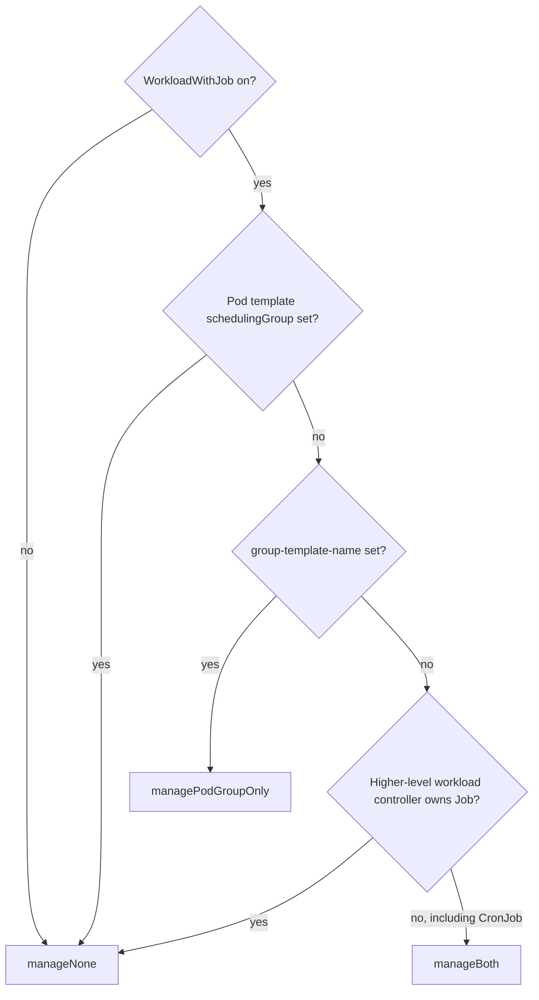
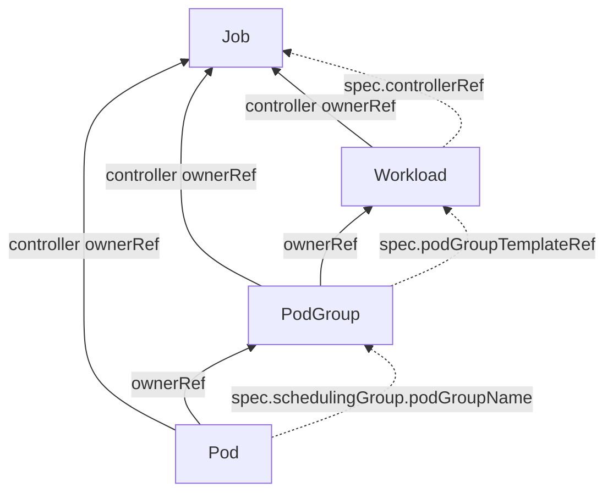
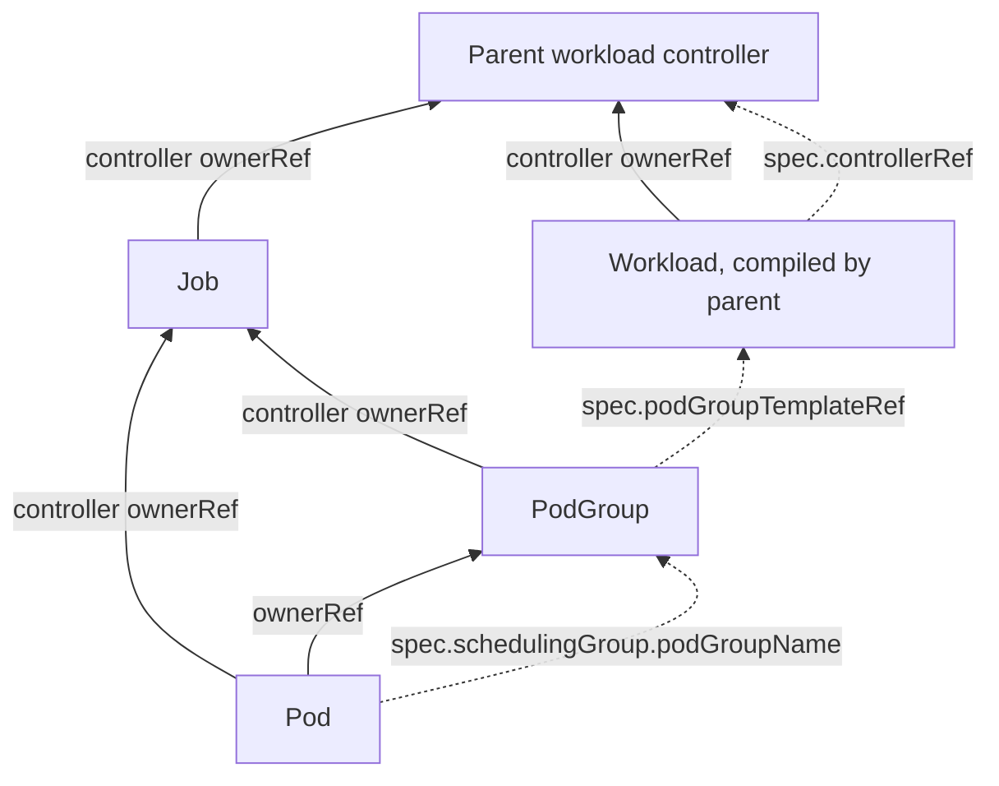

# KEP-5547: Integrate Workload APIs with Job Controller

<!-- toc -->
- [Release Signoff Checklist](#release-signoff-checklist)
- [Summary](#summary)
- [Motivation](#motivation)
  - [Goals](#goals)
  - [Non-Goals](#non-goals)
- [Proposal](#proposal)
  - [Job Integration - API Usage Examples](#job-integration---api-usage-examples)
    - [Example 1: Gang scheduling with zone topology and atomic disruption](#example-1-gang-scheduling-with-zone-topology-and-atomic-disruption)
    - [Example 2: Backward Compatibility and Defaulting (Implicit Opt-Out)](#example-2-backward-compatibility-and-defaulting-implicit-opt-out)
    - [Example 3: CronJob with Gang Scheduling](#example-3-cronjob-with-gang-scheduling)
  - [User Stories](#user-stories)
    - [ML Training Job with Gang Scheduling](#ml-training-job-with-gang-scheduling)
    - [Backward-Compatible Standard Batch Job](#backward-compatible-standard-batch-job)
  - [Notes/Constraints/Caveats](#notesconstraintscaveats)
    - [Constraints](#constraints)
  - [Risks and Mitigations](#risks-and-mitigations)
- [Design Details](#design-details)
  - [Core Principles &amp; Assumptions](#core-principles--assumptions)
  - [Job API Changes](#job-api-changes)
    - [Go Package Placement &amp; Graduation](#go-package-placement--graduation)
  - [Integration with the workloadbuilder Library](#integration-with-the-workloadbuilder-library)
    - [Library Dependency and Packaging](#library-dependency-and-packaging)
    - [Building the Logical Tree and Compiling the <code>Workload</code>](#building-the-logical-tree-and-compiling-the-workload)
    - [API Validation via the <code>workloadbuilder</code> Library](#api-validation-via-the-workloadbuilder-library)
    - [Instantiating the runtime <code>PodGroup</code>](#instantiating-the-runtime-podgroup)
    - [Reconcile Integration and Error Handling](#reconcile-integration-and-error-handling)
  - [Job Controller Changes](#job-controller-changes)
    - [Workload/PodGroup Management and Discovery](#workloadpodgroup-management-and-discovery)
    - [Controller Workflow](#controller-workflow)
    - [OwnerReferences Relationship](#ownerreferences-relationship)
    - [Defaulting Rules](#defaulting-rules)
    - [Object Creation Order](#object-creation-order)
    - [Handling Updates and Mutability](#handling-updates-and-mutability)
    - [Reconciliation Flow upon Updates](#reconciliation-flow-upon-updates)
    - [Suspend and Resume](#suspend-and-resume)
  - [Bring-your-own Workload and PodGroup](#bring-your-own-workload-and-podgroup)
  - [Naming Conventions](#naming-conventions)
  - [Deletion and Garbage Collection](#deletion-and-garbage-collection)
  - [Future Extensions](#future-extensions)
  - [Test Plan](#test-plan)
      - [Prerequisite testing updates](#prerequisite-testing-updates)
      - [Unit tests](#unit-tests)
      - [Integration tests](#integration-tests)
      - [e2e tests](#e2e-tests)
  - [Graduation Criteria](#graduation-criteria)
    - [Alpha (v1.36)](#alpha-v136)
    - [Alpha (v1.37)](#alpha-v137)
    - [Beta](#beta)
    - [GA](#ga)
    - [Deprecation](#deprecation)
  - [Upgrade / Downgrade Strategy](#upgrade--downgrade-strategy)
    - [Upgrade](#upgrade)
    - [Downgrade](#downgrade)
  - [Version Skew Strategy](#version-skew-strategy)
- [Production Readiness Review Questionnaire](#production-readiness-review-questionnaire)
  - [Feature Enablement and Rollback](#feature-enablement-and-rollback)
  - [Rollout, Upgrade and Rollback Planning](#rollout-upgrade-and-rollback-planning)
  - [Monitoring Requirements](#monitoring-requirements)
  - [Dependencies](#dependencies)
  - [Scalability](#scalability)
  - [Troubleshooting](#troubleshooting)
- [Implementation History](#implementation-history)
- [Drawbacks](#drawbacks)
- [Alternatives](#alternatives)
  - [Fallback to pod-by-pod scheduling](#fallback-to-pod-by-pod-scheduling)
  - [Bring-your-own Workload](#bring-your-own-workload)
  - [Reference-based discovery of the delegated PodGroup](#reference-based-discovery-of-the-delegated-podgroup)
  - [Deleting the Workload on suspend](#deleting-the-workload-on-suspend)
- [Infrastructure Needed (Optional)](#infrastructure-needed-optional)
<!-- /toc -->

## Release Signoff Checklist

Items marked with (R) are required *prior to targeting to a milestone / release*.

- [x] (R) Enhancement issue in release milestone, which links to KEP dir in [kubernetes/enhancements] (not the initial KEP PR)
- [x] (R) KEP approvers have approved the KEP status as `implementable`
- [x] (R) Design details are appropriately documented
- [x] (R) Test plan is in place, giving consideration to SIG Architecture and SIG Testing input (including test refactors)
  - [x] e2e Tests for all Beta API Operations (endpoints)
  - [ ] (R) Ensure GA e2e tests meet requirements for [Conformance Tests](https://github.com/kubernetes/community/blob/master/contributors/devel/sig-architecture/conformance-tests.md)
  - [ ] (R) Minimum Two Week Window for GA e2e tests to prove flake free
- [x] (R) Graduation criteria is in place
  - [ ] (R) [all GA Endpoints](https://github.com/kubernetes/community/pull/1806) must be hit by [Conformance Tests](https://github.com/kubernetes/community/blob/master/contributors/devel/sig-architecture/conformance-tests.md) within one minor version of promotion to GA
- [x] (R) Production readiness review completed
- [ ] (R) Production readiness review approved
- [x] "Implementation History" section is up-to-date for milestone
- [x] User-facing documentation has been created in [kubernetes/website], for publication to [kubernetes.io]
- [x] Supporting documentation—e.g., additional design documents, links to mailing list discussions/SIG meetings, relevant PRs/issues, release notes

## Summary

This KEP integrates the Workload-aware Scheduling (WAS) APIs (`Workload` and `PodGroup`) into the
`batch/v1` Job by adding a user-facing `spec.scheduling` field, allowing users to express explicit
scheduling intent such as gang scheduling[^1], topology co-location, and disruption policies.

The feature has gone through two alpha releases:

- **v1alpha1 (v1.36)** intentionally bypassed a user-facing API: the controller inferred a
  hardcoded `Gang` policy from the Job's type (parallel Jobs with indexed completion mode), with
  `minCount` fixed to `parallelism`.
- **v1alpha2 (v1.37)** replaced that automatic, controller-inferred model with an explicit,
  user-driven design that separates scheduling policy from workload structure. It introduced 
  the `spec.scheduling` field on the Job API, built on the reusable scheduling building blocks 
  and the shared `workloadbuilder` translation library defined in [KEP-6089], keeping the Job 
  integration consistent with the rest of the ecosystem rather than reinventing bespoke logic.

The Job controller acts as a translator, compiling `spec.scheduling` into the underlying
`Workload`/`PodGroup` objects. When `spec.scheduling` is omitted, it defaults to `Basic` 
scheduling, so the scheduling outcome of existing Jobs is preserved.

For v1.38 the integration is promoted to Beta and the `WorkloadWithJob` feature gate is enabled 
by default. Because the `spec.scheduling` field is embedded in the GA `batch/v1` API, its building 
blocks graduate straight into `scheduling.k8s.io/v1` (with Go type aliases left in `v1alpha3`) as 
described in [KEP-6089]. The Beta revision also resolves the design questions the v1alpha2 left
open and the controller exposes metrics for the `Workload`/`PodGroup` lifecycle. Default enablement
is conditional on the `GenericWorkload` gate ([KEP-4671]) being enabled by default in the same
release, since `WorkloadWithJob` depends on it.

## Motivation

The Kubernetes Job Controller historically created pods independently without workload-aware
scheduling constraints. This is a challenge for parallel applications (i.e., AI/ML training
workloads, MPI jobs) that require all pods to be scheduled and run together or none (gang
scheduling[^1]). The v1.36 alpha brought gang scheduling to the Job controller, but it did so by
inferring a hardcoded `Gang` policy from the Job's type rather than from explicit user intent.

Users have diverse use cases and require the ability to express explicit intent, such as opting
in or out of gang scheduling, requesting specific topologies, or configuring disruption policies
for their workloads. [KEP-6089] standardizes the reusable scheduling building blocks
(introduced as `scheduling.k8s.io/v1alpha3`, graduating to `scheduling.k8s.io/v1` in v1.38) and a
shared `workloadbuilder` translation library so that workload controllers can expose these
features consistently. This KEP integrates those building blocks into the core `Job` API. The same 
building blocks have been adopted by out-of-tree controllers (JobSet, LeaderWorkerSet, Kubeflow 
TrainJob, kubeRay) and proposed for `Deployment` and `StatefulSet`, which is the ecosystem feedback 
the alpha was meant to collect.

### Goals

- Add a user-facing `spec.scheduling` (`JobSchedulingConfiguration`) field to the `batch/v1` Job,
  embedding the `scheduling.k8s.io` building blocks (`schedulingPolicy`, `schedulingConstraints`, 
  `disruptionMode`, `resourceClaims`) so users can express explicit scheduling intent.
- Default to `Basic` scheduling when `spec.scheduling` is omitted, so the observable scheduling 
  outcome of existing Jobs is preserved (no all-or-nothing gate, and any number of schedulable 
  pods proceed to binding). Following the [KEP-6089], the controller still materializes a `Basic`
  `Workload`/`PodGroup`, which routes these pods through the Workload Scheduling Cycle 
  (batched scheduling and workload-aware preemption) without enforcing minCount.
- Let users opt in to `Gang` scheduling, with `minCount` defaulting to `parallelism` when omitted.
- Compile `spec.scheduling` into `Workload`/`PodGroup` objects via the shared `workloadbuilder`
  library instead of bespoke controller logic.
- Support mutable `spec.scheduling.schedulingPolicy.gang.minCount` for elastic scaling, while keeping all
  other `spec.scheduling` fields immutable after creation. This relies on [KEP-4671] that makes 
  `minCount` in `PodGroup`/`PodGroupTemplate` mutable in v1.37 to support workload scaling.
- When the Job is not the root of the workload tree (the `OwnerReference` refers to a parent
  controller that compiles and owns the `Workload`), defer `Workload` management to that parent,
  preserving the root-controller-as-compiler principle. A parent may own the `Workload` while still
  delegating `PodGroup` management to the Job (e.g., a `Job` running under a `TrainJob` that does not
  know about Jobs). The parent signals this split via [KEP-6089]'s downward-mapping annotations, so 
  a non-root controller can still create and manage the `PodGroup` for its own pods.
- Support a user pre-created `Workload` for a standalone Job through the same annotation path.
- Ensure proper ordering of `Workload` → `PodGroup` → `Pod` creation.
- Release scheduler-side resources while a Job remains suspended by deleting the runtime
  `PodGroup` together with its pods, while keeping the `Workload` template in place.

### Non-Goals

- Multi-level / nested composite (`CompositePodGroup`) structures, since this KEP covers 
single-level, flat `Job` workloads only.
- Implementing the integration in composite controllers (`JobSet`, `LWS`, `TrainJob`). Those 
  are pursued independently in their own repositories.
- Defining the `scheduling.k8s.io` building-block API or the `workloadbuilder` library 
  itself (owned by [KEP-6089] and consumed here).

## Proposal

This proposal builds on the recently introduced Workload-aware Scheduling enhancements. We assume
the reader is acquainted with the following KEPs:

- [KEP-4671]: Gang Scheduling.
- [KEP-5710]: Workload-aware preemption.
- [KEP-5732]: Topology-aware workload scheduling.
- [KEP-6089]: WAS Controller APIs.

The Job controller is extended to compile the user's scheduling intent into `Workload` and
`PodGroup` objects as part of its pod-management lifecycle, so that pods belonging to a Job are
scheduled according to the requested policy before they are created. The intent is expressed
through a new `spec.scheduling` field.

The key design principles are:

- One `Job` maps to one `PodGroup` representing a single group of pods. The `PodGroup` 
always links to a `Workload` via a `PodGroupTemplate`:
  * For a root Job it links to the `Workload` the controller compiles itself
  * For a non-root Job it links to the parent-owned `Workload`
  * The `PodGroup` links to a parent `CompositePodGroup` instance only when the parent 
  supplies the `scheduling.k8s.io/parent-compositepodgroup` annotation
- The scheduling policy comes from the user's `spec.scheduling`, not from the Job's type. When
  `spec.scheduling` is omitted, the controller defaults to the `Basic` policy.
- Following the [KEP-6089], the controller always materializes scheduling objects (a `Workload`
  and/or `PodGroup`) for an *eligible* Job — a Job the controller is responsible for when the gate is
  on: a standalone/root Job, or a non-root Job whose parent delegates the `PodGroup` (a Job whose
  parent owns both objects is skipped). This holds even for the `Basic` scheduling policy.
- For `Gang`, an omitted `minCount` defaults to the Job's `parallelism`. `minCount` is mutable to support elastic scaling; all other
  `spec.scheduling` fields are immutable after creation.
- The Job controller compiles a `Workload` only for a Job that has no parent workload controller.
  When a parent controller (e.g., `JobSet`) owns the Job, the parent compiles the `Workload` and
  the Job controller never creates one. The `scheduling.k8s.io/group-template-name` annotation on
  the Job then decides who creates the runtime `PodGroup`:
  * with the annotation, the Job controller creates it from the named template in the parent's `Workload`.
  * without it, the parent creates it and the Job controller creates nothing.
- The same annotation on a standalone BYO Job points the controller at a user pre-created   
  `Workload` instead of compiling one.
- Jobs created by `CronJob` are standalone (no parent-workload `OwnerReference`); the Job controller
  creates one `Workload` and one `PodGroup` per Job for them based on each Job's `spec.scheduling`.
- Discovery and lifecycle are separate: 
  * A root Job discovers its objects through API references (`Workload.spec.controllerRef`, 
  `PodGroup.spec.podGroupTemplateRef`), which are unique per Job because the Job owns 
  the `Workload`. 
  * A delegated Job discovers the external `Workload` through `spec.controllerRef` and its own 
  `PodGroup` by a deterministic name derived from the Job, since sibling Jobs sharing 
  a template have identical references. 
  * ownerReferences govern garbage collection only and play no part in discovery. 
  * The controller mutates or deletes an object only when its controller `ownerReference` is 
  the Job.
- Every Job gets its own runtime `PodGroup`. Sibling Jobs that select the same `PodGroupTemplate`
  (e.g. the replicas of a JobSet `ReplicatedJob`) instantiate distinct `PodGroup`s from it, one
  per Job.

The `spec.scheduling` field embeds the building blocks from `scheduling.k8s.io/v1`, while the 
runtime `Workload`/`PodGroup` objects the controller creates are served from 
`scheduling.k8s.io/v1beta1` ([KEP-4671]). The examples below use those versions.

### Job Integration - API Usage Examples

#### Example 1: Gang scheduling with zone topology and atomic disruption

A distributed training `Job` whose 4 pods must schedule together (all-or-nothing), co-locate within
the same availability zone, and be disrupted together (if one pod is preempted, the whole group is):

```yaml
apiVersion: batch/v1
kind: Job
metadata:
  name: <job-name>
  namespace: training
spec:
  parallelism: 4
  completions: 4
  completionMode: Indexed
  scheduling:               # New API field - scheduling intent
    schedulingPolicy:
      gang: {}              # minCount omitted -> defaults to parallelism (4)
    schedulingConstraints:
      topology:
        - level: "topology.kubernetes.io/zone"
    disruptionMode:
      all: {}               # entire group must be disrupted together
  template:
    spec:
      containers:
      - name: trainer
        image: training-image:latest
        resources:
          limits:
            nvidia.com/gpu: 1
```

The Job controller compiles this intent into a `Workload` and its runtime `PodGroup`:

```yaml
apiVersion: scheduling.k8s.io/v1beta1
kind: Workload
metadata:
  name: <job-name>-<hash>
  namespace: training
  ownerReferences:
  - apiVersion: batch/v1
    kind: Job
    name: <job-name>
    uid: <job-uid>
    controller: true
spec:
  controllerRef:
    apiVersion: batch/v1
    kind: Job
    name: <job-name>
  podGroupTemplates:
  - name: <podGroupTemplateName>
    schedulingPolicy:
      gang:
        minCount: 4         # defaulted from Job.spec.parallelism
    schedulingConstraints:
      topology:
        - level: "topology.kubernetes.io/zone"
    disruptionMode:
      all: {}
---
apiVersion: scheduling.k8s.io/v1beta1
kind: PodGroup
metadata:
  name: <workload-name>-<podGroup-template-name>-<hash>
  namespace: training
  ownerReferences:
  - apiVersion: batch/v1
    kind: Job
    name: <job-name>
    uid: <job-uid>
    controller: true
  - apiVersion: scheduling.k8s.io/v1beta1
    kind: Workload
    name: <workload-name>
    uid: <workload-uid>
spec:
  podGroupTemplateRef:
    workload:
      workloadName: <workload-name>
      podGroupTemplateName: <podGroup-template-name>
  schedulingPolicy:
    gang:
      minCount: 4
```

#### Example 2: Backward Compatibility and Defaulting (Implicit Opt-Out)

A standard Job that omits the `scheduling` block. It defaults to `Basic` scheduling. Per 
the [KEP-6089], the controller does not impose all-or-nothing, so the scheduling 
outcome matches a standard Job (batched scheduling cycle, no minCount enforcement):

```yaml
apiVersion: batch/v1
kind: Job
metadata:
  name: <job-name>
  namespace: batch
spec:
  parallelism: 10
  completions: 10
  # The scheduling block is omitted, which defaults to Basic scheduling. 
  # This acts as an implicit opt-out from gang scheduling.
  template:
    spec:
      containers:
      - name: processor
        image: processor-image:v1
```

This compiles into a `Basic` scheduling policy:

```yaml
apiVersion: scheduling.k8s.io/v1beta1
kind: Workload
metadata:
  name: <job-name>-<hash>
  namespace: batch
  ownerReferences:
  - apiVersion: batch/v1
    kind: Job
    name: <job-name>
    uid: <job-uid>
    controller: true
spec:
  controllerRef:
    apiVersion: batch/v1
    kind: Job
    name: <job-name>
  podGroupTemplates:
  - name: <podGroup-template-name>
    schedulingPolicy:
      basic: {}
---
apiVersion: scheduling.k8s.io/v1beta1
kind: PodGroup
metadata:
  name: <workload-name>-<podGroup-template-name>-<hash>
  namespace: batch
  ownerReferences:
  - apiVersion: batch/v1
    kind: Job
    name: <job-name>
    uid: <job-uid>
    controller: true
  - apiVersion: scheduling.k8s.io/v1beta1
    kind: Workload
    name: <workload-name>
    uid: <workload-uid>
spec:
  podGroupTemplateRef:
    workload:
      workloadName: <workload-name>
      podGroupTemplateName: <podGroup-template-name>
  schedulingPolicy:
    basic: {}
```

#### Example 3: CronJob with Gang Scheduling

A `CronJob` that periodically runs a gang-scheduled training Job. Each `Job` created by the
`CronJob` is treated as standalone. `CronJob` does not create or manage `Workload` objects,
the Job controller creates a separate `Workload` and `PodGroup` per `Job`. These objects are
garbage-collected when each `Job` completes or is deleted.

```yaml
apiVersion: batch/v1
kind: CronJob
metadata:
  name: periodic-training
  namespace: training
spec:
  schedule: "0 */6 * * *"
  jobTemplate:
    spec:
      parallelism: 4
      completions: 4
      completionMode: Indexed
      scheduling:
        schedulingPolicy:
          gang: {}            # minCount defaults to parallelism (4) per Job
      template:
        spec:
          containers:
          - name: trainer
            image: training-image:latest
            resources:
              limits:
                nvidia.com/gpu: 1
```

Each `Job` created by this `CronJob` produces its own `Workload` and `PodGroup`, compiled from
the Job's `spec.scheduling`.
If the `CronJob`'s `jobTemplate` omits the `scheduling` block, each `Job` defaults to `Basic`.

In all cases, the Job controller then creates the pods and sets the `schedulingGroup` field so the
scheduler can associate each pod with its `PodGroup`:

```yaml
apiVersion: v1
kind: Pod
metadata:
  name: <job-name>-<random-suffix>
  namespace: <namespace>
  ownerReferences:
  - apiVersion: batch/v1
    kind: Job
    name: <job-name>
    uid: <job-uid>
    controller: true
  - apiVersion: scheduling.k8s.io/v1beta1
    kind: PodGroup
    name: <podGroup-name>
    uid: <podGroup-uid>
spec:
  schedulingGroup:
    podGroupName: <workload-name>-<podGroup-template-name>-<hash>
  containers:
  - name: ...
```

### User Stories

#### ML Training Job with Gang Scheduling

As a machine learning engineer, I want to run a distributed training job with 8 workers that must
all be scheduled together. I set `spec.scheduling.schedulingPolicy.gang` on the Job (optionally with a
topology constraint to co-locate the workers), so that if only 7 workers can be scheduled, no pods
start and no resources are wasted. I do not have to set `parallelism` and `completions`
in a specific way to "qualify" for gang scheduling; I declare my intent explicitly.

#### Backward-Compatible Standard Batch Job

As a data engineer, I want to run a batch processing job that processes files independently without
gang scheduling requirements. I omit `spec.scheduling` entirely (or set `spec.scheduling.schedulingPolicy.basic`
explicitly for the same effect), so the Job defaults to `Basic` scheduling. The observable scheduling
outcome matches a standard Job, while a `Basic` `Workload`/`PodGroup` is still materialized, giving me consistent objects to observe its scheduling state.

### Notes/Constraints/Caveats

#### Constraints

- The integration targets single-level `Job` workloads: one `Job` maps to one `PodGroup`, and all
  pods in the `Job` share a single scheduling policy. A Job-owned `Workload` therefore has exactly 
  one `PodGroupTemplate`, while heterogeneous groups belong in a composite controller. Instantiating
  several `PodGroup`s from a single template within one Job (e.g. one gang per TPU slice) is a known
  use case deferred to a follow-up KEP, see [Future Extensions](#future-extensions).
- Sibling Jobs whose annotations name the same `PodGroupTemplate` (e.g. the replicas of a JobSet
  `ReplicatedJob`, see
  [JobSet KEP-969](https://github.com/kubernetes-sigs/jobset/blob/main/keps/969-WAS-integration/README.md#naming-convention)) each get their own runtime `PodGroup`, named after the Job, and therefore form independent gangs. 
 If the parent wants several Jobs in one gang, it must create that `PodGroup` itself and set 
 `spec.template.spec.schedulingGroup` on the child Jobs.
- `spec.scheduling.schedulingPolicy.gang.minCount` is mutable to support elastic scaling ([KEP-4671]); all 
  other `spec.scheduling` fields are immutable after creation.
- The Job controller creates `Workload`/`PodGroup` objects for every eligible Job, including
  `Basic` ones. The only way to avoid the objects entirely is to disable the feature gate. 
  By default, an end user gets the original scheduling outcome even though a `Basic` 
  `Workload`/`PodGroup` is still created.
- The controller manages only objects whose controller `ownerReference` is the Job. Pre-created 
  objects are used as-is and never adopted.

### Risks and Mitigations

- **Split-brain configuration.** A composite wrapper controller (such as `JobSet` or `TrainJob`)
  may expose its own scheduling fields while the child `Job` now also has native `spec.scheduling`
  fields, letting a user configure scheduling in two conflicting places. 
  * *Mitigation:* the parent controller remains the sole compiler of the workload tree and can map 
  its own fields onto the compiled `Workload`, strip/ignore the child's nested scheduling fields, 
  or reject requests that populate both. The parent controller selects the authoritative 
  `PodGroupTemplate` and decides whether the Job creates its own `PodGroup` or uses the 
  `schedulingGroup` already placed on its pod template. The Job controller never reconciles 
  the child Job's `spec.scheduling` into a parent-owned `Workload`.

- **Increased object count.** Because the controller now materializes a `Workload`/`PodGroup` for
  every eligible Job, the number of scheduling objects grows relative to the v1.36 alpha, which 
  only created objects for inferred gang Jobs. With the gate enabled by default from v1.38, this 
  applies to every cluster, not only to those that opted in.
  * *Mitigation:* objects are small and garbage-collected with the Job. The Scalability section 
  quantifies the impact, the feature can still be disabled with the `WorkloadWithJob` gate, and performance tests
  covering Job creation throughput with the gate on are a Beta requirement.

- **Behavior change between alphas.** Jobs that were automatically gang-scheduled in v1.36 default
  to `Basic` in v1.37 unless the user sets `spec.scheduling.schedulingPolicy.gang`. 
  * *Mitigation:* gang is now an explicit opt-in; this is documented in the 
  [Upgrade / Downgrade Strategy](#upgrade--downgrade-strategy) and release notes.

- **Suspended Jobs and resource release.** In v1alpha2 the controller relied only on GC, which does
  not release resources associated with a runtime `PodGroup` (e.g. DRA claims) while a Job is suspended.
  * *Mitigation:* from Beta the controller deletes the runtime `PodGroup` together with the
  suspended Job's pods and recreates it on resume, while retaining the `Workload`. See
  [Suspend and Resume](#suspend-and-resume).

- **Job blocked on unsupported scheduling objects.** The controller cannot safely determine which
  scheduling constraints to apply when a root Job finds more than one `Workload` or `PodGroup`
  referencing it, when a `Workload` has an unsupported shape, or when the object at a delegated
  Job's deterministic `PodGroup` name does not reference the selected template. This can result
  from a change to controller-owned objects, a name collision, or a bug in a higher-level
  controller. The Job should not run in this case and must wait until the issue is resolved.
  * *Mitigation:* the controller blocks new pod creation and reports the problem through a
  Warning event and the `SchedulingBlocked` Job condition until an operator repairs the objects.

- **Pod creation latency for gangs.** The Job controller creates pods in slow-start batches
  (1, 2, 4, ...), so a gang of `minCount` pods is fully created only after `ceil(log2(minCount))`
  rounds and the scheduler cannot admit the gang before then.
  * *Mitigation:* the scheduler, not the controller, enforces all-or-nothing, so the batching adds
  bounded latency rather than incorrect behavior. Batching stays unchanged for Beta. Performance tests 
  measure time-to-first-schedule for gang Jobs so the trade-off can be revisited with data.

## Design Details

### Core Principles & Assumptions

The integration follows the Workload-aware Scheduling design principles from [KEP-6089] for the 
single-level `Job`:

- **The Root Controller is the Compiler.** By default, the Job controller compiles and manages the
  scheduler-facing `Workload` for a scheduling-root Job, including Jobs created by `CronJob`.
  When `scheduling.k8s.io/group-template-name` selects a template in an external `Workload`
  (parent-owned or user pre-created), that `Workload` is the authoritative compiler output. The
  Job controller may still create and manage the runtime `PodGroup` without owning the `Workload`,
  but it never adopts or mutates the external `Workload`.
- **Universal Representation.** Standard pod-by-pod scheduling is a first-class policy (`Basic`).
  The controller always emits a `Workload`/`PodGroup` for an eligible Job, using `Basic` as the 
  backward-compatible default. `Basic` keeps the standard scheduling outcome, 
  while still participating in the Workload Scheduling Cycle, without enforcing minCount.
- **Sane Defaults and Escape Hatches.** A `Job` defaults to `Basic`.

### Job API Changes

To deliver native, typed Workload-aware Scheduling on core Kubernetes, we add a new `Scheduling`
field to `JobSpec`. This integration is the foundational, single-level implementation that
demonstrates the building blocks before out-of-tree controllers adopt them.

We introduce a new optional `Scheduling` field in `JobSpec` that embeds a curated composition of
the standardized building blocks:

```go
// API Group: batch/v1

// JobSpec defines the desired state of a Job.
type JobSpec struct {
    // ... existing fields ...

    // Scheduling defines the Workload-aware Scheduling configuration for this Job.
    // This field is beta-gated by the WorkloadWithJob feature gate (enabled by
    // default since v1.38).
    // +optional
    Scheduling *JobSchedulingConfiguration `json:"scheduling,omitempty"`
}

// JobSchedulingConfiguration composes the reusable WAS building blocks. The
// field names mirror the scheduler-facing PodGroupSpec 1:1 rather than being
// shortened, so the Job surface reads the same as the compiled PodGroup.
type JobSchedulingConfiguration struct {
    // SchedulingPolicy defines the gang or basic scheduling rules for this Job.
    // Exactly one of Basic or Gang must be set. Immutable after creation: the
    // policy may not be added or removed, and the basic/gang variant may not be
    // switched. Only gang.minCount may change.
    // +optional
    SchedulingPolicy *schedulingv1.WorkloadPodGroupSchedulingPolicy `json:"schedulingPolicy,omitempty"`

    // SchedulingConstraints defines topology co-location constraints for the
    // Job's pods. Immutable after creation.
    // +optional
    SchedulingConstraints *schedulingv1.WorkloadPodGroupSchedulingConstraints `json:"schedulingConstraints,omitempty"`

    // DisruptionMode specifies how the pods in this Job should be disrupted
    // (Single vs All). Immutable after creation.
    // +optional
    DisruptionMode *schedulingv1.WorkloadPodGroupDisruptionMode `json:"disruptionMode,omitempty"`

    // ResourceClaims specifies dynamic resource claims shared across the Job's
    // pods. Immutable after creation.
    // +optional
    ResourceClaims []schedulingv1.WorkloadPodGroupResourceClaim `json:"resourceClaims,omitempty"`
}

// SchedulingBlocked indicates that the controller cannot safely create pods
// because the scheduling objects for the Job are missing, ambiguous, or have
// an unsupported structure. This is a non-terminal condition and is cleared
// after the scheduling objects are repaired.
const JobSchedulingBlocked JobConditionType = "SchedulingBlocked"
```

The building blocks are the versioned `scheduling.k8s.io/v1` types, embedded directly by 
both the internal and versioned `batch` API. There are no internal `batch`-owned copies 
of the building blocks; the internal `JobSchedulingConfiguration` references the `schedulingv1` 
types as-is, so a single `workloadbuilder` mapping serves both the API validation and the 
controller.

The `Scheduling` field is gated by the existing `WorkloadWithJob` feature gate. Standard
field-gating semantics apply: when the gate is disabled, the API server clears `spec.scheduling` on
create and ignores it on update (preserving an already-set value on the stored object), and the
field's validation and the controller's compilation (including its compile-time resolution of unset
fields; the api-server does not default `spec.scheduling`) only run when the gate is enabled. From
v1.38 the gate is enabled by default, so this path is only taken by clusters that opt out.

This typed, user-facing field replaces the v1.36 alpha's implicit mechanisms: the type-based
automatic policy inference and the `spec.template.spec.schedulingGroup`-based opt-out are no longer
how users express or suppress scheduling intent.

#### Go Package Placement & Graduation

Embedding a pre-stable `scheduling.k8s.io/v1alpha3` type inside the GA `batch/v1.JobSpec` was
permitted while the `Scheduling` field itself remained alpha-gated. Promoting the field to
default-enabled commits its wire format at the `v1` resource level, and API conventions draw no
distinction between Beta and GA for a struct embedded in a `v1` resource. Following the transition
pattern in [KEP-6089], v1.38 therefore:

- updates the `batch/v1.JobSpec` field to reference the `v1` types
- leaves Go type aliases (`type WorkloadPodGroupSchedulingPolicy = schedulingv1.WorkloadPodGroupSchedulingPolicy`,
  etc.) in `k8s.io/api/scheduling/v1alpha3` so third-party controllers that still import the alpha
  package continue to compile and serialize identically.

### Integration with the workloadbuilder Library

The Job controller compiles `spec.scheduling` into a `Workload` using the `workloadbuilder` library.

#### Library Dependency and Packaging

The building-block types live in the API staging repo (`k8s.io/api/scheduling/v1`). The `workloadbuilder`
library lives separately in `k8s.io/component-helpers/scheduling/schedulingv1/workloadbuilder`, so it can 
be vendored by both in-tree and out-of-tree controllers. The Job controller consumes these entrypoints:

- `NewBuilder(root *WorkloadItem, opts BuildOptions)` and `(*Builder).BuildWorkload()` to compile
  the `Workload` from `spec.scheduling`
- `NewBuilderFromExistingWorkload(workload, opts)` to recompile against a persisted `Workload`
  (elastic resize, delegated `PodGroup`, resume after suspend)
- `(*Builder).NewPodGroup(podGroupName, templateName)` to instantiate the runtime `PodGroup` from
  a template
- `(*Builder).Validate(ctx, ValidationInput)` from API validation

If the library API shifts, the Job integration tracks those changes through the shared dependency
rather than maintaining its own copy.

#### Building the Logical Tree and Compiling the `Workload`

The controller assembles the logical tree and compiles it in these steps: 
  1. Build a `workloadbuilder.WorkloadInput` from `spec.scheduling` via `jobutil.WorkloadInput`,
    mapping `schedulingPolicy`/`schedulingConstraints`/`disruptionMode`/`resourceClaims` onto the
    library's per-block inputs (with their field paths for error reporting).
  2. Assemble a single-node `WorkloadItem` via `jobutil.WorkloadItemForJob`, whose `DefaultConfig`
    resolves an absent policy to `Basic` and whose callback defaults an unset gang `minCount` to
    `spec.parallelism` (clamped to `>= 1`).
  3. Invoke `NewBuilder(item, BuildOptions{Owner: <controllerRef to Job>, AllowedPolicies: ...,
    AllowedDisruptionModes: ...}).BuildWorkload()`. The controller-owner `OwnerReference` makes
    the emitted `Workload` GC with the Job.

For a `PodGroup` created from an external `Workload`, an update against a controller-owned `Workload`, or a
`PodGroup` recreated on resume, the controller uses `NewBuilderFromExistingWorkload(workload, BuildOptions{...})` 
so it recompiles against the already-persisted template instead of re-deriving it from scratch.

#### API Validation via the `workloadbuilder` Library

`spec.scheduling` is validated in three complementary layers, all self-contained:

1. **Declarative validation (DV) on the building blocks** owns the structural rules and most of the
   immutability. Because the `batch` API embeds the versioned `scheduling.k8s.io/v1` building
   blocks directly, their DV markers apply unchanged.
2. **Hand-written `batch` validation** covers the cross-cutting rules DV cannot express:
   * `validateGangMinCount` rejects a gang `minCount` greater than `spec.parallelism`. A gang larger
     than the pod count can never be satisfied and the Job would stall with pending pods, so it is
     rejected at admission rather than surfacing only at runtime. It runs on create and update and
     for Jobs embedded in a `CronJob` `jobTemplate`. An elastic scale-up that raises
     `spec.parallelism` and `gang.minCount` in the same request is validated against the final state.
   * `validateJobSchedulingUpdate` freezes the basic/gang policy after creation. DV keeps
     the policy present but cannot forbid an in-place switch between `basic` and `gang`, so only
     `gang.minCount` may change.
   * `spec.scheduling` is rejected when `spec.template.spec.schedulingGroup` is set, because the
     user's `PodGroup` is authoritative and `spec.scheduling` would have no effect. This applies on
     create and on update, unless the old object already had both fields (v1.37 alpha).
3. **`workloadbuilder` semantic validation** owns the consistency rules that must stay identical to
   what the controller compiles. Validation builds the same `WorkloadItem` tree the controller does 
   and calls `NewBuilder(...).Validate()`. This runs the builder's allow-list checks. In-tree 
   it is constructed with `BuildOptions{DisableDeclarativeValidation: true}` because the api-server already ran DV on the
   versioned building blocks, so `Validate` here neither re-runs DV, compiles the `Workload`, nor
   needs an owner.

#### Instantiating the runtime `PodGroup`

`BuildWorkload` returns only the `Workload` (the scheduling template); it does not create the runtime
`PodGroup`. After the `Workload` exists on the API server, the Job controller instantiates the
`PodGroup` from the `Workload`'s single `PodGroupTemplate`. For a Job there is exactly one template,
so the controller creates one `PodGroup` that references the template and carries two
ownerReferences — a controller ref to the `Job` (so it is GC'd with the Job) and a non-controller
ref to the `Workload`. The same `NewPodGroup` path is used when the `PodGroup` is recreated on
resume, with the retained `Workload` as input.

Pods are then created by the existing Job pod-management logic with
`pod.Spec.SchedulingGroup.PodGroupName` set to the `PodGroup`'s name, which is what the scheduler
keys on for gang/topology behavior.

#### Reconcile Integration and Error Handling

The scheduling reconcile path is invoked from the Job reconcile loop, gated on the
`WorkloadWithJob` feature gate, before pod management runs. Creation eligibility depends on the
management mode and lifecycle phase, as described in [Controller Workflow](#controller-workflow).
The integration is designed to be idempotent and crash-safe:

- **Discovery first:** the controller looks up an existing `Workload`/`PodGroup` before compiling, 
  either via `spec.controllerRef` / `spec.podGroupTemplateRef` for a root Job or by deterministic 
  name for a delegated `PodGroup`. A restart between creating the `Workload` and the `PodGroup` 
  therefore does not produce duplicates, and a create that races with informer lag fails with 
  `AlreadyExists` and is retried against the now-visible object.
- **Ordering:** `Workload` is created (or found) before the `PodGroup`, and both before pods, so
  references always resolve.
- **Invalid `spec.scheduling`:** a compilation error from `BuildWorkload` is terminal for that spec.
  Because `spec.scheduling` is immutable, the controller fails the Job without creating pods, with
  reason `FailedWorkloadCompilation` on both the `Failed` condition and the Warning event. The user 
  recreates the Job with a valid `spec.scheduling`. API validation runs the same `workloadbuilder` 
  checks, so this is not expected after admission.
- **API errors are retryable:** an API error creating the `Workload`/`PodGroup` emits
  `FailedWorkloadCreate` and requeues the Job with backoff, blocking pod creation until the write
  succeeds.
- **Blocking:** two situations stop pod creation without failing the Job. In both, the controller
  sets the non-terminal `SchedulingBlocked=True` condition through a dedicated status update (so
  `status.startTime` and other lifecycle fields are untouched), emits a Warning event, increments
  `job_scheduling_object_syncs_total{result="error"}`, and returns an error so the Job is requeued
  with backoff. No new pods are created until the next successful reconciliation clears the condition.
  - *Missing external dependency* (`managePodGroupOnly` only): event `SchedulingDependencyNotFound`,
    reason `WorkloadNotFound` or `PodGroupTemplateNotFound`. The creation window stays open so the
    `PodGroup` is created once the dependency appears.
  - *Unsupported or ambiguous objects*: event and reason `UnsupportedWorkloadStructure`. An
    operator must remove the duplicate or repair the object.
- **Updates:** on a `gang.minCount` (or `parallelism`-driven) change the controller recompiles the
  desired `Workload` (`NewBuilderFromExistingWorkload(...).BuildWorkload`) and patches the delta to
  the existing object, then patches the size onto the runtime `PodGroup`.
- **Suspend/resume:** the runtime `PodGroup` is the only object the controller deletes explicitly.

### Job Controller Changes

The Job controller reconciliation loop that processes each Job will be extended to ensure `Workload`
and `PodGroup` objects exist before creating pods.

Before doing any work, the controller classifies each Job into one of three management modes,
which determines how much of the scheduling tree it owns. The supported scenarios are:

- **`manageBoth`**: The controller compiles and owns both the `Workload` and runtime `PodGroup` from 
  `spec.scheduling`. Jobs created by `CronJob` are scheduling roots even though they have a controller
  `ownerReference`.
- **`managePodGroupOnly`**: the Job carries the `scheduling.k8s.io/group-template-name` annotation.
  The controller discovers the external `Workload`, uses the named `PodGroupTemplate`, and creates 
  the runtime `PodGroup` only.
- **`manageNone`**: the controller creates nothing and only stamps pods with whatever
  `schedulingGroup` the pod template already carries. This mode is selected when any of the
  following holds:
  - `spec.template.spec.schedulingGroup` is set (bring-your-own `PodGroup`): the user manages the
    objects.
  - A higher-level workload controller (e.g. JobSet) owns the Job and no 
    `scheduling.k8s.io/group-template-name` annotation is present. The parent controller owns 
    both scheduling objects and has set `schedulingGroup` on the pod template itself.
  - The `WorkloadWithJob` feature gate is disabled.


```mermaid
flowchart TD
    gate{WorkloadWithJob on?} -->|no| none[manageNone]
    gate -->|yes| sg{Pod template schedulingGroup set?}
    sg -->|yes| none
    sg -->|no| ann{group-template-name set?}
    ann -->|yes| pgOnly[managePodGroupOnly]
    ann -->|no| parent{Higher-level workload controller owns Job?}
    parent -->|yes| none
    parent -->|no, including CronJob| both[manageBoth]
```

#### Workload/PodGroup Management and Discovery

Discovery follows spec fields from the scheduling objects back to the Job, except for the
delegated `PodGroup`, which is found by name. It never uses `ownerReferences`, because a
higher-level controller may create objects before the Job exists. `ownerReferences` only govern
garbage collection and whether the Job controller may mutate or delete an object.

A `Workload` is considered the Workload for this Job object if:
- it is in the Job's namespace
- its `spec.controllerRef` points at this Job, or at the parent workload controller for a
  delegated Job. This is the only handle a delegated Job has, since [KEP-6089] defines no
  annotation for the `Workload` name.

A `PodGroup` is considered the `PodGroup` for this Job if:
- it is in the Job's namespace
- in `manageBoth`, its `spec.podGroupTemplateRef` names the Job-owned `Workload` and template,
  which no other Job can reference.
- in `managePodGroupOnly`, its name is `GeneratePodGroupName(workloadName, templateName, job.UID)`.
  Sibling Jobs selecting the same template (e.g. JobSet `ReplicatedJob` replicas) have identical
  `spec.podGroupTemplateRef`s, so only the name tells them apart.

The Job is blocked with `UnsupportedWorkloadStructure` if:
- a root Job matches more than one `Workload` or `PodGroup`
- a root Job's `Workload` does not have exactly one template
- in `manageBoth`, the matching `Workload` is an external one and the Job has no
  `scheduling.k8s.io/group-template-name` annotation, or
- a delegated Job's `PodGroup` name is taken by an object referencing a different template

The Job is blocked and retried with `WorkloadNotFound` or `PodGroupTemplateNotFound` while the
external `Workload`, or the template named by `scheduling.k8s.io/group-template-name` in it, does
not exist yet.

When `spec.template.spec.schedulingGroup.podGroupName` is set (`manageNone`), the controller uses
that name as-is and performs no discovery.

#### Controller Workflow

The Job controller attempts to create the `Workload` and `PodGroup` only when the Job has no pods
associated with it (no active or terminal pods owned by the Job). If the Job already has one or
more pods, the controller only discovers and uses the existing `Workload`/`PodGroup`, if any, and
does not create new ones. This rule is important for correctness when the controller restarts or
is upgraded in the middle of the workflow (i.e., after creating the `Workload` but before creating
the `PodGroup` or pods). On the next sync, the controller finds the existing objects via the
listers and continues.

A suspended Job follows the same workflow and gets its `Workload` created. Its `PodGroup` is
created only on resume.

The controller discovers or creates `Workload` and `PodGroup` as follows:

1. Determine the management mode:
   - In `manageNone`, the controller stops here and pods keep whatever `schedulingGroup` the pod
   template carries.
   - In `managePodGroupOnly` (skip steps 3 and 4), the `Workload` is external and is never
   adopted, recompiled, mutated, or deleted. If it or the named template does not exist yet, the
   controller sets `SchedulingBlocked=True` and retries, and the creation window stays open.
2. If the Job already has pods (active or terminal pods owned by this Job), skip creation and only
   discover existing objects.
3. Look up existing `Workload`(s) whose `spec.controllerRef` points to this Job.
   - If none found, compile a `Workload` from the Job's `spec.scheduling` and create it with a
   controller `ownerReference` and `spec.controllerRef` pointing to this Job.
   - If more than one, or if the only one does not have exactly one `PodGroupTemplate`, block
   (`UnsupportedWorkloadStructure`).
   - If exactly one, that is the `Workload` for this Job. Its `ownerReferences` are not changed.
4. When creating a new `Workload`, the controller derives the scheduling policy from the Job's
   `spec.scheduling` rather than from the Job's type. It maps `spec.scheduling` into the
   `workloadbuilder` library, which applies the defaulting rules (defaulting to `Basic`, defaulting
   `Gang.minCount` to `parallelism`) and compiles the `Workload`. This happens for every eligible
   Job, including those that default to `Basic`.
5. Look up the `PodGroup` for the target `PodGroupTemplate` per the discovery rules above (by
   `spec.podGroupTemplateRef` in `manageBoth`, by deterministic name in `managePodGroupOnly`).
   - If none found, instantiate a `PodGroup` from that `Workload` and template and create it under
   its deterministic name with a controller `ownerReference` to the `Job` in both modes. When the
   `scheduling.k8s.io/parent-compositepodgroup` annotation is present, link it to that parent
   `CompositePodGroup` instance. An `AlreadyExists` error (informer lag) requeues the Job and the
   next sync finds the object.
   - If more than one (`manageBoth`), or if the object at the deterministic name references a
   different `Workload` or template (`managePodGroupOnly`), block (`UnsupportedWorkloadStructure`).
   - If exactly one, that is the `PodGroup` for this Job. Its `ownerReferences` are not changed.
   `gang.minCount` is reconciled only when the Job is the controller owner, which is the case for
   every `PodGroup` the Job controller created.
6. Execute the existing pod-management logic to create pods, including `schedulingGroup.podGroupName`
   in the pod spec to associate pods with the `PodGroup`. This step is not reached while the Job
   is blocked. If the Job already has active pods without `schedulingGroup` (created while the
   gate was off), new pods are created without it too and a `MixedSchedulingGroup` Warning event
   is emitted once, so a gang is never half-grouped.

The controller requires informers, listers and indexers for `Workload` and `PodGroup` objects.
Both `Workload` and `PodGroup` are automatically garbage collected when they were created by the Job
controller and the corresponding Job is deleted.

#### OwnerReferences Relationship

The ownerReferences relationship between `Job`, `Workload`, `PodGroup`, and `Pod` depends on the
management mode.

**Root Job (`manageBoth`):**


```mermaid
flowchart BT
    Pod[Pod]
    PodGroup[PodGroup]
    Workload[Workload]
    Job[Job]

    Pod -->|"controller ownerRef"| Job
    Pod -->|"ownerRef"| PodGroup
    PodGroup -->|"controller ownerRef"| Job
    PodGroup -->|"ownerRef"| Workload
    Workload -->|"controller ownerRef"| Job
    Workload -.->|"spec.controllerRef"| Job
    PodGroup -.->|"spec.podGroupTemplateRef"| Workload
    Pod -.->|"spec.schedulingGroup.podGroupName"| PodGroup
```

**Delegated Job (`managePodGroupOnly` under a parent workload controller):**


```mermaid
flowchart BT
    Pod[Pod]
    PodGroup["PodGroup"]
    Workload["Workload, compiled by parent"]
    Job[Job]
    Parent[Parent workload controller]

    Pod -->|"controller ownerRef"| Job
    Pod -->|"ownerRef"| PodGroup
    Job -->|"controller ownerRef"| Parent
    PodGroup -->|"controller ownerRef"| Job
    Workload -->|"controller ownerRef"| Parent
    Workload -.->|"spec.controllerRef"| Parent
    PodGroup -.->|"spec.podGroupTemplateRef"| Workload
    Pod -.->|"spec.schedulingGroup.podGroupName"| PodGroup
```

- The `Workload` has a controller ownerReference to the `Job` only when the Job controller created it.
- The `PodGroup` links to its `Workload` via `spec.podGroupTemplateRef`. When the Job controller
  creates it, the controller ownerReference points to the Job in both modes, so a delegated
  `PodGroup` is garbage collected with its Job. A parent-owned `Workload` is never given an
  ownerReference from the `PodGroup`.
- The `Pod` has a controller ownerReference to the `Job` and a non-controller one to the `PodGroup`.

A user pre-created `Workload` follows the delegated diagram without the parent.

The Job controller never adds ownerReferences to objects it did not create. Garbage collection
follows the solid edges, so no Pod is left with a stale `PodGroup` reference.

#### Defaulting Rules

These rules are applied by the controller when it compiles the
`Workload`/`PodGroup`; they are not api-server field defaulting. 
This is a controller-side resolution that is required to resolve the unset case anyway.

- **`Scheduling` unset → `Basic`.** Existing and non-WAS Jobs carry no `spec.scheduling`, the
  controller resolves the absent policy to `Basic`, preserving their behavior.
- **`Scheduling` set but `SchedulingPolicy` nil → `Basic`.** `WorkloadPodGroupSchedulingPolicy` is a 
  discriminated union for which the compiled `PodGroup` must carry exactly one concrete policy, so a
  nil `SchedulingPolicy` is resolved to `Basic`.
- **`Gang` with `MinCount` unset → `MinCount = parallelism`.** Done controller-side only 
without persisting the derived value back onto the Job spec because writing it back would make a 
user-set `minCount` indistinguishable from the default on later updates, where `minCount` is mutable.
The controller clamps this default to a minimum of 1 (a suspended Job may have `parallelism = 0`,
but a gang `minCount` must be positive).

Optional modifiers (`DisruptionMode`, `SchedulingConstraints`, `ResourceClaims`) are deliberately not
defaulted. Unlike `SchedulingPolicy`, these are optional fields whose absence is a defined state. A nil `DisruptionMode` resolves to standard per-pod (`Single`) disruption, a nil `SchedulingConstraints`
means no topology co-location, and a nil `ResourceClaims` means no shared claims.

#### Object Creation Order

The Job controller creates objects in the following order so that references point to existing objects and to satisfy any API validation that `Workload` exists before `PodGroup` is created. The order is as follows:
1. `Workload` object which will reference the `Job`.
2. `PodGroup` object which will reference the `Workload` and the `Job`.
3. `Pod` objects which will reference `PodGroup`.

The kube-scheduler waits for `PodGroup` when Pods have `schedulingGroup`, so scheduling does not depend on this order, the order is for consistency and API validity.

#### Handling Updates and Mutability

To support dynamic scaling of gang-scheduled workloads (Elastic Jobs), the Job API allows in-flight
updates to `spec.scheduling.schedulingPolicy.gang.minCount`; all other `spec.scheduling` fields are immutable
after Job creation, and updates that change them are rejected by API validation. This replaces the
v1.36 validation that rejected `spec.parallelism` updates for gang Jobs: because the gang size is
now driven by the mutable `minCount` ([KEP-4671]), `spec.parallelism` is no longer frozen for gang
Jobs, restoring support for [Elastic Indexed
Jobs](https://kubernetes.io/docs/concepts/workloads/controllers/job/#elastic-indexed-jobs). API
validation reuses the `workloadbuilder` library where possible so the accepted configurations stay
consistent with what the controller actually compiles. The update-validation rules change as follows:

  * `spec.parallelism` becomes *mutable* again: the v1.36 rule that rejected `spec.parallelism`
  updates for gang Jobs is removed, restoring Elastic Indexed Jobs.
  * `spec.scheduling.schedulingPolicy.gang.minCount` is *mutable* in-flight: on change the controller
  recompiles the `Workload` and re-syncs the `PodGroup` size.
  * All other `spec.scheduling` fields remain *immutable* after creation, enforced by api-server
  validation, since changing the policy, topology, disruption mode, or resourceClaims would require
  recreating the `Workload`/`PodGroup`.

When `minCount` is omitted it follows `spec.parallelism`, so a `parallelism` update is a valid way to
scale the gang without ever touching `spec.scheduling`.

#### Reconciliation Flow upon Updates

A user can change the target gang size in one of two ways:

- by setting `spec.scheduling.schedulingPolicy.gang.minCount` directly, when it is set explicitly
- by setting `spec.parallelism`, when `minCount` is unset.

In either case, the Job controller reconciles the change as follows:

1. **Detection:** the Job controller's reconcile loop detects the change and fetches the existing
   `Workload` resource from the API server.
2. **Workload Compilation:** it recompiles the desired `Workload` from the updated
   `spec.parallelism`/`minCount` via `NewBuilderFromExistingWorkload(...).BuildWorkload`, reusing the
   persisted template so only the gang size changes.
3. **Workload Update:** the controller applies the delta to the existing resource with a
   strategic-merge `Patch` rather than a full replace.
4. **PodGroup Sync:** the controller patches the updated size onto the runtime `PodGroup` so the
   scheduler targets the newly scaled size. In `managePodGroupOnly` the external `Workload` is
   never recompiled, and the controller syncs the `PodGroup` it owns with the selected external
   template instead.

`minCount` is enforced only during scheduling: per [KEP-4671], updates do not affect
already-scheduled pods and apply only to pods evaluated in future scheduling cycles. The scheduler
also operates on an eventually consistent view, so an update may not take effect until the next
scheduling cycle.

#### Suspend and Resume

Suspending a Job deletes its pods and is expected to release the resources they held. In the
v1.37 alpha, the `Workload` and `PodGroup` were left in place during suspension. That is a
problem for the `PodGroup`, because scheduler state and DRA claims can remain associated with
the `PodGroup` after its members terminate. A suspended Job should not keep those resources.

For Beta, the controller handles the two objects differently:

- The **`Workload`** is the persisted scheduling template. Keeping it preserves the selected
  template and lets the controller instantiate a replacement `PodGroup` with
  `NewBuilderFromExistingWorkload`. A controller-owned Workload remains eligible for supported
  `gang.minCount` reconciliation while suspended.
- The **runtime `PodGroup`** is the object used for scheduling and DRA integration. Deleting it
  releases those resources. A new `PodGroup` is created on resume and gets a fresh placement 
  decision under the selected policy.

The sequence on suspend is:

1. The existing suspend path deletes the Job's active pods and sets the `JobSuspended` condition.
2. In the same reconciliation, the controller deletes the `PodGroup` it owns, including a delegated
`PodGroup`, and emits a `PodGroupDeleted` event. The finalizer keeps the object terminating until
its pods are gone, so there is no ordering to enforce here. A `PodGroup` the controller did not
create is untouched.
3. The `Workload` stays. `gang.minCount` changes made while suspended are still patched onto the
  controller-owned `Workload` so a newly created `PodGroup` picks them up.

On resume, the controller acts on the observed `PodGroup` state:

1. If the `PodGroup` is absent, create a replacement from the retained `Workload`, then create pods. 
  The replacement has a new UID.
2. If the `PodGroup` is terminating, wait until it is absent, then proceed as above.
3. If the `PodGroup` is present and not terminating (an earlier delete failed or was never issued), 
  reuse it.

For a Job that is created suspended (`spec.suspend: true` at creation) the controller creates the
`Workload` immediately but defers the `PodGroup` to the first resume, so a suspended Job never owns
a runtime `PodGroup`.

### Bring-your-own Workload and PodGroup

A user can pre-create a `Workload` and select one of its templates by placing
`scheduling.k8s.io/group-template-name` on the Job. The `Workload.spec.controllerRef` points to 
exactly one Job:

```yaml
apiVersion: scheduling.k8s.io/v1beta1
kind: Workload
metadata:
  name: training-template
  namespace: training
spec:
  controllerRef:
    apiGroup: batch
    kind: Job
    name: training
  podGroupTemplates:
  - name: workers
    schedulingPolicy:
      gang:
        minCount: 4
---
apiVersion: batch/v1
kind: Job
metadata:
  name: training
  namespace: training
  annotations:
    scheduling.k8s.io/group-template-name: workers
spec:
  parallelism: 4
  # ... pod template omitted
```

The controller enters `managePodGroupOnly`, discovers the external `Workload`, and creates only the
runtime `PodGroup`. It does not add an ownerReference to the external `Workload`. A missing or 
unsupported template blocks pod creation, as described in [Reconcile Integration and Error Handling](#reconcile-integration-and-error-handling).

This is not a new mechanism. This path and the delegated path both use [KEP-6089]'s
downward-mapping annotations, which the Job controller already honors today. Beta adds no other way
to bring your own `Workload`, and none is planned.

The Job controller cannot tell whether an external `Workload` was compiled by a higher-level
controller or pre-created by an end user, and it does not try to. When
`scheduling.k8s.io/group-template-name` selects a template, both are honored identically: the
`Workload` is never adopted or reconciled against `spec.scheduling`, and a structure that does not
match the supported shape blocks the Job rather than being repaired.

A user or higher-level controller can instead manage the `PodGroup` and wire the Job's pods to it
by setting `spec.template.spec.schedulingGroup.podGroupName`. In this case the controller enters
`manageNone`:

- It creates no `Workload` and no `PodGroup`, and does not add an `ownerReference` to, mutate, or
  delete the user's `PodGroup`.
- The user's `PodGroup` is authoritative: validation rejects `spec.scheduling` together with
  `schedulingGroup`, so there is nothing for the controller to translate or sync into it.
- Pods are created with the user-provided `schedulingGroup` as-is.

### Naming Conventions

Names are derived deterministically from the Job. For a root Job they are for human readability
and logical linking only, since discovery uses API references. For a delegated Job the `PodGroup`
name is how the controller discovers it, so that pattern cannot change in later releases without
orphaning existing `PodGroup`s.

Following prior-art in [Deployment](https://github.com/kubernetes/kubernetes/blob/f42571572d241a2cdeffa3962c0ccf1f59180113/pkg/controller/deployment/sync.go#L560-L568), the naming convention is as follows:

**1. Workload**
  - Pattern: `<(truncated-if-needed)job-name>-<hash>`
  - Truncation of the Job name is applied when necessary to respect object name length limits.
  - The hash is derived from the Job UID, so a recreated Job with the same name never matches the
    old `Workload` through the name-based `spec.controllerRef`.

**2. PodGroup**
  - Pattern: `<(truncated-if-needed)workload-name>-<(truncated-if-needed)podGroup-template-name>-<hash>`
  - Truncation of the workload name and podGroup template name is applied when necessary to respect name 
    length limits.
  - The hash is derived from the Job UID, so sibling Jobs that select the same `PodGroupTemplate`
    get one `PodGroup` each. The parent is not part of the name, because the name describes which
    Job the object serves, not who owns the `Workload`.
  - The controller creates a single `PodGroup` per Job at a time. Recreating it from the same
    Workload and template can reuse the deterministic name after the old object is gone. The new
    API object is distinguished by its UID.
  - This replaces the alpha `GeneratePodGroupName(workloadName, templateName)`, which had no Job
    identity.

### Deletion and Garbage Collection

Deletion of the scheduling objects happens on two paths:

- **Job deletion** relies on garbage collection:
  - The controller-created `Workload` and `PodGroup` objects carry a controller `ownerReference` to the Job, so they are deleted when the Job is deleted. 
  - A `PodGroup` `DELETE` executes immediately, but the object stays in terminating state until the finalizer
  observes all referencing pods terminal. The `blockOwnerDeletion` is unset on the Pod ownerRef so the
  garbage collector adds no further dependency.
- **Job suspension** is the one case where the controller deletes explicitly, and only a runtime
  `PodGroup` whose controller `ownerReference` is the Job. The `Workload` is never deleted by the
  Job controller.

### Future Extensions

The following requirements (out of scope for Beta) shape the design so they can be added without
breaking the `spec.scheduling` surface:

- **Multiple `PodGroup`s per Job from one `PodGroupTemplate`.** Some accelerator topologies (e.g.
  [TPU slices](https://docs.cloud.google.com/tpu/docs/tpu7x)) require splitting a Job's pods into
  homogeneous pieces where each piece is gang-scheduled on its own slice. The pieces share one
  scheduling policy, so a single `PodGroupTemplate` suffices, but each piece needs its own runtime
  `PodGroup`. Today the controller instantiates exactly one `PodGroup` per Job. Supporting N
  `PodGroup`s per template requires a way to express the split on the Job and a pod-to-group
  assignment rule, which will be proposed in a separate KEP. Since this changes the Job-to-PodGroup
  mapping, it must be designed before `spec.scheduling` graduates to GA, see
  [Graduation Criteria](#ga).
- **Gang-aware slow-start batching.** The Job controller creates pods in slow-start batches
  starting at 1, which delays the moment a gang of `minCount` pods is fully created. Once the Beta
  performance tests quantify time-to-first-schedule for gang Jobs, the initial batch size for a
  `Gang` Job may be raised (e.g. to a fraction of `minCount`) if the data shows a meaningful gain.

### Test Plan

[x] I/we understand the owners of the involved components may require updates to
existing tests to make this code solid enough prior to committing the changes necessary
to implement this enhancement.

##### Prerequisite testing updates

##### Unit tests

- `k8s.io/kubernetes/pkg/controller/job`: `2026-09-10` - `91.2%`
- `k8s.io/kubernetes/pkg/apis/batch/validation`: `2026-09-10` - `88.8%`
- `k8s.io/kubernetes/pkg/registry/batch/job`: `2026-09-10` - `95.4%`
- Add tests that verify:
  - An omitted `spec.scheduling` is resolved by the controller to the `Basic` 
  policy, and a `Gang` policy with a nil `MinCount` is resolved to `MinCount = parallelism` 
  without the api-server writing these values back into the Job's `spec.scheduling`.
  - `workloadbuilder` compilation: `Basic` vs `Gang` policy, and that topology constraints,
    disruption mode (single/all), and resourceClaims are mapped into the generated `Workload`/
    `PodGroup`; that a `Job` builds a flat single-node tree via the shared
    `WorkloadInput`/`WorkloadItemForJob` helpers. A compilation error fails the Job with reason
    `FailedWorkloadCompilation` and creates no pods.
  - A `Basic` `Workload`/`PodGroup` is created for a Job with `spec.scheduling` omitted.
  - pod creation includes the correct `schedulingGroup`.
  - Mutability/validation: updates to `spec.scheduling.schedulingPolicy.gang.minCount` are allowed; updates to
    any other `spec.scheduling` field are rejected. `spec.scheduling` with
    `spec.template.spec.schedulingGroup` is rejected on create and on update, unless the old
    object already had both.
  - `gang.minCount > spec.parallelism` is rejected on both create and update. A single 
  request that raises `spec.parallelism` and `gang.minCount` together is accepted.
  - Feature gate disabled: `spec.scheduling` is dropped on create and no `Workload`/`PodGroup` is
    created.
  - Mixed-gang guard: a Job with an existing `PodGroup` and an active pod without
    `schedulingGroup` creates its next pod without `schedulingGroup` and emits
    `MixedSchedulingGroup` once. Once no such pod is active, new pods carry `schedulingGroup`.
  - Parent-owned `Workload`, both delegated: a Job with an `OwnerReference` to a parent workload and
    no annotation creates neither `Workload` nor `PodGroup`.
  - Parent-owned `Workload`, `PodGroup` delegated: a Job with an `OwnerReference` to a parent
    workload and the annotation present does not create a `Workload`, but does create a `PodGroup` 
    linked to the parent-owned `Workload`.
  - Shared delegated template: two sibling Jobs whose annotations name the same `PodGroupTemplate`
    each create and own their own `PodGroup`. Deleting one sibling deletes only its `PodGroup`, and
    a `gang.minCount` change on the template is synced onto both.
  - Delegated `PodGroup` name collision: an unrelated `PodGroup` at the Job's deterministic name
    blocks with `UnsupportedWorkloadStructure` until it is removed.
  - Missing delegated dependency: a delegated Job whose external `Workload` or named
    `PodGroupTemplate` does not exist yet gets `SchedulingBlocked=True` (reason `WorkloadNotFound` /
    `PodGroupTemplateNotFound`) and no pods, also while suspended.
  - BYO `Workload`: a standalone Job with the `scheduling.k8s.io/group-template-name` annotation
    uses the `Workload` whose `spec.controllerRef` points to the Job.
  - Job deletion cascades to `Workload` and `PodGroup` deletion.
  - ownerReferences on controller-created objects match the expected structure:
    - Root Job: `Workload` has a controller ownerRef to the Job; `PodGroup` has a controller ownerRef
      to the Job and a non-controller ownerRef to the `Workload`.
    - Delegated Job: `PodGroup` has a controller ownerRef to the Job and links to the parent-owned
      `Workload`/`CompositePodGroup`.
    - Standalone BYO `Workload` Job: `PodGroup` has a controller ownerRef to the Job.
  - Naming abbreviations for `Workload` and `PodGroup`, and different `PodGroup` names for two
    Jobs with the same name but different UIDs.
  - Discovery and management are independent: a `PodGroup` is discovered regardless of its
    ownerReferences, but is mutated or deleted only if its controller ownerReference is the Job.
  - Ambiguity and drift: two or more `Workload`s (or `PodGroup`s) matching the discovery rules for one Job,
    or a controller-owned `Workload` whose `PodGroupTemplates` count is not 1. Repairing the objects
    clears the condition and pod creation resumes with `schedulingGroup`.
  - Suspend/resume: the `PodGroup` delete is issued in the suspend sync and the `Workload` is
    retained. Resume reuses a non-terminating `PodGroup`, waits out a terminating one, and
    recreates an absent one with a new UID. 
    A Job created with `spec.suspend: true` gets a `Workload` but no `PodGroup` until first resume.

##### Integration tests

Existing tests in `test/integration/job/job_test.go` (v1.37):
- `TestJobGangScheduling`: lifecycle for `Basic` and `Gang` Jobs (create, discover, delete; `Workload`
  and `PodGroup` are materialized, pods carry `schedulingGroup`, deletion cascades), passthrough of
  topology constraints, disruption mode and resourceClaims, and blocking on multiple objects.
- `TestJobGangSchedulingElasticScaling`: updating `spec.scheduling.schedulingPolicy.gang.minCount`
  (or `spec.parallelism` when `minCount` is unset) updates the `Workload` and the runtime `PodGroup`.
- `TestJobGangSchedulingSuspendResume`: suspend/resume behavior (updated for Beta, see above).
- `TestJobDelegatedPodGroup`: a Job owned by a parent workload skips `Workload` creation, skips
  `PodGroup` creation when no annotation is set, and creates a `PodGroup` mapped to the parent's
  `PodGroupTemplate` when the annotation is present.
- Feature gate disabled: `spec.scheduling` is dropped and no `Workload`/`PodGroup` is created.

Tests added for Beta, exercising the unit-tested behaviors above against a real API server with
informer lag, pod finalizer removal, and controller restarts:
- Suspend/resume: resume while the `PodGroup` is terminating and after it is gone, pods created
  after resume reference the replacement `PodGroup`, and completed Pod objects left behind do not
  block the finalizer.
- Bring-your-own `PodGroup` via `spec.template.spec.schedulingGroup`: no `Workload`/`PodGroup` is
  created and no `ownerReference` is added to the user's `PodGroup`.
- BYO `Workload` via `scheduling.k8s.io/group-template-name`: only the runtime `PodGroup` is
  created, `spec.scheduling` is not reconciled into the external object, and a missing or
  unsupported template blocks.
- Delegated dependency retry: a delegated Job created before its parent `Workload` (and, separately,
  before the named template exists) is blocked, then recovers without being recreated once the
  dependency is added. Repeated with the Job created suspended: the condition is set while
  suspended, clears once the `Workload` exists, and the `PodGroup` appears on resume.
- Ambiguous and drifted scheduling objects: blocked, then recovers after the objects are
  repaired.
- Sibling delegated Jobs: two Jobs with the same parent and template each get their own
  `PodGroup`, and deleting one Job leaves the other's `PodGroup` in place.
- Gate enable -> disable -> re-enable: a gang Job created with the gate on keeps its `Workload`/
  `PodGroup` while the gate is off and creates ungrouped pods. After re-enable, new pods stay
  ungrouped with a `MixedSchedulingGroup` event until the ungrouped pods finish, then carry
  `schedulingGroup` again.

##### e2e tests

Existing tests (`test/e2e/apps/job.go`):
- `should compile a Workload and PodGroup for a gang-scheduled Job and wire its pods to the PodGroup`
- `should propagate an elastic gang minCount change to the Workload and PodGroup`
- `should create Workload and PodGroup for gang-eligible Job` (also gated on `GenericWorkload`;
  verifies `PodGroup` owner references and pod `schedulingGroup` wiring)

Tests added for Beta:
- Gang scheduling behavior: with insufficient capacity for `minCount` pods, no pod of the gang is
  bound; once capacity is available all are bound.
- `Basic` scheduling policy: pods of a Job without `spec.scheduling` are scheduled pod-by-pod and
  the Job completes, with a `Basic` `Workload`/`PodGroup` present.
- Suspend/resume: a suspended gang Job gets a replacement `PodGroup` after resume and completes
  under the `Gang` policy. A `Basic` Job resumes with pod-by-pod placement under its own policy.
- CronJob with gang scheduling: each Job created by the CronJob gets its own `Workload`/`PodGroup`,
  and completed Jobs clean up their scheduling objects via GC.

Performance: a scale test in `kubernetes/perf-tests` compares Job creation throughput and
`job_sync_duration_seconds` with the gate on and off, and records time-to-first-bind for gang Jobs.

### Graduation Criteria

#### Alpha (v1.36)

The first alpha (the automatic, type-based model) delivered:
- Feature implemented behind the `WorkloadWithJob` feature gate (default: disabled).
- Job controller creates `Workload`/`PodGroup` objects when the feature gate is enabled.
- Gang scheduling policy applied to indexed parallel Jobs (`parallelism > 1`, `completions = parallelism`, `completionMode: Indexed`).
- Non-gang scheduling Jobs do not have `Workload`/`PodGroup` objects created.
- Jobs managed by higher-level controllers skip `Workload`/`PodGroup` creation.
- API validation rejects updates that change `spec.parallelism` for gang scheduling Jobs.
- Unit and integration tests for the `Workload`/`PodGroup` creation flow.

#### Alpha (v1.37)

The second alpha replaced the automatic model with the user-facing API:
- New `spec.scheduling` (`JobSchedulingConfiguration`) field added to `batch/v1`, gated by the
  existing `WorkloadWithJob` feature gate (still default-disabled).
- The Job controller compiles `spec.scheduling` into `Workload`/`PodGroup` via the shared
  `workloadbuilder` library, defaulting to `Basic` and materializing a `Workload`/`PodGroup` for
  every eligible Job.
- `Gang` opt-in with `minCount` defaulting to `parallelism`, plus support for mutable `minCount`
  (elastic scaling) and passthrough of topology constraints, disruption mode, and resourceClaims.
- API validation makes `spec.scheduling` fields immutable except `gang.minCount`; the v1.36
  `spec.parallelism`-rejection validation is removed.
- Jobs owned by a higher-level controller (via `OwnerReference`) defer `Workload` ownership to the
  parent; they manage their own `PodGroup` when the parent delegates it via the annotation, and skip both objects otherwise.
- Unit and integration tests for the new API, defaulting, mutability, and `workloadbuilder`
  compilation; user-facing documentation for the new API.

#### Beta

- `WorkloadWithJob` enabled by default, together with `GenericWorkload` ([KEP-4671]). If
  `GenericWorkload` does not ship default-on in v1.38, `WorkloadWithJob` graduates to Beta as
  default-disabled.
- `batch/v1.JobSpec.Scheduling` repointed to the `scheduling.k8s.io/v1` building blocks
  ([KEP-6089]).
- A suspended Job deletes its controller-owned runtime `PodGroup` together with its pods, and
  resume recreates it once the old object is gone.
- Unsupported or ambiguous scheduling objects emit an `UnsupportedWorkloadStructure` Warning
  event, set the non-terminal `SchedulingBlocked` condition, and block new pod creation until
  repaired.
- Missing delegated `Workload` and `PodGroupTemplate` dependencies are retried without closing
  the PodGroup creation window or creating ungrouped pods.
- Scheduling objects are discovered by spec references, except the delegated `PodGroup`, which is
  discovered by deterministic name. Every `PodGroup` the controller creates is owned by the Job.
- Validation rejects `spec.scheduling` if it is set together with `spec.template.spec.schedulingGroup`,
  on create and on update, unless the old object already had both.
- Re-enabling the gate never produces a half-grouped gang (`MixedSchedulingGroup`).
- Metrics `job_scheduling_object_syncs_total` and `job_scheduling_object_sync_duration_seconds`.
- E2E tests passed as designed in the [Test Plan](#test-plan) and linked in Testgrid.
- Performance test in `kubernetes/perf-tests` showing no regression in Job creation throughput.
- Address all issues reported by users during alpha.
- User-facing documentation updated.

#### GA

- `GenericWorkload` ([KEP-4671]) is GA.
- Two releases of Beta with no changes to the `spec.scheduling` shape or defaulting.
- Address all issues reported by users during beta, including feedback on the blocking and
  recovery behavior for ambiguous or drifted objects.
- Multiple `PodGroup`s per Job from a single `PodGroupTemplate` in a follow-up KEP, see [Future Extensions](#future-extensions).
- e2e tests for `spec.scheduling` promoted to conformance.
- `WorkloadWithJob` locked to enabled; the gate is removed after the deprecation window.

#### Deprecation

N/A. Promotion to Beta deprecates nothing; the `v1alpha3` building-block package remains
importable through type aliases.

### Upgrade / Downgrade Strategy

This KEP is additive and falls back to the original behavior on downgrade.

#### Upgrade

kube-apiserver is upgraded first, then kube-controller-manager. From that point every eligible Job
that has not started gets a `Workload`/`PodGroup` compiled from its `spec.scheduling` (defaulting
to `Basic`). Jobs that already started before the upgrade are left alone. Operators who do not want
the scheduling objects can set `WorkloadWithJob=false` on kube-apiserver and kube-controller-manager;
disabling `GenericWorkload` requires disabling `WorkloadWithJob` as well.

Clusters upgrading from the v1.36 alpha should note that indexed fully-parallel Jobs are no longer
gang-scheduled automatically; since v1.37 gang scheduling requires `spec.scheduling.schedulingPolicy.gang`.

#### Downgrade

Downgrading kube-controller-manager (or disabling the gate) stops compiling `Workload`/`PodGroup`,
stops setting `schedulingGroup` on new pods, and stops deleting `PodGroup`s on suspend. In-flight gang
Jobs and suspended Jobs need operator attention, see
[Rollout, Upgrade and Rollback Planning](#rollout-upgrade-and-rollback-planning). Downgrading
kube-apiserver clears `spec.scheduling` on create and ignores it on update; values already stored on
a Job are preserved and served again once the gate is re-enabled. Existing `Workload`/`PodGroup`
objects remain in etcd, are still honored by the scheduler for pods that reference them while
`GenericWorkload` is enabled there, and are garbage collected with their Job.

### Version Skew Strategy

This feature is limited to the control plane, so version skew with kubelets does not matter.

kube-apiserver can be one minor version ahead of kube-controller-manager and kube-scheduler. A
kube-controller-manager with `WorkloadWithJob` disabled ignores `spec.scheduling` and compiles no
`Workload`/`PodGroup`, and a kube-scheduler with `GenericWorkload` disabled ignores
`schedulingGroup` on pods. In both cases Jobs schedule pod-by-pod as if the feature were absent
until the gate is enabled on that component. Users should not rely on gang scheduling until all
control-plane instances run with both gates enabled.

In HA control planes only one kube-controller-manager and one kube-scheduler are leader at a time,
so replica skew does not matter.

## Production Readiness Review Questionnaire

### Feature Enablement and Rollback

###### How can this feature be enabled / disabled in a live cluster?

- [x] Feature gate (also fill in values in `kep.yaml`)
  - Feature gate name: `WorkloadWithJob`
  - Components depending on the feature gate:
    - kube-controller-manager
    - kube-apiserver
- [ ] Other
  - Describe the mechanism:
  - Will enabling / disabling the feature require downtime of the control
    plane?
  - Will enabling / disabling the feature require downtime or reprovisioning
    of a node?

###### Does enabling the feature change any default behavior?

Yes. With the gate enabled, the Job controller creates and manages a `Workload` and a `PodGroup`
for every eligible Job that has not started, including Jobs without `spec.scheduling`, and sets 
`spec.schedulingGroup.podGroupName` on the pods it creates.

Note this differs from the v1.36 alpha, where indexed fully-parallel Jobs were gang-scheduled
automatically. Since v1.37 gang scheduling is an explicit opt-in via `spec.scheduling`.

###### Can the feature be disabled once it has been enabled (i.e. can we roll back the enablement)?

Yes. With the gate disabled on kube-apiserver, it clears `spec.scheduling` on create and ignores it
on update. With the gate disabled on kube-controller-manager, the Job controller stops compiling 
`Workload`/`PodGroup`, stops setting `schedulingGroup` on new pods, and stops deleting `PodGroup`s 
on suspend, so suspended Jobs no longer release scheduler-side resources.

###### What happens if we reenable the feature if it was previously rolled back?

Jobs that have not started get `Workload`/`PodGroup` compiled from their stored `spec.scheduling`
(defaulting to `Basic`) on their next sync. Jobs that already have these objects from before the
rollback reuse them; a partial set (e.g. `Workload` without `PodGroup`) is completed if the Job has
no pods yet. A Job that created ungrouped pods during the rollback keeps creating ungrouped pods
until those are gone.

###### Are there any tests for feature enablement/disablement?

Yes.
- [strategy_test.go](https://github.com/kubernetes/kubernetes/blob/master/pkg/registry/batch/job/strategy_test.go)
- [job_scheduling_manager_test.go](https://github.com/kubernetes/kubernetes/blob/master/pkg/controller/job/job_scheduling_manager_test.go)
- [job_test.go](https://github.com/kubernetes/kubernetes/blob/master/test/integration/job/job_test.go)

### Rollout, Upgrade and Rollback Planning

###### How can a rollout or rollback fail? Can it impact already running workloads?

Already running pods are not affected. The Job controller does not touch existing pods and the
scheduler does not revisit bound pods.

If `WorkloadWithJob` is enabled on kube-controller-manager while `GenericWorkload` is still
disabled on kube-apiserver (e.g. kube-controller-manager upgraded first), `Workload`/`PodGroup`
creates fail and new Jobs are requeued with backoff without creating pods until the API is served.
Upgrading kube-apiserver first avoids this.

Rollback and re-enable affect in-flight Jobs in three ways. Terminal and not-yet-started Jobs are
unaffected.

- **`WorkloadWithJob` disabled on kube-controller-manager, `GenericWorkload` still enabled on the
  scheduler:** new pods of an in-flight gang Job are created without `schedulingGroup`, while its
  pending grouped pods stay gated waiting for a `minCount` the Job will never reach. The Job is
  stuck until the operator deletes its `PodGroup` along with its pending pods that carry 
  `schedulingGroup`, so the Job controller recreates them without it or recreates the Job.
  Deleting the `PodGroup` alone is not enough, because the pods still reference it. Disabling
  `GenericWorkload` on the scheduler as well avoids this.
- **`WorkloadWithJob` disabled on kube-controller-manager:** suspended Jobs stop releasing their
  `PodGroup`s. Operators who need the resources back delete those `PodGroup`s. Otherwise, they will 
  be garbage collected with the Job.
- **`WorkloadWithJob` re-enabled:** a Job whose `PodGroup` survived the rollback and that created
  ungrouped pods in the meantime would otherwise become a mixed gang. The controller detects
  active pods without `schedulingGroup`, keeps creating ungrouped pods, and emits a
  `MixedSchedulingGroup` Warning event once, so the Job finishes pod-by-pod. Gang semantics return 
  for new pods once the ungrouped pods are gone, or the operator recreates the Job.

###### What specific metrics should inform a rollback?

- `job_scheduling_object_syncs_total{result="error"}` increasing: the controller cannot write
  `Workload`/`PodGroup` objects and Jobs are stuck before pod creation.
- `job_syncs_total{result="error"}` or p99 `job_sync_duration_seconds` increasing after enablement
  compared to the pre-upgrade baseline.
- `scheduler_pending_pods{queue="gated"}` growing for Jobs that used to schedule ([KEP-4671]).

###### Were upgrade and rollback tested? Was the upgrade->downgrade->upgrade path tested?

The gate enable -> disable -> re-enable sequence is covered by the integration test added for Beta. 
The upgrade -> downgrade -> upgrade path will be tested manually before the release using the following
sequence:

1. Start a v1.37 cluster with `WorkloadWithJob` and `GenericWorkload` disabled (default). Create a
   Job with `spec.scheduling.schedulingPolicy.gang`; verify the field is dropped and the Job runs
   pod-by-pod with no `Workload`/`PodGroup`.
2. Upgrade to v1.38 (gates enabled by default). Create a gang Job; verify a `Workload` and
   `PodGroup` are created, pods carry `schedulingGroup`, and pods are bound together. Suspend the
   Job; verify the `PodGroup` is deleted and the `Workload` retained. Resume; verify a new
   `PodGroup` is created and the Job completes.
3. Downgrade to v1.37. Verify existing `Workload`/`PodGroup` objects remain, a new Job gets no
   scheduling objects, and its pods schedule pod-by-pod.
4. Upgrade to v1.38 again. Verify the Jobs created in step 2 reuse their existing objects and a new
   gang Job is gang-scheduled.

###### Is the rollout accompanied by any deprecations and/or removals of features, APIs, fields of API types, flags, etc.?

No.

### Monitoring Requirements

###### How can an operator determine if the feature is in use by workloads?

Check the `job_scheduling_object_syncs_total{kind="Workload",action="create",result="success"}`
metric. If it is non-zero, the Job controller has created scheduling objects and the feature is
in use. For a specific Job, `kubectl get workloads,podgroups -n <ns>` lists the objects owned by it.

###### How can someone using this feature know that it is working for their instance?

- [x] Events
  - Event Reason: `WorkloadCreated`, `PodGroupCreated`, `PodGroupDeleted` (Normal);
    `FailedWorkloadCompilation`, `FailedWorkloadCreate`, `SchedulingDependencyNotFound`,
    `UnsupportedWorkloadStructure` (Warning)
- [x] API .spec
  - Other field:
    - `.spec.schedulingGroup.podGroupName` on the Job's pods
    - a `Workload` and a `PodGroup` with a controller `ownerReference` to the Job
- [x] API .status
  - Condition:
    - `SchedulingBlocked=True` with reason `UnsupportedWorkloadStructure` when the controller
      cannot safely select or use the scheduling objects.
    - `SchedulingBlocked=True` with reason `WorkloadNotFound` or `PodGroupTemplateNotFound` while a
      delegated scheduling dependency is unavailable. The condition clears after recovery.
    - `Failed=True` with reason `FailedWorkloadCompilation` when `spec.scheduling` cannot be
      compiled into a `Workload`.

###### What are the reasonable SLOs (Service Level Objectives) for the enhancement?

99th percentile over a day of `job_sync_duration_seconds` with the feature enabled stays within 10%
of the value with the feature disabled for the same workload. 99% of `Workload`/`PodGroup` writes
made by the Job controller per day succeed.

###### What are the SLIs (Service Level Indicators) an operator can use to determine the health of the service?

- [x] Metrics
  - Metric name:
    - `job_scheduling_object_syncs_total` (new), with labels `kind`, `action` and `result`.
      Incremented for each `Workload`/`PodGroup` create/update/delete made by the Job controller.
    - `job_scheduling_object_sync_duration_seconds` (new), with labels `kind` and `action`.
      Latency of those calls.
    - `job_sync_duration_seconds` and `job_syncs_total` (existing), compared against the
      pre-enablement baseline.

###### Are there any missing metrics that would be useful to have to improve observability of this feature?

A gauge of Jobs per scheduling policy (`basic`/`gang`) would show adoption directly. However, it is not
added because the same information is available by listing `PodGroup` objects.

### Dependencies

###### Does this feature depend on any specific services running in the cluster?

No dependencies other than the components where the feature is implemented (kube-apiserver and
kube-controller-manager) and the `GenericWorkload` feature gate being enabled on kube-apiserver 
and kube-scheduler.

### Scalability

###### Will enabling / using this feature result in any new API calls?

Yes. The Job controller adds two informers (`Workload`, `PodGroup`), i.e. two LIST+WATCH streams
against kube-apiserver. Per Job, with the gate on (the default from v1.38), for every root Job
including `Basic` Jobs:
- `CREATE Workload`: 1 per Job creation.
- `CREATE PodGroup`: 1 per Job creation, plus 1 per suspension cycle in which the `PodGroup` was
  deleted.
- `DELETE PodGroup`: at most 1 per suspension cycle (none if the Job is resumed before its pods
  are gone).
- `PATCH Workload` and `PATCH PodGroup`: 1 each per `gang.minCount` (or `parallelism`-driven)
  elastic resize.

A non-root Job whose parent owns the `Workload` but delegates the `PodGroup`, or a standalone Job
using a BYO `Workload`, makes only the `PodGroup` calls. A non-root Job where the parent owns both 
objects, or a Job with a BYO `PodGroup`, makes none of these calls.

###### Will enabling / using this feature result in introducing new API types?

No new top-level types. `spec.scheduling` (`JobSchedulingConfiguration`) is a new field on the
existing `batch/v1` Job that embeds the `scheduling.k8s.io/v1` building blocks from [KEP-6089].
The `Workload`/`PodGroup` resources are defined by [KEP-4671].

###### Will enabling / using this feature result in any new calls to the cloud provider?

No.

###### Will enabling / using this feature result in increasing size or count of the existing API objects?

Yes. Because of Universal Representation, every root Job (both `Gang` and `Basic`) creates 1 
`Workload` (~500 bytes) and 1 `PodGroup` (~500 bytes), and each Pod gains a `schedulingGroup` 
field (~100 bytes) plus one `ownerReference` (~150 bytes). A delegated Job adds one `PodGroup`,
and a fully-delegated Job adds none. `Job` objects themselves grow only when the user sets 
`spec.scheduling` (a few hundred bytes at most).

For a cluster with 10,000 live root Jobs, this adds approximately:
- 10,000 `Workload` objects
- 10,000 `PodGroup` objects
- ~10MB additional etcd storage for the objects, plus ~250 bytes per Job pod

###### Will enabling / using this feature result in increasing time taken by any operations covered by existing SLIs/SLOs?

No. No existing SLI/SLO covers Job sync latency, so none is affected.

The first sync of a new Job does gain two sequential API writes (`Workload`, then `PodGroup`) before
pod creation. This is measured by `job_sync_duration_seconds`.

###### Will enabling / using this feature result in non-negligible increase of resource usage (CPU, RAM, disk, IO, ...) in any components?

Yes, proportional to the number of live Jobs.
- kube-controller-manager: `Workload`/`PodGroup` informer caches (~1-2KB per Job, about 20MB for
  10,000 Jobs).
- kube-scheduler: memory for the same `Workload`/`PodGroup` caches, accounted for in [KEP-4671].
- etcd: storage for `Workload`/`PodGroup` objects (~1KB per Job, about 10MB for 10,000 Jobs).
- kube-apiserver: two additional watch streams and two extra writes per Job creation. Minimal CPU
  impact.

###### Can enabling / using this feature result in resource exhaustion of some node resources (PIDs, sockets, inodes, etc.)?

No. This feature is purely control-plane and does not affect node resources.

### Troubleshooting


###### How does this feature react if the API server and/or etcd is unavailable?

The Job controller cannot create or delete `Workload`/`PodGroup` objects and requeues the affected
Jobs with backoff, as it does for any other write. New Jobs make no progress until the API server
recovers, the same as for pod creation. Running pods are unaffected.

###### What are other known failure modes?

- `Workload`/`PodGroup` create rejected by the API server (RBAC, admission webhook,
  `GenericWorkload` disabled).
  - Detection: `FailedWorkloadCreate` Warning event on the Job;
    `job_scheduling_object_syncs_total{action="create",result="error"}` increasing.
  - Mitigations: fix the rejecting component; the controller retries with backoff. If the resources
    are intentionally unavailable, disable `WorkloadWithJob` on kube-controller-manager.
  - Diagnostics: kube-controller-manager logs include the API error.
  - Testing: unit tests with a fake-client reactor.
- External `Workload` or selected `PodGroupTemplate` for `managePodGroupOnly` is not available.
  - Detection: `SchedulingDependencyNotFound` Warning event, `SchedulingBlocked=True` with reason
    `WorkloadNotFound` or `PodGroupTemplateNotFound`, and repeated Job sync errors. No pods are
    created while the dependency is missing.
  - Mitigations: create or repair the external `Workload` and its selected template. The controller
    retries with backoff and creates the `PodGroup` once the dependency resolves; the Job does not
    need to be recreated.
  - Diagnostics: inspect `Workload.spec.controllerRef`, the Job's `scheduling.k8s.io/group-template-name` 
    annotation, and the named `PodGroupTemplate`.
  - Testing: unit and integration tests cover delayed Workload discovery and a missing template.
- Duplicate, colliding, or externally mutated controller-owned objects.
  - Detection: `UnsupportedWorkloadStructure` Warning event, `SchedulingBlocked=True` on the Job,
    and `job_scheduling_object_syncs_total{result="error"}` increasing. No new pods are created
    while the condition is true.
  - Mitigations: remove an unintended duplicate or colliding object, or repair the authoritative
    object. The controller retries with backoff and clears the condition after the objects validate.
  - Diagnostics: audit log for writers on `workloads`/`podgroups`.
  - Testing: unit and integration tests for blocking, condition persistence, and recovery.

###### What steps should be taken if SLOs are not being met to determine the problem?

- Confirm `WorkloadWithJob` and `GenericWorkload` are enabled consistently on kube-apiserver,
  kube-controller-manager and kube-scheduler.
- Check `job_scheduling_object_syncs_total{result="error"}`, and the Warning events on the 
  affected Jobs.
- Compare `job_scheduling_object_sync_duration_seconds` with `apiserver_request_duration_seconds`
  for `workloads`/`podgroups` to tell controller-side from API-server-side latency.
- For gang Jobs whose pods stay `Pending` with objects present, follow the scheduler
  troubleshooting steps in [KEP-4671].

## Implementation History
- 2026-01-29: KEP created
- 2026-02-10: KEP updated according to final API design for `Workload` and `PodGroup`
- 2026-06-03: KEP reworked for a second alpha (v1.37) to replace the automatic, type-based gang
  selection with the explicit user-facing `spec.scheduling` API from [KEP-6089], adopting the
  shared `workloadbuilder` library, Universal Representation, and mutable `gang.minCount` for
  elastic scaling.
- 2026-09-10: KEP updated for Beta (v1.38).
- 2026-09-18: Beta design clarified blocking on invalid scheduling objects, retry-safe suspend/resume, 
BYO clarification, and delayed delegated dependencies.
- 2026-09-25: Delegated `PodGroup` discovered by deterministic name and controller-owned by the
Job, so sibling Jobs sharing a `PodGroupTemplate` get one `PodGroup` each.

## Drawbacks

## Alternatives

### Fallback to pod-by-pod scheduling

For v1.38 Beta, the controller could have continued the alpha behavior of creating pods without
`schedulingGroup` when it found ambiguous or unsupported scheduling objects. This keeps the Job
making progress, but it can silently discard gang, topology, disruption, or resource-claim
constraints. A bug in a higher-level controller could therefore run a workload with placement
semantics different from those the user requested.

This alternative is rejected for Beta. The controller instead blocks new pod creation, reports the
offending objects through the non-terminal `SchedulingBlocked` condition and a Warning event, and
retries until the objects are repaired. This favors preserving requested scheduling semantics over
unconstrained progress.

### Bring-your-own Workload

An earlier variant proposed discovering an external `Workload` without an explicit template
selection signal, then using a separate `managed-by` marker to decide whether the Job controller
should reconcile it. During the v1.37 implementation review this variant was
[identified as lacking an unambiguous template mapping](https://github.com/kubernetes/kubernetes/pull/140188#discussion_r3536962583).

Beta does not adopt ownership-agnostic reconciliation or a new `managed-by` marker. Instead it uses
the `scheduling.k8s.io/group-template-name` annotation to select the external template. That 
`Workload` remains authoritative and is never reconciled against `spec.scheduling`. The ownership 
continues to govern mutation and deletion. This is the supported BYO `Workload` path described in
[Bring-your-own Workload and PodGroup](#bring-your-own-workload-and-podgroup).

This is not a new entry point, the annotation path is the one [KEP-6089] already defines and the
Job controller already honors, and no additional BYOW mechanism is planned.

### Reference-based discovery of the delegated PodGroup

The alpha discovered every `PodGroup` through `spec.podGroupTemplateRef` and a controller
`ownerReference` to the Job. Two variants were rejected during the Beta review.

- **Filter by ownerReference.** A higher-level controller may create the `PodGroup` before the
  Job exists, so it cannot reference the Job.
- **Filter by `spec.podGroupTemplateRef` alone.** Sibling Jobs that select the same template
  carry identical references, so they would all share one `PodGroup`. Each replica must be able
  to form its own gang.

A name derived from the Job is unique per Job and available before any object exists. Root Jobs
keep reference-based discovery because they own the `Workload`, so their references are already
unique.

### Deleting the Workload on suspend

Two options were considered for the controller-owned objects of a suspended Job:

**Option A (chosen): Keep the `Workload`, delete only the `PodGroup`**

- Pros:
  - One object to restore on resume. `NewBuilderFromExistingWorkload` re-instantiates the
    `PodGroup` from the persisted template with the same name, template reference and `minCount`.
  - Consistent with a Job created suspended, which already gets a `Workload` and no `PodGroup`.
  - `gang.minCount` changes made while suspended are patched onto the retained template with the
    existing update path; no suspend-specific handling.
  - No extra API writes per suspension cycle and a stable `Workload` identity for the Job's
    lifetime.
- Cons:
  - If fields beyond `gang.minCount` become mutable while suspended (e.g. structure changes for
    multiple `PodGroup`s per template, or resource-shape changes from 
    [Dynamic Containers](https://github.com/kubernetes/enhancements/issues/5972)),
    the retained template must be patched in place or the design must switch to Option B at that
    point.

**Option B: delete both `Workload` and `PodGroup`, recompile from `spec.scheduling` on resume.**

- Pros:
  - A suspended Job owns no scheduling objects, which is a simpler invariant.
  - Any future mutability while suspended is handled for free: resume always compiles a fresh
    `Workload` from the current `spec.scheduling`, so the template can never drift from the Job.
- Cons:
  - One extra DELETE and CREATE of the `Workload` per completed suspension cycle, and a new
    `Workload` identity each time.
  - A second dependency has to be restored before the `PodGroup` and pods on resume, so the resume
    path has one more state to keep retry-safe.
  - Breaks the symmetry with a Job created suspended unless that case also stops creating the
    `Workload` up front.
  - Does not remove the controller-ordering concern: scheduling objects are reconciled before pod
    management in either option, so both need suspension-aware creation rules and a level-triggered
    resume path.

Beta adopts Option A because nothing in the current API needs the template to change while
suspended, and the future-extension cases that would are not yet designed. The decision is
revisited when a follow-up KEP makes scheduling structure mutable while suspended. External
`Workload`s are never deleted by the Job controller under either option.

## Infrastructure Needed (Optional)

[^1]: The Kubernetes community uses the term "gang scheduling" to mean "all-or-nothing 
scheduling of a set of pods" [1,2,3,4,5,6,7,8,9,10,11,12,13]. In the Kubernetes context, 
it does not imply time-multiplexing (in contrast to prior academic work such as 
[Feitelson and Rudolph](https://doi.org/10.1016/0743-7315(92)90014-E), and in contrast 
to [Slurm Gang Scheduling](https://slurm.schedmd.com/gang_scheduling.html).

[KEP-4671]: https://kep.k8s.io/4671
[KEP-5710]: https://kep.k8s.io/5710
[KEP-5732]: https://kep.k8s.io/5732
[KEP-6089]: https://kep.k8s.io/6089
