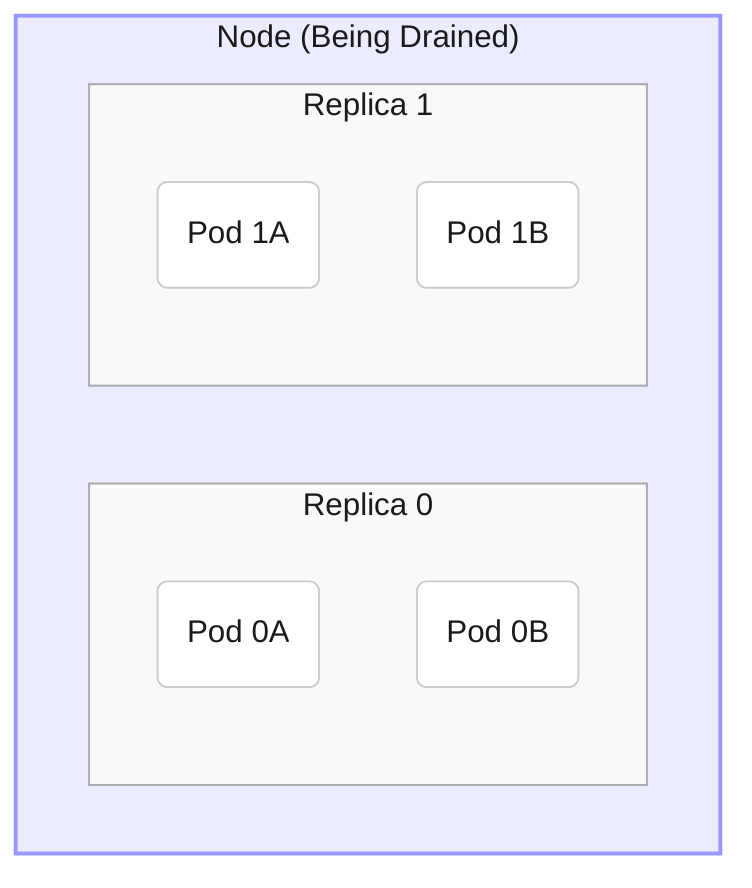
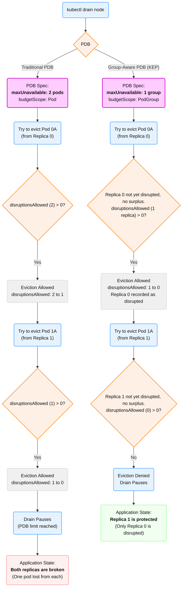
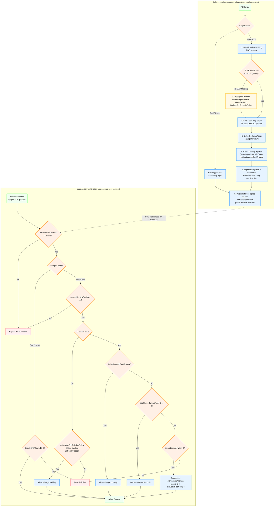

<!--
**Note:** When your KEP is complete, all of these comment blocks should be removed.

Follow the guidelines of the [documentation style guide].
In particular, wrap lines to a reasonable length, to make it
easier for reviewers to cite specific portions, and to minimize diff churn on
updates.

[documentation style guide]: https://github.com/kubernetes/community/blob/master/contributors/guide/style-guide.md

To get started with this template:

- [x] **Pick a hosting SIG.**
  Make sure that the problem space is something the SIG is interested in taking
  up. KEPs should not be checked in without a sponsoring SIG.
- [ ] **Create an issue in kubernetes/enhancements**
  When filing an enhancement tracking issue, please make sure to complete all
  fields in that template. One of the fields asks for a link to the KEP. You
  can leave that blank until this KEP is filed, and then go back to the
  enhancement and add the link.
- [ ] **Make a copy of this template directory.**
  Copy this template into the owning SIG's directory and name it
  `NNNN-short-descriptive-title`, where `NNNN` is the issue number (with no
  leading-zero padding) assigned to your enhancement above.
- [ ] **Fill out as much of the kep.yaml file as you can.**
  At minimum, you should fill in the "Title", "Authors", "Owning-sig",
  "Status", and date-related fields.
- [ ] **Fill out this file as best you can.**
  At minimum, you should fill in the "Summary" and "Motivation" sections.
  These should be easy if you've preflighted the idea of the KEP with the
  appropriate SIG(s).
- [ ] **Create a PR for this KEP.**
  Assign it to people in the SIG who are sponsoring this process.
- [ ] **Merge early and iterate.**
  Avoid getting hung up on specific details and instead aim to get the goals of
  the KEP clarified and merged quickly. The best way to do this is to just
  start with the high-level sections and fill out details incrementally in
  subsequent PRs.

Just because a KEP is merged does not mean it is complete or approved. Any KEP
marked as `provisional` is a working document and subject to change. You can
denote sections that are under active debate as follows:

```
<<[UNRESOLVED optional short context or usernames ]>>
Stuff that is being argued.
<<[/UNRESOLVED]>>
```

When editing KEPS, aim for tightly-scoped, single-topic PRs to keep discussions
focused. If you disagree with what is already in a document, open a new PR
with suggested changes.

One KEP corresponds to one "feature" or "enhancement" for its whole lifecycle.
You do not need a new KEP to move from beta to GA, for example. If
new details emerge that belong in the KEP, edit the KEP. Once a feature has become
"implemented", major changes should get new KEPs.

The canonical place for the latest set of instructions (and the likely source
of this file) is [here](/keps/NNNN-kep-template/README.md).

**Note:** Any PRs to move a KEP to `implementable`, or significant changes once
it is marked `implementable`, must be approved by each of the KEP approvers.
If none of those approvers are still appropriate, then changes to that list
should be approved by the remaining approvers and/or the owning SIG (or
SIG Architecture for cross-cutting KEPs).
-->
# KEP-5682: PDB for Multi-Pod Replicas

<!--
This is the title of your KEP. Keep it short, simple, and descriptive. A good
title can help communicate what the KEP is and should be considered as part of
any review.
-->

<!--
A table of contents is helpful for quickly jumping to sections of a KEP and for
highlighting any additional information provided beyond the standard KEP
template.

Ensure the TOC is wrapped with
  <code>&lt;!-- toc --&rt;&lt;!-- /toc --&rt;</code>
tags, and then generate with `hack/update-toc.sh`.
-->

<!-- toc -->
- [Release Signoff Checklist](#release-signoff-checklist)
- [Summary](#summary)
- [Motivation](#motivation)
  - [Goals](#goals)
  - [Non-Goals](#non-goals)
- [Proposal](#proposal)
    - [Spec Update](#spec-update)
    - [Status Update](#status-update)
    - [Logic Update](#logic-update)
  - [User Stories (Optional)](#user-stories-optional)
    - [Story 1: Distributed PodGroup](#story-1-distributed-podgroup)
    - [Story 2: Cluster Maintenance](#story-2-cluster-maintenance)
    - [Story 3: Troubleshooting Configuration](#story-3-troubleshooting-configuration)
    - [Simplified Setup Example](#simplified-setup-example)
  - [Notes/Constraints/Caveats (Optional)](#notesconstraintscaveats-optional)
    - [Background on the <code>PodGroup</code> API](#background-on-the-podgroup-api)
    - [Background on multi-pod replicas (LeaderWorkerSet)](#background-on-multi-pod-replicas-leaderworkerset)
  - [Risks and Mitigations](#risks-and-mitigations)
    - [Misconfiguration:](#misconfiguration)
    - [Fragile groups:](#fragile-groups)
    - [Mixed scopes:](#mixed-scopes)
    - [API Dependency &amp; Latency:](#api-dependency--latency)
- [Design Details](#design-details)
  - [API Definition](#api-definition)
    - [Spec](#spec)
    - [Status](#status)
    - [Eviction Logic](#eviction-logic)
      - [Disruption controller (<code>kube-controller-manager</code>)](#disruption-controller-kube-controller-manager)
      - [Why not the parent's <code>/scale</code> subresource](#why-not-the-parents-scale-subresource)
      - [Eviction subresource (<code>kube-apiserver</code>)](#eviction-subresource-kube-apiserver)
    - [Group Health](#group-health)
    - [Interaction with <code>disruptionMode</code>](#interaction-with-disruptionmode)
    - [Interaction with <code>unhealthyPodEvictionPolicy</code>](#interaction-with-unhealthypodevictionpolicy)
    - [Interaction with <code>CompositePodGroup</code>](#interaction-with-compositepodgroup)
    - [Multiple PodGroup templates](#multiple-podgroup-templates)
  - [Test Plan](#test-plan)
      - [Prerequisite testing updates](#prerequisite-testing-updates)
      - [Unit tests](#unit-tests)
      - [Integration tests](#integration-tests)
      - [e2e tests](#e2e-tests)
  - [Graduation Criteria](#graduation-criteria)
    - [Alpha](#alpha)
    - [Beta](#beta)
    - [GA](#ga)
  - [Upgrade / Downgrade Strategy](#upgrade--downgrade-strategy)
  - [Version Skew Strategy](#version-skew-strategy)
- [Production Readiness Review Questionnaire](#production-readiness-review-questionnaire)
  - [Feature Enablement and Rollback](#feature-enablement-and-rollback)
  - [Rollout, Upgrade and Rollback Planning](#rollout-upgrade-and-rollback-planning)
  - [Monitoring Requirements](#monitoring-requirements)
  - [Dependencies](#dependencies)
  - [Scalability](#scalability)
  - [Troubleshooting](#troubleshooting)
- [Implementation History](#implementation-history)
- [Drawbacks](#drawbacks)
- [Alternatives](#alternatives)
- [Infrastructure Needed (Optional)](#infrastructure-needed-optional)
<!-- /toc -->

## Release Signoff Checklist

<!--
**ACTION REQUIRED:** In order to merge code into a release, there must be an
issue in [kubernetes/enhancements] referencing this KEP and targeting a release
milestone **before the [Enhancement Freeze](https://git.k8s.io/sig-release/releases)
of the targeted release**.

For enhancements that make changes to code or processes/procedures in core
Kubernetes—i.e., [kubernetes/kubernetes], we require the following Release
Signoff checklist to be completed.

Check these off as they are completed for the Release Team to track. These
checklist items _must_ be updated for the enhancement to be released.
-->

Items marked with (R) are required *prior to targeting to a milestone / release*.

- [ ] (R) Enhancement issue in release milestone, which links to KEP dir in [kubernetes/enhancements] (not the initial KEP PR)
- [ ] (R) KEP approvers have approved the KEP status as `implementable`
- [ ] (R) Design details are appropriately documented
- [ ] (R) Test plan is in place, giving consideration to SIG Architecture and SIG Testing input (including test refactors)
  - [ ] e2e Tests for all Beta API Operations (endpoints)
  - [ ] (R) Ensure GA e2e tests meet requirements for [Conformance Tests](https://github.com/kubernetes/community/blob/master/contributors/devel/sig-architecture/conformance-tests.md)
  - [ ] (R) Minimum Two Week Window for GA e2e tests to prove flake free
- [ ] (R) Graduation criteria is in place
  - [ ] (R) [all GA Endpoints](https://github.com/kubernetes/community/pull/1806) must be hit by [Conformance Tests](https://github.com/kubernetes/community/blob/master/contributors/devel/sig-architecture/conformance-tests.md) within one minor version of promotion to GA
- [ ] (R) Production readiness review completed
- [ ] (R) Production readiness review approved
- [ ] "Implementation History" section is up-to-date for milestone
- [ ] User-facing documentation has been created in [kubernetes/website], for publication to [kubernetes.io]
- [ ] Supporting documentation—e.g., additional design documents, links to mailing list discussions/SIG meetings, relevant PRs/issues, release notes

<!--
**Note:** This checklist is iterative and should be reviewed and updated every time this enhancement is being considered for a milestone.
-->

[kubernetes.io]: https://kubernetes.io/
[kubernetes/enhancements]: https://git.k8s.io/enhancements
[kubernetes/kubernetes]: https://git.k8s.io/kubernetes
[kubernetes/website]: https://git.k8s.io/website

## Summary

<!--
This section is incredibly important for producing high-quality, user-focused
documentation such as release notes or a development roadmap. It should be
possible to collect this information before implementation begins, in order to
avoid requiring implementors to split their attention between writing release
notes and implementing the feature itself. KEP editors and SIG Docs
should help to ensure that the tone and content of the `Summary` section is
useful for a wide audience.

A good summary is probably at least a paragraph in length.
-->

Voluntary disruptions (node drains) will evict pods from a node. This can cause issues if an application requires keeping a certain number of pods running. Currently users can create a `PodDisruptionBudget` (PDB) object and set fields `minAvailable` or `maxUnavailable` in its spec to specify a number or percentage of pods which must remain available. The disruption controller continuously computes how many disruptions the PDB allows, and the Eviction API in `kube-apiserver` rejects any eviction that would exceed that, protecting the availability of the application.

However, some applications use `PodGroups` as defined in the new [Workload (PodGroup) API](https://github.com/kubernetes/enhancements/tree/master/keps/sig-scheduling/4671-gang-scheduling), in which a group of pods acts as if they were a single super-pod. These applications require more complex eviction logic to protect availability of PodGroups rather than individual pods. For example, in a [LeaderWorkerSet](https://lws.sigs.k8s.io/docs/overview/) running a distributed ML training job, one pod in a group being evicted would cause the job being run by the group to fail, rendering the entire group useless.

This KEP proposes new fields in PDBs so that the disruption controller computes availability, and the Eviction API admits evictions, treating each `PodGroup` as a single replica. The PDB spec will have optional string field `budgetScope`, which can be left unset or set to `Pod` for the existing behavior, or set to `PodGroup`. If set to `PodGroup` the PDB will enforce a number of *pod group replicas* that must remain available, rather than a number of *individual pod replicas*. The PDB status will be updated to report both pod-level and replica-level health, ensuring compatibility with existing monitoring tools. New status conditions will also be introduced for visibility of scope-related configuration errors.

## Motivation

<!--
This section is for explicitly listing the motivation, goals, and non-goals of
this KEP.  Describe why the change is important and the benefits to users. The
motivation section can optionally provide links to [experience reports] to
demonstrate the interest in a KEP within the wider Kubernetes community.

[experience reports]: https://github.com/golang/go/wiki/ExperienceReports
-->

The goal of this KEP is to improve the experience of using PDBs and the Eviction API for applications with multi-pod replicas, most importantly in enabling safeguards against eviction of a small number of pods spread across multiple multi-pod replicas.

### Goals

<!--
List the specific goals of the KEP. What is it trying to achieve? How will we
know that this has succeeded?
-->

- **Introduce fields to enable group-based PDBs:** Add a new optional string field `budgetScope` to the `PodDisruptionBudget.spec`.
- **Support replica-scoped observability:** Expose new status fields to reflect the health of pod groups, ensuring existing pod-scoped status fields remain accurate for current monitoring systems.
- **Update eviction logic:** When enabled, interpret the disruption budget (`minAvailable` or `maxUnavailable`) as a count of pod group replicas, allowing the eviction of individual pods only if their group's health is preserved or budgeted for.
- **Integrate with PodGroup API:** Use the pod spec's `schedulingGroup.podGroupName` to retrieve `PodGroup` objects.
- **Maintain compatibility:** Ensure that common cluster operations that respect PDBs, such as `kubectl drain` and node drains initiated by `cluster-autoscaler`, follow group-based disruption budgets when enabled.
- **Preserve existing functionality:** For backward compatibility, the behavior of PDBs where `budgetScope` is `Pod` or unset (default) will be unchanged.

### Non-Goals

<!--
What is out of scope for this KEP? Listing non-goals helps to focus discussion
and make progress.
-->

- **Involuntary disruptions:** This change only affects the Eviction API (voluntary disruptions). It does not handle involuntary disruptions such as node failure, manual pod deletion, Kubelet pressure evictions, or Taint Manager evictions.
- **Workload controller behavior:** This change will not affect how controllers (Deployment, StatefulSet, LeaderWorkerSet) manage the lifecycle or recovery of pods. We assume these controllers correctly set `schedulingGroup.podGroupName` on pods they manage.
- **Scheduling:** There will be no changes to the scheduler or gang scheduling logic. This KEP only concerns eviction of already-scheduled pods.
- **Health definitions:** We will not introduce new definitions of partial replica health (e.g. percentages). We follow the PodGroup API definition: a replica is healthy if and only if `healthy_pods` >= `minCount`.
- **Mixed scopes:** We will not support PDBs that select a combination of pods with a schedulingGroup and independent pods when `budgetScope` is set to `PodGroup`. For safety (i.e. no unintended evictions), any pods missing a schedulingGroup reference will be treated as unhealthy rather than as a separate healthy replica.
- **Other objects:** We will not modify the Pod spec, PodGroup API, or any other resources other than `PodDisruptionBudget`.

## Proposal

<!--
This is where we get down to the specifics of what the proposal actually is.
This should have enough detail that reviewers can understand exactly what
you're proposing, but should not include things like API designs or
implementation. What is the desired outcome and how do we measure success?.
The "Design Details" section below is for the real
nitty-gritty.
-->

We will update the disruption controller and the Eviction API to support group-aware disruption budgets.

#### Spec Update

We will add a new optional string `budgetScope` to `PodDisruptionBudget.spec`.

If unset or `Pod` (default), the disruption controller and the Eviction API evaluate the PDB based on individual pod counts, preserving all existing behavior.

If `PodGroup`, the PDB's `minAvailable` or `maxUnavailable` fields are interpreted as a count of `PodGroup` replicas rather than individual pods.

#### Status Update

We will add new fields to `PodDisruptionBudget.status` (e.g., `CurrentHealthyReplicas`) to explicitly report the health of pod groups. This ensures that:

The PDB reports how many groups are healthy.

Existing fields like `CurrentHealthy` continue to report pod counts, preventing issues in existing monitoring dashboards.

#### Logic Update

When `budgetScope` is `PodGroup`, the disruption controller in `kube-controller-manager` will fetch the `PodGroup` objects referenced by the selected pods. It will use each `PodGroup`'s `spec.schedulingPolicy.gang.minCount` to determine if a replica is healthy, and publish the resulting replica budget in the PDB status. `kube-apiserver` continues to admit individual eviction requests against that status. If pods are missing a `spec.schedulingGroup.podGroupName` reference linking them to a `PodGroup`, they will be treated as unhealthy to prevent unintended evictions from proceeding.

### User Stories (Optional)

<!--
Detail the things that people will be able to do if this KEP is implemented.
Include as much detail as possible so that people can understand the "how" of
the system. The goal here is to make this feel real for users without getting
bogged down.
-->
*If the user is not using PodGroups, their process will be unaffected.*

#### Story 1: Distributed PodGroup

An ML engineer is running distributed training jobs. The job's `Workload` object defines a pod group template named `worker` with `schedulingPolicy.gang.minCount: 8`, and its controller creates 10 `PodGroup` objects from that template, one per replica. This means the job has 10 replicas, each consisting of at least 8 pods.

To protect this long-running job from voluntary disruptions, the user wants to ensure at least 9 of the 10 worker groups remain available.

This user would create a PDB targeting the worker pods:

```yaml
apiVersion: policy/v1
kind: PodDisruptionBudget
metadata:
  name: my-training-job-workers-pdb
spec:
  minAvailable: 9
  budgetScope: PodGroup  # <-- New field to enable group counting
  selector:
    matchLabels:
      # Assuming pods are labeled
      workload: my-training-job
      pod-group: worker
```

The disruption controller in `kube-controller-manager` will:
1.  See the PDB `my-training-job-workers-pdb` with `spec.budgetScope: PodGroup`.
2.  Select all pods matching the selector.
3.  Detect that these pods have `spec.schedulingGroup.podGroupName` set, referencing a `PodGroup` (e.g., `my-training-job-worker-2`).
4.  Fetch each referenced `PodGroup` object.
5.  Resolve the group's requirements (`spec.schedulingPolicy.gang.minCount: 8`) from the `PodGroup` spec. Since `minAvailable` is an integer here, the expected replica count is not needed to compute the budget; for `maxUnavailable` or a percentage, the expected count (10) would be the number of `PodGroup` objects sharing the same `spec.workloadRef`.
6.  Interpret `minAvailable: 9` as requiring 9 healthy pod groups, and publish the resulting budget in the PDB status. A group (replica) is considered disrupted if evicting a pod would cause its healthy pod count to drop below 8.

Upon node drain, `kube-apiserver` admits each eviction against that published status, so the drain will proceed only if it leaves at least 9 healthy worker groups.

This way, the job is protected to run with sufficient replicas during cluster maintenance.

#### Story 2: Cluster Maintenance

A cluster administrator frequently drains nodes for upgrades. The cluster has various workloads, including multi-pod applications defined by the `PodGroup` API.

The admin would like to upgrade a node which is running the job from Story 1. To perform node drains safely, they rely on application owners' PDBs. When they issue `kubectl drain <node>`, `kube-apiserver` admits each eviction against the replica budget that the disruption controller published for the PDB, as described above, ensuring that the drain does not violate the application's group-based availability requirements.

This allows safe maintenance without causing outages, as the drain will pause if it cannot evict pods without violating a group-based PDB. It will wait for better replica health, more availability, lower PDB requirements, or the admin may contact the application owner to resolve the block.

#### Story 3: Troubleshooting Configuration

An operator creates a PDB with `budgetScope: PodGroup` but forgets to set the schedulingGroup on their pods. When they run `kubectl get pdb`, they see:

```yaml
status:
  currentHealthy: 50
  currentHealthyReplicas: 0
  expectedReplicas: 0
  disruptionsAllowed: 0
  disruptionsAllowedReplicas: 0
  conditions:
  - type: DisruptionAllowed
    status: "False"
    reason: MissingSchedulingGroup
    message: "No evictions are allowed: the PDB scope is set to 'PodGroup', but pods are missing the schedulingGroup."
  - type: BudgetConfigured
    status: "False"
    reason: MissingSchedulingGroup
    message: "The PDB scope is set to 'PodGroup', but pods are missing the schedulingGroup."
```

They will notice that evictions are blocked even though 50 pods are healthy, because none of those pods can be attributed to a replica: `currentHealthyReplicas` and `expectedReplicas` are both 0. The `BudgetConfigured` condition names the cause, allowing them to debug and fix the missing schedulingGroup references. This is the fail-closed behavior described in [Risks and Mitigations](#risks-and-mitigations): the PDB blocks disruption rather than silently falling back to per-pod counting. Pods without a scheduling group are treated as unhealthy, so their evictions follow `unhealthyPodEvictionPolicy`: with the default policy they are denied here because the replica budget is not met, and with `AlwaysAllow` they would be admitted without consuming budget.

#### Simplified Setup Example



In this setup, the node being drained contains two replicas, each with two pods (there may be more nodes and replicas which we can ignore). The PDB wants at most one replica unavailable. Currently, the user might try `maxUnavailable: 2` (one two-pod replica unavailable). The node drain would start, and could evict a pod from replica 0 and a pod from replica 1 before pausing (as there are only 2 pods left). This would disrupt both replicas. With the new changes, a PDB with `budgetScope: PodGroup` and `maxUnavailable: 1` (one replica unavailable) would pause before evicting a pod from the second replica, protecting one of the replicas as intended.

In a real cluster, there may be additional nodes or replicas, pods from other jobs sharing those nodes, etc.

In the flowchart below, the budget in each path has already been computed by the disruption controller: 2 pod disruptions for the traditional PDB, and 1 replica disruption for the group-aware PDB. Each decision is the check `kube-apiserver` makes against that budget for one eviction request. Each replica has `minCount: 2`, so neither has surplus pods.



### Notes/Constraints/Caveats (Optional)

<!--
What are the caveats to the proposal?
What are some important details that didn't come across above?
Go in to as much detail as necessary here.
This might be a good place to talk about core concepts and how they relate.
-->

#### Background on the `PodGroup` API

This KEP assumes that a pod controller (like the one managing `PodGroup` or `LeaderWorkerSet` objects) will create pods and set `pod.spec.schedulingGroup.podGroupName` on each pod it creates, linking it to a `PodGroup` object. The eviction logic uses this link to read the group's requirements.

In this KEP, the `PodGroup` object from the gang scheduling API is the source of truth for pod grouping.

A `Workload` object serves as a policy template, containing a list of `podGroupTemplates`. Each template defines the scheduling policy (such as `gang`) that should be applied.

A `PodGroup` is the actual standalone API object instantiated for a group, and each `PodGroup` object corresponds to exactly one replica. It defines:
* `workloadRef` (`*WorkloadReference`): an optional reference to the originating `Workload` template, consisting of `workloadName` and `templateName`.
* `schedulingPolicy`: The scheduling policy, copied from the template: either `basic`, for standard, independent scheduling of each pod, or `gang`.
* `schedulingPolicy.gang.minCount`: The minimum number of pods required for this instance of the group. Only `gang` groups have a `minCount`, so only they can be budgeted by replica.
* `disruptionMode` (`*DisruptionMode`): Whether the group's pods may be disrupted individually (`single`, the default) or only all together (`all`). It is a union, so it is written as, for example, `disruptionMode: {all: {}}`; this KEP refers to the two members as `single` and `all`. Introduced by [KEP-5710](https://github.com/kubernetes/enhancements/tree/master/keps/sig-scheduling/5710-workload-aware-preemption) for preemption, and only valid on gang-scheduled groups.

Because one `PodGroup` object is one replica, the number of replicas of a given template is the number of `PodGroup` objects sharing the same `workloadRef`. Neither `Workload` nor `PodGroup` exposes a `replicas` field.

#### Background on multi-pod replicas (LeaderWorkerSet)

[LeaderWorkerSet](https://lws.sigs.k8s.io/docs/overview/) (LWS) is the primary implementation of a multi-pod replica. The LWS API allows users to manage a group of pods together as if they were a single pod, by specifying a template for a "leader" pod and for the "worker" pods. This is useful in cases where a leader process coordinates multiple worker processes, particularly in AI/ML distributed workloads for model training and inference. All worker pods are treated the same: they are created from the same template, scheduled in parallel, and if any workers fail the group is considered failing. A LeaderWorkerSet object will specify `replicas` for the number of leader+workers groups and `size` for the number of pods per group. 

LWS is planned to be integrated with the PodGroup/Workload API ([KEP](https://docs.google.com/document/d/1QlcIBtR2KyOKYRUTGubhhxuy7NfjHs1fXMJlvdUCyhM/edit?tab=t.0#heading=h.dxr6zknxhiui)). Each LWS replica would correspond to a PodGroup replica, with its `size` being `minCount`.

### Risks and Mitigations

<!--
What are the risks of this proposal, and how do we mitigate? Think broadly.
For example, consider both security and how this will impact the larger
Kubernetes ecosystem.

How will security be reviewed, and by whom?

How will UX be reviewed, and by whom?

Consider including folks who also work outside the SIG or subproject.
-->

#### Misconfiguration:
This feature relies on the pod's `spec.schedulingGroup.podGroupName` being correctly set. If a user sets `budgetScope: PodGroup` but the pods are not correctly linked to a `PodGroup` object, the controller cannot calculate group health.
    
Mitigation: We implement a fail-closed policy. Pods without a valid `schedulingGroup` are treated as unhealthy to prevent accidentally granting unsafe evictions (which could happen if we fell back to per-pod counting). A specific condition `BudgetConfigured=False` (Reason: `MissingSchedulingGroup`) will alert the user to this error. `PodGroup`s that cannot be budgeted by replica, because they use `schedulingPolicy.basic` (which has no `minCount`) or belong to a `CompositePodGroup` hierarchy, also fail closed, with reasons `BasicSchedulingPolicyNotSupported` and `CompositePodGroupNotSupported`.

#### Fragile groups:
One failing pod in a large group can make the entire group unhealthy (if it drops below `minCount`). Consequently, a small number of failing pods spread across many replicas could make all replicas unhealthy, preventing any further evictions and blocking node drains entirely.
    
Mitigation: This is intended behavior for preserving application availability when possible. The PDB Status will show `CurrentHealthyReplicas` and `DisruptionsAllowedReplicas`, which makes it clear that the block is due to unresolved group health issues.

#### Mixed scopes:
A PDB `selector` that matches pods from more than one `PodGroup` template (or a mix of grouped and individual pods) may result in confusing behavior.

Mitigation: The controller will treat pods without a `schedulingGroup` as unhealthy, and reports groups from more than one template on the `BudgetConfigured` condition (see [Multiple PodGroup templates](#multiple-podgroup-templates)). We will document best practices advising users to create separate PDBs for each `PodGroup` template or set of individual pods they wish to protect.

#### API Dependency & Latency:
The disruption controller now has to resolve `PodGroup` objects in order to compute replica availability, introducing a dependency on the PodGroup API. The eviction admission path itself makes no additional API calls, so the risk is that the PDB status becomes stale or cannot be computed, rather than that evictions become slower to admit.

Mitigation: The controller will use standard informers/caches for `PodGroup` objects to minimize API latency. If the required objects cannot be found, the controller will fail closed (block eviction) and report a `PodGroupResolutionFailed` condition.

## Design Details

<!--
This section should contain enough information that the specifics of your
change are understandable. This may include API specs (though not always
required) or even code snippets. If there's any ambiguity about HOW your
proposal will be implemented, this is the place to discuss them.
-->

### API Definition

#### Spec

We will update `PodDisruptionBudgetSpec` and `PodDisruptionBudgetStatus` in the internal types (`pkg/apis/policy/types.go`) and in both versioned types (`staging/src/k8s.io/api/policy/v1/types.go` and `staging/src/k8s.io/api/policy/v1beta1/types.go`). `policy/v1beta1` has not been served for `PodDisruptionBudget` since v1.25, but its types are still generated and converted, and [KEP-3017](https://github.com/kubernetes/enhancements/tree/master/keps/sig-apps/3017-pod-healthy-policy-for-pdb) added `unhealthyPodEvictionPolicy` to them in the same way. The snippets below show the `policy/v1` types.

```go
// BudgetScope defines how the disruption budget is calculated.
type BudgetScope string

const (
    // BudgetScopePod indicates that the disruption budget should be calculated
    // based on individual pods. This is the default behavior.
    BudgetScopePod BudgetScope = "Pod"

    // BudgetScopePodGroup indicates that the disruption budget should be calculated
    // based on PodGroups.
    BudgetScopePodGroup BudgetScope = "PodGroup"
)

// PodDisruptionBudgetSpec defines the desired state of PodDisruptionBudget
type PodDisruptionBudgetSpec struct {
  // An eviction is allowed if at least "minAvailable" pods selected by
  // ...
  MinAvailable *intstr.IntOrString `json:"minAvailable,omitempty" protobuf:"bytes,1,opt,name=minAvailable"`

  // Label query over pods whose evictions are managed by the disruption
  // ...
  Selector *metav1.LabelSelector `json:"selector,omitempty" protobuf:"bytes,2,opt,name=selector"`

  // An eviction is allowed if at most "maxUnavailable" pods selected by
  // ...
  MaxUnavailable *intstr.IntOrString `json:"maxUnavailable,omitempty" protobuf:"bytes,3,opt,name=maxUnavailable"`

  // UnhealthyPodEvictionPolicy defines the criteria for when unhealthy pods
  // should be considered for eviction. (Existing field, shown here because it
  // already occupies protobuf tag 4.)
  // ...
  UnhealthyPodEvictionPolicy *UnhealthyPodEvictionPolicyType `json:"unhealthyPodEvictionPolicy,omitempty" protobuf:"bytes,4,opt,name=unhealthyPodEvictionPolicy"`

  // BudgetScope indicates how the disruption budget should be calculated.
  // Allowed values are "Pod" and "PodGroup".
  //
  // If set to "PodGroup", the eviction logic will interpret minAvailable/maxUnavailable
  // as a count of PodGroup replicas, not individual pods.
  //
  // Users must ensure that pods selected by this PDB are correctly populated
  // with 'spec.schedulingGroup'. If a selected pod is missing the schedulingGroup reference,
  // it counts toward no replica and is treated as unhealthy: its eviction is governed by
  // unhealthyPodEvictionPolicy and never consumes replica budget.
  //
  // If unset, the PDB behaves as if it were set to "Pod".
  // +optional
  BudgetScope *BudgetScope `json:"budgetScope,omitempty" protobuf:"bytes,5,opt,name=budgetScope"`
}
```

`budgetScope` must be `Pod` or `PodGroup` when set. It is not defaulted by the API server, following the precedent of `unhealthyPodEvictionPolicy`, so PDBs written before this feature, or while the gate is disabled, are left unchanged. Like the rest of the PDB spec, it is mutable. Changing it increments `metadata.generation`, so `kube-apiserver` rejects evictions with a retriable error until the controller has recomputed the status for the new scope, and no eviction is admitted against a budget computed for the other scope. When the `MultiPodPDBs` gate is disabled, the field is dropped on create, and preserved on update if it is already set.

#### Status

We will add new fields to `PodDisruptionBudgetStatus` to reflect the status of replicas: `DisruptionsAllowedReplicas`, `CurrentHealthyReplicas`, `DesiredHealthyReplicas`, and `ExpectedReplicas`, each corresponding to an existing pod-scoped field.

For `budgetScope: Pod` (default), the new `...Replicas` fields will be populated with values matching their pod-scoped counterparts. This allows the new fields to be used without needing conditional logic for the scope.

For `budgetScope: PodGroup`, existing pod-scoped fields will mostly continue to be populated based on pod counts, for compatibility reasons.

Specifically:
- `DisruptedPods`, `CurrentHealthy`, and `ExpectedPods` will still count the status of individual pods
- `DesiredHealthy` still counts pods, and is calculated as the minimum number of pods required to support the desired number of replicas (`DesiredHealthyReplicas` * `minCount`). `CurrentHealthy < DesiredHealthy` therefore still shows that the budget is not met, but the converse does not hold: healthy pods can be spread across replicas so that `CurrentHealthy >= DesiredHealthy` while `CurrentHealthyReplicas < DesiredHealthyReplicas`. Clients that need an exact answer should compare the replica fields, as `kube-apiserver` does (see [Interaction with `unhealthyPodEvictionPolicy`](#interaction-with-unhealthypodevictionpolicy)). If the selected groups have different `minCount`s (see [Multiple PodGroup templates](#multiple-podgroup-templates)), the smallest is used, so that `DesiredHealthy` remains a lower bound.
- `DisruptionsAllowed` **will not** count pods, as it is not obvious which individual pods can be disrupted. Instead it will count the number of pod groups allowed to be disrupted, identical to `DisruptionsAllowedReplicas`, using the same units as `minAvailable/maxUnavailable`.

`disruptionsAllowed` is the only existing field whose unit changes, which affects clients that read it directly. For example, [cluster-autoscaler](https://github.com/kubernetes/autoscaler/blob/cluster-autoscaler-release-1.36/cluster-autoscaler/core/scaledown/pdb/basic.go) will not remove a node's pods if a matching PDB has `disruptionsAllowed < 1`, and subtracts 1 from it for every pod it plans to remove. Under `budgetScope: PodGroup` it therefore charges a replica of budget for every pod, whereas `kube-apiserver` charges several pods of one replica a single replica in total, and surplus pods nothing. Such clients become more conservative and may decline drains that would be safe, but never less safe, since every eviction is still admitted by `kube-apiserver`. Clients can check `spec.budgetScope` and read the `...Replicas` fields to account for the difference.

The four new `...Replicas` fields are pointers (`*int32`) with `omitempty`. A non-pointer `int32` would serialize as `0` even when the `MultiPodPDBs` feature is disabled, and when the gate is enabled a legitimate `0` (e.g., zero healthy replicas) would be indistinguishable from "not set."

We also add two bookkeeping fields used by the eviction path, described in [Eviction Logic](#eviction-logic):

- `DisruptedPodGroups` records which replicas have already had their budget charged, so that evicting additional pods of an already-disrupted replica does not consume more budget.
- `PodGroupSurplusPods` records, per group, how many of its pods can be evicted without consuming replica budget. For a healthy group these are its healthy pods above `minCount`, or none if the group's `disruptionMode` is `all`. For an unhealthy group they are all of its pods if `unhealthyPodEvictionPolicy` allows evicting them (see [Interaction with `unhealthyPodEvictionPolicy`](#interaction-with-unhealthypodevictionpolicy)).

```go
// PodDisruptionBudgetStatus represents information about the status of a
// PodDisruptionBudget. Status may trail the actual state of a system.
type PodDisruptionBudgetStatus struct {
	// Most recent generation observed when updating this PDB status. DisruptionsAllowed and other
	// status information is valid only if observedGeneration equals to PDB's object generation.
	// +optional
	ObservedGeneration int64 `json:"observedGeneration,omitempty" protobuf:"varint,1,opt,name=observedGeneration"`

	// DisruptedPods contains information about pods whose eviction was
	// processed by the API server eviction subresource handler but has not
	// yet been observed by the PodDisruptionBudget controller.
	// A pod will be in this map from the time when the API server processed the
	// eviction request to the time when the pod is seen by PDB controller
	// as having been marked for deletion (or after a timeout). The key in the map is the name of the pod
	// and the value is the time when the API server processed the eviction request. If
	// the deletion didn't occur and a pod is still there it will be removed from
	// the list automatically by PodDisruptionBudget controller after some time.
	// If everything goes smooth this map should be empty for the most of the time.
	// Large number of entries in the map may indicate problems with pod deletions.
	// +optional
	DisruptedPods map[string]metav1.Time `json:"disruptedPods,omitempty" protobuf:"bytes,2,rep,name=disruptedPods"`

	// Number of pod disruptions that are currently allowed.
	// If spec.budgetScope is "PodGroup", this is instead the number of PodGroup
	// replicas that may be disrupted, identical to disruptionsAllowedReplicas.
	// +optional
	DisruptionsAllowed int32 `json:"disruptionsAllowed" protobuf:"varint,3,opt,name=disruptionsAllowed"`

	// Current number of healthy pods
	// +optional
	CurrentHealthy int32 `json:"currentHealthy" protobuf:"varint,4,opt,name=currentHealthy"`

	// Minimum desired number of healthy pods
	// +optional
	DesiredHealthy int32 `json:"desiredHealthy" protobuf:"varint,5,opt,name=desiredHealthy"`

	// Total number of pods counted by this disruption budget
	// +optional
	ExpectedPods int32 `json:"expectedPods" protobuf:"varint,6,opt,name=expectedPods"`

	// Conditions contain conditions for PDB
	// ...
	// +optional
	// +patchMergeKey=type
	// +patchStrategy=merge
	// +listType=map
	// +listMapKey=type
	Conditions []metav1.Condition `json:"conditions,omitempty" patchStrategy:"merge" patchMergeKey:"type" protobuf:"bytes,7,rep,name=conditions"`

	/* [New fields] */

	// DisruptionsAllowedReplicas contains the number of replicas that can be disrupted.
	// This is identical to DisruptionsAllowed, but provides API symmetry and explicit clarity
	// on the unit of measurement.
	// +optional
	DisruptionsAllowedReplicas *int32 `json:"disruptionsAllowedReplicas,omitempty" protobuf:"varint,8,opt,name=disruptionsAllowedReplicas"`

	// CurrentHealthyReplicas contains the number of healthy replicas.
	// +optional
	CurrentHealthyReplicas *int32 `json:"currentHealthyReplicas,omitempty" protobuf:"varint,9,opt,name=currentHealthyReplicas"`

	// DesiredHealthyReplicas contains the minimum desired number of healthy replicas.
	// +optional
	DesiredHealthyReplicas *int32 `json:"desiredHealthyReplicas,omitempty" protobuf:"varint,10,opt,name=desiredHealthyReplicas"`

	// ExpectedReplicas contains the total number of replicas counted by this PDB.
	// +optional
	ExpectedReplicas *int32 `json:"expectedReplicas,omitempty" protobuf:"varint,11,opt,name=expectedReplicas"`

	// DisruptedPodGroups contains the names of the PodGroups whose replica budget has
	// already been consumed by an eviction processed by the API server eviction
	// subresource handler, and the time at which it was processed. Evicting further pods
	// of a PodGroup listed here does not consume additional replica budget, so that
	// draining several pods of the same replica costs one replica of budget in total.
	// Entries are removed by the PodDisruptionBudget controller once no pod selected by
	// this PDB belongs to the PodGroup any more, or after the same timeout used for
	// disruptedPods. While a PodGroup is listed here, the controller counts it as
	// unhealthy and publishes no surplus for it.
	// +optional
	DisruptedPodGroups map[string]metav1.Time `json:"disruptedPodGroups,omitempty" protobuf:"bytes,12,rep,name=disruptedPodGroups"`

	// PodGroupSurplusPods maps a PodGroup name to the number of its pods that may be
	// evicted without consuming replica budget, as last computed by the
	// PodDisruptionBudget controller. For a healthy PodGroup this is the number of its
	// healthy pods above spec.schedulingPolicy.gang.minCount, or 0 if its
	// spec.disruptionMode is all, since such a group must be disrupted as a unit. For an
	// unhealthy PodGroup it is the number of its pods if unhealthyPodEvictionPolicy
	// allows evicting them, and 0 otherwise. The API server decrements this value
	// instead of disruptionsAllowed when it evicts a pod of the PodGroup.
	// PodGroups with no surplus are omitted, and a missing entry means 0.
	// The map holds at most MaxDisruptedPodSize entries.
	// +optional
	PodGroupSurplusPods map[string]int32 `json:"podGroupSurplusPods,omitempty" protobuf:"bytes,13,rep,name=podGroupSurplusPods"`
}
```

Status updates are validated as follows:

- The four `...Replicas` fields must be non-negative when set.
- Every key of `disruptedPodGroups` and `podGroupSurplusPods` must be a valid `PodGroup` name.
- Each of the two maps may hold at most `MaxDisruptedPodSize` (2000) entries (see [Bounding the status maps](#bounding-the-status-maps)).

The `status.Conditions` field is unchanged, but new condition values will indicate pod-group-scoped information and scope-related issues.

```go
const (
	// DisruptionAllowedCondition is a condition set by the disruption controller
	// that signal whether any of the pods covered by the PDB can be disrupted.
	DisruptionAllowedCondition = "DisruptionAllowed"

	// SyncFailedReason is set on the DisruptionAllowed condition if reconcile
	// of the PDB failed and therefore disruption of pods are not allowed.
	SyncFailedReason = "SyncFailed"
	// SufficientPodsReason is set on the DisruptionAllowed condition if there are
	// more pods covered by the PDB than required and at least one can be disrupted.
	SufficientPodsReason = "SufficientPods"
	// InsufficientPodsReason is set on the DisruptionAllowed condition if the number
	// of pods are equal to or fewer than required by the PDB.
	InsufficientPodsReason = "InsufficientPods"

	/* [New conditions for DisruptionAllowed] */

	// SufficientReplicasReason is set on the DisruptionAllowed condition if 
	// budgetScope is "PodGroup" and there are more healthy replicas 
	// than required, so at least one can be disrupted.
	SufficientReplicasReason = "SufficientReplicas"

	// InsufficientReplicasReason is set on the DisruptionAllowed condition if 
	// budgetScope is "PodGroup" and the number of healthy replicas
	// is equal to or fewer than required.
	InsufficientReplicasReason = "InsufficientReplicas"

	// PodGroupResolutionFailedReason is set on the DisruptionAllowed condition if
	// budgetScope is "PodGroup" and the controller cannot retrieve a PodGroup object
	// referenced by the selected pods, or cannot establish the expected number of
	// replicas from them, blocking disruption safety checks.
	PodGroupResolutionFailedReason = "PodGroupResolutionFailed"

	/* [New Condition Type for Configuration Health] */

	// BudgetConfiguredCondition is a condition set by the disruption controller
	// to signal whether the PDB is correctly configured for its requested scope.
	// This helps users detect if they enabled "PodGroup" scope on pods that lack
	// the necessary PodGroup references.
	BudgetConfiguredCondition = "BudgetConfigured"

	// ValidConfigReason indicates the PDB configuration and pod selection are valid.
	ValidConfigReason = "ValidConfig"

	// MissingSchedulingGroupReason indicates that budgetScope is "PodGroup" but
	// one or more selected pods are missing spec.schedulingGroup. Such pods count
	// toward no replica and are treated as unhealthy: their eviction is governed by
	// unhealthyPodEvictionPolicy and never consumes replica budget.
	// It is set on the BudgetConfigured condition whenever any selected pod lacks a
	// scheduling group, and also on the DisruptionAllowed condition (with status
	// False) if none of the selected pods has one.
	MissingSchedulingGroupReason = "MissingSchedulingGroup"

	// MultiplePodGroupTemplatesDetectedReason indicates that budgetScope is "PodGroup"
	// but the selected pods belong to PodGroups instantiated from different templates
	// (different spec.workloadRef values), which is discouraged. It is set on the
	// BudgetConfigured condition, with status True if the budget can still be
	// computed (an integer minAvailable) and False otherwise.
	MultiplePodGroupTemplatesDetectedReason = "MultiplePodGroupTemplatesDetected"

	// CompositePodGroupNotSupportedReason indicates that budgetScope is "PodGroup" but
	// one or more selected pods belong to a PodGroup that is part of a
	// CompositePodGroup hierarchy, which is not supported in alpha.
	// It is set on the BudgetConfigured condition, and also on the DisruptionAllowed
	// condition (with status False), because the disruption unit is ambiguous.
	CompositePodGroupNotSupportedReason = "CompositePodGroupNotSupported"

	// BasicSchedulingPolicyNotSupportedReason indicates that budgetScope is "PodGroup"
	// but one or more selected pods belong to a PodGroup that uses
	// spec.schedulingPolicy.basic, which has no minCount from which to determine
	// replica health.
	// It is set on the BudgetConfigured condition, and also on the DisruptionAllowed
	// condition (with status False).
	BasicSchedulingPolicyNotSupportedReason = "BasicSchedulingPolicyNotSupported"
)
```

#### Eviction Logic

Group resolution and availability computation happen asynchronously in the disruption controller (`kube-controller-manager`), as they do today for pod-scoped PDBs. `kube-apiserver` (the Eviction subresource) performs the same admission check it performs today: it reads the PDB status, decides, and decrements.

As today, if the controller has not yet processed a change to the PDB spec (`status.observedGeneration` is older than the PDB's `metadata.generation`), `kube-apiserver` rejects the eviction with a retriable error. This check covers spec changes only: `metadata.generation` does not change as pods come and go, so it does not establish that the group data in the status is current. See [Status staleness](#status-staleness).

##### Disruption controller (`kube-controller-manager`)

On each sync of a PDB, if `pdb.spec.budgetScope` is `Pod` or unset, follow the existing per-pod availability behavior. If it scopes by `PodGroup`:

1.  Get all pods matching the PDB's `selector`.
2.  Check if all pods have `spec.schedulingGroup.podGroupName` set.
3.  If any pods have `spec.schedulingGroup.podGroupName` unset, treat them as unhealthy, as mixing scopes is not supported, and set `BudgetConfigured=False` (Reason: `MissingSchedulingGroup`). Such pods count toward no replica, and their evictions are governed by `unhealthyPodEvictionPolicy` without consuming replica budget (step 1 of the [Eviction subresource](#eviction-subresource-kube-apiserver) algorithm). If none of the selected pods has a scheduling group, also set `DisruptionAllowed=False` with the same reason, as in [Story 3](#story-3-troubleshooting-configuration).
4.  Find the `PodGroup` object for each unique `spec.schedulingGroup.podGroupName`. If one does not exist, fail closed (`DisruptionAllowed=False`, Reason: `PodGroupResolutionFailed`). If any of them has `spec.parentCompositePodGroupName` set, the group is part of a `CompositePodGroup` hierarchy, where the disruption unit is ambiguous; fail closed (`BudgetConfigured=False` and `DisruptionAllowed=False`, Reason: `CompositePodGroupNotSupported`). See [Interaction with `CompositePodGroup`](#interaction-with-compositepodgroup).
5.  Get `PodGroup.spec.schedulingPolicy.gang.minCount` (minimum pods per replica). A `PodGroup` that uses `schedulingPolicy.basic` has no `minCount`, so replica health is undefined for it; fail closed (`BudgetConfigured=False` and `DisruptionAllowed=False`, Reason: `BasicSchedulingPolicyNotSupported`).
6.  Count the number of healthy replicas: a replica is healthy if its count of existing, healthy, non-terminating pods `>= minCount`, and it is not listed in `status.disruptedPodGroups` (after the removals of step 9). A listed group counts as unhealthy, and gets no surplus in step 8, until its entry is removed: its replica of budget has already been spent, and counting it as healthy again would return that budget at the next sync (see [Interaction with `disruptionMode`](#interaction-with-disruptionmode)).
7.  Determine `expectedReplicas` by counting the `PodGroup` objects that share the same `spec.workloadRef` (`workloadName` + `templateName`) as the groups of the selected pods. Each `PodGroup` object is one replica. A `PodGroup` with no selected pods, for example one just created by a parent that is scaling up, counts toward `expectedReplicas` but is not healthy. A `PodGroup` that is being deleted (`metadata.deletionTimestamp` set) and has no selected pods is not counted: the `PodGroupProtection` admission plugin, enabled by default, adds a finalizer that keeps a deleted `PodGroup` until the `PodGroupProtection` controller removes the finalizer, and such an object is no longer a replica. If the selected pods resolve to `PodGroup`s with inconsistent or unset `workloadRef`s, or to a `PodGroup` that has no owning controller, the expected count cannot be established and the controller fails closed (`DisruptionAllowed=False`, Reason: `PodGroupResolutionFailed`). The owning controller is required even though the count does not use its `/scale`: a `PodGroup` that no controller owns is not recreated after it is removed and does not track any desired scale, so the number of such objects says nothing about how many replicas the workload should have. This mirrors pod-scoped PDBs, which fail the sync when a selected pod has no controller. Standalone `PodGroup`s can still be protected with an integer `minAvailable`, which skips this step.
8.  Compute `desiredHealthyReplicas` and `disruptionsAllowedReplicas` from `minAvailable`/`maxUnavailable`, and publish, for each group `G`, `podGroupSurplusPods[G]`: the number of pods of `G` that can be evicted without consuming replica budget. For a healthy group it is `max(0, healthyPods(G) - minCount(G))` when `G` uses the default `single` disruption mode, or `0` when it uses `all`, since such a group can only be disrupted as a whole (see [Interaction with `disruptionMode`](#interaction-with-disruptionmode)). For an unhealthy group it is the number of its existing, non-terminating pods if `unhealthyPodEvictionPolicy` allows evicting them, and `0` otherwise (see [Interaction with `unhealthyPodEvictionPolicy`](#interaction-with-unhealthypodevictionpolicy)). A group listed in `status.disruptedPodGroups` has a surplus of `0`, since evicting its pods is already free (step 2 of the [Eviction subresource](#eviction-subresource-kube-apiserver) algorithm). Groups with a surplus of `0` are omitted from the map (see [Bounding the status maps](#bounding-the-status-maps)).
9.  Expire stale entries from `status.disruptedPods` using the existing logic. Remove an entry from `status.disruptedPodGroups` once the disruption has been observed, meaning that no selected pod belongs to the group any more, or once it is older than the existing `DeletionTimeout` (2 minutes) used for `disruptedPods`.

When the controller fails closed (steps 4, 5, and 7), it publishes `disruptionsAllowed: 0`, `disruptionsAllowedReplicas: 0`, and `currentHealthyReplicas: 0`, and no `podGroupSurplusPods` entries. `currentHealthyReplicas` is set rather than omitted, so evictions are denied rather than retried. The only evictions `kube-apiserver` still admits are those of further pods of groups already in `disruptedPodGroups`, and, under `unhealthyPodEvictionPolicy: AlwaysAllow`, those of unready pods and of pods without a scheduling group, which never count toward a replica's health. It fails the whole PDB rather than only the affected groups because `kube-apiserver` cannot tell which groups are affected without reading `PodGroup` objects, which the eviction path deliberately does not do.

`expectedReplicas` is only needed to resolve `maxUnavailable` and percentage-valued `minAvailable`. For an integer `minAvailable`, `desiredHealthyReplicas` is simply that integer, so the controller can compute the budget without knowing the expected scale at all, and step 7 is skipped. This mirrors the existing pod-scoped behavior, where an integer `minAvailable` sets `expectedCount` to the number of selected pods and performs no scale lookup.

##### Why not the parent's `/scale` subresource

For pod-scoped PDBs, the disruption controller resolves `maxUnavailable` and percentage `minAvailable` against the *desired* scale of each pod's controller, summing `scale.spec.replicas` across the distinct controllers of the selected pods and failing the sync if a selected pod has no controller. That machinery is reachable here: `PodGroup` objects are created and owned by the workload controller with `ownerReferences`, so that they are garbage collected with the replica. The parent could therefore be resolved from the `PodGroup` instead of from the pod.

We deliberately do not do this, because `scale.spec.replicas` has no defined relationship to pod-group replicas and no API field distinguishes the two cases. For a parent whose scale counts groups (such as a `LeaderWorkerSet`'s `replicas`) the value would be correct, but for a parent whose scale counts pods the budget would be measured against a pod-valued denominator. A `minAvailable: 90%` group budget resolved against a pod count of 80 would demand 72 healthy replicas where only 10 exist, blocking every eviction indefinitely. Counting `PodGroup` objects keeps the denominator in replica units by construction.

The cost of this choice is that the denominator is observed rather than desired, which differs from `budgetScope: Pod` while the parent is scaling:

- Scaling up from 10 to 20 replicas with 12 `PodGroup`s created so far, `maxUnavailable: 1` gives `expectedReplicas: 12` and `desiredHealthyReplicas: 11`. The two new groups count toward `expectedReplicas` but are unhealthy until they have `minCount` healthy pods, so `currentHealthyReplicas` is at most 10 and a drain is blocked until they become healthy. A desired-scale denominator would give 20 and 19, blocking the drain until 19 replicas are healthy. Counting objects is therefore more permissive only while the parent has not yet created all of its `PodGroup`s, for example when it creates replicas one at a time.
- Scaling down from 20 to 10 replicas, before the surplus `PodGroup`s are removed, is the reverse: counting objects is the stricter of the two.

This is acceptable because the parent controller creates a `PodGroup` per replica before creating its pods, so the count tracks intent closely, and the skew is bounded by how quickly the parent reconciles. It is called out because it is a user-visible difference from pod-scoped PDBs.

If the `Workload` API later exposes a desired replica count per template (it has no `replicas` field today), that count should replace the object count as the denominator, since it would be both desired and unambiguously in replica units.

##### Eviction subresource (`kube-apiserver`)

For a PDB with `budgetScope: PodGroup`, `kube-apiserver` requires `status.currentHealthyReplicas` to be set, which shows that the status was computed by a disruption controller with the feature enabled. If it is not set, the eviction is rejected with the same retriable error as a stale `observedGeneration` (see [Version Skew Strategy](#version-skew-strategy)).

Then, when evicting pod `P` belonging to group `G` (`P.spec.schedulingGroup.podGroupName`):

1.  If `G` is unset, `P` counts toward no replica and is treated as an unhealthy pod, whether or not it is Ready. Allow the eviction without decrementing any budget, and without recording `P` in `disruptedPods`, if `unhealthyPodEvictionPolicy` is `AlwaysAllow`, or if it is `IfHealthyBudget` or unset and `currentHealthyReplicas >= desiredHealthyReplicas > 0`. Otherwise deny it. Such a pod is never charged replica budget, since there is no group to record in `disruptedPodGroups`. See [Interaction with `unhealthyPodEvictionPolicy`](#interaction-with-unhealthypodevictionpolicy).
2.  If `G` is already present in `status.disruptedPodGroups`, allow the eviction **without** decrementing `disruptionsAllowed`. The replica has already been counted as disrupted, so removing more of its pods must not consume additional replica budget.
3.  Else, if `status.podGroupSurplusPods[G] > 0`, allow the eviction and decrement only that surplus. Either the replica stays healthy, or it is already unhealthy and the PDB's `unhealthyPodEvictionPolicy` allows evicting its pods, so no replica budget is spent. The controller publishes a surplus of `0` for any healthy group whose `disruptionMode` is `all` (see [Interaction with disruptionMode](#interaction-with-disruptionmode)), so this step never admits an eviction that would disrupt such a group.
4.  Else, if `status.disruptionsAllowed > 0`, decrement `disruptionsAllowed`, record `G` in `status.disruptedPodGroups`, and allow the eviction.
5.  Else, deny the eviction.

In all cases allowed by steps 2–4 the pod is recorded in the existing `status.disruptedPods` map, preserving current behavior for observability and for the controller's reconciliation.

As today, a pod that is not Ready is checked against `unhealthyPodEvictionPolicy` before any of the above, and is evicted without consuming budget or being recorded in `disruptedPods` if the policy is `AlwaysAllow`, or if the PDB is not currently disrupted. Under `budgetScope: PodGroup`, "not currently disrupted" means `currentHealthyReplicas >= desiredHealthyReplicas` with `desiredHealthyReplicas > 0`, in place of the pod-denominated `currentHealthy >= desiredHealthy`. If either replica field is unset, the check does not pass and the eviction proceeds as above. See [Interaction with `unhealthyPodEvictionPolicy`](#interaction-with-unhealthypodevictionpolicy). The diagram below omits this check.

Whenever `kube-apiserver` decrements `disruptionsAllowed`, under either scope, it also decrements `disruptionsAllowedReplicas` if that field is set, so that the two stay identical between syncs. When the budget of a `budgetScope: PodGroup` PDB reaches `0`, it sets the `DisruptionAllowed` condition to `False` with reason `InsufficientReplicas`, where it sets `InsufficientPods` today.

This is why `DisruptionsAllowed` can safely be expressed in replicas: the per-pod decrement performed by `kube-apiserver` is guarded by `disruptedPodGroups` and `podGroupSurplusPods`, so draining several pods of the same replica (the common node-drain case) costs exactly one replica of budget, and draining surplus pods above `minCount` costs none. As today, these status updates use optimistic concurrency with conflict retries, so concurrent eviction requests serialize against each other.

###### Dry run

A dry-run eviction performs the same checks and returns the same decision, but writes nothing: it does not record the pod in `disruptedPods`, does not record the group in `disruptedPodGroups`, and does not persist a decrement of `podGroupSurplusPods` or `disruptionsAllowed`. This matches the existing dry-run behavior of the Eviction subresource.

###### Status staleness

The PDB status that `kube-apiserver` reads is eventually consistent, as it is today. The `observedGeneration` check above only detects that the controller has not yet processed a change to the PDB **spec**; `metadata.generation` does not change as pods come and go, so a fresh `observedGeneration` does not imply that the group data in the status is current. Two consequences are specific to `budgetScope: PodGroup`:

- `podGroupSurplusPods[G]` can overstate a group's headroom if one of its pods was lost involuntarily since the last sync (node failure, OOM kill, manual deletion). In that window an eviction admitted through the surplus path can take `G` below `minCount` without consuming any replica budget. This is a weaker failure mode than the pod-scoped equivalent, where a stale status can only over-draw a budget that is still being counted.
- `currentHealthyReplicas` and `disruptionsAllowedReplicas` lag pod-level changes, exactly as `currentHealthy` and `disruptionsAllowed` do today.

Both are self-correcting within one sync. Every allowed eviction records the pod in `disruptedPods`, and the disruption controller excludes disrupted pods when recomputing group health, so the next sync recomputes `podGroupSurplusPods` and the replica counts from the reduced pod set. The exposure is bounded by the controller's sync latency. We consider this acceptable for alpha because it is the same class of eventual-consistency gap that pod-scoped PDBs already accept; if it proves material in practice, beta can gate the surplus path on a freshness bound so that stale surplus values are ignored rather than spent.

###### Bounding the status maps

The Eviction subresource already rejects evictions once `status.disruptedPods` exceeds `MaxDisruptedPodSize` (2000 entries), which prevents the PDB object from growing without bound when the controller is not confirming disruptions. Group-scoped PDBs reach that limit sooner relative to the budget they spend, because one replica of budget can correspond to many pod entries: draining one replica of 8 pods adds 8 entries to `disruptedPods` while consuming a single replica of budget, and surplus evictions admitted by step 3 add entries while consuming none.

`status.disruptedPodGroups` is bounded by the number of replicas the PDB selects, which is smaller than the pod count by roughly a factor of `minCount`. We apply the same `MaxDisruptedPodSize` limit to it, for symmetry and to bound the object size. Entries in both maps are removed by the disruption controller once the disruption is observed (for `disruptedPodGroups`, once no selected pod belongs to the group; see step 9 of [Disruption controller](#disruption-controller-kube-controller-manager)), or after the existing timeout, so neither map grows without bound in steady state.

`status.podGroupSurplusPods` is populated only by the disruption controller; `kube-apiserver` only decrements existing entries. The controller omits groups with no surplus, since a missing entry means `0`. The map holds at most `MaxDisruptedPodSize` entries; if more groups have a surplus, the controller publishes a deterministic subset, such as the first groups by name, so that the map does not churn between syncs. Omitting an entry is always safe: an eviction from that group is charged a replica of budget instead of being admitted for free.



#### Group Health
A `PodGroup` replica is considered healthy if the number of existing, healthy, non-terminating pods associated with it is greater than or equal to its `spec.schedulingPolicy.gang.minCount`.

A `PodGroup` that has no selected pods yet, such as one just created by a parent that is scaling up, counts toward `expectedReplicas` and is unhealthy. A group listed in `status.disruptedPodGroups` also counts as unhealthy until its entry is removed (see [Disruption controller](#disruption-controller-kube-controller-manager)).

`minCount` is mutable, and a controller may lower it as members finish, as proposed for gang-scheduled `Job`s in [kubernetes/kubernetes#142330](https://github.com/kubernetes/kubernetes/issues/142330). Health is always computed against the current value, so a change takes effect at the next sync. The Workload-Aware Scheduling working group has deferred a separate floor that an admitted group must not drop below, recording in the same issue that it is a disruption-policy concept that needs its own KEP. If one is added, replica health should use it in place of `minCount`.

Health is computed by the disruption controller from pod readiness rather than read from a `PodGroup` status condition; see [Alternatives](#alternatives).

For example, in these scenarios where a replica is intended to have 10 pods and has `minCount: 8`:

Surplus (with the default `single` disruption mode): It has 9 healthy pods. Evicting 1 pod leaves 8; the replica remains healthy after eviction. The eviction is allowed (costing 0 replica budget). The disruption controller publishes this headroom as `status.podGroupSurplusPods[<podGroupName>] = 1`, which the Eviction subresource decrements instead of `disruptionsAllowed`.

At Limit: It has 8 healthy pods. Evicting 1 pod leaves 7; the replica would become unhealthy. Its surplus is 0, so the eviction counts against `DisruptionsAllowed` (costing 1 replica budget), and the group is recorded in `status.disruptedPodGroups` so that evicting further pods of the same (already disrupted) replica does not consume additional budget.

All or nothing (with the `all` disruption mode): It has 9 healthy pods, but the group may only be disrupted as a whole, so it has no surplus to spend. The eviction is treated exactly as the At Limit case: it costs 1 replica of budget and records the group in `status.disruptedPodGroups`.

Unhealthy: It has 7 healthy pods, so the replica is already unhealthy, and evicting another of its pods cannot reduce the number of healthy replicas. Whether the eviction is free or costs 1 replica of budget depends on the PDB's `unhealthyPodEvictionPolicy`; see [Interaction with `unhealthyPodEvictionPolicy`](#interaction-with-unhealthypodevictionpolicy).

<<[UNRESOLVED pod-scoped PDBs over grouped pods ]>>

For a PDB with `budgetScope: Pod` or unset, should the controller check whether selected pods have `spec.schedulingGroup` set, and raise a condition or log to suggest `budgetScope: PodGroup`?

<<[/UNRESOLVED]>>

#### Interaction with `disruptionMode`

`PodGroupSpec` carries a `disruptionMode` field, a union of `single` and `all` that defaults to `single`, introduced by [KEP-5710: Workload-aware preemption](https://github.com/kubernetes/enhancements/tree/master/keps/sig-scheduling/5710-workload-aware-preemption). `all` means the pods of the group may only be disrupted together. Validation forbids `all` for groups using `BasicSchedulingPolicy`, so it applies only to gang-scheduled groups, which is the population this KEP targets.

`budgetScope: PodGroup` honors this field when computing the surplus of a healthy group:

- `single` (the default): `podGroupSurplusPods[G] = max(0, healthyPods(G) - minCount(G))`. Pods above `minCount` can be removed without disrupting the replica, so they cost no replica budget.
- `all`: `podGroupSurplusPods[G] = 0`, however many healthy pods the group has. Any eviction disrupts the whole replica, so the first eviction charges one replica of budget and records the group in `status.disruptedPodGroups`; further pods of that replica are then free, as they are under `single`.

Without this rule, a PDB protecting `all` groups could be drained to zero healthy replicas without spending any budget. With `minAvailable: 9` over 10 replicas of `minCount: 8` that each run 10 pods, evicting the 2 surplus pods of every replica would disrupt all 10 replicas while `disruptionsAllowedReplicas` never decreased and `DisruptionAllowed` remained `True`.

The rule also depends on the controller counting a group listed in `status.disruptedPodGroups` as unhealthy (step 6 of [Disruption controller](#disruption-controller-kube-controller-manager)). An `all` group with pods above `minCount` would otherwise still look healthy after its first eviction, and the next sync would return the replica of budget that the eviction had just spent.

`disruptionMode` does not change the definition of replica health in [Group Health](#group-health): under either mode a replica is healthy when it has at least `minCount` healthy pods and is not listed in `status.disruptedPodGroups`. It changes only the cost of evicting a pod from a healthy replica.

<<[UNRESOLVED disruptionMode semantics, with SIG Scheduling ]>>

KEP-5710 introduced `disruptionMode` for preemption, but chose the generic name because, in its words, the same concept is expected to be used by the Eviction API. This KEP is that application for voluntary disruption, so the semantics above should be confirmed with SIG Scheduling.

<<[/UNRESOLVED]>>

#### Interaction with `unhealthyPodEvictionPolicy`

[KEP-3017](https://github.com/kubernetes/enhancements/tree/master/keps/sig-apps/3017-pod-healthy-policy-for-pdb) added `unhealthyPodEvictionPolicy`, which lets a running pod that is not Ready be evicted without consuming budget: always under `AlwaysAllow`, and only while the application is not disrupted under `IfHealthyBudget`, which is also the behavior when the field is unset. Evicting such a pod never lowers the healthy count, and the policy keeps unready pods from blocking drains indefinitely.

Under `budgetScope: PodGroup` the unit of health is the replica, so the policy applies in three cases:

- **Unready pods.** "Not disrupted" means `currentHealthyReplicas >= desiredHealthyReplicas`, not `currentHealthy >= desiredHealthy`. The two are not equivalent. With `minAvailable: 9` over 10 replicas of `minCount: 8`, if two replicas have 7 Ready pods each, `currentHealthy` is 78 against a `desiredHealthy` of 72, while only 8 of the 9 required replicas are healthy. Comparing pods would let `IfHealthyBudget` evict the unready pod that is about to restore a replica, which is what the policy is meant to prevent.
- **Pods of unhealthy replicas.** A Ready pod of a replica that is already below `minCount` does not contribute to `currentHealthyReplicas`, so evicting it cannot reduce it. Charging it a replica of budget, as step 4 of the [Eviction subresource](#eviction-subresource-kube-apiserver) algorithm would, lets one stuck replica, for example one with an unschedulable pod, block the drain of every node that hosts its other pods whenever the budget is `0`. That is the group-level form of the problem the policy was introduced to solve. The controller therefore treats every pod of an unhealthy replica like an unhealthy pod: if the policy is `AlwaysAllow`, or if it is `IfHealthyBudget` or unset and `currentHealthyReplicas >= desiredHealthyReplicas > 0`, it publishes the number of the replica's pods as its `podGroupSurplusPods` entry, and `kube-apiserver` admits their evictions through the existing surplus path.
- **Pods without a scheduling group.** A selected pod with no `spec.schedulingGroup` counts toward no replica, so evicting it cannot reduce `currentHealthyReplicas` either. It is treated as an unhealthy pod whether or not it is Ready, with the same replica-level test as an unready pod: step 1 of the [Eviction subresource](#eviction-subresource-kube-apiserver) algorithm admits its eviction without consuming budget under `AlwaysAllow`, or under `IfHealthyBudget` or unset while `currentHealthyReplicas >= desiredHealthyReplicas > 0`, and denies it otherwise. This is the only rule for such pods, so a misconfigured pod is never charged replica budget and is protected exactly as far as the policy protects unhealthy pods.

The second rule applies under either `disruptionMode`, since an unhealthy replica is already disrupted. A stale entry is safe for the same reason: if the replica has recovered since the last sync, evicting its pods for free at most makes it unhealthy again, which the published budget already assumed.

#### Interaction with `CompositePodGroup`

[KEP-6012](https://github.com/kubernetes/enhancements/tree/master/keps/sig-scheduling/6012-composite-podgroup-api) adds a `CompositePodGroup` (CPG) API, alpha in v1.37 behind the `CompositePodGroup` feature gate, which arranges scheduling groups into a tree: both `PodGroup` and `CompositePodGroup` gain `spec.parentCompositePodGroupName`, the hierarchy is capped at 4 levels, and template names are unique across a `Workload`'s whole template hierarchy. Pods still attach only to leaf `PodGroup`s through `spec.schedulingGroup.podGroupName`.

This KEP assumes a flat hierarchy, where one `PodGroup` is one replica. That assumption does not hold under a CPG, in three distinct ways:

- **The unit of disruption may not be a leaf.** For a disaggregated serving or multi-stage training workload, the thing a user means by "replica" is a subtree rooted at a CPG, not any single leaf group. Counting leaf `PodGroup`s counts leaves, so `currentHealthyReplicas` and `expectedReplicas` would both be inflated relative to the unit the user is budgeting, and `minCount` would only ever protect a leaf.
- **A selector that covers one composite replica spans several templates.** Because template names are unique across the hierarchy, counting `PodGroup`s that share a `workloadRef` still correctly counts the instances *of one template*. But the pods of a single composite replica come from two or more templates, so [step 7](#disruption-controller-kube-controller-manager) sees inconsistent `workloadRef`s and fails closed. For a composite workload that is the normal shape of a PDB selector, not the misconfiguration that rule was written to catch.
- **`disruptionMode` can be set on an ancestor.** `CompositePodGroupSpec` has its own `disruptionMode`, a union of `single` and `all` where `all` means "all children groups can only be disrupted together." An ancestor set to `all` makes the whole subtree one disruption unit even when every leaf below it is `single`. A pod does not carry that information, so honoring it on the eviction path would require `kube-apiserver` to walk up to 4 levels of parents per eviction, which would forfeit the property established in [Scalability](#scalability) that the eviction path issues no additional API calls.

Alpha therefore scopes composite hierarchies out rather than computing a budget we cannot defend. If a selected pod's `PodGroup` has `parentCompositePodGroupName` set, the controller fails closed for the whole PDB, as described in [Disruption controller](#disruption-controller-kube-controller-manager): `BudgetConfigured=False` and `DisruptionAllowed=False` with `Reason: CompositePodGroupNotSupported`, and `currentHealthyReplicas: 0`. The two feature gates are independent, so this is only reachable in a cluster that enables both `MultiPodPDBs` and `CompositePodGroup`, and it denies evictions rather than silently mis-budgeting them.

<<[UNRESOLVED CompositePodGroup support, with SIG Scheduling ]>>

Supporting hierarchies is left to a follow-up, and the design above is deliberately compatible with it: the resolution work belongs in the disruption controller, which already walks group objects and can traverse a bounded-depth tree in its sync loop, and the result reaches `kube-apiserver` through the same two status maps. The open question is which level of the tree a PDB budgets, since a PDB selects pods and a pod does not identify an ancestor. Two candidates are to key `disruptedPodGroups` and `podGroupSurplusPods` by the name of the root CPG of each selected pod's subtree, treating that root as the replica, or to let the PDB name the template or level it intends to budget. That choice, and the treatment of an ancestor whose `disruptionMode` is `all`, should be settled with SIG Scheduling, and interacts with how true workload APIs express hierarchy in [KEP-6089](https://kep.k8s.io/6089).

<<[/UNRESOLVED]>>

#### Multiple PodGroup templates

A group-scoped PDB normally selects many `PodGroup`s, one per replica, all instantiated from the same `Workload` template and therefore sharing a `spec.workloadRef`. Selecting pods whose `PodGroup`s come from more than one template (different `workloadRef` values) is possible, for example when one application has groups with different roles, but is likely to be an oversight.

The controller reports this on the `BudgetConfigured` condition with Reason `MultiplePodGroupTemplatesDetected`, with status `True` when it can still compute a budget and `False` when it cannot:

- With an integer `minAvailable`, no expected count is needed, so the controller counts healthy replicas across all the selected groups, treating every replica as an equivalent unit regardless of its template or `minCount`. This might not reflect proportional capacity loss. The pod-denominated `desiredHealthy` is computed with the smallest `minCount` among the selected groups (see [Status](#status)).
- With `maxUnavailable` or a percentage `minAvailable`, there is no single template whose `PodGroup`s can be counted as the expected number of replicas, so the controller fails closed with Reason `PodGroupResolutionFailed`, as described in [step 7](#disruption-controller-kube-controller-manager).

Users who need to protect groups from different templates should create a separate PDB for each template.

### Test Plan

<!--
**Note:** *Not required until targeted at a release.*
The goal is to ensure that we don't accept enhancements with inadequate testing.

All code is expected to have adequate tests (eventually with coverage
expectations). Please adhere to the [Kubernetes testing guidelines][testing-guidelines]
when drafting this test plan.

[testing-guidelines]: https://git.k8s.io/community/contributors/devel/sig-testing/testing.md
-->

[x] I/we understand the owners of the involved components may require updates to
existing tests to make this code solid enough prior to committing the changes necessary
to implement this enhancement.

##### Prerequisite testing updates

<!--
Based on reviewers feedback describe what additional tests need to be added prior
implementing this enhancement to ensure the enhancements have also solid foundations.
-->

None. The existing disruption controller and Eviction subresource tests cover pod scope and must pass unchanged, as regression coverage for `budgetScope` unset or `Pod`.

##### Unit tests

<!--
In principle every added code should have complete unit test coverage, so providing
the exact set of tests will not bring additional value.
However, if complete unit test coverage is not possible, explain the reason of it
together with explanation why this is acceptable.
-->

<!--
Additionally, for Alpha try to enumerate the core package you will be touching
to implement this enhancement and provide the current unit coverage for those
in the form of:
- <package>: <date> - <current test coverage>
The data can be easily read from:
https://testgrid.k8s.io/sig-testing-canaries#ci-kubernetes-coverage-unit

This can inform certain test coverage improvements that we want to do before
extending the production code to implement this enhancement.
-->

- `k8s.io/kubernetes/pkg/controller/disruption`: `2026-09-28` - `84.3%` (group resolution, replica health, surplus computation under both `disruptionMode` values, fail-closed cases).
- `k8s.io/kubernetes/pkg/registry/core/pod/storage`: `2026-09-28` - `82.8%` (eviction admission, dry run, bounding of the status maps, version skew check, `unhealthyPodEvictionPolicy` under group scope).
- `k8s.io/kubernetes/pkg/apis/policy/validation`: `2026-09-28` - `94.9%` (`budgetScope` and status validation).
- `k8s.io/kubernetes/pkg/registry/policy/poddisruptionbudget`: `2026-09-28` - `78.4%` (dropping the gated field).
 
##### Integration tests

<!--
Integration tests are contained in https://git.k8s.io/kubernetes/test/integration.
Integration tests allow control of the configuration parameters used to start the binaries under test.
This is different from e2e tests which do not allow configuration of parameters.
Doing this allows testing non-default options and multiple different and potentially conflicting command line options.
For more details, see https://github.com/kubernetes/community/blob/master/contributors/devel/sig-testing/testing-strategy.md

If integration tests are not necessary or useful, explain why.
-->

<!--
This question should be filled when targeting a release.
For Alpha, describe what tests will be added to ensure proper quality of the enhancement.

For Beta and GA, document that tests have been written,
have been executed regularly, and have been stable.
This can be done with:
- permalinks to the GitHub source code
- links to the periodic job (typically https://testgrid.k8s.io/sig-release-master-blocking#integration-master), filtered by the test name
- a search in the Kubernetes bug triage tool (https://storage.googleapis.com/k8s-triage/index.html)

- [test name](https://github.com/kubernetes/kubernetes/blob/2334b8469e1983c525c0c6382125710093a25883/test/integration/...): [integration master](https://testgrid.k8s.io/sig-release-master-blocking#integration-master?include-filter-by-regex=MyCoolFeature), [triage search](https://storage.googleapis.com/k8s-triage/index.html?test=MyCoolFeature)
-->

Integration tests will be added to `test/integration/disruption`. Tests 1 to 5 and 10 are implemented for alpha. At alpha, Tests 6 to 9 are covered by the unit tests above, and they are added as integration tests for beta (see [Graduation Criteria](#graduation-criteria)).

- **Test 1:** PDB with `budgetScope: Pod` (or unset) and `PodGroup`-managed pods. Verify eviction uses per-pod counting.
- **Test 2:** PDB with `budgetScope: PodGroup` and `PodGroup`-managed pods. Verify eviction uses per-group counting and blocks when `minAvailable` groups would be violated.
- **Test 3:** PDB with `budgetScope: PodGroup` but with pods missing the `schedulingGroup` reference. Verify that these pods count toward no replica, that evicting one of them never consumes replica budget and is admitted under `AlwaysAllow` but denied under `IfHealthyBudget` while the replica budget is not met, and that `BudgetConfigured` is `False` with reason `MissingSchedulingGroup`.
- **Test 4:** With `podGroupSurplusPods[G] > 0`, evicting a pod of `G` decrements only that surplus and leaves `disruptionsAllowed` unchanged.
- **Test 5:** After an eviction charges a replica of budget to `G`, evicting further pods of `G` is allowed without decrementing `disruptionsAllowed`.
- **Test 6:** For a group whose `disruptionMode` is `all` and that has pods above `minCount`, the first eviction charges one replica of budget.
- **Test 7:** A selected pod in a `PodGroup` with `schedulingPolicy.basic`, or in a `CompositePodGroup` hierarchy, makes the PDB fail closed with reason `BasicSchedulingPolicyNotSupported` or `CompositePodGroupNotSupported`.
- **Test 8:** A PDB status that lacks `currentHealthyReplicas`, as an old or gate-disabled disruption controller writes it, causes evictions under a `budgetScope: PodGroup` PDB to be rejected with a retriable error.
- **Test 9:** A dry-run eviction returns the same decision as a real one and leaves the PDB status unchanged.
- **Test 10:** Under `budgetScope: PodGroup` with `unhealthyPodEvictionPolicy` unset, an unready pod is evicted without consuming budget only while `currentHealthyReplicas >= desiredHealthyReplicas`, and not when `currentHealthy >= desiredHealthy` but a replica is short. A Ready pod of an unhealthy replica is evicted without consuming replica budget under `AlwaysAllow`, or while the replica budget is met, and charged a replica otherwise.

Tests 7 to 9 each exercise a decision made within one component: the fail-closed checks in the disruption controller, and the version skew check and dry run in the Eviction subresource. Test 6 spans both components, but the `disruptionMode` semantics it exercises are still unresolved with SIG Scheduling (see [Interaction with `disruptionMode`](#interaction-with-disruptionmode)).

##### e2e tests

<!--
This question should be filled when targeting a release.
For Alpha, describe what tests will be added to ensure proper quality of the enhancement.

For Beta and GA, document that tests have been written,
have been executed regularly, and have been stable.
This can be done with:
- permalinks to the GitHub source code
- links to the periodic job (typically a job owned by the SIG responsible for the feature), filtered by the test name
- a search in the Kubernetes bug triage tool (https://storage.googleapis.com/k8s-triage/index.html)

We expect no non-infra related flakes in the last month as a GA graduation criteria.
If e2e tests are not necessary or useful, explain why.

- [test name](https://github.com/kubernetes/kubernetes/blob/2334b8469e1983c525c0c6382125710093a25883/test/e2e/...): [SIG ...](https://testgrid.k8s.io/sig-...?include-filter-by-regex=MyCoolFeature), [triage search](https://storage.googleapis.com/k8s-triage/index.html?test=MyCoolFeature)
-->

An e2e test will be added to `test/e2e/apps/disruption.go`. Like the existing PDB tests there, it calls the Eviction API directly rather than draining a node, which would evict the pods of other tests and require a serial, disruptive test. Each step checks one admission path of the [Eviction subresource](#eviction-subresource-kube-apiserver):

1.  Create a `Workload` with one gang template (`minCount: 2`) and two `PodGroup`s from that template: `A` with 3 pods and `B` with 2.
2.  Create a PDB with `budgetScope: PodGroup` and `minAvailable: 1` selecting these pods. Wait until its status reports `currentHealthyReplicas: 2`, `disruptionsAllowed: 1`, and a surplus of 1 for `A` in `podGroupSurplusPods`.
3.  **Surplus:** Evict a pod of `A`. Verify that the eviction is admitted, that the surplus of `A` drops to 0, and that `disruptionsAllowed` is still 1.
4.  **Budget:** Evict a second pod of `A`. Verify that the eviction is admitted, that `disruptionsAllowed` drops to 0, and that `A` is recorded in `disruptedPodGroups`.
5.  **Already disrupted:** Evict the last pod of `A`. Verify that the eviction is admitted and that `disruptionsAllowed` is still 0.
6.  **Rejected:** Evict a pod of `B`. Verify that the eviction is rejected with `429 Too Many Requests`, since `B` has no surplus and the budget is spent.

The test is marked with the `MultiPodPDBs` feature gate through `framework.WithFeatureGate`, which also marks it with the `GenericWorkload` dependency. It therefore runs in the jobs that enable all alpha and beta features and APIs, such as `ci-kubernetes-e2e-kind-alpha-beta-features`. Any other job that runs it must enable both feature gates and pass `--runtime-config=scheduling.k8s.io/v1beta1=true` to `kube-apiserver`.

### Graduation Criteria

<!--
**Note:** *Not required until targeted at a release.*

Define graduation milestones.

These may be defined in terms of API maturity, [feature gate] graduations, or as
something else. The KEP should keep this high-level with a focus on what
signals will be looked at to determine graduation.

Consider the following in developing the graduation criteria for this enhancement:
- [Maturity levels (`alpha`, `beta`, `stable`)][maturity-levels]
- [Feature gate][feature gate] lifecycle
- [Deprecation policy][deprecation-policy]

Clearly define what graduation means by either linking to the [API doc
definition](https://kubernetes.io/docs/concepts/overview/kubernetes-api/#api-versioning)
or by redefining what graduation means.

In general we try to use the same stages (alpha, beta, GA), regardless of how the
functionality is accessed.

[feature gate]: https://git.k8s.io/community/contributors/devel/sig-architecture/feature-gates.md
[maturity-levels]: https://git.k8s.io/community/contributors/devel/sig-architecture/api_changes.md#alpha-beta-and-stable-versions
[deprecation-policy]: https://kubernetes.io/docs/reference/using-api/deprecation-policy/

Below are some examples to consider, in addition to the aforementioned [maturity levels][maturity-levels].

#### Alpha

- Feature implemented behind a feature flag
- Initial e2e tests completed and enabled

#### Beta

- Gather feedback from developers and surveys
- Complete features A, B, C
- Additional tests are in Testgrid and linked in KEP
- More rigorous forms of testing—e.g., downgrade tests and scalability tests
- All functionality completed
- All security enforcement completed
- All monitoring requirements completed
- All testing requirements completed
- All known pre-release issues and gaps resolved

**Note:** Beta criteria must include all functional, security, monitoring, and testing requirements along with resolving all issues and gaps identified

#### GA

- N examples of real-world usage
- N installs
- Allowing time for feedback
- All issues and gaps identified as feedback during beta are resolved

**Note:** GA criteria must not include any functional, security, monitoring, or testing requirements.  Those must be beta requirements.

**Note:** Generally we also wait at least two releases between beta and
GA/stable, because there's no opportunity for user feedback, or even bug reports,
in back-to-back releases.

**For non-optional features moving to GA, the graduation criteria must include
[conformance tests].**

[conformance tests]: https://git.k8s.io/community/contributors/devel/sig-architecture/conformance-tests.md

#### Deprecation

<!--
- Announce deprecation and support policy of the existing flag
- Two versions passed since introducing the functionality that deprecates the flag (to address version skew)
- Address feedback on usage/changed behavior, provided on GitHub issues
- Deprecate the flag
-->

#### Alpha

- `budgetScope` and the new status fields are implemented behind the `MultiPodPDBs` feature gate, disabled by default, in both `kube-apiserver` and `kube-controller-manager`.
- The disruption controller and Eviction subresource behavior in [Eviction Logic](#eviction-logic) is implemented, including the fail-closed cases and the version skew check.
- The unit tests, and integration Tests 1 to 5 and 10, in the [Test Plan](#test-plan) are implemented.
- The [e2e test](#e2e-tests) is completed and enabled.

#### Beta

- All `UNRESOLVED` sections are resolved, including, with SIG Scheduling, the use of `disruptionMode` and support for `CompositePodGroup` hierarchies.
- A decision is made on whether the surplus path needs a freshness bound (see [Status staleness](#status-staleness)).
- Feedback is gathered from at least one controller that creates `PodGroup`s, such as LeaderWorkerSet, and from drain tooling such as cluster-autoscaler.
- The metrics in [Monitoring Requirements](#monitoring-requirements) are implemented.
- Integration Tests 6 to 9 in the [Test Plan](#integration-tests), which are covered by unit tests at alpha, are implemented.
- Upgrade, downgrade, and version skew are tested, including mixed API server versions.
- The API fields this feature reads (the Pod's `spec.schedulingGroup`, and the PodGroup's `spec.schedulingPolicy.gang.minCount` and `spec.disruptionMode`) are at least beta.

#### GA

- At least two releases at beta, to gather feedback from real-world usage.
- All issues and gaps identified as feedback during beta are resolved.
- Conformance tests are added if the `PodGroup` API is part of conformance.

### Upgrade / Downgrade Strategy

<!--
If applicable, how will the component be upgraded and downgraded? Make sure
this is in the test plan.

Consider the following in developing an upgrade/downgrade strategy for this
enhancement:
- What changes (in invocations, configurations, API use, etc.) is an existing
  cluster required to make on upgrade, in order to maintain previous behavior?
- What changes (in invocations, configurations, API use, etc.) is an existing
  cluster required to make on upgrade, in order to make use of the enhancement?
-->

Upgrade:
- No changes are required. The new field `budgetScope` is unset on existing PDBs, which behaves as `Pod`, so all existing PDBs will continue to function with per-pod logic.
- To use the feature, users must edit their PDBs to set `budgetScope: PodGroup`, after every API server and `kube-controller-manager` have been upgraded with the `MultiPodPDBs` gate enabled (see [Version Skew Strategy](#version-skew-strategy)), together with the `GenericWorkload` gate and the `scheduling.k8s.io/v1beta1` API (see [Feature Enablement and Rollback](#feature-enablement-and-rollback)).

Downgrade:
- If a PDB was created with `budgetScope: PodGroup`, this field will be dropped when the API server is downgraded (as it's an unknown field).
- The PDB will revert to per-pod logic. This is a behavior change that could violate the application's intended availability (as shown in the user story).
- Operators should remove `budgetScope` (or set to `Pod`) on all PDBs before a downgrade.


### Version Skew Strategy

<!--
If applicable, how will the component handle version skew with other
components? What are the guarantees? Make sure this is in the test plan.

Consider the following in developing a version skew strategy for this
enhancement:
- Does this enhancement involve coordinating behavior in the control plane and nodes?
- How does an n-3 kubelet or kube-proxy without this feature available behave when this feature is used?
- How does an n-1 kube-controller-manager or kube-scheduler without this feature available behave when this feature is used?
- Will any other components on the node change? For example, changes to CSI,
  CRI or CNI may require updating that component before the kubelet.
-->

This feature is contained within the disruption controller in `kube-controller-manager` and the Eviction subresource in `kube-apiserver`, which share state only through the PDB status. The Eviction subresource therefore admits evictions under a `budgetScope: PodGroup` PDB only if `status.currentHealthyReplicas` is set, which shows that the status was written by a disruption controller with the feature enabled. An old or gate-disabled controller never sets that field, and it rebuilds the whole status on each write, which clears it.

- **New API server, old KCM:** The API server accepts `budgetScope`, but the old KCM ignores it and keeps publishing a pod-denominated `disruptionsAllowed`. Because the status lacks `currentHealthyReplicas`, evictions under a `budgetScope: PodGroup` PDB are rejected with a retriable error until the KCM is upgraded. Without this check, the API server would spend a pod-denominated budget one replica at a time, admitting more disruption than either scope allows. Pod-scoped PDBs are unaffected.
- **Old API server, new KCM:** The old API server does not know `budgetScope` and drops it, so every PDB is pod-scoped and the new KCM uses per-pod logic.
- **Mixed API server versions (HA):** An old API server admits evictions under a `budgetScope: PodGroup` PDB with per-pod logic, decrementing the replica budget once per pod, which is conservative. However, any write through an old API server, including the status update performed by each eviction it admits, persists the PDB without `budgetScope` and the new status fields, silently reverting it to pod scope. Users should not set `budgetScope: PodGroup` until every API server supports it.
- **Feature gate enabled on only one component:** With the gate disabled on `kube-apiserver`, evictions use per-pod logic, which is conservative against a replica-denominated budget. With it disabled on `kube-controller-manager`, the controller behaves like an old KCM.

The feature is only active when both `kube-apiserver` and `kube-controller-manager` support it with the `MultiPodPDBs` gate enabled, and the user has set the field to `PodGroup`.

## Production Readiness Review Questionnaire

<!--

Production readiness reviews are intended to ensure that features merging into
Kubernetes are observable, scalable and supportable; can be safely operated in
production environments, and can be disabled or rolled back in the event they
cause increased failures in production. See more in the PRR KEP at
https://git.k8s.io/enhancements/keps/sig-architecture/1194-prod-readiness.

The production readiness review questionnaire must be completed and approved
for the KEP to move to `implementable` status and be included in the release.

In some cases, the questions below should also have answers in `kep.yaml`. This
is to enable automation to verify the presence of the review, and to reduce review
burden and latency.

The KEP must have a approver from the
[`prod-readiness-approvers`](http://git.k8s.io/enhancements/OWNERS_ALIASES)
team. Please reach out on the
[#prod-readiness](https://kubernetes.slack.com/archives/CPNHUMN74) channel if
you need any help or guidance.
-->

### Feature Enablement and Rollback

<!--
This section must be completed when targeting alpha to a release.
-->

###### How can this feature be enabled / disabled in a live cluster?

<!--
Pick one of these and delete the rest.

Documentation is available on [feature gate lifecycle] and expectations, as
well as the [existing list] of feature gates.

[feature gate lifecycle]: https://git.k8s.io/community/contributors/devel/sig-architecture/feature-gates.md
[existing list]: https://kubernetes.io/docs/reference/command-line-tools-reference/feature-gates/
-->

- [x] Feature gate (also fill in values in `kep.yaml`)
  - Feature gate name: MultiPodPDBs
  - Components depending on the feature gate: kube-apiserver, kube-controller-manager
  - `MultiPodPDBs` depends on the `GenericWorkload` feature gate, which enables the generic Workload API that this feature builds on. The dependency is declared in the Kubernetes feature gate dependency map, so a component started with `MultiPodPDBs` enabled and `GenericWorkload` disabled fails to start. As of v1.37, `GenericWorkload` is beta but disabled by default.
- [x] Other
  - Describe the mechanism: The feature is enabled on a per-PDB basis with `spec.budgetScope: PodGroup`. It is disabled by default (`Pod`). The disruption controller reads `PodGroup` objects through `scheduling.k8s.io/v1beta1`, which, like other beta APIs, is not served by default, so clusters must also enable it on `kube-apiserver` with `--runtime-config=scheduling.k8s.io/v1beta1=true`. `PodGroup` is planned to be served as `scheduling.k8s.io/v1` from v1.38 ([#6349](https://github.com/kubernetes/enhancements/pull/6349)), and the controller will use that version once it is available.
  - Will enabling / disabling the feature require downtime of the control plane? No
  - Will enabling / disabling the feature require downtime or reprovisioning of a node? No

###### Does enabling the feature change any default behavior?

<!--
Any change of default behavior may be surprising to users or break existing
automations, so be extremely careful here.
-->

No. The default behavior (field unset or `Pod`) uses existing per-pod availability. The new behavior is opt-in per-PDB.

###### Can the feature be disabled once it has been enabled (i.e. can we roll back the enablement)?

<!--
Describe the consequences on existing workloads (e.g., if this is a runtime
feature, can it break the existing applications?).

Feature gates are typically disabled by setting the flag to `false` and
restarting the component. No other changes should be necessary to disable the
feature.

NOTE: Also set `disable-supported` to `true` or `false` in `kep.yaml`.
-->

Yes.
- Per PDB: remove `budgetScope` or set it to `Pod`. The controller recomputes the status in pod units on its next sync; until then evictions are rejected with a retriable error, as after any spec change.
- Cluster-wide: disable the `MultiPodPDBs` gate on both `kube-apiserver` and `kube-controller-manager`. Existing `budgetScope` values are preserved but ignored, and PDBs revert to per-pod logic once the controller next syncs them. While only `kube-apiserver` has the gate disabled, it spends a replica-denominated budget one unit per pod evicted, which is conservative. While only `kube-controller-manager` has it disabled, evictions against group-scoped PDBs are rejected with a retriable error.

As with a downgrade, workloads that rely on group-based protection lose it while the feature is disabled.

###### What happens if we reenable the feature if it was previously rolled back?

`budgetScope` values preserved while the gate was disabled take effect again once the disruption controller next syncs each such PDB and publishes the replica fields. Until then, `kube-apiserver` rejects evictions against those PDBs with a retriable error (see [Version Skew Strategy](#version-skew-strategy)).

###### Are there any tests for feature enablement/disablement?

<!--
The e2e framework does not currently support enabling or disabling feature
gates. However, unit tests in each component dealing with managing data, created
with and without the feature, are necessary. At the very least, think about
conversion tests if API types are being modified.

Additionally, for features that are introducing a new API field, unit tests that
are exercising the `switch` of feature gate itself (what happens if I disable a
feature gate after having objects written with the new field) are also critical.
You can take a look at one potential example of such test in:
https://github.com/kubernetes/kubernetes/pull/97058/files#diff-7826f7adbc1996a05ab52e3f5f02429e94b68ce6bce0dc534d1be636154fded3R246-R282
-->

These will be added for alpha:
- Unit tests for the PDB registry strategy: `budgetScope` is dropped on create when the gate is disabled, and preserved on update of a PDB that already sets it.
- Unit tests for the disruption controller and the Eviction subresource with the gate enabled and disabled, including a `budgetScope: PodGroup` PDB written while the gate was enabled and then processed with it disabled, and the rejection of evictions against a status that lacks `currentHealthyReplicas` (see [Version Skew Strategy](#version-skew-strategy)).

### Rollout, Upgrade and Rollback Planning

<!--
This section must be completed when targeting beta to a release.
-->

###### How can a rollout or rollback fail? Can it impact already running workloads?

<!--
Try to be as paranoid as possible - e.g., what if some components will restart
mid-rollout?

Be sure to consider highly-available clusters, where, for example,
feature flags will be enabled on some API servers and not others during the
rollout. Similarly, consider large clusters and how enablement/disablement
will rollout across nodes.
-->

If an operator downgrades the control plane, PDBs with `budgetScope: PodGroup` will have that field dropped by the older API server. The PDB will silently revert to per-pod logic, which could lead to an application outage during a node drain if the operator was relying on group-based protection.

In a highly-available control plane, API servers are upgraded one at a time. An API server that does not know `budgetScope` drops it, along with the new status fields, from any PDB it writes, including through the status update that every admitted eviction performs, with the same effect as a downgrade. Enabling the feature gate on only some components is otherwise safe: a group-scoped PDB is either budgeted conservatively, or its evictions are rejected with a retriable error until the disruption controller also has the gate enabled. See [Version Skew Strategy](#version-skew-strategy).

###### What specific metrics should inform a rollback?

<!--
What signals should users be paying attention to when the feature is young
that might indicate a serious problem?
-->

- A rise in rejected evictions, `apiserver_request_total{resource="pods",subresource="eviction",code="429"}`, might indicate the new logic is too restrictive, or that a large number of PDBs are blocking drains.
- `status.currentHealthyReplicas` falling below `status.desiredHealthyReplicas` on group-scoped PDBs during drains could indicate the group-based logic is not sufficiently protecting pod groups.

###### Were upgrade and rollback tested? Was the upgrade->downgrade->upgrade path tested?

<!--
Describe manual testing that was done and the outcomes.
Longer term, we may want to require automated upgrade/rollback tests, but we
are missing a bunch of machinery and tooling and can't do that now.
-->

Not yet. Before beta, the upgrade->downgrade->upgrade path will be tested manually with a `budgetScope: PodGroup` PDB, including the cases in [Version Skew Strategy](#version-skew-strategy), and the outcome recorded here.

###### Is the rollout accompanied by any deprecations and/or removals of features, APIs, fields of API types, flags, etc.?

<!--
Even if applying deprecation policies, they may still surprise some users.
-->

No

### Monitoring Requirements

<!--
This section must be completed when targeting beta to a release.

For GA, this section is required: approvers should be able to confirm the
previous answers based on experience in the field.
-->

###### How can an operator determine if the feature is in use by workloads?

<!--
Ideally, this should be a metric. Operations against the Kubernetes API (e.g.,
checking if there are objects with field X set) may be a last resort. Avoid
logs or events for this purpose.
-->

`kubectl get pdb -A -o jsonpath='{..spec.budgetScope}'` will show PDBs which have the field set to `PodGroup`.

If needed, add metric `disruption_controller_pdbs_using_pod_grouping` for the number of PDBs with `budgetScope: PodGroup`.

###### How can someone using this feature know that it is working for their instance?

<!--
For instance, if this is a pod-related feature, it should be possible to determine if the feature is functioning properly
for each individual pod.
Pick one more of these and delete the rest.
Please describe all items visible to end users below with sufficient detail so that they can verify correct enablement
and operation of this feature.
Recall that end users cannot usually observe component logs or access metrics.
-->

- [x] API .status
  - Condition name: `BudgetConfigured` (new), which reports whether the selected pods and their `PodGroup`s can be budgeted by replica, and `DisruptionAllowed`, which gains the reasons `SufficientReplicas`, `InsufficientReplicas`, and the fail-closed reasons listed in [Status](#status).
  - Other field: `disruptionsAllowedReplicas`, `currentHealthyReplicas`, `desiredHealthyReplicas`, and `expectedReplicas`. A set `currentHealthyReplicas` shows that a disruption controller with the feature enabled has reconciled the PDB.
- [x] Other (treat as last resort)
  - Details: A `kubectl drain` command will stop and report that it is blocked by the PDB, when before it would not have been.

###### What are the reasonable SLOs (Service Level Objectives) for the enhancement?

<!--
This is your opportunity to define what "normal" quality of service looks like
for a feature.

It's impossible to provide comprehensive guidance, but at the very
high level (needs more precise definitions) those may be things like:
  - per-day percentage of API calls finishing with 5XX errors <= 1%
  - 99% percentile over day of absolute value from (job creation time minus expected
    job creation time) for cron job <= 10%
  - 99.9% of /health requests per day finish with 200 code

These goals will help you determine what you need to measure (SLIs) in the next
question.
-->

- PDB reconciliation latency should not increase significantly.
- Eviction API latency should not increase significantly. The eviction path performs no additional API calls: it reads the pod's `spec.schedulingGroup.podGroupName` and the PDB status it already reads today. The additional `PodGroup` reads happen asynchronously in the disruption controller, so the visible effect is on PDB status reconciliation lag rather than on eviction request latency. Reconciliation lag can still delay a drain after a PDB spec change, since evictions are rejected and retried until the controller has observed the new spec.

###### What are the SLIs (Service Level Indicators) an operator can use to determine the health of the service?

<!--
Pick one more of these and delete the rest.
-->

- [x] Metrics
  - Metric name: `apiserver_request_duration_seconds` (for eviction requests)
  - Components exposing the metric: `kube-apiserver`

###### Are there any missing metrics that would be useful to have to improve observability of this feature?

<!--
Describe the metrics themselves and the reasons why they weren't added (e.g., cost,
implementation difficulties, etc.).
-->

- Metrics related to the disruption controller, e.g. a `disruption_controller_reconciliations_total` labeled with the replica mode (individual or pod groups).
- For catching issues, `disruption_controller_pdb_grouping_misconfig_total` for when `budgetScope: PodGroup` but no `schedulingGroup` is found on pods, triggering fail-closed behavior.
- In `kube-apiserver`, a counter of evictions admitted under group-scoped PDBs, labeled by the step that admitted them (already-disrupted group, surplus, or replica budget). Evictions admitted through the surplus path are the ones exposed to stale status (see [Status staleness](#status-staleness)), so this shows how much drain traffic relies on that path and informs the beta decision on a freshness bound.

### Dependencies

<!--
This section must be completed when targeting beta to a release.
-->

###### Does this feature depend on any specific services running in the cluster?

<!--
Think about both cluster-level services (e.g. metrics-server) as well
as node-level agents (e.g. specific version of CRI). Focus on external or
optional services that are needed. For example, if this feature depends on
a cloud provider API, or upon an external software-defined storage or network
control plane.

For each of these, fill in the following—thinking about running existing user workloads
and creating new ones, as well as about cluster-level services (e.g. DNS):
  - [Dependency name]
    - Usage description:
      - Impact of its outage on the feature:
      - Impact of its degraded performance or high-error rates on the feature:
-->

- `PodGroup` API
  - Usage description: The disruption controller watches `PodGroup` objects through an informer and looks each one up by the name in a selected pod's `spec.schedulingGroup.podGroupName`. Its ClusterRole, `system:controller:disruption-controller`, gains `list` and `watch` on `podgroups` in the `scheduling.k8s.io` API group. The API version must be served; see [Feature Enablement and Rollback](#feature-enablement-and-rollback).
  - Impact of its outage on the feature: If the API server is down, evictions cannot be requested anyway. If a referenced `PodGroup` object is missing, the controller cannot establish the group's `minCount`, so it fails closed (`DisruptionAllowed=False`, Reason: `PodGroupResolutionFailed`) and evictions that would disrupt another replica under that PDB are denied. The `PodGroup` informer must not block the disruption controller's startup cache sync, which today waits for every informer it uses: until the `PodGroup` informer has synced, or if the `PodGroup` API version is not served, group-scoped PDBs fail closed in the same way and pod-scoped PDBs are unaffected.
  - Impact of its degraded performance or high-error rates on the feature: A delayed `PodGroup` watch delays reconciliation of group-scoped PDBs. Evictions continue to be admitted against the last published status, so this widens the eventual-consistency gap described in [Status staleness](#status-staleness) rather than blocking evictions. Evictions are rejected as stale only after a PDB spec change that the controller has not yet observed.

Note that `Workload` and `PodGroup` are in-tree API types under `scheduling.k8s.io`, not CRDs, so this is a dependency on an API group being enabled rather than on an external component being installed.

### Scalability

<!--
For alpha, this section is encouraged: reviewers should consider these questions
and attempt to answer them.

For beta, this section is required: reviewers must answer these questions.

For GA, this section is required: approvers should be able to confirm the
previous answers based on experience in the field.
-->

###### Will enabling / using this feature result in any new API calls?

<!--
Describe them, providing:
  - API call type (e.g. PATCH pods)
  - estimated throughput
  - originating component(s) (e.g. Kubelet, Feature-X-controller)
Focusing mostly on:
  - components listing and/or watching resources they didn't before
  - API calls that may be triggered by changes of some Kubernetes resources
    (e.g. update of object X triggers new updates of object Y)
  - periodic API calls to reconcile state (e.g. periodic fetching state,
    heartbeats, leader election, etc.)
-->

Eviction requests are served by `kube-apiserver`, which makes no new API calls for this feature. The Eviction subresource reads the target pod's `spec.schedulingGroup.podGroupName` (already present on the pod object it fetches today) and the PDB status it already reads today, and then performs the same PDB status update it already performs today. It never lists pods or reads `PodGroup` objects.

The new calls come from `kube-controller-manager` (disruption controller), which resolves `PodGroup` objects (`scheduling.k8s.io/v1beta1`, or `v1` once it is served) during reconciliation of PDBs with `budgetScope: PodGroup`. The controller will use informers/caches for `PodGroup` objects, so the steady-state cost is a `WATCH` on `PodGroup`s rather than a `GET` per eviction. Reconciliation is only triggered for PDBs that opt into `budgetScope: PodGroup`.

###### Will enabling / using this feature result in introducing new API types?

<!--
Describe them, providing:
  - API type
  - Supported number of objects per cluster
  - Supported number of objects per namespace (for namespace-scoped objects)
-->

No

###### Will enabling / using this feature result in any new calls to the cloud provider?

<!--
Describe them, providing:
  - Which API(s):
  - Estimated increase:
-->

No

###### Will enabling / using this feature result in increasing size or count of the existing API objects?

<!--
Describe them, providing:
  - API type(s):
  - Estimated increase in size: (e.g., new annotation of size 32B)
  - Estimated amount of new objects: (e.g., new Object X for every existing Pod)
-->

Yes.
- API type(s): `policy/v1.PodDisruptionBudget`
- Estimated increase in size:
  - Spec: one optional string field, `budgetScope`.
  - Status: four optional `int32` fields (`disruptionsAllowedReplicas`, `currentHealthyReplicas`, `desiredHealthyReplicas`, `expectedReplicas`), populated on every PDB once the feature gate is enabled, including pod-scoped ones.
  - Status: two maps keyed by `PodGroup` name, `disruptedPodGroups` and `podGroupSurplusPods`. Each entry is the name plus about 25 bytes or less. Both maps are capped at `MaxDisruptedPodSize` (2000) entries, the same cap as `disruptedPods` (see [Bounding the status maps](#bounding-the-status-maps)), so in the worst case each is comparable in size to `disruptedPods` at its cap. In steady state `disruptedPodGroups` is empty or nearly so, and `podGroupSurplusPods` has one entry per replica that has healthy pods above `minCount`.
- Estimated amount of new objects: 0.

###### Will enabling / using this feature result in increasing time taken by any operations covered by existing SLIs/SLOs?

<!--
Look at the [existing SLIs/SLOs].

Think about adding additional work or introducing new steps in between
(e.g. need to do X to start a container), etc. Please describe the details.

[existing SLIs/SLOs]: https://git.k8s.io/community/sig-scalability/slos/slos.md#kubernetes-slisslos
-->

Not significantly. Eviction requests make no additional API calls; the added work in `kube-apiserver` is a lookup of the pod's group in the PDB status it already reads (see [Eviction subresource](#eviction-subresource-kube-apiserver)). Resolving `PodGroup` objects and grouping pods happens in the disruption controller, from informer caches, and affects how quickly a PDB's status reflects changes rather than the latency of any request covered by an existing SLI.

###### Will enabling / using this feature result in non-negligible increase of resource usage (CPU, RAM, disk, IO, ...) in any components?

<!--
Things to keep in mind include: additional in-memory state, additional
non-trivial computations, excessive access to disks (including increased log
volume), significant amount of data sent and/or received over network, etc.
This through this both in small and large cases, again with respect to the
[supported limits].

[supported limits]: https://git.k8s.io/community//sig-scalability/configs-and-limits/thresholds.md
-->

The disruption controller adds an informer for `PodGroup` objects, which increases `kube-controller-manager` memory in proportion to the number and size of `PodGroup` objects in the cluster. The informer is only started when the `MultiPodPDBs` feature gate is enabled. PDB objects also grow, as described above, which affects every client that watches PDBs.

###### Can enabling / using this feature result in resource exhaustion of some node resources (PIDs, sockets, inodes, etc.)?

<!--
Focus not just on happy cases, but primarily on more pathological cases
(e.g. probes taking a minute instead of milliseconds, failed pods consuming resources, etc.).
If any of the resources can be exhausted, how this is mitigated with the existing limits
(e.g. pods per node) or new limits added by this KEP?

Are there any tests that were run/should be run to understand performance characteristics better
and validate the declared limits?
-->

No

### Troubleshooting

<!--
This section must be completed when targeting beta to a release.

For GA, this section is required: approvers should be able to confirm the
previous answers based on experience in the field.

The Troubleshooting section currently serves the `Playbook` role. We may consider
splitting it into a dedicated `Playbook` document (potentially with some monitoring
details). For now, we leave it here.
-->

###### How does this feature react if the API server and/or etcd is unavailable?

No different behavior. Eviction requests will fail regardless if the API server is down.

###### What are other known failure modes?

<!--
For each of them, fill in the following information by copying the below template:
  - [Failure mode brief description]
    - Detection: How can it be detected via metrics? Stated another way:
      how can an operator troubleshoot without logging into a master or worker node?
    - Mitigations: What can be done to stop the bleeding, especially for already
      running user workloads?
    - Diagnostics: What are the useful log messages and their required logging
      levels that could help debug the issue?
      Not required until feature graduated to beta.
    - Testing: Are there any tests for failure mode? If not, describe why.
-->

- **A group-scoped PDB fails closed because of its configuration.** Selected pods have no scheduling group, or belong to `PodGroup`s that use the basic scheduling policy, are part of a `CompositePodGroup` hierarchy, or cannot be resolved.
  - Detection: The PDB's `BudgetConfigured` or `DisruptionAllowed` condition is `False` with reason `MissingSchedulingGroup`, `BasicSchedulingPolicyNotSupported`, `CompositePodGroupNotSupported`, or `PodGroupResolutionFailed`. Drains stall, and `apiserver_request_total{resource="pods",subresource="eviction",code="429"}` rises.
  - Mitigations: Fix the pods or `PodGroup`s, or set `budgetScope: Pod` on the PDB to restore per-pod behavior.
  - Diagnostics: The condition message names the offending pod or `PodGroup`.
  - Testing: Unit tests of the disruption controller cover every reason. Integration Test 3 covers `MissingSchedulingGroup` at alpha, and Test 7 adds the basic and composite cases for beta.
- **A stale surplus admits an eviction that breaks a group.** See [Status staleness](#status-staleness).
  - Detection: Not directly observable. It appears as the loss of a replica with no entry in `status.disruptedPodGroups`, followed by a lower `status.currentHealthyReplicas` at the next sync. The admission counter proposed under [Monitoring Requirements](#monitoring-requirements) would measure how often the surplus path is used, which indicates how much drain traffic is exposed to this.
  - Mitigations: Self-corrects within one controller sync. If it proves material, beta can gate the surplus path on a freshness bound.
  - Testing: Unit tests of the admission algorithm against a stale status.
- **The disrupted maps saturate.** Evictions are rejected once `status.disruptedPods` or `status.disruptedPodGroups` exceeds `MaxDisruptedPodSize`, which group scope reaches sooner than pod scope.
  - Detection: Evictions fail with `403 Forbidden` and the existing message that too many evictions have not been confirmed by the PDB controller.
  - Mitigations: As today, confirm that the disruption controller is running and confirming disruptions. Entries also expire after the existing timeout.
  - Testing: Unit tests in the Eviction subresource.
- **`kube-apiserver` and `kube-controller-manager` disagree about the feature.** `kube-controller-manager` is older than `kube-apiserver`, or has the `MultiPodPDBs` gate disabled.
  - Detection: A `budgetScope: PodGroup` PDB whose `status.currentHealthyReplicas` is unset, with its evictions rejected with `429`.
  - Mitigations: Upgrade `kube-controller-manager` or enable the gate on it, or set `budgetScope: Pod` on the PDB.
  - Testing: Unit tests of the version-skew check in the Eviction subresource.

###### What steps should be taken if SLOs are not being met to determine the problem?

1.  Check the PDB's status. Most blocked or slow drains are explained by one of: `status.observedGeneration` behind `metadata.generation` (the controller has not processed a spec change), `status.currentHealthyReplicas` unset on a `budgetScope: PodGroup` PDB (see [Version Skew Strategy](#version-skew-strategy)), or the reason on the `DisruptionAllowed` and `BudgetConfigured` conditions.
2.  If the status is stale, check the disruption controller in `kube-controller-manager` for PDB sync errors, and for whether its `PodGroup` informer has synced.
3.  If evictions fail with `403 Forbidden` rather than `429 Too Many Requests`, check the size of `status.disruptedPods` and `status.disruptedPodGroups` against `MaxDisruptedPodSize` (see [Bounding the status maps](#bounding-the-status-maps)).
4.  To stop the impact on a specific workload, set `budgetScope: Pod` on its PDB. To stop it cluster-wide, disable the `MultiPodPDBs` feature gate.

## Implementation History

<!--
Major milestones in the lifecycle of a KEP should be tracked in this section.
Major milestones might include:
- the `Summary` and `Motivation` sections being merged, signaling SIG acceptance
- the `Proposal` section being merged, signaling agreement on a proposed design
- the date implementation started
- the first Kubernetes release where an initial version of the KEP was available
- the version of Kubernetes where the KEP graduated to general availability
- when the KEP was retired or superseded
-->

- 2025-10-28: Initial KEP draft opened as provisional ([#5671](https://github.com/kubernetes/enhancements/pull/5671)).
- 2025-12-02: Spec field changed from the boolean `usePodGroups` to the string `budgetScope`.
- 2026-01-09: Revised in response to review.
- 2026-07-01: Updated for the standalone `PodGroup` API, with pods linked through `spec.schedulingGroup.podGroupName`.
- 2026-09-28: Revised in response to review: responsibilities split between the disruption controller and the Eviction subresource, group bookkeeping added to the PDB status, and interactions with `disruptionMode`, `unhealthyPodEvictionPolicy`, `CompositePodGroup`, and version skew defined.
- 2026-10-07: Revised after prototyping: pods without a scheduling group follow `unhealthyPodEvictionPolicy`, groups in `disruptedPodGroups` count as unhealthy until the disruption is observed, deleted `PodGroup`s are excluded from `expectedReplicas`, and the feature gate dependency, RBAC rule, `policy/v1beta1` types, and status validation are specified. The e2e test calls the Eviction API directly, and integration coverage of Tests 6 to 9 moves to beta.

## Drawbacks

<!--
Why should this KEP _not_ be implemented?
-->

- **An existing field changes unit.** Under `budgetScope: PodGroup`, `status.disruptionsAllowed` counts replicas rather than pods. Clients that read it directly as a pod allowance become more conservative than necessary (see [Status](#status)).
- **More state, and more ways to block a drain.** Group scope adds two status maps that `kube-apiserver` and the disruption controller must keep coherent, and several fail-closed conditions. Each is a way for a misconfigured PDB to block node drains entirely, which operators will need to learn to diagnose.
- **Coupling across SIGs.** PDB behavior now depends on fields of APIs owned by SIG Scheduling (`spec.schedulingGroup`, `gang.minCount`, `disruptionMode`, `parentCompositePodGroupName`). Changes to those APIs can change eviction behavior, so both SIGs must coordinate on them, as the `CompositePodGroup` interaction already shows.
- **An observed rather than desired denominator.** Counting `PodGroup` objects makes group-scoped PDBs behave differently from pod-scoped PDBs while the parent workload is scaling (see [Why not the parent's `/scale` subresource](#why-not-the-parents-scale-subresource)).

## Alternatives

<!--
What other approaches did you consider, and why did you rule them out? These do
not need to be as detailed as the proposal, but should include enough
information to express the idea and why it was not acceptable.
-->

Initially there was a plan to integrate directly with multi-pod replica systems (LWS). This would add optional field `replicaKey` to the PDB spec, so the user may provide a label which would identify pods in the same group. For LWS, all pods in a leader+workers group will share the same value for label key `leaderworkerset.sigs.k8s.io/group-key`. This would also require keys to fetch the expected replica count (otherwise we could not detect a missing replica for `maxUnavailable` or a percentage `minAvailable`) and replica size (otherwise we could not detect a missing pod making a replica unhealthy). This would also require some changes to make the LWS [labels/annotations](https://lws.sigs.k8s.io/docs/reference/labels-annotations-and-environment-variables/) more easily available. With the `PodGroup` and `Workload` APIs approved and implementation in progress, it is better to have both PDBs and LWS integrate with these new core components.

In the case given in the simplified example above, there may be a way to change the eviction logic to such that the order of pod eviction preserves replicas when possible (e.g. prioritize evicting pods from the replica with the most pods in the node). However, it is simpler to understand and easier ensure intended behavior by just extending the existing PDB budget pattern. It is also unclear if this would work fully when gang scheduling is not used or the number of pods is greater than `minCount`.

Rather than using a field in the PDB spec, it would be possible to detect if any selected pods have a PodGroup enabled by checking their spec for `spec.schedulingGroup.podGroupName`. However, we want this new behavior to be something explicitly enabled. Silently changing the behavior of existing PDB fields (`minAvailable`/`maxUnavailable`), based on context from other objects, could cause confusion and possibly unintended disruptions.

We don't add new alternative fields to the PDB spec (e.g. `MinAvailableReplicas`). The existing ones are sufficient as the two scopes are mutually exclusive. The new fields would represent the same user intent (just for different units of measurement), and they would add confusion (e.g. if two mutually exclusive fields are set), complexity, and potential compatibility issues.

We considered resolving `expectedReplicas` from the parent workload's `/scale` subresource, which is what pod-scoped PDBs do for `maxUnavailable` and percentage `minAvailable`. The parent is reachable, because `PodGroup` objects carry `ownerReferences` to the controller that created them. We rejected it because `scale.spec.replicas` is not defined in terms of pod-group replicas: some parents scale in groups and others in pods, with nothing in the API to tell them apart, so the denominator could silently be in the wrong unit. Counting `PodGroup` objects is unambiguous, at the cost of an observed rather than desired denominator. See [Eviction Logic](#eviction-logic). Should the `Workload` API gain a per-template desired replica count, it would be preferable to either option.

We considered reading replica health from the `PodGroupSatisfied` condition proposed in [KEP-6413](https://github.com/kubernetes/enhancements/pull/6414), which kube-scheduler would set on a `PodGroup` while it has at least `minCount` scheduled members. It answers a different question. It counts members that the scheduler has assumed or bound to a node, not members that are Ready, and it keeps counting a member that is terminating until it is gone, whereas this KEP counts existing, healthy, non-terminating pods. It is written only by the scheduler responsible for the group and only for gang groups, it is eventually consistent behind its own write rate limit, and its alpha is planned for v1.39, after this KEP's. KEP-6413 itself expects consumers such as the PDB path to keep their own fail-closed checks. The disruption controller therefore computes replica health from pods, as it does for pod-scoped PDBs.


## Infrastructure Needed (Optional)

<!--
Use this section if you need things from the project/SIG. Examples include a
new subproject, repos requested, or GitHub details. Listing these here allows a
SIG to get the process for these resources started right away.
-->
