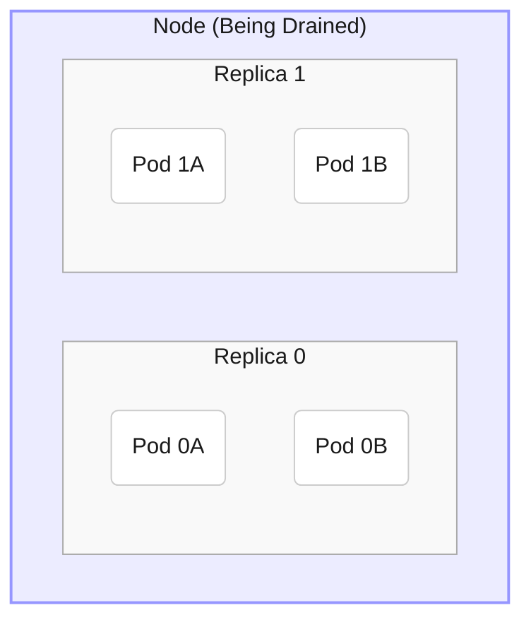
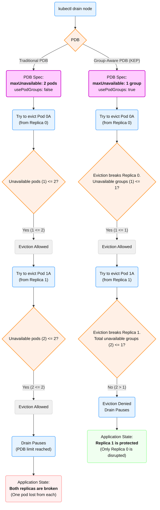
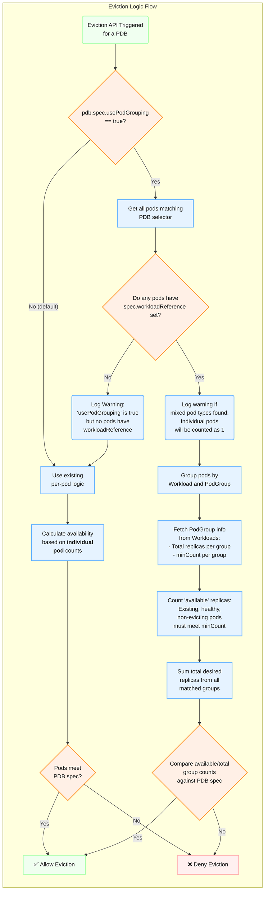

<!--
**Note:** When your KEP is complete, all of these comment blocks should be removed.

Follow the guidelines of the [documentation style guide].
In particular, wrap lines to a reasonable length, to make it
easier for reviewers to cite specific portions, and to minimize diff churn on
updates.

[documentation style guide]: https://github.com/kubernetes/community/blob/master/contributors/guide/style-guide.md

To get started with this template:

- [x] **Pick a hosting SIG.**
  Make sure that the problem space is something the SIG is interested in taking
  up. KEPs should not be checked in without a sponsoring SIG.
- [ ] **Create an issue in kubernetes/enhancements**
  When filing an enhancement tracking issue, please make sure to complete all
  fields in that template. One of the fields asks for a link to the KEP. You
  can leave that blank until this KEP is filed, and then go back to the
  enhancement and add the link.
- [ ] **Make a copy of this template directory.**
  Copy this template into the owning SIG's directory and name it
  `NNNN-short-descriptive-title`, where `NNNN` is the issue number (with no
  leading-zero padding) assigned to your enhancement above.
- [ ] **Fill out as much of the kep.yaml file as you can.**
  At minimum, you should fill in the "Title", "Authors", "Owning-sig",
  "Status", and date-related fields.
- [ ] **Fill out this file as best you can.**
  At minimum, you should fill in the "Summary" and "Motivation" sections.
  These should be easy if you've preflighted the idea of the KEP with the
  appropriate SIG(s).
- [ ] **Create a PR for this KEP.**
  Assign it to people in the SIG who are sponsoring this process.
- [ ] **Merge early and iterate.**
  Avoid getting hung up on specific details and instead aim to get the goals of
  the KEP clarified and merged quickly. The best way to do this is to just
  start with the high-level sections and fill out details incrementally in
  subsequent PRs.

Just because a KEP is merged does not mean it is complete or approved. Any KEP
marked as `provisional` is a working document and subject to change. You can
denote sections that are under active debate as follows:

```
<<[UNRESOLVED optional short context or usernames ]>>
Stuff that is being argued.
<<[/UNRESOLVED]>>
```

When editing KEPS, aim for tightly-scoped, single-topic PRs to keep discussions
focused. If you disagree with what is already in a document, open a new PR
with suggested changes.

One KEP corresponds to one "feature" or "enhancement" for its whole lifecycle.
You do not need a new KEP to move from beta to GA, for example. If
new details emerge that belong in the KEP, edit the KEP. Once a feature has become
"implemented", major changes should get new KEPs.

The canonical place for the latest set of instructions (and the likely source
of this file) is [here](/keps/NNNN-kep-template/README.md).

**Note:** Any PRs to move a KEP to `implementable`, or significant changes once
it is marked `implementable`, must be approved by each of the KEP approvers.
If none of those approvers are still appropriate, then changes to that list
should be approved by the remaining approvers and/or the owning SIG (or
SIG Architecture for cross-cutting KEPs).
-->
# KEP-NNNN: PDB for Workload Replicas

<!--
This is the title of your KEP. Keep it short, simple, and descriptive. A good
title can help communicate what the KEP is and should be considered as part of
any review.
-->

<!--
A table of contents is helpful for quickly jumping to sections of a KEP and for
highlighting any additional information provided beyond the standard KEP
template.

Ensure the TOC is wrapped with
  <code>&lt;!-- toc --&rt;&lt;!-- /toc --&rt;</code>
tags, and then generate with `hack/update-toc.sh`.
-->

<!-- toc -->
- [Release Signoff Checklist](#release-signoff-checklist)
- [Summary](#summary)
- [Motivation](#motivation)
  - [Goals](#goals)
  - [Non-Goals](#non-goals)
- [Proposal](#proposal)
  - [User Stories (Optional)](#user-stories-optional)
    - [Story 1](#story-1)
    - [Story 2](#story-2)
  - [Notes/Constraints/Caveats (Optional)](#notesconstraintscaveats-optional)
  - [Risks and Mitigations](#risks-and-mitigations)
- [Design Details](#design-details)
  - [Test Plan](#test-plan)
      - [Prerequisite testing updates](#prerequisite-testing-updates)
      - [Unit tests](#unit-tests)
      - [Integration tests](#integration-tests)
      - [e2e tests](#e2e-tests)
  - [Graduation Criteria](#graduation-criteria)
  - [Upgrade / Downgrade Strategy](#upgrade--downgrade-strategy)
  - [Version Skew Strategy](#version-skew-strategy)
- [Production Readiness Review Questionnaire](#production-readiness-review-questionnaire)
  - [Feature Enablement and Rollback](#feature-enablement-and-rollback)
  - [Rollout, Upgrade and Rollback Planning](#rollout-upgrade-and-rollback-planning)
  - [Monitoring Requirements](#monitoring-requirements)
  - [Dependencies](#dependencies)
  - [Scalability](#scalability)
  - [Troubleshooting](#troubleshooting)
- [Implementation History](#implementation-history)
- [Drawbacks](#drawbacks)
- [Alternatives](#alternatives)
- [Infrastructure Needed (Optional)](#infrastructure-needed-optional)
<!-- /toc -->

## Release Signoff Checklist

<!--
**ACTION REQUIRED:** In order to merge code into a release, there must be an
issue in [kubernetes/enhancements] referencing this KEP and targeting a release
milestone **before the [Enhancement Freeze](https://git.k8s.io/sig-release/releases)
of the targeted release**.

For enhancements that make changes to code or processes/procedures in core
Kubernetes—i.e., [kubernetes/kubernetes], we require the following Release
Signoff checklist to be completed.

Check these off as they are completed for the Release Team to track. These
checklist items _must_ be updated for the enhancement to be released.
-->

Items marked with (R) are required *prior to targeting to a milestone / release*.

- [ ] (R) Enhancement issue in release milestone, which links to KEP dir in [kubernetes/enhancements] (not the initial KEP PR)
- [ ] (R) KEP approvers have approved the KEP status as `implementable`
- [ ] (R) Design details are appropriately documented
- [ ] (R) Test plan is in place, giving consideration to SIG Architecture and SIG Testing input (including test refactors)
  - [ ] e2e Tests for all Beta API Operations (endpoints)
  - [ ] (R) Ensure GA e2e tests meet requirements for [Conformance Tests](https://github.com/kubernetes/community/blob/master/contributors/devel/sig-architecture/conformance-tests.md)
  - [ ] (R) Minimum Two Week Window for GA e2e tests to prove flake free
- [ ] (R) Graduation criteria is in place
  - [ ] (R) [all GA Endpoints](https://github.com/kubernetes/community/pull/1806) must be hit by [Conformance Tests](https://github.com/kubernetes/community/blob/master/contributors/devel/sig-architecture/conformance-tests.md) within one minor version of promotion to GA
- [ ] (R) Production readiness review completed
- [ ] (R) Production readiness review approved
- [ ] "Implementation History" section is up-to-date for milestone
- [ ] User-facing documentation has been created in [kubernetes/website], for publication to [kubernetes.io]
- [ ] Supporting documentation—e.g., additional design documents, links to mailing list discussions/SIG meetings, relevant PRs/issues, release notes

<!--
**Note:** This checklist is iterative and should be reviewed and updated every time this enhancement is being considered for a milestone.
-->

[kubernetes.io]: https://kubernetes.io/
[kubernetes/enhancements]: https://git.k8s.io/enhancements
[kubernetes/kubernetes]: https://git.k8s.io/kubernetes
[kubernetes/website]: https://git.k8s.io/website

## Summary

<!--
This section is incredibly important for producing high-quality, user-focused
documentation such as release notes or a development roadmap. It should be
possible to collect this information before implementation begins, in order to
avoid requiring implementors to split their attention between writing release
notes and implementing the feature itself. KEP editors and SIG Docs
should help to ensure that the tone and content of the `Summary` section is
useful for a wide audience.

A good summary is probably at least a paragraph in length.
-->

The Eviction API uses PodDisruptionBudgets (PBDs) to ensure availability of a certain number or percentage of pods during voluntary disruptions. This proposal would allow eviction to treat groups of pods as if they were individual replicas for the purposes of measuring availability. We determine pod groups using the new `Workload` API in the [gang scheduling KEP](https://github.com/kubernetes/enhancements/tree/master/keps/sig-scheduling/4671-gang-scheduling), where pods declare their owning workload and pod group and `Workload` objects contain information about replicas and group size. To enable this functionality, optional boolean field `usePodGroups` will be added to the PDB spec.

*Note: as of this draft, the `Workload` API is still in progress, for this KEP we assume it is fully implemented*

## Motivation

<!--
This section is for explicitly listing the motivation, goals, and non-goals of
this KEP.  Describe why the change is important and the benefits to users. The
motivation section can optionally provide links to [experience reports] to
demonstrate the interest in a KEP within the wider Kubernetes community.

[experience reports]: https://github.com/golang/go/wiki/ExperienceReports
-->

The goal is to make PDBs more useful for pod groups. For example, a multi-pod [LeaderWorkerSet](https://lws.sigs.k8s.io/docs/overview/) replica (intended for distributed workloads like ML training and inference) will fail if any of its pods fails. Eviction or preemption of a small number of pods across multiple replicas would disrupt each replica, as opposed to evicting multiple pods from a single replica (only disrupting that one replica). We want the Eviction API to use a different definition of avalability for these cases, based on the health of pod groups rather than individual pods.

### Goals

<!--
List the specific goals of the KEP. What is it trying to achieve? How will we
know that this has succeeded?
-->

- **Introduce an opt-in for group-based PDBs:** Add a new boolean field `usePodGroups` to the `PodDisruptionBudget.spec`.
- **Define availability for pod groups:** Allow application owners to define PDBs for multi-pod replicas (as defined by the `Workload` API) rather than individual pods.
- **Update eviction logic:** When `usePodGroups: true` is set on a PDB, the eviction logic will use the `Workload` and `PodGroup` definitions (linked by `pod.spec.workload.name`) for grouping and calculate availability of groups.
- **Maintain compatibility:** Ensure that common cluster operations that respect PDBs, such as `kubectl drain` and node drains initiated by `cluster-autoscaler`, follow group-based disruption budgets when enabled.
- **Preserve existing functionality:** For backward compatibility, the behavior of PDBs without `usePodGroups: true` will be unchanged.

### Non-Goals

<!--
What is out of scope for this KEP? Listing non-goals helps to focus discussion
and make progress.
-->
 
This change will only affect the Eviction API. The following are involuntary disruptions and do not use the Eviction API:
- Manual pod deletion
- Pods being deleted by their owning controller (e.g. during Deployment rollout)
- Node failure
- Pod cleanup due to a node being removed from the cluster
- Evictions by the Kubelet due to node pressure (e.g. memory shortage)
- Taint manager deleting NoExecute tainted pods

The only change to object definitions will be the optional field in the `PodDisruptionBudget` spec to enable the changes.

This change will not affect the behavior of workload controllers for `Deployment`, `StatefulSet`, `Workload`, etc.
- The workload controller will be responsible for setting the `workload.name` and `workload.podGroup` on the pods it manages.
- The lifecycle and recovery of a disrupted replica is the responsibility of the workload controller, this will only handle evictions.

This change will not affect scheduling.
- There will be no additions or changes to gang scheduling. This only handles eviction of already-scheduled pods.

Partial replica health:
-  This KEP follows the definition of multi-pod replica health from the `Workload` API, using `minCount`. A replica is considered "available" if it meets `minCount`, and "unavailable" if it does not. We are not introducing any other definition of partial health (e.g. percentage).

Mixed workload types:
- If a PDB has multi-pod replicas enabled, individual pods without an assigned workload will be treated as single-pod groups.

## Proposal

<!--
This is where we get down to the specifics of what the proposal actually is.
This should have enough detail that reviewers can understand exactly what
you're proposing, but should not include things like API designs or
implementation. What is the desired outcome and how do we measure success?.
The "Design Details" section below is for the real
nitty-gritty.
-->

We propose adding a new, optional boolean field `usePodGroups` to the `PodDisruptionBudget.spec`. If this field is `false` (default) or unset, the Eviction API evaluates the PDB based on individual pod counts, preserving all existing behavior. If `true`, the Eviction API will find the `Workload` object and its `PodGroup` as specified by the Pod spec. This `PodGroup`  will define the minimum number of pods required for one replica of that group to be healthy, and how many replicas are expected. This will be used to measure availability of pod groups, and the PDB's `minAvailable` or `maxUnavailable` will be interpreted in terms of these `PodGroup` replicas, rather than individual pods.

### User Stories (Optional)

<!--
Detail the things that people will be able to do if this KEP is implemented.
Include as much detail as possible so that people can understand the "how" of
the system. The goal here is to make this feel real for users without getting
bogged down.
-->
*If the user is not using the `Workload` API, their process will be unaffected.*

#### Story 1: Distributed Workload

An ML engineer is running distributed training jobs using `Workload` API. The `Workload` defines a `PodGroup` named `worker` with `replicas: 10` and `policy.gang.minCount: 8`. This means the job has 10 replicas, each consisting of at least 8 pods.

To protect this long-running job from voluntary disruptions (like node drains), the user wants to ensure at least 9 of the 10 worker groups remain available.

This user would create a PDB targeting the worker pods:

```yaml
apiVersion: policy/v1
kind: PodDisruptionBudget
metadata:
  name: my-training-job-workers-pdb
spec:
  minAvailable: 9
  usePodGroups: true  # <-- New field to enable
  selector:
    matchLabels:
      # Assuming pods are labeled by the workload controller
      workload: my-training-job
      pod-group: worker
```

Upon node drain, the Eviction API will:
1.  See the PDB `my-training-job-workers-pdb` with `spec.usePodGrouping: true`.
2.  Select all pods matching the selector.
3.  Detect that these pods have `spec.workload.name: my-training-job` and `spec.workload.podGroup: worker`.
4.  Fetch the `Workload` object `my-training-job`.
5.  Find `worker` `PodGroup` in the `Workload`, which has 10 `replicas` and 8 `minSize`.
6.  Interpreting `minAvailable: 9` as pod groups, a group is considered disrupted if evicting a pod would cause its healthy pod count to drop below 8.
8.  The drain will proceed only if it does not cause the number of available worker groups to drop below 9.

This way, the job is protected to run with sufficient replicas during cluster maintenance.

#### Story 2: Cluster Maintenance

A cluster administrator frequently drains nodes for upgrades. The cluster has various workloads, including multi-pod applications defined by the `Workload` API.

To perform node drains safely, the administrator relies on application owners' PDBs. When the admin issues `kubectl drain <node>`, the Eviction API uses the process above and interprets the PDBs in terms of `PodGroup` replicas, ensuring that the drain does not violate the application's group-based availability requirements.

This allows safe maintenance without causing outages, as the drain will pause if it cannot evict pods without violating a group-based PDB. It will wait for better replica health, more availability, lower requirements, or the admin may contact the application owner to resolve.

#### Simplified Setup Example



In this simplified setup, the node being drained contains two replicas, each with two pods (there may be more nodes and replicas which we can ignore). The PDB wants at most one replica unavailable. Currently, the user might try `minUnavailable: 2` (one two-pod replica unavailable). The node drain would start, and could evict a pod from replica 0 and a pod from replica 1 before pausing (as there are only 2 pods left). This would disrupt both replicas. With the new changes, a PDB with `usePodGroups: true` and `minUnavailable: 1` (one replica unavailable) would pause before evicting a pod from the second replica, protecting one of the replicas as intended.




### Notes/Constraints/Caveats (Optional)

<!--
What are the caveats to the proposal?
What are some important details that didn't come across above?
Go in to as much detail as necessary here.
This might be a good place to talk about core concepts and how they relate.
-->

#### Background on multi-pod replicas (LWS)
In this KEP, the LeaderWorkerSet (LWS) is used as the primary example of a multi-pod replica system. The LWS API allows users to manage a group of pods together as if they were a single pod, by specifying a template for a "leader" pod and each "worker" pod and the number of pods in the group (size). This is useful in cases where a leader process coordinates multiple worker processes, particularly in AI/ML distributed workloads for model training and inference.

All worker pods are treated the same: they are created from the same template, operated on in parallel, and if any workers fail the group is considered failing. A LeaderWorkerSet object will specify "replicas," which are not additional pods (group size), but additional leader+workers pod groups. For unique identification, each worker has an index, and each replica of the group has an index. The pods have various labels providing information as seen in the [docs](https://lws.sigs.k8s.io/docs/reference/labels-annotations-and-environment-variables/).

#### Background on the `Workload` API

This KEP assumes that a pod controller (like the one managing `Workload` objects) will create pods and set `pod.spec.workload.name` and `pod.spec.workload.podGroup` on each pod it creates, linking it back to the `Workload` definition. The eviction logic uses this link to read the group's requirements.

In this KEP, the `Workload` object from the gang scheduling API is the source of truth for pod grouping.

A `Workload` object contains a list of `PodGroup`s. Each `PodGroup` defines:
* `name`: A unique identifier for the group within the `Workload`.
* `replicas`: The number of instances (replicas) of this group.
* `policy`: The scheduling policy, such as `Gang`.
* `policy.gang.minCount`: The minimum number of pods required for one replica of that group.

In the context of LWS, a LWS replica is equivalent to a PodGroup replica, and its `size` is `minCount`.

This KEP assumes that a controller (like the one managing `Workload` objects) will create pods and set `pod.spec.workload.name` and `pod.spec.workload.podGroup` on each pod it creates, linking it back to the `Workload` definition. The eviction logic uses this link to read the group's requirements.

### Risks and Mitigations

<!--
What are the risks of this proposal, and how do we mitigate? Think broadly.
For example, consider both security and how this will impact the larger
Kubernetes ecosystem.

How will security be reviewed, and by whom?

How will UX be reviewed, and by whom?

Consider including folks who also work outside the SIG or subproject.
-->

- This feature relies on the pod's `spec.workload.name` and `spec.workload.podGroup` fields being correctly set by its managing controller. If a user sets `usePodGrouping: true` but the pods are not correctly linked to a `Workload` object, the eviction logic will fall back to per-pod counting, which may violate the application's true availability requirements (though it will prevent a drain from being blocked by misconfiguration).
- One failing pod in a large group will make that group "unavailable" if it drops below its `minCount`. A small number of failing pods spread across many groups could prevent all evictions and block a node drain. This is intended behavior (as the application is unhealthy), but may be surprising to operators.
- A PDB `selector` that matches pods from multiple different `PodGroup`s (or a mix of grouped and individual pods) may have complex or unintended behavior. Users should be advised to create separate PDBs for each distinct `PodGroup` they wish to protect.

## Design Details

<!--
This section should contain enough information that the specifics of your
change are understandable. This may include API specs (though not always
required) or even code snippets. If there's any ambiguity about HOW your
proposal will be implemented, this is the place to discuss them.
-->

### API Definition

We will add a new field to `PodDisruptionBudgetSpec` in `pkg/apis/policy/v1/types.go`.

```go
// PodDisruptionBudgetSpec defines the desired state of PodDisruptionBudget
type PodDisruptionBudgetSpec struct {
	// An eviction is allowed if at least "minAvailable" pods selected by
	// "selector" will still be available after the eviction, i.e. even in the
	// absence of the evicted pod.  So, "minAvailable" is a safety threshold,
	// an absolute number or a percentage.
	// +optional
	MinAvailable *intstr.IntOrString `json:"minAvailable,omitempty" protobuf:"bytes,1,opt,name=minAvailable"`

	// Label query over pods whose evictions are managed by the disruption
	// budget.
	// +optional
	Selector *metav1.LabelSelector `json:"selector,omitempty" protobuf:"bytes,2,opt,name=selector"`

	// An eviction is allowed if at most "maxUnavailable" pods selected by
	// "selector" are unavailable after the eviction, i.e. even in the
	// presence of the evicted pod.  So, "maxUnavailable" is a safety threshold,
	// an absolute number or a percentage.
	// +optional
	MaxUnavailable *intstr.IntOrString `json:"maxUnavailable,omitempty" protobuf:"bytes,3,opt,name=maxUnavailable"`

	// usePodGrouping indicates that availability should be calculated based on
	// pod groups defined by the Workload API (pod.spec.workloadReference).
	// If set to true, the eviction logic will interpret minAvailable/maxUnavailable
	// as a count of PodGroup replicas, not individual pods.
	// If a pod matched by the selector does not have a workloadReference,
	// it will be treated as an individual pod for availability calculations,
	// and a warning will be logged.
	// Defaults to false.
	// +optional
	UsePodGrouping bool `json:"usePodGrouping,omitempty" protobuf:"varint,4,opt,name=usePodGrouping"`
}
```

#### Eviction Logic Flow

If `pdb.spec.usePodGrouping: false` or unset, follow the existing per-pod availability behavior.
If `true`:
1.  Get all pods matching the PDB's `selector`.
2.  Check if all pods have `spec.workloadReference.Name` set.
3.  If no pods have `spec.workloadReference.Name`, log a warning (misconfiguration) and fall back to existing per-pod availability. If some pods have `spec.workloadReference.Name` unset, log a warning, as mixing pod types in one PDB is discouraged. Individual pods will be counted as their own group.
4.  Find the `Workload` object for each `spec.workloadReference.Name`
5.  Find the `PodGroup` in the `Workload` for each `spec.workloadReference.PodGroup`
6.  Get `PodGroup.replicas` (total replicas) and `PodGroup.policy.gang.minCount` (pods in each replica).
7.  Count the number of available replicas: a replica is available if its count of existing, healthy, non-evicting pods `>= minCount`.
8.  Count the total desired replicas, the sum of `replicas` for all `PodGroup`s.
9.  Compare this available group count and total against the PDB's `minAvailable` or `maxUnavailable` to decide if an eviction is allowed.



#### Group Health
A `PodGroup` replica is considered available if its number of existing, healthy, non-evicting pods is greater than or equal to its `policy.gang.minCount`.

For example, if a replica expects 10 pods with `minCount: 8` but only has 9 healthy pods (1 is missing or unhealthy), the replica is still considered **available**. If 3 pods are missing or unhealthy and only 7 healthy pods exist, the replica is **unavailable**. If any pod in an available group is targeted for eviction, it would be unhealthy post-eviction and is also counted as unavailable for the PDB calculation.


### Pods without `workloadReference`

If a PDB's `selector` matches a pod that is missing the `spec.workloadReference` field (or its `Name` is empty), it will be treated as an individual pod. If `usePodGrouping: true` is set, this will be logged as a warning. If the PDB matches *only* individual pods, this will be equivalent to the standard per-pod logic. If a selected pod has `spec.workload.name` but no `spec.workload.podGroup`, this is a misconfiguration and it will be treated as unhealthy.

### Test Plan

<!--
**Note:** *Not required until targeted at a release.*
The goal is to ensure that we don't accept enhancements with inadequate testing.

All code is expected to have adequate tests (eventually with coverage
expectations). Please adhere to the [Kubernetes testing guidelines][testing-guidelines]
when drafting this test plan.

[testing-guidelines]: https://git.k8s.io/community/contributors/devel/sig-testing/testing.md
-->

[x] I/we understand the owners of the involved components may require updates to
existing tests to make this code solid enough prior to committing the changes necessary
to implement this enhancement.

##### Prerequisite testing updates

<!--
Based on reviewers feedback describe what additional tests need to be added prior
implementing this enhancement to ensure the enhancements have also solid foundations.
-->

##### Unit tests

<!--
In principle every added code should have complete unit test coverage, so providing
the exact set of tests will not bring additional value.
However, if complete unit test coverage is not possible, explain the reason of it
together with explanation why this is acceptable.
-->

<!--
Additionally, for Alpha try to enumerate the core package you will be touching
to implement this enhancement and provide the current unit coverage for those
in the form of:
- <package>: <date> - <current test coverage>
The data can be easily read from:
https://testgrid.k8s.io/sig-testing-canaries#ci-kubernetes-coverage-unit

This can inform certain test coverage improvements that we want to do before
extending the production code to implement this enhancement.
-->

- `k8s.io/kubernetes/pkg/controller/disruption`: `<date>` - `<test coverage>` (tests for new eviction logic).
 
##### Integration tests

<!--
Integration tests are contained in https://git.k8s.io/kubernetes/test/integration.
Integration tests allow control of the configuration parameters used to start the binaries under test.
This is different from e2e tests which do not allow configuration of parameters.
Doing this allows testing non-default options and multiple different and potentially conflicting command line options.
For more details, see https://github.com/kubernetes/community/blob/master/contributors/devel/sig-testing/testing-strategy.md

If integration tests are not necessary or useful, explain why.
-->

<!--
This question should be filled when targeting a release.
For Alpha, describe what tests will be added to ensure proper quality of the enhancement.

For Beta and GA, document that tests have been written,
have been executed regularly, and have been stable.
This can be done with:
- permalinks to the GitHub source code
- links to the periodic job (typically https://testgrid.k8s.io/sig-release-master-blocking#integration-master), filtered by the test name
- a search in the Kubernetes bug triage tool (https://storage.googleapis.com/k8s-triage/index.html)

- [test name](https://github.com/kubernetes/kubernetes/blob/2334b8469e1983c525c0c6382125710093a25883/test/integration/...): [integration master](https://testgrid.k8s.io/sig-release-master-blocking#integration-master?include-filter-by-regex=MyCoolFeature), [triage search](https://storage.googleapis.com/k8s-triage/index.html?test=MyCoolFeature)
-->

- An integration test will be added to `test/integration/disruption` to simulate the eviction process.
- **Test 1:** PDB with `usePodGrouping: false` (default) and `Workload`-managed pods. Verify eviction uses per-pod counting.
- **Test 2:** PDB with `usePodGrouping: true` and `Workload`-managed pods. Verify eviction uses per-group counting and blocks when `minAvailable` groups would be violated.
- **Test 3:** PDB with `usePodGrouping: true` but with non-`Workload` pods. Verify eviction falls back to per-pod counting and logs a warning.

##### e2e tests

<!--
This question should be filled when targeting a release.
For Alpha, describe what tests will be added to ensure proper quality of the enhancement.

For Beta and GA, document that tests have been written,
have been executed regularly, and have been stable.
This can be done with:
- permalinks to the GitHub source code
- links to the periodic job (typically a job owned by the SIG responsible for the feature), filtered by the test name
- a search in the Kubernetes bug triage tool (https://storage.googleapis.com/k8s-triage/index.html)

We expect no non-infra related flakes in the last month as a GA graduation criteria.
If e2e tests are not necessary or useful, explain why.

- [test name](https://github.com/kubernetes/kubernetes/blob/2334b8469e1983c525c0c6382125710093a25883/test/e2e/...): [SIG ...](https://testgrid.k8s.io/sig-...?include-filter-by-regex=MyCoolFeature), [triage search](https://storage.googleapis.com/k8s-triage/index.html?test=MyCoolFeature)
-->

An e2e test will be added.
1.  Create a `Workload` with 2 `PodGroup` replicas, each with `minCount: 3`.
2.  Create a PDB with `minAvailable: 1` and `usePodGrouping: true` selecting these pods.
3.  Manually schedule pods such that one node drain would disrupt both groups (as in the example given earlier).
4.  Attempt to drain the node.
5.  Verify the drain is blocked by the PDB.
6.  Update PDB to `minAvailable: 0`.
7.  Verify the drain proceeds.

### Graduation Criteria

<!--
**Note:** *Not required until targeted at a release.*

Define graduation milestones.

These may be defined in terms of API maturity, [feature gate] graduations, or as
something else. The KEP should keep this high-level with a focus on what
signals will be looked at to determine graduation.

Consider the following in developing the graduation criteria for this enhancement:
- [Maturity levels (`alpha`, `beta`, `stable`)][maturity-levels]
- [Feature gate][feature gate] lifecycle
- [Deprecation policy][deprecation-policy]

Clearly define what graduation means by either linking to the [API doc
definition](https://kubernetes.io/docs/concepts/overview/kubernetes-api/#api-versioning)
or by redefining what graduation means.

In general we try to use the same stages (alpha, beta, GA), regardless of how the
functionality is accessed.

[feature gate]: https://git.k8s.io/community/contributors/devel/sig-architecture/feature-gates.md
[maturity-levels]: https://git.k8s.io/community/contributors/devel/sig-architecture/api_changes.md#alpha-beta-and-stable-versions
[deprecation-policy]: https://kubernetes.io/docs/reference/using-api/deprecation-policy/

Below are some examples to consider, in addition to the aforementioned [maturity levels][maturity-levels].

#### Alpha

- Feature implemented behind a feature flag
- Initial e2e tests completed and enabled

#### Beta

- Gather feedback from developers and surveys
- Complete features A, B, C
- Additional tests are in Testgrid and linked in KEP
- More rigorous forms of testing—e.g., downgrade tests and scalability tests
- All functionality completed
- All security enforcement completed
- All monitoring requirements completed
- All testing requirements completed
- All known pre-release issues and gaps resolved

**Note:** Beta criteria must include all functional, security, monitoring, and testing requirements along with resolving all issues and gaps identified

#### GA

- N examples of real-world usage
- N installs
- Allowing time for feedback
- All issues and gaps identified as feedback during beta are resolved

**Note:** GA criteria must not include any functional, security, monitoring, or testing requirements.  Those must be beta requirements.

**Note:** Generally we also wait at least two releases between beta and
GA/stable, because there's no opportunity for user feedback, or even bug reports,
in back-to-back releases.

**For non-optional features moving to GA, the graduation criteria must include
[conformance tests].**

[conformance tests]: https://git.k8s.io/community/contributors/devel/sig-architecture/conformance-tests.md

#### Deprecation

<!--
- Announce deprecation and support policy of the existing flag
- Two versions passed since introducing the functionality that deprecates the flag (to address version skew)
- Address feedback on usage/changed behavior, provided on GitHub issues
- Deprecate the flag
-->

### Upgrade / Downgrade Strategy

<!--
If applicable, how will the component be upgraded and downgraded? Make sure
this is in the test plan.

Consider the following in developing an upgrade/downgrade strategy for this
enhancement:
- What changes (in invocations, configurations, API use, etc.) is an existing
  cluster required to make on upgrade, in order to maintain previous behavior?
- What changes (in invocations, configurations, API use, etc.) is an existing
  cluster required to make on upgrade, in order to make use of the enhancement?
-->

Upgrade:
- No changes are required. The new field `usePodGrouping` defaults to `false`, so all existing PDBs will continue to function with per-pod logic.
- To use the feature, users must edit their PDBs to set `usePodGrouping: true`.

Downgrade:
- If a PDB was created with `usePodGrouping: true`, this field will be dropped when the API server is downgraded (as it's an unknown field).
- The PDB will revert to per-pod logic. This is a behavior change that could violate the application's intended availability (as shown in the user story).
- Operators should remove `usePodGrouping` on all PDBs before a downgrade.


### Version Skew Strategy

<!--
If applicable, how will the component handle version skew with other
components? What are the guarantees? Make sure this is in the test plan.

Consider the following in developing a version skew strategy for this
enhancement:
- Does this enhancement involve coordinating behavior in the control plane and nodes?
- How does an n-3 kubelet or kube-proxy without this feature available behave when this feature is used?
- How does an n-1 kube-controller-manager or kube-scheduler without this feature available behave when this feature is used?
- Will any other components on the node change? For example, changes to CSI,
  CRI or CNI may require updating that component before the kubelet.
-->

This feature is entirely contained within the disruption controller in `kube-controller-manager` and the API server. By defaulting to false, a conflict generally reverts to the existing behavior.
- **New API server, old KCM:** The API server will accept the `usePodGrouping` field, but the old KCM will not know about it and will ignore it, always using per-pod logic. This matches the downgrade scenario.
- **Old API server, new KCM:** The new KCM will attempt to read the `usePodGrouping` field, but it won't exist on PDB objects. The KCM will default to `false` and use per-pod logic.

The feature will only be active when both the API server and `kube-controller-manager` are at the new version and the user has set the field to `true`.

## Production Readiness Review Questionnaire

<!--

Production readiness reviews are intended to ensure that features merging into
Kubernetes are observable, scalable and supportable; can be safely operated in
production environments, and can be disabled or rolled back in the event they
cause increased failures in production. See more in the PRR KEP at
https://git.k8s.io/enhancements/keps/sig-architecture/1194-prod-readiness.

The production readiness review questionnaire must be completed and approved
for the KEP to move to `implementable` status and be included in the release.

In some cases, the questions below should also have answers in `kep.yaml`. This
is to enable automation to verify the presence of the review, and to reduce review
burden and latency.

The KEP must have a approver from the
[`prod-readiness-approvers`](http://git.k8s.io/enhancements/OWNERS_ALIASES)
team. Please reach out on the
[#prod-readiness](https://kubernetes.slack.com/archives/CPNHUMN74) channel if
you need any help or guidance.
-->

### Feature Enablement and Rollback

<!--
This section must be completed when targeting alpha to a release.
-->

###### How can this feature be enabled / disabled in a live cluster?

<!--
Pick one of these and delete the rest.

Documentation is available on [feature gate lifecycle] and expectations, as
well as the [existing list] of feature gates.

[feature gate lifecycle]: https://git.k8s.io/community/contributors/devel/sig-architecture/feature-gates.md
[existing list]: https://kubernetes.io/docs/reference/command-line-tools-reference/feature-gates/
-->

- [ ] Feature gate (also fill in values in `kep.yaml`)
  - Feature gate name:
  - Components depending on the feature gate:
- [x] Other
  - Describe the mechanism: The feature is enabled on a per-PDB basis with `spec.usePodGrouping: true`. It is disabled by default.
  - Will enabling / disabling the feature require downtime of the control plane? No
  - Will enabling / disabling the feature require downtime or reprovisioning of a node? No

###### Does enabling the feature change any default behavior?

<!--
Any change of default behavior may be surprising to users or break existing
automations, so be extremely careful here.
-->

No. The default behavior (field unset or `false`) uses existing per-pod availability. The new behavior is opt-in per-PDB.

###### Can the feature be disabled once it has been enabled (i.e. can we roll back the enablement)?

<!--
Describe the consequences on existing workloads (e.g., if this is a runtime
feature, can it break the existing applications?).

Feature gates are typically disabled by setting the flag to `false` and
restarting the component. No other changes should be necessary to disable the
feature.

NOTE: Also set `disable-supported` to `true` or `false` in `kep.yaml`.
-->

Yes, update the PDB to remove the field or set to `false`.

###### What happens if we reenable the feature if it was previously rolled back?

The group-based logic will be re-enabled on the next eviction which uses the PDB.

###### Are there any tests for feature enablement/disablement?

<!--
The e2e framework does not currently support enabling or disabling feature
gates. However, unit tests in each component dealing with managing data, created
with and without the feature, are necessary. At the very least, think about
conversion tests if API types are being modified.

Additionally, for features that are introducing a new API field, unit tests that
are exercising the `switch` of feature gate itself (what happens if I disable a
feature gate after having objects written with the new field) are also critical.
You can take a look at one potential example of such test in:
https://github.com/kubernetes/kubernetes/pull/97058/files#diff-7826f7adbc1996a05ab52e3f5f02429e94b68ce6bce0dc534d1be636154fded3R246-R282
-->

Testing will cover both states of the boolean field.

### Rollout, Upgrade and Rollback Planning

<!--
This section must be completed when targeting beta to a release.
-->

###### How can a rollout or rollback fail? Can it impact already running workloads?

<!--
Try to be as paranoid as possible - e.g., what if some components will restart
mid-rollout?

Be sure to consider highly-available clusters, where, for example,
feature flags will be enabled on some API servers and not others during the
rollout. Similarly, consider large clusters and how enablement/disablement
will rollout across nodes.
-->

If an operator downgrades the control plane, PDBs with `usePodGrouping: true` will have that field dropped by the older API server. The PDB will silently revert to per-pod logic, which could lead to an application outage during a node drain if the operator was relying on group-based protection.

###### What specific metrics should inform a rollback?

<!--
What signals should users be paying attention to when the feature is young
that might indicate a serious problem?
-->

- An unusually low eviction count (`evictions_total`) might indicate the new logic is too restrictive, or a large number of PDBs are blocking drains.
- An increase in metrics related to unhealthy workloads could indicate the group-based logic is not sufficientlly protecting pod groups.

###### Were upgrade and rollback tested? Was the upgrade->downgrade->upgrade path tested?

<!--
Describe manual testing that was done and the outcomes.
Longer term, we may want to require automated upgrade/rollback tests, but we
are missing a bunch of machinery and tooling and can't do that now.
-->

TODO

###### Is the rollout accompanied by any deprecations and/or removals of features, APIs, fields of API types, flags, etc.?

<!--
Even if applying deprecation policies, they may still surprise some users.
-->

No

### Monitoring Requirements

<!--
This section must be completed when targeting beta to a release.

For GA, this section is required: approvers should be able to confirm the
previous answers based on experience in the field.
-->

###### How can an operator determine if the feature is in use by workloads?

<!--
Ideally, this should be a metric. Operations against the Kubernetes API (e.g.,
checking if there are objects with field X set) may be a last resort. Avoid
logs or events for this purpose.
-->

`kubectl get pdb -A -o jsonpath='{..spec.usePodGrouping}'` will show PDBs which have the field set.

If needed, add metric `disruption_controller_pdbs_using_pod_grouping` for the number of PDBs with `usePodGrouping: true`.

###### How can someone using this feature know that it is working for their instance?

<!--
For instance, if this is a pod-related feature, it should be possible to determine if the feature is functioning properly
for each individual pod.
Pick one more of these and delete the rest.
Please describe all items visible to end users below with sufficient detail so that they can verify correct enablement
and operation of this feature.
Recall that end users cannot usually observe component logs or access metrics.
-->

- [ ] Events
  - Event Reason: 
- [ ] API .status
  - Condition name: 
  - Other field: 
- [x] Other (treat as last resort)
  - Details: A `kubectl drain` command will stop and report that it is blocked by the PDB, when before it would not have been.

###### What are the reasonable SLOs (Service Level Objectives) for the enhancement?

<!--
This is your opportunity to define what "normal" quality of service looks like
for a feature.

It's impossible to provide comprehensive guidance, but at the very
high level (needs more precise definitions) those may be things like:
  - per-day percentage of API calls finishing with 5XX errors <= 1%
  - 99% percentile over day of absolute value from (job creation time minus expected
    job creation time) for cron job <= 10%
  - 99.9% of /health requests per day finish with 200 code

These goals will help you determine what you need to measure (SLIs) in the next
question.
-->

- PDB reconciliation latency should not increase significantly.
- Eviction API latency should not increase significantly. The new logic involves additional API calls to get the `Workload` objects, which should be negligible.

###### What are the SLIs (Service Level Indicators) an operator can use to determine the health of the service?

<!--
Pick one more of these and delete the rest.
-->

- [x] Metrics
  - Metric name: `apiserver_request_duration_seconds` (for eviction requests)
  - Components exposing the metric: `kube-apiserver`

###### Are there any missing metrics that would be useful to have to improve observability of this feature?

<!--
Describe the metrics themselves and the reasons why they weren't added (e.g., cost,
implementation difficulties, etc.).
-->

Metrics related to the disruption controller, e.g. a `disruption_controller_reconciliations_total` labeled with the replica mode (individual or pod groups).
For catching issues, `disruption_controller_pdb_grouping_misconfig_total` for when `usePodGrouping: true` but no `workloadReference` is found on pods, triggering a fallback.

### Dependencies

<!--
This section must be completed when targeting beta to a release.
-->

###### Does this feature depend on any specific services running in the cluster?

<!--
Think about both cluster-level services (e.g. metrics-server) as well
as node-level agents (e.g. specific version of CRI). Focus on external or
optional services that are needed. For example, if this feature depends on
a cloud provider API, or upon an external software-defined storage or network
control plane.

For each of these, fill in the following—thinking about running existing user workloads
and creating new ones, as well as about cluster-level services (e.g. DNS):
  - [Dependency name]
    - Usage description:
      - Impact of its outage on the feature:
      - Impact of its degraded performance or high-error rates on the feature:
-->

- `Workload` API (CRD)
  - Usage description: The disruption controller must be able to GET `Workload` objects by name from a pod's `workloadReference`.
  - Impact of its outage on the feature: If the API server is down, evictions won't happen anyway. If the `Workload` CRD is somehow unavailable or the object is missing, the controller will fail to find the group definition. In this case for safety we would deny eviction, as availability cannot be guaranteed.
  - Impact of its degraded performance: High latency on GET requests for `Workload` objects would increase the latency of eviction requests.

### Scalability

<!--
For alpha, this section is encouraged: reviewers should consider these questions
and attempt to answer them.

For beta, this section is required: reviewers must answer these questions.

For GA, this section is required: approvers should be able to confirm the
previous answers based on experience in the field.
-->

###### Will enabling / using this feature result in any new API calls?

<!--
Describe them, providing:
  - API call type (e.g. PATCH pods)
  - estimated throughput
  - originating component(s) (e.g. Kubelet, Feature-X-controller)
Focusing mostly on:
  - components listing and/or watching resources they didn't before
  - API calls that may be triggered by changes of some Kubernetes resources
    (e.g. update of object X triggers new updates of object Y)
  - periodic API calls to reconcile state (e.g. periodic fetching state,
    heartbeats, leader election, etc.)
-->

`GET` on `workload.k8s.io/v1alpha1.Workload` objects from `kube-controller-manager` (disruption controller) during an eviction request and controller reconciliation. This should be low-volume, as evictions are not typically frequent. The controller will may use a cache to reduce API calls, for example an informer could prevent some new API calls, but add a `WATCH` from the controller on `Workload`s.

###### Will enabling / using this feature result in introducing new API types?

<!--
Describe them, providing:
  - API type
  - Supported number of objects per cluster
  - Supported number of objects per namespace (for namespace-scoped objects)
-->

No

###### Will enabling / using this feature result in any new calls to the cloud provider?

<!--
Describe them, providing:
  - Which API(s):
  - Estimated increase:
-->

No

###### Will enabling / using this feature result in increasing size or count of the existing API objects?

<!--
Describe them, providing:
  - API type(s):
  - Estimated increase in size: (e.g., new annotation of size 32B)
  - Estimated amount of new objects: (e.g., new Object X for every existing Pod)
-->

Yes.
- API type(s): `policy/v1.PodDisruptionBudget`
- Estimated increase in size: One boolean field `usePodGrouping`.
- Estimated amount of new objects: 0.

###### Will enabling / using this feature result in increasing time taken by any operations covered by existing SLIs/SLOs?

<!--
Look at the [existing SLIs/SLOs].

Think about adding additional work or introducing new steps in between
(e.g. need to do X to start a container), etc. Please describe the details.

[existing SLIs/SLOs]: https://git.k8s.io/community/sig-scalability/slos/slos.md#kubernetes-slisslos
-->

Not significantly. The eviction check may now potentially perform an additional API call for `Workload` objects and perform the group-based counting logic.

###### Will enabling / using this feature result in non-negligible increase of resource usage (CPU, RAM, disk, IO, ...) in any components?

<!--
Things to keep in mind include: additional in-memory state, additional
non-trivial computations, excessive access to disks (including increased log
volume), significant amount of data sent and/or received over network, etc.
This through this both in small and large cases, again with respect to the
[supported limits].

[supported limits]: https://git.k8s.io/community//sig-scalability/configs-and-limits/thresholds.md
-->

If an informer/cache for `Workload` objects is added to the `kube-controller-manager`, this will increase its RAM usage by a small amount for each `Workload` object in the cluster.

###### Can enabling / using this feature result in resource exhaustion of some node resources (PIDs, sockets, inodes, etc.)?

<!--
Focus not just on happy cases, but primarily on more pathological cases
(e.g. probes taking a minute instead of milliseconds, failed pods consuming resources, etc.).
If any of the resources can be exhausted, how this is mitigated with the existing limits
(e.g. pods per node) or new limits added by this KEP?

Are there any tests that were run/should be run to understand performance characteristics better
and validate the declared limits?
-->

No

### Troubleshooting

<!--
This section must be completed when targeting beta to a release.

For GA, this section is required: approvers should be able to confirm the
previous answers based on experience in the field.

The Troubleshooting section currently serves the `Playbook` role. We may consider
splitting it into a dedicated `Playbook` document (potentially with some monitoring
details). For now, we leave it here.
-->

###### How does this feature react if the API server and/or etcd is unavailable?

No different behavior. Eviction requests will fail regardless if the API server is down.

###### What are other known failure modes?

<!--
For each of them, fill in the following information by copying the below template:
  - [Failure mode brief description]
    - Detection: How can it be detected via metrics? Stated another way:
      how can an operator troubleshoot without logging into a master or worker node?
    - Mitigations: What can be done to stop the bleeding, especially for already
      running user workloads?
    - Diagnostics: What are the useful log messages and their required logging
      levels that could help debug the issue?
      Not required until feature graduated to beta.
    - Testing: Are there any tests for failure mode? If not, describe why.
-->

None that are not already part of the Eviction API

###### What steps should be taken if SLOs are not being met to determine the problem?

## Implementation History

<!--
Major milestones in the lifecycle of a KEP should be tracked in this section.
Major milestones might include:
- the `Summary` and `Motivation` sections being merged, signaling SIG acceptance
- the `Proposal` section being merged, signaling agreement on a proposed design
- the date implementation started
- the first Kubernetes release where an initial version of the KEP was available
- the version of Kubernetes where the KEP graduated to general availability
- when the KEP was retired or superseded
-->

## Drawbacks

<!--
Why should this KEP _not_ be implemented?
-->

## Alternatives

<!--
What other approaches did you consider, and why did you rule them out? These do
not need to be as detailed as the proposal, but should include enough
information to express the idea and why it was not acceptable.
-->

Initially there was a plan to integrate directly with multi-pod replica systems (LWS). This would add optional field `replicaKey` to the PDB spec, so the user may provide a label which would identify pods in the same group. For LWS, all pods in a leader+workers group will share the same value for label key `leaderworkerset.sigs.k8s.io/group-key`. This would also require keys to fetch the expected replica count (otherwise we could not detect a missing replica for `maxUnavailable` or a percentage `minAvailable`) and replica size (otherwise we could not detect a missing pod making a replica unhealthy). With the `Workload` API approved and implementaiton in progress, it is better to have both PDBs and LWS integrate with this new core component.

In the case given in the simplified example above, there may be a way to change the eviction logic to such that the order of pod eviction preserves replicas when possible (e.g. prioritize evicting pods from the replica with the most pods in the node). However, it is simpler to understand and easier ensure intended behavior by just extending the existing PDB budget pattern. It is also unclear if this would work fully when gang scheduling is not used or the number of pods is greater than `minCount`.


## Infrastructure Needed (Optional)

<!--
Use this section if you need things from the project/SIG. Examples include a
new subproject, repos requested, or GitHub details. Listing these here allows a
SIG to get the process for these resources started right away.
-->
