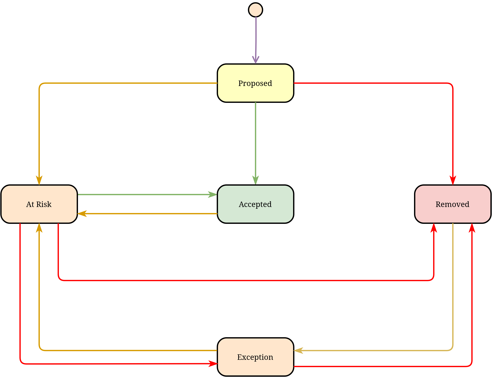

# KEP-2140: Receipts process for tracking release enhancements

<!-- toc -->
- [Release Signoff Checklist](#release-signoff-checklist)
- [Summary](#summary)
- [Motivation](#motivation)
  - [Goals](#goals)
  - [Non-Goals](#non-goals)
- [Proposal](#proposal)
  - [User Stories](#user-stories)
    - [KEP Authors](#kep-authors)
      - [Proposing enhancements](#proposing-enhancements)
      - [Filing an exception to Enhancements/Code Freeze](#filing-an-exception-to-enhancementscode-freeze)
    - [API Reviewers](#api-reviewers)
    - [SIG Chair / TLs / PMs](#sig-chair--tls--pms)
    - [Enhancements Subteam](#enhancements-subteam)
    - [Docs Subteam](#docs-subteam)
  - [Notes/Constraints/Caveats](#notesconstraintscaveats)
  - [Risks and Mitigations](#risks-and-mitigations)
- [Design Details](#design-details)
  - [How does a Receipt look like?](#how-does-a-receipt-look-like)
  - [Where are the Receipts stored?](#where-are-the-receipts-stored)
  - [State Diagram](#state-diagram)
  - [Initializing the Receipts directory for a Release](#initializing-the-receipts-directory-for-a-release)
  - [Proposing a KEP for a Release](#proposing-a-kep-for-a-release)
  - [Accepting a KEP for a Release](#accepting-a-kep-for-a-release)
  - [Removing a KEP from the Release](#removing-a-kep-from-the-release)
  - [Requesting an Exception for a KEP](#requesting-an-exception-for-a-kep)
  - [Generating the release manifest](#generating-the-release-manifest)
  - [Test Plan](#test-plan)
  - [Graduation Criteria](#graduation-criteria)
    - [Alpha (v1.21)](#alpha-v121)
    - [Alpha -&gt; Beta Graduation (v1.22) (Proposed)](#alpha---beta-graduation-v122-proposed)
    - [Future Graduations](#future-graduations)
- [Implementation History](#implementation-history)
<!-- /toc -->

## Release Signoff Checklist

Items marked with (R) are required *prior to targeting to a milestone / release*.

- [x] (R) Enhancement issue in release milestone, which links to KEP dir in [kubernetes/enhancements] (not the initial KEP PR)
- [ ] (R) KEP approvers have approved the KEP status as `implementable`
- [ ] (R) Design details are appropriately documented
- [-] (R) Test plan is in place, giving consideration to SIG Architecture and SIG Testing input
- [x] (R) Graduation criteria is in place
- [-] (R) Production readiness review completed
- [-] Production readiness review approved
- [-] "Implementation History" section is up-to-date for milestone
- [-] User-facing documentation has been created in [kubernetes/website], for publication to [kubernetes.io]
- [ ] Supporting documentation—e.g., additional design documents, links to mailing list discussions/SIG meetings, relevant PRs/issues, release notes

[kubernetes.io]: https://kubernetes.io/
[kubernetes/enhancements]: https://git.k8s.io/enhancements
[kubernetes/kubernetes]: https://git.k8s.io/kubernetes
[kubernetes/website]: https://git.k8s.io/website

## Summary


Introduce a new Git-based artifact and supporting tooling to support automated enhancement collection and tracking processes for Kubernetes releases.


## Motivation

When a Kubernetes release begins, the release team currently begins enhancement collection by:

* Reviewing all open Enhancement issues
* Reviewing previous issue comments to determine activity
* [Adding new comments and the milestone, and manually applying labels to get confirmation of inclusion in the release](https://github.com/kubernetes/enhancements/issues/1979#issuecomment-691394283)

This is very time-intensive for the release team and leads to many instances where notifications are missed, ultimately resulting in untracked Exceptions and rushed Exception Requests.

During the implementation phase of the release, more comments and back-and-forth conversation occurs on the Enhancement issue, including:

* tracking of kubernetes/kubernetes PRs[[1](https://github.com/kubernetes/enhancements/issues/1929#issuecomment-726228115)]
* tracking kubernetes/website PRs[[2](https://github.com/kubernetes/enhancements/issues/2000#issuecomment-722752540)].

This is also done simply by referencing the KEP from the kubernetes/kubernetes PR.

When a release cycle stage such as enhancement freeze or code freeze occurs, the issue is updated to reflect inclusion or removal from the milestone, and we again leverage comments and manually applied labels to convey status; as an example, consider [Build-in API Types Misses Code Freeze](https://github.com/kubernetes/enhancements/issues/1929#event-3991979549).

Additionally, when an exception is required, this is [handled via email](https://groups.google.com/g/kubernetes-sig-release/c/eCk4Xyb58GQ/m/tjgEstjyAQAJ) and linked back to the issue via additional comments, such as [Built-in API Types Defaults Exception Granted](https://github.com/kubernetes/enhancements/issues/1929#issuecomment-727043537).

Over time, this process becomes harder and harder to navigate, leading to decreased process clarity, frustration by contributors, and increased toil for the release team.

To streamline this process and increase transparency, we will add a new Git-based artifact, hereafter referred to as a receipt. This receipt represents an opt-in promise/soft commitment from a SIG about KEPs they're submitting to a specific release and will allow all tracking to occur via Git commits rather than via issue comments, PR references, and other non-auditable mechanisms.

### Goals

* Support better KEP validation and automation through Git-based process
* Reduce friction and toil early in a release cycle
* Eliminate instances where Enhancements aren't tracked due to miscommunication
* Encourage SIGs to update KEPs proactively and plan for release cycles
* Improve the Exception process turning exception requests into a PR by the SIG with proper approvals
* Increase KEP / Release transparency
* Encourage better KEP implementation history updates


### Non-Goals

* Generation of receipts for release cycles already closed (Eg. v1.20 and below)
  * Other than tooling development purposes
* Generating receipts by RT Enhancements Team on behalf of SIGs and KEP Authors


## Proposal

The opting-in process to a release will accept a specified file format (hereafter referred to as a `receipt`) containing metadata about the KEP being enrolled. There would be one receipt per KEP per release cycle.

The receipts would need to be created in the [k/enhancements][k-enhancements] repository. Once a KEP Author/Assignee creates a receipt on behalf of a SIG, it is understood that the feature has been soft opted-in to the release. The opt-in would be finalized only after the Enhancements Team verifies the laid-out acceptance criteria.

The Enhancements Team will continuously monitor the filed receipts during the Enhancements Collection period to verify the graduation requirements. The Enhancements Team will have the power to remove enhancements from the release if they feel they are not conforming to requirements. The team can ask the KEP Assignee to file an exception if the Enhancements Freeze deadline has been passed.

After the collection of Enhancements is completed, KEP Assignees will need to update their receipts with the implementation PRs and documentation PRs (if any). KEP Assignees can update the receipt with the relevant PRs before Enhancements Freeze as well. The Enhancements Team will monitor the mentioned PRs for Code Freeze completion requirements. The team will have the right to ask the assignee to file for an exception or counsel the assignee whether they want to bump the graduation of an enhancement to the next release cycle.

The RT Docs team will monitor the mentioned documentation PRs to see if it conforms to that release cycle's Docs deadline requirements.

[See below][#design-details] for the receipt format and the process.

### User Stories

<!--
DOUBT: Should we rewrite these into user story format? i.e., "As a SIG tech lead, I want to graduate a KEP in a specific release."
-->

#### KEP Authors

##### Proposing enhancements

* Specify New KEP for Release
* Specify Graduation phase for existing KEP
* Link / Report k/k PRs for a given Enhancement
* Indicate k/w PRs for a given Enhancement

##### Filing an exception to Enhancements/Code Freeze

* Request Exception for Enhancement Freeze
* Request Exception for Code Freeze

#### API Reviewers

* Review / Approve Exception Requests that need API Review
    * Ensure reviewer bandwidth considered
    * Prioritize areas for upcoming releases

#### SIG Chair / TLs / PMs

* Review Open/Proposed KEPs for my SIG
    * Help plan reviews / dependencies
    * Help identify major themes / release blogs
* Review At Risk KEPS for my SIG
    * Help prioritize last-minute reviews
* Review and create Exceptions for my SIG
    * Determine release-blocking / primary importance
* Review Slipped Enhancements to support planning
    * Determine what phase it missed
    * Identify multiple slips / misses

#### Enhancements Subteam

* Pre enhancements Freeze (Enhancements Collection)
  * Collect intentions/plans of KEP authors to graduate a KEP
  * Ensure that those intents comply with all requirements of the KEP
  * Mark enhancements "At Risk" based on compliance with all requirements of the KEP

* At Enhancements Freeze
  * Remove enhancements that do not comply with requirements

* Enhancements Freeze - Code Freeze
  * Ensure that the k/k PRs for the KEP are populated
  * Mark enhancements "At Risk" based on the progress of implementation
  * Approve/Deny exceptions for Enhancements Freeze

* Around Code Freeze
  * Ensure that the enlisted k/k are merged
  * Approve/Deny exceptions for Code Freeze

* At Code Freeze
  * Remove enhancements that have not completed requirements for Code Freeze

* Throughout the Cycle
  * Prepare a manifest of what's the status of enhancements at any point in time

#### Docs Subteam

* Enhancements Freeze - Open Docs PR Deadline
  * Ensure that the k/w PRs are populated in the KEPs
  * Communicate to SIG Docs about the expected review load

* Open Docs PR Deadline - Docs Complete
  * Mark enhancements "At Risk" if the following are true:
    *  Docs PRs are not updated
    *  The draft PRs have not been updated

### Notes/Constraints/Caveats

This KEP is based on a [high-level plan](https://docs.google.com/document/d/1qnfXjQCBrikbbu9F38hdzWEo5ZDBd57Cqi0wG0V6aGc/edit#) incorporating feedback collected from release team members and contributors over several cycles.

In 1.22, we'll focus on implementing much of this process manually, so there will be some burden placed on KEP Authors to create the appropriate YAML structure. But ideally, these changes will free up time for people on the release team to work on automating the receipts process.

### Risks and Mitigations

* Non-compliance to the process by stakeholders like SIGs/KEP Authors
  * Stricter gates have to be put for the process
  * Exceptions only approach for a receipt to be added back to release cycle stage after the deadline
  * Enhancement Team + Release Leads should have the final say on exceptions. The decision needs to be taken after considering the point of view of respective SIG leadership.
* Conflicts can arise when two people update/modify the same artifact
  * The team needs to have Git experience
  * Only one person works on the artifacts at a time
  * Communicate with each other when making changes
  * Bots can eventually handle the manifest generation
* Keeping KEP implementation history updated
  * Requires intervention from a human and trust needs to be on the same person
* Preventing enhancements to slip across release cycles
* Ensuring enhancements don't permanently remain in the Beta stage
* This KEP doesn't talk about KEP owners keeping enhancements issues up-to-date

## Design Details


### How does a Receipt look like?

A Receipt has the following data stored at any point in time.

```yaml
title: Receipts process for tracking release enhancements
kep-number: 2140
owning-sig: sig-architecture
path: sig-architecture/2140-receipts
tracking-status: proposed
stage: alpha
```

### Where are the Receipts stored?

The Receipts will be stored in `releases` directory of the [k/enhancements][k-enhancements] repository. Each release will have a subdirectory and the structure would look like this.

```
tree releases
releases
└── v1.21
    ├── accepted
    │   └── 0001.yaml
    ├── at-risk
    │   └── 0002.yaml
    ├── exception
    │   └── 0003.yaml
    ├── OWNERS
    ├── proposed
    │   └── 0004.yaml
    └── removed
        └── 0005.yaml
```

The `OWNERS` file contains the Enhancements Team for that specific Release cycle.

### State Diagram



The flows shown in the state diagram are described in the sections below. Some of the flows described will have appropriate `kepctl` commands from the `Alpha` version itself. Other helper commands will be added and existing commands refined throughout the rollout process.
### Initializing the Receipts directory for a Release

In the initial rollout of this process, the release team will manually generate this structure, however, `kepctl` will provide a command to generate this structure:


```
$ kepctl create release v1.22
==> 1.22 Release Created
$ tree releases
releases
└── v1.22
    ├── accepted
    ├── at-risk
    ├── exception
    ├── OWNERS
    ├── proposed
    └── removed
```

### Proposing a KEP for a Release

A KEP author or SIG Chair/Tech Lead opts-in to a given release by creating the receipt document ([described above](#where-are-the-receipts-stored)) in the `proposed`  directory for the specified release. The `latest-milestone` and `stage` should be updated in the associated `kep.yaml` file as well. This process can be done manually or with `kepctl`.

```
$ kepctl promote sig-architecture/000-mykep --stage beta --release v1.22
==> KEP sig-architecture/000-mykep updated
==> 1.22 Release Receipt Created For sig-architecture/000-mykep
==> Please Open a Pull Request to Finish Proposing This Enhancement for v1.22
```

A PR should then be opened by the KEP Author to complete the opt-in process. Once the PR is opened, a set of validation will run against the KEP based on the metadata in the receipt to ensure that all machine verifiable parts of the KEP are correctly populated for the specified stage. If required, when the validation completes, the enhancements team for that release will approve the PR. The KEP is now in the `proposed` state.

The `promote` command will also check for PRR requirements when creating the Receipt. This will pro-actively inform the KEP Authors of any issues with the KEP.

### Accepting a KEP for a Release

Once a receipt has been merged to the `proposed` state, the enhancements team will do further review of the KEP to validate things that cannot currently be automatically validated. Each `proposed` KEP will then be moved to the `accepted` directory, if all requirements are met. If the KEP is currently missing any required elements for the specified stage, it will be moved to the `at-risk` directory. This will be done periodically by the enhancements team, and new PRs will be generated to move the receipts to the proper location(s).


We will enhance `kepctl` to add an `accept` command that will perform any available validation and handle the movement of the `receipt`:

```
$ tree releases
releases
└── v1.22
    ├── accepted
    │   └── 0001.yaml
    ├── at-risk
    │   └── 0002.yaml
    ├── exception
    ├── OWNERS
    ├── proposed
    │   └── 0004.yaml
    └── removed
        └── 0003.yaml

$ kepctl accept 0004 --at-risk --release v1.22
==> KEP 0004 moved to at-risk

$tree releases
releases
└── v1.22
    ├── accepted
    │   └── 0001.yaml
    ├── at-risk
    |   └── 0002.yaml
    |   └── 0004.yaml
    ├── exception
    ├── OWNERS
    ├── proposed
    └── removed
        └── 0003.yaml
```

Those receipts marked `at-risk`, will be periodically reviewed and moved to `accepted` once all required elements have been completed. In case, the requirements are not met by Enhancements Freeze, the


### Removing a KEP from the Release

Throughout the release cycle, a KEP may be removed from the release. This often occurs after `enhancement freeze`, when an at-risk KEP does not meet the specified stage requirements, or after `code freeze`, if all required implementation is not complete. Once these dates occur, the enhancements team will move the associated receipt to the `removed` directory of the release and open a PR to update the repository.

At this point, the KEP is no longer considered part of the release, and an exception must be granted in order for the KEP to be accepted back into the release.

We will enhance `kepctl` to add a `remove` command that will handle the movement of the `receipt`:

```
$ tree releases
releases
└── v1.22
    ├── accepted
    │   └── 0001.yaml
    ├── at-risk
    |   └── 0002.yaml
    ├── exception
    ├── OWNERS
    ├── proposed
    |   └── 0004.yaml
    └── removed
        └── 0003.yaml

$ kepctl remove 0004 --release v1.22
==> KEP 0004 moved to removed

$tree releases
releases
└── v1.22
    ├── accepted
    │   └── 0001.yaml
    ├── at-risk
    |   └── 0002.yaml
    ├── exception
    ├── OWNERS
    ├── proposed
    └── removed
        └── 0003.yaml
        └── 0004.yaml
```


### Requesting an Exception for a KEP

To request an exception for the release, the responsible SIG will create a new PR that moves the receipt into the `exception` directory. A PR template  in the `kubernetes/enhancement` repo will capture the relevant information for the exception request. The release team will approve the exception reqeust, but will require confirmation from any impacted reviewers on the PR before it is merged.


```
$ kepctl exception request --release v1.22 --sig api-machinery 1240
==> api-machinery/1240 moved to exception directory for v1.22.
==> Please open a pull request to complete this request: link_with_template.

```

The exception request pull request template will contain the questionnaire currently used in the exception request process:

```
Enhancement name:
Enhancement status (alpha/beta/stable):
SIG:
k/enhancements repo issue #:
PR #’s:
Additional time needed (in days):
Reason this enhancement is critical for this milestone:
Risks from adding code late: (to k8s stability, testing, etc.)
Risks from cutting enhancement: (partial implementation, critical customer usecase, etc.)
```

If an exception request is not granted, the receipt is moved back to the `removed` directory. If the exception is granted, it is moved to the `at-risk` directory until the conditions that caused it to be removed are corrected. `kepctl` will provide convenience methods for this as well:

```
$ kepctl exception accept --release v1.22 --sig api-machinery 1240
==> api-machinery/1240 moved to at-risk.


$ kepctl exception deny --release v1.22 --sig api-machinery 1240
==> api-machinery/1240 moved to removed
```


### Generating the release manifest

The current enhancement tracking sheet will no longer be used actively with the receipts process. To provide a concise view of the state of the release, the enhancements team will generate a release manifest that summarizes the `accepted`, `at-risk`, and `removed` enhancements. This manifest will be updated throughout the release cycle.

### Test Plan

This KEP entails a process change, and hence the tooling to enable the processes will have necessary tests.

### Graduation Criteria

#### Alpha (v1.21)

- Define the process to be followed by the SIGs when proposing an enhancement for the release
- Define the process to be followed by the Enhancements subteam every release cycle
- Minimal tooling to perform the defined process and validation of receipts
- Training/communicating the community about the changes to the process

#### Alpha -> Beta Graduation (v1.22) (Proposed)

- Automation for the processes introduced in the Alpha stage
- Tooling should pull data from `kep.yaml` ensuring minimal diff between receipts and KEP metadata
- Presubmit validations of receipts
- Ease of use of all the proposed tooling

#### Future Graduations

- Solving woes of Docs team
- Refining user experience based on feedback across release cycles

## Implementation History

- 2020-11-26: Provisional enhancement filed
- 2021-02-04: Enhancement made implementable
- 2021-02-04: Implementation started
  - Ref: https://github.com/kubernetes/enhancements/pull/2424
- 2021-MM-DD: Alpha criteria fulfilled
- 2021-MM-DD: Rolled out for a release

<!-- Links -->
[k-enhancements]: https://git.k8s.io/enhancements
