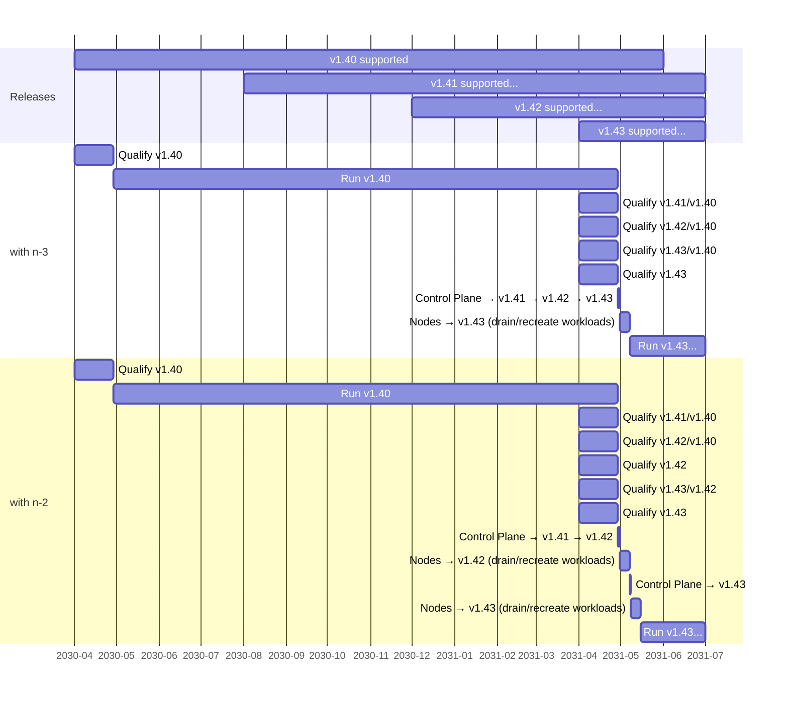

# KEP-3935: Support Oldest Node And Newest Control Plane

<!-- toc -->
- [Release Signoff Checklist](#release-signoff-checklist)
- [Summary](#summary)
- [Motivation](#motivation)
  - [Goals](#goals)
  - [Non-Goals](#non-goals)
- [Proposal](#proposal)
  - [Risks and Mitigations](#risks-and-mitigations)
- [Design Details](#design-details)
  - [Types of changes](#types-of-changes)
  - [Evaluate previous control plane releases](#evaluate-previous-control-plane-releases)
  - [Planned control plane changes](#planned-control-plane-changes)
  - [Impact summary](#impact-summary)
  - [Test Plan](#test-plan)
      - [Prerequisite testing updates](#prerequisite-testing-updates)
      - [Unit tests](#unit-tests)
      - [Integration tests](#integration-tests)
      - [e2e tests](#e2e-tests)
  - [Graduation Criteria](#graduation-criteria)
  - [Upgrade / Downgrade Strategy](#upgrade--downgrade-strategy)
  - [Version Skew Strategy](#version-skew-strategy)
- [Production Readiness Review Questionnaire](#production-readiness-review-questionnaire)
  - [Feature Enablement and Rollback](#feature-enablement-and-rollback)
  - [Rollout, Upgrade and Rollback Planning](#rollout-upgrade-and-rollback-planning)
  - [Monitoring Requirements](#monitoring-requirements)
  - [Dependencies](#dependencies)
  - [Scalability](#scalability)
  - [Troubleshooting](#troubleshooting)
- [Implementation History](#implementation-history)
<!-- /toc -->

## Release Signoff Checklist

<!--
**ACTION REQUIRED:** In order to merge code into a release, there must be an
issue in [kubernetes/enhancements] referencing this KEP and targeting a release
milestone **before the [Enhancement Freeze](https://git.k8s.io/sig-release/releases)
of the targeted release**.

For enhancements that make changes to code or processes/procedures in core
Kubernetes—i.e., [kubernetes/kubernetes], we require the following Release
Signoff checklist to be completed.

Check these off as they are completed for the Release Team to track. These
checklist items _must_ be updated for the enhancement to be released.
-->

Items marked with (R) are required *prior to targeting to a milestone / release*.

- [ ] (R) Enhancement issue in release milestone, which links to KEP dir in [kubernetes/enhancements] (not the initial KEP PR)
- [ ] (R) KEP approvers have approved the KEP status as `implementable`
- [ ] (R) Design details are appropriately documented
- [ ] (R) Test plan is in place, giving consideration to SIG Architecture and SIG Testing input (including test refactors)
  - [ ] e2e Tests for all Beta API Operations (endpoints)
  - [ ] (R) Ensure GA e2e tests meet requirements for [Conformance Tests](https://github.com/kubernetes/community/blob/master/contributors/devel/sig-architecture/conformance-tests.md) 
  - [ ] (R) Minimum Two Week Window for GA e2e tests to prove flake free
- [ ] (R) Graduation criteria is in place
  - [ ] (R) [all GA Endpoints](https://github.com/kubernetes/community/pull/1806) must be hit by [Conformance Tests](https://github.com/kubernetes/community/blob/master/contributors/devel/sig-architecture/conformance-tests.md) 
- [ ] (R) Production readiness review completed
- [ ] (R) Production readiness review approved
- [ ] "Implementation History" section is up-to-date for milestone
- [ ] User-facing documentation has been created in [kubernetes/website], for publication to [kubernetes.io]
- [ ] Supporting documentation—e.g., additional design documents, links to mailing list discussions/SIG meetings, relevant PRs/issues, release notes
  - sig-cluster-lifecycle: [2023-04-04](https://docs.google.com/document/d/1Gmc7LyCIL_148a9Tft7pdhdee0NBHdOfHS1SAF0duI4/edit#bookmark=id.dlswqqyv7xse)
  - sig-storage: [2023-04-06](https://docs.google.com/document/d/1-8KEG8AjAgKznS9NFm3qWqkGyCHmvU6HVl0sk5hwoAE/edit#bookmark=id.3pg0lcwvpqce)
  - sig-architecture: [2023-04-06](https://docs.google.com/document/d/1BlmHq5uPyBUDlppYqAAzslVbAO8hilgjqZUTaNXUhKM/edit#bookmark=id.b6nofrhcysqn)

<!--
**Note:** This checklist is iterative and should be reviewed and updated every time this enhancement is being considered for a milestone.
-->

[kubernetes.io]: https://kubernetes.io/
[kubernetes/enhancements]: https://git.k8s.io/enhancements
[kubernetes/kubernetes]: https://git.k8s.io/kubernetes
[kubernetes/website]: https://git.k8s.io/website

## Summary

This KEP proposes testing and expanding the supported skew between node and control plane components
by one version from n-2 to n-3, so that node components for the **oldest** supported minor version
work with control plane components for the **newest** supported minor version.

## Motivation

The Kubernetes [yearly support period](https://github.com/kubernetes/enhancements/tree/master/keps/sig-release/1498-kubernetes-yearly-support-period) already makes annual upgrades possible.
Users can upgrade to latest patch versions to pick up security fixes, and do 3 sequential minor version upgrades once a year to "catch up" to the latest supported minor version.

However, since the [tested/supported skew](https://kubernetes.io/releases/version-skew-policy/#kubelet) between nodes and control planes is currently limited to 2 versions,
a 3-version upgrade would have to update nodes twice to stay within supported skew. For example, to upgrade from v1.40 to v1.43:

  1. Begin: control plane and nodes on v1.40
  2. Control plane upgrade: v1.40 → v1.41 → v1.42
  3. Node upgrades: v1.40 → v1.42
  4. Control plane upgrade: v1.42 → v1.43
  5. Node upgrades: v1.42 → v1.43

Node upgrades are inherently more disruptive than control plane upgrades to workloads, for several reasons:

  * Workloads can be designed to have no dependencies on the Kubernetes control plane, so Kubernetes control plane availability does not directly impact running pods
  * There can be _many_ more nodes (hundreds to thousands) than control plane members (typically 1 or 3)
  * Every time nodes are upgraded to a new minor version, every pod running on those nodes [must be drained/rescheduled](https://kubernetes.io/releases/version-skew-policy/#kubelet-1).
    This is true for immutable nodes and mutable bare-metal nodes. If all nodes are being upgraded, this means every pod in the cluster will be replaced at least once.
  * Replacing or moving pods which are slow to stop or start or have significant data gravity takes significant time, so it is desirable to minimize how frequently that must be done.

If node / control plane skew support was expanded so the oldest node components work with the newest control plane components, the example upgrade path from v1.40 to v1.43 above could improve to this:

  1. Begin: control plane and nodes on v1.40
  2. Control plane upgrade: v1.40 → v1.41 → v1.42 → v1.43
  3. Node upgrades: v1.40 → v1.43

This streamlined upgrade flow would also reduce the number of control plane / node version combinations a user would have to qualify as part of an upgrade flow.

[[]](https://mermaid.live/view#pako:eNrdVk1vnDAQ_SuWpUiNBBs8Rk3FtaveNkrTUyqkysLeBBVsYky3qyjX_oD-xP6SmgV2-Vg2oGwv9cmMee-NB95onnGkuMABfmDSmFAiuzgz4pPSKTMI3dvlrlbuclmdsZ9x3pxd3LsXaSirg1xEJlYS3YlEsFzkTfwHWfgeyossU9oIjoIySHyvjjgIPOq5nu96ZLcnrvfe7g9gcgAvFguLJz7pgT-0wNcdMAzB0AUTGAXTIZi2waSbdgXuVmMTm0ckXVpFPxcsidfbuiZTVoAk_War9WSRThNsVczfVMx3hZzB2mbWhdwTI7Y2QnckyXaYOrmaIlUL0JKHOIfUSS_1NjPMZoaJzHQ2M53KPKfctP8h-8wflTRaJeg2YVKgP79-1x5odrDf0aP8UVZkD5px4XQ_Zy1MeCVzY02ft6jecc1ieaVFpIV1P9oo_T1RjOeXQwlpsXuRtkRbm_R-TFo6aFalxn7Mrv6r1oM3WA_-mfVgzHrw_1kPZhuEzjI1zGD2z21qOI-pT7DDMUvDa5aGqZbeSRyz9ECbnLwNnVSpsbt0M3hrm4KxNgVnbVMw1qbgRJvCDk6FnZ9iboeu51I9xOZRpCLEgd1ysWZFYkIcyhf7KiuM-rKVEQ6MLoSDi6wczpYxs7xpE8yY_KqUfVyzJLfPgsdG6VU11-3Gu5e_iHFuyg)

<!--
Source (render at https://mermaid.live)

-->

There is nothing magical about the number 2 in the existing version skew policy.
That policy intended to allow the oldest supported node to work with the newest supported control plane (exactly what this KEP is trying to accomplish).
When there are 3 supported minor versions, max skew of n-2 appears to make sense.

However, as part of the [yearly support period](https://github.com/kubernetes/enhancements/tree/master/keps/sig-release/1498-kubernetes-yearly-support-period#proposal) KEP,
it became clear that overlap between the oldest and newest version is required to actually give users a version they can use for a year.
This led to the current policy of supporting each minor version for approximately 14 months, giving users a 2-month period to qualify and upgrade following a new Kubernetes release
before the oldest supported minor version reaches end-of-life. During that 2-month period, there are actually 4 supported minor versions.

Updating the skew policy to allow up to n-3 nodes brings the policy back in line with its original goals.

### Goals

* Allow users to make full use of the [yearly support period](https://github.com/kubernetes/enhancements/tree/master/keps/sig-release/1498-kubernetes-yearly-support-period)
* Streamline upgrade paths for nodes / node pools to minimize required workload churn
* Validate oldest supported node components work with latest control plane components
* Update the [Kubernetes version skew policy](https://kubernetes.io/releases/version-skew-policy/) to indicate node components from the oldest supported minor version work with control plane components from the newest supported minor version, starting with Kubernetes `v1.25` nodes and `v1.28` control planes.

### Non-Goals

* This does not propose any changes to the number of supported minor versions
* This does not propose any changes to the minor version support duration
* This does not propose any changes to the Kubernetes release process
* This does not propose any changes to the mechanics control plane components use to enable features 
  and work with older nodes without features ([KEP-3920](https://github.com/kubernetes/enhancements/pull/3920) could help with this)
* This does not propose delaying introduction of existing features SIGs have planned around existing n-2 node/control plane skew

## Proposal

1. Add a configuration to https://testgrid.k8s.io/sig-node-kubelet#Summary to begin testing 3 version node / control plane skew
2. Identify in-flight feature enablement plans from SIGs that rely on a maximum of 2 version node / control plane skew, and the node version when those plans would be complete
3. Choose the minimum node version to begin supporting 3-version skew that avoids disrupting the plans identified in step 2
   * 1.25 nodes / 1.28 control planes
4. Update the [Kubernetes version skew policy](https://kubernetes.io/releases/version-skew-policy/) as part of the release identified in step 3

### Risks and Mitigations

`kubeadm` currently limits itself to managing nodes a single minor version older than the `kubeadm` build.
This restriction is overridden/ignored when `kubeadm` is used to create clusters in the existing skew CI jobs.
If the kubelet command-line or configuration file changed in ways `kubeadm` has to adapt to,
current builds of `kubeadm` could stop being able to successfully configure n-2 or n-3 nodes.
Note that this risk already exists for n-2 nodes, and has not proved problematic so far.

Possible mitigations include:
* sig-node extending rollout of command-line or configuration file changes to ease adoption by `kubeadm` over multiple versions.
  This approach has the benefit of also easing adoption by kubelet end users.
* sig-cluster-lifecycle restructuring the `join` functionality of `kubeadm` in a way that supports configuring older node versions in a maintainable way.
* Adjusting the way the skew CI jobs are configured to use `kubeadm` binaries from previous minor versions to configure nodes for those versions.

## Design Details

First, we'll look at the types of changes that actually prevent a specific control plane release from supporting older nodes.

Second, we'll evaluate previous control plane releases, to see how the proposed policy change could have impacted work in past releases.

Finally, we'll list known changes planned for future control plane releases, to evaluate the known impact of this proposal on future work.

### Types of changes

**Feature additions in control plane components that require waiting for node support**

There are two approaches currently used to roll out features that involve changes to both control plane and node components:

1. Enable a feature by default in a given release, require nodes be upgraded to that release 
   for the feature to work successfully, and expect users to wait until nodes are upgraded to use the new feature.
   This approach is common for opt-in features which fail safely or in benign ways if control plane and node enablement of the feature is inconsistent.
   This can result in a poor experience for users that try new features while running skewed nodes,
   but works reasonably well for users that don't care about the new features, or who keep nodes up to date with the control plane.

2. Make changes in node components first, and wait to enable the control plane changes until all node versions the control plane supports have the feature.
   This approach can be safer and provides a better experience in some ways, but at a significant velocity cost.
   With current skew support and release cadence, there is an 8-month delay between delivering node changes and enabling the feature in the control plane 2 releases later.
   Because of that velocity cost, this approach is typically reserved for features which are not opt-in, or would cause regressions,
   security issues, or significant problems if control plane and node enablement of the feature was inconsistent.

While both feature rollout approaches have room for improving velocity, safety, and usability,
that is outside the scope of this KEP, and better addressed by something like [KEP-3920](https://github.com/kubernetes/enhancements/pull/3920).

The first approach already accepts a new feature will not work with n-1 and n-2 skewed nodes, n-3 nodes would be no different.

For this KEP, we'll only look for instances of the second type of feature rollout, to evaluate how common they are, and how expanding supported skew to n-3 would have impacted them.

**Removal of deprecated or unused functionality in control plane components**

Evolution of node components sometimes produces opportunities to simplify or remove control plane functionality.
Control plane components must remain compatible with behavior relied on by older nodes that are within supported skew.

For this KEP, we'll look for instances of control plane cleanup that had to wait for n-2 nodes, and would have been delayed another release if n-3 nodes were supported.

**Removal of deprecated REST APIs used by node components**

Node components act as REST API clients and talk to APIs served by kube-apiserver.
If any of those APIs are unstable beta versions, they have a [finite lifetime](/keps/sig-architecture/1635-prevent-permabeta) and are eventually deprecated and no longer served.

All of the APIs required to run clusters and pass conformance tests [reached GA in v1.19](/keps/sig-architecture/1333-conformance-without-beta),
and node components were updated to use GA APIs by v1.19 at the latest.

Continued testing of GA-only clusters and a focus on [non-disruptive default configurations](/keps/sig-architecture/3136-beta-apis-off-by-default)
ensures that node components don't accidentally take hard dependencies on new unstable APIs.

Additionally, the 3-release deprecation period before removal of a beta API means node components which
update to the replacement API when the beta API is deprecated are compatible with the control plane 
that removes the beta API 3 releases later.

### Evaluate previous control plane releases

Were v1.22 control plane changes as compatible with v1.19 nodes as n-2 nodes?
* Feature enablement in control plane components that blocked until enabled in all supported node versions
  * ❌ sig-auth: `BoundServiceAccountTokenVolume` promoted to GA, which relies on kubelets having `TokenRequestProjection` enabled, which is only guaranteed in v1.20+ ([#93258](https://github.com/kubernetes/kubernetes/pull/93258))
    * Supporting n-3 nodes would have delayed GA graduation to v1.23, remaining in beta and enabled by default in v1.22.
* Removal of deprecated behavior in control plane components
  * ✅ None relevant to node components
* Removal of deprecated REST APIs used by node components ([source](https://kubernetes.io/docs/reference/using-api/deprecation-guide/#v1-24))
  * ✅ sig-api-machinery: v1beta1 Lease - v1.16 nodes switched to the v1 API ([#79473](https://github.com/kubernetes/kubernetes/pull/79473))
  * ✅ sig-auth: v1beta1 CertificateSigningRequest - v1.19 nodes switched to the v1 API ([#91754](https://github.com/kubernetes/kubernetes/pull/91754))
  * ✅ sig-auth: v1beta1 SubjectAccessReview - v1.17 nodes switched to the v1 API ([#84768](https://github.com/kubernetes/kubernetes/pull/84768))
  * ✅ sig-auth: v1beta1 TokenReview - v1.17 nodes switched to the v1 API ([#84768](https://github.com/kubernetes/kubernetes/pull/84768))
  * ✅ sig-storage: v1beta1 CSIDriver - v1.18 nodes switched to the v1 API ([#84814](https://github.com/kubernetes/kubernetes/pull/84814))
  * ✅ sig-storage: v1beta1 CSINode - v1.17 nodes switched to the v1 API ([#83474](https://github.com/kubernetes/kubernetes/pull/83474))
  * ✅ sig-storage: v1beta1 VolumeAttachment - v1.14 nodes switched to the v1 API ([#74606](https://github.com/kubernetes/kubernetes/pull/74606))

Were v1.23 control plane changes as compatible with v1.20 nodes as n-2 nodes?
* Feature enablement in control plane components that blocked until enabled in all supported node versions
  * ✅ None
* Removal of deprecated behavior in control plane components
  * ✅ None relevant to node components
* Removal of deprecated REST APIs used by node components ([source](https://kubernetes.io/docs/reference/using-api/deprecation-guide/#v1-24))
  * ✅ sig-auth: v1beta1 CertificateSigningRequest - v1.19 nodes switched to the v1 API ([#91754](https://github.com/kubernetes/kubernetes/pull/91754))

Were v1.24 control plane changes as compatible with v1.21 nodes as n-2 nodes?
* Feature enablement in control plane components that blocked until enabled in all supported node versions
  * ✅ None
* Removal of deprecated behavior in control plane components
  * ✅ sig-node: `StreamingProxyRedirects` was dropped, nodes dropped support in v1.20 ([#95935](https://github.com/kubernetes/kubernetes/pull/95935))
* Removal of deprecated REST APIs used by node components ([source](https://kubernetes.io/docs/reference/using-api/deprecation-guide/#v1-24))
  * ✅ None

Were v1.25 control plane changes as compatible with v1.22 nodes as n-2 nodes?
* Feature enablement in control plane components that blocked until enabled in all supported node versions
  * ❌ sig-auth: `IdentifyPodOS` relaxed Pod Security validation of Linux fields for Windows pods ([#105919](https://github.com/kubernetes/kubernetes/pull/105919)), which relies on kubelet honoring the `podOS` field, which was done in v1.23 ([#105292](https://github.com/kubernetes/kubernetes/pull/105292))
    * Supporting n-3 nodes would have delayed relaxing Pod Security validation for Windows pods to v1.26.
* Removal of deprecated behavior in control plane components
  * ✅ None relevant to node components
* Removal of deprecated REST APIs used by node components ([source](https://kubernetes.io/docs/reference/using-api/deprecation-guide/#v1-25))
  * ✅ sig-network: v1beta1 EndpointSlice - v1.22 kube-proxy already switched to use the v1 API ([#103306](https://github.com/kubernetes/kubernetes/pull/103306))

Were v1.26 control plane changes as compatible with v1.23 nodes as n-2 nodes?
* Feature enablement in control plane components that blocked until enabled in all supported node versions
  * ✅ None
* Removal of deprecated behavior in control plane components
  * ❌ sig-storage: `CSIMigrationOpenStack` in-tree volume plugin support removed ([#113826](https://github.com/kubernetes/kubernetes/pull/113826)), which relies on kubelets having `CSIMigrationOpenStack` enabled, which is guaranteed in v1.24+ ([#107462](https://github.com/kubernetes/kubernetes/pull/107462))
    * Supporting n-3 nodes would have delayed removal of the in-tree volume plugin to v1.27.
* Removal of deprecated REST APIs used by node components ([source](https://kubernetes.io/docs/reference/using-api/deprecation-guide/#v1-26))
  * ✅ None

Were v1.27 control plane changes as compatible with v1.24 nodes as n-2 nodes?
* Feature enablement in control plane components that blocked until enabled in all supported node versions
  * ✅ None
* Removal of deprecated behavior in control plane components
  * ❌ sig-storage: `CSIMigrationAWS` in-tree volume plugin support removed ([#115838](https://github.com/kubernetes/kubernetes/pull/115838)), which relies on kubelets having `CSIMigrationAWS` enabled, which is guaranteed in v1.25+ ([#111479](https://github.com/kubernetes/kubernetes/pull/111479))
    * Supporting n-3 nodes would have have delayed removal of the in-tree volume plugin to v1.28.
  * ❌ sig-storage: `CSIMigrationAzureDisk` in-tree volume plugin support removed ([#116301](https://github.com/kubernetes/kubernetes/pull/116301)), which relies on kubelets having `CSIMigrationAzureDisk` enabled, which is guaranteed in v1.25+ ([#110491](https://github.com/kubernetes/kubernetes/pull/110491))
    * Supporting n-3 nodes would have delayed removal of the in-tree volume plugin to v1.28.
* Removal of deprecated REST APIs used by node components ([source](https://kubernetes.io/docs/reference/using-api/deprecation-guide/#v1-27))
  * ✅ None

### Planned control plane changes

Are planned v1.28 control plane changes as compatible with v1.25 nodes as n-2 nodes?
* Feature enablement in control plane components that will wait for node support
  * ...
* Removal of deprecated behavior in control plane components
  * ✅ sig-storage: planned removal of in-tree volume plugins for `CSIMigrationGCE` feature, which is guaranteed on in v1.25 nodes ([#111301](https://github.com/kubernetes/kubernetes/pull/111301).
  * ...
* Removal of deprecated REST APIs used by node components ([source](https://kubernetes.io/docs/reference/using-api/deprecation-guide/#v1-28))
  * ✅ None

Are planned v1.29 control plane changes as compatible with v1.26 nodes as n-2 nodes?
* Feature enablement in control plane components that will wait for node support
  * ...
* Removal of deprecated behavior in control plane components
  * ⚠️ sig-storage: planned removal of in-tree volume plugins for `CSIMigrationvSphere` and `CSIMigrationAzureFile` features, which are guaranteed on in v1.27 nodes ([#116610](https://github.com/kubernetes/kubernetes/pull/116610) and [#114953](https://github.com/kubernetes/kubernetes/pull/114953)).
    * Supporting n-3 nodes would delay removal of the in-tree volume plugins to v1.30.
  * ...
* Removal of deprecated REST APIs used by node components ([source](https://kubernetes.io/docs/reference/using-api/deprecation-guide/#v1-29))
  * ✅ None

Are planned v1.30 control plane changes as compatible with v1.27 nodes as n-2 nodes?
* Feature enablement in control plane components that will wait for node support
  * ...
* Removal of deprecated behavior in control plane components
  * ...
* Removal of deprecated REST APIs used by node components ([source](https://kubernetes.io/docs/reference/using-api/deprecation-guide/#v1-30))
  * ✅ None

### Impact summary

The calculated impact over the past two years if Kubernetes supported n-3 node skew:
* the sig-auth `BoundServiceAccountTokenVolume` feature GA would have moved from v1.22 to v1.23 (remaining in beta and enabled by default in v1.22).
* the sig-auth Pod Security update for the `IdentifyPodOS` feature would have moved from v1.25 to v1.26.
* the sig-storage in-tree volume plugin cleanups would have been delayed by one release for OpenStack, AzureDisk, and AWS plugins.

The known impact over the next year if Kubernetes supports n-3 node skew:
* the sig-storage in-tree volume plugin cleanups would be delayed by one release for AzureFile and vSphere plugins (from v1.29 to v1.30).

### Test Plan

[X] I/we understand the owners of the involved components may require updates to
existing tests to make this code solid enough prior to committing the changes necessary
to implement this enhancement.

##### Prerequisite testing updates

<!--
Based on reviewers feedback describe what additional tests need to be added prior
implementing this enhancement to ensure the enhancements have also solid foundations.
-->

##### Unit tests

n/a

##### Integration tests

n/a

##### e2e tests

Add a job to https://testgrid.k8s.io/sig-node-kubelet#Summary testing n-3 nodes against latest control planes.

### Graduation Criteria

<!--
**Note:** *Not required until targeted at a release.*

Define graduation milestones.

These may be defined in terms of API maturity, [feature gate] graduations, or as
something else. The KEP should keep this high-level with a focus on what
signals will be looked at to determine graduation.

Consider the following in developing the graduation criteria for this enhancement:
- [Maturity levels (`alpha`, `beta`, `stable`)][maturity-levels]
- [Feature gate][feature gate] lifecycle
- [Deprecation policy][deprecation-policy]

Clearly define what graduation means by either linking to the [API doc
definition](https://kubernetes.io/docs/concepts/overview/kubernetes-api/#api-versioning)
or by redefining what graduation means.

In general we try to use the same stages (alpha, beta, GA), regardless of how the
functionality is accessed.

[feature gate]: https://git.k8s.io/community/contributors/devel/sig-architecture/feature-gates.md
[maturity-levels]: https://git.k8s.io/community/contributors/devel/sig-architecture/api_changes.md#alpha-beta-and-stable-versions
[deprecation-policy]: https://kubernetes.io/docs/reference/using-api/deprecation-policy/

Below are some examples to consider, in addition to the aforementioned [maturity levels][maturity-levels].

#### Alpha

- Feature implemented behind a feature flag
- Initial e2e tests completed and enabled

#### Beta

- Gather feedback from developers and surveys
- Complete features A, B, C
- Additional tests are in Testgrid and linked in KEP

#### GA

- N examples of real-world usage
- N installs
- More rigorous forms of testing—e.g., downgrade tests and scalability tests
- Allowing time for feedback

**Note:** Generally we also wait at least two releases between beta and
GA/stable, because there's no opportunity for user feedback, or even bug reports,
in back-to-back releases.

**For non-optional features moving to GA, the graduation criteria must include
[conformance tests].**

[conformance tests]: https://git.k8s.io/community/contributors/devel/sig-architecture/conformance-tests.md

#### Deprecation

- Announce deprecation and support policy of the existing flag
- Two versions passed since introducing the functionality that deprecates the flag (to address version skew)
- Address feedback on usage/changed behavior, provided on GitHub issues
- Deprecate the flag
-->

### Upgrade / Downgrade Strategy

<!--
If applicable, how will the component be upgraded and downgraded? Make sure
this is in the test plan.

Consider the following in developing an upgrade/downgrade strategy for this
enhancement:
- What changes (in invocations, configurations, API use, etc.) is an existing
  cluster required to make on upgrade, in order to maintain previous behavior?
- What changes (in invocations, configurations, API use, etc.) is an existing
  cluster required to make on upgrade, in order to make use of the enhancement?
-->

### Version Skew Strategy

<!--
If applicable, how will the component handle version skew with other
components? What are the guarantees? Make sure this is in the test plan.

Consider the following in developing a version skew strategy for this
enhancement:
- Does this enhancement involve coordinating behavior in the control plane and
  in the kubelet? How does an n-2 kubelet without this feature available behave
  when this feature is used?
- Will any other components on the node change? For example, changes to CSI,
  CRI or CNI may require updating that component before the kubelet.
-->

## Production Readiness Review Questionnaire

<!--

Production readiness reviews are intended to ensure that features merging into
Kubernetes are observable, scalable and supportable; can be safely operated in
production environments, and can be disabled or rolled back in the event they
cause increased failures in production. See more in the PRR KEP at
https://git.k8s.io/enhancements/keps/sig-architecture/1194-prod-readiness.

The production readiness review questionnaire must be completed and approved
for the KEP to move to `implementable` status and be included in the release.

In some cases, the questions below should also have answers in `kep.yaml`. This
is to enable automation to verify the presence of the review, and to reduce review
burden and latency.

The KEP must have a approver from the
[`prod-readiness-approvers`](http://git.k8s.io/enhancements/OWNERS_ALIASES)
team. Please reach out on the
[#prod-readiness](https://kubernetes.slack.com/archives/CPNHUMN74) channel if
you need any help or guidance.
-->

### Feature Enablement and Rollback

<!--
This section must be completed when targeting alpha to a release.
-->

###### How can this feature be enabled / disabled in a live cluster?

n/a

###### Does enabling the feature change any default behavior?

n/a

###### Can the feature be disabled once it has been enabled (i.e. can we roll back the enablement)?

n/a

###### What happens if we reenable the feature if it was previously rolled back?

n/a

###### Are there any tests for feature enablement/disablement?

n/a

### Rollout, Upgrade and Rollback Planning

<!--
This section must be completed when targeting beta to a release.
-->

###### How can a rollout or rollback fail? Can it impact already running workloads?

<!--
Try to be as paranoid as possible - e.g., what if some components will restart
mid-rollout?

Be sure to consider highly-available clusters, where, for example,
feature flags will be enabled on some API servers and not others during the
rollout. Similarly, consider large clusters and how enablement/disablement
will rollout across nodes.
-->

###### What specific metrics should inform a rollback?

<!--
What signals should users be paying attention to when the feature is young
that might indicate a serious problem?
-->

###### Were upgrade and rollback tested? Was the upgrade->downgrade->upgrade path tested?

<!--
Describe manual testing that was done and the outcomes.
Longer term, we may want to require automated upgrade/rollback tests, but we
are missing a bunch of machinery and tooling and can't do that now.
-->

###### Is the rollout accompanied by any deprecations and/or removals of features, APIs, fields of API types, flags, etc.?

<!--
Even if applying deprecation policies, they may still surprise some users.
-->

### Monitoring Requirements

<!--
This section must be completed when targeting beta to a release.

For GA, this section is required: approvers should be able to confirm the
previous answers based on experience in the field.
-->

###### How can an operator determine if the feature is in use by workloads?

<!--
Ideally, this should be a metric. Operations against the Kubernetes API (e.g.,
checking if there are objects with field X set) may be a last resort. Avoid
logs or events for this purpose.
-->

###### How can someone using this feature know that it is working for their instance?

<!--
For instance, if this is a pod-related feature, it should be possible to determine if the feature is functioning properly
for each individual pod.
Pick one more of these and delete the rest.
Please describe all items visible to end users below with sufficient detail so that they can verify correct enablement
and operation of this feature.
Recall that end users cannot usually observe component logs or access metrics.
-->

- [ ] Events
  - Event Reason: 
- [ ] API .status
  - Condition name: 
  - Other field: 
- [ ] Other (treat as last resort)
  - Details:

###### What are the reasonable SLOs (Service Level Objectives) for the enhancement?

<!--
This is your opportunity to define what "normal" quality of service looks like
for a feature.

It's impossible to provide comprehensive guidance, but at the very
high level (needs more precise definitions) those may be things like:
  - per-day percentage of API calls finishing with 5XX errors <= 1%
  - 99% percentile over day of absolute value from (job creation time minus expected
    job creation time) for cron job <= 10%
  - 99.9% of /health requests per day finish with 200 code

These goals will help you determine what you need to measure (SLIs) in the next
question.
-->

###### What are the SLIs (Service Level Indicators) an operator can use to determine the health of the service?

<!--
Pick one more of these and delete the rest.
-->

- [ ] Metrics
  - Metric name:
  - [Optional] Aggregation method:
  - Components exposing the metric:
- [ ] Other (treat as last resort)
  - Details:

###### Are there any missing metrics that would be useful to have to improve observability of this feature?

<!--
Describe the metrics themselves and the reasons why they weren't added (e.g., cost,
implementation difficulties, etc.).
-->

### Dependencies

<!--
This section must be completed when targeting beta to a release.
-->

###### Does this feature depend on any specific services running in the cluster?

<!--
Think about both cluster-level services (e.g. metrics-server) as well
as node-level agents (e.g. specific version of CRI). Focus on external or
optional services that are needed. For example, if this feature depends on
a cloud provider API, or upon an external software-defined storage or network
control plane.

For each of these, fill in the following—thinking about running existing user workloads
and creating new ones, as well as about cluster-level services (e.g. DNS):
  - [Dependency name]
    - Usage description:
      - Impact of its outage on the feature:
      - Impact of its degraded performance or high-error rates on the feature:
-->

### Scalability

<!--
For alpha, this section is encouraged: reviewers should consider these questions
and attempt to answer them.

For beta, this section is required: reviewers must answer these questions.

For GA, this section is required: approvers should be able to confirm the
previous answers based on experience in the field.
-->

###### Will enabling / using this feature result in any new API calls?

<!--
Describe them, providing:
  - API call type (e.g. PATCH pods)
  - estimated throughput
  - originating component(s) (e.g. Kubelet, Feature-X-controller)
Focusing mostly on:
  - components listing and/or watching resources they didn't before
  - API calls that may be triggered by changes of some Kubernetes resources
    (e.g. update of object X triggers new updates of object Y)
  - periodic API calls to reconcile state (e.g. periodic fetching state,
    heartbeats, leader election, etc.)
-->

###### Will enabling / using this feature result in introducing new API types?

<!--
Describe them, providing:
  - API type
  - Supported number of objects per cluster
  - Supported number of objects per namespace (for namespace-scoped objects)
-->

###### Will enabling / using this feature result in any new calls to the cloud provider?

<!--
Describe them, providing:
  - Which API(s):
  - Estimated increase:
-->

###### Will enabling / using this feature result in increasing size or count of the existing API objects?

<!--
Describe them, providing:
  - API type(s):
  - Estimated increase in size: (e.g., new annotation of size 32B)
  - Estimated amount of new objects: (e.g., new Object X for every existing Pod)
-->

###### Will enabling / using this feature result in increasing time taken by any operations covered by existing SLIs/SLOs?

<!--
Look at the [existing SLIs/SLOs].

Think about adding additional work or introducing new steps in between
(e.g. need to do X to start a container), etc. Please describe the details.

[existing SLIs/SLOs]: https://git.k8s.io/community/sig-scalability/slos/slos.md#kubernetes-slisslos
-->

###### Will enabling / using this feature result in non-negligible increase of resource usage (CPU, RAM, disk, IO, ...) in any components?

<!--
Things to keep in mind include: additional in-memory state, additional
non-trivial computations, excessive access to disks (including increased log
volume), significant amount of data sent and/or received over network, etc.
This through this both in small and large cases, again with respect to the
[supported limits].

[supported limits]: https://git.k8s.io/community//sig-scalability/configs-and-limits/thresholds.md
-->

###### Can enabling / using this feature result in resource exhaustion of some node resources (PIDs, sockets, inodes, etc.)?

<!--
Focus not just on happy cases, but primarily on more pathological cases
(e.g. probes taking a minute instead of milliseconds, failed pods consuming resources, etc.).
If any of the resources can be exhausted, how this is mitigated with the existing limits
(e.g. pods per node) or new limits added by this KEP?

Are there any tests that were run/should be run to understand performance characteristics better
and validate the declared limits?
-->

### Troubleshooting

<!--
This section must be completed when targeting beta to a release.

For GA, this section is required: approvers should be able to confirm the
previous answers based on experience in the field.

The Troubleshooting section currently serves the `Playbook` role. We may consider
splitting it into a dedicated `Playbook` document (potentially with some monitoring
details). For now, we leave it here.
-->

###### How does this feature react if the API server and/or etcd is unavailable?

###### What are other known failure modes?

<!--
For each of them, fill in the following information by copying the below template:
  - [Failure mode brief description]
    - Detection: How can it be detected via metrics? Stated another way:
      how can an operator troubleshoot without logging into a master or worker node?
    - Mitigations: What can be done to stop the bleeding, especially for already
      running user workloads?
    - Diagnostics: What are the useful log messages and their required logging
      levels that could help debug the issue?
      Not required until feature graduated to beta.
    - Testing: Are there any tests for failure mode? If not, describe why.
-->

###### What steps should be taken if SLOs are not being met to determine the problem?

## Implementation History

- 2023-04-03: Provisional KEP created