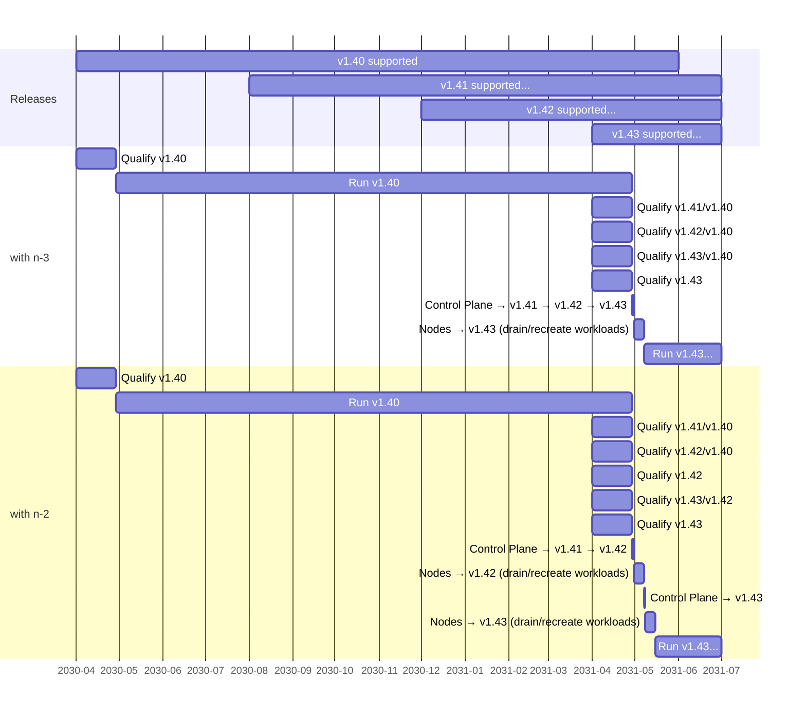

# KEP-3935: Support Oldest Node And Newest Control Plane

<!-- toc -->
- [Release Signoff Checklist](#release-signoff-checklist)
- [Summary](#summary)
- [Motivation](#motivation)
  - [Goals](#goals)
  - [Non-Goals](#non-goals)
- [Proposal](#proposal)
  - [Risks and Mitigations](#risks-and-mitigations)
- [Design Details](#design-details)
  - [Types of changes](#types-of-changes)
  - [Evaluate previous control plane releases](#evaluate-previous-control-plane-releases)
  - [Planned control plane changes](#planned-control-plane-changes)
  - [Impact summary](#impact-summary)
  - [Test Plan](#test-plan)
      - [Prerequisite testing updates](#prerequisite-testing-updates)
      - [Unit tests](#unit-tests)
      - [Integration tests](#integration-tests)
      - [e2e tests](#e2e-tests)
  - [Graduation Criteria](#graduation-criteria)
    - [GA](#ga)
  - [Upgrade / Downgrade Strategy](#upgrade--downgrade-strategy)
  - [Version Skew Strategy](#version-skew-strategy)
- [Production Readiness Review Questionnaire](#production-readiness-review-questionnaire)
  - [Feature Enablement and Rollback](#feature-enablement-and-rollback)
  - [Rollout, Upgrade and Rollback Planning](#rollout-upgrade-and-rollback-planning)
  - [Monitoring Requirements](#monitoring-requirements)
  - [Dependencies](#dependencies)
  - [Scalability](#scalability)
  - [Troubleshooting](#troubleshooting)
- [Related work](#related-work)
- [Implementation History](#implementation-history)
<!-- /toc -->

## Release Signoff Checklist

<!--
**ACTION REQUIRED:** In order to merge code into a release, there must be an
issue in [kubernetes/enhancements] referencing this KEP and targeting a release
milestone **before the [Enhancement Freeze](https://git.k8s.io/sig-release/releases)
of the targeted release**.

For enhancements that make changes to code or processes/procedures in core
Kubernetes—i.e., [kubernetes/kubernetes], we require the following Release
Signoff checklist to be completed.

Check these off as they are completed for the Release Team to track. These
checklist items _must_ be updated for the enhancement to be released.
-->

Items marked with (R) are required *prior to targeting to a milestone / release*.

- [ ] (R) Enhancement issue in release milestone, which links to KEP dir in [kubernetes/enhancements] (not the initial KEP PR)
- [ ] (R) KEP approvers have approved the KEP status as `implementable`
- [x] (R) Design details are appropriately documented
- [x] (R) Test plan is in place, giving consideration to SIG Architecture and SIG Testing input (including test refactors)
- [x] (R) Graduation criteria is in place
- [x] (R) Production readiness review completed
- [ ] (R) Production readiness review approved
- [x] "Implementation History" section is up-to-date for milestone
- [ ] User-facing documentation has been created in [kubernetes/website], for publication to [kubernetes.io]
- [x] Supporting documentation—e.g., additional design documents, links to mailing list discussions/SIG meetings, relevant PRs/issues, release notes
  - sig-cluster-lifecycle: [2023-04-04](https://docs.google.com/document/d/1Gmc7LyCIL_148a9Tft7pdhdee0NBHdOfHS1SAF0duI4/edit#bookmark=id.dlswqqyv7xse)
  - sig-storage: [2023-04-06](https://docs.google.com/document/d/1-8KEG8AjAgKznS9NFm3qWqkGyCHmvU6HVl0sk5hwoAE/edit#bookmark=id.3pg0lcwvpqce)
  - sig-architecture: [2023-04-06](https://docs.google.com/document/d/1BlmHq5uPyBUDlppYqAAzslVbAO8hilgjqZUTaNXUhKM/edit#bookmark=id.b6nofrhcysqn)
  - sig-node: [2023-04-11](https://docs.google.com/document/d/1Ne57gvidMEWXR70OxxnRkYquAoMpt56o75oZtg-OeBg/edit#bookmark=kix.clb5o8ybahss)
  - sig-network: [2023-04-13](https://docs.google.com/document/d/1_w77-zG_Xj0zYvEMfQZTQ-wPP4kXkpGD8smVtW_qqWM/edit#bookmark=id.ehzitjq2ldlo)

<!--
**Note:** This checklist is iterative and should be reviewed and updated every time this enhancement is being considered for a milestone.
-->

[kubernetes.io]: https://kubernetes.io/
[kubernetes/enhancements]: https://git.k8s.io/enhancements
[kubernetes/kubernetes]: https://git.k8s.io/kubernetes
[kubernetes/website]: https://git.k8s.io/website

## Summary

This KEP proposes testing and expanding the supported skew between core node and control plane components
by one version from n-2 to n-3, so that node components (kubelet and kube-proxy) for the **oldest** supported minor version
work with control plane components (kube-apiserver, kube-scheduler, kube-controller-manager, cloud-controller-manager) for the **newest** supported minor version.

## Motivation

The Kubernetes [yearly support period](https://github.com/kubernetes/enhancements/tree/master/keps/sig-release/1498-kubernetes-yearly-support-period) already makes annual upgrades possible.
Users can upgrade to latest patch versions to pick up security fixes, and do 3 sequential minor version upgrades once a year to "catch up" to the latest supported minor version.

However, since the [tested/supported skew](https://kubernetes.io/releases/version-skew-policy/#kubelet) between nodes and control planes is currently limited to 2 versions,
a 3-version upgrade would have to update nodes twice to stay within supported skew. For example, to upgrade from v1.40 to v1.43:

  1. Begin: control plane and nodes on v1.40
  2. Control plane upgrade: v1.40 → v1.41 → v1.42
  3. Node upgrades: v1.40 → v1.42
  4. Control plane upgrade: v1.42 → v1.43
  5. Node upgrades: v1.42 → v1.43

Node upgrades are inherently more disruptive than control plane upgrades to workloads, for several reasons:

  * Workloads can be designed to have no dependencies on the Kubernetes control plane, so Kubernetes control plane availability does not directly impact running pods
  * There can be _many_ more nodes (hundreds to thousands) than control plane members (typically 1 or 3)
  * Every time nodes are upgraded to a new minor version, every pod running on those nodes [must be drained/rescheduled](https://kubernetes.io/releases/version-skew-policy/#kubelet-1).
    This is true for immutable nodes and mutable/bare-metal nodes. If all nodes are being upgraded, this means every pod in the cluster will be replaced at least once.
    Patch updates of kubelet / kube-proxy components *can* be done in place, so it is possible to pick up security fixes and patch updates less disruptively.
  * Replacing or moving pods which are slow to stop or start or have significant data gravity takes significant time, so it is desirable to minimize how frequently that must be done.

If node / control plane skew support was expanded so the oldest node components work with the newest control plane components, the example upgrade path from v1.40 to v1.43 above could improve to this:

  1. Begin: control plane and nodes on v1.40
  2. Control plane upgrade: v1.40 → v1.41 → v1.42 → v1.43
  3. Node upgrades: v1.40 → v1.43

This streamlined upgrade flow would also reduce the number of control plane / node version combinations a user would have to qualify as part of an upgrade flow.

[[]](https://mermaid.live/view#pako:eNrdVk1vnDAQ_SuWpUiNBBs8Rk3FtaveNkrTUyqkysLeBBVsYky3qyjX_oD-xP6SmgV2-Vg2oGwv9cmMee-NB95onnGkuMABfmDSmFAiuzgz4pPSKTMI3dvlrlbuclmdsZ9x3pxd3LsXaSirg1xEJlYS3YlEsFzkTfwHWfgeyossU9oIjoIySHyvjjgIPOq5nu96ZLcnrvfe7g9gcgAvFguLJz7pgT-0wNcdMAzB0AUTGAXTIZi2waSbdgXuVmMTm0ckXVpFPxcsidfbuiZTVoAk_War9WSRThNsVczfVMx3hZzB2mbWhdwTI7Y2QnckyXaYOrmaIlUL0JKHOIfUSS_1NjPMZoaJzHQ2M53KPKfctP8h-8wflTRaJeg2YVKgP79-1x5odrDf0aP8UVZkD5px4XQ_Zy1MeCVzY02ft6jecc1ieaVFpIV1P9oo_T1RjOeXQwlpsXuRtkRbm_R-TFo6aFalxn7Mrv6r1oM3WA_-mfVgzHrw_1kPZhuEzjI1zGD2z21qOI-pT7DDMUvDa5aGqZbeSRyz9ECbnLwNnVSpsbt0M3hrm4KxNgVnbVMw1qbgRJvCDk6FnZ9iboeu51I9xOZRpCLEgd1ysWZFYkIcyhf7KiuM-rKVEQ6MLoSDi6wczpYxs7xpE8yY_KqUfVyzJLfPgsdG6VU11-3Gu5e_iHFuyg)

<!--
Source (render at https://mermaid.live)

-->

There is nothing magical about the number 2 in the existing version skew policy.
That policy intended to allow the oldest supported node to work with the newest supported control plane (exactly what this KEP is trying to accomplish).
When there are 3 supported minor versions, max skew of n-2 appears to make sense.

However, as part of the [yearly support period](https://github.com/kubernetes/enhancements/tree/master/keps/sig-release/1498-kubernetes-yearly-support-period#proposal) KEP,
it became clear that overlap between the oldest and newest version is required to actually give users a version they can use for a year.
This led to the current policy of supporting each minor version for approximately 14 months, giving users a 2-month period to qualify and upgrade following a new Kubernetes release
before the oldest supported minor version reaches end-of-life. During that 2-month period, there are actually 4 supported minor versions.

Updating the skew policy to allow up to n-3 nodes brings the policy back in line with its original goals.

### Goals

* Allow users to make full use of the [yearly support period](https://github.com/kubernetes/enhancements/tree/master/keps/sig-release/1498-kubernetes-yearly-support-period)
* Streamline upgrade paths for nodes / node pools to minimize required workload churn
* Validate oldest supported node components work with latest control plane components
* Update the [Kubernetes version skew policy](https://kubernetes.io/releases/version-skew-policy/) to indicate node components from the oldest supported minor version work with control plane components from the newest supported minor version, starting with Kubernetes `v1.25` nodes and `v1.28` control planes.

### Non-Goals

* This does not propose any changes to the number of supported minor versions
* This does not propose any changes to the minor version support duration
* This does not propose any changes to the Kubernetes release process
* This does not propose any changes to the mechanics control plane components use to enable features 
  and work with older nodes without features ([KEP-3920](https://github.com/kubernetes/enhancements/pull/3920) could help with this)
* This does not propose delaying introduction of existing features SIGs have planned around existing n-2 node/control plane skew
* This does not address increasing node skew supported by cluster management tools like `kubeadm`. Maintainers of those tools
  can choose to make use of the additional supported skew if they wish, but are not required to. For example, `kubeadm` currently officially
  supports managing [kubelets up to one version older](https://kubernetes.io/docs/setup/production-environment/tools/kubeadm/create-cluster-kubeadm/#version-skew-policy)
  than the `kubeadm` instance, and does not make use of the existing supported n-2 skew in upgrade plans.
* This does not address third-party components that version themselves with node components and limit skew relative to the control plane.
  Maintainers of those components can choose to support larger or smaller version skew. Node operators should limit themselves to skew
  supported by core Kubernetes node components and any third-party components required for node operation.

## Proposal

1. Add a configuration to https://testgrid.k8s.io/sig-node-kubelet#Summary to begin testing 3 version node / control plane skew
2. Identify in-flight feature enablement plans from SIGs that rely on a maximum of 2 version node / control plane skew, and the node version when those plans would be complete
3. Choose the minimum node version to begin supporting 3-version skew that avoids disrupting the plans identified in step 2
   * 1.25 nodes / 1.28 control planes
4. Update the [Kubernetes version skew policy](https://kubernetes.io/releases/version-skew-policy/) as part of the release identified in step 3

### Risks and Mitigations

`kubeadm` currently limits itself to managing nodes a single minor version older than the `kubeadm` build.
This restriction is overridden/ignored when `kubeadm` is used to create clusters in the existing skew CI jobs.
If the kubelet command-line or configuration file changed in ways `kubeadm` has to adapt to,
current builds of `kubeadm` could stop being able to successfully configure n-2 or n-3 nodes.
Note that this risk already exists for n-2 nodes, and has not proved problematic so far.

Possible mitigations include:
* sig-node extending rollout of command-line or configuration file changes to ease adoption by `kubeadm` over multiple versions.
  This approach has the benefit of also easing adoption by kubelet end users.
* sig-cluster-lifecycle restructuring the `join` functionality of `kubeadm` in a way that supports configuring older node versions in a maintainable way.
* Adjusting the way the skew CI jobs are configured to use `kubeadm` binaries from previous minor versions to configure nodes for those versions.

## Design Details

First, we'll look at the types of changes that actually prevent a specific control plane release from supporting older nodes.

Second, we'll evaluate previous control plane releases, to see how the proposed policy change could have impacted work in past releases.

Finally, we'll list known changes planned for future control plane releases, to evaluate the known impact of this proposal on future work.

### Types of changes

**Feature additions in control plane components that require waiting for node support**

There are two approaches currently used to roll out features that involve changes to both control plane and node components:

1. Enable a feature by default in a given release, require nodes be upgraded to that release 
   for the feature to work successfully, and expect users to wait until nodes are upgraded to use the new feature.
   This approach is common for opt-in features which fail safely or in benign ways if control plane and node enablement of the feature is inconsistent.
   This can result in a poor experience for users that try new features while running skewed nodes,
   but works reasonably well for users that don't care about the new features, or who keep nodes up to date with the control plane.

2. Make changes in node components first, and wait to enable the control plane changes until all node versions the control plane supports have the feature.
   This approach can be safer and provides a better experience in some ways, but at a significant velocity cost.
   With current skew support and release cadence, there is an 8-month delay between delivering node changes and enabling the feature in the control plane 2 releases later.
   Because of that velocity cost, this approach is typically reserved for features which are not opt-in, or would cause regressions,
   security issues, or significant problems if control plane and node enablement of the feature was inconsistent.

While both feature rollout approaches have room for improving velocity, safety, and usability,
that is outside the scope of this KEP, and better addressed by something like [KEP-3920](https://github.com/kubernetes/enhancements/pull/3920).

The first approach already accepts a new feature will not work with n-1 and n-2 skewed nodes, n-3 nodes would be no different.

For this KEP, we'll only look for instances of the second type of feature rollout, to evaluate how common they are, and how expanding supported skew to n-3 would have impacted them.

**Removal of deprecated or unused functionality in control plane components**

Evolution of node components sometimes produces opportunities to simplify or remove control plane functionality.
Control plane components must remain compatible with behavior relied on by older nodes that are within supported skew.

For this KEP, we'll look for instances of control plane cleanup that had to wait for n-2 nodes, and would have been delayed another release if n-3 nodes were supported.

**Removal of deprecated REST APIs used by node components**

Node components act as REST API clients and talk to APIs served by kube-apiserver.
If any of those APIs are unstable beta versions, they have a [finite lifetime](/keps/sig-architecture/1635-prevent-permabeta) and are eventually deprecated and no longer served.

All of the APIs required to run clusters and pass conformance tests [reached GA in v1.19](/keps/sig-architecture/1333-conformance-without-beta),
and node components were updated to use GA APIs by v1.19 at the latest.

Continued testing of GA-only clusters and a focus on [non-disruptive default configurations](/keps/sig-architecture/3136-beta-apis-off-by-default)
ensures that node components don't accidentally take hard dependencies on new unstable APIs.

Additionally, the 3-release deprecation period before removal of a beta API means node components which
update to the replacement API when the beta API is deprecated are compatible with the control plane 
that removes the beta API 3 releases later.

**Supported skew between node components**

In general, the surface area shared between `kube-proxy` and `kubelet` is small, and limited to network configuration.
[KEP-3178](https://github.com/kubernetes/enhancements/tree/master/keps/sig-network/3178-iptables-cleanup) makes
`kube-proxy` and `kubelet` independent in the network configuration they produce in v1.25+.

### Evaluate previous control plane releases

Were v1.22 control plane changes as compatible with v1.19 nodes as n-2 nodes?
* Feature enablement in control plane components that blocked until enabled in all supported node versions
  * ❌ sig-auth: `BoundServiceAccountTokenVolume` promoted to GA, which relies on kubelets having `TokenRequestProjection` enabled, which is only guaranteed in v1.20+ ([#93258](https://github.com/kubernetes/kubernetes/pull/93258))
    * Supporting n-3 nodes would have delayed GA graduation to v1.23, remaining in beta and enabled by default in v1.22.
* Removal of deprecated behavior in control plane components
  * ✅ None relevant to node components
* Removal of deprecated REST APIs used by node components ([source](https://kubernetes.io/docs/reference/using-api/deprecation-guide/#v1-24))
  * ✅ sig-api-machinery: v1beta1 Lease - v1.16 nodes switched to the v1 API ([#79473](https://github.com/kubernetes/kubernetes/pull/79473))
  * ✅ sig-auth: v1beta1 CertificateSigningRequest - v1.19 nodes switched to the v1 API ([#91754](https://github.com/kubernetes/kubernetes/pull/91754))
  * ✅ sig-auth: v1beta1 SubjectAccessReview - v1.17 nodes switched to the v1 API ([#84768](https://github.com/kubernetes/kubernetes/pull/84768))
  * ✅ sig-auth: v1beta1 TokenReview - v1.17 nodes switched to the v1 API ([#84768](https://github.com/kubernetes/kubernetes/pull/84768))
  * ✅ sig-storage: v1beta1 CSIDriver - v1.18 nodes switched to the v1 API ([#84814](https://github.com/kubernetes/kubernetes/pull/84814))
  * ✅ sig-storage: v1beta1 CSINode - v1.17 nodes switched to the v1 API ([#83474](https://github.com/kubernetes/kubernetes/pull/83474))
  * ✅ sig-storage: v1beta1 VolumeAttachment - v1.14 nodes switched to the v1 API ([#74606](https://github.com/kubernetes/kubernetes/pull/74606))

Were v1.23 control plane changes as compatible with v1.20 nodes as n-2 nodes?
* Feature enablement in control plane components that blocked until enabled in all supported node versions
  * ✅ None
* Removal of deprecated behavior in control plane components
  * ✅ None relevant to node components
* Removal of deprecated REST APIs used by node components ([source](https://kubernetes.io/docs/reference/using-api/deprecation-guide/#v1-24))
  * ✅ sig-auth: v1beta1 CertificateSigningRequest - v1.19 nodes switched to the v1 API ([#91754](https://github.com/kubernetes/kubernetes/pull/91754))

Were v1.24 control plane changes as compatible with v1.21 nodes as n-2 nodes?
* Feature enablement in control plane components that blocked until enabled in all supported node versions
  * ✅ None
* Removal of deprecated behavior in control plane components
  * ✅ sig-node: `StreamingProxyRedirects` was dropped, nodes dropped support in v1.20 ([#95935](https://github.com/kubernetes/kubernetes/pull/95935))
* Removal of deprecated REST APIs used by node components ([source](https://kubernetes.io/docs/reference/using-api/deprecation-guide/#v1-24))
  * ✅ None

Were v1.25 control plane changes as compatible with v1.22 nodes as n-2 nodes?
* Feature enablement in control plane components that blocked until enabled in all supported node versions
  * ❌ sig-auth: `IdentifyPodOS` relaxed Pod Security validation of Linux fields for Windows pods ([#105919](https://github.com/kubernetes/kubernetes/pull/105919)), which relies on kubelet honoring the `podOS` field, which was done in v1.23 ([#105292](https://github.com/kubernetes/kubernetes/pull/105292))
    * Supporting n-3 nodes would have delayed relaxing Pod Security validation for Windows pods to v1.26.
* Removal of deprecated behavior in control plane components
  * ✅ None relevant to node components
* Removal of deprecated REST APIs used by node components ([source](https://kubernetes.io/docs/reference/using-api/deprecation-guide/#v1-25))
  * ✅ sig-network: v1beta1 EndpointSlice - v1.22 kube-proxy already switched to use the v1 API ([#103306](https://github.com/kubernetes/kubernetes/pull/103306))

Were v1.26 control plane changes as compatible with v1.23 nodes as n-2 nodes?
* Feature enablement in control plane components that blocked until enabled in all supported node versions
  * ✅ None
* Removal of deprecated behavior in control plane components
  * ❌ sig-storage: `CSIMigrationOpenStack` in-tree volume plugin support removed ([#113826](https://github.com/kubernetes/kubernetes/pull/113826)), which relies on kubelets having `CSIMigrationOpenStack` enabled, which is guaranteed in v1.24+ ([#107462](https://github.com/kubernetes/kubernetes/pull/107462))
    * Supporting n-3 nodes would have delayed removal of the in-tree volume plugin to v1.27.
* Removal of deprecated REST APIs used by node components ([source](https://kubernetes.io/docs/reference/using-api/deprecation-guide/#v1-26))
  * ✅ None

Were v1.27 control plane changes as compatible with v1.24 nodes as n-2 nodes?
* Feature enablement in control plane components that blocked until enabled in all supported node versions
  * ✅ None
* Removal of deprecated behavior in control plane components
  * ❌ sig-storage: `CSIMigrationAWS` in-tree volume plugin support removed ([#115838](https://github.com/kubernetes/kubernetes/pull/115838)), which relies on kubelets having `CSIMigrationAWS` enabled, which is guaranteed in v1.25+ ([#111479](https://github.com/kubernetes/kubernetes/pull/111479))
    * Supporting n-3 nodes would have have delayed removal of the in-tree volume plugin to v1.28.
  * ❌ sig-storage: `CSIMigrationAzureDisk` in-tree volume plugin support removed ([#116301](https://github.com/kubernetes/kubernetes/pull/116301)), which relies on kubelets having `CSIMigrationAzureDisk` enabled, which is guaranteed in v1.25+ ([#110491](https://github.com/kubernetes/kubernetes/pull/110491))
    * Supporting n-3 nodes would have delayed removal of the in-tree volume plugin to v1.28.
* Supported skew between node components
  * ⚠️ sig-network: `IPTablesOwnershipCleanup` changes for [KEP-3178](https://github.com/kubernetes/enhancements/tree/master/keps/sig-network/3178-iptables-cleanup#version-skew-strategy)
    made v1.27+ `kubelet` instances rely on `kube-proxy` being >= v1.25. Clusters that deploy older `kube-proxy` instances alongside newer `kubelet` instances could not support n-3 skew between them.
    * Supporting n-3 nodes would have delayed promotion of `IPTablesOwnershipCleanup` from v1.27 to v1.28.
* Removal of deprecated REST APIs used by node components ([source](https://kubernetes.io/docs/reference/using-api/deprecation-guide/#v1-27))
  * ✅ None

### Planned control plane changes

Are planned v1.28 control plane changes as compatible with v1.25 nodes as n-2 nodes?
* Feature enablement in control plane components that will wait for node support
  * ...
* Removal of deprecated behavior in control plane components
  * ✅ sig-storage: planned removal of in-tree volume plugins for `CSIMigrationGCE` feature, which is guaranteed on in v1.25 nodes ([#111301](https://github.com/kubernetes/kubernetes/pull/111301).
  * ...
* Removal of deprecated REST APIs used by node components ([source](https://kubernetes.io/docs/reference/using-api/deprecation-guide/#v1-28))
  * ✅ None

Are planned v1.29 control plane changes as compatible with v1.26 nodes as n-2 nodes?
* Feature enablement in control plane components that will wait for node support
  * ...
* Removal of deprecated behavior in control plane components
  * ⚠️ sig-storage: planned removal of in-tree volume plugins for `CSIMigrationvSphere` and `CSIMigrationAzureFile` features, which are guaranteed on in v1.27 nodes ([#116610](https://github.com/kubernetes/kubernetes/pull/116610) and [#114953](https://github.com/kubernetes/kubernetes/pull/114953)).
    * Supporting n-3 nodes would delay removal of the in-tree volume plugins to v1.30.
  * ...
* Removal of deprecated REST APIs used by node components ([source](https://kubernetes.io/docs/reference/using-api/deprecation-guide/#v1-29))
  * ✅ None

Are planned v1.30 control plane changes as compatible with v1.27 nodes as n-2 nodes?
* Feature enablement in control plane components that will wait for node support
  * ...
* Removal of deprecated behavior in control plane components
  * ...
* Removal of deprecated REST APIs used by node components ([source](https://kubernetes.io/docs/reference/using-api/deprecation-guide/#v1-30))
  * ✅ None

### Impact summary

The calculated impact over the past two years if Kubernetes supported n-3 node skew:
* the sig-auth `BoundServiceAccountTokenVolume` feature GA would have moved from v1.22 to v1.23 (remaining in beta and enabled by default in v1.22).
* the sig-auth Pod Security update for the `IdentifyPodOS` feature would have moved from v1.25 to v1.26.
* the sig-network `IPTablesOwnershipCleanup` beta would have moved from v1.27 to v1.28.
* the sig-storage in-tree volume plugin cleanups would have been delayed by one release for OpenStack, AzureDisk, and AWS plugins.

The known impact over the next year if Kubernetes supports n-3 node skew:
* the sig-storage in-tree volume plugin cleanups would be delayed by one release for AzureFile and vSphere plugins (from v1.29 to v1.30).

### Test Plan

[X] I/we understand the owners of the involved components may require updates to
existing tests to make this code solid enough prior to committing the changes necessary
to implement this enhancement.

##### Prerequisite testing updates

##### Unit tests

n/a

##### Integration tests

n/a

##### e2e tests

Add a job to https://testgrid.k8s.io/sig-node-kubelet#Summary testing n-3 nodes against latest control planes.

### Graduation Criteria

#### GA

* Test coverage of n-3 node/control-plane skew
* Updating public facing [skew / support documentation](https://kubernetes.io/releases/version-skew-policy/)

### Upgrade / Downgrade Strategy

n/a

### Version Skew Strategy

Even though this KEP is not actually proposing *any* code changes in Kubernetes, this whole KEP is about version skew.
See the [design Details](#design-details) for the types of changes considered,
and the implications of this KEP on *other* KEPs wanting to make those types of changes.

## Production Readiness Review Questionnaire

### Feature Enablement and Rollback

###### How can this feature be enabled / disabled in a live cluster?

n/a

###### Does enabling the feature change any default behavior?

n/a

###### Can the feature be disabled once it has been enabled (i.e. can we roll back the enablement)?

n/a

###### What happens if we reenable the feature if it was previously rolled back?

n/a

###### Are there any tests for feature enablement/disablement?

n/a

### Rollout, Upgrade and Rollback Planning

###### How can a rollout or rollback fail? Can it impact already running workloads?

n/a

###### What specific metrics should inform a rollback?

n/a

###### Were upgrade and rollback tested? Was the upgrade->downgrade->upgrade path tested?

n/a

###### Is the rollout accompanied by any deprecations and/or removals of features, APIs, fields of API types, flags, etc.?

n/a

### Monitoring Requirements

###### How can an operator determine if the feature is in use by workloads?

Observe the version reported by kubelets in the Node API (`.status.nodeInfo.kubeletVersion`) relative to the version reported by `kube-apiserver` `/version` endpoint.

###### How can someone using this feature know that it is working for their instance?

Standard node health / readiness monitoring.

###### What are the reasonable SLOs (Service Level Objectives) for the enhancement?

n/a

###### What are the SLIs (Service Level Indicators) an operator can use to determine the health of the service?

n/a

###### Are there any missing metrics that would be useful to have to improve observability of this feature?

n/a

### Dependencies

###### Does this feature depend on any specific services running in the cluster?

No

### Scalability

###### Will enabling / using this feature result in any new API calls?

No

###### Will enabling / using this feature result in introducing new API types?

No

###### Will enabling / using this feature result in any new calls to the cloud provider?

No

###### Will enabling / using this feature result in increasing size or count of the existing API objects?

No

###### Will enabling / using this feature result in increasing time taken by any operations covered by existing SLIs/SLOs?

No

###### Will enabling / using this feature result in non-negligible increase of resource usage (CPU, RAM, disk, IO, ...) in any components?

No

###### Can enabling / using this feature result in resource exhaustion of some node resources (PIDs, sockets, inodes, etc.)?

No

### Troubleshooting

###### How does this feature react if the API server and/or etcd is unavailable?

n/a

###### What are other known failure modes?

Node components (kubelet or kube-proxy) failing to start, crash looping,
or failing to become ready are existing failure modes.
There are no new failure modes specific to this policy change.

###### What steps should be taken if SLOs are not being met to determine the problem?

## Related work

While investigating behavior, test coverage, and documentation of existing supported skew,
several inconsistencies or gaps were found. Links tracking improving those areas are provided for reference:

* sig-network:
  * Clarify supported skew documentation for `kube-proxy` - https://github.com/kubernetes/website/pull/40672
  * Improve test coverage of skewed `kube-proxy` / `kube-apiserver` and skewed `kube-proxy` / `kubelet` - https://docs.google.com/document/d/1_w77-zG_Xj0zYvEMfQZTQ-wPP4kXkpGD8smVtW_qqWM/edit#bookmark=id.urwmea30mygf
  * Resolve misleading `status.nodeInfo.kubeProxyVersion` API field - https://github.com/kubernetes/kubernetes/issues/117756
* sig-node:
  * Clarify supported skew documentation for `kubelet` / `cri-api` - https://github.com/kubernetes/kubernetes/pull/114394

## Implementation History

- 2023-04-03: Provisional KEP created