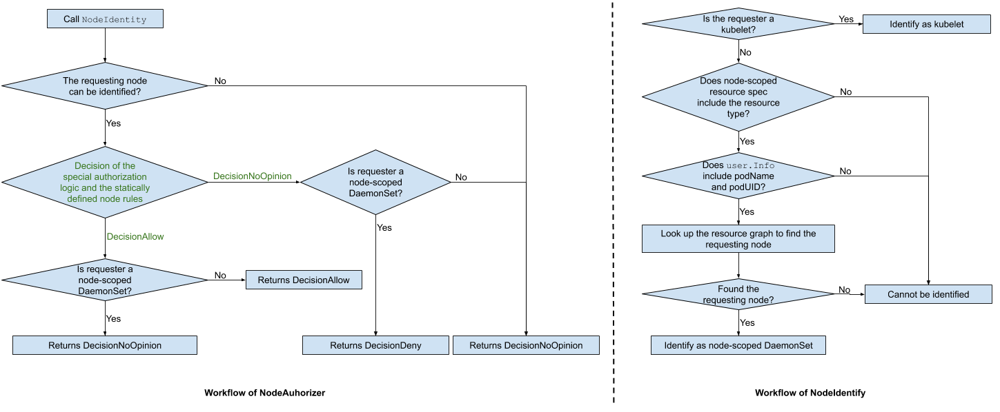

# Node-Scoped DaemonSet

## Table of Contents

* [Summary](#summary)
* [Motivation](#motivation)
* [Use Cases](#use-cases)
* [Background](#background)
    * [NodeAuthorizer and NodeRestriction](#nodeauthorizer-and-noderestriction)
        * [The Existing NodeAuthorizer](#the-existing-nodeauthorizer)
        * [The Existing NodeRestriction](#the-existing-noderestriction)
    * [Per-Pod Identity of DaemonSets](#per-pod-identity-of-daemonsets)
* [Definition](#definition)
* [Proposal](#proposal)
    * [The Origin of Node-Scoped Resource Spec](#the-origin-of-node-scoped-resource-spec)
    * [Workflow of NodeAuthorizer](#workflow-of-nodeauthorizer)
    * [Workflow of NodeRestriction](#workflow-of-noderestriction)
    * [Implementation Details](#implementation-details)
* [Design Details](#design-details)
    * [Test Plan](#test-plan)
    * [Graduation Criteria](#graduation-criteria)
* [Implementation History](#implementation-history)
* [Alternatives](#alternatives)
    * [Granularity of Node-Scoped Info](#granularity-of-node-scoped-info)

## Summary

Provide a mechanism restricting a
[DaemonSet](https://kubernetes.io/docs/concepts/workloads/controllers/daemonset/)
pod to only managing the resources that reside on the same node as the DaemonSet
pod whenever possible.

## Motivation

Currently, a DaemonSet pod can manage resources in a whole cluster. When one
DaemonSet pod is compromised, the whole cluster will be exposed to attack.

## Use Cases

The permissions of a DaemonSet can be:

* a subset of kubelet's permissions, such as
  [NPD](https://github.com/kubernetes/kubernetes/blob/742a90cb5a4485c6db4ecd9b547b96335ec10745/plugin/pkg/auth/authorizer/rbac/bootstrappolicy/policy.go#L345-L354)
  and
  [k8s-node-termination-handler](https://github.com/GoogleCloudPlatform/k8s-node-termination-handler/blob/master/deploy/rbac.yaml);
* not a subset of kubelet's permissions, such as
  [kube-proxy](https://github.com/kubernetes/kubernetes/blob/742a90cb5a4485c6db4ecd9b547b96335ec10745/plugin/pkg/auth/authorizer/rbac/bootstrappolicy/policy.go#L355-L365),
  [external persistent volume
  provisioner](https://github.com/kubernetes/kubernetes/blob/742a90cb5a4485c6db4ecd9b547b96335ec10745/plugin/pkg/auth/authorizer/rbac/bootstrappolicy/policy.go#L450-L464),
  and
  [calico](https://github.com/kubernetes/kubernetes/blob/master/cluster/addons/calico-policy-controller/calico-clusterrole.yaml).
  The permissions of these DaemonSets which are not covered by kubelet's
  permissions can be on:
  * resources whose types are not covered by kubelet's permission, such as
    custom resources and `storageclasses`;
  * resources whose types are covered by kubelet's permission, but whose allowed
    verbs are more than what kubelet is allowed. For example, the only allowed
    verb on `endpoints` for kubelet is `get`, but `kube-proxy` needs to have
    permission to `list/watch` on `endpoints`. Another example is
    [calico](https://github.com/kubernetes/kubernetes/blob/master/cluster/addons/calico-policy-controller/calico-clusterrole.yaml),
    which needs to `patch` pods (kubelet does not need to `patch` pods).

## Background

### NodeAuthorizer and NodeRestriction

Currently,
[NodeAuthorizer](https://kubernetes.io/docs/reference/access-authn-authz/node/)
and
[NodeRestriction](https://kubernetes.io/docs/reference/access-authn-authz/admission-controllers/#noderestriction)
can be used to limit a kubelet's API access. In order to be authorized by
NodeAuthorizer and limited by the NodeRestriction admission controller, kubelets
must use a credential that identifies them as being in the system:nodes group,
with a username of system:node:\<nodeName\>.

#### The Existing NodeAuthorizer

Currently, NodeAuthorizer's decision-making process includes two parts: a
checking against [the specific authorization
logic](https://github.com/kubernetes/kubernetes/blob/c2254cf19a27adacbe61fd7505ee1a49d8292cb3/plugin/pkg/auth/authorizer/node/node_authorizer.go#L95-L129)
and a checking agaist the statically defined RBAC node rules.
* for `secret`-resource requests, only allow `get/list/watch` on `secret`
  resources bound to the requesting node;
* for `configmap`-resource requests, only allow `get/list/watch` on `configmap`
  resources bound to the requesting node;
* for `pv`-resource requests, only allow `get` on `pv` resources bound to the
  requesting node;
* for `pvc`-resource requests, when the `ExpandPersistentVolumes` feature is
  enabled, only allow `update/patch` on the `status` subresources of `pvc`
  resources bound to the requesting node; when the `ExpandPersistentVolumes`
  feature is not enabled or the subresource is not `status`, only allow `get` on
  `pvc` resources bound to the requesting node;
* for `volumeattachment`-resource requests, when the `CSIPersistentVolume`
  feature is enabled, only allow `get` on `volumeattachment` resources bound to
  the requesting node;
* for `serviceaccount`-resource requests, when the `TokenRequest` feature is
  enabled, only allow `create` the `token` subresources of `serviceaccount`
  resources bound to the requesting node;
* for `lease`-resource requests, when the `NodeLease` feature is enabled, it
  authorizes the node requests to CSINode storage.k8s.io/csinodes;
* for `csinode`-resource requests, when the `CSINodeInfo` feature is enabled, it
  authroizes authorizes the node requests to CSINode storage.k8s.io/csinodes
* for resource requests related to other resource types and non-resource
  requests, check agaist the statically defined RBAC node rules.

#### The Existing NodeRestriction

Currently, NodeRestriction
[admits](https://github.com/kubernetes/kubernetes/blob/0cd40a6d51af2a814c91658981213166bb91fd7e/plugin/pkg/admission/noderestriction/admission.go#L118-L162)
6 types of resource requests: pod, node, pvc, serviceaccount, lease, and
csinode.

### Per-Pod Identity of DaemonSets

Before v1.10, APIServer cannot identify requests from different pods of a
DaemonSet because a single ServiceAccountToken was used to run all the pods of a
DaemonSet.

With the introduction of
[BoundServiceAccountToken](https://github.com/kubernetes/community/blob/master/contributors/design-proposals/auth/bound-service-account-tokens.md)
([beta in
v.1.12](https://github.com/kubernetes/kubernetes/blob/255a73ffc64d1c4e0f9a378ebf8d0005edfe6962/pkg/features/kube_features.go#L267)),
APIServer can issue pod-bound or secret-bound ServiceAccountTokens. A DaemonSet
can define a
[projected](https://kubernetes.io/docs/concepts/storage/volumes/#projected)
volume mapping a pod-bound ServiceAccountToken into each DaemonSet pod. A
DaemonSet pod will use its BoundServiceAccountToken to access APIServer, which
authenticates the request and
[adds](https://github.com/kubernetes/kubernetes/blob/255a73ffc64d1c4e0f9a378ebf8d0005edfe6962/pkg/serviceaccount/util.go#L55)
the pod name and pod UID information into the
[Extra](https://github.com/kubernetes/kubernetes/blob/255a73ffc64d1c4e0f9a378ebf8d0005edfe6962/staging/src/k8s.io/apiserver/pkg/authentication/user/user.go#L50)
field of
[user.DefaultInfo](https://github.com/kubernetes/kubernetes/blob/255a73ffc64d1c4e0f9a378ebf8d0005edfe6962/staging/src/k8s.io/apiserver/pkg/authentication/user/user.go#L46).

## Definition

**DaemonSet / Cluster-scoped DaemonSet**: a DaemonSet which allows a DaemonSet pod
to manage the resources in a whole cluster.

<!--
**Node-scoped resources**: the resources covered by NodeAuthorizer’s [resource
graph](https://github.com/kubernetes/kubernetes/blob/4db3fccd6f1c5ae8deb687985a2c8be76e4d4ab5/plugin/pkg/auth/authorizer/node/graph.go#L78),
currently there are [8
types](https://github.com/kubernetes/kubernetes/blob/d99f49d2a7caa2e86cb27541a267577771e133a7/plugin/pkg/auth/authorizer/node/graph.go#L123)
of these resources: node, pod, configmap, pvc, pv, secret, serviceaccount, and
volumeattachment.
-->

**Node-scoped resource access permission / node-scoped permission**: the
permission to access a certain resource type is a subset of kubelet's permission
on the resource type.

**Node-scoped resource spec**: a string defining the resource types upon
which a DaemonSet's permission should be node-scoped.

**Node-scoped DaemonSet**: a DaemonSet includig a node-scoped resource spec.

## Proposal

Allow a DaemonSet owner to specify node-scoped resource spec (see the [Origin of
Node-Scoped Resource Spec](#the-origin-of-node-scoped-resource-spec) section);
APIServer tracks the node-scoped resource spec using a new string field
(`NodeScopedResources string`) of
[ServiceAccountInfo](https://github.com/kubernetes/kubernetes/blob/master/pkg/serviceaccount/util.go#L43),
and adds the node-scoped resource spec into the
[Extra](https://github.com/kubernetes/kubernetes/blob/255a73ffc64d1c4e0f9a378ebf8d0005edfe6962/staging/src/k8s.io/apiserver/pkg/authentication/user/user.go#L50)
field of
[user.DefaultInfo](https://github.com/kubernetes/kubernetes/blob/255a73ffc64d1c4e0f9a378ebf8d0005edfe6962/staging/src/k8s.io/apiserver/pkg/authentication/user/user.go#L46)
in the
[ServiceAccountInfo.UserInfo](https://github.com/kubernetes/kubernetes/blob/46c8b075ded386d99de1cf3945168127403c12e9/pkg/serviceaccount/util.go#L48)
method during authentication. The node-scoped resource spec, together with the
pod name/UID information in
[user.DefaultInfo](https://github.com/kubernetes/kubernetes/blob/255a73ffc64d1c4e0f9a378ebf8d0005edfe6962/staging/src/k8s.io/apiserver/pkg/authentication/user/user.go#L46),
can then be utilized in the authorization step and the admission step to implement
node-scoped DaemonSet.

  * `authorize a request on a node-scoped resource type`: when the type of the
    resource accessed by the request is in the node-scoped resource spec, the
    request will go through both NodeAuthorizer and RBAC (Note: the order
    matters here), and the request must be explicitly allowed by the
    NodeAuthorizer first before RBAC authorizes the request. If NodeAuthorizer
    does not explicitly allow the request, the request will be denied directly.

### The Origin of Node-Scoped Resource Spec

Node-scoped info can be defined in two places:

* Option 1: in
  [ServiceAccount](https://github.com/kubernetes/kubernetes/blob/255a73ffc64d1c4e0f9a378ebf8d0005edfe6962/staging/src/k8s.io/api/core/v1/types.go#L3706)
  as a new string field, `NodeScopedResources string`, whose default value is
  empty, suggesting that the DaemonSet does not have any node-scoped
  permissions.
    * Pros: this option is easy to implement, APIServer can get the node-scoped
      resource spec by inspecting the ServiceAccount object during
      authentication.
    * Cons:
        * this may not work for the cases where a single service account is used
          to run multiple DaemonSets which have different scope requirements;
        * non-daemonset pods will be node-scoped as soon as the
          `NodeScopedResources` field of its service account is not empty.
* Option 2: in DaemonSet, such as a new field in
  [ServiceAccountTokenProjection](https://github.com/kubernetes/kubernetes/blob/dd96b15e5d1de1923645ef17c05dfdfb616163bf/staging/src/k8s.io/api/core/v1/types.go#L1559)
  (i.e., track the node-scoped resource spec inside BoundServiceAccountTokens).
    * Pros: this solution will work properly for the cases where a single
      service account is used to run multiple DaemonSets which have different
      scope requirements.
    * Cons:
        * this solution is complex to implement.  To track node-scoped resource
          spec inside BoundServiceAccountTokens, a new field in
          [TokenRequestSpec](https://github.com/kubernetes/kubernetes/blob/dd96b15e5d1de1923645ef17c05dfdfb616163bf/staging/src/k8s.io/api/authentication/v1/types.go#L142)
          and a new field in
          [serviceaccount.privateClaims.Kubernetes](https://github.com/kubernetes/kubernetes/blob/46c8b075ded386d99de1cf3945168127403c12e9/pkg/serviceaccount/claims.go#L38)
          will be required.
        * non-daemonset pods will be node-scoped as soon as the node-scoped
          resource spec is not empty, which can be confusing.

Considering that it is a best practice to run a DaemonSet using a dedicated
service account, the first option is chosen.

### Workflow of NodeAuthorizer
* APIServer authenticates a request from a node,
  [adds](https://github.com/kubernetes/kubernetes/blob/255a73ffc64d1c4e0f9a378ebf8d0005edfe6962/pkg/serviceaccount/util.go#L55)
  the pod name, pod UID, and node-scoped resource spec into the
  [Extra](https://github.com/kubernetes/kubernetes/blob/255a73ffc64d1c4e0f9a378ebf8d0005edfe6962/staging/src/k8s.io/apiserver/pkg/authentication/user/user.go#L50)
  field of
  [user.DefaultInfo](https://github.com/kubernetes/kubernetes/blob/255a73ffc64d1c4e0f9a378ebf8d0005edfe6962/staging/src/k8s.io/apiserver/pkg/authentication/user/user.go#L46)
  (require changing
  [pkg/serviceaccount](https://github.com/kubernetes/kubernetes/tree/master/pkg/serviceaccount));
* NodeAuthorizer gets the pod info and the node-scoped info from the Extra field
  of user.DefaultInfo through
  [GetExtra](https://github.com/kubernetes/kubernetes/blob/d99f49d2a7caa2e86cb27541a267577771e133a7/staging/src/k8s.io/apiserver/pkg/authentication/user/user.go#L41);
  using the info and its resource graph, NodeAuthorizer identify the requesting
  node when the requester is either kubelet or a node-scoped DaemonSet pod;
  (require changing
  [pkg/auth/nodeidentifier](https://github.com/kubernetes/kubernetes/tree/master/pkg/auth/nodeidentifier)
  and NodeAuthorizer);
    * `Identify the requesting node when the requester is a node-scoped
      DaemonSet pod`: currently,
      [NodeIdentifier](https://github.com/kubernetes/kubernetes/blob/b274fb35708c8b33445fc2f5f3b006921582b1e0/pkg/auth/nodeidentifier/interfaces.go#L24)
      can only identify the node information when the requester is a kubelet. To
      support node-scoped DaemonSet, NodeIdentifier needs to be able to identify
      the node information when the requester is a node-scoped DaemonSet pod
      (see the [Implementation Details](#implementation-details) section).
* At this point, NodeAuthorizer has all the necessary information to make its
  authorization decision. The follow two graphs show the workflow of the new
  NodeAuthorizer and the workflow of the new `NodeIdentity`.

  

    * The existing NodeAuthorizer's authorization decision can be either
      `DecisionAllow` or `DecisionNoOpinion` (shown as green color in the
      graph). With the new NodeAuthorizer, when the requester is a node-scoped
      DaemonSet pod, `DecisionAllow` will be converted to `DecisionNoOpinion` so
      that RBAC can authorize the request again; `DecisionNoOpinion` will be
      converted to `DecisionDeny` to short-circuit the authorization decision.

### Workflow of NodeRestriction

NodeRestriction gets the pod info and the node-scoped info from the Extra field
of user.DefaultInfo through GetExtra; using the pod info, NodeRestriction can
gets the requesting node information by checking
[Pod.Spec.NodeName](https://github.com/kubernetes/kubernetes/blob/d99f49d2a7caa2e86cb27541a267577771e133a7/staging/src/k8s.io/api/core/v1/types.go#L2874)
(require changing
[pkg/auth/nodeidentifier](https://github.com/kubernetes/kubernetes/tree/master/pkg/auth/nodeidentifier)
and NodeRestriction). If the reqeuster is a kubelet or a node-scoped DaemonSet
pod, the [existing NodeRestriction admission
logic](https://github.com/kubernetes/kubernetes/blob/0cd40a6d51af2a814c91658981213166bb91fd7e/plugin/pkg/admission/noderestriction/admission.go#L118-L162)
executes; otherwise, NodeRestriction returns immediately.

### Implementation Details

* Add a new interface for getting the node information from pod name and UID

```golang
type NodeInfo interface {
    // Given podName and podUID, figure out the node name of a pod.
    NodeName(podName, podUID string) string
}

```

Both NodeAuthorizer and NodeRestriction should implement the NodeInfo interface.
NodeAuthroizer gets the node name of a pod by checking its resource graph; while
NodeRestriction gets the node name of a pod by inspecting the pod spec.

* Change the
  [NodeIdentifier](https://github.com/kubernetes/kubernetes/blob/b274fb35708c8b33445fc2f5f3b006921582b1e0/pkg/auth/nodeidentifier/interfaces.go#L24)
  interface

```golang
// RequesterType represents different types of requesters.
type RequesterType int

const (
  // Kubelet indicates that the requester is a kubelet.
  Kubelet RequesterType = iota
  // NodeScopedDaemonSet indicates that the requester is a node-scoped DaemonSet pod.
  NodeScopedDaemonSet
  // Others covers all the other requester types.
  Others
)

// NodeIdentity decides the requester type and the node name if the requester
// is a kubelet or a node-scoped DaemonSet pod.
NodeIdentity(userInfo user.Info, nodeInfo NodeInfo, resourceType string) (nodeName string, requesterType RequesterType)
```

## Design Details

### Test Plan

The existing unit and integration tests of NodeAuthorizer and NodeRestriction
will be extended to cover requests from node-scoped Daemonsets.

### Graduation Criteria

v1.15:
* complete the API review;
* implement the proposal in alpha, gated with a dedicated feature gate;
* extend the existing unit and integration tests of NodeAuthorizer;
* extend the existing unit and integration tests of NodeRestriction;

v1.16: beta

v1.17: GA

This enhancement relies on
[BoundServiceAccountToken](https://github.com/kubernetes/community/blob/master/contributors/design-proposals/auth/bound-service-account-tokens.md),
which is in [beta in
v.1.12](https://github.com/kubernetes/kubernetes/blob/255a73ffc64d1c4e0f9a378ebf8d0005edfe6962/pkg/features/kube_features.go#L267).
Therefore, this enhancement should not go to GA before BoundServiceAccountToken
becomes GA.

**Review focus: graduation criteria**

## Implementation History

* Initial design: 04-08-2019

## Alternatives

### Granularity of Node-Scoped Info

The node-scoped info can be defined at multiple levels: daemonset-level,
resource-level, or rbac-policy-rule-level.

Considering the fact that the permissions of a DaemonSet is not always a subset
of kubelet's permissions, the usefulness of a daemonset-level solution is very
limited.

rbac-policy-rule-level solution allows setting different node-scoped info for a
single request type, but is too complex to implement:
  * rbac does not have access to the resource graph to figure out the identity
    of the requesting node;
  * it is difficult to send the node-scoped info defined in RBAC to the
    admission step.

Therefore, the resource-level solution is chosen.
