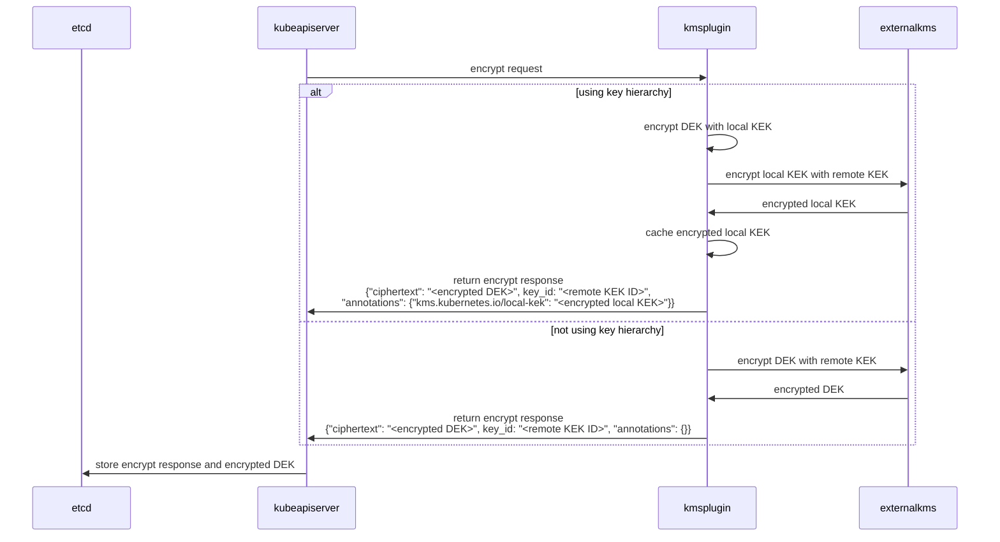
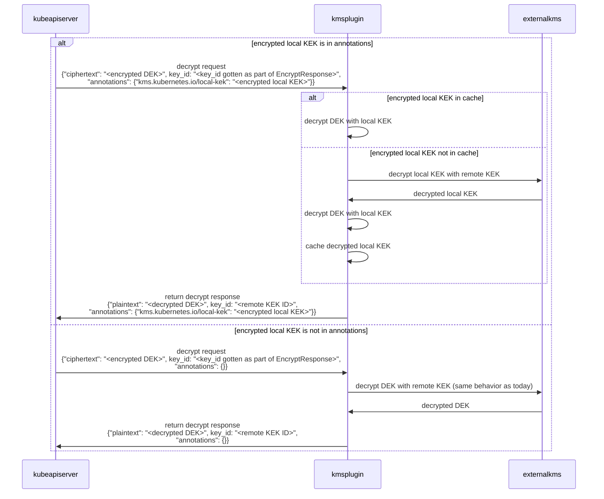

# KEP-3299: KMS v2 Improvements

<!-- toc -->
- [Release Signoff Checklist](#release-signoff-checklist)
- [Summary](#summary)
- [Motivation](#motivation)
  - [Goals](#goals)
  - [Non-Goals](#non-goals)
- [Proposal](#proposal)
- [Design Details](#design-details)
  - [v2 API](#v2-api)
  - [Key Hierarchy](#key-hierarchy)
  - [Metadata](#metadata)
  - [Status API](#status-api)
  - [Observability](#observability)
  - [Sequence Diagram](#sequence-diagram)
    - [Encrypt Request](#encrypt-request)
    - [Decrypt Request](#decrypt-request)
  - [Test Plan](#test-plan)
      - [Prerequisite testing updates](#prerequisite-testing-updates)
      - [Unit tests](#unit-tests)
      - [Integration tests](#integration-tests)
      - [e2e tests](#e2e-tests)
  - [Graduation Criteria](#graduation-criteria)
    - [Alpha](#alpha)
    - [Beta](#beta)
    - [GA](#ga)
- [Production Readiness Review Questionnaire](#production-readiness-review-questionnaire)
  - [Feature Enablement and Rollback](#feature-enablement-and-rollback)
  - [Rollout, Upgrade and Rollback Planning](#rollout-upgrade-and-rollback-planning)
  - [Monitoring Requirements](#monitoring-requirements)
  - [Dependencies](#dependencies)
  - [Scalability](#scalability)
  - [Troubleshooting](#troubleshooting)
- [Implementation History](#implementation-history)
- [Alternatives](#alternatives)
- [Infrastructure Needed](#infrastructure-needed)
<!-- /toc -->

## Release Signoff Checklist

Items marked with (R) are required *prior to targeting to a milestone / release*.

- [ ] (R) Enhancement issue in release milestone, which links to KEP dir in [kubernetes/enhancements] (not the initial KEP PR)
- [ ] (R) KEP approvers have approved the KEP status as `implementable`
- [ ] (R) Design details are appropriately documented
- [ ] (R) Test plan is in place, giving consideration to SIG Architecture and SIG Testing input (including test refactors)
  - [ ] e2e Tests for all Beta API Operations (endpoints)
  - [ ] (R) Ensure GA e2e tests for meet requirements for [Conformance Tests](https://github.com/kubernetes/community/blob/master/contributors/devel/sig-architecture/conformance-tests.md)
  - [ ] (R) Minimum Two Week Window for GA e2e tests to prove flake free
- [ ] (R) Graduation criteria is in place
  - [ ] (R) [all GA Endpoints](https://github.com/kubernetes/community/pull/1806) must be hit by [Conformance Tests](https://github.com/kubernetes/community/blob/master/contributors/devel/sig-architecture/conformance-tests.md)
- [ ] (R) Production readiness review completed
- [ ] (R) Production readiness review approved
- [ ] "Implementation History" section is up-to-date for milestone
- [ ] User-facing documentation has been created in [kubernetes/website], for publication to [kubernetes.io]
- [ ] Supporting documentation—e.g., additional design documents, links to mailing list discussions/SIG meetings, relevant PRs/issues, release notes

[kubernetes.io]: https://kubernetes.io/
[kubernetes/enhancements]: https://git.k8s.io/enhancements
[kubernetes/kubernetes]: https://git.k8s.io/kubernetes
[kubernetes/website]: https://git.k8s.io/website

## Summary

This KEP proposes the new v2alpha1 `KeyManagementService` service contract to:
- enable partially automated key rotation for the latest key without API server restarts
- improve KMS plugin health check reliability
- improve observability of envelop operations between kube-apiserver, KMS plugins and KMS

It further proposes a SIG-Auth maintained KMS plugin reference implementation. This implementation will support a key hierarchy design that implements the v2alpha1 API and will serve as a baseline that provides:
- improve readiness times for clusters with a large number of encrypted resources
- reduce the likelihood of hitting the external KMS request rate limit
- metrics and tracing support

## Motivation

**Performance**: Today, when the kube-apiserver is restarted in a cluster and a LIST secret call is made (this applies to all resources encrypted at rest, which secrets tend to always be part of), due to the serial processing of LIST requests and the data encryption key (DEK) cache being empty, the initialization of informers may take significant time as a result of the large number of consecutive trips to the KMS plugin -> external KMS for all the DEKs that have been generated so far. This serial call can cause the KMS plugin to hit the external KMS rate limit and delay the overall readiness of the cluster. Currently, a DEK is generated for each object and is then encrypted using a KEK. This 1:1 mapping means if there is a burst of secret creation, then the KMS plugin can also hit the external KMS rate limit for encrypt operations.

**Rotation**: Currently, it requires lots of manual steps to [rotate a KMS key for Kubernetes](https://kubernetes.io/docs/tasks/administer-cluster/encrypt-data/#rotating-a-decryption-key) and the process is error prone. It requires deployment of another instance of the KMS plugin with the new key running side by side with the old instance while adding a second entry of the new plugin to `EncryptionConfiguration`. Any change to the `EncryptionConfiguration` requires a kube-apiserver restart for the changes to take effect. For a single kube-apiserver configuration, this can lead to a brief period when the kube-apiserver is unavailable. The current rotation process requires multiple restarts of all kube-apiserver processes to ensure each server can decrypt and then encrypt using the new key. It requires multiple updates to the `EncryptionConfiguration`  to move the new key to the second and then first entry in the keys array so that it is used for encryption in the config. It also requires running storage migration (either via the storage version migrator or a manual invocation of `kubectl get secrets --all-namespaces -o json | kubectl replace -f - `) to encrypt all existing Secrets with the new key, which can timeout and leave the cluster in a state where it is still dependent on the old key.

**Health Check & Status**: Today, the health check from kube-apiserver to KMS plugin is an `Encrypt` operation followed by `Decrypt` operation. These operations cost money in cloud environments and do not allow the plugin to perform more holistic checks on if it is healthy. Furthermore, a plugin has no way to inform the API server if its underlying key encryption key (KEK) has been rotated. If we provide a separate status RPC call with its own `StatusRequest` and `StatusResponse`, the KMS plugin can indicate the change in KEK version as part of response. This could be an indication that the KEK is now rotated and storage migration is now required.

**Observability**: The only way to correlate a successful/failed envelope operation today is to use the approximate timestamp of the operation to check events in kube-apiserver, kms-plugin and KMS. There is no guarantee that the timestamp of the operation is the same as the timestamp of the corresponding event in KMS. This KEP proposes extending the signature of the kms-plugin interface to include the transaction ID (to be generated by the kube-apiserver), which kms-plugin could pass to KMS. This transaction ID will be logged in the kube-apiserver with additional metadata such as secret name and namespace for the envelope operation. Similarly, the transaction ID will be logged in the kms-plugin and optionally passed to KMS.

### Goals
- improve readiness times for clusters with a large number of encrypted resources
- reduce the likelihood of hitting the KMS rate limit
- enable fully automated key rotation for the latest key
- improve KMS plugin health check reliability
- improve observability of envelop operations between kube-apiserver, KMS plugins and KMS
- if this v2 API reaches GA in release N, the existing v1beta1 gRPC API will be deprecated at release N and removed at release N+3 (the existing key rotation dance of using multiple providers will be used to migrate from v1beta1 to v2)

### Non-Goals
- Prevent KMS rate limiting
- Recovery when KMS KEK is deleted
- Using the proposed transaction ID for audit logging

## Proposal

Performance, Health Check, Observability and Rotation:
- Support key hierarchy in KMS plugin that generates local KEK
- Expand `EncryptionConfiguration` to support a new KMSv2 configuration
- Add v2alpha1 `KeyManagementService` proto service contract in Kubernetes to include
    - `key_id` and additional metadata in `annotations` to support key rotation
    - `key_id`: the KMS Key ID, stable identifier, changed to trigger key rotation and storage migration
    - `annotations`: structured data, can contain the encrypted local KEK, can be used for debugging, recovery, opaque to API server, stored unencrypted, etc. Validation similar to how K8s labels are validated today. Labels have good size limits and restrictions today.
    - A status request and response periodically (order of minutes) returns `version`, `healthz`, and `key_id`
    - The `key_id` in status can be used on decrypt operations to compare and validate the key ID stored in the DEK cache and the latest `EncryptResponse` `key_id` to detect if an object is stale in terms of storage migration
    - Generate a new UID for each envelope operation in kube-apiserver
    - Add a new UID field to `EncryptRequest` and `DecryptRequest`
- Add support for hot reload of the `EncryptionConfiguration`:
    - Watch on the `EncryptionConfiguration`
    - When changes are detected, process the `EncryptionConfiguration` resource, and add new transformers and update existing ones atomically.
    - If there is an issue with creating or updating any of the transformers, retain the current configuration in the kube-apiserver and generate an error in logs.
- Enable partially automated rotation for `latest` key in KMS:
    > NOTE: Prerequisite: `EncryptionConfiguration` is set up to always use the `latest` key version in KMS and the values can be interpreted dynamically at runtime by the KMS plugin to hot reload the current write key. Rotation process sequence:
    - record initial key ID across all API servers
    - cause key rotation in KMS (user action in the remote KMS)
    - observe the change across the stack using metrics from API server
    - storage migration (run storage migrator)

## Design Details

### v2 API

`EncryptionConfiguration` will be expanded to support the new v2 API:

```diff
​​diff --git a/staging/src/k8s.io/apiserver/pkg/apis/config/v1/types.go b/staging/src/k8s.io/apiserver/pkg/apis/config/v1/types.go
index d7d68d2584d..84c1fa6546f 100644
--- a/staging/src/k8s.io/apiserver/pkg/apis/config/v1/types.go
+++ b/staging/src/k8s.io/apiserver/pkg/apis/config/v1/types.go
@@ -98,3 +99,10 @@ type KMSConfiguration struct {
+    // apiversion of KeyManagementService
+    APIVersion string `json:"apiVersion"`
```

Support key hierarchy in KMS plugin that generates local KEK and add v2 `KeyManagementService` proto service contract in Kubernetes to include `key_id`, `annotations`, and `status`.

### Key Hierarchy

Key Hierarchy in KMS plugin (reference implementation):

1. No changes to the API server, keep 1:1 DEK mapping
    1. Assumption: A KMS plugin that was implemented using a local HSM would not need any changes because it would be able to handle the amount of encryption calls with ease since it would not need to perform network IO
    1. Assumption: local gRPC calls to the KMS plugin do not represent significant overhead
1. KMS plugin generates its own local KEK in-memory
1. External KMS is used to encrypt the local KEK
1. Local KEK is used for encryption of DEKs sent by API server
1. Local KEK is used for encryption based on policy (N events, X time, etc)

Since key hierarchy is implemented at the KMS plugin level, it should be seamless for the kube-apiserver. So whether the plugin is using a key hierarchy or not, the kube-apiserver should behave the same.

### Metadata

What is required of the kube-apiserver is to be able to tell the KMS plugin which KEK (local KEK or KMS KEK) it should use to decrypt the incoming DEK. To do so, upon encryption, the KMS plugin could provide the encrypted local KEK as part of the `annotations` field in the `EncryptResponse`. The kube-apiserver would then store it in etcd next to the DEK. Upon decryption, the kube-apiserver provides the encrypted local KEK in `annotations` and `key_id` from the last encryption when calling Decrypt. In case no encrypted local KEK is provided in the `annotations`, then we can assume key hierarchy is not used. The KMS plugin would query the external KMS to use the remote KEK to decrypt the DEK (same behavior as today). No state coordination is required between different instances of the KMS plugin.

For the reference KMS plugin, the encrypted local KEK is stored in etcd via the `annotations` field, and once decrypted, it can be stored in memory as part of the KMS plugin cache to be used for encryption and decryption of DEKs. The encrypted local KEK is used as the key and the decrypted local KEK is stored as the value.

```proto
message EncryptResponse {
    // The encrypted data.
    bytes ciphertext = 1;
    // The KMS key ID used to encrypt the data. This must always refer to the KMS KEK and not any local KEKs that may be in use.
    // This can be used to inform staleness of data updated via value.Transformer.TransformFromStorage.
    string key_id = 2;
    // Additional metadata to be stored with the encrypted data.
    // This metadata can contain the encrypted local KEK that was used to encrypt the DEK.
    // This data is stored in plaintext in etcd. KMS plugin implementations are responsible for pre-encrypting any sensitive data.
    map<string, bytes> annotations = 3;
}
```

The `DecryptRequest` passes the same `key_id` and `annotations` returned by the previous `EncryptResponse` of this data as its `key_id` and `annotations` for the decryption request.

```proto
message DecryptRequest {
    // The data to be decrypted.
    bytes ciphertext = 1;
    // UID is a unique identifier for the request.
    string uid = 2;
    // The keyID that was provided to the apiserver during encryption.
    // This represents the KMS KEK that was used to encrypt the data.
    string key_id = 3;
    // Additional metadata that was sent by the KMS plugin during encryption.
    map<string, bytes> annotations = 4;
}

message DecryptResponse {
    // The decrypted data.
    bytes plaintext = 1;
}

message EncryptRequest {
    // The data to be encrypted.
    bytes plaintext = 1;
    // UID is a unique identifier for the request.
    string uid = 2;
}
```

In terms of storage, a new structured protobuf format is proposed. The prefix for the new format is `k8s:enc:kms:v2:<config name>:`.

```go
// EncryptedObject is the representation of data stored in etcd after envelope encryption.
type EncryptedObject struct {
	// EncryptedData is the encrypted data.
	EncryptedData []byte `protobuf:"bytes,1,opt,name=encryptedData,proto3" json:"encryptedData,omitempty"`
	// KeyID is the KMS key ID used for encryption operations.
	KeyID string `protobuf:"bytes,2,opt,name=keyID,proto3" json:"keyID,omitempty"`
	// EncryptedDEK is the encrypted DEK.
	EncryptedDEK []byte `protobuf:"bytes,3,opt,name=encryptedDEK,proto3" json:"encryptedDEK,omitempty"`
	// Annotations is additional metadata that was provided by the KMS plugin.
	Annotations          map[string][]byte `protobuf:"bytes,4,rep,name=annotations,proto3" json:"annotations,omitempty" protobuf_key:"bytes,1,opt,name=key,proto3" protobuf_val:"bytes,2,opt,name=value,proto3"`
}
```

This object simply provides a structured format to store the `EncryptResponse` data with the plugin name and encrypted object data. New fields can easily be added to this format.

### Status API

To improve health check reliability, the new StatusResponse provides version, healthz information, and can trigger key rotation via storage version status updates.

```proto
message StatusRequest {}

message StatusResponse {
    // Version of the KMS plugin API.  Must match the configured .resources[].providers[].kms.apiVersion
    string version = 1;
    // Any value other than "ok" is failing healthz.  On failure, the associated API server healthz endpoint will contain this value as part of the error message.
    string healthz = 2;
    // the current write key, used to determine staleness of data updated via value.Transformer.TransformFromStorage.
    string key_id = 3;
}
```

The `key_id` will be funneled into API server metrics and audit annotations. *TODO: define metrics.*

### Observability

To improve observability, this design also generates a new `UID` for each envelope operation similar to `UID` generation in admission review requests here: https://github.com/kubernetes/kubernetes/blob/e9e669aa6037c380469b45200e59cff9b52d6d68/staging/src/k8s.io/apiserver/pkg/admission/plugin/webhook/request/admissionreview.go#L137.

This `UID` field is included in the `EncryptRequest` and `DecryptRequest` of the v2 API.  It will always be present. It is generated in the kube-apiserver and will be used:

1. For logging in the kube-apiserver. All envelope operations to the kms-plugin will be logged with the corresponding `UID`.
   1. The `UID` will be logged using a wrapper in the kube-apiserver to ensure that the `UID` is logged in the same format and is always logged.
   2. In addition to the `UID`, the kube-apiserver will also log non-sensitive metadata such as `name`, `namespace` and `GroupVersionResource` of the object that triggered the envelope operation.
2. Sent to the kms-plugin as part of the `EncryptRequest` and `DecryptRequest` structs.

### Sequence Diagram

#### Encrypt Request



#### Decrypt Request



### Test Plan

[x] I/we understand the owners of the involved components may require updates to existing tests to make this code solid enough prior to committing the changes necessary to implement this enhancement.

##### Prerequisite testing updates

##### Unit tests

- Validate key hierarchy behavior in reference implementation
  - Local KEK is generated for encryption
  - Local KEK is rotated after a period of time/number of operations
  - Remote KEK is only called when
    - Cache is empty, so remote KEK is needed to decrypt local KEK
    - Local KEK is generated or rotated
  - When key hierarchy is not used, remote KEK is called for every encryption/decryption
  - Ensure the logs and metrics are generated as expected
  - At least 75% code coverage
- Staleness check based on keyID in the `StatusResponse`
- Unit test for gRPC request/response validation
  - Serialize/Deserialize `EncryptedObject`
  - Validate keyID in `StatusResponse` and `EncryptResponse`
  - Validate annotations in `EncryptResponse`
  - Validate logs are generated with the correct `UID` and additional metadata

##### Integration tests

- Integration tests to validate
  - Encryption of custom resources and custom resource definitions
  - No-op writes cause rewrite of stale data (data that has correct schema but was encrypted with keyID that is not the latest)
  - Health checks
    - single health check for v2 at `/kms-providers`
    - individual health checks for v1 and v2 with `/kms-provider-0` and `/kms-provider-1`
- Integration tests with base64 plugin to validate the encryption and decryption of data
- Integration tests with reference implementation
  - Validate the encryption and decryption of data
  - Validate the functionality of reference implementation
- Integration tests to check rotation is possible without restarting API server
- Integration tests that exercise the feature enablement/disablement flow

##### e2e tests

With this e2e test suite, we want to do the following:
1. Run the e2e suite against a kind cluster without kms encryption enabled.
2. Run the e2e suite against a kind cluster that has kms v2 encryption enabled (as defined below).
3. Compare `request_duration_seconds`, `request_terminations_total`, `request_aborts_total` API server metrics between the two runs. The acceptable delta should be less than 20%.
4. Observe metrics from the reference implementation to determine time taken at each step of the encryption/decryption process.
5. Observe API server startup time with and without kms encryption enabled.

- KMSv2 config would use the reference implementation
  - Validate all resources are encrypted
  - The "remote" kms would be a local encryption key
    - that adds 100 ms latency
    - that has rate limiting
  - Key hierarchy would be used

### Graduation Criteria

#### Alpha

- Feature implemented behind a feature flag
- Initial unit and integration tests completed and enabled

#### Beta

- Feature is enabled by default
- All of the above documented tests are complete
- Precise documentation outlining how to build components that can do automatic rotation
  - For example, how to write a controller that scrapes the API server metrics and uses that to trigger rotation with the storage migration controller.
- Reference implementation is ready
  - Provide an example implementation using pkcs11
  - Metrics in the implementation to gauge performance
  - Documentation of the metrics
- Metrics in API server to gauge performance impact

#### GA

- Tracing is added to the reference implementation
- At least 2 KMSv2 plugin implementations are available
  - We will gather feedback from these implementations to determine if API is sufficient

## Production Readiness Review Questionnaire

### Feature Enablement and Rollback

###### How can this feature be enabled / disabled in a live cluster?

- Feature gate
  - Feature gate name: `KMSv2`
  - Components depending on the feature gate:
    - kube-apiserver

**Alpha**
```go
FeatureSpec{
	Default: false,
	LockToDefault: false,
	PreRelease: featuregate.Alpha,
}
```

**Beta**
```go
FeatureSpec{
	Default: true,
	LockToDefault: false,
	PreRelease: featuregate.Beta,
}
```

###### Does enabling the feature change any default behavior?

No. The v2 API is new in the v1.25 release. Furthermore, even with the feature enabled by default, the user needs to explicitly configure a KMSv2 provider to use this.

###### Can the feature be disabled once it has been enabled (i.e. can we roll back the enablement)?

Yes, To disable encryption at rest using the v2 API:
1. Add new `identity` provider at the top of encryption config
1. Restart kube-apiserver
1. Run storage migration to migrate all the existing encrypted data to use the `identity` provider
   1. If running `kubectl get <resource> --all-namespaces -o json | kubectl replace -f -` to migrate data, the user can confirm that the migration is complete by observing the kube-apiserver metrics `apiserver_envelope_encryption_key_id_hash_last_timestamp_seconds` and `apiserver_envelope_encryption_key_id_hash_total`. These metrics will no longer contain the keyID hash of the old KEK after storage migration and kube-apiserver restart.
   2. If running storage version migrator to migrate data, the user can confirm that the migration is complete by observing the conditions in `storageversionmigrations`. Refer to [doc](https://github.com/kubernetes-sigs/kube-storage-version-migrator/blob/master/USER_GUIDE.md#check-if-migration-has-completed) for more details. Using the storage version migrator is recommended.
1. Remove the KMS provider from the encryption config and restart kube-apiserver
2. At the end of these steps, all the data in etcd will be unencrypted.

More details are available [here](https://kubernetes.io/docs/tasks/administer-cluster/kms-provider/#disabling-encryption-at-rest)

Disabling this gate without first doing a storage migration to use a different encryption at rest mechanism will result in data loss.
- For secrets that are mounted in pods, if the DEK used to encrypt the secret is not present in the kube-apiserver cache, the pods will fail to start as the secret will not be able to be decrypted.

Once the feature gate is disabled, if the plan is to use a different encryption at rest mechanism instead of KMS, then unset the `--encryption-provider-config` flag on the kube-apiserver.

###### What happens if we reenable the feature if it was previously rolled back?

After the feature is reenabled, if a v2 KMS provider is still configured in the `EncryptionConfiguration`
- All new data will be encrypted with the external kms provider.
- Existing data can be decrypted if the key used for encryption before feature rollback still exists.

###### Are there any tests for feature enablement/disablement?

- We will add integration tests to validate the enablement/disablement flow.
- When the feature is disabled, data stored in etcd will no longer be encrypted using the external kms provider with v2 API.
- If the feature is disabled incorrectly (i.e without performing a storage migration), existing data that is encrypted with the external kms provider will be unable to be decrypted. This will cause list and get operations to fail for the resources that were encrypted.

### Rollout, Upgrade and Rollback Planning

###### How can a rollout or rollback fail? Can it impact already running workloads?

- If a rollback of the feature is done without first doing a storage migration to use a different encryption at rest mechanism will result in data loss.
  - Workloads relying on existing data in etcd will no longer be able to access it.
  - The data can be retrieved by reenabling the feature gate or deleting and recreating the data.
- The rollout of the feature can fail if there are too many calls to the external kms provider.
  - API server will not report healthy.
- For highly-available clusters, the feature can be enabled on some API servers only for read purpose.
  - For rollout, add KMSv2 providers as read across all API servers first before adding the provider for write.
  - For rollback, move KMSv2 providers from write to read position across all API servers.

###### What specific metrics should inform a rollback?

- Latency metrics `transformation_duration_seconds`
- Transformation error count metric `apiserver_storage_transformation_duration_seconds_bucket{transformation_type="from_storage", transformer_prefix="k8s:enc:kms:v2:"}`
- After rollback is complete, you should no longer see the keyID metric `apiserver_envelope_encryption_key_id_hash_total` increment.

###### Were upgrade and rollback tested? Was the upgrade->downgrade->upgrade path tested?

This will be covered by integration tests.

###### Is the rollout accompanied by any deprecations and/or removals of features, APIs, fields of API types, flags, etc.?

- The `cacheSize` field in `EncryptionConfiguration` is no longer valid for KMS v2.
- When KMSv2 is used without KMSv1 provider, the health endpoints don't individually identify for each KMS provider.

### Monitoring Requirements

###### How can someone using this feature know that it is working for their instance?

- [x] Other (treat as last resort)
  - Details:
    - Logs in kube-apiserver, kms-plugin and KMS will be logged with the corresponding `key_id`, `annotations`, and `UID`.
    - Number of times a keyID is used for encryption/decryption
    - Metric recording the last time in seconds when a keyID was returned in the `StatusResponse` e.g. `apiserver_envelope_encryption_key_id_hash_status_last_timestamp_seconds{key_id_hash="sha256", provider_name="providerName"} 1.674865558833728e+09`

###### What are the reasonable SLOs (Service Level Objectives) for the enhancement?

There should be no impact on the SLO with this change.

###### What are the SLIs (Service Level Indicators) an operator can use to determine the health of the service?

- [x] Other (treat as last resort)
  - Details:
    - Logs in kube-apiserver, kms-plugin and KMS will be logged with the corresponding `key_id`, `annotations`, and `UID`.
    - Metrics for latency of encryption/decryption requests.

### Dependencies

###### Does this feature depend on any specific services running in the cluster?

This feature requires the KMS plugin to be running.

### Scalability

###### Will enabling / using this feature result in any new API calls?

Yes, the new KMS v2 gRPC API.

###### Will enabling / using this feature result in introducing new API types?

Yes, the new KMS v2 gRPC types.

###### Will enabling / using this feature result in any new calls to the cloud provider?

No.

###### Will enabling / using this feature result in increasing size or count of the existing API objects?

No, the v2 API is new.

###### Will enabling / using this feature result in increasing time taken by any operations covered by existing SLIs/SLOs?

No.

###### Will enabling / using this feature result in non-negligible increase of resource usage (CPU, RAM, disk, IO, ...) in any components?

No.

### Troubleshooting

###### How does this feature react if the API server and/or etcd is unavailable?

- This feature is part of API server. The feature is unavailable if API server is unavailable. ETCD data encryption with external kms-plugin will be unavailable.
- If the API server is unavailable, clients will be unable to create/get data that's stored in etcd. There will be no requests from the API server to the kms-plugin.
- If the `EncryptionConfiguration` file configured in the control plane node is not valid:
  - API server when restarted will fail at startup as it's unable to load the EncryptionConfig. This behavior is consistent with the KMS v1 API. The encryption configuration needs to be fixed to allow the API server to start properly.
- If the KMS plugin is unavailable:
  - API server when restarted will fail health check as it's unable to connect to the KMS plugin. The `/livez` and `/readyz` endpoints will show a `failed` health check for the kms provider. This behavior is consistent with the KMS v1 API. Refer to [docs](https://kubernetes.io/docs/reference/using-api/health-checks/) for the health API endpoints and how to exclude individual endpoints from causing the API server to fail health check.
  - To resolve the issue, the kms plugin must be fixed to be available. The logs in the kms-plugin should be indicative of the issue.

## Implementation History

- 2022-05-09: Initial KEP draft submitted.
- 2022-09-09: KMSv2 Alpha (v1.25) implemented https://github.com/kubernetes/kubernetes/pull/111126

## Alternatives

**Performance and rotation:**

We considered the follow approaches and each has its own drawbacks:
1. `cacheSize` field in `EncryptionConfiguration`. It is used by the API server to initialize a LRU cache of the given size with the encrypted ciphertext used as index. Having a higher value for the `cacheSize` will prevent calls to the plugin for decryption operations. However, this does not solve the issue with the number of calls to KMS plugin when encryption traffic is bursty.
1. Reduce the number of trips to KMS by caching DEKs by allowing one DEK to be used to encrypt multiple objects within the configured TTL period. One issue with this approach is it will be very hard to inform the API server to rotate the DEKs when a KEK has been rotated.

**Observability**:

We considered using the `AuditID` from the kube-apiserver request that generated the envelope operation. This approach has the following drawbacks:

1. `AuditID` can be configured by the user with the `Audit-ID` header in the API server request. Multiple requests can be sent to the kube-apiserver with the same `Audit-ID`.
2. Not all API server requests will generate an envelope operation. The API server caches DEKs and for the DEK that's available in the cache, the kube-apiserver will not generate an envelope operation.
3. Since not all calls to the KMS correspond to an audit log, using audit ID is not complete for correlating calls from kube-apiserver->kms-plugin->KMS.

## Infrastructure Needed

We need a new git repo for the KMS plugin reference implementation. It will need to be synced from the k/k staging dir.
- repo created: https://github.com/kubernetes/kms
