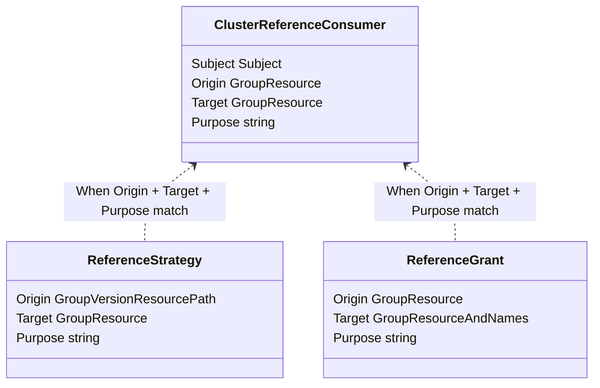
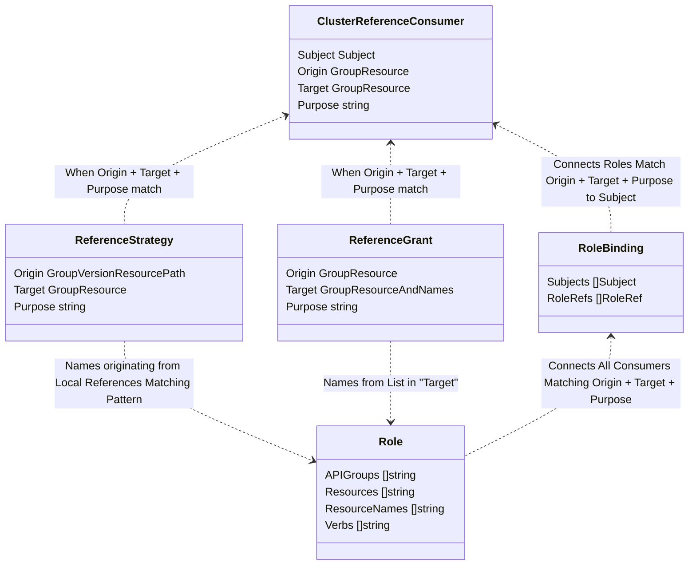

# KEP-3766: Referential Authorization

<!-- toc -->
- [Release Signoff Checklist](#release-signoff-checklist)
- [Summary](#summary)
- [Diagrams](#diagrams)
  - [Proposed API Summary](#proposed-api-summary)
  - [With RBAC for Illustration](#with-rbac-for-illustration)
- [Motivation](#motivation)
  - [Goals](#goals)
  - [Non-Goals](#non-goals)
- [Proposal](#proposal)
  - [Risks and Mitigations](#risks-and-mitigations)
    - [Potential for Variations Among Implementations](#potential-for-variations-among-implementations)
    - [Cross-Namespace References may Weaken Namespace Boundaries](#cross-namespace-references-may-weaken-namespace-boundaries)
- [Design Details](#design-details)
  - [General Notes](#general-notes)
    - [<code>ReferenceGrant</code> is half of a handshake](#referencegrant-is-half-of-a-handshake)
    - [ReferenceGrant authors must have sufficient access](#referencegrant-authors-must-have-sufficient-access)
    - [<code>resource</code> versus <code>kind</code>](#resource-versus-kind)
    - [Revocation behavior](#revocation-behavior)
  - [Example Usage](#example-usage)
    - [Gateway API Cross-Namespace Secret Reference](#gateway-api-cross-namespace-secret-reference)
  - [Existing ReferenceGrant Usage Examples](#existing-referencegrant-usage-examples)
    - [Gateway API HTTPRoute Referencing Service](#gateway-api-httproute-referencing-service)
    - [PersistentVolumeClaim using cross namespace data source](#persistentvolumeclaim-using-cross-namespace-data-source)
  - [API Spec](#api-spec)
    - [ClusterReferenceConsumer](#clusterreferenceconsumer)
    - [ReferenceStrategy](#referencestrategy)
    - [ReferenceGrant](#referencegrant)
  - [Outstanding questions and clarifications](#outstanding-questions-and-clarifications)
  - [Test Plan](#test-plan)
      - [Prerequisite testing updates](#prerequisite-testing-updates)
      - [Unit tests](#unit-tests)
      - [Integration tests](#integration-tests)
      - [e2e tests](#e2e-tests)
  - [Graduation Criteria](#graduation-criteria)
    - [Beta](#beta)
    - [GA](#ga)
  - [Upgrade / Downgrade Strategy](#upgrade--downgrade-strategy)
  - [Version Skew Strategy](#version-skew-strategy)
- [Intentional Omissions](#intentional-omissions)
  - [Object.Metadata sub-resource](#we-need-an-object.metadata-sub-resource)
  - [Wildcard Selectors?](#wildcard-selectors)
    - [Rationale](#rationale)
    - [Context](#context)
  - [Do We Need Label Selectors?](#do-we-need-label-selectors)
    - [Rationale](#rationale-1)
    - [Context](#context-1)
  - [Do We Need Status?](#do-we-need-status)
    - [Rationale](#rationale-2)
    - [Context](#context-2)
- [Production Readiness Review Questionnaire](#production-readiness-review-questionnaire)
  - [Feature Enablement and Rollback](#feature-enablement-and-rollback)
  - [Rollout, Upgrade and Rollback Planning](#rollout-upgrade-and-rollback-planning)
  - [Monitoring Requirements](#monitoring-requirements)
  - [Dependencies](#dependencies)
  - [Scalability](#scalability)
  - [Troubleshooting](#troubleshooting)
- [Implementation History](#implementation-history)
- [Drawbacks](#drawbacks)
- [Alternatives](#alternatives)
  - [Implement a revised ReferenceGrant as a CustomResourceDefinition](#implement-a-revised-referencegrant-as-a-customresourcedefinition)
  - [Every API that wants to support cross-namespace references maintains its own equivalent to ReferenceGrant](#every-api-that-wants-to-support-cross-namespace-references-maintains-its-own-equivalent-to-referencegrant)
  - [Use CEL to define ReferenceStrategy, rather than JSONPath](#use-cel-to-define-referencestrategy-rather-than-jsonpath)
<!-- /toc -->

## Release Signoff Checklist

Items marked with (R) are required *prior to targeting to a milestone / release*.

- [ ] (R) Enhancement issue in release milestone, which links to KEP dir in [kubernetes/enhancements] (not the initial KEP PR)
- [ ] (R) KEP approvers have approved the KEP status as `implementable`
- [ ] (R) Design details are appropriately documented
- [ ] (R) Test plan is in place, giving consideration to SIG Architecture and SIG Testing input (including test refactors)
  - [ ] e2e Tests for all Beta API Operations (endpoints)
  - [ ] (R) Ensure GA e2e tests meet requirements for [Conformance Tests](https://github.com/kubernetes/community/blob/master/contributors/devel/sig-architecture/conformance-tests.md)
  - [ ] (R) Minimum Two Week Window for GA e2e tests to prove flake free
- [ ] (R) Graduation criteria is in place
  - [ ] (R) [all GA Endpoints](https://github.com/kubernetes/community/pull/1806) must be hit by [Conformance Tests](https://github.com/kubernetes/community/blob/master/contributors/devel/sig-architecture/conformance-tests.md)
- [ ] (R) Production readiness review completed
- [ ] (R) Production readiness review approved
- [ ] "Implementation History" section is up-to-date for milestone
- [ ] User-facing documentation has been created in [kubernetes/website], for publication to [kubernetes.io]
- [ ] Supporting documentation—e.g., additional design documents, links to mailing list discussions/SIG meetings, relevant PRs/issues, release notes

[kubernetes.io]: https://kubernetes.io/
[kubernetes/enhancements]: https://git.k8s.io/enhancements
[kubernetes/kubernetes]: https://git.k8s.io/kubernetes
[kubernetes/website]: https://git.k8s.io/website

## Summary

[ReferenceGrant](https://gateway-api.sigs.k8s.io/api-types/referencegrant/) was
developed by the [Gateway API subproject](https://gateway-api.sigs.k8s.io/) to
enable certain object references to cross namespaces. More recently, it has also
been [used by
sig-storage](https://kubernetes.io/blog/2023/01/02/cross-namespace-data-sources-alpha/)
to enable cross-namespace data sources.

This KEP proposes building that overall idea of referential authorization
directly into Kubernetes. This will build on the original idea of ReferenceGrant
but add additional capabilities along the way.

## Diagrams

### Proposed API Summary
This roughly illustrates how the proposed APIs are connected:



### With RBAC for Illustration
Although we will not be generating RBAC as part of this work, it may help to
illustrate how we could generate RBAC to show how these resources translate to
authorization.



## Motivation

Any project that wants to enable cross-namespace references currently has to
choose between introducing a dependency on Gateway API's ReferenceGrant or
creating a new API that would be partially redundant (leading to confusion for
users).

Recent interest between SIGs and projects (SIG Network, SIG Storage, and Flux)
has made it clear that ReferenceGrant is wanted for use cases other than Gateway
API. We would like to move ReferenceGrant to a neutral home (ideally, under SIG
Auth) in order to make it the canonical API for managing references across
namespaces.

Due to lack of better alternatives, Ingress and Gateway controllers, for
instance, are often deployed with read access to all Secrets in the cluster.
This can be a significant security risk as these components often already sit on
the edge of a cluster. Finding a way to compromise an Ingress or Gateway
controller could potentially provide access to all Secrets in a cluster. This
KEP provides a more fine-grained approach to authorizing cross- and in-namespace
references, such that users have the realistic possibility of removing coarse
RBAC rules such as that the Ingress controller can access all the Secrets in the
cluster. This KEP does not offer extra security for references, in case RBAC
rules are applied in such a coarse manner.

### Goals

* Introduce API(s) that enable the same capabilities that ReferenceGrant does
  within Gateway API.
* In addition to ReferenceGrant's capabilities, expand the scope of this KEP so
  that it enables:
  * Authorizing controllers to read only resources that have been referenced by
    resources they are implementing.
  * Building a more generic approach that will enable generic controllers and
    authorizers to implement this API without prior knowledge of resources that
    references are origin or target.
* Clearly define how ReferenceGrant should be used, including both current use
  cases and guidance for future use cases.
* Implement a library to ensure that ReferenceGrant is implemented consistently
  by all controllers.

### Non-Goals

* Advanced capabilities like label selectors and the ability to allow references
  originating from any namespace are likely reasonable future extensions of this
  API but are intentionally out of scope for the initial work.

## Proposal

Create 3 new API types in a new `reference.authorization.k8s.io` API Group:

1. **ReferenceStrategy:** This resource grants access to resources by
   following references within the same namespace. For example, a `gateways`
   ReferenceStrategy would grant access to Gateway controllers for
   same-namespace references from Gateways to TLS Secrets. API developers would
   bundle these resources with their APIs.
2. **ClusterReferenceConsumer:** This resource links a consumer (defined by
   something like a RBAC Subject) to ReferenceGrants. For example, a
   Gateway controller that used a ServiceAccount for auth, would
   include a ClusterReferenceConsumer tying that ServiceAccount to references
   from "Gateways" to "Secrets" for "tls-serving". This would link that consumer
   to any ReferenceGrants with the same `origin`, `target`, and `purpose` values.
3. **ReferenceGrant:** This resource authorizes specific instances of
   cross-namespace references. For example, if an owner of a `acme-cert` Secret
   in namespace `foo` wants to allow a TLS reference to that Secret from a
   Gateway in namespace `bar`, they would create a ReferenceGrant that allowed
   references from Gateways in the `bar` namespace to the `acme-cert` Secret in
   their namespace (`foo`).

### Risks and Mitigations

#### Potential for Variations Among Implementations
Although the authorization logic for ReferenceGrant will be built into
Kubernetes, controllers will still need to perform additional checks. For
example, consider the case where 2 Gateways target the same Secret, but only
one of those references is allowed by a ReferenceGrant. The authorization logic
built into Kubernetes would have granted the controller access to the Secret
but the controller would still need to perform separate checks to ensure that
a ReferenceGrant had allowed a specific reference.

Because this relies on each individual controller to implement the logic,
it is possible that implementations may become inconsistent. Target avoid that,
we'll provide a standard library for implementing ReferenceGrant. We'll
also strongly recommend that every API that relies on ReferenceGrant
includes robust conformance tests covering this functionality. Existing
Gateway API conformance tests can serve as a model for this.

#### Cross-Namespace References may Weaken Namespace Boundaries
Although we believe that the handshake required for cross-namespace references
with ReferenceGrant ensures these references will be safe, it does potentially
weaken existing namespace boundaries. We believe ReferenceGrant will have a net
benefit on the ecosystem as it will allow workloads, secrets, and configuration
to be deployed in separate namespaces that more clearly match up with desired
authorization.

## Design Details

### General Notes

#### `ReferenceGrant` is half of a handshake

When thinking about ReferenceGrant, it is important to remember that it does not
do anything by itself. It *Grants* the *possibility* of making a *Reference*
across namespaces. It's intended that _another resource_ (that is, the `origin`
resource) complete the handshake by creating a reference to the referent
resource (the `target` resource).

#### ReferenceGrant authors must have sufficient access

Anyone creating or updating a ReferenceGrant **MUST** have at least the level of
access to the resources they are providing access to. For the scope of this KEP,
referential authorization translates to `[get, list, watch]` access. In the
future, that may be configurable.

#### `resource` versus `kind`

When creating a metaresource (that is, a resource that targets other resources)
like ReferenceGrant, it's important to consider if the metaresource uses the more
common `kind` or the more correct `resource`.

In the original Gateway API implementation, we chose to use `kind` rather than
`resource`, mainly to improve the user experience. That is, it's easier users
to take the value from the `kind` field at the top of the YAML they are already
using, and put it straight into these fields, rather than needing to do a
kind-resource lookup for every user's interaction with the API. @robscott even
ended up making https://github.com/kubernetes/community/pull/5973 to clarify
the API conventions.

However, in discussion on this KEP, it's clear that the more generic nature of
_this_ API requires the additional specificity that `resource` provides. The
design in this KEP communicates the scope more clearly because
`group`+`resource` is unambiguous and corresponds to exactly one set of objects
on the API Server.

This change also leaves room for an enhancement. Whether we have an in-tree or
CRD implementation, we can rely on the exact matching that the plural resource
name gives us, and [warn](https://kubernetes.io/blog/2020/09/03/warnings/) if
either side of the grant is for an API that's not served by this cluster.

#### Revocation behavior

When a ReferenceGrant is deleted/revoked, the corresponding authorization for
controllers to access that resource via that ReferenceGrant will also be
revoked.

Unfortunately that only covers a portion of the behavior that ReferenceGrant
enables. APIs that make use of ReferenceGrant will need to clearly define how
the revocation of a ReferenceGrant works. With that said, we expect the
following guidelines to be rules to apply to **ALL** implementations of the API:

* Deletion of a ReferenceGrant means the granted access is revoked.
* ReferenceGrant controllers must remove any configuration generated by the
  granted access as soon as possible (eventual consistence permitting).
* Some actions that have already been enabled by the ReferenceGrant (such as
  forwarding requests or persisting data) cannot be undone, but no future
  actions should be allowed.

### Example Usage

#### Gateway API Cross-Namespace Secret Reference

Authors of APIs can bundle ReferenceStrategy with their API definitions
for any references they expect to be common.
API's can opt-in to partition references by class names.
Classes are a normalization of the IngressClass, GatewayClass, StorageClass
pattern. The ReferenceStrategy only needs to extract class names -- no
knowledge of the specialized IngressClass/GatewayClass/StorageClass API is
needed.
Any similar string field in an API that can contain Kubernetes-style names can
be used as a classPath.
References and classes across multiple API versions are supported.

Purpose example, Gateway API could bundle the following ReferenceStrategy to 
authorize same-namespace references from Gateways to Secrets for "tls-serving"
as well as same-namespace references from Gateways to Secrets and ConfigMaps for "tls-client-validation".
Gateways are partitioned by GatewayClass. Access to references of a particular
gatewayClassName should only be given to ClusterReferenceConsumers pertaining to
that class.
Proposed fields from GEP-91 are added to the v1 version, but not v1beta1.

```yaml
kind: ReferenceStrategy
apiVersion: reference.authorization.k8s.io/v1alpha1
metadata:
  name: gateways
origin:
  group: gateway.networking.k8s.io
  resource: gateways
versions:
  - version: v1
    classPath: ".spec.gatewayClassName"
    references:
      - path: "$.spec.listeners[*].tls.certificateRefs[[?(@.group=='' && @.kind=='Secret')].name"
        target:
          group: ""
          resource: secrets
        purpose: tls-serving
      - path: "$.spec.listeners[*].tls.clientValidation.caCertificateRefs[[?(@.group=='' && @.kind=='Secret')].name"
        target:
          group: ""
          resource: secrets
        purpose: tls-client-validation
      - path: "$.spec.listeners[*].tls.clientValidation.caCertificateRefs[[?(@.group=='' && @.kind=='ConfigMap')].name"
        target:
          group: ""
          resource: configmaps
        purpose: tls-client-validation
  - version: v1beta1
    classPath: ".spec.gatewayClassName"
    references:
      - path: "$.spec.listeners[*].tls.certificateRefs[[?(@.group=='' && @.kind=='Secret')].name"
        # Kubernetes JSONPath doesn't actually support this kind of compound boolean filter expression
        target:
          group: ""
          resource: secrets
        purpose: tls-serving
```

Implementations of APIs can bundle ClusterReferenceConsumer resources as part of
their deployment. This resource links a subject (likely the ServiceAccount
used by the controller) to matching ReferenceGrants. The subject of
this ClusterReferenceConsumer will receive authorization for any
ReferenceGrant with matching `origin`, `target`, and `purpose` values.
If the ReferenceStrategy is also partitioning by class, the class name
retrieved from the `classPath` will also need to be contained within the matching 
ClusterReferenceConsumer `classNames` list.

```yaml
kind: ClusterReferenceConsumer
apiVersion: reference.authorization.k8s.io/v1alpha1
metadata:
  name: contour-gateway
subject:
  kind: ServiceAccount
  name: contour
  namespace: contour-system
classNames:
  - contour # one install of contour only uses one GatewayClass
references:
  - origin:
      group: gateway.networking.k8s.io
      resource: gateways
    target:
      group: ""
      resource: secrets
    purpose: tls-serving
  - origin:
      group: gateway.networking.k8s.io
      resource: gateways
    target:
      group: ""
      resource: secrets
    purpose: tls-client-validation
  - origin:
      group: gateway.networking.k8s.io
      resource: gateways
    target:
      group: ""
      resource: configmaps
    purpose: tls-client-validation
```

Finally, users can use ReferenceGrant to authorize specific cross-namespace
references. For example, the following ReferenceGrant authorizes references from
Gateways in the `prod` namespace to the `acme-tls` Secret in the `prod-tls`
namespace for `tls-serving`:

```yaml
kind: ReferenceGrant
apiVersion: reference.authorization.k8s.io/v1alpha1
metadata:
  name: prod-gateways
  namespace: prod-tls
origin:
  group: gateway.networking.k8s.io
  resource: gateways
  namespace: prod
target:
  group: ""
  resource: secrets
  names:
  - acme-tls
purpose: tls-serving
```

An additional ReferenceGrant is needed to also authorizes references from
Gateways in the `prod` namespace to the `aperture-science-ca-cert` ConfigMap
in the `prod-tls` namespace for `tls-client-validation`:

```yaml
kind: ReferenceGrant
apiVersion: reference.authorization.k8s.io/v1alpha1
metadata:
  name: prod-gateways
  namespace: prod-tls
origin:
  group: gateway.networking.k8s.io
  resource: gateways
  namespace: prod
target:
  group: ""
  resource: configmaps
  names:
  - aperture-science-ca-cert
purpose: tls-client-validation
```

### Existing ReferenceGrant Usage Examples

#### Gateway API HTTPRoute Referencing Service

In this example, a HTTPRoute in the `baz` namespace is directing traffic
to a Service backend in the `quux` namespace.

```yaml
apiVersion: gateway.networking.k8s.io/v1
kind: HTTPRoute
metadata:
  name: quux-route
  namespace: baz
spec:
  parentRefs:
  - name: example-gateway
    sectionName: https
  hostnames:
  - quux.example.com
  rules:
  - matches:
    - path:
        type: PathPrefix
        value: /
    # BackendRefs are Services by default.
    backendRefs:
    - name: quuxapp
      namespace: quux
      port: 80
---
apiVersion: gateway.networking.k8s.io/v1beta1
kind: ReferenceGrant
metadata:
  name: allow-baz-httproutes
  namespace: quux
spec:
  origin:
  - group: gateway.networking.k8s.io
    kind: HTTPRoute
    namespace: baz
  target:
  - group: ""
    kind: Service
```

For HTTPRoute objects referencing a backend in another namespace, if the
ReferenceGrant is deleted, the backend will become invalid (since the target
can't be found). If there was more than one backend, then the valid parts of the
HTTPRoute's config would persist in the data plane.

But in this case, the cross-namespace reference is the _only_ backend, so the
removal of the ReferenceGrant will also result in the removal of the HTTPRoute's
config from the data plane.

#### PersistentVolumeClaim using cross namespace data source

This example is taken from https://kubernetes.io/blog/2023/01/02/cross-namespace-data-sources-alpha/
and updated to use the proposed new spec.

It allows the PersistentVolumeClaim in the `dev` namespace to use a volume
snapshot from the `prod` namespace as its data source.

```yaml
apiVersion: v1
kind: PersistentVolumeClaim
metadata:
  name: example-pvc
  namespace: dev
spec:
  storageClassName: example
  accessModes:
  - ReadWriteOnce
  resources:
    requests:
      storage: 1Gi
  dataSourceRef:
    apiGroup: snapshot.storage.k8s.io
    kind: VolumeSnapshot
    name: new-snapshot-demo
    namespace: prod
  volumeMode: Filesystem
---
apiVersion: gateway.networking.k8s.io/v1beta1
kind: ReferenceGrant
metadata:
  name: allow-prod-pvc
  namespace: prod
spec:
  origin:
  - kind: PersistentVolumeClaim
    namespace: dev
  target:
  - group: snapshot.storage.k8s.io
    kind: VolumeSnapshot
    name: new-snapshot-demo
```

When a ReferenceGrant is deleted, any existing volumes created from the
cross-namespace datasource will still persist, but new volumes will be
rejected".

### API Spec

#### ClusterReferenceConsumer

```golang
// ClusterReferenceConsumer identifies a consumer of a type of reference. For
// example, a consumer may support references from Gateways to Secrets for tls-serving.
type ClusterReferenceConsumer struct {
    metav1.TypeMeta   `json:",inline"`
    metav1.ObjectMeta `json:"metadata,omitempty"`

    // Subject refers to the subject that is a consumer of the referenced
    // pattern(s).
    Subject Subject `json:"subject"`

    // ClassNames is an optional list of applicable classes for this Consumer if
    // the "Origin" API is partitioned by class
    ClassNames []string `json:"classNames,omitempty"`

    // References describe all of the resources a consumer may refer to
    References []ConsumerReference `json:"references"`
}

// ConsumerReference describes from which originating GroupResource to which
// target GroupResource a reference is for and for what purpose
type ConsumerReference struct {
    // Origin refers to the group and resource that these references originate from.
    Origin GroupResource `json:"origin"`

    // Target refers to the group and resource that these references target.
    Target GroupResource `json:"target"`

    // Purpose refers to the purpose of this reference. ReferenceGrants
    // matching the Origin, Target, and Purpose of this resource will be authorized for
    // the Subject of this resource.
    //
    // This value must be a valid DNS label as defined per RFC-1035.
    Purpose string `json:"purpose"`
}

// Subject is a copy of RBAC Subject that excludes APIGroup.
type Subject struct {
    // Kind of object being referenced. Values defined by this API group are
    // "User", "Group", and "ServiceAccount". If the Authorizer does not
    // recognized the kind value, the Authorizer should report an error.
    Kind string `json:"kind"`
    // Name of the object being referenced.
    Name string `json:"name"`
    // Namespace of the referenced object.  If the object kind is non-namespace,
    // such as "User" or "Group", and this value is not empty the Authorizer
    // should report an error. +optional
    Namespace string `json:"namespace,omitempty"`
}
```

#### ReferenceStrategy

```golang
// ReferenceStrategy identifies a common form of referencing pattern. This
// can then be used with ReferenceGrants to selectively allow references.
type ReferenceStrategy struct {
	metav1.TypeMeta   `json:",inline"`
	metav1.ObjectMeta `json:"metadata,omitempty"`

	// Origin refers to the group and resource that these references originate
	// from.
	Origin GroupResource `json:"origin"`

	// Versions describes how references and class partitions are defined for
	// the "Origin" API. Each Version string must be unique.
	Versions []VersionedReferencePaths `json:"versions"`
}

type VersionedReferencePaths struct {
	Version string `json:"version"`

	// ClassPath optionally refers to a field within an API that partitions it
	// on className.
	// It is an optional way to partition API access to consumers by their
	// applicable classNames.
	ClassPath string `json:"classPath,omitempty"`

	References []ReferencePath `json:"references"`
}

type ReferencePath struct {
	// Path in the "Origin" API where referenced names come from.
	Path string `json:"path"`

	// GroupResource for the target names from the Path
	Target GroupResource `json:"target"`

	// Purpose refers to the purpose of this reference. Subjects of
	// ClusterReferenceConsumers will be authorized to follow references
	// matching the Origin, Target, and Purpose of this resource.
	//
	// This value must be a valid DNS label as defined per RFC-1035.
	Purpose string `json:"purpose"`
}
```

#### ReferenceGrant

```golang
// ReferenceGrant identifies namespaces of resources that are trusted to
// reference the specified names of resources in the same namespace as the
// grant.
type ReferenceGrant struct {
    metav1.TypeMeta   `json:",inline"`
    metav1.ObjectMeta `json:"metadata,omitempty"`

    // Origin refers to the group and resource that these references originate from.
    Origin    GroupResource `json:"origin"`

    // Target refers to the group, resource, and names that these references can
    // target.
    Target      ReferenceGrantTarget `json:"target"`

    // Purpose refers to the purpose of this reference. Subjects of
    // ClusterReferenceConsumers will be authorized to follow references
    // matching the Origin, Target, and Purpose of this resource.
    //
    // This value must be a valid DNS label as defined per RFC-1035.
    Purpose     string        `json:"purpose"`
}

// ReferenceGrantTarget describes what group, resource, and names are allowed as
// targets of the references.
type ReferenceGrantTarget struct {
    // Group is the group of the referents.
    Group string `json:"group"`

    // Resource is the resource of the referents.
    Resource string `json:"resource"`

    // Names are the names of the referents. When unspecified or empty, no
    // access is granted.
    //
    // +kubebuilder:validation:MaxItems=16
    Names []string `json:"names"`
}
```
<<[UNRESOLVED Are "To" and "From" the right field names? ]>>
Previous Discussion: https://github.com/kubernetes/enhancements/pull/3767#discussion_r1084671720

Comments from @thockin:

I would not argue for subject/object - that's confusing, and I love to take
analogies too far.

NetPol uses To/From but only for actual communications, and that still has been
critiqued as perhaps "too cute".

Subject/From isn't too bad, but not as symmetric. Subject/Referrer is correct
but decidedly uncute. Subject/Origin?

I hold opinions from an API review POV, but I'd like sig-auth to own the
decision :)

For reference, there was an [earlier
discussion](https://groups.google.com/g/kubernetes-api-reviewers/c/ldmrXXQC4G4)
on the kubernetes-api-reviewers mailing list that's also relevant to this.

Comments from @stealthybox:

- "from/to/for" was very difficult to write docstrings for and talk about:
  ex: "Create an informer for the `to` resource-group"
- "from/to/for" fails the grep test because these words are very common for expressing common ideas. 
  ex: "The From field species the `from` resource-group from which references can be expected to come from"

@liggitt suggested using ReferencingResource and ReferencedResource. Other contributors mentioned these aren't great when considering dyslexia. It would probably be better to have words that use different letters. When I tried these sugggestions in code, it became hard to abbreviate them.

Source and Destination have certain unintended connotations.

We are going to try to use the nouns: Origin/Target/Purpose.
There may be better suggestions for these field names.
Let's see how these feel -- we can still change them.
<<[/UNRESOLVED]>>

### Outstanding questions and clarifications

This section lists some of the outstanding questions people have had about
ReferenceGrant, and other items that we'll be clarifying in the godoc and other
documentation as part of the transition to the new API group, along with any
other changes we need to make that aren't already reflected in this document.

Also note that we don't consider any of these blockers for the general _idea_ of
moving ReferenceGrant to the new API group, just notes to save discussion time.

* Clarify that an implementation is required to reconcile ReferenceGrant for
  specific `Target` Kinds.
* Corollary for future work, define how controllers interact. Is it a problem if
  multiple controllers consume the same ReferenceGrant?
* Similar to the Gateway API version of ReferenceGrant, controllers will
  indicate status on the _referring_ resources, not on ReferenceGrant itself.
* Clarify that the expected operating model for implementations expects them to
  have broad, read access to both ReferenceGrant and the specific `Target` Kinds they
  support, and then self-limit to only _use_ the relevant ones.
* Determine if strings used in `Purpose` are completely separate from verbs.
* Decide if supporting verbs such as `[create, update, delete]` make sense.
* Decide if supporting virtual verbs such as `[forward, scale, dance]` make sense.
  We already have `Purpose` which has a similar function.
* Decide whether to expose/hide the API based on the API server feature flag
  and/or authorizer config.
* Decide how cross-namespace ReferenceGrants join target resources to their
  originating reference. One way of accomplishing this is to extract the
  namespace alongside the name of a target reference when reconciling 
  ReferenceStrategies, then pair those with a matching ReferenceGrant. A 
  trade-off of this approach is that it makes ReferenceGrants
  dependent on ReferenceStrategies. The alternative is that the subject of a ClusterReferenceConsumer is authorized for the granted object regardless of 
  whether there is actually a cross-namespace reference.
* Decide whether to formally add `*` as a special value for Namespace, to mean
  "all namespaces".
* Decide whether to formally add `*` as a special value for classNames, to mean
  "all classNames". Should access to a class-partitioned API be open or closed 
  for a ClusterReferenceConsumer that lists no classNames? Software authors, API
  owners, and cluster admins all own different pieces of the config here. An 
  optional field that fails open can easily be missed by a cluster admin. An  
  opt-in wildcard can become canonical in practice.
* Adding classNames burdens cluster admins with synchronizing their classNames 
  between their IngressClasses, GatewayClasses, StorageClasses, etc.
  IngressClass and GatewayClass already have a `spec.controller` and
  `spec.controllerName` field. StorageClass has a `provisioner` field.
  There is an opportunity here to have ClusterReferenceConsumers select into
  these class types by their controller/provisioner name.
  It requires API owners to define how to extract which of classNames pair up 
  with which controller/provisioner names.
  The benefit is that ClusterReferenceConsumers can specify a more canonical
  controllerName field, leaving all of the declarations of classNames contained
  within their specialized IngressClass/GatewayClass/StorageClass API.
  This extra layer of indirection reduces config toil and duplication, but is
  arguably more incomprehensible.
* Our current implementation of JSONPath does not support compound, boolean
  filters -- or accessing the root of an object `$` within a filter expression.
  These features are useful for matching against a kind/resource + group and 
  comparing a reference's namespace against the originating resource's namespace.
  CEL has been proposed to be used here in place of JSONPath, and may be able to
  meet both of these needs.

### Test Plan

[x] I/we understand the owners of the involved components may require updates to
existing tests to make this code solid enough prior to committing the changes necessary
to implement this enhancement.

##### Prerequisite testing updates

This is a net new resource to Kubernetes so it will not require any changes or
additions to existing tests.

##### Unit tests

Unit tests will be used to cover:

1. ReferenceGrant validation
2. ReferenceGrant implementation library

Test Cases of the ReferenceGrant implementation library will cover the
following:

* A reference to a Namespace that doesn't exist
* A reference to a Namespace that exists and a Resource that doesn't exist
* A reference to a Namespace and Resource that exists but a ReferenceGrant
  allowing the reference does not exist
* Multiple entries in both origin and target entries within a ReferenceGrant
* A ReferenceGrant that allows references to kinds of resources that do not
  exist
* Multiple ReferenceGrants with partially overlapping grants
* Revocation of a ReferenceGrant with partially overlapping grants
* A ReferenceGrant that does not specify `to.name`
* A ReferenceGrant that includes overlapping grants for the same namespace both
  with and without the resource name specified
* A reference that has not been allowed by any ReferenceGrants
* A ReferenceGrant that is ineffective due to the wrong `origin.namespace` value
* A ReferenceGrant that is ineffective due to the wrong `origin.group` value
* A ReferenceGrant that is ineffective due to the wrong `origin.resource` value
* A ReferenceGrant that is ineffective due to the wrong `to.group` value
* A ReferenceGrant that is ineffective due to the wrong `to.resource` value
* A ReferenceGrant that is ineffective due to the wrong `to.name` value
* A ReferenceGrant that is ineffective due to being in the wrong namespace

More details will be added as the details of the implementation library are
clarified.

##### Integration tests

Before this graduates to beta, we will provide a reference implementation with a
sample CRD that will be used to provide integration tests.

##### e2e tests

We will strongly encourage every API that uses ReferenceGrant to define
conformance tests for their use of ReferenceGrant.

### Graduation Criteria

#### Beta

[ ] Reference implementation with integration tests.
[ ] Almost all of the fields and behavior have conformance test coverage in at least one project (for example Gateway API).

#### GA

[ ] Conformance tests that exercise all ReferenceGrant API calls (not the actual implementation of the API).
[ ] Multiple implementations of this API passing all relevant conformance tests.

### Upgrade / Downgrade Strategy

N/A

### Version Skew Strategy

ReferenceStrategy describes resolving fields from multiple versions of other
API's. The ReferenceStrategy controller will need to use the most preferred
API version available. API Authors may update their ReferenceStrategies with
version skew between the resources of their group.

There will be some implementations that support both the API defined by Gateway
API and this API. Since these resources are entirely additive and can be
duplicative, we can copy Gateway API resources to the new API group and delete
the old Gateway API resources as part of a seamless migration. We expect that
many implementations will provide this recommendation to users, and we may even
provide tooling to simplify this process.

## Intentional Omissions

This KEP is already large in scope, so it is intentionally leaving some features
out of scope. These are discussed below. In some cases these may be added in the
future if needed.

### We need an Object.Metadata sub-resource
Controllers often have create/update/patch on the resources they control.
This is too much access.
Most controllers only need access to update resource status, ownerRefs, and
finalizers.
A controller being able to update the .spec field of a resource is usually
unnessecary and creates a situation in which the controller can control its own
inputs.
In the case of a compromised controller user, an attacker could potentially
create or update new resources that subsequently provide referential access to
additional resources.
The attacker must know or guess the names and namespaces of potential resources,
but this is still a privilege escalation path.

We already have status sub-resources for status updates.
However, ownerRefs and finalizaers are stored in the metadata.
We should have a metadata sub-resource, so that more granular controller access
can be specified.
This should be handled in a separate KEP.

### Wildcard Selectors?

#### Rationale
We are leaving this feature out because it dramatically increases the complexity
of these APIs (both for users and implementations). These APIs do allow
authorizing all same-namespace references, and support a list of names for
cross-namespace references.

#### Context
Previous Discussions:
* https://github.com/kubernetes/enhancements/pull/3767#discussion_r1086020464
* https://github.com/kubernetes/enhancements/pull/3767#discussion_r1086012665

We already allow "Name" to be optional in `Target`, effectively resulting in
wildcard behavior. Should we expand that to allow any of the following?

1. References to any group or resource
1. References from any group or resource
1. References from any namespace

Historically, there has been pushback to allowing any group or resource
because it could enable unknown or unintended kinds of access. If we
introduced the concepts of "verbs" described above, this would become
a moot point.

### Do We Need Label Selectors?

#### Rationale
We are leaving this feature out because it dramatically increases the complexity
of these APIs (both for users and implementations). These APIs do allow
authorizing all same-namespace references, and support a list of names for
cross-namespace references.

#### Context
Previous Discussions:
* https://github.com/kubernetes/enhancements/pull/3767#discussion_r1084492070
* https://github.com/kubernetes/enhancements/pull/3767#discussion_r1084674648

As a natural next step, instead of simply allowing a named list of resources, we
could use label selectors to enable:

1. Access to resources with specific labels
1. Access from namespaces with specific labels

In both cases, this would significantly increase implementation
complexity.

As a potential middleground, we could explore a solution that left
room for namespace selectors without actually including them. For example:

```go
type ReferenceGrantOrigin struct {
  //...
  Peer ReferenceGrantPeer
}

// Exactly one field should be set. If none are found, clients must
// assume that an unknown value was specified.
type ReferenceGrantPeer {
    Namespace *string
    // Future: Namespace selector
}
```

This assumes that group+resource supersedes namespaces - is that true? Or do we
really want:

```go
type ReferenceGrant struct {
    // ...
    Origin ReferenceGrantPeer
}

type ReferenceGrantPeer struct {
    // ...
    Namespace *string
    NamespaceResource *NamespaceResource
}

type NamespaceResource struct {
    Namespace string
    Group string
    Resource string
}
```

### Do We Need Status?
#### Rationale
ReferenceGrant is conceptually similar to existing RBAC resources which have
worked well for some time without any form of status. We've explored at least
one path below (ReferenceGrantUse) that could accomplish similar goals in the
future if needed without modifying these APIs. Fundamentally it is challenging
to have status on ReferenceGrant as it least part of it will be implemented by
multiple controllers.

#### Context
Original Thread: https://github.com/kubernetes/enhancements/pull/3767#discussion_r1084670421

If we had status, we'd want to be able to represent the following, in descending
order of importance:

1. Communicate that the ReferenceGrant is actively being used
2. Communicate which controllers are using this ReferenceGrant
3. Communicate how many times it's been used with sufficient granularity that I
   can see the effects of my changes (if I remove this reference, am I removing
   a dependency on this ReferenceGrant?)

We could introduce a status structure that allowed each implementing controller
to write 1 entry:

```yaml
status:
  referencesAllowed:
  - controllerName: gateway.example.com
    numReferences: 1
```

If we think that the cardinality of controllers is low, we can put it in status.
The downsides are:

1. Could frequently require retries because of optimistic concurrency failures
   (I'm trying to increment my count, but so is everyone else)
1. If we're wrong about cardinality, there's not an easy way out
1. Lots of writes to a resource that will be watched fairly often (every
   controller which needs refs will watch all refgrants)
1. We need .status.

If we instead put that into a ReferenceGrantUse resource (just a tuple of
controller-name and count), then we only have optimistic concurrency
problems with ourselves, we have ~infinite cardinality, nobody will be
watching them, and RefGrant doesn't need .status.

Downsides:

1. It's another new resource
1. It's a new pattern, untested in other places.

Both of these options have downsides, but at least with a ReferenceGrantUse
resource, it's a concept we could add in the future if needed without modifying
the APIs proposed in this KEP.

## Production Readiness Review Questionnaire

### Feature Enablement and Rollback

###### How can this feature be enabled / disabled in a live cluster?

- [x] Other
  - Describe the mechanism: Enable alpha ReferenceGrant API
  - Will enabling / disabling the feature require downtime of the control
    plane?
    No
  - Will enabling / disabling the feature require downtime or reprovisioning
    of a node?
    No

###### Does enabling the feature change any default behavior?

No

###### Can the feature be disabled once it has been enabled (i.e. can we roll back the enablement)?

Yes

###### What happens if we reenable the feature if it was previously rolled back?

The API would become accessible again, implementing controllers may need to be
restarted to pick up the presence of this API.

###### Are there any tests for feature enablement/disablement?

No

### Rollout, Upgrade and Rollback Planning

###### How can a rollout or rollback fail? Can it impact already running workloads?

API enablement may not work, but that would not be unique to this API.

###### What specific metrics should inform a rollback?

N/A, this is just an API

###### Were upgrade and rollback tested? Was the upgrade->downgrade->upgrade path tested?

N/A, this is just an API

###### Is the rollout accompanied by any deprecations and/or removals of features, APIs, fields of API types, flags, etc.?

No

### Monitoring Requirements

N/A, this is just an API

###### How can an operator determine if the feature is in use by workloads?
```
kubectl get referencegrants --all-namespaces
```

###### How can someone using this feature know that it is working for their instance?

This will be dependent on the API that ReferenceGrant is used with. In Gateway API,
each resource has clear status conditions that reflect the validity of a cross-namespace
reference.

###### What are the reasonable SLOs (Service Level Objectives) for the enhancement?

Changes to ReferenceGrants are processed by the shared library within 10 seconds 99% over a quarter.

###### What are the SLIs (Service Level Indicators) an operator can use to determine the health of the service?

Changes to ReferenceGrants are processed by the shared library within 10 seconds.

###### Are there any missing metrics that would be useful to have to improve observability of this feature?

No

### Dependencies

N/A, this is just an API

###### Does this feature depend on any specific services running in the cluster?

- API Server

### Scalability

###### Will enabling / using this feature result in any new API calls?

Yes, users may install controllers that watch for changes to ReferenceGrants.
Users may also create ReferenceGrants to enable cross-namespace references.

###### Will enabling / using this feature result in introducing new API types?

API Type: ClusterReferenceConsumer
Supported Number of Objects per Cluster: 100
Supported Number of Objects per Namespace: N/A

API Type: ReferenceStrategy
Supported Number of Objects per Cluster: 100
Supported Number of Objects per Namespace: N/A

API Type: ReferenceGrant
Supported Number of Objects per Cluster: 5,000
Supported Number of Objects per Namespace: 500


###### Will enabling / using this feature result in any new calls to the cloud provider?

No

###### Will enabling / using this feature result in increasing size or count of the existing API objects?

No

###### Will enabling / using this feature result in increasing time taken by any operations covered by existing SLIs/SLOs?

No

###### Will enabling / using this feature result in non-negligible increase of resource usage (CPU, RAM, disk, IO, ...) in any components?

No

### Troubleshooting

###### How does this feature react if the API server and/or etcd is unavailable?

The API would not be accessible. We would likely recommend that controllers revoke
cross-namespace references if they could not find ReferenceGrants that allow them
so this could result in a disruption for anything that relied on cross-namespace
references.

###### What are other known failure modes?

N/A, this is just an API

###### What steps should be taken if SLOs are not being met to determine the problem?

N/A, this is just an API

## Implementation History

* July 2021: [ReferencePolicy is proposed in Gateway API](https://github.com/kubernetes-sigs/gateway-api/pull/711)
* August 2021: [ReferencePolicy is added to Gateway API](https://github.com/kubernetes-sigs/gateway-api/pulls?page=2&q=is%3Apr+is%3Aclosed+ReferencePolicy)
* June 2022: [ReferencePolicy is renamed to ReferenceGrant](https://github.com/kubernetes-sigs/gateway-api/pull/1179)
* December 2022: [SIG-Storage uses ReferenceGrant for cross-namespace data storage sources](https://kubernetes.io/blog/2023/01/02/cross-namespace-data-sources-alpha/)
* December 2022: [ReferenceGrant graduates to beta in Gateway API v0.6.0](https://github.com/kubernetes-sigs/gateway-api/releases/tag/v0.6.0)

## Drawbacks

N/A

## Alternatives

### Implement a revised ReferenceGrant as a CustomResourceDefinition
Implement the API defined within this KEP, but as a CustomResourceDefinition
rather than as an in-tree API.

A CRD implementation is feasible but would make integration with in-tree
authorization features, such as Kubernetes RBAC, more complex. Cluster operators
who wanted to adopt an out-of-tree ReferenceGrant would need to deploy a webhook
or other mechanism outside the core control plane to implement the access
mechanism, and ensuring that this mechanism operates reliably then falls on each
cluster and its operators.

Additionally, anything that integrated with ReferenceGrant as a CRD would need
to be prepared to handle the case where existing ReferenceGrants and the entire
API could be removed from a cluster. With the in-tree option, we get a point in
time where every supported Kubernetes release provides ReferenceGrant as a
stable API, and other software can assume it will remain available.

### Every API that wants to support cross-namespace references maintains its own equivalent to ReferenceGrant
This would be a confusing mess, we should avoid this at all costs.

### Use CEL to define ReferenceStrategy, rather than JSONPath
This could be a reasonable path and potential future addition, but Kubernetes
users are currently more familiar with JSONPath as it is exposed in prominent
places such as kubectl.
