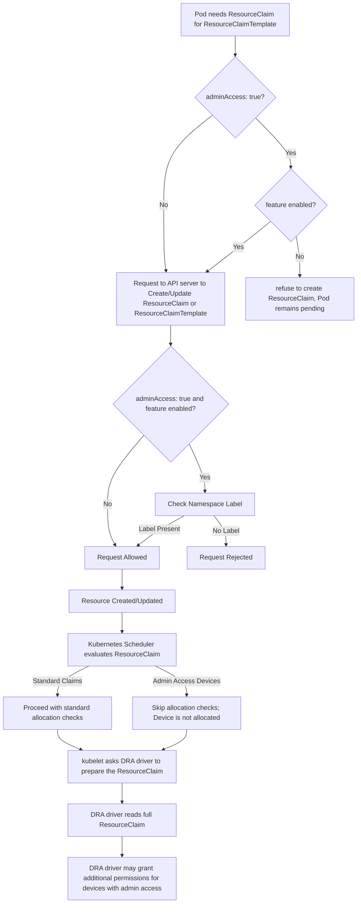

# [KEP-5018](https://github.com/kubernetes/enhancements/issues/5018): DRA: AdminAccess for ResourceClaims and ResourceClaimTemplates

<!-- toc -->
- [Release Signoff Checklist](#release-signoff-checklist)
- [Summary](#summary)
- [Motivation](#motivation)
  - [Goals](#goals)
  - [Non-Goals](#non-goals)
- [Proposal](#proposal)
  - [DRAAdminAccess Overview](#draadminaccess-overview)
  - [Workflow](#workflow)
  - [Risks and Mitigations](#risks-and-mitigations)
- [Design Details](#design-details)
  - [API Changes](#api-changes)
  - [REST Storage Changes](#rest-storage-changes)
  - [Kube-controller-manager Changes](#kube-controller-manager-changes)
  - [Kube-scheduler Changes](#kube-scheduler-changes)
  - [ResourceQuota](#resourcequota)
  - [Test Plan](#test-plan)
      - [Prerequisite testing updates](#prerequisite-testing-updates)
      - [Unit tests](#unit-tests)
      - [Integration tests](#integration-tests)
      - [e2e tests](#e2e-tests)
  - [Graduation Criteria](#graduation-criteria)
    - [Alpha](#alpha)
    - [Beta](#beta)
    - [GA](#ga)
  - [Upgrade / Downgrade Strategy](#upgrade--downgrade-strategy)
  - [Version Skew Strategy](#version-skew-strategy)
- [Production Readiness Review Questionnaire](#production-readiness-review-questionnaire)
  - [Feature Enablement and Rollback](#feature-enablement-and-rollback)
  - [Rollout, Upgrade and Rollback Planning](#rollout-upgrade-and-rollback-planning)
  - [Monitoring Requirements](#monitoring-requirements)
  - [Dependencies](#dependencies)
  - [Scalability](#scalability)
  - [Troubleshooting](#troubleshooting)
- [Implementation History](#implementation-history)
- [Drawbacks](#drawbacks)
- [Alternatives](#alternatives)
<!-- /toc -->

## Release Signoff Checklist

Items marked with (R) are required _prior to targeting to a milestone /
release_.

- [x] (R) Enhancement issue in release milestone, which links to KEP dir in
      [kubernetes/enhancements] (not the initial KEP PR)
- [x] (R) KEP approvers have approved the KEP status as `implementable`
- [x] (R) Design details are appropriately documented
- [x] (R) Test plan is in place, giving consideration to SIG Architecture and
      SIG Testing input (including test refactors)
  - [x] e2e Tests for all Beta API Operations (endpoints)
  - [x] (R) Ensure GA e2e tests meet requirements for
        [Conformance Tests](https://github.com/kubernetes/community/blob/master/contributors/devel/sig-architecture/conformance-tests.md)
  - [x] (R) Minimum Two Week Window for GA e2e tests to prove flake free
- [x] (R) Graduation criteria is in place
  - [x] (R)
        [all GA Endpoints](https://github.com/kubernetes/community/pull/1806)
        must be hit by
        [Conformance Tests](https://github.com/kubernetes/community/blob/master/contributors/devel/sig-architecture/conformance-tests.md)
- [x] (R) Production readiness review completed
- [x] (R) Production readiness review approved
- [x] "Implementation History" section is up-to-date for milestone
- [x] User-facing documentation has been created in [kubernetes/website], for
      publication to [kubernetes.io]
- [x] Supporting documentation—e.g., additional design documents, links to
      mailing list discussions/SIG meetings, relevant PRs/issues, release notes

<!--
**Note:** This checklist is iterative and should be reviewed and updated every time this enhancement is being considered for a milestone.
-->

[kubernetes.io]: https://kubernetes.io/
[kubernetes/enhancements]: https://git.k8s.io/enhancements
[kubernetes/kubernetes]: https://git.k8s.io/kubernetes
[kubernetes/website]: https://git.k8s.io/website

## Summary

As the Dynamic Resource Allocation (DRA) feature evolves, cluster administrators
require a privileged mode, referred to as DRAAdminAccess, to securely access
devices already in use by other users. This mode enables administrators to
perform tasks such as monitoring the health and status of all devices while
ensuring that regular users can only run containers on devices explicitly
claimed by their workloads.

This KEP proposes a mechanism for cluster administrators to mark a request in a
ResourceClaim or ResourceClaimTemplate with an admin access flag. This flag
allows privileged access to devices, enabling administrative tasks without
compromising security. Access to this mode is restricted to users authorized to
create ResourceClaim or ResourceClaimTemplate objects in namespaces marked with
the DRA admin label, ensuring that non-administrative users cannot misuse this
feature.

Note: Administrator workloads should not interfere with the application
workloads. If that cannot be supported due to hardware restrictions or that the
administrator workload is too demanding, then administrators should request
exclusive access for specific admin task such that no other claims are
allocated.

## Motivation

The current Dynamic Resource Allocation (DRA) feature enables users to request
resources but lacks a mechanism for cluster administrators to gain privileged
access to devices already in use by other users. This limitation restricts
administrators from performing tasks like:

- Monitoring device health or status.

- Performing diagnostics and troubleshooting on devices shared across users.

Enabling such administrative tasks without compromising security is critical to
cluster operations. Non-admin users gaining access to devices in use by others
could result in:

- Unauthorized access to confidential information about device usage.

- Potential conflicts or misuse of shared hardware.

As the adoption of DRA expands, the inability of administrators to perform
privileged device introspection becomes a bottleneck for cluster operations,
particularly in shared environments where devices are critical resources.

### Goals

- Provide a privileged mode for cluster administrators to access devices already
  in use.

- Ensure that only authorized users can use the privileged mode.

- Maintain security and prevent unauthorized access to devices.

### Non-Goals

- Redesign DRA.

- Extend privileged mode access to non-admin users.

- Define how administrators use the data accessed through privileged mode.

- Define which specific additional permissions are enabled by DRA drivers when
  this privileged mode is used.

## Proposal

### DRAAdminAccess Overview

This proposal enhances the `DRAAdminAccess` feature to enable cluster
administrators to mark requests in `ResourceClaim` and `ResourceClaimTemplate`
objects as privileged. This feature includes:

1. Admin Access Flag:

   A field in `ResourceClaim` and `ResourceClaimTemplate` specifications to
   indicate the request is in admin mode.

   Example:

   ```yaml
   apiVersion: resource.k8s.io/v1beta1
   kind: ResourceClaim
   metadata:
     name: admin-resource-claim
     namespace: admin-namespace
   spec:
     devices:
       requests:
         - deviceClassName: admin-resource-class
           adminAccess: true
   ```

1. Namespace Label for DRA Admin Mode:

   Namespaces must be labeled to allow the creation of admin-access claims.

   Example label:

   ```yaml
   metadata:
     labels:
       resource.kubernetes.io/admin-access: "true"
   ```

   Note: This label has been updated from `resource.k8s.io/admin-access` while the feature was in alpha.

   Assumptions:

   - It is not important to subdivide admin access to different types of
     devices.
   - Ability to label (or relabel) namespaces is not granted to low-privileged
     namespace-constrained users (this is the same assumption that
     PodSecurityAdmission makes).

1. Authorization Check:

   In the REST storage layer, validate requests to create and update
   `ResourceClaim` or `ResourceClaimTemplate` objects with `adminAccess: true`.
   Only authorize if namespace has the `resource.kubernetes.io/admin-access: "true"` label.

1. Grants privileged access to the requested device:

   For requests with `adminAccess: true`, the scheduler bypasses standard
   allocation checks and allows administrators to access devices already in use.
   This ensures privileged tasks like monitoring or diagnostics can be performed
   without disrupting existing allocations.

1. No impact on availability of claims:

   The scheduler ignores claims with `adminAccess: true`, normal usage is not
   impacted as claims in other namespaces can still be allocated using the same
   devices that are also accessed by workloads in the admin namespace.

### Workflow

1. A cluster administrator labels an admin namespace with
   `resource.kubernetes.io/admin-access: "true"`.

1. Users who are authorized to create `ResourceClaim` or `ResourceClaimTemplate`
   objects in this admin namespace can set `adminAccess: true` field if they
   want to.

1. Only users with access to the admin namespace can reference these
   `ResourceClaims` or `ResourceClaimTemplates` in their pod or deployment
   specs.

1. The DRA controller processes the request and grants privileged access to the
   requested device.

### Risks and Mitigations

This feature makes the assumption that an admin will only perform read-only
monitoring and troubleshooting operations. However, it is possible that an admin
also performs write access to the device. This risk can be mitigated by the DRA
driver to ensure AdminAccess ResourceClaims can only execute read-only
operations on the device. We can add a warning in the driver documentation.
However, what additional permissions are granted or needed for admin operations
is up to the DRA driver implementation.

## Design Details

### API Changes

The `adminAccess` field in `DeviceRequest` was added to `ResourceClaim` and
`ResourceClaimTemplate` in Kubernetes v1.31:

```go
// DeviceRequest is a request for devices required for a claim.
// This is typically a request for a single resource like a device, but can
// also ask for several identical devices.
//
// A DeviceClassName is currently required. Clients must check that it is
// indeed set. It's absence indicates that something changed in a way that
// is not supported by the client yet, in which case it must refuse to
// handle the request.
type DeviceRequest struct {
	...

    // AdminAccess indicates that this is a claim for administrative access
    // to the device(s). Claims with AdminAccess are expected to be used for
    // monitoring or other management services for a device.  They ignore
    // all ordinary claims to the device with respect to access modes and
    // any resource allocations.
    //
    // This is an alpha field and requires enabling the DRAAdminAccess
    // feature gate. Admin access is disabled if this field is unset or
    // set to false, otherwise it is enabled.
    //
    // +optional
    // +featureGate=DRAAdminAccess
    AdminAccess *bool
}
```

Admin access to devices is a privileged operation because it grants users access
to devices that are in use by other users. Drivers might also remove other
restrictions when preparing the device.

In Kubernetes 1.31 (before this KEP was introduced), an example validating
admission policy
[was provided](https://github.com/kubernetes/kubernetes/blob/4aeaf1e99e82da8334c0d6dddd848a194cd44b4f/test/e2e/dra/test-driver/deploy/example/admin-access-policy.yaml#L1-L11)
which restricted access to this option. It was formerly the responsibility of
cluster admins to ensure that such a policy was installed if the cluster
shouldn't have allowed unrestricted access.

Starting in Kubernetes 1.33 (when this KEP was introduced), a validation has
been added to the REST storage layer to only authorize `ResourceClaim` or
`ResourceClaimTemplate` with `adminAccess: true` requests if their namespace has
the `resource.kubernetes.io/admin-access: "true"` label to only allow it for users with
additional privileges.

The below flowchart starts with `ResourceClaim` creation from
`ResourceClaimTemplate` in kube-controller-manager and ends with the node
operations.



The `DRAAdminAccess` feature gate controls whether users can set the
`adminAccess` field to true when requesting devices. That is checked in the
apiserver. In addition, the scheduler will not allocate claims with admin access
when the feature is turned off. This covers the scenario that the field might
have been set in Kubernetes v1.31 where the field was available uncondiionally
or while the feature was enabled.

### REST Storage Changes

In both pkg/registry/resource/resourceclaim/strategy.go and
pkg/registry/resource/resourceclaimtemplate/strategy.go, update `Validate` and
`ValidateUpdate` to call a new `authorizedForAdmin` function to check if the
request is authorized to set the `adminAccess` field to devices based on the DRA
admin namespace label.

### Kube-controller-manager Changes

In pkg/controller/resourceclaim/controller.go, process requests in `handleClaim`
function to prevent creation of `ResourceClaim` when the `ResourceClaimTemplate`
has the `adminAccess` field while the feature gate is turned off. This behavior
was added in 1.32.

### Kube-scheduler Changes

In pkg/scheduler/framework/plugins/dynamicresources/allocateddevices.go, handle
claims with `adminAccess` to ensure devices allocated with `adminAccess` are
skipped without invoking the callback bypassing standard allocation checks and
these devices are not considered as allocated. This behavior was added in 1.32
in `foreachAllocatedDevice`.

### ResourceQuota

Requests asking for `adminAccess` contribute to the quota. We recommend that
these administrator namespaces should not have quotas configured.

### Test Plan

<!--
[testing-guidelines]: https://git.k8s.io/community/contributors/devel/sig-testing/testing.md
-->

[x] I/we understand the owners of the involved components may require updates to
existing tests to make this code solid enough prior to committing the changes
necessary to implement this enhancement.

##### Prerequisite testing updates

##### Unit tests

<!--
Additionally, for Alpha try to enumerate the core package you will be touching
to implement this enhancement and provide the current unit coverage for those
in the form of:
- <package>: <date> - <current test coverage>
The data can be easily read from:
https://testgrid.k8s.io/sig-testing-canaries#ci-kubernetes-coverage-unit

This can inform certain test coverage improvements that we want to do before
extending the production code to implement this enhancement.
- `<package>`: `<date>` - `<test coverage>`
-->
<!--
Generated with:

 go test -cover ./pkg/registry/resource/resourceclaim ./pkg/registry/resource/resourceclaimtemplate ./pkg/scheduler/framework/plugins/dynamicresources/... ./pkg/controller/resourceclaim | sed -e 's/.*\(k8s.io[a-z/-]*\).*coverage: \(.*\) of statements/- `\1`: \2/' | sort

-->

During v1.33 development cycle, 2025-02-08 as of git commit 69ab91a:

- `k8s.io/kubernetes/pkg/controller/resourceclaim`: 73.5%
- `k8s.io/kubernetes/pkg/registry/resource/resourceclaim`: 84.7%
- `k8s.io/kubernetes/pkg/registry/resource/resourceclaimtemplate`: 68.8%
- `k8s.io/kubernetes/pkg/scheduler/framework/plugins/dynamicresources`: 77.3%

##### Integration tests

<!--
This question should be filled when targeting a release.
For Alpha, describe what tests will be added to ensure proper quality of the enhancement.

For Beta and GA, add links to added tests together with links to k8s-triage for those tests:
https://storage.googleapis.com/k8s-triage/index.html
-->

The scheduler plugin and resource claim controller are covered by the workloads
in
https://github.com/kubernetes/kubernetes/blob/master/test/integration/scheduler_perf/dra/performance-config.yaml

Additional test cases have been added to `test/integration/scheduler_perf` to
ensure `ResourceClaim` or `ResourceClaimTemplate` with `adminAccess: true`
requests are only authorized if their namespace has the
`resource.kubernetes.io/admin-access: "true"` label as described in this KEP.

These tests run as part of the following with the `DRAAdminAccess` feature gate enabled.

- `k8s.io/kubernetes/test/integration/scheduler_perf.scheduler_perf`: [pre-submit](https://testgrid.k8s.io/presubmits-kubernetes-blocking#pull-kubernetes-integration&include-filter-by-regex=scheduler_perf.scheduler_perf), [periodic](https://testgrid.k8s.io/sig-release-master-blocking#integration-master&include-filter-by-regex=scheduler_perf.scheduler_perf), [triage search](https://storage.googleapis.com/k8s-triage/index.html?test=scheduler_perf)
- `k8s.io/kubernetes/test/integration/scheduler_perf.dra.dra`: [pre-submit](https://testgrid.k8s.io/presubmits-kubernetes-blocking#pull-kubernetes-integration&include-filter-by-regex=scheduler_perf.dra.dra),[periodic](https://testgrid.k8s.io/sig-release-master-blocking#integration-master&include-filter-by-regex=scheduler_perf.dra.dra), [triage search](https://storage.googleapis.com/k8s-triage/index.html?test=scheduler_perf)

##### e2e tests

<!--
This question should be filled when targeting a release.
For Alpha, describe what tests will be added to ensure proper quality of the enhancement.

For Beta and GA, add links to added tests together with links to k8s-triage for those tests:
https://storage.googleapis.com/k8s-triage/index.html

We expect no non-infra related flakes in the last month as a GA graduation criteria.
-->

End-to-end testing depends on a working resource driver and a container runtime
with CDI support. A
[test driver](https://github.com/kubernetes/kubernetes/tree/master/test/e2e/dra/test-driver)
was developed as part of the overall DRA development effort. We have extended
this test driver to enable `DRAAdminAccess` feature gate and added tests to
ensure `ResourceClaim` or `ResourceClaimTemplate` with `adminAccess: true`
requests are only authorized if their namespace has the
`resource.kubernetes.io/admin-access: "true"` label as described in this KEP.

Test links:

- [E2E](https://github.com/kubernetes/kubernetes/tree/master/test/e2e/dra):
  https://testgrid.k8s.io/sig-node-dynamic-resource-allocation#ci-kind-dra

Kubernetes e2e suite.[It] [sig-node] DRA [Feature:DynamicResourceAllocation]
[FeatureGate:DynamicResourceAllocation] [Beta] cluster validate
ResourceClaimTemplate and ResourceClaim for admin access
[Feature:DRAAdminAccess] [FeatureGate:DRAAdminAccess] [Alpha]
[FeatureGate:DynamicResourceAllocation] [Beta]

- `cluster validate ResourceClaimTemplate and ResourceClaim for admin access`, [SIG Node](https://testgrid.k8s.io/sig-node-dynamic-resource-allocation#pull-kubernetes-kind-dra-all), [triage search](https://storage.googleapis.com/k8s-triage/index.html?pr=1&test=admin%20access)
- `cluster DaemonSet with admin access`, [SIG Node](https://testgrid.k8s.io/sig-node-dynamic-resource-allocation#pull-kubernetes-kind-dra-all), [triage search](https://storage.googleapis.com/k8s-triage/index.html?pr=1&test=admin%20access)

### Graduation Criteria

#### Alpha

- Feature implemented behind a feature flag
- Initial e2e tests completed and enabled

#### Beta

- Gather feedback from developers and surveys via implementations in the kubernetes-sigs/dra-example-driver: https://github.com/kubernetes-sigs/dra-example-driver/issues/97 and potentially other drivers
- Complete feature AdminAccess
- Additional tests are in Testgrid and linked in KEP
- More rigorous forms of testing—e.g., downgrade tests and scalability tests
- All functionality completed
- All security enforcement completed
- All monitoring requirements completed
- All testing requirements completed
- All known pre-release issues and gaps resolved 
**Note:** Beta criteria must include all functional, security, monitoring, and testing requirements along with resolving all issues and gaps identified


#### GA
- 1 example of real-world usage
1. Kubernetes DRA example driver with DRAAdminAccess support in https://github.com/kubernetes-sigs/dra-example-driver/pull/112
2. NVIDIA DRA driver with DRA admin access integration: https://github.com/NVIDIA/k8s-dra-driver-gpu/pull/817
- Allowing time for feedback
- All issues and gaps identified as feedback during beta are resolved
**Note:** GA criteria must not include any functional, security, monitoring, or testing requirements.  Those must be beta requirements.

### Upgrade / Downgrade Strategy

The usual Kubernetes upgrade and downgrade strategy applies for in-tree
components.

### Version Skew Strategy

This feature affects the kube-apiserver, kube-controller-manager, and
kube-scheduler. The kube-apiserver must validate requests containing
`adminAccess: true` regardless of the version of other components. The
kube-controller-manager and kube-scheduler should ignore `adminAccess: true` if
they are at an older version that does not support it and process the field only
if the feature gate is detected.

## Production Readiness Review Questionnaire

### Feature Enablement and Rollback

###### How can this feature be enabled / disabled in a live cluster?

- [x] Feature gate (also fill in values in `kep.yaml`)
  - Feature gate name: DRAAdminAccess
  - Components depending on the feature gate:
    - kube-apiserver
    - kube-controller-manager
    - kube-scheduler

###### Does enabling the feature change any default behavior?

No

###### Can the feature be disabled once it has been enabled (i.e. can we roll back the enablement)?

Workloads which were deployed with admin access will continue to run with it.
They need to be deleted to remove usage of the feature. If they were not
running, then the feature gate checks in kube-scheduler will prevent scheduling
and in kube-controller-manager will prevent creating the ResourceClaim from a
ResourceClaimTemplate. In both cases, usage of the feature is prevented.

###### What happens if we reenable the feature if it was previously rolled back?

Workloads which were deployed with admin access enabled are not affected by a
rollback. If the pods were already running, they keep running. If the pods were
kept as unschedulable because the scheduler refused to allocate claims, then
they might now get scheduled.

###### Are there any tests for feature enablement/disablement?

Tests for apiserver are covering disabling the feature. A test that the
DaemonSet controller tolerates keeping pods as pending is added.

### Rollout, Upgrade and Rollback Planning

<!--
This section must be completed when targeting beta to a release.
-->

###### How can a rollout or rollback fail? Can it impact already running workloads?

<!--
Try to be as paranoid as possible - e.g., what if some components will restart
mid-rollout?

Be sure to consider highly-available clusters, where, for example,
feature flags will be enabled on some API servers and not others during the
rollout. Similarly, consider large clusters and how enablement/disablement
will rollout across nodes.
-->

- kube-controller-manager: If the kube-controller-manager fails to create `ResourceClaim` objects from `ResourceClaimTemplate` due to misconfigurations or permission issues relating to `adminAccess`, then the associated Pods will remain in a pending state and won't be scheduled.
- kube-scheduler: Bugs in the scheduler might lead to Pods not being scheduled even when resources are available or, scheduling Pods that shouldn't be scheduled due to unmet `adminAccess` requirements, all this should be part of the generic scheduler backoff behavior. It will not affect running workloads.
- Workloads Without `ResourceClaims` will remain unaffected as the adminAccess feature doesn't interact with them. The new code paths introduced for adminAccess only engage when `ResourceClaims` are present in the Pod specification.
- New Pods requiring `ResourceClaims` with `adminAccess` might remain unscheduled if the control plane components fail to process the claims correctly.
- Existing Pods continue to run unaffected since `ResourceClaim` and `ResourceClaimTemplate`'s spec is immutable, including the adminAccess field, cannot be altered.


###### What specific metrics should inform a rollback?

<!--
What signals should users be paying attention to when the feature is young
that might indicate a serious problem?
-->

If this feature is not working as intended, it could result in an increase in
the `scheduler_pending_pods` metric in the kube-scheduler or an increase in the
`kubelet_started_containers_errors_total` metric.

Further analysis by reviewing logs and pod events is needed to determine whether
errors are related to this feature.

###### Were upgrade and rollback tested? Was the upgrade->downgrade->upgrade path tested?

<!--
Describe manual testing that was done and the outcomes.
Longer term, we may want to require automated upgrade/rollback tests, but we
are missing a bunch of machinery and tooling and can't do that now.
-->

Manual testing has been done to bring up a kind cluster and changing the feature gate for individual components.

Manual upgrade of the control plane to a version with the feature enabled has been tested. Existing pods not using the feature remained running. Creation of new pods and ResourceClaims that do not use the feature are unaffected.

Manual feature toggle of the control plane to disable the feature was tested. Existing pods using the feature remained running. Creation of new pods and ResourceClaims that use the feature have their adminAccess field dropped and scheduling fails if devices are in use by other pods.

###### Is the rollout accompanied by any deprecations and/or removals of features, APIs, fields of API types, flags, etc.?

<!--
Even if applying deprecation policies, they may still surprise some users.
-->

No.

### Monitoring Requirements

<!--
This section must be completed when targeting beta to a release.

For GA, this section is required: approvers should be able to confirm the
previous answers based on experience in the field.
-->

Metrics in kube-controller-manager about total (resourceclaim_controller_resource_claims_adminaccess) and allocated ResourceClaims with adminAccess (resourceclaim_controller_allocated_resource_claims_adminaccess).

###### How can an operator determine if the feature is in use by workloads?

<!--
Ideally, this should be a metric. Operations against the Kubernetes API (e.g.,
checking if there are objects with field X set) may be a last resort. Avoid
logs or events for this purpose.
-->

".status.allocation.devices.results[*].adminAccess" will be set to true for a claim using adminAccess when needed by a pod.

Metrics in kube-controller-manager about total (resourceclaim_controller_resource_claims_adminaccess) and allocated ResourceClaims with adminAccess (resourceclaim_controller_allocated_resource_claims_adminaccess).

###### How can someone using this feature know that it is working for their instance?

<!--
For instance, if this is a pod-related feature, it should be possible to determine if the feature is functioning properly
for each individual pod.
Pick one more of these and delete the rest.
Please describe all items visible to end users below with sufficient detail so that they can verify correct enablement
and operation of this feature.
Recall that end users cannot usually observe component logs or access metrics.

- [ ] Events
  - Event Reason:
- [ ] API .status
  - Condition name:
  - Other field:
- [ ] Other (treat as last resort)
  - Details:
-->

- [x] API .status
  - Other field: `.status.allocation` will be set for a ResoureClaim using the
    DRA feature when needed by a pod and
    `.status.allocation.devices.results[].adminAccess` will be set by the
    scheduler when it allocates a ResoureClaim.

###### What are the reasonable SLOs (Service Level Objectives) for the enhancement?

<!--
This is your opportunity to define what "normal" quality of service looks like
for a feature.

It's impossible to provide comprehensive guidance, but at the very
high level (needs more precise definitions) those may be things like:
  - per-day percentage of API calls finishing with 5XX errors <= 1%
  - 99% percentile over day of absolute value from (job creation time minus expected
    job creation time) for cron job <= 10%
  - 99.9% of /health requests per day finish with 200 code

These goals will help you determine what you need to measure (SLIs) in the next
question.
-->

SLO: 100% of unauthorized access attempts are denied.

###### What are the SLIs (Service Level Indicators) an operator can use to determine the health of the service?

<!--
Pick one more of these and delete the rest.

- [ ] Metrics
  - Metric name:
  - [Optional] Aggregation method:
  - Components exposing the metric:
- [ ] Other (treat as last resort)
  - Details:
-->

This feature is part of the DRA feature and therefore can use the same SLIs to
determine health of the service.

For kube-controller-manager:

- [x] Metrics
  - Metric name: `resourceclaim_controller_create_total`
  - Metric name: `resourceclaim_controller_create_failures_total`
  - Metric name: `resourceclaim_controller_resource_claims`
  - Metric name: `resourceclaim_controller_allocated_resource_claims`
  - Metric name: `workqueue` with `name="resource_claim"`

For kube-scheduler and kubelet, existing metrics for handling Pods such as the
["unschedulable_pods"](https://github.com/kubernetes/kubernetes/blob/6f5fa2eb2f4dc731243b00f7e781e95589b5621f/pkg/scheduler/metrics/metrics.go#L200-L206)
metric in scheduler will identify pods that are currently unschedulable because
of the `DynamicResources` plugin or a misconfiguration of the `AdminAccess`
field.

Audit Policy can be created to ensure all create operations on ResourceClaim, ResourceClaimTemplate, and Namespace resources are logged at the metadata level to review successful and denied attempts to set the `AdminAccess`
field.

###### Are there any missing metrics that would be useful to have to improve observability of this feature?

<!--
Describe the metrics themselves and the reasons why they weren't added (e.g., cost,
implementation difficulties, etc.).
-->

No

### Dependencies

<!--
This section must be completed when targeting beta to a release.
-->

###### Does this feature depend on any specific services running in the cluster?

<!--
Think about both cluster-level services (e.g. metrics-server) as well
as node-level agents (e.g. specific version of CRI). Focus on external or
optional services that are needed. For example, if this feature depends on
a cloud provider API, or upon an external software-defined storage or network
control plane.

For each of these, fill in the following—thinking about running existing user workloads
and creating new ones, as well as about cluster-level services (e.g. DNS):
  - [Dependency name]
    - Usage description:
      - Impact of its outage on the feature:
      - Impact of its degraded performance or high-error rates on the feature:
-->

- The DynamicResourceAllocation feature gate must be enabled to create ResourceClaim, ResourceClaimTemplate. More details at [KEP-4381 - DRA Structured Parameters](https://github.com/kubernetes/enhancements/issues/4381)
- A third-party DRA driver is required for how the driver should interpret the AdminAccess field to get acess to device specific resources without allocating them.

### Scalability

###### Will enabling / using this feature result in any new API calls?

No.

###### Will enabling / using this feature result in introducing new API types?

No.

###### Will enabling / using this feature result in any new calls to the cloud provider?

No.

###### Will enabling / using this feature result in increasing size or count of the existing API objects?

Yes. Setting the field will make the ResourceClaim and ResourceClaimTemplate
resources larger.

###### Will enabling / using this feature result in increasing time taken by any operations covered by existing SLIs/SLOs?

No. This feature is part of the DRA feature and therefore it uses the same
existing SLIs as DRA which were derrived from metrics similar to the generic
ephemeral volume controller
[were added](https://github.com/kubernetes/kubernetes/blob/163553bbe0a6746e7719380e187085cf5441dfde/pkg/controller/resourceclaim/metrics/metrics.go#L32-L47)
to determine health of the service.

###### Will enabling / using this feature result in non-negligible increase of resource usage (CPU, RAM, disk, IO, ...) in any components?

No.

###### Can enabling / using this feature result in resource exhaustion of some node resources (PIDs, sockets, inodes, etc.)?

No.

### Troubleshooting

<!--
This section must be completed when targeting beta to a release.

For GA, this section is required: approvers should be able to confirm the
previous answers based on experience in the field.

The Troubleshooting section currently serves the `Playbook` role. We may consider
splitting it into a dedicated `Playbook` document (potentially with some monitoring
details). For now, we leave it here.
-->

###### How does this feature react if the API server and/or etcd is unavailable?

The Kubernetes control plane will be down, so no new ResourceClaim or ResourceClaimTemplate will be created.

###### What are other known failure modes?

<!--
For each of them, fill in the following information by copying the below template:
  - [Failure mode brief description]
    - Detection: How can it be detected via metrics? Stated another way:
      how can an operator troubleshoot without logging into a master or worker node?
    - Mitigations: What can be done to stop the bleeding, especially for already
      running user workloads?
    - Diagnostics: What are the useful log messages and their required logging
      levels that could help debug the issue?
      Not required until feature graduated to beta.
    - Testing: Are there any tests for failure mode? If not, describe why.
-->

- kube-scheduler cannot allocate ResourceClaims with AdminAccess.

  - Detection: When pods fail to get scheduled, kube-scheduler reports that
    through events and pod status. For DRA, messages include "cannot allocate
    all claims" (insufficient resources) and "ResourceClaim not created yet"
    (user or kube-controller-manager haven't created the ResourceClaim yet).
    The
    ["unschedulable_pods"](https://github.com/kubernetes/kubernetes/blob/9fca4ec44afad4775c877971036b436eef1a1759/pkg/scheduler/metrics/metrics.go#L200-L206)
    metric will have pods counted under the "dynamicresources" plugin label.

    To troubleshoot, "kubectl describe" can be used on (in this order) Pod
    and ResourceClaim.

  - Mitigations: When ResourceClaims or ResourceClaimTemplates with the `AdminAccess`
field don't get created, debugging should focus on the namespace labels. The kube-controller-manager logs should have more information.

  - Diagnostics: Audit Policy can be created to ensure all create operations on ResourceClaim, ResourceClaimTemplate, and Namespace resources are logged at the metadata level to review successful and denied attempts to set the `AdminAccess`
field.

  - Testing: E2E testing covers scenarios that successfully created ResourceClaims and ResourceClaimTemplates with the `AdminAccess` field in admin namespace and denied attempts in non-admin namespace.

###### What steps should be taken if SLOs are not being met to determine the problem?

If SLOs are not being met, not all 100% of unauthorized access attempts are denied. Debugging to determine the problem should review the namespace labels to verify correctness.

## Implementation History

- Kubernetes 1.33: Alpha version of the KEP.
- Kubernetes 1.34: Beta version of the KEP.

## Drawbacks

None.

## Alternatives

The following options were also considered:

- Validating Admission Policy (VAP): An example was added in 1.31. However this
  approach cannot be used to control access for an in-tree type because
  Kubernetes has no mechanism to apply a system VAP to all new clusters
  automatically and therefore it is not sufficient for conformance.
- Builtin admission controller: This approach allows removal of a check, which
  is not what we want. The REST storage approach leaves the control in the hands
  of the cluster admin via permissions and allows the cluster admin to delegate
  the control so that anyone can apply labels to namespaces, but they can't
  prevent the check from running.
- RBAC++: This is not available yet, especially for the DRA timeframe.
- Read-mode: Read-mode is too restrictive. AdminAccess is more like root access
  in that it may grant additional permissions and there needs to be checks to
  prevent normal users from bypassing.
