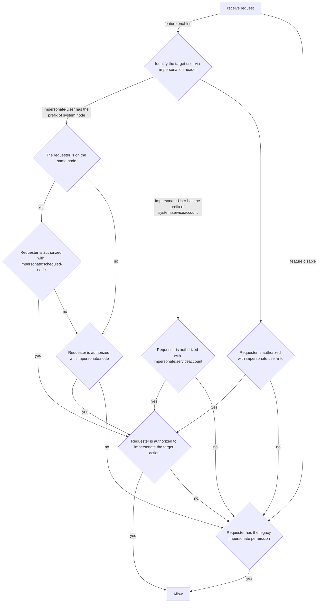

<!--
**Note:** When your KEP is complete, all of these comment blocks should be removed.

To get started with this template:

- [x] **Pick a hosting SIG.**
  Make sure that the problem space is something the SIG is interested in taking
  up. KEPs should not be checked in without a sponsoring SIG.
- [ ] **Create an issue in kubernetes/enhancements**
  When filing an enhancement tracking issue, please make sure to complete all
  fields in that template. One of the fields asks for a link to the KEP. You
  can leave that blank until this KEP is filed, and then go back to the
  enhancement and add the link.
- [x] **Make a copy of this template directory.**
  Copy this template into the owning SIG's directory and name it
  `NNNN-short-descriptive-title`, where `NNNN` is the issue number (with no
  leading-zero padding) assigned to your enhancement above.
- [x] **Fill out as much of the kep.yaml file as you can.**
  At minimum, you should fill in the "Title", "Authors", "Owning-sig",
  "Status", and date-related fields.
- [x] **Fill out this file as best you can.**
  At minimum, you should fill in the "Summary" and "Motivation" sections.
  These should be easy if you've preflighted the idea of the KEP with the
  appropriate SIG(s).
- [ ] **Create a PR for this KEP.**
  Assign it to people in the SIG who are sponsoring this process.
- [ ] **Merge early and iterate.**
  Avoid getting hung up on specific details and instead aim to get the goals of
  the KEP clarified and merged quickly. The best way to do this is to just
  start with the high-level sections and fill out details incrementally in
  subsequent PRs.

Just because a KEP is merged does not mean it is complete or approved. Any KEP
marked as `provisional` is a working document and subject to change. You can
denote sections that are under active debate as follows:

```
<<[UNRESOLVED optional short context or usernames ]>>
Stuff that is being argued.
<<[/UNRESOLVED]>>
```

When editing KEPS, aim for tightly-scoped, single-topic PRs to keep discussions
focused. If you disagree with what is already in a document, open a new PR
with suggested changes.

One KEP corresponds to one "feature" or "enhancement" for its whole lifecycle.
You do not need a new KEP to move from beta to GA, for example. If
new details emerge that belong in the KEP, edit the KEP. Once a feature has become
"implemented", major changes should get new KEPs.

The canonical place for the latest set of instructions (and the likely source
of this file) is [here](/keps/NNNN-kep-template/README.md).

**Note:** Any PRs to move a KEP to `implementable`, or significant changes once
it is marked `implementable`, must be approved by each of the KEP approvers.
If none of those approvers are still appropriate, then changes to that list
should be approved by the remaining approvers and/or the owning SIG (or
SIG Architecture for cross-cutting KEPs).
-->
# KEP-5284: Constrained Impersonation
<!--
A table of contents is helpful for quickly jumping to sections of a KEP and for
highlighting any additional information provided beyond the standard KEP
template.

Ensure the TOC is wrapped with
  <code>&lt;!-- toc --&rt;&lt;!-- /toc --&rt;</code>
tags, and then generate with `hack/update-toc.sh`.
-->

<!-- toc -->
- [Release Signoff Checklist](#release-signoff-checklist)
- [Summary](#summary)
- [Motivation](#motivation)
  - [Goals](#goals)
  - [Non-Goals](#non-goals)
- [Proposal](#proposal)
  - [Subject Access Review Details](#subject-access-review-details)
    - [workflow when the feature is enabled](#workflow-when-the-feature-is-enabled)
  - [User Stories (Optional)](#user-stories-optional)
    - [Story 1](#story-1)
    - [Story 2](#story-2)
  - [Risks and Mitigations](#risks-and-mitigations)
    - [The verbs with <code>impersonate-on:</code> prefix has been used by other component.](#the-verbs-with-impersonate-on-prefix-has-been-used-by-other-component)
    - [High request volume leads to high load on authorization chain.](#high-request-volume-leads-to-high-load-on-authorization-chain)
    - [Delegating permission of impersonating wildcard action or wildcard subjects is not supported](#delegating-permission-of-impersonating-wildcard-action-or-wildcard-subjects-is-not-supported)
- [Design Details](#design-details)
  - [Verb <code>impersonate:user-info</code>](#verb-impersonateuser-info)
    - [Header <code>Impersonate-User</code> is set](#header-impersonate-user-is-set)
    - [Header <code>Impersonate-Group</code> is set](#header-impersonate-group-is-set)
    - [Header <code>Impersonate-Uid</code> is set](#header-impersonate-uid-is-set)
    - [Header with prefix <code>Impersonate-Extra-</code> is set](#header-with-prefix-impersonate-extra--is-set)
  - [Verb <code>impersonate:serviceaccount</code>](#verb-impersonateserviceaccount)
  - [Verb <code>impersonate:node</code> and <code>impersonate:scheduled-node</code>](#verb-impersonatenode-and-impersonatescheduled-node)
  - [Auditing](#auditing)
  - [Test Plan](#test-plan)
      - [Prerequisite testing updates](#prerequisite-testing-updates)
      - [Unit tests](#unit-tests)
      - [Integration tests](#integration-tests)
      - [e2e tests](#e2e-tests)
  - [Graduation Criteria](#graduation-criteria)
    - [Alpha](#alpha)
    - [Beta](#beta)
    - [GA](#ga)
  - [Upgrade / Downgrade Strategy](#upgrade--downgrade-strategy)
  - [Version Skew Strategy](#version-skew-strategy)
    - [New kube-apiserver, old <code>impersonate</code> permission](#new-kube-apiserver-old-impersonate-permission)
    - [Old kube-apiserver, new <code>impersonate-on:</code> and <code>impersonate:</code> permission](#old-kube-apiserver-new-impersonate-on-and-impersonate-permission)
- [Production Readiness Review Questionnaire](#production-readiness-review-questionnaire)
  - [Feature Enablement and Rollback](#feature-enablement-and-rollback)
  - [Rollout, Upgrade and Rollback Planning](#rollout-upgrade-and-rollback-planning)
  - [Monitoring Requirements](#monitoring-requirements)
  - [Dependencies](#dependencies)
  - [Scalability](#scalability)
  - [Troubleshooting](#troubleshooting)
- [Implementation History](#implementation-history)
- [Drawbacks](#drawbacks)
- [Alternatives](#alternatives)
  - [Use <code>impersonate:user-info</code> instead of <code>impersonate:serviceaccount</code> and <code>impersonate:node</code>](#use-impersonateuser-info-instead-of-impersonateserviceaccount-and-impersonatenode)
  - [Subject Access Review](#subject-access-review)
  - [Setting a special APIGroup suffix instead of special verb](#setting-a-special-apigroup-suffix-instead-of-special-verb)
  - [Check permission intersection of impersonator and target user](#check-permission-intersection-of-impersonator-and-target-user)
  - [Expand RBAC/SAR](#expand-rbacsar)
- [Infrastructure Needed (Optional)](#infrastructure-needed-optional)
<!-- /toc -->

## Release Signoff Checklist

<!--
**ACTION REQUIRED:** In order to merge code into a release, there must be an
issue in [kubernetes/enhancements] referencing this KEP and targeting a release
milestone **before the [Enhancement Freeze](https://git.k8s.io/sig-release/releases)
of the targeted release**.

For enhancements that make changes to code or processes/procedures in core
Kubernetes—i.e., [kubernetes/kubernetes], we require the following Release
Signoff checklist to be completed.

Check these off as they are completed for the Release Team to track. These
checklist items _must_ be updated for the enhancement to be released.
-->

Items marked with (R) are required *prior to targeting to a milestone / release*.

- [ ] (R) Enhancement issue in release milestone, which links to KEP dir in [kubernetes/enhancements] (not the initial KEP PR)
- [ ] (R) KEP approvers have approved the KEP status as `implementable`
- [ ] (R) Design details are appropriately documented
- [ ] (R) Test plan is in place, giving consideration to SIG Architecture and SIG Testing input (including test refactors)
  - [ ] e2e Tests for all Beta API Operations (endpoints)
  - [ ] (R) Ensure GA e2e tests meet requirements for [Conformance Tests](https://github.com/kubernetes/community/blob/master/contributors/devel/sig-architecture/conformance-tests.md) 
  - [ ] (R) Minimum Two Week Window for GA e2e tests to prove flake free
- [ ] (R) Graduation criteria is in place
  - [ ] (R) [all GA Endpoints](https://github.com/kubernetes/community/pull/1806) must be hit by [Conformance Tests](https://github.com/kubernetes/community/blob/master/contributors/devel/sig-architecture/conformance-tests.md) 
- [ ] (R) Production readiness review completed
- [ ] (R) Production readiness review approved
- [ ] "Implementation History" section is up-to-date for milestone
- [ ] User-facing documentation has been created in [kubernetes/website], for publication to [kubernetes.io]
- [ ] Supporting documentation—e.g., additional design documents, links to mailing list discussions/SIG meetings, relevant PRs/issues, release notes

<!--
**Note:** This checklist is iterative and should be reviewed and updated every time this enhancement is being considered for a milestone.
-->

[kubernetes.io]: https://kubernetes.io/
[kubernetes/enhancements]: https://git.k8s.io/enhancements
[kubernetes/kubernetes]: https://git.k8s.io/kubernetes
[kubernetes/website]: https://git.k8s.io/website

## Summary

This is to add additional access control over the existing impersonation action. An impersonator
who impersonates another user is required to have the additional permissions to impersonate on
certain group resources and verbs.

## Motivation
Today an impersonator can impersonate another user if the impersonator has the permission of
```yaml
- verbs: ["impersonate"]
  resources: ["users"]
  resourceNames: ["someUser"]
```
However, current impersonation mechanism is the "unrestricted impersonation", the impersonator can
get more power through impersonation. And because of this, it is strongly suggested not
to allow the controller to impersonate. More detailed discussion is in this
[issue](https://github.com/kubernetes/kubernetes/issues/27152)

There are use cases that needs a controller to be able to impersonate:
1. A controller impersonates a node the controller is running on. This happens when 
per-node agents (CNI plugins for instance), want to read pods on a given node instead
of unrestricted pod access.
2. A controller runs as a deputy, receives request from the user, and impersonates
the user to start/stop virtual machine or access vm console managed by kubevirt.

This proposal is to introduce additional permissions for impersonation, so that any 
impersonator can impersonate in a more restricted way.

### Goals
* Define required permission rules for the impersonator to impersonate 
  on certain resource/verb.
* Provide clear example on what permission the impersonator and user should have for the
  impersonator to impersonate user's certain verbs on certain resources.
* This is an opt-in feature and existing impersonation flows keep working as-is.
* Client side semantics of impersonation is unchanged, the existing impersonation headers
are re-used and no new headers are added.

### Non-Goals
* Adding impersonator's info to user.Info, so authorization webhooks can know both info
of impersonated user and the requester.

## Proposal

Introduce a set of verbs with prefix of `impersonate-on:`, e.g. `impersonate-on:create` and
`impersonate-on:get`. The impersonator needs to have these verbs with certain resources to
impersonate. 

Introduce verbs `impersonate:user-info`, `impersonate:serviceaccount`， `impersonate:node` and
`impersonate:scheduled-node`:
- `impersonate:user-info` limits the impersonator to impersonate users with 
certain names/groups/userextras. The resources must be `users`/`groups`/`userextras`/`uids`.
and the user must not be a node (username with a prefix of `system:node:`) and the user must
not be a service account (username with a prefix of `system:serviceaccount:`)
The resource names must be usernames, group names or values in the user extras accoringly.
- `impersonate:serviceaccount` that limits the impersonator to impersonate the serviceaccount with
the certain name/namespace. The resources must be `serviceaccounts`.
- `impersonate:node` that limits the impersonator to impersonate the node only. The resource
must be `nodes`, and the resourceName should be the name of the node. The impersonator must have this
verb to impersonate a node.
- `impersonate:scheduled-node` that limits the impersonator to impersonate the node the 
impersonator is running on. The resources must be `nodes`.

For clusters that use RBAC authz mode, two permissions will be required for impersonation. For example:
to express "system:serviceaccount:default:default can impersonate a user named someUser solely to list
and watch pods in the default namespace."
1. The permission to constrained impersonate a certain user. This is a cluster scoped permission.
```yaml
apiVersion: rbac.authorization.k8s.io/v1
kind: ClusterRole
metadata:
  name: constrained-impersonate-only-someUser
rules:
- apiGroups:
  - authentications.k8s.io
  resources:
  - users # allowed resources are users/groups/userextras/uids
  resourceNames:
  - someUser 
  verbs:
  - impersonate:user-info
---
apiVersion: rbac.authorization.k8s.io/v1
kind: ClusterRoleBinding
metadata:
  name: constrained-impersonate-only-someUser
roleRef:
  apiGroup: rbac.authorization.k8s.io
  kind: ClusterRole
  name: impersonate
subjects:
  - kind: ServiceAccount
    name: default
    namespace: default
```
2. The permission to impersonate on certain resource with certain verbs. This can be either
cluster scoped or namespace scoped. 
```yaml
apiVersion: rbac.authorization.k8s.io/v1
kind: Role
metadata:
  name: impersonate-action
  namespace: default
rules:
- apiGroups:
  - ""
  resources:
  - pods
  verbs:
  - impersonate-on:list
  - impersonate-on:watch
---
apiVersion: rbac.authorization.k8s.io/v1
kind: RoleBinding
metadata:
  name: impersonate
  namespace: default
roleRef:
  apiGroup: rbac.authorization.k8s.io
  kind: Role
  name: impersonate-action
subjects:
  - kind: ServiceAccount
    name: default
    namespace: default
```

These permissions define: "The impersonator can impersonate a user with the name of
someUser to list and watch pods in the default namespace."

### Subject Access Review Details
When receiving an impersonation request to list pods cluster-wide from the user `impersonator`
with the header of `Impersonate-User:someUser`, the apiserver:
- Verifies if the impersonator has the permission to impersonate with the scope of the user.
A subjectaccessreview is sent to the authorizer:
```yaml
apiVersion: authorization.k8s.io/v1
kind: SubjectAccessReview
spec:
  resourceAttributes:
    group: authentications.k8s.io
    resource: users
    name: someUser
    verb: impersonate:user-info
  user: impersonator
```
- Verifies if the impersonator has the permission to impersonate the target action with a 
subjectaccessreview request:
```yaml
apiVersion: authorization.k8s.io/v1
kind: SubjectAccessReview
spec:
  resourceAttributes:
    resource: pods
    namespace: default
    verb: impersonate-on:list
  user: impersonator
```
- Allows the impersonation if the above two conditions are met
- If the above check fails, verifies if the impersonator has the legacy `impersonate` permission,
allow the impersonation if the condition met. A subjectaccessreview is sent to the authorizer:
```yaml
apiVersion: authorization.k8s.io/v1
kind: SubjectAccessReview
spec:
  resourceAttributes:
    resource: users
    name: someUser
    verb: impersonate
  user: impersonator
```

The impersonator does not need the permission for the target action.

#### workflow when the feature is enabled



### User Stories (Optional)

#### Story 1

As a controller, I want to impersonate node I am running on to list/get pods on the node. The service account
of the controller should have the permissions as below to perform the action:

```yaml
apiVersion: rbac.authorization.k8s.io/v1
kind: ClusterRole
metadata:
  name: impersonate:node
rules:
- apiGroups:
  - authentication.k8s.io
  resources:
  - nodes
  verbs:
  - impersonate:scheduled-node
---
apiVersion: rbac.authorization.k8s.io/v1
kind: ClusterRoleBinding
metadata:
  name: impersonate:node
roleRef:
  apiGroup: rbac.authorization.k8s.io
  kind: ClusterRole
  name: impersonate:node
subjects:
- kind: ServiceAccount
  name: default
  namespace: default
---
apiVersion: rbac.authorization.k8s.io/v1
kind: ClusterRole
metadata:
  name: impersonate:node:list
rules:
- apiGroups:
  - ""
  resources:
  - pods
  verbs:
  - impersonate-on:list
  - impersonate-on:get
---
apiVersion: rbac.authorization.k8s.io/v1
kind: ClusterRoleBinding
metadata:
  name: impersonate:node:list
roleRef:
  apiGroup: rbac.authorization.k8s.io
  kind: ClusterRole
  name: impersonate:node:list
subjects:
- kind: ServiceAccount
  name: default
  namespace: default
```

#### Story 2

As a controller, I am working as a deputy, receiving any user's request to access virtual machine console
in the `default` namespace.

```yaml
apiVersion: rbac.authorization.k8s.io/v1
kind: ClusterRole
metadata:
  name: impersonate:vm:console
rules:
- apiGroups:
  - authentications.k8s.io
  resources:
  - users
  verbs:
  - impersonate:user-info
---
apiVersion: rbac.authorization.k8s.io/v1
kind: ClusterRoleBinding
metadata:
  name: impersonate:vm:console
roleRef:
  apiGroup: rbac.authorization.k8s.io
  kind: ClusterRole
  name: impersonate:vm:console
subjects:
- kind: ServiceAccount
  name: deputy
  namespace: deputy-ns
---
apiVersion: rbac.authorization.k8s.io/v1
kind: Role
metadata:
  name: impersonate:vm:console
  namespace: default
rules:
  - apiGroups:
    - subresources.kubevirt.io
    resources:
    - virtualmachines/console
    verbs:
    - impersonate-on:get
---
apiVersion: rbac.authorization.k8s.io/v1
kind: RoleBinding
metadata:
  name: impersonate-user
  namespace: default
roleRef:
  apiGroup: rbac.authorization.k8s.io
  kind: Role
  name: impersonate:vm:console
subjects:
- kind: ServiceAccount
  name: deputy
  namespace: deputy-ns
```

### Risks and Mitigations

<!--
What are the risks of this proposal, and how do we mitigate? Think broadly.
For example, consider both security and how this will impact the larger
Kubernetes ecosystem.

How will security be reviewed, and by whom?

How will UX be reviewed, and by whom?

Consider including folks who also work outside the SIG or subproject.
-->
#### The verbs with `impersonate-on:` prefix has been used by other component.

There is possibility that the verbs with prefix of `impersonate-on:` have been
used by other component, and been set in Role/ClusterRole. Since `impersonate`
permission is also required for impersonator, the component will not get more
power when permssion of `impersonate-on:` is given.

#### High request volume leads to high load on authorization chain.

For the scheduled node case, it is possible that a high request volume node
agent could be constantly performing impersonated requests, each of which would
add two extra authorization checks. This could put load on the authorization
chain. Comparing to other alternatives which would also introduce at least
one authorization check for each request call, the proposal is able to
satisfy more use case.

#### Delegating permission of impersonating wildcard action or wildcard subjects is not supported

Permissions must be delegated using specified verbs with the prefix of `impersonate:` and
`impersonate-on:`. Expressing a permission to impersonate ANY subject or ANY action is not
possible, since the authorization model does not have the concept of partial wildcard on verbs.
It should be ok since all these permission for constrained impersonation are strictly additive which
means it should be added when certain impersonation requests are needed.

## Design Details

<!--
This section should contain enough information that the specifics of your
change are understandable. This may include API specs (though not always
required) or even code snippets. If there's any ambiguity about HOW your
proposal will be implemented, this is the place to discuss them.
-->

### Verb `impersonate:user-info`

Same as legacy impersonation, when the request has header of `Impersonate-User`,
`Impersonate-Group`, `Impersonate-Uid` or `Impersonate-Extra-`, apiserver will check
verb `impersonate:user-info` with the related resources.

#### Header `Impersonate-User` is set

A subjectaccessreview
```yaml
apiVersion: authorization.k8s.io/v1
kind: SubjectAccessReview
spec:
  resourceAttributes:
    group: authentications.k8s.io
    resource: users
    name: someUser
    verb: impersonate:user-info
  user: impersonator
```
will be sent to the authorizer

#### Header `Impersonate-Group` is set

A subjectaccessreview
```yaml
apiVersion: authorization.k8s.io/v1
kind: SubjectAccessReview
spec:
  resourceAttributes:
    group: authentications.k8s.io
    resource: groups
    name: someGroup
    verb: impersonate:user-info
  user: impersonator
```
will be sent to the authorizer

#### Header `Impersonate-Uid` is set

A subjectaccessreview
```yaml
apiVersion: authorization.k8s.io/v1
kind: SubjectAccessReview
spec:
  resourceAttributes:
    group: authentications.k8s.io
    resource: uids
    name: someUID
    verb: impersonate:user-info
  user: impersonator
```
will be sent to the authorizer

#### Header with prefix `Impersonate-Extra-` is set

A subjectaccessreview
```yaml
apiVersion: authorization.k8s.io/v1
kind: SubjectAccessReview
spec:
  resourceAttributes:
    group: authentications.k8s.io
    resource: userextras
    subresource: extraKey
    name: extraValue
    verb: impersonate:user-info
  user: impersonator
```
will be sent to the authorizer

### Verb `impersonate:serviceaccount`

Same as legacy impersonation, when the request has the header of `Impersonate-User`, and the value of the header
has a prefix of `system:serviceaccount:`, apiserver will check verb `impersonate:serviceaccount` with the authorizer
using the subjectaccessreview:
```yaml
apiVersion: authorization.k8s.io/v1
kind: SubjectAccessReview
spec:
  resourceAttributes:
    group: authentications.k8s.io
    resource: serviceaccounts
    name: serviceaccount-name
    namespace: serviceaccount-namespace
    verb: impersonate:serviceaccount
  user: impersonator
```

### Verb `impersonate:node` and `impersonate:scheduled-node`

When the request has the header of `Impersonate-User`, and the value has the prefix of `system:nodes`,
this verb is checked instead of `impersonate:user-info`. The subjectaccessreview below will be sent
to the authorizer:
```yaml
apiVersion: authorization.k8s.io/v1
kind: SubjectAccessReview
spec:
  resourceAttributes:
    group: authentications.k8s.io
    resource: nodes
    name: someNode
    verb: impersonate:nodes
  user: impersonator
```

`impersonate:scheduled-node` is a special verb to check when two conditions are met:
1. The impersonator is impersonating a node by setting the header `Impersonate-User` and the value has a prefix
of `system:node:` on the request.
2. The user info of the impersonator has an extra with key `authentication.kubernetes.io/node-name`, and the value
should be the same as the value in the request header of `Impersonate-User` after removing prefix `system:node:`.
It indicates that the impersonator is running on the same node it is impersonating.

The flow for checking these two verbs will be as following:
1. If condition 1 is not met, verb `impersonate:user-info` will be checked instead.
2. If both conditions are met, the verb `impersonate:scheduled-node` will be checked at first:
```yaml
apiVersion: authorization.k8s.io/v1
kind: SubjectAccessReview
spec:
  resourceAttributes:
    group: authentications.k8s.io
    resource: nodes
    verb: impersonate:scheduled-node
  user: impersonator
```
3. If check in step 2 is not passed, or only condition 1 is met, the verb impersonate:node will be checked:
```yaml
apiVersion: authorization.k8s.io/v1
kind: SubjectAccessReview
spec:
  resourceAttributes:
    group: authentications.k8s.io
    resource: nodes
    name: node1
    verb: impersonate:node
  user: impersonator
```

### Auditing

Audit events already contain the `impersonatedUser` field to denote if impersonation was used.
To record the reason why the impersonation is allowed, a field `impersonationConstraint` will
be added in the `impersonatedUser`. The value will be the impersonation related verbs. For example,
`impersonate:scheduled-node` indicates that the impersonation request is
allowed because it impersonates a scheduled node. The specific action such as `list` or `get`
will not be included in the value given it can be inferred from the request itself.

### Test Plan

<!--
**Note:** *Not required until targeted at a release.*
The goal is to ensure that we don't accept enhancements with inadequate testing.

All code is expected to have adequate tests (eventually with coverage
expectations). Please adhere to the [Kubernetes testing guidelines][testing-guidelines]
when drafting this test plan.

[testing-guidelines]: https://git.k8s.io/community/contributors/devel/sig-testing/testing.md
-->

[x] I/we understand the owners of the involved components may require updates to
existing tests to make this code solid enough prior to committing the changes necessary
to implement this enhancement.

##### Prerequisite testing updates

<!--
Based on reviewers feedback describe what additional tests need to be added prior
implementing this enhancement to ensure the enhancements have also solid foundations.
-->

##### Unit tests

<!--
In principle every added code should have complete unit test coverage, so providing
the exact set of tests will not bring additional value.
However, if complete unit test coverage is not possible, explain the reason of it
together with explanation why this is acceptable.
-->

<!--
Additionally, for Alpha try to enumerate the core package you will be touching
to implement this enhancement and provide the current unit coverage for those
in the form of:
- <package>: <date> - <current test coverage>
The data can be easily read from:
https://testgrid.k8s.io/sig-testing-canaries#ci-kubernetes-coverage-unit

This can inform certain test coverage improvements that we want to do before
extending the production code to implement this enhancement.
-->

- `k8s.io/apiserver/pkg/endpoints/filters`: `2025/06/13` - `75.5%`

Unit tests should cover authorization request with and without the feature enabled.


##### Integration tests

<!--
Integration tests are contained in https://git.k8s.io/kubernetes/test/integration.
Integration tests allow control of the configuration parameters used to start the binaries under test.
This is different from e2e tests which do not allow configuration of parameters.
Doing this allows testing non-default options and multiple different and potentially conflicting command line options.
For more details, see https://github.com/kubernetes/community/blob/master/contributors/devel/sig-testing/testing-strategy.md

If integration tests are not necessary or useful, explain why.
-->

<!--
This question should be filled when targeting a release.
For Alpha, describe what tests will be added to ensure proper quality of the enhancement.

For Beta and GA, document that tests have been written,
have been executed regularly, and have been stable.
This can be done with:
- permalinks to the GitHub source code
- links to the periodic job (typically https://testgrid.k8s.io/sig-release-master-blocking#integration-master), filtered by the test name
- a search in the Kubernetes bug triage tool (https://storage.googleapis.com/k8s-triage/index.html)
-->

- SubjectAccessReview check on impersonating user.
  - The impersonator can impersonate bob.
  - The impersonator cannot impersonate alice.
  - The impersonator can impersonate on listing and getting pods
  - The impersonator cannot impersonate on updating pods
  - The impersonator can impersonate on getting pod/exec subresource
  - The impersonator cannot impersonate on get pod/log subresource
  For RBAC authz mode, this might look like:
```yaml
apiVersion: rbac.authorization.k8s.io/v1
kind: ClusterRole
metadata:
  name: impersonate-bob
rules:
- apiGroups:
  - authentications.k8s.io
  resources:
  - users
  resourceNames:
  - bob
  verbs:
  - impersonate:user-info
---
apiVersion: rbac.authorization.k8s.io/v1
kind: Role
metadata:
  name: impersonate-pod-action
  namespace: default
rules:
  - resources:
    - pods
    - pod/exec
    verbs:
    - impersonate-on:list
    - impersonate-on:get
```
- SAR check on impersonating scheduled node with permissions. The impersonator has the
user extra info of `"authentication.kubernetes.io/node-name": "node1"`
  - The impersonator can impersonate node1.
  - The impersonator cannot impersonate node2.
  - The impersonator cannot impersonate bob.
  - The impersonator can impersonate on listing pods.
  - The impersonator cannot impersonate on updating pods,

  with the permission like this:
```yaml
apiVersion: rbac.authorization.k8s.io/v1
kind: ClusterRole
metadata:
  name: impersonate-scheduled-node
rules:
- apiGroups:
  - authentications.k8s.io
  resources:
  - nodes
  verbs:
  - impersonate:scheduled-node
---
apiVersion: rbac.authorization.k8s.io/v1
kind: Role
metadata:
  name: impersonate-pod-action
  namespace: default
rules:
  - apiGroups:
    - ""
    resources:
    - pods
    verbs:
    - impersonate-on:list
```

- SAR check on impersonating service account
- SAR check on impersonating nodes

Each test should cover positive and negative cases with multiple resources and verbs.

- Permission delegation:
  - bob has the `impersonate:user-info` permission, and can delegate the `impersonate:user-info`
  permission to alice.
  - bob cannot delegate the `impersonate:node` permission to alice.
  - bob has the `impersonate:list` permission on pods resource, and can delegate the permission
  to alice.
  - bob cannot delegate the `impersonate:update` permission on pods resource to alice.

##### e2e tests

In addition to testing with unit and integration tests. E2E tests will be added covering below cases.

- A user cannot impersonate a subresource until the correct constrained impersonation permissions is
set for the user.
- A sericeaccount with the correct constrained impersonation permission is able to impersonate
the node to list pods.

An eventual conformance test is needed as part of GA.

- [test name](https://github.com/kubernetes/kubernetes/blob/2334b8469e1983c525c0c6382125710093a25883/test/e2e/...): [SIG ...](https://testgrid.k8s.io/sig-...?include-filter-by-regex=MyCoolFeature), [triage search](https://storage.googleapis.com/k8s-triage/index.html?test=MyCoolFeature)

### Graduation Criteria

<!--
**Note:** *Not required until targeted at a release.*

Define graduation milestones.

These may be defined in terms of API maturity, [feature gate] graduations, or as
something else. The KEP should keep this high-level with a focus on what
signals will be looked at to determine graduation.

Consider the following in developing the graduation criteria for this enhancement:
- [Maturity levels (`alpha`, `beta`, `stable`)][maturity-levels]
- [Feature gate][feature gate] lifecycle
- [Deprecation policy][deprecation-policy]

Clearly define what graduation means by either linking to the [API doc
definition](https://kubernetes.io/docs/concepts/overview/kubernetes-api/#api-versioning)
or by redefining what graduation means.

In general we try to use the same stages (alpha, beta, GA), regardless of how the
functionality is accessed.

[feature gate]: https://git.k8s.io/community/contributors/devel/sig-architecture/feature-gates.md
[maturity-levels]: https://git.k8s.io/community/contributors/devel/sig-architecture/api_changes.md#alpha-beta-and-stable-versions
[deprecation-policy]: https://kubernetes.io/docs/reference/using-api/deprecation-policy/

Below are some examples to consider, in addition to the aforementioned [maturity levels][maturity-levels].
-->
#### Alpha

- Feature implemented behind a feature flag
- Initial e2e tests completed and enabled

#### Beta

- Determine if additional tests are necessary
- Ensure reliability of existing tests
- Determine if some mechanism should be introduced to reduce the extra permission checks

#### GA

- At least one successful adoption of each user story (node agent and deputy).
- All bugs resolved and no new bugs requiring code change since the previous shipped release.
- Conformance tests are added.

### Upgrade / Downgrade Strategy

<!--
If applicable, how will the component be upgraded and downgraded? Make sure
this is in the test plan.

Consider the following in developing an upgrade/downgrade strategy for this
enhancement:
- What changes (in invocations, configurations, API use, etc.) is an existing
  cluster required to make on upgrade, in order to maintain previous behavior?
- What changes (in invocations, configurations, API use, etc.) is an existing
  cluster required to make on upgrade, in order to make use of the enhancement?
-->

On upgrade to a version that enables the feature
* the previous impersonator with impersonate permission will still work, but it is highly
recommended to use the new permissions with less privilege.


* authorization webhooks needs to recognize the verb with prefix of `impersonate-on:` and
`impersonate:`.

On downgrade to a version that does not enable the feature by default, or if the feature is disabled.
* No configuration is needed and the permission with `impersonate-on:{verb}` and `impersonate:` verb will be ignored.
* request sent to authorization webhooks will no longer include `impersonate-on:` and `impersonate:` verb.

### Version Skew Strategy

#### New kube-apiserver, old `impersonate` permission
The impersonator will still be allowed to impersonate with unscoped permission

#### Old kube-apiserver, new `impersonate-on:` and `impersonate:` permission
The impersonator will be denied to impersonate. This is safer since the impersonator permission is not enlarged
with old kube-apiserver.

## Production Readiness Review Questionnaire

<!--

Production readiness reviews are intended to ensure that features merging into
Kubernetes are observable, scalable and supportable; can be safely operated in
production environments, and can be disabled or rolled back in the event they
cause increased failures in production. See more in the PRR KEP at
https://git.k8s.io/enhancements/keps/sig-architecture/1194-prod-readiness.

The production readiness review questionnaire must be completed and approved
for the KEP to move to `implementable` status and be included in the release.

In some cases, the questions below should also have answers in `kep.yaml`. This
is to enable automation to verify the presence of the review, and to reduce review
burden and latency.

The KEP must have a approver from the
[`prod-readiness-approvers`](http://git.k8s.io/enhancements/OWNERS_ALIASES)
team. Please reach out on the
[#prod-readiness](https://kubernetes.slack.com/archives/CPNHUMN74) channel if
you need any help or guidance.
-->

### Feature Enablement and Rollback

<!--
This section must be completed when targeting alpha to a release.
-->

###### How can this feature be enabled / disabled in a live cluster?

<!--
Pick one of these and delete the rest.

Documentation is available on [feature gate lifecycle] and expectations, as
well as the [existing list] of feature gates.

[feature gate lifecycle]: https://git.k8s.io/community/contributors/devel/sig-architecture/feature-gates.md
[existing list]: https://kubernetes.io/docs/reference/command-line-tools-reference/feature-gates/
-->

- [x] Feature gate (also fill in values in `kep.yaml`)
  - Feature gate name: ConstrainedImpersonation
  - Components depending on the feature gate:
    - kube-apiserver

###### Does enabling the feature change any default behavior?

No. Impersonator with existing impersonate permission will still be allowed to impersonate

###### Can the feature be disabled once it has been enabled (i.e. can we roll back the enablement)?

Yes. Set the feature gate to false and restart the kube-apiserver.

###### What happens if we reenable the feature if it was previously rolled back?

No additional configuration is needed.

###### Are there any tests for feature enablement/disablement?

<!--
The e2e framework does not currently support enabling or disabling feature
gates. However, unit tests in each component dealing with managing data, created
with and without the feature, are necessary. At the very least, think about
conversion tests if API types are being modified.

Additionally, for features that are introducing a new API field, unit tests that
are exercising the `switch` of feature gate itself (what happens if I disable a
feature gate after having objects written with the new field) are also critical.
You can take a look at one potential example of such test in:
https://github.com/kubernetes/kubernetes/pull/97058/files#diff-7826f7adbc1996a05ab52e3f5f02429e94b68ce6bce0dc534d1be636154fded3R246-R282
-->

Yes, this will be covered in the unit tests and integration tests.

### Rollout, Upgrade and Rollback Planning

<!--
This section must be completed when targeting beta to a release.
-->

###### How can a rollout or rollback fail? Can it impact already running workloads?

There is not impact on rollout, the impersonator with existing impersonate permission can still perform the action.
When the system rollback, impersonator with `impersonate-on:` and `impersonate:` permission will no longer
be authorized to impersonate. Impersonator will need to have the unscoped impersonate permission.


###### What specific metrics should inform a rollback?

<!--
What signals should users be paying attention to when the feature is young
that might indicate a serious problem?
-->
authorization_attempts_total shows greatly increased number.
authorization_duration_seconds_bucket shows greatly increased number of request
with longer duration.

###### Were upgrade and rollback tested? Was the upgrade->downgrade->upgrade path tested?

<!--
Describe manual testing that was done and the outcomes.
Longer term, we may want to require automated upgrade/rollback tests, but we
are missing a bunch of machinery and tooling and can't do that now.
-->

Integration tests cover feature gate disablement and enablement.

Manual tests to cover upgrade->downgrade->upgrade:
1. Deploy k8s 1.33
2. create impersonate permissions for user bob and verify impersonation
3. Upgrade to 1.34 and enable the `ConstrainedImpersonation` featuregate.
4. Verify impersonation of user bob.
5. create permission for constrained impersonation for user alice and verify impersonation
6. Downgrade to 1.33. Verify impersonation for user bob and alice. Alice would not be able
to impersonate while bob is able to.

###### Is the rollout accompanied by any deprecations and/or removals of features, APIs, fields of API types, flags, etc.?

<!--
Even if applying deprecation policies, they may still surprise some users.
-->

No

### Monitoring Requirements

<!--
This section must be completed when targeting beta to a release.

For GA, this section is required: approvers should be able to confirm the
previous answers based on experience in the field.
-->

There are existing metrics to record authz latency and request number:
- authorization latency
- authorization success
- webhook authorizer match condition latency
- webhook authorizer match condition success

###### How can an operator determine if the feature is in use by workloads?

<!--
Ideally, this should be a metric. Operations against the Kubernetes API (e.g.,
checking if there are objects with field X set) may be a last resort. Avoid
logs or events for this purpose.
-->

It should be user to set the permissions for the controllers. The operator should
not set these permissions for the workload.

###### How can someone using this feature know that it is working for their instance?

<!--
For instance, if this is a pod-related feature, it should be possible to determine if the feature is functioning properly
for each individual pod.
Pick one more of these and delete the rest.
Please describe all items visible to end users below with sufficient detail so that they can verify correct enablement
and operation of this feature.
Recall that end users cannot usually observe component logs or access metrics.
-->

- [ ] Events
  - Event Reason: 
- [ ] API .status
  - Condition name: 
  - Other field: 
- [ ] Other (treat as last resort)
  - Details: User creates the permission and check if the impersonate on certain action
  works.

###### What are the reasonable SLOs (Service Level Objectives) for the enhancement?

<!--
This is your opportunity to define what "normal" quality of service looks like
for a feature.

It's impossible to provide comprehensive guidance, but at the very
high level (needs more precise definitions) those may be things like:
  - per-day percentage of API calls finishing with 5XX errors <= 1%
  - 99% percentile over day of absolute value from (job creation time minus expected
    job creation time) for cron job <= 10%
  - 99.9% of /health requests per day finish with 200 code

These goals will help you determine what you need to measure (SLIs) in the next
question.
-->

Use of this feature should not change existing API SLOs.

###### What are the SLIs (Service Level Indicators) an operator can use to determine the health of the service?

<!--
Pick one more of these and delete the rest.
-->

Use of this feature should not change existing API SLIs.

###### Are there any missing metrics that would be useful to have to improve observability of this feature?

<!--
Describe the metrics themselves and the reasons why they weren't added (e.g., cost,
implementation difficulties, etc.).
-->

There are already metrics for the layers this feature is adding to:
- authorization latency
- authorization success
- webhook authorizer match condition latency
- webhook authorizer match condition success

### Dependencies

<!--
This section must be completed when targeting beta to a release.
-->

###### Does this feature depend on any specific services running in the cluster?

<!--
Think about both cluster-level services (e.g. metrics-server) as well
as node-level agents (e.g. specific version of CRI). Focus on external or
optional services that are needed. For example, if this feature depends on
a cloud provider API, or upon an external software-defined storage or network
control plane.

For each of these, fill in the following—thinking about running existing user workloads
and creating new ones, as well as about cluster-level services (e.g. DNS):
  - [Dependency name]
    - Usage description:
      - Impact of its outage on the feature:
      - Impact of its degraded performance or high-error rates on the feature:
-->
No.

### Scalability

<!--
For alpha, this section is encouraged: reviewers should consider these questions
and attempt to answer them.

For beta, this section is required: reviewers must answer these questions.

For GA, this section is required: approvers should be able to confirm the
previous answers based on experience in the field.
-->

###### Will enabling / using this feature result in any new API calls?

<!--
Describe them, providing:
  - API call type (e.g. PATCH pods)
  - estimated throughput
  - originating component(s) (e.g. Kubelet, Feature-X-controller)
Focusing mostly on:
  - components listing and/or watching resources they didn't before
  - API calls that may be triggered by changes of some Kubernetes resources
    (e.g. update of object X triggers new updates of object Y)
  - periodic API calls to reconcile state (e.g. periodic fetching state,
    heartbeats, leader election, etc.)
-->
Yes, enabling the feature will result in two additional SAR checks when kube-apiserver
receives an impersonation request.
- A SAR request to check if the impersonator is authorized to impersonate the target user.
- A SAR request to check if the impersonater is authorized to perform the action via impersonation.

###### Will enabling / using this feature result in introducing new API types?

<!--
Describe them, providing:
  - API type
  - Supported number of objects per cluster
  - Supported number of objects per namespace (for namespace-scoped objects)
-->
No.

###### Will enabling / using this feature result in any new calls to the cloud provider?

<!--
Describe them, providing:
  - Which API(s):
  - Estimated increase:
-->
No.

###### Will enabling / using this feature result in increasing size or count of the existing API objects?

<!--
Describe them, providing:
  - API type(s):
  - Estimated increase in size: (e.g., new annotation of size 32B)
  - Estimated amount of new objects: (e.g., new Object X for every existing Pod)
-->
No.

###### Will enabling / using this feature result in increasing time taken by any operations covered by existing SLIs/SLOs?

<!--
Look at the [existing SLIs/SLOs].

Think about adding additional work or introducing new steps in between
(e.g. need to do X to start a container), etc. Please describe the details.

[existing SLIs/SLOs]: https://git.k8s.io/community/sig-scalability/slos/slos.md#kubernetes-slisslos
-->

The existing impersonation mechanism will introduce 1 access review for request with impersonation. While upon
feature is enabled:
- When the check is passed, it will introduce 2-3 access review checks for request with impersonation.
  - 2 access review check if the new access rule is passed.
  - 3 access review check if the new access rule is not passed, and the legacy impersonate access rule is passed.
- When the check is disallowed, it will introduce 3 access review checks for request with impersonation.

###### Will enabling / using this feature result in non-negligible increase of resource usage (CPU, RAM, disk, IO, ...) in any components?

<!--
Things to keep in mind include: additional in-memory state, additional
non-trivial computations, excessive access to disks (including increased log
volume), significant amount of data sent and/or received over network, etc.
This through this both in small and large cases, again with respect to the
[supported limits].

[supported limits]: https://git.k8s.io/community//sig-scalability/configs-and-limits/thresholds.md
-->

NA

###### Can enabling / using this feature result in resource exhaustion of some node resources (PIDs, sockets, inodes, etc.)?

<!--
Focus not just on happy cases, but primarily on more pathological cases
(e.g. probes taking a minute instead of milliseconds, failed pods consuming resources, etc.).
If any of the resources can be exhausted, how this is mitigated with the existing limits
(e.g. pods per node) or new limits added by this KEP?

Are there any tests that were run/should be run to understand performance characteristics better
and validate the declared limits?
-->
No, this feature does not touch nodes.

### Troubleshooting

<!--
This section must be completed when targeting beta to a release.

For GA, this section is required: approvers should be able to confirm the
previous answers based on experience in the field.

The Troubleshooting section currently serves the `Playbook` role. We may consider
splitting it into a dedicated `Playbook` document (potentially with some monitoring
details). For now, we leave it here.
-->

###### How does this feature react if the API server and/or etcd is unavailable?
This feature is fully contained within the API server.

###### What are other known failure modes?

<!--
For each of them, fill in the following information by copying the below template:
  - [Failure mode brief description]
    - Detection: How can it be detected via metrics? Stated another way:
      how can an operator troubleshoot without logging into a master or worker node?
    - Mitigations: What can be done to stop the bleeding, especially for already
      running user workloads?
    - Diagnostics: What are the useful log messages and their required logging
      levels that could help debug the issue?
      Not required until feature graduated to beta.
    - Testing: Are there any tests for failure mode? If not, describe why.
-->
- Impersonation permission is set but request is disallowed with external authorizer.
  - Detection: metrics of `authorization success` will show the unauthorized requests
  - Mitigations: Stop sending the impersonation requests
  - Diagnostics: APIServer log will show the reason why the request is unauthorized.
  - Testing: There is no general test for that, user using external authorizer need to
  test for the specific authorizer.

###### What steps should be taken if SLOs are not being met to determine the problem?

## Implementation History

<!--
Major milestones in the lifecycle of a KEP should be tracked in this section.
Major milestones might include:
- the `Summary` and `Motivation` sections being merged, signaling SIG acceptance
- the `Proposal` section being merged, signaling agreement on a proposed design
- the date implementation started
- the first Kubernetes release where an initial version of the KEP was available
- the version of Kubernetes where the KEP graduated to general availability
- when the KEP was retired or superseded
-->

- Kubernetes 1.34: Alpha version of the KEP.

## Drawbacks

- Several additional authorization checks are added introducing some overhead.

## Alternatives

### Use `impersonate:user-info` instead of `impersonate:serviceaccount` and `impersonate:node`

Verb `impersonate:serviceaccount` and `impersonate:node` are special cases of verb
`impersonate:user-info`. Without these two verbs, it is still possible to use verb
`impersonate:user-info` with certain username, e.g. username with the prefix
`system:serviceaccounts:` or the prerix `system:nodes`. However, providing the two special
verbs would delegation of permissions and support more expressions:

- Verb `impersonate:serviceaccount` can support a permission to allow impersonating any
serviceaccounts in a certain namespace.
- Verb `impersonate:node` can support a permission to allow impersonating any node.

### Subject Access Review

The controller can sends a SAR request, and then uses its own permission to perform the action.
The main difference from impersonation is:
1. the controller itself needs to have the permission for a certain action, while with impersonation
the controller does not need these permissions, but the permissions to `impersonate-on` certain action.
2. The audit log shows that controller performs the action, while with impersonatation audit log
shows controller is impersonating and the target user performs the action.
3. The admission chain is running against the controller, while with impersonation, the admission chain
is running against the target user.

### Setting a special APIGroup suffix instead of special verb

Instead of using a verb with prefix `impersonate-on:`, a special apigroup suffix/prefix can be set for
each resource to be impersonated, e.g. setting the apigroup with a suffix of `.impersonation.k8s.io`:

```yaml
- apiGroups:
  - apps.impersonation.k8s.io
  resources:
  - deployments
  verbs:
  - list
  - watch
```

It is almost the same as the verb based approach in the proposal. However, since existing impersonation flows are
verb based, so making the new flow verb based as well feels more consistent.

### Check permission intersection of impersonator and target user

This is an approach to check intersected permission of the impersonator and the target user, and
only allow the action if both have the correct permission. Comparing to the proposed approach:
this approach requires the impersonator to have the permission who is not desired to have, while
in the proposed apporch, the impersonator's permission is clearer that it can only perform
the action when impersonating.

### Expand RBAC/SAR

Introduce additional API to define more fine grained access control rule, and ref the rule in SAR.
One example is

```yaml
{
  "apiVersion": "authorization.k8s.io/v1beta1",
  "kind": "SubjectAccessReview",
  "spec": {
    "resourceAttributes": {
      "namespace": "default",
      "verb": "get",
      "group": "example.org",
      "resource": "something"
    },
    "accessRule": {
      "kind": "ClusterAccessRule",
      "group version": "example.org/v1",
      "name": "elevation-of-privilege"
    },
    "user": "impersonator",
    "group": []
    ]
  }
}
```
And authorizer checks the accessRule on whether a certain impersonate action is allowed. This is a more
complicated approach that requires changes on existing RBAC/SAR, while the current proposal does not
introduce change on RBAC/SAR.

## Infrastructure Needed (Optional)

<!--
Use this section if you need things from the project/SIG. Examples include a
new subproject, repos requested, or GitHub details. Listing these here allows a
SIG to get the process for these resources started right away.
-->
