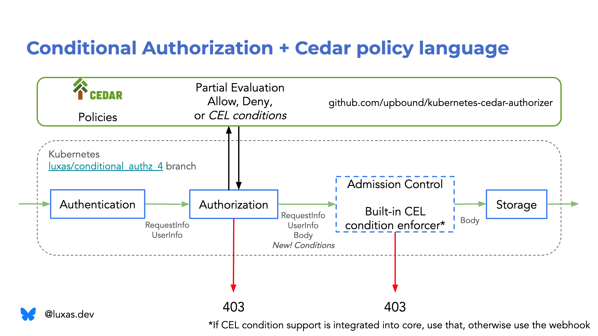

# KEP-5681: Conditional Authorization

- Author: Lucas Käldström, Upbound
- Contributor: Micah Hausler, AWS

<!-- toc -->
- [Summary](#summary)
  - [Initial Design Resources](#initial-design-resources)
  - [Goals](#goals)
  - [Non-goals](#non-goals)
  - [Requirements](#requirements)
  - [Example Use Cases](#example-use-cases)
- [Proposal](#proposal)
  - [Introduction to partial evaluation and why it is useful to solve this problem](#introduction-to-partial-evaluation-and-why-it-is-useful-to-solve-this-problem)
  - [Why propagate the conditions with the request?](#why-propagate-the-conditions-with-the-request)
  - [Condition and ConditionSet data model](#condition-and-conditionset-data-model)
  - [Conditional Authorizer interfaces and the AuthorizationConditionsEnforcer admission controller](#conditional-authorizer-interfaces-and-the-authorizationconditionsenforcer-admission-controller)
  - [Computing a concrete decision from a ConditionSet](#computing-a-concrete-decision-from-a-conditionset)
  - [Computing a concrete decision from a conditional authorization chain](#computing-a-concrete-decision-from-a-conditional-authorization-chain)
  - [Changes to (Self)SubjectAccessReview](#changes-to-selfsubjectaccessreview)
  - [Changes to the Webhook Authorizer](#changes-to-the-webhook-authorizer)
  - [Node authorizer](#node-authorizer)
  - [Feature availability and version skew](#feature-availability-and-version-skew)
  - [Compound Authorization for Connectible Resources](#compound-authorization-for-connectible-resources)
  - [Compound Authorization for update/patch → create](#compound-authorization-for-updatepatch--create)
  - [Constrained Impersonation through Conditional Authorization](#constrained-impersonation-through-conditional-authorization)
- [Built-in CEL conditions evaluator](#built-in-cel-conditions-evaluator)
- [Open Questions](#open-questions)
- [Alternatives Considered, Detailed Decision Log](#alternatives-considered-detailed-decision-log)
  - [Let the API server indicate that it supports conditional authorization](#let-the-api-server-indicate-that-it-supports-conditional-authorization)
  - [Resolve the conditions until a concrete response in the union authorizer](#resolve-the-conditions-until-a-concrete-response-in-the-union-authorizer)
  - [Expose all conditions in AdmissionReview, and have admission plugins “acknowledge” the conditions](#expose-all-conditions-in-admissionreview-and-have-admission-plugins-acknowledge-the-conditions)
  - [Propagate an API server-generated request UID to both authorization and admission](#propagate-an-api-server-generated-request-uid-to-both-authorization-and-admission)
  - [Only one ConditionSet exposed as part of SubjectAccessReview status](#only-one-conditionset-exposed-as-part-of-subjectaccessreview-status)
  - [Require the client to annotate its write request with field or label selectors](#require-the-client-to-annotate-its-write-request-with-field-or-label-selectors)
  - [Extract label and field selectors from the request and current object in etcd, and supply that to the authorization process](#extract-label-and-field-selectors-from-the-request-and-current-object-in-etcd-and-supply-that-to-the-authorization-process)
<!-- /toc -->

## Summary

This KEP proposes extending Kubernetes authorization to support **conditional authorization**, where authorization decisions can depend on resource data (labels and fields of object), rather than only metadata. This enables more fine-grained access control policies while maintaining backward compatibility with existing RBAC mechanisms. The goal of this proposal is to make authorizers able scope down their policies, and have Kubernetes enforce those scoped-down policies *as if* the authorizer had access to the resource data directly. Examples of policies that bind the authorization decision to the resource data:

- Allow user Alice to create, update, delete PersistentVolumes, but only whenever spec.storageClassName is ‘dev’  
- Allow a principal to update an object only when a sensitive field is unchanged  
- Allow a principal to create objects only with certain names  
- Allow a node agent to only access objects referring to them  
- Allow a controller to only add/remove its own finalizer  
- Deny everyone except admins to use DRA adminAccess

For context, Kubernetes Authorizers today do not have access to the resource data for good reasons:

1) Not all requests have resource data attached to it  
2) The API server must be sure that the request **can become authorized** according to all data known at the time (even though to reach a final decision, the object must be decoded to check). It would be wasteful, and a DoS vector to use API server CPU and RAM resources to decode a request payload in a request that anyways cannot become authorized.  
3) Authorization decisions must be stateless, i.e. the same authorization query must yield the exact same decision whenever the underlying policy store is the same. The authorizer should in other words be a deterministic function `a: Metadata x PolicyStore → Decision`. In other words, the final authorization decision (`Allow,` `Deny,` or `NoOpinion`) *must not* depend on the state of objects in etcd.  
4) The request payload might be mutated many times by admission controllers before it reaches the state that can be checked into etcd. In addition, the old object is only available very late in the request handling process, right before an update is actually about to go through in the storage layer (and thus admission is invoked).

The observant reader might notice that in theory, a user could achieve this desired protection effect by first authoring an “over-granting” RBAC rule, and then “remove” the unwanted permissions through a ValidatingAdmissionPolicy. However, this approach has downsides:

1. The user needs to understand two different paradigms at once, and coordinate the policies between them.  
2. The principal matching predicate needs to be duplicated between RBAC and VAP  
3. The policy author needs permission to both author RBAC rules and VAP objects. VAP objects do not have privilege escalation prevention, which means that anyone that can create a VAP can author a static “false” condition for operation=\* and resources=\*, which blocks all writes to the cluster, until an admin removes the offending VAP. Thus should not “create VAP” permissions be handed out to lower-privileged principals, e.g. namespaced administrators, who otherwise legitimately would need to write conditionally authorized policies.  
4. Strict ordering of creates and deletes: In order to not at any point leak data, must the VAP deny rule be authored *and successfully activated* before the RBAC allow rules are, and vice versa for deletes.  
5. The conditions do not show up in a (Self)SubjectAccessReview, but are only noticed by a user subject to the policy upon performing a request.

Finally, an authorizer cannot expose a unified interface to the policy author, as the authorizer might not be able to control the admission plugins or cluster setup process otherwise of the cluster it serves authorization decisions to. That means, that without this conditional authorization feature, the authorizer cannot return conditional responses, as it cannot be sure they will be correctly enforced in the API server chain (again, as the enforcement admission controller might or might not exist).


To achieve the goal of making an authorizer able to enforce invariants on the resource data as if it had access to it, and critically, expose a unified experience to the policy authors, the process is split in two (for conditional policies only, all existing policies and logic are unchanged):

1. In the authorization stage, the authorizer **partially evaluates** the conditional policies such that the old and new objects and request options are marked unknown (and thus un-evaluatable). If the policy is satisfied *in every other regard* than as a function on the unknown data, this condition on the unknown data is returned by the authorizer to the API server.  
2. If there is a chance of the request becoming authorized, the API server proceeds with the request, and enforces the conditions (as a validating admission step) by either evaluating the conditions in-process (if supported), or by calling the authorizer to evaluate the value of the conditions, now given all possible data.

Notably, this design achieves its goal of unified authorization expressions across authorization and admission, without the breaking the reasons why authorizers do not have direct access to the request body in the authorization stage:

1) Conditional Authorization is only supported for certain requests, namely whenever admission is invoked (verbs create, update, patch, delete).  
2) Any request that cannot become authorized, regardless of the value of the resource data, is rejected already at the authorization stage, thanks to partial evaluation.  
3) The conditions are part of the returned authorization decision, and partial evaluation is a deterministic function, i.e. the same output (which includes the conditions) is guaranteed for the same inputs (metadata and policy store content).  
4) The API server enforces the conditions in the validating admission stage, where access to the objects is available with the correct consistency guarantees.

The abstract Authorizer function definition is augmented from `a: Metadata x PolicyStore → Decision` today to `a: Metadata x PolicyStore → Decision x ConditionSet`. Concretely, the `Decision` enum of the API server gets two new variants: `ConditionalAllow` and `ConditionalDeny`. The `authorizer.Authorizer` Go interface’s function signature naturally cannot be changed due to backwards compatibility requirements, but instead are two dedicated functions used for invoking an authorizer with potentially a conditional response, and returning a conditional response from the authorizer:

```go
package authorizer

// Use instead of authorizer.Authorize when the caller wants to use potentially any conditions returned.
func AuthorizeWithConditionalSupport(ctx context.Context, attrs Attributes, authorizer Authorizer) (Decision, string, ConditionsEnforcer, error)

// A conditional authorizer should return this in its Authorize method, whenever it wants to return a conditional response.
func NewConditionalDecision(ctx context.Context, self ConditionalAuthorizer, conditions *ConditionSet) (Decision, string, error)
```

The abstract, deterministic function for an authorizer evaluating its conditions into an unconditional Decision (`Allow,` `Deny,` or `NoOpinion`) is defined as: `e: ConditionSet x Object x Object x Options → Decision`. Note that this function *should not* have access to the policy store; this is by design, as it makes this two-stage mechanism *atomic*, just like it would have been if it could have been evaluated directly.

A condition set, returned by some authorizer, is a map from an authorizer-scoped identifier to a condition. Formally, a condition is a function `c: Object x Object x Options → Boolean`. A condition has an *effect*, which controls how the condition evaluating to “true” should be treated, e.g. should it lead to an `Allow,` `Deny,` or `NoOpinion` response. A condition also has a type, a simple string declaring in what format the condition is encoded. The condition type can be well-known and transparent (e.g. CEL, OPA, or Cedar formats), or opaque and authorizer-specific. Note: Even though the “full” new and old objects are given as inputs to the condition in this model, the authorizer is free to choose how much of that API surface is exposed to policy authors. Some authorizer might decide to e.g. only expose field-selectable fields in the expression model given to the policy author.

Conditional authorization is available to both in-tree and webhook authorizers. Conditional authorization is a generalization of the interaction between e.g. the Node authorizer and NodeRestriction admission controller. Even though the default assumption is that the authorizer authoring conditions is also responsible for evaluating them, that tight coupling is not necessary. An in-process, CEL-based ConditionSet evaluator is proposed, which can evaluate ConditionSets where every condition is of CEL type. The vast amount of ValidatingAdmissionPolicy CEL infrastructure can be re-used for this evaluator almost as-is.

TODO: Picture how it could be, e.g. a\_allatonce : Metadata x Object x Object x Options x PolicyStore → Decision vs how it is: a: Metadata x PolicyStore → Decision x Conditions and r: Conditions x Object x Object x Options → Decision.

The following picture summarizes how, with this feature, a webhook authorizer can expose a unified policy authoring experience (e.g. through Cedar or CEL) by returning conditions that are propagated with the request chain until admission, in which it can be enforced in-process with the builtin CEL conditions enforcer, if available, or through another admission-time webhook (not shown in the picture).



Together with the [Authorize with Selectors KEP](https://github.com/kubernetes/enhancements/blob/2871b58880f5629f948b4ef50bffec0d1a677eeb/keps/sig-auth/4601-authorize-with-selectors/README.md), it becomes possible to provide policy authors to write unified policies across both authorization and admission, and **reads and writes**, at least whenever operating on field-selectable fields. A practical example would be “allow user Alice to perform *any verb* on PersistentVolumes, *but only when spec.storageClassName is ‘dev’*” (assuming storageClassName is/would become field-selectable).

Consider that before this KEP, a user might need to use two or even three different paradigms to protect both data and metadata across reads and writes:


But after this KEP, it is possible to use a unified paradigm for all types:


For a practical example of what this unified interface can look like, take a look at Lucas' proof of concept at [upbound/kubernetes-cedar-authorizer](https://github.com/upbound/kubernetes-cedar-authorizer), in particular the [getting started guide](https://github.com/upbound/kubernetes-cedar-authorizer/blob/main/docs/GETTING_STARTED.md). If this project proves generally useful, it can be donated to a fitting place in the CNCF ecosystem (e.g. kubernetes-sigs or Cedar, which is now a CNCF Sandbox project). For more detailed information about the project and the philosophy behind it, take a look at [Lucas’ Master’s thesis](https://github.com/luxas/research/blob/main/msc_thesis.pdf) (written at Aalto University).

### Initial Design Resources

- SIG Auth meeting June 4, 2025: [meeting notes](https://docs.google.com/document/d/1woLGRoONE3EBVx-wTb4pvp4CI7tmLZ6lS26VTbosLKM/edit?tab=t.0#heading=h.2p3xwolypqkm), [video](https://youtu.be/Clg-rz9qlUA?si=Ay4Dddd-iJRnC89R), [slides](https://speakerdeck.com/luxas/conditional-authorization-for-kubernetes-sig-auth-presentation)  
- SIG Auth Deep Dive on Conditional Authorization Sept 4, 2025: [meeting notes](https://docs.google.com/document/d/1woLGRoONE3EBVx-wTb4pvp4CI7tmLZ6lS26VTbosLKM/edit?tab=t.0#heading=h.147ygvibasgh), [video](https://zoom.us/rec/share/24DwlfWfrP7UZEMtkpk1XvpNP_sQuRrE7FQxKoJDRRbJ-vJTBarrEermV2-XSD5p.LSzKv2wS797xMYTs), [slides](https://speakerdeck.com/luxas/conditional-authorization-sig-auth-deep-dive)  
- Proof of Concept implementation: [luxas/conditional\_authz\_4](https://github.com/kubernetes/kubernetes/compare/master...luxas:kubernetes:conditional_authz_4?expand=1) branch

### Goals

- Provide a way for an authorizer (and policy author) to only authorize certain write operations, when the payload or stored object satisfies some specific conditions  
- Allow users subject to conditional policies discover what conditions they are subject to through (Self)SubjectAccessReview  
- Ensure that a request is evaluated against an atomic set of policies in the authorizer, even in presence of cached authorization decisions  
- Allow conditions to be expressed in both transparent, analyzable forms (e.g. using languages like Cedar or CEL), or opaque ones (e.g. a UUID reference to some policy within the authorizer that must be satisfied)  
- Support expressing both “Allow” and “Deny” effect conditions (even though deny conditions might be implemented at a later stage if needed).  
- Provide the foundational framework on top of which we can build an RBAC++ API  
- Make it possible to encode the logic of the NodeRestriction admission controller through a condition returned by the Node authorizer  
- Enable a path in which the Conditional Impersonation KEP could be implemented by an authorizer returning a set of conditions on what kind of request (action and resource) the impersonating user can impersonate

### Non-goals

- Designing or mandating use of a specific policy language as the user experience  
- Designing or mandating use of a specific “official” condition syntax  
- Expose the conditions to arbitrary admission controllers  
- Support conditional authorization for requests other than write and connect verbs.

### Requirements

- Must preserve order of authorizers; evaluation must not differ from how it has been evaluated using separate authorization and admission phases.  
- Works for connectible (CONNECT verb) resources; potentially only when the accessing the connect action through POST (TODO: decide on this)  
- It should still be the case that only if the request *can become authorized* (depending only on the objects), the request payload should be decoded. We must not decode the object before this, as that would be a DoS attack vector.  
- The combined result of the partial authorization \+ later condition enforcement must be the same as if the request and etcd-stored objects were used in authorization directly in one step  
- Keep backwards compatibility within version skew, as always. Also, and in particular, for those vendoring [k8s.io/apiserver](http://k8s.io/apiserver).  
- Consider that a patch or update in authorization can turn into a create in admission, patch in authorization can turn into an update in admission, and deletecollection in authorization turns into a delete in admission.

### Example Use Cases

- Only allow a principal to create CertificateSigningRequests with a given signer  
- Only allow a principal to update a resource as long as a sensitive field is not changed  
- Only allow a principal to issue a ServiceAccount token with a given audience  
- Only allow a controller to use a specific finalizer  
- Only allow a node agent to handle resources where .spec.nodeName=\<node-name\>  
- Only allow creating or updating a ResourceClaim when adminAccess=false (generalization of DRA AdminAccess)  
- Only allow a principal to create objects with certain names  
- Only allow proxying certain URLs in the node proxy (generic solution to [KEP-2862: Fine-grained Kubelet API Authorization](https://github.com/kubernetes/enhancements/blob/master/keps/sig-node/2862-fine-grained-kubelet-authz/README.md))  
- Encode the logic of the NodeRestriction admission controller through a condition returned by the Node authorizer  
- Empower out-of-tree authorizers to perform finer-grained policies, e.g. with ABAC and/or label-based controls

## Proposal

### Introduction to partial evaluation and why it is useful to solve this problem

Kubernetes authorization today only operates on metadata that can be parsed from the HTTP request URI, headers, or method. There are good reasons for this, but the primary one is to avoid excessive resource usage and thus denial of service attacks. 

If the request payload was given to every authorizer, the bound on how much time is reasonable for an authorizer to make a decision would be much looser, and the API server would decode any request payload from potentially untrusted users, without knowing first if it is possible for this request to even in theory be authorized.

Thus does it make sense for authorization to be based solely on metadata, from a theoretical standpoint. However, users do not necessarily (want to) understand this distinction between the authorization (metadata) and admission (all available data) phases, especially if the UX of those phases are different.

Fortunately there is a path towards both protection against untrusted users and a unified, consistent user experience through **partial evaluation**. Partial evaluation is the process of evaluating policy expressions as far as possible with available metadata, and crucially, *pruning* all policies that would resolve to the constant false – no matter what the request payload is. However, if all checks that refer to the metadata fold into true, what is left of the policy expression is either true (unconditional allow) or some condition on the request payload, which during the partial evaluation process is explicitly marked *unknown*. 

**Example 1**: Consider a ValidatingAdmissionPolicy-like CEL environment syntax, and how the following two policies would be partially evaluated for the two example users Alice and Bob:

- Allow Policy 1: “request.apiGroup \== “” && request.userInfo.username \== ‘Bob’”  
- Allow Policy 2: “request.apiGroup \== “”   
  	&& request.resource \== “persistentvolumeclaims”  
  	&& request.verb \== “create”  
  	&& request.userInfo.username \== ‘Alice’  
  	&& object.spec.storageClassName \== “dev””

Now, if Alice performs a create PersistentVolumeClaims, what will the policies partially evaluate to, when “object” is kept unknown, but everything else is specified?

- Allow Policy 1: “true && false” \=\> false  
- Allow Policy 2: “true && true && true && true && object.spec.storageClassName \== “dev””

In this example, the result of each sub-expression is shown for clarity. Policy 1 clearly evaluates to false, without even knowing the value of “object”. Policy 2 is a *residual expression*, without knowing the object, it is impossible to assign a truth value to it.

Next, let’s consider what happens if Bob performs create persistentvolumeclaims in the same setting (object is unknown):

- Allow Policy 1: “true && true” \=\> true  
- Allow Policy 2: “true && true && true && false && object.spec.storageClassName \== “dev”” \=\> false

Now, note that Policy 1 returned an unconditional allow, and that Policy 2 in this context will be false, no matter what the value of the object is. There is no need to evaluate further than the first ANDed false sub-expression in Policy 2, as one can soundly conclude that due to the fourth sub-expression evaluating to false, there is no way the expression could become true later. Also, note that “Allow OR Conditional Allow \=\> Allow”, that is, if both a conditional and unconditional allow exists, the OR result is unconditional allow regardless of what the conditional allow would evaluate to. This positive pruning is also useful.

Finally, what would happen if Eve tries to create PersistentVolumeClaims:

- Allow Policy 1: “true && false” \=\> false  
- Allow Policy 2: “true && true && true && false && object.spec.storageClassName \== “dev”” \=\> false

This gives us both properties we want: Eve is denied access immediately in the authorization stage (without ever decoding the body), while it being possible to express a policy that spans both authorization and admission (policy 2).

Three adjacent systems support partial evaluation: [Cedar](https://github.com/cedar-policy/rfcs/blob/main/text/0095-type-aware-partial-evaluation.md), [CEL](https://pkg.go.dev/github.com/google/cel-go@v0.26.1/cel#Env.PartialVars) and [OPA](https://blog.openpolicyagent.org/partial-evaluation-162750eaf422).

After partial evaluation has been performed successfully, the only variables left are:

- request/new object  
- stored/old object  
- options object  
- admission operation (CREATE/UPDATE/DELETE). This cannot in fact be known up front, even if we know the authorization verb, as e.g. the “patch” authorization verb using Server-Side Apply can become a CREATE operation or a normal UPDATE operation.

For example, if a sub-expression of a policy is initially “object.name \== request.userInfo.username”, then by the end of the partial evaluation process, the known variable “request.userInfo.username” *must* be substituted with its concrete value (say ‘lucas’), which yields the expression “object.name \== ‘lucas’”. In other words, the residual expression should not depend on any variables already known, but instead just substitute known variable values with constants.

One quite tricky technical detail about partial evaluation is the short-circuiting of e.g. the common “&&” and “||” operators, especially with regards to errors. Clearly, “false && \<residual\>” can be simplified to “false”. However, “\<residual\> && false” can either be “false” or “error”, if evaluating “\<residual\>” produces an error. Thus is not the && operator commutative. However, the authorizer *should* only return conditions that, depending on the resource data, *could* become true. Returning conditions that are always false is a waste of resources, as the request could get farther into the request chain this way, but later just get denied. In other words, the authorizer should not return a condition of form “\<residual\> && false” with Allow effect. As conditions with Deny effect are sensitive to errors, it is, however, reasonable to return “\<residual\> && false” with a deny effect, if one wants to make sure that if the error happens, the request fails closed.  

### Why propagate the conditions with the request?

In the summary, it was already concluded that the authorizer needs to be able to depend on the API server to “call the authorizer back” with the resource data, whenever a conditional decision is returned. However, let’s consider two major alternative designs before going deeply into the current design. Instead of the authorizer returning a concrete set of conditions to Kubernetes, one could imagine two other methods, as follows:

1. The authorizer does not return a Condition Set, but relies on Kubernetes to send an AdmissionReview to the authorizer whenever a conditional decision (just a bit) was made. The authorizer then re-evaluates all policies against the AdmissionReview with complete data. This approach has many drawbacks:  
   1. **Two full evaluations needed:** During the authorization phase, the worst-case runtime is O(nk), where n is the number of policies, and k is the maximum policy evaluation time. The admission-time evaluation would also be O(nk) in this case.  
      1. With this proposal, only O(k) time would be required in admission, given that the amount of conditions is O(1) for a typical request.   
   2. **Non-atomicity**: For a given authorizer, a request should be authorized from exactly one policy store snapshot. If two full re-evaluations were done, the latter (admission-time) policy store semantics would apply, if the policy store changed between the request performed authorization and admission.  
      1. With this proposal, the conditions are computed at authorization time by partial evaluation and unmodified enforced at admission, exactly and only the authorization-time policy store semantics apply.  
   3. **Tight coupling between conditions authoring and evaluation**: The authorizer would be the only entity which would be able to evaluate the conditional response in the admission stage, which forms a forced tight coupling. Two webhooks per authorizer per request is necessary.  
      1. With this proposal, builtin conditions enforcers might evaluate and enforce the conditions in-process, without a need for another webhook in admission. One such builtin enforcer is proposed to be CEL-based. This is faster and more reliable.  
   4. **Not observable through (Self)SubjectAccessReview**: As for admission today, a user subject to a policy would not know what policy they are subject to before they execute a request that violates it (hopefully with a nice error message).  
      1. With this proposal, a user can see the conditions serialized in the (Self)SubjectAccessReview. Some of the conditions might be opaque (like “policy16”), yes, but at least the user might know where to look next.  
2. The authorizer does not return a Condition Set, but instead caches the conditions in a memory. The authorizer relies on Kubernetes to generate a random “request ID”, which is passed to both SubjectAccessReview and AdmissionReview webhooks, so the authorizer can know which conditions to apply to which request.  
   1. This approach does not have the “Two full evaluations needed” and “Non-atomicity” problems of the first alternative approach, as only the conditions need to be atomically evaluated against the resource data. However, this approach is subject to the “Tight coupling” and “Not observable through (Self)SubjectAccessReview” problems. In addition, the following problems arise:  
   2. **A stateful authorizer is complex and hard to scale:** The authorizer must be way more complex, as it needs to keep a lookup table of request ID to condition set internally. If the authorizer needs to be horizontally scaled, the load balancer in front of the horizontally scaled authorizers would somehow need to know which authorizer replica has what requests’ conditions stored in memory.  
      1. With this proposal, the authorizer is allowed to be stateless and thus simpler. Therefore, also the horizontal scaling can be done in a straightforward manner, from this perspective.  
   3. **Unclear caching semantics**: The authorizer would need to cache the conditions in memory for at least as long as SubjectAccessReview requests can be cached, for the above atomicity invariant to hold. However, the authorizer does not (generally) know the API server configuration, and thus does not know how long to cache the conditions, or if at all.

### Condition and ConditionSet data model

The data model is shown in Go pseudocode. These types and interfaces could be put in [k8s.io/apiserver/pkg/authorization/authorizer](http://k8s.io/apiserver/pkg/authorization/authorizer), or in a sub-package. They are abstract, non-serializable types, which concrete implementations implement or convert to/from. 

```go

package authorizer

// ConditionEffect specifies how a condition evaluating to true should be handled.
type ConditionEffect string

const (
	// If any Deny condition evaluates to true, the ConditionSet 
// necessarily evaluates to Deny. No further authorizers 
// are consulted.
	EffectDeny ConditionEffect = "Deny"
	// If a NoOpinion condition evaluates to true, the given 
// authorizer’s ConditionSet cannot evaluate to Allow anymore, but 
// necessarily Deny or NoOpinion, depending on whether there are any
// true EffectDeny conditions. 
// However, later authorizers in the chain can still Allow or Deny.
// It is effectively a softer deny that just overrides the 
// authorizer's own allow policies. It can be used if an authorizer  
// does not consider itself fully authoritative for a given request.  
// TODO: Talk about error handling; what happens if any of these 
// conditions fail to evaluate.
	EffectNoOpinion ConditionEffect = "NoOpinion"
	// If an Allow condition evaluates to true, the ConditionSet evaluates
// to Allow, unless any Deny/NoOpinion condition also evaluates to 
// true (in which case the Deny/NoOpinion conditions have precedence).
	EffectAllow ConditionEffect = "Allow"
)

// A condition to be evaluatedN@
type Condition struct {
	// An alphanumeric string, max 255 bytes.
	// Uniquely identifies the condition within the scope of the
// authorizer that authored the condition. Acts as a key for a 
// slice of conditions, such that it can be used as a map. 
// The FailureMode of the ConditionalAuthorizer determines how to
	// handle invalid ID values.
	// Used for error messages, e.g.
// "condition 'no-pod-exec' denied the request"
	ID string
	// An opaque string that represents the condition that should be
// evaluated. A condition is evaluated after mutation.
// A pure, deterministic function from ConditionData to a Boolean.
// Might or might not be human-readable (could e.g. be 
// base64-encoded), but max 1024 bytes.
// The FailureMode of the ConditionalAuthorizer determines how to
	// handle too long Condition values.
Condition string
	// How should the condition evaluating to "true" be treated.
	// The FailureMode of the ConditionalAuthorizer determines how to
	// handle unknown Effect values.
	Effect ConditionEffect
// The format/encoding/language of the condition string.
// Any type starting with `k8s.io/` is reserved for Kubernetes
// condition types to be added in the future.
// The built-in CEL condition evaluator will use this domain.
// An authorizer must be able to evaluate any conditions it authors. 
// Validated as a label key, i.e. an alphanumeric string with an
// optional prefix domain, in total max 63 bytes.
// The FailureMode of the ConditionalAuthorizer determines how to
	// handle invalid Type values.
// TODO: We could consider forcing all conditions in a set to be of   
// the same type, to avoid repeating this for every condition.
Type string	

// Optional human-friendly description that can be shown as an error 
// message or for debugging.
// TODO: We might want to leave this out, in case it consumes too much 
// resources to pass around.
Description string
// TODO: Do we need per-condition failure modes?
}

// ConditionSet represents a potentially conditional output from one authorizer.
// TODO: Decide on a maximum amount of conditions?
type ConditionSet struct {
	// Some authorizers that are later in the chain than an authorizer that returned a conditional response, might return unconditional responses. Capture this in the ConditionSet.
// Mutually exclusive with set
	unconditionalDecision *Decision
	// Private field so constructor function can validate the conditions before adding them to the set.
set []Condition
}
```

### Conditional Authorizer interfaces and the AuthorizationConditionsEnforcer admission controller

After the partial evaluation process, the condition is a function that takes the data available in admission, but not in authorization as input, and returns a boolean. The data structure for the input data is defined as follows:

```go
package authorizer

// TODO: This interface might need to change to something more generic, as e.g. constrained impersonation might use other contextual data (or we bake that data into GetObject())
type ConditionData interface {
	// GetOperation is the operation being performed
	GetOperation() string
	// GetOperationOptions is the options for the operation being performed
	GetOperationOptions() runtime.Object
	// GetObject is the object from the incoming request prior to default values being applied.
	// Only populated for CREATE and UPDATE requests.
	GetObject() runtime.Object
	// GetOldObject is the existing object. Only populated for UPDATE and DELETE requests.
	GetOldObject() runtime.Object
}
```

Whenever the ConditionalAuthorization feature gate is enabled in the API server, there is an `AuthorizationConditionsEnforcer` validating admission controller whose job it is to evaluate the conditions, and enforce the decision that the condition set evaluated to. The validating admission controller operates on a fully-mutated request object just like other validating admission controllers, by design.

The signature for an entity that can evaluate a condition set into a concrete decision (`Allow,` `Deny,` or `NoOpinion`) is as follows:

```go
package authorizer

type ConditionSetEvaluator interface {
	// EvaluateConditions evaluates a condition set into a concrete decision (Allow, Deny, NoOpinion),
	// given full information about the request (ConditionData, which includes e.g. the old and new objects).
	EvaluateConditions(ctx context.Context, conditionSet *ConditionSet, data ConditionData) (Decision, string, error)
}
```

Each conditional authorizer should be able to evaluate any condition set it returned, and thus is the ConditionalAuthorizer interface defined as follows:

```go
package authorizer

type ConditionalAuthorizer interface {
	Authorizer
	ConditionSetEvaluator
	// FailureMode determines how to treat an error from EvaluateConditions
	FailureMode() FailureMode
}
```

In the latter sections, we will walk through a sketch for how to implement the  ConditionalAuthorizer interface for the Node and Webhook authorizers and Constrained Impersonation.

In addition, to facilitate for loose coupling between the authorizer authoring the conditions, and the evaluation process, is there an interface for builtin condition set evaluators, e.g. for evaluating CEL conditions in-process:

```go
package authorizer

type BuiltinConditionSetEvaluator interface {
	ConditionSetEvaluator
       // SupportedConditionTypes defines the condition types that the builtin evaluator can assign truth values to in-process.
	SupportedConditionTypes() sets.Set[ConditionType]
}
```

Finally, recall that the output of the entrypoint for calling “authorize with conditions” was defined as follows:

```go
package authorizer

// Use instead of authorizer.Authorize when the caller wants to use potentially any conditions returned.
// TODO: If SIG Auth wants, this can also be a pointer to a specific struct implementation, so that not "anyone" can implement the interface, if we want to guard it initially.
func AuthorizeWithConditionalSupport(ctx context.Context, attrs Attributes, authorizer Authorizer) (Decision, string, ConditionsEnforcer, error)
```

An Authorizer can only return a conditional response in the following way:

```go
func (a *FooAuthorizer) Authorize(ctx context.Context, attrs authorizer.Attributes) (authorizer.Decision, string, error) {
	// ...authorization logic that leads to a conditional response
	conditionSet := authorizer.NewConditionSet(fooCondition, barCondition)
	return authorizer.NewConditionalDecision(ctx, a, conditionSet)
}
```

Why force use of such a helper function? The reason is, that the `AuthorizeWithConditionalSupport` top-level function injects a ConditionsEnforcer into the context, and then `NewConditionalDecision` registers the given ConditionSet into the ConditionsEnforcer from the context. Users cannot access the enforcer directly, but only through these two helper functions, which helps manage and protect the surface area of this. If an authorizer tries to return a conditional decision to a context that was not initialized through AuthorizeWithConditionalSupport (or if the feature gate is disabled), `NewConditionalDecision` fails closed with NoOpinion instead, which means that new Authorizers are backwards-compatible with old Authorize callers at the code level.

TODO (luxas): Change this to propose another Authorizer interface instead, with upcasting.

In any case, the returned ConditionsEnforcer can either be:

1) evaluated, given complete data, into the same decisions that the authorizer chain would have returned immediately, if the authorizers had access to the complete data up front, or  
2) serialized, for the purpose of `(Self)SubjectAccessReview`. Each output ConditionSet represents the conditional or unconditional output of one authorizer in the authorizer chain.

```go
package authorizer

// ConditionsEnforcer is the conditional output from a chain of authorizers.
// In order to reach a definite/unconditional decision that determines whether to allow the request to go through or not, ConditionData needs to be provided to it. 
type ConditionsEnforcer interface {
	// EnforceConditions evaluates the ordered authorization chain against concrete data to reach a final Allow/Deny/NoOpinion decision.
	EnforceConditions(ctx context.Context, data ConditionData) (Decision, string, error)

	// OrderedConditionSets walks the authorizer chain until an unconditional authorizer response is got, and outputs all ordered ConditionSets that might/should be satisfied for a user. Used for introspection, e.g. (Self)SubjectAccessReview.
	OrderedConditionSets(ctx context.Context) []*ConditionSet

	// WithBuiltinConditionsResolvers allows registering loosely-coupled, generic condition evaluators before enforcement.
	WithBuiltinConditionsResolvers(builtinConditionsResolvers ...BuiltinConditionsResolver) ConditionsEnforcer
}
```

In pseudo-code, the WithAuthorization HTTP filter functions as follows:

```go
// Call the Authorizer chain with support for conditional authorization
decision, reason, conditionsEnforcer, err := authorizer.AuthorizeWithConditionalSupport(ctx, attributes, a)

if decision == authorizer.DecisionConditionalAllow {
	// Store the ConditionsEnforcer in the request context, so that the
// AuthorizationConditionsEnforcer admission controller has access to 
// the conditions later for enforcement.
	ctx = request.WithConditionalAuthorizationContext(ctx, conditionsEnforcer)
	req = req.WithContext(ctx)
}

if decision == authorizer.DecisionAllow || 
   decision == authorizer.DecisionConditionalAllow {
	handler.ServeHTTP(w, req)
	return
}
responsewriters.Forbidden(ctx, attributes, w, req, reason, s)
return
```

The pseudo-code of the `AuthorizationConditionsEnforcer` admission controller is as follows:

```go
func (c *ConditionalAuthorizationEnforcer) Handles(operation admission.Operation) bool {
	return c.featureEnabled
}

// ConditionalAuthorizationEnforcer is a Validating Admission Controller
func (c *ConditionalAuthorizationEnforcer) Validate(ctx context.Context, a admission.Attributes, o admission.ObjectInterfaces) error {
	// Acquire 
	enforcer, ok := request.ConditionalAuthorizationContextFrom(ctx)
	if !ok {
		return nil // Unconstrained request, allow to go throughi
	}

	// Build the conditions data from the admission attributes
	conditionsData := conditionsDataFrom(a)

	// Use the returned enforcer to evaluate the authorization chain
	// with all available data. Use the builtin CEL evaluator if possible.
	decision, reason, err := enforcer.		WithBuiltinConditionsResolvers(c.builtinConditionsResolvers...).
		EnforceConditions(ctx, conditionsData)

	// Conditions evaluated to Allow, let the request proceed
if decision == authorizer.DecisionAllow {
		return nil
	}
	// Return 403 if conditional authorization chain came to a negative conclusion
	return apierrors.NewForbidden(groupResource, name, responsewriters.ForbiddenStatusError(attrs, reason))
```

In a later section, a concrete visualization of the request flow is shown.

### Computing a concrete decision from a ConditionSet

How should a ConditionsEvaluator evaluate the conditions in the given set? The process is two-fold:

1. Evaluate each condition function to a boolean value, or error  
2. Compute the individual truth values of the conditions, along with their desired effect into an aggregate, unconditional decision (Allow/Deny/NoOpinion) at the authorizer level, according to the following logic:

If there is at least one condition with `effect=Deny` that evaluates to true, return `Deny`.

If there is at least one condition with `effect=Deny` that evaluates to an error, return an error. The FailureMode of the ConditionalAuthorizer controls whether to treat the error as decision `Deny` or `NoOpinion`.

Otherwise, it is known that any `effect=Deny` condition evaluates to false. Then, if there is at least one condition with `effect=NoOpinion` that evaluates to true, return `NoOpinion`.

If there is at least one condition with `effect=NoOpinion` that evaluates to an error, return `NoOpinion` to fail closed (as if the condition evaluated to true) along with the error for logging/diagnostics.

Otherwise, it is known that any `effect=NoOpinion` condition evaluates to false. Then, if there is at least one condition with `effect=Allow` that evaluates to true, return `Allow`.

Any `effect=Allow` condition that evaluates to an error is ignored. If no `effect=Allow` condition evaluates to true, return `NoOpinion`.

### Computing a concrete decision from a conditional authorization chain

It is now known how to evaluate a single ConditionSet together with the ConditionsData into a single, aggregate Allow/Deny/NoOpinion decision, the same decision that the authorizer would have immediately returned, if it had direct access to the ConditionsData. Next, we discuss the semantics of multiple authorizers chained after each other (i.e. the [union](https://pkg.go.dev/k8s.io/apiserver/pkg/authorization/union) authorizer), in the light of conditional authorization.

To begin with, it is good to state that the semantics of the existing modes Allow, Deny and NoOpinion do not change. Whenever a NoOpinion is returned by an authorizer, it is ignored by the union authorizer, just like it had not been in the chain in the first place. Notably, both before and after this proposal, an authorizer returning NoOpinion is ignored even though it returns an error. Thus must any safety-critical errors be turned into Deny decisions if failing closed is needed.

Likewise, a chain with the prefix “NoOpinion, …, NoOpinion, Allow” still short-circuits and returns an unconditional Allow, without any conditional authorization. Vice versa for a chain with the prefix “NoOpinion, …, NoOpinion, Deny” \=\> Deny.

Now, in the introduction it was mentioned that with this proposal, two new [authorizer.Decision](https://pkg.go.dev/k8s.io/apiserver/pkg/authorization/authorizer#Decision) types are added, namely `ConditionalAllow` or `ConditionalDeny`. 

A ConditionSet with at least one Allow effect condition induces the decision `ConditionalAllow`, no matter how many other Deny or NoOpinion effect conditions there are in the same set. `ConditionalAllow` thus means “a ConditionSet with a possibility to evaluate to Allow, given the missing data”. This matters, as it was concluded in the beginning that the API server should only spend resources decoding the request body etc. on requests that have a *chance of becoming authorized*. It is worth pointing out that a ConditionalAllow ConditionSet can end up evaluating to any of the Allow/Deny/NoOpinion decisions, as per the logic in the previous section.

In contrast, `ConditionalDeny` is returned for all other ConditionSets, namely those where there are no conditions with the Allow effect, only conditions with effect NoOpinion or Deny. A ConditionalDeny ConditionSet can end up evaluating to either Deny or NoOpinion, as per the logic in the previous section. 

Such an authorizer might be useful in the very beginning of the chain, to make sure e.g. that “it is never possible for non-admins to enable DRA adminAccess in request payloads”. This KEP is thus a generalization of the DRA AdminAccess KEP, through authorization, which might or might not be user-editable (in contrast to ValidatingAdmissionPolicies which can be dynamically removed by users).

However, what happens to the union authorizer semantics when and after a `ConditionalAllow` or `ConditionalDeny` response is seen?

There are two main options:

1. **Lazy Evaluation**: When seeing a `ConditionalAllow`\-equivalent response, short circuit the union authorization process BUT add any authorizers later in the chain to the ConditionsEnforcer for later consideration, if this first `ConditionalAllow` ended up producing a `NoOpinion` response when evaluated. The whole chain is thus eventually considered if (and only if) needed. This mode is shown in the picture below.  
2. **Eager Evaluation**: The authorization chain is walked until some unconditional decision is reached, or the end of the chain is reached. All ordered ConditionSets are passed with the request and evaluated in order by the admission controller. If some of the earliest ConditionSets in the chain end up being `Allow` or `Deny`, later authorizers’ ConditionSets are ignored and thus computed in vain.


A high-level picture of the request flow with conditional authorization. The chain of authorizer decisions can be lazily evaluated, such that the third authorizer in the picture is not evaluated directly in the authorization stage, as already the second one might yield an Allow. However, in admission, if the second authorizer ends up evaluating to NoOpinion, the third authorizer is evaluated (and in this example evaluates first ConditionalAllow, then Allow).

Initially, before the SIG Auth Deep Dive (Sept 4, 2025\) on this topic, the idea was to go with option 2, eager evaluation. However, in the meeting, it seemed like the consensus was that there is concern about the eager method being too inefficient. Therefore, the current proposal is to utilize option 1, lazy evaluation, as shown in the picture. This has been implemented in the [proof of concept](https://github.com/kubernetes/kubernetes/compare/master...luxas:kubernetes:conditional_authz_4?expand=1).

The following diagram shows the various outcomes of when ConditionSet evaluation is performed in a chain (regardless of which of the two options above are chosen). In this picture, NoOpinion results are mostly omitted to yield a clearer picture. The key takeaways are:

1. If there is not at least one Concrete or Conditional Allow in the chain, the request cannot become allowed, and is thus rejected early (in the WithAuthorization filter)  
2. Whenever a ConditionalAllow is encountered, that ConditionSet will be evaluated in the admission controller, and only if that ConditionSet’s decision ends up being NoOpinion, later authorizers are consulted (which can yield any response)  
3. A ConditionalDeny before a Concrete Allow yields a Conditional Allow: the request is only allowed if the ConditionalDeny ConditionSet ends up *not* denying the request with higher priority than the later Concrete Allow authorizer.

Note: As we fold ConditionalDeny \+ Deny into Deny directly, the audit log just tells that one of the authorizers (in this case, the latter) denied it, not necessarily the first one.


### Changes to (Self)SubjectAccessReview

One of the core goals of this KEP is to make it easier also for users subject to authorization policies that span authorization and admission understand what policies they are subject to. This in practice means that the conditions should be shown in (Self)SubjectAccessReview (SAR) responses, as is logical when the authorizer response area grows. However, there are some details to pay attention to:

- The same request might be subject to multiple conditional authorizers in the authorizer chain. Consider a chain of two authorizers both returning ConditionalAllow. The first authorizer’s returned ConditionSet will have precedence over the second, and thus cannot be merged into one. Instead, the SubjectAccessReview response must retain the ordering of the two ConditionSets, so the user can reason about them.  
- Consider a two-authorizer chain, where the first returns ConditionalDeny, and the second (unconditional/concrete) Allow (or Deny) for that matter. Thus, SAR structure should expose whether a later authorizer indeed produced a concrete response.

The SubjectAccessReviewStatus API is thus augmented with the following field and types:

```go
type SubjectAccessReviewStatus struct {
	// ... Allowed, Denied, Reason and EvaluationError here as normal

	// ConditionsChain is an ordered list of condition sets, where every item of the list represents one authorizer's ConditionSet response.
	// When evaluating the conditions, the first condition set must be evaluated as a whole first, and only if that condition set
	// evaluates to NoOpinion, can the subsequent condition sets be evaluated.
	//
	// When ConditionsChain is non-null, Allowed and Denied must be false.
	//
	// +optional
	// +listType=atomic
	ConditionsChain []SubjectAccessReviewConditionSet `json:"conditionsChain,omitempty" protobuf:"bytes,5,rep,name=conditionsChain"`
}

type SubjectAccessReviewConditionSet struct {
	// Allowed specifies whether this condition set is unconditionally allowed.
	// Mutually exclusive with Denied and Conditions.
	Allowed bool `json:"allowed,omitempty" protobuf:"varint,1,opt,name=allowed"`
	// Denied specifies whether this condition set is unconditionally denied.
	// Mutually exclusive with Allowed and Conditions.
	Denied bool `json:"denied,omitempty" protobuf:"varint,2,opt,name=denied"`

	// FailureMode specifies the failure mode for this condition set.
	// Only relevant if the conditions are non-null.
	FailureMode string `json:"failureMode,omitempty" protobuf:"bytes,3,opt,name=failureMode"`

	// Conditions is an unordered set of conditions that should be evaluated against admission attributes, to determine
	// whether this authorizer allows the request.
	//
	// +listType=map
	// +listMapKey=id
	// +optional
	Conditions []SubjectAccessReviewCondition `json:"conditions,omitempty" protobuf:"bytes,4,rep,name=conditions"`
}

type SubjectAccessReviewCondition struct {
	ID string `json:"id" protobuf:"bytes,1,opt,name=id"`
	Effect      SubjectAccessReviewConditionEffect `json:"effect" protobuf:"bytes,2,opt,name=effect"`
	Type        string                             `json:"type" protobuf:"bytes,3,opt,name=type"`
	Condition   string                             `json:"condition" protobuf:"bytes,4,opt,name=condition"`
	Description string                             `json:"description,omitempty" protobuf:"bytes,5,opt,name=description"`
}

type SubjectAccessReviewConditionEffect string

const (
	SubjectAccessReviewConditionEffectAllow         SubjectAccessReviewConditionEffect = "Allow"
	SubjectAccessReviewConditionEffectDeny   SubjectAccessReviewConditionEffect = "Deny"
	SubjectAccessReviewConditionEffectNoOpinion SubjectAccessReviewConditionEffect = "NoOpinion"
)
```

`Status.ConditionsChain` is mutually exclusive with `Status.Allowed` and `Status.Denied`. A conditional response is characterized by `Status.ConditionsChain` \!= null. Old implementers that do not recognize `Status.ConditionsChain` will just safely assume it was a `NoOpinion`.

### Changes to the Webhook Authorizer

Thanks to the `SubjectAccessReviewStatus` API change, the webhook authorizer supports conditional responses in a straightforward manner. The webhook checks if the feature is enabled, `Status.ConditionsChain` is set, there is only one ConditionSet returned (there is a 1:1 mapping between an authorizer and a ConditionSet), that conditional authorization is configured (as below), as per the following code snippet:

```go
gotConditionalResponse := len(r.Status.ConditionsChain) != 0 && utilfeature.DefaultFeatureGate.Enabled(genericfeatures.ConditionalAuthorization)

switch {
case r.Status.Denied && r.Status.Allowed:
	return authorizer.DecisionDeny, r.Status.Reason, fmt.Errorf("webhook subject access review returned both allow and deny response")
case r.Status.Denied && gotConditionalResponse:
	return authorizer.DecisionDeny, r.Status.Reason, fmt.Errorf("webhook subject access review returned both deny and conditional response")
case r.Status.Allowed && gotConditionalResponse:
	return w.decisionOnError, r.Status.Reason, fmt.Errorf("webhook subject access review returned both allow and conditional response")
case r.Status.Denied:
	return authorizer.DecisionDeny, r.Status.Reason, nil
case r.Status.Allowed:
	return authorizer.DecisionAllow, r.Status.Reason, nil
case gotConditionalResponse:
	if !w.supportsConditionalResponse {
return w.decisionOnError, "", fmt.Errorf("webhook authorizer does not support conditional responses") 
}

	if len(r.Status.ConditionsChain) > 1 {
		return authorizer.DecisionNoOpinion, "", fmt.Errorf("webhook authorizer does not support multiple conditions chains")
	}
	conditionSet, err := toAuthorizerConditions(r.Status.ConditionsChain[0])
	if err != nil {
		return authorizer.DecisionNoOpinion, "", err
	}
	return authorizer.NewConditionalDecision(ctx, w, conditionSet)
default:
	return authorizer.DecisionNoOpinion, r.Status.Reason, nil
}
```

The more interesting aspect is, how should the webhook authorizer evaluate the conditions? In order to do this, two changes are proposed. We propose a new `AuthorizationConditionsReview` API, slightly similar to `AdmissionReview`, but for this use-case as the interface between the conditional authorizer and Kubernetes:

```go
// AuthorizationConditionsReview describes a request to evaluate authorization conditions.
type AuthorizationConditionsReview struct {
	metav1.TypeMeta `json:",inline"`
	// Request describes the attributes for the authorization conditions request.
	// +optional
	Request *AuthorizationConditionsRequest `json:"request,omitempty" protobuf:"bytes,1,opt,name=request"`
	// Response describes the attributes for the authorization conditions response.
	// +optional
	Response *AuthorizationConditionsResponse `json:"response,omitempty" protobuf:"bytes,2,opt,name=response"`
}

// AuthorizationConditionsRequest describes the authorization conditions request.
type AuthorizationConditionsRequest struct {
	// Operation is the operation being performed. This may be different than the operation
	// requested. e.g. a patch can result in either a CREATE or UPDATE Operation.
	Operation         admissionv1.Operation `json:"operation" protobuf:"bytes,7,opt,name=operation"`
	// Object is the object from the incoming request.
	// +optional
	Object runtime.RawExtension `json:"object,omitempty" protobuf:"bytes,10,opt,name=object"`
	// OldObject is the existing object. Only populated for DELETE and UPDATE requests.
	// +optional
	OldObject runtime.RawExtension `json:"oldObject,omitempty" protobuf:"bytes,11,opt,name=oldObject"`
	// Options is the operation option structure of the operation being performed.
	// e.g. `meta.k8s.io/v1.DeleteOptions` or `meta.k8s.io/v1.CreateOptions`. This may be
	// different than the options the caller provided. e.g. for a patch request the performed
	// Operation might be a CREATE, in which case the Options will a
	// `meta.k8s.io/v1.CreateOptions` even though the caller provided `meta.k8s.io/v1.PatchOptions`.
	// +optional
	Options runtime.RawExtension `json:"options,omitempty" protobuf:"bytes,13,opt,name=options"`

	// ConditionSet is the condition set that the authorizer returned for 
// the request in the authorization phase.
	ConditionSet authorizationv1.SubjectAccessReviewConditionSet `json:"conditionSet,omitempty" protobuf:"bytes,17,opt,name=conditionSet"`
}

// AuthorizationConditionsResponse describes an authorization conditions response.
type AuthorizationConditionsResponse struct {
	// Allowed indicates whether or not the request is authorized according to the authorization conditions.
	// Mutually exclusive with Denied.
	// Allowed=false and Denied=false means that the authorizer has no NoOpinion on the request.
	Allowed bool `json:"allowed" protobuf:"varint,2,opt,name=allowed"`

	// Denied indicates whether or not the request is denied according to the authorization conditions.
	// Mutually exclusive with Allowed.
	// Allowed=false and Denied=false means that the authorizer has no NoOpinion on the request.
	Denied bool `json:"denied,omitempty" protobuf:"varint,3,opt,name=denied"`

	// Result contains extra details into why an authorization conditions request was denied.
	// This field IS NOT consulted in any way if "Allowed" is "true".
	// TODO: Might want to use the more authorizer-native Reason and EvaluationError fields
	// +optional
	Result *metav1.Status `json:"status,omitempty" protobuf:"bytes,4,opt,name=status"`

	// TODO: Add AuditAnnotations and Warnings as in AdmissionReview?
}
```

This means that the authorizer can implement an endpoint which resolves its (potentially opaque to Kubernetes) conditions the way it wants. Where the `AuthorizationConditionsReview` is, is defined in a new field on `AuthorizationConfiguration`:

```yaml
apiVersion: apiserver.config.k8s.io/v1
kind: AuthorizationConfiguration
authorizers:
 - type: Webhook
   name: webhook
   webhook:
    # New: Encode the endpoint for resolving the conditions as a KubeConfig 
    # context. If unset, conditional authorization is not supported.
    # The authentication info and service hostname can be the same, but most 
    # likely the HTTP endpoint of the authorizer service is different.
    # The authorizer MUST support evaluating any condition type it returns
    # in the SubjectAccessReview.
    conditionsEndpointKubeConfigContext: authorization-conditions
    # Existing struct, pointer to KubeConfig file where the context exists
    connectionInfo:
      type: KubeConfigFile
      kubeConfigFile: /kube-system-authz-webhook.yaml
```

Finally, recall that the webhook authorizer by default caches requests. If any authorizer utilizes caching, the conditions must be cached as well, such that there is no difference between cached and uncached authorization responses. Also, recall that if Kubernetes supports evaluating the conditions in-process with a builtin ConditionsEvaluator, e.g. the CEL one, a `AuthorizationConditionsReview` webhook is not needed, as per the following table:

| Webhooks during phase: | Authorization response not cached | Authorization response cached |
| :---- | :---- | :---- |
| Condition Type Not Supported by Builtin Condition Evaluators | Authorize() \+ EvaluateConditions() | EvaluateConditions() |
| Condition Type Supported | Authorize() | Neither |

### Node authorizer

The Node authorizer was the first conditional authorizer in that it had both an authorization and admission part that always were designed and evolved in tandem. This proposal generalizes this; now the Node authorizer could return conditional responses with type e.g. `k8s.io/node-authorizer` and either transparent conditions written in CEL, if possible, or opaque ones, e.g. `condition: ‘{“condition”: “require-pod-node-name”, “nodeName”: “foo”}’`. In the opaque condition case, the Node authorizer will get a callback on its then-added `EvaluateConditions()` function to, even in native code, enforce e.g. a Pod’s spec.nodeName actually matches what it should be. If this were the case, all logic is centralized in the authorizer, instead of being split between two components, and SubjectAccessReview shows what policies apply.

### Feature availability and version skew

Conditional authorization is available when all of the following criteria are met:

- The authorizer implementation supports conditions, which can be done in two ways:  
  - In-tree authorizer: through implementing the `authorizer.ConditionsEvaluator` interface, and  
  - Webhook authorizer: when needed, responds with a non-null `.status.conditionsChain` array, along with `.status.allowed=false` and `.status.denied=false`.  
- The `ConditionalAuthorization` feature gate is enabled AND the `AuthorizationConditionsEnforcer` admission plugin is enabled  
  - The `AuthorizationConditionsEnforcer` plugin could be enabled by default, as it returns Handles=false for every request, if the feature gate is not also enabled.  
  - However, to avoid the problematic configuration of a server being set up with the feature gate enabled, but not the admission plugin, the proposal is that AdmissionOptions.Validate will error, such that the API server can never start up in such a misconfigured state.  
- The SubjectAccessReview's `apiGroup`, `resource` and `apiVersion` selects exactly one GVR, which is served by the current API server, and the verb is one of `create`, `update`, `patch`, `delete`.

| Version skew matrix | Old API server | New API server |
| :---- | :---- | :---- |
| Old webhook | Never conditions | Conditions never returned from webhook, ok. |
| New webhook | Conditions might be returned, but API server ignores them \=\> NoOpinion | Conditions respected |

### Compound Authorization for Connectible Resources

After the move to WebSockets ([KEP 4006](https://github.com/kubernetes/enhancements/tree/master/keps/sig-api-machinery/4006-transition-spdy-to-websockets#proposal-synthetic-rbac-create-authorization-check)), connect requests are initially authorized as e.g. “get pods/exec”, which can lead someone thinking that giving “get \*” gives only read-only access, and not also write access. To mitigate this privilege-escalation vector, when the `AuthorizePodWebsocketUpgradeCreatePermission` feature gate is enabled (beta and on by default in 1.35), currently `pods/attach`, `pods/exec` and `pods/portforward` are subject to compound authorization, where effectively it is made sure that the requestor also is authorized to “create” the corresponding connectible resource. However, this check is not added (yet at least) for `pods/proxy`, `services/proxy` and `nodes/proxy`. 

In relation to these two workstreams, it is proposed that we uniformly and generally require the requestor to have the create verb using compound authorization in the `ConnectResource` handler, whenever the feature gate (or a new one) is enabled. This compound check would support conditional authorization as well, with operation \= CONNECT, object \= null, oldobject \= null but options \!= null. Such a check thus becomes a generalization of [KEP-2862: Fine-grained Kubelet API Authorization](https://github.com/kubernetes/enhancements/blob/master/keps/sig-node/2862-fine-grained-kubelet-authz/README.md), as now an authorizer can say “allow lucas to create nodes/proxy, but only when the options.path \== ‘/configz’”, or any other such policy that the administrator might fancy.

### Compound Authorization for update/patch → create

If an update or patch turns into a create, the API server performs compound authorization to make sure the requestor also has the privilege to create the resource. This KEP also applies conditional authorization support for this compound authorization check, for consistency.

### Constrained Impersonation through Conditional Authorization

[KEP-5284: Constrained Impersonation](https://github.com/kubernetes/enhancements/tree/master/keps/sig-auth/5284-constrained-impersonation) proposes a way to restrict impersonation such that the requestor both needs the permission to impersonate the specified user, but the permission to impersonate certain types of requests, e.g. “lucas can only impersonate node foo, but only to get pods”. This is a perfect example of where conditional authorization shines; the request that is being performed is the initially-unknown data that an authorizer might want to specify conditions on.

Consider the example of “lucas can only impersonate node foo, but only to get pods”. The authorizer policy (in pseudo-code) is of form:

“request.userInfo.username \== ‘lucas’ &&  
 request.verb \== ‘impersonate’ &&  
 request.resource \== ‘nodes’ &&  
 request.apiGroup \== ‘authentication.k8s.io’ &&  
 request.name \== ‘foo’ &&  
 impersonatedRequest.apiGroup \== ‘’ &&  
 impersonatedRequest.resource \== ‘pods’ &&  
 impersonatedRequest.verb \== ‘get’”

The first five ANDed expressions can be evaluated to true directly, just based on the data that is available in the normal impersonation SubjectAccessReview. However, impersonatedRequest is unknown, and thus does the residual expression yield conditions in the SubjectAccessReview response, e.g. as follows:

```yaml
apiVersion: authorization.k8s.io/v1
kind: SubjectAccessReview
status:
  allowed: false
  conditionsChain:
  - conditionsSet:
    - type: k8s.io/authorization-cel
      id: “lucas-only-impersonate-node-get-pods”
      condition: “impersonatedRequest.apiGroup == ‘’ && impersonatedRequest.resource == ‘pods’ && impersonatedRequest.verb == ‘get’”
      effect: Allow
```

Now, the impersonation filter can evaluate the condition, either through the builtin CEL evaluator (if applicable), or by calling the Authorizer’s EvaluateConditions endpoint with the missing data (the information about the impersonated request).

This approach avoids adding synthetic verbs like `impersonate-on:user-info:list` to Kubernetes authorization, just for some specific, hard-coded expressions.

## Built-in CEL conditions evaluator

The most logical alternative for Kubernetes to provide as a builtin primitive is a CEL conditions evaluator. Such a conditions evaluator could re-use most of the CEL infrastructure that Kubernetes already has, and provide a unified model for those that already are familiar with ValidatingAdmissionPolicies. This means that a wide variety of authorizers could author CEL-typed conditions, and let the API server evaluate them without a need for a second webhook. RBAC++ could use this as well.

However, this evaluator could evolve with distinct maturity guarantees than the core conditional authorization feature.

## Open Questions

- What are quantitative performance requirements for this feature?  
  - Faster than a second webhook? On par with builtin, prebuilt VAP policies?  
- How expressive do we let the CEL environment be? Should it e.g. include namespaceObject?  
- Do we need to configure conversion of native objects into some specifically-requested version like VAP, or do we just use the raw object in the admission controller?  
- What are the most important metrics that should be added?  
- Are there specific GVRs we don't want to let be conditionally authorized?  
- If there is increasing communication between k8s and e.g. webhook authorizers, would it be more performant to keep a bidirectional gRPC open at all times, and use that for comms, similar to ServiceAccount issuing and KMS implementations?

## Alternatives Considered, Detailed Decision Log

### Let the API server indicate that it supports conditional authorization

In order for the API server to indicate to a webhook authorizer that it supports conditional authorization, the API server would add the `kubernetes.io/ConditionalAuthorizationFeature=true` annotation.

However, this is not needed with the current setup; if an old apiserver receives conditions from a new authorizer, it will just ignore the conditions and treat the SAR as a NoOpinion, as it should.

### Resolve the conditions until a concrete response in the union authorizer

In the beginning of writing this proposal, we were thinking that the union authorizer would keep resolving conditions until an unconditional response is found. However, we later opted for the lazy approach, due to performance concerns with the former approach.

### Expose all conditions in AdmissionReview, and have admission plugins “acknowledge” the conditions

The SIG Auth meeting of September 4, 2025 concluded that this feature should support also condition types that are not built into Kubernetes. Thus does there need to be some way to evaluate the not-natively-supported conditions in the admission phase. The most logical way, would be to add some fields to AdmissionReview, and thus let admission webhooks let the API server know (*besides* the AdmissionReview’s primary response.allowed field) what the conditions evaluated to.

However, this turned out to be unnecessarily complicated in practice, when taking the idea further. Should all conditions from potentially every authorizer in the chain be sent to every admission webhook? Probably not. 

Can an admission webhook choose to evaluate individual conditions of some specific authorizer, or does the admission webhook need to evaluate all conditions produced by a certain authorizer at once, returning the result of the whole condition set according to the defined semantics? The latter solution is much simpler for both users and implementers to understand, so probably the latter.

However, then, how can one know that a certain admission webhook has the right to acknowledge a certain authorizer’s conditions? What if the conditional authorizer is controlled by the cloud provider or infrastructure team, but a (malicious) user dynamically registers its own admission webhook that wants to acknowledge the conditions from the cloud provider’s authorizer? What happens if there are multiple (dynamically registered) admission webhooks that evaluated the same input data (conditions+request body) to two different outputs?

These questions led us to realize that the safest initial plan is to require a 1:1 mapping between the authorizer (registered through AuthorizationConfiguration) and the authorizer’s condition enforcer. As normal users anyways cannot dynamically register authorizers, there is no need to dynamically register authorizer condition enforcers either for normal users. Thus is the most logical place to register the authorizer’s condition enforcer, in the same place the authorizer is defined in AuthorizationConfiguration. 

In other words, only the authorizer itself can evaluate its own conditions in the admission phase, and all at once only (as a set), not partially.

### Propagate an API server-generated request UID to both authorization and admission

This would have helped solve the atomicity concern, but it is not a full long-term solution, as it still relies on people setting up webhooks.

### Only one ConditionSet exposed as part of SubjectAccessReview status

However, if only one condition set is exposed, it might be impossible for a user to understand what conditions it is subject to for a given request through a (Self/Local/Standard) SubjectAccessReview, as the first conditional response might be just a “deny dangerous operations”-type of conditional response.

The user should thus see all conditional allows and denies until there is an unconditional response.

### Require the client to annotate its write request with field or label selectors

This would be a breaking change for clients, as whenever conditional authorizers would hit production usage, every client would need to annotate its every request with all selectors “just in case” some authorizer would make use of it, to higher the chances of getting authorized. This could duplicate a fair amount of the request data. 

The other problem is updates: would the selector apply only to the request object, only to the stored one, or both at once.

### Extract label and field selectors from the request and current object in etcd, and supply that to the authorization process

If the client was not required to send all this data, but the API server would decode the object to extract “just” label and field selectors, the DoS vector occurs, where a malicious party could send huge requests with bogus data, that the API server would decode before authorization takes place. In addition, would this make the authorization process state-dependent (if the selector would need to apply to both the request and stored object), something which is considered an explicit anti-pattern.  
