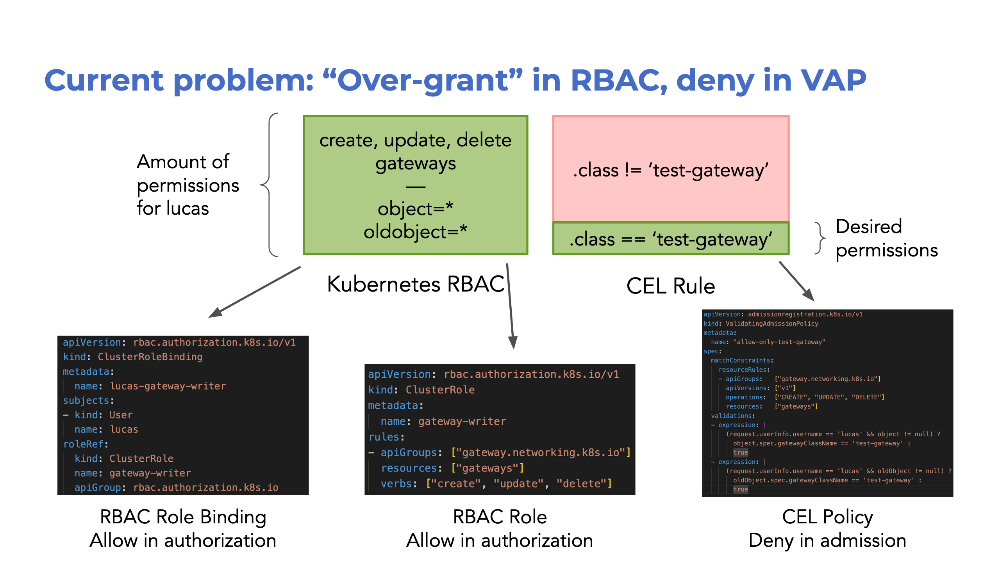
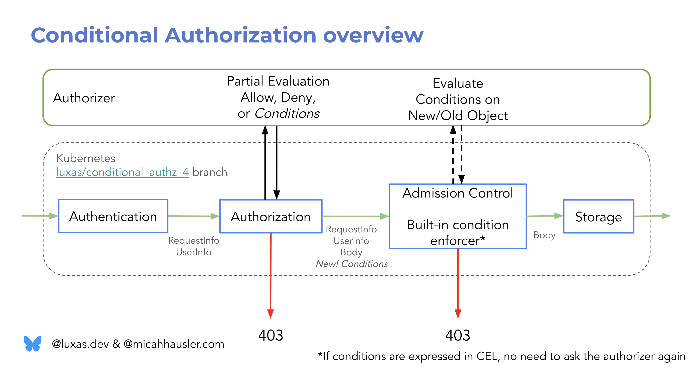
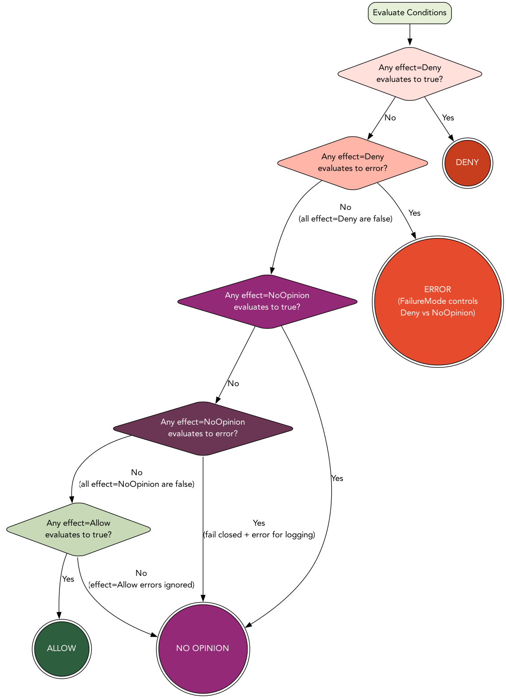
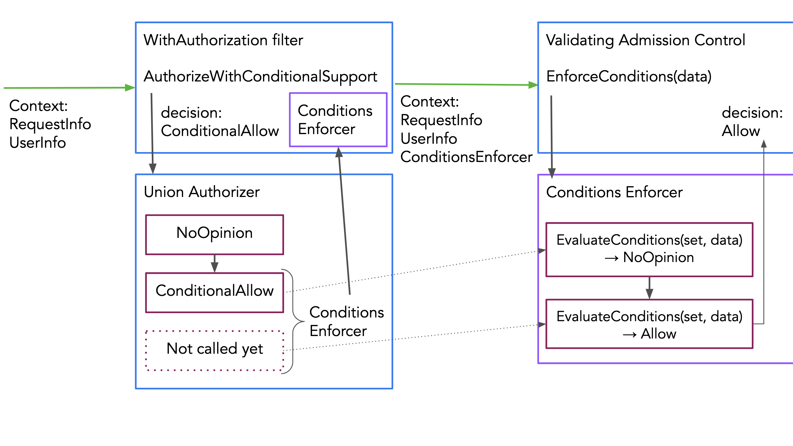
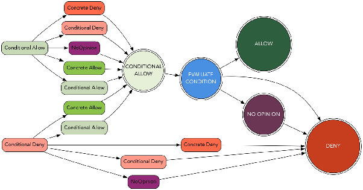
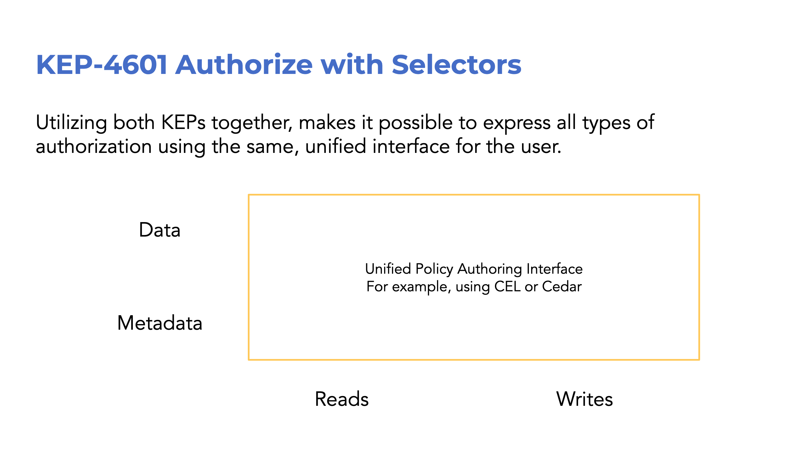

# KEP-5681: Conditional Authorization

- Author: Lucas Käldström, Upbound
- Contributor: Micah Hausler, AWS

<!-- toc -->
- [Abstract](#abstract)
  - [Example Use Cases](#example-use-cases)
  - [Goals](#goals)
  - [Non-goals](#non-goals)
- [Background and Major Considered Alternatives](#background-and-major-considered-alternatives)
  - [Why not just give authorizers access to request and stored objects?](#why-not-just-give-authorizers-access-to-request-and-stored-objects)
  - [Why not just use <code>ValidatingAdmissionPolicies</code>?](#why-not-just-use-validatingadmissionpolicies)
  - [What is partial evaluation?](#what-is-partial-evaluation)
  - [Why propagate the conditions with the request?](#why-propagate-the-conditions-with-the-request)
  - [Glossary](#glossary)
- [Proposal](#proposal)
  - [Technical Requirements](#technical-requirements)
  - [Core interface changes](#core-interface-changes)
  - [Condition and ConditionSet data model](#condition-and-conditionset-data-model)
  - [Computing a concrete decision from a ConditionSet](#computing-a-concrete-decision-from-a-conditionset)
  - [Computing a concrete decision from a conditional authorization chain](#computing-a-concrete-decision-from-a-conditional-authorization-chain)
  - [<code>AuthorizationConditionsEnforcer</code> admission controller](#authorizationconditionsenforcer-admission-controller)
  - [Changes to <code>(Self)SubjectAccessReview</code>](#changes-to-selfsubjectaccessreview)
  - [Supporting webhooks through the <code>AuthorizationConditionsReview</code> API](#supporting-webhooks-through-the-authorizationconditionsreview-api)
  - [Built-in CEL conditions evaluator](#built-in-cel-conditions-evaluator)
  - [Node authorizer](#node-authorizer)
  - [Feature availability and version skew](#feature-availability-and-version-skew)
  - [Compound Authorization for Connectible Resources](#compound-authorization-for-connectible-resources)
  - [Compound Authorization for update/patch → create](#compound-authorization-for-updatepatch--create)
  - [Constrained Impersonation through Conditional Authorization](#constrained-impersonation-through-conditional-authorization)
- [Open Questions](#open-questions)
- [TODOs](#todos)
- [Alternatives Considered](#alternatives-considered)
  - [Expose all conditions in AdmissionReview, and have admission plugins “acknowledge” the conditions](#expose-all-conditions-in-admissionreview-and-have-admission-plugins-acknowledge-the-conditions)
  - [Propagate an API server-generated request UID to both authorization and admission](#propagate-an-api-server-generated-request-uid-to-both-authorization-and-admission)
  - [Only one ConditionSet exposed as part of SubjectAccessReview status](#only-one-conditionset-exposed-as-part-of-subjectaccessreview-status)
  - [Require the client to annotate its write request with field or label selectors](#require-the-client-to-annotate-its-write-request-with-field-or-label-selectors)
  - [Extract label and field selectors from the request and current object in etcd, and supply that to the authorization process](#extract-label-and-field-selectors-from-the-request-and-current-object-in-etcd-and-supply-that-to-the-authorization-process)
- [Appendix A: Further resources](#appendix-a-further-resources)
- [Appendix B: Future addition sketch: Conditional Reads](#appendix-b-future-addition-sketch-conditional-reads)
<!-- /toc -->

## Abstract

This KEP proposes extending Kubernetes authorization to support **conditions**,
where an authorization decision depends on **resource data** (labels and fields
of object), rather than only metadata (apiGroup, resource, namespace, name).
This enables more fine-grained, and most importantly,
[**cohesive**](https://github.com/kubernetes/kubernetes/issues/118985) access
control policies that span both authorization and admission phases, while
maintaining backward compatibility with existing authorizers.

The goal of this proposal is to make authorizers able scope down their policies
*as if* the authorizer had access to the resource data directly, through the use
of two phases:

1. compute `Allow`, `Deny`, `NoOpinion` or `Conditional` response during the
   authorization phase. If `Conditional`, return the set of conditions to Kubernetes.
1. evaluate any conditions on the old/new object(s) during the validating admission
   phase, and enforce the concrete `Allow`, `Deny` or `NoOpinion` result.

Through this KEP, Kubernetes guarantees to the authorizer that its scoped-down
authorization policy will be enforced, without the authorizer having to rely on
existence of other specific admission plugins.

Concretely, all `SubjectAccessReview` (SAR) APIs are extended such that a client
can ask for conditions and the authorizer can respond with conditions. The end
user thus becomes aware of what restrictions they are subject to through
`kubectl auth can-i` self-lookups. In addition, a new
`AuthorizationConditionsReview` API is added to let out-of-tree authorizers
evaluate conditions.

This KEP aims to provide generalized framework for multiple previous features,
KEPs and issues:

- [DRA AdminAccess](https://github.com/kubernetes/enhancements/tree/master/keps/sig-auth/5018-dra-adminaccess):
  "Deny creates and updates to `ResourceClaim`s with
  `.spec.devices[*].adminAccess=true`, unless
  `namespaceObject.metadata.labels["resource.kubernetes.io/admin-access"] == "true"`"
- [Fine-grained Kubelet API Authorization](https://github.com/kubernetes/enhancements/blob/master/keps/sig-node/2862-fine-grained-kubelet-authz/README.md):
  "Allow a node agent to proxy requests to nodes through the API server, but
  only to scrape readonly information from a path starting with `/pods/`, not to
  exec into pods"
- [Constrained Impersonation](https://github.com/kubernetes/enhancements/tree/master/keps/sig-auth/5284-constrained-impersonation):
  "Allow node agent `csi-driver-foo` to only impersonate the node it is running
  on to `get pods`"
- Requiring presence of certain labels or fields: [#44703](https://github.com/kubernetes/kubernetes/issues/44703)
- Empowering authorizers to restrict the names of created objects: [#54080](https://github.com/kubernetes/kubernetes/issues/54080)
- The tight coupling between the `Node` authorizer and `NodeEnforcement`
  admission controller; with this KEP, the same logic could be modelled through
  only a conditional authorizer[^1].
- Provide an alternative to hard-coded compound authorization (e.g. the
  secondary
  [CSR SignerName](https://github.com/kubernetes/enhancements/tree/master/keps/sig-auth/1513-certificate-signing-request)
  authorization check) where needed (even though the two paradigms are
  complimentary)
- Hopefully, provide a feature that is helpful to unblocking the
  [Referential Authorization KEP](https://github.com/kubernetes/enhancements/pull/4387).
- "RBAC++" efforts, eventually.

[^1]: Note that this proposal does not directly propose any relation/graph-based
authorization mechanism, but that a request might be conditionally allowed on
relation-based conditions.

### Example Use Cases

A non-exhaustive list, in addition to the ones mentioned above:

- Allow user Alice to create, update, delete PersistentVolumes, but only
  whenever spec.storageClassName is "dev"
- Allow a principal to update an object, but only when a sensitive field is unchanged
- Allow a principal to create CertificateSigningRequests, but only when using a
  given signerName
- Allow a principal to update a resource, but only when a sensitive field is
  left unchanged
- Allow a principal to issue ServiceAccount tokens, but only with a given audience
- Allow a controller to update a resource, but only to add/remove its own
  finalizer name
- Allow a node agent to handle a resource, but only when `.spec.nodeName=<node-name>`
- Allow a user to `create subjectaccessreviews`, but only to check permissions
  of certain other users

### Goals

- Provide a way for an authorizer (and by extension, policy author) to only
  authorize certain write[^2] operations, when the payload or stored object
  satisfies some specific conditions
- Let users discover what conditions they are subject to through
  `(Self)SubjectAccessReview`
- Initially support enforcement of write and connect requests in the
  `k8s.io/apiserver` `WithAuthorization` HTTP filter, with options to expand
  coverage to read[^2] and impersonate verbs later. However, conditions can be
  returned for any verb in `SubjectAccessReview` responses, so extensions can be
  built arbitrarily on top. For instance, aggregated API servers can choose to
  enforce conditions on whatever custom verbs it wants, and authorizer can
  return conditions for any verb it likes.
- Allow conditions to be expressed in both transparent, analyzable forms (like
  Cedar or CEL), or opaque ones (like just `policy16`)
- Support expressing both “Allow” and “Deny” effect conditions.
- Provide the foundational framework on top of which we can build other
  authorization features, such as Constrained Impersonation, RBAC++ and
  Referential Authorization.
- Ensure that a request is evaluated against an atomic set of policies in the
  authorizer, even in presence of cached authorization decisions

[^2]: This KEP focuses on write requests, but another KEP that would add a
[generalized selector syntax](https://github.com/kubernetes/kubernetes/issues/128154)
is anticipated. That KEP would add a CEL-based, Kubernetes-specific, selector
syntax that form conditions for read requests. Thus could a generic,
conditions-aware "list me what I can see"-client be written that first issues a
SelfSAR, and then adds the returned (authorized) conditions to the list/watch
request, such that the request is by definition authorized.

### Non-goals

- Designing or mandating use of a specific policy authoring UX
- Designing or mandating use of a specific “official” condition syntax  
- Expose the conditions to admission controllers  

## Background and Major Considered Alternatives

To make the proposal easier to read, context and rationale for
commonly-asked-about alternatives is provided already at this stage. The reader
deeply familiar with Kubernetes authorization may proceed to the
[proposal chapter](#proposal).

### Why not just give authorizers access to request and stored objects?

Kubernetes Authorizers today do not have access to the resource data for good
reason:

1. Not all requests have resource data attached to it  
1. The API server must be sure that the request **can become authorized**
   according to all data known at the time (even though to reach a final
   decision, the object must be decoded to check). It would be wasteful, and a
   DoS vector to use API server CPU and RAM resources to decode a request
   payload in a request that anyways cannot become authorized.  
1. Authorization decisions must be stateless, i.e. the same authorization query
   must yield the exact same decision whenever the underlying policy store is
   the same. The authorizer should in other words be a deterministic function
   `a: Metadata x PolicyStore → Decision`. In other words, the initial
   authorization decision *must not*
   [depend on the state of objects in etcd](https://github.com/kubernetes/kubernetes/issues/44703#issuecomment-324826356).
1. The request payload might be mutated many times by admission controllers
   before it reaches the state that can be checked into etcd. In addition, the
   old object is only available very late in the request handling process, right
   before an update is actually about to go through in the storage layer (and
   thus admission is invoked).
1. Even if it was technically possible, providing the authorizer up-front with
   the objects could yield a significant hit, as some time would be spent on
   just propagating the objects to each authorizer, and the authorizer might
   spend more time examining the object earlier.

### Why not just use `ValidatingAdmissionPolicies`?

The observant reader might notice that some of the
[use cases](#example-use-cases) can already be achieved today with the
`ValidatingAdmissionPolicy` (VAP) API.

However, the solution is still in some regards sub-optimal:

1. In the authorization phase, the policy author must "over-grant", and then
   remember to (!) "remove" the permissions in the admission phase.
1. The user needs to understand two different paradigms at once, and coordinate
   the policies between them.
1. The principal-matching predicate needs to be duplicated between RBAC and VAP.
1. The policy author needs permission to both author RBAC rules and VAP objects.
   VAP objects do not have privilege escalation prevention, which means that
   anyone that can create a VAP can author a static `false` condition for
   `operation=*` and `resources=*`, which blocks all writes to the cluster, until
   an admin removes the offending VAP. Thus should not “create VAP” permissions
   be handed out to lower-privileged principals, e.g. namespaced administrators,
   who otherwise legitimately would need to write conditionally authorized
   policies.
1. Strict ordering of creates and deletes: In order to not at any point leak
   data, must the VAP deny rule be authored *and successfully activated* before
   the RBAC allow rules are, and vice versa for deletes.  
1. The conditions do not show up in a `(Self)SubjectAccessReview`, but are only
   noticed by a user subject to the policy upon performing a request.
1. Status quo with `ValidatingAdmissionPolicy` does not offer a tangible path
   forward for providing a unified experience for writing fine-grained
   authorization policies for reads.
1. The authorizer cannot let the policy author express conditional policies of
   the form "allow create persistentvolumes, only when storageClassName=='foo'",
   as the authorizer cannot mandate or control the admission plugins or cluster
   setup process of the cluster it serves authorization decisions to.
1. If the policy could not be modelled as a `ValidatingAdmissionPolicy`, but an
   admission webhook would be needed, that webhook might need to be sent for
   every request in the worst case, as opposed to only those requests that are
   conditionally authorized (as in this proposal).



This proposal solves all of these mentioned issues through a two-phase model:

1. the authorizer **partially evaluates** its authorization policies into
   `Allow`, `Deny`, `NoOpinion`, or a set of conditions on the at the
   authorization-stage unknown data: the request and stored object.
1. Kubernetes or the authorizer evaluates the conditions into a concrete
   response, during the admission phase.

### What is partial evaluation?

Partial evaluation is the process of evaluating expressions as far as possible
with incomplete data. A crucial consequence of this is that some unknown data
might turn out to not be needed at all to assign a fixed value to the
expression! This effective form of pruning can take place if some sub-expression
is independent of the unknown data.

In the KEP context, the unknown data at authorization time is the request and
stored objects, and the request options.

Consider a ValidatingAdmissionPolicy/CEL-like expression syntax,
and how the following two policies would be partially evaluated for the two
example users Alice and Bob:

- Allow Policy 1: `request.apiGroup == "" && request.userInfo.username == "bob"`
- Allow Policy 2:

  ```cel
  request.apiGroup == ""
  && request.resource == "persistentvolumeclaims"
  && request.verb == "create"
  && request.userInfo.username == "alice"
  && object.spec.storageClassName == "dev"
  ```

Now, if Alice performs a `create persistentvolumeclaims`, what will the policies
partially evaluate to?

- Allow Policy 1: `true && false` => `false`
- Allow Policy 2:
  `true && true && true && true && object.spec.storageClassName == "dev"` =>
  `object.spec.storageClassName == "dev"`

In these examples, the result of each sub-expression is shown for clarity.
Policy 1 clearly evaluates to false, without knowing the value of `object`.
Policy 2 produces a *residual expression*. Without knowing the object, it is
impossible to assign a truth value to the residual, and thus is this our
condition in the authorizer response.

Next, let's consider what happens if Bob performs `create persistentvolumeclaims`
in the same setting:

- Allow Policy 1: `true && true` => `true`
- Allow Policy 2:
  `true && true && true && false && object.spec.storageClassName == "dev"` =>
  `false`

Now, Policy 1 returned an unconditional (concrete) allow, and Policy 2 can never
be true, no matter what the value of the object is. If the authorizer follows
"at least one matching Allow policy yields Allow", a concrete Allow can be
returned instantly.

The authorizer might also do positive pruning, that is, if one Allow policy
evaluates to `true`, and another Allow policy to a residual, the authorizer
concludes that no matter what the object is, their union will yield Allow.

Finally, what would happen if user Eve (who is assigned no permissions) tries to
`create persistentvolumeclaims`:

- Allow Policy 1: `true && false` => `false`
- Allow Policy 2:
  `true && true && true && false && object.spec.storageClassName == "dev"` =>
  `false`

This gives us both properties we want: Eve is denied access immediately in the
authorization stage (without ever decoding the body), while it being possible to
express a policy that spans both authorization and admission (policy 2).

Three adjacent systems support partial evaluation:
[Cedar](https://github.com/cedar-policy/rfcs/blob/main/text/0095-type-aware-partial-evaluation.md),
[CEL](https://pkg.go.dev/github.com/google/cel-go@v0.26.1/cel#Env.PartialVars)
and [OPA](https://blog.openpolicyagent.org/partial-evaluation-162750eaf422). In
particular the Cedar RFC has good argumentation on why partial evaluation only
works well in cases where all expressions have a concrete type.

Note that partial evaluation *should* substitute all known variables with
constants, even if the residual cannot be fully evaluated. For example, when a
sub-expression is initially `object.name == request.userInfo.username` and
`request.userInfo.username` is known to be `"lucas"`, but `object` is unknown,
the resulting residual is `object.name == "lucas"`. In other
words, the residual does not depend on any variables already known.

### Why propagate the conditions with the request?

It was already concluded that the authorizer needs to be able to
depend on the API server to “call the authorizer back” with the resource data,
whenever a conditional decision is returned. However, instead of the
authorizer returning the set of conditions to Kubernetes, one could
imagine two other methods, as follows:

1. The authorizer does not return a ConditionSet, but relies on Kubernetes to
   send an `AdmissionReview` to the authorizer whenever a conditional decision
   was made. The authorizer then re-evaluates all policies against the
   AdmissionReview with complete data. This approach has many drawbacks:  
   1. **Two full evaluations needed:** During the authorization phase, the
      worst-case runtime is `O(nk)`, where n is the number of policies, and k is
      the maximum policy evaluation time. The admission-time evaluation would
      also be `O(nk)` in this case.
      1. With this proposal, only `O(k)` time would be required in admission,
         given that the amount of conditions is `O(1)` for a typical request.
   2. **Non-atomicity**: For a given authorizer, a request should be authorized
      from exactly one policy store snapshot. If two full re-evaluations were
      done, the latter (admission-time) policy store semantics would apply, if
      the policy store changed between the request performed authorization and
      admission.
      1. With this proposal, the conditions are computed at authorization time
         by partial evaluation and unmodified enforced at admission, exactly and
         only the authorization-time policy store semantics apply.
   3. **Tight coupling between conditions authoring and evaluation**: The
      authorizer would be the only entity which would be able to evaluate the
      conditional response in the admission stage, which forms a forced tight
      coupling. Two webhooks per authorizer per request is necessary.
      1. With this proposal, builtin conditions enforcers might evaluate and
         enforce the conditions in-process, without a need for another webhook
         in admission. One such builtin enforcer is proposed to be CEL-based.
         This is faster and more reliable.
   4. **Not observable through (Self)SubjectAccessReview**: As for admission
      today, a user subject to a policy would not know what policy they are
      subject to before they execute a request that violates it (hopefully with
      a nice error message).
      1. With this proposal, a user can see the conditions serialized in the
         `(Self)SubjectAccessReview`. Some of the conditions might be opaque (like
         `policy16`), yes, but at least the user might know where to look next.
2. The authorizer does not return a ConditionSet, but instead caches the
   conditions in a memory. The authorizer relies on Kubernetes to generate a
   random “request ID”, which is passed to both `SubjectAccessReview` and
   `AdmissionReview` webhooks, so the authorizer can know which conditions to
   apply to which request.  
   1. This approach does not have the “Two full evaluations needed” and
      “Non-atomicity” problems of the first alternative approach, as only the
      conditions need to be atomically evaluated against the resource data.
      However, this approach is subject to the “Tight coupling” and “Not
      observable through `(Self)SubjectAccessReview`” problems. In addition, the
      following problems arise:  
   2. **A stateful authorizer is complex and hard to scale:** The authorizer
      must be way more complex, as it needs to keep a lookup table of request ID
      to condition set internally. If the authorizer needs to be horizontally
      scaled, the load balancer in front of the horizontally scaled authorizers
      would somehow need to know which authorizer replica has what requests'
      conditions stored in memory.
      1. With this proposal, the authorizer is allowed to be stateless and thus
         simpler. Therefore, also the horizontal scaling can be done in a
         straightforward manner, from this perspective.
   3. **Unclear caching semantics**: The authorizer would need to cache the
      conditions in memory for at least as long as SubjectAccessReview requests
      can be cached, for the above atomicity invariant to hold. However, the
      authorizer does not (generally) know the API server configuration, and
      thus does not know how long to cache the conditions, or if at all.

### Glossary

- Concrete/Unconditional (authorization) decision: one of `Allow`, `Deny`, `NoOpinion`.
- Residual: Expression which is a deterministic function of data that was
  unknown during partial evaluation.
- Conditional Allow: A `Conditional` decision with a `ConditionSet` that has at
  least one `effect=Allow` condition. In other words, the conditional decision
  can turn into a concrete `Allow`, `Deny` or `NoOpinion` when evaluated.
- Conditional Deny: A `Conditional` decision with a `ConditionSet` that has no
  `effect=Allow` condition, in other words, just `effect=NoOpinion` or
  `effect=Deny` conditions. When evaluated, this `ConditionSet` can thus only
  turn into concrete `Deny` or `NoOpinion` decisions.

## Proposal

To achieve the above mentioned goals, at a high level, the following changes are
proposed:

- The `authorizer.Authorizer` interface and `SubjectAccessReview` API are
   extended to support:
  - The client indicating it supports conditional authorization
  - The authorizer returning, in addition to existing unconditional `Allow`,
    `Deny` or `NoOpinion` decisions, a set of conditions
- The `WithAuthorization` HTTP filter lets a supported request proceed in the
  request chain if the decision is:
  - A unconditional `Allow`, just like before, or
  - A ConditionSet *which can evaluate* to `Allow`
- A new, always-on `k8s.io/apiserver`-built-in `AuthorizationConditionsEnforcer`
  validating admission plugin (ordered before other validating webhooks) which
  enforces that the set of conditions (if any) evaluate into `Allow`, or denies
  the request.
  - To empower out-of-tree/webhook authorizers to evaluate their (opaque)
    conditions, a new `AuthorizationConditionsReview` API is added.
  - Any conditional authorizer must serve this API, which means that also
    `kube-apiserver` must serve it.[^3]
- A `k8s.io/apiserver`-built-in CEL condition evaluator, which allows evaluating
  conditions expressed in CEL format to be evaluated in-process without another
  webhook.

[^3]: As `kube-apiserver` serves as a webhook authorizer for aggregated API servers.

Notably, this design achieves its goal of unified authorization expressions
across authorization and admission, without the breaking the reasons why
authorizers do not have direct access to the request body in the authorization
stage:

1. Conditional Authorization is only supported for certain requests, namely
   whenever admission is invoked (verbs `create`, `update`, `patch`, `delete`,
   `deletecollection` and connect requests).
1. Any request that cannot become authorized, regardless of the value of the
   resource data, is rejected already at the authorization stage, thanks to
   partial evaluation.
1. The conditions are part of the returned authorization decision, and partial
   evaluation is a deterministic function, i.e. the same output (which includes
   the conditions) is guaranteed for the same inputs (metadata and policy store
   content).
1. The API server enforces the conditions in the validating admission stage,
   where access to the objects is available with the correct consistency
   guarantees.
1. Authorizers process the object data only when really needed, which minimizes
   the performance hit.

The following picture summarizes how, with this feature, a webhook authorizer
can expose a unified policy authoring experience (e.g. through Cedar or CEL) by
returning conditions that are propagated with the request chain until validating
admission, where the `AuthorizationConditionsEnforcer` plugin "calls the
authorizer back" with the conditions it gave, and the rest of the data.



In function syntax, an authorizer is a deterministic function
`authorize: Metadata x PolicyStore → Decision`. A `ConditionSet`, returned by
some authorizer, is a map from an authorizer-scoped identifier to a condition.
With this proposal, the `Decision` logical enum gets a new `Conditional`
variant, that has a `ConditionSet` associated with it.

Let `ConditionData` be the term for the data unknown at authorization time
(request, stored object and request options). A condition is a deterministic
function `condition: ConditionData → Boolean`. Note that the condition is only
a function of the unknown data; already-known data should be constants of the
condition (see the [partial evaluation section](#what-is-partial-evaluation) for
an example). A condition also has an *effect*, which controls if evaluation to
`true` should be treated as producing a `Allow,` `Deny,` or `NoOpinion`
decision.

Note that even though the “full” new and old objects are given as inputs to the
condition in this model, the authorizer is free to choose how much of that API
surface is exposed to policy authors. Some authorizer might decide to e.g. only
expose field-selectable fields in the expression model given to the policy
author.

Evaluating a `ConditionSet` is a deterministic function
`evaluate: ConditionSet x ConditionData → (Decision - {Conditional})`. Note
that conditions evaluation *should not* have access to the policy store; this is
by design, as it makes this two-stage mechanism *atomic*, just like it would
have been if it could have been evaluated directly.

### Technical Requirements

- The final decision must always be the same in this two-phase model as in a
  one-phase model (that is, if the request / stored object were given directly
  to the authorizer). This for example implies that the order of the authorizers
  must be preserved.
- Only proceed to decode the object if the request *can become authorized*, to
  avoid DoS.
- Must work for connectible resources (see
  [this section](#compound-authorization-for-connectible-resources) for more
  details)
- Keep backwards compatibility within supported version skew, as always.
- Consider that a `patch` or `update` in authorization can turn into a `create`
  in admission, `patch` in authorization can turn into an `update` in admission,
  and `deletecollection` in authorization turns into a `delete` in admission.
- Must work with aggregated API servers.
- Must work with any authorizer chain that is formed as a DAG.

### Core interface changes

This KEP proposes to change `authorizer.Decision` to be a struct (as Go does not
support enums with attached data :/), change the `authorizer.Authorizer` interface
accordingly, and let the caller signal its conditions-readiness:

```go
package authorizer // k8s.io/apiserver/pkg/authorization/authorizer

// Authorizer makes an authorization decision based on information gained by making
// zero or more calls to methods of the Attributes interface. It might return
// an error together with any decision. It is then up to the caller to decide
// whether that error is critical or not.
type Authorizer interface {
    Authorize(ctx context.Context, a Attributes) (Decision, error)
}

type Attributes interface {
    // ... everything else as before, plus:

    // ConditionsMode indicates how, if any, the client wants conditions to be returned.
    ConditionsMode() ConditionsMode
}

// ConditionsMode specifies the client's request of how conditions should be returned
// by the authorizer (or not at all). ConditionsMode name TBD.
type ConditionsMode string

const (
    // ConditionsModeNone indicates that the client does not support conditions.
    ConditionsModeNone ConditionsMode = ""

    // ConditionsModeHumanReadable indicates that the client wants a
    // human-readable condition and description, if possible.
    ConditionsModeHumanReadable ConditionsMode = "HumanReadable"

    // ConditionsModeOptimized indicates that the client wants an
    // optimized conditions encoding without description, if possible.
    ConditionsModeOptimized ConditionsMode = "Optimized"
)

// Decision constructors

func DecisionAllow(reason string) Decision {}
func DecisionDeny(reason string) Decision {}
func DecisionNoOpinion(reason string) Decision {}
func DecisionConditional(conditionSets *ConditionSet) Decision {}

// ChainedDecisions combines an ordered list of computed decisions of an authorizer
// chain, and registers a set of lazily-evaluated authorizers in the chain to call
// in AllConditionSets() or if needed in Evaluate()
// In case of nested unioned Decisions, the hierarchy is flattened.
func ChainedDecisions(decision []Decision, authorizerChain ...Authorizer) Decision

// Decision models an enum that can be Allow, Deny, NoOpinion or
// Conditional([]*ConditionSet, []Authorizer)
// The Decision struct is passed by value, and the empty struct == Deny.
type Decision struct {
    // only private fields
}

// Replaces the old enum d == authorizer.DecisionAllowed, etc.
func (d Decision) IsAllowed() bool {}
func (d Decision) IsDenied() bool {}
func (d Decision) IsNoOpinion() bool {}
func (d Decision) IsConditional() bool {}

func (d Decision) IsConcrete() bool {return d.IsAllowed() || d.IsDenied() || d.IsNoOpinion()}

func (d Decision) Reason() string {}

// CanBecomeAllowed returns true if d.IsAllowed() or any ConditionSet can become
// allowed.
func (d Decision) CanBecomeAllowed() bool {}

// Evaluate evaluates all ordered ConditionSets of d into a concrete decision.
//
// Might be an expensive operation, as authorizers might webhook to evaluate
// its conditions.
func (d Decision) Evaluate(ctx context.Context, data ConditionData, builtinConditionSetEvaluators ...BuiltinConditionSetEvaluator) (Decision, error)

// AllConditionSets returns an ordered list of all (including lazily-evaluated)
// authorizers' decisions, until a concrete decision is reached.
//
// Might be an expensive operation, as webhook authorizers might be called.
func (d Decision) AllConditionSets(ctx context.Context) ([]*ConditionSet, error)
```

Instead of `return authorizer.DecisionAllow, "some reason", nil`, all in-tree
authorizers' return statements need to be rewritten to
`return authorizer.DecisionAllow("some reason"), nil`. The change is not huge,
but could be tedious. One good side-effect is that before it was possible to use
values beyond the enum, e.g. like `return -100, "", nil`, but not anymore.

The behavior of the zero value was previously `0 == DecisionDeny`, and is
preserved as `Decision{} == DecisionDeny("")`.

The `authorizer.Attributes` package is augmented with `ConditionsMode`, to let
the client indicate whether slower-to-execute, human-readable conditions with
description or optimized (e.g. binary AST) conditions are more important. The
default is an empty string, which is treated as "the client does not support
conditions". In this case, an authorizer is advised to return `Deny` if it would
have returned one or more `effect=Deny` conditions, otherwise the authorizer
should `NoOpinion`.

Evaluating a conditional decision into a concrete one is done using the
`Evaluate()` method, and this function requires supplying at least all the data
that was not present earlier, but which authorization policies are allowed to
use. If the partial evaluation process was done correctly, the condition should
be a pure function of this data:

```go
package authorizer // k8s.io/apiserver/pkg/authorization/authorizer

// TODO: This interface might need to change to something more generic,
// as e.g. constrained impersonation might use other contextual data 
// (or we bake that data into GetObject(), or add another field)
type ConditionData interface {
    // GetOperation is the operation being performed
    // TODO: For impersonation requests, we might make this IMPERSONATE, if we want/need.
    GetOperation() string
    // GetOperationOptions is the options for the operation being performed
    GetOperationOptions() runtime.Object
    // GetObject is the object from the incoming request prior to default values
    // being applied.
    // Only populated for CREATE and UPDATE requests.
    GetObject() runtime.Object
    // GetOldObject is the existing object.
    // Only populated for UPDATE and DELETE requests.
    GetOldObject() runtime.Object
}
```

```
<<[UNRESOLVED sig-auth]>>

We _could_ give provide the authorizer with admission attributes at the Go
interface level, so that builtin authorizers would have an easy time applying
their logic, but force users of the CEL conditions to partial evaluation
correctly by only exposing the previously-unknown data.

<<[/UNRESOLVED]>>
```

### Condition and ConditionSet data model

Next, the observant reader noticed that the `ConditionSet` struct was referred
to above. Next, let's walk through the detailed model of a condition and its
set:

```go
package authorizer

// ConditionEffect specifies how a condition evaluating to true should be handled.
type ConditionEffect string

const (
    // If any Deny condition evaluates to true, the ConditionSet 
    // necessarily evaluates to Deny. No further authorizers 
    // are consulted.
    ConditionEffectDeny ConditionEffect = "Deny"
    // If a NoOpinion condition evaluates to true, the given 
    // authorizer's ConditionSet cannot evaluate to Allow anymore, but 
    // necessarily Deny or NoOpinion, depending on whether there are any
    // true EffectDeny conditions. 
    // However, later authorizers in the chain can still Allow or Deny.
    // It is effectively a softer deny that just overrides the 
    // authorizer's own allow policies. It can be used if an authorizer  
    // does not consider itself or the principal authoritative for a given request.
    // TODO: Talk about error handling; what happens if any of these 
    // conditions fail to evaluate.
    ConditionEffectNoOpinion ConditionEffect = "NoOpinion"
    // If an Allow condition evaluates to true, the ConditionSet evaluates
    // to Allow, unless any Deny/NoOpinion condition also evaluates to 
    // true (in which case the Deny/NoOpinion conditions have precedence).
    ConditionEffectAllow ConditionEffect = "Allow"
)

// A condition to be evaluated
type Condition struct {
    // An alphanumeric string, validated as a Kubernetes label, that is
    // (<DNS1123 subdomain>/)[-A-Za-z0-9_.]{1,63}.
    // Users must not use IDs with the 'k8s.io/' prefix.
    // Uniquely identifies the condition within the scope of the
    // authorizer that authored the condition. Acts as a key for a 
    // slice of conditions, such that it can be used as a map. 
    // The FailureMode of the ConditionalAuthorizer determines how to
    // handle invalid ID values.
    // Used for error messages, e.g.
    // "condition 'company.com/no-pod-exec' denied the request"
    ID string
    // An opaque string that represents the condition that should be
    // evaluated. A condition is evaluated after mutation.
    // A pure, deterministic function from ConditionData to a Boolean.
    // Might or might not be human-readable (could e.g. be 
    // base64-encoded), but max 1024 bytes.
    // The FailureMode of the ConditionalAuthorizer determines how to
    // handle too long Condition values.
    // TODO: we could consider supporting also byte-encoded data using a
    // mutually-exclusive ConditionBytes field, for more efficient
    // AST encoding and execution of e.g. CEL conditions.
    Condition string
    // How should the condition evaluating to "true" be treated.
    // The FailureMode of the ConditionalAuthorizer determines how to
    // handle unknown Effect values.
    Effect ConditionEffect

    // Optional human-friendly description that can be shown as an error 
    // message or for debugging.
    Description string

    // TODO: Do we need per-condition failure modes? Most likely not initially.
}

// ConditionSet represents a conditional response from an authorizer.
// TODO: Decide on a maximum amount of conditions?
type ConditionSet struct {
    // private fields only, must be constructed through a constructor

    // Some authorizers that are later in the chain than an authorizer that
    // returned a conditional response, might return unconditional responses.
    // Capture this in the ConditionSet.
    // Mutually exclusive with set
    unconditionalDecision *Decision
    // Private field so constructor function can validate the conditions before
    // adding them to the set.
    set []Condition
}

// The format/encoding/language the conditions in this set.
// Any type starting with `k8s.io/` is reserved for Kubernetes
// condition types to be added in the future.
// An authorizer must be able to evaluate any conditions it authors.
// Validated as a label key, i.e. an alphanumeric string with an
// optional DNS1123 subdomain prefix, and a key name of max 63 chars.
// The FailureMode of the ConditionalAuthorizer determines how to
// handle invalid Type values.
func (c *ConditionSet) Type() string {}
```

What distinguishes a "normal" authorizer from one that is able to handle
conditions? The ability to evaluate conditions.

```go
package authorizer

type ConditionSetEvaluator interface {
    // EvaluateConditions evaluates a condition set into
    // a concrete decision (Allow, Deny, NoOpinion), given full information
    // about the request (ConditionData, which includes e.g. the old and new objects).
    // The returned Decision must be concrete.
    EvaluateConditions(ctx context.Context, conditionSet *ConditionSet, data ConditionData) (Decision, error)
}

type ConditionalAuthorizer interface {
    Authorizer
    // Every conditional authorizer must be able to evaluate the conditions it authored.
    ConditionSetEvaluator
    // FailureMode determines how to treat an error from EvaluateConditions
    FailureMode() FailureMode
}
```

### Computing a concrete decision from a ConditionSet

How should a `ConditionSetEvaluator` evaluate the conditions in the given set? The
process is two-fold:

1. Evaluate each condition function to a boolean value, or error  
2. Compute the individual truth values of the conditions, along with their
   desired effect into an aggregate, concrete decision
   (`Allow`/`Deny`/`NoOpinion`) at the authorizer level, according to the following
   logic:

If there is at least one condition with `effect=Deny` that evaluates to true,
return `Deny`.

If there is at least one condition with `effect=Deny` that evaluates to an
error, return an error. The FailureMode of the ConditionalAuthorizer controls
whether to treat the error as decision `Deny` or `NoOpinion`.

Otherwise, it is known that any `effect=Deny` condition evaluates to false.
Then, if there is at least one condition with `effect=NoOpinion` that evaluates
to true, return `NoOpinion`.

If there is at least one condition with `effect=NoOpinion` that evaluates to an
error, return `NoOpinion` to fail closed (as if the condition evaluated to true)
along with the error for logging/diagnostics.

Otherwise, it is known that any `effect=NoOpinion` condition evaluates to false.
Then, if there is at least one condition with `effect=Allow` that evaluates to
true, return `Allow`.

Any `effect=Allow` condition that evaluates to an error is ignored. If no
`effect=Allow` condition evaluates to true, return `NoOpinion`.



One quite tricky technical detail about partial evaluation is the
short-circuiting of e.g. the common `&&` and `||` operators, especially with
regards to errors. Clearly, `false && <residual>` can be simplified to `false`.
However, `<residual> && false` can either be `false` or `<error>`, if evaluating
`<residual>` can produce an error. Thus are the `&&` and `||` operators **not**
commutative.

The authorizer contract is such that the authorizer *should* only return a set
of conditions that *could* evaluate to `Allow`. Returning a set of conditions
that always evaluate to `NoOpinion` or `Deny` is a waste of resources.
Concretely, the authorizer should not return conditions of form
`<residual> && false` with `Allow` effect, as such conditions are either `false`
or `<error>` and thus never contribute to an `Allow` decision. However, the same
pruning cannot be done for `effect=Deny` or `effect=NoOpinion` conditions, as an
evaluation error would trigger fail-closed short circuiting to `Deny` or `NoOpinion`.

### Computing a concrete decision from a conditional authorization chain

It is now known how to evaluate a *single* `ConditionSet` together with the
`ConditionData` into a single, aggregate concrete decision, the
same decision that the authorizer would have immediately returned, if it had
direct access to the `ConditionData`. Next, we discuss the semantics of
multiple authorizers chained after each other (i.e. the
[union](https://pkg.go.dev/k8s.io/apiserver/pkg/authorization/union)
authorizer), in the light of conditional authorization.

To begin with, it is good to state that the semantics of the existing modes
`Allow`, `Deny` and `NoOpinion` do not change. Whenever a `NoOpinion` is
returned by an authorizer, that decision is ignored (even if an error is
returned), and the next authorizer in the chain is consulted. Thus must any
safety-critical errors be turned into `Deny` decisions if failing closed is
needed. A chain with the decision prefix `NoOpinion, …, NoOpinion, Allow` still
short-circuits and returns a concrete `Allow`. Vice versa for a chain with the
prefix `NoOpinion, …, NoOpinion, Deny` => `Deny`.

A `ConditionSet` with at least one `effect=Allow` condition is considered a
"conditional allow". The union authorizer short-circuits when seeing such a
decision in a "lazy" way, as now the request *can become allowed*. Crucially,
however, the rest of the authorizer chain (that was not yet considered) must be
saved in the Decision for later, lazy evaluation, in case the conditional allow
would evaluate into a `NoOpinion`.

The `WithAuthorization` HTTP filter makes sure that the current request supports
conditional authorization, and that the decision can become allowed (that is,
the decision is a concrete or conditional allow) before proceeding. The returned
`Decision` is propagated using the context to the validating admission phase,
just like `UserInfo` and `RequestInfo` are today. The HTTP filter signature is
augmented with a function that determines whether the request supports
conditions or not:

```go
func WithAuthorization(hhandler http.Handler, auth authorizer.Authorizer, s runtime.NegotiatedSerializer, supportsAuthorizationsConditions func(ctx context.Context))
```

If an authorizer returns a conditional response for a request that does not
support conditions (such as `list` requests, for now), `WithAuthorization` fails
closed. The function ensures that there is always a "safety net" behind the
authorization filter, if the request is let to proceed. Aggregated API servers
that use the `WithAuthorization` function can themselves choose when conditions
are applicable. Initially, the `kube-apiserver` supports conditional responses
for the following classes of requests:

- When verb is `create`, `update`, `delete` or `deletecollection`, the API
  object is served by the same API server, and the GVR doesn't contain
  wildcards.
- When the request maps to a `Connect` handler instead of normal CRUD.
  - Without the `supportsAuthorizationsConditions` function, `WithAuthorization`
    has no way to know that `get pods/exec` is actually covered by admission,
    and thus safe to authorize conditionally.
  - Note that other `get` requests are not necessarily covered by admission
    (`get pods/log` is a counterexample)
- When the request belongs to an API group that is served by an aggregated API server.
  - Warning: Any aggregated API server **MUST** use `kube-apiserver` as its
    first authorizer; any other behavior is unsafe and with undefined behavior.
  - When the aggregated API server uses the `kube-apiserver` (acting as an
    authenticating front proxy) as its first webhook authorizer, the
    `kube-apiserver` will return the applicable conditions (if any) to the
    aggregated API server.

However, if no `effect=Allow` condition is present in a returned `ConditionSet`,
the decision is considered like a "conditional deny". In this case, later
authorizers need to be consulted to find out if this request can become
authorized. If a later authorizer returns a concrete `Deny`, clearly the request
cannot become allowed; it is either conditionally or concretely denied.[^5] However,
if a later authorizer returns a concrete `Allow`, the request is conditionally
allowed; if the deny conditions in the beginning all evaluate to `false`, that
first authorizer would have returned `NoOpinion`, and the next authorizer then
returns a concrete `Allow`.

[^5]: Note: As we fold `ConditionalDeny + Deny` into Deny directly, the audit log just
tells that one of the authorizers (in this case, the latter) denied it, not
necessarily the first one.

The DRA AdminAccess feature is a good example of a feature that could be
modelled as an authorizer in the beginning of the chain that returns `NoOpinion`
for most requests, but conditional denies for some requests (namely, creates and
updates of `ResourceClaim(Template)s`). In contrast to using
`ValidatingAdmissionPolicy` for that purpose, an authorizer does not need to
allow for its policies to be deleted. In contrast to the existing DRA
AdminAccess implementation at the storage layer, the condition shows up in
`SubjectAccessReviews`.

What is proposed in this KEP is thus **lazy evaluation**, that allows a request
to proceed to admission whenever a conditional allow is seen at authorization
time, and the rest of the chain is lazily evaluated only if needed (if the
previous authorizer evaluated to a concrete `NoOpinion`).

Another considered alternative is the eager variant, that would call each
authorizer in the chain already in the authorization stage, until a concrete
`Allow` or `Deny` is reached. However, this approach might be wasteful and call
later authorizers, whose response is never considered in the evaluation phase in
admission. Thus is the lazy approach proposed.



A high-level picture of the request flow with conditional authorization. The
chain of authorizer decisions can be lazily evaluated, such that the third
authorizer in the picture is not evaluated directly in the authorization stage,
as already the second one might yield an Allow. However, in admission, if the
second authorizer ends up evaluating to `NoOpinion`, the third authorizer is
evaluated (and in this example evaluates first to a conditional allow, then
concrete `Allow`).

A diagram to summarize what the request chain looks like:



### `AuthorizationConditionsEnforcer` admission controller

Whenever the `ConditionalAuthorization` feature gate is enabled in the API
server, there is an `AuthorizationConditionsEnforcer` validating admission
controller whose job it is to evaluate the conditions, and enforce the decision
that the condition set evaluated to. If the `ConditionalAuthorization` feature
gate is enabled, but the user disables the `AuthorizationConditionsEnforcer`
admission controller, `k8s.io/apiserver` options validation errors, and thus
won't the API server start in this setting. This is critical, as there must not
be a case where the feature would be enabled, but there would be no enforcement.

The validating admission controller operates on a fully-mutated request object
just like other validating admission controllers, by design.

It is proposed that the `AuthorizationConditionsEnforcer` is the first
validating admission plugin to run; such that e.g. no validating webhooks need
to execute unnecessarily.

### Changes to `(Self)SubjectAccessReview`

One of the core goals of this KEP is to make it easier also for users subject to
authorization policies that span authorization and admission understand what
policies they are subject to. This in practice means that the conditions should
be shown in `(Self)SubjectAccessReview` (SAR) responses, as is logical when the
authorizer response area grows. However, there are some details to pay attention
to:

- The same request might be subject to multiple conditional authorizers in the
  authorizer chain. Consider a chain of two authorizers both returning a
  `Conditional` decision. The first authorizer's returned `ConditionSet` will have
  precedence over the second, and thus cannot be merged into one. Instead, the
  `SubjectAccessReview` response must retain the ordering of the two
  `ConditionSets`, so the user can reason about them.  
- Consider a two-authorizer chain, where the first returns a `Conditional`
  decision, and the second `Allow`. As the `Conditional` response could evaluate
  to `Deny` (if that there are `effect=Deny` conditions), the structure must be
  able to model both conditional and concrete decisions.

The `SubjectAccessReviewStatus` API is thus augmented with the following field and
types:

```go
type SubjectAccessReviewStatus struct {
    // ... Allowed, Denied, Reason and EvaluationError here as normal

    // ConditionsChain is an ordered list of condition sets, where every item of the list represents one authorizer's ConditionSet response.
    // When evaluating the conditions, the first condition set must be evaluated as a whole first, and only if that condition set
    // evaluates to NoOpinion, can the subsequent condition sets be evaluated.
    //
    // When ConditionsChain is non-null, Allowed and Denied must be false.
    //
    // +optional
    // +listType=atomic
    ConditionsChain []SubjectAccessReviewConditionSet `json:"conditionsChain,omitempty"`
}

type SubjectAccessReviewConditionSet struct {
    // Allowed specifies whether this condition set is unconditionally allowed.
    // Mutually exclusive with Denied and Conditions.
    Allowed bool `json:"allowed,omitempty"`
    // Denied specifies whether this condition set is unconditionally denied.
    // Mutually exclusive with Allowed and Conditions.
    Denied bool `json:"denied,omitempty"`

    // FailureMode specifies the failure mode for this condition set.
    // Only relevant if the conditions are non-null.
    FailureMode string `json:"failureMode,omitempty"`

    // AuthorizerName specifies the authorizer name, unique within the server,
    // that authored these conditions. This is used by kube-apiserver to correlate
    // conditions that need to be evaluated through the AuthorizationConditionsReview API.
    AuthorizerName string `json:"authorizerName"`

    // Conditions is an unordered set of conditions that should be evaluated
    // against admission attributes, to determine
    // whether this authorizer allows the request.
    //
    // +listType=map
    // +listMapKey=id
    // +optional
    Conditions []SubjectAccessReviewCondition `json:"conditions,omitempty"`
}

type SubjectAccessReviewCondition struct {
    ID string                                       `json:"id"`
    Effect      SubjectAccessReviewConditionEffect  `json:"effect"`
    Type        string                              `json:"type"`
    Condition   string                              `json:"condition"`
    Description string                              `json:"description,omitempty"`
}

type SubjectAccessReviewConditionEffect string

const (
    SubjectAccessReviewConditionEffectAllow     SubjectAccessReviewConditionEffect = "Allow"
    SubjectAccessReviewConditionEffectDeny      SubjectAccessReviewConditionEffect = "Deny"
    SubjectAccessReviewConditionEffectNoOpinion SubjectAccessReviewConditionEffect = "NoOpinion"
)
```

`Status.ConditionsChain` is mutually exclusive with `Status.Allowed` and
`Status.Denied`. A conditional response is characterized by
`Status.ConditionsChain != null`. Old implementers that do not recognize
`Status.ConditionsChain` will just safely assume it was a `NoOpinion`.

The `spec` field is augmented to add the `ConditionsMode`, as described above:

```go
type SubjectAccessReviewSpec struct {
    // ConditionalAuthorization specifies caller-specified configuration related
    // to conditional authorization. If unset, conditions are not supported.
    ConditionalAuthorization *ConditionalAuthorizationConfiguration `json:"conditionalAuthorization,omitempty"`

    // ... other field as usual.
}

// ConditionalAuthorizationConfiguration is its own struct/field, to allow
// possible future expansion of caller-provided knobs (e.g. for version skew).
type ConditionalAuthorizationConfiguration struct {
    // Mode describes
    // a) if the caller supports or wants conditions to be returned, and
    // b) if supported, how (preferably) conditions should be returned.
    // To indicate no support for conditional authorization, leave this field empty.
    // An authorizer must never return conditions when this field is empty.
    // However, respecting the caller's wish of presentation mode="HumanReadable"
    // or "Optimized" is voluntary for the authorizer.
    Mode ConditionsMode `json:"mode,omitempty"`
}
```

### Supporting webhooks through the `AuthorizationConditionsReview` API

The webhook authorizer is augmented to support webhooks returning an ordered
list (chain) of authorizer decisions, not just one decision. Supporting multiple
returned decisions is required e.g. by aggregated API servers, that consult
`kube-apiserver` as a webhook, which in turn can return more than one
conditional decision. Note that aggregate API servers' evaluation is thus always
in practice eager (not lazy). This is considered acceptable though.

How should the webhook authorizer evaluate potentially opaque conditions? Unless
the API server can evaluate the conditions returned by the webhook natively,
another webhook needs to be made. To facilitate this, a new
`AuthorizationConditionsReview` API, very similar to `AdmissionReview` is added.
Because `kube-apiserver` acts as a webhook server, `kube-apiserver` must also
serve this API. A sketch of the new API is as follows:

```go
// AuthorizationConditionsReview describes a request to evaluate authorization conditions.
type AuthorizationConditionsReview struct {
    metav1.TypeMeta `json:",inline"`
    // Request describes the attributes for the authorization conditions request.
    // +optional
    Request *AuthorizationConditionsRequest `json:"request,omitempty"`
    // Response describes the attributes for the authorization conditions response.
    // +optional
    Response *AuthorizationConditionsResponse `json:"response,omitempty"`
}

// AuthorizationConditionsRequest describes the authorization conditions request.
type AuthorizationConditionsRequest struct {
    // TODO: Do we want UID like AdmissionReview here? I guess we don't need it.

    // ConditionSets is the condition sets that the authorizer returned for 
    // the request in the authorization phase. Order matters, and must be
    // exactly the same order as the authorizer produced.
    ConditionSets []authorizationv1.SubjectAccessReviewConditionSet `json:"conditionSets,omitempty"`

    // All fields present in the ConditionData interface, not exhaustively listed
    // in this KEP for brevity.
}

// AuthorizationConditionsResponse describes an authorization conditions response.
type AuthorizationConditionsResponse struct {
    // TODO: Do we want UID like AdmissionReview here? I guess we don't need it.

    // Allowed indicates whether or not the request is authorized according to
    // the authorization conditions.
    // Mutually exclusive with Denied.
    // Allowed=false and Denied=false means that the authorizer has no NoOpinion on the request.
    Allowed bool `json:"allowed"`

    // Denied indicates whether or not the request is denied according to the authorization conditions.
    // Mutually exclusive with Allowed.
    // Allowed=false and Denied=false means that the authorizer has no NoOpinion on the request.
    Denied bool `json:"denied,omitempty"`

    // Reason describes a reason for the concrete decision
    Reason string `json:"reason,omitempty"`

    // EvaluationError describes a possible error that happened during evaluation.
    EvaluationError string `json:"evaluationError,omitempty"`

    // TODO: Add AuditAnnotations and/or Warnings as in AdmissionReview?
}
```

In the aggregated API server case, there is automatic configuration to evaluate
the conditions through a
`POST /apis/authorization.k8s.io/v1alpha1/admissionconditionsreviews`.
User-configured webhooks supply the URL to call the evaluation endpoint through
a dedicated context in the supplied kubeconfig:

```yaml
apiVersion: apiserver.config.k8s.io/v1
kind: AuthorizationConfiguration
authorizers:
 - type: Webhook
   name: webhook
   webhook:
    # New: Encode the endpoint for resolving the conditions as a KubeConfig 
    # context. If unset, conditional authorization is not supported.
    # The authentication info and service hostname can be the same, but most 
    # likely the HTTP endpoint of the authorizer service is different.
    # The authorizer MUST support evaluating any condition type it returns
    # in the SubjectAccessReview.
    conditionsEndpointKubeConfigContext: authorization-conditions
    # Existing struct, pointer to KubeConfig file where the context exists
    connectionInfo:
      type: KubeConfigFile
      kubeConfigFile: /kube-system-authz-webhook.yaml
```

Finally, recall that the webhook authorizer by default caches requests. Any
authorizer that utilizes caching, must also cache all conditions of the
`Conditional` decision. If that advice is followed, evaluation is always done
against a specific revision of the authorizers' underlying policy store, without
the authorizer needing to implement snapshot reads.

If Kubernetes supports evaluating the conditions in-process with a builtin
ConditionsEvaluator, e.g. the proposed CEL one, a
`AuthorizationConditionsReview` webhook is not needed, as per the following
table:

| Webhooks during phase: | Authorization response not cached | Authorization response cached |
| :---- | :---- | :---- |
| Condition Type Not Supported by Builtin Condition Evaluators | Authorize() + EvaluateConditions() | EvaluateConditions() |
| Condition Type Supported | Authorize() | Neither |

### Built-in CEL conditions evaluator

The most logical alternative for Kubernetes to provide as a builtin primitive is
a CEL conditions evaluator. Such a conditions evaluator could re-use most of the
CEL infrastructure that Kubernetes already has, and provide a unified model for
those that already are familiar with `ValidatingAdmissionPolicies`. This means
that a wide variety of authorizers could author CEL-typed conditions, and let
the API server evaluate them without a need for a second webhook. RBAC++ could
use this as well.

However, this evaluator could evolve with distinct maturity guarantees than the
core conditional authorization feature.

The observant reader noticed that `Decision.Evaluate` takes a list of
`BuiltinConditionSetEvaluator` as input, which allow evaluating the conditions
in-process, without potentially sending webhooks back to the authorizer. A
`BuiltinConditionSetEvaluator` is just a normal `ConditionSetEvaluator`, but
scoped to just a set of supported types:

```go
package authorizer

type BuiltinConditionSetEvaluator interface {
    ConditionSetEvaluator
    // SupportedConditionTypes defines the condition types that the builtin
    // evaluator can assign truth values to in-process.
    SupportedConditionTypes() sets.Set[ConditionType]
}
```

To avoid having to parse the AST from a string (which is relatively expensive),
there could be an optimized mode in which the CEL evaluator can evaluate a
binary-encoded AST directly, to get performance on par with e.g.
`ValidatingAdmissionPolicy`, which also executes pre-compiled CEL programs.

The built-in CEL condition environment would be similar to that of
`ValidatingAdmissionPolicy`, including the ability to perform secondary
authorization checks through the builtin `authorizer` function. This allows an
authorizer at any point in the authorizer chain to respect other authorizers in
their configured order for secondary authorization checks. This also makes the
authorization layer aware of API author-designated secondary checks, e.g. the
designer of the `CertificateSigningRequest` API can require any writer of its
objects to also have the `sign` permission of some signer resource.

One important point of note is that the authorizer returning conditions might
not know what the caller's (enforcement point's) CEL capabilities are. Consider
that the authorizer that wants to return a condition, which can be encoded in
CEL form. However, if there would be two k8s-supported CEL condition types
`k8s.io/authorization-cel-v1` and `k8s.io/authorization-cel-v2`, the authorizer
needs to naturally choose to encode its condition in either form. However, if
the API server supports only `v1`, and the authorizer returned `v2`, or vice
versa, the API server cannot necessarily evaluate those conditions in-process
(if the formats do not round-trip between each other), but might have to "call
out" to the authorizer again (which can be either a webhook or simple function
call). This means that even in this case, the evaluation won't fail, it might
just be slightly slower. If we decide it is worth it, we can add other
caller-provided knobs to `SubjectAccessReview.spec.conditionalAuthorization` in
the future.

However, if there was a change in the semantics of evaluating a certain
condition type that did not lead to a "major version bump", that is, change of
condition type entirely, there might be risk that an authorizer returns a
condition that cannot be evaluated in-process. For example, in Kubernetes v1.36,
say Kubernetes would support evaluating conditions of form
`k8s.io/authorization-cel` in-process. If in v1.37, a new function was added to
the CEL environment (say, `datetime` or similar), a new v1.37 authorizer could
return a CEL condition referencing the new `datetime` function to an old v1.36
API server, which would error upon evaluation with "no such function exists". If
this happens, the in-process optimized evaluation is ignored, and the API server
asks the authorizer to evaluate the conditions directly instead, which will lead
to the correct result, as the authorizer is new.

### Feature availability and version skew

Conditional authorization is available when all of the following criteria are met:

- The authorizer implementation supports conditions, which can be done in two ways:
  - In-tree authorizer: through implementing the
    `authorizer.ConditionSetEvaluator` interface, and
  - Webhook authorizer: when needed, responds with a non-null
    `.status.conditionsChain` array, along with `.status.allowed=false` and
    `.status.denied=false`.
- The `ConditionalAuthorization` feature gate is enabled AND the
  `AuthorizationConditionsEnforcer` admission plugin is enabled
  - The `AuthorizationConditionsEnforcer` plugin could be enabled by default, as
    it returns `Handles=<featureGateEnabled>`.
  - However, to avoid the problematic configuration of a server being set up
    with the feature gate enabled, but not the admission plugin, the proposal is
    that AdmissionOptions.Validate will error, such that the API server can
    never start up in such a misconfigured state.
- The SubjectAccessReview's `apiGroup`, `resource` and `apiVersion` selects
  exactly one GVR (no wildcards allowed), which is served by the current API
  server, and the verb is one of `create`, `update`, `patch`, `delete`, or
  `deletecollection`. In the future, one could consider conditional
  authorization for reads as well (see below).

| Version skew matrix | Old API server | New API server |
| :---- | :---- | :---- |
| Old webhook | Conditions never returned | Conditions never returned from webhooks |
| New webhook | Webhook respects `ConditionsModeNone` and never returns a conditional response | Conditions respected if asked for |

## Other Kubernetes authorization enforcement points, with and without conditions-awareness

In the following section, relevant applications of the conditional authorization
feature are listed. Existing `Authorize` calls that not mentioned here to
specifically support conditional authorization, do not support it, and will fail
closed upon seeing on any conditions.

One thing that needs to be taken into account for secondary authorization
checks: today some of the checks set `APIVersion="*"` (for unknown reason) when
there is no logical API version at hand. If such checks would need to start
supporting conditional authorization, we'd need to propagate a concrete, logical
API version instead, as conditional authorization requires API version to be
concrete (not a wildcard).

### Compound Authorization for Connectible Resources

After the move to WebSockets
([KEP 4006](https://github.com/kubernetes/enhancements/tree/master/keps/sig-api-machinery/4006-transition-spdy-to-websockets#proposal-synthetic-rbac-create-authorization-check)),
connect requests are initially authorized as e.g. `get pods/exec`, which can
lead someone thinking that giving `get *` gives only read-only access, and not
also write access. To mitigate this privilege-escalation vector, when the
`AuthorizePodWebsocketUpgradeCreatePermission` feature gate is enabled (beta and
on by default in 1.35), currently `pods/attach`, `pods/exec` and
`pods/portforward` are subject to compound authorization, where effectively it
is made sure that the requestor also is authorized to `create` the corresponding
connectible resource. However, this check is not added (yet at least) for
`pods/proxy`, `services/proxy` and `nodes/proxy`.

In relation to these two workstreams, it is proposed that we uniformly and
generally require the requestor to have the `create` verb using compound
authorization in the `ConnectResource` handler, whenever the feature gate (or a
new one) is enabled. Both the initial (`get`) and compound (`create`) check
would support conditional authorization, with `operation == CONNECT`,
`object == <connect-data>` (e.g. `PodExecOptions`), `oldobject == null`, and
`options == null`, just like connect admission today.

Such a check thus becomes a generalization of [KEP-2862: Fine-grained Kubelet
API
Authorization](https://github.com/kubernetes/enhancements/blob/master/keps/sig-node/2862-fine-grained-kubelet-authz/README.md),
as now an authorizer can say "allow lucas to `create nodes/proxy`, but only when
`options.path == "/configz"`", or any other such policy that the administrator
might fancy.

### Compound Authorization for update/patch → create

If an `update` or `patch` turns into a `create`, the API server performs compound
authorization to make sure the requestor also has the privilege to create the
resource. This KEP also applies conditional authorization support for this
compound authorization check.

### Constrained Impersonation through Conditional Authorization

[KEP-5284: Constrained Impersonation](https://github.com/kubernetes/enhancements/tree/master/keps/sig-auth/5284-constrained-impersonation)
proposes a way to restrict impersonation such that the requestor both needs the
permission to impersonate the specified user, but the permission to impersonate
certain types of requests, e.g.
`lucas can only impersonate node foo, but only to get pods`. This is a perfect
example of where conditional authorization shines; the request that is being
performed is the initially-unknown data that an authorizer might want to specify
conditions on.

Consider the example of
`lucas can only impersonate node foo, but only to get pods`. The authorizer
policy (in pseudo-code) is of form:

```cel
request.userInfo.username == "lucas" &&  
request.verb == "impersonate" &&  
request.resource == "nodes" &&  
request.apiGroup == "authentication.k8s.io" &&  
request.name == "foo" &&  
impersonatedRequest.apiGroup == "" &&  
impersonatedRequest.resource == "pods" &&  
impersonatedRequest.verb == "get"
```

The first five ANDed expressions can be evaluated to `true` directly, just based
on the data that is available in the normal impersonation `SubjectAccessReview`.
However, `impersonatedRequest` is unknown, and thus does the residual expression
yield conditions in the `SubjectAccessReview` response, e.g. as follows:

```yaml
apiVersion: authorization.k8s.io/v1
kind: SubjectAccessReview
status:
  allowed: false
  conditionsChain:
  - conditionsSet:
    - type: k8s.io/authorization-cel
      id: "lucas-only-impersonate-node-get-pods"
      condition: |
        impersonatedRequest.apiGroup == "" &&
        impersonatedRequest.resource == "pods" &&
        impersonatedRequest.verb == "get"
      effect: Allow
```

Now, the impersonation filter can evaluate the condition, either through the
builtin CEL evaluator (if applicable), or by calling the Authorizer's
`EvaluateConditions` endpoint with the missing data (the information about the
impersonated request).

This approach supports the use-cases of the existing Constrained Impersonation
KEP, but also other types of expressions, for instance:

- "A ServiceAccount `ai-agent-foo` can only impersonate user `lucas` if *it also
  at the same time impersonates group* `ai-agent-foo`"
  - This allows *attenuating* what an impersonator can do through generic deny
    rules for the given additional group.
- "ServiceAccount `ai-agent-foo` can impersonate `alice` only for read requests,
  but the same ServiceAccount can impersonate `bob` for any action"
  - The current Constrained Impersonation KEP does not allow distinguishing what
    the impersonator can do for what target user.

In the future, it would be possible to even restrict impersonation based on the
`object` and `oldObject`. For example, consider the following abstract policy
which allows lucas to impersonate any user for `create` and `update` requests,
but only if lucas annotates changed resources with the `lucas-impersonated=true`
label:

```cel
request.userInfo.username == "lucas" &&  
request.verb == "impersonate" && 
request.resource == "users" &&  
request.apiGroup == "" &&
impersonatedRequest.verb in ["create", "update"] &&
has(object.metadata.labels["lucas-impersonated"]) &&
object.metadata.labels["lucas-impersonated"] == "true"
```

For fully evaluating this request, three stages are needed.

1. First, in the normal `SubjectAccessReview`, only metadata about the
   requesting user, and the user to be impersonated can be populated in the SAR
   fields. The user to be impersonated is modelled as the "resource", and the
   verb is `impersonate`. In the CEL environment, this data corresponds to the
   `request` variable. For an applicable request for the policy above, the
   condition produced look like:

    ```cel
    impersonatedRequest.verb in ["create", "update"] &&
    has(object.metadata.labels["lucas-impersonated"]) &&
    object.metadata.labels["lucas-impersonated"] == "true"
    ```

1. The impersonation filter does know up front, however, the metadata of the
   request that is being performed, and if some authorizer returned a
   conditional response in the first stage, the impersonation filter could
   directly afterwards run `EvaluateConditions()` / `AdmissionConditionsReview`
   with more information: namely the `impersonatedRequest` metadata. After this
   step, the condition produced by partial evaluation with this additional
   information yields:

    ```cel
    has(object.metadata.labels["lucas-impersonated"]) &&
    object.metadata.labels["lucas-impersonated"] == "true"
    ```

1. As impersonation might happen in an authenticating front proxy (e.g.
   `kube-apiserver`), but object decoding and admission run in another process
   (e.g. an aggregated API server), the impersonation filter running in the
   former process does not have access to the request object. Thus, if we
   allowed impersonation expressing conditions on the request/stored object, the
   condition residual shown in 2. needs to be propagated from the front proxy to
   the aggregated API server.

   1. One backwards-compatible way to do this in practice, is to reserve one
      userinfo extra key (e.g. `k8s.io/impersonation-conditions`) to propagate
      the conditions. As we already require and assume that the aggregated API
      server uses the front proxy `kube-apiserver` as its first webhook
      authorizer, `kube-apiserver` can treat the conditions found in the
      userextra as the first deny-only conditional authorizer, and thus return
      these `object`-scoped conditions to the aggregated API server like usual.
   1. The conditions-aware impersonation authorizer would need to either cache
      the conditions internally using a context key, or pass the conditions
      transparently to the client, so that it can evaluate those later itself
      when passed back.

Initially, however, we do not need to go this far as to implement object-level
constraints during impersonation, but this design should be future-proof as
keeps the option open.

### Node authorizer

The Node authorizer was the first conditional authorizer in that it had both an
authorization and admission part that always were designed and evolved in
tandem. This proposal generalizes this; now the Node authorizer could return
conditional responses with type e.g. `k8s.io/node-authorizer` and either
transparent conditions written in CEL, if possible, or opaque ones, e.g.
`condition: '{"condition": "require-pod-node-name", "nodeName": "foo"}'`.

In the opaque condition case, the Node authorizer will get a callback on its
then-added `EvaluateConditions()` function to, even in native code, enforce e.g.
a Pod's `spec.nodeName` actually matches what it should be. If this were the case,
all logic is centralized in the authorizer, instead of being split between two
components, and `SubjectAccessReview` shows what policies apply.

### ValidatingAdmissionPolicies

`ValidatingAdmissionPolicies` support secondary authorization checks through the
`authorizer` function in the CEL environment. This could be used, for example, to
check that the requestor also has the
`sign certificates.k8s.io signers <signerName>` permission, for the signer
specified in the `CertificateSigningRequest` API.

Secondary checks in VAP *could* support conditionally-authorized requests too,
given that the secondary check using the authorizer also supplies the relevant
`object` and/or `oldobject` against which conditions could be written. However,
this does not seem to be a major use-case, as most secondary checks that have
been seen in the wild check permissions against some resource, subresource or
verb that is not served by the API server.

The loss of power of not supporting conditions in secondary VAP checks is minor.
The VAP authorizer can perform secondary permission checks for permissions
independently from each other, e.g. "this write request of the `VM` resource is
only allowed if the requestor also has the `backup` privilege on the referenced
storage bucket (when backups are enabled) and when the requestor can `use` the
referenced network". Without conditional authorization in this context, the
authorizer cannot express an intersection of the two, e.g. "the requestor can
only `backup` VM objects using this storage bucket when the VM is using this
given network".

If conditions were supported in VAP, it would be possible to decouple the
authorization policy (in the authorizer) from the enforcement code (in VAP), as
long as the data exchanged between them is consistent. Without conditions
supported in VAP, the enforcement code there needs to choose based on what
attributes to perform secondary checks.

To give users more information about what they can do (for debugging), the
`SelfSubjectAccessReview` endpoint could also show partially-evaluated CEL from
`ValidatingAdmissionPolicy` objects. However, if this is done, the user could
know better how to create an object that passes authorization and admission, for
better and worse.

### `deletecollection` support

Although not immediately obvious, conditional authorization would also work for
`verb=deletecollection` requests. In this case, the condition is written just as
it would for `verb=delete`, the same admission chain (which has the conditions
enforcement as the first validating admission plugin) is run once for all
objects.

## Authorizer requirements

To recap, the authorizer must adhere to the following requirements to be
considered functional:

- If the `ConditionsMode` is `None` (that is, unset), no conditions must be
  returned, and it is up to the authorizer if it should fold a response it
  wanted to be conditional to either `NoOpinion` or `Deny`.
- If any of the conditions that the authorizer would have returned would have
  been of `effect=Deny`, it is recommended for the authorizer to fold to
  `decision=Deny`.
- Only ever produce a conditional response if producing an unconditional
  response is not possible.
  - The effect of authorizer-internal policies determines this. If there is an
    authorizer which has `effect=Allow|NoOpinion (soft deny)|Deny (hard deny)`
    policies, then the strength of policies are ordered as `Deny`
    (unconditional) > `Deny` (conditional) > `NoOpinion` (unconditional) >
    `NoOpinion` (conditional) > `Allow` (unconditional) > `Allow` (conditional).
  - For example, if an unconditional `Deny` policy matches, the output is always
    an unconditional `Deny`, regardless of other matches.
  - If no `Deny` or `NoOpinion` policies match, only a conditional and
    unconditional `Allow`, the unconditional `Allow` takes precedence.
  - However, if a conditional `Deny` policy matches together with an
    unconditional `Allow`, the response needs to be conditional, as before
    producing a final response, one needs to know whether the conditional `Deny`
    will override the unconditional `Allow`.
- The authorizer can only return a conditional response with an `effect=Allow`
  if there is a path for the request to become authorized. All pruning that is
  possible to do with the initial authorizer Attributes MUST be used.
  - For example, a policy of form `object.metadata.labels.foo == "bar" &&
    request.verb == "create"` MUST not yield a conditional response for a
    `verb="update"` request, as the LHS of `&&` is then always `false`.
- An authorizer must be API version-aware, and should only let a policy author
  refer to a field in a version-dependent manner, and/or validate that the
  policy applies successfully to all known versions.
  - The request object version might not equal the storage version, and the API
    server cannot necessarily convert between the versions (due to CRD
    conversion webhooks failing). For in-tree, one can always convert without
    errors and reasonably fast. The new (request) object is always the request
    API version. The authorizer could ask the API server to convert, if we want,
    but this is not necessarily error-free.
    - TODO(Lucas): See what happens for a CRD + VAP, if the request version !=
      storage version, or if the CRD schema changes.
  - For example, VAP policies today use the latter technique, which rejects
    expressions that do not compile under all possible API version-specific CEL
    environments.
  - Another technique could be to expose the object through a version-specific
    fieldpath, e.g. `v1.spec.foo` and `v2.spec.bar` could refer to logically the
    same value of a field that was renamed from `foo` in `v1` to `bar` in `v2`.
- To fail closed when new API versions are added, the authorizer could
  automatically insert restrictions that only API versions that are referenced
  in the policy can yield an allowed response. In the following example, write
  requests fail closed for API version `v3` until the policy author has had time
  to add the restriction specific to that version, as follows:

  ```cel
  request.verb in ["create", "update"] &&
  if has(v1) then
    v1.spec.foo == "baz"
  else if has(v2) then
    v2.spec.bar == "baz"
  else
    false
  ```

- An authorizer must be able to evalute any condition they authored, such that
  the API server always can call the authorizer to evaluate the condition
  (regardless of in-process evaluation capabilities).

## Open Questions

- What are quantitative performance requirements for this feature?  
  - Faster than a second webhook? On par with builtin, prebuilt VAP policies?  
- How expressive do we let the CEL environment be? Should it e.g. include
  `namespaceObject`?
- Do we need to configure conversion of native objects into some
  specifically-requested version like VAP, or do we just use the raw object in
  the admission controller?
- What are the most important metrics that should be added?  
- Are there specific GVRs we don't want to let be conditionally authorized?  
- If there is increasing communication between k8s and e.g. webhook authorizers,
  would it be more performant to keep a bidirectional gRPC open at all times,
  and use that for comms, similar to ServiceAccount issuing and KMS
  implementations?

## Production Readiness Review Questionnaire

<!--

Production readiness reviews are intended to ensure that features merging into
Kubernetes are observable, scalable and supportable; can be safely operated in
production environments, and can be disabled or rolled back in the event they
cause increased failures in production. See more in the PRR KEP at
https://git.k8s.io/enhancements/keps/sig-architecture/1194-prod-readiness.

The production readiness review questionnaire must be completed and approved
for the KEP to move to `implementable` status and be included in the release.

In some cases, the questions below should also have answers in `kep.yaml`. This
is to enable automation to verify the presence of the review, and to reduce review
burden and latency.

The KEP must have a approver from the
[`prod-readiness-approvers`](http://git.k8s.io/enhancements/OWNERS_ALIASES)
team. Please reach out on the
[#prod-readiness](https://kubernetes.slack.com/archives/CPNHUMN74) channel if
you need any help or guidance.
-->

### Feature Enablement and Rollback

<!--
This section must be completed when targeting alpha to a release.
-->

###### How can this feature be enabled / disabled in a live cluster?

<!--
Pick one of these and delete the rest.

Documentation is available on [feature gate lifecycle] and expectations, as
well as the [existing list] of feature gates.

[feature gate lifecycle]: https://git.k8s.io/community/contributors/devel/sig-architecture/feature-gates.md
[existing list]: https://kubernetes.io/docs/reference/command-line-tools-reference/feature-gates/
-->

- [x] Feature gate
  - Feature gate name: `ConditionalAuthorization`
  - Components depending on the feature gate: `kube-apiserver`
- [x] Opt-in on an authorizer basis for webhook authorizers in `StructuredAuthorizationConfig`
  - This can be done with no API server downtime.

###### Does enabling the feature change any default behavior?

<!--
Any change of default behavior may be surprising to users or break existing
automations, so be extremely careful here.
-->

No.

###### Can the feature be disabled once it has been enabled (i.e. can we roll back the enablement)?

<!--
Describe the consequences on existing workloads (e.g., if this is a runtime
feature, can it break the existing applications?).

Feature gates are typically disabled by setting the flag to `false` and
restarting the component. No other changes should be necessary to disable the
feature.

NOTE: Also set `disable-supported` to `true` or `false` in `kep.yaml`.
-->

Yes.

###### What happens if we reenable the feature if it was previously rolled back?

Nothing special, feature enablement is stateless.

###### Are there any tests for feature enablement/disablement?

<!--
The e2e framework does not currently support enabling or disabling feature
gates. However, unit tests in each component dealing with managing data, created
with and without the feature, are necessary. At the very least, think about
conversion tests if API types are being modified.

Additionally, for features that are introducing a new API field, unit tests that
are exercising the `switch` of feature gate itself (what happens if I disable a
feature gate after having objects written with the new field) are also critical.
You can take a look at one potential example of such test in:
https://github.com/kubernetes/kubernetes/pull/97058/files#diff-7826f7adbc1996a05ab52e3f5f02429e94b68ce6bce0dc534d1be636154fded3R246-R282
-->

Yes, there will be integration and/or end to end tests covering both the feature
when enabled and disabled.

### Rollout, Upgrade and Rollback Planning

<!--
This section must be completed when targeting beta to a release.
-->

###### How can a rollout or rollback fail? Can it impact already running workloads?

<!--
Try to be as paranoid as possible - e.g., what if some components will restart
mid-rollout?

Be sure to consider highly-available clusters, where, for example,
feature flags will be enabled on some API servers and not others during the
rollout. Similarly, consider large clusters and how enablement/disablement
will rollout across nodes.
-->

- If an administrator configures a webhook authorizer to support conditions on
  the endpoint `/conditions`, but the authorizer server for some reason does not
  serve this endpoint (correctly), this misconfiguration can fail conditionally
  authorized requests that otherwise could succeed. Before pointing the API
  server at a conditional endpoint, all replicas of the authorizer must support
  conditions.

###### What specific metrics should inform a rollback?

<!--
What signals should users be paying attention to when the feature is young
that might indicate a serious problem?
-->

- High p50 and p99 latency of authorizer-handled and in-process conditions evaluation
- We could add a counter for how many authorizer requests (out of a total count)
  that produced an error, and then users can make sure this metric is not
  growing at a higher pace

###### Were upgrade and rollback tested? Was the upgrade->downgrade->upgrade path tested?

<!--
Describe manual testing that was done and the outcomes.
Longer term, we may want to require automated upgrade/rollback tests, but we
are missing a bunch of machinery and tooling and can't do that now.
-->

This has not been tested yet, but should not be a problem as all code is feature-gated.

###### Is the rollout accompanied by any deprecations and/or removals of features, APIs, fields of API types, flags, etc.?

<!--
Even if applying deprecation policies, they may still surprise some users.
-->

No.

### Monitoring Requirements

<!--
This section must be completed when targeting beta to a release.

For GA, this section is required: approvers should be able to confirm the
previous answers based on experience in the field.
-->

###### How can an operator determine if the feature is in use by workloads?

<!--
Ideally, this should be a metric. Operations against the Kubernetes API (e.g.,
checking if there are objects with field X set) may be a last resort. Avoid
logs or events for this purpose.
-->

Audit annotations can surface information that a request was initially
conditionally authorized.

###### How can someone using this feature know that it is working for their instance?

<!--
For instance, if this is a pod-related feature, it should be possible to determine if the feature is functioning properly
for each individual pod.
Pick one more of these and delete the rest.
Please describe all items visible to end users below with sufficient detail so that they can verify correct enablement
and operation of this feature.
Recall that end users cannot usually observe component logs or access metrics.
-->

Submit a `(Self)SubjectAccessReview` whose response is known to be conditional,
and check if conditions are returned.

###### What are the reasonable SLOs (Service Level Objectives) for the enhancement?

<!--
This is your opportunity to define what "normal" quality of service looks like
for a feature.

It's impossible to provide comprehensive guidance, but at the very
high level (needs more precise definitions) those may be things like:
  - per-day percentage of API calls finishing with 5XX errors <= 1%
  - 99% percentile over day of absolute value from (job creation time minus expected
    job creation time) for cron job <= 10%
  - 99.9% of /health requests per day finish with 200 code

These goals will help you determine what you need to measure (SLIs) in the next
question.
-->

Evaluation time of authorization builtin CEL conditions is of the same magnitude
as for `ValidatingAdmissionPolicy`.

###### What are the SLIs (Service Level Indicators) an operator can use to determine the health of the service?

<!--
Pick one more of these and delete the rest.
-->

- [x] Metrics
  - Metric name: Authorization latency and error rate (both should be low and steady)
  - Components exposing the metric: kube-apiserver
- [x] Instrumentation of conditional authorizer implementations external to Kubernetes

###### Are there any missing metrics that would be useful to have to improve observability of this feature?

<!--
Describe the metrics themselves and the reasons why they weren't added (e.g., cost,
implementation difficulties, etc.).
-->

N/A

### Dependencies

<!--
This section must be completed when targeting beta to a release.
-->

Existing CEL libraries of Kubernetes.

###### Does this feature depend on any specific services running in the cluster?

<!--
Think about both cluster-level services (e.g. metrics-server) as well
as node-level agents (e.g. specific version of CRI). Focus on external or
optional services that are needed. For example, if this feature depends on
a cloud provider API, or upon an external software-defined storage or network
control plane.

For each of these, fill in the following—thinking about running existing user workloads
and creating new ones, as well as about cluster-level services (e.g. DNS):
  - [Dependency name]
    - Usage description:
      - Impact of its outage on the feature:
      - Impact of its degraded performance or high-error rates on the feature:
-->

Not in particular, but until there is a built-in authorizer that is conditional,
the cluster administrator needs to make use of some webhook authorizer to enable
conditionally-authorized responses.

### Scalability

<!--
For alpha, this section is encouraged: reviewers should consider these questions
and attempt to answer them.

For beta, this section is required: reviewers must answer these questions.

For GA, this section is required: approvers should be able to confirm the
previous answers based on experience in the field.
-->

###### Will enabling / using this feature result in any new API calls?

<!--
Describe them, providing:
  - API call type (e.g. PATCH pods)
  - estimated throughput
  - originating component(s) (e.g. Kubelet, Feature-X-controller)
Focusing mostly on:
  - components listing and/or watching resources they didn't before
  - API calls that may be triggered by changes of some Kubernetes resources
    (e.g. update of object X triggers new updates of object Y)
  - periodic API calls to reconcile state (e.g. periodic fetching state,
    heartbeats, leader election, etc.)
-->

There might be a slight increase in traffic between aggregated API servers and
the kube-apiserver, due to aggregated API servers potentially asking the
kube-apiserver to resolve authorization conditions.

###### Will enabling / using this feature result in introducing new API types?

<!--
Describe them, providing:
  - API type
  - Supported number of objects per cluster
  - Supported number of objects per namespace (for namespace-scoped objects)
-->

A new API type `AuthorizationConditionsReview` is introduced, but it is not
stored in etcd.

###### Will enabling / using this feature result in any new calls to the cloud provider?

<!--
Describe them, providing:
  - Which API(s):
  - Estimated increase:
-->

No.

###### Will enabling / using this feature result in increasing size or count of the existing API objects?

<!--
Describe them, providing:
  - API type(s):
  - Estimated increase in size: (e.g., new annotation of size 32B)
  - Estimated amount of new objects: (e.g., new Object X for every existing Pod)
-->

No.

###### Will enabling / using this feature result in increasing time taken by any operations covered by existing SLIs/SLOs?

<!--
Look at the [existing SLIs/SLOs].

Think about adding additional work or introducing new steps in between
(e.g. need to do X to start a container), etc. Please describe the details.

[existing SLIs/SLOs]: https://git.k8s.io/community/sig-scalability/slos/slos.md#kubernetes-slisslos
-->

Authorization latency could increase.

###### Will enabling / using this feature result in non-negligible increase of resource usage (CPU, RAM, disk, IO, ...) in any components?

<!--
Things to keep in mind include: additional in-memory state, additional
non-trivial computations, excessive access to disks (including increased log
volume), significant amount of data sent and/or received over network, etc.
This through this both in small and large cases, again with respect to the
[supported limits].

[supported limits]: https://git.k8s.io/community//sig-scalability/configs-and-limits/thresholds.md
-->

No.

###### Can enabling / using this feature result in resource exhaustion of some node resources (PIDs, sockets, inodes, etc.)?

<!--
Focus not just on happy cases, but primarily on more pathological cases
(e.g. probes taking a minute instead of milliseconds, failed pods consuming resources, etc.).
If any of the resources can be exhausted, how this is mitigated with the existing limits
(e.g. pods per node) or new limits added by this KEP?

Are there any tests that were run/should be run to understand performance characteristics better
and validate the declared limits?
-->

No.

### Troubleshooting

<!--
This section must be completed when targeting beta to a release.

For GA, this section is required: approvers should be able to confirm the
previous answers based on experience in the field.

The Troubleshooting section currently serves the `Playbook` role. We may consider
splitting it into a dedicated `Playbook` document (potentially with some monitoring
details). For now, we leave it here.
-->

###### How does this feature react if the API server and/or etcd is unavailable?

Not applicable, the feature resides completely within the API server. However,
as before, if the kube-apiserver is down, so are all aggregated API servers
(unable to properly authorize requests).

###### What are other known failure modes?

<!--
For each of them, fill in the following information by copying the below template:
  - [Failure mode brief description]
    - Detection: How can it be detected via metrics? Stated another way:
      how can an operator troubleshoot without logging into a master or worker node?
    - Mitigations: What can be done to stop the bleeding, especially for already
      running user workloads?
    - Diagnostics: What are the useful log messages and their required logging
      levels that could help debug the issue?
      Not required until feature graduated to beta.
    - Testing: Are there any tests for failure mode? If not, describe why.
-->

Not known.

###### What steps should be taken if SLOs are not being met to determine the problem?

- Check the `AuthorizationConfiguration`
- Troubleshoot any webhook authorizers' responses
- Check audit logs and metrics

## TODOs

- TODO: Expand on this point of conditional vs composite authorization
- TODO: Add more wording on ReferenceGrants
- TODO: One might be able to infer the admission-time operation through whether
  only the request object is available (create), or both the stored and request
  object is (update)?

## Alternatives Considered

### Expose all conditions in AdmissionReview, and have admission plugins “acknowledge” the conditions

The SIG Auth meeting of September 4, 2025 concluded that this feature should
support also condition types that are not built into Kubernetes. Thus does there
need to be some way to evaluate the not-natively-supported conditions in the
admission phase. The most logical way, would be to add some fields to
AdmissionReview, and thus let admission webhooks let the API server know
(*besides* the AdmissionReview's primary response.allowed field) what the
conditions evaluated to.

However, this turned out to be unnecessarily complicated in practice, when
taking the idea further. Should all conditions from potentially every authorizer
in the chain be sent to every admission webhook? Probably not.

Can an admission webhook choose to evaluate individual conditions of some
specific authorizer, or does the admission webhook need to evaluate all
conditions produced by a certain authorizer at once, returning the result of the
whole condition set according to the defined semantics? The latter solution is
much simpler for both users and implementers to understand, so probably the
latter.

However, then, how can one know that a certain admission webhook has the right
to acknowledge a certain authorizer's conditions? What if the conditional
authorizer is controlled by the cloud provider or infrastructure team, but a
(malicious) user dynamically registers its own admission webhook that wants to
acknowledge the conditions from the cloud provider's authorizer? What happens if
there are multiple (dynamically registered) admission webhooks that evaluated
the same input data (conditions+request body) to two different outputs?

These questions led us to realize that the safest initial plan is to require a
1:1 mapping between the authorizer (registered through
`AuthorizationConfiguration`) and the authorizer's condition enforcer. As normal
users anyways cannot dynamically register authorizers, there is no need to
dynamically register authorizer condition enforcers either for normal users.
Thus is the most logical place to register the authorizer's condition enforcer,
in the same place the authorizer is defined in `AuthorizationConfiguration`.

In other words, only the authorizer itself can evaluate its own conditions in
the admission phase, and all at once only (as a set), not partially.

### Propagate an API server-generated request UID to both authorization and admission

This would have helped solve the atomicity concern, but it is not a full
long-term solution, as it still relies on people setting up webhooks.

### Only one ConditionSet exposed as part of SubjectAccessReview status

However, if only one condition set is exposed, it might be impossible for a user
to understand what conditions it is subject to for a given request through a
(Self/Local/Standard) SubjectAccessReview, as the first conditional response
might be just a “deny dangerous operations”-type of conditional response.

The user should thus see all conditional allows and denies until there is an
unconditional response.

### Require the client to annotate its write request with field or label selectors

This would be a breaking change for clients, as whenever conditional authorizers
would hit production usage, every client would need to annotate its every
request with all selectors “just in case” some authorizer would make use of it,
to higher the chances of getting authorized. This could duplicate a fair amount
of the request data.

The other problem is updates: would the selector apply only to the request
object, only to the stored one, or both at once.

### Extract label and field selectors from the request and current object in etcd, and supply that to the authorization process

If the client was not required to send all this data, but the API server would
decode the object to extract “just” label and field selectors, the DoS vector
occurs, where a malicious party could send huge requests with bogus data, that
the API server would decode before authorization takes place. In addition, would
this make the authorization process state-dependent (if the selector would need
to apply to both the request and stored object), something which is considered
an explicit anti-pattern.

### Do nothing, force implementers to implement all of this out of tree

Pros:

- No extra code is added to Kubernetes.

Drawbacks:

- Authorizers would need to fold a conditional allow into a concrete `Allow` in
  authorization responses. This is confusing, and could easily be misunderstood,
  for example composite authorization of `update` requests turning into
  `create`s would not respect conditions, which could be unsafe and unexpected.
- Likewise, Constrained Impersonation could not be made more expressive.
- Requires the cluster administrator to install a validating webhook that never
  can become deleted (which normal admission webhooks can).
- Users would not see their conditions in the `SelfSAR`, and e.g. conditional
  read policies (see below) would be more or less impossible to discover.
- Two webhooks are always needed for every request, even if the condition could
  be expressed in CEL, which in theory would not require a webhook.
- Evaluation of policies is not atomic across authorization and admission
  phases. A full re-evaluation of all policies need to be done twice.
- Only one conditional authorizer could effectively be supported, instead of
  many in this framework.
- Without a clear framework on how to do this (with reference implementations),
  the risk of wrong or incompatible implementations is higher.
- Kubernetes could not use this itself, even though it could be useful.

## Appendix A: Further resources

- SIG Auth meeting June 4, 2025:
  [meeting notes](https://docs.google.com/document/d/1woLGRoONE3EBVx-wTb4pvp4CI7tmLZ6lS26VTbosLKM/edit?tab=t.0#heading=h.2p3xwolypqkm),
  [video](https://youtu.be/Clg-rz9qlUA?si=Ay4Dddd-iJRnC89R),
  [slides](https://speakerdeck.com/luxas/conditional-authorization-for-kubernetes-sig-auth-presentation)
- SIG Auth Deep Dive on Conditional Authorization Sept 4, 2025:
  [meeting notes](https://docs.google.com/document/d/1woLGRoONE3EBVx-wTb4pvp4CI7tmLZ6lS26VTbosLKM/edit?tab=t.0#heading=h.147ygvibasgh),
  [video](https://zoom.us/rec/share/24DwlfWfrP7UZEMtkpk1XvpNP_sQuRrE7FQxKoJDRRbJ-vJTBarrEermV2-XSD5p.LSzKv2wS797xMYTs),
  [slides](https://speakerdeck.com/luxas/conditional-authorization-sig-auth-deep-dive)
- KubeCon Atlanta talk Nov 13, 2025:
  [slides](https://speakerdeck.com/luxas/tools-and-strategies-for-making-the-most-of-kubernetes-access-control),
  [video](https://youtu.be/JBM0PRyDaPs?si=kACoiZj_iOHQGSrY)
- Proof of Concept Policy Author Interface implementation: [upbound/kubernetes-cedar-authorizer](https://github.com/upbound/kubernetes-cedar-authorizer)
- Proof of Concept Kubernetes implementation:
  [luxas/conditional_authz_4](https://github.com/kubernetes/kubernetes/compare/master...luxas:kubernetes:conditional_authz_4?expand=1)
  branch
- Lucas
  [Master's thesis](https://github.com/luxas/research/blob/main/msc_thesis.pdf)
  with detailed design information

## Appendix B: Future addition sketch: Conditional Reads

Together with the
[Authorize with Selectors KEP](https://github.com/kubernetes/enhancements/blob/2871b58880f5629f948b4ef50bffec0d1a677eeb/keps/sig-auth/4601-authorize-with-selectors/README.md),
it becomes possible to provide policy authors to write unified policies across
both authorization and admission, and **reads and writes**, at least whenever
operating on field-selectable fields. A practical example would be “allow user
Alice to perform *any verb* on PersistentVolumes, *but only when
spec.storageClassName is "dev"*” (assuming storageClassName is/would become
field-selectable).

Consider that before this KEP, a user might need to use two or even three
different paradigms to protect both data and metadata across reads and writes:


But after this KEP, it is possible to use a unified paradigm for all types:



For a practical example of what this unified interface can look like, take a
look at Lucas' proof of concept at
[upbound/kubernetes-cedar-authorizer](https://github.com/upbound/kubernetes-cedar-authorizer),
in particular the
[getting started guide](https://github.com/upbound/kubernetes-cedar-authorizer/blob/main/docs/GETTING_STARTED.md).
If this project proves generally useful, it can be donated to a fitting place in
the CNCF ecosystem (e.g. `kubernetes-sigs` or Cedar, which is now a CNCF Sandbox
project). For more detailed information about the project and the philosophy
behind it, take a look at
[Lucas' Master's thesis](https://github.com/luxas/research/blob/main/msc_thesis.pdf)
(written at Aalto University).

A concrete example of how a future version of Kubernetes could integrate this
would be that authorizers are allowed to return conditions also on read
requests. The syntax of the condition must be a
[generalized selector](github.com/kubernetes/kubernetes/issues/128154) (most
likely a subset of CEL) of a well-known condition type. Note that extraction of
values from an object does not need to change, we can limit expressiveness to
labels and existing simple JSONpath-based extractors.

Consider the following fictional authorizer chain decisions:

- Authorizer 1:
  - `effect=Deny` condition: `metadata.labels.owner != "lucas"`
  - `effect=NoOpinion` condition: `metadata.labels.visible != "true"`
  - `effect=Allow` condition: `object.type == "k8s.io/basic-auth"`
  - `effect=Allow` condition: `metadata.labels.public == "true"`
- Authorizer 2:
  - `effect=Allow` condition: `metadata.labels.env == "dev"`

These conditions turn into the following boolean predicate:

```cel
isAuthorized(object) = !(object.metadata.labels.owner != "lucas") AND (
  (
    !(object.metadata.labels.visible != "true") AND
    (
      (object.type == "k8s.io/basic-auth") OR
      (object.metadata.labels.public == "true")
    )
  ) OR
  (
    (object.metadata.labels.env == "dev")
  )
)
```

which could also be written in Disjunctive Normal Form (DNF) as follows:

```cel
isAuthorized(object) = (
  (object.metadata.labels.owner == "lucas") AND
  (object.metadata.labels.visible == "true") AND
  (object.type == "k8s.io/basic-auth")
) OR
(
  (object.metadata.labels.owner == "lucas") AND
  (object.metadata.labels.visible == "true") AND
  (object.metadata.labels.public == "true")
) OR
(
  (object.metadata.labels.owner == "lucas") AND
  (object.metadata.labels.env == "dev")
)
```

Note that the authorizer 1's `effect=Deny` condition must evaluate to false for
an object to be matched. However, the `effect=NoOpinion` is scoped only to
authorizer 1, if an object was such that `metadata.labels.owner == "lucas"` and
`metadata.labels.env == "dev"`, it is authorized by authorizer 2, even though
`metadata.labels.visible == "false"` (which yields a `NoOpinion` response from
authorizer 1).

The API server must make sure that every object that is returned from storage is
authorized. The API server cannot know what objects are in storage (as one of
the authorization requirements is to be stateless with regards to the data
store), but it can prove something stronger: for every possible `object` that
could be constructed, that matches the given `objectSelected(object)` selector,
`isAuthorized(object)` is true.

This equation can be resolved with a SAT/SMT solver as follows:

```text
(forall object: objectSelected(object) => isAuthorized(object)) == TRUE
=== (forall object: (not objectSelected(object)) OR isAuthorized(object)) == TRUE
=== (exists object: objectSelected(object) AND (not isAuthorized(object))) == FALSE
```

A client who wants to ask "show me all instances of resource X that I can see"
can thus perform a SelfSAR, construct a selector `objectSelected` which is equal
to `isAuthorized` (and thus correct-by-construction), and thus see all objects
that it can, without having to know its permissions up front, or issue `n`
different requests (e.g. for each namespace). This would work for
controllers/watches as well. Even more conveniently, the API server could
provide the client with a mode that "downgrades" an unconstrained request (e.g.
`GET /api/v1/pods`) by the server adding the selector that the client is
authorized to see.

However, note that Conditional Reads are NOT part of this proposal right now,
another KEP is expected for that eventually (if people like the idea), but I
felt it is good to mention the sketch up-front here so that reviewers have an
idea how conditional authorization can become usable for both reads and writes,
eventually.
