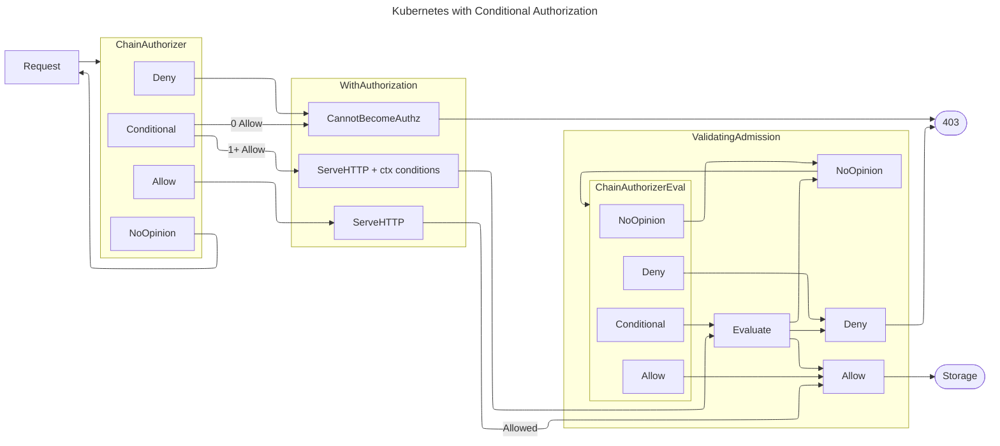

# Mermaid source for authorizer-chain-computation image

This diagram was rendered on https://www.mermaidchart.com/play, not using the
native GitHub mermaid renderer so that the image was more visually clear.
Mermaid layout configs are not respected by GitHub.

<!-- toc -->
<!-- /toc -->

