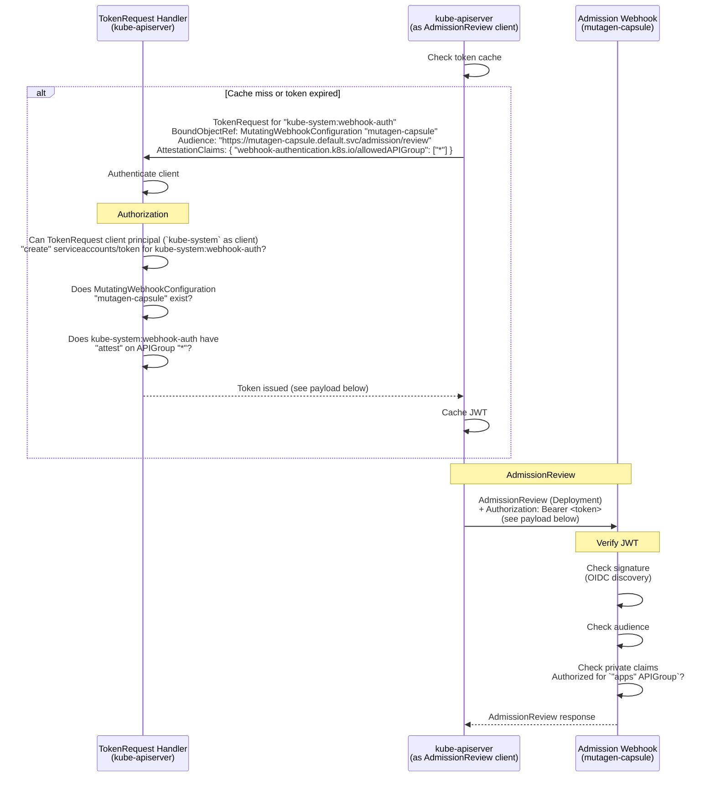
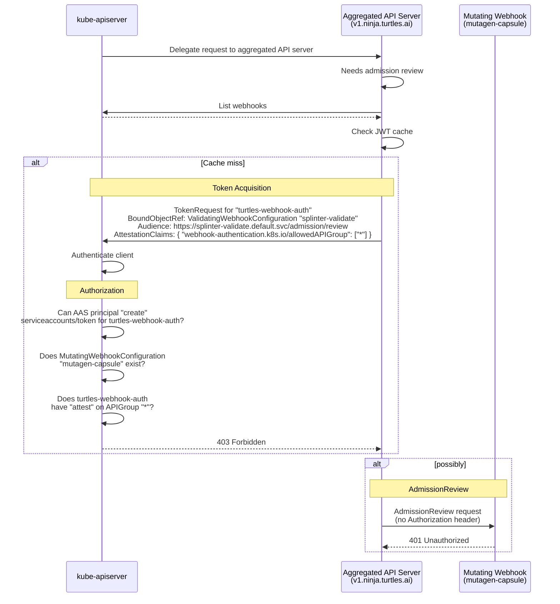
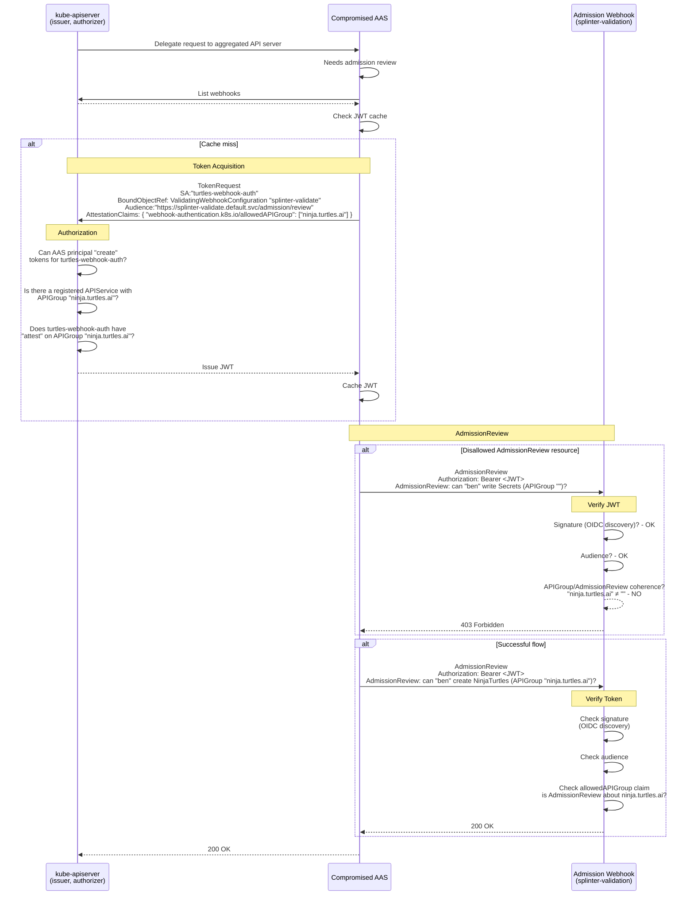

# KEP-6060: API Server Authentication to Admission Webhooks

<!-- toc -->
- [Release Signoff Checklist](#release-signoff-checklist)
- [Summary](#summary)
- [Motivation](#motivation)
  - [Goals](#goals)
  - [Non-Goals](#non-goals)
- [Terms](#terms)
  - [Token](#token)
  - [Token Acquisition Service Account](#token-acquisition-service-account)
  - [Webhook Authentication Client](#webhook-authentication-client)
  - [Aggregated API Servers and <code>kube-apiserver</code>](#aggregated-api-servers-and-kube-apiserver)
- [Proposal](#proposal)
  - [Sequence Diagrams](#sequence-diagrams)
    - [Flow 1: <code>kube-apiserver</code> as Webhook Client](#flow-1-kube-apiserver-as-webhook-client)
      - [JWT payload](#jwt-payload)
    - [Flow 2: <code>kube-apiserver</code> denies a suspicious request](#flow-2-kube-apiserver-denies-a-suspicious-request)
    - [Flow 3: Aggregated API Server denied/accepted by webhook](#flow-3-aggregated-api-server-deniedaccepted-by-webhook)
      - [JWT payload (both requests)](#jwt-payload-both-requests)
  - [Risks and Mitigations](#risks-and-mitigations)
    - [Broad access to webhooks](#broad-access-to-webhooks)
    - [Token replay across webhooks](#token-replay-across-webhooks)
    - [Token replay across API groups](#token-replay-across-api-groups)
    - [Service account compromise](#service-account-compromise)
    - [Increased authorization load](#increased-authorization-load)
    - [Potential Deadlock](#potential-deadlock)
- [Design Details](#design-details)
  - [Changes to <code>TokenRequest</code> API](#changes-to-tokenrequest-api)
    - [Changes to <code>TokenRequestSpec</code>](#changes-to-tokenrequestspec)
    - [Changes to <code>TokenRequest</code> handler](#changes-to-tokenrequest-handler)
    - [Added claim: <code>&quot;webhook-authentication.k8s.io/allowedAPIGroup&quot;</code>](#added-claim-webhook-authenticationk8sioallowedapigroup)
  - [Token Acquisition (from the client perspective)](#token-acquisition-from-the-client-perspective)
    - [All webhook authentication clients:](#all-webhook-authentication-clients)
    - [<code>kube-apiserver</code>:](#kube-apiserver)
      - [Dedicated service account for token acquisition](#dedicated-service-account-for-token-acquisition)
      - [Other details](#other-details)
    - [Aggregated API Servers:](#aggregated-api-servers)
  - [Authorization Checks](#authorization-checks)
    - [RBAC Example](#rbac-example)
    - [Synthetic resource for authorization checks](#synthetic-resource-for-authorization-checks)
    - [Recommendations for permissions](#recommendations-for-permissions)
  - [New types of BoundObjectRef](#new-types-of-boundobjectref)
  - [Audience](#audience)
  - [New JWT Private Claims](#new-jwt-private-claims)
  - [Token Verification](#token-verification)
  - [Token Review](#token-review)
  - [Token Caching and Rotation](#token-caching-and-rotation)
  - [Test Plan](#test-plan)
      - [Prerequisite testing updates](#prerequisite-testing-updates)
      - [Unit tests](#unit-tests)
      - [Integration tests](#integration-tests)
      - [e2e tests](#e2e-tests)
  - [Graduation Criteria](#graduation-criteria)
    - [Alpha](#alpha)
    - [Beta](#beta)
    - [GA](#ga)
  - [Upgrade / Downgrade Strategy](#upgrade--downgrade-strategy)
  - [Version Skew Strategy](#version-skew-strategy)
- [Production Readiness Review Questionnaire](#production-readiness-review-questionnaire)
  - [Feature Enablement and Rollback](#feature-enablement-and-rollback)
  - [Rollout, Upgrade and Rollback Planning](#rollout-upgrade-and-rollback-planning)
  - [Monitoring Requirements](#monitoring-requirements)
  - [Dependencies](#dependencies)
  - [Scalability](#scalability)
  - [Troubleshooting](#troubleshooting)
- [Implementation History](#implementation-history)
- [Drawbacks](#drawbacks)
- [Alternatives](#alternatives)
  - [<code>APIService</code> as <code>BoundObjectRef</code>](#apiservice-as-boundobjectref)
  - [Client Certificates (mTLS)](#client-certificates-mtls)
  - [Designated ServiceAccount (&quot;Magic SA&quot;)](#designated-serviceaccount-magic-sa)
  - [ServiceAccount Token with Identity in Private Claims](#serviceaccount-token-with-identity-in-private-claims)
  - [AdmissionReview Delegation](#admissionreview-delegation)
<!-- /toc -->

## Release Signoff Checklist

Items marked with (R) are required *prior to targeting to a milestone / release*.

- [x] (R) Enhancement issue in release milestone, which links to KEP dir in [kubernetes/enhancements] (not the initial KEP PR)
- [x] (R) KEP approvers have approved the KEP status as `implementable`
- [x] (R) Design details are appropriately documented
- [x] (R) Test plan is in place, giving consideration to SIG Architecture and SIG Testing input (including test refactors)
  - [ ] e2e Tests for all Beta API Operations (endpoints)
  - [ ] (R) Ensure GA e2e tests meet requirements for [Conformance Tests](https://github.com/kubernetes/community/blob/master/contributors/devel/sig-architecture/conformance-tests.md)
  - [ ] (R) Minimum Two Week Window for GA e2e tests to prove flake free
- [ x (R) Graduation criteria is in place
  - [ ] (R) [all GA Endpoints](https://github.com/kubernetes/community/pull/1806) must be hit by [Conformance Tests](https://github.com/kubernetes/community/blob/master/contributors/devel/sig-architecture/conformance-tests.md) within one minor version of promotion to GA
- [x] (R) Production readiness review completed
- [x] (R) Production readiness review approved
- [x] "Implementation History" section is up-to-date for milestone
- [ ] User-facing documentation has been created in [kubernetes/website], for publication to [kubernetes.io]
- [ ] Supporting documentation---e.g., additional design documents, links to mailing list discussions/SIG meetings, relevant PRs/issues, release notes

[kubernetes.io]: https://kubernetes.io/
[kubernetes/enhancements]: https://git.k8s.io/enhancements
[kubernetes/kubernetes]: https://git.k8s.io/kubernetes
[kubernetes/website]: https://git.k8s.io/website

## Summary

Today, `kube-apiserver` does not authenticate itself to admission
webhooks by default. Any entity with service network access can
send requests to a webhook endpoint and impersonate `kube-apiserver`.
[CVE-2025-1974](https://nvd.nist.gov/vuln/detail/CVE-2025-1974) demonstrated
real-world consequences of this class of vulnerability.

The introduction of the capability to authenticate API Servers
consists of three main additions. First, [webhook authentication
clients](#webhook-authentication-client) will be updated to request a service
account token from `kube-apiserver`, and to present the credential to the
admission webhook. Second, `kube-apiserver` will be updated to dispense
those tokens to authenticated and authorized principals. Third, a token
verification library will be introduced for use by webhook maintainers.

This KEP augments the `TokenRequest` API to allow for the client to request
claims in the JWT token to which `kube-apiserver` attests. In addition, tokens
intended for admission webhooks will be bound to an webhook configuration
object (either validating or mutating). The specifics of these changes are
discussed in detail in the [design details](#design-details) section.

A list of [terms](#terms) is provided below for disambiguation, and to
prevent awkward sentence constructions.

## Motivation

Any entity with service network access can send requests to an admission webhook
endpoint. If the webhook does not authenticate the caller, an attacker can
probe for policy information, trigger unintended side effects, or exploit
the webhook's own privileges within the cluster.

Opt-in mechanisms for authenticating the kube-apiserver to webhooks exist
(client certs, bearer tokens, or basic auth via a kubeconfig file configured
through `--admission-control-config-file`), but they require manual credential
management and an API server restart to change. That opt-in mechanism is
unopinionated as to the method of authentication (mTLS / token / basic auth),
creating a large burden on webhook maintainers to support verification of
client identity by all three methods. The burden is greatest
when the actor setting up the API Server (or aggregated API server) and the
actor setting up the webhook are not the same, as is usually the case with
"off-the-shelf", community OSS webhooks.

There are existing out-of tree solutions, such as
[generic-admission-server](https://github.com/openshift/generic-admission-server).
However, they require manual setup. This KEP posits that an
 opinionated, on-by-default solution is needed to reduce the friction
to adoption. It is designed to make it possible to transition in phases. First,
[webhook authentication client](#webhook-authentication-client) libraries are
configured to use them by default (except in cases where it would break an
existing authentication setup). At this stage, webhooks may not yet have been
updated to verify the tokens. Webhooks can instead silently ignore them. In
the second phase, once credential issuance is GA and webhook maintainers can
reasonably expect a credential to be present, webhook maintainers can use
the provided library to opt-in to token verification. Over time, we expect
this to make the landscape as a whole more secure.

In addition to `kube-apiserver`, aggregated API servers often need to contact
webhooks. Yet, they should should not have broad access to ask arbitrary
questions. A design is needed to make it easy for aggregated API servers to
query webhooks about resources it controls, but which prevents a malicious
or compromised aggregated API server from requesting policy information
about resources it does not control.

The scope of this KEP is limited to authenticating to admission webhooks.
Authentication webhooks, authorization webhooks, and audit webhooks do not
share the same practical barriers to authentication experienced by admission
webhooks. Those webhooks are not dynamically deployed at runtime, and don't
have the same logistical barriers as admission webhooks: the actor setting
up `kube-apiserver` and the actor setting up the webhook are the same in the
vast majority of cases. Therefore, it is much more reasonable to expect that
such an actor would use the already available solution: they are in control
of both the method of authentication used by the client and the verification
methods used by the webhook. This leaves a slight gap for audit webhooks,
requiring that all deployed aggregated API servers that communicate with these
webhooks must also have access to the necessary credentials. To close this gap,
aggregated API servers can deploy their own audit webhook. `TokenReview` and
`SubjectAccessReview` make this a non-issue for everything but audit webhooks.

Conversion webhooks are likewise out of scope because they pertain to CRDs,
which will be handled exclusively by `kube-apiserver` and do not share the
same set of complications caused by allowing access from aggregated API servers.

Credentials issued for authentication to webhooks must be reviewable by
`kube-apiserver`, but webhooks should be able to verify them independently. No
API calls should be required of webhooks to verify tokens.

### Goals

* `kube-apiserver` authenticates itself to admission webhooks by default,
  without requiring manual credential configuration.
* Aggregated API servers can authenticate themselves to admission webhooks
  using the same mechanism.
* Minimal manual setup involved, both for webhook maintainers and cluster
  administrators. The KEP authors believe firmly that friction prevents
  adoption.
* The default behavior of webhook authentication clients is to procure a
  token and provide it to webhooks.
* The design does not break webhooks that have not yet adopted token
  verification.
* `kube-apiserver` authorizes webhook authentication clients at token issuance,
  and will refuse to provide a token to unauthorized principals.
* Setting up the requisite permissions for token acquisition should be simple
  and easy.
* The token is scoped to a subset of resources about which its bearer may
  contact the webhook.
* Tokens may alternatively be scoped per-webhook (by audience).
* The design is backward compatible: existing kubeconfig-based webhook
  authentication setups continue to work without modification.
* Defining the webhook-side verification go library.
* Supporting both `client-go` and `controller-runtime`.
* Tokens must be reviewable by `TokenReview`, although the webhook
  library **WILL NOT** use `TokenReview` by default to avoid unnecessary
  round trips.

### Non-Goals

* Authentication to non-admission webhooks (authentication webhooks,
  authorization webhooks, audit webhooks).
* Requiring `kube-apiserver` to cache and refresh massive numbers of
  narrowly-scoped tokens.
* Requiring webhooks to perform `TokenReview` or `SubjectAccessReview`
  requests to `kube-apiserver`.
* Permitting aggregated API servers to have broad access to webhooks.

## Terms

### Token
Unless otherwise indicted, the term **token** will be used to exclusively
refer to service account tokens with two qualities: a webhook binding and
a claim indicating which `APIGroup`s the token's bearer may inquire about.
When discussing any other token, or service account tokens without both of these
two qualities, they will be clearly distinguished by the surrounding context.

### Token Acquisition Service Account
The service account named in tokens for webhook authentication will be termed
the **Token Acquisition Service Account**. This is distinct from the identity
that the principal requesting the token uses to authenticate itself to the
Kubernetes API Server (which may or may not be a service account). The Token
Acquisition Service Account must have `attest` permissions on the `APIGroup`
named in the `TokenRequest`.

### Webhook Authentication Client
Because both `kube-apiserver` and aggregated API servers will attempt
to authenticate to webhooks, the term **webhook authentication client**
will be used as a throughout this document as a generic term to refer to
both types of client when distinguishing between them is not important. The
overall flow for both `kube-apiserver` and aggregated API servers is mostly
the same, but with a few subtle differences.

### Aggregated API Servers and `kube-apiserver`
When referring specifically to the Kubernetes API Server, the
terms **`kube-apiserver`** and **Kubernetes API Server** will be used
interchangeably. When referring specifically to an **Aggregated API Server**,
the full term will always be used.

## Proposal

[Webhook authentication clients](#webhook-authentication-client) may request
service account tokens with a narrow scope, indicating to the webhook that
it is only valid for its audience and for `AdmissionReview` requests about
resources with a particular `APIGroup`. Because the number of per-webhook,
per-`APIGroup` tokens can quickly get out of hand for `kube-apiserver`, tokens
may alternatively be requested that are valid per-webhook, but which authorize
the bearer to ask questions about **any resource**. Because the authorization
scope of such tokens is larger, broader permissions are required to obtain
them. Tokens that authorize the bearer to make `AdmissionReview` requests about
**any resource** are intended for use only with `kube-apiserver`, although
there is no enforcement of this recommendation. Tokens restricted by `APIGroup`
are intended for use by aggregated API Servers to prevent giving them more
access than is needed. A fuller description of the permission model for token
acquisition is described in the [design details](#authorization-checks) section.

The `TokenRequest` API will be expanded to accommodate the scoping of
service account tokens to a particular usage. A brief description of
those expansions is in order. To obtain a [token](#token), the webhook
authentication client will make a `TokenRequest` on a service account. For a
client to obtain a token, it must meet four conditions. First, it must request
claims indicating which `APIGroups` it intends to query the webhook about;
these claims must be coherent with the resources the webhook expects. Further
details are described in the [design details](#changes-to-tokenrequestspec)
section. Second, it must specify either a `ValidatingWebhookConfiguration`
or a `MutatingWebhookConfiguration` as the `BoundObjectRef`. Third, it must
specify an audience that is coherent for that `*WebhookConfiguration`. The
exact specification of the derivation of the audience is deferred until
implementation time, and is at the moment subject to change. Fourth and
finally, the `ServiceAccount` for which the `TokenRequest` is being made
must have sufficient permission to obtain the token. This is accomplished by
means of a synthetic authorization check at token issuance, and is described
in greater detail in the [design details](#authorization-checks) section.

When the `TokenRequest` caller wants a token authorizing the bearer to inquire
about resources in any `APIGroup`, it will request that `kube-apiserver` attest
to a claim on the `"*" APIGroup`. This requires that the token acquisition
service account have broader permissions, described further in the [design
details](#authorization-checks) section.

This broad permission should only be granted to `kube-apiserver`, and its use by
principals representing aggregated API servers is strongly discouraged. Instead,
aggregated API servers should request that `kube-apiserver` attest to the
`APIGroup` corresponding to the server's `APIService`(s) (there may be multiple
`APIService`s to express multiple `APIVersion`s of a single `APIGroup`). This
indicates to the webhook that it should deny `AdmissionReview` requests
that do not pertain to objects within that `APIGroup`. This is recommended
to prevent a potentially malicious aggregated API server from exposing a
webhook's policy information or compromising it in some other way.

The `TokenRequest` handler will be updated to accommodate the new kinds
of bound object. When one of them is used, it will trigger additional
authorization checks (described [below](#authorization-checks)), and checks
on the existence of the bound objects. Likewise, it will be augmented to
perform authorization checks on the permissions of the service account for
which the token is requested.

Webhook libraries will be updated to optionally (and eventually always)
require a bearer token. The webhook then verifies these tokens by taking
the following steps:

1. Verify the token's signature via the OIDC discovery endpoint.
1. Verify that the token's audience matches the expected audience. This audience
   is derived deterministically from the webhook configuration. Several
   alternatives have been discussed including the url, but the tradeoffs
   are still being evaluated.
1. Verify that the resource named in the `AdmissionReview` request body is
   a member of the `APIGroup`(s) named in the private claims. The `*`
   `APIGroup` is a superset of all `APIGroup`s. When the `APIGroup` is `*`,
   this check will always succeed.

### Sequence Diagrams

The following examples (with diagrams) illustrate the flows for token
request, k8s authorization, issuance, and webhook authentication. There
are two successful flows and one flow that fails at the time of webhook
token verification.

#### Flow 1: `kube-apiserver` as Webhook Client

In this example, a user attempts to create a deployment named
"ninja-turtles" (user request omitted from diagram). This requires
review by the mutating admission webhook "mutagen-capsule". In order to
authenticate itself to the webhook, `kube-apisever` makes a `TokenRequest`
for its dedicated service account `kube-system:webhook-auth`, bound to
the `MutatingWebhookConfiguration` for the "mutagen-capsule" webhook. Note
that the name for this dedicated service account remains an open question
([details](#dedicated-service-account-for-token-acquisition)). It requests the
`"*" APIGroup`, rather than the `"apps" APIGroup`, to avoid the burden of
maintaining too many tokens, and because `kube-apiserver` is a privileged
actor. The `kube-system:webhook-auth` service account has `"attest"`
permissions on the synthetic `APIGroup` resource with the `"*"` name.



##### JWT payload
```json
{
  "sub": "system:sercviceaccount:kube-system:webhook-auth",
  "aud": "https://mutagen-capsule.default.svc/admission/review",
  <...>
  "kubernetes.io": {
      "mutatingWebhookConfiguration": {
          "name": "mutagen-capsule",
          "uid": "<uid>"
      },
    "attestationClaims": {
        "webhook-authentication.k8s.io/allowedAPIGroup": ["*"]
    }
  }
}
```

#### Flow 2: `kube-apiserver` denies a suspicious request

In this example, a compromised aggregated API server attempts to probe
a validating webhook, "splinter-validate", for policy information. It
wants to spam the webhook with `AdmissionReview` requests in an attempt
to find principals that can write `Secret`s. To do so, it requests a JWT
bound to the "splinter-validate" `ValidatingWebhookConfiguration`,
requesting that `kube-apiserver` attest to the claim
`{"webhook-authentication.k8s.io/allowedAPIGroup": ["*"]}`.



#### Flow 3: Aggregated API Server denied/accepted by webhook

In this example, an untrusted aggregated API server attempts to make an
`AdmissionReview` request to the validating webhook, "splinter-validate". It
makes two requests about two different resources; it makes these requests
with the same token, which is bound to the `ValidatingWebhookConfiguration`
for that webhook.  In the first request, which is denied, it makes an
`AdmissionReview` request about `Secret`s in the `"" APIGroup` (i.e. no
API group). In the second request, which is successful, it is asking about
`NinjaTurtle`s in the `"ninja.turtles.ai" APIGroup`.



##### JWT payload (both requests)
```json
{
  "sub": "system:serviceaccount:turtles:turtles-webhook-auth",
  "aud": "https://splinter-validate.default.svc/admission/review",
  <...>
  "kubernetes.io": {
      "validatingWebhookConfiguration": {
          "name": "splinter-validate",
          "uid": "<uid>"
      },
      "attestationClaims": {
          "webhook-authentication.k8s.io/allowedAPIGroup": ["ninja.turtles.ai"]
      }
  }
}
```


### Risks and Mitigations

#### Broad access to webhooks
This is, unfortunately, the reality of most admission webhooks deployed today.
This KEP addresses this by requiring explicit permission on a service account
to create tokens for use in authenticating to webhooks. Therefore, only
specially authorized service accounts may create webhook authentication tokens.

#### Token replay across webhooks

A JWT obtained for one webhook could be presented to another webhook if they
serve overlapping resources. The per-webhook audience scoping prevents this:
each token is only valid for the specific webhook audience for which it
was minted.

#### Token replay across API groups

A token with claims to one `APIGroup` could be presented when admitting
a resource from a different API group. The webhook's verification of the
`APIGroup` claims against the `AdmissionReview` body prevents this: the
groups must match.

#### Service account compromise

If a service account is compromised, an attacker could request tokens and
impersonate an aggregated API server to webhooks. The dedicated-SA-per-server
model limits the impact of such a compromise. The `attest` permission,
properly applied to only the resources controlled by the aggregated API
server, prevents the service account from even obtaining a token for other uses.

#### Increased authorization load

Each request triggers an additional authorization check (the `attest`
verification). This is mitigated by caching: tokens are cached for their
lifetime, so the authorization check is amortized over many webhook calls.

#### Potential Deadlock

If an admission webhook is configured to intercept `TokenRequest`s, **and**
the webhook requires an authentication token, there will be a deadlock with
no way to proceed. In this case, we accept the deadlock until the webhook
configuration is fixed.

## Design Details

### Changes to `TokenRequest` API

#### Changes to `TokenRequestSpec`

`TokenRequestSpec` will be augmented to allow for the specification of
`AttestationClaims`, with a type of `map[string][]string`. This is modeled
after the `UserInfo.Extra` field, which has served well for its purpose and
proven flexible.

The keys to this map represent the names of claims to which the client wishes
`kube-apiserver` to attest. The values represent the specifics of the claim. The
keys will be well-known. Arbitrary keys may not be used. Keys not recognized
by `kube-apiserver` will result in a rejection of the `TokenRequest`. The
addition of keys recognized by `kube-apiserver` will be subject to API review.
The meaning of the value or values will be well-defined. The same value
may change meaning when it corresponds to a different key, but the meaning
within the purview of each key (claim name) must be well-defined.

```go
// TokenRequestSpec contains client provided parameters of a token request.
type TokenRequestSpec struct {
    // NOTE: Newly added: AttestationClaims (described above)
    AttestationClaims map[string][]string

	// Audiences are the intended audiences of the token. A recipient of a
	// token must identify themself with an identifier in the list of
	// audiences of the token, and otherwise should reject the token. A
	// token issued for multiple audiences may be used to authenticate
	// against any of the audiences listed but implies a high degree of
	// trust between the target audiences.
	Audiences []string

	// ExpirationSeconds is the requested duration of validity of the request. The
	// token issuer may return a token with a different validity duration so a
	// client needs to check the 'expiration' field in a response.
	ExpirationSeconds int64

	// BoundObjectRef is a reference to an object that the token will be bound to.
	// The token will only be valid for as long as the bound object exists.
	// NOTE: The API server's TokenReview endpoint will validate the
	// BoundObjectRef, but other audiences may not. Keep ExpirationSeconds
	// small if you want prompt revocation.
	BoundObjectRef *BoundObjectReference
}
```

#### Changes to `TokenRequest` handler

In addition, the handler for `TokenRequest` will be updated to recognize
`ValidatingWebhookConfiguration` and `MutatingWebhookConfiguration`
as valid `BoundObjectRef`s. When one of these bindings is used, the
`"webhook-authentication.k8s.io/allowedAPIGroup" AttestationClaim` **must**
be provided. To fail to do so is considered an error and the request will
be rejected.

The handler will be updated to perform authorization checks to ensure the
service account for which the `TokenRequest` is made has the requisite
permissions. These checks are described in detail in another section below.

#### Added claim: `"webhook-authentication.k8s.io/allowedAPIGroup"`

The first valid key (claim name) for the `AttestationClaims` field will
be a claim named `"webhook-authentication.k8s.io/allowedAPIGroup"`. It is
intended that only one `APIGroup` be specified. In other words, the value
must be a string slice of length 1; else, the request will be considered
improperly formed.

The special wildcard value `"*"` is recognized here to mean the token will be
valid for **all `APIGroup`s**. Any other value represents a single `APIGroup`
for which the resulting token will be valid. When the value is the empty
string, `""`, it is understood to mean "no `APIGroup`" (as is the case for
the `"v1."` local `APIService`). This is understood to be distinct from a nil
map, empty map, or empty slice; all of those are considered invalid when the
`BoundObjectRef` is a webhook configuration object.

Claims are subject to authorization checks on the service account for
which the `TokenRequest` is made. These are described in detail in a [later
section](#authorization-checks).

### Token Acquisition (from the client perspective)

#### All webhook authentication clients:

When a [webhook authentication client](#webhook-authentication-client) needs
to call an admission webhook about a given resource, it issues a `TokenRequest`
for its [token acquisition service account](#token-acquisition-service-account)
to the Kubernetes API Server. The request includes:

1. A `BoundObjectRef` pointing to either a `ValidatingWebhookConfiguration`
   or `MutatingWebhookConfiguration` object.
1. The name of a [token acquisition service
   account](#token-acquisition-service-account) with `attest` permission on
   the `APIGroup` named in the required corresponding `AttestationClaim`.
1. An audience derived from the webhook's url.
1. An `AttestationClaim` with the key `"webhook-authentication.k8s.io/allowedAPIGroup"`,
   and a value indicating which `APIGroup`s the resulting token should authorize
   its bearer to ask webhooks about.

#### `kube-apiserver`:

##### Dedicated service account for token acquisition
In the case of `kube-apiserver`, the [token acquisition service
account](#token-acqcuisition-service-account) will be a service account
with a well-known name, `kube-system:webhook-auth`, which is automatically
created in the bootstrapping process, and automatically recreated on deletion.
Note that the name of this service account, and whether it may be used in
the future to identify `kube-apiserver` in other ways, remains an open question.

##### Other details
When `kube-apiserver` needs to call an admission webhook, it will be
doing so for a resource (or custom resource) it serves directly. The
`BoundObjectRef` in the `TokenRequest` must be the one corresponding to the
`ValidatingWebhookConfiguration` or `MutatingWebhookConfiguration` of the
webhook it seeks to consult. The audience must be coherent with the bound
object.  Because this is `kube-apiserver`, this request is a request for a token
is valid for **a specific webhook** but for **all `APIGroup`s**. As such,
it should make the claim `"webhook-authentication.k8s.io/allowedAPIGroup":
["*"]`.

The requester will only receive the JWT token when the authorization checks
(described below) succeed. When the principal is `kube-apiserver`, this
will always succeed unless the request happens to occur after the deletion
of its service account but before it can be recreated.

#### Aggregated API Servers:
When an aggregated API server needs to call an admission webhook, it requests
a service account token from the Kubernetes API Server. Each aggregated API
server should have a dedicated service account for this purpose, as it will
be part of the resource path for the token request. The request flow for
aggregated API servers is:

1. The aggregated API server authenticates to `kube-apiserver` using
   whatever credential it is configured with (which may or may not be a service
   account). That principal must be authorized to `create serviceaccount/token`
   in the relevant namespace, with the appropriate resource name (i.e. that
   of the token acquisition service account).
1. It sends a `TokenRequest` for its dedicated service account, with all of the following:
     a. A `BoundObjectRef` pointing to the `ValidatingWebhookConfiguration` or
   `MutatingWebhookConfiguration` for the webhook it wishes to contact.
     a. An audience coherent with the webhook's configuration.
     a. The `"webhook-authentication.k8s.io/allowedAPIGroup" AttestationClaim`
        with a value of length 1, containing as its first and only
        element the name of the `APIGroup` containing the resource that
        the `AdmissionReview` request is about. (In normal circumstances,
        this should match the `APIGroup` field of an `APIService` object
        corresponding to this aggregated API server).
1. `kube-apiserver` performs authorization checks (described in a later
   section) and issues the service account token.
1. The aggregated API server presents the token to the webhook in its
   `Authorization` header.

The token will be received only when the authorization checks succeed. These
are described in the next section.

We expect each aggregated API server to have its own dedicated service
account for obtaining tokens it will use to authenticate to webhooks. Reuse
of these service accounts across multiple aggregated API servers is strongly
discouraged.  Reuse of `kube-apiserver`'s service account by aggregated API
servers is not only discouraged; it is furthermore condemned.

### Authorization Checks

When `kube-apiserver` receives a `TokenRequest` with one of the [webhook
authentication bound object types](#webhook-authentication-bound-object-types)
as the `BoundObjectRef`, it performs the following checks:

1. Does the principal making the `TokenRequest` have `create` on
   `serviceaccounts/token` for the service account named in the request?
1. Does the bound object (which may be a `ValidatingWebhookConfiguration`
   or a `MutatingWebhookConfiguration`) actually exist? If not, the request
   is rejected.
1. Are the required claims present, and are they well-formed? (with fast
   failure):
     a. Is there a `"webhook-authentication.k8s.io/allowedAPIGroup"
        AttestationClaim`?
     a. Does the claim's value have length 1?
     a. If the first and only element of the claim's value is not `"*"`, is
        there at least one existing, non-deleted `APIService` with an
        `APIGroup` field that matches this value?
1. Does the service account for which the `TokenRequest` was made have
   `"attest"` permissions on the synthetic resource
   `"webhook-authentication.k8.io/apigroup"` with name exactly equal to the
   value of the `"webhook-authentication.k8s.io/allowedAPIGroup"` claim?

To prevent cluster state from leaking, error messages should not expose any
information about the existence or nonexistence of objects in the cluster.

The authorization checks are performed via an `authorizer.Authorize()` call
against the token acquisition service account's identity. An authorizer will
be added to perform these checks.

#### RBAC Example

To illustrate the permission model, the following RBAC configurations are
given as an example.

```yaml
# Role permitting an identity to create tokens for its dedicated service
# account.
apiVersion: rbac.authorization.k8s.io/v1
kind: Role
metadata:
  name: let-me-create-webhook-authentication-tokens
rules:
  - apiGroups: [""]
    resources: ["serviceaccount/token"]
    resourceNames: ["webhook-token-acquisition-service-account"]
    verbs: ["create"]

---

# The aggregated API server or `kube-apiserver`'s identity is bound to the
# above role, giving it access to make `TokenRequest`s for its dedicated
# service account.
kind: RoleBinding
metadata:
  name: binding-to-let-you-create-serviceaccount-tokens
  namespace: in-the-relevant-namespace
subjects:
  - name: principal-requesting-a-token
    apiGroup: rbac.authorization.k8s.io
    kind: # Could be any of ServiceAccount | User | Group
roleRef:
  kind: Role
  name: let-me-create-webhook-authentication-tokens
  apiGroup: rbac.authorization.k8s.io

---

# ClusterRole permitting an identity to obtain tokens valid for a single
# specific APIGroup
apiVersion: rbac.authorization.k8s.io/v1
kind: ClusterRole
metadata:
  name: let-the-webhook-token-acquisition-service-account-request-tokens-bound-to-an-api-service
rules:
  - apiGroups: ["webhook-authentication.k8s.io"]
    resources: ["apigroups"]
    resourceNames: ["jungle.panda"]
    verbs: ["attest"]

---

# Binding granting the token acquisition service account the permissions of
# the above ClusterRole
apiVersion: rbac.authorization.k8s.io/v1
kind: ClusterRoleBinding
metadata:
  name: cluster-binding-to-let-you-get-webhook-authentication-tokens
subjects:
  - kind: ServiceAccount
    name: webhook-token-acquisition-service-account
    namespace: in-the-relevant-namespace
    apiGroup: rbac.authorization.k8s.io
roleRef:
  kind: ClusterRole
  name: let-the-webhook-token-acquisition-service-account-request-tokens-bound-to-an-api-service
  apiGroup: rbac.authorization.k8s.io
```

#### Synthetic resource for authorization checks

When a requester makes a `TokenRequest` bound to one of the
`WebhookConfiguration` types, the service account for which the
token is requested must have `"attest"` on the synthetic resource
`"webhook-authentication.k8s.io/apigroups"` with a name that matches exactly
the value of the `"webhook-authentication.k8s.io/allowedAPIGroup"` claim in
the request.

#### Recommendations for permissions
The KEP authors recommend that **only `kube-apiserver`'s
service account** should be granted `"attest"` on the `"*"`
`"webhook-authentication.k8s.io/apigroups"`. Aggregated API servers should
instead be granted `"attest"` on only those `APIGroups`s over which they
have control.

### New types of BoundObjectRef

The `TokenRequest` API's `BoundObjectRef` is extended to accept
`ValidatingWebhookConfiguration`, and `MutatingWebhookConfiguration` as
valid object reference kinds. The token becomes invalid if the referenced
`*WebhookConfiguration` is deleted. The presence of these bound objects
triggers authorization checks, described above. Also required is a claim
with name `"webhook-authentication.k8s.io/allowedAPIGroup"`.

### Audience

The token's audience is derived from the webhook configuration. Client and
`kube-apiserver` will perform the same derivation, and both will derive the
same value. The exact format of the value has not yet been determined and
various alternatives are being weighed.

The webhook verifies that the token's `aud` claim matches its configured
identity before accepting the request.

### New JWT Private Claims

Tokens intended for authenticating to webhooks include the
following new fields in the `kubernetes.io` private claims of the
JWT. `"{mutating,validating}WebhookConfiguration"` are typical bound
objects. The newly-added attestation claims described above are nested as a
`map[string][]string` under `"attestationClaims"`:

```json
{
  "kubernetes.io": {
    "mutatingWebhookConfiguration": {
      "name": "mutagen-capsule",
      "uid": "44e818f2-2ad0-4432-9816-3a649ca9945c"
    },
    "attestationClaims": {
        "webhook-authentication.k8s.io/allowedAPIGroup": ["jungle.panda"]
    }
  }
}
```

or

```json
{
  "kubernetes.io": {
    "validatingWebhookConfiguration": {
      "name": "splinter-validate",
      "uid": "b0f1b456-6f90-4546-b72c-d9000e5dead1"
    },
    "attestationClaims": {
        "webhook-authentication.k8s.io/allowedAPIGroup": ["jungle.panda"]
    }
  }
}
```

Where the `mutatingWebhookConfiguration` or `validatingWebhookConfiguration`
does not match the type of webhook receiving the token, the request may
be rejected.

### Token Verification

The webhook may verify these tokens by taking the following steps:

1. Verify the token's signature via the OIDC discovery endpoint.
1. Verify that the token's audience matches the expected audience. This audience
   is derived deterministically from the webhook's configuration.
1. Verify that the JWT is bound to either a `ValidatingWebhookConfiguration`
   or a `MutatingWebhookConfiguration`, but not both.
1. Verify that the value of the
   `"webhook-authentication.k8s.io/allowedAPIGroup"` attestation claim is either:
     a. An exact match for the `APIGroup` of the resource in the
        `AdmissionReview` request, or
     a. The exact string `"*"`.

### Token Review

The webhook library will be designed in such a way that does not perform
`TokenReview`. Nevertheless, it must be possible for bearers or receivers
of these specialized service account tokens to perform token validation via
`TokenReview`. Therefore, object-existence checks will need to be added for
the cases when the private claims contain a `"mutatingWebhookConfiguration"`
or `"validatingWebhookConfiguration"` field.

`TokenReview` will also validate the existence of at least one `APIService`
whose `APIGroup` field matches exactly the value corresponding to the
`"webhook-authentication.k8s.io/allowedAPIGroup"` key in the JWT's
`"attestationClaims"` private claim.

### Token Caching and Rotation

Service account tokens for authentication to webhooks are cached per
combination of webhook and `APIGroup`. When a cached token has expired, the
next webhook call for that combination triggers a new `TokenRequest`. Tokens
will expire after 10 minutes. Anything less is considered a validation error,
and anything more will be silently shortened to 10 minutes.

### Test Plan

[x] I/we understand the owners of the involved components may require updates
to existing tests to make this code solid enough prior to committing the
changes necessary to implement this enhancement.

##### Prerequisite testing updates

None identified at this time.

##### Unit tests

Unit tests will cover:

- `TokenRequest` with `AttestationClaims` field issues correct private claims.
- The `attest` authorization check is performed and enforced.
- `TokenRequest` validation is performed with `BoundObjectRef`s pointing to
  `ValidatingWebhookConfiguration` or `MutatingWebhookConfiguration`.
- The webhook dispatch path attaches the token as a bearer token when the
  feature gate is enabled.
- The webhook dispatch path does not attach a token when the feature gate
  is disabled.

##### Integration tests

- Token issuance and webhook dispatch end-to-end with a test webhook that
  verifies token claims.
- Rejection when the SA lacks `attest` permission.
- Rejection when the `APIService` for an `APIGroup` does not exist.
- Cache behavior: verify that a cached token is reused and that a new token
  is requested on expiry.
- Feature gate toggling: verify behavior with the gate on and off.
- A webhook rejects a request where the bound object does not match the webhook type.

##### e2e tests

- An aggregated API server authenticates to an admission webhook using a
  JWT bound to each of the three new types.
- A webhook rejects a request where the `APIGroup` claims do not match the
  resource in the `AdmissionReview` body.

### Graduation Criteria

#### Alpha

- Feature implemented behind feature gates.
- Webhook verification library.
- Webhook token issuance and webhook presentation functional for `kube-apiserver`.
- Webhook issuance and webhook presentation functional for aggregated API
  servers.
- Initial unit and integration tests completed and enabled.

#### Beta

- All unit, integration, and e2e tests passing and stable.
- Feedback from early adopters incorporated.
- All known issues and gaps resolved.

#### GA

- At least two releases since beta with no regressions.
- Conformance tests added.

### Upgrade / Downgrade Strategy

On upgrade to a version that enables the feature:

- `kube-apiserver` begins presenting bearer tokens to admission
  webhooks. Webhooks that do not verify bearer tokens are unaffected, since the
  token is presented as an `Authorization` header that the webhook can ignore.
- Existing kubeconfig-based authentication setups continue to function.

On downgrade or feature disablement:

- `kube-apiserver` stops presenting bearer tokens. Webhooks that have been
  configured to require token verification will reject requests. Operators
  must either re-enable the feature or reconfigure their webhooks.

### Version Skew Strategy

This feature does not involve coordination between the control plane and
nodes. It is contained entirely within `kube-apiserver` and aggregated
API servers.

In a multi-replica HA cluster during rolling upgrade, some `kube-apiserver`
replicas may present bearer tokens to webhooks while others do not. Webhooks
that require token verification may see intermittent failures during the
rollout window.  Webhooks should be configured to require bearer tokens only after
all replicas have been upgraded.

## Production Readiness Review Questionnaire

### Feature Enablement and Rollback

###### How can this feature be enabled / disabled in a live cluster?

- [x] Feature gate (also fill in values in `kep.yaml`)
  - Feature gate name: `APIServerWebhookAuthenticationToken`
  - Components depending on the feature gate:
    - `kube-apiserver`

###### Does enabling the feature change any default behavior?

Yes. When the issuance feature gate is enabled, `kube-apiserver`
will request a service account token (from itself) with a
`"webhook-authentication.k8s.io/allowedAPIGroup"` with the value
`"*"`. `kube-apiserver` will present the bearer token to the webhook. Webhooks
that do not inspect the `Authorization` header will be unaffected. Webhooks
configured to accept bearer tokens of a different format may error upon
receipt of this token.

This KEP is scoped to admission webhooks only. Other webhook types are out
of scope.

###### Can the feature be disabled once it has been enabled (i.e. can we roll back the enablement)?

Yes. Disabling `APIServerWebhookAuthenticationToken` and restarting
`kube-apiserver` will revert to the previous behavior. Webhooks that have
been configured to require the bearer token will begin rejecting requests,
since the API server will no longer present a token.

###### What happens if we reenable the feature if it was previously rolled back?

The feature will resume working as expected. No data migration or cleanup
is required.

###### Are there any tests for feature enablement/disablement?

Unit tests will verify that when the feature gate is enabled, the webhook
dispatch path presents a token. When the feature gate is disabled, no token
is presented. Integration tests will exercise the full webhook call path
with the feature gate toggled on and off.

### Rollout, Upgrade and Rollback Planning

###### How can a rollout or rollback fail? Can it impact already running workloads?

During rollout in a multi-replica HA cluster, some replicas may present tokens
while others do not. Webhooks that require tokens may see intermittent failures
from replicas that have not yet been upgraded. This does not affect already
running workloads directly, but it affects admission of new or modified
objects during the rollout window.

On rollback, webhooks that were configured to require bearer tokens will reject
all requests. Operators should reconfigure webhooks before or immediately
after rollback.

###### What specific metrics should inform a rollback?

An increase in `apiserver_admission_webhook_rejection_count` with rejection
codes indicating authentication failure (401, 403) after enabling the feature
would indicate a problem. An increase in
`apiserver_admission_webhook_fail_open_count` would indicate that webhooks are
failing and the fail-open policy is being invoked more frequently than
expected.

###### Were upgrade and rollback tested? Was the upgrade->downgrade->upgrade path tested?

Integration tests will cover feature gate enablement and disablement. Manual
testing of the upgrade->downgrade->upgrade path will be performed before
beta promotion.

###### Is the rollout accompanied by any deprecations and/or removals of features, APIs, fields of API types, flags, etc.?

No. The existing kubeconfig-based webhook authentication mechanism is not
deprecated.

### Monitoring Requirements

###### How can an operator determine if the feature is in use by workloads?

The feature is not workload-facing. It is a control plane behavior. An
operator can determine the feature is active by checking the kube-apiserver
feature gate configuration and by observing JWT-related metrics (see below).

###### How can someone using this feature know that it is working for their instance?

- [x] Other (treat as last resort)
  - Details: A webhook operator can verify the feature is working by checking
    the `Authorization` header on incoming requests for a valid JWT with the
    expected audience and private claims. The `kube-apiserver` metrics below
    confirm that tokens are being issued and presented.

###### What are the reasonable SLOs (Service Level Objectives) for the enhancement?

Use of this feature should not change existing API SLOs. The additional
latency from token issuance is amortized by caching.

###### What are the SLIs (Service Level Indicators) an operator can use to determine the health of the service?

- [x] Metrics
  - Metric name: `apiserver_admission_webhook_latency_seconds` (existing)
  - Aggregation method: 99th percentile
  - Components exposing the metric: `kube-apiserver`
- [x] Metrics
  - Metric name: `apiserver_admission_webhook_rejection_count` (existing)
  - Components exposing the metric: `kube-apiserver`

###### Are there any missing metrics that would be useful to have to improve observability of this feature?

New metrics to add:

- `apiserver_webhook_authentication_token_request_total`: counter of
  `TokenReview` requests containing a `BoundObjectRef` to one of the webhook
  authentication bound object types.
- `apiserver_webhook_authentication_token_request_duration_seconds`:
  histogram of token request latency, for tokens used to authenticate to
  webhooks.
- `apiserver_webhook_authentication_token_create_calls_total`: counter of
  cache hits and misses when looking up cached webhook authentication tokens.

### Dependencies

###### Does this feature depend on any specific services running in the cluster?

No new dependencies. The feature uses the existing `TokenRequest` API and
OIDC discovery endpoint, both of which are part of `kube-apiserver`.

### Scalability

###### Will enabling / using this feature result in any new API calls?

Yes. `kube-apiserver` will make a `TokenRequest` API call (`create
serviceaccounts/token`) prior to calling a webhook, when no valid cached
token exists. Each request with a `ValidatingWebhookConfiguration` or
`MutatingWebhookConfiguration` `BoundObjectRef` triggers an additional
authorization check (the `attest` verification). The webhook configuration
object is also fetched to verify it exists.

Aggregated API servers will make the same calls to `kube-apiserver`.

This additional load is mitigated by caching tokens for their lifetime. Once
a token is cached for a given webhook+`APIGroup` combination, no new API
calls are needed until the token expires.

###### Will enabling / using this feature result in introducing new API types?

No. However, the `attest` verb is introduced for use with the synthetic
`"webhook-authentication.k8s.io/apigroups"` resource.

JWT private claims will also be augmented.

###### Will enabling / using this feature result in any new calls to the cloud provider?

If service account token signing has been offloaded to an external signer,
there will be an increase in signing requests proportional to the number
of unique webhook+`APIGroup` combinations.

###### Will enabling / using this feature result in increasing size or count of the existing API objects?

Yes. Each aggregated API server will have a dedicated service account for
token requests. `kube-apiserver` will have an additional service account
for the same purpose. Additional RBAC roles and bindings will be needed.

###### Will enabling / using this feature result in increasing time taken by any operations covered by existing SLIs/SLOs?

On the first webhook call for a given webhook+`APIGroup` combination, there
will be additional latency from the `TokenRequest` and authorization check.
Subsequent calls use the cached token and incur no additional latency. The
cost is amortized over the token's lifetime.

###### Will enabling / using this feature result in non-negligible increase of resource usage (CPU, RAM, disk, IO, ...) in any components?

Minimal increase in memory for the token cache (one JWT per webhook for
`kube-apiserver`, one JWT per webhook+`APIGroup` combination for aggregated API
servers). CPU impact from token signing is negligible and amortized by caching.

###### Can enabling / using this feature result in resource exhaustion of some node resources (PIDs, sockets, inodes, etc.)?

No. This feature does not affect nodes.

### Troubleshooting

###### How does this feature react if the API server and/or etcd is unavailable?

If `kube-apiserver` is unavailable, no webhook calls are made and the feature
is moot. If etcd is unavailable, the dedicated service account and webhook
configuration objects cannot be read, and token issuance will fail. However,
the aggregated API server wouldn't be able to obtain the list of webhooks in the
event that `kube-apiserver` is not available, and therefore wouldn't request
a token unless it already had the list. Webhook calls will proceed without
a token, but will be rejected if the webhook has opted in to requiring them.

Additionally, aggregated API servers will break if they can't obtain a webhook
authentication token from `kube-apiserver`. This is mitigated somewhat by
caching the token until its expiration (a total of ten minutes).

###### What are other known failure modes?

- `kube-apiserver` token service account is deleted
  - Detection: `apiserver_webhook_authentication_token_request_total` with
    failure label increases.
  - Mitigations: `kube-apiserver` will need to be restarted, in order for
    the service account to be recreated as part of the boostrapping process.
  - Diagnostics: `kube-apiserver` logs will show token request failures.
  - Testing: Integration tests cover SA deletion and recreation.

- Token acquisition service account lacks `attest` permission
  - Detection: `apiserver_webhook_authentication_token_request_total` with
    failure label increases. Webhook calls proceed without authentication
    or fail, depending on webhook configuration.
  - Mitigations: Grant the `attest` permission.
  - Diagnostics: `kube-apiserver` logs will show authorization denial for
    the `attest` check.
  - Testing: Integration tests cover missing `attest` permission.

- Webhook rejects token due to claims mismatch
  - Detection: `apiserver_admission_webhook_rejection_count` increases.
  - Mitigations: Verify that the webhook is correctly matching the
    APIService claims against the resource in the AdmissionReview body.
  - Diagnostics: Webhook server logs will show the specific claim mismatch.
  - Testing: e2e tests cover claims mismatch rejection.

###### What steps should be taken if SLOs are not being met to determine the problem?

1. Check `apiserver_webhook_authentication_token_request_total` for token
   request failures.
1. Check `apiserver_admission_webhook_rejection_count` for webhook
   rejections.
1. Check `apiserver_admission_webhook_latency_seconds` for increased
   latency.
1. Verify the dedicated SA exists and has the correct permissions (possibly
   RBAC): `kubectl auth can-i attest "apigroups.webhook-auth.k8s.io/porpoise.ai"
   --as=system:serviceaccount:dolphin:educator`
1. If the problem cannot be resolved, disable the
   `APIServerWebhookAuthenticationToken` feature gate and restart
   `kube-apiserver`.

## Implementation History

## Drawbacks

- Additional authorization checks on each token request add some overhead,
  though this is mitigated by caching.
- Webhook authors need to implement token verification to benefit from the
  feature, though a verification library will be provided.
- The feature introduces a new use of the `attest` verb and extends the
  `BoundObjectRef` to support two new types, and a new `AttestationClaims`
  field, adding surface area to the `TokenRequest` API.

## Alternatives

### `APIService` as `BoundObjectRef`
This design was very similar to the KEP's final design, and was the initially
proposed design. A `TokenRequest` was bound to an `APIService` instead of the
webhook configuration. An intermediate design handled both cases. The former was
unsatisfactory due to the token maintenance burden placed on `kube-apiserver`,
which serves potentially thousands of different `APIService`s. The latter
was complex, fiddly, and harder to reason about than the current design.

### Client Certificates (mTLS)

`kube-apiserver` could authenticate to webhooks using client certificates
(e.g., the existing front-proxy cert). This was considered but has drawbacks:
L7 proxies terminate TLS and strip client certs, making this unreliable in
common deployment topologies (service meshes, cloud load balancers, ingress
controllers). Bearer tokens survive L7 proxies because they are HTTP headers.

### Designated ServiceAccount ("Magic SA")

A well-known service account name could represent the API server's identity.
This was considered but rejected because it expands the semantic meaning
of ServiceAccount from "workload identity" to "control-plane identity"
and relies on a magic name convention rather than explicit authorization.

### ServiceAccount Token with Identity in Private Claims

Any service account token could carry a special claim indicating API server
identity, gated by a synthetic subresource authorization check. This was
considered but rejected in favor of binding to the APIService object, which
provides a more semantically precise identity (the caller is authorized for
a specific API group/version, not just "is an API server").

### AdmissionReview Delegation

Aggregated API servers could delegate admission to `kube-apiserver` via a
new AdmissionReview REST API. This was considered but rejected due to its
large scope (requiring its own KEP and significant API surface) and because
it would not address the kube-apiserver's own authentication to webhooks.
