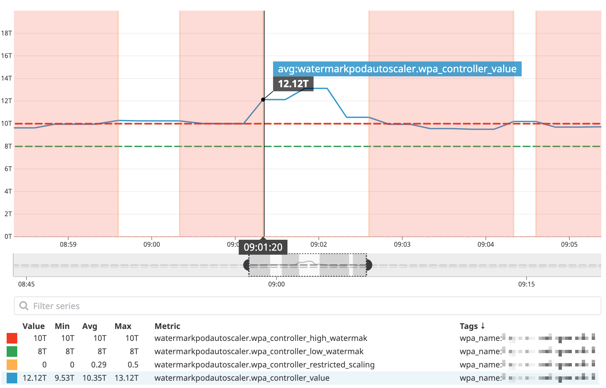

# Configurable tolerance for Autoscalers

## Table of Contents

<!-- toc -->
- [Summary](#summary)
- [Motivation](#motivation)
  - [Goals](#goals)
  - [Non-Goals](#non-goals)
- [Proposal](#proposal)
  - [User Stories](#user-stories-optional)
    - [Canonical use case of the tolerance to control the scaling condition](#Canonical-use-case-of-the-bounds-to-control-the-primary-scaling-condition)
  - [Implementation Details/Notes/Constraints](#implementation-detailsnotesconstraints)
    - [The Pseudo Code](#the-pseudo-code)
    - [API Changes](#api-changes)
    - [HPA Controller Changes](#hpa-controller-changes)
- [Design Details](#design-details)
  - [Upgrade / Downgrade Strategy](#upgrade--downgrade-strategy)
- [Graduation Criteria](#graduation-criteria)
- [Alternative](#alternative)
- [Out of scope](#out-of-scope)

<!-- /toc -->

## Summary

This is a proposal to extend the Horizontal Pod Autoscaler (or HPA) Controller to allow for a better configurability of the scaling behavior.
Namely, avoiding the sawtooth pattern by migrating the tolerance option, formerly available at the controller level, to the spec of each HPA.

We (Datadog) have been using a Custom Resource internally, the Watermark Pod Autoscaler or WPA, and we believe the community could benefit from this feature. 
Feel free to check out [the official repository](https://github.com/DataDog/watermarkpodautoscaler) and give us your feedback.
Note: This controller implements the solution described in the [alternative](#alternative) proposal, relying on multiple thresholds. For the sake of illustration, I updated it to reflect the behavior we aim to have in the horizontal-pod-autoscaler controller (using tolerance in the `spec.metrics`).

## Motivation

- More granular control on autoscaling events. 

### Goals

The goal is to customize the tolerance parameter (`--horizontal-pod-autoscaler-tolerance`) but at the HPA level.

### Non-Goals

- This does not aim at replacing the HPA Controller.
- You will see no mention of the `spec.behavior` in this KEP, the intent is to be agnostic to this feature, and solely alter the process of comparing the value retrieved from the metrics server to a "buffer" instead of a threshold.

## Proposal

As suggested in the past [#39090](https://github.com/kubernetes/kubernetes/issues/39090#issuecomment-466398426) and requested [in 62013](https://github.com/kubernetes/kubernetes/issues/62013), we would like to suggest migrating the `tolerance` option to the spec of the HPA, at the same level as the `target/targetAverage`.
This will let users who want to leverage multiple metrics have the option to configure a different tolerance for each, to yield relevant recommendations when computing how many replicas should be [suggested](https://github.com/kubernetes/kubernetes/blob/v1.19.2/pkg/controller/podautoscaler/replica_calculator.go#L232).

### User Stories

We have instrumented our custom controller we use internally to expose metrics, so we can best illustrate the use cases.

#### Canonical use case of the tolerance to control the scaling condition.

In this example we are using the following Spec configuration:
```
    minReplicas: 4
    maxReplicas: 9
    metrics:
    - external:
        tolerance: 0.11
        targetAverageValue: 9T
        metricName: custom.request_duration.max
        metricSelector:
          matchLabels:
            kubernetes_cluster: mycluster
            service: billing
      type: External
```

In the following graph, we can see that the value of our metric oscillates between the two bounds, defined by our threshold set at 9T +/- the tolerance, set at 11%.
With this configuration, we will not be considering autoscaling events if the metric is between 9T + 9T * 11% = 9.99T and 9T - 9T * 11% = 8.01T.

The "forbidden windows" are highlighted in light red.


### Implementation Details/Notes/Constraints

#### The Pseudo Code

The changes would go in the `podautoscaler` package.
It would be similar for all metric types, the changes would be in removing the tolerange parameter in the ReplicaCalculator object.

```go
type ReplicaCalculator struct {
  metricsClient                 metricsclient.MetricsClient
  podLister                     corelisters.PodLister
  cpuInitializationPeriod       time.Duration
  delayOfInitialReadinessStatus time.Duration
}
```

And instead, passing the tolerance in the functions called to compute the replicaCount, the utilization, timestamp and potential error.
For the External metrics for instance, the signature and logic would become:

```go
func (c *ReplicaCalculator) GetExternalMetricReplicas(currentReplicas int32, targetUtilization int64, tolerance float64, metricName, namespace string, metricSelector *metav1.LabelSelector, podSelector labels.Selector) (replicaCount int32, utilization int64, timestamp time.Time, err error) {
[...]
  if math.Abs(1.0-usageRatio) > tolerance {
    // update number of replicas if the change is large enough
    replicaCount = int32(math.Ceil(float64(utilization) / float64(targetUtilizationPerPod)))
  }
[...]
```

This modification would target these functions:
- `getUsageRatioReplicaCount`
- `GetObjectPerPodMetricReplicas`
- `GetExternalPerPodMetricReplicas`
- `GetResourceReplicas`
- `calcPlainMetricReplicas`

#### API Changes

The main change would be to add a `tolerance` parameter in the `MetricTarget` structure.

```go
type MetricTarget struct {
  // Type represents whether the metric type is Utilization, Value, or AverageValue
  Type MetricTargetType
  // Value is the target value of the metric (as a quantity).
  Value *resource.Quantity
  // TargetAverageValue is the target value of the average of the
  // metric across all relevant pods (as a quantity)
  AverageValue *resource.Quantity

  // AverageUtilization is the target value of the average of the
  // resource metric across all relevant pods, represented as a percentage of
  // the requested value of the resource for the pods.
  // Currently only valid for Resource metric source type
  AverageUtilization *int32

  // Tolerance is the fluctuation that can be accepted on the value 
  // retrieved from a metrics provider on a per metric basis.
  Tolerance float64
}
```

#### HPA Controller Changes

- tolerance would still be a `float64`, to keep the same UX.
- In terms of precedence, I believe it makes sense to keep [the current](https://github.com/kubernetes/kubernetes/blob/v1.19.2/pkg/controller/podautoscaler/replica_calculator.go#L37) global `defaultTestingTolerance` of `0.1`, which would only be altered if the controller level flag `--horizontal-pod-autoscaler-tolerance` is configured. Then, only for HPAs where the tolerance is specified then it would take precedence. The parameter would be a `omitempty` to make sure we do not introduce a breaking change.

## Design Details
### Upgrade / Downgrade Strategy

As mentioned above, upon upgrading, if the tolerance parameter is not present, it would default to the value of the flag at the controller level, which [by default](https://kubernetes.io/docs/tasks/run-application/horizontal-pod-autoscale/#algorithm-details) is at 10%.
For downgrade behaviors, if the tolerance option is specified the HPA would fail to be created.

### Graduation Criteria

The new configuration will be added to the autoscaling/v2beta2 API which has not yet graduated to GA. So these changes do not need a separate Graduation Criteria and will be part of the existing beta API.

## Alternative
<a name="alternative"></a>
The alternative of the aforementioned would be to use two different thresholds (refered to as `watermarks`) in the spec of the HPAs, as mentioned earlier, it is what we decided to implement for our custom controller as we deemed it more "user friendly" and we did not have to worry about breaking the current HPA. A strong argument is that HPA users know the boundaries of their applications, and they should not have to calculate an average an a half tolerance to configure them.
The cons of this solution is the amount of changes it would require both on the API and in the controller. It would be a breaking change as well.

### Exemple usage of the multiple bounds.

```
    minReplicas: 4
    maxReplicas: 9
    metrics:
    - external:
        highWatermark: 400m
        lowWatermark: 150m
        metricName: custom.request_duration.max
        metricSelector:
          matchLabels:
            kubernetes_cluster: mycluster
            short_image: billing-app
      type: External
```
With such a specification, autoscaling events would only be permitted should the metric be over 400m or inferior to 150m.

### Implementation Details/Notes/Constraints

Upon making a measurement (i.e. querying the Metrics Server or Custom/External Metrics Server) we compare the value to both thresholds, we can only suggest upscaling if the value is at least higher than the high threshold and a downscale event if it is at least lower than the low threshold.

As we add a second threshold, it seems confusing and error prone to keep the logic of the `targetAverageValue` and the `targetValue` nomenclature for those two thresholds. 
e.g. have the LowThreshold/LowAverageThreshold and deal with cases where a user could set a HighThreshold and a LowAverageThreshold. 
So it would seem preferable to implement a separate option in the spec, `algorithm` which would specify the behavior.

Depending on your use case, you might want to consider one or the other. The naming of the algorithm is from the point of view of the controller.

1. `average`
    The ratio used to compare to the thresholds is `value from the metrics provider` / `current number of replicas`, it is compared to the bounds and the recommended number of replicas is `value from the metrics provider` / `threshold` (low or high depending on the current value).
    - The `average` algorithm is a good fit if you use a metric that does not directly depend on the number of replicas. Typically, the sum of requests received by a Load Balancer can indicate how many webservers we want to have given that we know that a single webserver should handle X rq/s.
    Adding a replica will not increase/decrease the number of requests received.

2. `absolute`
    The default value is `absolute`, we compare the raw metric retrieved as is from the Metrics Provider to the thresholds and it is used as the utilization value. The recommended number of replicas is computed as `current number of replicas` * `value from the metrics provider` / `threshold`.
    - The `absolute` algorithm is the default as it represents the most common use case: You want your application to run between 60% and 80% of CPU, if the metric (avg:cpu.usage) retrieved is at 85%, you need to scale up. The metric has to be correlated to the number of replicas.

This yields the same behavior as the HPA controller where `TargetValue` is equivalent to `absolute` and `TargetAverageValue` is the `average` algorithm.

Bounds are specified as `Quantities`, like the threshold so you can use `m | "" | k | M | G | T | P | E` to easily represent the value you want to use.

#### Notes on this alternative

This was the initial approach taken and how the custom controller we have been using is implemented.
Using bounds seemed more natural to specify when to scale and when not to scale. But bringing this pattern upstream would have required a lot of changes, both in the API and in the logic of the controller, as well as require a upgrade strategy etc.
Thus, it seemed more appropriate to migrate the tolerance parameter.

## Out of scope

It is worth noting that in the upstream controller only the `math.Ceil` function is used to compute the recommended number of replicas.
This means that if you have a threshold at 10, you will need to reach a utilization of 8.999... from the Metrics Provider to downscale to 9 replicas but 10.001 will suffice trigger an upscale event to 11 replicas.

In order to guaratee a symetry of scaling, our implementation of this custom controller uses `math.Floor` if the value is under the Lower bound. We are not suggesting porting this to the upstream controller, but we think it is important to bring it up to have the opportunity to discuss if it is and why it would be a desired behavior.
