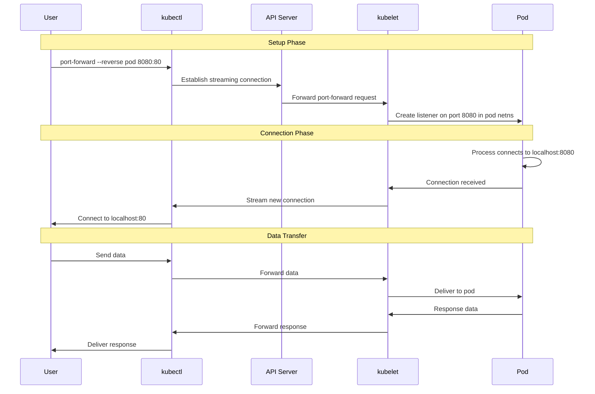

# KEP-5695: kubectl reverse port-forward

<!-- toc -->
- [Release Signoff Checklist](#release-signoff-checklist)
- [Summary](#summary)
- [Motivation](#motivation)
  - [Goals](#goals)
  - [Non-Goals](#non-goals)
- [Proposal](#proposal)
  - [User Stories](#user-stories)
    - [Story 1: Local Development with Remote Debugging](#story-1-local-development-with-remote-debugging)
    - [Story 2: Testing Webhooks in Development](#story-2-testing-webhooks-in-development)
    - [Story 3: Database Migration from Local Tools](#story-3-database-migration-from-local-tools)
  - [Notes/Constraints/Caveats](#notesconstraintscaveats)
  - [Risks and Mitigations](#risks-and-mitigations)
- [Design Details](#design-details)
  - [API Changes](#api-changes)
  - [Implementation Overview](#implementation-overview)
  - [Test Plan](#test-plan)
    - [Prerequisite Testing Updates](#prerequisite-testing-updates)
    - [Unit Tests](#unit-tests)
    - [Integration Tests](#integration-tests)
    - [E2E Tests](#e2e-tests)
  - [Graduation Criteria](#graduation-criteria)
    - [Alpha](#alpha)
    - [Beta](#beta)
    - [GA](#ga)
  - [Upgrade / Downgrade Strategy](#upgrade--downgrade-strategy)
  - [Version Skew Strategy](#version-skew-strategy)
- [Production Readiness Review Questionnaire](#production-readiness-review-questionnaire)
  - [Feature Enablement and Rollback](#feature-enablement-and-rollback)
  - [Rollout, Upgrade and Rollback Planning](#rollout-upgrade-and-rollback-planning)
  - [Monitoring Requirements](#monitoring-requirements)
  - [Dependencies](#dependencies)
  - [Scalability](#scalability)
  - [Troubleshooting](#troubleshooting)
- [Implementation History](#implementation-history)
- [Drawbacks](#drawbacks)
- [Alternatives](#alternatives)
  - [Alternative 1: Third-Party Tools](#alternative-1-third-party-tools)
  - [Alternative 2: Exec-based Approach](#alternative-2-exec-based-approach)
  - [Alternative 3: Service Mesh Integration](#alternative-3-service-mesh-integration)
  - [Alternative 4: API Server Proxy](#alternative-4-api-server-proxy)
- [Infrastructure Needed](#infrastructure-needed)
- [References](#references)
<!-- /toc -->

## Release Signoff Checklist

Items marked with (R) are required *prior to targeting to a milestone / release*.

- [ ] (R) Enhancement issue in release milestone, which links to KEP dir in [kubernetes/enhancements] (not the initial KEP PR)
- [ ] (R) KEP approvers have approved the KEP status as `implementable`
- [ ] (R) Design details are appropriately documented
- [ ] (R) Test plan is in place, giving consideration to SIG Architecture and SIG Testing input
  - [ ] E2E Tests for all Beta API Operations (endpoints)
  - [ ] (R) Ensure GA E2E tests meet requirements for [Conformance Tests](https://github.com/kubernetes/community/blob/master/contributors/devel/sig-architecture/conformance-tests.md)
  - [ ] (R) Minimum Two Week Window for GA E2E tests to prove flake free
- [ ] (R) Graduation criteria is in place
  - [ ] (R) [all GA Endpoints](https://github.com/kubernetes/community/pull/1806) must be hit by [Conformance Tests](https://github.com/kubernetes/community/blob/master/contributors/devel/sig-architecture/conformance-tests.md) within one minor version of promotion to GA
- [ ] (R) Production readiness review completed
- [ ] (R) Production readiness review approved
- [ ] "Implementation History" section is up-to-date for milestone
- [ ] User-facing documentation has been created in [kubernetes/website], for publication to [kubernetes.io]
- [ ] Supporting documentation—e.g., additional design documents, links to mailing list discussions/SIG meetings, relevant PRs/issues, release notes

[kubernetes.io]: https://kubernetes.io/
[kubernetes/enhancements]: https://git.k8s.io/enhancements
[kubernetes/kubernetes]: https://git.k8s.io/kubernetes
[kubernetes/website]: https://git.k8s.io/website

## Summary

Add reverse port-forwarding capability to `kubectl port-forward`, enabling users to expose local ports on their workstation to containers running in Kubernetes pods. This is the equivalent of SSH's `-R` (remote port forwarding) flag, allowing containers to initiate connections back to services running on the developer's local machine.

## Motivation

The current `kubectl port-forward` command only supports forward port-forwarding (local port → pod port), which allows users to access services running in pods from their local machine. However, there are many common development and debugging scenarios where the reverse is needed: allowing a pod to access services running on the developer's local machine.

Currently, developers must use workarounds such as:
- Deploying sidecar containers with SSH servers and using SSH tunneling
- Setting up VPN connections to the cluster
- Deploying temporary services that proxy to external endpoints
- Using third-party tools like telepresence or similar

These workarounds add complexity, security concerns, and maintenance overhead. A native reverse port-forward capability would significantly improve the developer experience.

### Goals

- Enable reverse port-forwarding from pod ports to local ports via `kubectl port-forward`
- Maintain backward compatibility with existing `kubectl port-forward` usage
- Ensure the feature works with the WebSocket/HTTP2 streaming protocol
- Provide clear error messages and diagnostics
- Support standard kubectl patterns (pod selection, namespace handling, etc.)
- Allow multiple concurrent reverse port-forwards

### Non-Goals

- Replacing or modifying the existing forward port-forward functionality
- Supporting persistent tunnels that survive pod restarts (connections are ephemeral)
- Implementing `bind_address` support for exposing the reverse tunnel to other pods (initial implementation will only expose to the target pod)
- Providing load balancing across multiple pods
- Supporting UDP port forwarding (TCP only for initial implementation)

## Proposal

Add a new flag `--reverse` (or `-R`) to the `kubectl port-forward` command that reverses the direction of the port forwarding. When this flag is used, kubectl will:

1. Establish a connection to the kubelet running the target pod
2. Create a listener in the pod's network namespace on the specified remote port
3. Forward incoming connections from that port back to kubectl
4. kubectl will then forward these connections to the specified local port

### User Stories

#### Story 1: Local Development with Remote Debugging

As a developer, I want to debug a microservice running in a Kubernetes pod that needs to call back to my local development server, so that I can test webhook integrations without deploying my development code to the cluster.

**Example:**
```bash
# Start local webhook server on port 8080
python -m http.server 8080

# In another terminal, expose it to the pod
kubectl port-forward --reverse mypod 8080:8080

# Now the pod can access http://localhost:8080 which goes to my local machine
```

#### Story 2: Testing Webhooks in Development

As a developer working on a Kubernetes admission webhook, I want my webhook running locally to receive requests from the API server running in my development cluster, so that I can rapidly iterate on webhook logic without repeatedly building and deploying container images.

**Example:**
```bash
# Run webhook locally
./my-webhook --port 9443

# Expose it to the API server pod
kubectl port-forward --reverse -n kube-system api-server-pod 9443:9443

# Now the API server can call https://localhost:9443 for webhook validation
```

#### Story 3: Database Migration from Local Tools

As a database administrator, I want to run database migration tools from my local machine against a database pod without exposing the database outside the cluster, using a secure reverse tunnel.

**Example:**
```bash
# Expose local port 5432 to the database pod
kubectl port-forward --reverse postgres-pod 15432:5432

# In the pod, connect to localhost:15432 to reach the local migration tool
# that is listening on port 5432
```

### Notes/Constraints/Caveats

1. **Security Consideration**: Reverse port-forwarding exposes local services to remote pods. Users must understand the security implications and only use this feature in development/debugging scenarios.

2. **Network Namespace**: The listening port is created in the pod's network namespace, accessible only to processes within that pod (not to other pods in the cluster).

3. **Protocol Limitations**: Initial implementation will use the same streaming protocol as forward port-forward (WebSocket or HTTP2).

4. **Connection Lifecycle**: Connections are active only while the `kubectl port-forward` command is running. If kubectl terminates, all connections are closed.

5. **Port Conflicts**: If the remote port is already in use in the pod, the operation will fail with a clear error message.

### Risks and Mitigations

| Risk | Mitigation |
|------|------------|
| **Security**: Exposing local services to pods could be misused | Document security implications clearly, recommend use only for development/debugging, consider adding audit logging |
| **Security**: Network Policy Bypass | Document that reverse tunnels allow pods to access external resources via the developer's machine, potentially bypassing cluster egress policies. |
| **Resource Exhaustion**: Malicious or buggy pods could open many connections | Implement connection limits and resource quotas, add monitoring metrics |
| **Port Conflicts**: Remote port already in use in pod | Provide clear error messages, allow user to specify alternative ports |
| **Protocol Complexity**: Bi-directional streaming protocol is complex | Extensive testing, reuse existing port-forward infrastructure where possible |
| **Version Skew**: Old kubelets may not support reverse forwarding | Feature gate protection, graceful degradation with clear error messages |

## Design Details

### API Changes

No API changes to Kubernetes objects are required. The changes are to the kubectl command-line interface and the kubelet port-forward protocol.

**kubectl CLI Changes:**
```bash
# Existing forward port-forward (unchanged)
kubectl port-forward pod-name 8080:80

# New reverse port-forward syntax
kubectl port-forward --reverse pod-name 8080:80
# or
kubectl port-forward -R pod-name 8080:80

# Multiple ports (both forward and reverse)
kubectl port-forward --reverse pod-name 8080:80 9090:9000
```

**Port Specification Semantics:**
- Forward mode (existing): `LOCAL_PORT:REMOTE_PORT` - local port forwards to remote port
- Reverse mode (new): `REMOTE_PORT:LOCAL_PORT` - remote port forwards to local port

This maintains consistency with SSH syntax where the semantics of the port spec change based on the direction flag.

### Implementation Overview

The implementation builds upon the existing port-forward infrastructure with the following components:

**1. kubectl Changes** (`pkg/cmd/portforward/`):
- Add `--reverse` flag to port-forward command
- Modify port spec parsing to handle reverse semantics
- Implement reverse connection handler that:
  - Listens for incoming connections from kubelet
  - Establishes connections to local ports
  - Forwards traffic bidirectionally

**2. Kubelet Changes** (`pkg/kubelet/`):
- Extend PortForward API to support reverse mode
- Implement pod network namespace listener creation using `socat` or native Go listeners
- Handle incoming pod connections and stream them to kubectl
- Clean up listeners when kubectl disconnects

**3. Protocol Changes** (`pkg/kubelet/cri/streaming/portforward/`):
- Extend streaming protocol to support:
  - Reverse mode handshake
  - Connection establishment notifications (pod → kubectl direction)
  - Bidirectional data streams

**4. Flow Diagram:**



**5. Implementation Components:**

- **Port Listener**: Create a TCP listener in the pod's network namespace
  - Native Go implementation using netns library.
  - This avoids external dependencies like `socat` or `nsenter` and provides better error handling and resource control.

- **Connection Multiplexing**: Handle multiple concurrent connections over a single WebSocket/HTTP2 stream
  - Each new connection from pod creates a new stream channel
  - kubectl maps each channel to a new local connection

- **Error Handling**:
  - Port already in use
  - Connection refused on local port
  - Network namespace access failures
  - Stream protocol errors

### Test Plan

[x] I/we understand the owners of the involved components may require updates to
existing tests to make this code solid enough prior to committing the changes necessary
to implement this enhancement.

#### Prerequisite Testing Updates

- Ensure existing port-forward tests are not affected by the changes
- Add test coverage for the new protocol messages
- Verify backward compatibility with clusters not supporting reverse port-forward

#### Unit Tests

**Existing Test Infrastructure:**

Test stubs for reverse port-forward have been prepared in `k8s.io/kubectl/pkg/cmd/portforward/portforward_test.go`:
- `TestReversePortForwardFlagParsing`: Tests `--reverse` flag parsing
- `TestReversePortSpecificationSyntax`: Tests port specification format validation
- `TestReversePortForwardValidation`: Tests validation logic for reverse mode
- `TestReverseForwardModeConflict`: Tests that forward/reverse modes cannot be mixed
- `TestPortRangeValidation`: Port range validation helper tests

These tests are currently skipped (waiting for implementation) and will be enabled during alpha implementation.

**Required Unit Test Coverage:**

- `k8s.io/kubectl/pkg/cmd/portforward`:
  - Port spec parsing for reverse mode (REMOTE:LOCAL format)
  - Reverse connection handling logic
  - Error handling for reverse-specific failures
  - Flag validation (`--reverse` with various port specs)
  - Port range validation (1-65535 for remote, 0-65535 for local)

- `k8s.io/kubernetes/pkg/kubelet/cri/streaming/portforward`:
  - Reverse mode protocol handshake
  - Connection multiplexing
  - Listener cleanup on disconnect
  - Error handling for port conflicts

- `k8s.io/kubernetes/pkg/kubelet`:
  - Pod network namespace listener creation
  - Port conflict detection
  - Resource cleanup on connection termination

#### Integration Tests

- Test reverse port-forward with real kubelet and pod
- Test multiple concurrent reverse connections
- Test connection handling when local port is unavailable
- Test cleanup when kubectl is terminated
- Test version skew scenarios (new kubectl with old kubelet)
- Test feature gate enablement/disablement

Integration test location: `test/integration/kubectl/portforward_reverse_test.go`

#### E2E Tests

- End-to-end reverse port-forward test with real cluster
  - Create pod with simple client application
  - Start reverse port-forward to local HTTP server
  - Verify pod can connect and receive responses
  - Test connection persistence and cleanup

- Test with multiple pods and concurrent connections
- Test error scenarios (port conflicts, connection failures)
- Test with different pod runtime (containerd, cri-o)

E2E test location: `test/e2e/kubectl/portforward.go` (extend existing tests)

### Graduation Criteria

#### Alpha

- Feature implemented behind `KubectlReversePortForward` feature gate
- Basic functionality working (single port, single connection)
- Unit tests for kubectl and kubelet components (test infrastructure already prepared)
- Enable and complete existing test stubs in `portforward_test.go`
- Initial e2e tests completed
- Documentation drafted

#### Beta

- Feature gate enabled by default
- Support for multiple concurrent connections
- Support for multiple ports in single command
- Comprehensive integration tests in Testgrid
- Metrics for connection count, errors, and duration
- Security review completed
- User-facing documentation published
- Gather feedback from early adopters
- Address all major bugs and issues from alpha

#### GA

- Feature gate removed (always enabled)
- No significant bugs reported for 2+ releases
- Conformance tests if applicable
- All metrics stable and documented
- Performance testing completed
- Real-world usage examples and case studies
- All documentation complete and reviewed

### Upgrade / Downgrade Strategy

**Upgrade:**
- New kubectl with old kubelet: Feature detection via protocol negotiation. If kubelet doesn't support reverse mode, kubectl provides a clear error message.
- Old kubectl with new kubelet: No impact, forward compatibility maintained.

**Downgrade:**
- Reverse port-forward sessions will be terminated when kubelet is downgraded.
- Users will need to use old kubectl version if they downgrade kubelet.
- No data loss or corruption, just feature unavailability.

### Version Skew Strategy

The feature will handle version skew gracefully:

1. **kubectl → kubelet**: Protocol negotiation during initial handshake
   - New kubectl sends reverse mode capability flag
   - Old kubelet responds with "not supported" error
   - kubectl displays user-friendly error: "Reverse port-forwarding requires kubelet version >= v1.34"

2. **Feature Gate**: Behind `KubectlReversePortForward` feature gate
   - Alpha: Disabled by default
   - Beta: Enabled by default but can be disabled
   - GA: Always enabled

3. **Backward Compatibility**: Existing forward port-forward remains unchanged and unaffected by this feature

## Production Readiness Review Questionnaire

### Feature Enablement and Rollback

###### How can this feature be enabled / disabled in a live cluster?

- [x] Feature gate (also fill in values in `kep.yaml`)
  - Feature gate name: `KubectlReversePortForward`
  - Components depending on the feature gate:
    - kubelet
    - kubectl (command-line flag could also gate the feature)

###### Does enabling the feature change any default behavior?

No. The feature only activates when users explicitly use the `--reverse` flag with `kubectl port-forward`. Existing `kubectl port-forward` behavior is completely unchanged.

###### Can the feature be disabled once it has been enabled (i.e. can we roll back the enablement)?

Yes. Disabling the feature gate on kubelet will cause reverse port-forward attempts to fail with a clear error message. Active reverse port-forward sessions will be terminated. No persistent state is created, so disabling is clean.

###### What happens if we reenable the feature if it was previously rolled back?

The feature will work again immediately. There is no persistent state to reconcile.

###### Are there any tests for feature enablement/disablement?

Yes, integration tests will cover:
- Feature gate disabled: verify error message is clear
- Feature gate enabled: verify functionality works
- Runtime enablement/disablement scenarios

### Rollout, Upgrade and Rollback Planning

###### How can a rollout or rollback fail? Can it impact already running workloads?

**Rollout failure scenarios:**
- Incompatible protocol changes: Mitigated by protocol versioning and negotiation
- Resource exhaustion: Mitigated by connection limits and monitoring

**Impact on running workloads:**
- No impact on existing workloads
- Only affects users actively using reverse port-forward
- Failure would only terminate reverse port-forward sessions, not affect pods

###### What specific metrics should inform a rollback?

- High error rate in `kubectl_portforward_reverse_errors_total`
- Increased kubelet CPU/memory usage correlating with reverse port-forward usage
- Increased pod connection failures
- Reports of existing forward port-forward breaking

###### Were upgrade and rollback tested? Was the upgrade->downgrade->upgrade path tested?

Testing plan includes:
- Upgrade kubelet with feature gate disabled → enabled
- Downgrade kubelet with active reverse port-forwards
- Upgrade kubectl independent of kubelet version
- Mixed cluster with some nodes supporting feature, some not

###### Is the rollout accompanied by any deprecations and/or removals of features, APIs, fields of API types, flags, etc.?

No. This is a purely additive feature.

### Monitoring Requirements

###### How can an operator determine if the feature is in use by workloads?

Metrics will expose:
- `kubectl_portforward_reverse_connections_total`: Counter of reverse port-forward connections
- `kubectl_portforward_reverse_active_connections`: Gauge of currently active connections

###### How can someone using this feature know that it is working for their instance?

- Success indicators:
  - kubectl command runs without error
  - Connection from pod to localhost:PORT succeeds
  - Data flows bidirectionally

- Failure indicators:
  - Clear error messages from kubectl
  - Connection refused errors in pod
  - Timeout on connection attempts

###### What are the reasonable SLOs (Service Level Objectives) for the enhancement?

- 99% of reverse port-forward establishment attempts succeed (when feature gate is enabled)
- Connection establishment latency < 500ms p99
- Zero impact on existing forward port-forward latency/success rate

###### What are the SLIs (Service Level Indicators) an operator can use to determine the health of the service?

- Metrics:
  - `kubectl_portforward_reverse_connections_total` - labeled by status (success/failure)
  - `kubectl_portforward_reverse_errors_total` - labeled by error type
  - `kubectl_portforward_reverse_connection_duration_seconds` - histogram
  - `kubelet_portforward_reverse_listeners_active` - gauge

###### Are there any missing metrics that would be useful to have to improve observability of this feature?

Initial implementation includes all necessary metrics. Future enhancements could add:
- Bytes transferred per connection
- Connection failure reasons (detailed breakdown)
- Per-pod reverse port-forward usage

### Dependencies

###### Does this feature depend on any specific services running in the cluster?

No cluster-level services required. Dependencies:
- Kubelet must be running (already required for port-forward)
- Network namespace support in container runtime
- No external services needed

### Scalability

###### Will enabling / using this feature result in any new API calls?

No new API server calls. The feature uses the existing port-forward streaming endpoint between kubectl and kubelet.

###### Will enabling / using this feature result in introducing new API types?

No. This is a client-side feature using existing streaming protocols.

###### Will enabling / using this feature result in any new calls to the cloud provider?

No.

###### Will enabling / using this feature result in increasing size or count of the existing API objects?

No.

###### Will enabling / using this feature result in increasing time taken by any operations covered by existing SLIs/SLOs?

No. This feature is opt-in and isolated from existing functionality.

###### Will enabling / using this feature result in non-negligible increase of resource usage (CPU, RAM, disk, IO, ...) in any components?

Resource usage per active reverse port-forward session:
- kubectl: Minimal CPU/memory for connection proxying (~1-5 MB per connection)
- kubelet: Minimal CPU/memory for listener and stream handling (~1-5 MB per connection)
- No disk IO unless connection logging is enabled

The impact is similar to existing forward port-forward resource usage.

###### Can enabling / using this feature result in resource exhaustion of some node resources (PIDs, sockets, inodes, etc.)?

Potential risks:
- Socket exhaustion: Mitigated by connection limits (default: 10 concurrent connections per reverse port-forward)
- PID exhaustion: Minimal (no new process per connection in native Go implementation)

Limits will be documented and configurable.

### Troubleshooting

###### How does this feature react if the API server and/or etcd is unavailable?

The feature depends on the API server. The `kubectl port-forward` command establishes a connection to the API server, which proxies the connection to the Kubelet. If the API server becomes unavailable, the connection will be dropped and the reverse port-forward session will terminate.

No persistent state is stored in etcd for reverse port-forward sessions. The feature behaves identically to existing forward port-forward in this regard: connections are ephemeral and exist only in memory.

###### What are other known failure modes?

1. **Port Already in Use**
   - Detection: Error message during reverse port-forward setup
   - Mitigation: User selects different port
   - Diagnostics: "port %d already in use in pod %s"
   - Testing: Unit and integration tests cover this case

2. **Local Port Unreachable**
   - Detection: Connection errors logged by kubectl
   - Mitigation: User ensures local service is running
   - Diagnostics: "cannot connect to local port %d: connection refused"
   - Testing: E2E tests cover this scenario

3. **Network Namespace Access Failure**
   - Detection: Error during listener creation
   - Mitigation: Check kubelet permissions and container runtime
   - Diagnostics: "cannot access network namespace for pod %s"
   - Testing: Integration tests with permission restrictions

###### What steps should be taken if SLOs are not being met to determine the problem?

1. Check kubectl logs for connection errors
2. Check kubelet logs for listener creation failures
3. Review metrics for error patterns
4. Verify feature gate is enabled if running < GA
5. Check network connectivity between kubectl and kubelet
6. Verify pod is running and healthy

## Implementation History

- 2016-01-27: Original feature request filed as [#20227](https://github.com/kubernetes/kubernetes/issues/20227)
- 2017-12-18: Initial PoC implementation as [#57320](https://github.com/kubernetes/kubernetes/pull/57320)
- 2025-11-18: KEP created
- 2025-11-19: Test infrastructure prepared in `portforward_test.go` with comprehensive test stubs
- TBD: Alpha implementation targeting v1.34
- TBD: Beta implementation targeting v1.35
- TBD: GA implementation targeting v1.36

## Drawbacks

1. **Security Concerns**: Exposing local services to remote pods requires users to understand security implications
2. **Complexity**: Adds complexity to the port-forward codebase and protocol
3. **Limited Use Case**: Primarily useful for development/debugging, not production scenarios
4. **Alternative Solutions Exist**: Tools like Telepresence provide similar functionality

## Alternatives

### Alternative 1: Third-Party Tools

Users can continue using third-party tools like:
- Telepresence: Replaces pods with proxies
- SSH tunneling with sidecar containers
- VPN solutions

**Rejected because**: These solutions add external dependencies, complexity, and often require cluster modifications. A native kubectl solution is simpler and more integrated.

### Alternative 2: Exec-based Approach

Use `kubectl exec` to run `socat` or `nc` inside the pod and manually create tunnels.

**Rejected because**: This is manual, error-prone, and doesn't provide the seamless experience of port-forward.

### Alternative 3: Service Mesh Integration

Use service mesh features to route traffic from pods to external endpoints.

**Rejected because**: Requires service mesh installation, is overkill for simple debugging scenarios, and is not universally available.

### Alternative 4: API Server Proxy

Extend API server to proxy connections between pods and external endpoints.

**Rejected because**: API server should not be in the data path for debugging tools. This is a kubectl/kubelet concern.

## Infrastructure Needed

No special infrastructure required. The feature builds on existing port-forward infrastructure and protocols.

## References

- Original Issue: https://github.com/kubernetes/kubernetes/issues/20227
- Original PoC: https://github.com/kubernetes/kubernetes/pull/57320
- SSH Reverse Port Forward Documentation: https://man.openbsd.org/ssh#R
- Similar tools for comparison:
  - Telepresence: https://www.telepresence.io/
