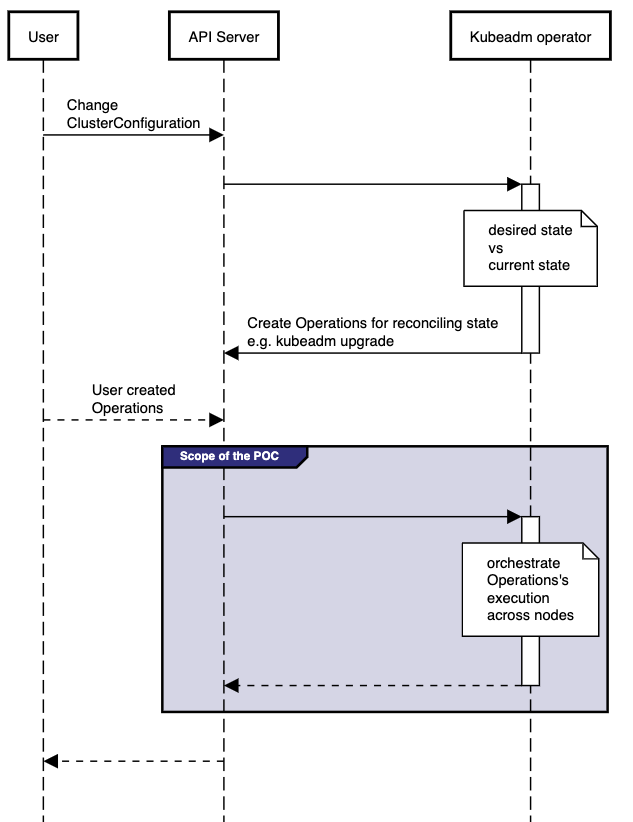

# Kubeadm operator

## Table of Contents

<!-- toc -->
- [Release Signoff Checklist](#release-signoff-checklist)
- [Summary](#summary)
- [Motivation](#motivation)
  - [Goals](#goals)
  - [Non-Goals](#non-goals)
- [Proposal](#proposal)
  - [User Stories](#user-stories)
    - [Story 1](#story-1)
    - [Story 2](#story-2)
    - [Story 3](#story-3)
    - [Story 4](#story-4)
    - [Story 5](#story-5)
  - [Implementation Details/Notes/Constraints](#implementation-detailsnotesconstraints)
  - [Risks and Mitigations](#risks-and-mitigations)
- [Design Details](#design-details)
  - [Test Plan](#test-plan)
  - [Graduation Criteria](#graduation-criteria)
  - [Upgrade / Downgrade Strategy](#upgrade--downgrade-strategy)
  - [Version Skew Strategy](#version-skew-strategy)
- [Implementation History](#implementation-history)
- [Drawbacks](#drawbacks)
- [Alternatives](#alternatives)
- [Infrastructure Needed](#infrastructure-needed)
<!-- /toc -->

## Release Signoff Checklist

- [x] kubernetes/enhancements issue in release milestone, which links to KEP (this should be a link to the KEP location
      in kubernetes/enhancements, not the initial KEP PR)
- [x] KEP approvers have set the KEP status to `implementable`
- [x] Design details are appropriately documented
- [ ] Test plan is in place, giving consideration to SIG Architecture and SIG Testing input
- [ ] Graduation criteria is in place
- [ ] "Implementation History" section is up-to-date for milestone
- [ ] User-facing documentation has been created in [kubernetes/website], for publication to [kubernetes.io]
- [ ] Supporting documentation e.g., additional design documents, links to mailing list discussions/SIG meetings,
      relevant PRs/issues, release notes

## Summary

Kubeadm operator would like to enable declarative control of kubeadm workflows, automating the execution and the
orchestration of such tasks across existing nodes in a cluster.

## Motivation

Kubeadm binary can execute operations only on the machine where it is running e.g. it is not possible to execute
operations on other nodes, to copy files across nodes, etc.

As a consequence, most of the kubeadm workflows, like [kubeadm upgrade](https://kubernetes.io/docs/reference/setup-tools/kubeadm/kubeadm-upgrade/),
consists of a complex sequence of tasks that should be manually executed and orchestrated across all the existing nodes
in the cluster.

Such a user experience is not ideal due to the error-prone nature of humans running commands. The manual approach
can be considered a blocker for implementing more complex workflows such as rotating certificate authorities,
modifying the settings of an existing cluster or any task that requires coordination of more than one Kubernetes node.

This KEP aims to address such problems by applying the operator pattern to kubeadm workflows. 

### Goals

- To allow declarative control of kubeadm operations that lead to "in place" mutations[1] of kubeadm generated
  artifacts. More specifically kubeadm artifacts are static pod manifests, certificates, kubeconfig file,
  bootstrap token, kubeadm generated configmap and secrets, while this proposal initially includes the following
  kubeadm workflows:
  - kubeadm upgrade
  - certificate renewal
  - certificate authority rotation (NEW)
  - change configuration in an existing cluster (NEW) 

> [1] Please note that we are referring to "in place" mutations of kubeadm generated artifacts in order to highlight
> the difference between the kubeadm operator and other SCL projects like [Cluster API](https://cluster-api.sigs.k8s.io/),
> which instead assume nodes and underlying machines are immutable.

Considering the complexity of this topic, this document is expected to be subject to some iterations.
The goal of the current iteration is to:

- Get initial approval on Summary and Motivation paragraphs
- To identify a semantic for defining “Operations” to be performed by the kubeadm-operator.
- To define how the kubeadm-operator should manage kubeadm workflows.
- To define how the users should interact with the kubeadm-operator, including also observability and error handling.
- To define how the kubeadm-operator should be deployed in a Kubernetes cluster.

### Non-Goals

- To provide or manage any infrastructure elements such as underlying machines, load balancers, storage, etc.
- To manage and automate the kubeadm init and join workflows.
- To manage any artifact *not* generated by kubeadm. The only exception are the kubelet, kubeadm, andkubectl
  binaries which are considered in-scope as required by the upgrade workflow.
- To replace kubeadm "raw" workflows. The user will always be able to run kubeadm workflows in isolation in 
  manual fashion.

## Proposal

### User Stories

#### Story 1

As a Kubernetes operator, I would like to be able to declaratively control upgrades in a systematic fashion.

#### Story 2

As a Kubernetes operator, I would like to be able to declaratively control certificate renewal in a systematic fashion.

#### Story 3

As a Kubernetes operator, I would like to be able to declaratively control changes of the current cluster's settings
in a systematic fashion.

#### Story 4

As a Kubernetes operator, I would like to be able to declaratively rotate my certificate authorities.

#### Story 5 
As a Kubernetes operator, I would like to control whether nodes are cordoned and drained for tasks or if they are
performed without disruption to the workloads on the node, referred to as a "hot" update.

### Implementation Details/Notes/Constraints

At his core the kubeadm operator is a controller that watches kubeadm ClusterConfiguration object, and according
to its changes, to trigger the required operations to reconcile the desired state and the current state, where
each operations is one of the supported kubeadm workflow.

In order to break down the the implementation of the kubeadm operator into smaller, actionable items, the current
iteration of this KEP focuses on a more limited scope, that is the orchestration of the operations that
the kubeadm operator is going to execute for reconcyling the currente state and the desired state.

A POC will be executed in order to:

- Identify a semantic for defining “Operations” to be performed by the kubeadm-operator.
- Define how the kubeadm-operator should manage kubeadm workflows.
- Define how the users should interact with the kubeadm-operator, including also observability and error handling.
- Define how the kubeadm-operator should be deployed in a Kubernetes cluster.

### Risks and Mitigations

TBD

## Design Details

### Test Plan

TBD

### Graduation Criteria

TBD

### Upgrade / Downgrade Strategy

TBD

### Version Skew Strategy

TBD

## Implementation History

- the `Summary` and `Motivation` sections being merged signaling SIG acceptance

## Drawbacks

TBD

## Alternatives

[1] To NOT implement the kubeadm operator, and let the user automate workflows/orchestration of kubeadm
actions across nodes with other tools.

## Infrastructure Needed

TBD
