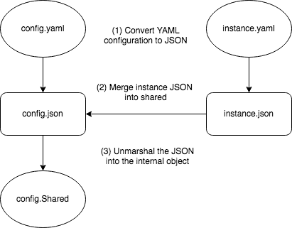

# Instance-Specific ComponentConfig

## Table of Contents

A table of contents is helpful for quickly jumping to sections of a KEP and for highlighting any additional information provided beyond the standard KEP template.

Ensure the TOC is wrapped with <code>&lt;!-- toc --&rt;&lt;!-- /toc --&rt;</code> tags, and then generate with `hack/update-toc.sh`.

<!-- toc -->
- [Release Signoff Checklist](#release-signoff-checklist)
- [Summary](#summary)
- [Motivation](#motivation)
  - [Goals](#goals)
  - [Non-Goals](#non-goals)
- [Proposal](#proposal)
  - [Reuse component config Kind for instance-specific config](#reuse-component-config-kind-for-instance-specific-config)
  - [Kube-proxy Example](#kube-proxy-example)
  - [Kubelet Example](#kubelet-example)
  - [Alternative: Define the case-by-case merge semantic for ComponentConfig](#alternative-define-the-case-by-case-merge-semantic-for-componentconfig)
  - [Why not just keep using flags for instance-specific parameters?](#why-not-just-keep-using-flags-for-instance-specific-parameters)
  - [Why not just auto-detect?](#why-not-just-auto-detect)
  - [Risks and Mitigations](#risks-and-mitigations)
- [Design Details](#design-details)
  - [Configuration merge example](#configuration-merge-example)
  - [Code merge example](#code-merge-example)
  - [Limitations](#limitations)
  - [Test Plan](#test-plan)
  - [Graduation Criteria](#graduation-criteria)
  - [Upgrade / Downgrade Strategy](#upgrade--downgrade-strategy)
  - [Version Skew Strategy](#version-skew-strategy)
- [Production Readiness Review Questionnaire](#production-readiness-review-questionnaire)
  - [Feature Enablement and Rollback](#feature-enablement-and-rollback)
  - [Rollout, Upgrade and Rollback Planning](#rollout-upgrade-and-rollback-planning)
  - [Monitoring Requirements](#monitoring-requirements)
  - [Dependencies](#dependencies)
- [Implementation History](#implementation-history)
<!-- /toc -->

## Release Signoff Checklist

**ACTION REQUIRED:** In order to merge code into a release, there must be an issue in [kubernetes/enhancements] referencing this KEP and targeting a release milestone **before [Enhancement Freeze](https://github.com/kubernetes/sig-release/tree/master/releases)
of the targeted release**.

For enhancements that make changes to code or processes/procedures in core Kubernetes i.e., [kubernetes/kubernetes], we require the following Release Signoff checklist to be completed.

Check these off as they are completed for the Release Team to track. These checklist items _must_ be updated for the enhancement to be released.

- [ ] kubernetes/enhancements issue in release milestone, which links to KEP (this should be a link to the KEP location in kubernetes/enhancements, not the initial KEP PR)
- [ ] KEP approvers have set the KEP status to `implementable`
- [ ] Design details are appropriately documented
- [ ] Test plan is in place, giving consideration to SIG Architecture and SIG Testing input
- [ ] Graduation criteria is in place
- [ ] "Implementation History" section is up-to-date for milestone
- [ ] User-facing documentation has been created in [kubernetes/website], for publication to [kubernetes.io]
- [ ] Supporting documentation e.g., additional design documents, links to mailing list discussions/SIG meetings, relevant PRs/issues, release notes

**Note:** Any PRs to move a KEP to `implementable` or significant changes once it is marked `implementable` should be approved by each of the KEP approvers. If any of those approvers is no longer appropriate than changes to that list should be approved by the remaining approvers and/or the owning SIG (or SIG-arch for cross cutting KEPs).

**Note:** This checklist is iterative and should be reviewed and updated every time this enhancement is being considered for a milestone.

[kubernetes.io]: https://kubernetes.io/
[kubernetes/enhancements]: https://github.com/kubernetes/enhancements/issues
[kubernetes/kubernetes]: https://github.com/kubernetes/kubernetes
[kubernetes/website]: https://github.com/kubernetes/website

## Summary

ComponentConfig is an ongoing effort to make Kubernetes-style config files the
preferred way to configure core Kubernetes components, instead of command-line
flags. An overview of and motivation for ComponentConfig, in general, can be
found in the [Versioned Component Configuration Files](https://docs.google.com/document/d/1FdaEJUEh091qf5B98HM6_8MS764iXrxxigNIdwHYW9c)
doc (access is available to all members of kubernetes-dev@googlegroups.com).

This KEP proposes a solution to a specific problem we have encountered while
implementing ComponentConfig. The vast majority of configuration parameter
values can be reused between concurrent runtime instances of a component, but
some values are required to be unique to each instance. To date, we have held
off migrating these parameters to existing ComponentConfig APIs, because we lack
a decision on how to consistently handle them.

This KEP proposes that components use a separate, instance-specific configuration
file, which can override by merge patch any parameter. By using a separate file
of the same Kind, instead of a separate Kind, we avoid the danger of
miscategorizing  fields as shared or instance-specific. It also significantly
simplifies the implementation.

The primary goal of this KEP is to make and codify a decision, so that we can
move forward with ComponentConfig implementation.

## Motivation

Most core Kubernetes components have many configuration parameters where the
value can, and usually should, be set the same for concurrent instances. For
example, QPS limits or authentication configuration is typically the same for
kubelet across many nodes in a cluster.

Some parameters, however, are unique to each instance of the component.
For example, assuming one kubelet per host, every kubelet that is configured
with the IP address of its host machine will be configured with a unique value.
We refer to these as "instance-specific" parameters.

Some core components are deployed via Pods in the cluster. When following the
ComponentConfig approach, these components typically use a ConfigMap volume to
deliver the config files. All instances of a component are typically configured
to point to a single ConfigMap. This makes configuration and deployment much
simpler, and less expensive, than having to create a separate ConfigMap for each
instance of the component.

Other components may not be deployed as Pods but may still have channels to
provide configuration via the cluster. Kubelet, for example, has the Dynamic
kubelet Config feature, which enables the kubelet to read configuration from
a ConfigMap designated by its corresponding Node object. With kubelet, it is
also advantageous for "pools" of nodes to refer to the same ConfigMap.

Unfortunately, a shared ConfigMap is incompatible with instance-specific
parameters which, by definition, cannot be shared between instances. While we
have been able to migrate many shareable parameters to ComponentConfig APIs,
we have been blocked on the instance-specific piece. Lack of a decision on how
to handle these has led to uncertainty as the owners of other components begin
moving to ComponentConfig APIs. A clear specification on how to implement
instance-specific configuration will unblock and expedite our migration from
command-line flags to ComponentConfig.

See also issue [#61647](https://github.com/kubernetes/kubernetes/issues/61647).

### Goals

- Provide a clear specification on how to handle instance-specific in
  ComponentConfig when migrating to a new or adapting an existing
  ComponentConfig API.

### Non-Goals

- Provide a standard way to continue specifying configuration on the
  command-line.
- Redesign APIs/refactor the existing set of parameters. This is about providing
  a clear migration path for all classes of parameters.
- Eliminate instance-specific config parameters altogether. This is a special
  case of the previous item.
- Make changes to the Dynamic kubelet Config feature or address difficulties in
  using the kubelet's current ComponentConfig API with Dynamic kubelet Config.

## Proposal

Taking the Kubelet as an example, there are three categories of fields
(identified by @liggitt):
1. clearly instance-specific (e.g. `--node-ip`, `--provider-id`,
   `--hostname-override`)
2. possibly instance-specific (e.g. `--bind-address`, `--root-dir`)
3. highly unlikely to be instance-specific (e.g. cloud provider, node lease
   duration)

This KEP proposes that components have a way to define the same field in
both instance-specific and shareable configuration files, defining a generic
merge approach such that the instance-specific field overrides and takes
precedence over the shareable field.

### Reuse component config Kind for instance-specific config

This KEP proposes a new flag, `--instance-config`, to specify the instance-specific
configuration file, the instance-specific configuration has the same Kind as the
sharable one.

ComponentConfig files containing only sharable parameters can continue to be
shared via a single ConfigMap. Files containing only instance-specific
parameters can be provided to components via other means, such as the node
startup scripts or an init container that inserts values from the Pod's Downward
API.

### Kube-proxy Example

Today, a kube-proxy DaemonSet may be configured as follows to mix sharable and
instance-specific configuration parameters (using flags only). Note some fields
and arguments that would be set in production have been removed or modified
below to improve the clarity of the example.

```yaml
apiVersion: apps/v1
kind: DaemonSet
  name: kube-proxy
  namespace: kube-system
spec:
  template:
    spec:
      containers:
      - name: kube-proxy
        image: kube-proxy-amd64
        command:
        - kube-proxy
        - --proxy-mode=ipvs
        - --hostname-override=${NODE_NAME}
        env:
          - NODE_NAME
            valueFrom:
              fieldRef:
                fieldPath: spec.nodeName
```

Below demonstrates how the above may be modified when moving to a shared
ComponentConfig ConfigMap. Note that the instance-specific parameter is still
specified via a flag, because the ConfigMap is not appropriate for
instance-specific parameters.

```yaml
apiVersion: apps/v1
kind: DaemonSet
  name: kube-proxy
  namespace: kube-system
spec:
  template:
    spec:
      containers:
      - name: kube-proxy
        image: kube-proxy-amd64
        command:
        - kube-proxy
        - --config=/etc/config/kube-proxy.yaml
        - --hostname-override=${NODE_NAME}
        env:
        - NODE_NAME
          valueFrom:
            fieldRef:
              fieldPath: spec.nodeName
        volumeMounts:
        - mountPath: /etc/config
          name: config
          readOnly: true
      volumes:
      - name: config
        configMap:
          name: kube-proxy-config-ghkm248tbc
```

Finally, when instance-specific configuration is also provided via the
ComponentConfig approach, using the separate file proposed above.

```yaml
apiVersion: apps/v1
kind: DaemonSet
  name: kube-proxy
  namespace: kube-system
spec:
  template:
    spec:
      initContainers:
      - name: instance-config
        image: something-with-bash
        command:
        - bash -c
        args:
        - cat << EOF > /etc/config/kube-proxy-instance.yaml
          kind: KubeProxyConfiguration
          apiVersion: kubeproxy.config.k8s.io/v1alpha1
          hostnameOverride: ${NODE_NAME}
          EOF
        env:
        - NODE_NAME
          valueFrom:
            fieldRef:
              fieldPath: spec.nodeName
        volumeMounts:
        - mountPath: /etc/config
          name: config
          readOnly: true
      containers:
      - name: kube-proxy
        image: kube-proxy-amd64
        command:
        - kube-proxy
        - --config=/etc/config/kube-proxy.yaml
        - --instance-config=/etc/config/kube-proxy-instance.yaml
        volumeMounts:
        - mountPath: /etc/config
          name: config
          readOnly: true
      volumes:
      - name: config
        configMap:
          name: kube-proxy-config-ghkm248tbc
```

Although the last example is more verbose, it provides the full benefits of
the ComponentConfig approach, resulting in a consistent surface and versioning
policy for the component's parameters.

Sometimes, kube-proxy is configured as a static Pod instead of a DaemonSet.
In that case, instance-specific configuration could be configured by the node
startup scripts and mounted via a host path volume.

### Kubelet Example

The Kubelet is not typically deployed as a Pod. Instead, startup scripts that
bootstrap the node write the Kubelet's initial configuration to disk at startup.
In some deployments, the Kubelet's configuration may later be modified by the
Dynamic Kubelet Config feature.

Today, the startup script may write a Kubelet command line that looks something
like `kubelet --config=/etc/config/kubelet.yaml --node-ip=${NODE_IP}`. Under
this proposal, it would instead write both config files, and a command line like
`kubelet --config=/etc/config/kubelet.yaml --instance-config=/etc/config/kubelet-instance.yaml`.

When the Dynamic Kubelet Config feature is enabled, the Kubelet only replaces
the values supplied to `--config` when consuming a remote configuration. Thus,
the instance-specific parameters would not interfere with sharable parameters
in this approach.

### Alternative: Define the case-by-case merge semantic for ComponentConfig

We prototyped the case-by-case merge approach in Kubelet and Kube-proxy. It turns
out to have a complex and difficult to reuse implementation, with many tricky edge
cases. The complexity mostly lies in merging different Kinds while preventing
defaulting from clobbering user-defined options.

See the example on [#92348](https://github.com/kubernetes/kubernetes/pull/92348).

To summarize the steps necessary to implement this:

1. Decode `shared.yaml` to `SharedExternal`.
2. Construct `InstanceExternal` such that any fields that exist in both types are set
   to the values from `SharedExternal`.
3. Decode `instance.yaml` over `InstanceExternal`. Values set in `shared.yaml` but not
   instance.yaml will match intent from `shared.yaml` due to the previous copy from
   `SharedExternal`.
4. Run defaulting functions on `SharedExternal` and `InstanceExternal`. Implementations
   must take care to keep the defaults the same for fields that exist in both types.
5. Convert `SharedExternal` to `SharedInternal` and `InstanceExternal` to `InstanceInternal`.
6. Decode flags over `SharedInternal` and `InstanceInternal` to enforce flag precedence.
   Flags for fields that exist in both types must be registered against `InstanceInternal`,
   so that we maintain flag precedence when we merge the two.
7. Copy fields that exist in both types from `InstanceInternal` to `SharedInternal` so that
   the values from `InstanceInternal` are present everywhere.

In the diagram below it's possible to have a better visualization of the case-by-case merge flow:


### Why not just keep using flags for instance-specific parameters?

Flags have various problems, outlined in the
[Versioned Component Configuration Files](https://docs.google.com/document/d/1FdaEJUEh091qf5B98HM6_8MS764iXrxxigNIdwHYW9c)
doc.

Leaving some parameters as flags while the rest are exposed via ComponentConfig
results in an inconsistent API surface, and an inconsistent API versioning
policy. Why fix only part of the problem when we can fix the whole thing?

### Why not just auto-detect?

One alternative that has been proposed in the past is to find a way to
auto-detect values of instance-specific parameters and simply eliminate them
from the configuration workflow. This is a great idea in theory, because it
solves the problem by removing work for users, but it may be difficult in
practice. For example, on a machine with multiple network cards, which IP should
the kubelet use?

This solution is orthogonal and does not prevent us from finding ways to
auto-detect instance specific config in the future. It is worth noting that
the _possibility_ of someday being able to auto-detect these has led to some
hesitation to make a firm decision today. We have delayed for too long already,
 and a firm decision is needed to move forward.

### Risks and Mitigations

For users deploying Pod templates, this solution can make the template more
verbose. In the future, we can explore more elegant ways of generating files
with instance-specific parameters correctly substituted. This proposal argues
that the extra verbosity is worth the benefit of a consistent, versioned API for
configuring core components.

## Design Details

The canonical flag for providing a ComponentConfig file to a component is
`--config`. This KEP proposes that the canonical flag for providing an
instance-specific config file be `--instance-config`.

As with sharable ComponentConfig parameters, command line flags for
instance-specific parameters should continue to function and take precedence
over the final merged values from the config file so that backward compatibility
is maintained.

### Configuration merge example

The merge between both YAML configuration files is provided by the
[Strategic Merge Patch](https://github.com/kubernetes/community/blob/master/contributors/devel/sig-api-machinery/strategic-merge-patch.md)
library.

The example below is a sharable Kubelet configuration YAML file.

```yaml
apiVersion: kubelet.config.k8s.io/v1beta1
authorization:
  mode: Webhook
  webhook:
    cacheAuthorizedTTL: 0s
    cacheUnauthorizedTTL: 0s
clusterDNS:
- 10.96.0.10
clusterDomain: cluster.local
cpuManagerReconcilePeriod: 0s
evictionHard:
  imagefs.available: 0%
  nodefs.available: 0%
  nodefs.inodesFree: 0%
evictionPressureTransitionPeriod: 0s
featureGates:
  DynamicKubeletConfig: true
healthzBindAddress: 127.0.0.1
healthzPort: 10248
kind: KubeletConfiguration
rotateCertificates: true
staticPodPath: /etc/kubernetes/manifests
```

This is the instance-configuration YAML, which is going to be merged into the sharable:

```yaml
address: 127.0.0.1
apiVersion: kubelet.config.k8s.io/v1beta1
clusterDNS:
- 10.96.0.11
evictionHard:
  imagefs.available: 2%
featureGates:
  TaintBasedEvictions: true
kind: KubeletConfiguration
```

The final patched YAML, used to unmarshal into the KubeletConfiguration object is:

```yaml
address: 127.0.0.1
apiVersion: kubelet.config.k8s.io/v1beta1
authorization:
  mode: Webhook
  webhook:
    cacheAuthorizedTTL: 0s
    cacheUnauthorizedTTL: 0s
clusterDNS:
- 10.96.0.11
clusterDomain: cluster.local
cpuManagerReconcilePeriod: 0s
evictionHard:
  imagefs.available: 2%
  nodefs.available: 0%
  nodefs.inodesFree: 0%
evictionPressureTransitionPeriod: 0s
featureGates:
  DynamicKubeletConfig: true
  TaintBasedEviction: true
healthzBindAddress: 127.0.0.1
healthzPort: 10248
kind: KubeletConfiguration
rotateCertificates: true
staticPodPath: /etc/kubernetes/manifests
```

The approach of performing a strategic merge patch of instance-specific over
shareable config before unmarshalling can decrease the complexity by:

- Using an already proven method from apimachinery.
- Avoiding complexity around automatic conversions during unmarshaling that might
  default unset instance-specific fields, which would prevent us from
  differentiating fields set by the user from fields set by the defaulter.
- Maintain the independent merge for different fields on each component.
- The number of steps needed for the strategy merge approach is substantially
  smaller than the case-by-base solution.

An important note for this solution is the requirement that both sharable and
instance-specific configuration has the same Kind and APIVersion. This avoids
the complexities of trying to merge across Kinds, or perform conversions before
merging.

### Code merge example

In the example above, it's possible to control the patch strategy used in the
configuration struct field tagging:

```golang
// External Kubelet configuration API
// k8s.io/kubelet/config/v1beta1/types.go

type KubeletConfiguration struct {
    ClusterDNS []string `json:"clusterDNS" strategyMerge:"replace"`
    FeatureGates map[string]bool `json:"featureGates,omitempty" strategyMerge:"merge"`
}
```

The StrategicMergePatch operates directly on the YAML but uses the strategies
specified in struct tags on the passed-in object. An empty configuration object
can be passed to the patch function to specify the desired patch strategies.

```golang
// Some general configuration utilities
// utils/patch.go
...
import (
    "sigs.k8s.io/yaml"
)
...

// ConvertYAMLToJSON convert the YAML configuration to JSON.
func ConvertYAMLToJSON(yamlSharable, yamlInstance []byte) ([]byte, []byte, error) {
    jsonSharable, err := yaml.YAMLToJSON(yamlSharable)
    if err != nil {
        return nil, nil, err
    }

    jsonInstance, err := yaml.YAMLToJSON(yamlInstance)
    if err != nil {
        return nil, nil, err
    }

    return jsonSharable, jsonInstance, nil
}

// PatchConfiguration applies a strategic merge patch and returns the patched JSON result,
// it is necessary to convert both configurations from YAML to JSON before applying the merge.
func PatchConfiguration(jsonSharable, jsonInstance []byte) []byte, error {
    obj := &kubeletv1beta1.KubeletConfiguration{}

    patched, err := strategicpatch.StrategicMergePatch(jsonSharable, jsonInstance, obj)
    if err != nil {
        return []byte{}, err
    }

    return patched, err
}
```

The steps for this merges is simpler than the alternative approach:

1. Convert `shared.yaml` configuration from YAML to JSON.
2. Convert `instance.yaml` configuration from YAML to JSON.
3. Patch the shared JSON configuration with the instance JSON, the
   apimachinery strategic merge patch.

In the diagram below it's possible to have a better visualization of the
strategic merge flow:



### Limitations

This approach has the following limitations. We may decide to address these in the
future but it is not a goal of this KEP.

* Users can't currently choose the merge strategy. It might make sense for users
  to be able to choose, since they are the authors of the configuration.
* This merge strategy requires both objects to have the same Kind. In the future
  it may turn out to be a good idea to more carefully categorize fields as shared
  or instance-specific.
* This merge strategy requires both objects to have the same API version. In the
  future, it may be useful to be able to convert versions for one or the other
  prior to the merge, but set/unset-preserving conversions need to be possible first.
* If a component has multiple configuration Kinds for sub-components (for instance,
  some conversations around controller-manager's config have leaned in this
  direction), it may be useful for the config and instance-config files to contain
  multiple YAML documents, and merge objects paired by Kind between the two.
  We can consider supporting this in future iterations.

### Test Plan

ComponentConfig APIs are typically tested similarly to API server APIs, for
example by testing round-trip conversions. Some tests specifically exercise
the ability to share a config object, such as the Dynamic Kubelet Config tests.

Components that opt-in to instance-specific Kinds should extend their existing
tests to include the instance-specific Kinds, except where those tests are
explicitly testing the ability to share a config object across concurrent
instances.

### Graduation Criteria

Implementation of the `--instance-config` flag is alpha for Kubelet and Kube-Proxy
components, further graduation will be based on feedback, experience, and sufficient
test coverage of those implementations.

A beta graduation criteria for the KEP is to have both components with a stable and
consistent behavior of `--instance-config` usage, plus the beta graduation of Kubelet and
Kube-Proxy ComponentConfig APIs.

Finally, the GA graduation of the KEP is concurrent with both kubelet and kube-proxy
GA ComponentConfig APIs graduation. Not much change is expected between beta and GA.

### Upgrade / Downgrade Strategy

Since instance-specific config is currently only exposed on the command-line,
and no existing ComponentConfig at beta or later maturity levels need to be
retrofitted to remove instance-specific parameters, immutable upgrades are
relatively simple: just deploy the new resources with the new configuration
format (this is how we approached upgrades for ComponentConfig in general).
Immutable downgrades follow the same approach: deploy the new resources with
the old version and old config.

In-place upgrades, should not be significantly affected, though as usual
upgrades should take care to make the in-place changes to the config before
starting the new Kubelet version. If in-place downgrades are desired, the config
should be backed up before making changes, so that it can be restored later.
Correctly implementing in-place upgrades has always been an exercise for the
user, and this KEP does not change that.

Since backwards-compatibility of the command-line is maintained, in the short
term no action will be necessary to upgrade a component without updating its
config, though command-line flags will eventually be removed commensurate with
the overall ComponentConfig strategy. At that time (which will permit for
the required deprecation period and fair warning), it will be necessary to move
to the file-based approach.

### Version Skew Strategy

Any given version of a component should always refer to a config version that
it understands. Fortunately, this is relatively easy to coordinate via either
the Pod spec () or node startup scripts. Wholly new Pods are created on
DaemonSet upgrades, and if necessary the new set can refer to wholly new
ConfigMaps or contain an updated Pod template. Wholly new nodes are typically
created on node upgrades, and the new VMs can be deployed with updated config
metadata.

To be clear, an old Kubelet can't use the new config format, and shouldn't be
configured to use it. A new Kubelet can use either the new format, or continue
to use the old format until the deprecation period is up (in this case, when
all other flags are also deprecated).

## Production Readiness Review Questionnaire

### Feature Enablement and Rollback

* **How can this feature be enabled / disabled in a live cluster?**
  - [ ] Feature gate (also fill in values in `kep.yaml`)
    - Feature gate name: NONE
    - Components depending on the feature gate: kubelet and kube-proxy
    - Will enabling / disabling the feature require downtime or reprovisioning
      of a node? No

* **Does enabling the feature change any default behavior?**
Yes, the final component configuration will have the values overwritten by the instance
configuration YAML file.

* **Can the feature be disabled once it has been enabled (i.e. can we roll back
  the enablement)?**
Yes, restarting the component without the `--instance-config` flag will disable the feature.

* **Are there any tests for feature enablement/disablement?**
E2E tests should cover the final marshalled configuration object and test the
proper field patch.

### Rollout, Upgrade and Rollback Planning

_This section must be completed when targeting beta graduation to a release._

### Monitoring Requirements

_This section must be completed when targeting beta graduation to a release._

### Dependencies

_This section must be completed when targeting beta graduation to a release._

## Implementation History

- Initial Draft: 1/8/2019
- Draft Merged: ?
- PR merged for first component using this approach: ?
- First release with this approach available in a beta component: ?