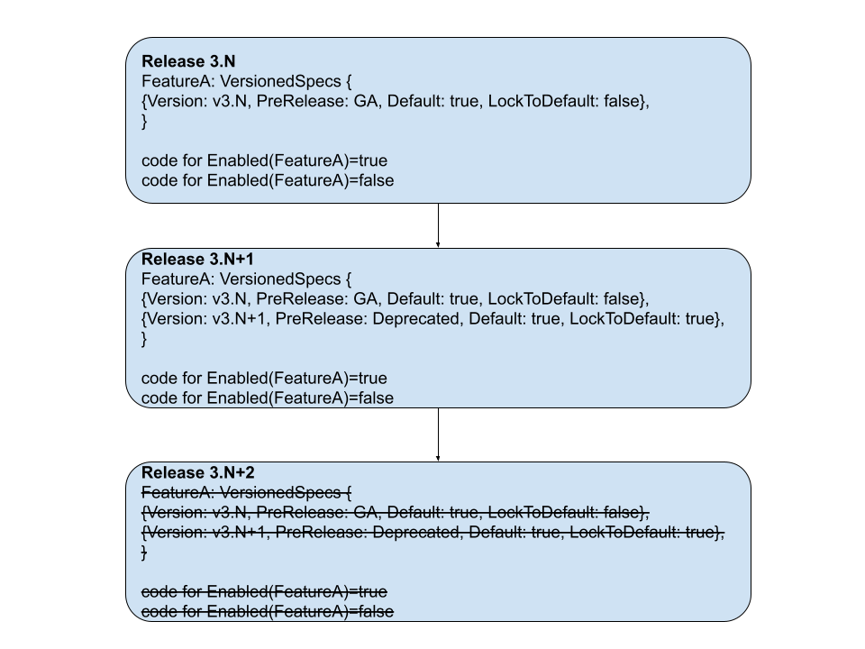

# KEP-4647: Cluster Feature Gate in etcd

<!-- toc -->
- [Release Signoff Checklist](#release-signoff-checklist)
- [Summary](#summary)
- [Motivation](#motivation)
  - [Goals](#goals)
  - [Non-Goals](#non-goals)
- [Proposal](#proposal)
  - [User Stories (Optional)](#user-stories-optional)
    - [Story 1](#story-1)
    - [Story 2](#story-2)
    - [Story 3](#story-3)
  - [Notes/Constraints/Caveats (Optional)](#notesconstraintscaveats-optional)
    - [Should we allow users to dynamically change feature gate values at runtime via etcd endpoints?](#should-we-allow-users-to-dynamically-change-feature-gate-values-at-runtime-via-etcd-endpoints)
  - [Risks and Mitigations](#risks-and-mitigations)
    - [Data Compatibility Risks During Feature Value Change](#data-compatibility-risks-during-feature-value-change)
    - [Feature Implementation Change Risks](#feature-implementation-change-risks)
- [Design Details](#design-details)
  - [Versioned Feature Gates](#versioned-feature-gates)
  - [Register New Feature Gates](#register-new-feature-gates)
  - [Set the Feature Gates](#set-the-feature-gates)
  - [Bootstrap Cluster Feature Gates](#bootstrap-cluster-feature-gates)
    - [Alternative](#alternative)
  - [Consensus Algorithm](#consensus-algorithm)
    - [Alternative](#alternative-1)
    - [New Raft Proto Changes](#new-raft-proto-changes)
    - [New Backend Schema Changes](#new-backend-schema-changes)
  - [Cluster Member Changes](#cluster-member-changes)
    - [Restart a Member](#restart-a-member)
    - [Remove a Member](#remove-a-member)
    - [Add a New Member](#add-a-new-member)
    - [Cluster Online Upgrade](#cluster-online-upgrade)
    - [Cluster Online Downgrade](#cluster-online-downgrade)
    - [Cluster Offline Downgrade](#cluster-offline-downgrade)
    - [Add a New Learner](#add-a-new-learner)
  - [Interface Change for Server Code](#interface-change-for-server-code)
  - [Client APIs Changes](#client-apis-changes)
  - [Feature Removal](#feature-removal)
  - [Test Plan](#test-plan)
      - [Prerequisite testing updates](#prerequisite-testing-updates)
      - [Unit tests](#unit-tests)
      - [Integration tests](#integration-tests)
      - [e2e tests](#e2e-tests)
      - [robustness tests](#robustness-tests)
  - [Graduation Criteria](#graduation-criteria)
    - [Alpha](#alpha)
    - [Beta](#beta)
    - [GA](#ga)
  - [Upgrade / Downgrade Strategy](#upgrade--downgrade-strategy)
  - [Version Skew Strategy](#version-skew-strategy)
- [Implementation History](#implementation-history)
- [Drawbacks](#drawbacks)
- [Alternatives](#alternatives)
    - [Could it done on the client side instead of inside etcd?](#could-it-done-on-the-client-side-instead-of-inside-etcd)
  - [Configure new cluster feature gates globally and reject members reconnecting with different feature flags](#configure-new-cluster-feature-gates-globally-and-reject-members-reconnecting-with-different-feature-flags)
  - [Turn cluster features on/off explicitly after cluster starts](#turn-cluster-features-onoff-explicitly-after-cluster-starts)
  - [Push vs poll when leader decides cluster feature gate values](#push-vs-poll-when-leader-decides-cluster-feature-gate-values)
<!-- /toc -->

## Release Signoff Checklist

<!--
**ACTION REQUIRED:** In order to merge code into a release, there must be an
issue in [kubernetes/enhancements] referencing this KEP and targeting a release
milestone **before the [Enhancement Freeze](https://git.k8s.io/sig-release/releases)
of the targeted release**.

For enhancements that make changes to code or processes/procedures in core
Kubernetes—i.e., [kubernetes/kubernetes], we require the following Release
Signoff checklist to be completed.

Check these off as they are completed for the Release Team to track. These
checklist items _must_ be updated for the enhancement to be released.
-->

Items marked with (R) are required *prior to targeting to a milestone / release*.

- [ ] (R) Enhancement issue in release milestone, which links to KEP dir in [kubernetes/enhancements] (not the initial KEP PR)
- [ ] (R) KEP approvers have approved the KEP status as `implementable`
- [ ] (R) Design details are appropriately documented
- [ ] (R) Test plan is in place
- [ ] (R) Graduation criteria is in place
- [ ] "Implementation History" section is up-to-date for milestone
- [ ] User-facing documentation has been created in [etcd-io/website], for publication to [etcd.io]
- [ ] Supporting documentation—e.g., additional design documents, links to mailing list discussions/SIG meetings, relevant PRs/issues, release notes

<!--
**Note:** This checklist is iterative and should be reviewed and updated every time this enhancement is being considered for a milestone.
-->

[etcd.io]: https://etcd.io/
[kubernetes/enhancements]: https://git.k8s.io/enhancements
[kubernetes/kubernetes]: https://git.k8s.io/kubernetes
[etcd-io/website]: https://github.com/etcd-io/website

## Summary

We're introducing a mechanism to enable and verify feature enablement across all members of an etcd cluster. This provides a standardized way for contributors to develop features that impact the etcd apply loop, while giving users confidence that enabled features will function consistently across the entire cluster.

## Motivation

In [KEP-4578](https://github.com/kubernetes/enhancements/issues/4578), we introduced the feature gate framework into etcd, allowing users to configure feature gates on each member. However, this approach allows each member to run with different features, leading to potential inconsistencies in cluster behavior and data processing. This prevents users from reliably depending on a feature, as they might not know which server will handle their request, and it also hinders etcd contributors from creating features that impact the core etcd apply loop due to the risk of introducing inconsistencies.

For features that fundamentally influence the workings of the entire cluster we need a mechanism that ensures that all members agree on the feature enablement. To address these challenges, we propose introducing a cluster-wide feature enablement mechanism that ensures consistent feature activation across all members of an etcd cluster.

### Goals

* Cluster-Wide Feature Consistency: Establish a server-side mechanism to ensure that specific features are either enabled or disabled consistently across all members of an etcd cluster.
* Safe Feature Dependency: Provide a client-side mechanism that allows external systems and applications to reliably determine if a cluster-wide feature is enabled, enabling them to safely depend on and utilize that feature.

### Non-Goals

* Backporting a feature gate to a patch version is not supported.

## Proposal

### User Stories (Optional)

#### Story 1

A developer is adding a new feature that modifies the etcd apply loop. This change could impact how data is processed and replicated across the cluster. An example of such a feature is [persisted lease checkpoints](https://github.com/etcd-io/etcd/pull/13508). Currently, enabling such a feature requires careful coordination and potentially taking the entire cluster down to ensure all members apply the changes consistently. This lack of flexibility restricts development and can lead to operational disruptions.

With cluster-wide feature enablement, we can enable or disable such features in a controlled manner, ensuring consistent behavior across all members during a rolling upgrade, while allowing users to enable/disable the feature as they wish. This empowers developers to iterate more quickly and safely, while also providing operators with greater flexibility to manage feature rollouts and upgrades without disrupting service.

#### Story 2

A Kubernetes developer would like use a new great etcd feature (StreamingList for example), but it is not available on all supported etcd versions. What can they do?
Historically, Kubernetes avoided using any features that were not available on all supported versions of etcd.
From K8s 1.31, Kubernetes added very complicated and fragile system: [`FeatureSupportChecker`](https://github.com/kubernetes/kubernetes/blob/db82fd1604ebf327ab74cde0a7158a8d95d46202/staging/src/k8s.io/apiserver/pkg/storage/etcd3/feature/feature_support_checker.go#L42) to detect etcd version, parse it and guess whether this feature based on a set of hardcoded etcd version. It does not really know if the feature is enabled by the feature `--experimental` flag, and it only checks the etcd version when the apiserver starts, assuming the feature will not change later..

With a client-side mechanism to reliably determine if a cluster-wide feature is enabled,  would allow Kubernetes to immediately utilize new features.

#### Story 3

Imagine a scenario: after some qualification a feature was graduated from experimental and enabled by default in new release. However, it quickly turned out that the feature is bugged. Users would like to disable it ASAP to protect their production.

In a HA cluster, they would need to restart each server node one by one with feature changed from enabled to disabled. Today, after the restarting process begins and before all nodes are restarted, the behavior of the feature is really undefined: it is enabled on some nodes and disabled on the other nodes. For etcd developers, it's nearly impossible to consider and thoroughly test all the mixed enablement scenarios in a distributed system and ensure that feature maintains correctness during the undefined state. 

Now with the cluster feature gate, the feature would be disabled once it is disabled in one server, and we can deterministically tell if the feature is enabled or disabled for the whole cluster at any moment and easier to write tests to ensure correctness.

This story applies similarly to the upgrade/downgrade scenarios as well.

### Notes/Constraints/Caveats (Optional)

#### Should we allow users to dynamically change feature gate values at runtime via etcd endpoints?
In our proposal, the feature gates of a cluster can only be configured through the feature gate flags/config files when the cluster/members starts. Users cannot dynamically change feature gate values through some etcd endpoints.

The main downside of this restriction is that it requires member restart to change a feature value which might be to slow for some critical bugs. But the alternative would open a security pandora box by allowing clients to change etcd configuration from etcd endpoints.

### Risks and Mitigations

#### Data Compatibility Risks During Feature Value Change

There are some features that would need to touch data in the apply/storage layer. Disabling them might result in orphaned data or unrecognizable data that could be breaking.
How do we handle the data change? 
1. if the etcd server knows this feature, it should be able to handle the data when the feature is on or off. How it handles the data at WAL entry `i` is determined by the cluster feature flag set from raft before WAL entry `i`. 
1. if the etcd server does not know this feature, i.e. its version is not compatible with this feature, it means the data is not compatible with the storage version. The storage version migration should handle cleaning up older or newly introduced data.

Overall, when developers introduce new data scheme with a feature, they should be careful to include data cleaning in `schema.UnsafeMigrate`. But we prefer not to have a mechanism to disallow such features to be turned off after they are turned on because new features could be buggy, we need to keep the option to be able to turn it off without bring down the whole cluster.

#### Feature Implementation Change Risks

There are cases when a developer wants to change how an existing feature works. This would make things complicated in a mixed version cluster. One member could have the old implementation while another member uses the latest implementation. How can we make sure the cluster works consistently?

Ideally, the developer should introduced a new feature if they want to do major changes. If that is not desirable, similar to [how Kubernetes handles feature gating changes for compatibility version](https://github.com/kubernetes/enhancements/tree/master/keps/sig-architecture/4330-compatibility-versions#feature-gating-changes), we need to keep the implementation history for at least 2 minor versions (allowed version skew) in the code base if the feature change affects data in anyway, like
```go
if c.FeatureEnabled(FeatureA) && c.ClusterParams().Version() <= "3.7" {implementation 1}
if c.FeatureEnabled(FeatureA) && c.ClusterParams().Version() > "3.7" {implementation 2}
```
This way the cluster would work consistently because there is a single ClusterVersion across the whole cluster.

It may not be necessary for some changes if the changes do not affect user facing apis or data consistency.
We would only make version based switching optional and best effort, at the discretion of the developers and reviewers. 

However, we should make sure the feature is well tested for mixed version scenarios in robustness test.

## Design Details

On high level, a cluster feature gate would need:
1. a way to [adjust the cluster feature gate enablement](#versioned-feature-gates) during downgrade/upgrade according to the cluster version capabilities.
1. a way to [register new feature gates](#register-new-feature-gates) when a developer adds new features.
1. a way to [set the feature gates](#set-the-feature-gates) when each member starts up.
1. a way to [bootstrap the cluster feature gates](#bootstrap-cluster-feature-gates) consistently across the cluster even before the leader is elected.
1. a [consensus algorithm](#consensus-algorithm) to determine if a feature is enabled for the whole cluster, even in mixed version scenarios.
1. be able to perform various [cluster member changes](#cluster-member-changes) without breaking the consensus of cluster features.
1. an [interface](#interface-change-for-server-code) to query if a feature is enabled for the whole cluster to be used in the server code.
1. [client APIs](#client-apis-changes) to query if a feature is enabled for the whole cluster.
1. a path to [remove a feature gate](#feature-removal) when it is no longer useful or have graduated.

### Versioned Feature Gates

Imaging the following scenario:
  * every server in the cluster is on 3.7, and a new Alpha feature is enabled, which would write a new field to wal.
  * after a while, downgrade is enabled, so cluster version is downgraded to 3.6.
  * when the cluster version is downgrade to 3.6, the flags of each member are not changed. But we should still disable the Alpha feature, so that any new data written would be compatible to the downgrade target version.

So similar to how cluster version determines the capability, cluster features should be tied to the cluster version. 

When the cluster version changes, the leader will try to re-reconcile the feature enablement based on the original flag settings of each member and the defaults and togglability of features at the cluster version. If a feature is pre-Alpha or locked to default at the cluster version, the feature value would not be set even if the feature is explicitly set to `true/false` in all the members' flags.

If a feature is not explicitly set in the flags of any member, its enablement would be set based on defaults at the cluster version and could change when cluster version changes. If it does not change with cluster version, an Alpha feature could be stuck in `false` until the feature eventually get to `GA, LockedToDefault: true` if the cluster only goes through rolling upgrade.

### Register New Feature Gates

A feature can be registered as server level feature or cluster level feature, but not both.
For data compatibility, we do not support changing a feature gate from one type to another. 
If a developer finds out that their feature needs to be a cluster level feature instead of server level after a release, they should add a new feature and use a new feature name.

NOTE: even though we have `PreRelease` information in the feature spec, the purpose of cluster feature gate is not for lifecycle management. It is mainly for cluster level feature enablement. So a cluster feature can be `false`, and may not be removed even after graduation if we want to keep its togglability. 
This is different from server level feature gate, where the feature gate is used for lifecycle tracking purpose, and a feature gate is expected to be removed eventually and permanent boolean flags would be added if needed. 

```go
DefaultEtcdServerFeatureGates := map[Feature]VersionedSpecs {
		featureA: VersionedSpecs{
			{Version: mustParseVersion("3.6"), Default: false, PreRelease: Beta},
			{Version: mustParseVersion("3.7"), Default: true, PreRelease: GA},
      {Version: mustParseVersion("3.8"), Default: true, PreRelease: Deprecated, LockedToDefault: true},
		},
		featureB: VersionedSpecs{
			{Version: mustParseVersion("3.7"), Default: false, PreRelease: Alpha},
		},
}
DefaultEtcdClusterFeatureGates := map[Feature]VersionedSpecs {
		featureC: VersionedSpecs{
			{Version: mustParseVersion("3.8"), Default: false, PreRelease: Beta},
      {Version: mustParseVersion("3.9"), Default: false, PreRelease: GA},
		},
		featureD: VersionedSpecs{
			{Version: mustParseVersion("3.7"), Default: false, PreRelease: Alpha},
			{Version: mustParseVersion("3.8"), Default: true, PreRelease: Deprecated},
		}
}
```

### Set the Feature Gates

To set the correct user expectation, we will add a new flag `--cluster-feature-gates` (+`config-file` configuration support) similar to the server `--feature-gates` to set the values of cluster feature gates as expected by the local server. The server will use this flag value to set the `proposed_cluster_params` sent to the cluster. The final values of the cluster feature gate are actually decided through raft consensus.

We do not support dynamically changing the feature gates when the server is running.

### Bootstrap Cluster Feature Gates

When a new cluster starts, the cluster starts to accept write requests once a leader is elected. At this point, the cluster version might still be `nil` or set to the `MinClusterVersion = "3.0.0"`, different members might have set different values for the `--cluster-feature-gates` flag. The leader would not have decided the values of cluster feature gates yet. What should the values for the cluster features be during that time on a server?
  * we cannot set the cluster feature values purely based on local `--cluster-feature-gates` flag and local server version, because `--cluster-feature-gates` flag values might be different on different servers.
  * if we set the cluster feature gate to `nil` or tie it to the `MinClusterVersion`, every cluster feature would be off at that moment. This would also apply to GA features as well.
    * but suppose `featureA` GAs at version 3.7, and the `if c.FeatureEnabled(featureA) {} else {}` switch code is removed at 3.8, if we start a new cluster with 2 nodes at 3.7, and 1 node at 3.8, during the period when the cluster feature gate is `nil`, `featureA` would be disabled in the 3.7 members, and enabled in the 3.8 members because the feature gate code is already removed in 3.8 and forever on. 
    * This means that we have to choose between never cleaning up GA features or disallowing starting a new cluster with mixed version members.
  * if we set the cluster feature values based on the defaults at the local server version, we run the risk of a feature set to different default values between members of different versions for a mixed version cluster. 

Essentially, consistency of cluster feature gates during new cluster bootstrap mandates all cluster members should have the same major.minor version when starting a brand new cluster.

On the other hand, cluster feature gates would not affect rolling upgrade/downgrade/update of existing clusters. As long as the cluster version is determined, the cluster feature gate can be set consistently.

Here is how we guarantee no mixed-version new clusters:

1. When a server starts, it sends its original flag values of `--cluster-feature-gates` and other cluster params through a new `ProposedClusterParams` field in the `MemberAttributes` update in `publishV3`. In the `ProposedClusterParams`, there is also a `Version` field set to the `ServerVersion.MajorMinor`. The server will bootstrap the `ClusterParams` with the default values at the `ServerVersion` with all Alpha and Beta cluster feature gates disabled (because we may want to change the default value of a Beta feature in patch version).

1. Whenever a server receives `MemberAttributes` update of any peer, it will check the new `ProposedClusterParams.Version` against its `ClusterParams.Version`, and will panic if the `ProposedClusterParams.Version` is less than `ClusterParams.Version`. This would make sure a brand new cluster always starts with the same version (Major.Minor) for all members.
   * if it is an existing cluster with the cluster version set already, `ClusterParams.Version` would be equal to the `ClusterVersion`. Since existing mechanism ensures that new servers would be rejected if its server version is lower than the `ClusterVersion` unless downgrade is enabled, the `ProposedClusterParams.Version` of a new/restarted member would never be less than `ClusterParams.Version`.
   * if it is a brand new cluster, the cluster would not start successfully unless all members have the same Major.Minor version in `ProposedClusterParams.Version`, because two members of different versions would mutually make each other panic.

1. After a leader is elected and `ClusterVersion != nil && ClusterVersion > MinClusterVersion`, the leader will decide the `ClusterParams` by 
   * setting `ClusterParams.Version` to the `ClusterVersion`
   * reconciling the boolean feature enablement based on the flag values in `ProposedClusterParams` from all the voting `MemberAttributes` it has received if the feature value can be set at the `ClusterParams.Version`.
   * setting the values for params not explicitly set based on the defaults at `ClusterParams.Version`.

If a server restarts for an existing cluster, it bootstraps its `ClusterParams` and `ClusterVersion` from existing value from the backend or WAL.

#### Alternative

Instead of killing existing members due to inconsistent version of a new member, another option to ensure consistent cluster features is to make sure the cluster is not serving any traffic before a consensus of the cluster features has been reached. This is a clean and less hacky way of handling the bootstrap. The downsides include:

1. this is a big change to etcd bootstrap logic: the cluster is only ready to serve client traffic after additional rounds of raft communications instead of right after the leader is elected. 

1. new clusters with mixed versions of with and without this ready logic change would still be problematic and need to be prohibited in the documentation. 

### Consensus Algorithm

To guarantee consistent value of if a feature is enabled in the whole cluster, the leader would decide if the feature is enabled for all cluster members, and propagate the information to all members. To make our algorithm also extensible to other cluster level parameters, we will change our discussions of the consensus algorithm from cluster feature gates to a more general concept of cluster parameters.

1. When a server starts, it bootstraps its `ClusterParams` from existing value from the backend or WAL, or if it is a brand new cluster, from the defaults with all Alpha and Beta cluster feature gates disabled based on its local server version.

1. When a server starts, it sends its original flag values of `--cluster-feature-gates` and other cluster params through a new `ProposedClusterParams` field in the `MemberAttributes` update in `publishV3`.

1. After a leader is elected, the leader will decide the `ClusterParams` by reconciling the `ProposedClusterParams` it has received so far from the voting members (updated), and send the result to all members through `ClusterVersionSetRequest`.
   * for boolean feature enablement, the leader will first decide the default feature value based on the `ClusterVersion`,
     * if default is `true`, and if the feature is explicitly set to `false` on any of the updated voting members, it would be set to `false`
     * if default is `false`, and if the feature is explicitly set to `true` on all of the updated voting members, it would be set to `true`
   * we are changing the `monitorClusterVersions` loop to send `ClusterVersionSetRequest` whenever there is an update of `ClusterVersion` or `ClusterParams`, with a new additional `ClusterParams` field in `ClusterVersionSetRequest`.
     * another option is to add a new `monitorClusterParams` loop to send `ClusterParamsSetRequest`. This would be much more complicated because whenever `ClusterVersion` is updated, we have to update `ClusterParams` atomically in a single request to ensure feature compatibility with the version. That means we could potentially have 2 parallel requests to update `ClusterParams` from the `monitorClusterVersions` and `monitorClusterParams` loops, which could result in racing conditions.
     * ideally `ClusterVersion` should just be a subfield in `ClusterParams` and we should rename the functions and requests, but due to backward compatibility, we cannot easily change that.

1. When a member receives `ClusterVersionSetRequest`, it applies the updates to their `ClusterParams`, and saves the results in the `cluster` bucket in the backend.

#### Alternative

Here we have decided to rely on the leader to send a raft request to set the cluster params. This is how most of the properties of the cluster is set. But in the past we have had some issues with stale leader trying to compete with current leader. This would add yet another decision for the leader to handle.

Alternatively, we can have each individual member decide the final cluster params by reconciling the proposed values locally after receiving the proposals from other members. This approach has the benefit of skipping a raft step and not changing `monitorClusterVersions`. However it would make it impossible to change the reconciliation logic ever. Because if we change the logic in 3.N+1 from 3.N, when upgrading an existing cluster from 3.N to 3.N+1, members at different versions will have different reconciliation implementations, thus resulting inconsistent behaviors. 

We cannot guarantee to get the reconciliation logic perfect on the first release, and considering the feature setting for a cluster is most likely idempotent, the risk of issues with stale leader is actually much smaller than other use cases of the leader, we will proceed with the leader based approach.

#### New Raft Proto Changes

```proto
// api/membershippb/membership.proto

message Feature {
  option (versionpb.etcd_version_msg) = "3.7";
  string name = 1;
  bool enabled = 2;
}
// Parameters that need consensus in the whole cluster to function properly.
message ClusterParams {
  option (versionpb.etcd_version_msg) = "3.7";
  // version indicates the version defaults of params would be set based on.
  string version = 1;
  repeated Feature feature_gates = 2;
}

message Attributes {
  option (versionpb.etcd_version_msg) = "3.5";

  string name = 1;
  repeated string client_urls = 2;
  // the values of all cluster level parameters set by the configuration of the member server.
  ClusterParams proposed_cluster_params = 3 [(versionpb.etcd_version_field)="3.7"];
}

message ClusterVersionSetRequest {
  option (versionpb.etcd_version_msg) = "3.5";

  string ver = 1;
  // cluster level parameters for the whole cluster at the cluster version.
  ClusterParams cluster_params = 2 [(versionpb.etcd_version_field)="3.7"];
}
```

#### New Backend Schema Changes
We will save the consensus values of `ClusterParams` in the `cluster` bucket in the backend.

### Cluster Member Changes

#### Restart a Member

When a member is restarted, its new flag settings would be published in `MemberAttributes` update through `publishV3`. The leader would re-reconcile the `ClusterParams` based on the updated list of voting members and update the `ClusterParams` if needed.

#### Remove a Member

When a member is removed, it would be removed from the members list. The leader would re-reconcile the `ClusterParams` based on the updated list of voting members and update the `ClusterParams` if needed.

#### Add a New Member

When a member is added, its flag settings would be published in `MemberAttributes` update through `publishV3`. The leader would re-reconcile the `ClusterParams` based on the updated list of voting members and update the `ClusterParams` if needed.

#### Cluster Online Upgrade

The cluster feature gate feature would not support live upgrade in Alpha stage (from v3.6 to v3.7).

When a cluster upgrades from a lower version (>=v3.7), before all members are upgraded, the cluster version will remain at the lower version. The leader would re-reconcile the `ClusterParams` based on the updated list of voting members and update the `ClusterParams` if needed whenever a member is restarted. After all members are upgraded, the cluster version will be updated to the target version along with the `ClusterParams` by the leader.

#### Cluster Online Downgrade

The online downgrade process is started by `etcdctl downgrade enable $TARGET_VERSION`. When the cluster version is downgraded, the `ClusterParams` will be updated based on the cluster version. If the target version is below v3.7, `ClusterParams` will be set to `nil`. When a member receives `ClusterParams=nil`, it will delete the data from the backend.

If the target version is not below v3.7, when a member restarts with the target version binary, its new flag settings would be published in `MemberAttributes` update through `publishV3`. The leader would re-reconcile the `ClusterParams` based on the updated list of voting members and update the `ClusterParams` if needed.

#### Cluster Offline Downgrade
If a cluster parameter is available in the lower version, the lower version should be able to handle its data.
If a cluster parameter is not available in the lower version, then its data should be already handled by the `UnsafeMigrate` function. 
So the only part we need to add to the offline downgrade process is in `UnsafeMigrate`, prune any feature:value pair that is not available to the target version.

#### Add a New Learner

The leader decides the `ClusterParams` based on the `ProposedClusterParams` of voting members only. So when a new learner joins the cluster, it should not affect the `ClusterParams` of the existing cluster. The learner will receive `ClusterParams` from the leader and handle data in the same way as the rest of the cluster. 

When a learner is promoted, the leader will reconcile the `ClusterParams` based on the updated list of voting members and update the `ClusterParams` if needed.

### Interface Change for Server Code

In `membership.RaftCluster`, we will add a new `ClusterParams` pointer to store all the cluster level parameters.

```go
type ClusterParams struct {
  FeatureGates map[featuregate.Feature]bool
  // other cluster level parameters
}
type RaftCluster struct {
  ...
  Params *ClusterParams
  ...
}

func (c *RaftCluster) FeatureEnabled(f featuregate.Feature) {
  if c.Params != nil && enabled, ok := c.Params.FeatureGates[f]; ok {
    return enabled
  }
  return false
}

func (s *EtcdServer) FeatureEnabled(f Feature) bool {
  // if f is registered in the cluster feature gate
  // return s.cluster.FeatureEnabled(f)
  // else 
  // return s.ServerFeatureGate.Enabled(f)
}

```

### Client APIs Changes

New client APIs will be added to query if a feature is enabled across the cluster. Because the client does not know which server they are talking to, we only expose cluster level features through these APIs.

For grpc, a new rpc type would be added to the `Maintenance` service.

```proto
service Maintenance {
  ...
  rpc FeatureGateStatus(FeatureGateStatusRequest) returns (FeatureGateStatusResponse) {
    option (google.api.http) = {
      post: "/v3/maintenance/featuregate"
      body: "*"
    };
  }
  ...
}
message Feature {
  string name = 1;
  bool enabled = 2;
}
message FeatureGateStatusRequest {
  repeated string features = 2;
}
message FeatureGateStatusResponse {
  ResponseHeader header = 1;
  repeated Feature features = 3;
}
```

The clientv3 function would look like:

```go
package clientv3

type Maintenance interface {
  FeatureGateStatus(ctx context.Context, features ...string) (*FeatureGateStatusResponse, error)
}
```

The `etcdctl` commands could look like:
* `etcdctl endpoint featuregate $featureName` returns true if the feature is enabled

Because the feature gate of a cluster could change anytime, even if the client has queried the etcd cluster for feature availability before sending a request, feature availability can be changed by the time the request is sent. We are proposing to add a new `WithRequireFeature(ctx context.Context, featureName string) context.Context` function in `clientv3` package to pass metadada of the required feature into the context which could be checked against the server cluster feature gate to determined the request should be served. 

### Feature Removal

When a feature has graduated or turns out not to be useful, we may not want to keep the code path for both `FeatureA=true|false` anymore. 

We need the consider the following scenario:
1. `FeatureA` is set to `val` (`val=true|false`) in an existing cluster.
1. A new member of newer minor or batch version joins with the code path `FeatureA=val` removed.
1. In this case, the new member would not be able to handle the existing data it receives requiring the code path `FeatureA=val`.

To avoid this problem, we need to ensure that in the previous version, `FeatureA` can only be set to the fixed value `!val`, because etcd supports 1 minor version skew in a cluster.

So to make it possible to remove a feature, we require a feature to go through the following 3 stages toward deprecation before it can be removed:
1. Feature has been stable in the previous lifecycle for at least 1 minor release (no change of default values in any patch version of this minor version). This is to ensure we would not have to change its default value in the next stage.
1. Feature has been stable in lifecycle `PreRelease: Deprecated, {Default: defaultVal, LockToDefault: true` for at least 1 minor release.
1. Feature can be removed in the next release.

The figure below shows an example of how a GA feature can be removed.


### Test Plan

[x] I/we understand the owners of the involved components may require updates to
existing tests to make this code solid enough prior to committing the changes necessary
to implement this enhancement.

##### Prerequisite testing updates

##### Unit tests

New feature gate unit tests will be added.

##### Integration tests

New feature gate integration tests will be added.

##### e2e tests

New feature gate e2e tests will be added.

We will also add downgrade/upgrade/change member e2e tests to make sure the feature gate does not break the cluster in upgrade/downgrade/change member scenarios.

##### robustness tests

We will add a test cluster feature gate that modifies WAL/backend data when enabled to test data consistency in various robustness failure points.

### Graduation Criteria

#### Alpha

- Feature implemented behind a server level feature flag `ClusterFeatureGate`.
- Feature supports testing with new cluster, and does not support upgrade from v3.6.
- Unit tests added.
- Initial e2e tests added.
- Metrics added.
- cluster level feature gate client API implemented.

#### Beta

- e2e tests for upgrade & downgrade & member change scenarios completed.
- robustness tests with a test cluster feature gate added for current version.
- robustness tests with a test cluster feature gate added for downgrade/upgrade scenarios.
- backport cluster level feature gate client API to 3.6 to return not implemented(404).
- documentation.

#### GA

- A real cluster level feature is implemented with the cluster feature gate.

### Upgrade / Downgrade Strategy

For regular downgrade process, `schema.UnsafeMigrate` should clean up feature gates that are not available in the target version.

The `ClusterFeatureGate` feature would available in v3.7+. In v3.7, `ClusterFeatureGate` would be Alpha, and no upgrade from v3.6 is supported if the feature is enabled.

Because `proposed_cluster_params` and `ClusterParams` raft messages or fields will be set to `nil` if `ClusterVersion < 3.7` no schema/proto backporting is needed for 3.6. 

### Version Skew Strategy

The feature removal requirements entail a maximum version skew of 1 minor version in an etcd cluster.

## Implementation History

<!--
Major milestones in the lifecycle of a KEP should be tracked in this section.
Major milestones might include:
- the `Summary` and `Motivation` sections being merged, signaling SIG acceptance
- the `Proposal` section being merged, signaling agreement on a proposed design
- the date implementation started
- the first Kubernetes release where an initial version of the KEP was available
- the version of Kubernetes where the KEP graduated to general availability
- when the KEP was retired or superseded
-->

## Drawbacks

<!--
Why should this KEP _not_ be implemented?
-->

## Alternatives

#### Could it done on the client side instead of inside etcd? 
One could argue that it is easy to know if a feature enabled for the whole cluster by querying each member if the feature is enabled on the client side. But there are several caveats with this approach:
* not all members are available all the time. if some member is not available, it is questionable if the feature can be used, and that could break the HA assumption. 
* if there is a new operation that can only be used when a feature is enabled, there is no guarantee that the user or the etcd leader could check if the feature is enabled and then assume it will still be enabled when they send a following request or when a particular server applies the operations. 

As a strongly consistent and reliable data store, it is critical for etcd to provide consistent and predictable operations to the clients. So we have to do the feature coordination inside etcd. 

### Configure new cluster feature gates globally and reject members reconnecting with different feature flags

Instead of negotiating a common feature gate configuration after each member starts with their own feature gate flags, another way to guarantee consistencies of feature gate between different members is to allow configuring the feature gates of a new cluster globally when the cluster starts, and prevent a new/restarting member with an inconsistent feature gate from joining the cluster in the first place. 

Pros for this approach:
* no complex raft changes
* guarantee that feature gates would not change throughout the life of the cluster.

Cons for this approach:
* user changing the etcd manifests/config file might cause unexpected crashloop.
* impossible to do no downtime update of a feature, because the whole cluster needs to be brought down before changing a feature enablement.
* impossible to do no downtime upgrade/downgrade, because a new feature might be introduced in the new version, or the lifecycle of an existing feature could change, the whole cluster needs to be brought down before enabling a new feature or when encountering default/locked feature value conflicts.

Due to these strong limitations of this approach, we believe the proposed solution is a better approach even though the logic and implementation is more complex. 

### Turn cluster features on/off explicitly after cluster starts

In this proposal, we turn features on/off when starting a server through its `--cluster-feature-gates` flag, and rely on the leader to decide on which features are enabled/disabled at the cluster level.

Another approach is not using the `--cluster-feature-gates` flag when servers start, but instead after the cluster is running, turn cluster features on/off explicitly through `etcdctl`. 

Pros for the `etcdctl` method:
* users get immediate feedback if a feature could be enabled/disabled.
* no need to store which features are enabled/disabled for each member through raft.
* cluster features can be turned on/off dynamically without restarting the servers.
* any member handling the request would be able to decide the cluster feature values locally based on cluster version and send `ClusterFeatureGateSetRequest` to raft.

Cons for the `etcdctl` method:
* a separate step is needed to configure the feature gate, which means:
  * users rely on manifest/config files to start etcd cluster would need to implement additional hook to set the feature gates.
  * the behavior of feature gate when that step is skipped could be surprising for the users.
    * when a brand new cluster starts, the feature gate would just default to the default values at the cluster version.
    * when it is not a brand new cluster and a feature enablement is saved to the backend and WAL, its value can be inherited implicitly from data files even when the users are not aware. 
* bifurcation of how to set server level and cluster level features, which can be confusing for the users.
* security risks associated with being able to change the feature gate anytime.

Due to these reasons, we think even though this approach may be slightly simpler in terms of raft algorithm, it is not good to push more burdens to users.

### Push vs poll when leader decides cluster feature gate values

The way cluster version is decided in etcd cluster is that the leader would poll all members via the `/version` endpoint, and decide the min version for the cluster version. 

The main reason behind that listed in the [original PR](https://github.com/etcd-io/etcd/pull/2718) is: "Before a member actually joins a etcd cluster, it should check the version of the cluster. Push does not work since the other members cannot push
version info to it before it actually joins". This reason does not apply to the cluster feature gate because we do not plan to reject a node based on the compatibility of a feature, as explained in the [Caveats section](#should-we-prevent-a-new-member-with-an-inconsistent-feature-gate-from-joining-the-cluster).

Pros for pushing model:
* linearizable steps to determine feature gates.
* no need to constantly polling all members asking for their available features, saving some bandwidth.

Cons for push model:
* need to push the member attribute changes through raft, which is not as well tested as the poll based cluster version approach. 