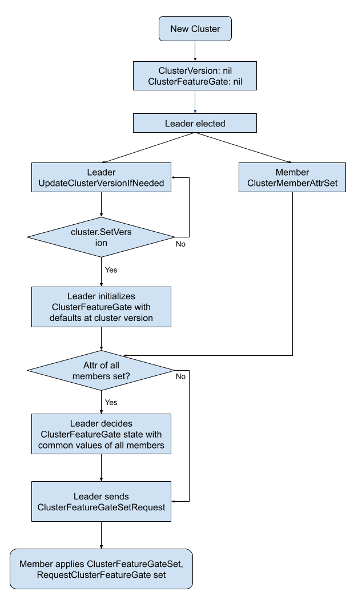

# KEP-4647: Cluster Feature Gate in etcd

<!-- toc -->
- [Release Signoff Checklist](#release-signoff-checklist)
- [Summary](#summary)
- [Motivation](#motivation)
  - [Goals](#goals)
  - [Non-Goals](#non-goals)
- [Proposal](#proposal)
  - [User Stories (Optional)](#user-stories-optional)
    - [Story 1](#story-1)
    - [Story 2](#story-2)
    - [Story 3](#story-3)
  - [Notes/Constraints/Caveats (Optional)](#notesconstraintscaveats-optional)
    - [Could it done on the client side instead of inside etcd?](#could-it-done-on-the-client-side-instead-of-inside-etcd)
    - [Should we prevent a new member with an inconsistent feature gate from joining the cluster?](#should-we-prevent-a-new-member-with-an-inconsistent-feature-gate-from-joining-the-cluster)
  - [Risks and Mitigations](#risks-and-mitigations)
    - [Backport Risks](#backport-risks)
    - [Data Compatibility Risks during Feature Value Change](#data-compatibility-risks-during-feature-value-change)
    - [Feature Implementation Change Risks](#feature-implementation-change-risks)
- [Design Details](#design-details)
  - [Register New Feature Gates](#register-new-feature-gates)
  - [Set the Feature Gates](#set-the-feature-gates)
  - [Consensus Algorithm](#consensus-algorithm)
    - [New Raft Proto Changes](#new-raft-proto-changes)
    - [How to Reach Consensus of Feature Gates for a New Cluster](#how-to-reach-consensus-of-feature-gates-for-a-new-cluster)
    - [How to Reach Consensus of Feature Gates for an Existing Cluster](#how-to-reach-consensus-of-feature-gates-for-an-existing-cluster)
    - [How Learner's Feature Gates Affects Cluster Feature Gates](#how-learners-feature-gates-affects-cluster-feature-gates)
  - [Interface Change for RaftCluster](#interface-change-for-raftcluster)
  - [Client APIs Changes](#client-apis-changes)
  - [Test Plan](#test-plan)
      - [Prerequisite testing updates](#prerequisite-testing-updates)
      - [Unit tests](#unit-tests)
      - [Integration tests](#integration-tests)
      - [e2e tests](#e2e-tests)
  - [Graduation Criteria](#graduation-criteria)
    - [Milestone 1](#milestone-1)
    - [Milestone 2](#milestone-2)
    - [Milestone 3](#milestone-3)
  - [Upgrade / Downgrade Strategy](#upgrade--downgrade-strategy)
  - [Version Skew Strategy](#version-skew-strategy)
- [Implementation History](#implementation-history)
- [Drawbacks](#drawbacks)
- [Alternatives](#alternatives)
  - [Turn Cluster Features On/Off Explicitly After Cluster Starts](#turn-cluster-features-onoff-explicitly-after-cluster-starts)
  - [Push vs Poll When Leader Decides Cluster Feature Gate](#push-vs-poll-when-leader-decides-cluster-feature-gate)
<!-- /toc -->

## Release Signoff Checklist

<!--
**ACTION REQUIRED:** In order to merge code into a release, there must be an
issue in [kubernetes/enhancements] referencing this KEP and targeting a release
milestone **before the [Enhancement Freeze](https://git.k8s.io/sig-release/releases)
of the targeted release**.

For enhancements that make changes to code or processes/procedures in core
Kubernetes—i.e., [kubernetes/kubernetes], we require the following Release
Signoff checklist to be completed.

Check these off as they are completed for the Release Team to track. These
checklist items _must_ be updated for the enhancement to be released.
-->

Items marked with (R) are required *prior to targeting to a milestone / release*.

- [ ] (R) Enhancement issue in release milestone, which links to KEP dir in [kubernetes/enhancements] (not the initial KEP PR)
- [ ] (R) KEP approvers have approved the KEP status as `implementable`
- [ ] (R) Design details are appropriately documented
- [ ] (R) Test plan is in place
- [ ] (R) Graduation criteria is in place
- [ ] "Implementation History" section is up-to-date for milestone
- [ ] User-facing documentation has been created in [etcd-io/website], for publication to [etcd.io]
- [ ] Supporting documentation—e.g., additional design documents, links to mailing list discussions/SIG meetings, relevant PRs/issues, release notes

<!--
**Note:** This checklist is iterative and should be reviewed and updated every time this enhancement is being considered for a milestone.
-->

[etcd.io]: https://etcd.io/
[kubernetes/enhancements]: https://git.k8s.io/enhancements
[kubernetes/kubernetes]: https://git.k8s.io/kubernetes
[etcd-io/website]: https://github.com/etcd-io/website

## Summary

We're introducing a mechanism to enable and verify feature enablement across all members of an etcd cluster. This provides a standardized way for contributors to develop features that impact the etcd apply loop, while giving users confidence that enabled features will function consistently across the entire cluster.

## Motivation

In [KEP-4578](https://github.com/kubernetes/enhancements/issues/4578), we introduced the feature gate framework into etcd, allowing users to configure feature gates on each member. However, this approach allows each member to run with different features, leading to potential inconsistencies in cluster behavior and data processing. This prevents users from reliably depending on a feature, as they might not know which server will handle their request, and it also hinders etcd contributors from creating features that impact the core etcd apply loop due to the risk of introducing inconsistencies.

For features that fundamentally influence the workings of the entire cluster we need a mechanism that ensures that all members agree on the feature enablement. To address these challenges, we propose introducing a cluster-wide feature enablement mechanism that ensures consistent feature activation across all members of an etcd cluster.

### Goals

* Cluster-Wide Feature Consistency: Establish a server-side mechanism to ensure that specific features are either enabled or disabled consistently across all members of an etcd cluster.
* Safe Feature Dependency: Provide a client-side mechanism that allows external systems and applications to reliably determine if a cluster-wide feature is enabled, enabling them to safely depend on and utilize that feature.

### Non-Goals

* Backporting a feature gate to a patch version is not supported.

## Proposal

### User Stories (Optional)

#### Story 1

A developer is adding a new feature of a new write type. Because it requires a consensus write, the request should be rejected if the feature is not enabled or the request can be processed on all cluster members. 
Today, each change in etcd API, requires development spenning at least 2 minor versions. First a raft proto change needs to be added and wait a release before it can be used. Only a release later it can be actually used to prevent a incompatible proto being used during upgrade/downgrade process. 

With cluster level feature gate, a server would know if a feature is enabled on all members, and decide whether or not to accept the new write request.

#### Story 2

A Kubernetes developer would like use a new great etcd feature, but it is not available on all supported etcd versions. What can they do?
Historically, Kubernetes avoided using any features that were not available on all supported versions of etcd.
From K8s 1.31, Kubernetes added very complicated and fragile system: [`FeatureSupportChecker`](https://github.com/kubernetes/kubernetes/blob/db82fd1604ebf327ab74cde0a7158a8d95d46202/staging/src/k8s.io/apiserver/pkg/storage/etcd3/feature/feature_support_checker.go#L42) to detect etcd version, parse it and guess whether this feature based on a set of hardcoded etcd version. It does not really know if the feature is enabled by the feature `--experimental` flag.

With a client-side mechanism to reliably determine if a cluster-wide feature is enabled,  would allow Kubernetes to immediately utilize new features.

#### Story 3

In a HA cluster, users would like to turn off an enabled feature. They need to restart each server node one by one with feature changed from enabled to disabled. Today, after the restarting process begins and before all nodes are restarted, the behavior of the feature is really undefined: it is enabled on some nodes and disabled on the other nodes.

Now with the cluster feature gate, we can deterministically tell if the feature is enabled or disabled for the whole cluster at any moment.

This story applies similar to the upgrade/downgrade scenarios as well.

### Notes/Constraints/Caveats (Optional)

#### Could it done on the client side instead of inside etcd? 
One could argue that it is easy to know if a feature enabled for the whole cluster by querying each member if the feature is enabled on the client side. But there are several caveates with this approach:
* not all members are available all the time. if some member is not available, it is questionable if the feature can be used, and that could break the HA assumption. 
* some feature might change how a raft message is sent and applied, and the order of messages relative to the index the feature is enabled is critical. Here the consistent index is more important than the time, and it is hard to get that outside etcd. 

#### Should we prevent a new member with an inconsistent feature gate from joining the cluster?

One way to prevent inconsistencies of feature gate between different members is to prevent a new member with an inconsistent feature gate from joining the cluster in the first place. 
We do not think this is the right way because we want to keep the ability to turn on/off a feature in a rolling sequence without bringing down the whole cluster. 


### Risks and Mitigations

#### Backport Risks

Because we are adding a new type of raft request, if we want to support feature gate as soon as in 3.6, we have to backport the proto changes and add no-op apply logic in 3.5. 
There is the potential risk of changing a stable release. But we do not think this is a real risk, because it should be a no-op change in 3.5. 
When upgrading etcd cluster from 3.5 to 3.6, the users would need to upgrade to the latest 3.5 release first.

If we do not backport to 3.5, we would need to add no-op changes in 3.6, and wait till 3.7 to add the real feature gate capabilities, which could be a long cycle of several years.

#### Data Compatibility Risks during Feature Value Change

There are some features that would need to touch data in the apply/storage layer. Disabling them might result in orphaned data or unrecognizable data that could be breaking.
How do we handle the data change? 
1. if the etcd server knows this feature, it should be able to handle the data when the feature is on or off. How it handles the data at WAL entry `i` is determined by the cluster feature flag set from raft before WAL entry `i`. 
1. if the etcd server does not know this feature, i.e. its version is not compatible with this feature, it means the data is not compatible with the storage version. The storage version migration should handle cleaning up older or newly introduced data.

Overall, when developers introduce new data with a feature, they should be careful to include data cleaning in `schema.UnsafeMigrate`. But we prefer not to have a mechanism to disallow such features to be turned off after they are turned on because new features could be buggy, we need to keep the option to be able to turn it off without bring down the whole cluster.

#### Feature Implementation Change Risks

There are cases when a developer wants to change how an existing feature works. This would make things complicated in a mixed version cluster. One member could have the old implementation while another member uses the latest implementation. How can we make sure the cluster works consistently?

Ideally, the developer should introduced a new feature if they want to do major changes. If that is not desirable, similar to [how Kubernetes handles feature gating changes for compatibility version](https://github.com/kubernetes/enhancements/tree/master/keps/sig-architecture/4330-compatibility-versions#feature-gating-changes), we need to keep the implementation history for at least 2 minor versions (allowed version skew) in the code base if the feature change affects data in anyway, like
```go
if s.FeatureEnabled(FeatureA) && s.ClusterVersion() <= "3.6" {implementation 1}
if s.FeatureEnabled(FeatureA) && s.ClusterVersion() >= "3.7" {implementation 2}
```
This way the cluster would work consistently because there is a single ClusterVersion across the whole cluster.

## Design Details

On high level, a cluster feature gate would need:
1. a way to [register new feature gates](#register-new-feature-gates) when a developer adds new features.
1. a way to [set the feature gates](#set-the-feature-gates) when each member starts up.
1. a [consensus algorithm](#consensus-algorithm) to determine if a feature is enabled for the whole cluster, even in mixed version scenarios.
1. an [interface](#interface-change-for-raftcluster) to query if a feature is enabled for the whole cluster to be used in the code.
1. [client APIs](#client-apis-changes) to query if a feature is enabled for the whole cluster.

### Register New Feature Gates

A feature can be registered as server level feature or cluster level feature, but not both.
For data compatibility, we do not support changing a feature gate from one type to another. 
If a developer finds out that their feature needs to be a cluster level feature instead of server level after a release, they should add a new feature and use a new feature name.

```go
DefaultEtcdServerFeatureGates := map[Feature]VersionedSpecs {
		featureA: VersionedSpecs{
			{Version: mustParseVersion("3.6"), Default: false, PreRelease: Beta},
			{Version: mustParseVersion("3.7"), Default: true, PreRelease: GA},
		},
		featureB: VersionedSpecs{
			{Version: mustParseVersion("3.7"), Default: false, PreRelease: Alpha},
		},
}
DefaultEtcdClusterFeatureGates := map[Feature]VersionedSpecs {
		featureC: VersionedSpecs{
			{Version: mustParseVersion("3.7"), Default: false, PreRelease: Beta},
		},
		featureD: VersionedSpecs{
			{Version: mustParseVersion("3.6"), Default: false, PreRelease: Alpha},
			{Version: mustParseVersion("3.7"), Default: true, PreRelease: Deprecated},
		}
}
```

### Set the Feature Gates
Conceptually, a feature is a new functionality etcd provides, and it has to work on individual servers first before working on the cluster. The main difference between server level and cluster level features is whether their usage require consistent value across all members.

When a user start up a new etcd cluster, it is unnecessary and confusing to require them to know the difference between server level and cluster level features. It is really up to the developers to register them to the proper type in the code.

So the cluster feature gates for a server can be set in the same way as the server level feature gates: with the `--feature-gates`flag or in the `config-file` during startup. We do not support dynamically changing the feature gates when the server is running.

After starting up, the values of all features (server+cluster level) will be stored in the `ServerFeatureGate` variable of the server.

### Consensus Algorithm

To guarantee consistent value of if a feature is enabled in the whole cluster, the leader would decide if the feature is enabled for all cluster members, and propagate the information to all members. 

1. When an etcd server starts, the values of all cluster level features in its `ServerFeatureGate` would saved in the [`member.Attributes`](https://github.com/etcd-io/etcd/blob/e37a67e40b3f5ff8ef81f9de6e7f475f17fda32b/server/etcdserver/api/membership/member.go#L38) as the field `Attributes.feature_gates`. (see the [discussion](#push-vs-poll-when-leader-decides-cluster-feature-gate) about why we choose to push the information through raft)

1. The attributes would then be [published through raft](https://github.com/etcd-io/etcd/blob/e37a67e40b3f5ff8ef81f9de6e7f475f17fda32b/server/etcdserver/server.go#L1745) and stored in the `members` bucket in the backend of all members. Whenever a new member joins or an existing member restarts, its feature gate attributes would be automatically updated in the start up process.

1. After a leader is elected, the leader will decide the values for the cluster level features based on the cluster version and server feature values of all members it receives.

1. The leader sends the final feature values in `ClusterFeatureGateSetRequest` through raft. 

1. Each member apply the updates to their cluster feature gate, and save the results in the `cluster` bucket in the backend.

#### New Raft Proto Changes

```proto
message Feature {
  string name = 1;
  bool enabled = 2;
}

message Attributes {
  option (versionpb.etcd_version_msg) = "3.5";

  string name = 1;
  repeated string client_urls = 2;
  // the values of all cluster level feature gates set by the configuration of the member server.
  Feature proposed_feature_gates = 3;
}

message ClusterFeatureGateSetRequest {
  option (versionpb.etcd_version_msg) = "3.5";

  // the values of all cluster level feature gates for the whole cluster.
  Feature feature_gates = 1;
}
```

#### How to Reach Consensus of Feature Gates for a New Cluster



We will leverage the consensus `ClusterVersion` to negotiate the cluster level feature gate values:
1. if `ClusterVersion` is not set, the cluster feature gate would be `nil`, and all features would be considered disabled. 
1. when the `ClusterVersion` is set or updated, initialize the cluster feature gate with the `ClusterVersion`. At this point,
    * if the `member.Attributes` of any members has not been set, use the default values for feature gate at version `ClusterVersion`.
    * if the `member.Attributes` of all members have been set, take the common set of all the mbmer `--feature-gates` flags and set values of the cluster feature gate: discard any features not recognized at the `ClusterVersion`, and set the feature to false if there is any member setting it to false.
    * learner nodes would not be taken into consideration because they do not serve requests.
1. if any `member.Attributes` is updated, reinitialize the cluster feature gate with the `ClusterVersion`, and repeat step 2.

* We have to do step 2 to initialize the feature gate with the `ClusterVersion` because: during downgrade process, the member flags could remain unchanged while the `ClusterVersion` is downgraded, and we need to adjust the features accordingly to be compatible with the lower version.

One drawback of this approach is that there is a period before the `ClusterVersion` is set when no feature would be available. We think that is acceptable because the `ClusterVersion` should be set soon after leader is elected, so that period should very short, and the feature settings are also consistent throughout the cluster in this period.
* an alternative would be set some default min version similar to `MinClusterVersion = "3.0.0"`. The problem is: if we want to bump `MinClusterVersion` to `4.0.0` at release 4.1.0, we could potentially break the feature gate consistency when upgrading from/downgrading to the previous 3.x release, or we would complicate the upgrade/downgrade process. 

#### How to Reach Consensus of Feature Gates for an Existing Cluster

When a new server is bootstrapped from existing backend data, it would recover the cluster feature gate settings from the backend just like how the server [recovers the cluster version](https://github.com/etcd-io/etcd/blob/67743348dcd2deb1819fded2336749449ebf95d2/server/etcdserver/api/membership/cluster.go#L264). Because the cluster version should not be downgraded except during downgrade process, we can safely assume the recovered feature gates should always be available in the server.

After that, the new server will update its new feature gate flags through `member.Attributes` as part of the server [`Start()`](https://github.com/etcd-io/etcd/blob/67743348dcd2deb1819fded2336749449ebf95d2/server/etcdserver/server.go#L532) process after bootstrapping.

**NOTE**: because we use the assumption that some features are always available for a given cluster version, we cannot allow backporting feature gates, because some features only available for some patch version would break this assumption.

**NOTE**: if there are feature gate flags saved in the backend not compatible with the new server which should only happen during downgrade, it should have been migrated as part of the downgrade process.

#### How Learner's Feature Gates Affects Cluster Feature Gates

When a new learner joins the cluster, it should not affects the cluster feature gates. 

On the other hand, the learner should use the same code path as the rest of the cluster, and be able to handle the same data. So we require the feature gates of the learner to be consistent with the cluster feature gates. If there are inconsistencies, the learner should not be allowed to join the cluster.

### Interface Change for RaftCluster

In `membership.RaftCluster`, we will add a new cluster level feature gate to store the cluster level feature enablement. 
If a feature is registered as a cluster level feature, the `EtcdServer.FeatureEnabled(f featuregate.Feature)` function will call `s.cluster.ClusterFeatureGate.Enabled(f)` instead of `s.Cfg.ServerFeatureGate.Enabled(f)`.

```go
type RaftCluster struct {
  ...
  ClusterFeatureGate featuregate.FeatureGate
  ...
}

```

### Client APIs Changes

New client APIs will be added to query if a feature is enabled across the cluster. Because the client does not know which server they are talking to, we only expose cluster level features through these APIs.

For grpc, new rpc type would be added to the `Maintenance` service.

```proto
service Maintenance {
  ...
  rpc FeatureGateStatus(FeatureGateStatusRequest) returns (FeatureGateStatusResponse) {
    option (google.api.http) = {
      post: "/v3/maintenance/featuregate"
      body: "*"
    };
  }
  ...
}
message Feature {
  string name = 1;
  bool enabled = 2;
}
message FeatureGateStatusRequest {
  repeated string features = 2;
}
message FeatureGateStatusResponse {
  ResponseHeader header = 1;
  repeated Feature features = 3;
}
```

The clientv3 function would look like:

```go
package clientv3

type Maintenance interface {
  FeatureGateStatus(ctx context.Context, features ...string) (*FeatureGateStatusResponse, error)
}
```

The `etcdctl` commands could look like:
* `etcdctl endpoint featuregate $featureName` returns true if the feature is enabled

Because the feature gate of a cluster could change anytime, even if the client has queried the etcd cluster for feature availability before sending a request, feature availability can be changed by the time the request is sent. We are proposing to add a new `WithRequireFeature(ctx context.Context, featureName string) context.Context` function in `clientv3` package to pass metadada of the required feature into the context which could be checked against the server cluster feature gate to determined the request should be served. 

### Test Plan

[x] I/we understand the owners of the involved components may require updates to
existing tests to make this code solid enough prior to committing the changes necessary
to implement this enhancement.

##### Prerequisite testing updates

##### Unit tests

New feature gate unit tests will be added.

##### Integration tests

New feature gate integration tests will be added.

##### e2e tests

We will add one cluster level experimental features to the feature gate (without removing the original experimental flag), and add e2e tests to make sure the feature gate functions equivalently to their `--experimental-xxx` flags.

We will also add downgrade/upgrade e2e tests to make sure the feature gate does not break the cluster in mixed version cluster.

### Graduation Criteria

#### Milestone 1

* cluster level feature gate implemented.
  * new raft changes added.
  * cluster feature gate added to the server code, and used by a cluster level experimental feature.
  * feature metrics added.
  * e2e tests added for the feature gate equivalent of the selected experimental feature.
  * robustness tests added for current version.

#### Milestone 2
* cluster level feature gate client API implemented.
  * grpc endpoints added.
  * `clientv3` function added.
  * `etcdctl` command added.

#### Milestone 3

* cluster level feature gate fully tested.
  * backport necessary miminal changes to 3.5.
  * feature gates clean up added to `schema.UnsafeMigrate`.
  * e2e tests for upgrade & downgrade & mixed version scenarios completed.
  * robustness tests with upgrade & downgrade & mixed version scenarios completed. 
  * documentation.

### Upgrade / Downgrade Strategy

For regular downgrade process, `schema.UnsafeMigrate` should clean up feature gates that are not available in the target version.

The feature gate feature would available in 3.6+. 
In 3.5, the necessary proto changes and no-op raft changes would be backported, but feature gate would not be available. 
When upgrading/downgrading between 3.5 and 3.6, no feature would be enabled if there is at least one member with version 3.5.

If a user uses a 3.5 version that does not recognize the new proto field, it is recommended they should upgrade to the latest 3.5 release first before upgrading to 3.6. Since unknown fields is ignored by proto, etcd should still work even if they do not upgrade to latest 3.5 version.

### Version Skew Strategy

Since we are introducing some new raft request and data, we will backport the new proto changes into 3.5, but would not use them in any way affecting 3.5 etcd server.

## Implementation History

<!--
Major milestones in the lifecycle of a KEP should be tracked in this section.
Major milestones might include:
- the `Summary` and `Motivation` sections being merged, signaling SIG acceptance
- the `Proposal` section being merged, signaling agreement on a proposed design
- the date implementation started
- the first Kubernetes release where an initial version of the KEP was available
- the version of Kubernetes where the KEP graduated to general availability
- when the KEP was retired or superseded
-->

## Drawbacks

<!--
Why should this KEP _not_ be implemented?
-->

## Alternatives

### Turn Cluster Features On/Off Explicitly After Cluster Starts

In this proposal, we turn features on/off when starting a server throught its `--feature-gates` flag, and rely on the leader to decide on which features are enabled/disabled at the cluster level.

Another approach is not using the `--feature-gates` flag when servers start, but instead after the cluster is running, turn cluster features on/off explicitly through `etcdctl`. 

Pros for the `etcdctl` method:
* users get immediate feedback if a feature could be enabled/disabled.
* no need to store which features are enabled/disabled for each member through raft.
* cluster features can be turned on/off dynamically without restarting the servers.
* any member handling the request would be able to decide the cluster feature values locally based on cluster version and send `ClusterFeatureGateSetRequest` to raft.

Cons for the `etcdctl` method:
* a separate step is needed to configure the feature gate, which means:
  * users rely on manifest/config files to start etcd cluster would need to implement additional hook to set the feature gates.
  * the behavior of feature gate when that step is skipped could be surprising for the users.
    * when a brand new cluster starts, the feature gate would just default to the default values at the cluster version.
    * when it is not a brand new cluster and a feature enabledment is saved to the backend and WAL, its value can be inherited implicitly from data files even when the users are not aware. 
* bifurcation of how to set server level and cluster level features, which can be confusing for the users.
* security risks associated with beining able to change the feature gate anytime.

Due to these reasons, we think even though this approach may be slightly simpler in terms of raft algorithm, it is not good to push more burdens to users.

### Push vs Poll When Leader Decides Cluster Feature Gate

The way cluster version is decided in etcd cluster is that the leader would poll all members via the `/version` endpoint, and decide the min version for the cluster version. 

The main reason behind that listed in the [original PR](https://github.com/etcd-io/etcd/pull/2718) is: "Before a member actually joins a etcd cluster, it should check the version of the cluster. Push does not work since the other members cannot push
version info to it before it actually joins". This reason does not apply to the cluster feature gate because we do not plan to reject a node based on the compability of a feature, as explained in the [Caveats section](#should-we-prevent-a-new-member-with-an-inconsistent-feature-gate-from-joining-the-cluster).

Pros for pushing model:
* linearizable steps to determine feature gates.
* no need to constantly polling all members asking for their available features, which saves a lot of bandwidth.

Cons for push model:
* need to push the member attribute changes through raft, which is not as well tested as the poll based cluster version approach. 