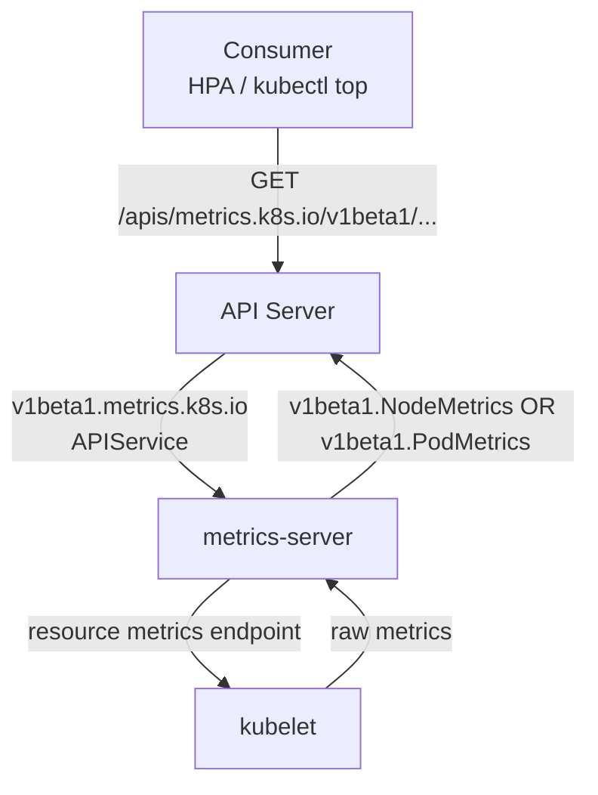

# KEP-5207: Graduate metrics.k8s.io API to stable

<!-- TOC -->
- [Release Signoff Checklist](#release-signoff-checklist)
- [Summary](#summary)
- [Motivation](#motivation)
  - [Goals](#goals)
  - [Non-Goals](#non-goals)
- [Proposal](#proposal)
  - [Risks and Mitigations](#risks-and-mitigations)
- [Design Details](#design-details)
  - [Test Plan](#test-plan)
  - [Graduation Criteria](#graduation-criteria)
    - [Alpha](#alpha)
    - [Beta](#beta)
    - [GA](#ga)
  - [Upgrade / Downgrade Strategy](#upgrade--downgrade-strategy)
  - [Version Skew Strategy](#version-skew-strategy)
- [Production Readiness Review Questionnaire](#production-readiness-review-questionnaire)
  - [Feature Enablement and Rollback](#feature-enablement-and-rollback)
  - [Rollout, Upgrade and Rollback Planning](#rollout-upgrade-and-rollback-planning)
  - [Monitoring Requirements](#monitoring-requirements)
  - [Dependencies](#dependencies)
  - [Scalability](#scalability)
  - [Troubleshooting](#troubleshooting)
- [Implementation History](#implementation-history)
- [Drawbacks](#drawbacks)
- [Alternatives](#alternatives)
<!-- /TOC -->

## Release Signoff Checklist

Items marked with (R) are required *prior to targeting to a milestone / release*.

- [ ] (R) Enhancement issue in release milestone, which links to KEP dir in [kubernetes/enhancements] (not the initial KEP PR)
- [ ] (R) KEP approvers have approved the KEP status as `implementable`
- [ ] (R) Design details are appropriately documented
- [ ] (R) Test plan is in place, giving consideration to SIG Architecture and SIG Testing input (including test refactors)
  - [ ] e2e Tests for all Beta API Operations (endpoints)
  - [ ] (R) Ensure GA e2e tests meet requirements for [Conformance Tests](https://github.com/kubernetes/community/blob/master/contributors/devel/sig-architecture/conformance-tests.md)
  - [ ] (R) Minimum Two Week Window for GA e2e tests to prove flake free
- [ ] (R) Graduation criteria is in place
  - [ ] (R) [all GA Endpoints](https://github.com/kubernetes/community/pull/1806) must be hit by [Conformance Tests](https://github.com/kubernetes/community/blob/master/contributors/devel/sig-architecture/conformance-tests.md) within one minor version of promotion to GA
- [ ] (R) Production readiness review completed
- [ ] (R) Production readiness review approved
- [ ] "Implementation History" section is up-to-date for milestone
- [ ] User-facing documentation has been created in [kubernetes/website], for publication to [kubernetes.io]
- [ ] Supporting documentation—e.g., additional design documents, links to mailing list discussions/SIG meetings, relevant PRs/issues, release notes

[kubernetes.io]: https://kubernetes.io/
[kubernetes/enhancements]: https://git.k8s.io/enhancements
[kubernetes/kubernetes]: https://git.k8s.io/kubernetes
[kubernetes/website]: https://git.k8s.io/website

## Summary

Promote the `metrics.k8s.io` API to stable. The API has been in beta since v1.8 (approximately 7 years ago) without a formal graduation effort. Given this lengthy soak period, the API has proven stable in production environments worldwide — consumers such as the Horizontal Pod Autoscaler and `kubectl top` have relied on it for years. We believe it is now appropriate to formally graduate the API to stable.

## Motivation

The `metrics.k8s.io` API was introduced in v1.6 (alpha) and promoted to beta in v1.8, predating the KEP process. Since then, the API has remained unchanged and has been widely used in production by components such as the Horizontal Pod Autoscaler and `kubectl top`.

However, the API has never been formally graduated to stable. Beta APIs carry an implicit instability signal to users, as they may be subject to removal per the [Kubernetes deprecation policy](https://kubernetes.io/docs/reference/using-api/deprecation-policy/). Furthermore, the [KEP-1635 prevent-permabeta](https://kep.k8s.io/1635) initiative requires that APIs either graduate or be formally deprecated.

Given the API's long track record and unchanged schema, graduating to stable is the appropriate path forward.

### Goals

- Graduate `metrics.k8s.io` to stable, by introducing the same API under
  `v1` as exists currently under `v1beta1`.
- The graduation (and thus the migration to the newer version) should be
  non-breaking.

### Non-Goals

- Introduce `v1` version of the API that differs from `v1beta1` in any way,
  except naming.
- Drop support for any of the existing `v1beta1` version(s).

## Proposal

The proposal broadly entails two efforts:

- Introducing `metrics.k8s.io/v1` for the `k8s.io/metrics` package, and,
- Migrating in-house components and sub-projects to utilize the stable version.

The former will more or less be a cosmetic change, essentially bumping
`v1beta1` to `v1`. The `v1` API surface will be identical to `v1beta1`,
with the only difference being the version name itself.

The latter will focus on utilizing the stable version in the
`metrics.k8s.io`'s client, as well as `pkg/controller/podautoscaler`,
which is currently on the latest beta version.

### Risks and Mitigations

For the purpose of explaining the risks, we'll assume two entities here.

First, a requester (e.g., HPAs), which utilizes the `metrics.k8s.io`
client, and second, a Metric Server which
utilizes the type definitions exposed by
`k8s.io/metrics/pkg/apis/metrics` to wrap over and expose the metrics
received from the metrics backend in a manner that is consumable by the
requester. 

The requester and the Metric Server are linked through an `APIService` object, which
allows the latter to act as addon APIServer through the aggregation layer for
all requests from the requester towards that `GroupVersion`. Note that while the
APIServer will promote or fallback between versions that support conversions,
that is not the case within the aggregation layer.

Now, let's consider the different scenarios that can arise from varying
configurations of the two:

| Requester's `metrics.k8s.io` client version | APIService's `GroupVersion` | Metric Server's `k8s.io/metrics/pkg/apis/metrics` type definitions' version | Working version       |
| -------------------------------------------------- | --------------------------- | ---------------------------------------------------------------------------- | --------------------- |
| Beta                                               | Stable                      | No effect (as both API surfaces are interchangeable)                         | 404 for client's verb |
| Stable                                             | Beta                        | No effect (as both API surfaces are interchangeable)                         | 404 for client's verb |
| Stable                                             | Stable                      | No effect (as both API surfaces are interchangeable)                         | Stable                |
| Beta                                               | Beta                        | No effect (as both API surfaces are interchangeable)                         | Beta                  |

Therefore, users need to ensure that the same version is being used between the
requester and the metric-server in order for the migration to be successful.

## Design Details

The `metrics.k8s.io` API provides resource metrics (CPU and memory)
for nodes and pods in the cluster, in an implementation-agnostic manner.
As a part of the aggregation layer, implementations instrumenting the
API benefit from APIServer's authentication and authorization measures
out-of-the-box.

The diagram below gives a general idea on the flow:



* The consumer, through the `metrics.k8s.io` client, sends a request. The format is dictated by `k8s.io/metrics/pkg/apis/metrics`:

```
GET /apis/metrics.k8s.io/v1beta1/nodes
GET /apis/metrics.k8s.io/v1beta1/nodes/{name}
GET /apis/metrics.k8s.io/v1beta1/namespaces/{ns}/pods
GET /apis/metrics.k8s.io/v1beta1/namespaces/{ns}/pods/{name}
```

* The responsible addon APIServer is identified based on the registered APIService object. For e.g., for metrics-server:

```yaml
apiVersion: apiregistration.k8s.io/v1
kind: APIService
metadata:
  name: v1beta1.metrics.k8s.io
spec:
  group: metrics.k8s.io
  service:
    name: metrics-server
    namespace: kube-system
  version: v1beta1
```

* The implementation collects resource metrics from each kubelet and returns `NodeMetrics` or `PodMetrics` objects. `PodMetrics` includes per-container breakdown via `ContainerMetrics`.

### Test Plan

[x] I/we understand the owners of the involved components may require updates to
existing tests to make this code solid enough prior to committing the changes necessary
to implement this enhancement.

Since the change only encompasses the API surface which remains unchanged
going into stable, we believe that the existing testing should suffice.

### Graduation Criteria

#### Alpha

Initial implementation of the resource metrics API under `v1alpha1`.

#### Beta

Promoted to `v1beta1`. The API surface has remained stable since then.

#### GA

- e2e tests have been stable with no flakes for a minimum two-week window.
- All in-tree consumers (e.g., `pkg/controller/podautoscaler`) have been
  migrated to use the `v1` API.

### Upgrade / Downgrade Strategy

The primary area of focus when upgrading or downgrading is ensuring that a
registered APIService exists for the same version that the
`metrics.k8s.io`'s client is using, i.e., if the latter is on an older
version ensure that the APIServer knows where to route requests based on that,
and vice versa.

Do note that the version used in the implementation (assuming it's one
of `v1beta1` or `v1`) does not affect its interoperability with the version
defined in the APIService or the requester.

### Version Skew Strategy

Within the scope of k/k, an upgraded `pkg/controller/podautoscaler`
(the only affected component) using the `v1` API will fail to fetch
data if the implementation (e.g., metrics-server) has not yet
registered the `v1.metrics.k8s.io` APIService. To handle this
gracefully during version skew, implementations should register
APIServices for both `v1` and `v1beta1` simultaneously until the
older version is formally deprecated.

## Production Readiness Review Questionnaire

### Feature Enablement and Rollback

This feature has been around for a long time and wasn't designed with a feature gate to toggle it.

###### How can this feature be enabled / disabled in a live cluster?

- [x] Other
  - Describe the mechanism: The `v1` API is available once an implementation (such as metrics-server) registers the `v1.metrics.k8s.io` APIService via the API aggregation layer. To disable the usage of the newer version, ensure that the `v1.metrics.k8s.io` APIService is not registered and callers fall back to the `v1beta1` version.
  - Will enabling / disabling the feature require downtime of the control
    plane? No.
  - Will enabling / disabling the feature require downtime or reprovisioning
    of a node? No. 

###### Does enabling the feature change any default behavior?

No.

###### Can the feature be disabled once it has been enabled (i.e. can we roll back the enablement)?

Yes. To roll back to the previous behavior, remove the `v1.metrics.k8s.io` APIService registration from the cluster and ensure that all callers (e.g., HPA controller, `kubectl top`) use the `v1beta1` version of the API.

###### What happens if we reenable the feature if it was previously rolled back?

Re-registering the `v1.metrics.k8s.io` APIService will restore access to the `v1` API. No data loss occurs as the underlying data format is identical between `v1beta1` and `v1`.

###### Are there any tests for feature enablement/disablement?

N/A

### Rollout, Upgrade and Rollback Planning

###### How can a rollout or rollback fail? Can it impact already running workloads?

A version mismatch between the `metrics.k8s.io` version being used by the
client in the HPA controller and the available APIService objects could disrupt
the workflow, as discussed above, in addition to some downtime until the
upgraded `controller-manager` is spun up to support the newer API version.

###### What specific metrics should inform a rollback?

- `horizontal_pod_autoscaler_controller_metric_computation_total{error="internal"}`
- `horizontal_pod_autoscaler_controller_metric_computation_duration_seconds{error="internal"}`

Both of the above are true for a subset of errors for which the controller fails
to fetch metrics. See
[pkg/controller/podautoscaler/horizontal.go](https://github.com/kubernetes/kubernetes/blob/master/pkg/controller/podautoscaler/horizontal.go)
for more information.

###### Were upgrade and rollback tested? Was the upgrade->downgrade->upgrade path tested?

The API surface is identical between `v1beta1` and `v1`. Rollback
amounts to re-registering the `v1beta1` APIService and ensuring
consumers use the corresponding version.

###### Is the rollout accompanied by any deprecations and/or removals of features, APIs, fields of API types, flags, etc.?

No deprecations or removals, only the introduction of a newer API version.

### Monitoring Requirements

N/A

###### How can an operator determine if the feature is in use by workloads?

N/A

###### How can someone using this feature know that it is working for their instance?

- [x] API .status
  - Condition name: AbleToScale
  - Other field: `.status == True`
- [x] API .status
  - Condition name: ScalingActive
  - Other field: `.reason == ValidMetricFound`
- [x] Other (treat as last resort)
  - Details: Registered versions can be listed by quering `/apis`:
  ```
  kubectl get --raw /apis/metrics.k8s.io/ | jq .
  ```

###### What are the reasonable SLOs (Service Level Objectives) for the enhancement?

N/A

###### What are the SLIs (Service Level Indicators) an operator can use to determine the health of the service?

N/A

###### Are there any missing metrics that would be useful to have to improve observability of this feature?

No.

### Dependencies

###### Does this feature depend on any specific services running in the cluster?

Currently, `controller-manager` relies on this API, and in order to establish an
overall workflow, needs the aggregation layer to route the requests accordingly.

### Scalability

###### Will enabling / using this feature result in any new API calls?

No.

###### Will enabling / using this feature result in introducing new API types?

Yes, `v1.metrics.k8s.io` (w.r.t. the registered APIService object).

###### Will enabling / using this feature result in any new calls to the cloud provider?

No.

###### Will enabling / using this feature result in increasing size or count of the existing API objects?

By one. An APIService object needs to be created to register the newer API version.

###### Will enabling / using this feature result in increasing time taken by any operations covered by existing SLIs/SLOs?

No.

###### Will enabling / using this feature result in non-negligible increase of resource usage (CPU, RAM, disk, IO, ...) in any components?

No.

###### Can enabling / using this feature result in resource exhaustion of some node resources (PIDs, sockets, inodes, etc.)?

No.

### Troubleshooting

###### How does this feature react if the API server and/or etcd is unavailable?

Initially, when establishing trust, APIServer being down impacts the ability to
register the addon APIServer, and thus disrupts the HPA controller.

###### What are other known failure modes?

N/A

###### What steps should be taken if SLOs are not being met to determine the problem?

N/A

## Implementation History

- 2017.03.02: [v1alpha1 implemented](https://github.com/kubernetes/kubernetes/pull/41824)
- 2017.09.06: [v1beta1 implemented](https://github.com/kubernetes/kubernetes/pull/51653)

## Drawbacks

N/A

## Alternatives

N/A
