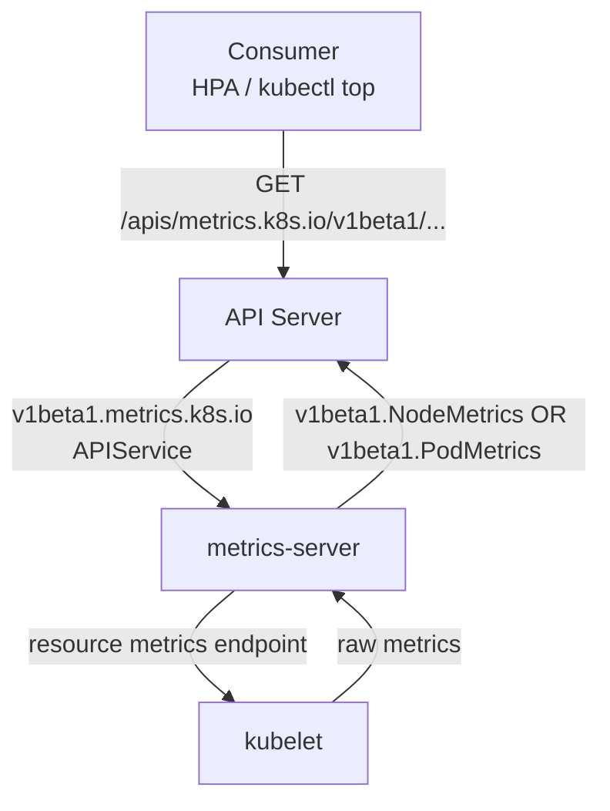

# KEP-5207: metrics.k8s.io API definition

<!-- TOC -->
- [Release Signoff Checklist](#release-signoff-checklist)
- [Summary](#summary)
- [Motivation](#motivation)
  - [Goals](#goals)
  - [Non-Goals](#non-goals)
- [Proposal](#proposal)
  - [Risks and Mitigations](#risks-and-mitigations)
- [Design Details](#design-details)
  - [Test Plan](#test-plan)
      - [Unit tests](#unit-tests)
      - [Integration tests](#integration-tests)
      - [e2e tests](#e2e-tests)
  - [Graduation Criteria](#graduation-criteria)
    - [Alpha](#alpha)
    - [Beta](#beta)
    - [GA](#ga)
  - [Upgrade / Downgrade Strategy](#upgrade--downgrade-strategy)
  - [Version Skew Strategy](#version-skew-strategy)
- [Production Readiness Review Questionnaire](#production-readiness-review-questionnaire)
  - [Feature Enablement and Rollback](#feature-enablement-and-rollback)
  - [Rollout, Upgrade and Rollback Planning](#rollout-upgrade-and-rollback-planning)
  - [Monitoring Requirements](#monitoring-requirements)
  - [Dependencies](#dependencies)
  - [Scalability](#scalability)
  - [Troubleshooting](#troubleshooting)
- [Implementation History](#implementation-history)
- [Drawbacks](#drawbacks)
- [Alternatives](#alternatives)
<!-- /TOC -->

## Release Signoff Checklist

Items marked with (R) are required *prior to targeting to a milestone / release*.

- [x] (R) Enhancement issue in release milestone, which links to KEP dir in [kubernetes/enhancements] (not the initial KEP PR)
- [x] (R) KEP approvers have approved the KEP status as `implementable`
- [x] (R) Design details are appropriately documented
- [x] (R) Test plan is in place, giving consideration to SIG Architecture and SIG Testing input (including test refactors)
  - [x] e2e Tests for all Beta API Operations (endpoints)
  - [ ] (R) Ensure GA e2e tests meet requirements for [Conformance Tests](https://github.com/kubernetes/community/blob/master/contributors/devel/sig-architecture/conformance-tests.md)
  - [ ] (R) Minimum Two Week Window for GA e2e tests to prove flake free
- [x] (R) Graduation criteria is in place
  - [ ] (R) [all GA Endpoints](https://github.com/kubernetes/community/pull/1806) must be hit by [Conformance Tests](https://github.com/kubernetes/community/blob/master/contributors/devel/sig-architecture/conformance-tests.md) within one minor version of promotion to GA
- [x] (R) Production readiness review completed
- [x] (R) Production readiness review approved
- [x] "Implementation History" section is up-to-date for milestone
- [ ] User-facing documentation has been created in [kubernetes/website], for publication to [kubernetes.io]
- [ ] Supporting documentation—e.g., additional design documents, links to mailing list discussions/SIG meetings, relevant PRs/issues, release notes

[kubernetes.io]: https://kubernetes.io/
[kubernetes/enhancements]: https://git.k8s.io/enhancements
[kubernetes/kubernetes]: https://git.k8s.io/kubernetes
[kubernetes/website]: https://git.k8s.io/website

## Summary

Promote the `metrics.k8s.io` API to stable. The API has been in beta since v1.8 (approximately 7 years ago) without a formal graduation effort. Given this lengthy soak period, the API has proven stable in production environments worldwide — consumers such as the Horizontal Pod Autoscaler and `kubectl top` have relied on it for years. We believe it is now appropriate to formally graduate the API to stable.

## Motivation

The `metrics.k8s.io` API was introduced in v1.6 (alpha) and promoted to beta in v1.8, predating the KEP process. Since then, the API has remained unchanged and has been widely used in production by components such as the Horizontal Pod Autoscaler and `kubectl top`.

However, the API has never been formally graduated to stable. Beta APIs carry an implicit instability signal to users, as they may be subject to removal per the [Kubernetes deprecation policy](https://kubernetes.io/docs/reference/using-api/deprecation-policy/). Furthermore, the [KEP-1635 prevent-permabeta](https://kep.k8s.io/1635) initiative requires that APIs either graduate or be formally deprecated.

Given the API's long track record and unchanged schema, graduating to stable is the appropriate path forward.

### Goals

- Graduate `metrics.k8s.io` to stable, by introducing the same API under
  `v1` as exists currently under `v1beta1`.
- The graduation (and thus the migration to the newer version) should be
  non-breaking.

### Non-Goals

- Introduce `v1` version of the API that differs from `v1beta1` in any way,
  except naming.
- Drop support for the existing `v1beta1` version as part of this graduation.
  `v1beta1` continues to be served alongside `v1`; it will be deprecated once
  `v1` is GA and removed later following the
  [deprecation policy](https://kubernetes.io/docs/reference/using-api/deprecation-policy/)
  (a deprecated beta API version is supported for at least 3 releases / 9
  months before removal).

## Proposal

The proposal broadly entails two efforts:

- Introducing `metrics.k8s.io/v1` for the `k8s.io/metrics` package, and,
- Migrating in-house components and sub-projects to utilize the stable version.

The former will more or less be a cosmetic change, essentially bumping
`v1beta1` to `v1`. The `v1` API surface will be identical to `v1beta1`,
with the only difference being the version name itself.

The latter will focus on utilizing the stable version in the
`metrics.k8s.io`'s client, as well as `pkg/controller/podautoscaler` and
`kubectl top`, which are currently on the latest beta version.

### Risks and Mitigations

For the purpose of explaining the risks, we'll assume two entities here.

First, a requester (e.g., HPAs), which utilizes the `metrics.k8s.io`
client, and second, a Metric Server which
utilizes the type definitions exposed by
`k8s.io/metrics/pkg/apis/metrics` to wrap over and expose the metrics
received from the metrics backend in a manner that is consumable by the
requester. 

The requester and the Metric Server are linked through an `APIService` object, which
allows the latter to act as addon APIServer through the aggregation layer for
all requests from the requester towards that `GroupVersion`. Note that while the
APIServer will promote or fallback between versions that support conversions,
that is not the case within the aggregation layer.

Both `v1.metrics.k8s.io` and `v1beta1.metrics.k8s.io` APIServices can be
registered at the same time. A request is served only if an APIService is
registered and available for the exact version requested; otherwise that
request gets `404 NotFound`, while requests to other registered versions are
unaffected. The metric server's internal type-definition version has no
effect, since the `v1` and `v1beta1` surfaces are identical.

| Registered APIServices | `v1` client request | `v1beta1` client request |
| --- | --- | --- |
| `v1beta1` only (before upgrade) | `404 NotFound` | Served |
| `v1` + `v1beta1` (during migration) | Served | Served |
| `v1` only (after `v1beta1` removed) | Served | `404 NotFound` |

In practice, the in-tree consumers avoid the `404` case by negotiating the
served version through discovery and falling back to `v1beta1` when `v1` is
not yet available.

## Design Details

The `metrics.k8s.io` API provides resource metrics (CPU and memory)
for nodes and pods in the cluster, in an implementation-agnostic manner.
As a part of the aggregation layer, implementations instrumenting the
API benefit from APIServer's authentication and authorization measures
out-of-the-box.

The diagram below gives a general idea on the flow:



* The consumer, through the `metrics.k8s.io` client, sends a request. The format is dictated by `k8s.io/metrics/pkg/apis/metrics`:

```
GET /apis/metrics.k8s.io/v1beta1/nodes
GET /apis/metrics.k8s.io/v1beta1/nodes/{name}
GET /apis/metrics.k8s.io/v1beta1/namespaces/{ns}/pods
GET /apis/metrics.k8s.io/v1beta1/namespaces/{ns}/pods/{name}
```

* The responsible addon APIServer is identified based on the registered APIService object. For e.g., for metrics-server:

```yaml
apiVersion: apiregistration.k8s.io/v1
kind: APIService
metadata:
  name: v1beta1.metrics.k8s.io
spec:
  group: metrics.k8s.io
  service:
    name: metrics-server
    namespace: kube-system
  version: v1beta1
```

* The implementation collects resource metrics from each kubelet and returns `NodeMetrics` or `PodMetrics` objects. `PodMetrics` includes per-container breakdown via `ContainerMetrics`.

### Test Plan

[x] I/we understand the owners of the involved components may require updates to
existing tests to make this code solid enough prior to committing the changes necessary
to implement this enhancement.

Since the change only encompasses the API surface which remains unchanged
going into stable, we believe that the existing testing should suffice.

Note that `metrics.k8s.io` is not eligible for conformance coverage: the API
is served through the aggregation layer by an optional addon (e.g.,
metrics-server), and [conformance tests cannot depend on optional features](https://github.com/kubernetes/community/blob/master/contributors/devel/sig-architecture/conformance-tests.md#conformance-test-requirements).
This is the same reason the HPA endpoints were
[marked ineligible for conformance](https://github.com/kubernetes/kubernetes/pull/107349).
The conformance-related items in the checklist above are therefore left
unchecked.

##### Unit tests

The API types and the generated clients live in the `k8s.io/metrics` staging
repository. As part of this KEP, the existing tests are extended to cover the
new `v1` version:

- [`k8s.io/metrics/pkg/apis/roundtrip_test.go`](https://github.com/kubernetes/kubernetes/blob/master/staging/src/k8s.io/metrics/pkg/apis/roundtrip_test.go):
  round-trip testing of the `metrics.k8s.io` API types across all served
  versions.
- [`k8s.io/metrics/pkg/client/clientset_test`](https://github.com/kubernetes/kubernetes/blob/master/staging/src/k8s.io/metrics/pkg/client/clientset_test/clientset_test.go):
  clientset wiring for all served versions.

The in-tree consumers are unit-tested against fakes of the metrics client,
and will be exercised with `v1` once they are migrated:

- [`k8s.io/kubectl/pkg/cmd/top`](https://github.com/kubernetes/kubernetes/tree/master/staging/src/k8s.io/kubectl/pkg/cmd/top):
  `kubectl top node` / `kubectl top pod`.
- [`k8s.io/kubernetes/pkg/controller/podautoscaler/metrics`](https://github.com/kubernetes/kubernetes/blob/master/pkg/controller/podautoscaler/metrics/client_test.go):
  the HPA controller's resource metrics client.

##### Integration tests

- [`test/integration/podautoscaler`](https://github.com/kubernetes/kubernetes/blob/master/test/integration/podautoscaler/podautoscaler_test.go):
  exercises the HPA controller together with the metrics clients.

There is no integration test that serves the aggregated `metrics.k8s.io` API
itself, as that requires an implementation (e.g., metrics-server), which
lives out of tree.

##### e2e tests

- HPA e2e tests
  ([`test/e2e/autoscaling/horizontal_pod_autoscaling*.go`](https://github.com/kubernetes/kubernetes/tree/master/test/e2e/autoscaling))
  exercise the `metrics.k8s.io` API end-to-end through metrics-server in e2e
  clusters: [sig-autoscaling-hpa testgrid](https://testgrid.k8s.io/sig-autoscaling-hpa).
- metrics-server's own e2e suite
  ([`test/e2e_test.go`](https://github.com/kubernetes-sigs/metrics-server/blob/master/test/e2e_test.go))
  directly verifies serving the API on a kind cluster, and will be extended
  to cover the `v1` APIService.

### Graduation Criteria

#### Alpha

Initial implementation of the resource metrics API under `v1alpha1`.

#### Beta

Promoted to `v1beta1`. The API surface has remained stable since then.

#### GA

- e2e tests have been stable with no flakes for a minimum two-week window.
- All in-tree consumers (e.g., `pkg/controller/podautoscaler`, `kubectl top`)
  have been migrated to use the `v1` API.

### Upgrade / Downgrade Strategy

Because the API is served through the aggregation layer with no persisted
state, the versions available to clients are determined by which
`metrics.k8s.io` APIServices are registered and available. Upgrading or
downgrading therefore comes down to whether the implementation registers the
`v1.metrics.k8s.io` APIService (alongside `v1beta1.metrics.k8s.io`) or removes
it — a symmetric, reversible operation with no data migration involved.

### Version Skew Strategy

Within the scope of k/k, the in-tree consumers (`pkg/controller/podautoscaler`
and `kubectl top`) will handle version skew gracefully by discovering which
`metrics.k8s.io` versions are served by the cluster, preferring `v1` and
falling back to `v1beta1` when `v1` is not available:

- `kubectl top` already determines the available API version through
  discovery; `v1` will be added to its supported versions list and preferred
  over `v1beta1`. This graceful fallback is required by the official
  [version skew policy](https://kubernetes.io/releases/version-skew-policy/),
  as a newer `kubectl` must keep working against clusters that only serve
  `v1beta1`.
- The HPA controller will follow the same discovery-based version selection
  already used by its custom metrics client
  (`k8s.io/metrics/pkg/client/custom_metrics`), which picks the preferred
  available version of the API group via discovery.

On the serving side, implementations (e.g., metrics-server) should register
APIServices for both `v1` and `v1beta1` simultaneously until the older
version is formally deprecated, so that older clients that only support
`v1beta1` keep working against an upgraded implementation.

## Production Readiness Review Questionnaire

### Feature Enablement and Rollback

This feature has been around for a long time and wasn't designed with a feature gate to toggle it.

###### How can this feature be enabled / disabled in a live cluster?

- [x] Other
  - Describe the mechanism: The `v1` API is available once an implementation (such as metrics-server) registers the `v1.metrics.k8s.io` APIService via the API aggregation layer. To disable the usage of the newer version, ensure that the `v1.metrics.k8s.io` APIService is not registered and callers fall back to the `v1beta1` version.
  - Will enabling / disabling the feature require downtime of the control
    plane? No.
  - Will enabling / disabling the feature require downtime or reprovisioning
    of a node? No. 

###### Does enabling the feature change any default behavior?

No.

###### Can the feature be disabled once it has been enabled (i.e. can we roll back the enablement)?

Yes. To roll back to the previous behavior, remove the `v1.metrics.k8s.io` APIService registration from the cluster and ensure that all callers (e.g., HPA controller, `kubectl top`) use the `v1beta1` version of the API.

###### What happens if we reenable the feature if it was previously rolled back?

Re-registering the `v1.metrics.k8s.io` APIService will restore access to the `v1` API. No data loss occurs as the underlying data format is identical between `v1beta1` and `v1`.

###### Are there any tests for feature enablement/disablement?

N/A

### Rollout, Upgrade and Rollback Planning

###### How can a rollout or rollback fail? Can it impact already running workloads?

A version mismatch between the `metrics.k8s.io` version being used by the
client in the HPA controller and the available APIService objects could disrupt
the workflow, as discussed above, in addition to some downtime until the
upgraded `controller-manager` is spun up to support the newer API version.

###### What specific metrics should inform a rollback?

- `horizontal_pod_autoscaler_controller_metric_computation_total{error="internal"}`
- `horizontal_pod_autoscaler_controller_metric_computation_duration_seconds{error="internal"}`

Both of the above are true for a subset of errors for which the controller fails
to fetch metrics. See
[pkg/controller/podautoscaler/horizontal.go](https://github.com/kubernetes/kubernetes/blob/master/pkg/controller/podautoscaler/horizontal.go)
for more information.

###### Were upgrade and rollback tested? Was the upgrade->downgrade->upgrade path tested?

Not yet — exercising this path end-to-end requires an implementation
release (e.g., metrics-server) that registers and serves the `v1`
APIService, which will only become available after the `v1` API lands in
`k8s.io/metrics`. The path will be verified manually as part of the
graduation, following the process below.

Note that the API is read-only and serves live data: there are no
persisted objects, so neither direction involves any data migration. The
only state that changes between the steps is which APIService objects are
registered and which version the clients pick.

1. **Upgrade**: upgrade the implementation to a release that serves `v1`
   and registers both the `v1.metrics.k8s.io` and `v1beta1.metrics.k8s.io`
   APIServices; upgrade the control plane and `kubectl`. Verify that:
   - both APIServices report `Available=True`,
   - `kubectl get --raw /apis/metrics.k8s.io/` lists both versions,
   - `kubectl get --raw /apis/metrics.k8s.io/v1/nodes` returns data,
   - HPAs keep scaling (the `ScalingActive` condition remains `True`) and
     `kubectl top node`/`kubectl top pod` keep working, now via `v1`.
2. **Downgrade**: roll back the implementation to the previous release and
   ensure the `v1.metrics.k8s.io` APIService object is removed along with
   it. A stale `v1` APIService left behind would keep advertising `v1` in
   discovery while requests to it fail, which would mislead the
   discovery-based clients — verifying its removal is part of the rollback.
   Verify that:
   - only `v1beta1.metrics.k8s.io` remains and reports `Available=True`,
   - downgraded (or fallback-capable) clients keep working via `v1beta1`.
3. **Upgrade again**: repeat step 1 and its verification. Since no state is
   persisted by the API, the second upgrade is indistinguishable from the
   first.

###### Is the rollout accompanied by any deprecations and/or removals of features, APIs, fields of API types, flags, etc.?

This rollout introduces the `v1` API and does not remove anything. Graduating
`v1` does deprecate `v1beta1`, which continues to be served and is removed only
in a later release following the deprecation policy.

### Monitoring Requirements

###### How can an operator determine if the feature is in use by workloads?

N/A

###### How can someone using this feature know that it is working for their instance?

- [x] API .status
  - Condition name: `Available` on the `v1.metrics.k8s.io` APIService:
  ```
  kubectl get apiservice v1.metrics.k8s.io
  ```
- [x] Other (treat as last resort)
  - Details: Registered versions can be listed by querying `/apis`, and the
    API can be queried directly to confirm it serves data:
  ```
  kubectl get --raw /apis/metrics.k8s.io/ | jq .
  kubectl get --raw /apis/metrics.k8s.io/v1/nodes
  ```

###### What are the reasonable SLOs (Service Level Objectives) for the enhancement?

The `v1.metrics.k8s.io` APIService stays `Available` (i.e.,
`aggregator_unavailable_apiservice{name="v1.metrics.k8s.io"}` is 0), except
during upgrades of the backing implementation.

Note that metrics on request success ratio, latency, and data freshness are
the responsibility of the implementation serving the API (e.g.,
metrics-server) and are out of scope for this KEP, which only defines the
API surface.

###### What are the SLIs (Service Level Indicators) an operator can use to determine the health of the service?

The aggregation layer in kube-apiserver exposes the following metrics about
the `metrics.k8s.io` APIService itself:

- [x] Metrics
  - Metric names:
    - `aggregator_unavailable_apiservice{name="v1.metrics.k8s.io"}` (gauge)
      and `aggregator_unavailable_apiservice_total{name="v1.metrics.k8s.io"}`
      (counter) — availability of the APIService as seen by the aggregation
      layer.
    - `apiserver_request_terminations_total{component="aggregator"}` —
      requests rejected by the aggregator while the backing service is
      unavailable.
  - Components exposing the metrics: kube-apiserver (aggregation layer).

###### Are there any missing metrics that would be useful to have to improve observability of this feature?

No.

### Dependencies

###### Does this feature depend on any specific services running in the cluster?

Currently, `controller-manager` relies on this API, and in order to establish an
overall workflow, needs the aggregation layer to route the requests accordingly.

### Scalability

###### Will enabling / using this feature result in any new API calls?

No.

###### Will enabling / using this feature result in introducing new API types?

Yes, `v1.metrics.k8s.io` (w.r.t. the registered APIService object).

###### Will enabling / using this feature result in any new calls to the cloud provider?

No.

###### Will enabling / using this feature result in increasing size or count of the existing API objects?

No.

###### Will enabling / using this feature result in increasing time taken by any operations covered by existing SLIs/SLOs?

No.

###### Will enabling / using this feature result in non-negligible increase of resource usage (CPU, RAM, disk, IO, ...) in any components?

No.

###### Can enabling / using this feature result in resource exhaustion of some node resources (PIDs, sockets, inodes, etc.)?

No.

### Troubleshooting

###### How does this feature react if the API server and/or etcd is unavailable?

Initially, when establishing trust, APIServer being down impacts the ability to
register the addon APIServer, and thus disrupts the HPA controller.

###### What are other known failure modes?

The metrics path has two hops that can fail independently when authentication
or network connectivity breaks:

- **Between kube-apiserver and the implementation** (the aggregation-layer
  proxy): the `metrics.k8s.io` APIService becomes unavailable
  (`aggregator_unavailable_apiservice` fires) and consumers (HPA controller,
  `kubectl top`) cannot fetch any metrics.
- **Between the implementation and the kubelets** (metric collection): the
  implementation cannot scrape the affected kubelets, so metrics for the
  corresponding nodes/pods are missing or stale while the API itself still
  responds.

The second hop is implementation-specific (e.g., metrics-server scraping the
kubelet resource-metrics endpoint).

###### What steps should be taken if SLOs are not being met to determine the problem?

N/A

## Implementation History

- 2017.03.02: [v1alpha1 implemented](https://github.com/kubernetes/kubernetes/pull/41824)
- 2017.09.06: [v1beta1 implemented](https://github.com/kubernetes/kubernetes/pull/51653)

## Drawbacks

N/A

## Alternatives

N/A
