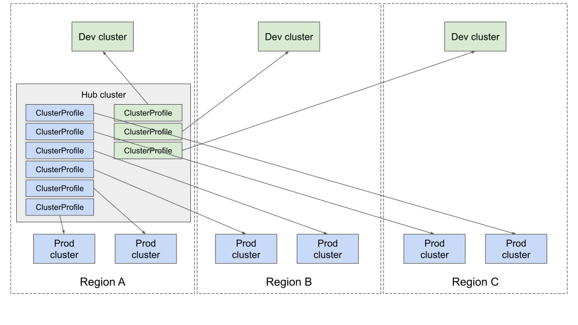
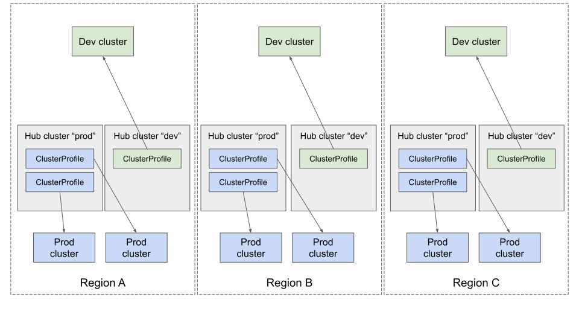
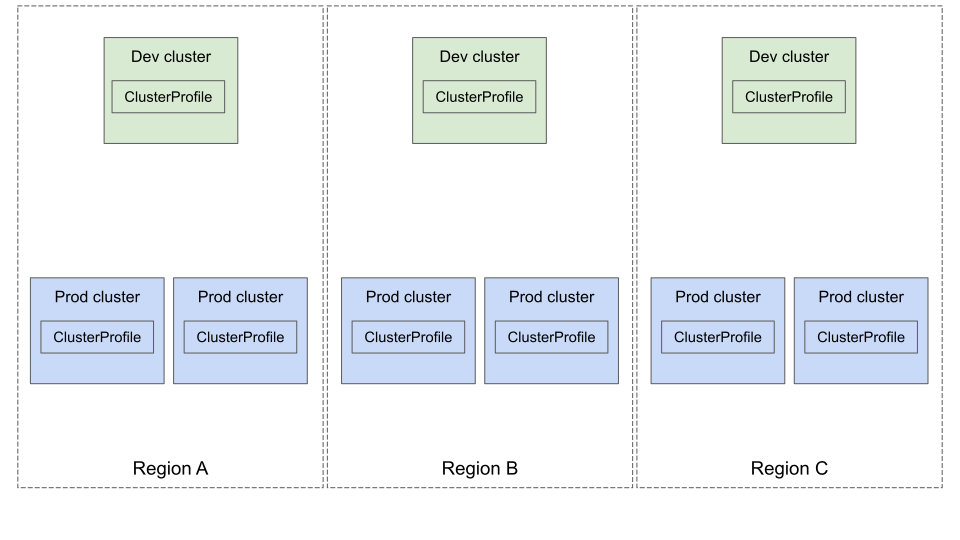

<!--
**Note:** When your KEP is complete, all of these comment blocks should be removed.

To get started with this template:

- [x] **Pick a hosting SIG.**
  Make sure that the problem space is something the SIG is interested in taking
  up. KEPs should not be checked in without a sponsoring SIG.
- [x] **Create an issue in kubernetes/enhancements**
  When filing an enhancement tracking issue, please make sure to complete all
  fields in that template. One of the fields asks for a link to the KEP. You
  can leave that blank until this KEP is filed, and then go back to the
  enhancement and add the link.
- [x] **Make a copy of this template directory.**
  Copy this template into the owning SIG's directory and name it
  `NNNN-short-descriptive-title`, where `NNNN` is the issue number (with no
  leading-zero padding) assigned to your enhancement above.
- [x] **Fill out as much of the kep.yaml file as you can.**
  At minimum, you should fill in the "Title", "Authors", "Owning-sig",
  "Status", and date-related fields.
- [ ] **Fill out this file as best you can.**
  At minimum, you should fill in the "Summary" and "Motivation" sections.
  These should be easy if you've preflighted the idea of the KEP with the
  appropriate SIG(s).
- [x] **Create a PR for this KEP.**
  Assign it to people in the SIG who are sponsoring this process.
- [ ] **Merge early and iterate.**
  Avoid getting hung up on specific details and instead aim to get the goals of
  the KEP clarified and merged quickly. The best way to do this is to just
  start with the high-level sections and fill out details incrementally in
  subsequent PRs.

Just because a KEP is merged does not mean it is complete or approved. Any KEP
marked as `provisional` is a working document and subject to change. You can
denote sections that are under active debate as follows:

```
<<[UNRESOLVED optional short context or usernames ]>>
Stuff that is being argued.
<<[/UNRESOLVED]>>
```

When editing KEPS, aim for tightly-scoped, single-topic PRs to keep discussions
focused. If you disagree with what is already in a document, open a new PR
with suggested changes.

One KEP corresponds to one "feature" or "enhancement" for its whole lifecycle.
You do not need a new KEP to move from beta to GA, for example. If
new details emerge that belong in the KEP, edit the KEP. Once a feature has become
"implemented", major changes should get new KEPs.

The canonical place for the latest set of instructions (and the likely source
of this file) is [here](/keps/NNNN-kep-template/README.md).

**Note:** Any PRs to move a KEP to `implementable`, or significant changes once
it is marked `implementable`, must be approved by each of the KEP approvers.
If none of those approvers are still appropriate, then changes to that list
should be approved by the remaining approvers and/or the owning SIG (or
SIG Architecture for cross-cutting KEPs).
-->
# KEP-4322: ClusterProfile API

<!--
This is the title of your KEP. Keep it short, simple, and descriptive. A good
title can help communicate what the KEP is and should be considered as part of
any review.
-->

<!--
A table of contents is helpful for quickly jumping to sections of a KEP and for
highlighting any additional information provided beyond the standard KEP
template.

Ensure the TOC is wrapped with
  <code>&lt;!-- toc --&rt;&lt;!-- /toc --&rt;</code>
tags, and then generate with `hack/update-toc.sh`.
-->

<!-- toc -->
- [Release Signoff Checklist](#release-signoff-checklist)
- [Summary](#summary)
- [Motivation](#motivation)
  - [Goals](#goals)
  - [Non-Goals](#non-goals)
- [Proposal](#proposal)
  - [Terminology](#terminology)
  - [User Stories (Optional)](#user-stories-optional)
    - [Story 1: Multicluster Workload Distribution](#story-1-multicluster-workload-distribution)
    - [Story 2: Operations and Management](#story-2-operations-and-management)
    - [Story 3: Transparent to Consumers](#story-3-transparent-to-consumers)
  - [Notes/Constraints/Caveats](#notesconstraintscaveats)
    - [What's the relationship between the ClusterProfile API and Cluster Inventory?](#whats-the-relationship-between-the-clusterprofile-api-and-cluster-inventory)
    - [What's the relationship between a cluster inventory and clusterSet?](#whats-the-relationship-between-a-cluster-inventory-and-clusterset)
    - [How should the API be consumed?](#how-should-the-api-be-consumed)
    - [How should we organize ClusterProfile objects on a hub cluster?](#how-should-we-organize-clusterprofile-objects-on-a-hub-cluster)
    - [Uniqueness of the ClusterProfile object](#uniqueness-of-the-clusterprofile-object)
  - [Risks and Mitigations](#risks-and-mitigations)
- [Design Details](#design-details)
  - [Cluster Name](#cluster-name)
    - [Example 1](#example-1)
    - [Example 2](#example-2)
  - [Spec](#spec)
    - [Display name](#display-name)
    - [Cluster Manager](#cluster-manager)
  - [Status](#status)
    - [Version](#version)
    - [Properties](#properties)
    - [Conditions](#conditions)
  - [Cluster Access](#cluster-access)
    - [Pull Model with Work API](#pull-model-with-work-api)
    - [Push Model with Identity Federation (Recommended)](#push-model-with-identity-federation-recommended)
    - [Push Model via Credentials in Secret (Not Recommended)](#push-model-via-credentials-in-secret-not-recommended)
      - [Secret format](#secret-format)
- [API Example](#api-example)
  - [Scalability implication](#scalability-implication)
  - [Test Plan](#test-plan)
      - [Prerequisite testing updates](#prerequisite-testing-updates)
      - [Unit tests](#unit-tests)
      - [Integration tests](#integration-tests)
      - [e2e tests](#e2e-tests)
  - [Graduation Criteria](#graduation-criteria)
    - [Alpha](#alpha)
    - [Beta](#beta)
    - [GA](#ga)
  - [Upgrade / Downgrade Strategy](#upgrade--downgrade-strategy)
  - [Version Skew Strategy](#version-skew-strategy)
- [Production Readiness Review Questionnaire](#production-readiness-review-questionnaire)
  - [Feature Enablement and Rollback](#feature-enablement-and-rollback)
  - [Rollout, Upgrade and Rollback Planning](#rollout-upgrade-and-rollback-planning)
  - [Monitoring Requirements](#monitoring-requirements)
  - [Dependencies](#dependencies)
  - [Scalability](#scalability)
  - [Troubleshooting](#troubleshooting)
- [Implementation History](#implementation-history)
- [Drawbacks](#drawbacks)
- [Alternatives](#alternatives)
  - [Extending Cluster API <code>Cluster</code> resource](#extending-cluster-api-cluster-resource)
  - [ClusterProfile CRD scope](#clusterprofile-crd-scope)
    - [Global hub cluster for multiple clustersets](#global-hub-cluster-for-multiple-clustersets)
    - [Global hub cluster per clusterset](#global-hub-cluster-per-clusterset)
    - [Regional hub cluster for multiple clustersets](#regional-hub-cluster-for-multiple-clustersets)
    - [Regional hub clusters per clusterset](#regional-hub-clusters-per-clusterset)
    - [Self-assembling clustersets](#self-assembling-clustersets)
    - [Workload placement across multiple clusters <em>without</em> cross-cluster service networking](#workload-placement-across-multiple-clusters-without-cross-cluster-service-networking)
    - [Workload placement into a specific clusterset](#workload-placement-into-a-specific-clusterset)
- [Infrastructure Needed (Optional)](#infrastructure-needed-optional)
<!-- /toc -->

## Release Signoff Checklist

<!--
**ACTION REQUIRED:** In order to merge code into a release, there must be an
issue in [kubernetes/enhancements] referencing this KEP and targeting a release
milestone **before the [Enhancement Freeze](https://git.k8s.io/sig-release/releases)
of the targeted release**.

For enhancements that make changes to code or processes/procedures in core
Kubernetes—i.e., [kubernetes/kubernetes], we require the following Release
Signoff checklist to be completed.

Check these off as they are completed for the Release Team to track. These
checklist items _must_ be updated for the enhancement to be released.
-->

Items marked with (R) are required *prior to targeting to a milestone / release*.

- [ ] (R) Enhancement issue in release milestone, which links to KEP dir in [kubernetes/enhancements] (not the initial KEP PR)
- [ ] (R) KEP approvers have approved the KEP status as `implementable`
- [ ] (R) Design details are appropriately documented
- [ ] (R) Test plan is in place, giving consideration to SIG Architecture and SIG Testing input (including test refactors)
  - [ ] e2e Tests for all Beta API Operations (endpoints)
  - [ ] (R) Ensure GA e2e tests meet requirements for [Conformance Tests](https://github.com/kubernetes/community/blob/master/contributors/devel/sig-architecture/conformance-tests.md)
  - [ ] (R) Minimum Two Week Window for GA e2e tests to prove flake free
- [ ] (R) Graduation criteria is in place
  - [ ] (R) [all GA Endpoints](https://github.com/kubernetes/community/pull/1806) must be hit by [Conformance Tests](https://github.com/kubernetes/community/blob/master/contributors/devel/sig-architecture/conformance-tests.md) 
- [ ] (R) Production readiness review completed
- [ ] (R) Production readiness review approved
- [ ] "Implementation History" section is up-to-date for milestone
- [ ] User-facing documentation has been created in [kubernetes/website], for publication to [kubernetes.io]
- [ ] Supporting documentation—e.g., additional design documents, links to mailing list discussions/SIG meetings, relevant PRs/issues, release notes

<!--
**Note:** This checklist is iterative and should be reviewed and updated every time this enhancement is being considered for a milestone.
-->

[kubernetes.io]: https://kubernetes.io/
[kubernetes/enhancements]: https://git.k8s.io/enhancements
[kubernetes/kubernetes]: https://git.k8s.io/kubernetes
[kubernetes/website]: https://git.k8s.io/website

## Summary

<!--
This section is incredibly important for producing high-quality, user-focused
documentation such as release notes or a development roadmap. It should be
possible to collect this information before implementation begins, in order to
avoid requiring implementors to split their attention between writing release
notes and implementing the feature itself. KEP editors and SIG Docs
should help to ensure that the tone and content of the `Summary` section is
useful for a wide audience.

A good summary is probably at least a paragraph in length.

Both in this section and below, follow the guidelines of the [documentation
style guide]. In particular, wrap lines to a reasonable length, to make it
easier for reviewers to cite specific portions, and to minimize diff churn on
updates.

[documentation style guide]: https://github.com/kubernetes/community/blob/master/contributors/guide/style-guide.md
-->

Currently, there is a lack of a standardized approach to define a
cluster inventory. However, with the growing number of users managing
multiple clusters and deploying applications across them, projects like
[Open Cluster Management (OCM)](https://open-cluster-management.io/),
[Clusternet](https://clusternet.io/), [Kubernetes Fleet Manager](https://github.com/Azure/fleet) or [Karmada](https://karmada.io/)
have emerged. This document introduces a proposal for a new universal
ClusterProfile API. The objective is to establish a shared interface
for cluster inventory, defining a standard for status reporting while
allowing for multiple implementations.

## Motivation

<!--
This section is for explicitly listing the motivation, goals, and non-goals of
this KEP.  Describe why the change is important and the benefits to users. The
motivation section can optionally provide links to [experience reports] to
demonstrate the interest in a KEP within the wider Kubernetes community.

[experience reports]: https://github.com/golang/go/wiki/ExperienceReports
-->

A cluster inventory where users can discover Kubernetes clusters, their
properties, and their status, is a common component in almost every
major multi-cluster management solution. Yet, at this moment, there is
not a standard way to access such an inventory; as we see more and more
users embrace the cloud-native approach and deploy workloads across
multiple clusters in concert with the help of multi-cluster management
solutions, we believe that it is critical to devise a common API where
applications, toolsets, and human operators can easily discover clusters
under management.

By adopting this new ClusterProfile API, consumers no longer need to
concern themselves with the implementation details of various projects.
Instead, they can leverage a foundational API for multi-cluster
management. Examples of consumers includes:

* multiple cluster workload scheduler: we’ve seen requirements on
  distributing application/workload to multiple clusters. The scheduling
  can be based on certain cluster properties, e.g. cloud the cluster
  resides in, resources a cluster provides, or latency to some external
  endpoints. A common ClusterProfile API will give schedulers a
  standard to reason about clusters and help to foster the growth of
  this area.
* GitOps tools (ArgoCD, flux etc) are having the requirement to deploy
  workload to multiple clusters. They either need to build the cluster
  concept by themselves or understand APIs representing a cluster from each 
  cluster management project. A common ClusterProfile API can provide
  a thin compatible layer for different projects.
* Operation tools or customized external consumers: this API gives a
  common way for different clouds and vendors to define clusters,
  providing a vendor agnostic integration point for external tools.
* Cluster manager implementations themselves, for purposes such as
  grouping clusters into MCS API clustersets.

### Goals

<!--
List the specific goals of the KEP. What is it trying to achieve? How will we
know that this has succeeded?
-->

* Establish a standardized ClusterProfile API to represent clusters.
* Lay the groundwork for multi-cluster tooling by providing a
  foundational component.
* Accommodate multiple implementations to encourage flexibility and
  adoption.
* Allow for future extensions and new use cases by leaving room for
  further development and enhancements. A unified API, such as this one,
  is most effective when platform extension authors can use it as a
  foundational tool to create extensions compatible with multiple
  providers.
* Allow cluster managers of different types to share a single point inventory.


### Non-Goals

<!--
What is out of scope for this KEP? Listing non-goals helps to focus discussion
and make progress.
-->

* Provide a standard reference implementation.
* Define specific implementation details beyond general API behavior.
* Offering functionalities related to multi-cluster orchestration.
* Define the Consumer registration API


## Proposal

<!--
This is where we get down to the specifics of what the proposal actually is.
This should have enough detail that reviewers can understand exactly what
you're proposing, but should not include things like API designs or
implementation. What is the desired outcome and how do we measure success?.
The "Design Details" section below is for the real
nitty-gritty.
-->

the API proposed by this KEP aims to
- Provide a reliable, consistent, and automated approach for any
  multi-cluster application (framework, toolset) to discover available
  clusters and take actions accordingly, in a way similar to service
  discovery works in a microservice architecture. Through the inventory,
  the application can query for a list of clusters to access, or watch
  for an ever-flowing stream of cluster lifecycle events which the
  application can act upon timely, such as auto-scaling, upgrades,
  failures, and connectivity issues.
- Provide a simple, clear interface for human operators to understand
  clusters under management.

### Terminology
- **Cluster Inventory**: A conceptual term referring to a collection of clusters.

- **Member Cluster**: A kubernetes cluster that is part of a cluster inventory.

- **Cluster Manager**: An entity that creates the ClusterProfile API object per member cluster,
  and keeps their status up-to-date. Each cluster manager MUST be identified with a unique name.
  Each ClusterProfile resource SHOULD be managed by only one cluster manager. A cluster manager SHOULD
  have sufficient permission to access the member cluster to fetch the information so it can update the status
  of the ClusterProfile API resource.

- **ClusterInventory Consumer**: Controllers or tools that leverage the ClusterProfile for the purpose of
  workload distribution, operation management etc. Their name must be unique for a single inventory. They 
  might need to register themselves with the Cluster Manager which is not defined in this KEP. 

### User Stories (Optional)

<!--
Detail the things that people will be able to do if this KEP is implemented.
Include as much detail as possible so that people can understand the "how" of
the system. The goal here is to make this feel real for users without getting
bogged down.
-->

#### Story 1: Multicluster Workload Distribution

In this scenario, a unified API acts as a foundation for multicluster
scheduling decisions across various clusters. This means that the
API will provide a single point of contact to retrieve information that can be
used to make informed scheduling decisions for workloads across multiple
clusters. For instance, workload distribution tools like GitOps or
[Work API](https://github.com/kubernetes-sigs/work-api) can leverage this
API to make informed decisions about which cluster is best suited to handle
a particular workload.

Examples of the multicluster scheduling includes:

- As a user I want to run a workload on an EKS cluster that resides in us-east-1.
  I want to submit my workload if and only if a cluster satisfies that constraint.
- As a user I want to run a workload on a cluster that has certain CRDs installed.
- As a user I want to deploy a workload to my on-prem clusters.
- As a user I want to run a workload close to the data source or end-users.
- As a user I want to run a workload to the less busy cluster.
- As a user I want to deploy workloads to
[Cluster API](https://github.com/kubernetes-sigs/cluster-api)
managed clusters based on cluster location and platform.

#### Story 2: Operations and Management

For multi-cluster administrators, the unified API provides a
comprehensive view of all the clusters under their management. This
includes verifying their memberships, understanding their status,
capacity, and healthiness.

The API could also provide insights into the membership of
each cluster, such as the number of nodes, their roles, and their
current status. This can help administrators manage the clusters more
effectively and ensure that they are always operating at optimal levels.

#### Story 3: Transparent to Consumers

The unified API ensures that consumers have the flexibility to choose
different cluster management tools and switch among them as needed.
Regardless of the tool they choose, they all use the same API to define
clusters.

This means that consumers can switch from one cluster manager to another without
having to worry about compatibility issues or learning a new API. This
can significantly reduce the learning curve and make it easier for
consumers to adopt new tools.

Moreover, the unified API can also provide a consistent user experience
across different cluster managers. For example, if a consumer is used to a
particular command or function in one tool, they can expect the same
command or function to work in the same way in another tool. This can
further enhance the usability and adoption of different cluster
manager.

### Notes/Constraints/Caveats
#### What's the relationship between the ClusterProfile API and Cluster Inventory?
The ClusterProfile API represents a single member cluster in a cluster inventory.

#### What's the relationship between a cluster inventory and clusterSet?
A cluster inventory may or may not represent a ClusterSet. A cluster inventory is considered a [clusterSet](https://github.com/kubernetes/enhancements/tree/master/keps/sig-multicluster/1645-multi-cluster-services-api#terminology)
if all its member clusters adhere to the [namespace sameness](https://github.com/kubernetes/community/blob/master/sig-multicluster/namespace-sameness-position-statement.md) principle.
Note that a cluster can only be in one ClusterSet while there is not such restriction for a cluster inventory.

#### How should the API be consumed?
We recommend that all ClusterProfile objects within the same cluster inventory reside on
a dedicated Kubernetes cluster (aka. the hub cluster). This approach allows consumers to have a single integration 
point to access all the information within a cluster inventory. Additionally, a multi-cluster aware
controller can be run on the dedicated  cluster to offer high-level functionalities over this inventory of clusters.

####  How should we organize ClusterProfile objects on a hub cluster?
While there are no strict requirements, we recommend making the ClusterProfile API a namespace-scoped object.
This approach allows users to leverage Kubernetes' native namespace-based RBAC if they wish to restrict access to 
certain clusters within the inventory.

However, if a cluster inventory represents a ClusterSet, all its ClusterProfile objects MUST be part of the same clusterSet
and namespace must be used as the grouping mechanism. In addition, the namespace must have a label with the key "clusterset.multicluster.x-k8s.io"
and the value as the name of the clusterSet.

#### Uniqueness of the ClusterProfile object
While there are no strict requirements, we recommend that there is only one ClusterProfile object representing any member cluster
on a hub cluster. 

However, a ClusterProfile object can only be in one ClusterSet since the namespace sameness property is transitive, therefore 
it can only be in the namespace of that clusterSet if it is in a ClusterSet.


### Risks and Mitigations

<!--
What are the risks of this proposal, and how do we mitigate? Think broadly.
For example, consider both security and how this will impact the larger
Kubernetes ecosystem.

How will security be reviewed, and by whom?

How will UX be reviewed, and by whom?

Consider including folks who also work outside the SIG or subproject.
-->

## Design Details

<!--
This section should contain enough information that the specifics of your
change are understandable. This may include API specs (though not always
required) or even code snippets. If there's any ambiguity about HOW your
proposal will be implemented, this is the place to discuss them.
-->

We try to summarize the most common properties that should be able to
represent a cluster and support the above use case at the minimum scope.

The target consumers of the API are users who manage the clusters and
other tools to understand the clusters concept from the API for
multi-cluster scheduling, workload distribution and cluster management.
The API aims to provide the information for the consumers to answer the
below questions:

* Is the cluster under management?
* How can I select a cluster?
* Is the cluster healthy?
* How to access the cluster?
* Does the cluster have certain capabilities or properties?
* Does the cluster have sufficient resources?

### Cluster Name

It is required that cluster name is unique for each cluster, and it
should also be unique among different providers (cluster manager). It
is cluster manager's responsibility to ensure the name uniqueness.

It's the responsibility of the cluster manager platform administrator
to ensure cluster name uniqueness.
The examples below serve more as recommendations than hard requirements,
providing guidance on best practices.

#### Example 1

The `metadata.name` of the cluster should never be set upon creation.
Only `metadata.generateName` can be set.

#### Example 2

The `metadata.name` and `metadata.generateName` must have prefix which
should be the same as the `spec.clusterManager.name`. Different cluster
manager must set a different value of `spec.clusterManager.name` when
the cluster is created.

### Spec

#### Display name

It is a human-readable name of the cluster set by the consumer of the
cluster.

#### Cluster Manager

An immutable field set by a cluster manager when this cluster resources
is created by it. Each cluster manager instance should set a different
values to this field.

In addition, a predefined label with key "x-k8s.io/cluster-manager" needs
to be added by the cluster manager upon creation. The value of the label
MUST be the same as the name of the cluster manager. The purpose of this
label is to make filter clusters from different cluster managers easier.

### Status

#### Version

Kubernetes version of the cluster

Versions of the kubernetes can let consumers understand the capability
of the kubernetes, such as what API is supported.

With recent conversations about kube-apiserver and enabled featureset version,
it is possible to incorporate other version relating to the cluster, such as
minimum kubelet version, maximum kubelet version, and enabled featureset version.

#### Properties

Name/value pairs to represent properties of the clusters. It could be a
collection of ClusterProperty resources, but could also be info based on
other implementations. The name of the cluster property can be predefined
name from ClusterProperty resources and is allowed to be customized by
different cluster managers.

#### Conditions

Record cluster’s healthiness condition and easy to extend, conforming to
metav1.Condition format.

Predefined condition types:
- Healthy conditions indicate the cluster is in a good state. (state:
  True/False/Unknown). Healthiness can have different meanings in
  different scenarios. We will have multiple condition types to define
  healthiness:
  - ControlPlaneHealthy is to define whether the controlplane of the
    cluster is in the healthy state.
    * apiserver/healthz
    * controller-manager/healthz
    * scheduler/healthz
    * etcd/healthz
  - <<[UNRESOLVED]>> AllNodesHealthy is to define if the nodes in the cluster are in a
    healthy state. If one node is not healthy, the status of NodeHealthy
    is set to false with the message indicating details. (todo
    tolerance, it should be configurable)
  It would be useful to collect the healthiness of other subsystems in
  the cluster, e.g. network, dns, storage, or ingress. However, it is
  not easy to collect that information in a common way with different
  implementations of network or storage providers. We decide not to
  include other subsystems healthiness conditions in the initial phase.
- Joined: indicate the cluster is under management by the cluster manager.
  The status of the cluster SHOULD be updated by the cluster manager under
  this condition.

### Cluster Access
There are multiple methods for a ClusterInventory Consumer to gain access to the cluster represented by a ClusterProfile API.
This KEP does not define the exact mechanism for each approach, but it is recommended that ClusterInventory Consumers avoid 
using a secret if possible. Here are the three approaches:

#### Pull Model with Work API
The ClusterInventory Consumer can leverage the [Work API](https://multicluster.sigs.k8s.io/concepts/work-api/) so that
the work API agent on the Member Cluster can *pull* the necessary objects from the hub cluster where the ClusterInventory 
Consumer operates to the Member Cluster. This approach allows the Cluster Manager to manage the RBAC for each Consumer on the 
hub cluster, ensuring that their access is restricted to the corresponding namespaces of the ClusterProfile objects.

#### Push Model with Identity Federation (Recommended)
The ClusterInventory consumer can utilize identity federation mechanisms, such as [Azure Workload Identity Federation](https://learn.microsoft.com/en-us/entra/workload-id/workload-identity-federation)
or [GCP Workload Identity Federation](https://cloud.google.com/iam/docs/workload-identity-federation). This allows the 
ClusterInventory Consumer to use an identity that already has access to the clusters in the Cluster Inventory.
While the Cluster Manager can assist in setting up the federation, it is not a mandatory requirement.

#### Push Model via Credentials in Secret (Not Recommended)
The ClusterInventory Consumer can obtain credentials to access the cluster represented by a ClusterProfile object by reading 
from a secret. In this approach, the Cluster Manager generates secrets containing the necessary credentials within the namespace
accessible to the ClusterInventory Consumer. For this to function correctly, Cluster Managers must be aware of the following details 
about the consumer: their name, whether credentials are required, and the preferred unique namespace for reading credentials as secrets.
Those information can be obtained during the "registering" process but this is out of the scope of this KEP.

##### Secret format
- The secret *MUST* reside in the namespace with the label `x-k8s.io/cluster-inventory-consumer` with the value being the name of the ClusterInventory Consumer.
- The secret *MUST* contain the label `x-k8s.io/cluster-profile` with the value being the name of the ClusterProfile object that the secret is associated with.
- The secret *MAY* contain the label `x-k8s.io/cluster-profile-namespace` with the value being the namespace of the ClusterProfile object that the secret is associated with. If not present, the ClusterProfile is assumed to be in the default namespace.
- The access information in the secret must contain the following fields
  - **Config**: This field contains cluster access information compatible with the
    [kubeconfig format](https://github.com/kubernetes/kubernetes/blob/v1.31.2/staging/src/k8s.io/client-go/tools/clientcmd/api/types.go#L31).
  - Since a single [Kubeconfig](https://kubernetes.io/docs/concepts/configuration/organize-cluster-access-kubeconfig/) supports access to multiple clusters, the Cluster manager *MUST* ensure that each secret contains access information for only a single consumer.


## API Example

```yaml
apiVersion: multicluster.x-k8s.io/v1alpha1
kind: ClusterProfile
metadata:
 name: generated-cluster-name
 labels:
   x-k8s.io/cluster-manager: some-cluster-manager
spec:
  displayName: cluster-us-east
  clusterManager:
    name: some-cluster-manager
status:
  version:
    kubernetes: 1.28.0
  properties:
   - name: clusterset.k8s.io
     value: some-clusterset
   - name: location
     value: apac
  conditions:
   - type: ControlPlaneHealthy
     status: True
     lastTransitionTime: "2023-05-08T07:56:55Z"
     message: ""
   - type: Joined
     status: True
     lastTransitionTime: "2023-05-08T07:58:55Z"
     message: ""
```

### Scalability implication

The API should provide summarized metadata of the cluster and relatively "static" cluster status.
Dynamic data, e.g. cluster resource usage, should not be included in this API given it will bring
heavy traffic to the control plane. A metrics collector system would be better suited in this
scenario.

The QPS for each single cluster object is supposed to be less than 1/30 (30s per update on
average). It should be achievable since the cluster properties in the status
field are not supposed to be changed too frequenly. The Burst of each single cluster object
is supposed to be 10 to handle initial join and sudden storm.

### Test Plan

<!--
**Note:** *Not required until targeted at a release.*
The goal is to ensure that we don't accept enhancements with inadequate testing.

All code is expected to have adequate tests (eventually with coverage
expectations). Please adhere to the [Kubernetes testing guidelines][testing-guidelines]
when drafting this test plan.

[testing-guidelines]: https://git.k8s.io/community/contributors/devel/sig-testing/testing.md
-->

- [x] I/we understand the owners of the involved components may require updates to
existing tests to make this code solid enough prior to committing the changes necessary
to implement this enhancement.

This KEP proposes and out-of-tree CRD
[here](https://github.com/kubernetes-sigs/cluster-inventory-api) that is
not expected to integrate with any of the Kubernetes CI infrastructure.
In addition, it explicitly provides only the CRD definition and
generated clients for use by third party implementers, and does not
provide a controller or any other binary with business logic to test.
Therefore, we only expect unit test to validate the generated client and
integration tests for API validation tests.

However, similar to other out-of-tree CRDs that serve third party
implementers, such as Gateway API and MCS API, there is rationale for
the project to provide conformance tests for implementers to use to
confirm they adhere to the restrictions set forth in this KEP that are
not otherwise enforced by the CRD definition.

##### Prerequisite testing updates

<!--
Based on reviewers feedback describe what additional tests need to be added prior
implementing this enhancement to ensure the enhancements have also solid foundations.
-->

##### Unit tests

- `<package>`: `<date>` - `<test coverage>`

##### Integration tests

- <test>: <link to test coverage>

##### e2e tests

- <test>: <link to test coverage>

### Graduation Criteria

#### Alpha

- A CRD definition and generated client.
- A dummy controller and unit test to validate the CRD and client.

#### Beta

- Gather feedback from users during the Alpha stage to identify any
  issues, limitations, or areas for improvement. Address this feedback
  by making the necessary changes to the API and iterating on its design
  and functionality.
- The API should support the addition of scheduling features, such as:
  - Load balancing: Distribute workloads evenly across clusters based on
    their current load and capacity.
  - Affinity and anti-affinity rules: Allow users to define rules for
    placing workloads on specific clusters or ensuring that certain
    workloads are not placed on the same cluster.
  - Priority-based scheduling: Enable users to assign priorities to
    workloads, ensuring that higher-priority workloads are scheduled
    before lower-priority ones.
  - Resource-based scheduling: Schedule workloads based on the
    availability of specific resources, such as CPU, memory, or storage,
    in each cluster.
- The API should expose access information including but not limited to:
  - APIServer endpoint url of the member cluster.
  - Credential with limited access to the member cluster.
- At least two providers and one consumer using ClusterProfile API.

#### GA

- N examples of real-world usage
- N installs
- More rigorous forms of testing—e.g., downgrade tests and scalability
  tests
- Allowing time for feedback
- Stability: The API should demonstrate stability in terms of its
  reliability.
- Functionality: The API should provide the necessary functionality for
  multicluster scheduling, including the ability to distribute workloads
  across clusters, manage cluster memberships, and monitor cluster
  health and capacity. This should be validated through a series of
  functional tests and real-world use cases.
- Integration: Ensure that the API can be easily integrated with popular
  workload distribution tools, such as GitOps and Work API. This may
  involve developing plugins or extensions for these tools or providing
  clear guidelines on how to integrate them with the unified API.
- Performance and Scalability: Conduct performance and scalability tests
  to ensure that the API can handle a large number of clusters and
  workloads without degrading its performance. This may involve stress
  testing the API with a high volume of requests or simulating
  large-scale deployments.

**Note:** Generally we also wait at least two releases between beta and
GA/stable, because there's no opportunity for user feedback, or even bug
reports, in back-to-back releases.

### Upgrade / Downgrade Strategy

### Version Skew Strategy

## Production Readiness Review Questionnaire

<!--

Production readiness reviews are intended to ensure that features merging into
Kubernetes are observable, scalable and supportable; can be safely operated in
production environments, and can be disabled or rolled back in the event they
cause increased failures in production. See more in the PRR KEP at
https://git.k8s.io/enhancements/keps/sig-architecture/1194-prod-readiness.

The production readiness review questionnaire must be completed and approved
for the KEP to move to `implementable` status and be included in the release.

In some cases, the questions below should also have answers in `kep1.yaml`. This
is to enable automation to verify the presence of the review, and to reduce review
burden and latency.

The KEP must have a approver from the
[`prod-readiness-approvers`](http://git.k8s.io/enhancements/OWNERS_ALIASES)
team. Please reach out on the
[#prod-readiness](https://kubernetes.slack.com/archives/CPNHUMN74) channel if
you need any help or guidance.
-->

### Feature Enablement and Rollback

<!--
This section must be completed when targeting alpha to a release.
-->

###### How can this feature be enabled / disabled in a live cluster?

<!--
Pick one of these and delete the rest.

Documentation is available on [feature gate lifecycle] and expectations, as
well as the [existing list] of feature gates.

[feature gate lifecycle]: https://git.k8s.io/community/contributors/devel/sig-architecture/feature-gates.md
[existing list]: https://kubernetes.io/docs/reference/command-line-tools-reference/feature-gates/
-->

- [ ] Feature gate (also fill in values in `kep.yaml`)
  - Feature gate name:
  - Components depending on the feature gate:
- [x] Other
  - Describe the mechanism:
  - Will enabling / disabling the feature require downtime of the
    control plane?
  - Will enabling / disabling the feature require downtime or
    reprovisioning of a node?

###### Does enabling the feature change any default behavior?

- No default Kubernetes behavior is currently planned to be based on
  this feature; it is designed to be used by the separately installed,
  out-of-tree, multicluster management providers and consumers.

###### Can the feature be disabled once it has been enabled (i.e. can we roll back the enablement)?

- Yes, as this feature only describes a CRD, it can most directly be
  disabled by uninstalling the CRD.

###### What happens if we reenable the feature if it was previously rolled back?

###### Are there any tests for feature enablement/disablement?

- As a dependency only for an out-of-tree component, there will not be
  e2e tests for feature enablement/disablement of this CRD in core
  Kubernetes. The e2e test can be provided by multicluster management
  providers who support this API.

### Rollout, Upgrade and Rollback Planning

<!--
This section must be completed when targeting beta to a release.
-->

###### How can a rollout or rollback fail? Can it impact already running workloads?

###### What specific metrics should inform a rollback?

###### Were upgrade and rollback tested? Was the upgrade->downgrade->upgrade path tested?

###### Is the rollout accompanied by any deprecations and/or removals of features, APIs, fields of API types, flags, etc.?

### Monitoring Requirements

<!--
This section must be completed when targeting beta to a release.

For GA, this section is required: approvers should be able to confirm the
previous answers based on experience in the field.
-->

###### How can an operator determine if the feature is in use by workloads?

<!--
Ideally, this should be a metric. Operations against the Kubernetes API (e.g.,
checking if there are objects with field X set) may be a last resort. Avoid
logs or events for this purpose.
-->

###### How can someone using this feature know that it is working for their instance?

<!--
For instance, if this is a pod-related feature, it should be possible to determine if the feature is functioning properly
for each individual pod.
Pick one more of these and delete the rest.
Please describe all items visible to end users below with sufficient detail so that they can verify correct enablement
and operation of this feature.
Recall that end users cannot usually observe component logs or access metrics.
-->

- [ ] Events
  - Event Reason:
- [ ] API .status
  - Condition name:
  - Other field:
- [ ] Other (treat as last resort)
  - Details:

###### What are the reasonable SLOs (Service Level Objectives) for the enhancement?

<!--
This is your opportunity to define what "normal" quality of service looks like
for a feature.

It's impossible to provide comprehensive guidance, but at the very
high level (needs more precise definitions) those may be things like:
  - per-day percentage of API calls finishing with 5XX errors <= 1%
  - 99% percentile over day of absolute value from (job creation time minus expected
    job creation time) for cron job <= 10%
  - 99.9% of /health requests per day finish with 200 code

These goals will help you determine what you need to measure (SLIs) in the next
question.
-->

###### What are the SLIs (Service Level Indicators) an operator can use to determine the health of the service?

<!--
Pick one more of these and delete the rest.
-->

- [ ] Metrics
  - Metric name:
  - [Optional] Aggregation method:
  - Components exposing the metric:
- [ ] Other (treat as last resort)
  - Details:

###### Are there any missing metrics that would be useful to have to improve observability of this feature?

<!--
Describe the metrics themselves and the reasons why they weren't added (e.g., cost,
implementation difficulties, etc.).
-->

### Dependencies

<!--
This section must be completed when targeting beta to a release.
-->

###### Does this feature depend on any specific services running in the cluster?

<!--
Think about both cluster-level services (e.g. metrics-server) as well
as node-level agents (e.g. specific version of CRI). Focus on external or
optional services that are needed. For example, if this feature depends on
a cloud provider API, or upon an external software-defined storage or network
control plane.

For each of these, fill in the following—thinking about running existing user workloads
and creating new ones, as well as about cluster-level services (e.g. DNS):
  - [Dependency name]
    - Usage description:
      - Impact of its outage on the feature:
      - Impact of its degraded performance or high-error rates on the feature:
-->

### Scalability

<!--
For alpha, this section is encouraged: reviewers should consider these questions
and attempt to answer them.

For beta, this section is required: reviewers must answer these questions.

For GA, this section is required: approvers should be able to confirm the
previous answers based on experience in the field.
-->

###### Will enabling / using this feature result in any new API calls?

<!--
Describe them, providing:
  - API call type (e.g. PATCH pods)
  - estimated throughput
  - originating component(s) (e.g. Kubelet, Feature-X-controller)
Focusing mostly on:
  - components listing and/or watching resources they didn't before
  - API calls that may be triggered by changes of some Kubernetes resources
    (e.g. update of object X triggers new updates of object Y)
  - periodic API calls to reconcile state (e.g. periodic fetching state,
    heartbeats, leader election, etc.)
-->

###### Will enabling / using this feature result in introducing new API types?

<!--
Describe them, providing:
  - API type
  - Supported number of objects per cluster
  - Supported number of objects per namespace (for namespace-scoped objects)
-->

###### Will enabling / using this feature result in any new calls to the cloud provider?

<!--
Describe them, providing:
  - Which API(s):
  - Estimated increase:
-->

###### Will enabling / using this feature result in increasing size or count of the existing API objects?

<!--
Describe them, providing:
  - API type(s):
  - Estimated increase in size: (e.g., new annotation of size 32B)
  - Estimated amount of new objects: (e.g., new Object X for every existing Pod)
-->

###### Will enabling / using this feature result in increasing time taken by any operations covered by existing SLIs/SLOs?

<!--
Look at the [existing SLIs/SLOs].

Think about adding additional work or introducing new steps in between
(e.g. need to do X to start a container), etc. Please describe the details.

[existing SLIs/SLOs]: https://git.k8s.io/community/sig-scalability/slos/slos.md#kubernetes-slisslos
-->

###### Will enabling / using this feature result in non-negligible increase of resource usage (CPU, RAM, disk, IO, ...) in any components?

<!--
Things to keep in mind include: additional in-memory state, additional
non-trivial computations, excessive access to disks (including increased log
volume), significant amount of data sent and/or received over network, etc.
This through this both in small and large cases, again with respect to the
[supported limits].

[supported limits]: https://git.k8s.io/community//sig-scalability/configs-and-limits/thresholds.md
-->

###### Can enabling / using this feature result in resource exhaustion of some node resources (PIDs, sockets, inodes, etc.)?

<!--
Focus not just on happy cases, but primarily on more pathological cases
(e.g. probes taking a minute instead of milliseconds, failed pods consuming resources, etc.).
If any of the resources can be exhausted, how this is mitigated with the existing limits
(e.g. pods per node) or new limits added by this KEP?

Are there any tests that were run/should be run to understand performance characteristics better
and validate the declared limits?
-->

### Troubleshooting

<!--
This section must be completed when targeting beta to a release.

For GA, this section is required: approvers should be able to confirm the
previous answers based on experience in the field.

The Troubleshooting section currently serves the `Playbook` role. We may consider
splitting it into a dedicated `Playbook` document (potentially with some monitoring
details). For now, we leave it here.
-->

###### How does this feature react if the API server and/or etcd is unavailable?

###### What are other known failure modes?

<!--
For each of them, fill in the following information by copying the below template:
  - [Failure mode brief description]
    - Detection: How can it be detected via metrics? Stated another way:
      how can an operator troubleshoot without logging into a master or worker node?
    - Mitigations: What can be done to stop the bleeding, especially for already
      running user workloads?
    - Diagnostics: What are the useful log messages and their required logging
      levels that could help debug the issue?
      Not required until feature graduated to beta.
    - Testing: Are there any tests for failure mode? If not, describe why.
-->

###### What steps should be taken if SLOs are not being met to determine the problem?

## Implementation History

<!--
Major milestones in the lifecycle of a KEP should be tracked in this section.
Major milestones might include:
- the `Summary` and `Motivation` sections being merged, signaling SIG acceptance
- the `Proposal` section being merged, signaling agreement on a proposed design
- the date implementation started
- the first Kubernetes release where an initial version of the KEP was available
- the version of Kubernetes where the KEP graduated to general availability
- when the KEP was retired or superseded
-->

## Drawbacks

<!--
Why should this KEP _not_ be implemented?
-->

## Alternatives

<!--
What other approaches did you consider, and why did you rule them out? These do
not need to be as detailed as the proposal, but should include enough
information to express the idea and why it was not acceptable.
-->

### Extending Cluster API `Cluster` resource
We also considered the possibility of extending the existing Cluster API's
[Cluster](https://github.com/kubernetes-sigs/cluster-api/blob/v1.6.2/api/v1beta1/cluster_types.go#L39)
resource to accommodate our needs for describing clusters within a multi-cluster
environment. However, this approach was ruled out due to the Cluster API's primary
focus on cluster lifecycle management. Its tight coupling with cluster provisioning
processes made it less suitable for scenarios where clusters are either provisioned
through different methods or already exist. Furthermore, another distinction is the
nature of the information each API conveys: the Cluster API's Cluster resource
outlines the desired state of the cluster. In contrast, the new API is intended to
reflect the actual state of the cluster, more similar to the Cluster.status in the
Cluster API, but with a broader scope and intended for use in a multi-cluster context.
This distinction also extends to the ownership of the resources; the Cluster API's
Cluster is primarily owned by platform administrators focused on provisioning clusters,
whereas the new API is designed to be owned by the cluster manager that created the
cluster it represents.

### ClusterProfile CRD scope

We had [extensive discussions](https://docs.google.com/document/d/1E_z3ti-d-modwnhsvR3yBZwX4rRpL26dKkl41YAptRo/edit)
in SIG-Multicluster meetings about the appropriate scope for ClusterProfile
resources, and ultimately decided that namespace scope would be more flexible
than cluster scope while still retaining an adequate UX for simpler usage
patterns. As a historical note, a prior attempt at organizing multiple
clusters, the ClusterRegistry proposal, had proposed cluster-scoped resources
but was met with pushback by potential adopters in part due to a desire to host
multiple distinct registry lists on a single control plane, which would be far
more straightforward with namespaced resources.

#### Global hub cluster for multiple clustersets



In this model, a single global hub cluster is used to manage multiple clustersets (a "Prod" clusterset and "Dev" clusterset in this illustration). For this use case, some means of segmenting the ClusterProfile resources into distinct groups for each clusterset is needed, and ideally should facilitate selecting all ClusterProfiles of a given clusterset. Because of this selection-targeting goal, setting clusterset membership within the `spec` of a ClusterProfile would not be sufficient. While setting a label such as the proposed `clusterset.multicluster.x-k8s.io` on the ClusterProfile resource (instead of a namespace) could be acceptable, managing multiple cluster-scoped ClusterProfile resources for multiple unrelated clustersets on a single global hub could quickly get cluttered. In addition to grouping clarity, namespace scoping could allow RBAC delegation for separate teams to manage resources for their own clustersets in isolation while still using a shared hub. The group of all clusters registered on the hub (potentially including clusters belonging to different clustersets or clusters not belonging to any clusterset) may represent a single "inventory" or multiple inventories, but such a definition is beyond the scope of this document and is permissible to be an undefined implementation detail.

#### Global hub cluster per clusterset


In this model, each "inventory" has a 1:1 mapping with a clusterset containing clusters in multiple regions. A cluster-scoped ClusterProfile CRD would be sufficient for this architecture, but it requires a proliferation of hub clusters, which may not be optimal. This model is still implementable with namespace-scoped ClusterProfile CRDs by writing them all to a single namespace, either the `default` namespace or a specific namespace configured in the cluster manager. The risk of placing resources in the wrong namespace would be somewhat minimal if following the suggested pattern of having ClusterProfile resources be written by a "manager" rather than authored by humans.

#### Regional hub cluster for multiple clustersets


In this model, "hub" clusters are limited to a regional scope (potentially for architectural limitations or performance optimizations) and each hub is used to manage clusters only from the local region, but which may belong to separate clustersets. If, as in the pictured example, clustersets still span multiple regions, some out-of-band synchronization mechanism between the regional hubs would likely be needed. This model has similar segmentation needs to the global hub model, just at a smaller scale.

#### Regional hub clusters per clusterset



This is creeping pretty far towards excessive cluster proliferation (and cross-region coordination overhead) purely for management needs (as opposed to actually running workloads), and would be more likely to be a reference or testing implementation than an architecture suitable for production scale.

#### Self-assembling clustersets



This is the model most suited to a cluster-scoped ClusterProfile resource. In contrast to the prior models discussed, in this approach the ClusterProfile CRD would be written directly to each "member" cluster. ClusterSet membership would either be established through peer-to-peer relationships, or managed by an external control plane. For ClusterSet security and integrity, a two-way handshake of some sort would be needed between the local cluster and each peer or the external control plane to ensure it is properly authorized to serve endpoints for exported services or import services from other clusters. While these approaches could be implemented with a namespace-scoped ClusterProfile CRD in the `default` or a designated namespace, misuse is most likely in this model, because the resource would be more likely to be authored by a human if using the peer-to-peer model. Due to the complexity and fragility concerns of managing clusterset membership in a peer-to-peer topology, an external control plane would likely be preferable. Assuming the external control plane does not support Kubernetes APIs (if it did, any of the "hub" models could be applied instead), it could still be possible to implement this model with a namespace-scoped ClusterProfile resource, but it is _not_ recommended.

#### Workload placement across multiple clusters _without_ cross-cluster service networking

In this model, a consumer of the Cluster Inventory API is looking to optimize workload placement to take advantage of excess capacity on existing managed clusters. These workloads may have specific hardware resource needs such as GPUs, but are typically "batch" jobs that do not require multi-cluster service networking to communicate with known services in a specific clusterset. The isolated nature of these jobs could allow them to be scheduled on many known clusters regardless of clusterset membership. A centralized hub which could register clusters in disparate clustersets or no clusterset and return a list of all known clusters from a single API call would be the most efficient for this consumer to query. Namespaced ClusterProfile CRDs on a global hub would be the best fit for this use case.

#### Workload placement into a specific clusterset

Within a single clusterset, a global workload placement controller may seek to balance capacity across multiple regions in response to demand, cost efficiency, or other factors. Querying a list of all clusters within a single clusterset should be possible to serve this use case, which is amenable to either cluster-scoped or namespaced-scoped ClusterProfile CRDs.

## Infrastructure Needed (Optional)

<!--
Use this section if you need things from the project/SIG. Examples include a
new subproject, repos requested, or GitHub details. Listing these here allows a
SIG to get the process for these resources started right away.
-->
