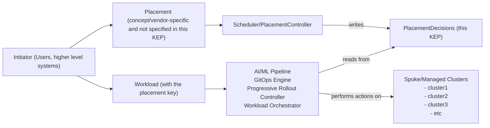

# KEP-5313: PlacementDecision API

<!-- toc -->
- [Release Signoff Checklist](#release-signoff-checklist)
- [Summary](#summary)
- [Motivation](#motivation)
  - [Goals](#goals)
  - [Non-Goals](#non-goals)
  - [Why define PlacementDecision before a standardized Placement API?](#why-define-placementdecision-before-a-standardized-placement-api)
- [Proposal](#proposal)
  - [User Stories](#user-stories)
    - [Story 1: GPU-aware AI training](#story-1-gpu-aware-ai-training)
    - [Story 2: Progressive rollout](#story-2-progressive-rollout)
    - [Story 3: Disaster recovery](#story-3-disaster-recovery)
    - [Story 4: Self produce and self consume (Argo CD)](#story-4-self-produce-and-self-consume-argo-cd)
    - [Story 5: Multiple consumers fan-out](#story-5-multiple-consumers-fan-out)
  - [Notes/Constraints/Caveats](#notesconstraintscaveats)
    - [Additional Benefits: Placement Delegation and Modular Architecture](#additional-benefits-placement-delegation-and-modular-architecture)
  - [Risks and Mitigations](#risks-and-mitigations)
- [Design Details](#design-details)
  - [Terminology](#terminology)
  - [API Specification](#api-specification)
  - [API Definition](#api-definition)
  - [API Example](#api-example)
  - [Implementation Details](#implementation-details)
    - [Consumer Discovery and Usage](#consumer-discovery-and-usage)
    - [Slicing](#slicing)
    - [Lifecycle](#lifecycle)
    - [Ownership](#ownership)
    - [Relationship to other SIG-Multicluster (SIG-MC) APIs](#relationship-to-other-sig-multicluster-sig-mc-apis)
    - [Consumer Feedback](#consumer-feedback)
  - [Test Plan](#test-plan)
      - [Prerequisite testing updates](#prerequisite-testing-updates)
      - [Unit tests](#unit-tests)
      - [Integration tests](#integration-tests)
      - [e2e tests](#e2e-tests)
  - [Graduation Criteria](#graduation-criteria)
    - [Alpha](#alpha)
    - [Beta](#beta)
    - [GA](#ga)
  - [Upgrade / Downgrade Strategy](#upgrade--downgrade-strategy)
  - [Version Skew Strategy](#version-skew-strategy)
- [Production Readiness Review Questionnaire](#production-readiness-review-questionnaire)
  - [Feature Enablement and Rollback](#feature-enablement-and-rollback)
  - [Rollout, Upgrade and Rollback Planning](#rollout-upgrade-and-rollback-planning)
  - [Monitoring Requirements](#monitoring-requirements)
  - [Dependencies](#dependencies)
  - [Scalability](#scalability)
  - [Troubleshooting](#troubleshooting)
- [Implementation History](#implementation-history)
- [Drawbacks](#drawbacks)
- [Alternatives](#alternatives)
- [Infrastructure Needed (Optional)](#infrastructure-needed-optional)
<!-- /toc -->

## Release Signoff Checklist

Items marked with (R) are required *prior to targeting to a milestone / release*.

<!-- Keep this list updated as progress is made. Do not remove items; check them off. -->

- [ ] (R) Enhancement issue in release milestone, which links to KEP dir in [kubernetes/enhancements] (not the initial KEP PR)
- [ ] (R) KEP approvers have approved the KEP status as `implementable`
- [ ] (R) Design details are appropriately documented
- [ ] (R) Test plan is in place, giving consideration to SIG Architecture and SIG Testing input (including test refactors)
  - [ ] e2e Tests for all Beta API Operations (endpoints)
  - [ ] (R) Ensure GA e2e tests meet requirements for [Conformance Tests](https://github.com/kubernetes/community/blob/master/contributors/devel/sig-architecture/conformance-tests.md) 
  - [ ] (R) Minimum Two Week Window for GA e2e tests to prove flake free
- [ ] (R) Graduation criteria is in place
  - [ ] (R) [all GA Endpoints](https://github.com/kubernetes/community/pull/1806) must be hit by [Conformance Tests](https://github.com/kubernetes/community/blob/master/contributors/devel/sig-architecture/conformance-tests.md) 
- [ ] (R) Production readiness review completed
- [ ] (R) Production readiness review approved
- [ ] "Implementation History" section is up-to-date for milestone
- [ ] User-facing documentation has been created in [kubernetes/website], for publication to [kubernetes.io]
- [ ] Supporting documentation—e.g., additional design documents, links to mailing list discussions/SIG meetings, relevant PRs/issues, release notes

[kubernetes.io]: https://kubernetes.io/
[kubernetes/enhancements]: https://git.k8s.io/enhancements
[kubernetes/kubernetes]: https://git.k8s.io/kubernetes
[kubernetes/website]: https://git.k8s.io/website

## Summary

Today every multicluster scheduler publishes its own API to convey where a workload should run,
forcing downstream tools such as GitOps engine, workload orchestrator, progressive rollout controller,
or AI/ML pipeline to understand a scheduler-specific API.

This KEP introduces a vendor neutral `PlacementDecision` API that standardizes
the output of multicluster placement calculations. A `PlacementDecision` object is data only:
a namespaced list of chosen clusters whose referenced names must map one-to-one to `ClusterProfile`s
as defined by the [ClusterProfile API](https://github.com/kubernetes/enhancements/pull/4322).
Any scheduler can emit the object and any consumer can watch it.

What this API standardizes: The "which clusters" answer (the decision output).

What this API does NOT standardize: How to request placement (the input remains vendor-specific),
or how consumers deploy workloads to the selected clusters.

This focused scope means:
- Consumers write ONE integration to read decisions from ANY scheduler
- Schedulers write ONE output format that works with ALL consumers
- Integration reduction: Instead of every consumer needing custom code for every scheduler, each component only integrates once with the standard API
  - Example: 10 consumers with 10 schedulers needs 100 separate integrations today, but only 20 integrations with this API

Important clarifications:
- This is interface standardization, not full decoupling: Schedulers still need vendor-specific APIs for placement requests, and consumers still need to understand how to deploy workloads. What's standardized is ONLY the "which clusters" output.
- Both schedulers and consumers remain workload-aware: Schedulers need to understand workload requirements (GPUs, storage, etc.) to make decisions, and consumers need to know how to deploy those workloads. This API is the simple "handoff" between them.
- Plugin reduction: Instead of "Argo CD plugin for OCM + Argo CD plugin for Clusternet + Argo CD plugin for Fleet", you get "Argo CD reads PlacementDecision" (works with all).

Workload correlation is optional. When a decision is tied to a specific workload,
producers may label the `PlacementDecision` with the workload's placement key.
Decisions not tied to a workload are supported
(ie, a controller continuously publishes a reusable decision stream for consumers).



## Motivation

A typical multicluster setup involves two key components:

1. Scheduler: examines the fleet (`ClusterProfile` objects),
   and other signals/metrics and decides *where* a workload should land.
2. Consumer: GitOps engine, workload orchestrator, progressive rollout controller, AI/ML pipeline
   read that decision and act (for example, by creating [Work](https://github.com/kubernetes-sigs/work-api) objects).

Today's problem: Every scheduler publishes its own API to convey placement decisions, forcing each consumer
to write custom integration code for every scheduler they want to support.

Without this API, each consumer must implement separate code to read each scheduler's decision format:
- Argo CD needs custom code for OCM, separate code for Clusternet, separate code for Fleet, etc.
- MultiKueue needs the same separate integrations for each scheduler
- Flux needs the same separate integrations for each scheduler
- Every new consumer added must write all these integrations again
- Every new scheduler added requires updates to all existing consumers

This creates an integration explosion where the total integration burden grows with every new consumer or scheduler added to the ecosystem.

With this API, the burden is reduced:
- Each consumer writes ONE integration that reads the standard `PlacementDecision` format
- Each scheduler writes ONE output format following the standard
- New consumers work with all existing schedulers automatically
- New schedulers work with all existing consumers automatically

Problems this solves:
- Vendor lock-in: Switching schedulers no longer requires rewriting consumer integrations
- Slow adoption: New consumers can support all schedulers by implementing one standard interface
- Duplicated effort: The same "read cluster list" logic no longer needs to be written separately for every consumer-scheduler pair
- RBAC complexity: One resource type to secure instead of different permissions for each scheduler's API

Concrete example:
- Today: Argo CD must write and maintain separate code to understand OCM's `PlacementDecision`, Clusternet's `FeedInventory`, Fleet's `ClusterResourcePlacement`, each with different schemas
- With this KEP: Argo CD writes one integration that reads standard `PlacementDecision` objects, works with all schedulers

### Goals

This API aims to solve the following problems:

* Reduce integration burden: Enable consumers to write ONE integration that works with ANY scheduler implementing this API, instead of writing separate integrations for each scheduler.
* Enable scheduler portability: Allow organizations to switch schedulers (e.g., from OCM to Clusternet) without rewriting consumer code.
* Enable consumer portability: Allow new consumers (e.g., Argo CD, MultiKueue) to work with all schedulers by implementing one standard API.
* Simplify RBAC: Provide one resource schema for consumers to `get/list/watch`, instead of different permissions for each scheduler's API.
* Support placement delegation: Enable external placement controllers to be plugged into any consumer.
* Align with ClusterProfile: Ensure direct mapping to `ClusterProfile` inventory for cluster references.

Technical goals:
* Define a namespaced, minimalistic, data-only `PlacementDecision` API that lists selected clusters.
* Support continuous rescheduling where decision lists may be updated over time.
* Guarantee that every (`clusterNamespace`, `clusterName`) pair matches a `ClusterProfile` in the fleet (enforced via admission).
* Provide label and naming conventions so consumers can retrieve all slices of one decision via label selector or deterministic naming.
* Leave room for scheduler-specific implementations and workload-aware placement logic.

### Non-Goals

This API intentionally does NOT solve the following:

* NOT standardizing placement requests: How to request placement (the input) remains vendor-specific. Each scheduler keeps its own API (OCM `Placement`, Clusternet `Subscription`, Fleet `ClusterResourcePlacement`, etc.). Organizations will still need to use their chosen scheduler's API to request placement.
* NOT eliminating scheduler workload awareness: Schedulers still need to understand workload requirements (GPUs, storage, regions, compliance, etc.) to make placement decisions. This API only standardizes the output format.
* NOT eliminating consumer workload awareness: Consumers still need to understand how to deploy specific workload types to the selected clusters. They still need "one integration per consumer type" (e.g., Argo CD knows how to deploy Applications), but they don't need "one integration per scheduler."
* NOT describing scheduling logic: Internal details of how a scheduler made its choice remain implementation-specific.
* NOT describing cluster access: How consumers access selected clusters or authenticate to them is out of scope.
* NOT replacing Work API: This API does not replace the Work API, which is responsible for actually applying workloads to clusters.
* NOT embedding orchestration logic: Consumer feedback, rollout strategies, or deployment orchestration logic do not belong in `PlacementDecision`.
* NOT handling custom CRD scheduling: For custom CRDs with special scheduling needs, the scheduler handles the custom logic and still outputs a standard `PlacementDecision`. The scheduler must understand the custom workload requirements.
* NOT providing full decoupling: This is interface standardization. Both schedulers and consumers still need to understand the workload being placed, but they no longer need to understand each other's proprietary decision APIs. You can't eliminate all integration code, but you standardize the interface.

### Why define PlacementDecision before a standardized Placement API?

The producer consumer swap we want most is at the decision interface:
any scheduler can publish the same simple, data only result and any consumer can read it and act.
How to request scheduling (the Placement spec) is much more complex since it needs to cover all the scheduling
scenarios and will take much longer to define.
Defining `PlacementDecision` first allows for the following:
- Consumers can adopt one reader that works for all the vendors that supports this API.
- Vendors can define their own custom placement spec/logic without coupling consumers.
- Simple RBAC due to one resource schema to secure `get/list/watch` for consumers.

## Proposal

This section describes the high-level approach to solving the integration explosion problem.

The proposal is to introduce a standard, read-only `PlacementDecision` API that acts as the interface between schedulers and consumers. Schedulers write decisions using this format; consumers read from it. This creates a clean separation: schedulers focus on intelligent cluster selection, consumers focus on reliable workload deployment, and neither needs to know about the other's implementation details.

Key characteristics:
- Data-only resource: No business logic, just a list of selected clusters
- Namespace-scoped: Aligns with Work and ClusterProfile for consistent RBAC
- Sliceable: Can represent decisions with hundreds of clusters using multiple slice objects
- Optional correlation: Can be tied to specific workloads via labels, or published as generic streams
- Read-only for consumers: Clear ownership model prevents conflicts

### User Stories

#### Story 1: GPU-aware AI training

 * Initiator: ML platform / pipeline for a specific training job
 * Workload: PyTorch training job requiring 8 GPUs
 * Flow:
   1. Initiator creates a vendor-specific placement request (e.g., OCM `Placement` with GPU requirements)
   2. Initiator creates/labels the training Job manifest with `multicluster.x-k8s.io/placement-key="training-job-resnet50-123"`
   3. ML scheduler scores `ClusterProfile`s by available GPUs, GPU type, cost, network latency, etc.
   4. Scheduler writes `PlacementDecision` with label `multicluster.x-k8s.io/placement-key="training-job-resnet50-123"` listing chosen clusters (e.g., gpu-cluster-west, gpu-cluster-east)
   5. GitOps/Work-API syncer watches decisions, finds the training Job by matching placement-key, deploys to selected clusters
   6. If GPUs become unavailable or cost spikes, scheduler updates the `PlacementDecision` with new clusters; syncer reconciles

 * Key point: Scheduler understands GPU requirements (workload-aware), consumer just reads "deploy to these clusters"

#### Story 2: Progressive rollout

 * Initiator: Progressive rollout controller managing canary deployment of `my-service` v2.0
 * Workload: Kubernetes Deployment with new version (release: "v2.0-canary")
 * Flow:
   1. Rollout controller creates placement request for phase 1: "10% of clusters" (vendor-specific API)
   2. Labels the v2.0 Deployment with `multicluster.x-k8s.io/placement-key="my-service-v2.0-canary"`
   3. Scheduler (or rollout controller acting as scheduler) creates `PlacementDecision` with:
      - Label: `multicluster.x-k8s.io/placement-key="my-service-v2.0-canary"` (this ties decision to the specific release)
      - Label: `multicluster.x-k8s.io/decision-key="my-service-v2.0-rollout"` (for correlating multiple slices if needed)
      - Clusters: [cluster-us-west-1] (10% of fleet)
   4. Consumer (GitOps engine) watches decisions, finds the one matching placement-key "my-service-v2.0-canary", deploys v2.0 to cluster-us-west-1
   5. After validation, rollout controller updates placement request to "50% of clusters"
   6. Scheduler updates the SAME `PlacementDecision` object (still keyed to "my-service-v2.0-canary") with more clusters: [cluster-us-west-1, cluster-us-east-1, cluster-eu-west-1, cluster-ap-south-1, cluster-ap-east-1]
   7. Consumer reconciles: deploys to 4 new clusters

 * Key point: The release identifier ("v2.0-canary") is encoded in the placement-key value, allowing the consumer to match the correct workload to its placement decision. Progressive expansion happens by updating the cluster list in the same keyed decision object.

#### Story 3: Disaster recovery

* Initiator: DR controller / policy owner
* Workload: Critical database service with primary/standby pattern
* Flow:
   1. DR policy labels the database Deployment with `multicluster.x-k8s.io/placement-key="db-primary"`
   2. DR controller (acting as scheduler) creates `PlacementDecision` with:
      - Label: `multicluster.x-k8s.io/placement-key="db-primary"`
      - Clusters: [prod-us-east-1] (healthy primary)
   3. DR controller continuously monitors `ClusterProfile` status for health signals
   4. Primary cluster fails, then DR controller updates `PlacementDecision`:
      - Clusters: [prod-us-west-2] (promoted standby)
   5. Consumer (workload syncer) reconciles: deletes workload from failed cluster, creates on standby
   6. When primary recovers, DR controller may update decision again to fail back

* Key point: No workload-specific request needed; DR controller directly writes decisions based on cluster health

#### Story 4: Self produce and self consume (Argo CD)
* Initiator: Argo CD ApplicationSet with custom placement logic
* Workload: ApplicationSet generates Applications for `frontend-app`
* Flow:
   1. ApplicationSet generator includes placement logic (acts as scheduler)
   2. Generator creates `PlacementDecision` with:
      - Label: `multicluster.x-k8s.io/placement-key="frontend-app-prod"`
      - Label: `multicluster.x-k8s.io/decision-key="frontend-app-placement"`
      - Clusters: [cluster-1, cluster-2, cluster-3]
   3. Custom ApplicationSet generator (or controller) reads the same `PlacementDecision`
   4. Generates Argo Applications for each cluster in the decision
   5. Argo CD's standard reconciliation deploys to those clusters

* Key point: Single tool can produce and consume decisions; enables modular architecture within one system

#### Story 5: Multiple consumers fan-out
 * Initiator: Platform team managing multi-region deployment
 * Workload: Microservice with observability, security scanning, and deployment needs
 * Flow:
   1. Scheduler creates ONE `PlacementDecision` with:
      - Label: `multicluster.x-k8s.io/placement-key="payment-service"`
      - Clusters: [prod-us-1, prod-eu-1, prod-ap-1]
   2. GitOps consumer reads decision and deploys application manifests to all 3 clusters
   3. Security scanner consumer reads decision and schedules vulnerability scans on all 3 clusters
   4. Observability consumer reads decision and configures monitoring dashboards for all 3 clusters
   5. Backup consumer reads decision and sets up backup policies for all 3 clusters

 * Key point: Multiple independent consumers act on ONE decision; no need to run placement logic 4 times or keep 4 lists in sync

### Notes/Constraints/Caveats

#### Additional Benefits: Placement Delegation and Modular Architecture

An important secondary benefit of this API is enabling placement delegation across different architectural patterns:

External Placement Controllers:
- Systems like Argo CD or MultiKueue can delegate placement decisions to external specialized schedulers
- Example: MultiKueue can set `DispatcherName` to reference an external scheduler, which then writes `PlacementDecision` objects
- The consumer doesn't need to implement its own placement logic—it just consumes the decision
- Multiple consumers can leverage the same sophisticated placement algorithm without duplicating code

Pluggable Scheduler Architectures:
- Organizations can develop specialized schedulers (cost-optimizing, GPU-aware, compliance-aware) as separate controllers
- Any consumer tool (Argo CD, Flux, custom orchestrators) can benefit from these schedulers through the standard API
- No need to fork or modify consumer tools to add new scheduling capabilities

Separation of Concerns:
- Scheduler teams focus on optimal cluster selection algorithms
- Consumer teams focus on reliable workload deployment and management
- Clear API boundary prevents coupling between these layers

This architectural flexibility wasn't the primary goal but emerges naturally from the standardized interface.

### Risks and Mitigations

## Design Details

This section provides the technical specification of the PlacementDecision API.

### Terminology

- **Placement**: A scheduler request that asks "where should this workload run?".
  Not standardized here and may not exist as a resource.

- **Scheduling decision**: The resolved set of target clusters at a point in time.

- **Placement key**: A correlation string to associate the placement request/decision with a workload when applicable.
  It is carried in the `multicluster.x-k8s.io/placement-key` label and applied on the workload and its children.
  Producers may also put this label on `PlacementDecision` slices when the decision is workload scoped.
  (Decisions not tied to a workload need not set this label.)

- **Decision key**: An opaque correlation string chosen by implementers to group decision slices.
  When used, it is carried in the `multicluster.x-k8s.io/decision-key` label.

- **Scheduler**: A controller that writes `PlacementDecisions` based on `ClusterProfiles` and
  scheduling/placement requirements/specs.

- **Consumer**: Any controller (GitOps engine, workload orchestrator, progressive rollout controller, AI/ML pipeline)
  that watches `PlacementDecisions` and acts.

### API Specification

Scope: Namespace scoped for RBAC parity with Work and ClusterProfile.

Design principle: The resource is pure data following `EndpointSlice` convention.

Size limits: Maximum 100 ClusterDecision entries per slice keeps objects well below etcd limit.

Validation: A webhook may verify that every (clusterNamespace, clusterName)
  pair has a matching ClusterProfile in the fleet.
  If `multicluster.x-k8s.io/decision-index` is set, it should be >=0.

### API Definition

```go
// PlacementDecision publishes the set of clusters chosen by a scheduler at a point in time.
type PlacementDecision struct {
  metav1.TypeMeta   `json:",inline"`
  metav1.ObjectMeta `json:"metadata,omitempty"`

  // Up to 100 ClusterDecisions per object (slice) to stay well below the etcd limit.
  // +kubebuilder:validation:MinItems=0
  // +kubebuilder:validation:MaxItems=100
  Decisions []ClusterDecision `json:"decisions"`

  // Optional: Name of the scheduler that created this decision.
  // +optional
  SchedulerName string `json:"schedulerName,omitempty"`
}

// Optional: when a decision spans multiple slices: links all slices to the same decision.
const DecisionKeyLabel = "multicluster.x-k8s.io/decision-key"

// Optional: label that indicates the index position of this slice when order matters.
const DecisionIndexLabel = "multicluster.x-k8s.io/decision-index"

// Optional: label that links a decision to an originating workload when applicable.
const PlacementKeyLabel = "multicluster.x-k8s.io/placement-key"

// ClusterDecision references a target ClusterProfile to apply workloads to.
type ClusterDecision struct {
  // Reference to the target ClusterProfile.
  ClusterProfileRef corev1.ObjectReference `json:"clusterProfileRef"`

  // Optional: Reason to why this cluster was chosen.
  // +optional
  Reason string `json:"reason,omitempty"`
}
```

### API Example

```yaml
apiVersion: multicluster.x-k8s.io/v1alpha1
kind: PlacementDecision
metadata:
  name: app-placement-decision-0
  namespace: argocd
  labels:
    # Optional: present when the decision is tied to a workload
    multicluster.x-k8s.io/placement-key: "my-app"
    # Optional: if this logical decision spans multiple slices
    multicluster.x-k8s.io/decision-key: "argocd-app-placement-decision"
    # Optional: ordering hint when order matters across slices
    multicluster.x-k8s.io/decision-index: "0"
schedulerName: multicluster-placement-controller
decisions:
- clusterProfileRef:
    apiVersion: multicluster.x-k8s.io/v1alpha1
    kind: ClusterProfile
    namespace: fleet1
    name: cluster1
  reason: "GPUs available"
- clusterProfileRef:
    apiVersion: multicluster.x-k8s.io/v1alpha1
    kind: ClusterProfile
    namespace: fleet1
    name: cluster2
  reason: "GPUs available"
```

### Implementation Details

This section describes how the API should be implemented in practice.

#### Consumer Discovery and Usage

Consumers can discover and use `PlacementDecision` in one of the following ways:

**Label selector (recommended)**

- If the decision is workload scoped, the producer may set `multicluster.x-k8s.io/placement-key=<placement-key>` on slices.
  Consumers can list/watch with `labelSelector=multicluster.x-k8s.io/placement-key=<placement-key>` in the namespace.
- If ordering matters and results span multiple slices, producer should set
  `multicluster.x-k8s.io/decision-index=<0..N>` and consumers can sort by that label.
- When multiple slices exist for one logical decision, the producer **MUST** set the same
  `multicluster.x-k8s.io/decision-key=<decision-key>` on all slices.
- To avoid assembling partially updated sets during reschedules, consumers SHOULD also group by a common
  `multicluster.x-k8s.io/decision-revision` value across slices.

**Deterministic naming**
- Producer uses a predictable naming scheme (`<base>-<slice-index>`),
  and the consumer `Get`s by name or lists by a name prefix within a namespace.
- When using naming for grouping, the consumer is responsible for correlating all slices that share the same base.

Controllers may implement both options simultaneously.

#### Slicing

* Following [EndpointSlice](https://kubernetes.io/docs/concepts/services-networking/endpoint-slices/) design,
  a single scheduling decision can fan out to N `PlacementDecision` slices,
  each limited to 100 clusters (EndpointSlice's default).
* To correlate slices, producers MUST:
  * set the same `multicluster.x-k8s.io/decision-key=<decision-key>` on all slices when more than one slice exists.
* Producers may also:
  * set `multicluster.x-k8s.io/placement-key=<placement-key>` on slices when the decision is workload scoped.
* If a scheduler needs to preserve the order of selected clusters and the result spans multiple slices,
  it should label each PlacementDecision with `multicluster.x-k8s.io/decision-index=<index>`
  where <index> starts at 0 and increments by 1.
  Consumers that require ordering can sort by this label.

#### Lifecycle

- **Create**: The scheduler creates one or more slices with the list of clusters in the decision.
  To enable discovery, it should choose either or both:
  - **Label selector** correlation: set `multicluster.x-k8s.io/decision-key=<decision-key>` on every slice when there are multiple slices;
    optionally set `multicluster.x-k8s.io/placement-key=<placement-key>` when workload scoped, and
    `multicluster.x-k8s.io/decision-index` when order matters.
  - **Deterministic naming** correlation: use a deterministic naming pattern and set `multicluster.x-k8s.io/decision-index`
    when order matters (label is optional).
  The scheduler may populate the reason for each decision for debugging/auditing.

- **Update / Reschedule**: The scheduler may add or remove clusters in decisions at any time.
  If the number of target clusters crosses the 100 limit,
  it must create or delete slices to maintain the slicing rule.
  If order changes, update decision-index values accordingly so consumers can detect the new order.

  Consumer Actions on Updates:
  - **Clusters Added**: Consumer should deploy workloads to the newly added clusters
    (ie, create `Work` objects targeting new clusters).
  - **Clusters Removed**: Consumer should remove workloads from clusters no longer in the decision list
    (ie, delete `Work` objects, drain workloads).

  If heavy churn is a concern, a scheduler may treat `decisions` as an unordered set and
  maintain it in a deterministic order (ie, alphabetical sorting).
  When the cluster set itself has not changed, this stable ordering produces an identical set of clusters,
  so the API server skips the write and no extra change events reach consumers.

- **Delete**: When a scheduling decision is no longer required
  (application/workload lifecycle ended, policy changes, or scheduler shutdown/replacement),
  the scheduler deletes every related `PlacementDecision` slice.
  Consumers should react to the delete event and remove any workload previously applied to the listed clusters.

#### Ownership

- The scheduler that creates the `PlacementDecision` owns the object.
  It is solely responsible for all writes (`create`, `update`, `patch`, `delete`).
  The consumers of the `PlacementDecision` MUST treat the object as read only (`get`, `list`, `watch`).
- RBAC will enforce this contract by granting the scheduler write verbs on `PlacementDecisions`,
  while limiting consumers to read only access.

#### Relationship to other SIG-Multicluster (SIG-MC) APIs

* **ClusterProfile** The inventory. Each decision must reference a matching name `ClusterProfile`
* **Work API** The workload. A consumer may read `PlacementDecision` then for each cluster creates `Work`.

#### Consumer Feedback

Consumer feedback is intentionally out of scope for PlacementDecision.
The PlacementDecision object's sole purpose is to publish the scheduler's chosen cluster list.
Once it has been created, it should be treated as read-only by consumers.

Allowing consumers to update the same PlacementDecision would complicate lifecycle ownership
(whether the scheduler or the consumer is responsible for adding, updating, or removing cluster entries).
It would also complicate security/permissions because a malicious consumer could
update the decision and move workloads to unintended clusters.

When consumers need to provide feedback to the scheduler,
they should do so through a separate channel like events, metrics,
or a purpose-built PlacementFeedback API
so they have clear write authority and the scheduler can decide what to do with that feedback.

### Test Plan

[x] I/we understand the owners of the involved components may require updates to
existing tests to make this code solid enough prior to committing the changes necessary
to implement this enhancement.

* Unit tests for CRD defaults/validation.

* Ensuring slice size <= 100 and required labels exists.

##### Prerequisite testing updates

<!--
Based on reviewers feedback describe what additional tests need to be added prior
implementing this enhancement to ensure the enhancements have also solid foundations.
-->

##### Unit tests

- `<package>`: `<date>` - `<test coverage>`

##### Integration tests

- <test>: <link to test coverage>

##### e2e tests

- <test>: <link to test coverage>

### Graduation Criteria

#### Alpha

- A CRD definition and generated client.
- A dummy controller and unit test to validate the CRD and client.

#### Beta

- Gather feedback from users during the Alpha stage to identify any
  issues, limitations, or areas for improvement. Address this feedback
  by making the necessary changes to the API and iterating on its design
  and functionality.
- At least two providers and one consumer using `PlacementDecision` API.
- Conformance test suite for schedulers.
- Metrics for slice count and QPS.
- Backwards compatible field/label stability.

#### GA

- N examples of real-world usage
- N installs
- More rigorous forms of testing ie. downgrade tests and scalability
  tests
- Allowing time for feedback
- Stability: The API should demonstrate stability in terms of its
  reliability.
- Functionality: The API should provide the necessary functionality for
  multicluster scheduling, including the ability to distribute workloads
  across clusters. This should be validated through a series of
  functional tests and real-world use cases.
- Integration: Ensure that the API can be easily integrated with popular
  workload distribution tools, such as GitOps and Work API. This may
  involve developing plugins or extensions for these tools or providing
  clear guidelines on how to integrate them with the unified API.
- Performance and Scalability: Conduct performance and scalability tests
  to ensure that the API can handle a large number of clusters and
  workloads without degrading its performance. This may involve stress
  testing the API with a high volume of requests or simulating
  large-scale deployments.

**Note:** Generally we also wait at least two releases between beta and
GA/stable, because there's no opportunity for user feedback, or even bug
reports, in back-to-back releases.

### Upgrade / Downgrade Strategy

Additive-only until GA; optional fields carry defaults; no disruptive schema changes.

### Version Skew Strategy

Older consumers ignore unknown fields; older schedulers remain valid. Label contracts stable from alpha.

## Production Readiness Review Questionnaire

### Feature Enablement and Rollback

###### How can this feature be enabled / disabled in a live cluster?

- [ ] Feature gate (also fill in values in `kep.yaml`)
  - Feature gate name:
  - Components depending on the feature gate:
- [x] Other
  - Describe the mechanism:
  - Will enabling / disabling the feature require downtime of the control
    plane?
  - Will enabling / disabling the feature require downtime or reprovisioning
    of a node?

###### Does enabling the feature change any default behavior?

- No default Kubernetes behavior is currently planned to be based on
  this feature; it is designed to be used by the separately installed,
  out-of-tree, multicluster management providers and consumers.

###### Can the feature be disabled once it has been enabled (i.e. can we roll back the enablement)?

- Yes, as this feature only describes a CRD, it can most directly be
  disabled by uninstalling the CRD.

###### What happens if we reenable the feature if it was previously rolled back?

###### Are there any tests for feature enablement/disablement?

- As a dependency only for an out-of-tree component, there will not be
  e2e tests for feature enablement/disablement of this CRD in core
  Kubernetes. The e2e test can be provided by multicluster management
  providers who support this API.

### Rollout, Upgrade and Rollback Planning

###### How can a rollout or rollback fail? Can it impact already running workloads?

###### What specific metrics should inform a rollback?

###### Were upgrade and rollback tested? Was the upgrade->downgrade->upgrade path tested?

###### Is the rollout accompanied by any deprecations and/or removals of features, APIs, fields of API types, flags, etc.?

### Monitoring Requirements

###### How can an operator determine if the feature is in use by workloads?

###### How can someone using this feature know that it is working for their instance?

- [x] Events
  - Event Reason: 
- [ ] API .status
  - Condition name: 
  - Other field: 
- [ ] Other (treat as last resort)
  - Details:

###### What are the reasonable SLOs (Service Level Objectives) for the enhancement?

###### What are the SLIs (Service Level Indicators) an operator can use to determine the health of the service?

- [ ] Metrics
  - Metric name:
  - [Optional] Aggregation method:
  - Components exposing the metric:
- [ ] Other (treat as last resort)
  - Details:

###### Are there any missing metrics that would be useful to have to improve observability of this feature?

### Dependencies


###### Does this feature depend on any specific services running in the cluster?

### Scalability

###### Will enabling / using this feature result in any new API calls?

###### Will enabling / using this feature result in introducing new API types?

###### Will enabling / using this feature result in any new calls to the cloud provider?

###### Will enabling / using this feature result in increasing size or count of the existing API objects?

###### Will enabling / using this feature result in increasing time taken by any operations covered by existing SLIs/SLOs?

###### Will enabling / using this feature result in non-negligible increase of resource usage (CPU, RAM, disk, IO, ...) in any components?

###### Can enabling / using this feature result in resource exhaustion of some node resources (PIDs, sockets, inodes, etc.)?

### Troubleshooting

###### How does this feature react if the API server and/or etcd is unavailable?

###### What are other known failure modes?

###### What steps should be taken if SLOs are not being met to determine the problem?

## Implementation History

## Drawbacks

## Alternatives

- Status quo: every multicluster provider/scheduler ships its own API leads to consumer bloat and vendor lock-in.

- Extending `Work API`: overloads a workload syncner API with scheduling details which couples the where with the what.

## Infrastructure Needed (Optional)
