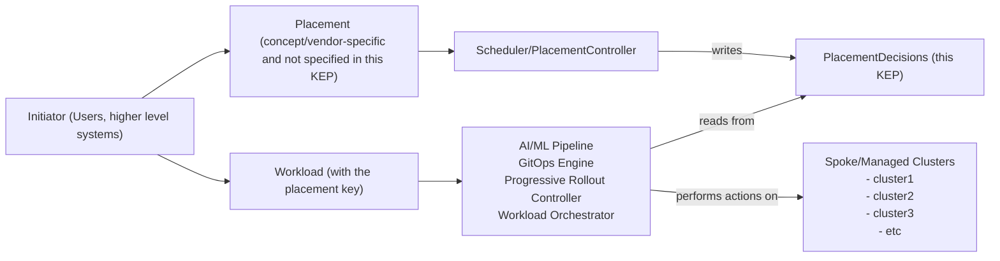

# KEP-5313: PlacementDecision API

<!-- toc -->
- [Release Signoff Checklist](#release-signoff-checklist)
- [Summary](#summary)
- [Motivation](#motivation)
  - [Goals](#goals)
  - [Non-Goals](#non-goals)
  - [Why define PlacementDecision before a standardized Placement API?](#why-define-placementdecision-before-a-standardized-placement-api)
- [Proposal](#proposal)
  - [Terminology](#terminology)
  - [Flow Examples](#flow-examples)
  - [API Definition](#api-definition)
  - [API Example](#api-example)
  - [Consumer Discovery and Usage](#consumer-discovery-and-usage)
  - [Slicing](#slicing)
  - [Lifecycle](#lifecycle)
  - [Ownership](#ownership)
  - [Relationship to other SIG-Multicluster (SIG-MC) APIs](#relationship-to-other-sig-multicluster-sig-mc-apis)
  - [Consumer Feedback](#consumer-feedback)
  - [User Stories (Optional)](#user-stories-optional)
    - [Story 1: GPU-aware AI training](#story-1-gpu-aware-ai-training)
    - [Story 2: Progressive rollout](#story-2-progressive-rollout)
    - [Story 3: Disaster recovery](#story-3-disaster-recovery)
    - [Story 4: Self produce and self consume (Argo CD)](#story-4-self-produce-and-self-consume-argo-cd)
    - [Story 5: Multiple consumers fan-out](#story-5-multiple-consumers-fan-out)
  - [Notes/Constraints/Caveats (Optional)](#notesconstraintscaveats-optional)
  - [Risks and Mitigations](#risks-and-mitigations)
- [Design Details](#design-details)
  - [Test Plan](#test-plan)
      - [Prerequisite testing updates](#prerequisite-testing-updates)
      - [Unit tests](#unit-tests)
      - [Integration tests](#integration-tests)
      - [e2e tests](#e2e-tests)
  - [Graduation Criteria](#graduation-criteria)
    - [Alpha](#alpha)
    - [Beta](#beta)
    - [GA](#ga)
  - [Upgrade / Downgrade Strategy](#upgrade--downgrade-strategy)
  - [Version Skew Strategy](#version-skew-strategy)
- [Production Readiness Review Questionnaire](#production-readiness-review-questionnaire)
  - [Feature Enablement and Rollback](#feature-enablement-and-rollback)
  - [Rollout, Upgrade and Rollback Planning](#rollout-upgrade-and-rollback-planning)
  - [Monitoring Requirements](#monitoring-requirements)
  - [Dependencies](#dependencies)
  - [Scalability](#scalability)
  - [Troubleshooting](#troubleshooting)
- [Implementation History](#implementation-history)
- [Drawbacks](#drawbacks)
- [Alternatives](#alternatives)
- [Infrastructure Needed (Optional)](#infrastructure-needed-optional)
<!-- /toc -->

## Release Signoff Checklist

Items marked with (R) are required *prior to targeting to a milestone / release*.

<!-- Keep this list updated as progress is made. Do not remove items; check them off. -->

- [ ] (R) Enhancement issue in release milestone, which links to KEP dir in [kubernetes/enhancements] (not the initial KEP PR)
- [ ] (R) KEP approvers have approved the KEP status as `implementable`
- [ ] (R) Design details are appropriately documented
- [ ] (R) Test plan is in place, giving consideration to SIG Architecture and SIG Testing input (including test refactors)
  - [ ] e2e Tests for all Beta API Operations (endpoints)
  - [ ] (R) Ensure GA e2e tests meet requirements for [Conformance Tests](https://github.com/kubernetes/community/blob/master/contributors/devel/sig-architecture/conformance-tests.md) 
  - [ ] (R) Minimum Two Week Window for GA e2e tests to prove flake free
- [ ] (R) Graduation criteria is in place
  - [ ] (R) [all GA Endpoints](https://github.com/kubernetes/community/pull/1806) must be hit by [Conformance Tests](https://github.com/kubernetes/community/blob/master/contributors/devel/sig-architecture/conformance-tests.md) 
- [ ] (R) Production readiness review completed
- [ ] (R) Production readiness review approved
- [ ] "Implementation History" section is up-to-date for milestone
- [ ] User-facing documentation has been created in [kubernetes/website], for publication to [kubernetes.io]
- [ ] Supporting documentation—e.g., additional design documents, links to mailing list discussions/SIG meetings, relevant PRs/issues, release notes

[kubernetes.io]: https://kubernetes.io/
[kubernetes/enhancements]: https://git.k8s.io/enhancements
[kubernetes/kubernetes]: https://git.k8s.io/kubernetes
[kubernetes/website]: https://git.k8s.io/website

## Summary

Today every multicluster scheduler publishes its own API to convey where a workload should run,
forcing downstream tools such as GitOps engine, workload orchestrator, progressive rollout controller,
or AI/ML pipeline to understand a scheduler-specific API.

This KEP introduces a vendor neutral `PlacementDecision` API that standardizes
the output of multicluster placement calculations. A `PlacementDecision` object is data only:
a namespaced list of chosen clusters whose referenced names must map one-to-one to `ClusterProfile`s
as defined by the [ClusterProfile API](https://github.com/kubernetes/enhancements/pull/4322).
Any scheduler can emit the object and any consumer can watch it.
Neither side needs to know about the other, enabling plug-and-play modularity in the multicluster stack.

Workload correlation is optional. When a decision is tied to a specific workload,
producers may label the `PlacementDecision` with the workload's placement key.
Decisions not tied to a workload are supported
(ie, a controller continuously publishesa reusable decision stream for consumers).


```mermaid
flowchart LR
    Initiator["Initiator (Users, higher level systems)"] -->
    PL["Placement (concept/vendor-specific and not specified in this KEP)"]
    PL --> S["Scheduler/PlacementController"]
    S -- writes --> PD["PlacementDecisions (this KEP)"]

    Initiator--> WL["Workload (with the placement key)"]
    WL --> Tools["AI/ML Pipeline<br>GitOps Engine<br>Progressive Rollout Controller<br>Workload Orchestrator"]
    Tools -- reads from --> PD
    Tools -- performs actions on -->
    Spokes["Spoke/Managed Clusters<br>- cluster1<br>- cluster2<br>- cluster3<br>- etc"]
```

## Motivation

A typical multicluster setup:

1. Scheduler: examines the fleet (`ClusterProfile` objects),
   and other signals/metrics and decides *where* a workload should land.
2. Consumer: GitOps engine, workload orchestrator, progressive rollout controller, AI/ML pipeline
   read that decision and act (for example, by creating [Work](https://github.com/kubernetes-sigs/work-api) objects).

Currently every scheduler have its own API for step #1
so each consumer might need to learn different APIs which slow down integration,
locking users to specific vendors, and complicate RBAC/validation work.

A standardized `PlacementDecision` API:

* Decouples schedulers from consumers swap either side without rewriting the other.
* Aligns with the SIG-Multicluster `ClusterProfile` inventory.
* Simplifies RBAC: one resource schema to secure.
* Allows consumers (GitOps engines, workload orchestrators, progressive rollout controllers,
  AI/ML pipelines) to act on placement results through one standardized PlacementDecision API.

### Goals

* Define a namespaced scope, minimalistic, data only `PlacementDecision` API that lists selected clusters.
* Support continuous rescheduling: decision list may be updated.
* Provide a general approach for consumers to read the placement decision.
* Guarantee that every (`clusterNamespace`, `clusterName`) pair matches a
  `ClusterProfile` (`metadata.namespace`, `metadata.name`) in the fleet. (Enforced via admission.)
* Provide label and naming conventions so consumers can retrieve all slices of one decision:
  via label selector or deterministic naming.
* Leave room for schedulers implementations.

### Non-Goals

* Describing how a scheduler made its choice (Placement API spec).
* Placement/PlacementRequest schema or request format.
* Describing how consumers access selected clusters.
* Embedding orchestration logic or consumer feedback in `PlacementDecision`.
* Replace Work API which is responsible for actually applying the workload.

### Why define PlacementDecision before a standardized Placement API?

The producer consumer swap we want most is at the decision interface:
any scheduler can publish the same simple, data only result and any consumer can read it and act.
How to request scheduling (the Placement spec) is much more complex since it needs to cover all the scheduling
scenarios and will take much longer to define.
Defining `PlacementDecision` first allows for the following:
- Consumers can adopt one reader that works for all the vendors that supports this API.
- Vendors can define their own custom placement spec/logic without coupling consumers.
- Simple RBAC due to one resource schema to secure `get/list/watch` for consumers.

## Proposal

### Terminology

- **Placement**: A scheduler request that asks "where should this workload run?".
  Not standardized here and may not exist as a resource.

- **Scheduling decision**: The resolved set of target clusters at a point in time.

- **Placement key**: A correlation string to associate the placement request/decision with a workload when applicable.
  It is carried in the `multicluster.x-k8s.io/placement-key` label and applied on the workload and its children.
  Producers may also put this label on `PlacementDecision` slices when the decision is workload scoped.
  (Decisions not tied to a workload need not set this label.)

- **Decision key**: An opaque correlation string chosen by implementers to group decision slices.
  When used, it is carried in the `multicluster.x-k8s.io/decision-key` label.

- **Scheduler**: A controller that writes `PlacementDecisions` based on `ClusterProfiles` and
  scheduling/placement requirements/specs.

- **Consumer**: Any controller (GitOps engine, workload orchestrator, progressive rollout controller, AI/ML pipeline)
  that watches `PlacementDecisions` and acts.

### Flow Examples

Two common ways this API is used in practice:

**Argo CD (per app/workload) flow**
1. Initiator decides an Argo `ApplicationSet` that still needs the exact target clusters.
2. Initiator creates a `Placement` request to a multicluster scheduler (vendor-specific, may be a CRD)
   using its specific API.
3. Initiator puts the placement key on the corresponding Argo CD Application's `multicluster.x-k8s.io/placement-key` label.
4. Scheduler/PlacementController writes one or more `PlacementDecision` slice objects,
   correlated via the same `multicluster.x-k8s.io/decision-key` when multiple slices are used.
   (Optional) If this decision is workload scoped, the scheduler may also copy the `placement-key` label onto the slices.
5. A new controller watches/gets those `PlacementDecision` objects and finds the corresponding `ApplicationSet`
   (by placement key when present, or via decision-key/deterministic naming).
6. The controller updates the corresponding `ApplicationSet`'s generator spec based on the `PlacementDecision` object.
7. ArgoCD controller applies or removes workload to match the generator spec.

**MultiKueue (per job) flow**
1. Fleet Admin creates the necessary Kueue customer resources like  `ClusterQueue`, `LocalQueue`, `ResourceFlavor`, etc on the worker clusters.
1. Fleet Admin creates the necessary Kueue customer resources like  `ClusterQueue`, `LocalQueue`, `ResourceFlavor`, `AdmissionCheck`, `MultiKueueCluster`, etc on the hub cluster.
2. Fleet Admin creates a `MultiKueue` configuration whose `DispatcherName` field is the name of muticluster scheduler on the hub cluster. This indicates MultiKueue to delegate the placement decision to the external scheduler.
3. Initiator creates a `Placement` request to a multicluster scheduler (vendor-specific, may be a CRD)
   using its specific API.
4. Initiator creates a Kueue supported `Workload` (i.e. Job, CronJob, RayJob, etc) that references a `LocalQueue` and puts the placement key label on it.
5. Scheduler/PlacementController writes one or more `PlacementDecision` slice objects, all correlated via the same `multicluster.x-k8s.io/decision-key` when multiple slices are used. (Optional) If this decision is workload scoped, the scheduler may also set the `placement-key` label.
6. A new controller watches/gets those `PlacementDecision` objects and finds the corresponding kueue `Workload` by placement key if present (or via decision-key/naming).
7. The controller patches the `.status.nominatedClusterNames` field of the `Workload` with the list of clusters from the `PlacementDecision`.
8. The MultiKueue controller then copies the `Workload` to the nominated clusters and waits for the `Workload` to be admitted by the `ClusterQueue` on the worker clusters.

**Best available cluster flow**

1. Initiator creates a `Placement` request to the multicluster scheduler (vendor-specific, may be a CRD).
2. Scheduler computes and publishes `PlacementDecision` for that request and may update them over time.
3. Consumer chooses the usage pattern (no API markings required):
   - One-shot: Read the `PlacementDecision` once (by the workload's placement key when present, or by other correlation), act and ignore future updates.
   - Re-evaluation: Watch the same `PlacementDecision` and reconcile on changes (add/remove new clusters)

Different consumers can make different choices for the same decision.

### API Definition

```
// PlacementDecision publishes the set of clusters chosen by a scheduler at a point in time.
type PlacementDecision struct {
  metav1.TypeMeta   `json:",inline"`
  metav1.ObjectMeta `json:"metadata,omitempty"`

  // Up to 100 ClusterDecisions per object (slice) to stay well below the etcd limit.
  // +kubebuilder:validation:MinItems=0
  // +kubebuilder:validation:MaxItems=100
  Decisions []ClusterDecision `json:"decisions"`

  // Optional: Name of the scheduler that created this decision.
  // +optional
  SchedulerName string `json:"schedulerName,omitempty"`
}

// Optional: when a decision spans multiple slices: links all slices to the same decision.
const DecisionKeyLabel = "multicluster.x-k8s.io/decision-key"

// Optional: label that indicates the index position of this slice when order matters.
const DecisionIndexLabel = "multicluster.x-k8s.io/decision-index"

// Optional: label that links a decision to an originating workload when applicable.
const PlacementKeyLabel = "multicluster.x-k8s.io/placement-key"

// ClusterDecision references a target ClusterProfile to apply workloads to.
type ClusterDecision struct {
  // Reference to the target ClusterProfile.
  ClusterProfileRef corev1.ObjectReference `json:"clusterProfileRef"`

  // Optional: Reason to why this cluster was chosen.
  // +optional
  Reason string `json:"reason,omitempty"`
}
```

### API Example

```
apiVersion: multicluster.x-k8s.io/v1alpha1
kind: PlacementDecision
metadata:
  name: app-placement-decision-0
  namespace: argocd
  labels:
    # Optional: present when the decision is tied to a workload
    multicluster.x-k8s.io/placement-key: "my-app"
    # Optional: if this logical decision spans multiple slices
    multicluster.x-k8s.io/decision-key: "argocd-app-placement-decision"
    # Optional: ordering hint when order matters across slices
    multicluster.x-k8s.io/decision-index: "0"
schedulerName: multicluster-placement-controller
decisions:
- clusterProfileRef:
    apiVersion: multicluster.x-k8s.io/v1alpha1
    kind: ClusterProfile
    namespace: fleet1
    name: cluster1
  reason: "GPUs available"
- clusterProfileRef:
    apiVersion: multicluster.x-k8s.io/v1alpha1
    kind: ClusterProfile
    namespace: fleet1
    name: cluster2
  reason: "GPUs available"
```

### Consumer Discovery and Usage

Consumers can discover and use `PlacementDecision` in one of the following ways:

**Label selector (recommended)**

- If the decision is workload scoped, the producer may set `multicluster.x-k8s.io/placement-key=<placement-key>` on slices.
  Consumers can list/watch with `labelSelector=multicluster.x-k8s.io/placement-key=<placement-key>` in the namespace.
- If ordering matters and results span multiple slices, producer should set
  `multicluster.x-k8s.io/decision-index=<0..N>` and consumers can sort by that label.
- When multiple slices exist for one logical decision, the producer **MUST** set the same
  `multicluster.x-k8s.io/decision-key=<decision-key>` on all slices.
- To avoid assembling partially updated sets during reschedules, consumers SHOULD also group by a common
  `multicluster.x-k8s.io/decision-revision` value across slices.

or

**Deterministic naming**
- Producer uses a predictable naming scheme (`<base>-<slice-index>`),
  and the consumer `Get`s by name or lists by a name prefix within a namespace.
- When using naming for grouping, the consumer is responsible for correlating all slices that share the same base.

Controllers may implement both options simultaneously.

### Slicing

* Following [EndpointSlice](https://kubernetes.io/docs/concepts/services-networking/endpoint-slices/) design,
  a single scheduling decision can fan out to N `PlacementDecision` slices,
  each limited to 100 clusters (EndpointSlice’s default).
* To correlate slices, producers MUST:
  * set the same `multicluster.x-k8s.io/decision-key=<decision-key>` on all slices when more than one slice exists.
* Producers may also:
  * set `multicluster.x-k8s.io/placement-key=<placement-key>` on slices when the decision is workload scoped.
* If a scheduler needs to preserve the order of selected clusters and the result spans multiple slices,
  it should label each PlacementDecision with `multicluster.x-k8s.io/decision-index=<index>`
  where <index> starts at 0 and increments by 1.
  Consumers that require ordering can sort by this label.

### Lifecycle
- **Create**: The scheduler creates one or more slices with the list of clusters in the decision.
  To enable discovery, it should choose either or both:
  - **Label selector** correlation: set `multicluster.x-k8s.io/decision-key=<decision-key>` on every slice when there are multiple slices;
    optionally set `multicluster.x-k8s.io/placement-key=<placement-key>` when workload scoped, and
    `multicluster.x-k8s.io/decision-index` when order matters.
  - **Deterministic naming** correlation: use a deterministic naming pattern and set `multicluster.x-k8s.io/decision-index`
    when order matters (label is optional).
  The scheduler may populate the reason for each decision for debugging/auditing.

- **Update / Reschedule**: The scheduler may add or remove clusters in decisions at any time.
  If the number of target clusters crosses the 100 limit,
  it must create or delete slices to maintain the slicing rule.
  If order changes, update decision-index values accordingly so consumers can detect the new order.

  Consumer Actions on Updates:
  - **Clusters Added**: Consumer should deploy workloads to the newly added clusters
    (ie, create `Work` objects targeting new clusters).
  - **Clusters Removed**: Consumer should remove workloads from clusters no longer in the decision list
    (ie, delete `Work` objects, drain workloads).

  If heavy churn is a concern, a scheduler may treat `decisions` as an unordered set and
  maintain it in a deterministic order (ie, alphabetical sorting).
  When the cluster set itself has not changed, this stable ordering produces an identical set of clusters,
  so the API server skips the write and no extra change events reach consumers.

- **Delete**: When a scheduling decision is no longer required.
  (application/workload lifecycle ended, policy changes, or scheduler shutdown/replacement),
  the scheduler deletes every related `PlacementDecision` slice.
  Consumers should react to the delete event and remove any workload previously applied to the listed clusters.

### Ownership

- The scheduler that creates the `PlacementDecision` owns the object.
  It is solely responsible for all writes (`create`, `update`, `patch`, `delete`).
  The consumers of the `PlacementDecision` MUST treat the object as read only (`get`, `list`, `watch`).
- RBAC will enforce this contract by granting the scheduler write verbs on `PlacementDecisions`,
  while limiting consumers to read only access.

### Relationship to other SIG-Multicluster (SIG-MC) APIs
* **ClusterProfile** The inventory. Each decision must reference a matching name `ClusterProfile`
* **Work API** The workload. A consumer may read `PlacementDecision` then for each cluster creates `Work`.

### Consumer Feedback
Consumer feedback is intentionally out of scope for PlacementDecision.
The PlacementDecision object's sole purpose is to publish the scheduler’s chosen cluster list.
Once it has been created then it should be treated as read only by consumers.

Allowing consumers to update the same PlacementDecision would complicate lifecycle ownership
(whether the scheduler or the consumer is responsible for adding, updating, or removing cluster entries).
It would also complicate the security/permission because maybe a malicious consumer could
update the decision and move some workloads to unintended clusters.

When consumers need to do feedback to the scheduler,
they should do so through a separate channel like events, metrics,
or maybe even a purpose built PlacementFeedback API
so they have clear write authority and the scheduler can decide what to do with that feedback in the end.

### User Stories (Optional)

#### Story 1: GPU-aware AI training

 * Initiator: ML platform / pipeline for a specific training job
 * Initiator submits a placement request and labels the workload with `multicluster.x-k8s.io/placement-key`.
 * The ML scheduler scores `ClusterProfile`s by GPUs, cost, etc., and writes a `PlacementDecision` listing the chosen clusters.
 * A GitOps/Work-API syncer watches the decision and deploys the training job only to those clusters.
 * If cost rises or GPUs become unavailable, the scheduler updates the `PlacementDecision`; the syncer reconciles accordingly.

#### Story 2: Progressive rollout

 * Initiator: Progressive rollout controller for a service/version
 * The rollout controller defines the rollout plan and requests placement from a scheduler (or acts as the scheduler).
 * The scheduler creates/updates the `PlacementDecision` keyed to the release.
 * Consumers (GitOps, etc.) watch and deploy only where the decision indicates.

#### Story 3: Disaster recovery

* Initiator: DR controller / policy owner
* The DR controller monitors `ClusterProfile` status and health signals for protected workloads.
* It updates the corresponding `PlacementDecision`, replacing the primary with a standby when needed.
* The syncer deletes workloads from the failed cluster and recreates them on the standby.

#### Story 4: Self produce and self consume (Argo CD)
* Initiator: Argo CD ApplicationSet generator
* The generator computes targets and writes `PlacementDecision`s keyed to the app/release (and/or to a placement key).
* The Argo CD controller reads the `PlacementDecision` and creates/updates Applications for each target cluster.

#### Story 5: Multiple consumers fan-out
 * Initiator: Same as in the originating scenario (rollout controller, DR controller, ML platform)
 * A scheduler publishes one `PlacementDecision` for the placement key owned by the initiator (when applicable), or a generic decision.
 * Multiple consumers (GitOps, DR, orchestration, AI/ML pipelines) act on the same data.
 * Consistent targeting across tools with no duplicate placement logic.

### Notes/Constraints/Caveats (Optional)

<!-- Placeholder: elaborate on any scale, security, or ordering caveats if reviewers request. -->

### Risks and Mitigations

## Design Details

* Scope: Namespace scoped for RBAC parity with Work and ClusterProfile.

* The resource is pure data following `EndpointSlice` convention.

* Max size: 100 ClusterDecision entries per slice keeps object well below etcd limit.

* Validation: A webhook may verify that every (clusterNamespace, clusterName)
  pair has a matching ClusterProfile in the fleet.
  If `multicluster.x-k8s.io/decision-index` is set, it should be >=0.

### Test Plan

[x] I/we understand the owners of the involved components may require updates to
existing tests to make this code solid enough prior to committing the changes necessary
to implement this enhancement.

* Unit tests for CRD defaults/validation.

* Ensuring slice size <= 100 and required labels exists.

##### Prerequisite testing updates

<!--
Based on reviewers feedback describe what additional tests need to be added prior
implementing this enhancement to ensure the enhancements have also solid foundations.
-->

##### Unit tests

- `<package>`: `<date>` - `<test coverage>`

##### Integration tests

- <test>: <link to test coverage>

##### e2e tests

- <test>: <link to test coverage>

### Graduation Criteria

#### Alpha

- A CRD definition and generated client.
- A dummy controller and unit test to validate the CRD and client.

#### Beta

- Gather feedback from users during the Alpha stage to identify any
  issues, limitations, or areas for improvement. Address this feedback
  by making the necessary changes to the API and iterating on its design
  and functionality.
- At least two providers and one consumer using `PlacementDecision` API.
- Conformance test suite for schedulers.
- Metrics for slice count and QPS.
- Backwards compatible field/label stability.

#### GA

- N examples of real-world usage
- N installs
- More rigorous forms of testing ie. downgrade tests and scalability
  tests
- Allowing time for feedback
- Stability: The API should demonstrate stability in terms of its
  reliability.
- Functionality: The API should provide the necessary functionality for
  multicluster scheduling, including the ability to distribute workloads
  across clusters. This should be validated through a series of
  functional tests and real-world use cases.
- Integration: Ensure that the API can be easily integrated with popular
  workload distribution tools, such as GitOps and Work API. This may
  involve developing plugins or extensions for these tools or providing
  clear guidelines on how to integrate them with the unified API.
- Performance and Scalability: Conduct performance and scalability tests
  to ensure that the API can handle a large number of clusters and
  workloads without degrading its performance. This may involve stress
  testing the API with a high volume of requests or simulating
  large-scale deployments.

**Note:** Generally we also wait at least two releases between beta and
GA/stable, because there's no opportunity for user feedback, or even bug
reports, in back-to-back releases.

### Upgrade / Downgrade Strategy

Additive-only until GA; optional fields carry defaults; no disruptive schema changes.

### Version Skew Strategy

Older consumers ignore unknown fields; older schedulers remain valid. Label contracts stable from alpha.

## Production Readiness Review Questionnaire

### Feature Enablement and Rollback

###### How can this feature be enabled / disabled in a live cluster?

- [ ] Feature gate (also fill in values in `kep.yaml`)
  - Feature gate name:
  - Components depending on the feature gate:
- [x] Other
  - Describe the mechanism:
  - Will enabling / disabling the feature require downtime of the control
    plane?
  - Will enabling / disabling the feature require downtime or reprovisioning
    of a node?

###### Does enabling the feature change any default behavior?

- No default Kubernetes behavior is currently planned to be based on
  this feature; it is designed to be used by the separately installed,
  out-of-tree, multicluster management providers and consumers.

###### Can the feature be disabled once it has been enabled (i.e. can we roll back the enablement)?

- Yes, as this feature only describes a CRD, it can most directly be
  disabled by uninstalling the CRD.

###### What happens if we reenable the feature if it was previously rolled back?

###### Are there any tests for feature enablement/disablement?

- As a dependency only for an out-of-tree component, there will not be
  e2e tests for feature enablement/disablement of this CRD in core
  Kubernetes. The e2e test can be provided by multicluster management
  providers who support this API.

### Rollout, Upgrade and Rollback Planning

###### How can a rollout or rollback fail? Can it impact already running workloads?

###### What specific metrics should inform a rollback?

###### Were upgrade and rollback tested? Was the upgrade->downgrade->upgrade path tested?

###### Is the rollout accompanied by any deprecations and/or removals of features, APIs, fields of API types, flags, etc.?

### Monitoring Requirements

###### How can an operator determine if the feature is in use by workloads?

###### How can someone using this feature know that it is working for their instance?

- [x] Events
  - Event Reason: 
- [ ] API .status
  - Condition name: 
  - Other field: 
- [ ] Other (treat as last resort)
  - Details:

###### What are the reasonable SLOs (Service Level Objectives) for the enhancement?

###### What are the SLIs (Service Level Indicators) an operator can use to determine the health of the service?

- [ ] Metrics
  - Metric name:
  - [Optional] Aggregation method:
  - Components exposing the metric:
- [ ] Other (treat as last resort)
  - Details:

###### Are there any missing metrics that would be useful to have to improve observability of this feature?

### Dependencies


###### Does this feature depend on any specific services running in the cluster?

### Scalability

###### Will enabling / using this feature result in any new API calls?

###### Will enabling / using this feature result in introducing new API types?

###### Will enabling / using this feature result in any new calls to the cloud provider?

###### Will enabling / using this feature result in increasing size or count of the existing API objects?

###### Will enabling / using this feature result in increasing time taken by any operations covered by existing SLIs/SLOs?

###### Will enabling / using this feature result in non-negligible increase of resource usage (CPU, RAM, disk, IO, ...) in any components?

###### Can enabling / using this feature result in resource exhaustion of some node resources (PIDs, sockets, inodes, etc.)?

### Troubleshooting

###### How does this feature react if the API server and/or etcd is unavailable?

###### What are other known failure modes?

###### What steps should be taken if SLOs are not being met to determine the problem?

## Implementation History

## Drawbacks

## Alternatives

- Status quo: every multicluster provider/scheduler ships its own API leads to consumer bloat and vendor lock-in.

- Extending `Work API`: overloads a workload syncner API with scheduling details which couples the where with the what.

## Infrastructure Needed (Optional)
