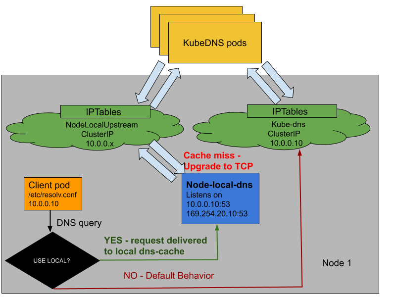

# NodeLocal DNS Cache

## Table of Contents

<!-- toc -->
- [Summary](#summary)
- [Motivation](#motivation)
  - [Goals](#goals)
  - [Non-Goals](#non-goals)
- [Proposal](#proposal)
    - [Daemonset and Listen Interface for caching agent](#daemonset-and-listen-interface-for-caching-agent)
    - [iptables NOTRACK](#iptables-notrack)
    - [Choice of caching agent](#choice-of-caching-agent)
    - [Metrics](#metrics)
  - [Risks and Mitigations](#risks-and-mitigations)
  - [Test Plan](#test-plan)
- [Graduation Criteria](#graduation-criteria)
    - [Alpha -&gt; Beta Graduation](#alpha---beta-graduation)
    - [Beta -&gt; GA Graduation](#beta---ga-graduation)
- [Rollout Plan](#rollout-plan)
- [Implementation History](#implementation-history)
- [Drawbacks [optional]](#drawbacks-optional)
- [Alternatives [optional]](#alternatives-optional)
<!-- /toc -->

## Summary

This proposal aims to improve DNS performance by running a dns caching agent on cluster nodes as a Daemonset. In today's architecture, pods in ClusterFirst DNS mode reach out to a kube-dns serviceIP for DNS queries. This is translated to a kube-dns endpoint via iptables rules added by kube-proxy. With this new architecture, pods will reach out to the dns caching agent running on the same node, thereby avoiding iptables DNAT rules and connection tracking. The local caching agent will query kube-dns for cache misses of cluster hostnames(cluster.local suffix by default).


## Motivation

* With the current DNS architecture, it is possible that pods with the highest DNS QPS have to reach out to a different node, if there is no local kube-dns instance.  
Having a local cache will help improve the latency in such scenarios. 

* Skipping iptables DNAT and connection tracking will help reduce [conntrack races](https://github.com/kubernetes/kubernetes/issues/56903) and avoid UDP DNS entries filling up conntrack table.

* Connections from local caching agent to kube-dns can be upgraded to TCP. TCP conntrack entries will be removed on connection close in contrast with UDP entries that have to timeout ([default](https://www.kernel.org/doc/Documentation/networking/nf_conntrack-sysctl.txt) `nf_conntrack_udp_timeout` is 30 seconds)

* Upgrading DNS queries from UDP to TCP would reduce tail latency attributed to dropped UDP packets and DNS timeouts usually up to 30s (3 retries x (5s timeout for A + 5s timeout for AAAA)). Since the nodelocal cache listens for UDP DNS queries, applications don't need to be changed.

* Metrics & visibility into dns requests at a node level.

* Neg caching can be re-enabled, thereby reducing number of queries to kube-dns.

* There are several open github issues proposing a local DNS Cache daemonset and scripts to run it:
	* [https://github.com/kubernetes/kubernetes/issues/7470#issuecomment-248912603](https://github.com/kubernetes/kubernetes/issues/7470#issuecomment-248912603)

	* [https://github.com/kubernetes/kubernetes/issues/32749](https://github.com/kubernetes/kubernetes/issues/32749)

	* [https://github.com/kubernetes/kubernetes/issues/45363](https://github.com/kubernetes/kubernetes/issues/45363)


This shows that there is interest in the wider Kubernetes community for a solution similar to the proposal here. 


### Goals

Being able to run a dns caching agent as a Daemonset and get pods to use the local instance. Having visibility into cache stats and other metrics.

### Non-Goals

* Providing a replacement for kube-dns/CoreDNS.
* Changing the underlying protocol for DNS (e.g. to gRPC)

## Proposal

A nodeLocal dns cache runs on all cluster nodes. This is managed as an add-on, runs as a Daemonset. All pods using clusterDNS will now talk to the nodeLocal cache, which will query kube-dns in case of cache misses in cluster's configured DNS suffix and for all reverse lookups(in-addr.arpa and ip6.arpa). User-configured stubDomains will be passed on to this local agent.  
The node's resolv.conf will be used by this local agent for all other cache misses. One benefit of doing the non-cluster lookups on the nodes from which they are happening, rather than the kube-dns instances, is better use of per-node DNS resources in cloud. For instance, in a 10-node cluster with 3 kube-dns instances, the 3 nodes running kube-dns will end up resolving all external hostnames and can exhaust QPS quota. Spreading the queries across the 10 nodes will help alleviate this.

#### Daemonset and Listen Interface for caching agent

The caching agent daemonset runs in hostNetwork mode in kube-system namespace with a Priority Class of “system-node-critical”. It listens for dns requests on a dummy interface created on the host. A separate ip address is assigned to this dummy interface, so that requests to kube-dns or any other custom service are not incorrectly intercepted by the caching agent. This will be a link-local ip address selected by the user. Each cluster node will have this dummy interface. If the cluster has kube-proxy running in iptables mode, the dummy interface has both the special IP address as well as kube-dns service IP address assigned to it. There is no change to the --cluster-dns kubelet flag value. In other modes, the dummy interface is only assigned the special IP address. This ip address will be passed on to kubelet via the --cluster-dns flag, if the feature is enabled.

A new service spec is added to the node-local-dns yaml, this is almost identical to the kube-dns service spec. 

```
apiVersion: v1
kind: Service
metadata:
  name: node-local-upstream
  namespace: kube-system
  labels:
    k8s-app: kube-dns
    kubernetes.io/cluster-service: "true"
    addonmanager.kubernetes.io/mode: Reconcile
    kubernetes.io/name: "NodeLocalUpstream"
spec:
  selector:
    k8s-app: kube-dns
  ports:
  - name: dns
    port: 53
    protocol: UDP
  - name: dns-tcp
    port: 53
```

It has the same selectors as kube-dns, so this service IP will be mapped to the same kube-dns endpoints.
This new service is required for node-local-dns pod to talk to kube-dns endpoints. This will be the IP address used by node-local-dns in case of cache misses in the cluster.local domain.
This service spec does not reserve a specific clusterIP, let's assume the assigned IP is 10.0.0.50 (it can be different on each setup). Let's assume the kube-dns IP is 10.0.0.10.
By default, kube-proxy will install rules so that packets targeting 10.0.0.10 are DNAT'ed to one of the kube-dns endpoints. A similar rule will be installed for 10.0.0.50 as well. However, we need packets to 10.0.0.10 to be sent to the local interface that node-local-dns pod is listening on. This is possible by using the NOTRACK action in iptables.

The selected link-local IP will be handled specially because of the NOTRACK rules described in the section below.

#### iptables NOTRACK

NOTRACK rules are added for connections to and from the nodelocal dns ip. Additional rules in FILTER table to whitelist these connections, since the INPUT and OUTPUT chains have a default DROP policy.

The nodelocal cache process will create the dummy interface and iptables rules . It gets the nodelocal dns ip as a parameter, performs setup and listens for dns requests. The Daemonset runs in privileged securityContext since it needs to create this dummy interface and add iptables rules.

As mentioned above, node-local-dns pod installs iptables rule with NOTRACK action so that connections to and from the node-local-dns IP on port 53 can avoid being tracked via CONNTRACK. The purpose was to prevent usage of conntrack entries for DNS requests. Another benefit is that this avoids additional NAT table rules from being applied on the packet. So, as long as we have a rule 
`-d 10.0.0.10 --dport 53 -j NOTRACK`,
the NAT table rules that reroute the packet to kube-dns endpoints will not be applied. We also need a filter table rule to make sure the packet isn't dropped.
The request packet can now be locally consumed by node-local-dns pod. The node-local-dns pod will use the new service IP - 10.0.0.50, as its Upstream Nameserver, which will still map to the endpoints.
So, we can use the NOTRACK rule as a switch to flip between using node-local-dns and kube-dns endpoints.

Here is a diagram to explain this flow:



As summarized above, we will use the iptables NOTRACK rule to implement the "USE LOCAL?" condition in the diagram.

The benefits of this approach are:

1) node-local-dns can be used on existing clusters without any kubelet change. Pods continue to use kube-dns service IP in their /etc/resolv.conf and we transparently switch the backend to the new cache.

2) We are able to, somewhat elegantly, failover to kube-dns endpoints.

3) Disabling node-local-dns does not require any kubelet change either.

We still need some component to dynamically determine when to use node-local-dns and when to flip to kube-dns endpoints. This logic can be separated out into an independent container/pod whose function is to query for dns records on 169.254.20.10:53 and follow some threshold to either install or remove the NOTRACK rules. This can be a new Daemonset or combined into an existing Daemonset that is in HostNetwork mode and manages iptables rules in some way - for instance a CNI Daemonset. This component will handle adding all iptables rules needed for node-local-dns.

The caveat of this approach is that it only works in the iptables implementation of kube-proxy. In order to achieve High Availability in other modes like IPVS: 
2 daemonsets of node-local-dns can be run with both using the same listenIP (example - 169.254.20.10) via SO_REUSEPORT option. Upgrades will be done one daemonset at a time.

Another observation is that the upstream dns server IP used by node-local-dns will differ from one setup to another since it is a dynamically allocated service IP.  This doesn't appear to be a major concern.

The cache process will also periodically ensure that the dummy interface and iptables rules are present, in the background. Rules need to be checked in the raw table and filter table. Rules in these tables do not grow with number of valid services. Services with no endpoints will have rules added in filter table to drop packets destined to these ip. The resource usage for periodic iptables check was measured by creating 2k services with no endpoints and running the nodelocal caching agent. Peak memory usage was 20Mi for the caching agent when it was responding to queries along with the periodic checks. This was measured using `kubectl top` command. More details on the testing are in the following section.

[Proposal presentation](https://docs.google.com/presentation/d/1c43cZqbVhGAlw3dSNQIOGuvQmDfKaA2yiAPRoYpa6iY), also shared at the sig-networking meeting on 2018-10-04

Slide 5 has a diagram showing how the new dns cache fits in.

#### Choice of caching agent

The current plan is to run CoreDNS by default. Benchmark [ tests](https://github.com/kubernetes/perf-tests/tree/master/dns) were run using [Unbound dns server](https://www.nlnetlabs.nl/projects/unbound/about/) and CoreDNS. 2 more tests were added to query for 20 different services and to query several external hostnames.

Tests were run on a 1.9.7 cluster with 2 nodes on GCE, using Unbound 1.7.3 and CoreDNS 1.2.3.
Resource limits for nodelocaldns daemonset was CPU - 50m, Memory 25Mi

Resource usage and QPS were measured with a nanny process for Unbound/CoreDNS plugin adding iptables rules and ensuring that the rules exist, every minute.

Caching was minimized in Unbound by setting:
msg-cache-size: 0
rrset-cache-size: 0
msg-cache-slabs:1
rrset-cache-slabs:1
Previous tests did not set the last 2 and there were quite a few unexpected cache hits.

Caching was disabled in CoreDNS by skipping the cache plugin from Corefile.

These are the results when dnsperf test was run with no QPS limit. In this mode, the tool  sends queries until they start timing out.

| Test Type             | Program | Caching | QPS  |
|-----------------------|---------|---------|------|
| Multiple services(20) | CoreDNS | Yes     | 860  |
| Multiple services(20) | Unbound | Yes     | 3030 |
|                       |         |         |      |
| External queries      | CoreDNS | Yes     | 213  |
| External queries      | Unbound | Yes     | 115  |
|                       |         |         |      |
| Single Service        | CoreDNS | Yes     | 834  |
| Single Service        | Unbound | Yes     | 3287 |
|                       |         |         |      |
| Single NXDomain       | CoreDNS | Yes     | 816  |
| Single NXDomain       | Unbound | Yes     | 3136 |
|                       |         |         |      |
| Multiple services(20) | CoreDNS | No      | 859  |
| Multiple services(20) | Unbound | No      | 1463 |
|                       |         |         |      |
| External queries      | CoreDNS | No      | 180  |
| External queries      | Unbound | No      | 108  |
|                       |         |         |      |
| Single Service        | CoreDNS | No      | 818  |
| Single Service        | Unbound | No      | 2992 |
|                       |         |         |      |
| Single NXDomain       | CoreDNS | No      | 827  |
| Single NXDomain       | Unbound | No      | 2986 |


Peak memory usage was ~20 Mi for both Unbound and CoreDNS.

For the single service and single NXDomain query, Unbound still had cache hits since caching could not be completely disabled.

CoreDNS QPS was twice as much as Unbound for external queries. They were mostly unique hostnames from this file - [ftp://ftp.nominum.com/pub/nominum/dnsperf/data/queryfile-example-current.gz](ftp://ftp.nominum.com/pub/nominum/dnsperf/data/queryfile-example-current.gz)

When multiple cluster services were queried with cache misses, Unbound was better(1463 vs 859), but not by a large factor.

Unbound performs much better when all requests are cache hits.

CoreDNS will be the local cache agent in the first release, after considering these reasons:

*  Better QPS numbers for external hostname queries
*  Single process, no need for a separate nanny process
*  Prometheus metrics already available, also we can get per zone stats. Unbound gives consolidated stats.
*  Easier to make changes to the source code

 It is possible to run any program as caching agent by modifying the daemonset and configmap spec. Publishing an image with Unbound DNS can be added as a follow up.

Based on the prototype/test results, these are the recommended defaults: 
CPU request: 50m
Memory Limit : 25m  

CPU request can be dropped to a smaller value if QPS needs are lower.

#### Metrics

Per-zone metrics will be available via the metrics/prometheus plugin in CoreDNS.


### Risks and Mitigations

* The proposed HA solution will not work in IPVS mode of kube-proxy. This is because skipping IPVS translation rules is not possible using an iptables NOTRACK rule. So, if the service IP is used by pods for DNS resolution, requests will always hit the IPVS load-balancing rules and reach the kube-dns endpoints.

* If the pod performing the checks and flipping the DNS server gets evicted, we could still end up with DNS downtime.

* Adding a watcher introduces more resource consumption to support NodeLocal DNSCache feature. This can be mitigated by combining this logic into an existing daemonset. Also, it will be possible to run node-local-dns without this additional component, without the HA benefit.

### Test Plan

* We are running all the existing DNS tests with NodeLocal DNSCache enabled:
  - [kube-dns-performance-nodecache](https://k8s-testgrid.appspot.com/sig-network-gce#gce-kubedns-performance-nodecache)
  - [coredns-performance-nodecache](https://k8s-testgrid.appspot.com/sig-network-gce#gce-coredns-performance-nodecache)
  - [kube-dns-nodecache](https://k8s-testgrid.appspot.com/sig-network-gce#gci-gce-kube-dns-nodecache)


## Graduation Criteria

#### Alpha -> Beta Graduation

- Lock down the node-local-dns configmap so that Corefile cannot be modified directly.
- Enablement of HA for NodeLocal DNSCache. With this support, the iptables rules management can be separated out to a different component. node-local-dns pod will accept multiple listen IP addresses as well.

#### Beta -> GA Graduation

- Upgrade to a newer CoreDNS version(1.6.x) in [node-cache](https://github.com/kubernetes/dns/pull/328).
- Add a plan for periodic upgrade to newer CoreDNS versions.
- Ensure that Kubernetes [e2e tests with NodeLocal DNSCache](https://k8s-testgrid.appspot.com/sig-network-gce#gci-gce-kube-dns-nodecache) are passing.
- Scalability tests with NodeLocal DNSCache enabled, verifying the HA mode as well as the regular mode.
- Add tests that clearly demonstrate the benefits of NodeLocal DNSCache and document the steps to run them.
- Have 10 users running in production with NodeLocal DNSCache enabled.
- Provide clear documentation on using NodeLocal DNSCache aimed at cluster
  operators.

## Rollout Plan
This feature will be launched with Alpha support in the first release. Master versions v1.13 and above will deploy the new add-on. Node versions v1.13 and above will have kubelet code to modify pods' resolv.conf. Nodes running older versions will run the nodelocal daemonset, but it will not be used. The user can specify a custom dnsConfig to use this local cache dns server.

## Implementation History

* 2018-10-05 - Creation of the KEP
* 2018-10-30 - Follow up comments and choice of cache agent
* 2018-11-14 - [Changes](https://github.com/kubernetes/kubernetes/pull/70555) to support running NodeLocal DNSCache were merged.
* 2018-11-02 - Added GA graduation criteria
* v1.18 - GA graduation
* 2021-02-15 - Two DNS NodeLocal Cache KEPs merged together for cleanup
* 2021-03-31 - Adding back note about HA for non-iptables modes.

## Drawbacks [optional]

Additional resource consumption for the Daemonset might not be necessary for clusters with low DNS QPS needs. 


## Alternatives [optional]

* The listen ip address for the dns cache could be a service ip. This ip address is obtained by creating a nodelocaldns service, with same endpoints as the clusterDNS service. Using the same endpoints as clusterDNS helps reduce DNS downtime in case of upgrades/restart. When no other special handling is provided, queries to the nodelocaldns ip will be served by kube-dns/CoreDNS pods. Kubelet takes the service name as an argument `--cluster-dns-svc=<namespace>/<svc name>`, looks up the ip address and populates pods' resolv.conf with this value instead of clusterDNS.
This approach works only for iptables mode of kube-proxy. This is because kube-proxy creates a dummy interface bound to all service IPs in ipvs mode and ipvs rules are added to load-balance between endpoints. The packet seems to get dropped if there are no endpoints. If there are endpoints, adding iptables rules does not bypass the ipvs loadbalancing rules.

* A nodelocaldns service can be created with a hard requirement of same-node endpoint, once we have [this](https://github.com/kubernetes/community/pull/2846) supported. All the pods in the nodelocaldns daemonset will be endpoints, the one running locally will be selected. iptables rules to NOTRACK connections can still be added, in order to skip DNAT in the iptables kube-proxy implementation.

* Instead of just a dns-cache, a full-fledged kube-dns instance can be run on all nodes. This will consume much more resources since each instance will also watch Services and Endpoints.
